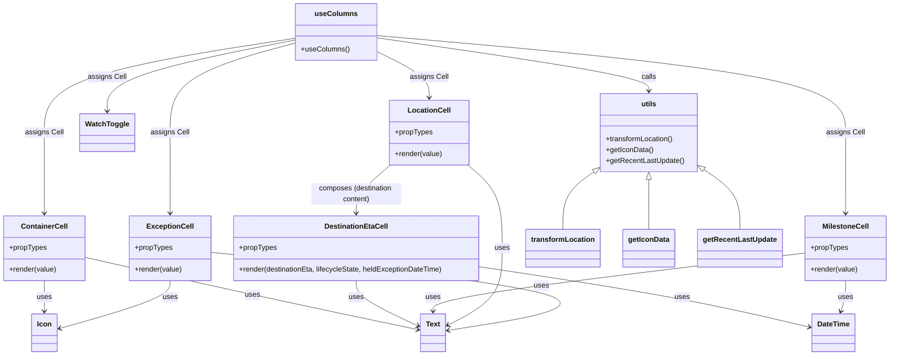

# Diagram: web/portal/src/pages/oceantracking/search/OceanTracking.Search.columns.js


> Auto-generated by Obscura crawlers

## Diagram 1



### SVG

<svg id="container" width="1947.9921875" xmlns="http://www.w3.org/2000/svg" class="classDiagram" height="790" viewBox="0 0 1947.9921875 790" role="graphics-document document" aria-roledescription="class"><style>#container{font-family:"trebuchet ms",verdana,arial,sans-serif;font-size:16px;fill:#333;}@keyframes edge-animation-frame{from{stroke-dashoffset:0;}}@keyframes dash{to{stroke-dashoffset:0;}}#container .edge-animation-slow{stroke-dasharray:9,5!important;stroke-dashoffset:900;animation:dash 50s linear infinite;stroke-linecap:round;}#container .edge-animation-fast{stroke-dasharray:9,5!important;stroke-dashoffset:900;animation:dash 20s linear infinite;stroke-linecap:round;}#container .error-icon{fill:#552222;}#container .error-text{fill:#552222;stroke:#552222;}#container .edge-thickness-normal{stroke-width:1px;}#container .edge-thickness-thick{stroke-width:3.5px;}#container .edge-pattern-solid{stroke-dasharray:0;}#container .edge-thickness-invisible{stroke-width:0;fill:none;}#container .edge-pattern-dashed{stroke-dasharray:3;}#container .edge-pattern-dotted{stroke-dasharray:2;}#container .marker{fill:#333333;stroke:#333333;}#container .marker.cross{stroke:#333333;}#container svg{font-family:"trebuchet ms",verdana,arial,sans-serif;font-size:16px;}#container p{margin:0;}#container g.classGroup text{fill:#9370DB;stroke:none;font-family:"trebuchet ms",verdana,arial,sans-serif;font-size:10px;}#container g.classGroup text .title{font-weight:bolder;}#container .nodeLabel,#container .edgeLabel{color:#131300;}#container .edgeLabel .label rect{fill:#ECECFF;}#container .label text{fill:#131300;}#container .labelBkg{background:#ECECFF;}#container .edgeLabel .label span{background:#ECECFF;}#container .classTitle{font-weight:bolder;}#container .node rect,#container .node circle,#container .node ellipse,#container .node polygon,#container .node path{fill:#ECECFF;stroke:#9370DB;stroke-width:1px;}#container .divider{stroke:#9370DB;stroke-width:1;}#container g.clickable{cursor:pointer;}#container g.classGroup rect{fill:#ECECFF;stroke:#9370DB;}#container g.classGroup line{stroke:#9370DB;stroke-width:1;}#container .classLabel .box{stroke:none;stroke-width:0;fill:#ECECFF;opacity:0.5;}#container .classLabel .label{fill:#9370DB;font-size:10px;}#container .relation{stroke:#333333;stroke-width:1;fill:none;}#container .dashed-line{stroke-dasharray:3;}#container .dotted-line{stroke-dasharray:1 2;}#container #compositionStart,#container .composition{fill:#333333!important;stroke:#333333!important;stroke-width:1;}#container #compositionEnd,#container .composition{fill:#333333!important;stroke:#333333!important;stroke-width:1;}#container #dependencyStart,#container .dependency{fill:#333333!important;stroke:#333333!important;stroke-width:1;}#container #dependencyStart,#container .dependency{fill:#333333!important;stroke:#333333!important;stroke-width:1;}#container #extensionStart,#container .extension{fill:transparent!important;stroke:#333333!important;stroke-width:1;}#container #extensionEnd,#container .extension{fill:transparent!important;stroke:#333333!important;stroke-width:1;}#container #aggregationStart,#container .aggregation{fill:transparent!important;stroke:#333333!important;stroke-width:1;}#container #aggregationEnd,#container .aggregation{fill:transparent!important;stroke:#333333!important;stroke-width:1;}#container #lollipopStart,#container .lollipop{fill:#ECECFF!important;stroke:#333333!important;stroke-width:1;}#container #lollipopEnd,#container .lollipop{fill:#ECECFF!important;stroke:#333333!important;stroke-width:1;}#container .edgeTerminals{font-size:11px;line-height:initial;}#container .classTitleText{text-anchor:middle;font-size:18px;fill:#333;}#container .label-icon{display:inline-block;height:1em;overflow:visible;vertical-align:-0.125em;}#container .node .label-icon path{fill:currentColor;stroke:revert;stroke-width:revert;}#container :root{--mermaid-font-family:"trebuchet ms",verdana,arial,sans-serif;}</style><g><defs><marker id="container_class-aggregationStart" class="marker aggregation class" refX="18" refY="7" markerWidth="190" markerHeight="240" orient="auto"><path d="M 18,7 L9,13 L1,7 L9,1 Z"></path></marker></defs><defs><marker id="container_class-aggregationEnd" class="marker aggregation class" refX="1" refY="7" markerWidth="20" markerHeight="28" orient="auto"><path d="M 18,7 L9,13 L1,7 L9,1 Z"></path></marker></defs><defs><marker id="container_class-extensionStart" class="marker extension class" refX="18" refY="7" markerWidth="190" markerHeight="240" orient="auto"><path d="M 1,7 L18,13 V 1 Z"></path></marker></defs><defs><marker id="container_class-extensionEnd" class="marker extension class" refX="1" refY="7" markerWidth="20" markerHeight="28" orient="auto"><path d="M 1,1 V 13 L18,7 Z"></path></marker></defs><defs><marker id="container_class-compositionStart" class="marker composition class" refX="18" refY="7" markerWidth="190" markerHeight="240" orient="auto"><path d="M 18,7 L9,13 L1,7 L9,1 Z"></path></marker></defs><defs><marker id="container_class-compositionEnd" class="marker composition class" refX="1" refY="7" markerWidth="20" markerHeight="28" orient="auto"><path d="M 18,7 L9,13 L1,7 L9,1 Z"></path></marker></defs><defs><marker id="container_class-dependencyStart" class="marker dependency class" refX="6" refY="7" markerWidth="190" markerHeight="240" orient="auto"><path d="M 5,7 L9,13 L1,7 L9,1 Z"></path></marker></defs><defs><marker id="container_class-dependencyEnd" class="marker dependency class" refX="13" refY="7" markerWidth="20" markerHeight="28" orient="auto"><path d="M 18,7 L9,13 L14,7 L9,1 Z"></path></marker></defs><defs><marker id="container_class-lollipopStart" class="marker lollipop class" refX="13" refY="7" markerWidth="190" markerHeight="240" orient="auto"><circle stroke="black" fill="transparent" cx="7" cy="7" r="6"></circle></marker></defs><defs><marker id="container_class-lollipopEnd" class="marker lollipop class" refX="1" refY="7" markerWidth="190" markerHeight="240" orient="auto"><circle stroke="black" fill="transparent" cx="7" cy="7" r="6"></circle></marker></defs><g class="root"><g class="clusters"></g><g class="edgePaths"><path d="M97.355,624L97.355,630.167C97.355,636.333,97.355,648.667,97.355,660C97.355,671.333,97.355,681.667,97.355,686.833L97.355,692" id="id_ContainerCell_Icon_1" class="edge-thickness-normal edge-pattern-solid relation" style=";;;" data-edge="true" data-et="edge" data-id="id_ContainerCell_Icon_1" data-points="W3sieCI6OTcuMzU1NDY4NzUsInkiOjYyNH0seyJ4Ijo5Ny4zNTU0Njg3NSwieSI6NjYxfSx7IngiOjk3LjM1NTQ2ODc1LCJ5Ijo2OTh9XQ==" marker-end="url(#container_class-dependencyEnd)"></path><path d="M186.711,572.393L251.42,587.161C316.13,601.928,445.548,631.464,567.681,658.24C689.813,685.015,804.66,709.031,862.083,721.038L919.506,733.046" id="id_ContainerCell_Text_2" class="edge-thickness-normal edge-pattern-solid relation" style=";;;" data-edge="true" data-et="edge" data-id="id_ContainerCell_Text_2" data-points="W3sieCI6MTg2LjcxMDkzNzUsInkiOjU3Mi4zOTI2MTk1MjE3OTAyfSx7IngiOjU3NC45NjY3OTY4NzUsInkiOjY2MX0seyJ4Ijo5MjUuMzc4OTA2MjUsInkiOjczNC4yNzQwMzA1MzI4NTE1fV0=" marker-end="url(#container_class-dependencyEnd)"></path><path d="M1055.82,593.76L1129.378,604.967C1202.936,616.173,1350.052,638.587,1469.346,660.847C1588.639,683.107,1680.111,705.215,1725.846,716.268L1771.582,727.322" id="id_DestinationEtaCell_DateTime_3" class="edge-thickness-normal edge-pattern-solid relation" style=";;;" data-edge="true" data-et="edge" data-id="id_DestinationEtaCell_DateTime_3" data-points="W3sieCI6MTA1NS44MjAzMTI1LCJ5Ijo1OTMuNzU5ODc1NTE1Mjc0fSx7IngiOjE0OTcuMTY3OTY4NzUsInkiOjY2MX0seyJ4IjoxNzc3LjQxNDA2MjUsInkiOjcyOC43MzE0MTQwOTQzMzY3fV0=" marker-end="url(#container_class-dependencyEnd)"></path><path d="M781.719,624L781.719,630.167C781.719,636.333,781.719,648.667,804.754,665.473C827.79,682.279,873.861,703.558,896.896,714.197L919.932,724.837" id="id_DestinationEtaCell_Text_4" class="edge-thickness-normal edge-pattern-solid relation" style=";;;" data-edge="true" data-et="edge" data-id="id_DestinationEtaCell_Text_4" data-points="W3sieCI6NzgxLjcxODc1LCJ5Ijo2MjR9LHsieCI6NzgxLjcxODc1LCJ5Ijo2NjF9LHsieCI6OTI1LjM3ODkwNjI1LCJ5Ijo3MjcuMzUyNjM4OTExMDkyM31d" marker-end="url(#container_class-dependencyEnd)"></path><path d="M1850.531,624L1850.531,630.167C1850.531,636.333,1850.531,648.667,1848.781,660.052C1847.031,671.437,1843.531,681.874,1841.781,687.093L1840.031,692.311" id="id_MilestoneCell_DateTime_5" class="edge-thickness-normal edge-pattern-solid relation" style=";;;" data-edge="true" data-et="edge" data-id="id_MilestoneCell_DateTime_5" data-points="W3sieCI6MTg1MC41MzEyNSwieSI6NjI0fSx7IngiOjE4NTAuNTMxMjUsInkiOjY2MX0seyJ4IjoxODM4LjEyMzUxNjYxMzkyNCwieSI6Njk4fV0=" marker-end="url(#container_class-dependencyEnd)"></path><path d="M1761.07,562.862L1626.352,579.218C1491.634,595.574,1222.198,628.287,1087.48,649.81C952.762,671.333,952.762,681.667,952.762,686.833L952.762,692" id="id_MilestoneCell_Text_6" class="edge-thickness-normal edge-pattern-solid relation" style=";;;" data-edge="true" data-et="edge" data-id="id_MilestoneCell_Text_6" data-points="W3sieCI6MTc2MS4wNzAzMTI1LCJ5Ijo1NjIuODYxNjMxOTA4OTQxfSx7IngiOjk1Mi43NjE3MTg3NSwieSI6NjYxfSx7IngiOjk1Mi43NjE3MTg3NSwieSI6Njk4fV0=" marker-end="url(#container_class-dependencyEnd)"></path><path d="M858.329,367L845.561,377.667C832.792,388.333,807.256,409.667,794.487,427.5C781.719,445.333,781.719,459.667,781.719,466.833L781.719,474" id="id_LocationCell_DestinationEtaCell_7" class="edge-thickness-normal edge-pattern-solid relation" style=";;;" data-edge="true" data-et="edge" data-id="id_LocationCell_DestinationEtaCell_7" data-points="W3sieCI6ODU4LjMyOTA0NDExNzY0NzEsInkiOjM2N30seyJ4Ijo3ODEuNzE4NzUsInkiOjQzMX0seyJ4Ijo3ODEuNzE4NzUsInkiOjQ4MH1d" marker-end="url(#container_class-dependencyEnd)"></path><path d="M1030.702,367L1043.471,377.667C1056.239,388.333,1081.776,409.667,1094.544,440.5C1107.313,471.333,1107.313,511.667,1107.313,550C1107.313,588.333,1107.313,624.667,1087.008,653.212C1066.704,681.757,1026.096,702.515,1005.791,712.893L985.487,723.272" id="id_LocationCell_Text_8" class="edge-thickness-normal edge-pattern-solid relation" style=";;;" data-edge="true" data-et="edge" data-id="id_LocationCell_Text_8" data-points="W3sieCI6MTAzMC43MDIyMDU4ODIzNTMsInkiOjM2N30seyJ4IjoxMTA3LjMxMjUsInkiOjQzMX0seyJ4IjoxMTA3LjMxMjUsInkiOjU1Mn0seyJ4IjoxMTA3LjMxMjUsInkiOjY2MX0seyJ4Ijo5ODAuMTQ0NTMxMjUsInkiOjcyNi4wMDMwMzI5ODM2OTc3fV0=" marker-end="url(#container_class-dependencyEnd)"></path><path d="M368.215,624L368.215,630.167C368.215,636.333,368.215,648.667,328.582,666.393C288.95,684.119,209.685,707.237,170.053,718.797L130.42,730.356" id="id_ExceptionCell_Icon_9" class="edge-thickness-normal edge-pattern-solid relation" style=";;;" data-edge="true" data-et="edge" data-id="id_ExceptionCell_Icon_9" data-points="W3sieCI6MzY4LjIxNDg0Mzc1LCJ5Ijo2MjR9LHsieCI6MzY4LjIxNDg0Mzc1LCJ5Ijo2NjF9LHsieCI6MTI0LjY2MDE1NjI1LCJ5Ijo3MzIuMDM2MTk4NDQyNDU3NX1d" marker-end="url(#container_class-dependencyEnd)"></path><path d="M457.617,561.057L622.045,577.714C786.473,594.371,1115.328,627.686,1203.403,656.617C1291.479,685.549,1138.774,710.097,1062.421,722.371L986.068,734.646" id="id_ExceptionCell_Text_10" class="edge-thickness-normal edge-pattern-solid relation" style=";;;" data-edge="true" data-et="edge" data-id="id_ExceptionCell_Text_10" data-points="W3sieCI6NDU3LjYxNzE4NzUsInkiOjU2MS4wNTY4MjAxNjIwNjMyfSx7IngiOjE0NDQuMTgzNTkzNzUsInkiOjY2MX0seyJ4Ijo5ODAuMTQ0NTMxMjUsInkiOjczNS41OTc5OTM3MDQ0OTI4fV0=" marker-end="url(#container_class-dependencyEnd)"></path><path d="M650.479,84.63L558.291,99.025C466.104,113.42,281.73,142.21,189.543,177.272C97.355,212.333,97.355,253.667,97.355,297C97.355,340.333,97.355,385.667,97.355,415.5C97.355,445.333,97.355,459.667,97.355,466.833L97.355,474" id="id_useColumns_ContainerCell_11" class="edge-thickness-normal edge-pattern-solid relation" style=";;;" data-edge="true" data-et="edge" data-id="id_useColumns_ContainerCell_11" data-points="W3sieCI6NjUwLjQ3ODUxNTYyNSwieSI6ODQuNjI5NjEyNDYwMzE0MzJ9LHsieCI6OTcuMzU1NDY4NzUsInkiOjE3MX0seyJ4Ijo5Ny4zNTU0Njg3NSwieSI6Mjk1fSx7IngiOjk3LjM1NTQ2ODc1LCJ5Ijo0MzF9LHsieCI6OTcuMzU1NDY4NzUsInkiOjQ4MH1d" marker-end="url(#container_class-dependencyEnd)"></path><path d="M825.049,78.844L995.963,94.203C1166.876,109.563,1508.704,140.281,1679.618,176.307C1850.531,212.333,1850.531,253.667,1850.531,297C1850.531,340.333,1850.531,385.667,1850.531,415.5C1850.531,445.333,1850.531,459.667,1850.531,466.833L1850.531,474" id="id_useColumns_MilestoneCell_12" class="edge-thickness-normal edge-pattern-solid relation" style=";;;" data-edge="true" data-et="edge" data-id="id_useColumns_MilestoneCell_12" data-points="W3sieCI6ODI1LjA0ODgyODEyNSwieSI6NzguODQzOTcwMTEyNTI1Nn0seyJ4IjoxODUwLjUzMTI1LCJ5IjoxNzF9LHsieCI6MTg1MC41MzEyNSwieSI6Mjk1fSx7IngiOjE4NTAuNTMxMjUsInkiOjQzMX0seyJ4IjoxODUwLjUzMTI1LCJ5Ijo0ODB9XQ==" marker-end="url(#container_class-dependencyEnd)"></path><path d="M825.049,113.217L844.96,122.848C864.871,132.478,904.693,151.739,924.604,169.036C944.516,186.333,944.516,201.667,944.516,209.333L944.516,217" id="id_useColumns_LocationCell_13" class="edge-thickness-normal edge-pattern-solid relation" style=";;;" data-edge="true" data-et="edge" data-id="id_useColumns_LocationCell_13" data-points="W3sieCI6ODI1LjA0ODgyODEyNSwieSI6MTEzLjIxNzMzMDkyNzU3MjF9LHsieCI6OTQ0LjUxNTYyNSwieSI6MTcxfSx7IngiOjk0NC41MTU2MjUsInkiOjIyM31d" marker-end="url(#container_class-dependencyEnd)"></path><path d="M650.479,94.619L603.435,107.349C556.391,120.08,462.303,145.54,415.259,178.937C368.215,212.333,368.215,253.667,368.215,297C368.215,340.333,368.215,385.667,368.215,415.5C368.215,445.333,368.215,459.667,368.215,466.833L368.215,474" id="id_useColumns_ExceptionCell_14" class="edge-thickness-normal edge-pattern-solid relation" style=";;;" data-edge="true" data-et="edge" data-id="id_useColumns_ExceptionCell_14" data-points="W3sieCI6NjUwLjQ3ODUxNTYyNSwieSI6OTQuNjE5MzgzODU1OTQ3NjZ9LHsieCI6MzY4LjIxNDg0Mzc1LCJ5IjoxNzF9LHsieCI6MzY4LjIxNDg0Mzc1LCJ5IjoyOTV9LHsieCI6MzY4LjIxNDg0Mzc1LCJ5Ijo0MzF9LHsieCI6MzY4LjIxNDg0Mzc1LCJ5Ijo0ODB9XQ==" marker-end="url(#container_class-dependencyEnd)"></path><path d="M650.479,88.285L580.863,102.071C511.247,115.857,372.016,143.428,302.401,169.881C232.785,196.333,232.785,221.667,232.785,234.333L232.785,247" id="id_useColumns_WatchToggle_15" class="edge-thickness-normal edge-pattern-solid relation" style=";;;" data-edge="true" data-et="edge" data-id="id_useColumns_WatchToggle_15" data-points="W3sieCI6NjUwLjQ3ODUxNTYyNSwieSI6ODguMjg0OTI0NzE0NDY0MTh9LHsieCI6MjMyLjc4NTE1NjI1LCJ5IjoxNzF9LHsieCI6MjMyLjc4NTE1NjI1LCJ5IjoyNTN9XQ==" marker-end="url(#container_class-dependencyEnd)"></path><path d="M825.049,83.719L924.874,98.266C1024.699,112.813,1224.35,141.906,1324.175,161.62C1424,181.333,1424,191.667,1424,196.833L1424,202" id="id_useColumns_utils_16" class="edge-thickness-normal edge-pattern-solid relation" style=";;;" data-edge="true" data-et="edge" data-id="id_useColumns_utils_16" data-points="W3sieCI6ODI1LjA0ODgyODEyNSwieSI6ODMuNzE5NDAxODU1MTE0Mzd9LHsieCI6MTQyNCwieSI6MTcxfSx7IngiOjE0MjQsInkiOjIwOH1d" marker-end="url(#container_class-dependencyEnd)"></path><path d="M1303.755,383.129L1292.868,391.107C1281.982,399.086,1260.21,415.043,1249.324,436.188C1238.438,457.333,1238.438,483.667,1238.438,496.833L1238.438,510" id="id_utils_transformLocation_17" class="edge-thickness-normal edge-pattern-solid relation" style=";;;" data-edge="true" data-et="edge" data-id="id_utils_transformLocation_17" data-points="W3sieCI6MTMxNy42Njc5Njg3NSwieSI6MzcyLjkzMTQ1ODQwMzUwMjg2fSx7IngiOjEyMzguNDM3NSwieSI6NDMxfSx7IngiOjEyMzguNDM3NSwieSI6NTEwfV0=" marker-start="url(#container_class-extensionStart)"></path><path d="M1424,399.25L1424,404.542C1424,409.833,1424,420.417,1424,438.875C1424,457.333,1424,483.667,1424,496.833L1424,510" id="id_utils_getIconData_18" class="edge-thickness-normal edge-pattern-solid relation" style=";;;" data-edge="true" data-et="edge" data-id="id_utils_getIconData_18" data-points="W3sieCI6MTQyNCwieSI6MzgyfSx7IngiOjE0MjQsInkiOjQzMX0seyJ4IjoxNDI0LCJ5Ijo1MTB9XQ==" marker-start="url(#container_class-extensionStart)"></path><path d="M1544.516,378.411L1557.18,387.176C1569.844,395.94,1595.172,413.47,1607.836,435.402C1620.5,457.333,1620.5,483.667,1620.5,496.833L1620.5,510" id="id_utils_getRecentLastUpdate_19" class="edge-thickness-normal edge-pattern-solid relation" style=";;;" data-edge="true" data-et="edge" data-id="id_utils_getRecentLastUpdate_19" data-points="W3sieCI6MTUzMC4zMzIwMzEyNSwieSI6MzY4LjU5MzY3MDQ4MzQ2MDV9LHsieCI6MTYyMC41LCJ5Ijo0MzF9LHsieCI6MTYyMC41LCJ5Ijo1MTB9XQ==" marker-start="url(#container_class-extensionStart)"></path></g><g class="edgeLabels"><g class="edgeLabel" transform="translate(97.35546875, 661)"><g class="label" data-id="id_ContainerCell_Icon_1" transform="translate(-16.4921875, -12)"><foreignObject width="32.984375" height="24"><div xmlns="http://www.w3.org/1999/xhtml" class="labelBkg" style="display: table-cell; white-space: nowrap; line-height: 1.5; max-width: 200px; text-align: center;"><span class="edgeLabel"><p>uses</p></span></div></foreignObject></g></g><g class="edgeLabel" transform="translate(555.34762, 656.52253)"><g class="label" data-id="id_ContainerCell_Text_2" transform="translate(-16.4921875, -12)"><foreignObject width="32.984375" height="24"><div xmlns="http://www.w3.org/1999/xhtml" class="labelBkg" style="display: table-cell; white-space: nowrap; line-height: 1.5; max-width: 200px; text-align: center;"><span class="edgeLabel"><p>uses</p></span></div></foreignObject></g></g><g class="edgeLabel" transform="translate(1497.16796875, 661)"><g class="label" data-id="id_DestinationEtaCell_DateTime_3" transform="translate(-16.4921875, -12)"><foreignObject width="32.984375" height="24"><div xmlns="http://www.w3.org/1999/xhtml" class="labelBkg" style="display: table-cell; white-space: nowrap; line-height: 1.5; max-width: 200px; text-align: center;"><span class="edgeLabel"><p>uses</p></span></div></foreignObject></g></g><g class="edgeLabel" transform="translate(781.71875, 661)"><g class="label" data-id="id_DestinationEtaCell_Text_4" transform="translate(-16.4921875, -12)"><foreignObject width="32.984375" height="24"><div xmlns="http://www.w3.org/1999/xhtml" class="labelBkg" style="display: table-cell; white-space: nowrap; line-height: 1.5; max-width: 200px; text-align: center;"><span class="edgeLabel"><p>uses</p></span></div></foreignObject></g></g><g class="edgeLabel" transform="translate(1850.53125, 661)"><g class="label" data-id="id_MilestoneCell_DateTime_5" transform="translate(-16.4921875, -12)"><foreignObject width="32.984375" height="24"><div xmlns="http://www.w3.org/1999/xhtml" class="labelBkg" style="display: table-cell; white-space: nowrap; line-height: 1.5; max-width: 200px; text-align: center;"><span class="edgeLabel"><p>uses</p></span></div></foreignObject></g></g><g class="edgeLabel" transform="translate(952.76171875, 661)"><g class="label" data-id="id_MilestoneCell_Text_6" transform="translate(-16.4921875, -12)"><foreignObject width="32.984375" height="24"><div xmlns="http://www.w3.org/1999/xhtml" class="labelBkg" style="display: table-cell; white-space: nowrap; line-height: 1.5; max-width: 200px; text-align: center;"><span class="edgeLabel"><p>uses</p></span></div></foreignObject></g></g><g class="edgeLabel" transform="translate(781.71875, 431)"><g class="label" data-id="id_LocationCell_DestinationEtaCell_7" transform="translate(-100, -24)"><foreignObject width="200" height="48"><div xmlns="http://www.w3.org/1999/xhtml" class="labelBkg" style="display: table; white-space: break-spaces; line-height: 1.5; max-width: 200px; text-align: center; width: 200px;"><span class="edgeLabel"><p>composes (destination content)</p></span></div></foreignObject></g></g><g class="edgeLabel" transform="translate(1107.3125, 552)"><g class="label" data-id="id_LocationCell_Text_8" transform="translate(-16.4921875, -12)"><foreignObject width="32.984375" height="24"><div xmlns="http://www.w3.org/1999/xhtml" class="labelBkg" style="display: table-cell; white-space: nowrap; line-height: 1.5; max-width: 200px; text-align: center;"><span class="edgeLabel"><p>uses</p></span></div></foreignObject></g></g><g class="edgeLabel" transform="translate(368.21484375, 661)"><g class="label" data-id="id_ExceptionCell_Icon_9" transform="translate(-16.4921875, -12)"><foreignObject width="32.984375" height="24"><div xmlns="http://www.w3.org/1999/xhtml" class="labelBkg" style="display: table-cell; white-space: nowrap; line-height: 1.5; max-width: 200px; text-align: center;"><span class="edgeLabel"><p>uses</p></span></div></foreignObject></g></g><g class="edgeLabel" transform="translate(1184.70222, 634.71348)"><g class="label" data-id="id_ExceptionCell_Text_10" transform="translate(-16.4921875, -12)"><foreignObject width="32.984375" height="24"><div xmlns="http://www.w3.org/1999/xhtml" class="labelBkg" style="display: table-cell; white-space: nowrap; line-height: 1.5; max-width: 200px; text-align: center;"><span class="edgeLabel"><p>uses</p></span></div></foreignObject></g></g><g class="edgeLabel" transform="translate(97.35546875, 295)"><g class="label" data-id="id_useColumns_ContainerCell_11" transform="translate(-41.9921875, -12)"><foreignObject width="83.984375" height="24"><div xmlns="http://www.w3.org/1999/xhtml" class="labelBkg" style="display: table-cell; white-space: nowrap; line-height: 1.5; max-width: 200px; text-align: center;"><span class="edgeLabel"><p>assigns Cell</p></span></div></foreignObject></g></g><g class="edgeLabel" transform="translate(1850.53125, 295)"><g class="label" data-id="id_useColumns_MilestoneCell_12" transform="translate(-41.9921875, -12)"><foreignObject width="83.984375" height="24"><div xmlns="http://www.w3.org/1999/xhtml" class="labelBkg" style="display: table-cell; white-space: nowrap; line-height: 1.5; max-width: 200px; text-align: center;"><span class="edgeLabel"><p>assigns Cell</p></span></div></foreignObject></g></g><g class="edgeLabel" transform="translate(944.515625, 171)"><g class="label" data-id="id_useColumns_LocationCell_13" transform="translate(-41.9921875, -12)"><foreignObject width="83.984375" height="24"><div xmlns="http://www.w3.org/1999/xhtml" class="labelBkg" style="display: table-cell; white-space: nowrap; line-height: 1.5; max-width: 200px; text-align: center;"><span class="edgeLabel"><p>assigns Cell</p></span></div></foreignObject></g></g><g class="edgeLabel" transform="translate(368.21484375, 295)"><g class="label" data-id="id_useColumns_ExceptionCell_14" transform="translate(-41.9921875, -12)"><foreignObject width="83.984375" height="24"><div xmlns="http://www.w3.org/1999/xhtml" class="labelBkg" style="display: table-cell; white-space: nowrap; line-height: 1.5; max-width: 200px; text-align: center;"><span class="edgeLabel"><p>assigns Cell</p></span></div></foreignObject></g></g><g class="edgeLabel" transform="translate(232.78515625, 171)"><g class="label" data-id="id_useColumns_WatchToggle_15" transform="translate(-41.9921875, -12)"><foreignObject width="83.984375" height="24"><div xmlns="http://www.w3.org/1999/xhtml" class="labelBkg" style="display: table-cell; white-space: nowrap; line-height: 1.5; max-width: 200px; text-align: center;"><span class="edgeLabel"><p>assigns Cell</p></span></div></foreignObject></g></g><g class="edgeLabel" transform="translate(1424, 171)"><g class="label" data-id="id_useColumns_utils_16" transform="translate(-16.4453125, -12)"><foreignObject width="32.890625" height="24"><div xmlns="http://www.w3.org/1999/xhtml" class="labelBkg" style="display: table-cell; white-space: nowrap; line-height: 1.5; max-width: 200px; text-align: center;"><span class="edgeLabel"><p>calls</p></span></div></foreignObject></g></g><g class="edgeLabel"><g class="label" data-id="id_utils_transformLocation_17" transform="translate(0, 0)"><foreignObject width="0" height="0"><div xmlns="http://www.w3.org/1999/xhtml" class="labelBkg" style="display: table-cell; white-space: nowrap; line-height: 1.5; max-width: 200px; text-align: center;"><span class="edgeLabel"></span></div></foreignObject></g></g><g class="edgeLabel"><g class="label" data-id="id_utils_getIconData_18" transform="translate(0, 0)"><foreignObject width="0" height="0"><div xmlns="http://www.w3.org/1999/xhtml" class="labelBkg" style="display: table-cell; white-space: nowrap; line-height: 1.5; max-width: 200px; text-align: center;"><span class="edgeLabel"></span></div></foreignObject></g></g><g class="edgeLabel"><g class="label" data-id="id_utils_getRecentLastUpdate_19" transform="translate(0, 0)"><foreignObject width="0" height="0"><div xmlns="http://www.w3.org/1999/xhtml" class="labelBkg" style="display: table-cell; white-space: nowrap; line-height: 1.5; max-width: 200px; text-align: center;"><span class="edgeLabel"></span></div></foreignObject></g></g></g><g class="nodes"><g class="node default" id="classId-ContainerCell-0" transform="translate(97.35546875, 552)"><g class="basic label-container"><path d="M-89.35546875 -72 L89.35546875 -72 L89.35546875 72 L-89.35546875 72" stroke="none" stroke-width="0" fill="#ECECFF" style=""></path><path d="M-89.35546875 -72 C-19.987053172105377 -72, 49.38136240578925 -72, 89.35546875 -72 M-89.35546875 -72 C-47.693573617875316 -72, -6.031678485750632 -72, 89.35546875 -72 M89.35546875 -72 C89.35546875 -18.387254820788577, 89.35546875 35.225490358422846, 89.35546875 72 M89.35546875 -72 C89.35546875 -19.317277283152194, 89.35546875 33.36544543369561, 89.35546875 72 M89.35546875 72 C21.179785474203527 72, -46.995897801592946 72, -89.35546875 72 M89.35546875 72 C52.6859531367087 72, 16.016437523417395 72, -89.35546875 72 M-89.35546875 72 C-89.35546875 20.42498825523237, -89.35546875 -31.150023489535258, -89.35546875 -72 M-89.35546875 72 C-89.35546875 34.756786478977, -89.35546875 -2.486427042046003, -89.35546875 -72" stroke="#9370DB" stroke-width="1.3" fill="none" stroke-dasharray="0 0" style=""></path></g><g class="annotation-group text" transform="translate(0, -48)"></g><g class="label-group text" transform="translate(-49.2109375, -48)"><g class="label" style="font-weight: bolder" transform="translate(0,-12)"><foreignObject width="98.421875" height="24"><div xmlns="http://www.w3.org/1999/xhtml" style="display: table-cell; white-space: nowrap; line-height: 1.5; max-width: 148px; text-align: center;"><span class="nodeLabel markdown-node-label" style=""><p>ContainerCell</p></span></div></foreignObject></g></g><g class="members-group text" transform="translate(-77.35546875, 0)"><g class="label" style="" transform="translate(0,-12)"><foreignObject width="83.234375" height="24"><div xmlns="http://www.w3.org/1999/xhtml" style="display: table-cell; white-space: nowrap; line-height: 1.5; max-width: 141px; text-align: center;"><span class="nodeLabel markdown-node-label" style=""><p>+propTypes</p></span></div></foreignObject></g></g><g class="methods-group text" transform="translate(-77.35546875, 48)"><g class="label" style="" transform="translate(0,-12)"><foreignObject width="105.5" height="24"><div xmlns="http://www.w3.org/1999/xhtml" style="display: table-cell; white-space: nowrap; line-height: 1.5; max-width: 163px; text-align: center;"><span class="nodeLabel markdown-node-label" style=""><p>+render(value)</p></span></div></foreignObject></g></g><g class="divider" style=""><path d="M-89.35546875 -24 C-45.37463841879782 -24, -1.3938080875956445 -24, 89.35546875 -24 M-89.35546875 -24 C-35.03320153087925 -24, 19.289065688241493 -24, 89.35546875 -24" stroke="#9370DB" stroke-width="1.3" fill="none" stroke-dasharray="0 0" style=""></path></g><g class="divider" style=""><path d="M-89.35546875 24 C-41.85263035100374 24, 5.650208047992521 24, 89.35546875 24 M-89.35546875 24 C-23.10695618946403 24, 43.14155637107194 24, 89.35546875 24" stroke="#9370DB" stroke-width="1.3" fill="none" stroke-dasharray="0 0" style=""></path></g></g><g class="node default" id="classId-DestinationEtaCell-1" transform="translate(781.71875, 552)"><g class="basic label-container"><path d="M-274.1015625 -72 L274.1015625 -72 L274.1015625 72 L-274.1015625 72" stroke="none" stroke-width="0" fill="#ECECFF" style=""></path><path d="M-274.1015625 -72 C-58.75068975794363 -72, 156.60018298411273 -72, 274.1015625 -72 M-274.1015625 -72 C-132.88678240377345 -72, 8.327997692453096 -72, 274.1015625 -72 M274.1015625 -72 C274.1015625 -15.051453508909482, 274.1015625 41.897092982181036, 274.1015625 72 M274.1015625 -72 C274.1015625 -31.902598807232145, 274.1015625 8.19480238553571, 274.1015625 72 M274.1015625 72 C103.7960399106694 72, -66.50948267866119 72, -274.1015625 72 M274.1015625 72 C78.44336772199912 72, -117.21482705600175 72, -274.1015625 72 M-274.1015625 72 C-274.1015625 15.058402379955709, -274.1015625 -41.88319524008858, -274.1015625 -72 M-274.1015625 72 C-274.1015625 26.8236214015456, -274.1015625 -18.352757196908797, -274.1015625 -72" stroke="#9370DB" stroke-width="1.3" fill="none" stroke-dasharray="0 0" style=""></path></g><g class="annotation-group text" transform="translate(0, -48)"></g><g class="label-group text" transform="translate(-67.515625, -48)"><g class="label" style="font-weight: bolder" transform="translate(0,-12)"><foreignObject width="135.03125" height="24"><div xmlns="http://www.w3.org/1999/xhtml" style="display: table-cell; white-space: nowrap; line-height: 1.5; max-width: 184px; text-align: center;"><span class="nodeLabel markdown-node-label" style=""><p>DestinationEtaCell</p></span></div></foreignObject></g></g><g class="members-group text" transform="translate(-262.1015625, 0)"><g class="label" style="" transform="translate(0,-12)"><foreignObject width="83.234375" height="24"><div xmlns="http://www.w3.org/1999/xhtml" style="display: table-cell; white-space: nowrap; line-height: 1.5; max-width: 141px; text-align: center;"><span class="nodeLabel markdown-node-label" style=""><p>+propTypes</p></span></div></foreignObject></g></g><g class="methods-group text" transform="translate(-262.1015625, 48)"><g class="label" style="" transform="translate(0,-12)"><foreignObject width="456.6875" height="24"><div xmlns="http://www.w3.org/1999/xhtml" style="display: table-cell; white-space: nowrap; line-height: 1.5; max-width: 514px; text-align: center;"><span class="nodeLabel markdown-node-label" style=""><p>+render(destinationEta, lifecycleState, heldExceptionDateTime)</p></span></div></foreignObject></g></g><g class="divider" style=""><path d="M-274.1015625 -24 C-56.46995822062067 -24, 161.16164605875866 -24, 274.1015625 -24 M-274.1015625 -24 C-159.33002495880453 -24, -44.558487417609086 -24, 274.1015625 -24" stroke="#9370DB" stroke-width="1.3" fill="none" stroke-dasharray="0 0" style=""></path></g><g class="divider" style=""><path d="M-274.1015625 24 C-59.127192930160675 24, 155.84717663967865 24, 274.1015625 24 M-274.1015625 24 C-109.66500812007945 24, 54.7715462598411 24, 274.1015625 24" stroke="#9370DB" stroke-width="1.3" fill="none" stroke-dasharray="0 0" style=""></path></g></g><g class="node default" id="classId-MilestoneCell-2" transform="translate(1850.53125, 552)"><g class="basic label-container"><path d="M-89.4609375 -72 L89.4609375 -72 L89.4609375 72 L-89.4609375 72" stroke="none" stroke-width="0" fill="#ECECFF" style=""></path><path d="M-89.4609375 -72 C-23.070066994815306 -72, 43.32080351036939 -72, 89.4609375 -72 M-89.4609375 -72 C-18.469123593526845 -72, 52.52269031294631 -72, 89.4609375 -72 M89.4609375 -72 C89.4609375 -27.011953998345824, 89.4609375 17.976092003308352, 89.4609375 72 M89.4609375 -72 C89.4609375 -14.835700288251779, 89.4609375 42.32859942349644, 89.4609375 72 M89.4609375 72 C48.65454355555186 72, 7.848149611103722 72, -89.4609375 72 M89.4609375 72 C46.83884651030536 72, 4.216755520610718 72, -89.4609375 72 M-89.4609375 72 C-89.4609375 35.72755237051749, -89.4609375 -0.5448952589650133, -89.4609375 -72 M-89.4609375 72 C-89.4609375 38.538323653808426, -89.4609375 5.076647307616852, -89.4609375 -72" stroke="#9370DB" stroke-width="1.3" fill="none" stroke-dasharray="0 0" style=""></path></g><g class="annotation-group text" transform="translate(0, -48)"></g><g class="label-group text" transform="translate(-49.421875, -48)"><g class="label" style="font-weight: bolder" transform="translate(0,-12)"><foreignObject width="98.84375" height="24"><div xmlns="http://www.w3.org/1999/xhtml" style="display: table-cell; white-space: nowrap; line-height: 1.5; max-width: 148px; text-align: center;"><span class="nodeLabel markdown-node-label" style=""><p>MilestoneCell</p></span></div></foreignObject></g></g><g class="members-group text" transform="translate(-77.4609375, 0)"><g class="label" style="" transform="translate(0,-12)"><foreignObject width="83.234375" height="24"><div xmlns="http://www.w3.org/1999/xhtml" style="display: table-cell; white-space: nowrap; line-height: 1.5; max-width: 141px; text-align: center;"><span class="nodeLabel markdown-node-label" style=""><p>+propTypes</p></span></div></foreignObject></g></g><g class="methods-group text" transform="translate(-77.4609375, 48)"><g class="label" style="" transform="translate(0,-12)"><foreignObject width="105.5" height="24"><div xmlns="http://www.w3.org/1999/xhtml" style="display: table-cell; white-space: nowrap; line-height: 1.5; max-width: 163px; text-align: center;"><span class="nodeLabel markdown-node-label" style=""><p>+render(value)</p></span></div></foreignObject></g></g><g class="divider" style=""><path d="M-89.4609375 -24 C-50.71546617689902 -24, -11.969994853798042 -24, 89.4609375 -24 M-89.4609375 -24 C-23.557529467800293 -24, 42.34587856439941 -24, 89.4609375 -24" stroke="#9370DB" stroke-width="1.3" fill="none" stroke-dasharray="0 0" style=""></path></g><g class="divider" style=""><path d="M-89.4609375 24 C-39.60273972403563 24, 10.255458051928741 24, 89.4609375 24 M-89.4609375 24 C-26.742773916613515 24, 35.97538966677297 24, 89.4609375 24" stroke="#9370DB" stroke-width="1.3" fill="none" stroke-dasharray="0 0" style=""></path></g></g><g class="node default" id="classId-LocationCell-3" transform="translate(944.515625, 295)"><g class="basic label-container"><path d="M-87.2265625 -72 L87.2265625 -72 L87.2265625 72 L-87.2265625 72" stroke="none" stroke-width="0" fill="#ECECFF" style=""></path><path d="M-87.2265625 -72 C-44.62159346230339 -72, -2.016624424606775 -72, 87.2265625 -72 M-87.2265625 -72 C-47.593895417750886 -72, -7.961228335501772 -72, 87.2265625 -72 M87.2265625 -72 C87.2265625 -31.23476359147967, 87.2265625 9.53047281704066, 87.2265625 72 M87.2265625 -72 C87.2265625 -42.16829401640214, 87.2265625 -12.33658803280428, 87.2265625 72 M87.2265625 72 C20.14037298923253 72, -46.94581652153494 72, -87.2265625 72 M87.2265625 72 C48.82151896992804 72, 10.416475439856086 72, -87.2265625 72 M-87.2265625 72 C-87.2265625 19.114783263489265, -87.2265625 -33.77043347302147, -87.2265625 -72 M-87.2265625 72 C-87.2265625 29.633791998362753, -87.2265625 -12.732416003274494, -87.2265625 -72" stroke="#9370DB" stroke-width="1.3" fill="none" stroke-dasharray="0 0" style=""></path></g><g class="annotation-group text" transform="translate(0, -48)"></g><g class="label-group text" transform="translate(-44.953125, -48)"><g class="label" style="font-weight: bolder" transform="translate(0,-12)"><foreignObject width="89.90625" height="24"><div xmlns="http://www.w3.org/1999/xhtml" style="display: table-cell; white-space: nowrap; line-height: 1.5; max-width: 139px; text-align: center;"><span class="nodeLabel markdown-node-label" style=""><p>LocationCell</p></span></div></foreignObject></g></g><g class="members-group text" transform="translate(-75.2265625, 0)"><g class="label" style="" transform="translate(0,-12)"><foreignObject width="83.234375" height="24"><div xmlns="http://www.w3.org/1999/xhtml" style="display: table-cell; white-space: nowrap; line-height: 1.5; max-width: 141px; text-align: center;"><span class="nodeLabel markdown-node-label" style=""><p>+propTypes</p></span></div></foreignObject></g></g><g class="methods-group text" transform="translate(-75.2265625, 48)"><g class="label" style="" transform="translate(0,-12)"><foreignObject width="105.5" height="24"><div xmlns="http://www.w3.org/1999/xhtml" style="display: table-cell; white-space: nowrap; line-height: 1.5; max-width: 163px; text-align: center;"><span class="nodeLabel markdown-node-label" style=""><p>+render(value)</p></span></div></foreignObject></g></g><g class="divider" style=""><path d="M-87.2265625 -24 C-29.543032310310124 -24, 28.14049787937975 -24, 87.2265625 -24 M-87.2265625 -24 C-31.441914359792577 -24, 24.342733780414846 -24, 87.2265625 -24" stroke="#9370DB" stroke-width="1.3" fill="none" stroke-dasharray="0 0" style=""></path></g><g class="divider" style=""><path d="M-87.2265625 24 C-47.158156749225896 24, -7.089750998451791 24, 87.2265625 24 M-87.2265625 24 C-26.20452852267698 24, 34.81750545464604 24, 87.2265625 24" stroke="#9370DB" stroke-width="1.3" fill="none" stroke-dasharray="0 0" style=""></path></g></g><g class="node default" id="classId-ExceptionCell-4" transform="translate(368.21484375, 552)"><g class="basic label-container"><path d="M-89.40234375 -72 L89.40234375 -72 L89.40234375 72 L-89.40234375 72" stroke="none" stroke-width="0" fill="#ECECFF" style=""></path><path d="M-89.40234375 -72 C-45.49614597097915 -72, -1.5899481919582996 -72, 89.40234375 -72 M-89.40234375 -72 C-48.061820338965326 -72, -6.721296927930652 -72, 89.40234375 -72 M89.40234375 -72 C89.40234375 -41.98341142660032, 89.40234375 -11.96682285320064, 89.40234375 72 M89.40234375 -72 C89.40234375 -39.835161543128734, 89.40234375 -7.6703230862574685, 89.40234375 72 M89.40234375 72 C25.068843159580766 72, -39.26465743083847 72, -89.40234375 72 M89.40234375 72 C26.734068343381033 72, -35.934207063237935 72, -89.40234375 72 M-89.40234375 72 C-89.40234375 17.49600359649677, -89.40234375 -37.00799280700646, -89.40234375 -72 M-89.40234375 72 C-89.40234375 23.368486909662025, -89.40234375 -25.26302618067595, -89.40234375 -72" stroke="#9370DB" stroke-width="1.3" fill="none" stroke-dasharray="0 0" style=""></path></g><g class="annotation-group text" transform="translate(0, -48)"></g><g class="label-group text" transform="translate(-49.3046875, -48)"><g class="label" style="font-weight: bolder" transform="translate(0,-12)"><foreignObject width="98.609375" height="24"><div xmlns="http://www.w3.org/1999/xhtml" style="display: table-cell; white-space: nowrap; line-height: 1.5; max-width: 148px; text-align: center;"><span class="nodeLabel markdown-node-label" style=""><p>ExceptionCell</p></span></div></foreignObject></g></g><g class="members-group text" transform="translate(-77.40234375, 0)"><g class="label" style="" transform="translate(0,-12)"><foreignObject width="83.234375" height="24"><div xmlns="http://www.w3.org/1999/xhtml" style="display: table-cell; white-space: nowrap; line-height: 1.5; max-width: 141px; text-align: center;"><span class="nodeLabel markdown-node-label" style=""><p>+propTypes</p></span></div></foreignObject></g></g><g class="methods-group text" transform="translate(-77.40234375, 48)"><g class="label" style="" transform="translate(0,-12)"><foreignObject width="105.5" height="24"><div xmlns="http://www.w3.org/1999/xhtml" style="display: table-cell; white-space: nowrap; line-height: 1.5; max-width: 163px; text-align: center;"><span class="nodeLabel markdown-node-label" style=""><p>+render(value)</p></span></div></foreignObject></g></g><g class="divider" style=""><path d="M-89.40234375 -24 C-44.694497909031384 -24, 0.013347931937232715 -24, 89.40234375 -24 M-89.40234375 -24 C-33.70314778975433 -24, 21.996048170491335 -24, 89.40234375 -24" stroke="#9370DB" stroke-width="1.3" fill="none" stroke-dasharray="0 0" style=""></path></g><g class="divider" style=""><path d="M-89.40234375 24 C-26.273245201905993 24, 36.85585334618801 24, 89.40234375 24 M-89.40234375 24 C-37.720076795621786 24, 13.962190158756428 24, 89.40234375 24" stroke="#9370DB" stroke-width="1.3" fill="none" stroke-dasharray="0 0" style=""></path></g></g><g class="node default" id="classId-useColumns-5" transform="translate(737.763671875, 71)"><g class="basic label-container"><path d="M-87.28515625 -63 L87.28515625 -63 L87.28515625 63 L-87.28515625 63" stroke="none" stroke-width="0" fill="#ECECFF" style=""></path><path d="M-87.28515625 -63 C-19.72294871052914 -63, 47.83925882894172 -63, 87.28515625 -63 M-87.28515625 -63 C-24.517770866404348 -63, 38.249614517191304 -63, 87.28515625 -63 M87.28515625 -63 C87.28515625 -12.977921676406417, 87.28515625 37.044156647187165, 87.28515625 63 M87.28515625 -63 C87.28515625 -21.769777255266497, 87.28515625 19.460445489467006, 87.28515625 63 M87.28515625 63 C44.864875576723364 63, 2.4445949034467276 63, -87.28515625 63 M87.28515625 63 C36.581537728884484 63, -14.122080792231031 63, -87.28515625 63 M-87.28515625 63 C-87.28515625 13.947944325324379, -87.28515625 -35.10411134935124, -87.28515625 -63 M-87.28515625 63 C-87.28515625 21.010759998717006, -87.28515625 -20.978480002565988, -87.28515625 -63" stroke="#9370DB" stroke-width="1.3" fill="none" stroke-dasharray="0 0" style=""></path></g><g class="annotation-group text" transform="translate(0, -39)"></g><g class="label-group text" transform="translate(-44.1640625, -39)"><g class="label" style="font-weight: bolder" transform="translate(0,-12)"><foreignObject width="88.328125" height="24"><div xmlns="http://www.w3.org/1999/xhtml" style="display: table-cell; white-space: nowrap; line-height: 1.5; max-width: 138px; text-align: center;"><span class="nodeLabel markdown-node-label" style=""><p>useColumns</p></span></div></foreignObject></g></g><g class="members-group text" transform="translate(-75.28515625, 9)"></g><g class="methods-group text" transform="translate(-75.28515625, 39)"><g class="label" style="" transform="translate(0,-12)"><foreignObject width="106.40625" height="24"><div xmlns="http://www.w3.org/1999/xhtml" style="display: table-cell; white-space: nowrap; line-height: 1.5; max-width: 164px; text-align: center;"><span class="nodeLabel markdown-node-label" style=""><p>+useColumns()</p></span></div></foreignObject></g></g><g class="divider" style=""><path d="M-87.28515625 -15 C-24.720588115181194 -15, 37.84398001963761 -15, 87.28515625 -15 M-87.28515625 -15 C-19.34195919043941 -15, 48.60123786912118 -15, 87.28515625 -15" stroke="#9370DB" stroke-width="1.3" fill="none" stroke-dasharray="0 0" style=""></path></g><g class="divider" style=""><path d="M-87.28515625 9 C-20.8405485644887 9, 45.6040591210226 9, 87.28515625 9 M-87.28515625 9 C-17.521889358139944 9, 52.24137753372011 9, 87.28515625 9" stroke="#9370DB" stroke-width="1.3" fill="none" stroke-dasharray="0 0" style=""></path></g></g><g class="node default" id="classId-WatchToggle-6" transform="translate(232.78515625, 295)"><g class="basic label-container"><path d="M-58.4375 -42 L58.4375 -42 L58.4375 42 L-58.4375 42" stroke="none" stroke-width="0" fill="#ECECFF" style=""></path><path d="M-58.4375 -42 C-12.918680079737015 -42, 32.60013984052597 -42, 58.4375 -42 M-58.4375 -42 C-12.250618904948404 -42, 33.93626219010319 -42, 58.4375 -42 M58.4375 -42 C58.4375 -9.416866717457083, 58.4375 23.166266565085834, 58.4375 42 M58.4375 -42 C58.4375 -24.63540625297575, 58.4375 -7.270812505951497, 58.4375 42 M58.4375 42 C27.90861155275242 42, -2.620276894495163 42, -58.4375 42 M58.4375 42 C13.656291687759719 42, -31.124916624480562 42, -58.4375 42 M-58.4375 42 C-58.4375 23.366890320693553, -58.4375 4.733780641387106, -58.4375 -42 M-58.4375 42 C-58.4375 13.045711125342766, -58.4375 -15.908577749314468, -58.4375 -42" stroke="#9370DB" stroke-width="1.3" fill="none" stroke-dasharray="0 0" style=""></path></g><g class="annotation-group text" transform="translate(0, -18)"></g><g class="label-group text" transform="translate(-46.4375, -18)"><g class="label" style="font-weight: bolder" transform="translate(0,-12)"><foreignObject width="92.875" height="24"><div xmlns="http://www.w3.org/1999/xhtml" style="display: table-cell; white-space: nowrap; line-height: 1.5; max-width: 141px; text-align: center;"><span class="nodeLabel markdown-node-label" style=""><p>WatchToggle</p></span></div></foreignObject></g></g><g class="members-group text" transform="translate(-46.4375, 30)"></g><g class="methods-group text" transform="translate(-46.4375, 60)"></g><g class="divider" style=""><path d="M-58.4375 6 C-25.363241095217866 6, 7.711017809564268 6, 58.4375 6 M-58.4375 6 C-31.73584815183663 6, -5.034196303673262 6, 58.4375 6" stroke="#9370DB" stroke-width="1.3" fill="none" stroke-dasharray="0 0" style=""></path></g><g class="divider" style=""><path d="M-58.4375 24 C-12.562344914157713 24, 33.312810171684575 24, 58.4375 24 M-58.4375 24 C-21.006394405892785 24, 16.42471118821443 24, 58.4375 24" stroke="#9370DB" stroke-width="1.3" fill="none" stroke-dasharray="0 0" style=""></path></g></g><g class="node default" id="classId-Icon-7" transform="translate(97.35546875, 740)"><g class="basic label-container"><path d="M-27.3046875 -42 L27.3046875 -42 L27.3046875 42 L-27.3046875 42" stroke="none" stroke-width="0" fill="#ECECFF" style=""></path><path d="M-27.3046875 -42 C-14.102159529007945 -42, -0.8996315580158907 -42, 27.3046875 -42 M-27.3046875 -42 C-13.220290912708398 -42, 0.8641056745832039 -42, 27.3046875 -42 M27.3046875 -42 C27.3046875 -18.338030271242484, 27.3046875 5.323939457515031, 27.3046875 42 M27.3046875 -42 C27.3046875 -12.788815677947483, 27.3046875 16.422368644105035, 27.3046875 42 M27.3046875 42 C6.568588317857859 42, -14.167510864284282 42, -27.3046875 42 M27.3046875 42 C13.715279908077964 42, 0.12587231615592742 42, -27.3046875 42 M-27.3046875 42 C-27.3046875 9.97648075976091, -27.3046875 -22.04703848047818, -27.3046875 -42 M-27.3046875 42 C-27.3046875 12.712923779708007, -27.3046875 -16.574152440583987, -27.3046875 -42" stroke="#9370DB" stroke-width="1.3" fill="none" stroke-dasharray="0 0" style=""></path></g><g class="annotation-group text" transform="translate(0, -18)"></g><g class="label-group text" transform="translate(-15.3046875, -18)"><g class="label" style="font-weight: bolder" transform="translate(0,-12)"><foreignObject width="30.609375" height="24"><div xmlns="http://www.w3.org/1999/xhtml" style="display: table-cell; white-space: nowrap; line-height: 1.5; max-width: 81px; text-align: center;"><span class="nodeLabel markdown-node-label" style=""><p>Icon</p></span></div></foreignObject></g></g><g class="members-group text" transform="translate(-15.3046875, 30)"></g><g class="methods-group text" transform="translate(-15.3046875, 60)"></g><g class="divider" style=""><path d="M-27.3046875 6 C-9.373359888322469 6, 8.557967723355063 6, 27.3046875 6 M-27.3046875 6 C-7.885419540784078 6, 11.533848418431845 6, 27.3046875 6" stroke="#9370DB" stroke-width="1.3" fill="none" stroke-dasharray="0 0" style=""></path></g><g class="divider" style=""><path d="M-27.3046875 24 C-11.494704736989531 24, 4.315278026020938 24, 27.3046875 24 M-27.3046875 24 C-11.572419185186758 24, 4.159849129626483 24, 27.3046875 24" stroke="#9370DB" stroke-width="1.3" fill="none" stroke-dasharray="0 0" style=""></path></g></g><g class="node default" id="classId-Text-8" transform="translate(952.76171875, 740)"><g class="basic label-container"><path d="M-27.3828125 -42 L27.3828125 -42 L27.3828125 42 L-27.3828125 42" stroke="none" stroke-width="0" fill="#ECECFF" style=""></path><path d="M-27.3828125 -42 C-11.631632149676387 -42, 4.119548200647227 -42, 27.3828125 -42 M-27.3828125 -42 C-9.708429864929116 -42, 7.965952770141769 -42, 27.3828125 -42 M27.3828125 -42 C27.3828125 -13.341642476790497, 27.3828125 15.316715046419006, 27.3828125 42 M27.3828125 -42 C27.3828125 -9.176395309185274, 27.3828125 23.64720938162945, 27.3828125 42 M27.3828125 42 C15.659675421584176 42, 3.936538343168351 42, -27.3828125 42 M27.3828125 42 C8.395693749218424 42, -10.591425001563152 42, -27.3828125 42 M-27.3828125 42 C-27.3828125 21.94472046571015, -27.3828125 1.8894409314203031, -27.3828125 -42 M-27.3828125 42 C-27.3828125 10.233506252839778, -27.3828125 -21.532987494320444, -27.3828125 -42" stroke="#9370DB" stroke-width="1.3" fill="none" stroke-dasharray="0 0" style=""></path></g><g class="annotation-group text" transform="translate(0, -18)"></g><g class="label-group text" transform="translate(-15.3828125, -18)"><g class="label" style="font-weight: bolder" transform="translate(0,-12)"><foreignObject width="30.765625" height="24"><div xmlns="http://www.w3.org/1999/xhtml" style="display: table-cell; white-space: nowrap; line-height: 1.5; max-width: 80px; text-align: center;"><span class="nodeLabel markdown-node-label" style=""><p>Text</p></span></div></foreignObject></g></g><g class="members-group text" transform="translate(-15.3828125, 30)"></g><g class="methods-group text" transform="translate(-15.3828125, 60)"></g><g class="divider" style=""><path d="M-27.3828125 6 C-6.0269408665133 6, 15.3289307669734 6, 27.3828125 6 M-27.3828125 6 C-7.120720616488864 6, 13.141371267022272 6, 27.3828125 6" stroke="#9370DB" stroke-width="1.3" fill="none" stroke-dasharray="0 0" style=""></path></g><g class="divider" style=""><path d="M-27.3828125 24 C-7.729264816068575 24, 11.92428286786285 24, 27.3828125 24 M-27.3828125 24 C-12.418533322997947 24, 2.5457458540041067 24, 27.3828125 24" stroke="#9370DB" stroke-width="1.3" fill="none" stroke-dasharray="0 0" style=""></path></g></g><g class="node default" id="classId-DateTime-9" transform="translate(1824.0390625, 740)"><g class="basic label-container"><path d="M-46.625 -42 L46.625 -42 L46.625 42 L-46.625 42" stroke="none" stroke-width="0" fill="#ECECFF" style=""></path><path d="M-46.625 -42 C-27.257566995321355 -42, -7.89013399064271 -42, 46.625 -42 M-46.625 -42 C-10.054737501448813 -42, 26.515524997102375 -42, 46.625 -42 M46.625 -42 C46.625 -23.705900371913202, 46.625 -5.411800743826404, 46.625 42 M46.625 -42 C46.625 -11.836294963276636, 46.625 18.32741007344673, 46.625 42 M46.625 42 C22.462896309364 42, -1.6992073812719966 42, -46.625 42 M46.625 42 C24.10429341210107 42, 1.5835868242021434 42, -46.625 42 M-46.625 42 C-46.625 21.034777335055946, -46.625 0.06955467011189143, -46.625 -42 M-46.625 42 C-46.625 11.011242107467872, -46.625 -19.977515785064256, -46.625 -42" stroke="#9370DB" stroke-width="1.3" fill="none" stroke-dasharray="0 0" style=""></path></g><g class="annotation-group text" transform="translate(0, -18)"></g><g class="label-group text" transform="translate(-34.625, -18)"><g class="label" style="font-weight: bolder" transform="translate(0,-12)"><foreignObject width="69.25" height="24"><div xmlns="http://www.w3.org/1999/xhtml" style="display: table-cell; white-space: nowrap; line-height: 1.5; max-width: 118px; text-align: center;"><span class="nodeLabel markdown-node-label" style=""><p>DateTime</p></span></div></foreignObject></g></g><g class="members-group text" transform="translate(-34.625, 30)"></g><g class="methods-group text" transform="translate(-34.625, 60)"></g><g class="divider" style=""><path d="M-46.625 6 C-26.16320381153933 6, -5.701407623078659 6, 46.625 6 M-46.625 6 C-11.578782506954447 6, 23.467434986091106 6, 46.625 6" stroke="#9370DB" stroke-width="1.3" fill="none" stroke-dasharray="0 0" style=""></path></g><g class="divider" style=""><path d="M-46.625 24 C-15.079205743680003 24, 16.466588512639994 24, 46.625 24 M-46.625 24 C-11.98087646169838 24, 22.66324707660324 24, 46.625 24" stroke="#9370DB" stroke-width="1.3" fill="none" stroke-dasharray="0 0" style=""></path></g></g><g class="node default" id="classId-utils-10" transform="translate(1424, 295)"><g class="basic label-container"><path d="M-106.33203125 -87 L106.33203125 -87 L106.33203125 87 L-106.33203125 87" stroke="none" stroke-width="0" fill="#ECECFF" style=""></path><path d="M-106.33203125 -87 C-22.955465536052614 -87, 60.42110017789477 -87, 106.33203125 -87 M-106.33203125 -87 C-43.7653054456105 -87, 18.801420358778998 -87, 106.33203125 -87 M106.33203125 -87 C106.33203125 -30.947760434545472, 106.33203125 25.104479130909056, 106.33203125 87 M106.33203125 -87 C106.33203125 -21.453147127939232, 106.33203125 44.093705744121536, 106.33203125 87 M106.33203125 87 C31.223342087542335 87, -43.88534707491533 87, -106.33203125 87 M106.33203125 87 C57.60001943466975 87, 8.868007619339494 87, -106.33203125 87 M-106.33203125 87 C-106.33203125 33.25400351870951, -106.33203125 -20.49199296258098, -106.33203125 -87 M-106.33203125 87 C-106.33203125 29.70642488971916, -106.33203125 -27.587150220561682, -106.33203125 -87" stroke="#9370DB" stroke-width="1.3" fill="none" stroke-dasharray="0 0" style=""></path></g><g class="annotation-group text" transform="translate(0, -63)"></g><g class="label-group text" transform="translate(-16.1640625, -63)"><g class="label" style="font-weight: bolder" transform="translate(0,-12)"><foreignObject width="32.328125" height="24"><div xmlns="http://www.w3.org/1999/xhtml" style="display: table-cell; white-space: nowrap; line-height: 1.5; max-width: 82px; text-align: center;"><span class="nodeLabel markdown-node-label" style=""><p>utils</p></span></div></foreignObject></g></g><g class="members-group text" transform="translate(-94.33203125, -15)"></g><g class="methods-group text" transform="translate(-94.33203125, 15)"><g class="label" style="" transform="translate(0,-12)"><foreignObject width="151.765625" height="24"><div xmlns="http://www.w3.org/1999/xhtml" style="display: table-cell; white-space: nowrap; line-height: 1.5; max-width: 209px; text-align: center;"><span class="nodeLabel markdown-node-label" style=""><p>+transformLocation()</p></span></div></foreignObject></g><g class="label" style="" transform="translate(0,12)"><foreignObject width="104.90625" height="24"><div xmlns="http://www.w3.org/1999/xhtml" style="display: table-cell; white-space: nowrap; line-height: 1.5; max-width: 162px; text-align: center;"><span class="nodeLabel markdown-node-label" style=""><p>+getIconData()</p></span></div></foreignObject></g><g class="label" style="" transform="translate(0,36)"><foreignObject width="172.5" height="24"><div xmlns="http://www.w3.org/1999/xhtml" style="display: table-cell; white-space: nowrap; line-height: 1.5; max-width: 230px; text-align: center;"><span class="nodeLabel markdown-node-label" style=""><p>+getRecentLastUpdate()</p></span></div></foreignObject></g></g><g class="divider" style=""><path d="M-106.33203125 -39 C-59.77663874666238 -39, -13.221246243324757 -39, 106.33203125 -39 M-106.33203125 -39 C-34.93421125154572 -39, 36.46360874690856 -39, 106.33203125 -39" stroke="#9370DB" stroke-width="1.3" fill="none" stroke-dasharray="0 0" style=""></path></g><g class="divider" style=""><path d="M-106.33203125 -15 C-24.30971485712415 -15, 57.7126015357517 -15, 106.33203125 -15 M-106.33203125 -15 C-58.59927170451075 -15, -10.866512159021497 -15, 106.33203125 -15" stroke="#9370DB" stroke-width="1.3" fill="none" stroke-dasharray="0 0" style=""></path></g></g><g class="node default" id="classId-transformLocation-11" transform="translate(1238.4375, 552)"><g class="basic label-container"><path d="M-79.6328125 -42 L79.6328125 -42 L79.6328125 42 L-79.6328125 42" stroke="none" stroke-width="0" fill="#ECECFF" style=""></path><path d="M-79.6328125 -42 C-25.047204050142128 -42, 29.538404399715745 -42, 79.6328125 -42 M-79.6328125 -42 C-42.73105304418947 -42, -5.829293588378945 -42, 79.6328125 -42 M79.6328125 -42 C79.6328125 -23.313634977179866, 79.6328125 -4.627269954359733, 79.6328125 42 M79.6328125 -42 C79.6328125 -15.07477017806934, 79.6328125 11.85045964386132, 79.6328125 42 M79.6328125 42 C28.04856763929736 42, -23.53567722140528 42, -79.6328125 42 M79.6328125 42 C45.42423934175639 42, 11.21566618351278 42, -79.6328125 42 M-79.6328125 42 C-79.6328125 11.089128959232763, -79.6328125 -19.821742081534474, -79.6328125 -42 M-79.6328125 42 C-79.6328125 18.57636614285811, -79.6328125 -4.847267714283781, -79.6328125 -42" stroke="#9370DB" stroke-width="1.3" fill="none" stroke-dasharray="0 0" style=""></path></g><g class="annotation-group text" transform="translate(0, -18)"></g><g class="label-group text" transform="translate(-67.6328125, -18)"><g class="label" style="font-weight: bolder" transform="translate(0,-12)"><foreignObject width="135.265625" height="24"><div xmlns="http://www.w3.org/1999/xhtml" style="display: table-cell; white-space: nowrap; line-height: 1.5; max-width: 184px; text-align: center;"><span class="nodeLabel markdown-node-label" style=""><p>transformLocation</p></span></div></foreignObject></g></g><g class="members-group text" transform="translate(-67.6328125, 30)"></g><g class="methods-group text" transform="translate(-67.6328125, 60)"></g><g class="divider" style=""><path d="M-79.6328125 6 C-29.296883167331444 6, 21.039046165337112 6, 79.6328125 6 M-79.6328125 6 C-18.88926238968726 6, 41.85428772062548 6, 79.6328125 6" stroke="#9370DB" stroke-width="1.3" fill="none" stroke-dasharray="0 0" style=""></path></g><g class="divider" style=""><path d="M-79.6328125 24 C-25.485721975900823 24, 28.661368548198354 24, 79.6328125 24 M-79.6328125 24 C-34.18824443363051 24, 11.256323632738983 24, 79.6328125 24" stroke="#9370DB" stroke-width="1.3" fill="none" stroke-dasharray="0 0" style=""></path></g></g><g class="node default" id="classId-getIconData-12" transform="translate(1424, 552)"><g class="basic label-container"><path d="M-55.9296875 -42 L55.9296875 -42 L55.9296875 42 L-55.9296875 42" stroke="none" stroke-width="0" fill="#ECECFF" style=""></path><path d="M-55.9296875 -42 C-11.90716845845504 -42, 32.11535058308992 -42, 55.9296875 -42 M-55.9296875 -42 C-33.434353608233835 -42, -10.939019716467662 -42, 55.9296875 -42 M55.9296875 -42 C55.9296875 -21.127188601771266, 55.9296875 -0.254377203542532, 55.9296875 42 M55.9296875 -42 C55.9296875 -17.17833620763446, 55.9296875 7.643327584731082, 55.9296875 42 M55.9296875 42 C18.810504066645727 42, -18.308679366708546 42, -55.9296875 42 M55.9296875 42 C11.364292089542971 42, -33.20110332091406 42, -55.9296875 42 M-55.9296875 42 C-55.9296875 15.185512278802172, -55.9296875 -11.628975442395657, -55.9296875 -42 M-55.9296875 42 C-55.9296875 10.471603658976097, -55.9296875 -21.056792682047806, -55.9296875 -42" stroke="#9370DB" stroke-width="1.3" fill="none" stroke-dasharray="0 0" style=""></path></g><g class="annotation-group text" transform="translate(0, -18)"></g><g class="label-group text" transform="translate(-43.9296875, -18)"><g class="label" style="font-weight: bolder" transform="translate(0,-12)"><foreignObject width="87.859375" height="24"><div xmlns="http://www.w3.org/1999/xhtml" style="display: table-cell; white-space: nowrap; line-height: 1.5; max-width: 137px; text-align: center;"><span class="nodeLabel markdown-node-label" style=""><p>getIconData</p></span></div></foreignObject></g></g><g class="members-group text" transform="translate(-43.9296875, 30)"></g><g class="methods-group text" transform="translate(-43.9296875, 60)"></g><g class="divider" style=""><path d="M-55.9296875 6 C-20.596927837029085 6, 14.73583182594183 6, 55.9296875 6 M-55.9296875 6 C-13.531996764287669 6, 28.865693971424662 6, 55.9296875 6" stroke="#9370DB" stroke-width="1.3" fill="none" stroke-dasharray="0 0" style=""></path></g><g class="divider" style=""><path d="M-55.9296875 24 C-33.1820537235094 24, -10.434419947018803 24, 55.9296875 24 M-55.9296875 24 C-25.6390126950274 24, 4.6516621099452 24, 55.9296875 24" stroke="#9370DB" stroke-width="1.3" fill="none" stroke-dasharray="0 0" style=""></path></g></g><g class="node default" id="classId-getRecentLastUpdate-13" transform="translate(1620.5, 552)"><g class="basic label-container"><path d="M-90.5703125 -42 L90.5703125 -42 L90.5703125 42 L-90.5703125 42" stroke="none" stroke-width="0" fill="#ECECFF" style=""></path><path d="M-90.5703125 -42 C-30.681250270624915 -42, 29.20781195875017 -42, 90.5703125 -42 M-90.5703125 -42 C-28.42241019298924 -42, 33.72549211402152 -42, 90.5703125 -42 M90.5703125 -42 C90.5703125 -18.283379020846887, 90.5703125 5.433241958306226, 90.5703125 42 M90.5703125 -42 C90.5703125 -12.743954004395345, 90.5703125 16.51209199120931, 90.5703125 42 M90.5703125 42 C27.444640831187982 42, -35.681030837624036 42, -90.5703125 42 M90.5703125 42 C50.11891744150757 42, 9.66752238301514 42, -90.5703125 42 M-90.5703125 42 C-90.5703125 13.696936386867336, -90.5703125 -14.606127226265329, -90.5703125 -42 M-90.5703125 42 C-90.5703125 24.026417721319035, -90.5703125 6.05283544263807, -90.5703125 -42" stroke="#9370DB" stroke-width="1.3" fill="none" stroke-dasharray="0 0" style=""></path></g><g class="annotation-group text" transform="translate(0, -18)"></g><g class="label-group text" transform="translate(-78.5703125, -18)"><g class="label" style="font-weight: bolder" transform="translate(0,-12)"><foreignObject width="157.140625" height="24"><div xmlns="http://www.w3.org/1999/xhtml" style="display: table-cell; white-space: nowrap; line-height: 1.5; max-width: 204px; text-align: center;"><span class="nodeLabel markdown-node-label" style=""><p>getRecentLastUpdate</p></span></div></foreignObject></g></g><g class="members-group text" transform="translate(-78.5703125, 30)"></g><g class="methods-group text" transform="translate(-78.5703125, 60)"></g><g class="divider" style=""><path d="M-90.5703125 6 C-27.1772314806991 6, 36.2158495386018 6, 90.5703125 6 M-90.5703125 6 C-45.451799480081625 6, -0.3332864601632508 6, 90.5703125 6" stroke="#9370DB" stroke-width="1.3" fill="none" stroke-dasharray="0 0" style=""></path></g><g class="divider" style=""><path d="M-90.5703125 24 C-32.18478258757073 24, 26.20074732485854 24, 90.5703125 24 M-90.5703125 24 C-37.953582267863894 24, 14.663147964272213 24, 90.5703125 24" stroke="#9370DB" stroke-width="1.3" fill="none" stroke-dasharray="0 0" style=""></path></g></g></g></g></g></svg>

## Diagram 2

```mermaid
flowchart TD
    subgraph RowData
        R[Row object d]
    end
    R --> A[accessor: container]
    R --> B[accessor: lastMilestone]
    R --> C[accessor: origin]
    R --> D[accessor: destination]
    R --> E[accessor: packageExceptions]
    A --> ContainerCellComp[ContainerCell Component]
    B --> MilestoneCellComp[MilestoneCell Component]
    C --> LocationCellOrigin[LocationCell(type=origin)]
    D --> LocationCellDestination[LocationCell(type=destination)]
    E --> ExceptionCellComp[ExceptionCell Component]
    ContainerCellComp --> IconClick[handleCopy/getIcon/getColor]
    LocationCellDestination --> DestinationEtaCellComp[DestinationEtaCell]
    DestinationEtaCellComp --> DateTimeRender[DateTime / ETA logic]
    MilestoneCellComp --> DateTimeRender2[DateTime / Event Time]
    ExceptionCellComp --> IconRender[Icon per exception]
    WatchToggleComp[WatchToggle Cell] --> Dispatch[dispatch setWatchAction]
    subgraph Columns
        Cols[useColumns -> column definitions]
        Cols --> ContainerCellComp
        Cols --> MilestoneCellComp
        Cols --> LocationCellOrigin
        Cols --> LocationCellDestination
        Cols --> ExceptionCellComp
        Cols --> WatchToggleComp
    end
    Dispatch --> SearchEntities[OceanTrackingSearchBarState.searchEntities]
```

> SVG rendering failed for this diagram.
