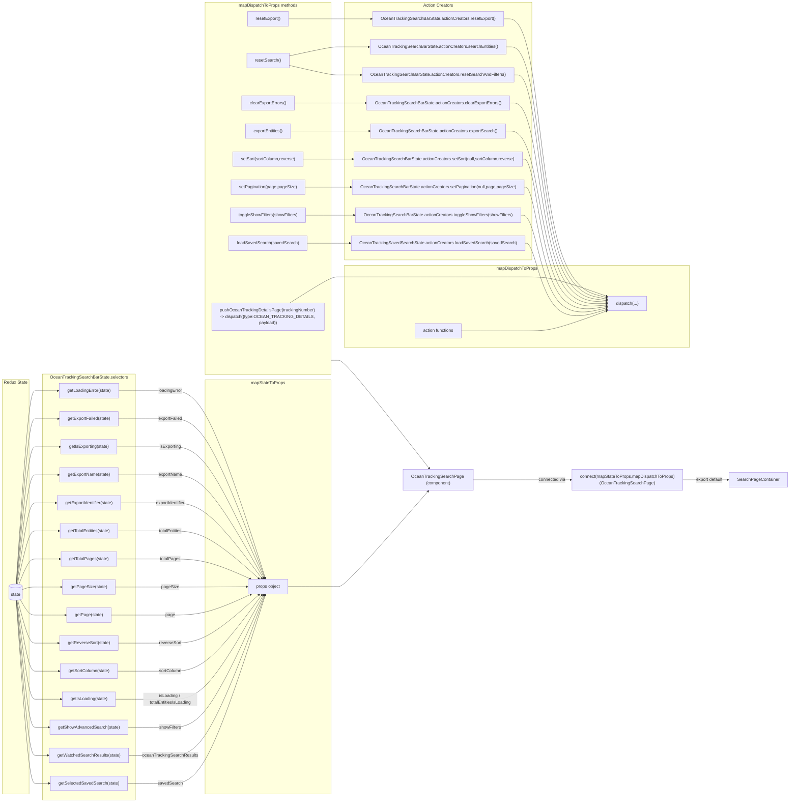

# Diagram: web/portal/src/pages/oceantracking/search/OceanTracking.Search.page.container.js

> Auto-generated by Obscura crawlers

## Mermaid

### SVG

<svg id="container" width="2916.640625" xmlns="http://www.w3.org/2000/svg" class="flowchart" height="2975" viewBox="0 0 2916.640625 2975" role="graphics-document document" aria-roledescription="flowchart-v2"><g><marker id="container_flowchart-v2-pointEnd" class="marker flowchart-v2" viewBox="0 0 10 10" refX="5" refY="5" markerUnits="userSpaceOnUse" markerWidth="8" markerHeight="8" orient="auto"><path d="M 0 0 L 10 5 L 0 10 z" class="arrowMarkerPath" style="stroke-width: 1; stroke-dasharray: 1, 0;"></path></marker><marker id="container_flowchart-v2-pointStart" class="marker flowchart-v2" viewBox="0 0 10 10" refX="4.5" refY="5" markerUnits="userSpaceOnUse" markerWidth="8" markerHeight="8" orient="auto"><path d="M 0 5 L 10 10 L 10 0 z" class="arrowMarkerPath" style="stroke-width: 1; stroke-dasharray: 1, 0;"></path></marker><marker id="container_flowchart-v2-circleEnd" class="marker flowchart-v2" viewBox="0 0 10 10" refX="11" refY="5" markerUnits="userSpaceOnUse" markerWidth="11" markerHeight="11" orient="auto"><circle cx="5" cy="5" r="5" class="arrowMarkerPath" style="stroke-width: 1; stroke-dasharray: 1, 0;"></circle></marker><marker id="container_flowchart-v2-circleStart" class="marker flowchart-v2" viewBox="0 0 10 10" refX="-1" refY="5" markerUnits="userSpaceOnUse" markerWidth="11" markerHeight="11" orient="auto"><circle cx="5" cy="5" r="5" class="arrowMarkerPath" style="stroke-width: 1; stroke-dasharray: 1, 0;"></circle></marker><marker id="container_flowchart-v2-crossEnd" class="marker cross flowchart-v2" viewBox="0 0 11 11" refX="12" refY="5.2" markerUnits="userSpaceOnUse" markerWidth="11" markerHeight="11" orient="auto"><path d="M 1,1 l 9,9 M 10,1 l -9,9" class="arrowMarkerPath" style="stroke-width: 2; stroke-dasharray: 1, 0;"></path></marker><marker id="container_flowchart-v2-crossStart" class="marker cross flowchart-v2" viewBox="0 0 11 11" refX="-1" refY="5.2" markerUnits="userSpaceOnUse" markerWidth="11" markerHeight="11" orient="auto"><path d="M 1,1 l 9,9 M 10,1 l -9,9" class="arrowMarkerPath" style="stroke-width: 2; stroke-dasharray: 1, 0;"></path></marker><g class="root"><g class="clusters"><g class="cluster" id="Dispatchers" data-look="classic"><rect style="" x="757.078125" y="8" width="465.78125" height="1381"></rect><g class="cluster-label" transform="translate(889.96875, 8)"><foreignObject width="200" height="48">

mapDispatchToProps methods

</foreignObject></g></g><g class="cluster" id="mapDispatchToPropsfn" data-look="classic"><rect style="" x="1272.859375" y="984" width="1269.65625" height="305"></rect><g class="cluster-label" transform="translate(1831.4140625, 984)"><foreignObject width="152.546875" height="24">

mapDispatchToProps

</foreignObject></g></g><g class="cluster" id="ActionCreators" data-look="classic"><rect style="" x="1272.859375" y="8" width="682.375" height="956"></rect><g class="cluster-label" transform="translate(1559.0234375, 8)"><foreignObject width="110.046875" height="24">

Action Creators

</foreignObject></g></g><g class="cluster" id="mapStateToPropsfn" data-look="classic"><rect style="" x="757.078125" y="1409" width="465.78125" height="1535"></rect><g class="cluster-label" transform="translate(926.46875, 1409)"><foreignObject width="127" height="24">

mapStateToProps

</foreignObject></g></g><g class="cluster" id="Selectors" data-look="classic"><rect style="" x="159.109375" y="1387" width="342.90625" height="1580"></rect><g class="cluster-label" transform="translate(188.03125, 1387)"><foreignObject width="285.0625" height="24">

OceanTrackingSearchBarState.selectors

</foreignObject></g></g><g class="cluster" id="Redux_State" data-look="classic"><rect style="" x="8" y="1407.3084907531738" width="101.109375" height="1536.6915092468262"></rect><g class="cluster-label" transform="translate(15.359375, 1407.3084907531738)"><foreignObject width="86.390625" height="24">

Redux State

</foreignObject></g></g></g><g class="edgePaths"><path d="M60.721,2226.357L68.786,2339.464C76.851,2452.571,92.98,2678.786,105.211,2791.893C117.443,2905,125.776,2905,134.109,2905C142.443,2905,150.776,2905,159.247,2905C167.719,2905,176.328,2905,180.633,2905L184.938,2905" id="L_State_sel_saved_0" class="edge-thickness-normal edge-pattern-solid edge-thickness-normal edge-pattern-solid flowchart-link" style=";" data-edge="true" data-et="edge" data-id="L_State_sel_saved_0" data-points="W3sieCI6NjAuNzIxMTI0NzQyOTUyNDksInkiOjIyMjYuMzU2ODk5MTg4NDE4NX0seyJ4IjoxMDkuMTA5Mzc1LCJ5IjoyOTA1fSx7IngiOjEzNC4xMDkzNzUsInkiOjI5MDV9LHsieCI6MTU5LjEwOTM3NSwieSI6MjkwNX0seyJ4IjoxODguOTM3NSwieSI6MjkwNX1d" marker-end="url(#container_flowchart-v2-pointEnd)"></path><path d="M61.094,2226.347L69.096,2322.123C77.099,2417.898,93.104,2609.449,105.273,2705.225C117.443,2801,125.776,2801,134.109,2801C142.443,2801,150.776,2801,158.443,2801C166.109,2801,173.109,2801,176.609,2801L180.109,2801" id="L_State_sel_results_0" class="edge-thickness-normal edge-pattern-solid edge-thickness-normal edge-pattern-solid flowchart-link" style=";" data-edge="true" data-et="edge" data-id="L_State_sel_results_0" data-points="W3sieCI6NjEuMDkzNTM3MDk1NDYwMDIsInkiOjIyMjYuMzQ3MTIzMjc5MDQ4NH0seyJ4IjoxMDkuMTA5Mzc1LCJ5IjoyODAxfSx7IngiOjEzNC4xMDkzNzUsInkiOjI4MDF9LHsieCI6MTU5LjEwOTM3NSwieSI6MjgwMX0seyJ4IjoxODQuMTA5Mzc1LCJ5IjoyODAxfV0=" marker-end="url(#container_flowchart-v2-pointEnd)"></path><path d="M61.621,2226.331L69.535,2304.776C77.45,2383.22,93.28,2540.11,105.361,2618.555C117.443,2697,125.776,2697,134.109,2697C142.443,2697,150.776,2697,158.96,2697C167.143,2697,175.177,2697,179.194,2697L183.211,2697" id="L_State_sel_showFilters_0" class="edge-thickness-normal edge-pattern-solid edge-thickness-normal edge-pattern-solid flowchart-link" style=";" data-edge="true" data-et="edge" data-id="L_State_sel_showFilters_0" data-points="W3sieCI6NjEuNjIwNTYzNzU3OTkwNjUsInkiOjIyMjYuMzMwNjE0MTI4MTk1fSx7IngiOjEwOS4xMDkzNzUsInkiOjI2OTd9LHsieCI6MTM0LjEwOTM3NSwieSI6MjY5N30seyJ4IjoxNTkuMTA5Mzc1LCJ5IjoyNjk3fSx7IngiOjE4Ny4yMTA5Mzc1LCJ5IjoyNjk3fV0=" marker-end="url(#container_flowchart-v2-pointEnd)"></path><path d="M62.424,2226.299L70.205,2287.416C77.986,2348.533,93.547,2470.766,105.495,2531.883C117.443,2593,125.776,2593,134.109,2593C142.443,2593,150.776,2593,166.314,2593C181.852,2593,204.594,2593,215.965,2593L227.336,2593" id="L_State_sel_isLoading_0" class="edge-thickness-normal edge-pattern-solid edge-thickness-normal edge-pattern-solid flowchart-link" style=";" data-edge="true" data-et="edge" data-id="L_State_sel_isLoading_0" data-points="W3sieCI6NjIuNDIzNzE1MjIxMDQxMDksInkiOjIyMjYuMjk5MzgwOTgzOTYxM30seyJ4IjoxMDkuMTA5Mzc1LCJ5IjoyNTkzfSx7IngiOjEzNC4xMDkzNzUsInkiOjI1OTN9LHsieCI6MTU5LjEwOTM3NSwieSI6MjU5M30seyJ4IjoyMzEuMzM1OTM3NSwieSI6MjU5M31d" marker-end="url(#container_flowchart-v2-pointEnd)"></path><path d="M63.797,2226.229L71.349,2270.024C78.901,2313.819,94.005,2401.41,105.724,2445.205C117.443,2489,125.776,2489,134.109,2489C142.443,2489,150.776,2489,165.008,2489C179.24,2489,199.37,2489,209.435,2489L219.5,2489" id="L_State_sel_sortColumn_0" class="edge-thickness-normal edge-pattern-solid edge-thickness-normal edge-pattern-solid flowchart-link" style=";" data-edge="true" data-et="edge" data-id="L_State_sel_sortColumn_0" data-points="W3sieCI6NjMuNzk3MDIxOTg4OTE5MTYsInkiOjIyMjYuMjI4NzEzNzE1NDZ9LHsieCI6MTA5LjEwOTM3NSwieSI6MjQ4OX0seyJ4IjoxMzQuMTA5Mzc1LCJ5IjoyNDg5fSx7IngiOjE1OS4xMDkzNzUsInkiOjI0ODl9LHsieCI6MjIzLjUsInkiOjI0ODl9XQ==" marker-end="url(#container_flowchart-v2-pointEnd)"></path><path d="M66.682,2226.006L73.753,2252.505C80.824,2279.004,94.967,2332.002,106.205,2358.501C117.443,2385,125.776,2385,134.109,2385C142.443,2385,150.776,2385,164.868,2385C178.961,2385,198.813,2385,208.738,2385L218.664,2385" id="L_State_sel_reverseSort_0" class="edge-thickness-normal edge-pattern-solid edge-thickness-normal edge-pattern-solid flowchart-link" style=";" data-edge="true" data-et="edge" data-id="L_State_sel_reverseSort_0" data-points="W3sieCI6NjYuNjgxNjkyODE4ODAwNjEsInkiOjIyMjYuMDA2MzQwMTM4OTczNH0seyJ4IjoxMDkuMTA5Mzc1LCJ5IjoyMzg1fSx7IngiOjEzNC4xMDkzNzUsInkiOjIzODV9LHsieCI6MTU5LjEwOTM3NSwieSI6MjM4NX0seyJ4IjoyMjIuNjY0MDYyNSwieSI6MjM4NX1d" marker-end="url(#container_flowchart-v2-pointEnd)"></path><path d="M76.625,2224.258L82.039,2233.715C87.453,2243.172,98.281,2262.086,107.862,2271.543C117.443,2281,125.776,2281,134.109,2281C142.443,2281,150.776,2281,169.286,2281C187.797,2281,216.484,2281,230.828,2281L245.172,2281" id="L_State_sel_page_0" class="edge-thickness-normal edge-pattern-solid edge-thickness-normal edge-pattern-solid flowchart-link" style=";" data-edge="true" data-et="edge" data-id="L_State_sel_page_0" data-points="W3sieCI6NzYuNjI1MzIyODU1OTIxMzUsInkiOjIyMjQuMjU3NzY2MTQ5Mjd9LHsieCI6MTA5LjEwOTM3NSwieSI6MjI4MX0seyJ4IjoxMzQuMTA5Mzc1LCJ5IjoyMjgxfSx7IngiOjE1OS4xMDkzNzUsInkiOjIyODF9LHsieCI6MjQ5LjE3MTg3NSwieSI6MjI4MX1d" marker-end="url(#container_flowchart-v2-pointEnd)"></path><path d="M84.109,2186.396L88.276,2184.83C92.443,2183.264,100.776,2180.132,109.109,2178.566C117.443,2177,125.776,2177,134.109,2177C142.443,2177,150.776,2177,166.884,2177C182.992,2177,206.875,2177,218.816,2177L230.758,2177" id="L_State_sel_pageSize_0" class="edge-thickness-normal edge-pattern-solid edge-thickness-normal edge-pattern-solid flowchart-link" style=";" data-edge="true" data-et="edge" data-id="L_State_sel_pageSize_0" data-points="W3sieCI6ODQuMTA5Mzc1LCJ5IjoyMTg2LjM5NTc2NTcyMzk5OTR9LHsieCI6MTA5LjEwOTM3NSwieSI6MjE3N30seyJ4IjoxMzQuMTA5Mzc1LCJ5IjoyMTc3fSx7IngiOjE1OS4xMDkzNzUsInkiOjIxNzd9LHsieCI6MjM0Ljc1NzgxMjUsInkiOjIxNzd9XQ==" marker-end="url(#container_flowchart-v2-pointEnd)"></path><path d="M71.043,2166.542L77.387,2150.952C83.731,2135.362,96.42,2104.181,106.932,2088.59C117.443,2073,125.776,2073,134.109,2073C142.443,2073,150.776,2073,165.695,2073C180.615,2073,202.12,2073,212.872,2073L223.625,2073" id="L_State_sel_totalPages_0" class="edge-thickness-normal edge-pattern-solid edge-thickness-normal edge-pattern-solid flowchart-link" style=";" data-edge="true" data-et="edge" data-id="L_State_sel_totalPages_0" data-points="W3sieCI6NzEuMDQyNTI0OTQxMDgzODUsInkiOjIxNjYuNTQyMjY5NjY1ODQ5M30seyJ4IjoxMDkuMTA5Mzc1LCJ5IjoyMDczfSx7IngiOjEzNC4xMDkzNzUsInkiOjIwNzN9LHsieCI6MTU5LjEwOTM3NSwieSI6MjA3M30seyJ4IjoyMjcuNjI1LCJ5IjoyMDczfV0=" marker-end="url(#container_flowchart-v2-pointEnd)"></path><path d="M65.321,2165.876L72.619,2133.063C79.917,2100.251,94.513,2034.625,105.978,2001.813C117.443,1969,125.776,1969,134.109,1969C142.443,1969,150.776,1969,164.585,1969C178.393,1969,197.677,1969,207.319,1969L216.961,1969" id="L_State_sel_totalEntities_0" class="edge-thickness-normal edge-pattern-solid edge-thickness-normal edge-pattern-solid flowchart-link" style=";" data-edge="true" data-et="edge" data-id="L_State_sel_totalEntities_0" data-points="W3sieCI6NjUuMzIxMjI0OTY4MDc2MjgsInkiOjIxNjUuODc1OTQ2MjAxNzczfSx7IngiOjEwOS4xMDkzNzUsInkiOjE5Njl9LHsieCI6MTM0LjEwOTM3NSwieSI6MTk2OX0seyJ4IjoxNTkuMTA5Mzc1LCJ5IjoxOTY5fSx7IngiOjIyMC45NjA5Mzc1LCJ5IjoxOTY5fV0=" marker-end="url(#container_flowchart-v2-pointEnd)"></path><path d="M63.195,2165.738L70.848,2115.615C78.5,2065.492,93.805,1965.246,105.624,1915.123C117.443,1865,125.776,1865,134.109,1865C142.443,1865,150.776,1865,162.608,1865C174.44,1865,189.771,1865,197.436,1865L205.102,1865" id="L_State_sel_exportId_0" class="edge-thickness-normal edge-pattern-solid edge-thickness-normal edge-pattern-solid flowchart-link" style=";" data-edge="true" data-et="edge" data-id="L_State_sel_exportId_0" data-points="W3sieCI6NjMuMTk1MTgyOTg0MTQ4OTg1LCJ5IjoyMTY1LjczNzYwNzUyODQyNDZ9LHsieCI6MTA5LjEwOTM3NSwieSI6MTg2NX0seyJ4IjoxMzQuMTA5Mzc1LCJ5IjoxODY1fSx7IngiOjE1OS4xMDkzNzUsInkiOjE4NjV9LHsieCI6MjA5LjEwMTU2MjUsInkiOjE4NjV9XQ==" marker-end="url(#container_flowchart-v2-pointEnd)"></path><path d="M62.086,2165.687L69.923,2098.239C77.76,2030.791,93.435,1895.896,105.439,1828.448C117.443,1761,125.776,1761,134.109,1761C142.443,1761,150.776,1761,164.667,1761C178.557,1761,198.005,1761,207.729,1761L217.453,1761" id="L_State_sel_exportName_0" class="edge-thickness-normal edge-pattern-solid edge-thickness-normal edge-pattern-solid flowchart-link" style=";" data-edge="true" data-et="edge" data-id="L_State_sel_exportName_0" data-points="W3sieCI6NjIuMDg1NzMxMTkwMjM3NSwieSI6MjE2NS42ODY1NzY5OTU5NjEzfSx7IngiOjEwOS4xMDkzNzUsInkiOjE3NjF9LHsieCI6MTM0LjEwOTM3NSwieSI6MTc2MX0seyJ4IjoxNTkuMTA5Mzc1LCJ5IjoxNzYxfSx7IngiOjIyMS40NTMxMjUsInkiOjE3NjF9XQ==" marker-end="url(#container_flowchart-v2-pointEnd)"></path><path d="M61.404,2165.662L69.355,2080.885C77.306,1996.108,93.208,1826.554,105.325,1741.777C117.443,1657,125.776,1657,134.109,1657C142.443,1657,150.776,1657,165.306,1657C179.836,1657,200.563,1657,210.926,1657L221.289,1657" id="L_State_sel_isExporting_0" class="edge-thickness-normal edge-pattern-solid edge-thickness-normal edge-pattern-solid flowchart-link" style=";" data-edge="true" data-et="edge" data-id="L_State_sel_isExporting_0" data-points="W3sieCI6NjEuNDA0NDE2NjM3NzYxMjUsInkiOjIxNjUuNjYyMjM0ODQ2NTM1N30seyJ4IjoxMDkuMTA5Mzc1LCJ5IjoxNjU3fSx7IngiOjEzNC4xMDkzNzUsInkiOjE2NTd9LHsieCI6MTU5LjEwOTM3NSwieSI6MTY1N30seyJ4IjoyMjUuMjg5MDYyNSwieSI6MTY1N31d" marker-end="url(#container_flowchart-v2-pointEnd)"></path><path d="M60.943,2165.649L68.971,2063.541C76.999,1961.433,93.054,1757.216,105.248,1655.108C117.443,1553,125.776,1553,134.109,1553C142.443,1553,150.776,1553,164.589,1553C178.401,1553,197.693,1553,207.339,1553L216.984,1553" id="L_State_sel_exportFailed_0" class="edge-thickness-normal edge-pattern-solid edge-thickness-normal edge-pattern-solid flowchart-link" style=";" data-edge="true" data-et="edge" data-id="L_State_sel_exportFailed_0" data-points="W3sieCI6NjAuOTQzNDk2MjE3MzQ1NzQ2LCJ5IjoyMTY1LjY0ODc1MDM2MTkwNDZ9LHsieCI6MTA5LjEwOTM3NSwieSI6MTU1M30seyJ4IjoxMzQuMTA5Mzc1LCJ5IjoxNTUzfSx7IngiOjE1OS4xMDkzNzUsInkiOjE1NTN9LHsieCI6MjIwLjk4NDM3NSwieSI6MTU1M31d" marker-end="url(#container_flowchart-v2-pointEnd)"></path><path d="M60.611,2165.641L68.694,2046.2C76.777,1926.76,92.943,1687.88,105.193,1568.44C117.443,1449,125.776,1449,134.109,1449C142.443,1449,150.776,1449,164.346,1449C177.917,1449,196.724,1449,206.128,1449L215.531,1449" id="L_State_sel_loadingError_0" class="edge-thickness-normal edge-pattern-solid edge-thickness-normal edge-pattern-solid flowchart-link" style=";" data-edge="true" data-et="edge" data-id="L_State_sel_loadingError_0" data-points="W3sieCI6NjAuNjEwOTE3NzYxMzgzMjg0LCJ5IjoyMTY1LjY0MDUwNjgwMzQ4OH0seyJ4IjoxMDkuMTA5Mzc1LCJ5IjoxNDQ5fSx7IngiOjEzNC4xMDkzNzUsInkiOjE0NDl9LHsieCI6MTU5LjEwOTM3NSwieSI6MTQ0OX0seyJ4IjoyMTkuNTMxMjUsInkiOjE0NDl9XQ==" marker-end="url(#container_flowchart-v2-pointEnd)"></path><path d="M472.188,2905L477.159,2905C482.13,2905,492.073,2905,518.299,2905C544.526,2905,587.036,2905,629.547,2905C672.057,2905,714.568,2905,772.999,2788.52C831.43,2672.04,905.783,2439.079,942.959,2322.599L980.135,2206.119" id="L_sel_saved_props_0" class="edge-thickness-normal edge-pattern-solid edge-thickness-normal edge-pattern-solid flowchart-link" style=";" data-edge="true" data-et="edge" data-id="L_sel_saved_props_0" data-points="W3sieCI6NDcyLjE4NzUsInkiOjI5MDV9LHsieCI6NTAyLjAxNTYyNSwieSI6MjkwNX0seyJ4Ijo2MjkuNTQ2ODc1LCJ5IjoyOTA1fSx7IngiOjc1Ny4wNzgxMjUsInkiOjI5MDV9LHsieCI6OTgxLjM1MTM0NTUyNzk1MDcsInkiOjIyMDIuMzA4NDkwNzUzMTc0fV0=" marker-end="url(#container_flowchart-v2-pointEnd)"></path><path d="M477.016,2801L481.182,2801C485.349,2801,493.682,2801,519.104,2801C544.526,2801,587.036,2801,629.547,2801C672.057,2801,714.568,2801,772.731,2701.843C830.893,2602.686,904.708,2404.371,941.616,2305.214L978.524,2206.057" id="L_sel_results_props_0" class="edge-thickness-normal edge-pattern-solid edge-thickness-normal edge-pattern-solid flowchart-link" style=";" data-edge="true" data-et="edge" data-id="L_sel_results_props_0" data-points="W3sieCI6NDc3LjAxNTYyNSwieSI6MjgwMX0seyJ4Ijo1MDIuMDE1NjI1LCJ5IjoyODAxfSx7IngiOjYyOS41NDY4NzUsInkiOjI4MDF9LHsieCI6NzU3LjA3ODEyNSwieSI6MjgwMX0seyJ4Ijo5NzkuOTE4OTk0MTk4NTA0MiwieSI6MjIwMi4zMDg0OTA3NTMxNzR9XQ==" marker-end="url(#container_flowchart-v2-pointEnd)"></path><path d="M473.914,2697L478.598,2697C483.281,2697,492.648,2697,518.587,2697C544.526,2697,587.036,2697,629.547,2697C672.057,2697,714.568,2697,772.357,2615.16C830.147,2533.32,903.216,2369.641,939.751,2287.801L976.285,2205.961" id="L_sel_showFilters_props_0" class="edge-thickness-normal edge-pattern-solid edge-thickness-normal edge-pattern-solid flowchart-link" style=";" data-edge="true" data-et="edge" data-id="L_sel_showFilters_props_0" data-points="W3sieCI6NDczLjkxNDA2MjUsInkiOjI2OTd9LHsieCI6NTAyLjAxNTYyNSwieSI6MjY5N30seyJ4Ijo2MjkuNTQ2ODc1LCJ5IjoyNjk3fSx7IngiOjc1Ny4wNzgxMjUsInkiOjI2OTd9LHsieCI6OTc3LjkxNTU2MDAxNDA2NzIsInkiOjIyMDIuMzA4NDkwNzUzMTc0fV0=" marker-end="url(#container_flowchart-v2-pointEnd)"></path><path d="M429.789,2593L441.827,2593C453.865,2593,477.94,2593,511.233,2593C544.526,2593,587.036,2593,629.547,2593C672.057,2593,714.568,2593,771.804,2528.467C829.041,2463.934,901.004,2334.868,936.985,2270.335L972.967,2205.802" id="L_sel_isLoading_props_0" class="edge-thickness-normal edge-pattern-solid edge-thickness-normal edge-pattern-solid flowchart-link" style=";" data-edge="true" data-et="edge" data-id="L_sel_isLoading_props_0" data-points="W3sieCI6NDI5Ljc4OTA2MjUsInkiOjI1OTN9LHsieCI6NTAyLjAxNTYyNSwieSI6MjU5M30seyJ4Ijo2MjkuNTQ2ODc1LCJ5IjoyNTkzfSx7IngiOjc1Ny4wNzgxMjUsInkiOjI1OTN9LHsieCI6OTc0LjkxNDQ2NTM1MjYwOTEsInkiOjIyMDIuMzA4NDkwNzUzMTc0fV0=" marker-end="url(#container_flowchart-v2-pointEnd)"></path><path d="M437.625,2489L448.357,2489C459.089,2489,480.552,2489,512.539,2489C544.526,2489,587.036,2489,629.547,2489C672.057,2489,714.568,2489,770.9,2441.753C827.232,2394.507,897.385,2300.013,932.462,2252.767L967.539,2205.52" id="L_sel_sortColumn_props_0" class="edge-thickness-normal edge-pattern-solid edge-thickness-normal edge-pattern-solid flowchart-link" style=";" data-edge="true" data-et="edge" data-id="L_sel_sortColumn_props_0" data-points="W3sieCI6NDM3LjYyNSwieSI6MjQ4OX0seyJ4Ijo1MDIuMDE1NjI1LCJ5IjoyNDg5fSx7IngiOjYyOS41NDY4NzUsInkiOjI0ODl9LHsieCI6NzU3LjA3ODEyNSwieSI6MjQ4OX0seyJ4Ijo5NjkuOTIzNDI5MzkxNTUzOCwieSI6MjIwMi4zMDg0OTA3NTMxNzR9XQ==" marker-end="url(#container_flowchart-v2-pointEnd)"></path><path d="M438.461,2385L449.053,2385C459.646,2385,480.831,2385,512.678,2385C544.526,2385,587.036,2385,629.547,2385C672.057,2385,714.568,2385,769.145,2354.997C823.722,2324.995,890.365,2264.99,923.687,2234.987L957.009,2204.985" id="L_sel_reverseSort_props_0" class="edge-thickness-normal edge-pattern-solid edge-thickness-normal edge-pattern-solid flowchart-link" style=";" data-edge="true" data-et="edge" data-id="L_sel_reverseSort_props_0" data-points="W3sieCI6NDM4LjQ2MDkzNzUsInkiOjIzODV9LHsieCI6NTAyLjAxNTYyNSwieSI6MjM4NX0seyJ4Ijo2MjkuNTQ2ODc1LCJ5IjoyMzg1fSx7IngiOjc1Ny4wNzgxMjUsInkiOjIzODV9LHsieCI6OTU5Ljk4MTYxODQzOTA0NCwieSI6MjIwMi4zMDg0OTA3NTMxNzR9XQ==" marker-end="url(#container_flowchart-v2-pointEnd)"></path><path d="M411.953,2281L426.964,2281C441.974,2281,471.995,2281,508.26,2281C544.526,2281,587.036,2281,629.547,2281C672.057,2281,714.568,2281,764.115,2268.16C813.663,2255.321,870.247,2229.641,898.54,2216.801L926.832,2203.962" id="L_sel_page_props_0" class="edge-thickness-normal edge-pattern-solid edge-thickness-normal edge-pattern-solid flowchart-link" style=";" data-edge="true" data-et="edge" data-id="L_sel_page_props_0" data-points="W3sieCI6NDExLjk1MzEyNSwieSI6MjI4MX0seyJ4Ijo1MDIuMDE1NjI1LCJ5IjoyMjgxfSx7IngiOjYyOS41NDY4NzUsInkiOjIyODF9LHsieCI6NzU3LjA3ODEyNSwieSI6MjI4MX0seyJ4Ijo5MzAuNDc0NDA3MjY3OTM0LCJ5IjoyMjAyLjMwODQ5MDc1MzE3NH1d" marker-end="url(#container_flowchart-v2-pointEnd)"></path><path d="M426.367,2177L438.975,2177C451.583,2177,476.799,2177,510.663,2177C544.526,2177,587.036,2177,629.547,2177C672.057,2177,714.568,2177,761.369,2176.814C808.169,2176.629,859.26,2176.258,884.806,2176.072L910.352,2175.887" id="L_sel_pageSize_props_0" class="edge-thickness-normal edge-pattern-solid edge-thickness-normal edge-pattern-solid flowchart-link" style=";" data-edge="true" data-et="edge" data-id="L_sel_pageSize_props_0" data-points="W3sieCI6NDI2LjM2NzE4NzUsInkiOjIxNzd9LHsieCI6NTAyLjAxNTYyNSwieSI6MjE3N30seyJ4Ijo2MjkuNTQ2ODc1LCJ5IjoyMTc3fSx7IngiOjc1Ny4wNzgxMjUsInkiOjIxNzd9LHsieCI6OTE0LjM1MTU2MjUsInkiOjIxNzUuODU3NzA2Mzg1NTEzfV0=" marker-end="url(#container_flowchart-v2-pointEnd)"></path><path d="M433.5,2073L444.919,2073C456.339,2073,479.177,2073,511.852,2073C544.526,2073,587.036,2073,629.547,2073C672.057,2073,714.568,2073,763.784,2085.283C813,2097.567,868.923,2122.133,896.884,2134.416L924.845,2146.7" id="L_sel_totalPages_props_0" class="edge-thickness-normal edge-pattern-solid edge-thickness-normal edge-pattern-solid flowchart-link" style=";" data-edge="true" data-et="edge" data-id="L_sel_totalPages_props_0" data-points="W3sieCI6NDMzLjUsInkiOjIwNzN9LHsieCI6NTAyLjAxNTYyNSwieSI6MjA3M30seyJ4Ijo2MjkuNTQ2ODc1LCJ5IjoyMDczfSx7IngiOjc1Ny4wNzgxMjUsInkiOjIwNzN9LHsieCI6OTI4LjUwNzExNzM1NjMyODgsInkiOjIxNDguMzA4NDkwNzUzMTc0fV0=" marker-end="url(#container_flowchart-v2-pointEnd)"></path><path d="M440.164,1969L450.473,1969C460.781,1969,481.398,1969,512.962,1969C544.526,1969,587.036,1969,629.547,1969C672.057,1969,714.568,1969,769.059,1998.443C823.551,2027.885,890.023,2086.771,923.259,2116.213L956.496,2145.656" id="L_sel_totalEntities_props_0" class="edge-thickness-normal edge-pattern-solid edge-thickness-normal edge-pattern-solid flowchart-link" style=";" data-edge="true" data-et="edge" data-id="L_sel_totalEntities_props_0" data-points="W3sieCI6NDQwLjE2NDA2MjUsInkiOjE5Njl9LHsieCI6NTAyLjAxNTYyNSwieSI6MTk2OX0seyJ4Ijo2MjkuNTQ2ODc1LCJ5IjoxOTY5fSx7IngiOjc1Ny4wNzgxMjUsInkiOjE5Njl9LHsieCI6OTU5LjQ4OTg5MzU0NTU1MSwieSI6MjE0OC4zMDg0OTA3NTMxNzR9XQ==" marker-end="url(#container_flowchart-v2-pointEnd)"></path><path d="M452.023,1865L460.355,1865C468.688,1865,485.352,1865,514.939,1865C544.526,1865,587.036,1865,629.547,1865C672.057,1865,714.568,1865,770.861,1911.685C827.153,1958.37,897.229,2051.74,932.266,2098.424L967.304,2145.109" id="L_sel_exportId_props_0" class="edge-thickness-normal edge-pattern-solid edge-thickness-normal edge-pattern-solid flowchart-link" style=";" data-edge="true" data-et="edge" data-id="L_sel_exportId_props_0" data-points="W3sieCI6NDUyLjAyMzQzNzUsInkiOjE4NjV9LHsieCI6NTAyLjAxNTYyNSwieSI6MTg2NX0seyJ4Ijo2MjkuNTQ2ODc1LCJ5IjoxODY1fSx7IngiOjc1Ny4wNzgxMjUsInkiOjE4NjV9LHsieCI6OTY5LjcwNDg5MzAyNDE5NTcsInkiOjIxNDguMzA4NDkwNzUzMTc0fV0=" marker-end="url(#container_flowchart-v2-pointEnd)"></path><path d="M439.672,1761L450.063,1761C460.453,1761,481.234,1761,512.88,1761C544.526,1761,587.036,1761,629.547,1761C672.057,1761,714.568,1761,771.782,1824.97C828.996,1888.941,900.914,2016.881,936.873,2080.851L972.832,2144.822" id="L_sel_exportName_props_0" class="edge-thickness-normal edge-pattern-solid edge-thickness-normal edge-pattern-solid flowchart-link" style=";" data-edge="true" data-et="edge" data-id="L_sel_exportName_props_0" data-points="W3sieCI6NDM5LjY3MTg3NSwieSI6MTc2MX0seyJ4Ijo1MDIuMDE1NjI1LCJ5IjoxNzYxfSx7IngiOjYyOS41NDY4NzUsInkiOjE3NjF9LHsieCI6NzU3LjA3ODEyNSwieSI6MTc2MX0seyJ4Ijo5NzQuNzkxNTQwMjI2NzQ4OSwieSI6MjE0OC4zMDg0OTA3NTMxNzR9XQ==" marker-end="url(#container_flowchart-v2-pointEnd)"></path><path d="M435.836,1657L446.866,1657C457.896,1657,479.956,1657,512.241,1657C544.526,1657,587.036,1657,629.547,1657C672.057,1657,714.568,1657,772.343,1738.277C830.118,1819.553,903.158,1982.107,939.678,2063.383L976.197,2144.66" id="L_sel_isExporting_props_0" class="edge-thickness-normal edge-pattern-solid edge-thickness-normal edge-pattern-solid flowchart-link" style=";" data-edge="true" data-et="edge" data-id="L_sel_isExporting_props_0" data-points="W3sieCI6NDM1LjgzNTkzNzUsInkiOjE2NTd9LHsieCI6NTAyLjAxNTYyNSwieSI6MTY1N30seyJ4Ijo2MjkuNTQ2ODc1LCJ5IjoxNjU3fSx7IngiOjc1Ny4wNzgxMjUsInkiOjE2NTd9LHsieCI6OTc3LjgzNjg4ODQwMTc3OTYsInkiOjIxNDguMzA4NDkwNzUzMTc0fV0=" marker-end="url(#container_flowchart-v2-pointEnd)"></path><path d="M440.141,1553L450.453,1553C460.766,1553,481.391,1553,512.958,1553C544.526,1553,587.036,1553,629.547,1553C672.057,1553,714.568,1553,772.72,1651.594C830.873,1750.187,904.668,1947.375,941.565,2045.969L978.462,2144.562" id="L_sel_exportFailed_props_0" class="edge-thickness-normal edge-pattern-solid edge-thickness-normal edge-pattern-solid flowchart-link" style=";" data-edge="true" data-et="edge" data-id="L_sel_exportFailed_props_0" data-points="W3sieCI6NDQwLjE0MDYyNSwieSI6MTU1M30seyJ4Ijo1MDIuMDE1NjI1LCJ5IjoxNTUzfSx7IngiOjYyOS41NDY4NzUsInkiOjE1NTN9LHsieCI6NzU3LjA3ODEyNSwieSI6MTU1M30seyJ4Ijo5NzkuODY0MzYxMzExMDU2MywieSI6MjE0OC4zMDg0OTA3NTMxNzR9XQ==" marker-end="url(#container_flowchart-v2-pointEnd)"></path><path d="M441.594,1449L451.664,1449C461.734,1449,481.875,1449,513.201,1449C544.526,1449,587.036,1449,629.547,1449C672.057,1449,714.568,1449,772.992,1564.917C831.415,1680.833,905.753,1912.666,942.921,2028.583L980.09,2144.5" id="L_sel_loadingError_props_0" class="edge-thickness-normal edge-pattern-solid edge-thickness-normal edge-pattern-solid flowchart-link" style=";" data-edge="true" data-et="edge" data-id="L_sel_loadingError_props_0" data-points="W3sieCI6NDQxLjU5Mzc1LCJ5IjoxNDQ5fSx7IngiOjUwMi4wMTU2MjUsInkiOjE0NDl9LHsieCI6NjI5LjU0Njg3NSwieSI6MTQ0OX0seyJ4Ijo3NTcuMDc4MTI1LCJ5IjoxNDQ5fSx7IngiOjk4MS4zMTEyMDcxNTgyODA4LCJ5IjoyMTQ4LjMwODQ5MDc1MzE3NH1d" marker-end="url(#container_flowchart-v2-pointEnd)"></path><path d="M1702.938,1227L1744.987,1227C1787.036,1227,1871.135,1227,1925.764,1227C1980.393,1227,2005.552,1227,2052.356,1214.621C2099.16,1202.241,2167.61,1177.482,2201.834,1165.103L2236.059,1152.724" id="L_actions_dispatch_calls_0" class="edge-thickness-normal edge-pattern-solid edge-thickness-normal edge-pattern-solid flowchart-link" style=";" data-edge="true" data-et="edge" data-id="L_actions_dispatch_calls_0" data-points="W3sieCI6MTcwMi45Mzc1LCJ5IjoxMjI3fSx7IngiOjE5NTUuMjM0Mzc1LCJ5IjoxMjI3fSx7IngiOjIwMzAuNzEwOTM3NSwieSI6MTIyN30seyJ4IjoyMjM5LjgyMDMxMjUsInkiOjExNTEuMzYyOTQ4NDY2MDU0OH1d" marker-end="url(#container_flowchart-v2-pointEnd)"></path><path d="M1930.234,902L1934.401,902C1938.568,902,1946.901,902,1963.647,952.833C1980.393,1003.667,2005.552,1105.333,2052.343,1146.226C2099.134,1187.118,2167.556,1167.237,2201.768,1157.296L2235.979,1147.355" id="L_ac_saved_dispatch_calls_0" class="edge-thickness-normal edge-pattern-solid edge-thickness-normal edge-pattern-solid flowchart-link" style=";" data-edge="true" data-et="edge" data-id="L_ac_saved_dispatch_calls_0" data-points="W3sieCI6MTkzMC4yMzQzNzUsInkiOjkwMn0seyJ4IjoxOTU1LjIzNDM3NSwieSI6OTAyfSx7IngiOjIwMzAuNzEwOTM3NSwieSI6MTIwN30seyJ4IjoyMjM5LjgyMDMxMjUsInkiOjExNDYuMjM4NzMzNDkzNTY1Nn1d" marker-end="url(#container_flowchart-v2-pointEnd)"></path><path d="M1918.219,798L1924.388,798C1930.557,798,1942.896,798,1961.645,862.833C1980.393,927.667,2005.552,1057.333,2052.332,1114.662C2099.112,1171.991,2167.512,1156.981,2201.713,1149.477L2235.913,1141.972" id="L_ac_toggle_dispatch_calls_0" class="edge-thickness-normal edge-pattern-solid edge-thickness-normal edge-pattern-solid flowchart-link" style=";" data-edge="true" data-et="edge" data-id="L_ac_toggle_dispatch_calls_0" data-points="W3sieCI6MTkxOC4yMTg3NSwieSI6Nzk4fSx7IngiOjE5NTUuMjM0Mzc1LCJ5Ijo3OTh9LHsieCI6MjAzMC43MTA5Mzc1LCJ5IjoxMTg3fSx7IngiOjIyMzkuODIwMzEyNSwieSI6MTE0MS4xMTQ1MTg1MjEwNzYyfV0=" marker-end="url(#container_flowchart-v2-pointEnd)"></path><path d="M1929.953,694L1934.167,694C1938.38,694,1946.807,694,1963.6,772.833C1980.393,851.667,2005.552,1009.333,2052.324,1083.096C2099.095,1156.859,2167.479,1146.718,2201.671,1141.648L2235.864,1136.577" id="L_ac_setPagination_dispatch_calls_0" class="edge-thickness-normal edge-pattern-solid edge-thickness-normal edge-pattern-solid flowchart-link" style=";" data-edge="true" data-et="edge" data-id="L_ac_setPagination_dispatch_calls_0" data-points="W3sieCI6MTkyOS45NTMxMjUsInkiOjY5NH0seyJ4IjoxOTU1LjIzNDM3NSwieSI6Njk0fSx7IngiOjIwMzAuNzEwOTM3NSwieSI6MTE2N30seyJ4IjoyMjM5LjgyMDMxMjUsInkiOjExMzUuOTkwMzAzNTQ4NTg3fV0=" marker-end="url(#container_flowchart-v2-pointEnd)"></path><path d="M1925.969,590L1930.846,590C1935.724,590,1945.479,590,1962.936,682.833C1980.393,775.667,2005.552,961.333,2052.318,1051.529C2099.085,1141.725,2167.458,1136.449,2201.645,1133.811L2235.832,1131.174" id="L_ac_setSort_dispatch_calls_0" class="edge-thickness-normal edge-pattern-solid edge-thickness-normal edge-pattern-solid flowchart-link" style=";" data-edge="true" data-et="edge" data-id="L_ac_setSort_dispatch_calls_0" data-points="W3sieCI6MTkyNS45Njg3NSwieSI6NTkwfSx7IngiOjE5NTUuMjM0Mzc1LCJ5Ijo1OTB9LHsieCI6MjAzMC43MTA5Mzc1LCJ5IjoxMTQ3fSx7IngiOjIyMzkuODIwMzEyNSwieSI6MTEzMC44NjYwODg1NzYwOTc2fV0=" marker-end="url(#container_flowchart-v2-pointEnd)"></path><path d="M1861.43,486L1877.064,486C1892.698,486,1923.966,486,1952.18,592.833C1980.393,699.667,2005.552,913.333,2052.316,1019.961C2099.081,1126.589,2167.451,1126.177,2201.635,1125.972L2235.82,1125.766" id="L_ac_export_dispatch_calls_0" class="edge-thickness-normal edge-pattern-solid edge-thickness-normal edge-pattern-solid flowchart-link" style=";" data-edge="true" data-et="edge" data-id="L_ac_export_dispatch_calls_0" data-points="W3sieCI6MTg2MS40Mjk2ODc1LCJ5Ijo0ODZ9LHsieCI6MTk1NS4yMzQzNzUsInkiOjQ4Nn0seyJ4IjoyMDMwLjcxMDkzNzUsInkiOjExMjd9LHsieCI6MjIzOS44MjAzMTI1LCJ5IjoxMTI1Ljc0MTg3MzYwMzYwODR9XQ==" marker-end="url(#container_flowchart-v2-pointEnd)"></path><path d="M1876.43,382L1889.564,382C1902.698,382,1928.966,382,1954.68,502.833C1980.393,623.667,2005.552,865.333,2052.318,988.393C2099.084,1111.453,2167.456,1115.905,2201.642,1118.131L2235.829,1120.358" id="L_ac_clearExport_dispatch_calls_0" class="edge-thickness-normal edge-pattern-solid edge-thickness-normal edge-pattern-solid flowchart-link" style=";" data-edge="true" data-et="edge" data-id="L_ac_clearExport_dispatch_calls_0" data-points="W3sieCI6MTg3Ni40Mjk2ODc1LCJ5IjozODJ9LHsieCI6MTk1NS4yMzQzNzUsInkiOjM4Mn0seyJ4IjoyMDMwLjcxMDkzNzUsInkiOjExMDd9LHsieCI6MjIzOS44MjAzMTI1LCJ5IjoxMTIwLjYxNzY1ODYzMTExOX1d" marker-end="url(#container_flowchart-v2-pointEnd)"></path><path d="M1892.266,278L1902.76,278C1913.255,278,1934.245,278,1957.319,412.833C1980.393,547.667,2005.552,817.333,2052.323,956.826C2099.093,1096.318,2167.475,1105.636,2201.666,1110.294L2235.857,1114.953" id="L_ac_resetSearchAndFilters_dispatch_calls_0" class="edge-thickness-normal edge-pattern-solid edge-thickness-normal edge-pattern-solid flowchart-link" style=";" data-edge="true" data-et="edge" data-id="L_ac_resetSearchAndFilters_dispatch_calls_0" data-points="W3sieCI6MTg5Mi4yNjU2MjUsInkiOjI3OH0seyJ4IjoxOTU1LjIzNDM3NSwieSI6Mjc4fSx7IngiOjIwMzAuNzEwOTM3NSwieSI6MTA4N30seyJ4IjoyMjM5LjgyMDMxMjUsInkiOjExMTUuNDkzNDQzNjU4NjI5OH1d" marker-end="url(#container_flowchart-v2-pointEnd)"></path><path d="M1864.617,174L1879.72,174C1894.823,174,1925.029,174,1952.711,322.833C1980.393,471.667,2005.552,769.333,2052.33,925.259C2099.109,1081.186,2167.506,1095.371,2201.705,1102.464L2235.904,1109.557" id="L_ac_searchEntities_dispatch_calls_0" class="edge-thickness-normal edge-pattern-solid edge-thickness-normal edge-pattern-solid flowchart-link" style=";" data-edge="true" data-et="edge" data-id="L_ac_searchEntities_dispatch_calls_0" data-points="W3sieCI6MTg2NC42MTcxODc1LCJ5IjoxNzR9LHsieCI6MTk1NS4yMzQzNzUsInkiOjE3NH0seyJ4IjoyMDMwLjcxMDkzNzUsInkiOjEwNjd9LHsieCI6MjIzOS44MjAzMTI1LCJ5IjoxMTEwLjM2OTIyODY4NjE0MDZ9XQ==" marker-end="url(#container_flowchart-v2-pointEnd)"></path><path d="M1855.336,70L1871.986,70C1888.635,70,1921.935,70,1951.164,232.833C1980.393,395.667,2005.552,721.333,2052.341,893.695C2099.13,1066.057,2167.548,1085.114,2201.758,1094.643L2235.967,1104.172" id="L_ac_resetExport_dispatch_calls_0" class="edge-thickness-normal edge-pattern-solid edge-thickness-normal edge-pattern-solid flowchart-link" style=";" data-edge="true" data-et="edge" data-id="L_ac_resetExport_dispatch_calls_0" data-points="W3sieCI6MTg1NS4zMzU5Mzc1LCJ5Ijo3MH0seyJ4IjoxOTU1LjIzNDM3NSwieSI6NzB9LHsieCI6MjAzMC43MTA5Mzc1LCJ5IjoxMDQ3fSx7IngiOjIyMzkuODIwMzEyNSwieSI6MTEwNS4yNDUwMTM3MTM2NTExfV0=" marker-end="url(#container_flowchart-v2-pointEnd)"></path><path d="M1070.598,1123.308L1095.975,1107.257C1121.352,1091.206,1172.106,1059.103,1201.649,1043.051C1231.193,1027,1239.526,1027,1247.859,1027C1256.193,1027,1264.526,1027,1325.557,1027C1386.589,1027,1500.318,1027,1614.047,1027C1727.776,1027,1841.505,1027,1910.949,1027C1980.393,1027,2005.552,1027,2052.354,1038.967C2099.155,1050.933,2167.6,1074.867,2201.822,1086.834L2236.044,1098.8" id="L_pushDetails_dispatch_calls_0" class="edge-thickness-normal edge-pattern-solid edge-thickness-normal edge-pattern-solid flowchart-link" style=";" data-edge="true" data-et="edge" data-id="L_pushDetails_dispatch_calls_0" data-points="W3sieCI6MTA3MC41OTgzMzA5MTczNzksInkiOjExMjMuMzA4NDkwNzUzMTczOH0seyJ4IjoxMjIyLjg1OTM3NSwieSI6MTAyN30seyJ4IjoxMjQ3Ljg1OTM3NSwieSI6MTAyN30seyJ4IjoxMjcyLjg1OTM3NSwieSI6MTAyN30seyJ4IjoxNjE0LjA0Njg3NSwieSI6MTAyN30seyJ4IjoxOTU1LjIzNDM3NSwieSI6MTAyN30seyJ4IjoyMDMwLjcxMDkzNzUsInkiOjEwMjd9LHsieCI6MjIzOS44MjAzMTI1LCJ5IjoxMTAwLjEyMDc5ODc0MTE2Mn1d" marker-end="url(#container_flowchart-v2-pointEnd)"></path><path d="M1132.469,902L1147.534,902C1162.599,902,1192.729,902,1211.961,902C1231.193,902,1239.526,902,1247.859,902C1256.193,902,1264.526,902,1272.193,902C1279.859,902,1286.859,902,1290.359,902L1293.859,902" id="L_loadSaved_ac_saved_0" class="edge-thickness-normal edge-pattern-solid edge-thickness-normal edge-pattern-solid flowchart-link" style=";" data-edge="true" data-et="edge" data-id="L_loadSaved_ac_saved_0" data-points="W3sieCI6MTEzMi40Njg3NSwieSI6OTAyfSx7IngiOjEyMjIuODU5Mzc1LCJ5Ijo5MDJ9LHsieCI6MTI0Ny44NTkzNzUsInkiOjkwMn0seyJ4IjoxMjcyLjg1OTM3NSwieSI6OTAyfSx7IngiOjEyOTcuODU5Mzc1LCJ5Ijo5MDJ9XQ==" marker-end="url(#container_flowchart-v2-pointEnd)"></path><path d="M1130.031,798L1145.503,798C1160.974,798,1191.917,798,1211.555,798C1231.193,798,1239.526,798,1247.859,798C1256.193,798,1264.526,798,1274.195,798C1283.865,798,1294.87,798,1300.372,798L1305.875,798" id="L_toggleFilters_ac_toggle_0" class="edge-thickness-normal edge-pattern-solid edge-thickness-normal edge-pattern-solid flowchart-link" style=";" data-edge="true" data-et="edge" data-id="L_toggleFilters_ac_toggle_0" data-points="W3sieCI6MTEzMC4wMzEyNSwieSI6Nzk4fSx7IngiOjEyMjIuODU5Mzc1LCJ5Ijo3OTh9LHsieCI6MTI0Ny44NTkzNzUsInkiOjc5OH0seyJ4IjoxMjcyLjg1OTM3NSwieSI6Nzk4fSx7IngiOjEzMDkuODc1LCJ5Ijo3OTh9XQ==" marker-end="url(#container_flowchart-v2-pointEnd)"></path><path d="M1125.508,694L1141.733,694C1157.958,694,1190.409,694,1210.801,694C1231.193,694,1239.526,694,1247.859,694C1256.193,694,1264.526,694,1272.24,694C1279.953,694,1287.047,694,1290.594,694L1294.141,694" id="L_setPagination_ac_setPagination_0" class="edge-thickness-normal edge-pattern-solid edge-thickness-normal edge-pattern-solid flowchart-link" style=";" data-edge="true" data-et="edge" data-id="L_setPagination_ac_setPagination_0" data-points="W3sieCI6MTEyNS41MDc4MTI1LCJ5Ijo2OTR9LHsieCI6MTIyMi44NTkzNzUsInkiOjY5NH0seyJ4IjoxMjQ3Ljg1OTM3NSwieSI6Njk0fSx7IngiOjEyNzIuODU5Mzc1LCJ5Ijo2OTR9LHsieCI6MTI5OC4xNDA2MjUsInkiOjY5NH1d" marker-end="url(#container_flowchart-v2-pointEnd)"></path><path d="M1121.492,590L1138.387,590C1155.281,590,1189.07,590,1210.132,590C1231.193,590,1239.526,590,1247.859,590C1256.193,590,1264.526,590,1272.904,590C1281.281,590,1289.703,590,1293.914,590L1298.125,590" id="L_setSort_ac_setSort_0" class="edge-thickness-normal edge-pattern-solid edge-thickness-normal edge-pattern-solid flowchart-link" style=";" data-edge="true" data-et="edge" data-id="L_setSort_ac_setSort_0" data-points="W3sieCI6MTEyMS40OTIxODc1LCJ5Ijo1OTB9LHsieCI6MTIyMi44NTkzNzUsInkiOjU5MH0seyJ4IjoxMjQ3Ljg1OTM3NSwieSI6NTkwfSx7IngiOjEyNzIuODU5Mzc1LCJ5Ijo1OTB9LHsieCI6MTMwMi4xMjUsInkiOjU5MH1d" marker-end="url(#container_flowchart-v2-pointEnd)"></path><path d="M1076,486L1100.477,486C1124.953,486,1173.906,486,1202.549,486C1231.193,486,1239.526,486,1247.859,486C1256.193,486,1264.526,486,1283.66,486C1302.794,486,1332.729,486,1347.697,486L1362.664,486" id="L_exportEntities_ac_export_0" class="edge-thickness-normal edge-pattern-solid edge-thickness-normal edge-pattern-solid flowchart-link" style=";" data-edge="true" data-et="edge" data-id="L_exportEntities_ac_export_0" data-points="W3sieCI6MTA3NiwieSI6NDg2fSx7IngiOjEyMjIuODU5Mzc1LCJ5Ijo0ODZ9LHsieCI6MTI0Ny44NTkzNzUsInkiOjQ4Nn0seyJ4IjoxMjcyLjg1OTM3NSwieSI6NDg2fSx7IngiOjEzNjYuNjY0MDYyNSwieSI6NDg2fV0=" marker-end="url(#container_flowchart-v2-pointEnd)"></path><path d="M1088.078,382L1110.542,382C1133.005,382,1177.932,382,1204.563,382C1231.193,382,1239.526,382,1247.859,382C1256.193,382,1264.526,382,1281.16,382C1297.794,382,1322.729,382,1335.197,382L1347.664,382" id="L_clearExportErrors_ac_clearExport_0" class="edge-thickness-normal edge-pattern-solid edge-thickness-normal edge-pattern-solid flowchart-link" style=";" data-edge="true" data-et="edge" data-id="L_clearExportErrors_ac_clearExport_0" data-points="W3sieCI6MTA4OC4wNzgxMjUsInkiOjM4Mn0seyJ4IjoxMjIyLjg1OTM3NSwieSI6MzgyfSx7IngiOjEyNDcuODU5Mzc1LCJ5IjozODJ9LHsieCI6MTI3Mi44NTkzNzUsInkiOjM4Mn0seyJ4IjoxMzUxLjY2NDA2MjUsInkiOjM4Mn1d" marker-end="url(#container_flowchart-v2-pointEnd)"></path><path d="M1067.703,242.23L1093.563,248.191C1119.422,254.153,1171.141,266.077,1201.167,272.038C1231.193,278,1239.526,278,1247.859,278C1256.193,278,1264.526,278,1278.521,278C1292.516,278,1312.172,278,1322,278L1331.828,278" id="L_resetSearch_ac_resetSearchAndFilters_0" class="edge-thickness-normal edge-pattern-solid edge-thickness-normal edge-pattern-solid flowchart-link" style=";" data-edge="true" data-et="edge" data-id="L_resetSearch_ac_resetSearchAndFilters_0" data-points="W3sieCI6MTA2Ny43MDMxMjUsInkiOjI0Mi4yMjk2NzU0OTAwMzc5OH0seyJ4IjoxMjIyLjg1OTM3NSwieSI6Mjc4fSx7IngiOjEyNDcuODU5Mzc1LCJ5IjoyNzh9LHsieCI6MTI3Mi44NTkzNzUsInkiOjI3OH0seyJ4IjoxMzM1LjgyODEyNSwieSI6Mjc4fV0=" marker-end="url(#container_flowchart-v2-pointEnd)"></path><path d="M1067.703,207.516L1093.563,201.93C1119.422,196.344,1171.141,185.172,1201.167,179.586C1231.193,174,1239.526,174,1247.859,174C1256.193,174,1264.526,174,1283.129,174C1301.732,174,1330.604,174,1345.04,174L1359.477,174" id="L_resetSearch_ac_searchEntities_0" class="edge-thickness-normal edge-pattern-solid edge-thickness-normal edge-pattern-solid flowchart-link" style=";" data-edge="true" data-et="edge" data-id="L_resetSearch_ac_searchEntities_0" data-points="W3sieCI6MTA2Ny43MDMxMjUsInkiOjIwNy41MTY0OTE5OTQ1NjY2NX0seyJ4IjoxMjIyLjg1OTM3NSwieSI6MTc0fSx7IngiOjEyNDcuODU5Mzc1LCJ5IjoxNzR9LHsieCI6MTI3Mi44NTkzNzUsInkiOjE3NH0seyJ4IjoxMzYzLjQ3NjU2MjUsInkiOjE3NH1d" marker-end="url(#container_flowchart-v2-pointEnd)"></path><path d="M1066.906,70L1092.898,70C1118.891,70,1170.875,70,1201.034,70C1231.193,70,1239.526,70,1247.859,70C1256.193,70,1264.526,70,1284.676,70C1304.826,70,1336.792,70,1352.775,70L1368.758,70" id="L_resetExport_ac_resetExport_0" class="edge-thickness-normal edge-pattern-solid edge-thickness-normal edge-pattern-solid flowchart-link" style=";" data-edge="true" data-et="edge" data-id="L_resetExport_ac_resetExport_0" data-points="W3sieCI6MTA2Ni45MDYyNSwieSI6NzB9LHsieCI6MTIyMi44NTkzNzUsInkiOjcwfSx7IngiOjEyNDcuODU5Mzc1LCJ5Ijo3MH0seyJ4IjoxMjcyLjg1OTM3NSwieSI6NzB9LHsieCI6MTM3Mi43NTc4MTI1LCJ5Ijo3MH1d" marker-end="url(#container_flowchart-v2-pointEnd)"></path><path d="M1065.586,2175.308L1091.798,2175.308C1118.01,2175.308,1170.435,2175.308,1200.814,2175.308C1231.193,2175.308,1239.526,2175.308,1247.859,2175.308C1256.193,2175.308,1264.526,2175.308,1319.522,2116.314C1374.518,2057.319,1476.176,1939.329,1527.005,1880.334L1577.834,1821.339" id="L_props_OceanTrackingSearchPage_0" class="edge-thickness-normal edge-pattern-solid edge-thickness-normal edge-pattern-solid flowchart-link" style=";" data-edge="true" data-et="edge" data-id="L_props_OceanTrackingSearchPage_0" data-points="W3sieCI6MTA2NS41ODU5Mzc1LCJ5IjoyMTc1LjMwODQ5MDc1MzE3NH0seyJ4IjoxMjIyLjg1OTM3NSwieSI6MjE3NS4zMDg0OTA3NTMxNzR9LHsieCI6MTI0Ny44NTkzNzUsInkiOjIxNzUuMzA4NDkwNzUzMTc0fSx7IngiOjEyNzIuODU5Mzc1LCJ5IjoyMTc1LjMwODQ5MDc1MzE3NH0seyJ4IjoxNTgwLjQ0NTA3NTc1NzU3NTgsInkiOjE4MTguMzA4NDkwNzUzMTczOH1d" marker-end="url(#container_flowchart-v2-pointEnd)"></path><path d="M1744.047,1779.308L1779.245,1779.308C1814.443,1779.308,1884.839,1779.308,1932.616,1779.308C1980.393,1779.308,2005.552,1779.308,2030.044,1779.308C2054.536,1779.308,2078.362,1779.308,2090.275,1779.308L2102.188,1779.308" id="L_OceanTrackingSearchPage_SearchPageContainer_0" class="edge-thickness-normal edge-pattern-solid edge-thickness-normal edge-pattern-solid flowchart-link" style=";" data-edge="true" data-et="edge" data-id="L_OceanTrackingSearchPage_SearchPageContainer_0" data-points="W3sieCI6MTc0NC4wNDY4NzUsInkiOjE3NzkuMzA4NDkwNzUzMTczOH0seyJ4IjoxOTU1LjIzNDM3NSwieSI6MTc3OS4zMDg0OTA3NTMxNzM4fSx7IngiOjIwMzAuNzEwOTM3NSwieSI6MTc3OS4zMDg0OTA3NTMxNzM4fSx7IngiOjIxMDYuMTg3NSwieSI6MTc3OS4zMDg0OTA3NTMxNzM4fV0=" marker-end="url(#container_flowchart-v2-pointEnd)"></path><path d="M2517.516,1779.308L2521.682,1779.308C2525.849,1779.308,2534.182,1779.308,2551.112,1779.308C2568.042,1779.308,2593.568,1779.308,2618.427,1779.308C2643.286,1779.308,2667.479,1779.308,2679.576,1779.308L2691.672,1779.308" id="L_SearchPageContainer_Exported_0" class="edge-thickness-normal edge-pattern-solid edge-thickness-normal edge-pattern-solid flowchart-link" style=";" data-edge="true" data-et="edge" data-id="L_SearchPageContainer_Exported_0" data-points="W3sieCI6MjUxNy41MTU2MjUsInkiOjE3NzkuMzA4NDkwNzUzMTczOH0seyJ4IjoyNTQyLjUxNTYyNSwieSI6MTc3OS4zMDg0OTA3NTMxNzM4fSx7IngiOjI2MTkuMDkzNzUsInkiOjE3NzkuMzA4NDkwNzUzMTczOH0seyJ4IjoyNjk1LjY3MTg3NSwieSI6MTc3OS4zMDg0OTA3NTMxNzM4fV0=" marker-end="url(#container_flowchart-v2-pointEnd)"></path><path d="M1222.859,1336L1227.026,1336C1231.193,1336,1239.526,1336,1247.859,1336C1256.193,1336,1264.526,1336,1320.148,1402.856C1375.77,1469.713,1478.681,1603.426,1530.136,1670.282L1581.591,1737.139" id="L_Dispatchers_OceanTrackingSearchPage_0" class="edge-thickness-normal edge-pattern-solid edge-thickness-normal edge-pattern-solid flowchart-link" style=";" data-edge="true" data-et="edge" data-id="L_Dispatchers_OceanTrackingSearchPage_0" data-points="W3sieCI6MTA2My40MjYwNTEwNjg3MjEsInkiOjEyMjUuMzA4NDkwNzUzMTczOH0seyJ4IjoxMjIyLjg1OTM3NSwieSI6MTMzNn0seyJ4IjoxMjQ3Ljg1OTM3NSwieSI6MTMzNn0seyJ4IjoxMjcyLjg1OTM3NSwieSI6MTMzNn0seyJ4IjoxNTg0LjAzMDk1NDMwOTIxMjMsInkiOjE3NDAuMzA4NDkwNzUzMTczOH1d" marker-end="url(#container_flowchart-v2-pointEnd)"></path></g><g class="edgeLabels"><g class="edgeLabel"><g class="label" data-id="L_State_sel_saved_0" transform="translate(0, 0)"><foreignObject width="0" height="0">

</foreignObject></g></g><g class="edgeLabel"><g class="label" data-id="L_State_sel_results_0" transform="translate(0, 0)"><foreignObject width="0" height="0">

</foreignObject></g></g><g class="edgeLabel"><g class="label" data-id="L_State_sel_showFilters_0" transform="translate(0, 0)"><foreignObject width="0" height="0">

</foreignObject></g></g><g class="edgeLabel"><g class="label" data-id="L_State_sel_isLoading_0" transform="translate(0, 0)"><foreignObject width="0" height="0">

</foreignObject></g></g><g class="edgeLabel"><g class="label" data-id="L_State_sel_sortColumn_0" transform="translate(0, 0)"><foreignObject width="0" height="0">

</foreignObject></g></g><g class="edgeLabel"><g class="label" data-id="L_State_sel_reverseSort_0" transform="translate(0, 0)"><foreignObject width="0" height="0">

</foreignObject></g></g><g class="edgeLabel"><g class="label" data-id="L_State_sel_page_0" transform="translate(0, 0)"><foreignObject width="0" height="0">

</foreignObject></g></g><g class="edgeLabel"><g class="label" data-id="L_State_sel_pageSize_0" transform="translate(0, 0)"><foreignObject width="0" height="0">

</foreignObject></g></g><g class="edgeLabel"><g class="label" data-id="L_State_sel_totalPages_0" transform="translate(0, 0)"><foreignObject width="0" height="0">

</foreignObject></g></g><g class="edgeLabel"><g class="label" data-id="L_State_sel_totalEntities_0" transform="translate(0, 0)"><foreignObject width="0" height="0">

</foreignObject></g></g><g class="edgeLabel"><g class="label" data-id="L_State_sel_exportId_0" transform="translate(0, 0)"><foreignObject width="0" height="0">

</foreignObject></g></g><g class="edgeLabel"><g class="label" data-id="L_State_sel_exportName_0" transform="translate(0, 0)"><foreignObject width="0" height="0">

</foreignObject></g></g><g class="edgeLabel"><g class="label" data-id="L_State_sel_isExporting_0" transform="translate(0, 0)"><foreignObject width="0" height="0">

</foreignObject></g></g><g class="edgeLabel"><g class="label" data-id="L_State_sel_exportFailed_0" transform="translate(0, 0)"><foreignObject width="0" height="0">

</foreignObject></g></g><g class="edgeLabel"><g class="label" data-id="L_State_sel_loadingError_0" transform="translate(0, 0)"><foreignObject width="0" height="0">

</foreignObject></g></g><g class="edgeLabel" transform="translate(629.546875, 2905)"><g class="label" data-id="L_sel_saved_props_0" transform="translate(-45.2890625, -12)"><foreignObject width="90.578125" height="24">

savedSearch

</foreignObject></g></g><g class="edgeLabel" transform="translate(629.546875, 2801)"><g class="label" data-id="L_sel_results_props_0" transform="translate(-102.53125, -12)"><foreignObject width="205.0625" height="24">

oceanTrackingSearchResults

</foreignObject></g></g><g class="edgeLabel" transform="translate(629.546875, 2697)"><g class="label" data-id="L_sel_showFilters_props_0" transform="translate(-40.9140625, -12)"><foreignObject width="81.828125" height="24">

showFilters

</foreignObject></g></g><g class="edgeLabel" transform="translate(629.546875, 2593)"><g class="label" data-id="L_sel_isLoading_props_0" transform="translate(-100, -24)"><foreignObject width="200" height="48">

isLoading / totalEntitiesIsLoading

</foreignObject></g></g><g class="edgeLabel" transform="translate(629.546875, 2489)"><g class="label" data-id="L_sel_sortColumn_props_0" transform="translate(-41.921875, -12)"><foreignObject width="83.84375" height="24">

sortColumn

</foreignObject></g></g><g class="edgeLabel" transform="translate(629.546875, 2385)"><g class="label" data-id="L_sel_reverseSort_props_0" transform="translate(-41.515625, -12)"><foreignObject width="83.03125" height="24">

reverseSort

</foreignObject></g></g><g class="edgeLabel" transform="translate(629.546875, 2281)"><g class="label" data-id="L_sel_page_props_0" transform="translate(-17.34375, -12)"><foreignObject width="34.6875" height="24">

page

</foreignObject></g></g><g class="edgeLabel" transform="translate(629.546875, 2177)"><g class="label" data-id="L_sel_pageSize_props_0" transform="translate(-31.7578125, -12)"><foreignObject width="63.515625" height="24">

pageSize

</foreignObject></g></g><g class="edgeLabel" transform="translate(629.546875, 2073)"><g class="label" data-id="L_sel_totalPages_props_0" transform="translate(-37.5, -12)"><foreignObject width="75" height="24">

totalPages

</foreignObject></g></g><g class="edgeLabel" transform="translate(629.546875, 1969)"><g class="label" data-id="L_sel_totalEntities_props_0" transform="translate(-44.1640625, -12)"><foreignObject width="88.328125" height="24">

totalEntities

</foreignObject></g></g><g class="edgeLabel" transform="translate(629.546875, 1865)"><g class="label" data-id="L_sel_exportId_props_0" transform="translate(-56.953125, -12)"><foreignObject width="113.90625" height="24">

exportIdentifier

</foreignObject></g></g><g class="edgeLabel" transform="translate(629.546875, 1761)"><g class="label" data-id="L_sel_exportName_props_0" transform="translate(-44.6015625, -12)"><foreignObject width="89.203125" height="24">

exportName

</foreignObject></g></g><g class="edgeLabel" transform="translate(629.546875, 1657)"><g class="label" data-id="L_sel_isExporting_props_0" transform="translate(-40.65625, -12)"><foreignObject width="81.3125" height="24">

isExporting

</foreignObject></g></g><g class="edgeLabel" transform="translate(629.546875, 1553)"><g class="label" data-id="L_sel_exportFailed_props_0" transform="translate(-45.078125, -12)"><foreignObject width="90.15625" height="24">

exportFailed

</foreignObject></g></g><g class="edgeLabel" transform="translate(629.546875, 1449)"><g class="label" data-id="L_sel_loadingError_props_0" transform="translate(-45.0390625, -12)"><foreignObject width="90.078125" height="24">

loadingError

</foreignObject></g></g><g class="edgeLabel"><g class="label" data-id="L_actions_dispatch_calls_0" transform="translate(0, 0)"><foreignObject width="0" height="0">

</foreignObject></g></g><g class="edgeLabel"><g class="label" data-id="L_ac_saved_dispatch_calls_0" transform="translate(0, 0)"><foreignObject width="0" height="0">

</foreignObject></g></g><g class="edgeLabel"><g class="label" data-id="L_ac_toggle_dispatch_calls_0" transform="translate(0, 0)"><foreignObject width="0" height="0">

</foreignObject></g></g><g class="edgeLabel"><g class="label" data-id="L_ac_setPagination_dispatch_calls_0" transform="translate(0, 0)"><foreignObject width="0" height="0">

</foreignObject></g></g><g class="edgeLabel"><g class="label" data-id="L_ac_setSort_dispatch_calls_0" transform="translate(0, 0)"><foreignObject width="0" height="0">

</foreignObject></g></g><g class="edgeLabel"><g class="label" data-id="L_ac_export_dispatch_calls_0" transform="translate(0, 0)"><foreignObject width="0" height="0">

</foreignObject></g></g><g class="edgeLabel"><g class="label" data-id="L_ac_clearExport_dispatch_calls_0" transform="translate(0, 0)"><foreignObject width="0" height="0">

</foreignObject></g></g><g class="edgeLabel"><g class="label" data-id="L_ac_resetSearchAndFilters_dispatch_calls_0" transform="translate(0, 0)"><foreignObject width="0" height="0">

</foreignObject></g></g><g class="edgeLabel"><g class="label" data-id="L_ac_searchEntities_dispatch_calls_0" transform="translate(0, 0)"><foreignObject width="0" height="0">

</foreignObject></g></g><g class="edgeLabel"><g class="label" data-id="L_ac_resetExport_dispatch_calls_0" transform="translate(0, 0)"><foreignObject width="0" height="0">

</foreignObject></g></g><g class="edgeLabel"><g class="label" data-id="L_pushDetails_dispatch_calls_0" transform="translate(0, 0)"><foreignObject width="0" height="0">

</foreignObject></g></g><g class="edgeLabel"><g class="label" data-id="L_loadSaved_ac_saved_0" transform="translate(0, 0)"><foreignObject width="0" height="0">

</foreignObject></g></g><g class="edgeLabel"><g class="label" data-id="L_toggleFilters_ac_toggle_0" transform="translate(0, 0)"><foreignObject width="0" height="0">

</foreignObject></g></g><g class="edgeLabel"><g class="label" data-id="L_setPagination_ac_setPagination_0" transform="translate(0, 0)"><foreignObject width="0" height="0">

</foreignObject></g></g><g class="edgeLabel"><g class="label" data-id="L_setSort_ac_setSort_0" transform="translate(0, 0)"><foreignObject width="0" height="0">

</foreignObject></g></g><g class="edgeLabel"><g class="label" data-id="L_exportEntities_ac_export_0" transform="translate(0, 0)"><foreignObject width="0" height="0">

</foreignObject></g></g><g class="edgeLabel"><g class="label" data-id="L_clearExportErrors_ac_clearExport_0" transform="translate(0, 0)"><foreignObject width="0" height="0">

</foreignObject></g></g><g class="edgeLabel"><g class="label" data-id="L_resetSearch_ac_resetSearchAndFilters_0" transform="translate(0, 0)"><foreignObject width="0" height="0">

</foreignObject></g></g><g class="edgeLabel"><g class="label" data-id="L_resetSearch_ac_searchEntities_0" transform="translate(0, 0)"><foreignObject width="0" height="0">

</foreignObject></g></g><g class="edgeLabel"><g class="label" data-id="L_resetExport_ac_resetExport_0" transform="translate(0, 0)"><foreignObject width="0" height="0">

</foreignObject></g></g><g class="edgeLabel"><g class="label" data-id="L_props_OceanTrackingSearchPage_0" transform="translate(0, 0)"><foreignObject width="0" height="0">

</foreignObject></g></g><g class="edgeLabel" transform="translate(2030.7109375, 1779.3084907531738)"><g class="label" data-id="L_OceanTrackingSearchPage_SearchPageContainer_0" transform="translate(-50.4765625, -12)"><foreignObject width="100.953125" height="24">

connected via

</foreignObject></g></g><g class="edgeLabel" transform="translate(2619.09375, 1779.3084907531738)"><g class="label" data-id="L_SearchPageContainer_Exported_0" transform="translate(-51.578125, -12)"><foreignObject width="103.15625" height="24">

export default

</foreignObject></g></g><g class="edgeLabel"><g class="label" data-id="L_Dispatchers_OceanTrackingSearchPage_0" transform="translate(0, 0)"><foreignObject width="0" height="0">

</foreignObject></g></g></g><g class="nodes"><g class="node default" id="flowchart-State-0" transform="translate(58.5546875, 2196)"><path d="M0,7.255345577144885 a25.5546875,7.255345577144885 0,0,0 51.109375,0 a25.5546875,7.255345577144885 0,0,0 -51.109375,0 l0,46.25534557714489 a25.5546875,7.255345577144885 0,0,0 51.109375,0 l0,-46.25534557714489" class="basic label-container" style="" transform="translate(-25.5546875, -30.383018365717327)"></path><g class="label" style="" transform="translate(-18.0546875, -2)"><rect></rect><foreignObject width="36.109375" height="24">

state

</foreignObject></g></g><g class="node default" id="flowchart-sel_saved-1" transform="translate(330.5625, 2905)"><rect class="basic label-container" style="" x="-141.625" y="-27" width="283.25" height="54"></rect><g class="label" style="" transform="translate(-111.625, -12)"><rect></rect><foreignObject width="223.25" height="24">

getSelectedSavedSearch(state)

</foreignObject></g></g><g class="node default" id="flowchart-sel_results-2" transform="translate(330.5625, 2801)"><rect class="basic label-container" style="" x="-146.453125" y="-27" width="292.90625" height="54"></rect><g class="label" style="" transform="translate(-116.453125, -12)"><rect></rect><foreignObject width="232.90625" height="24">

getWatchedSearchResults(state)

</foreignObject></g></g><g class="node default" id="flowchart-sel_showFilters-3" transform="translate(330.5625, 2697)"><rect class="basic label-container" style="" x="-143.3515625" y="-27" width="286.703125" height="54"></rect><g class="label" style="" transform="translate(-113.3515625, -12)"><rect></rect><foreignObject width="226.703125" height="24">

getShowAdvancedSearch(state)

</foreignObject></g></g><g class="node default" id="flowchart-sel_isLoading-4" transform="translate(330.5625, 2593)"><rect class="basic label-container" style="" x="-99.2265625" y="-27" width="198.453125" height="54"></rect><g class="label" style="" transform="translate(-69.2265625, -12)"><rect></rect><foreignObject width="138.453125" height="24">

getIsLoading(state)

</foreignObject></g></g><g class="node default" id="flowchart-sel_sortColumn-5" transform="translate(330.5625, 2489)"><rect class="basic label-container" style="" x="-107.0625" y="-27" width="214.125" height="54"></rect><g class="label" style="" transform="translate(-77.0625, -12)"><rect></rect><foreignObject width="154.125" height="24">

getSortColumn(state)

</foreignObject></g></g><g class="node default" id="flowchart-sel_reverseSort-6" transform="translate(330.5625, 2385)"><rect class="basic label-container" style="" x="-107.8984375" y="-27" width="215.796875" height="54"></rect><g class="label" style="" transform="translate(-77.8984375, -12)"><rect></rect><foreignObject width="155.796875" height="24">

getReverseSort(state)

</foreignObject></g></g><g class="node default" id="flowchart-sel_page-7" transform="translate(330.5625, 2281)"><rect class="basic label-container" style="" x="-81.390625" y="-27" width="162.78125" height="54"></rect><g class="label" style="" transform="translate(-51.390625, -12)"><rect></rect><foreignObject width="102.78125" height="24">

getPage(state)

</foreignObject></g></g><g class="node default" id="flowchart-sel_pageSize-8" transform="translate(330.5625, 2177)"><rect class="basic label-container" style="" x="-95.8046875" y="-27" width="191.609375" height="54"></rect><g class="label" style="" transform="translate(-65.8046875, -12)"><rect></rect><foreignObject width="131.609375" height="24">

getPageSize(state)

</foreignObject></g></g><g class="node default" id="flowchart-sel_totalPages-9" transform="translate(330.5625, 2073)"><rect class="basic label-container" style="" x="-102.9375" y="-27" width="205.875" height="54"></rect><g class="label" style="" transform="translate(-72.9375, -12)"><rect></rect><foreignObject width="145.875" height="24">

getTotalPages(state)

</foreignObject></g></g><g class="node default" id="flowchart-sel_totalEntities-10" transform="translate(330.5625, 1969)"><rect class="basic label-container" style="" x="-109.6015625" y="-27" width="219.203125" height="54"></rect><g class="label" style="" transform="translate(-79.6015625, -12)"><rect></rect><foreignObject width="159.203125" height="24">

getTotalEntities(state)

</foreignObject></g></g><g class="node default" id="flowchart-sel_exportId-11" transform="translate(330.5625, 1865)"><rect class="basic label-container" style="" x="-121.4609375" y="-27" width="242.921875" height="54"></rect><g class="label" style="" transform="translate(-91.4609375, -12)"><rect></rect><foreignObject width="182.921875" height="24">

getExportIdentifier(state)

</foreignObject></g></g><g class="node default" id="flowchart-sel_exportName-12" transform="translate(330.5625, 1761)"><rect class="basic label-container" style="" x="-109.109375" y="-27" width="218.21875" height="54"></rect><g class="label" style="" transform="translate(-79.109375, -12)"><rect></rect><foreignObject width="158.21875" height="24">

getExportName(state)

</foreignObject></g></g><g class="node default" id="flowchart-sel_isExporting-13" transform="translate(330.5625, 1657)"><rect class="basic label-container" style="" x="-105.2734375" y="-27" width="210.546875" height="54"></rect><g class="label" style="" transform="translate(-75.2734375, -12)"><rect></rect><foreignObject width="150.546875" height="24">

getIsExporting(state)

</foreignObject></g></g><g class="node default" id="flowchart-sel_exportFailed-14" transform="translate(330.5625, 1553)"><rect class="basic label-container" style="" x="-109.578125" y="-27" width="219.15625" height="54"></rect><g class="label" style="" transform="translate(-79.578125, -12)"><rect></rect><foreignObject width="159.15625" height="24">

getExportFailed(state)

</foreignObject></g></g><g class="node default" id="flowchart-sel_loadingError-15" transform="translate(330.5625, 1449)"><rect class="basic label-container" style="" x="-111.03125" y="-27" width="222.0625" height="54"></rect><g class="label" style="" transform="translate(-81.03125, -12)"><rect></rect><foreignObject width="162.0625" height="24">

getLoadingError(state)

</foreignObject></g></g><g class="node default" id="flowchart-props-16" transform="translate(989.96875, 2175.308490753174)"><rect class="basic label-container" style="" x="-75.6171875" y="-27" width="151.234375" height="54"></rect><g class="label" style="" transform="translate(-45.6171875, -12)"><rect></rect><foreignObject width="91.234375" height="24">

props object

</foreignObject></g></g><g class="node default" id="flowchart-ac_saved-77" transform="translate(1614.046875, 902)"><rect class="basic label-container" style="" x="-316.1875" y="-27" width="632.375" height="54"></rect><g class="label" style="" transform="translate(-286.1875, -12)"><rect></rect><foreignObject width="572.375" height="24">

OceanTrackingSavedSearchState.actionCreators.loadSavedSearch(savedSearch)

</foreignObject></g></g><g class="node default" id="flowchart-ac_toggle-78" transform="translate(1614.046875, 798)"><rect class="basic label-container" style="" x="-304.171875" y="-27" width="608.34375" height="54"></rect><g class="label" style="" transform="translate(-274.171875, -12)"><rect></rect><foreignObject width="548.34375" height="24">

OceanTrackingSearchBarState.actionCreators.toggleShowFilters(showFilters)

</foreignObject></g></g><g class="node default" id="flowchart-ac_setPagination-79" transform="translate(1614.046875, 694)"><rect class="basic label-container" style="" x="-315.90625" y="-27" width="631.8125" height="54"></rect><g class="label" style="" transform="translate(-285.90625, -12)"><rect></rect><foreignObject width="571.8125" height="24">

OceanTrackingSearchBarState.actionCreators.setPagination(null,page,pageSize)

</foreignObject></g></g><g class="node default" id="flowchart-ac_setSort-80" transform="translate(1614.046875, 590)"><rect class="basic label-container" style="" x="-311.921875" y="-27" width="623.84375" height="54"></rect><g class="label" style="" transform="translate(-281.921875, -12)"><rect></rect><foreignObject width="563.84375" height="24">

OceanTrackingSearchBarState.actionCreators.setSort(null,sortColumn,reverse)

</foreignObject></g></g><g class="node default" id="flowchart-ac_export-81" transform="translate(1614.046875, 486)"><rect class="basic label-container" style="" x="-247.3828125" y="-27" width="494.765625" height="54"></rect><g class="label" style="" transform="translate(-217.3828125, -12)"><rect></rect><foreignObject width="434.765625" height="24">

OceanTrackingSearchBarState.actionCreators.exportSearch()

</foreignObject></g></g><g class="node default" id="flowchart-ac_clearExport-82" transform="translate(1614.046875, 382)"><rect class="basic label-container" style="" x="-262.3828125" y="-27" width="524.765625" height="54"></rect><g class="label" style="" transform="translate(-232.3828125, -12)"><rect></rect><foreignObject width="464.765625" height="24">

OceanTrackingSearchBarState.actionCreators.clearExportErrors()

</foreignObject></g></g><g class="node default" id="flowchart-ac_resetSearchAndFilters-83" transform="translate(1614.046875, 278)"><rect class="basic label-container" style="" x="-278.21875" y="-27" width="556.4375" height="54"></rect><g class="label" style="" transform="translate(-248.21875, -12)"><rect></rect><foreignObject width="496.4375" height="24">

OceanTrackingSearchBarState.actionCreators.resetSearchAndFilters()

</foreignObject></g></g><g class="node default" id="flowchart-ac_searchEntities-84" transform="translate(1614.046875, 174)"><rect class="basic label-container" style="" x="-250.5703125" y="-27" width="501.140625" height="54"></rect><g class="label" style="" transform="translate(-220.5703125, -12)"><rect></rect><foreignObject width="441.140625" height="24">

OceanTrackingSearchBarState.actionCreators.searchEntities()

</foreignObject></g></g><g class="node default" id="flowchart-ac_resetExport-85" transform="translate(1614.046875, 70)"><rect class="basic label-container" style="" x="-241.2890625" y="-27" width="482.578125" height="54"></rect><g class="label" style="" transform="translate(-211.2890625, -12)"><rect></rect><foreignObject width="422.578125" height="24">

OceanTrackingSearchBarState.actionCreators.resetExport()

</foreignObject></g></g><g class="node default" id="flowchart-dispatch_calls-86" transform="translate(2311.8515625, 1125.3084907531738)"><rect class="basic label-container" style="" x="-72.03125" y="-27" width="144.0625" height="54"></rect><g class="label" style="" transform="translate(-42.03125, -12)"><rect></rect><foreignObject width="84.0625" height="24">

dispatch(...)

</foreignObject></g></g><g class="node default" id="flowchart-actions-87" transform="translate(1614.046875, 1227)"><rect class="basic label-container" style="" x="-88.890625" y="-27" width="177.78125" height="54"></rect><g class="label" style="" transform="translate(-58.890625, -12)"><rect></rect><foreignObject width="117.78125" height="24">

action functions

</foreignObject></g></g><g class="node default" id="flowchart-pushDetails-108" transform="translate(989.96875, 1174.3084907531738)"><rect class="basic label-container" style="" x="-207.890625" y="-51" width="415.78125" height="102"></rect><g class="label" style="" transform="translate(-177.890625, -36)"><rect></rect><foreignObject width="355.78125" height="72">

pushOceanTrackingDetailsPage(trackingNumber) -&gt; dispatch({type:OCEAN_TRACKING_DETAILS, payload})

</foreignObject></g></g><g class="node default" id="flowchart-loadSaved-109" transform="translate(989.96875, 902)"><rect class="basic label-container" style="" x="-142.5" y="-27" width="285" height="54"></rect><g class="label" style="" transform="translate(-112.5, -12)"><rect></rect><foreignObject width="225" height="24">

loadSavedSearch(savedSearch)

</foreignObject></g></g><g class="node default" id="flowchart-toggleFilters-110" transform="translate(989.96875, 798)"><rect class="basic label-container" style="" x="-140.0625" y="-27" width="280.125" height="54"></rect><g class="label" style="" transform="translate(-110.0625, -12)"><rect></rect><foreignObject width="220.125" height="24">

toggleShowFilters(showFilters)

</foreignObject></g></g><g class="node default" id="flowchart-setPagination-111" transform="translate(989.96875, 694)"><rect class="basic label-container" style="" x="-135.5390625" y="-27" width="271.078125" height="54"></rect><g class="label" style="" transform="translate(-105.5390625, -12)"><rect></rect><foreignObject width="211.078125" height="24">

setPagination(page,pageSize)

</foreignObject></g></g><g class="node default" id="flowchart-setSort-112" transform="translate(989.96875, 590)"><rect class="basic label-container" style="" x="-131.5234375" y="-27" width="263.046875" height="54"></rect><g class="label" style="" transform="translate(-101.5234375, -12)"><rect></rect><foreignObject width="203.046875" height="24">

setSort(sortColumn,reverse)

</foreignObject></g></g><g class="node default" id="flowchart-exportEntities-113" transform="translate(989.96875, 486)"><rect class="basic label-container" style="" x="-86.03125" y="-27" width="172.0625" height="54"></rect><g class="label" style="" transform="translate(-56.03125, -12)"><rect></rect><foreignObject width="112.0625" height="24">

exportEntities()

</foreignObject></g></g><g class="node default" id="flowchart-clearExportErrors-114" transform="translate(989.96875, 382)"><rect class="basic label-container" style="" x="-98.109375" y="-27" width="196.21875" height="54"></rect><g class="label" style="" transform="translate(-68.109375, -12)"><rect></rect><foreignObject width="136.21875" height="24">

clearExportErrors()

</foreignObject></g></g><g class="node default" id="flowchart-resetSearch-115" transform="translate(989.96875, 224.30849075317383)"><rect class="basic label-container" style="" x="-77.734375" y="-27" width="155.46875" height="54"></rect><g class="label" style="" transform="translate(-47.734375, -12)"><rect></rect><foreignObject width="95.46875" height="24">

resetSearch()

</foreignObject></g></g><g class="node default" id="flowchart-resetExport-116" transform="translate(989.96875, 70)"><rect class="basic label-container" style="" x="-76.9375" y="-27" width="153.875" height="54"></rect><g class="label" style="" transform="translate(-46.9375, -12)"><rect></rect><foreignObject width="93.875" height="24">

resetExport()

</foreignObject></g></g><g class="node default" id="flowchart-OceanTrackingSearchPage-138" transform="translate(1614.046875, 1779.3084907531738)"><rect class="basic label-container" style="" x="-130" y="-39" width="260" height="78"></rect><g class="label" style="" transform="translate(-100, -24)"><rect></rect><foreignObject width="200" height="48">

OceanTrackingSearchPage (component)

</foreignObject></g></g><g class="node default" id="flowchart-SearchPageContainer-142" transform="translate(2311.8515625, 1779.3084907531738)"><rect class="basic label-container" style="" x="-205.6640625" y="-39" width="411.328125" height="78"></rect><g class="label" style="" transform="translate(-175.6640625, -24)"><rect></rect><foreignObject width="351.328125" height="48">

connect(mapStateToProps,mapDispatchToProps)(OceanTrackingSearchPage)

</foreignObject></g></g><g class="node default" id="flowchart-Exported-144" transform="translate(2802.15625, 1779.3084907531738)"><rect class="basic label-container" style="" x="-106.484375" y="-27" width="212.96875" height="54"></rect><g class="label" style="" transform="translate(-76.484375, -12)"><rect></rect><foreignObject width="152.96875" height="24">

SearchPageContainer

</foreignObject></g></g></g></g></g></svg>
