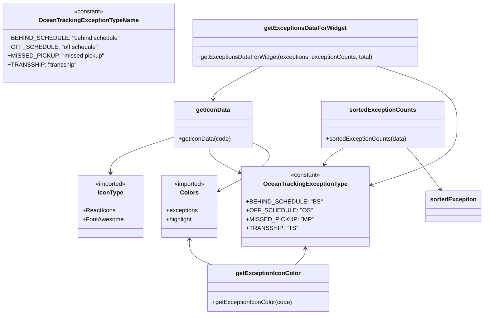

# Diagram: web/portal/src/pages/oceantracking/utils/exceptions.utils.js


> Auto-generated by Obscura crawlers

## Diagram 1

```mermaid
flowchart LR
  subgraph Constants
    A[OceanTrackingExceptionType] -->|BEHIND_SCHEDULE: "BS"| A1(BS)
    A -->|OFF_SCHEDULE: "OS"| A2(OS)
    A -->|MISSED_PICKUP: "MP"| A3(MP)
    A -->|TRANSSHIP: "TS"| A4(TS)
    B[OceanTrackingExceptionTypeName] --> BN1["behind schedule"]
    B --> BN2["off schedule"]
    B --> BN3["missed pickup"]
    B --> BN4["transship"]
    S[sortedException] --> S1(BS)
    S --> S2(TS)
    S --> S3(MP)
    S --> S4(OS)
  end

  getExceptionIconColor[[getExceptionIconColor(code)]]
  getIconData[[getIconData(code)]]
  getExceptionsDataForWidget[[getExceptionsDataForWidget(exceptions, exceptionCounts, total)]]
  sortedExceptionCounts[[sortedExceptionCounts(data)]]

  getIconData -->|calls| getExceptionIconColor
  getExceptionsDataForWidget -->|maps over exceptions and calls| getIconData
  sortedExceptionCounts -->|uses| S

  getExceptionIconColor -->|case BEHIND_SCHEDULE| ColorBS[Colors.exceptions.BEHIND_SCHEDULE]
  getExceptionIconColor -->|case MISSED_PICKUP| ColorMP[Colors.highlight.RED]
  getExceptionIconColor -->|default| ColorDefault[Colors.exceptions.DEFAULT]

  getIconData -->|case BEHIND_SCHEDULE| IconTimer[IoMdTimer (ReactIcons)]
  getIconData -->|case MISSED_PICKUP| IconUpload[MdFileUpload (ReactIcons)]
  getIconData -->|case TRANSSHIP| IconShip[faShip (FontAwesome)]
  getIconData -->|case OFF_SCHEDULE| IconCalendar[faCalendarDays (FontAwesome)]
  getIconData -->|case "Delivered"| IconTruck[faTruckContainer (FontAwesome)]
  getIconData -->|default| IconNull[null]

  getExceptionsDataForWidget -->|computes| Count[count = exceptionCounts[reasonCode] ?? 0]
  getExceptionsDataForWidget -->|computes| Percentage[percentage = total>0 ? (count/total*100).toFixed(2) : "0.00"]
  getExceptionsDataForWidget -->|returns| WidgetItem["{ name, count, percentage, icon, reasonCode }"]

  sortedExceptionCounts -->|sorts input by| SortByOrder["sortedException order indexOf(a.value) - indexOf(b.value)"]
  sortedExceptionCounts -->|returns| SortedResult["{ exceptionList: sortedInput2 }"]
```

> SVG rendering failed for this diagram.

## Diagram 2



### SVG

<svg id="container" width="1264.421875" xmlns="http://www.w3.org/2000/svg" class="classDiagram" height="850" viewBox="0 0 1264.421875 850" role="graphics-document document" aria-roledescription="class"><style>#container{font-family:"trebuchet ms",verdana,arial,sans-serif;font-size:16px;fill:#333;}@keyframes edge-animation-frame{from{stroke-dashoffset:0;}}@keyframes dash{to{stroke-dashoffset:0;}}#container .edge-animation-slow{stroke-dasharray:9,5!important;stroke-dashoffset:900;animation:dash 50s linear infinite;stroke-linecap:round;}#container .edge-animation-fast{stroke-dasharray:9,5!important;stroke-dashoffset:900;animation:dash 20s linear infinite;stroke-linecap:round;}#container .error-icon{fill:#552222;}#container .error-text{fill:#552222;stroke:#552222;}#container .edge-thickness-normal{stroke-width:1px;}#container .edge-thickness-thick{stroke-width:3.5px;}#container .edge-pattern-solid{stroke-dasharray:0;}#container .edge-thickness-invisible{stroke-width:0;fill:none;}#container .edge-pattern-dashed{stroke-dasharray:3;}#container .edge-pattern-dotted{stroke-dasharray:2;}#container .marker{fill:#333333;stroke:#333333;}#container .marker.cross{stroke:#333333;}#container svg{font-family:"trebuchet ms",verdana,arial,sans-serif;font-size:16px;}#container p{margin:0;}#container g.classGroup text{fill:#9370DB;stroke:none;font-family:"trebuchet ms",verdana,arial,sans-serif;font-size:10px;}#container g.classGroup text .title{font-weight:bolder;}#container .nodeLabel,#container .edgeLabel{color:#131300;}#container .edgeLabel .label rect{fill:#ECECFF;}#container .label text{fill:#131300;}#container .labelBkg{background:#ECECFF;}#container .edgeLabel .label span{background:#ECECFF;}#container .classTitle{font-weight:bolder;}#container .node rect,#container .node circle,#container .node ellipse,#container .node polygon,#container .node path{fill:#ECECFF;stroke:#9370DB;stroke-width:1px;}#container .divider{stroke:#9370DB;stroke-width:1;}#container g.clickable{cursor:pointer;}#container g.classGroup rect{fill:#ECECFF;stroke:#9370DB;}#container g.classGroup line{stroke:#9370DB;stroke-width:1;}#container .classLabel .box{stroke:none;stroke-width:0;fill:#ECECFF;opacity:0.5;}#container .classLabel .label{fill:#9370DB;font-size:10px;}#container .relation{stroke:#333333;stroke-width:1;fill:none;}#container .dashed-line{stroke-dasharray:3;}#container .dotted-line{stroke-dasharray:1 2;}#container #compositionStart,#container .composition{fill:#333333!important;stroke:#333333!important;stroke-width:1;}#container #compositionEnd,#container .composition{fill:#333333!important;stroke:#333333!important;stroke-width:1;}#container #dependencyStart,#container .dependency{fill:#333333!important;stroke:#333333!important;stroke-width:1;}#container #dependencyStart,#container .dependency{fill:#333333!important;stroke:#333333!important;stroke-width:1;}#container #extensionStart,#container .extension{fill:transparent!important;stroke:#333333!important;stroke-width:1;}#container #extensionEnd,#container .extension{fill:transparent!important;stroke:#333333!important;stroke-width:1;}#container #aggregationStart,#container .aggregation{fill:transparent!important;stroke:#333333!important;stroke-width:1;}#container #aggregationEnd,#container .aggregation{fill:transparent!important;stroke:#333333!important;stroke-width:1;}#container #lollipopStart,#container .lollipop{fill:#ECECFF!important;stroke:#333333!important;stroke-width:1;}#container #lollipopEnd,#container .lollipop{fill:#ECECFF!important;stroke:#333333!important;stroke-width:1;}#container .edgeTerminals{font-size:11px;line-height:initial;}#container .classTitleText{text-anchor:middle;font-size:18px;fill:#333;}#container .label-icon{display:inline-block;height:1em;overflow:visible;vertical-align:-0.125em;}#container .node .label-icon path{fill:currentColor;stroke:revert;stroke-width:revert;}#container :root{--mermaid-font-family:"trebuchet ms",verdana,arial,sans-serif;}</style><g><defs><marker id="container_class-aggregationStart" class="marker aggregation class" refX="18" refY="7" markerWidth="190" markerHeight="240" orient="auto"><path d="M 18,7 L9,13 L1,7 L9,1 Z"></path></marker></defs><defs><marker id="container_class-aggregationEnd" class="marker aggregation class" refX="1" refY="7" markerWidth="20" markerHeight="28" orient="auto"><path d="M 18,7 L9,13 L1,7 L9,1 Z"></path></marker></defs><defs><marker id="container_class-extensionStart" class="marker extension class" refX="18" refY="7" markerWidth="190" markerHeight="240" orient="auto"><path d="M 1,7 L18,13 V 1 Z"></path></marker></defs><defs><marker id="container_class-extensionEnd" class="marker extension class" refX="1" refY="7" markerWidth="20" markerHeight="28" orient="auto"><path d="M 1,1 V 13 L18,7 Z"></path></marker></defs><defs><marker id="container_class-compositionStart" class="marker composition class" refX="18" refY="7" markerWidth="190" markerHeight="240" orient="auto"><path d="M 18,7 L9,13 L1,7 L9,1 Z"></path></marker></defs><defs><marker id="container_class-compositionEnd" class="marker composition class" refX="1" refY="7" markerWidth="20" markerHeight="28" orient="auto"><path d="M 18,7 L9,13 L1,7 L9,1 Z"></path></marker></defs><defs><marker id="container_class-dependencyStart" class="marker dependency class" refX="6" refY="7" markerWidth="190" markerHeight="240" orient="auto"><path d="M 5,7 L9,13 L1,7 L9,1 Z"></path></marker></defs><defs><marker id="container_class-dependencyEnd" class="marker dependency class" refX="13" refY="7" markerWidth="20" markerHeight="28" orient="auto"><path d="M 18,7 L9,13 L14,7 L9,1 Z"></path></marker></defs><defs><marker id="container_class-lollipopStart" class="marker lollipop class" refX="13" refY="7" markerWidth="190" markerHeight="240" orient="auto"><circle stroke="black" fill="transparent" cx="7" cy="7" r="6"></circle></marker></defs><defs><marker id="container_class-lollipopEnd" class="marker lollipop class" refX="1" refY="7" markerWidth="190" markerHeight="240" orient="auto"><circle stroke="black" fill="transparent" cx="7" cy="7" r="6"></circle></marker></defs><g class="root"><g class="clusters"></g><g class="edgePaths"><path d="M797.328,672L797.328,675.167C797.328,678.333,797.328,684.667,792.625,692C787.922,699.333,778.515,707.667,773.812,711.833L769.109,716" id="id_OceanTrackingExceptionType_getExceptionIconColor_1" class="edge-thickness-normal edge-pattern-solid relation" style=";;;" data-edge="true" data-et="edge" data-id="id_OceanTrackingExceptionType_getExceptionIconColor_1" data-points="W3sieCI6Nzk3LjMyODEyNSwieSI6NjY2fSx7IngiOjc5Ny4zMjgxMjUsInkiOjY5MX0seyJ4Ijo3NjkuMTA4Nzk3OTQwMzQwOSwieSI6NzE2fV0=" marker-start="url(#container_class-dependencyStart)"></path><path d="M494.402,648L494.402,655.167C494.402,662.333,494.402,676.667,504.042,688C513.682,699.333,532.962,707.667,542.602,711.833L552.241,716" id="id_Colors_getExceptionIconColor_2" class="edge-thickness-normal edge-pattern-solid relation" style=";;;" data-edge="true" data-et="edge" data-id="id_Colors_getExceptionIconColor_2" data-points="W3sieCI6NDk0LjQwMjM0Mzc1LCJ5Ijo2NDJ9LHsieCI6NDk0LjQwMjM0Mzc1LCJ5Ijo2OTF9LHsieCI6NTUyLjI0MTQ3NzI3MjcyNzMsInkiOjcxNn1d" marker-start="url(#container_class-dependencyStart)"></path><path d="M452.299,370.154L423.653,379.295C395.008,388.436,337.717,406.718,309.071,423.026C280.426,439.333,280.426,453.667,280.426,460.833L280.426,468" id="id_getIconData_IconType_3" class="edge-thickness-normal edge-pattern-solid relation" style=";;;" data-edge="true" data-et="edge" data-id="id_getIconData_IconType_3" data-points="W3sieCI6NDUyLjI5ODgyODEyNSwieSI6MzcwLjE1MzcxMTU4NjI2ODQ2fSx7IngiOjI4MC40MjU3ODEyNSwieSI6NDI1fSx7IngiOjI4MC40MjU3ODEyNSwieSI6NDc0fV0=" marker-end="url(#container_class-dependencyEnd)"></path><path d="M544.04,400L543.236,404.167C542.432,408.333,540.824,416.667,555.957,429.045C571.089,441.423,602.962,457.847,618.898,466.058L634.834,474.27" id="id_getIconData_OceanTrackingExceptionType_4" class="edge-thickness-normal edge-pattern-solid relation" style=";;;" data-edge="true" data-et="edge" data-id="id_getIconData_OceanTrackingExceptionType_4" data-points="W3sieCI6NTQ0LjAzOTY4Mzk0ODg2MzYsInkiOjQwMH0seyJ4Ijo1MzkuMjE2Nzk2ODc1LCJ5Ijo0MjV9LHsieCI6NjQwLjE2Nzk2ODc1LCJ5Ijo0NzcuMDE4Mjc0MjczMDAxNzR9XQ==" marker-end="url(#container_class-dependencyEnd)"></path><path d="M660.088,385.892L673.939,392.41C687.79,398.928,715.492,411.964,701.5,433.366C687.509,454.768,631.824,484.537,603.981,499.421L576.139,514.305" id="id_getIconData_Colors_5" class="edge-thickness-normal edge-pattern-solid relation" style=";;;" data-edge="true" data-et="edge" data-id="id_getIconData_Colors_5" data-points="W3sieCI6NjYwLjA4Nzg5MDYyNSwieSI6Mzg1Ljg5MTU0NDExNzY0NzF9LHsieCI6NzQzLjE5MzM1OTM3NSwieSI6NDI1fSx7IngiOjU3MC44NDc2NTYyNSwieSI6NTE3LjEzMzQ2NTc0NDQ5ODh9XQ==" marker-end="url(#container_class-dependencyEnd)"></path><path d="M683.106,179L661.954,190.667C640.802,202.333,598.498,225.667,577.346,240.5C556.193,255.333,556.193,261.667,556.193,264.833L556.193,268" id="id_getExceptionsDataForWidget_getIconData_6" class="edge-thickness-normal edge-pattern-solid relation" style=";;;" data-edge="true" data-et="edge" data-id="id_getExceptionsDataForWidget_getIconData_6" data-points="W3sieCI6NjgzLjEwNjM5MzkxNDQ3MzYsInkiOjE3OX0seyJ4Ijo1NTYuMTkzMzU5Mzc1LCJ5IjoyNDl9LHsieCI6NTU2LjE5MzM1OTM3NSwieSI6Mjc0fV0=" marker-end="url(#container_class-dependencyEnd)"></path><path d="M985.614,179L1020.482,190.667C1055.349,202.333,1125.085,225.667,1159.953,252C1194.82,278.333,1194.82,307.667,1194.82,337C1194.82,366.333,1194.82,395.667,1155.713,423.418C1116.606,451.17,1038.392,477.34,999.285,490.426L960.178,503.511" id="id_getExceptionsDataForWidget_OceanTrackingExceptionType_7" class="edge-thickness-normal edge-pattern-solid relation" style=";;;" data-edge="true" data-et="edge" data-id="id_getExceptionsDataForWidget_OceanTrackingExceptionType_7" data-points="W3sieCI6OTg1LjYxMzg5ODAyNjMxNTgsInkiOjE3OX0seyJ4IjoxMTk0LjgyMDMxMjUsInkiOjI0OX0seyJ4IjoxMTk0LjgyMDMxMjUsInkiOjMzN30seyJ4IjoxMTk0LjgyMDMxMjUsInkiOjQyNX0seyJ4Ijo5NTQuNDg4MjgxMjUsInkiOjUwNS40MTQ1NjIwMDAwMzkzfV0=" marker-end="url(#container_class-dependencyEnd)"></path><path d="M896.372,400L889.773,404.167C883.173,408.333,869.974,416.667,861.921,424.087C853.867,431.507,850.958,438.015,849.504,441.269L848.049,444.522" id="id_sortedExceptionCounts_OceanTrackingExceptionType_8" class="edge-thickness-normal edge-pattern-solid relation" style=";;;" data-edge="true" data-et="edge" data-id="id_sortedExceptionCounts_OceanTrackingExceptionType_8" data-points="W3sieCI6ODk2LjM3MjIyNTY3NDcxNTksInkiOjQwMH0seyJ4Ijo4NTYuNzc1MzkwNjI1LCJ5Ijo0MjV9LHsieCI6ODQ1LjYwMTA5MjU3NTE4OCwieSI6NDUwfV0=" marker-end="url(#container_class-dependencyEnd)"></path><path d="M1060.11,400L1064.34,404.167C1068.569,408.333,1077.029,416.667,1091.987,435.199C1106.946,453.731,1128.404,482.462,1139.133,496.827L1149.862,511.193" id="id_sortedExceptionCounts_sortedException_9" class="edge-thickness-normal edge-pattern-solid relation" style=";;;" data-edge="true" data-et="edge" data-id="id_sortedExceptionCounts_sortedException_9" data-points="W3sieCI6MTA2MC4xMDk4NjMyODEyNSwieSI6NDAwfSx7IngiOjEwODUuNDg4MjgxMjUsInkiOjQyNX0seyJ4IjoxMTUzLjQ1MjMwMjYzMTU3OSwieSI6NTE2fV0=" marker-end="url(#container_class-dependencyEnd)"></path></g><g class="edgeLabels"><g class="edgeLabel"><g class="label" data-id="id_OceanTrackingExceptionType_getExceptionIconColor_1" transform="translate(0, 0)"><foreignObject width="0" height="0"><div xmlns="http://www.w3.org/1999/xhtml" class="labelBkg" style="display: table-cell; white-space: nowrap; line-height: 1.5; max-width: 200px; text-align: center;"><span class="edgeLabel"></span></div></foreignObject></g></g><g class="edgeLabel"><g class="label" data-id="id_Colors_getExceptionIconColor_2" transform="translate(0, 0)"><foreignObject width="0" height="0"><div xmlns="http://www.w3.org/1999/xhtml" class="labelBkg" style="display: table-cell; white-space: nowrap; line-height: 1.5; max-width: 200px; text-align: center;"><span class="edgeLabel"></span></div></foreignObject></g></g><g class="edgeLabel"><g class="label" data-id="id_getIconData_IconType_3" transform="translate(0, 0)"><foreignObject width="0" height="0"><div xmlns="http://www.w3.org/1999/xhtml" class="labelBkg" style="display: table-cell; white-space: nowrap; line-height: 1.5; max-width: 200px; text-align: center;"><span class="edgeLabel"></span></div></foreignObject></g></g><g class="edgeLabel"><g class="label" data-id="id_getIconData_OceanTrackingExceptionType_4" transform="translate(0, 0)"><foreignObject width="0" height="0"><div xmlns="http://www.w3.org/1999/xhtml" class="labelBkg" style="display: table-cell; white-space: nowrap; line-height: 1.5; max-width: 200px; text-align: center;"><span class="edgeLabel"></span></div></foreignObject></g></g><g class="edgeLabel"><g class="label" data-id="id_getIconData_Colors_5" transform="translate(0, 0)"><foreignObject width="0" height="0"><div xmlns="http://www.w3.org/1999/xhtml" class="labelBkg" style="display: table-cell; white-space: nowrap; line-height: 1.5; max-width: 200px; text-align: center;"><span class="edgeLabel"></span></div></foreignObject></g></g><g class="edgeLabel"><g class="label" data-id="id_getExceptionsDataForWidget_getIconData_6" transform="translate(0, 0)"><foreignObject width="0" height="0"><div xmlns="http://www.w3.org/1999/xhtml" class="labelBkg" style="display: table-cell; white-space: nowrap; line-height: 1.5; max-width: 200px; text-align: center;"><span class="edgeLabel"></span></div></foreignObject></g></g><g class="edgeLabel"><g class="label" data-id="id_getExceptionsDataForWidget_OceanTrackingExceptionType_7" transform="translate(0, 0)"><foreignObject width="0" height="0"><div xmlns="http://www.w3.org/1999/xhtml" class="labelBkg" style="display: table-cell; white-space: nowrap; line-height: 1.5; max-width: 200px; text-align: center;"><span class="edgeLabel"></span></div></foreignObject></g></g><g class="edgeLabel"><g class="label" data-id="id_sortedExceptionCounts_OceanTrackingExceptionType_8" transform="translate(0, 0)"><foreignObject width="0" height="0"><div xmlns="http://www.w3.org/1999/xhtml" class="labelBkg" style="display: table-cell; white-space: nowrap; line-height: 1.5; max-width: 200px; text-align: center;"><span class="edgeLabel"></span></div></foreignObject></g></g><g class="edgeLabel"><g class="label" data-id="id_sortedExceptionCounts_sortedException_9" transform="translate(0, 0)"><foreignObject width="0" height="0"><div xmlns="http://www.w3.org/1999/xhtml" class="labelBkg" style="display: table-cell; white-space: nowrap; line-height: 1.5; max-width: 200px; text-align: center;"><span class="edgeLabel"></span></div></foreignObject></g></g></g><g class="nodes"><g class="node default" id="classId-OceanTrackingExceptionType-0" transform="translate(797.328125, 558)"><g class="basic label-container"><path d="M-157.16015625 -108 L157.16015625 -108 L157.16015625 108 L-157.16015625 108" stroke="none" stroke-width="0" fill="#ECECFF" style=""></path><path d="M-157.16015625 -108 C-58.06177526066891 -108, 41.03660572866218 -108, 157.16015625 -108 M-157.16015625 -108 C-83.65899388557146 -108, -10.157831521142924 -108, 157.16015625 -108 M157.16015625 -108 C157.16015625 -48.66713811024469, 157.16015625 10.665723779510614, 157.16015625 108 M157.16015625 -108 C157.16015625 -24.928256486040723, 157.16015625 58.14348702791855, 157.16015625 108 M157.16015625 108 C73.87291246705381 108, -9.414331315892383 108, -157.16015625 108 M157.16015625 108 C80.48792517154111 108, 3.8156940930822145 108, -157.16015625 108 M-157.16015625 108 C-157.16015625 45.660809921919224, -157.16015625 -16.678380156161552, -157.16015625 -108 M-157.16015625 108 C-157.16015625 63.81260033404038, -157.16015625 19.625200668080765, -157.16015625 -108" stroke="#9370DB" stroke-width="1.3" fill="none" stroke-dasharray="0 0" style=""></path></g><g class="annotation-group text" transform="translate(-40.4921875, -84)"><g class="label" style="" transform="translate(0,-12)"><foreignObject width="80.984375" height="24"><div xmlns="http://www.w3.org/1999/xhtml" style="display: table-cell; white-space: nowrap; line-height: 1.5; max-width: 131px; text-align: center;"><span class="nodeLabel markdown-node-label" style=""><p>«constant»</p></span></div></foreignObject></g></g><g class="label-group text" transform="translate(-106.4921875, -60)"><g class="label" style="font-weight: bolder" transform="translate(0,-12)"><foreignObject width="212.984375" height="24"><div xmlns="http://www.w3.org/1999/xhtml" style="display: table-cell; white-space: nowrap; line-height: 1.5; max-width: 260px; text-align: center;"><span class="nodeLabel markdown-node-label" style=""><p>OceanTrackingExceptionType</p></span></div></foreignObject></g></g><g class="members-group text" transform="translate(-145.16015625, -12)"><g class="label" style="" transform="translate(0,-12)"><foreignObject width="183.828125" height="24"><div xmlns="http://www.w3.org/1999/xhtml" style="display: table-cell; white-space: nowrap; line-height: 1.5; max-width: 241px; text-align: center;"><span class="nodeLabel markdown-node-label" style=""><p>+BEHIND_SCHEDULE: "BS"</p></span></div></foreignObject></g><g class="label" style="" transform="translate(0,12)"><foreignObject width="156.203125" height="24"><div xmlns="http://www.w3.org/1999/xhtml" style="display: table-cell; white-space: nowrap; line-height: 1.5; max-width: 214px; text-align: center;"><span class="nodeLabel markdown-node-label" style=""><p>+OFF_SCHEDULE: "OS"</p></span></div></foreignObject></g><g class="label" style="" transform="translate(0,36)"><foreignObject width="163.640625" height="24"><div xmlns="http://www.w3.org/1999/xhtml" style="display: table-cell; white-space: nowrap; line-height: 1.5; max-width: 221px; text-align: center;"><span class="nodeLabel markdown-node-label" style=""><p>+MISSED_PICKUP: "MP"</p></span></div></foreignObject></g><g class="label" style="" transform="translate(0,60)"><foreignObject width="124.828125" height="24"><div xmlns="http://www.w3.org/1999/xhtml" style="display: table-cell; white-space: nowrap; line-height: 1.5; max-width: 182px; text-align: center;"><span class="nodeLabel markdown-node-label" style=""><p>+TRANSSHIP: "TS"</p></span></div></foreignObject></g></g><g class="methods-group text" transform="translate(-145.16015625, 108)"></g><g class="divider" style=""><path d="M-157.16015625 -36 C-54.83549718485958 -36, 47.48916188028085 -36, 157.16015625 -36 M-157.16015625 -36 C-38.827224687028576 -36, 79.50570687594285 -36, 157.16015625 -36" stroke="#9370DB" stroke-width="1.3" fill="none" stroke-dasharray="0 0" style=""></path></g><g class="divider" style=""><path d="M-157.16015625 84 C-36.644153115267045 84, 83.87185001946591 84, 157.16015625 84 M-157.16015625 84 C-66.11539103259248 84, 24.929374184815032 84, 157.16015625 84" stroke="#9370DB" stroke-width="1.3" fill="none" stroke-dasharray="0 0" style=""></path></g></g><g class="node default" id="classId-OceanTrackingExceptionTypeName-1" transform="translate(226.890625, 116)"><g class="basic label-container"><path d="M-218.890625 -108 L218.890625 -108 L218.890625 108 L-218.890625 108" stroke="none" stroke-width="0" fill="#ECECFF" style=""></path><path d="M-218.890625 -108 C-98.21851807972888 -108, 22.45358884054224 -108, 218.890625 -108 M-218.890625 -108 C-70.10428178011068 -108, 78.68206143977864 -108, 218.890625 -108 M218.890625 -108 C218.890625 -31.68860744720159, 218.890625 44.62278510559682, 218.890625 108 M218.890625 -108 C218.890625 -59.449777949244606, 218.890625 -10.899555898489211, 218.890625 108 M218.890625 108 C58.410507666746355 108, -102.06960966650729 108, -218.890625 108 M218.890625 108 C117.29453678038462 108, 15.698448560769236 108, -218.890625 108 M-218.890625 108 C-218.890625 42.47614717635798, -218.890625 -23.047705647284033, -218.890625 -108 M-218.890625 108 C-218.890625 33.65594856991487, -218.890625 -40.68810286017026, -218.890625 -108" stroke="#9370DB" stroke-width="1.3" fill="none" stroke-dasharray="0 0" style=""></path></g><g class="annotation-group text" transform="translate(-40.4921875, -84)"><g class="label" style="" transform="translate(0,-12)"><foreignObject width="80.984375" height="24"><div xmlns="http://www.w3.org/1999/xhtml" style="display: table-cell; white-space: nowrap; line-height: 1.5; max-width: 131px; text-align: center;"><span class="nodeLabel markdown-node-label" style=""><p>«constant»</p></span></div></foreignObject></g></g><g class="label-group text" transform="translate(-127.359375, -60)"><g class="label" style="font-weight: bolder" transform="translate(0,-12)"><foreignObject width="254.71875" height="24"><div xmlns="http://www.w3.org/1999/xhtml" style="display: table-cell; white-space: nowrap; line-height: 1.5; max-width: 302px; text-align: center;"><span class="nodeLabel markdown-node-label" style=""><p>OceanTrackingExceptionTypeName</p></span></div></foreignObject></g></g><g class="members-group text" transform="translate(-206.890625, -12)"><g class="label" style="" transform="translate(0,-12)"><foreignObject width="286.421875" height="24"><div xmlns="http://www.w3.org/1999/xhtml" style="display: table-cell; white-space: nowrap; line-height: 1.5; max-width: 344px; text-align: center;"><span class="nodeLabel markdown-node-label" style=""><p>+BEHIND_SCHEDULE: "behind schedule"</p></span></div></foreignObject></g><g class="label" style="" transform="translate(0,12)"><foreignObject width="225.96875" height="24"><div xmlns="http://www.w3.org/1999/xhtml" style="display: table-cell; white-space: nowrap; line-height: 1.5; max-width: 283px; text-align: center;"><span class="nodeLabel markdown-node-label" style=""><p>+OFF_SCHEDULE: "off schedule"</p></span></div></foreignObject></g><g class="label" style="" transform="translate(0,36)"><foreignObject width="245.828125" height="24"><div xmlns="http://www.w3.org/1999/xhtml" style="display: table-cell; white-space: nowrap; line-height: 1.5; max-width: 303px; text-align: center;"><span class="nodeLabel markdown-node-label" style=""><p>+MISSED_PICKUP: "missed pickup"</p></span></div></foreignObject></g><g class="label" style="" transform="translate(0,60)"><foreignObject width="175.796875" height="24"><div xmlns="http://www.w3.org/1999/xhtml" style="display: table-cell; white-space: nowrap; line-height: 1.5; max-width: 233px; text-align: center;"><span class="nodeLabel markdown-node-label" style=""><p>+TRANSSHIP: "transship"</p></span></div></foreignObject></g></g><g class="methods-group text" transform="translate(-206.890625, 108)"></g><g class="divider" style=""><path d="M-218.890625 -36 C-91.9102429260251 -36, 35.07013914794979 -36, 218.890625 -36 M-218.890625 -36 C-118.65012353486185 -36, -18.409622069723696 -36, 218.890625 -36" stroke="#9370DB" stroke-width="1.3" fill="none" stroke-dasharray="0 0" style=""></path></g><g class="divider" style=""><path d="M-218.890625 84 C-106.9343733789481 84, 5.02187824210381 84, 218.890625 84 M-218.890625 84 C-99.22925131485546 84, 20.43212237028908 84, 218.890625 84" stroke="#9370DB" stroke-width="1.3" fill="none" stroke-dasharray="0 0" style=""></path></g></g><g class="node default" id="classId-Colors-2" transform="translate(494.40234375, 558)"><g class="basic label-container"><path d="M-76.4453125 -84 L76.4453125 -84 L76.4453125 84 L-76.4453125 84" stroke="none" stroke-width="0" fill="#ECECFF" style=""></path><path d="M-76.4453125 -84 C-43.72942863144463 -84, -11.013544762889254 -84, 76.4453125 -84 M-76.4453125 -84 C-33.129283706771815 -84, 10.18674508645637 -84, 76.4453125 -84 M76.4453125 -84 C76.4453125 -47.498612079736986, 76.4453125 -10.997224159473973, 76.4453125 84 M76.4453125 -84 C76.4453125 -33.387602811776226, 76.4453125 17.224794376447548, 76.4453125 84 M76.4453125 84 C42.87349240663643 84, 9.30167231327286 84, -76.4453125 84 M76.4453125 84 C38.81065296124783 84, 1.1759934224956652 84, -76.4453125 84 M-76.4453125 84 C-76.4453125 43.84084287833, -76.4453125 3.681685756660002, -76.4453125 -84 M-76.4453125 84 C-76.4453125 42.78957539962766, -76.4453125 1.5791507992553164, -76.4453125 -84" stroke="#9370DB" stroke-width="1.3" fill="none" stroke-dasharray="0 0" style=""></path></g><g class="annotation-group text" transform="translate(-42.671875, -60)"><g class="label" style="" transform="translate(0,-12)"><foreignObject width="85.34375" height="24"><div xmlns="http://www.w3.org/1999/xhtml" style="display: table-cell; white-space: nowrap; line-height: 1.5; max-width: 135px; text-align: center;"><span class="nodeLabel markdown-node-label" style=""><p>«imported»</p></span></div></foreignObject></g></g><g class="label-group text" transform="translate(-23.1015625, -36)"><g class="label" style="font-weight: bolder" transform="translate(0,-12)"><foreignObject width="46.203125" height="24"><div xmlns="http://www.w3.org/1999/xhtml" style="display: table-cell; white-space: nowrap; line-height: 1.5; max-width: 95px; text-align: center;"><span class="nodeLabel markdown-node-label" style=""><p>Colors</p></span></div></foreignObject></g></g><g class="members-group text" transform="translate(-64.4453125, 12)"><g class="label" style="" transform="translate(0,-12)"><foreignObject width="86.21875" height="24"><div xmlns="http://www.w3.org/1999/xhtml" style="display: table-cell; white-space: nowrap; line-height: 1.5; max-width: 144px; text-align: center;"><span class="nodeLabel markdown-node-label" style=""><p>+exceptions</p></span></div></foreignObject></g><g class="label" style="" transform="translate(0,12)"><foreignObject width="72.25" height="24"><div xmlns="http://www.w3.org/1999/xhtml" style="display: table-cell; white-space: nowrap; line-height: 1.5; max-width: 130px; text-align: center;"><span class="nodeLabel markdown-node-label" style=""><p>+highlight</p></span></div></foreignObject></g></g><g class="methods-group text" transform="translate(-64.4453125, 84)"></g><g class="divider" style=""><path d="M-76.4453125 -12 C-31.843114680216665 -12, 12.75908313956667 -12, 76.4453125 -12 M-76.4453125 -12 C-37.09188373265714 -12, 2.2615450346857244 -12, 76.4453125 -12" stroke="#9370DB" stroke-width="1.3" fill="none" stroke-dasharray="0 0" style=""></path></g><g class="divider" style=""><path d="M-76.4453125 60 C-35.021610066644804 60, 6.4020923667103915 60, 76.4453125 60 M-76.4453125 60 C-16.087463923042293 60, 44.270384653915414 60, 76.4453125 60" stroke="#9370DB" stroke-width="1.3" fill="none" stroke-dasharray="0 0" style=""></path></g></g><g class="node default" id="classId-IconType-3" transform="translate(280.42578125, 558)"><g class="basic label-container"><path d="M-87.53125 -84 L87.53125 -84 L87.53125 84 L-87.53125 84" stroke="none" stroke-width="0" fill="#ECECFF" style=""></path><path d="M-87.53125 -84 C-22.510481326108305 -84, 42.51028734778339 -84, 87.53125 -84 M-87.53125 -84 C-49.37458512242924 -84, -11.217920244858476 -84, 87.53125 -84 M87.53125 -84 C87.53125 -35.1181688889258, 87.53125 13.763662222148398, 87.53125 84 M87.53125 -84 C87.53125 -47.395771984692075, 87.53125 -10.79154396938415, 87.53125 84 M87.53125 84 C41.18178891372966 84, -5.1676721725406765 84, -87.53125 84 M87.53125 84 C40.357673019076714 84, -6.815903961846573 84, -87.53125 84 M-87.53125 84 C-87.53125 41.52088443680245, -87.53125 -0.9582311263951055, -87.53125 -84 M-87.53125 84 C-87.53125 42.267342829188756, -87.53125 0.5346856583775121, -87.53125 -84" stroke="#9370DB" stroke-width="1.3" fill="none" stroke-dasharray="0 0" style=""></path></g><g class="annotation-group text" transform="translate(-42.671875, -60)"><g class="label" style="" transform="translate(0,-12)"><foreignObject width="85.34375" height="24"><div xmlns="http://www.w3.org/1999/xhtml" style="display: table-cell; white-space: nowrap; line-height: 1.5; max-width: 135px; text-align: center;"><span class="nodeLabel markdown-node-label" style=""><p>«imported»</p></span></div></foreignObject></g></g><g class="label-group text" transform="translate(-32.640625, -36)"><g class="label" style="font-weight: bolder" transform="translate(0,-12)"><foreignObject width="65.28125" height="24"><div xmlns="http://www.w3.org/1999/xhtml" style="display: table-cell; white-space: nowrap; line-height: 1.5; max-width: 115px; text-align: center;"><span class="nodeLabel markdown-node-label" style=""><p>IconType</p></span></div></foreignObject></g></g><g class="members-group text" transform="translate(-75.53125, 12)"><g class="label" style="" transform="translate(0,-12)"><foreignObject width="86.359375" height="24"><div xmlns="http://www.w3.org/1999/xhtml" style="display: table-cell; white-space: nowrap; line-height: 1.5; max-width: 144px; text-align: center;"><span class="nodeLabel markdown-node-label" style=""><p>+ReactIcons</p></span></div></foreignObject></g><g class="label" style="" transform="translate(0,12)"><foreignObject width="108.390625" height="24"><div xmlns="http://www.w3.org/1999/xhtml" style="display: table-cell; white-space: nowrap; line-height: 1.5; max-width: 166px; text-align: center;"><span class="nodeLabel markdown-node-label" style=""><p>+FontAwesome</p></span></div></foreignObject></g></g><g class="methods-group text" transform="translate(-75.53125, 84)"></g><g class="divider" style=""><path d="M-87.53125 -12 C-20.020845189435704 -12, 47.48955962112859 -12, 87.53125 -12 M-87.53125 -12 C-24.327354624375992 -12, 38.876540751248015 -12, 87.53125 -12" stroke="#9370DB" stroke-width="1.3" fill="none" stroke-dasharray="0 0" style=""></path></g><g class="divider" style=""><path d="M-87.53125 60 C-19.991006932287718 60, 47.549236135424565 60, 87.53125 60 M-87.53125 60 C-44.460200602903804 60, -1.3891512058076074 60, 87.53125 60" stroke="#9370DB" stroke-width="1.3" fill="none" stroke-dasharray="0 0" style=""></path></g></g><g class="node default" id="classId-getExceptionIconColor-4" transform="translate(697.99609375, 779)"><g class="basic label-container"><path d="M-160.78515625 -63 L160.78515625 -63 L160.78515625 63 L-160.78515625 63" stroke="none" stroke-width="0" fill="#ECECFF" style=""></path><path d="M-160.78515625 -63 C-52.85422930798343 -63, 55.07669763403314 -63, 160.78515625 -63 M-160.78515625 -63 C-80.43253302264745 -63, -0.0799097952948955 -63, 160.78515625 -63 M160.78515625 -63 C160.78515625 -36.4109312960356, 160.78515625 -9.821862592071199, 160.78515625 63 M160.78515625 -63 C160.78515625 -25.36303525852596, 160.78515625 12.273929482948077, 160.78515625 63 M160.78515625 63 C91.33288756021115 63, 21.880618870422296 63, -160.78515625 63 M160.78515625 63 C69.94379432997465 63, -20.8975675900507 63, -160.78515625 63 M-160.78515625 63 C-160.78515625 17.176887785974905, -160.78515625 -28.64622442805019, -160.78515625 -63 M-160.78515625 63 C-160.78515625 32.56259820782718, -160.78515625 2.125196415654351, -160.78515625 -63" stroke="#9370DB" stroke-width="1.3" fill="none" stroke-dasharray="0 0" style=""></path></g><g class="annotation-group text" transform="translate(0, -39)"></g><g class="label-group text" transform="translate(-82.0703125, -39)"><g class="label" style="font-weight: bolder" transform="translate(0,-12)"><foreignObject width="164.140625" height="24"><div xmlns="http://www.w3.org/1999/xhtml" style="display: table-cell; white-space: nowrap; line-height: 1.5; max-width: 213px; text-align: center;"><span class="nodeLabel markdown-node-label" style=""><p>getExceptionIconColor</p></span></div></foreignObject></g></g><g class="members-group text" transform="translate(-148.78515625, 9)"></g><g class="methods-group text" transform="translate(-148.78515625, 39)"><g class="label" style="" transform="translate(0,-12)"><foreignObject width="215.5" height="24"><div xmlns="http://www.w3.org/1999/xhtml" style="display: table-cell; white-space: nowrap; line-height: 1.5; max-width: 273px; text-align: center;"><span class="nodeLabel markdown-node-label" style=""><p>+getExceptionIconColor(code)</p></span></div></foreignObject></g></g><g class="divider" style=""><path d="M-160.78515625 -15 C-49.7575893657327 -15, 61.2699775185346 -15, 160.78515625 -15 M-160.78515625 -15 C-34.966282651177366 -15, 90.85259094764527 -15, 160.78515625 -15" stroke="#9370DB" stroke-width="1.3" fill="none" stroke-dasharray="0 0" style=""></path></g><g class="divider" style=""><path d="M-160.78515625 9 C-71.46019721082327 9, 17.864761828353465 9, 160.78515625 9 M-160.78515625 9 C-40.93666270003767 9, 78.91183084992466 9, 160.78515625 9" stroke="#9370DB" stroke-width="1.3" fill="none" stroke-dasharray="0 0" style=""></path></g></g><g class="node default" id="classId-getIconData-5" transform="translate(556.193359375, 337)"><g class="basic label-container"><path d="M-103.89453125 -63 L103.89453125 -63 L103.89453125 63 L-103.89453125 63" stroke="none" stroke-width="0" fill="#ECECFF" style=""></path><path d="M-103.89453125 -63 C-23.726343421389814 -63, 56.44184440722037 -63, 103.89453125 -63 M-103.89453125 -63 C-56.49168089615854 -63, -9.088830542317083 -63, 103.89453125 -63 M103.89453125 -63 C103.89453125 -22.69639516303664, 103.89453125 17.607209673926718, 103.89453125 63 M103.89453125 -63 C103.89453125 -31.270145675398812, 103.89453125 0.4597086492023763, 103.89453125 63 M103.89453125 63 C31.530286594793907 63, -40.833958060412186 63, -103.89453125 63 M103.89453125 63 C29.722613105223218 63, -44.449305039553565 63, -103.89453125 63 M-103.89453125 63 C-103.89453125 15.49793695456136, -103.89453125 -32.00412609087728, -103.89453125 -63 M-103.89453125 63 C-103.89453125 23.486134839085395, -103.89453125 -16.02773032182921, -103.89453125 -63" stroke="#9370DB" stroke-width="1.3" fill="none" stroke-dasharray="0 0" style=""></path></g><g class="annotation-group text" transform="translate(0, -39)"></g><g class="label-group text" transform="translate(-43.9296875, -39)"><g class="label" style="font-weight: bolder" transform="translate(0,-12)"><foreignObject width="87.859375" height="24"><div xmlns="http://www.w3.org/1999/xhtml" style="display: table-cell; white-space: nowrap; line-height: 1.5; max-width: 137px; text-align: center;"><span class="nodeLabel markdown-node-label" style=""><p>getIconData</p></span></div></foreignObject></g></g><g class="members-group text" transform="translate(-91.89453125, 9)"></g><g class="methods-group text" transform="translate(-91.89453125, 39)"><g class="label" style="" transform="translate(0,-12)"><foreignObject width="139.859375" height="24"><div xmlns="http://www.w3.org/1999/xhtml" style="display: table-cell; white-space: nowrap; line-height: 1.5; max-width: 197px; text-align: center;"><span class="nodeLabel markdown-node-label" style=""><p>+getIconData(code)</p></span></div></foreignObject></g></g><g class="divider" style=""><path d="M-103.89453125 -15 C-34.39219915242798 -15, 35.110132945144045 -15, 103.89453125 -15 M-103.89453125 -15 C-22.700732827940556 -15, 58.49306559411889 -15, 103.89453125 -15" stroke="#9370DB" stroke-width="1.3" fill="none" stroke-dasharray="0 0" style=""></path></g><g class="divider" style=""><path d="M-103.89453125 9 C-22.862848881581115 9, 58.16883348683777 9, 103.89453125 9 M-103.89453125 9 C-27.884404796455 9, 48.12572165709 9, 103.89453125 9" stroke="#9370DB" stroke-width="1.3" fill="none" stroke-dasharray="0 0" style=""></path></g></g><g class="node default" id="classId-getExceptionsDataForWidget-6" transform="translate(797.328125, 116)"><g class="basic label-container"><path d="M-301.546875 -63 L301.546875 -63 L301.546875 63 L-301.546875 63" stroke="none" stroke-width="0" fill="#ECECFF" style=""></path><path d="M-301.546875 -63 C-86.42344722638882 -63, 128.69998054722237 -63, 301.546875 -63 M-301.546875 -63 C-165.23700969954442 -63, -28.92714439908883 -63, 301.546875 -63 M301.546875 -63 C301.546875 -28.01064919241194, 301.546875 6.978701615176121, 301.546875 63 M301.546875 -63 C301.546875 -24.09868445747849, 301.546875 14.802631085043018, 301.546875 63 M301.546875 63 C174.03765335209334 63, 46.528431704186715 63, -301.546875 63 M301.546875 63 C167.5316430375656 63, 33.5164110751312 63, -301.546875 63 M-301.546875 63 C-301.546875 20.677279986930806, -301.546875 -21.645440026138388, -301.546875 -63 M-301.546875 63 C-301.546875 26.03540281865996, -301.546875 -10.929194362680079, -301.546875 -63" stroke="#9370DB" stroke-width="1.3" fill="none" stroke-dasharray="0 0" style=""></path></g><g class="annotation-group text" transform="translate(0, -39)"></g><g class="label-group text" transform="translate(-105.25, -39)"><g class="label" style="font-weight: bolder" transform="translate(0,-12)"><foreignObject width="210.5" height="24"><div xmlns="http://www.w3.org/1999/xhtml" style="display: table-cell; white-space: nowrap; line-height: 1.5; max-width: 257px; text-align: center;"><span class="nodeLabel markdown-node-label" style=""><p>getExceptionsDataForWidget</p></span></div></foreignObject></g></g><g class="members-group text" transform="translate(-289.546875, 9)"></g><g class="methods-group text" transform="translate(-289.546875, 39)"><g class="label" style="" transform="translate(0,-12)"><foreignObject width="473.84375" height="24"><div xmlns="http://www.w3.org/1999/xhtml" style="display: table-cell; white-space: nowrap; line-height: 1.5; max-width: 531px; text-align: center;"><span class="nodeLabel markdown-node-label" style=""><p>+getExceptionsDataForWidget(exceptions, exceptionCounts, total)</p></span></div></foreignObject></g></g><g class="divider" style=""><path d="M-301.546875 -15 C-75.84686616732677 -15, 149.85314266534647 -15, 301.546875 -15 M-301.546875 -15 C-140.31874967816086 -15, 20.90937564367829 -15, 301.546875 -15" stroke="#9370DB" stroke-width="1.3" fill="none" stroke-dasharray="0 0" style=""></path></g><g class="divider" style=""><path d="M-301.546875 9 C-156.18652891037502 9, -10.826182820750034 9, 301.546875 9 M-301.546875 9 C-147.43789388631583 9, 6.671087227368332 9, 301.546875 9" stroke="#9370DB" stroke-width="1.3" fill="none" stroke-dasharray="0 0" style=""></path></g></g><g class="node default" id="classId-sortedExceptionCounts-7" transform="translate(996.15625, 337)"><g class="basic label-container"><path d="M-163.6640625 -63 L163.6640625 -63 L163.6640625 63 L-163.6640625 63" stroke="none" stroke-width="0" fill="#ECECFF" style=""></path><path d="M-163.6640625 -63 C-70.66539417016072 -63, 22.333274159678552 -63, 163.6640625 -63 M-163.6640625 -63 C-68.40798734114881 -63, 26.84808781770238 -63, 163.6640625 -63 M163.6640625 -63 C163.6640625 -19.524583213470272, 163.6640625 23.950833573059455, 163.6640625 63 M163.6640625 -63 C163.6640625 -20.515701057458536, 163.6640625 21.96859788508293, 163.6640625 63 M163.6640625 63 C49.702508253105606 63, -64.25904599378879 63, -163.6640625 63 M163.6640625 63 C53.226194249312414 63, -57.21167400137517 63, -163.6640625 63 M-163.6640625 63 C-163.6640625 19.918698613844192, -163.6640625 -23.162602772311615, -163.6640625 -63 M-163.6640625 63 C-163.6640625 16.389659483825426, -163.6640625 -30.220681032349148, -163.6640625 -63" stroke="#9370DB" stroke-width="1.3" fill="none" stroke-dasharray="0 0" style=""></path></g><g class="annotation-group text" transform="translate(0, -39)"></g><g class="label-group text" transform="translate(-84.859375, -39)"><g class="label" style="font-weight: bolder" transform="translate(0,-12)"><foreignObject width="169.71875" height="24"><div xmlns="http://www.w3.org/1999/xhtml" style="display: table-cell; white-space: nowrap; line-height: 1.5; max-width: 217px; text-align: center;"><span class="nodeLabel markdown-node-label" style=""><p>sortedExceptionCounts</p></span></div></foreignObject></g></g><g class="members-group text" transform="translate(-151.6640625, 9)"></g><g class="methods-group text" transform="translate(-151.6640625, 39)"><g class="label" style="" transform="translate(0,-12)"><foreignObject width="218.46875" height="24"><div xmlns="http://www.w3.org/1999/xhtml" style="display: table-cell; white-space: nowrap; line-height: 1.5; max-width: 276px; text-align: center;"><span class="nodeLabel markdown-node-label" style=""><p>+sortedExceptionCounts(data)</p></span></div></foreignObject></g></g><g class="divider" style=""><path d="M-163.6640625 -15 C-48.146163852928794 -15, 67.37173479414241 -15, 163.6640625 -15 M-163.6640625 -15 C-71.13398802814406 -15, 21.39608644371188 -15, 163.6640625 -15" stroke="#9370DB" stroke-width="1.3" fill="none" stroke-dasharray="0 0" style=""></path></g><g class="divider" style=""><path d="M-163.6640625 9 C-43.17273048934908 9, 77.31860152130184 9, 163.6640625 9 M-163.6640625 9 C-93.56814737143645 9, -23.472232242872906 9, 163.6640625 9" stroke="#9370DB" stroke-width="1.3" fill="none" stroke-dasharray="0 0" style=""></path></g></g><g class="node default" id="classId-sortedException-8" transform="translate(1184.8203125, 558)"><g class="basic label-container"><path d="M-71.6015625 -42 L71.6015625 -42 L71.6015625 42 L-71.6015625 42" stroke="none" stroke-width="0" fill="#ECECFF" style=""></path><path d="M-71.6015625 -42 C-17.984937333505087 -42, 35.631687832989826 -42, 71.6015625 -42 M-71.6015625 -42 C-19.599083731467502 -42, 32.403395037064996 -42, 71.6015625 -42 M71.6015625 -42 C71.6015625 -9.81784458356318, 71.6015625 22.36431083287364, 71.6015625 42 M71.6015625 -42 C71.6015625 -23.154961445072324, 71.6015625 -4.309922890144648, 71.6015625 42 M71.6015625 42 C27.090102196417227 42, -17.421358107165545 42, -71.6015625 42 M71.6015625 42 C30.13096567033982 42, -11.339631159320362 42, -71.6015625 42 M-71.6015625 42 C-71.6015625 24.268991224402342, -71.6015625 6.537982448804684, -71.6015625 -42 M-71.6015625 42 C-71.6015625 12.787359094743227, -71.6015625 -16.425281810513546, -71.6015625 -42" stroke="#9370DB" stroke-width="1.3" fill="none" stroke-dasharray="0 0" style=""></path></g><g class="annotation-group text" transform="translate(0, -18)"></g><g class="label-group text" transform="translate(-59.6015625, -18)"><g class="label" style="font-weight: bolder" transform="translate(0,-12)"><foreignObject width="119.203125" height="24"><div xmlns="http://www.w3.org/1999/xhtml" style="display: table-cell; white-space: nowrap; line-height: 1.5; max-width: 168px; text-align: center;"><span class="nodeLabel markdown-node-label" style=""><p>sortedException</p></span></div></foreignObject></g></g><g class="members-group text" transform="translate(-59.6015625, 30)"></g><g class="methods-group text" transform="translate(-59.6015625, 60)"></g><g class="divider" style=""><path d="M-71.6015625 6 C-36.71084304056086 6, -1.8201235811217202 6, 71.6015625 6 M-71.6015625 6 C-36.4161793606792 6, -1.2307962213584034 6, 71.6015625 6" stroke="#9370DB" stroke-width="1.3" fill="none" stroke-dasharray="0 0" style=""></path></g><g class="divider" style=""><path d="M-71.6015625 24 C-15.424264393862224 24, 40.75303371227555 24, 71.6015625 24 M-71.6015625 24 C-25.375266087311076 24, 20.85103032537785 24, 71.6015625 24" stroke="#9370DB" stroke-width="1.3" fill="none" stroke-dasharray="0 0" style=""></path></g></g></g></g></g></svg>
