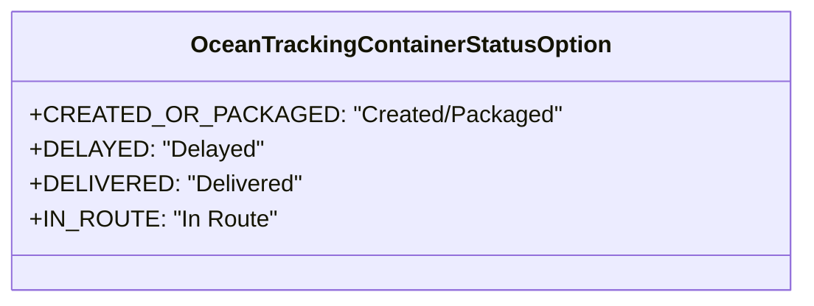

# Diagram: web/portal/src/pages/oceantracking/utils/filter.utils.js

> Auto-generated by Obscura crawlers

## Mermaid

### SVG

<svg id="container" width="510.2734375" xmlns="http://www.w3.org/2000/svg" class="classDiagram" height="208" viewBox="0 0 510.2734375 208" role="graphics-document document" aria-roledescription="class"><g><defs><marker id="container_class-aggregationStart" class="marker aggregation class" refX="18" refY="7" markerWidth="190" markerHeight="240" orient="auto"><path d="M 18,7 L9,13 L1,7 L9,1 Z"></path></marker></defs><defs><marker id="container_class-aggregationEnd" class="marker aggregation class" refX="1" refY="7" markerWidth="20" markerHeight="28" orient="auto"><path d="M 18,7 L9,13 L1,7 L9,1 Z"></path></marker></defs><defs><marker id="container_class-extensionStart" class="marker extension class" refX="18" refY="7" markerWidth="190" markerHeight="240" orient="auto"><path d="M 1,7 L18,13 V 1 Z"></path></marker></defs><defs><marker id="container_class-extensionEnd" class="marker extension class" refX="1" refY="7" markerWidth="20" markerHeight="28" orient="auto"><path d="M 1,1 V 13 L18,7 Z"></path></marker></defs><defs><marker id="container_class-compositionStart" class="marker composition class" refX="18" refY="7" markerWidth="190" markerHeight="240" orient="auto"><path d="M 18,7 L9,13 L1,7 L9,1 Z"></path></marker></defs><defs><marker id="container_class-compositionEnd" class="marker composition class" refX="1" refY="7" markerWidth="20" markerHeight="28" orient="auto"><path d="M 18,7 L9,13 L1,7 L9,1 Z"></path></marker></defs><defs><marker id="container_class-dependencyStart" class="marker dependency class" refX="6" refY="7" markerWidth="190" markerHeight="240" orient="auto"><path d="M 5,7 L9,13 L1,7 L9,1 Z"></path></marker></defs><defs><marker id="container_class-dependencyEnd" class="marker dependency class" refX="13" refY="7" markerWidth="20" markerHeight="28" orient="auto"><path d="M 18,7 L9,13 L14,7 L9,1 Z"></path></marker></defs><defs><marker id="container_class-lollipopStart" class="marker lollipop class" refX="13" refY="7" markerWidth="190" markerHeight="240" orient="auto"><circle stroke="black" fill="transparent" cx="7" cy="7" r="6"></circle></marker></defs><defs><marker id="container_class-lollipopEnd" class="marker lollipop class" refX="1" refY="7" markerWidth="190" markerHeight="240" orient="auto"><circle stroke="black" fill="transparent" cx="7" cy="7" r="6"></circle></marker></defs><g class="root"><g class="clusters"></g><g class="edgePaths"></g><g class="edgeLabels"></g><g class="nodes"><g class="node default" id="classId-OceanTrackingContainerStatusOption-0" transform="translate(255.13671875, 104)"><g class="basic label-container"><path d="M-247.13671875 -96 L247.13671875 -96 L247.13671875 96 L-247.13671875 96" stroke="none" stroke-width="0" fill="#ECECFF" style=""></path><path d="M-247.13671875 -96 C-69.55317464023574 -96, 108.03036946952852 -96, 247.13671875 -96 M-247.13671875 -96 C-104.58211433855055 -96, 37.97249007289889 -96, 247.13671875 -96 M247.13671875 -96 C247.13671875 -48.18412783337572, 247.13671875 -0.3682556667514376, 247.13671875 96 M247.13671875 -96 C247.13671875 -30.08044012971638, 247.13671875 35.83911974056724, 247.13671875 96 M247.13671875 96 C93.0496825154456 96, -61.03735371910881 96, -247.13671875 96 M247.13671875 96 C127.97909137866625 96, 8.821464007332509 96, -247.13671875 96 M-247.13671875 96 C-247.13671875 49.97644450218979, -247.13671875 3.9528890043795855, -247.13671875 -96 M-247.13671875 96 C-247.13671875 29.323574319007733, -247.13671875 -37.352851361984534, -247.13671875 -96" stroke="#9370DB" stroke-width="1.3" fill="none" stroke-dasharray="0 0" style=""></path></g><g class="annotation-group text" transform="translate(0, -72)"></g><g class="label-group text" transform="translate(-137.4765625, -72)"><g class="label" style="font-weight: bolder" transform="translate(0,-12)"><foreignObject width="274.953125" height="24">

OceanTrackingContainerStatusOption

</foreignObject></g></g><g class="members-group text" transform="translate(-235.13671875, -24)"><g class="label" style="" transform="translate(0,-12)"><foreignObject width="332.796875" height="24">

+CREATED_OR_PACKAGED: "Created/Packaged"

</foreignObject></g><g class="label" style="" transform="translate(0,12)"><foreignObject width="149.90625" height="24">

+DELAYED: "Delayed"

</foreignObject></g><g class="label" style="" transform="translate(0,36)"><foreignObject width="175.125" height="24">

+DELIVERED: "Delivered"

</foreignObject></g><g class="label" style="" transform="translate(0,60)"><foreignObject width="161.375" height="24">

+IN_ROUTE: "In Route"

</foreignObject></g></g><g class="methods-group text" transform="translate(-235.13671875, 96)"></g><g class="divider" style=""><path d="M-247.13671875 -48 C-104.1355427783131 -48, 38.86563319337381 -48, 247.13671875 -48 M-247.13671875 -48 C-70.76002004863733 -48, 105.61667865272534 -48, 247.13671875 -48" stroke="#9370DB" stroke-width="1.3" fill="none" stroke-dasharray="0 0" style=""></path></g><g class="divider" style=""><path d="M-247.13671875 72 C-80.93965167335392 72, 85.25741540329216 72, 247.13671875 72 M-247.13671875 72 C-68.8262652375515 72, 109.48418827489701 72, 247.13671875 72" stroke="#9370DB" stroke-width="1.3" fill="none" stroke-dasharray="0 0" style=""></path></g></g></g></g></g></svg>
