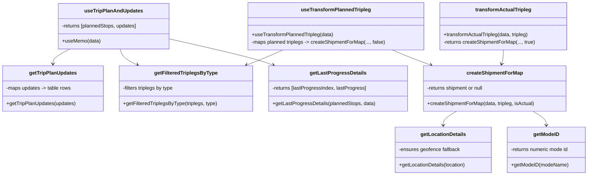

# Diagram: web/portal/src/pages/oceantracking/utils/tripleg.utils.js


> Auto-generated by Obscura crawlers

## Diagram 1

```mermaid
flowchart LR
  Data["data (detail response)"]
  Data --> U[getTripPlanUpdates(updates)]
  Data --> F[getFilteredTriplegsByType(Triplegs, \"planned\")]
  Data --> L[getLastProgressDetails(plannedStops, data)]
  U --> PlannedUpdates["updates (mapped)"]
  F --> PlannedTripLegs["plannedTripLegs"]
  PlannedTripLegs --> BuildStops[Build plannedStops array]
  BuildStops --> ComputeProgress[Compute progress using getLastProgressDetails]
  ComputeProgress --> PlannedStops["plannedStops (with progress)"]
  PlannedStops --> Result["[plannedStops, updates]"]
  Data --> C[createShipmentForMap(data, tripleg, isActual)]
  C --> LocationDetails[getLocationDetails(location)]
  C --> ModeID[getModeID(modeName)]
  C --> UUID[uuidv4()]
  C --> Shipment["Shipment object for map"]
  Shipment --> MapView["Map components (MAD/LAD, routes)"]
```

> SVG rendering failed for this diagram.

## Diagram 2



### SVG

<svg id="container" width="1844.93359375" xmlns="http://www.w3.org/2000/svg" class="classDiagram" height="554" viewBox="0 0 1844.93359375 554" role="graphics-document document" aria-roledescription="class"><style>#container{font-family:"trebuchet ms",verdana,arial,sans-serif;font-size:16px;fill:#333;}@keyframes edge-animation-frame{from{stroke-dashoffset:0;}}@keyframes dash{to{stroke-dashoffset:0;}}#container .edge-animation-slow{stroke-dasharray:9,5!important;stroke-dashoffset:900;animation:dash 50s linear infinite;stroke-linecap:round;}#container .edge-animation-fast{stroke-dasharray:9,5!important;stroke-dashoffset:900;animation:dash 20s linear infinite;stroke-linecap:round;}#container .error-icon{fill:#552222;}#container .error-text{fill:#552222;stroke:#552222;}#container .edge-thickness-normal{stroke-width:1px;}#container .edge-thickness-thick{stroke-width:3.5px;}#container .edge-pattern-solid{stroke-dasharray:0;}#container .edge-thickness-invisible{stroke-width:0;fill:none;}#container .edge-pattern-dashed{stroke-dasharray:3;}#container .edge-pattern-dotted{stroke-dasharray:2;}#container .marker{fill:#333333;stroke:#333333;}#container .marker.cross{stroke:#333333;}#container svg{font-family:"trebuchet ms",verdana,arial,sans-serif;font-size:16px;}#container p{margin:0;}#container g.classGroup text{fill:#9370DB;stroke:none;font-family:"trebuchet ms",verdana,arial,sans-serif;font-size:10px;}#container g.classGroup text .title{font-weight:bolder;}#container .nodeLabel,#container .edgeLabel{color:#131300;}#container .edgeLabel .label rect{fill:#ECECFF;}#container .label text{fill:#131300;}#container .labelBkg{background:#ECECFF;}#container .edgeLabel .label span{background:#ECECFF;}#container .classTitle{font-weight:bolder;}#container .node rect,#container .node circle,#container .node ellipse,#container .node polygon,#container .node path{fill:#ECECFF;stroke:#9370DB;stroke-width:1px;}#container .divider{stroke:#9370DB;stroke-width:1;}#container g.clickable{cursor:pointer;}#container g.classGroup rect{fill:#ECECFF;stroke:#9370DB;}#container g.classGroup line{stroke:#9370DB;stroke-width:1;}#container .classLabel .box{stroke:none;stroke-width:0;fill:#ECECFF;opacity:0.5;}#container .classLabel .label{fill:#9370DB;font-size:10px;}#container .relation{stroke:#333333;stroke-width:1;fill:none;}#container .dashed-line{stroke-dasharray:3;}#container .dotted-line{stroke-dasharray:1 2;}#container #compositionStart,#container .composition{fill:#333333!important;stroke:#333333!important;stroke-width:1;}#container #compositionEnd,#container .composition{fill:#333333!important;stroke:#333333!important;stroke-width:1;}#container #dependencyStart,#container .dependency{fill:#333333!important;stroke:#333333!important;stroke-width:1;}#container #dependencyStart,#container .dependency{fill:#333333!important;stroke:#333333!important;stroke-width:1;}#container #extensionStart,#container .extension{fill:transparent!important;stroke:#333333!important;stroke-width:1;}#container #extensionEnd,#container .extension{fill:transparent!important;stroke:#333333!important;stroke-width:1;}#container #aggregationStart,#container .aggregation{fill:transparent!important;stroke:#333333!important;stroke-width:1;}#container #aggregationEnd,#container .aggregation{fill:transparent!important;stroke:#333333!important;stroke-width:1;}#container #lollipopStart,#container .lollipop{fill:#ECECFF!important;stroke:#333333!important;stroke-width:1;}#container #lollipopEnd,#container .lollipop{fill:#ECECFF!important;stroke:#333333!important;stroke-width:1;}#container .edgeTerminals{font-size:11px;line-height:initial;}#container .classTitleText{text-anchor:middle;font-size:18px;fill:#333;}#container .label-icon{display:inline-block;height:1em;overflow:visible;vertical-align:-0.125em;}#container .node .label-icon path{fill:currentColor;stroke:revert;stroke-width:revert;}#container :root{--mermaid-font-family:"trebuchet ms",verdana,arial,sans-serif;}</style><g><defs><marker id="container_class-aggregationStart" class="marker aggregation class" refX="18" refY="7" markerWidth="190" markerHeight="240" orient="auto"><path d="M 18,7 L9,13 L1,7 L9,1 Z"></path></marker></defs><defs><marker id="container_class-aggregationEnd" class="marker aggregation class" refX="1" refY="7" markerWidth="20" markerHeight="28" orient="auto"><path d="M 18,7 L9,13 L1,7 L9,1 Z"></path></marker></defs><defs><marker id="container_class-extensionStart" class="marker extension class" refX="18" refY="7" markerWidth="190" markerHeight="240" orient="auto"><path d="M 1,7 L18,13 V 1 Z"></path></marker></defs><defs><marker id="container_class-extensionEnd" class="marker extension class" refX="1" refY="7" markerWidth="20" markerHeight="28" orient="auto"><path d="M 1,1 V 13 L18,7 Z"></path></marker></defs><defs><marker id="container_class-compositionStart" class="marker composition class" refX="18" refY="7" markerWidth="190" markerHeight="240" orient="auto"><path d="M 18,7 L9,13 L1,7 L9,1 Z"></path></marker></defs><defs><marker id="container_class-compositionEnd" class="marker composition class" refX="1" refY="7" markerWidth="20" markerHeight="28" orient="auto"><path d="M 18,7 L9,13 L1,7 L9,1 Z"></path></marker></defs><defs><marker id="container_class-dependencyStart" class="marker dependency class" refX="6" refY="7" markerWidth="190" markerHeight="240" orient="auto"><path d="M 5,7 L9,13 L1,7 L9,1 Z"></path></marker></defs><defs><marker id="container_class-dependencyEnd" class="marker dependency class" refX="13" refY="7" markerWidth="20" markerHeight="28" orient="auto"><path d="M 18,7 L9,13 L14,7 L9,1 Z"></path></marker></defs><defs><marker id="container_class-lollipopStart" class="marker lollipop class" refX="13" refY="7" markerWidth="190" markerHeight="240" orient="auto"><circle stroke="black" fill="transparent" cx="7" cy="7" r="6"></circle></marker></defs><defs><marker id="container_class-lollipopEnd" class="marker lollipop class" refX="1" refY="7" markerWidth="190" markerHeight="240" orient="auto"><circle stroke="black" fill="transparent" cx="7" cy="7" r="6"></circle></marker></defs><g class="root"><g class="clusters"></g><g class="edgePaths"><path d="M218.132,155L209.456,159.667C200.78,164.333,183.427,173.667,174.751,181.5C166.074,189.333,166.074,195.667,166.074,198.833L166.074,202" id="id_useTripPlanAndUpdates_getTripPlanUpdates_1" class="edge-thickness-normal edge-pattern-solid relation" style=";;;" data-edge="true" data-et="edge" data-id="id_useTripPlanAndUpdates_getTripPlanUpdates_1" data-points="W3sieCI6MjE4LjEzMjM0Mzc1LCJ5IjoxNTV9LHsieCI6MTY2LjA3NDIxODc1LCJ5IjoxODN9LHsieCI6MTY2LjA3NDIxODc1LCJ5IjoyMDh9XQ==" marker-end="url(#container_class-dependencyEnd)"></path><path d="M375.496,155L377.019,159.667C378.542,164.333,381.588,173.667,390.742,182.061C399.896,190.455,415.158,197.911,422.788,201.639L430.419,205.366" id="id_useTripPlanAndUpdates_getFilteredTriplegsByType_2" class="edge-thickness-normal edge-pattern-solid relation" style=";;;" data-edge="true" data-et="edge" data-id="id_useTripPlanAndUpdates_getFilteredTriplegsByType_2" data-points="W3sieCI6Mzc1LjQ5NTkzNzUsInkiOjE1NX0seyJ4IjozODQuNjM0NzY1NjI1LCJ5IjoxODN9LHsieCI6NDM1LjgxMDE2NDMwNDEyMzcsInkiOjIwOH1d" marker-end="url(#container_class-dependencyEnd)"></path><path d="M528.309,123.442L571.584,133.368C614.859,143.295,701.41,163.147,755.344,176.902C809.278,190.657,830.596,198.314,841.254,202.143L851.913,205.972" id="id_useTripPlanAndUpdates_getLastProgressDetails_3" class="edge-thickness-normal edge-pattern-solid relation" style=";;;" data-edge="true" data-et="edge" data-id="id_useTripPlanAndUpdates_getLastProgressDetails_3" data-points="W3sieCI6NTI4LjMwODU5Mzc1LCJ5IjoxMjMuNDQxOTA3NzY1NjQxOTR9LHsieCI6Nzg3Ljk2MDkzNzUsInkiOjE4M30seyJ4Ijo4NTcuNTU5NjQwNzg2MDgyNSwieSI6MjA4fV0=" marker-end="url(#container_class-dependencyEnd)"></path><path d="M1426.668,352L1419.636,356.167C1412.603,360.333,1398.538,368.667,1391.505,376C1384.473,383.333,1384.473,389.667,1384.473,392.833L1384.473,396" id="id_createShipmentForMap_getLocationDetails_4" class="edge-thickness-normal edge-pattern-solid relation" style=";;;" data-edge="true" data-et="edge" data-id="id_createShipmentForMap_getLocationDetails_4" data-points="W3sieCI6MTQyNi42NjgyMTAzNzM3MTE0LCJ5IjozNTJ9LHsieCI6MTM4NC40NzI2NTYyNSwieSI6Mzc3fSx7IngiOjEzODQuNDcyNjU2MjUsInkiOjQwMn1d" marker-end="url(#container_class-dependencyEnd)"></path><path d="M1669.715,352L1676.747,356.167C1683.78,360.333,1697.845,368.667,1704.878,376C1711.91,383.333,1711.91,389.667,1711.91,392.833L1711.91,396" id="id_createShipmentForMap_getModeID_5" class="edge-thickness-normal edge-pattern-solid relation" style=";;;" data-edge="true" data-et="edge" data-id="id_createShipmentForMap_getModeID_5" data-points="W3sieCI6MTY2OS43MTQ2MDIxMjYyODg2LCJ5IjozNTJ9LHsieCI6MTcxMS45MTAxNTYyNSwieSI6Mzc3fSx7IngiOjE3MTEuOTEwMTU2MjUsInkiOjQwMn1d" marker-end="url(#container_class-dependencyEnd)"></path><path d="M1576.572,158L1576.572,162.167C1576.572,166.333,1576.572,174.667,1575.634,182.04C1574.696,189.414,1572.819,195.828,1571.881,199.035L1570.942,202.241" id="id_transformActualTripleg_createShipmentForMap_6" class="edge-thickness-normal edge-pattern-solid relation" style=";;;" data-edge="true" data-et="edge" data-id="id_transformActualTripleg_createShipmentForMap_6" data-points="W3sieCI6MTU3Ni41NzIyNjU2MjUsInkiOjE1OH0seyJ4IjoxNTc2LjU3MjI2NTYyNSwieSI6MTgzfSx7IngiOjE1NjkuMjU3NjExMTQ2OTA3MywieSI6MjA4fV0=" marker-end="url(#container_class-dependencyEnd)"></path><path d="M885.355,158L876.229,162.167C867.104,166.333,848.852,174.667,830.029,182.635C811.207,190.603,791.814,198.207,782.118,202.008L772.422,205.81" id="id_useTransformPlannedTripleg_getFilteredTriplegsByType_7" class="edge-thickness-normal edge-pattern-solid relation" style=";;;" data-edge="true" data-et="edge" data-id="id_useTransformPlannedTripleg_getFilteredTriplegsByType_7" data-points="W3sieCI6ODg1LjM1NTQ2ODc1LCJ5IjoxNTh9LHsieCI6ODMwLjU5OTYwOTM3NSwieSI6MTgzfSx7IngiOjc2Ni44MzU2MTUzMzUwNTE2LCJ5IjoyMDh9XQ==" marker-end="url(#container_class-dependencyEnd)"></path><path d="M1225.943,158L1235.739,162.167C1245.535,166.333,1265.126,174.667,1285.3,182.655C1305.475,190.642,1326.234,198.285,1336.613,202.106L1346.992,205.927" id="id_useTransformPlannedTripleg_createShipmentForMap_8" class="edge-thickness-normal edge-pattern-solid relation" style=";;;" data-edge="true" data-et="edge" data-id="id_useTransformPlannedTripleg_createShipmentForMap_8" data-points="W3sieCI6MTIyNS45NDMzNTkzNzUsInkiOjE1OH0seyJ4IjoxMjg0LjcxNjc5Njg3NSwieSI6MTgzfSx7IngiOjEzNTIuNjIyNjI0MDMzNTA1MiwieSI6MjA4fV0=" marker-end="url(#container_class-dependencyEnd)"></path></g><g class="edgeLabels"><g class="edgeLabel"><g class="label" data-id="id_useTripPlanAndUpdates_getTripPlanUpdates_1" transform="translate(0, 0)"><foreignObject width="0" height="0"><div xmlns="http://www.w3.org/1999/xhtml" class="labelBkg" style="display: table-cell; white-space: nowrap; line-height: 1.5; max-width: 200px; text-align: center;"><span class="edgeLabel"></span></div></foreignObject></g></g><g class="edgeLabel"><g class="label" data-id="id_useTripPlanAndUpdates_getFilteredTriplegsByType_2" transform="translate(0, 0)"><foreignObject width="0" height="0"><div xmlns="http://www.w3.org/1999/xhtml" class="labelBkg" style="display: table-cell; white-space: nowrap; line-height: 1.5; max-width: 200px; text-align: center;"><span class="edgeLabel"></span></div></foreignObject></g></g><g class="edgeLabel"><g class="label" data-id="id_useTripPlanAndUpdates_getLastProgressDetails_3" transform="translate(0, 0)"><foreignObject width="0" height="0"><div xmlns="http://www.w3.org/1999/xhtml" class="labelBkg" style="display: table-cell; white-space: nowrap; line-height: 1.5; max-width: 200px; text-align: center;"><span class="edgeLabel"></span></div></foreignObject></g></g><g class="edgeLabel"><g class="label" data-id="id_createShipmentForMap_getLocationDetails_4" transform="translate(0, 0)"><foreignObject width="0" height="0"><div xmlns="http://www.w3.org/1999/xhtml" class="labelBkg" style="display: table-cell; white-space: nowrap; line-height: 1.5; max-width: 200px; text-align: center;"><span class="edgeLabel"></span></div></foreignObject></g></g><g class="edgeLabel"><g class="label" data-id="id_createShipmentForMap_getModeID_5" transform="translate(0, 0)"><foreignObject width="0" height="0"><div xmlns="http://www.w3.org/1999/xhtml" class="labelBkg" style="display: table-cell; white-space: nowrap; line-height: 1.5; max-width: 200px; text-align: center;"><span class="edgeLabel"></span></div></foreignObject></g></g><g class="edgeLabel"><g class="label" data-id="id_transformActualTripleg_createShipmentForMap_6" transform="translate(0, 0)"><foreignObject width="0" height="0"><div xmlns="http://www.w3.org/1999/xhtml" class="labelBkg" style="display: table-cell; white-space: nowrap; line-height: 1.5; max-width: 200px; text-align: center;"><span class="edgeLabel"></span></div></foreignObject></g></g><g class="edgeLabel"><g class="label" data-id="id_useTransformPlannedTripleg_getFilteredTriplegsByType_7" transform="translate(0, 0)"><foreignObject width="0" height="0"><div xmlns="http://www.w3.org/1999/xhtml" class="labelBkg" style="display: table-cell; white-space: nowrap; line-height: 1.5; max-width: 200px; text-align: center;"><span class="edgeLabel"></span></div></foreignObject></g></g><g class="edgeLabel"><g class="label" data-id="id_useTransformPlannedTripleg_createShipmentForMap_8" transform="translate(0, 0)"><foreignObject width="0" height="0"><div xmlns="http://www.w3.org/1999/xhtml" class="labelBkg" style="display: table-cell; white-space: nowrap; line-height: 1.5; max-width: 200px; text-align: center;"><span class="edgeLabel"></span></div></foreignObject></g></g></g><g class="nodes"><g class="node default" id="classId-useTripPlanAndUpdates-0" transform="translate(351.99609375, 83)"><g class="basic label-container"><path d="M-176.3125 -72 L176.3125 -72 L176.3125 72 L-176.3125 72" stroke="none" stroke-width="0" fill="#ECECFF" style=""></path><path d="M-176.3125 -72 C-40.020152730096186 -72, 96.27219453980763 -72, 176.3125 -72 M-176.3125 -72 C-54.269737038074695 -72, 67.77302592385061 -72, 176.3125 -72 M176.3125 -72 C176.3125 -28.67506332855669, 176.3125 14.649873342886622, 176.3125 72 M176.3125 -72 C176.3125 -41.221549003448615, 176.3125 -10.44309800689723, 176.3125 72 M176.3125 72 C51.88535605613292 72, -72.54178788773416 72, -176.3125 72 M176.3125 72 C37.04885819360305 72, -102.2147836127939 72, -176.3125 72 M-176.3125 72 C-176.3125 40.4344940265255, -176.3125 8.868988053050991, -176.3125 -72 M-176.3125 72 C-176.3125 39.10346947570202, -176.3125 6.206938951404041, -176.3125 -72" stroke="#9370DB" stroke-width="1.3" fill="none" stroke-dasharray="0 0" style=""></path></g><g class="annotation-group text" transform="translate(0, -48)"></g><g class="label-group text" transform="translate(-87.765625, -48)"><g class="label" style="font-weight: bolder" transform="translate(0,-12)"><foreignObject width="175.53125" height="24"><div xmlns="http://www.w3.org/1999/xhtml" style="display: table-cell; white-space: nowrap; line-height: 1.5; max-width: 224px; text-align: center;"><span class="nodeLabel markdown-node-label" style=""><p>useTripPlanAndUpdates</p></span></div></foreignObject></g></g><g class="members-group text" transform="translate(-164.3125, 0)"><g class="label" style="" transform="translate(0,-12)"><foreignObject width="240.859375" height="24"><div xmlns="http://www.w3.org/1999/xhtml" style="display: table-cell; white-space: nowrap; line-height: 1.5; max-width: 298px; text-align: center;"><span class="nodeLabel markdown-node-label" style=""><p>-returns [plannedStops, updates]</p></span></div></foreignObject></g></g><g class="methods-group text" transform="translate(-164.3125, 48)"><g class="label" style="" transform="translate(0,-12)"><foreignObject width="120.734375" height="24"><div xmlns="http://www.w3.org/1999/xhtml" style="display: table-cell; white-space: nowrap; line-height: 1.5; max-width: 178px; text-align: center;"><span class="nodeLabel markdown-node-label" style=""><p>+useMemo(data)</p></span></div></foreignObject></g></g><g class="divider" style=""><path d="M-176.3125 -24 C-43.657803604913624 -24, 88.99689279017275 -24, 176.3125 -24 M-176.3125 -24 C-50.94659574667756 -24, 74.41930850664488 -24, 176.3125 -24" stroke="#9370DB" stroke-width="1.3" fill="none" stroke-dasharray="0 0" style=""></path></g><g class="divider" style=""><path d="M-176.3125 24 C-37.89486474604885 24, 100.5227705079023 24, 176.3125 24 M-176.3125 24 C-86.16840863735419 24, 3.9756827252916196 24, 176.3125 24" stroke="#9370DB" stroke-width="1.3" fill="none" stroke-dasharray="0 0" style=""></path></g></g><g class="node default" id="classId-getTripPlanUpdates-1" transform="translate(166.07421875, 280)"><g class="basic label-container"><path d="M-158.07421875 -72 L158.07421875 -72 L158.07421875 72 L-158.07421875 72" stroke="none" stroke-width="0" fill="#ECECFF" style=""></path><path d="M-158.07421875 -72 C-46.45224268664205 -72, 65.1697333767159 -72, 158.07421875 -72 M-158.07421875 -72 C-51.59917930639362 -72, 54.875860137212754 -72, 158.07421875 -72 M158.07421875 -72 C158.07421875 -27.792219336334888, 158.07421875 16.415561327330224, 158.07421875 72 M158.07421875 -72 C158.07421875 -28.456314455447753, 158.07421875 15.087371089104494, 158.07421875 72 M158.07421875 72 C53.79999396936938 72, -50.474230811261236 72, -158.07421875 72 M158.07421875 72 C91.90663519807846 72, 25.739051646156923 72, -158.07421875 72 M-158.07421875 72 C-158.07421875 41.36543406456815, -158.07421875 10.730868129136297, -158.07421875 -72 M-158.07421875 72 C-158.07421875 28.84631637888566, -158.07421875 -14.307367242228679, -158.07421875 -72" stroke="#9370DB" stroke-width="1.3" fill="none" stroke-dasharray="0 0" style=""></path></g><g class="annotation-group text" transform="translate(0, -48)"></g><g class="label-group text" transform="translate(-72.5078125, -48)"><g class="label" style="font-weight: bolder" transform="translate(0,-12)"><foreignObject width="145.015625" height="24"><div xmlns="http://www.w3.org/1999/xhtml" style="display: table-cell; white-space: nowrap; line-height: 1.5; max-width: 192px; text-align: center;"><span class="nodeLabel markdown-node-label" style=""><p>getTripPlanUpdates</p></span></div></foreignObject></g></g><g class="members-group text" transform="translate(-146.07421875, 0)"><g class="label" style="" transform="translate(0,-12)"><foreignObject width="207.25" height="24"><div xmlns="http://www.w3.org/1999/xhtml" style="display: table-cell; white-space: nowrap; line-height: 1.5; max-width: 286px; text-align: center;"><span class="nodeLabel markdown-node-label" style=""><p>-maps updates -&gt; table rows</p></span></div></foreignObject></g></g><g class="methods-group text" transform="translate(-146.07421875, 48)"><g class="label" style="" transform="translate(0,-12)"><foreignObject width="219.640625" height="24"><div xmlns="http://www.w3.org/1999/xhtml" style="display: table-cell; white-space: nowrap; line-height: 1.5; max-width: 277px; text-align: center;"><span class="nodeLabel markdown-node-label" style=""><p>+getTripPlanUpdates(updates)</p></span></div></foreignObject></g></g><g class="divider" style=""><path d="M-158.07421875 -24 C-63.368889725249815 -24, 31.33643929950037 -24, 158.07421875 -24 M-158.07421875 -24 C-40.55397517332908 -24, 76.96626840334184 -24, 158.07421875 -24" stroke="#9370DB" stroke-width="1.3" fill="none" stroke-dasharray="0 0" style=""></path></g><g class="divider" style=""><path d="M-158.07421875 24 C-45.24782847660039 24, 67.57856179679922 24, 158.07421875 24 M-158.07421875 24 C-64.07034613688433 24, 29.93352647623135 24, 158.07421875 24" stroke="#9370DB" stroke-width="1.3" fill="none" stroke-dasharray="0 0" style=""></path></g></g><g class="node default" id="classId-getFilteredTriplegsByType-2" transform="translate(583.1953125, 280)"><g class="basic label-container"><path d="M-209.046875 -72 L209.046875 -72 L209.046875 72 L-209.046875 72" stroke="none" stroke-width="0" fill="#ECECFF" style=""></path><path d="M-209.046875 -72 C-63.321926358618384 -72, 82.40302228276323 -72, 209.046875 -72 M-209.046875 -72 C-69.67254400124995 -72, 69.70178699750011 -72, 209.046875 -72 M209.046875 -72 C209.046875 -15.948756301947881, 209.046875 40.10248739610424, 209.046875 72 M209.046875 -72 C209.046875 -39.73801432038949, 209.046875 -7.476028640778978, 209.046875 72 M209.046875 72 C58.65160861690339 72, -91.74365776619322 72, -209.046875 72 M209.046875 72 C117.03937522947687 72, 25.03187545895375 72, -209.046875 72 M-209.046875 72 C-209.046875 31.590368819930084, -209.046875 -8.819262360139831, -209.046875 -72 M-209.046875 72 C-209.046875 41.680340059920916, -209.046875 11.360680119841831, -209.046875 -72" stroke="#9370DB" stroke-width="1.3" fill="none" stroke-dasharray="0 0" style=""></path></g><g class="annotation-group text" transform="translate(0, -48)"></g><g class="label-group text" transform="translate(-95.265625, -48)"><g class="label" style="font-weight: bolder" transform="translate(0,-12)"><foreignObject width="190.53125" height="24"><div xmlns="http://www.w3.org/1999/xhtml" style="display: table-cell; white-space: nowrap; line-height: 1.5; max-width: 236px; text-align: center;"><span class="nodeLabel markdown-node-label" style=""><p>getFilteredTriplegsByType</p></span></div></foreignObject></g></g><g class="members-group text" transform="translate(-197.046875, 0)"><g class="label" style="" transform="translate(0,-12)"><foreignObject width="164.5625" height="24"><div xmlns="http://www.w3.org/1999/xhtml" style="display: table-cell; white-space: nowrap; line-height: 1.5; max-width: 222px; text-align: center;"><span class="nodeLabel markdown-node-label" style=""><p>-filters triplegs by type</p></span></div></foreignObject></g></g><g class="methods-group text" transform="translate(-197.046875, 48)"><g class="label" style="" transform="translate(0,-12)"><foreignObject width="298.828125" height="24"><div xmlns="http://www.w3.org/1999/xhtml" style="display: table-cell; white-space: nowrap; line-height: 1.5; max-width: 356px; text-align: center;"><span class="nodeLabel markdown-node-label" style=""><p>+getFilteredTriplegsByType(triplegs, type)</p></span></div></foreignObject></g></g><g class="divider" style=""><path d="M-209.046875 -24 C-50.746036566124104 -24, 107.55480186775179 -24, 209.046875 -24 M-209.046875 -24 C-97.38559242885489 -24, 14.275690142290216 -24, 209.046875 -24" stroke="#9370DB" stroke-width="1.3" fill="none" stroke-dasharray="0 0" style=""></path></g><g class="divider" style=""><path d="M-209.046875 24 C-64.35433698447397 24, 80.33820103105205 24, 209.046875 24 M-209.046875 24 C-114.69525137459762 24, -20.343627749195235 24, 209.046875 24" stroke="#9370DB" stroke-width="1.3" fill="none" stroke-dasharray="0 0" style=""></path></g></g><g class="node default" id="classId-getLastProgressDetails-3" transform="translate(1058.00390625, 280)"><g class="basic label-container"><path d="M-215.76171875 -72 L215.76171875 -72 L215.76171875 72 L-215.76171875 72" stroke="none" stroke-width="0" fill="#ECECFF" style=""></path><path d="M-215.76171875 -72 C-112.04021766565408 -72, -8.318716581308166 -72, 215.76171875 -72 M-215.76171875 -72 C-85.52402296589622 -72, 44.713672818207556 -72, 215.76171875 -72 M215.76171875 -72 C215.76171875 -23.73112340154416, 215.76171875 24.53775319691168, 215.76171875 72 M215.76171875 -72 C215.76171875 -23.52842696369327, 215.76171875 24.94314607261346, 215.76171875 72 M215.76171875 72 C99.55579685338593 72, -16.650125043228144 72, -215.76171875 72 M215.76171875 72 C58.05386304729174 72, -99.65399265541652 72, -215.76171875 72 M-215.76171875 72 C-215.76171875 17.965808545141265, -215.76171875 -36.06838290971747, -215.76171875 -72 M-215.76171875 72 C-215.76171875 34.16727180510408, -215.76171875 -3.665456389791842, -215.76171875 -72" stroke="#9370DB" stroke-width="1.3" fill="none" stroke-dasharray="0 0" style=""></path></g><g class="annotation-group text" transform="translate(0, -48)"></g><g class="label-group text" transform="translate(-84.2578125, -48)"><g class="label" style="font-weight: bolder" transform="translate(0,-12)"><foreignObject width="168.515625" height="24"><div xmlns="http://www.w3.org/1999/xhtml" style="display: table-cell; white-space: nowrap; line-height: 1.5; max-width: 214px; text-align: center;"><span class="nodeLabel markdown-node-label" style=""><p>getLastProgressDetails</p></span></div></foreignObject></g></g><g class="members-group text" transform="translate(-203.76171875, 0)"><g class="label" style="" transform="translate(0,-12)"><foreignObject width="297.546875" height="24"><div xmlns="http://www.w3.org/1999/xhtml" style="display: table-cell; white-space: nowrap; line-height: 1.5; max-width: 355px; text-align: center;"><span class="nodeLabel markdown-node-label" style=""><p>-returns [lastProgressIndex, lastProgress]</p></span></div></foreignObject></g></g><g class="methods-group text" transform="translate(-203.76171875, 48)"><g class="label" style="" transform="translate(0,-12)"><foreignObject width="323.265625" height="24"><div xmlns="http://www.w3.org/1999/xhtml" style="display: table-cell; white-space: nowrap; line-height: 1.5; max-width: 381px; text-align: center;"><span class="nodeLabel markdown-node-label" style=""><p>+getLastProgressDetails(plannedStops, data)</p></span></div></foreignObject></g></g><g class="divider" style=""><path d="M-215.76171875 -24 C-73.6883148347072 -24, 68.3850890805856 -24, 215.76171875 -24 M-215.76171875 -24 C-69.70945216244439 -24, 76.34281442511121 -24, 215.76171875 -24" stroke="#9370DB" stroke-width="1.3" fill="none" stroke-dasharray="0 0" style=""></path></g><g class="divider" style=""><path d="M-215.76171875 24 C-50.92430383040275 24, 113.9131110891945 24, 215.76171875 24 M-215.76171875 24 C-79.99795680923 24, 55.76580513153999 24, 215.76171875 24" stroke="#9370DB" stroke-width="1.3" fill="none" stroke-dasharray="0 0" style=""></path></g></g><g class="node default" id="classId-createShipmentForMap-4" transform="translate(1548.19140625, 280)"><g class="basic label-container"><path d="M-224.42578125 -72 L224.42578125 -72 L224.42578125 72 L-224.42578125 72" stroke="none" stroke-width="0" fill="#ECECFF" style=""></path><path d="M-224.42578125 -72 C-133.21060793207303 -72, -41.99543461414606 -72, 224.42578125 -72 M-224.42578125 -72 C-62.802396409468116 -72, 98.82098843106377 -72, 224.42578125 -72 M224.42578125 -72 C224.42578125 -29.024915370992645, 224.42578125 13.95016925801471, 224.42578125 72 M224.42578125 -72 C224.42578125 -35.918402588480454, 224.42578125 0.16319482303909183, 224.42578125 72 M224.42578125 72 C75.57000092799899 72, -73.28577939400202 72, -224.42578125 72 M224.42578125 72 C108.26746689009148 72, -7.890847469817032 72, -224.42578125 72 M-224.42578125 72 C-224.42578125 40.32010084659188, -224.42578125 8.640201693183755, -224.42578125 -72 M-224.42578125 72 C-224.42578125 20.72505534403188, -224.42578125 -30.54988931193624, -224.42578125 -72" stroke="#9370DB" stroke-width="1.3" fill="none" stroke-dasharray="0 0" style=""></path></g><g class="annotation-group text" transform="translate(0, -48)"></g><g class="label-group text" transform="translate(-84.9296875, -48)"><g class="label" style="font-weight: bolder" transform="translate(0,-12)"><foreignObject width="169.859375" height="24"><div xmlns="http://www.w3.org/1999/xhtml" style="display: table-cell; white-space: nowrap; line-height: 1.5; max-width: 218px; text-align: center;"><span class="nodeLabel markdown-node-label" style=""><p>createShipmentForMap</p></span></div></foreignObject></g></g><g class="members-group text" transform="translate(-212.42578125, 0)"><g class="label" style="" transform="translate(0,-12)"><foreignObject width="183.734375" height="24"><div xmlns="http://www.w3.org/1999/xhtml" style="display: table-cell; white-space: nowrap; line-height: 1.5; max-width: 241px; text-align: center;"><span class="nodeLabel markdown-node-label" style=""><p>-returns shipment or null</p></span></div></foreignObject></g></g><g class="methods-group text" transform="translate(-212.42578125, 48)"><g class="label" style="" transform="translate(0,-12)"><foreignObject width="339.921875" height="24"><div xmlns="http://www.w3.org/1999/xhtml" style="display: table-cell; white-space: nowrap; line-height: 1.5; max-width: 397px; text-align: center;"><span class="nodeLabel markdown-node-label" style=""><p>+createShipmentForMap(data, tripleg, isActual)</p></span></div></foreignObject></g></g><g class="divider" style=""><path d="M-224.42578125 -24 C-127.95374473552494 -24, -31.48170822104987 -24, 224.42578125 -24 M-224.42578125 -24 C-89.3054145632724 -24, 45.814952123455214 -24, 224.42578125 -24" stroke="#9370DB" stroke-width="1.3" fill="none" stroke-dasharray="0 0" style=""></path></g><g class="divider" style=""><path d="M-224.42578125 24 C-51.892593432994204 24, 120.64059438401159 24, 224.42578125 24 M-224.42578125 24 C-46.271750374296175 24, 131.88228050140765 24, 224.42578125 24" stroke="#9370DB" stroke-width="1.3" fill="none" stroke-dasharray="0 0" style=""></path></g></g><g class="node default" id="classId-getModeID-5" transform="translate(1711.91015625, 474)"><g class="basic label-container"><path d="M-125.0234375 -72 L125.0234375 -72 L125.0234375 72 L-125.0234375 72" stroke="none" stroke-width="0" fill="#ECECFF" style=""></path><path d="M-125.0234375 -72 C-63.826252901660034 -72, -2.629068303320068 -72, 125.0234375 -72 M-125.0234375 -72 C-51.263817089917296 -72, 22.495803320165408 -72, 125.0234375 -72 M125.0234375 -72 C125.0234375 -32.22546529863189, 125.0234375 7.549069402736222, 125.0234375 72 M125.0234375 -72 C125.0234375 -40.7162315982952, 125.0234375 -9.432463196590405, 125.0234375 72 M125.0234375 72 C70.61164473900143 72, 16.19985197800287 72, -125.0234375 72 M125.0234375 72 C53.557672891786524 72, -17.908091716426952 72, -125.0234375 72 M-125.0234375 72 C-125.0234375 23.193467348695414, -125.0234375 -25.613065302609172, -125.0234375 -72 M-125.0234375 72 C-125.0234375 20.550983581248836, -125.0234375 -30.898032837502328, -125.0234375 -72" stroke="#9370DB" stroke-width="1.3" fill="none" stroke-dasharray="0 0" style=""></path></g><g class="annotation-group text" transform="translate(0, -48)"></g><g class="label-group text" transform="translate(-39.46875, -48)"><g class="label" style="font-weight: bolder" transform="translate(0,-12)"><foreignObject width="78.9375" height="24"><div xmlns="http://www.w3.org/1999/xhtml" style="display: table-cell; white-space: nowrap; line-height: 1.5; max-width: 128px; text-align: center;"><span class="nodeLabel markdown-node-label" style=""><p>getModeID</p></span></div></foreignObject></g></g><g class="members-group text" transform="translate(-113.0234375, 0)"><g class="label" style="" transform="translate(0,-12)"><foreignObject width="186.578125" height="24"><div xmlns="http://www.w3.org/1999/xhtml" style="display: table-cell; white-space: nowrap; line-height: 1.5; max-width: 244px; text-align: center;"><span class="nodeLabel markdown-node-label" style=""><p>-returns numeric mode id</p></span></div></foreignObject></g></g><g class="methods-group text" transform="translate(-113.0234375, 48)"><g class="label" style="" transform="translate(0,-12)"><foreignObject width="179.4375" height="24"><div xmlns="http://www.w3.org/1999/xhtml" style="display: table-cell; white-space: nowrap; line-height: 1.5; max-width: 237px; text-align: center;"><span class="nodeLabel markdown-node-label" style=""><p>+getModeID(modeName)</p></span></div></foreignObject></g></g><g class="divider" style=""><path d="M-125.0234375 -24 C-57.41127009305404 -24, 10.200897313891915 -24, 125.0234375 -24 M-125.0234375 -24 C-69.0339787843515 -24, -13.044520068703008 -24, 125.0234375 -24" stroke="#9370DB" stroke-width="1.3" fill="none" stroke-dasharray="0 0" style=""></path></g><g class="divider" style=""><path d="M-125.0234375 24 C-56.95357941460924 24, 11.116278670781526 24, 125.0234375 24 M-125.0234375 24 C-73.32642648103075 24, -21.629415462061502 24, 125.0234375 24" stroke="#9370DB" stroke-width="1.3" fill="none" stroke-dasharray="0 0" style=""></path></g></g><g class="node default" id="classId-getLocationDetails-6" transform="translate(1384.47265625, 474)"><g class="basic label-container"><path d="M-152.4140625 -72 L152.4140625 -72 L152.4140625 72 L-152.4140625 72" stroke="none" stroke-width="0" fill="#ECECFF" style=""></path><path d="M-152.4140625 -72 C-60.813715693574096 -72, 30.786631112851808 -72, 152.4140625 -72 M-152.4140625 -72 C-32.108080864114 -72, 88.197900771772 -72, 152.4140625 -72 M152.4140625 -72 C152.4140625 -19.3043163223143, 152.4140625 33.3913673553714, 152.4140625 72 M152.4140625 -72 C152.4140625 -33.1963965923897, 152.4140625 5.607206815220593, 152.4140625 72 M152.4140625 72 C54.744189591039785 72, -42.92568331792043 72, -152.4140625 72 M152.4140625 72 C59.24276993881398 72, -33.92852262237204 72, -152.4140625 72 M-152.4140625 72 C-152.4140625 27.15848224543874, -152.4140625 -17.68303550912252, -152.4140625 -72 M-152.4140625 72 C-152.4140625 32.755742257740515, -152.4140625 -6.48851548451897, -152.4140625 -72" stroke="#9370DB" stroke-width="1.3" fill="none" stroke-dasharray="0 0" style=""></path></g><g class="annotation-group text" transform="translate(0, -48)"></g><g class="label-group text" transform="translate(-68.578125, -48)"><g class="label" style="font-weight: bolder" transform="translate(0,-12)"><foreignObject width="137.15625" height="24"><div xmlns="http://www.w3.org/1999/xhtml" style="display: table-cell; white-space: nowrap; line-height: 1.5; max-width: 185px; text-align: center;"><span class="nodeLabel markdown-node-label" style=""><p>getLocationDetails</p></span></div></foreignObject></g></g><g class="members-group text" transform="translate(-140.4140625, 0)"><g class="label" style="" transform="translate(0,-12)"><foreignObject width="193.984375" height="24"><div xmlns="http://www.w3.org/1999/xhtml" style="display: table-cell; white-space: nowrap; line-height: 1.5; max-width: 252px; text-align: center;"><span class="nodeLabel markdown-node-label" style=""><p>-ensures geofence fallback</p></span></div></foreignObject></g></g><g class="methods-group text" transform="translate(-140.4140625, 48)"><g class="label" style="" transform="translate(0,-12)"><foreignObject width="212.25" height="24"><div xmlns="http://www.w3.org/1999/xhtml" style="display: table-cell; white-space: nowrap; line-height: 1.5; max-width: 270px; text-align: center;"><span class="nodeLabel markdown-node-label" style=""><p>+getLocationDetails(location)</p></span></div></foreignObject></g></g><g class="divider" style=""><path d="M-152.4140625 -24 C-79.90746398603541 -24, -7.400865472070819 -24, 152.4140625 -24 M-152.4140625 -24 C-64.92399994411042 -24, 22.56606261177916 -24, 152.4140625 -24" stroke="#9370DB" stroke-width="1.3" fill="none" stroke-dasharray="0 0" style=""></path></g><g class="divider" style=""><path d="M-152.4140625 24 C-41.04071049871919 24, 70.33264150256161 24, 152.4140625 24 M-152.4140625 24 C-52.29306126936956 24, 47.82793996126088 24, 152.4140625 24" stroke="#9370DB" stroke-width="1.3" fill="none" stroke-dasharray="0 0" style=""></path></g></g><g class="node default" id="classId-transformActualTripleg-7" transform="translate(1576.572265625, 83)"><g class="basic label-container"><path d="M-199.9375 -75 L199.9375 -75 L199.9375 75 L-199.9375 75" stroke="none" stroke-width="0" fill="#ECECFF" style=""></path><path d="M-199.9375 -75 C-58.802241803630096 -75, 82.33301639273981 -75, 199.9375 -75 M-199.9375 -75 C-108.88474965180986 -75, -17.83199930361971 -75, 199.9375 -75 M199.9375 -75 C199.9375 -18.471939818057137, 199.9375 38.056120363885725, 199.9375 75 M199.9375 -75 C199.9375 -33.30561998867308, 199.9375 8.388760022653841, 199.9375 75 M199.9375 75 C113.30672373600723 75, 26.675947472014457 75, -199.9375 75 M199.9375 75 C40.61356761165777 75, -118.71036477668446 75, -199.9375 75 M-199.9375 75 C-199.9375 31.24336318959864, -199.9375 -12.513273620802721, -199.9375 -75 M-199.9375 75 C-199.9375 20.450149076207083, -199.9375 -34.099701847585834, -199.9375 -75" stroke="#9370DB" stroke-width="1.3" fill="none" stroke-dasharray="0 0" style=""></path></g><g class="annotation-group text" transform="translate(0, -51)"></g><g class="label-group text" transform="translate(-84.671875, -51)"><g class="label" style="font-weight: bolder" transform="translate(0,-12)"><foreignObject width="169.34375" height="24"><div xmlns="http://www.w3.org/1999/xhtml" style="display: table-cell; white-space: nowrap; line-height: 1.5; max-width: 217px; text-align: center;"><span class="nodeLabel markdown-node-label" style=""><p>transformActualTripleg</p></span></div></foreignObject></g></g><g class="members-group text" transform="translate(-187.9375, -3)"></g><g class="methods-group text" transform="translate(-187.9375, 27)"><g class="label" style="" transform="translate(0,-12)"><foreignObject width="272.765625" height="24"><div xmlns="http://www.w3.org/1999/xhtml" style="display: table-cell; white-space: nowrap; line-height: 1.5; max-width: 330px; text-align: center;"><span class="nodeLabel markdown-node-label" style=""><p>+transformActualTripleg(data, tripleg)</p></span></div></foreignObject></g><g class="label" style="" transform="translate(0,12)"><foreignObject width="291.203125" height="24"><div xmlns="http://www.w3.org/1999/xhtml" style="display: table-cell; white-space: nowrap; line-height: 1.5; max-width: 349px; text-align: center;"><span class="nodeLabel markdown-node-label" style=""><p>-returns createShipmentForMap(..., true)</p></span></div></foreignObject></g></g><g class="divider" style=""><path d="M-199.9375 -27 C-104.5583630056414 -27, -9.179226011282793 -27, 199.9375 -27 M-199.9375 -27 C-87.54432760017741 -27, 24.84884479964518 -27, 199.9375 -27" stroke="#9370DB" stroke-width="1.3" fill="none" stroke-dasharray="0 0" style=""></path></g><g class="divider" style=""><path d="M-199.9375 -3 C-59.853139928730855 -3, 80.23122014253829 -3, 199.9375 -3 M-199.9375 -3 C-94.43808694106573 -3, 11.061326117868532 -3, 199.9375 -3" stroke="#9370DB" stroke-width="1.3" fill="none" stroke-dasharray="0 0" style=""></path></g></g><g class="node default" id="classId-useTransformPlannedTripleg-8" transform="translate(1049.623046875, 83)"><g class="basic label-container"><path d="M-277.01171875 -75 L277.01171875 -75 L277.01171875 75 L-277.01171875 75" stroke="none" stroke-width="0" fill="#ECECFF" style=""></path><path d="M-277.01171875 -75 C-55.9313773809335 -75, 165.148963988133 -75, 277.01171875 -75 M-277.01171875 -75 C-74.89437633411012 -75, 127.22296608177976 -75, 277.01171875 -75 M277.01171875 -75 C277.01171875 -36.51136018900479, 277.01171875 1.9772796219904194, 277.01171875 75 M277.01171875 -75 C277.01171875 -19.02080873639845, 277.01171875 36.9583825272031, 277.01171875 75 M277.01171875 75 C114.01587677144718 75, -48.979965207105636 75, -277.01171875 75 M277.01171875 75 C102.94357541876633 75, -71.12456791246734 75, -277.01171875 75 M-277.01171875 75 C-277.01171875 31.633584023845962, -277.01171875 -11.732831952308075, -277.01171875 -75 M-277.01171875 75 C-277.01171875 38.723971955281364, -277.01171875 2.447943910562728, -277.01171875 -75" stroke="#9370DB" stroke-width="1.3" fill="none" stroke-dasharray="0 0" style=""></path></g><g class="annotation-group text" transform="translate(0, -51)"></g><g class="label-group text" transform="translate(-105.5078125, -51)"><g class="label" style="font-weight: bolder" transform="translate(0,-12)"><foreignObject width="211.015625" height="24"><div xmlns="http://www.w3.org/1999/xhtml" style="display: table-cell; white-space: nowrap; line-height: 1.5; max-width: 259px; text-align: center;"><span class="nodeLabel markdown-node-label" style=""><p>useTransformPlannedTripleg</p></span></div></foreignObject></g></g><g class="members-group text" transform="translate(-265.01171875, -3)"></g><g class="methods-group text" transform="translate(-265.01171875, 27)"><g class="label" style="" transform="translate(0,-12)"><foreignObject width="259.015625" height="24"><div xmlns="http://www.w3.org/1999/xhtml" style="display: table-cell; white-space: nowrap; line-height: 1.5; max-width: 316px; text-align: center;"><span class="nodeLabel markdown-node-label" style=""><p>+useTransformPlannedTripleg(data)</p></span></div></foreignObject></g><g class="label" style="" transform="translate(0,12)"><foreignObject width="424.515625" height="24"><div xmlns="http://www.w3.org/1999/xhtml" style="display: table-cell; white-space: nowrap; line-height: 1.5; max-width: 503px; text-align: center;"><span class="nodeLabel markdown-node-label" style=""><p>-maps planned triplegs -&gt; createShipmentForMap(..., false)</p></span></div></foreignObject></g></g><g class="divider" style=""><path d="M-277.01171875 -27 C-140.7302358674895 -27, -4.4487529849790235 -27, 277.01171875 -27 M-277.01171875 -27 C-70.56552123615455 -27, 135.8806762776909 -27, 277.01171875 -27" stroke="#9370DB" stroke-width="1.3" fill="none" stroke-dasharray="0 0" style=""></path></g><g class="divider" style=""><path d="M-277.01171875 -3 C-114.28283238779846 -3, 48.44605397440307 -3, 277.01171875 -3 M-277.01171875 -3 C-141.88545245394673 -3, -6.759186157893453 -3, 277.01171875 -3" stroke="#9370DB" stroke-width="1.3" fill="none" stroke-dasharray="0 0" style=""></path></g></g></g></g></g></svg>
