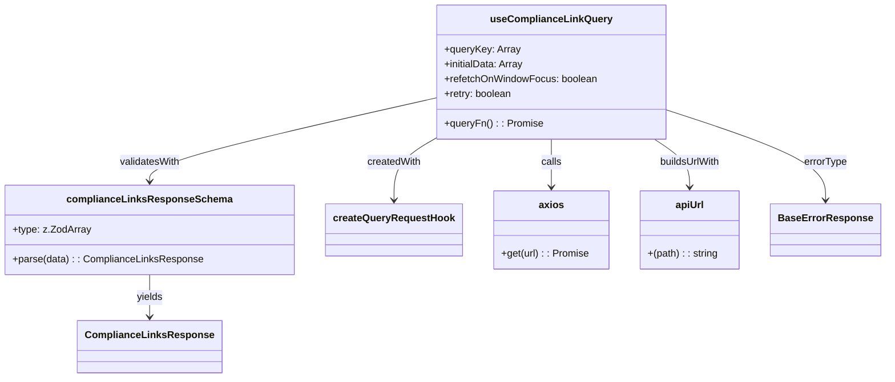

# Diagram: web/portal/src/pages/partnerportal/compliance/react-queries/useComplianceLinkQuery.ts

> Auto-generated by Obscura crawlers

## Mermaid

### SVG

<svg id="container" width="1389.359375" xmlns="http://www.w3.org/2000/svg" class="classDiagram" height="608" viewBox="0 0 1389.359375 608" role="graphics-document document" aria-roledescription="class"><g><defs><marker id="container_class-aggregationStart" class="marker aggregation class" refX="18" refY="7" markerWidth="190" markerHeight="240" orient="auto"><path d="M 18,7 L9,13 L1,7 L9,1 Z"></path></marker></defs><defs><marker id="container_class-aggregationEnd" class="marker aggregation class" refX="1" refY="7" markerWidth="20" markerHeight="28" orient="auto"><path d="M 18,7 L9,13 L1,7 L9,1 Z"></path></marker></defs><defs><marker id="container_class-extensionStart" class="marker extension class" refX="18" refY="7" markerWidth="190" markerHeight="240" orient="auto"><path d="M 1,7 L18,13 V 1 Z"></path></marker></defs><defs><marker id="container_class-extensionEnd" class="marker extension class" refX="1" refY="7" markerWidth="20" markerHeight="28" orient="auto"><path d="M 1,1 V 13 L18,7 Z"></path></marker></defs><defs><marker id="container_class-compositionStart" class="marker composition class" refX="18" refY="7" markerWidth="190" markerHeight="240" orient="auto"><path d="M 18,7 L9,13 L1,7 L9,1 Z"></path></marker></defs><defs><marker id="container_class-compositionEnd" class="marker composition class" refX="1" refY="7" markerWidth="20" markerHeight="28" orient="auto"><path d="M 18,7 L9,13 L1,7 L9,1 Z"></path></marker></defs><defs><marker id="container_class-dependencyStart" class="marker dependency class" refX="6" refY="7" markerWidth="190" markerHeight="240" orient="auto"><path d="M 5,7 L9,13 L1,7 L9,1 Z"></path></marker></defs><defs><marker id="container_class-dependencyEnd" class="marker dependency class" refX="13" refY="7" markerWidth="20" markerHeight="28" orient="auto"><path d="M 18,7 L9,13 L14,7 L9,1 Z"></path></marker></defs><defs><marker id="container_class-lollipopStart" class="marker lollipop class" refX="13" refY="7" markerWidth="190" markerHeight="240" orient="auto"><circle stroke="black" fill="transparent" cx="7" cy="7" r="6"></circle></marker></defs><defs><marker id="container_class-lollipopEnd" class="marker lollipop class" refX="1" refY="7" markerWidth="190" markerHeight="240" orient="auto"><circle stroke="black" fill="transparent" cx="7" cy="7" r="6"></circle></marker></defs><g class="root"><g class="clusters"></g><g class="edgePaths"><path d="M682.793,222.001L671.702,228.501C660.612,235.001,638.431,248,627.34,264.667C616.25,281.333,616.25,301.667,616.25,311.833L616.25,322" id="id_useComplianceLinkQuery_createQueryRequestHook_1" class="edge-thickness-normal edge-pattern-solid relation" style=";;;" data-edge="true" data-et="edge" data-id="id_useComplianceLinkQuery_createQueryRequestHook_1" data-points="W3sieCI6NjgyLjc5Mjk2ODc1LCJ5IjoyMjIuMDAxMDczNjIyMDUzNDd9LHsieCI6NjE2LjI1LCJ5IjoyNjF9LHsieCI6NjE2LjI1LCJ5IjozMjh9XQ==" marker-end="url(#container_class-dependencyEnd)"></path><path d="M682.793,157.665L608.031,174.888C533.268,192.11,383.743,226.555,308.981,248.944C234.219,271.333,234.219,281.667,234.219,286.833L234.219,292" id="id_useComplianceLinkQuery_complianceLinksResponseSchema_2" class="edge-thickness-normal edge-pattern-solid relation" style=";;;" data-edge="true" data-et="edge" data-id="id_useComplianceLinkQuery_complianceLinksResponseSchema_2" data-points="W3sieCI6NjgyLjc5Mjk2ODc1LCJ5IjoxNTcuNjY1MTA0ODQ4NjY5MTZ9LHsieCI6MjM0LjIxODc1LCJ5IjoyNjF9LHsieCI6MjM0LjIxODc1LCJ5IjoyOTh9XQ==" marker-end="url(#container_class-dependencyEnd)"></path><path d="M863.66,224L863.66,230.167C863.66,236.333,863.66,248.667,863.66,261.5C863.66,274.333,863.66,287.667,863.66,294.333L863.66,301" id="id_useComplianceLinkQuery_axios_3" class="edge-thickness-normal edge-pattern-solid relation" style=";;;" data-edge="true" data-et="edge" data-id="id_useComplianceLinkQuery_axios_3" data-points="W3sieCI6ODYzLjY2MDE1NjI1LCJ5IjoyMjR9LHsieCI6ODYzLjY2MDE1NjI1LCJ5IjoyNjF9LHsieCI6ODYzLjY2MDE1NjI1LCJ5IjozMDd9XQ==" marker-end="url(#container_class-dependencyEnd)"></path><path d="M1028.639,224L1038.06,230.167C1047.48,236.333,1066.32,248.667,1075.74,261.5C1085.16,274.333,1085.16,287.667,1085.16,294.333L1085.16,301" id="id_useComplianceLinkQuery_apiUrl_4" class="edge-thickness-normal edge-pattern-solid relation" style=";;;" data-edge="true" data-et="edge" data-id="id_useComplianceLinkQuery_apiUrl_4" data-points="W3sieCI6MTAyOC42Mzk0NjY1OTQ4Mjc2LCJ5IjoyMjR9LHsieCI6MTA4NS4xNjAxNTYyNSwieSI6MjYxfSx7IngiOjEwODUuMTYwMTU2MjUsInkiOjMwN31d" marker-end="url(#container_class-dependencyEnd)"></path><path d="M1044.527,176.351L1086.808,190.459C1129.089,204.568,1213.65,232.784,1255.93,257.059C1298.211,281.333,1298.211,301.667,1298.211,311.833L1298.211,322" id="id_useComplianceLinkQuery_BaseErrorResponse_5" class="edge-thickness-normal edge-pattern-solid relation" style=";;;" data-edge="true" data-et="edge" data-id="id_useComplianceLinkQuery_BaseErrorResponse_5" data-points="W3sieCI6MTA0NC41MjczNDM3NSwieSI6MTc2LjM1MTM4NjU3OTE3MjF9LHsieCI6MTI5OC4yMTA5Mzc1LCJ5IjoyNjF9LHsieCI6MTI5OC4yMTA5Mzc1LCJ5IjozMjh9XQ==" marker-end="url(#container_class-dependencyEnd)"></path><path d="M234.219,442L234.219,448.167C234.219,454.333,234.219,466.667,234.219,478C234.219,489.333,234.219,499.667,234.219,504.833L234.219,510" id="id_complianceLinksResponseSchema_ComplianceLinksResponse_6" class="edge-thickness-normal edge-pattern-solid relation" style=";;;" data-edge="true" data-et="edge" data-id="id_complianceLinksResponseSchema_ComplianceLinksResponse_6" data-points="W3sieCI6MjM0LjIxODc1LCJ5Ijo0NDJ9LHsieCI6MjM0LjIxODc1LCJ5Ijo0Nzl9LHsieCI6MjM0LjIxODc1LCJ5Ijo1MTZ9XQ==" marker-end="url(#container_class-dependencyEnd)"></path></g><g class="edgeLabels"><g class="edgeLabel" transform="translate(616.25, 261)"><g class="label" data-id="id_useComplianceLinkQuery_createQueryRequestHook_1" transform="translate(-43.65625, -12)"><foreignObject width="87.3125" height="24">

createdWith

</foreignObject></g></g><g class="edgeLabel" transform="translate(234.21875, 261)"><g class="label" data-id="id_useComplianceLinkQuery_complianceLinksResponseSchema_2" transform="translate(-49.125, -12)"><foreignObject width="98.25" height="24">

validatesWith

</foreignObject></g></g><g class="edgeLabel" transform="translate(863.66015625, 261)"><g class="label" data-id="id_useComplianceLinkQuery_axios_3" transform="translate(-16.4453125, -12)"><foreignObject width="32.890625" height="24">

calls

</foreignObject></g></g><g class="edgeLabel" transform="translate(1085.16015625, 261)"><g class="label" data-id="id_useComplianceLinkQuery_apiUrl_4" transform="translate(-49.65625, -12)"><foreignObject width="99.3125" height="24">

buildsUrlWith

</foreignObject></g></g><g class="edgeLabel" transform="translate(1298.2109375, 261)"><g class="label" data-id="id_useComplianceLinkQuery_BaseErrorResponse_5" transform="translate(-34.921875, -12)"><foreignObject width="69.84375" height="24">

errorType

</foreignObject></g></g><g class="edgeLabel" transform="translate(234.21875, 479)"><g class="label" data-id="id_complianceLinksResponseSchema_ComplianceLinksResponse_6" transform="translate(-21.3828125, -12)"><foreignObject width="42.765625" height="24">

yields

</foreignObject></g></g></g><g class="nodes"><g class="node default" id="classId-complianceLinksResponseSchema-0" transform="translate(234.21875, 370)"><g class="basic label-container"><path d="M-226.21875 -72 L226.21875 -72 L226.21875 72 L-226.21875 72" stroke="none" stroke-width="0" fill="#ECECFF" style=""></path><path d="M-226.21875 -72 C-76.90301350168707 -72, 72.41272299662586 -72, 226.21875 -72 M-226.21875 -72 C-114.04880647362306 -72, -1.8788629472461196 -72, 226.21875 -72 M226.21875 -72 C226.21875 -41.39677713531065, 226.21875 -10.7935542706213, 226.21875 72 M226.21875 -72 C226.21875 -26.36031722931159, 226.21875 19.27936554137682, 226.21875 72 M226.21875 72 C135.12900523785174 72, 44.039260475703514 72, -226.21875 72 M226.21875 72 C58.97566452700909 72, -108.26742094598183 72, -226.21875 72 M-226.21875 72 C-226.21875 34.782455097983096, -226.21875 -2.435089804033808, -226.21875 -72 M-226.21875 72 C-226.21875 20.879474843409298, -226.21875 -30.241050313181404, -226.21875 -72" stroke="#9370DB" stroke-width="1.3" fill="none" stroke-dasharray="0 0" style=""></path></g><g class="annotation-group text" transform="translate(0, -48)"></g><g class="label-group text" transform="translate(-124.84375, -48)"><g class="label" style="font-weight: bolder" transform="translate(0,-12)"><foreignObject width="249.6875" height="24">

complianceLinksResponseSchema

</foreignObject></g></g><g class="members-group text" transform="translate(-214.21875, 0)"><g class="label" style="" transform="translate(0,-12)"><foreignObject width="122.890625" height="24">

+type: z.ZodArray

</foreignObject></g></g><g class="methods-group text" transform="translate(-214.21875, 48)"><g class="label" style="" transform="translate(0,-12)"><foreignObject width="303.59375" height="24">

+parse(data) : : ComplianceLinksResponse

</foreignObject></g></g><g class="divider" style=""><path d="M-226.21875 -24 C-104.1124139057617 -24, 17.993922188476603 -24, 226.21875 -24 M-226.21875 -24 C-85.21627783672247 -24, 55.78619432655506 -24, 226.21875 -24" stroke="#9370DB" stroke-width="1.3" fill="none" stroke-dasharray="0 0" style=""></path></g><g class="divider" style=""><path d="M-226.21875 24 C-108.79933117350105 24, 8.62008765299791 24, 226.21875 24 M-226.21875 24 C-116.83635702098992 24, -7.4539640419798445 24, 226.21875 24" stroke="#9370DB" stroke-width="1.3" fill="none" stroke-dasharray="0 0" style=""></path></g></g><g class="node default" id="classId-ComplianceLinksResponse-1" transform="translate(234.21875, 558)"><g class="basic label-container"><path d="M-109.03125 -42 L109.03125 -42 L109.03125 42 L-109.03125 42" stroke="none" stroke-width="0" fill="#ECECFF" style=""></path><path d="M-109.03125 -42 C-54.707148671486436 -42, -0.3830473429728727 -42, 109.03125 -42 M-109.03125 -42 C-50.654412816641724 -42, 7.722424366716552 -42, 109.03125 -42 M109.03125 -42 C109.03125 -20.838030025175208, 109.03125 0.32393994964958495, 109.03125 42 M109.03125 -42 C109.03125 -15.747969061702246, 109.03125 10.504061876595507, 109.03125 42 M109.03125 42 C45.99986403942723 42, -17.03152192114554 42, -109.03125 42 M109.03125 42 C39.494052321312665 42, -30.04314535737467 42, -109.03125 42 M-109.03125 42 C-109.03125 19.687509830392887, -109.03125 -2.6249803392142255, -109.03125 -42 M-109.03125 42 C-109.03125 8.640920050118432, -109.03125 -24.718159899763137, -109.03125 -42" stroke="#9370DB" stroke-width="1.3" fill="none" stroke-dasharray="0 0" style=""></path></g><g class="annotation-group text" transform="translate(0, -18)"></g><g class="label-group text" transform="translate(-97.03125, -18)"><g class="label" style="font-weight: bolder" transform="translate(0,-12)"><foreignObject width="194.0625" height="24">

ComplianceLinksResponse

</foreignObject></g></g><g class="members-group text" transform="translate(-97.03125, 30)"></g><g class="methods-group text" transform="translate(-97.03125, 60)"></g><g class="divider" style=""><path d="M-109.03125 6 C-27.772213238904115 6, 53.48682352219177 6, 109.03125 6 M-109.03125 6 C-32.08053890210044 6, 44.870172195799114 6, 109.03125 6" stroke="#9370DB" stroke-width="1.3" fill="none" stroke-dasharray="0 0" style=""></path></g><g class="divider" style=""><path d="M-109.03125 24 C-61.93743571881348 24, -14.843621437626965 24, 109.03125 24 M-109.03125 24 C-54.66068971128653 24, -0.2901294225730595 24, 109.03125 24" stroke="#9370DB" stroke-width="1.3" fill="none" stroke-dasharray="0 0" style=""></path></g></g><g class="node default" id="classId-useComplianceLinkQuery-2" transform="translate(863.66015625, 116)"><g class="basic label-container"><path d="M-180.8671875 -108 L180.8671875 -108 L180.8671875 108 L-180.8671875 108" stroke="none" stroke-width="0" fill="#ECECFF" style=""></path><path d="M-180.8671875 -108 C-91.14744307085229 -108, -1.4276986417045805 -108, 180.8671875 -108 M-180.8671875 -108 C-66.31344635463934 -108, 48.24029479072132 -108, 180.8671875 -108 M180.8671875 -108 C180.8671875 -33.085756558144624, 180.8671875 41.82848688371075, 180.8671875 108 M180.8671875 -108 C180.8671875 -45.13185173745975, 180.8671875 17.736296525080505, 180.8671875 108 M180.8671875 108 C99.87694468221459 108, 18.88670186442917 108, -180.8671875 108 M180.8671875 108 C46.577539384794534 108, -87.71210873041093 108, -180.8671875 108 M-180.8671875 108 C-180.8671875 62.593995192662355, -180.8671875 17.18799038532471, -180.8671875 -108 M-180.8671875 108 C-180.8671875 39.72350536184881, -180.8671875 -28.552989276302384, -180.8671875 -108" stroke="#9370DB" stroke-width="1.3" fill="none" stroke-dasharray="0 0" style=""></path></g><g class="annotation-group text" transform="translate(0, -84)"></g><g class="label-group text" transform="translate(-92.484375, -84)"><g class="label" style="font-weight: bolder" transform="translate(0,-12)"><foreignObject width="184.96875" height="24">

useComplianceLinkQuery

</foreignObject></g></g><g class="members-group text" transform="translate(-168.8671875, -36)"><g class="label" style="" transform="translate(0,-12)"><foreignObject width="120.8125" height="24">

+queryKey: Array

</foreignObject></g><g class="label" style="" transform="translate(0,12)"><foreignObject width="128.5" height="24">

+initialData: Array

</foreignObject></g><g class="label" style="" transform="translate(0,36)"><foreignObject width="245.25" height="24">

+refetchOnWindowFocus: boolean

</foreignObject></g><g class="label" style="" transform="translate(0,60)"><foreignObject width="109.8125" height="24">

+retry: boolean

</foreignObject></g></g><g class="methods-group text" transform="translate(-168.8671875, 84)"><g class="label" style="" transform="translate(0,-12)"><foreignObject width="155.515625" height="24">

+queryFn() : : Promise

</foreignObject></g></g><g class="divider" style=""><path d="M-180.8671875 -60 C-41.93049466075121 -60, 97.00619817849758 -60, 180.8671875 -60 M-180.8671875 -60 C-47.269463583576595 -60, 86.32826033284681 -60, 180.8671875 -60" stroke="#9370DB" stroke-width="1.3" fill="none" stroke-dasharray="0 0" style=""></path></g><g class="divider" style=""><path d="M-180.8671875 60 C-46.00973245291107 60, 88.84772259417787 60, 180.8671875 60 M-180.8671875 60 C-58.44520933628449 60, 63.976768827431016 60, 180.8671875 60" stroke="#9370DB" stroke-width="1.3" fill="none" stroke-dasharray="0 0" style=""></path></g></g><g class="node default" id="classId-createQueryRequestHook-3" transform="translate(616.25, 370)"><g class="basic label-container"><path d="M-105.8125 -42 L105.8125 -42 L105.8125 42 L-105.8125 42" stroke="none" stroke-width="0" fill="#ECECFF" style=""></path><path d="M-105.8125 -42 C-34.804503200983575 -42, 36.20349359803285 -42, 105.8125 -42 M-105.8125 -42 C-25.457588282876827 -42, 54.897323434246346 -42, 105.8125 -42 M105.8125 -42 C105.8125 -19.671293208691104, 105.8125 2.6574135826177923, 105.8125 42 M105.8125 -42 C105.8125 -23.444926452154494, 105.8125 -4.889852904308988, 105.8125 42 M105.8125 42 C47.23527364917382 42, -11.34195270165236 42, -105.8125 42 M105.8125 42 C46.28064903592905 42, -13.251201928141896 42, -105.8125 42 M-105.8125 42 C-105.8125 24.080940531138427, -105.8125 6.161881062276855, -105.8125 -42 M-105.8125 42 C-105.8125 19.51867017152005, -105.8125 -2.9626596569599, -105.8125 -42" stroke="#9370DB" stroke-width="1.3" fill="none" stroke-dasharray="0 0" style=""></path></g><g class="annotation-group text" transform="translate(0, -18)"></g><g class="label-group text" transform="translate(-93.8125, -18)"><g class="label" style="font-weight: bolder" transform="translate(0,-12)"><foreignObject width="187.625" height="24">

createQueryRequestHook

</foreignObject></g></g><g class="members-group text" transform="translate(-93.8125, 30)"></g><g class="methods-group text" transform="translate(-93.8125, 60)"></g><g class="divider" style=""><path d="M-105.8125 6 C-57.18875895985448 6, -8.565017919708964 6, 105.8125 6 M-105.8125 6 C-63.46610790680443 6, -21.119715813608863 6, 105.8125 6" stroke="#9370DB" stroke-width="1.3" fill="none" stroke-dasharray="0 0" style=""></path></g><g class="divider" style=""><path d="M-105.8125 24 C-39.187433401857575 24, 27.43763319628485 24, 105.8125 24 M-105.8125 24 C-47.76019110797982 24, 10.292117784040357 24, 105.8125 24" stroke="#9370DB" stroke-width="1.3" fill="none" stroke-dasharray="0 0" style=""></path></g></g><g class="node default" id="classId-axios-4" transform="translate(863.66015625, 370)"><g class="basic label-container"><path d="M-91.59765625 -63 L91.59765625 -63 L91.59765625 63 L-91.59765625 63" stroke="none" stroke-width="0" fill="#ECECFF" style=""></path><path d="M-91.59765625 -63 C-40.72764993420095 -63, 10.142356381598105 -63, 91.59765625 -63 M-91.59765625 -63 C-26.041813969720423 -63, 39.514028310559155 -63, 91.59765625 -63 M91.59765625 -63 C91.59765625 -20.241781155491203, 91.59765625 22.516437689017593, 91.59765625 63 M91.59765625 -63 C91.59765625 -28.434105176544477, 91.59765625 6.131789646911045, 91.59765625 63 M91.59765625 63 C25.16006053778088 63, -41.27753517443824 63, -91.59765625 63 M91.59765625 63 C40.57590450972061 63, -10.445847230558783 63, -91.59765625 63 M-91.59765625 63 C-91.59765625 23.148841293042544, -91.59765625 -16.702317413914912, -91.59765625 -63 M-91.59765625 63 C-91.59765625 32.31971413324393, -91.59765625 1.6394282664878546, -91.59765625 -63" stroke="#9370DB" stroke-width="1.3" fill="none" stroke-dasharray="0 0" style=""></path></g><g class="annotation-group text" transform="translate(0, -39)"></g><g class="label-group text" transform="translate(-19.2734375, -39)"><g class="label" style="font-weight: bolder" transform="translate(0,-12)"><foreignObject width="38.546875" height="24">

axios

</foreignObject></g></g><g class="members-group text" transform="translate(-79.59765625, 9)"></g><g class="methods-group text" transform="translate(-79.59765625, 39)"><g class="label" style="" transform="translate(0,-12)"><foreignObject width="139.921875" height="24">

+get(url) : : Promise

</foreignObject></g></g><g class="divider" style=""><path d="M-91.59765625 -15 C-52.77522200043866 -15, -13.95278775087732 -15, 91.59765625 -15 M-91.59765625 -15 C-38.5730176627257 -15, 14.451620924548607 -15, 91.59765625 -15" stroke="#9370DB" stroke-width="1.3" fill="none" stroke-dasharray="0 0" style=""></path></g><g class="divider" style=""><path d="M-91.59765625 9 C-40.178048760355715 9, 11.24155872928857 9, 91.59765625 9 M-91.59765625 9 C-36.80341341308479 9, 17.99082942383042 9, 91.59765625 9" stroke="#9370DB" stroke-width="1.3" fill="none" stroke-dasharray="0 0" style=""></path></g></g><g class="node default" id="classId-apiUrl-5" transform="translate(1085.16015625, 370)"><g class="basic label-container"><path d="M-79.90234375 -63 L79.90234375 -63 L79.90234375 63 L-79.90234375 63" stroke="none" stroke-width="0" fill="#ECECFF" style=""></path><path d="M-79.90234375 -63 C-36.593191648652386 -63, 6.715960452695228 -63, 79.90234375 -63 M-79.90234375 -63 C-36.79532050241035 -63, 6.3117027451793035 -63, 79.90234375 -63 M79.90234375 -63 C79.90234375 -20.53773587689512, 79.90234375 21.92452824620976, 79.90234375 63 M79.90234375 -63 C79.90234375 -27.204208937601116, 79.90234375 8.591582124797768, 79.90234375 63 M79.90234375 63 C41.46270079930934 63, 3.023057848618677 63, -79.90234375 63 M79.90234375 63 C34.05908822766817 63, -11.78416729466366 63, -79.90234375 63 M-79.90234375 63 C-79.90234375 16.73403820394413, -79.90234375 -29.53192359211174, -79.90234375 -63 M-79.90234375 63 C-79.90234375 26.563627493109507, -79.90234375 -9.872745013780985, -79.90234375 -63" stroke="#9370DB" stroke-width="1.3" fill="none" stroke-dasharray="0 0" style=""></path></g><g class="annotation-group text" transform="translate(0, -39)"></g><g class="label-group text" transform="translate(-22.2109375, -39)"><g class="label" style="font-weight: bolder" transform="translate(0,-12)"><foreignObject width="44.421875" height="24">

apiUrl

</foreignObject></g></g><g class="members-group text" transform="translate(-67.90234375, 9)"></g><g class="methods-group text" transform="translate(-67.90234375, 39)"><g class="label" style="" transform="translate(0,-12)"><foreignObject width="113.59375" height="24">

+(path) : : string

</foreignObject></g></g><g class="divider" style=""><path d="M-79.90234375 -15 C-45.85874074212952 -15, -11.81513773425904 -15, 79.90234375 -15 M-79.90234375 -15 C-26.19715149463712 -15, 27.508040760725763 -15, 79.90234375 -15" stroke="#9370DB" stroke-width="1.3" fill="none" stroke-dasharray="0 0" style=""></path></g><g class="divider" style=""><path d="M-79.90234375 9 C-25.453410142034414 9, 28.99552346593117 9, 79.90234375 9 M-79.90234375 9 C-44.35302900694452 9, -8.803714263889034 9, 79.90234375 9" stroke="#9370DB" stroke-width="1.3" fill="none" stroke-dasharray="0 0" style=""></path></g></g><g class="node default" id="classId-BaseErrorResponse-6" transform="translate(1298.2109375, 370)"><g class="basic label-container"><path d="M-83.1484375 -42 L83.1484375 -42 L83.1484375 42 L-83.1484375 42" stroke="none" stroke-width="0" fill="#ECECFF" style=""></path><path d="M-83.1484375 -42 C-32.22609789235791 -42, 18.696241715284174 -42, 83.1484375 -42 M-83.1484375 -42 C-43.22936885491135 -42, -3.3103002098226995 -42, 83.1484375 -42 M83.1484375 -42 C83.1484375 -21.571994696713638, 83.1484375 -1.143989393427276, 83.1484375 42 M83.1484375 -42 C83.1484375 -21.97254642413341, 83.1484375 -1.9450928482668175, 83.1484375 42 M83.1484375 42 C45.01396078212557 42, 6.879484064251145 42, -83.1484375 42 M83.1484375 42 C32.997091922376164 42, -17.154253655247672 42, -83.1484375 42 M-83.1484375 42 C-83.1484375 19.857972384552465, -83.1484375 -2.2840552308950706, -83.1484375 -42 M-83.1484375 42 C-83.1484375 24.534002352807786, -83.1484375 7.0680047056155715, -83.1484375 -42" stroke="#9370DB" stroke-width="1.3" fill="none" stroke-dasharray="0 0" style=""></path></g><g class="annotation-group text" transform="translate(0, -18)"></g><g class="label-group text" transform="translate(-71.1484375, -18)"><g class="label" style="font-weight: bolder" transform="translate(0,-12)"><foreignObject width="142.296875" height="24">

BaseErrorResponse

</foreignObject></g></g><g class="members-group text" transform="translate(-71.1484375, 30)"></g><g class="methods-group text" transform="translate(-71.1484375, 60)"></g><g class="divider" style=""><path d="M-83.1484375 6 C-40.681379216121215 6, 1.7856790677575702 6, 83.1484375 6 M-83.1484375 6 C-32.73694226037683 6, 17.674552979246343 6, 83.1484375 6" stroke="#9370DB" stroke-width="1.3" fill="none" stroke-dasharray="0 0" style=""></path></g><g class="divider" style=""><path d="M-83.1484375 24 C-42.57208106644371 24, -1.9957246328874163 24, 83.1484375 24 M-83.1484375 24 C-40.8466187590962 24, 1.4551999818075956 24, 83.1484375 24" stroke="#9370DB" stroke-width="1.3" fill="none" stroke-dasharray="0 0" style=""></path></g></g></g></g></g></svg>
