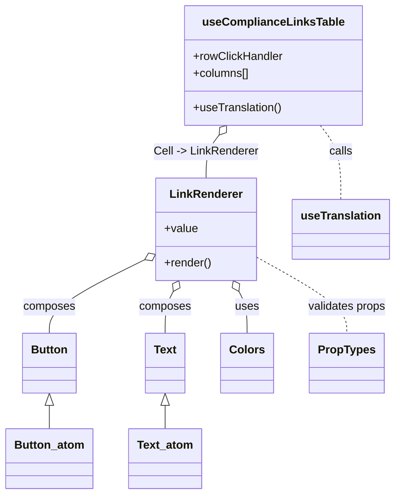

# Diagram: web/portal/src/pages/partnerportal/compliance/useComplianceLinksTable.js


> Auto-generated by Obscura crawlers

## Diagram 1



### SVG

<svg id="container" width="543.57421875" xmlns="http://www.w3.org/2000/svg" class="classDiagram" height="694" viewBox="0 0 543.57421875 694" role="graphics-document document" aria-roledescription="class"><style>#container{font-family:"trebuchet ms",verdana,arial,sans-serif;font-size:16px;fill:#333;}@keyframes edge-animation-frame{from{stroke-dashoffset:0;}}@keyframes dash{to{stroke-dashoffset:0;}}#container .edge-animation-slow{stroke-dasharray:9,5!important;stroke-dashoffset:900;animation:dash 50s linear infinite;stroke-linecap:round;}#container .edge-animation-fast{stroke-dasharray:9,5!important;stroke-dashoffset:900;animation:dash 20s linear infinite;stroke-linecap:round;}#container .error-icon{fill:#552222;}#container .error-text{fill:#552222;stroke:#552222;}#container .edge-thickness-normal{stroke-width:1px;}#container .edge-thickness-thick{stroke-width:3.5px;}#container .edge-pattern-solid{stroke-dasharray:0;}#container .edge-thickness-invisible{stroke-width:0;fill:none;}#container .edge-pattern-dashed{stroke-dasharray:3;}#container .edge-pattern-dotted{stroke-dasharray:2;}#container .marker{fill:#333333;stroke:#333333;}#container .marker.cross{stroke:#333333;}#container svg{font-family:"trebuchet ms",verdana,arial,sans-serif;font-size:16px;}#container p{margin:0;}#container g.classGroup text{fill:#9370DB;stroke:none;font-family:"trebuchet ms",verdana,arial,sans-serif;font-size:10px;}#container g.classGroup text .title{font-weight:bolder;}#container .nodeLabel,#container .edgeLabel{color:#131300;}#container .edgeLabel .label rect{fill:#ECECFF;}#container .label text{fill:#131300;}#container .labelBkg{background:#ECECFF;}#container .edgeLabel .label span{background:#ECECFF;}#container .classTitle{font-weight:bolder;}#container .node rect,#container .node circle,#container .node ellipse,#container .node polygon,#container .node path{fill:#ECECFF;stroke:#9370DB;stroke-width:1px;}#container .divider{stroke:#9370DB;stroke-width:1;}#container g.clickable{cursor:pointer;}#container g.classGroup rect{fill:#ECECFF;stroke:#9370DB;}#container g.classGroup line{stroke:#9370DB;stroke-width:1;}#container .classLabel .box{stroke:none;stroke-width:0;fill:#ECECFF;opacity:0.5;}#container .classLabel .label{fill:#9370DB;font-size:10px;}#container .relation{stroke:#333333;stroke-width:1;fill:none;}#container .dashed-line{stroke-dasharray:3;}#container .dotted-line{stroke-dasharray:1 2;}#container #compositionStart,#container .composition{fill:#333333!important;stroke:#333333!important;stroke-width:1;}#container #compositionEnd,#container .composition{fill:#333333!important;stroke:#333333!important;stroke-width:1;}#container #dependencyStart,#container .dependency{fill:#333333!important;stroke:#333333!important;stroke-width:1;}#container #dependencyStart,#container .dependency{fill:#333333!important;stroke:#333333!important;stroke-width:1;}#container #extensionStart,#container .extension{fill:transparent!important;stroke:#333333!important;stroke-width:1;}#container #extensionEnd,#container .extension{fill:transparent!important;stroke:#333333!important;stroke-width:1;}#container #aggregationStart,#container .aggregation{fill:transparent!important;stroke:#333333!important;stroke-width:1;}#container #aggregationEnd,#container .aggregation{fill:transparent!important;stroke:#333333!important;stroke-width:1;}#container #lollipopStart,#container .lollipop{fill:#ECECFF!important;stroke:#333333!important;stroke-width:1;}#container #lollipopEnd,#container .lollipop{fill:#ECECFF!important;stroke:#333333!important;stroke-width:1;}#container .edgeTerminals{font-size:11px;line-height:initial;}#container .classTitleText{text-anchor:middle;font-size:18px;fill:#333;}#container .label-icon{display:inline-block;height:1em;overflow:visible;vertical-align:-0.125em;}#container .node .label-icon path{fill:currentColor;stroke:revert;stroke-width:revert;}#container :root{--mermaid-font-family:"trebuchet ms",verdana,arial,sans-serif;}</style><g><defs><marker id="container_class-aggregationStart" class="marker aggregation class" refX="18" refY="7" markerWidth="190" markerHeight="240" orient="auto"><path d="M 18,7 L9,13 L1,7 L9,1 Z"></path></marker></defs><defs><marker id="container_class-aggregationEnd" class="marker aggregation class" refX="1" refY="7" markerWidth="20" markerHeight="28" orient="auto"><path d="M 18,7 L9,13 L1,7 L9,1 Z"></path></marker></defs><defs><marker id="container_class-extensionStart" class="marker extension class" refX="18" refY="7" markerWidth="190" markerHeight="240" orient="auto"><path d="M 1,7 L18,13 V 1 Z"></path></marker></defs><defs><marker id="container_class-extensionEnd" class="marker extension class" refX="1" refY="7" markerWidth="20" markerHeight="28" orient="auto"><path d="M 1,1 V 13 L18,7 Z"></path></marker></defs><defs><marker id="container_class-compositionStart" class="marker composition class" refX="18" refY="7" markerWidth="190" markerHeight="240" orient="auto"><path d="M 18,7 L9,13 L1,7 L9,1 Z"></path></marker></defs><defs><marker id="container_class-compositionEnd" class="marker composition class" refX="1" refY="7" markerWidth="20" markerHeight="28" orient="auto"><path d="M 18,7 L9,13 L1,7 L9,1 Z"></path></marker></defs><defs><marker id="container_class-dependencyStart" class="marker dependency class" refX="6" refY="7" markerWidth="190" markerHeight="240" orient="auto"><path d="M 5,7 L9,13 L1,7 L9,1 Z"></path></marker></defs><defs><marker id="container_class-dependencyEnd" class="marker dependency class" refX="13" refY="7" markerWidth="20" markerHeight="28" orient="auto"><path d="M 18,7 L9,13 L14,7 L9,1 Z"></path></marker></defs><defs><marker id="container_class-lollipopStart" class="marker lollipop class" refX="13" refY="7" markerWidth="190" markerHeight="240" orient="auto"><circle stroke="black" fill="transparent" cx="7" cy="7" r="6"></circle></marker></defs><defs><marker id="container_class-lollipopEnd" class="marker lollipop class" refX="1" refY="7" markerWidth="190" markerHeight="240" orient="auto"><circle stroke="black" fill="transparent" cx="7" cy="7" r="6"></circle></marker></defs><g class="root"><g class="clusters"></g><g class="edgePaths"><path d="M328.631,409.33L330.495,412.941C332.358,416.553,336.085,423.777,337.949,433.555C339.813,443.333,339.813,455.667,339.813,461.833L339.813,468" id="id_LinkRenderer_Colors_1" class="edge-thickness-normal edge-pattern-solid relation" style=";;;" data-edge="true" data-et="edge" data-id="id_LinkRenderer_Colors_1" data-points="W3sieCI6MzIwLjcyMTExNTI1MjI5MzYsInkiOjM5NH0seyJ4IjozMzkuODEyNSwieSI6NDMxfSx7IngiOjMzOS44MTI1LCJ5Ijo0Njh9XQ==" marker-start="url(#container_class-aggregationStart)"></path><path d="M198.338,365.015L176.548,376.013C154.757,387.01,111.175,409.005,89.385,426.169C67.594,443.333,67.594,455.667,67.594,461.833L67.594,468" id="id_LinkRenderer_Button_2" class="edge-thickness-normal edge-pattern-solid relation" style=";;;" data-edge="true" data-et="edge" data-id="id_LinkRenderer_Button_2" data-points="W3sieCI6MjEzLjczODI4MTI1LCJ5IjozNTcuMjQzMTM2MTkwOTkyOTd9LHsieCI6NjcuNTkzNzUsInkiOjQzMX0seyJ4Ijo2Ny41OTM3NSwieSI6NDY4fV0=" marker-start="url(#container_class-aggregationStart)"></path><path d="M238.51,409.33L236.646,412.941C234.782,416.553,231.055,423.777,229.192,433.555C227.328,443.333,227.328,455.667,227.328,461.833L227.328,468" id="id_LinkRenderer_Text_3" class="edge-thickness-normal edge-pattern-solid relation" style=";;;" data-edge="true" data-et="edge" data-id="id_LinkRenderer_Text_3" data-points="W3sieCI6MjQ2LjQxOTUwOTc0NzcwNjQzLCJ5IjozOTR9LHsieCI6MjI3LjMyODEyNSwieSI6NDMxfSx7IngiOjIyNy4zMjgxMjUsInkiOjQ2OH1d" marker-start="url(#container_class-aggregationStart)"></path><path d="M353.402,361.727L373.697,373.272C393.992,384.818,434.582,407.909,454.877,425.621C475.172,443.333,475.172,455.667,475.172,461.833L475.172,468" id="id_LinkRenderer_PropTypes_4" class="edge-thickness-normal edge-pattern-dashed relation" style=";;;" data-edge="true" data-et="edge" data-id="id_LinkRenderer_PropTypes_4" data-points="W3sieCI6MzUzLjQwMjM0Mzc1LCJ5IjozNjEuNzI2NjY2NjY2NjY2N30seyJ4Ijo0NzUuMTcxODc1LCJ5Ijo0MzF9LHsieCI6NDc1LjE3MTg3NSwieSI6NDY4fV0="></path><path d="M441.063,176L445.8,182.167C450.538,188.333,460.013,200.667,464.751,218C469.488,235.333,469.488,257.667,469.488,268.833L469.488,280" id="id_useComplianceLinksTable_useTranslation_5" class="edge-thickness-normal edge-pattern-dashed relation" style=";;;" data-edge="true" data-et="edge" data-id="id_useComplianceLinksTable_useTranslation_5" data-points="W3sieCI6NDQxLjA2MjgwNjY4OTA0OTYsInkiOjE3Nn0seyJ4Ijo0NjkuNDg4MjgxMjUsInkiOjIxM30seyJ4Ijo0NjkuNDg4MjgxMjUsInkiOjI4MH1d"></path><path d="M301.487,189.679L298.501,193.566C295.515,197.453,289.542,205.226,286.556,215.28C283.57,225.333,283.57,237.667,283.57,243.833L283.57,250" id="id_useComplianceLinksTable_LinkRenderer_6" class="edge-thickness-normal edge-pattern-solid relation" style=";;;" data-edge="true" data-et="edge" data-id="id_useComplianceLinksTable_LinkRenderer_6" data-points="W3sieCI6MzExLjk5NTc4NzA2MDk1MDQsInkiOjE3Nn0seyJ4IjoyODMuNTcwMzEyNSwieSI6MjEzfSx7IngiOjI4My41NzAzMTI1LCJ5IjoyNTB9XQ==" marker-start="url(#container_class-aggregationStart)"></path><path d="M67.594,569.25L67.594,570.542C67.594,571.833,67.594,574.417,67.594,579.875C67.594,585.333,67.594,593.667,67.594,597.833L67.594,602" id="id_Button_Button_atom_7" class="edge-thickness-normal edge-pattern-solid relation" style=";;;" data-edge="true" data-et="edge" data-id="id_Button_Button_atom_7" data-points="W3sieCI6NjcuNTkzNzUsInkiOjU1Mn0seyJ4Ijo2Ny41OTM3NSwieSI6NTc3fSx7IngiOjY3LjU5Mzc1LCJ5Ijo2MDJ9XQ==" marker-start="url(#container_class-extensionStart)"></path><path d="M227.328,569.25L227.328,570.542C227.328,571.833,227.328,574.417,227.328,579.875C227.328,585.333,227.328,593.667,227.328,597.833L227.328,602" id="id_Text_Text_atom_8" class="edge-thickness-normal edge-pattern-solid relation" style=";;;" data-edge="true" data-et="edge" data-id="id_Text_Text_atom_8" data-points="W3sieCI6MjI3LjMyODEyNSwieSI6NTUyfSx7IngiOjIyNy4zMjgxMjUsInkiOjU3N30seyJ4IjoyMjcuMzI4MTI1LCJ5Ijo2MDJ9XQ==" marker-start="url(#container_class-extensionStart)"></path></g><g class="edgeLabels"><g class="edgeLabel" transform="translate(339.8125, 431)"><g class="label" data-id="id_LinkRenderer_Colors_1" transform="translate(-16.4921875, -12)"><foreignObject width="32.984375" height="24"><div xmlns="http://www.w3.org/1999/xhtml" class="labelBkg" style="display: table-cell; white-space: nowrap; line-height: 1.5; max-width: 200px; text-align: center;"><span class="edgeLabel"><p>uses</p></span></div></foreignObject></g></g><g class="edgeLabel" transform="translate(67.59375, 431)"><g class="label" data-id="id_LinkRenderer_Button_2" transform="translate(-36.453125, -12)"><foreignObject width="72.90625" height="24"><div xmlns="http://www.w3.org/1999/xhtml" class="labelBkg" style="display: table-cell; white-space: nowrap; line-height: 1.5; max-width: 200px; text-align: center;"><span class="edgeLabel"><p>composes</p></span></div></foreignObject></g></g><g class="edgeLabel" transform="translate(227.328125, 431)"><g class="label" data-id="id_LinkRenderer_Text_3" transform="translate(-36.453125, -12)"><foreignObject width="72.90625" height="24"><div xmlns="http://www.w3.org/1999/xhtml" class="labelBkg" style="display: table-cell; white-space: nowrap; line-height: 1.5; max-width: 200px; text-align: center;"><span class="edgeLabel"><p>composes</p></span></div></foreignObject></g></g><g class="edgeLabel" transform="translate(475.171875, 431)"><g class="label" data-id="id_LinkRenderer_PropTypes_4" transform="translate(-55.5625, -12)"><foreignObject width="111.125" height="24"><div xmlns="http://www.w3.org/1999/xhtml" class="labelBkg" style="display: table-cell; white-space: nowrap; line-height: 1.5; max-width: 200px; text-align: center;"><span class="edgeLabel"><p>validates props</p></span></div></foreignObject></g></g><g class="edgeLabel" transform="translate(469.48828125, 213)"><g class="label" data-id="id_useComplianceLinksTable_useTranslation_5" transform="translate(-16.4453125, -12)"><foreignObject width="32.890625" height="24"><div xmlns="http://www.w3.org/1999/xhtml" class="labelBkg" style="display: table-cell; white-space: nowrap; line-height: 1.5; max-width: 200px; text-align: center;"><span class="edgeLabel"><p>calls</p></span></div></foreignObject></g></g><g class="edgeLabel" transform="translate(283.5703125, 213)"><g class="label" data-id="id_useComplianceLinksTable_LinkRenderer_6" transform="translate(-73.0703125, -12)"><foreignObject width="146.140625" height="24"><div xmlns="http://www.w3.org/1999/xhtml" class="labelBkg" style="display: table-cell; white-space: nowrap; line-height: 1.5; max-width: 200px; text-align: center;"><span class="edgeLabel"><p>Cell -&gt; LinkRenderer</p></span></div></foreignObject></g></g><g class="edgeLabel"><g class="label" data-id="id_Button_Button_atom_7" transform="translate(0, 0)"><foreignObject width="0" height="0"><div xmlns="http://www.w3.org/1999/xhtml" class="labelBkg" style="display: table-cell; white-space: nowrap; line-height: 1.5; max-width: 200px; text-align: center;"><span class="edgeLabel"></span></div></foreignObject></g></g><g class="edgeLabel"><g class="label" data-id="id_Text_Text_atom_8" transform="translate(0, 0)"><foreignObject width="0" height="0"><div xmlns="http://www.w3.org/1999/xhtml" class="labelBkg" style="display: table-cell; white-space: nowrap; line-height: 1.5; max-width: 200px; text-align: center;"><span class="edgeLabel"></span></div></foreignObject></g></g></g><g class="nodes"><g class="node default" id="classId-LinkRenderer-0" transform="translate(283.5703125, 322)"><g class="basic label-container"><path d="M-69.83203125 -72 L69.83203125 -72 L69.83203125 72 L-69.83203125 72" stroke="none" stroke-width="0" fill="#ECECFF" style=""></path><path d="M-69.83203125 -72 C-31.149554970773316 -72, 7.532921308453368 -72, 69.83203125 -72 M-69.83203125 -72 C-39.17342672907645 -72, -8.5148222081529 -72, 69.83203125 -72 M69.83203125 -72 C69.83203125 -16.803874864541314, 69.83203125 38.39225027091737, 69.83203125 72 M69.83203125 -72 C69.83203125 -31.122048699020425, 69.83203125 9.75590260195915, 69.83203125 72 M69.83203125 72 C32.69254567099561 72, -4.446939908008787 72, -69.83203125 72 M69.83203125 72 C25.634560030142588 72, -18.562911189714825 72, -69.83203125 72 M-69.83203125 72 C-69.83203125 18.840017160062963, -69.83203125 -34.31996567987407, -69.83203125 -72 M-69.83203125 72 C-69.83203125 32.5035556138764, -69.83203125 -6.992888772247198, -69.83203125 -72" stroke="#9370DB" stroke-width="1.3" fill="none" stroke-dasharray="0 0" style=""></path></g><g class="annotation-group text" transform="translate(0, -48)"></g><g class="label-group text" transform="translate(-49.0546875, -48)"><g class="label" style="font-weight: bolder" transform="translate(0,-12)"><foreignObject width="98.109375" height="24"><div xmlns="http://www.w3.org/1999/xhtml" style="display: table-cell; white-space: nowrap; line-height: 1.5; max-width: 147px; text-align: center;"><span class="nodeLabel markdown-node-label" style=""><p>LinkRenderer</p></span></div></foreignObject></g></g><g class="members-group text" transform="translate(-57.83203125, 0)"><g class="label" style="" transform="translate(0,-12)"><foreignObject width="46.71875" height="24"><div xmlns="http://www.w3.org/1999/xhtml" style="display: table-cell; white-space: nowrap; line-height: 1.5; max-width: 104px; text-align: center;"><span class="nodeLabel markdown-node-label" style=""><p>+value</p></span></div></foreignObject></g></g><g class="methods-group text" transform="translate(-57.83203125, 48)"><g class="label" style="" transform="translate(0,-12)"><foreignObject width="66.609375" height="24"><div xmlns="http://www.w3.org/1999/xhtml" style="display: table-cell; white-space: nowrap; line-height: 1.5; max-width: 124px; text-align: center;"><span class="nodeLabel markdown-node-label" style=""><p>+render()</p></span></div></foreignObject></g></g><g class="divider" style=""><path d="M-69.83203125 -24 C-18.67255164716576 -24, 32.48692795566848 -24, 69.83203125 -24 M-69.83203125 -24 C-37.791977033979904 -24, -5.751922817959809 -24, 69.83203125 -24" stroke="#9370DB" stroke-width="1.3" fill="none" stroke-dasharray="0 0" style=""></path></g><g class="divider" style=""><path d="M-69.83203125 24 C-17.734331641035162 24, 34.363367967929676 24, 69.83203125 24 M-69.83203125 24 C-27.013045218273703 24, 15.805940813452594 24, 69.83203125 24" stroke="#9370DB" stroke-width="1.3" fill="none" stroke-dasharray="0 0" style=""></path></g></g><g class="node default" id="classId-useComplianceLinksTable-1" transform="translate(376.529296875, 92)"><g class="basic label-container"><path d="M-122.32421875 -84 L122.32421875 -84 L122.32421875 84 L-122.32421875 84" stroke="none" stroke-width="0" fill="#ECECFF" style=""></path><path d="M-122.32421875 -84 C-45.24581106558932 -84, 31.832596618821356 -84, 122.32421875 -84 M-122.32421875 -84 C-48.974022380353304 -84, 24.37617398929339 -84, 122.32421875 -84 M122.32421875 -84 C122.32421875 -38.37652500632749, 122.32421875 7.246949987345019, 122.32421875 84 M122.32421875 -84 C122.32421875 -26.437821455388303, 122.32421875 31.124357089223395, 122.32421875 84 M122.32421875 84 C25.467993955967216 84, -71.38823083806557 84, -122.32421875 84 M122.32421875 84 C30.32521092043413 84, -61.67379690913174 84, -122.32421875 84 M-122.32421875 84 C-122.32421875 40.375304791207064, -122.32421875 -3.2493904175858717, -122.32421875 -84 M-122.32421875 84 C-122.32421875 44.89355642702185, -122.32421875 5.7871128540436985, -122.32421875 -84" stroke="#9370DB" stroke-width="1.3" fill="none" stroke-dasharray="0 0" style=""></path></g><g class="annotation-group text" transform="translate(0, -60)"></g><g class="label-group text" transform="translate(-94.2734375, -60)"><g class="label" style="font-weight: bolder" transform="translate(0,-12)"><foreignObject width="188.546875" height="24"><div xmlns="http://www.w3.org/1999/xhtml" style="display: table-cell; white-space: nowrap; line-height: 1.5; max-width: 236px; text-align: center;"><span class="nodeLabel markdown-node-label" style=""><p>useComplianceLinksTable</p></span></div></foreignObject></g></g><g class="members-group text" transform="translate(-110.32421875, -12)"><g class="label" style="" transform="translate(0,-12)"><foreignObject width="126.375" height="24"><div xmlns="http://www.w3.org/1999/xhtml" style="display: table-cell; white-space: nowrap; line-height: 1.5; max-width: 185px; text-align: center;"><span class="nodeLabel markdown-node-label" style=""><p>+rowClickHandler</p></span></div></foreignObject></g><g class="label" style="" transform="translate(0,12)"><foreignObject width="79.53125" height="24"><div xmlns="http://www.w3.org/1999/xhtml" style="display: table-cell; white-space: nowrap; line-height: 1.5; max-width: 137px; text-align: center;"><span class="nodeLabel markdown-node-label" style=""><p>+columns[]</p></span></div></foreignObject></g></g><g class="methods-group text" transform="translate(-110.32421875, 60)"><g class="label" style="" transform="translate(0,-12)"><foreignObject width="125.140625" height="24"><div xmlns="http://www.w3.org/1999/xhtml" style="display: table-cell; white-space: nowrap; line-height: 1.5; max-width: 183px; text-align: center;"><span class="nodeLabel markdown-node-label" style=""><p>+useTranslation()</p></span></div></foreignObject></g></g><g class="divider" style=""><path d="M-122.32421875 -36 C-27.325997748865433 -36, 67.67222325226913 -36, 122.32421875 -36 M-122.32421875 -36 C-59.463569183513464 -36, 3.3970803829730727 -36, 122.32421875 -36" stroke="#9370DB" stroke-width="1.3" fill="none" stroke-dasharray="0 0" style=""></path></g><g class="divider" style=""><path d="M-122.32421875 36 C-29.87018514372845 36, 62.5838484625431 36, 122.32421875 36 M-122.32421875 36 C-72.8134974986055 36, -23.302776247210986 36, 122.32421875 36" stroke="#9370DB" stroke-width="1.3" fill="none" stroke-dasharray="0 0" style=""></path></g></g><g class="node default" id="classId-Button-2" transform="translate(67.59375, 510)"><g class="basic label-container"><path d="M-36.8359375 -42 L36.8359375 -42 L36.8359375 42 L-36.8359375 42" stroke="none" stroke-width="0" fill="#ECECFF" style=""></path><path d="M-36.8359375 -42 C-8.329293516573092 -42, 20.177350466853817 -42, 36.8359375 -42 M-36.8359375 -42 C-9.706712195298131 -42, 17.422513109403738 -42, 36.8359375 -42 M36.8359375 -42 C36.8359375 -21.865680878855258, 36.8359375 -1.7313617577105163, 36.8359375 42 M36.8359375 -42 C36.8359375 -22.793900934844697, 36.8359375 -3.587801869689393, 36.8359375 42 M36.8359375 42 C15.408456458794152 42, -6.019024582411696 42, -36.8359375 42 M36.8359375 42 C8.470293891815043 42, -19.895349716369914 42, -36.8359375 42 M-36.8359375 42 C-36.8359375 25.163394864185086, -36.8359375 8.326789728370173, -36.8359375 -42 M-36.8359375 42 C-36.8359375 16.63747162137405, -36.8359375 -8.725056757251899, -36.8359375 -42" stroke="#9370DB" stroke-width="1.3" fill="none" stroke-dasharray="0 0" style=""></path></g><g class="annotation-group text" transform="translate(0, -18)"></g><g class="label-group text" transform="translate(-24.8359375, -18)"><g class="label" style="font-weight: bolder" transform="translate(0,-12)"><foreignObject width="49.671875" height="24"><div xmlns="http://www.w3.org/1999/xhtml" style="display: table-cell; white-space: nowrap; line-height: 1.5; max-width: 99px; text-align: center;"><span class="nodeLabel markdown-node-label" style=""><p>Button</p></span></div></foreignObject></g></g><g class="members-group text" transform="translate(-24.8359375, 30)"></g><g class="methods-group text" transform="translate(-24.8359375, 60)"></g><g class="divider" style=""><path d="M-36.8359375 6 C-14.918391872946774 6, 6.999153754106452 6, 36.8359375 6 M-36.8359375 6 C-12.769040646977086 6, 11.297856206045829 6, 36.8359375 6" stroke="#9370DB" stroke-width="1.3" fill="none" stroke-dasharray="0 0" style=""></path></g><g class="divider" style=""><path d="M-36.8359375 24 C-8.709687696222641 24, 19.416562107554718 24, 36.8359375 24 M-36.8359375 24 C-13.105643275527093 24, 10.624650948945813 24, 36.8359375 24" stroke="#9370DB" stroke-width="1.3" fill="none" stroke-dasharray="0 0" style=""></path></g></g><g class="node default" id="classId-Text-3" transform="translate(227.328125, 510)"><g class="basic label-container"><path d="M-27.3828125 -42 L27.3828125 -42 L27.3828125 42 L-27.3828125 42" stroke="none" stroke-width="0" fill="#ECECFF" style=""></path><path d="M-27.3828125 -42 C-8.927354502290164 -42, 9.528103495419671 -42, 27.3828125 -42 M-27.3828125 -42 C-13.703007677218466 -42, -0.023202854436931375 -42, 27.3828125 -42 M27.3828125 -42 C27.3828125 -9.103914940161133, 27.3828125 23.792170119677735, 27.3828125 42 M27.3828125 -42 C27.3828125 -17.67216010234071, 27.3828125 6.6556797953185765, 27.3828125 42 M27.3828125 42 C6.59772570634313 42, -14.18736108731374 42, -27.3828125 42 M27.3828125 42 C11.318726902595401 42, -4.745358694809198 42, -27.3828125 42 M-27.3828125 42 C-27.3828125 14.00468238018276, -27.3828125 -13.990635239634479, -27.3828125 -42 M-27.3828125 42 C-27.3828125 12.761541689127828, -27.3828125 -16.476916621744344, -27.3828125 -42" stroke="#9370DB" stroke-width="1.3" fill="none" stroke-dasharray="0 0" style=""></path></g><g class="annotation-group text" transform="translate(0, -18)"></g><g class="label-group text" transform="translate(-15.3828125, -18)"><g class="label" style="font-weight: bolder" transform="translate(0,-12)"><foreignObject width="30.765625" height="24"><div xmlns="http://www.w3.org/1999/xhtml" style="display: table-cell; white-space: nowrap; line-height: 1.5; max-width: 80px; text-align: center;"><span class="nodeLabel markdown-node-label" style=""><p>Text</p></span></div></foreignObject></g></g><g class="members-group text" transform="translate(-15.3828125, 30)"></g><g class="methods-group text" transform="translate(-15.3828125, 60)"></g><g class="divider" style=""><path d="M-27.3828125 6 C-12.231122332018986 6, 2.9205678359620286 6, 27.3828125 6 M-27.3828125 6 C-15.249686693554393 6, -3.116560887108786 6, 27.3828125 6" stroke="#9370DB" stroke-width="1.3" fill="none" stroke-dasharray="0 0" style=""></path></g><g class="divider" style=""><path d="M-27.3828125 24 C-8.561687648551828 24, 10.259437202896343 24, 27.3828125 24 M-27.3828125 24 C-11.227371856280623 24, 4.928068787438754 24, 27.3828125 24" stroke="#9370DB" stroke-width="1.3" fill="none" stroke-dasharray="0 0" style=""></path></g></g><g class="node default" id="classId-Colors-4" transform="translate(339.8125, 510)"><g class="basic label-container"><path d="M-35.1015625 -42 L35.1015625 -42 L35.1015625 42 L-35.1015625 42" stroke="none" stroke-width="0" fill="#ECECFF" style=""></path><path d="M-35.1015625 -42 C-16.868001829718047 -42, 1.3655588405639065 -42, 35.1015625 -42 M-35.1015625 -42 C-16.374385516796018 -42, 2.3527914664079645 -42, 35.1015625 -42 M35.1015625 -42 C35.1015625 -22.7761277059207, 35.1015625 -3.5522554118414007, 35.1015625 42 M35.1015625 -42 C35.1015625 -21.680049253732697, 35.1015625 -1.3600985074653948, 35.1015625 42 M35.1015625 42 C11.41932833424596 42, -12.262905831508078 42, -35.1015625 42 M35.1015625 42 C10.640146274301674 42, -13.821269951396651 42, -35.1015625 42 M-35.1015625 42 C-35.1015625 23.506370035127976, -35.1015625 5.012740070255951, -35.1015625 -42 M-35.1015625 42 C-35.1015625 24.708126563409827, -35.1015625 7.4162531268196545, -35.1015625 -42" stroke="#9370DB" stroke-width="1.3" fill="none" stroke-dasharray="0 0" style=""></path></g><g class="annotation-group text" transform="translate(0, -18)"></g><g class="label-group text" transform="translate(-23.1015625, -18)"><g class="label" style="font-weight: bolder" transform="translate(0,-12)"><foreignObject width="46.203125" height="24"><div xmlns="http://www.w3.org/1999/xhtml" style="display: table-cell; white-space: nowrap; line-height: 1.5; max-width: 95px; text-align: center;"><span class="nodeLabel markdown-node-label" style=""><p>Colors</p></span></div></foreignObject></g></g><g class="members-group text" transform="translate(-23.1015625, 30)"></g><g class="methods-group text" transform="translate(-23.1015625, 60)"></g><g class="divider" style=""><path d="M-35.1015625 6 C-12.050681640320388 6, 11.000199219359224 6, 35.1015625 6 M-35.1015625 6 C-13.133592412833124 6, 8.834377674333751 6, 35.1015625 6" stroke="#9370DB" stroke-width="1.3" fill="none" stroke-dasharray="0 0" style=""></path></g><g class="divider" style=""><path d="M-35.1015625 24 C-12.945505088294205 24, 9.21055232341159 24, 35.1015625 24 M-35.1015625 24 C-16.388695181698523 24, 2.3241721366029537 24, 35.1015625 24" stroke="#9370DB" stroke-width="1.3" fill="none" stroke-dasharray="0 0" style=""></path></g></g><g class="node default" id="classId-PropTypes-5" transform="translate(475.171875, 510)"><g class="basic label-container"><path d="M-50.2578125 -42 L50.2578125 -42 L50.2578125 42 L-50.2578125 42" stroke="none" stroke-width="0" fill="#ECECFF" style=""></path><path d="M-50.2578125 -42 C-22.29148327953545 -42, 5.674845940929103 -42, 50.2578125 -42 M-50.2578125 -42 C-22.51980278817364 -42, 5.218206923652723 -42, 50.2578125 -42 M50.2578125 -42 C50.2578125 -12.64483218434729, 50.2578125 16.71033563130542, 50.2578125 42 M50.2578125 -42 C50.2578125 -24.951018668737998, 50.2578125 -7.902037337475996, 50.2578125 42 M50.2578125 42 C25.624095012136348 42, 0.9903775242726951 42, -50.2578125 42 M50.2578125 42 C19.949606905610068 42, -10.358598688779864 42, -50.2578125 42 M-50.2578125 42 C-50.2578125 9.917579277950452, -50.2578125 -22.164841444099096, -50.2578125 -42 M-50.2578125 42 C-50.2578125 14.728902423093231, -50.2578125 -12.542195153813537, -50.2578125 -42" stroke="#9370DB" stroke-width="1.3" fill="none" stroke-dasharray="0 0" style=""></path></g><g class="annotation-group text" transform="translate(0, -18)"></g><g class="label-group text" transform="translate(-38.2578125, -18)"><g class="label" style="font-weight: bolder" transform="translate(0,-12)"><foreignObject width="76.515625" height="24"><div xmlns="http://www.w3.org/1999/xhtml" style="display: table-cell; white-space: nowrap; line-height: 1.5; max-width: 125px; text-align: center;"><span class="nodeLabel markdown-node-label" style=""><p>PropTypes</p></span></div></foreignObject></g></g><g class="members-group text" transform="translate(-38.2578125, 30)"></g><g class="methods-group text" transform="translate(-38.2578125, 60)"></g><g class="divider" style=""><path d="M-50.2578125 6 C-20.995210210454076 6, 8.267392079091849 6, 50.2578125 6 M-50.2578125 6 C-12.486327816566757 6, 25.285156866866487 6, 50.2578125 6" stroke="#9370DB" stroke-width="1.3" fill="none" stroke-dasharray="0 0" style=""></path></g><g class="divider" style=""><path d="M-50.2578125 24 C-27.323085802601184 24, -4.388359105202369 24, 50.2578125 24 M-50.2578125 24 C-14.687447717802165 24, 20.88291706439567 24, 50.2578125 24" stroke="#9370DB" stroke-width="1.3" fill="none" stroke-dasharray="0 0" style=""></path></g></g><g class="node default" id="classId-useTranslation-6" transform="translate(469.48828125, 322)"><g class="basic label-container"><path d="M-66.0859375 -42 L66.0859375 -42 L66.0859375 42 L-66.0859375 42" stroke="none" stroke-width="0" fill="#ECECFF" style=""></path><path d="M-66.0859375 -42 C-27.022163465154712 -42, 12.041610569690576 -42, 66.0859375 -42 M-66.0859375 -42 C-14.227161745938147 -42, 37.631614008123705 -42, 66.0859375 -42 M66.0859375 -42 C66.0859375 -24.906409298224695, 66.0859375 -7.8128185964493895, 66.0859375 42 M66.0859375 -42 C66.0859375 -11.804403411141443, 66.0859375 18.391193177717113, 66.0859375 42 M66.0859375 42 C22.43803152254469 42, -21.20987445491062 42, -66.0859375 42 M66.0859375 42 C37.31405056009115 42, 8.542163620182293 42, -66.0859375 42 M-66.0859375 42 C-66.0859375 8.626164496506462, -66.0859375 -24.747671006987076, -66.0859375 -42 M-66.0859375 42 C-66.0859375 23.87580352579481, -66.0859375 5.751607051589623, -66.0859375 -42" stroke="#9370DB" stroke-width="1.3" fill="none" stroke-dasharray="0 0" style=""></path></g><g class="annotation-group text" transform="translate(0, -18)"></g><g class="label-group text" transform="translate(-54.0859375, -18)"><g class="label" style="font-weight: bolder" transform="translate(0,-12)"><foreignObject width="108.171875" height="24"><div xmlns="http://www.w3.org/1999/xhtml" style="display: table-cell; white-space: nowrap; line-height: 1.5; max-width: 157px; text-align: center;"><span class="nodeLabel markdown-node-label" style=""><p>useTranslation</p></span></div></foreignObject></g></g><g class="members-group text" transform="translate(-54.0859375, 30)"></g><g class="methods-group text" transform="translate(-54.0859375, 60)"></g><g class="divider" style=""><path d="M-66.0859375 6 C-20.341065419426833 6, 25.403806661146334 6, 66.0859375 6 M-66.0859375 6 C-22.820615664328862 6, 20.444706171342276 6, 66.0859375 6" stroke="#9370DB" stroke-width="1.3" fill="none" stroke-dasharray="0 0" style=""></path></g><g class="divider" style=""><path d="M-66.0859375 24 C-30.242957340866425 24, 5.600022818267149 24, 66.0859375 24 M-66.0859375 24 C-26.71882933850901 24, 12.648278822981979 24, 66.0859375 24" stroke="#9370DB" stroke-width="1.3" fill="none" stroke-dasharray="0 0" style=""></path></g></g><g class="node default" id="classId-Button_atom-7" transform="translate(67.59375, 644)"><g class="basic label-container"><path d="M-59.59375 -42 L59.59375 -42 L59.59375 42 L-59.59375 42" stroke="none" stroke-width="0" fill="#ECECFF" style=""></path><path d="M-59.59375 -42 C-21.121429905816022 -42, 17.350890188367956 -42, 59.59375 -42 M-59.59375 -42 C-19.967022388208044 -42, 19.659705223583913 -42, 59.59375 -42 M59.59375 -42 C59.59375 -20.064377390111446, 59.59375 1.8712452197771086, 59.59375 42 M59.59375 -42 C59.59375 -24.432778737516696, 59.59375 -6.865557475033391, 59.59375 42 M59.59375 42 C18.688830070836396 42, -22.21608985832721 42, -59.59375 42 M59.59375 42 C16.882946578111543 42, -25.827856843776914 42, -59.59375 42 M-59.59375 42 C-59.59375 21.909314835305487, -59.59375 1.8186296706109744, -59.59375 -42 M-59.59375 42 C-59.59375 9.434689051464389, -59.59375 -23.130621897071222, -59.59375 -42" stroke="#9370DB" stroke-width="1.3" fill="none" stroke-dasharray="0 0" style=""></path></g><g class="annotation-group text" transform="translate(0, -18)"></g><g class="label-group text" transform="translate(-47.59375, -18)"><g class="label" style="font-weight: bolder" transform="translate(0,-12)"><foreignObject width="95.1875" height="24"><div xmlns="http://www.w3.org/1999/xhtml" style="display: table-cell; white-space: nowrap; line-height: 1.5; max-width: 144px; text-align: center;"><span class="nodeLabel markdown-node-label" style=""><p>Button_atom</p></span></div></foreignObject></g></g><g class="members-group text" transform="translate(-47.59375, 30)"></g><g class="methods-group text" transform="translate(-47.59375, 60)"></g><g class="divider" style=""><path d="M-59.59375 6 C-31.84947219842183 6, -4.1051943968436575 6, 59.59375 6 M-59.59375 6 C-32.40411223732713 6, -5.214474474654267 6, 59.59375 6" stroke="#9370DB" stroke-width="1.3" fill="none" stroke-dasharray="0 0" style=""></path></g><g class="divider" style=""><path d="M-59.59375 24 C-33.15505853950671 24, -6.716367079013416 24, 59.59375 24 M-59.59375 24 C-27.328679416146578 24, 4.936391167706844 24, 59.59375 24" stroke="#9370DB" stroke-width="1.3" fill="none" stroke-dasharray="0 0" style=""></path></g></g><g class="node default" id="classId-Text_atom-8" transform="translate(227.328125, 644)"><g class="basic label-container"><path d="M-50.140625 -42 L50.140625 -42 L50.140625 42 L-50.140625 42" stroke="none" stroke-width="0" fill="#ECECFF" style=""></path><path d="M-50.140625 -42 C-12.909973474806606 -42, 24.32067805038679 -42, 50.140625 -42 M-50.140625 -42 C-13.962536795590097 -42, 22.215551408819806 -42, 50.140625 -42 M50.140625 -42 C50.140625 -10.135255469160523, 50.140625 21.729489061678954, 50.140625 42 M50.140625 -42 C50.140625 -14.722485128771464, 50.140625 12.555029742457073, 50.140625 42 M50.140625 42 C11.373245917187894 42, -27.39413316562421 42, -50.140625 42 M50.140625 42 C25.302518543088027 42, 0.4644120861760541 42, -50.140625 42 M-50.140625 42 C-50.140625 14.278280971190505, -50.140625 -13.443438057618991, -50.140625 -42 M-50.140625 42 C-50.140625 12.92200449408385, -50.140625 -16.1559910118323, -50.140625 -42" stroke="#9370DB" stroke-width="1.3" fill="none" stroke-dasharray="0 0" style=""></path></g><g class="annotation-group text" transform="translate(0, -18)"></g><g class="label-group text" transform="translate(-38.140625, -18)"><g class="label" style="font-weight: bolder" transform="translate(0,-12)"><foreignObject width="76.28125" height="24"><div xmlns="http://www.w3.org/1999/xhtml" style="display: table-cell; white-space: nowrap; line-height: 1.5; max-width: 125px; text-align: center;"><span class="nodeLabel markdown-node-label" style=""><p>Text_atom</p></span></div></foreignObject></g></g><g class="members-group text" transform="translate(-38.140625, 30)"></g><g class="methods-group text" transform="translate(-38.140625, 60)"></g><g class="divider" style=""><path d="M-50.140625 6 C-21.6772008535955 6, 6.786223292808998 6, 50.140625 6 M-50.140625 6 C-25.54328493200511 6, -0.9459448640102224 6, 50.140625 6" stroke="#9370DB" stroke-width="1.3" fill="none" stroke-dasharray="0 0" style=""></path></g><g class="divider" style=""><path d="M-50.140625 24 C-17.592877700791554 24, 14.954869598416892 24, 50.140625 24 M-50.140625 24 C-10.075338822370995 24, 29.98994735525801 24, 50.140625 24" stroke="#9370DB" stroke-width="1.3" fill="none" stroke-dasharray="0 0" style=""></path></g></g></g></g></g></svg>

## Diagram 2

```mermaid
flowchart TD
    A[Input: value] --> B{linkType}
    B -- "report" --> C[Create Button (variant=link)\nonClick -> rowClickHandler(reportId)]
    C --> D[Text with title\nhover color change]
    B -- "external" --> E[Create Button (variant=link)]
    E --> F[Text -> <a href=resource target=_blank rel=noreferrer>\nDisplays title]
    B -- other --> G[null (no columnElement)]
    C --> H[Return columnElement]
    F --> H
    G --> H
```

> SVG rendering failed for this diagram.
