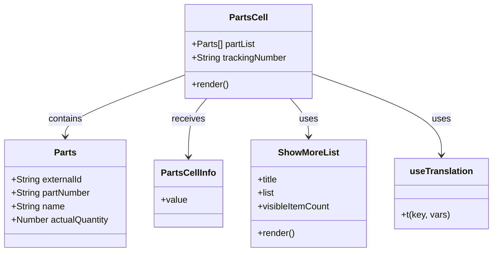
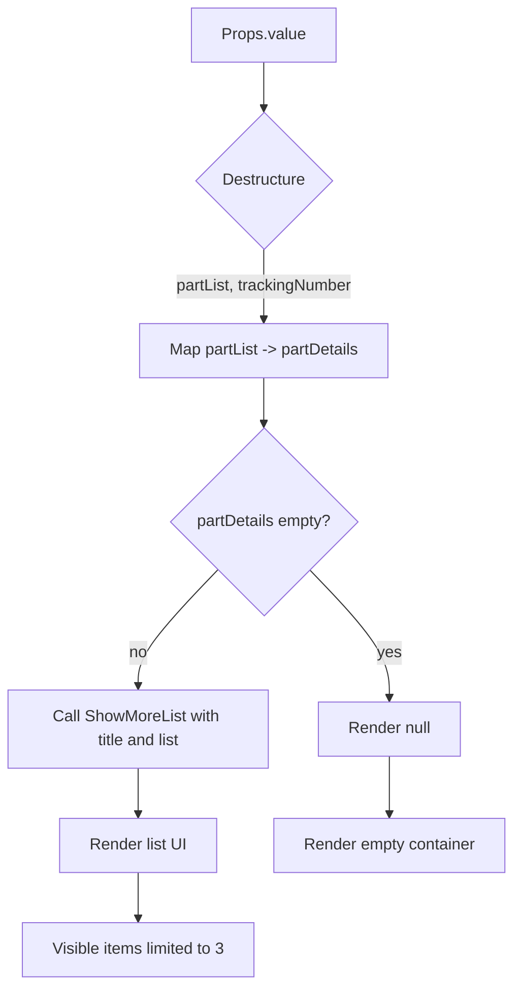

# Diagram: web/portal/src/pages/partview/components/molecules/PartsCell.molecule.tsx

> Auto-generated by Obscura crawlers

## Diagram 1

### SVG

<svg id="container" width="873.9375" xmlns="http://www.w3.org/2000/svg" class="classDiagram" height="450" viewBox="0 0 873.9375 450" role="graphics-document document" aria-roledescription="class"><g><defs><marker id="container_class-aggregationStart" class="marker aggregation class" refX="18" refY="7" markerWidth="190" markerHeight="240" orient="auto"><path d="M 18,7 L9,13 L1,7 L9,1 Z"></path></marker></defs><defs><marker id="container_class-aggregationEnd" class="marker aggregation class" refX="1" refY="7" markerWidth="20" markerHeight="28" orient="auto"><path d="M 18,7 L9,13 L1,7 L9,1 Z"></path></marker></defs><defs><marker id="container_class-extensionStart" class="marker extension class" refX="18" refY="7" markerWidth="190" markerHeight="240" orient="auto"><path d="M 1,7 L18,13 V 1 Z"></path></marker></defs><defs><marker id="container_class-extensionEnd" class="marker extension class" refX="1" refY="7" markerWidth="20" markerHeight="28" orient="auto"><path d="M 1,1 V 13 L18,7 Z"></path></marker></defs><defs><marker id="container_class-compositionStart" class="marker composition class" refX="18" refY="7" markerWidth="190" markerHeight="240" orient="auto"><path d="M 18,7 L9,13 L1,7 L9,1 Z"></path></marker></defs><defs><marker id="container_class-compositionEnd" class="marker composition class" refX="1" refY="7" markerWidth="20" markerHeight="28" orient="auto"><path d="M 18,7 L9,13 L1,7 L9,1 Z"></path></marker></defs><defs><marker id="container_class-dependencyStart" class="marker dependency class" refX="6" refY="7" markerWidth="190" markerHeight="240" orient="auto"><path d="M 5,7 L9,13 L1,7 L9,1 Z"></path></marker></defs><defs><marker id="container_class-dependencyEnd" class="marker dependency class" refX="13" refY="7" markerWidth="20" markerHeight="28" orient="auto"><path d="M 18,7 L9,13 L14,7 L9,1 Z"></path></marker></defs><defs><marker id="container_class-lollipopStart" class="marker lollipop class" refX="13" refY="7" markerWidth="190" markerHeight="240" orient="auto"><circle stroke="black" fill="transparent" cx="7" cy="7" r="6"></circle></marker></defs><defs><marker id="container_class-lollipopEnd" class="marker lollipop class" refX="1" refY="7" markerWidth="190" markerHeight="240" orient="auto"><circle stroke="black" fill="transparent" cx="7" cy="7" r="6"></circle></marker></defs><g class="root"><g class="clusters"></g><g class="edgePaths"><path d="M329.566,134.342L294.346,147.451C259.126,160.561,188.686,186.781,153.466,205.057C118.246,223.333,118.246,233.667,118.246,238.833L118.246,244" id="id_PartsCell_Parts_1" class="edge-thickness-normal edge-pattern-solid relation" style=";;;" data-edge="true" data-et="edge" data-id="id_PartsCell_Parts_1" data-points="W3sieCI6MzI5LjU2NjQwNjI1LCJ5IjoxMzQuMzQxNzg0OTI4OTIyNX0seyJ4IjoxMTguMjQ2MDkzNzUsInkiOjIxM30seyJ4IjoxMTguMjQ2MDkzNzUsInkiOjI1MH1d" marker-end="url(#container_class-dependencyEnd)"></path><path d="M369.809,176L364.413,182.167C359.016,188.333,348.223,200.667,342.826,218C337.43,235.333,337.43,257.667,337.43,268.833L337.43,280" id="id_PartsCell_PartsCellInfo_2" class="edge-thickness-normal edge-pattern-solid relation" style=";;;" data-edge="true" data-et="edge" data-id="id_PartsCell_PartsCellInfo_2" data-points="W3sieCI6MzY5LjgwOTQ2NTM5MjU2MiwieSI6MTc2fSx7IngiOjMzNy40Mjk2ODc1LCJ5IjoyMTN9LHsieCI6MzM3LjQyOTY4NzUsInkiOjI4Nn1d" marker-end="url(#container_class-dependencyEnd)"></path><path d="M516.831,176L522.228,182.167C527.624,188.333,538.418,200.667,543.814,212C549.211,223.333,549.211,233.667,549.211,238.833L549.211,244" id="id_PartsCell_ShowMoreList_3" class="edge-thickness-normal edge-pattern-solid relation" style=";;;" data-edge="true" data-et="edge" data-id="id_PartsCell_ShowMoreList_3" data-points="W3sieCI6NTE2LjgzMTE1OTYwNzQzOCwieSI6MTc2fSx7IngiOjU0OS4yMTA5Mzc1LCJ5IjoyMTN9LHsieCI6NTQ5LjIxMDkzNzUsInkiOjI1MH1d" marker-end="url(#container_class-dependencyEnd)"></path><path d="M557.074,132.403L594.895,145.836C632.715,159.268,708.355,186.134,746.176,210.234C783.996,234.333,783.996,255.667,783.996,266.333L783.996,277" id="id_PartsCell_useTranslation_4" class="edge-thickness-normal edge-pattern-solid relation" style=";;;" data-edge="true" data-et="edge" data-id="id_PartsCell_useTranslation_4" data-points="W3sieCI6NTU3LjA3NDIxODc1LCJ5IjoxMzIuNDAyNzAzNzI1MzYyMDR9LHsieCI6NzgzLjk5NjA5Mzc1LCJ5IjoyMTN9LHsieCI6NzgzLjk5NjA5Mzc1LCJ5IjoyODN9XQ==" marker-end="url(#container_class-dependencyEnd)"></path></g><g class="edgeLabels"><g class="edgeLabel" transform="translate(118.24609375, 213)"><g class="label" data-id="id_PartsCell_Parts_1" transform="translate(-30.890625, -12)"><foreignObject width="61.78125" height="24">

contains

</foreignObject></g></g><g class="edgeLabel" transform="translate(337.4296875, 213)"><g class="label" data-id="id_PartsCell_PartsCellInfo_2" transform="translate(-29.4921875, -12)"><foreignObject width="58.984375" height="24">

receives

</foreignObject></g></g><g class="edgeLabel" transform="translate(549.2109375, 213)"><g class="label" data-id="id_PartsCell_ShowMoreList_3" transform="translate(-16.4921875, -12)"><foreignObject width="32.984375" height="24">

uses

</foreignObject></g></g><g class="edgeLabel" transform="translate(783.99609375, 213)"><g class="label" data-id="id_PartsCell_useTranslation_4" transform="translate(-16.4921875, -12)"><foreignObject width="32.984375" height="24">

uses

</foreignObject></g></g></g><g class="nodes"><g class="node default" id="classId-Parts-0" transform="translate(118.24609375, 346)"><g class="basic label-container"><path d="M-110.24609375 -96 L110.24609375 -96 L110.24609375 96 L-110.24609375 96" stroke="none" stroke-width="0" fill="#ECECFF" style=""></path><path d="M-110.24609375 -96 C-37.0186267149257 -96, 36.208840320148596 -96, 110.24609375 -96 M-110.24609375 -96 C-37.01487737689645 -96, 36.2163389962071 -96, 110.24609375 -96 M110.24609375 -96 C110.24609375 -41.73245891766241, 110.24609375 12.535082164675174, 110.24609375 96 M110.24609375 -96 C110.24609375 -46.33720768929158, 110.24609375 3.325584621416837, 110.24609375 96 M110.24609375 96 C49.48591819709257 96, -11.274257355814854 96, -110.24609375 96 M110.24609375 96 C49.578606006884826 96, -11.088881736230348 96, -110.24609375 96 M-110.24609375 96 C-110.24609375 27.053297010467418, -110.24609375 -41.893405979065165, -110.24609375 -96 M-110.24609375 96 C-110.24609375 36.203068576849816, -110.24609375 -23.593862846300368, -110.24609375 -96" stroke="#9370DB" stroke-width="1.3" fill="none" stroke-dasharray="0 0" style=""></path></g><g class="annotation-group text" transform="translate(0, -72)"></g><g class="label-group text" transform="translate(-18.9296875, -72)"><g class="label" style="font-weight: bolder" transform="translate(0,-12)"><foreignObject width="37.859375" height="24">

Parts

</foreignObject></g></g><g class="members-group text" transform="translate(-98.24609375, -24)"><g class="label" style="" transform="translate(0,-12)"><foreignObject width="128.140625" height="24">

+String externalId

</foreignObject></g><g class="label" style="" transform="translate(0,12)"><foreignObject width="142.828125" height="24">

+String partNumber

</foreignObject></g><g class="label" style="" transform="translate(0,36)"><foreignObject width="94.984375" height="24">

+String name

</foreignObject></g><g class="label" style="" transform="translate(0,60)"><foreignObject width="177.5625" height="24">

+Number actualQuantity

</foreignObject></g></g><g class="methods-group text" transform="translate(-98.24609375, 96)"></g><g class="divider" style=""><path d="M-110.24609375 -48 C-46.15897012600581 -48, 17.928153497988376 -48, 110.24609375 -48 M-110.24609375 -48 C-59.02606900308347 -48, -7.806044256166942 -48, 110.24609375 -48" stroke="#9370DB" stroke-width="1.3" fill="none" stroke-dasharray="0 0" style=""></path></g><g class="divider" style=""><path d="M-110.24609375 72 C-60.39813133570734 72, -10.55016892141468 72, 110.24609375 72 M-110.24609375 72 C-54.11858890977947 72, 2.008915930441063 72, 110.24609375 72" stroke="#9370DB" stroke-width="1.3" fill="none" stroke-dasharray="0 0" style=""></path></g></g><g class="node default" id="classId-PartsCell-1" transform="translate(443.3203125, 92)"><g class="basic label-container"><path d="M-113.75390625 -84 L113.75390625 -84 L113.75390625 84 L-113.75390625 84" stroke="none" stroke-width="0" fill="#ECECFF" style=""></path><path d="M-113.75390625 -84 C-64.19719520805204 -84, -14.640484166104073 -84, 113.75390625 -84 M-113.75390625 -84 C-62.83227595839195 -84, -11.910645666783907 -84, 113.75390625 -84 M113.75390625 -84 C113.75390625 -21.10618701262024, 113.75390625 41.78762597475952, 113.75390625 84 M113.75390625 -84 C113.75390625 -17.449422053725215, 113.75390625 49.10115589254957, 113.75390625 84 M113.75390625 84 C31.426300173212923 84, -50.901305903574155 84, -113.75390625 84 M113.75390625 84 C30.545959157192243 84, -52.661987935615514 84, -113.75390625 84 M-113.75390625 84 C-113.75390625 40.07944928958417, -113.75390625 -3.841101420831663, -113.75390625 -84 M-113.75390625 84 C-113.75390625 43.696835797216536, -113.75390625 3.393671594433073, -113.75390625 -84" stroke="#9370DB" stroke-width="1.3" fill="none" stroke-dasharray="0 0" style=""></path></g><g class="annotation-group text" transform="translate(0, -60)"></g><g class="label-group text" transform="translate(-32.5390625, -60)"><g class="label" style="font-weight: bolder" transform="translate(0,-12)"><foreignObject width="65.078125" height="24">

PartsCell

</foreignObject></g></g><g class="members-group text" transform="translate(-101.75390625, -12)"><g class="label" style="" transform="translate(0,-12)"><foreignObject width="114.8125" height="24">

+Parts[] partList

</foreignObject></g><g class="label" style="" transform="translate(0,12)"><foreignObject width="170.96875" height="24">

+String trackingNumber

</foreignObject></g></g><g class="methods-group text" transform="translate(-101.75390625, 60)"><g class="label" style="" transform="translate(0,-12)"><foreignObject width="66.609375" height="24">

+render()

</foreignObject></g></g><g class="divider" style=""><path d="M-113.75390625 -36 C-63.28734341409029 -36, -12.820780578180575 -36, 113.75390625 -36 M-113.75390625 -36 C-45.319154766115645 -36, 23.11559671776871 -36, 113.75390625 -36" stroke="#9370DB" stroke-width="1.3" fill="none" stroke-dasharray="0 0" style=""></path></g><g class="divider" style=""><path d="M-113.75390625 36 C-47.150397333448865 36, 19.45311158310227 36, 113.75390625 36 M-113.75390625 36 C-59.039556149756244 36, -4.325206049512488 36, 113.75390625 36" stroke="#9370DB" stroke-width="1.3" fill="none" stroke-dasharray="0 0" style=""></path></g></g><g class="node default" id="classId-PartsCellInfo-2" transform="translate(337.4296875, 346)"><g class="basic label-container"><path d="M-58.9375 -60 L58.9375 -60 L58.9375 60 L-58.9375 60" stroke="none" stroke-width="0" fill="#ECECFF" style=""></path><path d="M-58.9375 -60 C-18.65045310349266 -60, 21.636593793014683 -60, 58.9375 -60 M-58.9375 -60 C-26.772413892197356 -60, 5.3926722156052875 -60, 58.9375 -60 M58.9375 -60 C58.9375 -19.878436862636313, 58.9375 20.243126274727373, 58.9375 60 M58.9375 -60 C58.9375 -33.42080400729183, 58.9375 -6.841608014583656, 58.9375 60 M58.9375 60 C26.89763349905074 60, -5.142233001898518 60, -58.9375 60 M58.9375 60 C29.818898887056974 60, 0.7002977741139489 60, -58.9375 60 M-58.9375 60 C-58.9375 20.076842108550835, -58.9375 -19.84631578289833, -58.9375 -60 M-58.9375 60 C-58.9375 32.82453659666826, -58.9375 5.64907319333652, -58.9375 -60" stroke="#9370DB" stroke-width="1.3" fill="none" stroke-dasharray="0 0" style=""></path></g><g class="annotation-group text" transform="translate(0, -36)"></g><g class="label-group text" transform="translate(-46.9375, -36)"><g class="label" style="font-weight: bolder" transform="translate(0,-12)"><foreignObject width="93.875" height="24">

PartsCellInfo

</foreignObject></g></g><g class="members-group text" transform="translate(-46.9375, 12)"><g class="label" style="" transform="translate(0,-12)"><foreignObject width="46.71875" height="24">

+value

</foreignObject></g></g><g class="methods-group text" transform="translate(-46.9375, 60)"></g><g class="divider" style=""><path d="M-58.9375 -12 C-24.885473264685743 -12, 9.166553470628514 -12, 58.9375 -12 M-58.9375 -12 C-34.99125616203622 -12, -11.045012324072452 -12, 58.9375 -12" stroke="#9370DB" stroke-width="1.3" fill="none" stroke-dasharray="0 0" style=""></path></g><g class="divider" style=""><path d="M-58.9375 36 C-28.51733315217669 36, 1.9028336956466205 36, 58.9375 36 M-58.9375 36 C-34.20631266169456 36, -9.475125323389122 36, 58.9375 36" stroke="#9370DB" stroke-width="1.3" fill="none" stroke-dasharray="0 0" style=""></path></g></g><g class="node default" id="classId-ShowMoreList-3" transform="translate(549.2109375, 346)"><g class="basic label-container"><path d="M-102.84375 -96 L102.84375 -96 L102.84375 96 L-102.84375 96" stroke="none" stroke-width="0" fill="#ECECFF" style=""></path><path d="M-102.84375 -96 C-24.01345660395438 -96, 54.81683679209124 -96, 102.84375 -96 M-102.84375 -96 C-61.500366680346154 -96, -20.15698336069231 -96, 102.84375 -96 M102.84375 -96 C102.84375 -26.72196622905585, 102.84375 42.5560675418883, 102.84375 96 M102.84375 -96 C102.84375 -26.796600264464416, 102.84375 42.40679947107117, 102.84375 96 M102.84375 96 C52.70851732075758 96, 2.5732846415151585 96, -102.84375 96 M102.84375 96 C27.456475748988893 96, -47.93079850202221 96, -102.84375 96 M-102.84375 96 C-102.84375 31.473434313823788, -102.84375 -33.053131372352425, -102.84375 -96 M-102.84375 96 C-102.84375 56.80854999362835, -102.84375 17.617099987256694, -102.84375 -96" stroke="#9370DB" stroke-width="1.3" fill="none" stroke-dasharray="0 0" style=""></path></g><g class="annotation-group text" transform="translate(0, -72)"></g><g class="label-group text" transform="translate(-51.515625, -72)"><g class="label" style="font-weight: bolder" transform="translate(0,-12)"><foreignObject width="103.03125" height="24">

ShowMoreList

</foreignObject></g></g><g class="members-group text" transform="translate(-90.84375, -24)"><g class="label" style="" transform="translate(0,-12)"><foreignObject width="37.140625" height="24">

+title

</foreignObject></g><g class="label" style="" transform="translate(0,12)"><foreignObject width="30.4375" height="24">

+list

</foreignObject></g><g class="label" style="" transform="translate(0,36)"><foreignObject width="130.171875" height="24">

+visibleItemCount

</foreignObject></g></g><g class="methods-group text" transform="translate(-90.84375, 72)"><g class="label" style="" transform="translate(0,-12)"><foreignObject width="66.609375" height="24">

+render()

</foreignObject></g></g><g class="divider" style=""><path d="M-102.84375 -48 C-21.599814798148017 -48, 59.644120403703965 -48, 102.84375 -48 M-102.84375 -48 C-26.031916606872812 -48, 50.779916786254375 -48, 102.84375 -48" stroke="#9370DB" stroke-width="1.3" fill="none" stroke-dasharray="0 0" style=""></path></g><g class="divider" style=""><path d="M-102.84375 48 C-27.39952209727167 48, 48.04470580545666 48, 102.84375 48 M-102.84375 48 C-31.919695004103446 48, 39.00435999179311 48, 102.84375 48" stroke="#9370DB" stroke-width="1.3" fill="none" stroke-dasharray="0 0" style=""></path></g></g><g class="node default" id="classId-useTranslation-4" transform="translate(783.99609375, 346)"><g class="basic label-container"><path d="M-81.94140625 -63 L81.94140625 -63 L81.94140625 63 L-81.94140625 63" stroke="none" stroke-width="0" fill="#ECECFF" style=""></path><path d="M-81.94140625 -63 C-22.210506834041162 -63, 37.520392581917676 -63, 81.94140625 -63 M-81.94140625 -63 C-37.316203280494946 -63, 7.308999689010108 -63, 81.94140625 -63 M81.94140625 -63 C81.94140625 -33.772781034957355, 81.94140625 -4.545562069914709, 81.94140625 63 M81.94140625 -63 C81.94140625 -14.89902028365546, 81.94140625 33.20195943268908, 81.94140625 63 M81.94140625 63 C37.38903410981973 63, -7.163338030360535 63, -81.94140625 63 M81.94140625 63 C16.509431868049504 63, -48.92254251390099 63, -81.94140625 63 M-81.94140625 63 C-81.94140625 18.219771159229303, -81.94140625 -26.560457681541394, -81.94140625 -63 M-81.94140625 63 C-81.94140625 35.46182216546211, -81.94140625 7.923644330924219, -81.94140625 -63" stroke="#9370DB" stroke-width="1.3" fill="none" stroke-dasharray="0 0" style=""></path></g><g class="annotation-group text" transform="translate(0, -39)"></g><g class="label-group text" transform="translate(-54.0859375, -39)"><g class="label" style="font-weight: bolder" transform="translate(0,-12)"><foreignObject width="108.171875" height="24">

useTranslation

</foreignObject></g></g><g class="members-group text" transform="translate(-69.94140625, 9)"></g><g class="methods-group text" transform="translate(-69.94140625, 39)"><g class="label" style="" transform="translate(0,-12)"><foreignObject width="85.796875" height="24">

+t(key, vars)

</foreignObject></g></g><g class="divider" style=""><path d="M-81.94140625 -15 C-41.22053759212306 -15, -0.4996689342461167 -15, 81.94140625 -15 M-81.94140625 -15 C-34.282536203377624 -15, 13.376333843244751 -15, 81.94140625 -15" stroke="#9370DB" stroke-width="1.3" fill="none" stroke-dasharray="0 0" style=""></path></g><g class="divider" style=""><path d="M-81.94140625 9 C-32.19517233670072 9, 17.551061576598556 9, 81.94140625 9 M-81.94140625 9 C-40.1338775644819 9, 1.673651121036201 9, 81.94140625 9" stroke="#9370DB" stroke-width="1.3" fill="none" stroke-dasharray="0 0" style=""></path></g></g></g></g></g></svg>

## Diagram 2

### SVG

<svg id="container" width="515.75" xmlns="http://www.w3.org/2000/svg" class="flowchart" height="987.609375" viewBox="0 0 515.75 987.609375" role="graphics-document document" aria-roledescription="flowchart-v2"><g><marker id="container_flowchart-v2-pointEnd" class="marker flowchart-v2" viewBox="0 0 10 10" refX="5" refY="5" markerUnits="userSpaceOnUse" markerWidth="8" markerHeight="8" orient="auto"><path d="M 0 0 L 10 5 L 0 10 z" class="arrowMarkerPath" style="stroke-width: 1; stroke-dasharray: 1, 0;"></path></marker><marker id="container_flowchart-v2-pointStart" class="marker flowchart-v2" viewBox="0 0 10 10" refX="4.5" refY="5" markerUnits="userSpaceOnUse" markerWidth="8" markerHeight="8" orient="auto"><path d="M 0 5 L 10 10 L 10 0 z" class="arrowMarkerPath" style="stroke-width: 1; stroke-dasharray: 1, 0;"></path></marker><marker id="container_flowchart-v2-circleEnd" class="marker flowchart-v2" viewBox="0 0 10 10" refX="11" refY="5" markerUnits="userSpaceOnUse" markerWidth="11" markerHeight="11" orient="auto"><circle cx="5" cy="5" r="5" class="arrowMarkerPath" style="stroke-width: 1; stroke-dasharray: 1, 0;"></circle></marker><marker id="container_flowchart-v2-circleStart" class="marker flowchart-v2" viewBox="0 0 10 10" refX="-1" refY="5" markerUnits="userSpaceOnUse" markerWidth="11" markerHeight="11" orient="auto"><circle cx="5" cy="5" r="5" class="arrowMarkerPath" style="stroke-width: 1; stroke-dasharray: 1, 0;"></circle></marker><marker id="container_flowchart-v2-crossEnd" class="marker cross flowchart-v2" viewBox="0 0 11 11" refX="12" refY="5.2" markerUnits="userSpaceOnUse" markerWidth="11" markerHeight="11" orient="auto"><path d="M 1,1 l 9,9 M 10,1 l -9,9" class="arrowMarkerPath" style="stroke-width: 2; stroke-dasharray: 1, 0;"></path></marker><marker id="container_flowchart-v2-crossStart" class="marker cross flowchart-v2" viewBox="0 0 11 11" refX="-1" refY="5.2" markerUnits="userSpaceOnUse" markerWidth="11" markerHeight="11" orient="auto"><path d="M 1,1 l 9,9 M 10,1 l -9,9" class="arrowMarkerPath" style="stroke-width: 2; stroke-dasharray: 1, 0;"></path></marker><g class="root"><g class="clusters"></g><g class="edgePaths"><path d="M264.078,62L264.078,66.167C264.078,70.333,264.078,78.667,264.078,86.333C264.078,94,264.078,101,264.078,104.5L264.078,108" id="L_A_B_0" class="edge-thickness-normal edge-pattern-solid edge-thickness-normal edge-pattern-solid flowchart-link" style=";" data-edge="true" data-et="edge" data-id="L_A_B_0" data-points="W3sieCI6MjY0LjA3ODEyNSwieSI6NjJ9LHsieCI6MjY0LjA3ODEyNSwieSI6ODd9LHsieCI6MjY0LjA3ODEyNSwieSI6MTEyfV0=" marker-end="url(#container_flowchart-v2-pointEnd)"></path><path d="M264.078,250.922L264.078,257.089C264.078,263.255,264.078,275.589,264.078,287.255C264.078,298.922,264.078,309.922,264.078,315.422L264.078,320.922" id="L_B_C_0" class="edge-thickness-normal edge-pattern-solid edge-thickness-normal edge-pattern-solid flowchart-link" style=";" data-edge="true" data-et="edge" data-id="L_B_C_0" data-points="W3sieCI6MjY0LjA3ODEyNSwieSI6MjUwLjkyMTg3NX0seyJ4IjoyNjQuMDc4MTI1LCJ5IjoyODcuOTIxODc1fSx7IngiOjI2NC4wNzgxMjUsInkiOjMyNC45MjE4NzV9XQ==" marker-end="url(#container_flowchart-v2-pointEnd)"></path><path d="M264.078,378.922L264.078,383.089C264.078,387.255,264.078,395.589,264.078,403.255C264.078,410.922,264.078,417.922,264.078,421.422L264.078,424.922" id="L_C_D_0" class="edge-thickness-normal edge-pattern-solid edge-thickness-normal edge-pattern-solid flowchart-link" style=";" data-edge="true" data-et="edge" data-id="L_C_D_0" data-points="W3sieCI6MjY0LjA3ODEyNSwieSI6Mzc4LjkyMTg3NX0seyJ4IjoyNjQuMDc4MTI1LCJ5Ijo0MDMuOTIxODc1fSx7IngiOjI2NC4wNzgxMjUsInkiOjQyOC45MjE4NzV9XQ==" marker-end="url(#container_flowchart-v2-pointEnd)"></path><path d="M217.562,573.093L204.302,587.013C191.041,600.932,164.521,628.771,151.26,648.19C138,667.609,138,678.609,138,684.109L138,689.609" id="L_D_E_0" class="edge-thickness-normal edge-pattern-solid edge-thickness-normal edge-pattern-solid flowchart-link" style=";" data-edge="true" data-et="edge" data-id="L_D_E_0" data-points="W3sieCI6MjE3LjU2MjA4OTAzOTU0MjksInkiOjU3My4wOTMzMzkwMzk1NDI5fSx7IngiOjEzOCwieSI6NjU2LjYwOTM3NX0seyJ4IjoxMzgsInkiOjY5My42MDkzNzV9XQ==" marker-end="url(#container_flowchart-v2-pointEnd)"></path><path d="M310.594,573.093L323.855,587.013C337.115,600.932,363.636,628.771,376.896,650.19C390.156,671.609,390.156,686.609,390.156,694.109L390.156,701.609" id="L_D_F_0" class="edge-thickness-normal edge-pattern-solid edge-thickness-normal edge-pattern-solid flowchart-link" style=";" data-edge="true" data-et="edge" data-id="L_D_F_0" data-points="W3sieCI6MzEwLjU5NDE2MDk2MDQ1NzEsInkiOjU3My4wOTMzMzkwMzk1NDI5fSx7IngiOjM5MC4xNTYyNSwieSI6NjU2LjYwOTM3NX0seyJ4IjozOTAuMTU2MjUsInkiOjcwNS42MDkzNzV9XQ==" marker-end="url(#container_flowchart-v2-pointEnd)"></path><path d="M138,771.609L138,775.776C138,779.943,138,788.276,138,795.943C138,803.609,138,810.609,138,814.109L138,817.609" id="L_E_G_0" class="edge-thickness-normal edge-pattern-solid edge-thickness-normal edge-pattern-solid flowchart-link" style=";" data-edge="true" data-et="edge" data-id="L_E_G_0" data-points="W3sieCI6MTM4LCJ5Ijo3NzEuNjA5Mzc1fSx7IngiOjEzOCwieSI6Nzk2LjYwOTM3NX0seyJ4IjoxMzgsInkiOjgyMS42MDkzNzV9XQ==" marker-end="url(#container_flowchart-v2-pointEnd)"></path><path d="M390.156,759.609L390.156,765.776C390.156,771.943,390.156,784.276,390.156,793.943C390.156,803.609,390.156,810.609,390.156,814.109L390.156,817.609" id="L_F_H_0" class="edge-thickness-normal edge-pattern-solid edge-thickness-normal edge-pattern-solid flowchart-link" style=";" data-edge="true" data-et="edge" data-id="L_F_H_0" data-points="W3sieCI6MzkwLjE1NjI1LCJ5Ijo3NTkuNjA5Mzc1fSx7IngiOjM5MC4xNTYyNSwieSI6Nzk2LjYwOTM3NX0seyJ4IjozOTAuMTU2MjUsInkiOjgyMS42MDkzNzV9XQ==" marker-end="url(#container_flowchart-v2-pointEnd)"></path><path d="M138,875.609L138,879.776C138,883.943,138,892.276,138,899.943C138,907.609,138,914.609,138,918.109L138,921.609" id="L_G_I_0" class="edge-thickness-normal edge-pattern-solid edge-thickness-normal edge-pattern-solid flowchart-link" style=";" data-edge="true" data-et="edge" data-id="L_G_I_0" data-points="W3sieCI6MTM4LCJ5Ijo4NzUuNjA5Mzc1fSx7IngiOjEzOCwieSI6OTAwLjYwOTM3NX0seyJ4IjoxMzgsInkiOjkyNS42MDkzNzV9XQ==" marker-end="url(#container_flowchart-v2-pointEnd)"></path></g><g class="edgeLabels"><g class="edgeLabel"><g class="label" data-id="L_A_B_0" transform="translate(0, 0)"><foreignObject width="0" height="0">

</foreignObject></g></g><g class="edgeLabel" transform="translate(264.078125, 287.921875)"><g class="label" data-id="L_B_C_0" transform="translate(-90.1875, -12)"><foreignObject width="180.375" height="24">

partList, trackingNumber

</foreignObject></g></g><g class="edgeLabel"><g class="label" data-id="L_C_D_0" transform="translate(0, 0)"><foreignObject width="0" height="0">

</foreignObject></g></g><g class="edgeLabel" transform="translate(138, 656.609375)"><g class="label" data-id="L_D_E_0" transform="translate(-9.3671875, -12)"><foreignObject width="18.734375" height="24">

no

</foreignObject></g></g><g class="edgeLabel" transform="translate(390.15625, 656.609375)"><g class="label" data-id="L_D_F_0" transform="translate(-12.0078125, -12)"><foreignObject width="24.015625" height="24">

yes

</foreignObject></g></g><g class="edgeLabel"><g class="label" data-id="L_E_G_0" transform="translate(0, 0)"><foreignObject width="0" height="0">

</foreignObject></g></g><g class="edgeLabel"><g class="label" data-id="L_F_H_0" transform="translate(0, 0)"><foreignObject width="0" height="0">

</foreignObject></g></g><g class="edgeLabel"><g class="label" data-id="L_G_I_0" transform="translate(0, 0)"><foreignObject width="0" height="0">

</foreignObject></g></g></g><g class="nodes"><g class="node default" id="flowchart-A-0" transform="translate(264.078125, 35)"><rect class="basic label-container" style="" x="-71.5390625" y="-27" width="143.078125" height="54"></rect><g class="label" style="" transform="translate(-41.5390625, -12)"><rect></rect><foreignObject width="83.078125" height="24">

Props.value

</foreignObject></g></g><g class="node default" id="flowchart-B-1" transform="translate(264.078125, 181.4609375)"><polygon points="69.4609375,0 138.921875,-69.4609375 69.4609375,-138.921875 0,-69.4609375" class="label-container" transform="translate(-68.9609375, 69.4609375)"></polygon><g class="label" style="" transform="translate(-42.4609375, -12)"><rect></rect><foreignObject width="84.921875" height="24">

Destructure

</foreignObject></g></g><g class="node default" id="flowchart-C-3" transform="translate(264.078125, 351.921875)"><rect class="basic label-container" style="" x="-126.8125" y="-27" width="253.625" height="54"></rect><g class="label" style="" transform="translate(-96.8125, -12)"><rect></rect><foreignObject width="193.625" height="24">

Map partList -&gt; partDetails

</foreignObject></g></g><g class="node default" id="flowchart-D-5" transform="translate(264.078125, 524.265625)"><polygon points="95.34375,0 190.6875,-95.34375 95.34375,-190.6875 0,-95.34375" class="label-container" transform="translate(-94.84375, 95.34375)"></polygon><g class="label" style="" transform="translate(-68.34375, -12)"><rect></rect><foreignObject width="136.6875" height="24">

partDetails empty?

</foreignObject></g></g><g class="node default" id="flowchart-E-7" transform="translate(138, 732.609375)"><rect class="basic label-container" style="" x="-130" y="-39" width="260" height="78"></rect><g class="label" style="" transform="translate(-100, -24)"><rect></rect><foreignObject width="200" height="48">

Call ShowMoreList with title and list

</foreignObject></g></g><g class="node default" id="flowchart-F-9" transform="translate(390.15625, 732.609375)"><rect class="basic label-container" style="" x="-72.15625" y="-27" width="144.3125" height="54"></rect><g class="label" style="" transform="translate(-42.15625, -12)"><rect></rect><foreignObject width="84.3125" height="24">

Render null

</foreignObject></g></g><g class="node default" id="flowchart-G-11" transform="translate(138, 848.609375)"><rect class="basic label-container" style="" x="-79.125" y="-27" width="158.25" height="54"></rect><g class="label" style="" transform="translate(-49.125, -12)"><rect></rect><foreignObject width="98.25" height="24">

Render list UI

</foreignObject></g></g><g class="node default" id="flowchart-H-13" transform="translate(390.15625, 848.609375)"><rect class="basic label-container" style="" x="-117.59375" y="-27" width="235.1875" height="54"></rect><g class="label" style="" transform="translate(-87.59375, -12)"><rect></rect><foreignObject width="175.1875" height="24">

Render empty container

</foreignObject></g></g><g class="node default" id="flowchart-I-15" transform="translate(138, 952.609375)"><rect class="basic label-container" style="" x="-119.625" y="-27" width="239.25" height="54"></rect><g class="label" style="" transform="translate(-89.625, -12)"><rect></rect><foreignObject width="179.25" height="24">

Visible items limited to 3

</foreignObject></g></g></g></g></g></svg>
