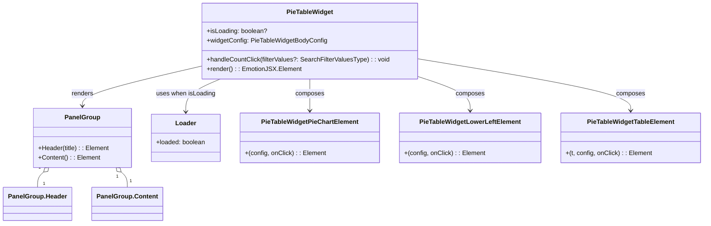

# Diagram: web/portal/src/pages/partview/components/molecules/PieTableWidget/PieTableWidget.tsx


> Auto-generated by Obscura crawlers

## Diagram 1



### SVG

<svg id="container" width="1746.07421875" xmlns="http://www.w3.org/2000/svg" class="classDiagram" height="566" viewBox="0 0 1746.07421875 566" role="graphics-document document" aria-roledescription="class"><style>#container{font-family:"trebuchet ms",verdana,arial,sans-serif;font-size:16px;fill:#333;}@keyframes edge-animation-frame{from{stroke-dashoffset:0;}}@keyframes dash{to{stroke-dashoffset:0;}}#container .edge-animation-slow{stroke-dasharray:9,5!important;stroke-dashoffset:900;animation:dash 50s linear infinite;stroke-linecap:round;}#container .edge-animation-fast{stroke-dasharray:9,5!important;stroke-dashoffset:900;animation:dash 20s linear infinite;stroke-linecap:round;}#container .error-icon{fill:#552222;}#container .error-text{fill:#552222;stroke:#552222;}#container .edge-thickness-normal{stroke-width:1px;}#container .edge-thickness-thick{stroke-width:3.5px;}#container .edge-pattern-solid{stroke-dasharray:0;}#container .edge-thickness-invisible{stroke-width:0;fill:none;}#container .edge-pattern-dashed{stroke-dasharray:3;}#container .edge-pattern-dotted{stroke-dasharray:2;}#container .marker{fill:#333333;stroke:#333333;}#container .marker.cross{stroke:#333333;}#container svg{font-family:"trebuchet ms",verdana,arial,sans-serif;font-size:16px;}#container p{margin:0;}#container g.classGroup text{fill:#9370DB;stroke:none;font-family:"trebuchet ms",verdana,arial,sans-serif;font-size:10px;}#container g.classGroup text .title{font-weight:bolder;}#container .nodeLabel,#container .edgeLabel{color:#131300;}#container .edgeLabel .label rect{fill:#ECECFF;}#container .label text{fill:#131300;}#container .labelBkg{background:#ECECFF;}#container .edgeLabel .label span{background:#ECECFF;}#container .classTitle{font-weight:bolder;}#container .node rect,#container .node circle,#container .node ellipse,#container .node polygon,#container .node path{fill:#ECECFF;stroke:#9370DB;stroke-width:1px;}#container .divider{stroke:#9370DB;stroke-width:1;}#container g.clickable{cursor:pointer;}#container g.classGroup rect{fill:#ECECFF;stroke:#9370DB;}#container g.classGroup line{stroke:#9370DB;stroke-width:1;}#container .classLabel .box{stroke:none;stroke-width:0;fill:#ECECFF;opacity:0.5;}#container .classLabel .label{fill:#9370DB;font-size:10px;}#container .relation{stroke:#333333;stroke-width:1;fill:none;}#container .dashed-line{stroke-dasharray:3;}#container .dotted-line{stroke-dasharray:1 2;}#container #compositionStart,#container .composition{fill:#333333!important;stroke:#333333!important;stroke-width:1;}#container #compositionEnd,#container .composition{fill:#333333!important;stroke:#333333!important;stroke-width:1;}#container #dependencyStart,#container .dependency{fill:#333333!important;stroke:#333333!important;stroke-width:1;}#container #dependencyStart,#container .dependency{fill:#333333!important;stroke:#333333!important;stroke-width:1;}#container #extensionStart,#container .extension{fill:transparent!important;stroke:#333333!important;stroke-width:1;}#container #extensionEnd,#container .extension{fill:transparent!important;stroke:#333333!important;stroke-width:1;}#container #aggregationStart,#container .aggregation{fill:transparent!important;stroke:#333333!important;stroke-width:1;}#container #aggregationEnd,#container .aggregation{fill:transparent!important;stroke:#333333!important;stroke-width:1;}#container #lollipopStart,#container .lollipop{fill:#ECECFF!important;stroke:#333333!important;stroke-width:1;}#container #lollipopEnd,#container .lollipop{fill:#ECECFF!important;stroke:#333333!important;stroke-width:1;}#container .edgeTerminals{font-size:11px;line-height:initial;}#container .classTitleText{text-anchor:middle;font-size:18px;fill:#333;}#container .label-icon{display:inline-block;height:1em;overflow:visible;vertical-align:-0.125em;}#container .node .label-icon path{fill:currentColor;stroke:revert;stroke-width:revert;}#container :root{--mermaid-font-family:"trebuchet ms",verdana,arial,sans-serif;}</style><g><defs><marker id="container_class-aggregationStart" class="marker aggregation class" refX="18" refY="7" markerWidth="190" markerHeight="240" orient="auto"><path d="M 18,7 L9,13 L1,7 L9,1 Z"></path></marker></defs><defs><marker id="container_class-aggregationEnd" class="marker aggregation class" refX="1" refY="7" markerWidth="20" markerHeight="28" orient="auto"><path d="M 18,7 L9,13 L1,7 L9,1 Z"></path></marker></defs><defs><marker id="container_class-extensionStart" class="marker extension class" refX="18" refY="7" markerWidth="190" markerHeight="240" orient="auto"><path d="M 1,7 L18,13 V 1 Z"></path></marker></defs><defs><marker id="container_class-extensionEnd" class="marker extension class" refX="1" refY="7" markerWidth="20" markerHeight="28" orient="auto"><path d="M 1,1 V 13 L18,7 Z"></path></marker></defs><defs><marker id="container_class-compositionStart" class="marker composition class" refX="18" refY="7" markerWidth="190" markerHeight="240" orient="auto"><path d="M 18,7 L9,13 L1,7 L9,1 Z"></path></marker></defs><defs><marker id="container_class-compositionEnd" class="marker composition class" refX="1" refY="7" markerWidth="20" markerHeight="28" orient="auto"><path d="M 18,7 L9,13 L1,7 L9,1 Z"></path></marker></defs><defs><marker id="container_class-dependencyStart" class="marker dependency class" refX="6" refY="7" markerWidth="190" markerHeight="240" orient="auto"><path d="M 5,7 L9,13 L1,7 L9,1 Z"></path></marker></defs><defs><marker id="container_class-dependencyEnd" class="marker dependency class" refX="13" refY="7" markerWidth="20" markerHeight="28" orient="auto"><path d="M 18,7 L9,13 L14,7 L9,1 Z"></path></marker></defs><defs><marker id="container_class-lollipopStart" class="marker lollipop class" refX="13" refY="7" markerWidth="190" markerHeight="240" orient="auto"><circle stroke="black" fill="transparent" cx="7" cy="7" r="6"></circle></marker></defs><defs><marker id="container_class-lollipopEnd" class="marker lollipop class" refX="1" refY="7" markerWidth="190" markerHeight="240" orient="auto"><circle stroke="black" fill="transparent" cx="7" cy="7" r="6"></circle></marker></defs><g class="root"><g class="clusters"></g><g class="edgePaths"><path d="M499.742,166.965L449.679,178.637C399.616,190.31,299.49,213.655,249.426,230.494C199.363,247.333,199.363,257.667,199.363,262.833L199.363,268" id="id_PieTableWidget_PanelGroup_1" class="edge-thickness-normal edge-pattern-solid relation" style=";;;" data-edge="true" data-et="edge" data-id="id_PieTableWidget_PanelGroup_1" data-points="W3sieCI6NDk5Ljc0MjE4NzUsInkiOjE2Ni45NjQ4NjM2MjQ4NDY3N30seyJ4IjoxOTkuMzYzMjgxMjUsInkiOjIzN30seyJ4IjoxOTkuMzYzMjgxMjUsInkiOjI3NH1d" marker-end="url(#container_class-dependencyEnd)"></path><path d="M546.246,200L531.886,206.167C517.526,212.333,488.806,224.667,474.446,238.5C460.086,252.333,460.086,267.667,460.086,275.333L460.086,283" id="id_PieTableWidget_Loader_2" class="edge-thickness-normal edge-pattern-solid relation" style=";;;" data-edge="true" data-et="edge" data-id="id_PieTableWidget_Loader_2" data-points="W3sieCI6NTQ2LjI0NjEyMzEyMDMwMDgsInkiOjIwMH0seyJ4Ijo0NjAuMDg1OTM3NSwieSI6MjM3fSx7IngiOjQ2MC4wODU5Mzc1LCJ5IjoyODl9XQ==" marker-end="url(#container_class-dependencyEnd)"></path><path d="M769.797,200L769.797,206.167C769.797,212.333,769.797,224.667,769.797,238C769.797,251.333,769.797,265.667,769.797,272.833L769.797,280" id="id_PieTableWidget_PieTableWidgetPieChartElement_3" class="edge-thickness-normal edge-pattern-solid relation" style=";;;" data-edge="true" data-et="edge" data-id="id_PieTableWidget_PieTableWidgetPieChartElement_3" data-points="W3sieCI6NzY5Ljc5Njg3NSwieSI6MjAwfSx7IngiOjc2OS43OTY4NzUsInkiOjIzN30seyJ4Ijo3NjkuNzk2ODc1LCJ5IjoyODZ9XQ==" marker-end="url(#container_class-dependencyEnd)"></path><path d="M1039.852,194.508L1060.982,201.59C1082.113,208.672,1124.375,222.836,1145.506,237.085C1166.637,251.333,1166.637,265.667,1166.637,272.833L1166.637,280" id="id_PieTableWidget_PieTableWidgetLowerLeftElement_4" class="edge-thickness-normal edge-pattern-solid relation" style=";;;" data-edge="true" data-et="edge" data-id="id_PieTableWidget_PieTableWidgetLowerLeftElement_4" data-points="W3sieCI6MTAzOS44NTE1NjI1LCJ5IjoxOTQuNTA4MjMzOTk3MTA2MDZ9LHsieCI6MTE2Ni42MzY3MTg3NSwieSI6MjM3fSx7IngiOjExNjYuNjM2NzE4NzUsInkiOjI4Nn1d" marker-end="url(#container_class-dependencyEnd)"></path><path d="M1039.852,149.184L1127.328,163.82C1214.805,178.456,1389.758,207.728,1477.234,229.531C1564.711,251.333,1564.711,265.667,1564.711,272.833L1564.711,280" id="id_PieTableWidget_PieTableWidgetTableElement_5" class="edge-thickness-normal edge-pattern-solid relation" style=";;;" data-edge="true" data-et="edge" data-id="id_PieTableWidget_PieTableWidgetTableElement_5" data-points="W3sieCI6MTAzOS44NTE1NjI1LCJ5IjoxNDkuMTgzODQ0NTU4NjY4ODh9LHsieCI6MTU2NC43MTA5Mzc1LCJ5IjoyMzd9LHsieCI6MTU2NC43MTA5Mzc1LCJ5IjoyODZ9XQ==" marker-end="url(#container_class-dependencyEnd)"></path><path d="M105.125,435.678L102.711,437.898C100.297,440.118,95.469,444.559,93.055,450.946C90.641,457.333,90.641,465.667,90.641,469.833L90.641,474" id="id_PanelGroup_PanelGroup.Header_6" class="edge-thickness-normal edge-pattern-solid relation" style=";;;" data-edge="true" data-et="edge" data-id="id_PanelGroup_PanelGroup.Header_6" data-points="W3sieCI6MTE3LjgyMTI4OTA2MjUsInkiOjQyNH0seyJ4Ijo5MC42NDA2MjUsInkiOjQ0OX0seyJ4Ijo5MC42NDA2MjUsInkiOjQ3NH1d" marker-start="url(#container_class-aggregationStart)"></path><path d="M293.602,435.678L296.016,437.898C298.43,440.118,303.258,444.559,305.672,450.946C308.086,457.333,308.086,465.667,308.086,469.833L308.086,474" id="id_PanelGroup_PanelGroup.Content_7" class="edge-thickness-normal edge-pattern-solid relation" style=";;;" data-edge="true" data-et="edge" data-id="id_PanelGroup_PanelGroup.Content_7" data-points="W3sieCI6MjgwLjkwNTI3MzQzNzUsInkiOjQyNH0seyJ4IjozMDguMDg1OTM3NSwieSI6NDQ5fSx7IngiOjMwOC4wODU5Mzc1LCJ5Ijo0NzR9XQ==" marker-start="url(#container_class-aggregationStart)"></path></g><g class="edgeLabels"><g class="edgeLabel" transform="translate(199.36328125, 237)"><g class="label" data-id="id_PieTableWidget_PanelGroup_1" transform="translate(-27.75, -12)"><foreignObject width="55.5" height="24"><div xmlns="http://www.w3.org/1999/xhtml" class="labelBkg" style="display: table-cell; white-space: nowrap; line-height: 1.5; max-width: 200px; text-align: center;"><span class="edgeLabel"><p>renders</p></span></div></foreignObject></g></g><g class="edgeLabel" transform="translate(460.0859375, 237)"><g class="label" data-id="id_PieTableWidget_Loader_2" transform="translate(-74.8125, -12)"><foreignObject width="149.625" height="24"><div xmlns="http://www.w3.org/1999/xhtml" class="labelBkg" style="display: table-cell; white-space: nowrap; line-height: 1.5; max-width: 200px; text-align: center;"><span class="edgeLabel"><p>uses when isLoading</p></span></div></foreignObject></g></g><g class="edgeLabel" transform="translate(769.796875, 237)"><g class="label" data-id="id_PieTableWidget_PieTableWidgetPieChartElement_3" transform="translate(-36.453125, -12)"><foreignObject width="72.90625" height="24"><div xmlns="http://www.w3.org/1999/xhtml" class="labelBkg" style="display: table-cell; white-space: nowrap; line-height: 1.5; max-width: 200px; text-align: center;"><span class="edgeLabel"><p>composes</p></span></div></foreignObject></g></g><g class="edgeLabel" transform="translate(1166.63671875, 237)"><g class="label" data-id="id_PieTableWidget_PieTableWidgetLowerLeftElement_4" transform="translate(-36.453125, -12)"><foreignObject width="72.90625" height="24"><div xmlns="http://www.w3.org/1999/xhtml" class="labelBkg" style="display: table-cell; white-space: nowrap; line-height: 1.5; max-width: 200px; text-align: center;"><span class="edgeLabel"><p>composes</p></span></div></foreignObject></g></g><g class="edgeLabel" transform="translate(1564.7109375, 237)"><g class="label" data-id="id_PieTableWidget_PieTableWidgetTableElement_5" transform="translate(-36.453125, -12)"><foreignObject width="72.90625" height="24"><div xmlns="http://www.w3.org/1999/xhtml" class="labelBkg" style="display: table-cell; white-space: nowrap; line-height: 1.5; max-width: 200px; text-align: center;"><span class="edgeLabel"><p>composes</p></span></div></foreignObject></g></g><g class="edgeLabel"><g class="label" data-id="id_PanelGroup_PanelGroup.Header_6" transform="translate(0, 0)"><foreignObject width="0" height="0"><div xmlns="http://www.w3.org/1999/xhtml" class="labelBkg" style="display: table-cell; white-space: nowrap; line-height: 1.5; max-width: 200px; text-align: center;"><span class="edgeLabel"></span></div></foreignObject></g></g><g class="edgeLabel"><g class="label" data-id="id_PanelGroup_PanelGroup.Content_7" transform="translate(0, 0)"><foreignObject width="0" height="0"><div xmlns="http://www.w3.org/1999/xhtml" class="labelBkg" style="display: table-cell; white-space: nowrap; line-height: 1.5; max-width: 200px; text-align: center;"><span class="edgeLabel"></span></div></foreignObject></g></g><g class="edgeTerminals" transform="translate(94.78654821430959, 424.8066726660111)"><g class="inner" transform="translate(0, 0)"><foreignObject style="width: 9px; height: 12px;"><div xmlns="http://www.w3.org/1999/xhtml" style="display: inline-block; padding-right: 1px; white-space: nowrap;"><span class="edgeLabel">1</span></div></foreignObject></g></g><g class="edgeTerminals" transform="translate(283.63104986796327, 446.8871168429723)"><g class="inner" transform="translate(0, 0)"><foreignObject style="width: 9px; height: 12px;"><div xmlns="http://www.w3.org/1999/xhtml" style="display: inline-block; padding-right: 1px; white-space: nowrap;"><span class="edgeLabel">1</span></div></foreignObject></g></g><g class="edgeTerminals" transform="translate(103.93366898358683, 456.50059438611424)"><g class="inner" transform="translate(0, 0)"></g><foreignObject style="width: 9px; height: 12px;"><div xmlns="http://www.w3.org/1999/xhtml" style="display: inline-block; padding-right: 1px; white-space: nowrap;"><span class="edgeLabel">1</span></div></foreignObject></g><g class="edgeTerminals" transform="translate(314.0188349807533, 449.72975452254434)"><g class="inner" transform="translate(0, 0)"></g><foreignObject style="width: 9px; height: 12px;"><div xmlns="http://www.w3.org/1999/xhtml" style="display: inline-block; padding-right: 1px; white-space: nowrap;"><span class="edgeLabel">1</span></div></foreignObject></g></g><g class="nodes"><g class="node default" id="classId-PieTableWidget-0" transform="translate(769.796875, 104)"><g class="basic label-container"><path d="M-270.0546875 -96 L270.0546875 -96 L270.0546875 96 L-270.0546875 96" stroke="none" stroke-width="0" fill="#ECECFF" style=""></path><path d="M-270.0546875 -96 C-93.56430447069582 -96, 82.92607855860837 -96, 270.0546875 -96 M-270.0546875 -96 C-72.78445473919999 -96, 124.48577802160003 -96, 270.0546875 -96 M270.0546875 -96 C270.0546875 -20.76673433539672, 270.0546875 54.46653132920656, 270.0546875 96 M270.0546875 -96 C270.0546875 -31.670617967078584, 270.0546875 32.65876406584283, 270.0546875 96 M270.0546875 96 C124.42325677007415 96, -21.208173959851706 96, -270.0546875 96 M270.0546875 96 C119.1809597284443 96, -31.692768043111414 96, -270.0546875 96 M-270.0546875 96 C-270.0546875 52.78406742760258, -270.0546875 9.568134855205159, -270.0546875 -96 M-270.0546875 96 C-270.0546875 56.726748854701974, -270.0546875 17.453497709403948, -270.0546875 -96" stroke="#9370DB" stroke-width="1.3" fill="none" stroke-dasharray="0 0" style=""></path></g><g class="annotation-group text" transform="translate(0, -72)"></g><g class="label-group text" transform="translate(-56.875, -72)"><g class="label" style="font-weight: bolder" transform="translate(0,-12)"><foreignObject width="113.75" height="24"><div xmlns="http://www.w3.org/1999/xhtml" style="display: table-cell; white-space: nowrap; line-height: 1.5; max-width: 162px; text-align: center;"><span class="nodeLabel markdown-node-label" style=""><p>PieTableWidget</p></span></div></foreignObject></g></g><g class="members-group text" transform="translate(-258.0546875, -24)"><g class="label" style="" transform="translate(0,-12)"><foreignObject width="151.59375" height="24"><div xmlns="http://www.w3.org/1999/xhtml" style="display: table-cell; white-space: nowrap; line-height: 1.5; max-width: 209px; text-align: center;"><span class="nodeLabel markdown-node-label" style=""><p>+isLoading: boolean?</p></span></div></foreignObject></g><g class="label" style="" transform="translate(0,12)"><foreignObject width="301.84375" height="24"><div xmlns="http://www.w3.org/1999/xhtml" style="display: table-cell; white-space: nowrap; line-height: 1.5; max-width: 360px; text-align: center;"><span class="nodeLabel markdown-node-label" style=""><p>+widgetConfig: PieTableWidgetBodyConfig</p></span></div></foreignObject></g></g><g class="methods-group text" transform="translate(-258.0546875, 48)"><g class="label" style="" transform="translate(0,-12)"><foreignObject width="459.234375" height="24"><div xmlns="http://www.w3.org/1999/xhtml" style="display: table-cell; white-space: nowrap; line-height: 1.5; max-width: 517px; text-align: center;"><span class="nodeLabel markdown-node-label" style=""><p>+handleCountClick(filterValues?: SearchFilterValuesType) : : void</p></span></div></foreignObject></g><g class="label" style="" transform="translate(0,12)"><foreignObject width="232.8125" height="24"><div xmlns="http://www.w3.org/1999/xhtml" style="display: table-cell; white-space: nowrap; line-height: 1.5; max-width: 290px; text-align: center;"><span class="nodeLabel markdown-node-label" style=""><p>+render() : : EmotionJSX.Element</p></span></div></foreignObject></g></g><g class="divider" style=""><path d="M-270.0546875 -48 C-67.99200994189383 -48, 134.07066761621235 -48, 270.0546875 -48 M-270.0546875 -48 C-153.74334712075284 -48, -37.43200674150566 -48, 270.0546875 -48" stroke="#9370DB" stroke-width="1.3" fill="none" stroke-dasharray="0 0" style=""></path></g><g class="divider" style=""><path d="M-270.0546875 24 C-142.979797496664 24, -15.904907493328011 24, 270.0546875 24 M-270.0546875 24 C-72.4135726771209 24, 125.2275421457582 24, 270.0546875 24" stroke="#9370DB" stroke-width="1.3" fill="none" stroke-dasharray="0 0" style=""></path></g></g><g class="node default" id="classId-PanelGroup-1" transform="translate(199.36328125, 349)"><g class="basic label-container"><path d="M-123.140625 -75 L123.140625 -75 L123.140625 75 L-123.140625 75" stroke="none" stroke-width="0" fill="#ECECFF" style=""></path><path d="M-123.140625 -75 C-28.943156450359368 -75, 65.25431209928126 -75, 123.140625 -75 M-123.140625 -75 C-27.35896440350811 -75, 68.42269619298378 -75, 123.140625 -75 M123.140625 -75 C123.140625 -40.64698424672015, 123.140625 -6.293968493440303, 123.140625 75 M123.140625 -75 C123.140625 -41.59462407286534, 123.140625 -8.189248145730673, 123.140625 75 M123.140625 75 C67.61953019323775 75, 12.098435386475515 75, -123.140625 75 M123.140625 75 C56.19616028710604 75, -10.748304425787921 75, -123.140625 75 M-123.140625 75 C-123.140625 30.29557387705175, -123.140625 -14.408852245896497, -123.140625 -75 M-123.140625 75 C-123.140625 24.324438931769144, -123.140625 -26.35112213646171, -123.140625 -75" stroke="#9370DB" stroke-width="1.3" fill="none" stroke-dasharray="0 0" style=""></path></g><g class="annotation-group text" transform="translate(0, -51)"></g><g class="label-group text" transform="translate(-42.328125, -51)"><g class="label" style="font-weight: bolder" transform="translate(0,-12)"><foreignObject width="84.65625" height="24"><div xmlns="http://www.w3.org/1999/xhtml" style="display: table-cell; white-space: nowrap; line-height: 1.5; max-width: 134px; text-align: center;"><span class="nodeLabel markdown-node-label" style=""><p>PanelGroup</p></span></div></foreignObject></g></g><g class="members-group text" transform="translate(-111.140625, -3)"></g><g class="methods-group text" transform="translate(-111.140625, 27)"><g class="label" style="" transform="translate(0,-12)"><foreignObject width="179.953125" height="24"><div xmlns="http://www.w3.org/1999/xhtml" style="display: table-cell; white-space: nowrap; line-height: 1.5; max-width: 238px; text-align: center;"><span class="nodeLabel markdown-node-label" style=""><p>+Header(title) : : Element</p></span></div></foreignObject></g><g class="label" style="" transform="translate(0,12)"><foreignObject width="154.890625" height="24"><div xmlns="http://www.w3.org/1999/xhtml" style="display: table-cell; white-space: nowrap; line-height: 1.5; max-width: 212px; text-align: center;"><span class="nodeLabel markdown-node-label" style=""><p>+Content() : : Element</p></span></div></foreignObject></g></g><g class="divider" style=""><path d="M-123.140625 -27 C-71.89989561533575 -27, -20.659166230671502 -27, 123.140625 -27 M-123.140625 -27 C-64.26014260055638 -27, -5.37966020111277 -27, 123.140625 -27" stroke="#9370DB" stroke-width="1.3" fill="none" stroke-dasharray="0 0" style=""></path></g><g class="divider" style=""><path d="M-123.140625 -3 C-57.44752953610178 -3, 8.245565927796434 -3, 123.140625 -3 M-123.140625 -3 C-70.57896591871597 -3, -18.017306837431917 -3, 123.140625 -3" stroke="#9370DB" stroke-width="1.3" fill="none" stroke-dasharray="0 0" style=""></path></g></g><g class="node default" id="classId-Loader-2" transform="translate(460.0859375, 349)"><g class="basic label-container"><path d="M-87.58203125 -60 L87.58203125 -60 L87.58203125 60 L-87.58203125 60" stroke="none" stroke-width="0" fill="#ECECFF" style=""></path><path d="M-87.58203125 -60 C-27.889920680628265 -60, 31.80218988874347 -60, 87.58203125 -60 M-87.58203125 -60 C-27.217708849397006 -60, 33.14661355120599 -60, 87.58203125 -60 M87.58203125 -60 C87.58203125 -19.336379670369652, 87.58203125 21.327240659260696, 87.58203125 60 M87.58203125 -60 C87.58203125 -13.093895477746813, 87.58203125 33.812209044506375, 87.58203125 60 M87.58203125 60 C18.999142707436434 60, -49.58374583512713 60, -87.58203125 60 M87.58203125 60 C46.53403585905411 60, 5.486040468108214 60, -87.58203125 60 M-87.58203125 60 C-87.58203125 20.913426748470194, -87.58203125 -18.173146503059613, -87.58203125 -60 M-87.58203125 60 C-87.58203125 17.53454148662189, -87.58203125 -24.93091702675622, -87.58203125 -60" stroke="#9370DB" stroke-width="1.3" fill="none" stroke-dasharray="0 0" style=""></path></g><g class="annotation-group text" transform="translate(0, -36)"></g><g class="label-group text" transform="translate(-25.3046875, -36)"><g class="label" style="font-weight: bolder" transform="translate(0,-12)"><foreignObject width="50.609375" height="24"><div xmlns="http://www.w3.org/1999/xhtml" style="display: table-cell; white-space: nowrap; line-height: 1.5; max-width: 101px; text-align: center;"><span class="nodeLabel markdown-node-label" style=""><p>Loader</p></span></div></foreignObject></g></g><g class="members-group text" transform="translate(-75.58203125, 12)"><g class="label" style="" transform="translate(0,-12)"><foreignObject width="125.859375" height="24"><div xmlns="http://www.w3.org/1999/xhtml" style="display: table-cell; white-space: nowrap; line-height: 1.5; max-width: 183px; text-align: center;"><span class="nodeLabel markdown-node-label" style=""><p>+loaded: boolean</p></span></div></foreignObject></g></g><g class="methods-group text" transform="translate(-75.58203125, 60)"></g><g class="divider" style=""><path d="M-87.58203125 -12 C-37.30365970600754 -12, 12.974711837984927 -12, 87.58203125 -12 M-87.58203125 -12 C-26.033306215635804 -12, 35.51541881872839 -12, 87.58203125 -12" stroke="#9370DB" stroke-width="1.3" fill="none" stroke-dasharray="0 0" style=""></path></g><g class="divider" style=""><path d="M-87.58203125 36 C-22.14938834128847 36, 43.28325456742306 36, 87.58203125 36 M-87.58203125 36 C-33.53759791568941 36, 20.50683541862118 36, 87.58203125 36" stroke="#9370DB" stroke-width="1.3" fill="none" stroke-dasharray="0 0" style=""></path></g></g><g class="node default" id="classId-PieTableWidgetPieChartElement-3" transform="translate(769.796875, 349)"><g class="basic label-container"><path d="M-172.12890625 -63 L172.12890625 -63 L172.12890625 63 L-172.12890625 63" stroke="none" stroke-width="0" fill="#ECECFF" style=""></path><path d="M-172.12890625 -63 C-71.13205904532096 -63, 29.864788159358085 -63, 172.12890625 -63 M-172.12890625 -63 C-60.62905321374201 -63, 50.87079982251598 -63, 172.12890625 -63 M172.12890625 -63 C172.12890625 -15.827066946858082, 172.12890625 31.345866106283836, 172.12890625 63 M172.12890625 -63 C172.12890625 -30.73691064651728, 172.12890625 1.526178706965439, 172.12890625 63 M172.12890625 63 C39.35910645666473 63, -93.41069333667053 63, -172.12890625 63 M172.12890625 63 C63.994913701825325 63, -44.13907884634935 63, -172.12890625 63 M-172.12890625 63 C-172.12890625 33.50486508859544, -172.12890625 4.009730177190882, -172.12890625 -63 M-172.12890625 63 C-172.12890625 36.16170435100959, -172.12890625 9.323408702019186, -172.12890625 -63" stroke="#9370DB" stroke-width="1.3" fill="none" stroke-dasharray="0 0" style=""></path></g><g class="annotation-group text" transform="translate(0, -39)"></g><g class="label-group text" transform="translate(-117.9296875, -39)"><g class="label" style="font-weight: bolder" transform="translate(0,-12)"><foreignObject width="235.859375" height="24"><div xmlns="http://www.w3.org/1999/xhtml" style="display: table-cell; white-space: nowrap; line-height: 1.5; max-width: 282px; text-align: center;"><span class="nodeLabel markdown-node-label" style=""><p>PieTableWidgetPieChartElement</p></span></div></foreignObject></g></g><g class="members-group text" transform="translate(-160.12890625, 9)"></g><g class="methods-group text" transform="translate(-160.12890625, 39)"><g class="label" style="" transform="translate(0,-12)"><foreignObject width="202.328125" height="24"><div xmlns="http://www.w3.org/1999/xhtml" style="display: table-cell; white-space: nowrap; line-height: 1.5; max-width: 253px; text-align: center;"><span class="nodeLabel markdown-node-label" style=""><p>+(config, onClick) : : Element</p></span></div></foreignObject></g></g><g class="divider" style=""><path d="M-172.12890625 -15 C-85.6983926727002 -15, 0.7321209045996113 -15, 172.12890625 -15 M-172.12890625 -15 C-74.86617662210452 -15, 22.396553005790963 -15, 172.12890625 -15" stroke="#9370DB" stroke-width="1.3" fill="none" stroke-dasharray="0 0" style=""></path></g><g class="divider" style=""><path d="M-172.12890625 9 C-69.57113714964476 9, 32.98663195071049 9, 172.12890625 9 M-172.12890625 9 C-38.662351938770655 9, 94.80420237245869 9, 172.12890625 9" stroke="#9370DB" stroke-width="1.3" fill="none" stroke-dasharray="0 0" style=""></path></g></g><g class="node default" id="classId-PieTableWidgetLowerLeftElement-4" transform="translate(1166.63671875, 349)"><g class="basic label-container"><path d="M-174.7109375 -63 L174.7109375 -63 L174.7109375 63 L-174.7109375 63" stroke="none" stroke-width="0" fill="#ECECFF" style=""></path><path d="M-174.7109375 -63 C-84.97180512239572 -63, 4.767327255208556 -63, 174.7109375 -63 M-174.7109375 -63 C-44.64622545927105 -63, 85.4184865814579 -63, 174.7109375 -63 M174.7109375 -63 C174.7109375 -19.51350502674996, 174.7109375 23.97298994650008, 174.7109375 63 M174.7109375 -63 C174.7109375 -18.44907443279665, 174.7109375 26.1018511344067, 174.7109375 63 M174.7109375 63 C66.15639781750022 63, -42.39814186499956 63, -174.7109375 63 M174.7109375 63 C48.260469295740506 63, -78.18999890851899 63, -174.7109375 63 M-174.7109375 63 C-174.7109375 13.721914408791882, -174.7109375 -35.556171182416236, -174.7109375 -63 M-174.7109375 63 C-174.7109375 37.31284038418393, -174.7109375 11.625680768367857, -174.7109375 -63" stroke="#9370DB" stroke-width="1.3" fill="none" stroke-dasharray="0 0" style=""></path></g><g class="annotation-group text" transform="translate(0, -39)"></g><g class="label-group text" transform="translate(-123.09375, -39)"><g class="label" style="font-weight: bolder" transform="translate(0,-12)"><foreignObject width="246.1875" height="24"><div xmlns="http://www.w3.org/1999/xhtml" style="display: table-cell; white-space: nowrap; line-height: 1.5; max-width: 292px; text-align: center;"><span class="nodeLabel markdown-node-label" style=""><p>PieTableWidgetLowerLeftElement</p></span></div></foreignObject></g></g><g class="members-group text" transform="translate(-162.7109375, 9)"></g><g class="methods-group text" transform="translate(-162.7109375, 39)"><g class="label" style="" transform="translate(0,-12)"><foreignObject width="202.328125" height="24"><div xmlns="http://www.w3.org/1999/xhtml" style="display: table-cell; white-space: nowrap; line-height: 1.5; max-width: 253px; text-align: center;"><span class="nodeLabel markdown-node-label" style=""><p>+(config, onClick) : : Element</p></span></div></foreignObject></g></g><g class="divider" style=""><path d="M-174.7109375 -15 C-87.09293949048214 -15, 0.5250585190357242 -15, 174.7109375 -15 M-174.7109375 -15 C-56.74473185120108 -15, 61.22147379759784 -15, 174.7109375 -15" stroke="#9370DB" stroke-width="1.3" fill="none" stroke-dasharray="0 0" style=""></path></g><g class="divider" style=""><path d="M-174.7109375 9 C-78.59684096025136 9, 17.517255579497288 9, 174.7109375 9 M-174.7109375 9 C-58.57608102789045 9, 57.558775444219094 9, 174.7109375 9" stroke="#9370DB" stroke-width="1.3" fill="none" stroke-dasharray="0 0" style=""></path></g></g><g class="node default" id="classId-PieTableWidgetTableElement-5" transform="translate(1564.7109375, 349)"><g class="basic label-container"><path d="M-173.36328125 -63 L173.36328125 -63 L173.36328125 63 L-173.36328125 63" stroke="none" stroke-width="0" fill="#ECECFF" style=""></path><path d="M-173.36328125 -63 C-49.166015891430916 -63, 75.03124946713817 -63, 173.36328125 -63 M-173.36328125 -63 C-87.01441121847468 -63, -0.6655411869493548 -63, 173.36328125 -63 M173.36328125 -63 C173.36328125 -32.09734133087888, 173.36328125 -1.194682661757767, 173.36328125 63 M173.36328125 -63 C173.36328125 -31.18552455803697, 173.36328125 0.6289508839260591, 173.36328125 63 M173.36328125 63 C68.82212754161392 63, -35.71902616677215 63, -173.36328125 63 M173.36328125 63 C64.6631164810415 63, -44.037048287917 63, -173.36328125 63 M-173.36328125 63 C-173.36328125 20.039102638329425, -173.36328125 -22.92179472334115, -173.36328125 -63 M-173.36328125 63 C-173.36328125 14.767676077348384, -173.36328125 -33.46464784530323, -173.36328125 -63" stroke="#9370DB" stroke-width="1.3" fill="none" stroke-dasharray="0 0" style=""></path></g><g class="annotation-group text" transform="translate(0, -39)"></g><g class="label-group text" transform="translate(-106.4765625, -39)"><g class="label" style="font-weight: bolder" transform="translate(0,-12)"><foreignObject width="212.953125" height="24"><div xmlns="http://www.w3.org/1999/xhtml" style="display: table-cell; white-space: nowrap; line-height: 1.5; max-width: 260px; text-align: center;"><span class="nodeLabel markdown-node-label" style=""><p>PieTableWidgetTableElement</p></span></div></foreignObject></g></g><g class="members-group text" transform="translate(-161.36328125, 9)"></g><g class="methods-group text" transform="translate(-161.36328125, 39)"><g class="label" style="" transform="translate(0,-12)"><foreignObject width="216.25" height="24"><div xmlns="http://www.w3.org/1999/xhtml" style="display: table-cell; white-space: nowrap; line-height: 1.5; max-width: 266px; text-align: center;"><span class="nodeLabel markdown-node-label" style=""><p>+(t, config, onClick) : : Element</p></span></div></foreignObject></g></g><g class="divider" style=""><path d="M-173.36328125 -15 C-85.95535809751865 -15, 1.4525650549626903 -15, 173.36328125 -15 M-173.36328125 -15 C-46.97497325438191 -15, 79.41333474123618 -15, 173.36328125 -15" stroke="#9370DB" stroke-width="1.3" fill="none" stroke-dasharray="0 0" style=""></path></g><g class="divider" style=""><path d="M-173.36328125 9 C-71.81046190258802 9, 29.742357444823966 9, 173.36328125 9 M-173.36328125 9 C-66.26070786790847 9, 40.84186551418307 9, 173.36328125 9" stroke="#9370DB" stroke-width="1.3" fill="none" stroke-dasharray="0 0" style=""></path></g></g><g class="node default" id="classId-PanelGroup.Header-6" transform="translate(90.640625, 516)"><g class="basic label-container"><path d="M-82.640625 -42 L82.640625 -42 L82.640625 42 L-82.640625 42" stroke="none" stroke-width="0" fill="#ECECFF" style=""></path><path d="M-82.640625 -42 C-48.979271906507506 -42, -15.317918813015012 -42, 82.640625 -42 M-82.640625 -42 C-43.21184039032389 -42, -3.7830557806477856 -42, 82.640625 -42 M82.640625 -42 C82.640625 -16.46028906828971, 82.640625 9.079421863420578, 82.640625 42 M82.640625 -42 C82.640625 -20.240339744138645, 82.640625 1.5193205117227109, 82.640625 42 M82.640625 42 C19.728207794398955 42, -43.18420941120209 42, -82.640625 42 M82.640625 42 C27.0801586041348 42, -28.480307791730397 42, -82.640625 42 M-82.640625 42 C-82.640625 24.52468568808227, -82.640625 7.049371376164537, -82.640625 -42 M-82.640625 42 C-82.640625 9.7126085084505, -82.640625 -22.574782983099, -82.640625 -42" stroke="#9370DB" stroke-width="1.3" fill="none" stroke-dasharray="0 0" style=""></path></g><g class="annotation-group text" transform="translate(0, -18)"></g><g class="label-group text" transform="translate(-70.640625, -18)"><g class="label" style="font-weight: bolder" transform="translate(0,-12)"><foreignObject width="141.28125" height="24"><div xmlns="http://www.w3.org/1999/xhtml" style="display: table-cell; white-space: nowrap; line-height: 1.5; max-width: 191px; text-align: center;"><span class="nodeLabel markdown-node-label" style=""><p>PanelGroup.Header</p></span></div></foreignObject></g></g><g class="members-group text" transform="translate(-70.640625, 30)"></g><g class="methods-group text" transform="translate(-70.640625, 60)"></g><g class="divider" style=""><path d="M-82.640625 6 C-26.06459270139723 6, 30.511439597205538 6, 82.640625 6 M-82.640625 6 C-42.6587993416424 6, -2.6769736832847997 6, 82.640625 6" stroke="#9370DB" stroke-width="1.3" fill="none" stroke-dasharray="0 0" style=""></path></g><g class="divider" style=""><path d="M-82.640625 24 C-24.8054963752763 24, 33.0296322494474 24, 82.640625 24 M-82.640625 24 C-31.015479066632835 24, 20.60966686673433 24, 82.640625 24" stroke="#9370DB" stroke-width="1.3" fill="none" stroke-dasharray="0 0" style=""></path></g></g><g class="node default" id="classId-PanelGroup.Content-7" transform="translate(308.0859375, 516)"><g class="basic label-container"><path d="M-84.8046875 -42 L84.8046875 -42 L84.8046875 42 L-84.8046875 42" stroke="none" stroke-width="0" fill="#ECECFF" style=""></path><path d="M-84.8046875 -42 C-23.504178830783736 -42, 37.79632983843253 -42, 84.8046875 -42 M-84.8046875 -42 C-39.05013027307733 -42, 6.704426953845342 -42, 84.8046875 -42 M84.8046875 -42 C84.8046875 -25.00814617316558, 84.8046875 -8.016292346331163, 84.8046875 42 M84.8046875 -42 C84.8046875 -24.689365095595196, 84.8046875 -7.378730191190392, 84.8046875 42 M84.8046875 42 C31.19004558041152 42, -22.424596339176958 42, -84.8046875 42 M84.8046875 42 C39.19636389552755 42, -6.411959708944906 42, -84.8046875 42 M-84.8046875 42 C-84.8046875 12.718517792250214, -84.8046875 -16.56296441549957, -84.8046875 -42 M-84.8046875 42 C-84.8046875 16.07995563197671, -84.8046875 -9.840088736046582, -84.8046875 -42" stroke="#9370DB" stroke-width="1.3" fill="none" stroke-dasharray="0 0" style=""></path></g><g class="annotation-group text" transform="translate(0, -18)"></g><g class="label-group text" transform="translate(-72.8046875, -18)"><g class="label" style="font-weight: bolder" transform="translate(0,-12)"><foreignObject width="145.609375" height="24"><div xmlns="http://www.w3.org/1999/xhtml" style="display: table-cell; white-space: nowrap; line-height: 1.5; max-width: 194px; text-align: center;"><span class="nodeLabel markdown-node-label" style=""><p>PanelGroup.Content</p></span></div></foreignObject></g></g><g class="members-group text" transform="translate(-72.8046875, 30)"></g><g class="methods-group text" transform="translate(-72.8046875, 60)"></g><g class="divider" style=""><path d="M-84.8046875 6 C-26.392823253655223 6, 32.019040992689554 6, 84.8046875 6 M-84.8046875 6 C-44.292774918177905 6, -3.78086233635581 6, 84.8046875 6" stroke="#9370DB" stroke-width="1.3" fill="none" stroke-dasharray="0 0" style=""></path></g><g class="divider" style=""><path d="M-84.8046875 24 C-41.20656567279281 24, 2.391556154414374 24, 84.8046875 24 M-84.8046875 24 C-34.362329447124154 24, 16.080028605751693 24, 84.8046875 24" stroke="#9370DB" stroke-width="1.3" fill="none" stroke-dasharray="0 0" style=""></path></g></g></g></g></g></svg>

## Diagram 2

```mermaid
graph TD
  A[PieTableWidget(props)] --> B{props.isLoading?}
  B -- true --> C[Loader loaded=false]
  B -- false --> D[PanelGroup]
  D --> E[PanelGroup.Header(title = t(widgetTitle))]
  D --> F[PanelGroup.Content]
  F --> G[div grid container]
  G --> H[left column (grid 1)]
  G --> I[divider (1px)]
  G --> J[right column (grid 3)]
  H --> K[PieChart element (PieTableWidgetPieChartElement)]
  H --> L[LowerLeft element (PieTableWidgetLowerLeftElement)]
  J --> M[Table element (PieTableWidgetTableElement)]
  K --> N[handleCountClick passed]
  L --> N
  M --> N
```

> SVG rendering failed for this diagram.
