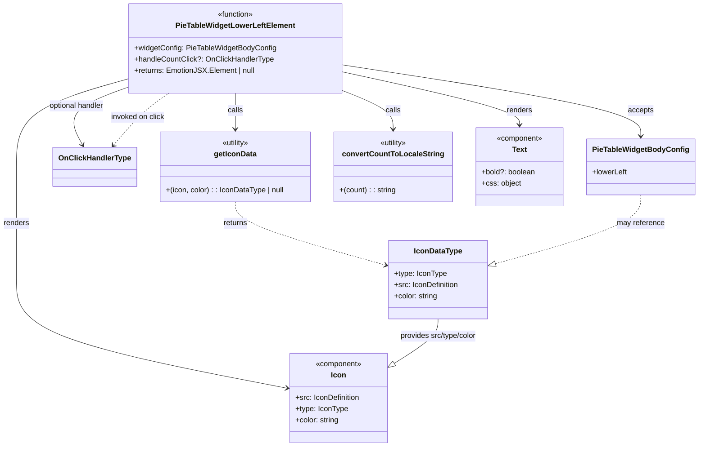

# Diagram: web/portal/src/pages/partview/components/molecules/PieTableWidget/PieTableWidgetLowerLeftElement.tsx

> Auto-generated by Obscura crawlers

## Mermaid

### SVG

<svg id="container" width="1482.7421875" xmlns="http://www.w3.org/2000/svg" class="classDiagram" height="958" viewBox="0 0 1482.7421875 958" role="graphics-document document" aria-roledescription="class"><g><defs><marker id="container_class-aggregationStart" class="marker aggregation class" refX="18" refY="7" markerWidth="190" markerHeight="240" orient="auto"><path d="M 18,7 L9,13 L1,7 L9,1 Z"></path></marker></defs><defs><marker id="container_class-aggregationEnd" class="marker aggregation class" refX="1" refY="7" markerWidth="20" markerHeight="28" orient="auto"><path d="M 18,7 L9,13 L1,7 L9,1 Z"></path></marker></defs><defs><marker id="container_class-extensionStart" class="marker extension class" refX="18" refY="7" markerWidth="190" markerHeight="240" orient="auto"><path d="M 1,7 L18,13 V 1 Z"></path></marker></defs><defs><marker id="container_class-extensionEnd" class="marker extension class" refX="1" refY="7" markerWidth="20" markerHeight="28" orient="auto"><path d="M 1,1 V 13 L18,7 Z"></path></marker></defs><defs><marker id="container_class-compositionStart" class="marker composition class" refX="18" refY="7" markerWidth="190" markerHeight="240" orient="auto"><path d="M 18,7 L9,13 L1,7 L9,1 Z"></path></marker></defs><defs><marker id="container_class-compositionEnd" class="marker composition class" refX="1" refY="7" markerWidth="20" markerHeight="28" orient="auto"><path d="M 18,7 L9,13 L1,7 L9,1 Z"></path></marker></defs><defs><marker id="container_class-dependencyStart" class="marker dependency class" refX="6" refY="7" markerWidth="190" markerHeight="240" orient="auto"><path d="M 5,7 L9,13 L1,7 L9,1 Z"></path></marker></defs><defs><marker id="container_class-dependencyEnd" class="marker dependency class" refX="13" refY="7" markerWidth="20" markerHeight="28" orient="auto"><path d="M 18,7 L9,13 L14,7 L9,1 Z"></path></marker></defs><defs><marker id="container_class-lollipopStart" class="marker lollipop class" refX="13" refY="7" markerWidth="190" markerHeight="240" orient="auto"><circle stroke="black" fill="transparent" cx="7" cy="7" r="6"></circle></marker></defs><defs><marker id="container_class-lollipopEnd" class="marker lollipop class" refX="1" refY="7" markerWidth="190" markerHeight="240" orient="auto"><circle stroke="black" fill="transparent" cx="7" cy="7" r="6"></circle></marker></defs><g class="root"><g class="clusters"></g><g class="edgePaths"><path d="M728.309,138.692L834.321,155.077C940.333,171.462,1152.358,204.231,1258.37,229.782C1364.383,255.333,1364.383,273.667,1364.383,282.833L1364.383,292" id="id_PieTableWidgetLowerLeftElement_PieTableWidgetBodyConfig_1" class="edge-thickness-normal edge-pattern-solid relation" style=";;;" data-edge="true" data-et="edge" data-id="id_PieTableWidgetLowerLeftElement_PieTableWidgetBodyConfig_1" data-points="W3sieCI6NzI4LjMwODU5Mzc1LCJ5IjoxMzguNjkyNDQ5ODA2ODUzNH0seyJ4IjoxMzY0LjM4MjgxMjUsInkiOjIzN30seyJ4IjoxMzY0LjM4MjgxMjUsInkiOjI5OH1d" marker-end="url(#container_class-dependencyEnd)"></path><path d="M279.371,185.316L255.592,193.93C231.814,202.544,184.257,219.772,167.569,240.686C150.881,261.601,165.063,286.201,172.154,298.502L179.244,310.802" id="id_PieTableWidgetLowerLeftElement_OnClickHandlerType_2" class="edge-thickness-normal edge-pattern-solid relation" style=";;;" data-edge="true" data-et="edge" data-id="id_PieTableWidgetLowerLeftElement_OnClickHandlerType_2" data-points="W3sieCI6Mjc5LjM3MTA5Mzc1LCJ5IjoxODUuMzE1ODI3NTUyNDUzNX0seyJ4IjoxMzYuNjk5MjE4NzUsInkiOjIzN30seyJ4IjoxODIuMjQxMDI1MzA5OTE3MzUsInkiOjMxNn1d" marker-end="url(#container_class-dependencyEnd)"></path><path d="M503.84,200L503.84,206.167C503.84,212.333,503.84,224.667,503.84,237.5C503.84,250.333,503.84,263.667,503.84,270.333L503.84,277" id="id_PieTableWidgetLowerLeftElement_getIconData_3" class="edge-thickness-normal edge-pattern-solid relation" style=";;;" data-edge="true" data-et="edge" data-id="id_PieTableWidgetLowerLeftElement_getIconData_3" data-points="W3sieCI6NTAzLjgzOTg0Mzc1LCJ5IjoyMDB9LHsieCI6NTAzLjgzOTg0Mzc1LCJ5IjoyMzd9LHsieCI6NTAzLjgzOTg0Mzc1LCJ5IjoyODN9XQ==" marker-end="url(#container_class-dependencyEnd)"></path><path d="M728.309,192.916L746.857,200.264C765.405,207.611,802.501,222.305,821.049,236.319C839.598,250.333,839.598,263.667,839.598,270.333L839.598,277" id="id_PieTableWidgetLowerLeftElement_convertCountToLocaleString_4" class="edge-thickness-normal edge-pattern-solid relation" style=";;;" data-edge="true" data-et="edge" data-id="id_PieTableWidgetLowerLeftElement_convertCountToLocaleString_4" data-points="W3sieCI6NzI4LjMwODU5Mzc1LCJ5IjoxOTIuOTE2MzA0MDY5NjE4NjN9LHsieCI6ODM5LjU5NzY1NjI1LCJ5IjoyMzd9LHsieCI6ODM5LjU5NzY1NjI1LCJ5IjoyODN9XQ==" marker-end="url(#container_class-dependencyEnd)"></path><path d="M279.371,167.779L238.768,179.316C198.164,190.853,116.957,213.926,76.354,245.63C35.75,277.333,35.75,317.667,35.75,358C35.75,398.333,35.75,438.667,35.75,479C35.75,519.333,35.75,559.667,35.75,600C35.75,640.333,35.75,680.667,131.877,719.384C228.005,758.102,420.26,795.203,516.387,813.754L612.515,832.305" id="id_PieTableWidgetLowerLeftElement_Icon_5" class="edge-thickness-normal edge-pattern-solid relation" style=";;;" data-edge="true" data-et="edge" data-id="id_PieTableWidgetLowerLeftElement_Icon_5" data-points="W3sieCI6Mjc5LjM3MTA5Mzc1LCJ5IjoxNjcuNzc5MDg4ODgzNTEwOTV9LHsieCI6MzUuNzUsInkiOjIzN30seyJ4IjozNS43NSwieSI6MzU4fSx7IngiOjM1Ljc1LCJ5Ijo0Nzl9LHsieCI6MzUuNzUsInkiOjYwMH0seyJ4IjozNS43NSwieSI6NzIxfSx7IngiOjYxOC40MDYyNSwieSI6ODMzLjQ0MjE0NDUyMTA4NzZ9XQ==" marker-end="url(#container_class-dependencyEnd)"></path><path d="M728.309,153.335L791.754,167.279C855.199,181.223,982.09,209.112,1045.535,228.222C1108.98,247.333,1108.98,257.667,1108.98,262.833L1108.98,268" id="id_PieTableWidgetLowerLeftElement_Text_6" class="edge-thickness-normal edge-pattern-solid relation" style=";;;" data-edge="true" data-et="edge" data-id="id_PieTableWidgetLowerLeftElement_Text_6" data-points="W3sieCI6NzI4LjMwODU5Mzc1LCJ5IjoxNTMuMzM0NTU1NTAxMDQ1N30seyJ4IjoxMTA4Ljk4MDQ2ODc1LCJ5IjoyMzd9LHsieCI6MTEwOC45ODA0Njg3NSwieSI6Mjc0fV0=" marker-end="url(#container_class-dependencyEnd)"></path><path d="M503.84,433L503.84,440.667C503.84,448.333,503.84,463.667,556.891,486.252C609.943,508.838,716.045,538.676,769.097,553.595L822.148,568.514" id="id_getIconData_IconDataType_7" class="edge-thickness-normal edge-pattern-dashed relation" style=";;;" data-edge="true" data-et="edge" data-id="id_getIconData_IconDataType_7" data-points="W3sieCI6NTAzLjgzOTg0Mzc1LCJ5Ijo0MzN9LHsieCI6NTAzLjgzOTg0Mzc1LCJ5Ijo0Nzl9LHsieCI6ODI3LjkyMzgyODEyNSwieSI6NTcwLjEzODE4NDkyMTQwMjN9XQ==" marker-end="url(#container_class-dependencyEnd)"></path><path d="M934.111,684L934.111,690.167C934.111,696.333,934.111,708.667,919.429,724.169C904.747,739.671,875.382,758.341,860.7,767.677L846.018,777.012" id="id_IconDataType_Icon_8" class="edge-thickness-normal edge-pattern-solid relation" style=";;;" data-edge="true" data-et="edge" data-id="id_IconDataType_Icon_8" data-points="W3sieCI6OTM0LjExMTMyODEyNSwieSI6Njg0fSx7IngiOjkzNC4xMTEzMjgxMjUsInkiOjcyMX0seyJ4Ijo4MzEuNDYwOTM3NSwieSI6Nzg2LjI2NzQ3MjE1MTkzNDJ9XQ==" marker-end="url(#container_class-extensionEnd)"></path><path d="M1364.383,418L1364.383,428.167C1364.383,438.333,1364.383,458.667,1313.136,483.245C1261.89,507.823,1159.397,536.646,1108.151,551.057L1056.905,565.468" id="id_PieTableWidgetBodyConfig_IconDataType_9" class="edge-thickness-normal edge-pattern-dashed relation" style=";;;" data-edge="true" data-et="edge" data-id="id_PieTableWidgetBodyConfig_IconDataType_9" data-points="W3sieCI6MTM2NC4zODI4MTI1LCJ5Ijo0MTh9LHsieCI6MTM2NC4zODI4MTI1LCJ5Ijo0Nzl9LHsieCI6MTA0MC4yOTg4MjgxMjUsInkiOjU3MC4xMzgxODQ5MjE0MDIzfV0=" marker-end="url(#container_class-extensionEnd)"></path><path d="M245.423,311.397L255.792,298.998C266.16,286.598,286.897,261.799,306.363,243.233C325.829,224.667,344.024,212.333,353.121,206.167L362.218,200" id="id_OnClickHandlerType_PieTableWidgetLowerLeftElement_10" class="edge-thickness-normal edge-pattern-dashed relation" style=";;;" data-edge="true" data-et="edge" data-id="id_OnClickHandlerType_PieTableWidgetLowerLeftElement_10" data-points="W3sieCI6MjQxLjU3NDAyNTA1MTY1Mjg4LCJ5IjozMTZ9LHsieCI6MzA3LjYzNDc2NTYyNSwieSI6MjM3fSx7IngiOjM2Mi4yMTgxMzMyMjM2ODQyLCJ5IjoyMDB9XQ==" marker-start="url(#container_class-dependencyStart)"></path></g><g class="edgeLabels"><g class="edgeLabel" transform="translate(1364.3828125, 237)"><g class="label" data-id="id_PieTableWidgetLowerLeftElement_PieTableWidgetBodyConfig_1" transform="translate(-27.421875, -12)"><foreignObject width="54.84375" height="24">

accepts

</foreignObject></g></g><g class="edgeLabel" transform="translate(165.16779, 226.687)"><g class="label" data-id="id_PieTableWidgetLowerLeftElement_OnClickHandlerType_2" transform="translate(-60.9296875, -12)"><foreignObject width="121.859375" height="24">

optional handler

</foreignObject></g></g><g class="edgeLabel" transform="translate(503.83984375, 237)"><g class="label" data-id="id_PieTableWidgetLowerLeftElement_getIconData_3" transform="translate(-16.4453125, -12)"><foreignObject width="32.890625" height="24">

calls

</foreignObject></g></g><g class="edgeLabel" transform="translate(839.59765625, 237)"><g class="label" data-id="id_PieTableWidgetLowerLeftElement_convertCountToLocaleString_4" transform="translate(-16.4453125, -12)"><foreignObject width="32.890625" height="24">

calls

</foreignObject></g></g><g class="edgeLabel" transform="translate(35.75, 479)"><g class="label" data-id="id_PieTableWidgetLowerLeftElement_Icon_5" transform="translate(-27.75, -12)"><foreignObject width="55.5" height="24">

renders

</foreignObject></g></g><g class="edgeLabel" transform="translate(1108.98046875, 237)"><g class="label" data-id="id_PieTableWidgetLowerLeftElement_Text_6" transform="translate(-27.75, -12)"><foreignObject width="55.5" height="24">

renders

</foreignObject></g></g><g class="edgeLabel" transform="translate(503.83984375, 479)"><g class="label" data-id="id_getIconData_IconDataType_7" transform="translate(-26.265625, -12)"><foreignObject width="52.53125" height="24">

returns

</foreignObject></g></g><g class="edgeLabel" transform="translate(934.111328125, 721)"><g class="label" data-id="id_IconDataType_Icon_8" transform="translate(-85.8203125, -12)"><foreignObject width="171.640625" height="24">

provides src/type/color

</foreignObject></g></g><g class="edgeLabel" transform="translate(1364.3828125, 479)"><g class="label" data-id="id_PieTableWidgetBodyConfig_IconDataType_9" transform="translate(-51.234375, -12)"><foreignObject width="102.46875" height="24">

may reference

</foreignObject></g></g><g class="edgeLabel" transform="translate(295.75485, 251.20683)"><g class="label" data-id="id_OnClickHandlerType_PieTableWidgetLowerLeftElement_10" transform="translate(-58.578125, -12)"><foreignObject width="117.15625" height="24">

invoked on click

</foreignObject></g></g></g><g class="nodes"><g class="node default" id="classId-PieTableWidgetLowerLeftElement-0" transform="translate(503.83984375, 104)"><g class="basic label-container"><path d="M-224.46875 -96 L224.46875 -96 L224.46875 96 L-224.46875 96" stroke="none" stroke-width="0" fill="#ECECFF" style=""></path><path d="M-224.46875 -96 C-103.03053419762169 -96, 18.40768160475662 -96, 224.46875 -96 M-224.46875 -96 C-107.65481389302036 -96, 9.159122213959279 -96, 224.46875 -96 M224.46875 -96 C224.46875 -53.23843206160213, 224.46875 -10.476864123204265, 224.46875 96 M224.46875 -96 C224.46875 -27.8075163648719, 224.46875 40.3849672702562, 224.46875 96 M224.46875 96 C104.13090509296259 96, -16.206939814074815 96, -224.46875 96 M224.46875 96 C51.67471049574519 96, -121.11932900850962 96, -224.46875 96 M-224.46875 96 C-224.46875 35.62770107696498, -224.46875 -24.744597846070036, -224.46875 -96 M-224.46875 96 C-224.46875 28.692870992256672, -224.46875 -38.614258015486655, -224.46875 -96" stroke="#9370DB" stroke-width="1.3" fill="none" stroke-dasharray="0 0" style=""></path></g><g class="annotation-group text" transform="translate(-39.484375, -72)"><g class="label" style="" transform="translate(0,-12)"><foreignObject width="78.96875" height="24">

«function»

</foreignObject></g></g><g class="label-group text" transform="translate(-123.09375, -48)"><g class="label" style="font-weight: bolder" transform="translate(0,-12)"><foreignObject width="246.1875" height="24">

PieTableWidgetLowerLeftElement

</foreignObject></g></g><g class="members-group text" transform="translate(-212.46875, 0)"><g class="label" style="" transform="translate(0,-12)"><foreignObject width="301.84375" height="24">

+widgetConfig: PieTableWidgetBodyConfig

</foreignObject></g><g class="label" style="" transform="translate(0,12)"><foreignObject width="295.703125" height="24">

+handleCountClick?: OnClickHandlerType

</foreignObject></g><g class="label" style="" transform="translate(0,36)"><foreignObject width="257.390625" height="24">

+returns: EmotionJSX.Element | null

</foreignObject></g></g><g class="methods-group text" transform="translate(-212.46875, 96)"></g><g class="divider" style=""><path d="M-224.46875 -24 C-116.89547028708402 -24, -9.322190574168047 -24, 224.46875 -24 M-224.46875 -24 C-107.224036907214 -24, 10.020676185572 -24, 224.46875 -24" stroke="#9370DB" stroke-width="1.3" fill="none" stroke-dasharray="0 0" style=""></path></g><g class="divider" style=""><path d="M-224.46875 72 C-131.8095539033732 72, -39.1503578067464 72, 224.46875 72 M-224.46875 72 C-51.00646866043229 72, 122.45581267913542 72, 224.46875 72" stroke="#9370DB" stroke-width="1.3" fill="none" stroke-dasharray="0 0" style=""></path></g></g><g class="node default" id="classId-PieTableWidgetBodyConfig-1" transform="translate(1364.3828125, 358)"><g class="basic label-container"><path d="M-110.359375 -60 L110.359375 -60 L110.359375 60 L-110.359375 60" stroke="none" stroke-width="0" fill="#ECECFF" style=""></path><path d="M-110.359375 -60 C-64.07648815630064 -60, -17.793601312601282 -60, 110.359375 -60 M-110.359375 -60 C-57.74662468582398 -60, -5.133874371647963 -60, 110.359375 -60 M110.359375 -60 C110.359375 -12.055832478424684, 110.359375 35.88833504315063, 110.359375 60 M110.359375 -60 C110.359375 -23.805746577113766, 110.359375 12.388506845772469, 110.359375 60 M110.359375 60 C31.704478269067877 60, -46.950418461864246 60, -110.359375 60 M110.359375 60 C36.141396115413485 60, -38.07658276917303 60, -110.359375 60 M-110.359375 60 C-110.359375 29.11211943892389, -110.359375 -1.7757611221522183, -110.359375 -60 M-110.359375 60 C-110.359375 25.195525872058, -110.359375 -9.608948255884002, -110.359375 -60" stroke="#9370DB" stroke-width="1.3" fill="none" stroke-dasharray="0 0" style=""></path></g><g class="annotation-group text" transform="translate(0, -36)"></g><g class="label-group text" transform="translate(-98.359375, -36)"><g class="label" style="font-weight: bolder" transform="translate(0,-12)"><foreignObject width="196.71875" height="24">

PieTableWidgetBodyConfig

</foreignObject></g></g><g class="members-group text" transform="translate(-98.359375, 12)"><g class="label" style="" transform="translate(0,-12)"><foreignObject width="75.734375" height="24">

+lowerLeft

</foreignObject></g></g><g class="methods-group text" transform="translate(-98.359375, 60)"></g><g class="divider" style=""><path d="M-110.359375 -12 C-39.0457043147112 -12, 32.2679663705776 -12, 110.359375 -12 M-110.359375 -12 C-36.982215844682585 -12, 36.39494331063483 -12, 110.359375 -12" stroke="#9370DB" stroke-width="1.3" fill="none" stroke-dasharray="0 0" style=""></path></g><g class="divider" style=""><path d="M-110.359375 36 C-34.00178915264367 36, 42.355796694712666 36, 110.359375 36 M-110.359375 36 C-30.35082114068115 36, 49.6577327186377 36, 110.359375 36" stroke="#9370DB" stroke-width="1.3" fill="none" stroke-dasharray="0 0" style=""></path></g></g><g class="node default" id="classId-OnClickHandlerType-2" transform="translate(206.453125, 358)"><g class="basic label-container"><path d="M-85.96875 -42 L85.96875 -42 L85.96875 42 L-85.96875 42" stroke="none" stroke-width="0" fill="#ECECFF" style=""></path><path d="M-85.96875 -42 C-34.998652357764364 -42, 15.971445284471272 -42, 85.96875 -42 M-85.96875 -42 C-27.913090224326936 -42, 30.142569551346128 -42, 85.96875 -42 M85.96875 -42 C85.96875 -11.64994850099212, 85.96875 18.70010299801576, 85.96875 42 M85.96875 -42 C85.96875 -19.391853941897946, 85.96875 3.2162921162041087, 85.96875 42 M85.96875 42 C49.76465996316893 42, 13.560569926337863 42, -85.96875 42 M85.96875 42 C32.31864810660087 42, -21.331453786798264 42, -85.96875 42 M-85.96875 42 C-85.96875 25.042708929288512, -85.96875 8.085417858577024, -85.96875 -42 M-85.96875 42 C-85.96875 19.36113144692116, -85.96875 -3.27773710615768, -85.96875 -42" stroke="#9370DB" stroke-width="1.3" fill="none" stroke-dasharray="0 0" style=""></path></g><g class="annotation-group text" transform="translate(0, -18)"></g><g class="label-group text" transform="translate(-73.96875, -18)"><g class="label" style="font-weight: bolder" transform="translate(0,-12)"><foreignObject width="147.9375" height="24">

OnClickHandlerType

</foreignObject></g></g><g class="members-group text" transform="translate(-73.96875, 30)"></g><g class="methods-group text" transform="translate(-73.96875, 60)"></g><g class="divider" style=""><path d="M-85.96875 6 C-32.847334212426034 6, 20.27408157514793 6, 85.96875 6 M-85.96875 6 C-34.6619729105299 6, 16.644804178940205 6, 85.96875 6" stroke="#9370DB" stroke-width="1.3" fill="none" stroke-dasharray="0 0" style=""></path></g><g class="divider" style=""><path d="M-85.96875 24 C-46.204751223998464 24, -6.440752447996928 24, 85.96875 24 M-85.96875 24 C-42.61205821781932 24, 0.7446335643613651 24, 85.96875 24" stroke="#9370DB" stroke-width="1.3" fill="none" stroke-dasharray="0 0" style=""></path></g></g><g class="node default" id="classId-IconDataType-3" transform="translate(934.111328125, 600)"><g class="basic label-container"><path d="M-106.1875 -84 L106.1875 -84 L106.1875 84 L-106.1875 84" stroke="none" stroke-width="0" fill="#ECECFF" style=""></path><path d="M-106.1875 -84 C-62.77596264142996 -84, -19.364425282859926 -84, 106.1875 -84 M-106.1875 -84 C-32.81507152371367 -84, 40.55735695257266 -84, 106.1875 -84 M106.1875 -84 C106.1875 -25.07510861036169, 106.1875 33.84978277927662, 106.1875 84 M106.1875 -84 C106.1875 -35.16776836084847, 106.1875 13.66446327830306, 106.1875 84 M106.1875 84 C31.12329587864913 84, -43.94090824270174 84, -106.1875 84 M106.1875 84 C41.08960104231373 84, -24.008297915372538 84, -106.1875 84 M-106.1875 84 C-106.1875 40.566816318580194, -106.1875 -2.866367362839611, -106.1875 -84 M-106.1875 84 C-106.1875 24.313746435930128, -106.1875 -35.372507128139745, -106.1875 -84" stroke="#9370DB" stroke-width="1.3" fill="none" stroke-dasharray="0 0" style=""></path></g><g class="annotation-group text" transform="translate(0, -60)"></g><g class="label-group text" transform="translate(-49.53125, -60)"><g class="label" style="font-weight: bolder" transform="translate(0,-12)"><foreignObject width="99.0625" height="24">

IconDataType

</foreignObject></g></g><g class="members-group text" transform="translate(-94.1875, -12)"><g class="label" style="" transform="translate(0,-12)"><foreignObject width="112.28125" height="24">

+type: IconType

</foreignObject></g><g class="label" style="" transform="translate(0,12)"><foreignObject width="138.84375" height="24">

+src: IconDefinition

</foreignObject></g><g class="label" style="" transform="translate(0,36)"><foreignObject width="94.65625" height="24">

+color: string

</foreignObject></g></g><g class="methods-group text" transform="translate(-94.1875, 84)"></g><g class="divider" style=""><path d="M-106.1875 -36 C-57.77733255524145 -36, -9.367165110482901 -36, 106.1875 -36 M-106.1875 -36 C-34.70925985695325 -36, 36.768980286093495 -36, 106.1875 -36" stroke="#9370DB" stroke-width="1.3" fill="none" stroke-dasharray="0 0" style=""></path></g><g class="divider" style=""><path d="M-106.1875 60 C-35.14367278656225 60, 35.9001544268755 60, 106.1875 60 M-106.1875 60 C-26.67301490127754 60, 52.84147019744492 60, 106.1875 60" stroke="#9370DB" stroke-width="1.3" fill="none" stroke-dasharray="0 0" style=""></path></g></g><g class="node default" id="classId-getIconData-4" transform="translate(503.83984375, 358)"><g class="basic label-container"><path d="M-161.41796875 -75 L161.41796875 -75 L161.41796875 75 L-161.41796875 75" stroke="none" stroke-width="0" fill="#ECECFF" style=""></path><path d="M-161.41796875 -75 C-57.359069165104685 -75, 46.69983041979063 -75, 161.41796875 -75 M-161.41796875 -75 C-59.488332600503654 -75, 42.44130354899269 -75, 161.41796875 -75 M161.41796875 -75 C161.41796875 -44.54717369301426, 161.41796875 -14.09434738602851, 161.41796875 75 M161.41796875 -75 C161.41796875 -33.14540355604533, 161.41796875 8.709192887909339, 161.41796875 75 M161.41796875 75 C70.64029854855188 75, -20.137371652896235 75, -161.41796875 75 M161.41796875 75 C33.481509653459725 75, -94.45494944308055 75, -161.41796875 75 M-161.41796875 75 C-161.41796875 33.12925579775586, -161.41796875 -8.74148840448828, -161.41796875 -75 M-161.41796875 75 C-161.41796875 18.62424619734957, -161.41796875 -37.75150760530086, -161.41796875 -75" stroke="#9370DB" stroke-width="1.3" fill="none" stroke-dasharray="0 0" style=""></path></g><g class="annotation-group text" transform="translate(-30.3125, -51)"><g class="label" style="" transform="translate(0,-12)"><foreignObject width="60.625" height="24">

«utility»

</foreignObject></g></g><g class="label-group text" transform="translate(-43.9296875, -27)"><g class="label" style="font-weight: bolder" transform="translate(0,-12)"><foreignObject width="87.859375" height="24">

getIconData

</foreignObject></g></g><g class="members-group text" transform="translate(-149.41796875, 21)"></g><g class="methods-group text" transform="translate(-149.41796875, 51)"><g class="label" style="" transform="translate(0,-12)"><foreignObject width="254.90625" height="24">

+(icon, color) : : IconDataType | null

</foreignObject></g></g><g class="divider" style=""><path d="M-161.41796875 -3 C-46.59476621754952 -3, 68.22843631490096 -3, 161.41796875 -3 M-161.41796875 -3 C-93.57259272290227 -3, -25.727216695804543 -3, 161.41796875 -3" stroke="#9370DB" stroke-width="1.3" fill="none" stroke-dasharray="0 0" style=""></path></g><g class="divider" style=""><path d="M-161.41796875 21 C-84.06082030826785 21, -6.7036718665357 21, 161.41796875 21 M-161.41796875 21 C-85.92046009232702 21, -10.422951434654038 21, 161.41796875 21" stroke="#9370DB" stroke-width="1.3" fill="none" stroke-dasharray="0 0" style=""></path></g></g><g class="node default" id="classId-convertCountToLocaleString-5" transform="translate(839.59765625, 358)"><g class="basic label-container"><path d="M-124.33984375 -75 L124.33984375 -75 L124.33984375 75 L-124.33984375 75" stroke="none" stroke-width="0" fill="#ECECFF" style=""></path><path d="M-124.33984375 -75 C-42.46017373663889 -75, 39.419496276722214 -75, 124.33984375 -75 M-124.33984375 -75 C-33.011669141625035 -75, 58.31650546674993 -75, 124.33984375 -75 M124.33984375 -75 C124.33984375 -30.802949115756896, 124.33984375 13.394101768486209, 124.33984375 75 M124.33984375 -75 C124.33984375 -25.042390848462283, 124.33984375 24.915218303075434, 124.33984375 75 M124.33984375 75 C60.78625139012743 75, -2.7673409697451348 75, -124.33984375 75 M124.33984375 75 C35.79466326074471 75, -52.750517228510574 75, -124.33984375 75 M-124.33984375 75 C-124.33984375 25.690671660140637, -124.33984375 -23.618656679718725, -124.33984375 -75 M-124.33984375 75 C-124.33984375 43.14510335783134, -124.33984375 11.290206715662677, -124.33984375 -75" stroke="#9370DB" stroke-width="1.3" fill="none" stroke-dasharray="0 0" style=""></path></g><g class="annotation-group text" transform="translate(-30.3125, -51)"><g class="label" style="" transform="translate(0,-12)"><foreignObject width="60.625" height="24">

«utility»

</foreignObject></g></g><g class="label-group text" transform="translate(-103.1484375, -27)"><g class="label" style="font-weight: bolder" transform="translate(0,-12)"><foreignObject width="206.296875" height="24">

convertCountToLocaleString

</foreignObject></g></g><g class="members-group text" transform="translate(-112.33984375, 21)"></g><g class="methods-group text" transform="translate(-112.33984375, 51)"><g class="label" style="" transform="translate(0,-12)"><foreignObject width="121.53125" height="24">

+(count) : : string

</foreignObject></g></g><g class="divider" style=""><path d="M-124.33984375 -3 C-48.13139331827759 -3, 28.077057113444823 -3, 124.33984375 -3 M-124.33984375 -3 C-32.65990314412251 -3, 59.02003746175498 -3, 124.33984375 -3" stroke="#9370DB" stroke-width="1.3" fill="none" stroke-dasharray="0 0" style=""></path></g><g class="divider" style=""><path d="M-124.33984375 21 C-67.34243372116336 21, -10.345023692326706 21, 124.33984375 21 M-124.33984375 21 C-59.35341178732152 21, 5.633020175356961 21, 124.33984375 21" stroke="#9370DB" stroke-width="1.3" fill="none" stroke-dasharray="0 0" style=""></path></g></g><g class="node default" id="classId-Icon-6" transform="translate(724.93359375, 854)"><g class="basic label-container"><path d="M-106.52734375 -96 L106.52734375 -96 L106.52734375 96 L-106.52734375 96" stroke="none" stroke-width="0" fill="#ECECFF" style=""></path><path d="M-106.52734375 -96 C-42.51747702201108 -96, 21.492389705977843 -96, 106.52734375 -96 M-106.52734375 -96 C-28.05672068401134 -96, 50.41390238197732 -96, 106.52734375 -96 M106.52734375 -96 C106.52734375 -30.34709467600001, 106.52734375 35.30581064799998, 106.52734375 96 M106.52734375 -96 C106.52734375 -19.504290320818356, 106.52734375 56.99141935836329, 106.52734375 96 M106.52734375 96 C35.39338904425313 96, -35.74056566149375 96, -106.52734375 96 M106.52734375 96 C25.45652892335302 96, -55.61428590329396 96, -106.52734375 96 M-106.52734375 96 C-106.52734375 24.772799943872442, -106.52734375 -46.454400112255115, -106.52734375 -96 M-106.52734375 96 C-106.52734375 38.08608557360711, -106.52734375 -19.827828852785785, -106.52734375 -96" stroke="#9370DB" stroke-width="1.3" fill="none" stroke-dasharray="0 0" style=""></path></g><g class="annotation-group text" transform="translate(-50.2109375, -72)"><g class="label" style="" transform="translate(0,-12)"><foreignObject width="100.421875" height="24">

«component»

</foreignObject></g></g><g class="label-group text" transform="translate(-15.3046875, -48)"><g class="label" style="font-weight: bolder" transform="translate(0,-12)"><foreignObject width="30.609375" height="24">

Icon

</foreignObject></g></g><g class="members-group text" transform="translate(-94.52734375, 0)"><g class="label" style="" transform="translate(0,-12)"><foreignObject width="138.84375" height="24">

+src: IconDefinition

</foreignObject></g><g class="label" style="" transform="translate(0,12)"><foreignObject width="112.28125" height="24">

+type: IconType

</foreignObject></g><g class="label" style="" transform="translate(0,36)"><foreignObject width="94.65625" height="24">

+color: string

</foreignObject></g></g><g class="methods-group text" transform="translate(-94.52734375, 96)"></g><g class="divider" style=""><path d="M-106.52734375 -24 C-50.03446642145327 -24, 6.458410907093466 -24, 106.52734375 -24 M-106.52734375 -24 C-49.98880823363756 -24, 6.549727282724874 -24, 106.52734375 -24" stroke="#9370DB" stroke-width="1.3" fill="none" stroke-dasharray="0 0" style=""></path></g><g class="divider" style=""><path d="M-106.52734375 72 C-39.23798600529996 72, 28.051371739400082 72, 106.52734375 72 M-106.52734375 72 C-34.540565371447954 72, 37.44621300710409 72, 106.52734375 72" stroke="#9370DB" stroke-width="1.3" fill="none" stroke-dasharray="0 0" style=""></path></g></g><g class="node default" id="classId-Text-7" transform="translate(1108.98046875, 358)"><g class="basic label-container"><path d="M-95.04296875 -84 L95.04296875 -84 L95.04296875 84 L-95.04296875 84" stroke="none" stroke-width="0" fill="#ECECFF" style=""></path><path d="M-95.04296875 -84 C-40.52128516047483 -84, 14.000398429050335 -84, 95.04296875 -84 M-95.04296875 -84 C-39.329127828921266 -84, 16.38471309215747 -84, 95.04296875 -84 M95.04296875 -84 C95.04296875 -33.22545368793092, 95.04296875 17.549092624138154, 95.04296875 84 M95.04296875 -84 C95.04296875 -41.204970100602644, 95.04296875 1.5900597987947123, 95.04296875 84 M95.04296875 84 C35.352020552778626 84, -24.338927644442748 84, -95.04296875 84 M95.04296875 84 C50.1732935609663 84, 5.3036183719326 84, -95.04296875 84 M-95.04296875 84 C-95.04296875 26.744135690579014, -95.04296875 -30.51172861884197, -95.04296875 -84 M-95.04296875 84 C-95.04296875 18.093284802812477, -95.04296875 -47.81343039437505, -95.04296875 -84" stroke="#9370DB" stroke-width="1.3" fill="none" stroke-dasharray="0 0" style=""></path></g><g class="annotation-group text" transform="translate(-50.2109375, -60)"><g class="label" style="" transform="translate(0,-12)"><foreignObject width="100.421875" height="24">

«component»

</foreignObject></g></g><g class="label-group text" transform="translate(-15.3828125, -36)"><g class="label" style="font-weight: bolder" transform="translate(0,-12)"><foreignObject width="30.765625" height="24">

Text

</foreignObject></g></g><g class="members-group text" transform="translate(-83.04296875, 12)"><g class="label" style="" transform="translate(0,-12)"><foreignObject width="115.875" height="24">

+bold?: boolean

</foreignObject></g><g class="label" style="" transform="translate(0,12)"><foreignObject width="83.96875" height="24">

+css: object

</foreignObject></g></g><g class="methods-group text" transform="translate(-83.04296875, 84)"></g><g class="divider" style=""><path d="M-95.04296875 -12 C-39.34425600359566 -12, 16.35445674280868 -12, 95.04296875 -12 M-95.04296875 -12 C-22.034177652945615 -12, 50.97461344410877 -12, 95.04296875 -12" stroke="#9370DB" stroke-width="1.3" fill="none" stroke-dasharray="0 0" style=""></path></g><g class="divider" style=""><path d="M-95.04296875 60 C-49.25511836386647 60, -3.467267977732945 60, 95.04296875 60 M-95.04296875 60 C-54.94912958857526 60, -14.855290427150521 60, 95.04296875 60" stroke="#9370DB" stroke-width="1.3" fill="none" stroke-dasharray="0 0" style=""></path></g></g></g></g></g></svg>
