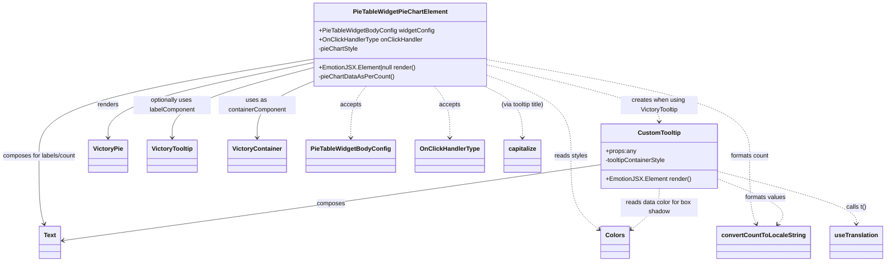

# Diagram: web/portal/src/pages/partview/components/molecules/PieTableWidget/PieTableWidgetPieChartElement.tsx

> Auto-generated by Obscura crawlers

## Mermaid

### SVG

<svg id="container" width="2256.79296875" xmlns="http://www.w3.org/2000/svg" class="classDiagram" height="680" viewBox="0 0 2256.79296875 680" role="graphics-document document" aria-roledescription="class"><g><defs><marker id="container_class-aggregationStart" class="marker aggregation class" refX="18" refY="7" markerWidth="190" markerHeight="240" orient="auto"><path d="M 18,7 L9,13 L1,7 L9,1 Z"></path></marker></defs><defs><marker id="container_class-aggregationEnd" class="marker aggregation class" refX="1" refY="7" markerWidth="20" markerHeight="28" orient="auto"><path d="M 18,7 L9,13 L1,7 L9,1 Z"></path></marker></defs><defs><marker id="container_class-extensionStart" class="marker extension class" refX="18" refY="7" markerWidth="190" markerHeight="240" orient="auto"><path d="M 1,7 L18,13 V 1 Z"></path></marker></defs><defs><marker id="container_class-extensionEnd" class="marker extension class" refX="1" refY="7" markerWidth="20" markerHeight="28" orient="auto"><path d="M 1,1 V 13 L18,7 Z"></path></marker></defs><defs><marker id="container_class-compositionStart" class="marker composition class" refX="18" refY="7" markerWidth="190" markerHeight="240" orient="auto"><path d="M 18,7 L9,13 L1,7 L9,1 Z"></path></marker></defs><defs><marker id="container_class-compositionEnd" class="marker composition class" refX="1" refY="7" markerWidth="20" markerHeight="28" orient="auto"><path d="M 18,7 L9,13 L1,7 L9,1 Z"></path></marker></defs><defs><marker id="container_class-dependencyStart" class="marker dependency class" refX="6" refY="7" markerWidth="190" markerHeight="240" orient="auto"><path d="M 5,7 L9,13 L1,7 L9,1 Z"></path></marker></defs><defs><marker id="container_class-dependencyEnd" class="marker dependency class" refX="13" refY="7" markerWidth="20" markerHeight="28" orient="auto"><path d="M 18,7 L9,13 L14,7 L9,1 Z"></path></marker></defs><defs><marker id="container_class-lollipopStart" class="marker lollipop class" refX="13" refY="7" markerWidth="190" markerHeight="240" orient="auto"><circle stroke="black" fill="transparent" cx="7" cy="7" r="6"></circle></marker></defs><defs><marker id="container_class-lollipopEnd" class="marker lollipop class" refX="1" refY="7" markerWidth="190" markerHeight="240" orient="auto"><circle stroke="black" fill="transparent" cx="7" cy="7" r="6"></circle></marker></defs><g class="root"><g class="clusters"></g><g class="edgePaths"><path d="M805.754,162.722L719.219,181.101C632.685,199.481,459.616,236.241,373.081,268.787C286.547,301.333,286.547,329.667,286.547,343.833L286.547,358" id="id_PieTableWidgetPieChartElement_VictoryPie_1" class="edge-thickness-normal edge-pattern-solid relation" style=";;;" data-edge="true" data-et="edge" data-id="id_PieTableWidgetPieChartElement_VictoryPie_1" data-points="W3sieCI6ODA1Ljc1MzkwNjI1LCJ5IjoxNjIuNzIxNjY2NzU0NzQyOX0seyJ4IjoyODYuNTQ2ODc1LCJ5IjoyNzN9LHsieCI6Mjg2LjU0Njg3NSwieSI6MzY0fV0=" marker-end="url(#container_class-dependencyEnd)"></path><path d="M805.754,212.809L782.959,222.84C760.164,232.872,714.574,252.936,691.779,277.135C668.984,301.333,668.984,329.667,668.984,343.833L668.984,358" id="id_PieTableWidgetPieChartElement_VictoryContainer_2" class="edge-thickness-normal edge-pattern-solid relation" style=";;;" data-edge="true" data-et="edge" data-id="id_PieTableWidgetPieChartElement_VictoryContainer_2" data-points="W3sieCI6ODA1Ljc1MzkwNjI1LCJ5IjoyMTIuODA4NTg2ODIwODM5NjV9LHsieCI6NjY4Ljk4NDM3NSwieSI6MjczfSx7IngiOjY2OC45ODQzNzUsInkiOjM2NH1d" marker-end="url(#container_class-dependencyEnd)"></path><path d="M805.754,175.881L746.292,192.067C686.831,208.254,567.908,240.627,508.446,270.98C448.984,301.333,448.984,329.667,448.984,343.833L448.984,358" id="id_PieTableWidgetPieChartElement_VictoryTooltip_3" class="edge-thickness-normal edge-pattern-solid relation" style=";;;" data-edge="true" data-et="edge" data-id="id_PieTableWidgetPieChartElement_VictoryTooltip_3" data-points="W3sieCI6ODA1Ljc1MzkwNjI1LCJ5IjoxNzUuODgwNjY3MjcxNzE3NDd9LHsieCI6NDQ4Ljk4NDM3NSwieSI6MjczfSx7IngiOjQ0OC45ODQzNzUsInkiOjM2NH1d" marker-end="url(#container_class-dependencyEnd)"></path><path d="M805.754,153.518L688.999,173.432C572.245,193.346,338.736,233.173,221.981,275.253C105.227,317.333,105.227,361.667,105.227,406C105.227,450.333,105.227,494.667,107.463,524.045C109.7,553.423,114.174,567.846,116.411,575.058L118.648,582.269" id="id_PieTableWidgetPieChartElement_Text_4" class="edge-thickness-normal edge-pattern-solid relation" style=";;;" data-edge="true" data-et="edge" data-id="id_PieTableWidgetPieChartElement_Text_4" data-points="W3sieCI6ODA1Ljc1MzkwNjI1LCJ5IjoxNTMuNTE4NDIxNTQzOTk3ODJ9LHsieCI6MTA1LjIyNjU2MjUsInkiOjI3M30seyJ4IjoxMDUuMjI2NTYyNSwieSI6NDA2fSx7IngiOjEwNS4yMjY1NjI1LCJ5Ijo1Mzl9LHsieCI6MTIwLjQyNTQ4MDc2OTIzMDc3LCJ5Ijo1ODh9XQ==" marker-end="url(#container_class-dependencyEnd)"></path><path d="M941.002,224L934.596,232.167C928.189,240.333,915.376,256.667,908.969,279C902.563,301.333,902.563,329.667,902.563,343.833L902.563,358" id="id_PieTableWidgetPieChartElement_PieTableWidgetBodyConfig_5" class="edge-thickness-normal edge-pattern-dashed relation" style=";;;" data-edge="true" data-et="edge" data-id="id_PieTableWidgetPieChartElement_PieTableWidgetBodyConfig_5" data-points="W3sieCI6OTQxLjAwMjIzOTI1MTU5MjMsInkiOjIyNH0seyJ4Ijo5MDIuNTYyNSwieSI6MjczfSx7IngiOjkwMi41NjI1LCJ5IjozNjR9XQ==" marker-end="url(#container_class-dependencyEnd)"></path><path d="M1110.451,224L1116.858,232.167C1123.264,240.333,1136.077,256.667,1142.484,279C1148.891,301.333,1148.891,329.667,1148.891,343.833L1148.891,358" id="id_PieTableWidgetPieChartElement_OnClickHandlerType_6" class="edge-thickness-normal edge-pattern-dashed relation" style=";;;" data-edge="true" data-et="edge" data-id="id_PieTableWidgetPieChartElement_OnClickHandlerType_6" data-points="W3sieCI6MTExMC40NTA4ODU3NDg0MDc3LCJ5IjoyMjR9LHsieCI6MTE0OC44OTA2MjUsInkiOjI3M30seyJ4IjoxMTQ4Ljg5MDYyNSwieSI6MzY0fV0=" marker-end="url(#container_class-dependencyEnd)"></path><path d="M1245.699,196.052L1280.939,208.877C1316.18,221.702,1386.66,247.351,1421.9,282.342C1457.141,317.333,1457.141,361.667,1457.141,406C1457.141,450.333,1457.141,494.667,1469.253,526.636C1481.365,558.605,1505.589,578.211,1517.701,588.014L1529.813,597.816" id="id_PieTableWidgetPieChartElement_Colors_7" class="edge-thickness-normal edge-pattern-dashed relation" style=";;;" data-edge="true" data-et="edge" data-id="id_PieTableWidgetPieChartElement_Colors_7" data-points="W3sieCI6MTI0NS42OTkyMTg3NSwieSI6MTk2LjA1MjM0NDIxNjg3NDAyfSx7IngiOjE0NTcuMTQwNjI1LCJ5IjoyNzN9LHsieCI6MTQ1Ny4xNDA2MjUsInkiOjQwNn0seyJ4IjoxNDU3LjE0MDYyNSwieSI6NTM5fSx7IngiOjE1MzQuNDc2NTYyNSwieSI6NjAxLjU5MDk1MzMwNzM5M31d" marker-end="url(#container_class-dependencyEnd)"></path><path d="M1245.699,154.848L1357.204,174.54C1468.708,194.232,1691.717,233.616,1803.222,275.475C1914.727,317.333,1914.727,361.667,1914.727,406C1914.727,450.333,1914.727,494.667,1917.65,524.073C1920.573,553.479,1926.42,567.958,1929.343,575.197L1932.266,582.436" id="id_PieTableWidgetPieChartElement_convertCountToLocaleString_8" class="edge-thickness-normal edge-pattern-dashed relation" style=";;;" data-edge="true" data-et="edge" data-id="id_PieTableWidgetPieChartElement_convertCountToLocaleString_8" data-points="W3sieCI6MTI0NS42OTkyMTg3NSwieSI6MTU0Ljg0NzgxNDQzMzM1MjA4fSx7IngiOjE5MTQuNzI2NTYyNSwieSI6MjczfSx7IngiOjE5MTQuNzI2NTYyNSwieSI6NDA2fSx7IngiOjE5MTQuNzI2NTYyNSwieSI6NTM5fSx7IngiOjE5MzQuNTEyOTIwNjczMDc3LCJ5Ijo1ODh9XQ==" marker-end="url(#container_class-dependencyEnd)"></path><path d="M1236.395,224L1252.326,232.167C1268.256,240.333,1300.116,256.667,1316.046,279C1331.977,301.333,1331.977,329.667,1331.977,343.833L1331.977,358" id="id_PieTableWidgetPieChartElement_capitalize_9" class="edge-thickness-normal edge-pattern-dashed relation" style=";;;" data-edge="true" data-et="edge" data-id="id_PieTableWidgetPieChartElement_capitalize_9" data-points="W3sieCI6MTIzNi4zOTUzNTIzMDg5MTcyLCJ5IjoyMjR9LHsieCI6MTMzMS45NzY1NjI1LCJ5IjoyNzN9LHsieCI6MTMzMS45NzY1NjI1LCJ5IjozNjR9XQ==" marker-end="url(#container_class-dependencyEnd)"></path><path d="M1245.699,168.623L1318.419,186.019C1391.138,203.415,1536.577,238.208,1609.296,262.77C1682.016,287.333,1682.016,301.667,1682.016,308.833L1682.016,316" id="id_PieTableWidgetPieChartElement_CustomTooltip_10" class="edge-thickness-normal edge-pattern-dashed relation" style=";;;" data-edge="true" data-et="edge" data-id="id_PieTableWidgetPieChartElement_CustomTooltip_10" data-points="W3sieCI6MTI0NS42OTkyMTg3NSwieSI6MTY4LjYyMjcwNjk4MTcyNzI4fSx7IngiOjE2ODIuMDE1NjI1LCJ5IjoyNzN9LHsieCI6MTY4Mi4wMTU2MjUsInkiOjMyMn1d" marker-end="url(#container_class-dependencyEnd)"></path><path d="M1535.188,427.678L1409.52,446.232C1283.853,464.785,1032.518,501.893,804.45,534.833C576.382,567.773,371.58,596.545,269.179,610.932L166.778,625.318" id="id_CustomTooltip_Text_11" class="edge-thickness-normal edge-pattern-solid relation" style=";;;" data-edge="true" data-et="edge" data-id="id_CustomTooltip_Text_11" data-points="W3sieCI6MTUzNS4xODc1LCJ5Ijo0MjcuNjc3ODkzMjY3MDc1MTV9LHsieCI6NzgxLjE4MzU5Mzc1LCJ5Ijo1Mzl9LHsieCI6MTYwLjgzNTkzNzUsInkiOjYyNi4xNTI5NzQwMjU4OTU3fV0=" marker-end="url(#container_class-dependencyEnd)"></path><path d="M1828.844,445.002L1887.821,460.669C1946.798,476.335,2064.753,507.667,2123.73,530.5C2182.707,553.333,2182.707,567.667,2182.707,574.833L2182.707,582" id="id_CustomTooltip_useTranslation_12" class="edge-thickness-normal edge-pattern-dashed relation" style=";;;" data-edge="true" data-et="edge" data-id="id_CustomTooltip_useTranslation_12" data-points="W3sieCI6MTgyOC44NDM3NSwieSI6NDQ1LjAwMjM0ODMxNTIyMDR9LHsieCI6MjE4Mi43MDcwMzEyNSwieSI6NTM5fSx7IngiOjIxODIuNzA3MDMxMjUsInkiOjU4OH1d" marker-end="url(#container_class-dependencyEnd)"></path><path d="M1828.844,464.291L1860.208,476.742C1891.572,489.194,1954.299,514.097,1980.365,533.904C2006.43,553.711,1995.833,568.421,1990.534,575.776L1985.236,583.132" id="id_CustomTooltip_convertCountToLocaleString_13" class="edge-thickness-normal edge-pattern-dashed relation" style=";;;" data-edge="true" data-et="edge" data-id="id_CustomTooltip_convertCountToLocaleString_13" data-points="W3sieCI6MTgyOC44NDM3NSwieSI6NDY0LjI5MDkxNzk5NDkzOTU1fSx7IngiOjIwMTcuMDI3MzQzNzUsInkiOjUzOX0seyJ4IjoxOTgxLjcyODY2NTg2NTM4NDUsInkiOjU4OH1d" marker-end="url(#container_class-dependencyEnd)"></path><path d="M1682.016,490L1682.016,498.167C1682.016,506.333,1682.016,522.667,1669.904,540.636C1657.792,558.605,1633.568,578.211,1621.456,588.014L1609.344,597.816" id="id_CustomTooltip_Colors_14" class="edge-thickness-normal edge-pattern-dashed relation" style=";;;" data-edge="true" data-et="edge" data-id="id_CustomTooltip_Colors_14" data-points="W3sieCI6MTY4Mi4wMTU2MjUsInkiOjQ5MH0seyJ4IjoxNjgyLjAxNTYyNSwieSI6NTM5fSx7IngiOjE2MDQuNjc5Njg3NSwieSI6NjAxLjU5MDk1MzMwNzM5M31d" marker-end="url(#container_class-dependencyEnd)"></path></g><g class="edgeLabels"><g class="edgeLabel" transform="translate(286.546875, 273)"><g class="label" data-id="id_PieTableWidgetPieChartElement_VictoryPie_1" transform="translate(-27.75, -12)"><foreignObject width="55.5" height="24">

renders

</foreignObject></g></g><g class="edgeLabel" transform="translate(668.984375, 273)"><g class="label" data-id="id_PieTableWidgetPieChartElement_VictoryContainer_2" transform="translate(-100, -24)"><foreignObject width="200" height="48">

uses as containerComponent

</foreignObject></g></g><g class="edgeLabel" transform="translate(448.984375, 273)"><g class="label" data-id="id_PieTableWidgetPieChartElement_VictoryTooltip_3" transform="translate(-100, -24)"><foreignObject width="200" height="48">

optionally uses labelComponent

</foreignObject></g></g><g class="edgeLabel" transform="translate(105.2265625, 406)"><g class="label" data-id="id_PieTableWidgetPieChartElement_Text_4" transform="translate(-97.2265625, -12)"><foreignObject width="194.453125" height="24">

composes for labels/count

</foreignObject></g></g><g class="edgeLabel" transform="translate(902.5625, 273)"><g class="label" data-id="id_PieTableWidgetPieChartElement_PieTableWidgetBodyConfig_5" transform="translate(-27.421875, -12)"><foreignObject width="54.84375" height="24">

accepts

</foreignObject></g></g><g class="edgeLabel" transform="translate(1148.890625, 273)"><g class="label" data-id="id_PieTableWidgetPieChartElement_OnClickHandlerType_6" transform="translate(-27.421875, -12)"><foreignObject width="54.84375" height="24">

accepts

</foreignObject></g></g><g class="edgeLabel" transform="translate(1457.140625, 406)"><g class="label" data-id="id_PieTableWidgetPieChartElement_Colors_7" transform="translate(-43.046875, -12)"><foreignObject width="86.09375" height="24">

reads styles

</foreignObject></g></g><g class="edgeLabel" transform="translate(1914.7265625, 406)"><g class="label" data-id="id_PieTableWidgetPieChartElement_convertCountToLocaleString_8" transform="translate(-50.8828125, -12)"><foreignObject width="101.765625" height="24">

formats count

</foreignObject></g></g><g class="edgeLabel" transform="translate(1331.9765625, 273)"><g class="label" data-id="id_PieTableWidgetPieChartElement_capitalize_9" transform="translate(-58.9375, -12)"><foreignObject width="117.875" height="24">

(via tooltip title)

</foreignObject></g></g><g class="edgeLabel" transform="translate(1682.015625, 273)"><g class="label" data-id="id_PieTableWidgetPieChartElement_CustomTooltip_10" transform="translate(-100, -24)"><foreignObject width="200" height="48">

creates when using VictoryTooltip

</foreignObject></g></g><g class="edgeLabel" transform="translate(848.32459, 529.08722)"><g class="label" data-id="id_CustomTooltip_Text_11" transform="translate(-36.453125, -12)"><foreignObject width="72.90625" height="24">

composes

</foreignObject></g></g><g class="edgeLabel" transform="translate(2182.70703125, 539)"><g class="label" data-id="id_CustomTooltip_useTranslation_12" transform="translate(-26.6328125, -12)"><foreignObject width="53.265625" height="24">

calls t()

</foreignObject></g></g><g class="edgeLabel" transform="translate(1951, 512.78708)"><g class="label" data-id="id_CustomTooltip_convertCountToLocaleString_13" transform="translate(-53.4921875, -12)"><foreignObject width="106.984375" height="24">

formats values

</foreignObject></g></g><g class="edgeLabel" transform="translate(1682.015625, 539)"><g class="label" data-id="id_CustomTooltip_Colors_14" transform="translate(-100, -24)"><foreignObject width="200" height="48">

reads data color for box shadow

</foreignObject></g></g></g><g class="nodes"><g class="node default" id="classId-PieTableWidgetPieChartElement-0" transform="translate(1025.7265625, 116)"><g class="basic label-container"><path d="M-219.97265625 -108 L219.97265625 -108 L219.97265625 108 L-219.97265625 108" stroke="none" stroke-width="0" fill="#ECECFF" style=""></path><path d="M-219.97265625 -108 C-124.08019695621077 -108, -28.18773766242154 -108, 219.97265625 -108 M-219.97265625 -108 C-77.29371415210059 -108, 65.38522794579882 -108, 219.97265625 -108 M219.97265625 -108 C219.97265625 -53.70961647535784, 219.97265625 0.5807670492843187, 219.97265625 108 M219.97265625 -108 C219.97265625 -51.54178127568929, 219.97265625 4.916437448621423, 219.97265625 108 M219.97265625 108 C93.29618025577408 108, -33.38029573845185 108, -219.97265625 108 M219.97265625 108 C97.56558341134917 108, -24.841489427301667 108, -219.97265625 108 M-219.97265625 108 C-219.97265625 42.72276165187259, -219.97265625 -22.554476696254824, -219.97265625 -108 M-219.97265625 108 C-219.97265625 29.534978488869456, -219.97265625 -48.93004302226109, -219.97265625 -108" stroke="#9370DB" stroke-width="1.3" fill="none" stroke-dasharray="0 0" style=""></path></g><g class="annotation-group text" transform="translate(0, -84)"></g><g class="label-group text" transform="translate(-117.9296875, -84)"><g class="label" style="font-weight: bolder" transform="translate(0,-12)"><foreignObject width="235.859375" height="24">

PieTableWidgetPieChartElement

</foreignObject></g></g><g class="members-group text" transform="translate(-207.97265625, -36)"><g class="label" style="" transform="translate(0,-12)"><foreignObject width="298.015625" height="24">

+PieTableWidgetBodyConfig widgetConfig

</foreignObject></g><g class="label" style="" transform="translate(0,12)"><foreignObject width="268.875" height="24">

+OnClickHandlerType onClickHandler

</foreignObject></g><g class="label" style="" transform="translate(0,36)"><foreignObject width="103.640625" height="24">

-pieChartStyle

</foreignObject></g></g><g class="methods-group text" transform="translate(-207.97265625, 60)"><g class="label" style="" transform="translate(0,-12)"><foreignObject width="251.15625" height="24">

+EmotionJSX.Element|null render()

</foreignObject></g><g class="label" style="" transform="translate(0,12)"><foreignObject width="194.40625" height="24">

-pieChartDataAsPerCount()

</foreignObject></g></g><g class="divider" style=""><path d="M-219.97265625 -60 C-82.24384416518396 -60, 55.48496791963208 -60, 219.97265625 -60 M-219.97265625 -60 C-129.51077278916034 -60, -39.04888932832071 -60, 219.97265625 -60" stroke="#9370DB" stroke-width="1.3" fill="none" stroke-dasharray="0 0" style=""></path></g><g class="divider" style=""><path d="M-219.97265625 36 C-124.53913949900935 36, -29.105622748018703 36, 219.97265625 36 M-219.97265625 36 C-66.46867001758224 36, 87.03531621483552 36, 219.97265625 36" stroke="#9370DB" stroke-width="1.3" fill="none" stroke-dasharray="0 0" style=""></path></g></g><g class="node default" id="classId-CustomTooltip-1" transform="translate(1682.015625, 406)"><g class="basic label-container"><path d="M-146.828125 -84 L146.828125 -84 L146.828125 84 L-146.828125 84" stroke="none" stroke-width="0" fill="#ECECFF" style=""></path><path d="M-146.828125 -84 C-52.44266744319273 -84, 41.942790113614535 -84, 146.828125 -84 M-146.828125 -84 C-33.271898675725424 -84, 80.28432764854915 -84, 146.828125 -84 M146.828125 -84 C146.828125 -41.38007812340028, 146.828125 1.2398437531994375, 146.828125 84 M146.828125 -84 C146.828125 -46.642952297137036, 146.828125 -9.285904594274072, 146.828125 84 M146.828125 84 C74.85490207442359 84, 2.8816791488471836 84, -146.828125 84 M146.828125 84 C48.5672429561327 84, -49.693639087734596 84, -146.828125 84 M-146.828125 84 C-146.828125 19.513460547937285, -146.828125 -44.97307890412543, -146.828125 -84 M-146.828125 84 C-146.828125 26.357167883884458, -146.828125 -31.285664232231085, -146.828125 -84" stroke="#9370DB" stroke-width="1.3" fill="none" stroke-dasharray="0 0" style=""></path></g><g class="annotation-group text" transform="translate(0, -60)"></g><g class="label-group text" transform="translate(-53.015625, -60)"><g class="label" style="font-weight: bolder" transform="translate(0,-12)"><foreignObject width="106.03125" height="24">

CustomTooltip

</foreignObject></g></g><g class="members-group text" transform="translate(-134.828125, -12)"><g class="label" style="" transform="translate(0,-12)"><foreignObject width="79.1875" height="24">

+props:any

</foreignObject></g><g class="label" style="" transform="translate(0,12)"><foreignObject width="161.203125" height="24">

-tooltipContainerStyle

</foreignObject></g></g><g class="methods-group text" transform="translate(-134.828125, 60)"><g class="label" style="" transform="translate(0,-12)"><foreignObject width="216.640625" height="24">

+EmotionJSX.Element render()

</foreignObject></g></g><g class="divider" style=""><path d="M-146.828125 -36 C-59.78706911948417 -36, 27.253986761031655 -36, 146.828125 -36 M-146.828125 -36 C-69.9094125283236 -36, 7.009299943352801 -36, 146.828125 -36" stroke="#9370DB" stroke-width="1.3" fill="none" stroke-dasharray="0 0" style=""></path></g><g class="divider" style=""><path d="M-146.828125 36 C-70.80072405728075 36, 5.226676885438508 36, 146.828125 36 M-146.828125 36 C-45.3623878102524 36, 56.1033493794952 36, 146.828125 36" stroke="#9370DB" stroke-width="1.3" fill="none" stroke-dasharray="0 0" style=""></path></g></g><g class="node default" id="classId-VictoryPie-2" transform="translate(286.546875, 406)"><g class="basic label-container"><path d="M-49.09375 -42 L49.09375 -42 L49.09375 42 L-49.09375 42" stroke="none" stroke-width="0" fill="#ECECFF" style=""></path><path d="M-49.09375 -42 C-18.1869236454579 -42, 12.719902709084202 -42, 49.09375 -42 M-49.09375 -42 C-10.967517307643021 -42, 27.158715384713958 -42, 49.09375 -42 M49.09375 -42 C49.09375 -23.885639805514327, 49.09375 -5.771279611028653, 49.09375 42 M49.09375 -42 C49.09375 -14.16988065346553, 49.09375 13.66023869306894, 49.09375 42 M49.09375 42 C10.575139549761296 42, -27.943470900477408 42, -49.09375 42 M49.09375 42 C23.2557741551424 42, -2.5822016897151983 42, -49.09375 42 M-49.09375 42 C-49.09375 18.074979926911197, -49.09375 -5.850040146177605, -49.09375 -42 M-49.09375 42 C-49.09375 20.21471165054325, -49.09375 -1.5705766989134986, -49.09375 -42" stroke="#9370DB" stroke-width="1.3" fill="none" stroke-dasharray="0 0" style=""></path></g><g class="annotation-group text" transform="translate(0, -18)"></g><g class="label-group text" transform="translate(-37.09375, -18)"><g class="label" style="font-weight: bolder" transform="translate(0,-12)"><foreignObject width="74.1875" height="24">

VictoryPie

</foreignObject></g></g><g class="members-group text" transform="translate(-37.09375, 30)"></g><g class="methods-group text" transform="translate(-37.09375, 60)"></g><g class="divider" style=""><path d="M-49.09375 6 C-14.049486373156583 6, 20.994777253686834 6, 49.09375 6 M-49.09375 6 C-21.456019410905103 6, 6.1817111781897935 6, 49.09375 6" stroke="#9370DB" stroke-width="1.3" fill="none" stroke-dasharray="0 0" style=""></path></g><g class="divider" style=""><path d="M-49.09375 24 C-12.609339215626235 24, 23.87507156874753 24, 49.09375 24 M-49.09375 24 C-11.744338719142874 24, 25.605072561714252 24, 49.09375 24" stroke="#9370DB" stroke-width="1.3" fill="none" stroke-dasharray="0 0" style=""></path></g></g><g class="node default" id="classId-VictoryTooltip-3" transform="translate(448.984375, 406)"><g class="basic label-container"><path d="M-63.34375 -42 L63.34375 -42 L63.34375 42 L-63.34375 42" stroke="none" stroke-width="0" fill="#ECECFF" style=""></path><path d="M-63.34375 -42 C-35.918872282682834 -42, -8.493994565365668 -42, 63.34375 -42 M-63.34375 -42 C-22.75352399258246 -42, 17.836702014835083 -42, 63.34375 -42 M63.34375 -42 C63.34375 -18.881634580780748, 63.34375 4.236730838438504, 63.34375 42 M63.34375 -42 C63.34375 -20.298165326993647, 63.34375 1.4036693460127054, 63.34375 42 M63.34375 42 C29.88066283479602 42, -3.58242433040796 42, -63.34375 42 M63.34375 42 C17.440653195553466 42, -28.462443608893068 42, -63.34375 42 M-63.34375 42 C-63.34375 20.63823347971458, -63.34375 -0.7235330405708424, -63.34375 -42 M-63.34375 42 C-63.34375 21.21792564097941, -63.34375 0.4358512819588185, -63.34375 -42" stroke="#9370DB" stroke-width="1.3" fill="none" stroke-dasharray="0 0" style=""></path></g><g class="annotation-group text" transform="translate(0, -18)"></g><g class="label-group text" transform="translate(-51.34375, -18)"><g class="label" style="font-weight: bolder" transform="translate(0,-12)"><foreignObject width="102.6875" height="24">

VictoryTooltip

</foreignObject></g></g><g class="members-group text" transform="translate(-51.34375, 30)"></g><g class="methods-group text" transform="translate(-51.34375, 60)"></g><g class="divider" style=""><path d="M-63.34375 6 C-16.535984741461903 6, 30.271780517076195 6, 63.34375 6 M-63.34375 6 C-23.329719289387512 6, 16.684311421224976 6, 63.34375 6" stroke="#9370DB" stroke-width="1.3" fill="none" stroke-dasharray="0 0" style=""></path></g><g class="divider" style=""><path d="M-63.34375 24 C-20.13667133761971 24, 23.07040732476058 24, 63.34375 24 M-63.34375 24 C-15.242810542414503 24, 32.858128915170994 24, 63.34375 24" stroke="#9370DB" stroke-width="1.3" fill="none" stroke-dasharray="0 0" style=""></path></g></g><g class="node default" id="classId-VictoryContainer-4" transform="translate(668.984375, 406)"><g class="basic label-container"><path d="M-73.21875 -42 L73.21875 -42 L73.21875 42 L-73.21875 42" stroke="none" stroke-width="0" fill="#ECECFF" style=""></path><path d="M-73.21875 -42 C-28.91135489759452 -42, 15.396040204810959 -42, 73.21875 -42 M-73.21875 -42 C-18.39091675363401 -42, 36.43691649273198 -42, 73.21875 -42 M73.21875 -42 C73.21875 -17.33768874744374, 73.21875 7.324622505112522, 73.21875 42 M73.21875 -42 C73.21875 -8.554740809411442, 73.21875 24.890518381177117, 73.21875 42 M73.21875 42 C33.37852118795048 42, -6.461707624099034 42, -73.21875 42 M73.21875 42 C32.27296129713392 42, -8.672827405732164 42, -73.21875 42 M-73.21875 42 C-73.21875 22.412985376933104, -73.21875 2.8259707538662084, -73.21875 -42 M-73.21875 42 C-73.21875 24.71083670522171, -73.21875 7.421673410443418, -73.21875 -42" stroke="#9370DB" stroke-width="1.3" fill="none" stroke-dasharray="0 0" style=""></path></g><g class="annotation-group text" transform="translate(0, -18)"></g><g class="label-group text" transform="translate(-61.21875, -18)"><g class="label" style="font-weight: bolder" transform="translate(0,-12)"><foreignObject width="122.4375" height="24">

VictoryContainer

</foreignObject></g></g><g class="members-group text" transform="translate(-61.21875, 30)"></g><g class="methods-group text" transform="translate(-61.21875, 60)"></g><g class="divider" style=""><path d="M-73.21875 6 C-17.548003262255563 6, 38.122743475488875 6, 73.21875 6 M-73.21875 6 C-15.521243066464592 6, 42.176263867070816 6, 73.21875 6" stroke="#9370DB" stroke-width="1.3" fill="none" stroke-dasharray="0 0" style=""></path></g><g class="divider" style=""><path d="M-73.21875 24 C-22.722074654110088 24, 27.774600691779824 24, 73.21875 24 M-73.21875 24 C-20.724282727831948 24, 31.770184544336104 24, 73.21875 24" stroke="#9370DB" stroke-width="1.3" fill="none" stroke-dasharray="0 0" style=""></path></g></g><g class="node default" id="classId-Text-5" transform="translate(133.453125, 630)"><g class="basic label-container"><path d="M-27.3828125 -42 L27.3828125 -42 L27.3828125 42 L-27.3828125 42" stroke="none" stroke-width="0" fill="#ECECFF" style=""></path><path d="M-27.3828125 -42 C-15.20329418183702 -42, -3.0237758636740395 -42, 27.3828125 -42 M-27.3828125 -42 C-11.320127117471959 -42, 4.742558265056083 -42, 27.3828125 -42 M27.3828125 -42 C27.3828125 -15.282120165924887, 27.3828125 11.435759668150226, 27.3828125 42 M27.3828125 -42 C27.3828125 -13.404005636304728, 27.3828125 15.191988727390545, 27.3828125 42 M27.3828125 42 C13.294450504943976 42, -0.7939114901120483 42, -27.3828125 42 M27.3828125 42 C12.623340542685435 42, -2.13613141462913 42, -27.3828125 42 M-27.3828125 42 C-27.3828125 10.76232241022209, -27.3828125 -20.47535517955582, -27.3828125 -42 M-27.3828125 42 C-27.3828125 24.751469014736166, -27.3828125 7.5029380294723325, -27.3828125 -42" stroke="#9370DB" stroke-width="1.3" fill="none" stroke-dasharray="0 0" style=""></path></g><g class="annotation-group text" transform="translate(0, -18)"></g><g class="label-group text" transform="translate(-15.3828125, -18)"><g class="label" style="font-weight: bolder" transform="translate(0,-12)"><foreignObject width="30.765625" height="24">

Text

</foreignObject></g></g><g class="members-group text" transform="translate(-15.3828125, 30)"></g><g class="methods-group text" transform="translate(-15.3828125, 60)"></g><g class="divider" style=""><path d="M-27.3828125 6 C-13.257307771430657 6, 0.8681969571386858 6, 27.3828125 6 M-27.3828125 6 C-13.054575630123388 6, 1.273661239753224 6, 27.3828125 6" stroke="#9370DB" stroke-width="1.3" fill="none" stroke-dasharray="0 0" style=""></path></g><g class="divider" style=""><path d="M-27.3828125 24 C-13.450295101376584 24, 0.48222229724683174 24, 27.3828125 24 M-27.3828125 24 C-6.429176977736699 24, 14.524458544526603 24, 27.3828125 24" stroke="#9370DB" stroke-width="1.3" fill="none" stroke-dasharray="0 0" style=""></path></g></g><g class="node default" id="classId-PieTableWidgetBodyConfig-6" transform="translate(902.5625, 406)"><g class="basic label-container"><path d="M-110.359375 -42 L110.359375 -42 L110.359375 42 L-110.359375 42" stroke="none" stroke-width="0" fill="#ECECFF" style=""></path><path d="M-110.359375 -42 C-35.88377419207012 -42, 38.59182661585976 -42, 110.359375 -42 M-110.359375 -42 C-23.464420347941925 -42, 63.43053430411615 -42, 110.359375 -42 M110.359375 -42 C110.359375 -9.527905399594289, 110.359375 22.944189200811422, 110.359375 42 M110.359375 -42 C110.359375 -15.148147090086095, 110.359375 11.70370581982781, 110.359375 42 M110.359375 42 C36.95530851771903 42, -36.448757964561935 42, -110.359375 42 M110.359375 42 C27.67280067920977 42, -55.01377364158046 42, -110.359375 42 M-110.359375 42 C-110.359375 16.761808026027403, -110.359375 -8.476383947945195, -110.359375 -42 M-110.359375 42 C-110.359375 19.117544696807585, -110.359375 -3.7649106063848308, -110.359375 -42" stroke="#9370DB" stroke-width="1.3" fill="none" stroke-dasharray="0 0" style=""></path></g><g class="annotation-group text" transform="translate(0, -18)"></g><g class="label-group text" transform="translate(-98.359375, -18)"><g class="label" style="font-weight: bolder" transform="translate(0,-12)"><foreignObject width="196.71875" height="24">

PieTableWidgetBodyConfig

</foreignObject></g></g><g class="members-group text" transform="translate(-98.359375, 30)"></g><g class="methods-group text" transform="translate(-98.359375, 60)"></g><g class="divider" style=""><path d="M-110.359375 6 C-57.385156711037546 6, -4.410938422075091 6, 110.359375 6 M-110.359375 6 C-44.22593753131426 6, 21.907499937371483 6, 110.359375 6" stroke="#9370DB" stroke-width="1.3" fill="none" stroke-dasharray="0 0" style=""></path></g><g class="divider" style=""><path d="M-110.359375 24 C-56.69522545236256 24, -3.031075904725114 24, 110.359375 24 M-110.359375 24 C-23.077724805015862 24, 64.20392538996828 24, 110.359375 24" stroke="#9370DB" stroke-width="1.3" fill="none" stroke-dasharray="0 0" style=""></path></g></g><g class="node default" id="classId-OnClickHandlerType-7" transform="translate(1148.890625, 406)"><g class="basic label-container"><path d="M-85.96875 -42 L85.96875 -42 L85.96875 42 L-85.96875 42" stroke="none" stroke-width="0" fill="#ECECFF" style=""></path><path d="M-85.96875 -42 C-20.547020262828255 -42, 44.87470947434349 -42, 85.96875 -42 M-85.96875 -42 C-43.68420091695982 -42, -1.3996518339196342 -42, 85.96875 -42 M85.96875 -42 C85.96875 -21.667171170747686, 85.96875 -1.334342341495372, 85.96875 42 M85.96875 -42 C85.96875 -17.650178285651233, 85.96875 6.699643428697534, 85.96875 42 M85.96875 42 C42.97813146502493 42, -0.01248706995014004 42, -85.96875 42 M85.96875 42 C17.6078114974178 42, -50.7531270051644 42, -85.96875 42 M-85.96875 42 C-85.96875 25.04263680191395, -85.96875 8.0852736038279, -85.96875 -42 M-85.96875 42 C-85.96875 24.260776115586708, -85.96875 6.521552231173416, -85.96875 -42" stroke="#9370DB" stroke-width="1.3" fill="none" stroke-dasharray="0 0" style=""></path></g><g class="annotation-group text" transform="translate(0, -18)"></g><g class="label-group text" transform="translate(-73.96875, -18)"><g class="label" style="font-weight: bolder" transform="translate(0,-12)"><foreignObject width="147.9375" height="24">

OnClickHandlerType

</foreignObject></g></g><g class="members-group text" transform="translate(-73.96875, 30)"></g><g class="methods-group text" transform="translate(-73.96875, 60)"></g><g class="divider" style=""><path d="M-85.96875 6 C-19.64966258021566 6, 46.66942483956868 6, 85.96875 6 M-85.96875 6 C-17.63176690817093 6, 50.70521618365814 6, 85.96875 6" stroke="#9370DB" stroke-width="1.3" fill="none" stroke-dasharray="0 0" style=""></path></g><g class="divider" style=""><path d="M-85.96875 24 C-32.991552886218976 24, 19.985644227562048 24, 85.96875 24 M-85.96875 24 C-25.32097319531595 24, 35.3268036093681 24, 85.96875 24" stroke="#9370DB" stroke-width="1.3" fill="none" stroke-dasharray="0 0" style=""></path></g></g><g class="node default" id="classId-Colors-8" transform="translate(1569.578125, 630)"><g class="basic label-container"><path d="M-35.1015625 -42 L35.1015625 -42 L35.1015625 42 L-35.1015625 42" stroke="none" stroke-width="0" fill="#ECECFF" style=""></path><path d="M-35.1015625 -42 C-12.787597191556149 -42, 9.526368116887703 -42, 35.1015625 -42 M-35.1015625 -42 C-15.204316739757815 -42, 4.692929020484371 -42, 35.1015625 -42 M35.1015625 -42 C35.1015625 -11.492524197076282, 35.1015625 19.014951605847436, 35.1015625 42 M35.1015625 -42 C35.1015625 -20.53359938045445, 35.1015625 0.9328012390910985, 35.1015625 42 M35.1015625 42 C15.248901534475955 42, -4.60375943104809 42, -35.1015625 42 M35.1015625 42 C18.688881329520967 42, 2.2762001590419345 42, -35.1015625 42 M-35.1015625 42 C-35.1015625 14.86639978273444, -35.1015625 -12.26720043453112, -35.1015625 -42 M-35.1015625 42 C-35.1015625 15.565212115563071, -35.1015625 -10.869575768873858, -35.1015625 -42" stroke="#9370DB" stroke-width="1.3" fill="none" stroke-dasharray="0 0" style=""></path></g><g class="annotation-group text" transform="translate(0, -18)"></g><g class="label-group text" transform="translate(-23.1015625, -18)"><g class="label" style="font-weight: bolder" transform="translate(0,-12)"><foreignObject width="46.203125" height="24">

Colors

</foreignObject></g></g><g class="members-group text" transform="translate(-23.1015625, 30)"></g><g class="methods-group text" transform="translate(-23.1015625, 60)"></g><g class="divider" style=""><path d="M-35.1015625 6 C-15.27979516232812 6, 4.5419721753437585 6, 35.1015625 6 M-35.1015625 6 C-18.06213391184274 6, -1.0227053236854786 6, 35.1015625 6" stroke="#9370DB" stroke-width="1.3" fill="none" stroke-dasharray="0 0" style=""></path></g><g class="divider" style=""><path d="M-35.1015625 24 C-8.04583322693927 24, 19.00989604612146 24, 35.1015625 24 M-35.1015625 24 C-18.677532959454204 24, -2.2535034189084087 24, 35.1015625 24" stroke="#9370DB" stroke-width="1.3" fill="none" stroke-dasharray="0 0" style=""></path></g></g><g class="node default" id="classId-convertCountToLocaleString-9" transform="translate(1951.47265625, 630)"><g class="basic label-container"><path d="M-115.1484375 -42 L115.1484375 -42 L115.1484375 42 L-115.1484375 42" stroke="none" stroke-width="0" fill="#ECECFF" style=""></path><path d="M-115.1484375 -42 C-40.777200885935486 -42, 33.59403572812903 -42, 115.1484375 -42 M-115.1484375 -42 C-62.901225271584615 -42, -10.654013043169229 -42, 115.1484375 -42 M115.1484375 -42 C115.1484375 -17.035205569430012, 115.1484375 7.929588861139976, 115.1484375 42 M115.1484375 -42 C115.1484375 -9.08068693069034, 115.1484375 23.83862613861932, 115.1484375 42 M115.1484375 42 C48.791136504667705 42, -17.56616449066459 42, -115.1484375 42 M115.1484375 42 C62.26432257825251 42, 9.380207656505021 42, -115.1484375 42 M-115.1484375 42 C-115.1484375 13.517163872823708, -115.1484375 -14.965672254352583, -115.1484375 -42 M-115.1484375 42 C-115.1484375 18.423594520106462, -115.1484375 -5.152810959787075, -115.1484375 -42" stroke="#9370DB" stroke-width="1.3" fill="none" stroke-dasharray="0 0" style=""></path></g><g class="annotation-group text" transform="translate(0, -18)"></g><g class="label-group text" transform="translate(-103.1484375, -18)"><g class="label" style="font-weight: bolder" transform="translate(0,-12)"><foreignObject width="206.296875" height="24">

convertCountToLocaleString

</foreignObject></g></g><g class="members-group text" transform="translate(-103.1484375, 30)"></g><g class="methods-group text" transform="translate(-103.1484375, 60)"></g><g class="divider" style=""><path d="M-115.1484375 6 C-26.41430062507456 6, 62.31983624985088 6, 115.1484375 6 M-115.1484375 6 C-43.501681031957006 6, 28.14507543608599 6, 115.1484375 6" stroke="#9370DB" stroke-width="1.3" fill="none" stroke-dasharray="0 0" style=""></path></g><g class="divider" style=""><path d="M-115.1484375 24 C-66.12765001792054 24, -17.10686253584109 24, 115.1484375 24 M-115.1484375 24 C-31.349484089334155 24, 52.44946932133169 24, 115.1484375 24" stroke="#9370DB" stroke-width="1.3" fill="none" stroke-dasharray="0 0" style=""></path></g></g><g class="node default" id="classId-useTranslation-10" transform="translate(2182.70703125, 630)"><g class="basic label-container"><path d="M-66.0859375 -42 L66.0859375 -42 L66.0859375 42 L-66.0859375 42" stroke="none" stroke-width="0" fill="#ECECFF" style=""></path><path d="M-66.0859375 -42 C-35.55195160663229 -42, -5.017965713264566 -42, 66.0859375 -42 M-66.0859375 -42 C-25.796129697457253 -42, 14.493678105085493 -42, 66.0859375 -42 M66.0859375 -42 C66.0859375 -24.16355250959, 66.0859375 -6.327105019180003, 66.0859375 42 M66.0859375 -42 C66.0859375 -10.112813562182613, 66.0859375 21.774372875634775, 66.0859375 42 M66.0859375 42 C19.25737200128541 42, -27.571193497429178 42, -66.0859375 42 M66.0859375 42 C32.86372450522398 42, -0.3584884895520446 42, -66.0859375 42 M-66.0859375 42 C-66.0859375 22.631727354183294, -66.0859375 3.263454708366588, -66.0859375 -42 M-66.0859375 42 C-66.0859375 20.774027047201486, -66.0859375 -0.45194590559702874, -66.0859375 -42" stroke="#9370DB" stroke-width="1.3" fill="none" stroke-dasharray="0 0" style=""></path></g><g class="annotation-group text" transform="translate(0, -18)"></g><g class="label-group text" transform="translate(-54.0859375, -18)"><g class="label" style="font-weight: bolder" transform="translate(0,-12)"><foreignObject width="108.171875" height="24">

useTranslation

</foreignObject></g></g><g class="members-group text" transform="translate(-54.0859375, 30)"></g><g class="methods-group text" transform="translate(-54.0859375, 60)"></g><g class="divider" style=""><path d="M-66.0859375 6 C-30.414085828023595 6, 5.257765843952811 6, 66.0859375 6 M-66.0859375 6 C-17.23465264988937 6, 31.61663220022126 6, 66.0859375 6" stroke="#9370DB" stroke-width="1.3" fill="none" stroke-dasharray="0 0" style=""></path></g><g class="divider" style=""><path d="M-66.0859375 24 C-32.126623824871395 24, 1.8326898502572107 24, 66.0859375 24 M-66.0859375 24 C-27.70564892726297 24, 10.674639645474059 24, 66.0859375 24" stroke="#9370DB" stroke-width="1.3" fill="none" stroke-dasharray="0 0" style=""></path></g></g><g class="node default" id="classId-capitalize-11" transform="translate(1331.9765625, 406)"><g class="basic label-container"><path d="M-47.1171875 -42 L47.1171875 -42 L47.1171875 42 L-47.1171875 42" stroke="none" stroke-width="0" fill="#ECECFF" style=""></path><path d="M-47.1171875 -42 C-26.399114783919217 -42, -5.681042067838433 -42, 47.1171875 -42 M-47.1171875 -42 C-12.808533091168258 -42, 21.500121317663485 -42, 47.1171875 -42 M47.1171875 -42 C47.1171875 -11.961406610400289, 47.1171875 18.077186779199423, 47.1171875 42 M47.1171875 -42 C47.1171875 -19.29358672347418, 47.1171875 3.4128265530516373, 47.1171875 42 M47.1171875 42 C20.893848810100394 42, -5.329489879799212 42, -47.1171875 42 M47.1171875 42 C23.108970953208736 42, -0.8992455935825276 42, -47.1171875 42 M-47.1171875 42 C-47.1171875 21.542367972351393, -47.1171875 1.0847359447027856, -47.1171875 -42 M-47.1171875 42 C-47.1171875 20.434041142125167, -47.1171875 -1.1319177157496654, -47.1171875 -42" stroke="#9370DB" stroke-width="1.3" fill="none" stroke-dasharray="0 0" style=""></path></g><g class="annotation-group text" transform="translate(0, -18)"></g><g class="label-group text" transform="translate(-35.1171875, -18)"><g class="label" style="font-weight: bolder" transform="translate(0,-12)"><foreignObject width="70.234375" height="24">

capitalize

</foreignObject></g></g><g class="members-group text" transform="translate(-35.1171875, 30)"></g><g class="methods-group text" transform="translate(-35.1171875, 60)"></g><g class="divider" style=""><path d="M-47.1171875 6 C-22.314850945295028 6, 2.4874856094099442 6, 47.1171875 6 M-47.1171875 6 C-14.077907926900117 6, 18.961371646199765 6, 47.1171875 6" stroke="#9370DB" stroke-width="1.3" fill="none" stroke-dasharray="0 0" style=""></path></g><g class="divider" style=""><path d="M-47.1171875 24 C-13.497362454177377 24, 20.122462591645245 24, 47.1171875 24 M-47.1171875 24 C-26.320352901330182 24, -5.523518302660364 24, 47.1171875 24" stroke="#9370DB" stroke-width="1.3" fill="none" stroke-dasharray="0 0" style=""></path></g></g></g></g></g></svg>
