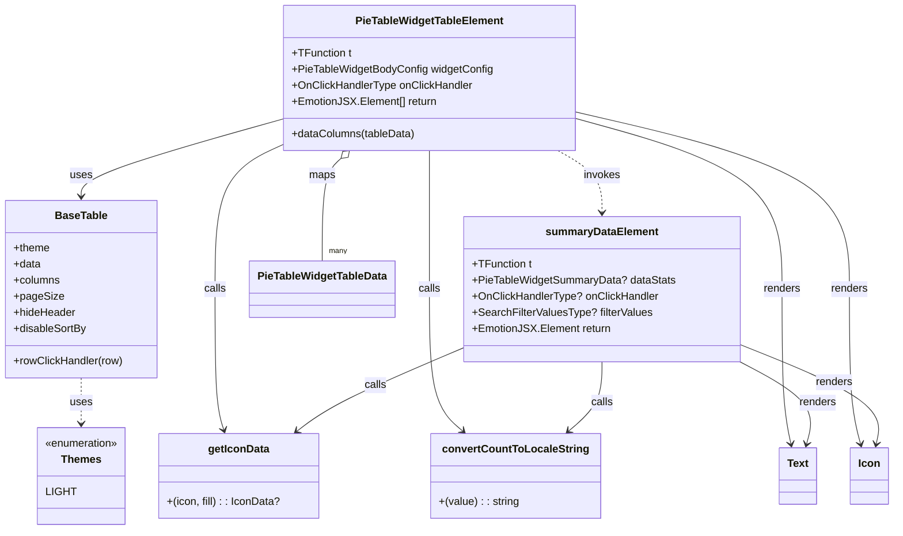

# Diagram: web/portal/src/pages/partview/components/molecules/PieTableWidget/PieTableWidgetTableElement.tsx


> Auto-generated by Obscura crawlers

## Diagram 1



### SVG

<svg id="container" width="1317.037109375" xmlns="http://www.w3.org/2000/svg" class="classDiagram" height="788" viewBox="0 0 1317.037109375 788" role="graphics-document document" aria-roledescription="class"><style>#container{font-family:"trebuchet ms",verdana,arial,sans-serif;font-size:16px;fill:#333;}@keyframes edge-animation-frame{from{stroke-dashoffset:0;}}@keyframes dash{to{stroke-dashoffset:0;}}#container .edge-animation-slow{stroke-dasharray:9,5!important;stroke-dashoffset:900;animation:dash 50s linear infinite;stroke-linecap:round;}#container .edge-animation-fast{stroke-dasharray:9,5!important;stroke-dashoffset:900;animation:dash 20s linear infinite;stroke-linecap:round;}#container .error-icon{fill:#552222;}#container .error-text{fill:#552222;stroke:#552222;}#container .edge-thickness-normal{stroke-width:1px;}#container .edge-thickness-thick{stroke-width:3.5px;}#container .edge-pattern-solid{stroke-dasharray:0;}#container .edge-thickness-invisible{stroke-width:0;fill:none;}#container .edge-pattern-dashed{stroke-dasharray:3;}#container .edge-pattern-dotted{stroke-dasharray:2;}#container .marker{fill:#333333;stroke:#333333;}#container .marker.cross{stroke:#333333;}#container svg{font-family:"trebuchet ms",verdana,arial,sans-serif;font-size:16px;}#container p{margin:0;}#container g.classGroup text{fill:#9370DB;stroke:none;font-family:"trebuchet ms",verdana,arial,sans-serif;font-size:10px;}#container g.classGroup text .title{font-weight:bolder;}#container .nodeLabel,#container .edgeLabel{color:#131300;}#container .edgeLabel .label rect{fill:#ECECFF;}#container .label text{fill:#131300;}#container .labelBkg{background:#ECECFF;}#container .edgeLabel .label span{background:#ECECFF;}#container .classTitle{font-weight:bolder;}#container .node rect,#container .node circle,#container .node ellipse,#container .node polygon,#container .node path{fill:#ECECFF;stroke:#9370DB;stroke-width:1px;}#container .divider{stroke:#9370DB;stroke-width:1;}#container g.clickable{cursor:pointer;}#container g.classGroup rect{fill:#ECECFF;stroke:#9370DB;}#container g.classGroup line{stroke:#9370DB;stroke-width:1;}#container .classLabel .box{stroke:none;stroke-width:0;fill:#ECECFF;opacity:0.5;}#container .classLabel .label{fill:#9370DB;font-size:10px;}#container .relation{stroke:#333333;stroke-width:1;fill:none;}#container .dashed-line{stroke-dasharray:3;}#container .dotted-line{stroke-dasharray:1 2;}#container #compositionStart,#container .composition{fill:#333333!important;stroke:#333333!important;stroke-width:1;}#container #compositionEnd,#container .composition{fill:#333333!important;stroke:#333333!important;stroke-width:1;}#container #dependencyStart,#container .dependency{fill:#333333!important;stroke:#333333!important;stroke-width:1;}#container #dependencyStart,#container .dependency{fill:#333333!important;stroke:#333333!important;stroke-width:1;}#container #extensionStart,#container .extension{fill:transparent!important;stroke:#333333!important;stroke-width:1;}#container #extensionEnd,#container .extension{fill:transparent!important;stroke:#333333!important;stroke-width:1;}#container #aggregationStart,#container .aggregation{fill:transparent!important;stroke:#333333!important;stroke-width:1;}#container #aggregationEnd,#container .aggregation{fill:transparent!important;stroke:#333333!important;stroke-width:1;}#container #lollipopStart,#container .lollipop{fill:#ECECFF!important;stroke:#333333!important;stroke-width:1;}#container #lollipopEnd,#container .lollipop{fill:#ECECFF!important;stroke:#333333!important;stroke-width:1;}#container .edgeTerminals{font-size:11px;line-height:initial;}#container .classTitleText{text-anchor:middle;font-size:18px;fill:#333;}#container .label-icon{display:inline-block;height:1em;overflow:visible;vertical-align:-0.125em;}#container .node .label-icon path{fill:currentColor;stroke:revert;stroke-width:revert;}#container :root{--mermaid-font-family:"trebuchet ms",verdana,arial,sans-serif;}</style><g><defs><marker id="container_class-aggregationStart" class="marker aggregation class" refX="18" refY="7" markerWidth="190" markerHeight="240" orient="auto"><path d="M 18,7 L9,13 L1,7 L9,1 Z"></path></marker></defs><defs><marker id="container_class-aggregationEnd" class="marker aggregation class" refX="1" refY="7" markerWidth="20" markerHeight="28" orient="auto"><path d="M 18,7 L9,13 L1,7 L9,1 Z"></path></marker></defs><defs><marker id="container_class-extensionStart" class="marker extension class" refX="18" refY="7" markerWidth="190" markerHeight="240" orient="auto"><path d="M 1,7 L18,13 V 1 Z"></path></marker></defs><defs><marker id="container_class-extensionEnd" class="marker extension class" refX="1" refY="7" markerWidth="20" markerHeight="28" orient="auto"><path d="M 1,1 V 13 L18,7 Z"></path></marker></defs><defs><marker id="container_class-compositionStart" class="marker composition class" refX="18" refY="7" markerWidth="190" markerHeight="240" orient="auto"><path d="M 18,7 L9,13 L1,7 L9,1 Z"></path></marker></defs><defs><marker id="container_class-compositionEnd" class="marker composition class" refX="1" refY="7" markerWidth="20" markerHeight="28" orient="auto"><path d="M 18,7 L9,13 L1,7 L9,1 Z"></path></marker></defs><defs><marker id="container_class-dependencyStart" class="marker dependency class" refX="6" refY="7" markerWidth="190" markerHeight="240" orient="auto"><path d="M 5,7 L9,13 L1,7 L9,1 Z"></path></marker></defs><defs><marker id="container_class-dependencyEnd" class="marker dependency class" refX="13" refY="7" markerWidth="20" markerHeight="28" orient="auto"><path d="M 18,7 L9,13 L14,7 L9,1 Z"></path></marker></defs><defs><marker id="container_class-lollipopStart" class="marker lollipop class" refX="13" refY="7" markerWidth="190" markerHeight="240" orient="auto"><circle stroke="black" fill="transparent" cx="7" cy="7" r="6"></circle></marker></defs><defs><marker id="container_class-lollipopEnd" class="marker lollipop class" refX="1" refY="7" markerWidth="190" markerHeight="240" orient="auto"><circle stroke="black" fill="transparent" cx="7" cy="7" r="6"></circle></marker></defs><g class="root"><g class="clusters"></g><g class="edgePaths"><path d="M419.479,176.507L369.616,190.589C319.754,204.672,220.029,232.836,170.167,252.085C120.305,271.333,120.305,281.667,120.305,286.833L120.305,292" id="id_PieTableWidgetTableElement_BaseTable_1" class="edge-thickness-normal edge-pattern-solid relation" style=";;;" data-edge="true" data-et="edge" data-id="id_PieTableWidgetTableElement_BaseTable_1" data-points="W3sieCI6NDE5LjQ3ODUxNTYyNSwieSI6MTc2LjUwNzM1OTEyMjkxNTh9LHsieCI6MTIwLjMwNDY4NzUsInkiOjI2MX0seyJ4IjoxMjAuMzA0Njg3NSwieSI6Mjk4fV0=" marker-end="url(#container_class-dependencyEnd)"></path><path d="M419.479,214.911L402.84,222.592C386.201,230.274,352.924,245.637,336.285,281.485C319.646,317.333,319.646,373.667,319.646,430C319.646,486.333,319.646,542.667,321.839,577.549C324.032,612.432,328.418,625.864,330.611,632.58L332.804,639.296" id="id_PieTableWidgetTableElement_getIconData_2" class="edge-thickness-normal edge-pattern-solid relation" style=";;;" data-edge="true" data-et="edge" data-id="id_PieTableWidgetTableElement_getIconData_2" data-points="W3sieCI6NDE5LjQ3ODUxNTYyNSwieSI6MjE0LjkxMDY4ODUyMjk1OTA1fSx7IngiOjMxOS42NDY0ODQzNzUsInkiOjI2MX0seyJ4IjozMTkuNjQ2NDg0Mzc1LCJ5Ijo0MzB9LHsieCI6MzE5LjY0NjQ4NDM3NSwieSI6NTk5fSx7IngiOjMzNC42NjY4NzU3MTY3NDMxLCJ5Ijo2NDV9XQ==" marker-end="url(#container_class-dependencyEnd)"></path><path d="M633.725,224L633.725,230.167C633.725,236.333,633.725,248.667,633.725,283C633.725,317.333,633.725,373.667,633.725,430C633.725,486.333,633.725,542.667,641.901,577.849C650.077,613.031,666.43,627.062,674.606,634.077L682.782,641.093" id="id_PieTableWidgetTableElement_convertCountToLocaleString_3" class="edge-thickness-normal edge-pattern-solid relation" style=";;;" data-edge="true" data-et="edge" data-id="id_PieTableWidgetTableElement_convertCountToLocaleString_3" data-points="W3sieCI6NjMzLjcyNDYwOTM3NSwieSI6MjI0fSx7IngiOjYzMy43MjQ2MDkzNzUsInkiOjI2MX0seyJ4Ijo2MzMuNzI0NjA5Mzc1LCJ5Ijo0MzB9LHsieCI6NjMzLjcyNDYwOTM3NSwieSI6NTk5fSx7IngiOjY4Ny4zMzU3NzYyMzI3OTgxLCJ5Ijo2NDV9XQ==" marker-end="url(#container_class-dependencyEnd)"></path><path d="M847.971,175.805L898.837,190.005C949.704,204.204,1051.437,232.602,1102.303,274.968C1153.17,317.333,1153.17,373.667,1153.17,430C1153.17,486.333,1153.17,542.667,1155.402,581.023C1157.634,619.38,1162.098,639.759,1164.33,649.949L1166.562,660.139" id="id_PieTableWidgetTableElement_Text_4" class="edge-thickness-normal edge-pattern-solid relation" style=";;;" data-edge="true" data-et="edge" data-id="id_PieTableWidgetTableElement_Text_4" data-points="W3sieCI6ODQ3Ljk3MDcwMzEyNSwieSI6MTc1LjgwNTQ5NDE0MTg4ODEyfSx7IngiOjExNTMuMTY5OTIxODc1LCJ5IjoyNjF9LHsieCI6MTE1My4xNjk5MjE4NzUsInkiOjQzMH0seyJ4IjoxMTUzLjE2OTkyMTg3NSwieSI6NTk5fSx7IngiOjExNjcuODQ1MzgwNTkwNTk2MywieSI6NjY2fV0=" marker-end="url(#container_class-dependencyEnd)"></path><path d="M847.971,166.143L915.52,181.953C983.068,197.762,1118.166,229.381,1185.715,273.357C1253.264,317.333,1253.264,373.667,1253.264,430C1253.264,486.333,1253.264,542.667,1255.927,581.032C1258.591,619.398,1263.919,639.796,1266.583,649.996L1269.247,660.195" id="id_PieTableWidgetTableElement_Icon_5" class="edge-thickness-normal edge-pattern-solid relation" style=";;;" data-edge="true" data-et="edge" data-id="id_PieTableWidgetTableElement_Icon_5" data-points="W3sieCI6ODQ3Ljk3MDcwMzEyNSwieSI6MTY2LjE0MzIyMDEzNTkzNzc1fSx7IngiOjEyNTMuMjYzNjcxODc1LCJ5IjoyNjF9LHsieCI6MTI1My4yNjM2NzE4NzUsInkiOjQzMH0seyJ4IjoxMjUzLjI2MzY3MTg3NSwieSI6NTk5fSx7IngiOjEyNzAuNzYyODExNzgzMjU3LCJ5Ijo2NjZ9XQ==" marker-end="url(#container_class-dependencyEnd)"></path><path d="M685.17,516.97L653.317,530.642C621.465,544.313,557.76,571.657,516.93,592.377C476.1,613.098,458.145,627.196,449.168,634.245L440.191,641.295" id="id_summaryDataElement_getIconData_6" class="edge-thickness-normal edge-pattern-solid relation" style=";;;" data-edge="true" data-et="edge" data-id="id_summaryDataElement_getIconData_6" data-points="W3sieCI6Njg1LjE2OTkyMTg3NSwieSI6NTE2Ljk3MDA5MzUwNDMwMzF9LHsieCI6NDk0LjA1NDY4NzUsInkiOjU5OX0seyJ4Ijo0MzUuNDcxNjE2OTcyNDc3MSwieSI6NjQ1fV0=" marker-end="url(#container_class-dependencyEnd)"></path><path d="M887.795,538L887.795,548.167C887.795,558.333,887.795,578.667,879.619,595.849C871.442,613.031,855.09,627.062,846.914,634.077L838.737,641.093" id="id_summaryDataElement_convertCountToLocaleString_7" class="edge-thickness-normal edge-pattern-solid relation" style=";;;" data-edge="true" data-et="edge" data-id="id_summaryDataElement_convertCountToLocaleString_7" data-points="W3sieCI6ODg3Ljc5NDkyMTg3NSwieSI6NTM4fSx7IngiOjg4Ny43OTQ5MjE4NzUsInkiOjU5OX0seyJ4Ijo4MzQuMTgzNzU1MDE3MjAxOSwieSI6NjQ1fV0=" marker-end="url(#container_class-dependencyEnd)"></path><path d="M1090.42,537.78L1109.602,547.983C1128.785,558.186,1167.149,578.593,1183.668,598.996C1200.186,619.398,1194.858,639.796,1192.195,649.996L1189.531,660.195" id="id_summaryDataElement_Text_8" class="edge-thickness-normal edge-pattern-solid relation" style=";;;" data-edge="true" data-et="edge" data-id="id_summaryDataElement_Text_8" data-points="W3sieCI6MTA5MC40MTk5MjE4NzUsInkiOjUzNy43Nzk2NzkzNTQ3NzUyfSx7IngiOjEyMDUuNTEzNjcxODc1LCJ5Ijo1OTl9LHsieCI6MTE4OC4wMTQ1MzE5NjY3NDMsInkiOjY2Nn1d" marker-end="url(#container_class-dependencyEnd)"></path><path d="M1090.42,511.959L1126.285,526.466C1162.149,540.973,1233.878,569.986,1267.511,594.683C1301.144,619.38,1296.68,639.759,1294.448,649.949L1292.216,660.139" id="id_summaryDataElement_Icon_9" class="edge-thickness-normal edge-pattern-solid relation" style=";;;" data-edge="true" data-et="edge" data-id="id_summaryDataElement_Icon_9" data-points="W3sieCI6MTA5MC40MTk5MjE4NzUsInkiOjUxMS45NTkzMTE4OTIyOTYxN30seyJ4IjoxMzA1LjYwNzQyMTg3NSwieSI6NTk5fSx7IngiOjEyOTAuOTMxOTYzMTU5NDAzNywieSI6NjY2fV0=" marker-end="url(#container_class-dependencyEnd)"></path><path d="M120.305,562L120.305,568.167C120.305,574.333,120.305,586.667,120.305,598C120.305,609.333,120.305,619.667,120.305,624.833L120.305,630" id="id_BaseTable_Themes_10" class="edge-thickness-normal edge-pattern-dashed relation" style=";;;" data-edge="true" data-et="edge" data-id="id_BaseTable_Themes_10" data-points="W3sieCI6MTIwLjMwNDY4NzUsInkiOjU2Mn0seyJ4IjoxMjAuMzA0Njg3NSwieSI6NTk5fSx7IngiOjEyMC4zMDQ2ODc1LCJ5Ijo2MzZ9XQ==" marker-end="url(#container_class-dependencyEnd)"></path><path d="M504.084,235.702L499.517,239.918C494.951,244.135,485.818,252.567,481.252,277.95C476.686,303.333,476.686,345.667,476.686,366.833L476.686,388" id="id_PieTableWidgetTableElement_PieTableWidgetTableData_11" class="edge-thickness-normal edge-pattern-solid relation" style=";;;" data-edge="true" data-et="edge" data-id="id_PieTableWidgetTableElement_PieTableWidgetTableData_11" data-points="W3sieCI6NTE2Ljc1NzU4MzUxMjkzMSwieSI6MjI0fSx7IngiOjQ3Ni42ODU1NDY4NzUsInkiOjI2MX0seyJ4Ijo0NzYuNjg1NTQ2ODc1LCJ5IjozODh9XQ==" marker-start="url(#container_class-aggregationStart)"></path><path d="M822.963,224L833.768,230.167C844.574,236.333,866.184,248.667,876.99,264C887.795,279.333,887.795,297.667,887.795,306.833L887.795,316" id="id_PieTableWidgetTableElement_summaryDataElement_12" class="edge-thickness-normal edge-pattern-dashed relation" style=";;;" data-edge="true" data-et="edge" data-id="id_PieTableWidgetTableElement_summaryDataElement_12" data-points="W3sieCI6ODIyLjk2MzE4Njk2MTIwNjksInkiOjIyNH0seyJ4Ijo4ODcuNzk0OTIxODc1LCJ5IjoyNjF9LHsieCI6ODg3Ljc5NDkyMTg3NSwieSI6MzIyfV0=" marker-end="url(#container_class-dependencyEnd)"></path></g><g class="edgeLabels"><g class="edgeLabel" transform="translate(120.3046875, 261)"><g class="label" data-id="id_PieTableWidgetTableElement_BaseTable_1" transform="translate(-16.4921875, -12)"><foreignObject width="32.984375" height="24"><div xmlns="http://www.w3.org/1999/xhtml" class="labelBkg" style="display: table-cell; white-space: nowrap; line-height: 1.5; max-width: 200px; text-align: center;"><span class="edgeLabel"><p>uses</p></span></div></foreignObject></g></g><g class="edgeLabel" transform="translate(319.646484375, 430)"><g class="label" data-id="id_PieTableWidgetTableElement_getIconData_2" transform="translate(-16.4453125, -12)"><foreignObject width="32.890625" height="24"><div xmlns="http://www.w3.org/1999/xhtml" class="labelBkg" style="display: table-cell; white-space: nowrap; line-height: 1.5; max-width: 200px; text-align: center;"><span class="edgeLabel"><p>calls</p></span></div></foreignObject></g></g><g class="edgeLabel" transform="translate(633.724609375, 430)"><g class="label" data-id="id_PieTableWidgetTableElement_convertCountToLocaleString_3" transform="translate(-16.4453125, -12)"><foreignObject width="32.890625" height="24"><div xmlns="http://www.w3.org/1999/xhtml" class="labelBkg" style="display: table-cell; white-space: nowrap; line-height: 1.5; max-width: 200px; text-align: center;"><span class="edgeLabel"><p>calls</p></span></div></foreignObject></g></g><g class="edgeLabel" transform="translate(1153.169921875, 430)"><g class="label" data-id="id_PieTableWidgetTableElement_Text_4" transform="translate(-27.75, -12)"><foreignObject width="55.5" height="24"><div xmlns="http://www.w3.org/1999/xhtml" class="labelBkg" style="display: table-cell; white-space: nowrap; line-height: 1.5; max-width: 200px; text-align: center;"><span class="edgeLabel"><p>renders</p></span></div></foreignObject></g></g><g class="edgeLabel" transform="translate(1253.263671875, 430)"><g class="label" data-id="id_PieTableWidgetTableElement_Icon_5" transform="translate(-27.75, -12)"><foreignObject width="55.5" height="24"><div xmlns="http://www.w3.org/1999/xhtml" class="labelBkg" style="display: table-cell; white-space: nowrap; line-height: 1.5; max-width: 200px; text-align: center;"><span class="edgeLabel"><p>renders</p></span></div></foreignObject></g></g><g class="edgeLabel" transform="translate(555.38917, 572.6742)"><g class="label" data-id="id_summaryDataElement_getIconData_6" transform="translate(-16.4453125, -12)"><foreignObject width="32.890625" height="24"><div xmlns="http://www.w3.org/1999/xhtml" class="labelBkg" style="display: table-cell; white-space: nowrap; line-height: 1.5; max-width: 200px; text-align: center;"><span class="edgeLabel"><p>calls</p></span></div></foreignObject></g></g><g class="edgeLabel" transform="translate(887.794921875, 599)"><g class="label" data-id="id_summaryDataElement_convertCountToLocaleString_7" transform="translate(-16.4453125, -12)"><foreignObject width="32.890625" height="24"><div xmlns="http://www.w3.org/1999/xhtml" class="labelBkg" style="display: table-cell; white-space: nowrap; line-height: 1.5; max-width: 200px; text-align: center;"><span class="edgeLabel"><p>calls</p></span></div></foreignObject></g></g><g class="edgeLabel" transform="translate(1205.513671875, 599)"><g class="label" data-id="id_summaryDataElement_Text_8" transform="translate(-27.75, -12)"><foreignObject width="55.5" height="24"><div xmlns="http://www.w3.org/1999/xhtml" class="labelBkg" style="display: table-cell; white-space: nowrap; line-height: 1.5; max-width: 200px; text-align: center;"><span class="edgeLabel"><p>renders</p></span></div></foreignObject></g></g><g class="edgeLabel" transform="translate(1229.8056, 568.3391)"><g class="label" data-id="id_summaryDataElement_Icon_9" transform="translate(-27.75, -12)"><foreignObject width="55.5" height="24"><div xmlns="http://www.w3.org/1999/xhtml" class="labelBkg" style="display: table-cell; white-space: nowrap; line-height: 1.5; max-width: 200px; text-align: center;"><span class="edgeLabel"><p>renders</p></span></div></foreignObject></g></g><g class="edgeLabel" transform="translate(120.3046875, 599)"><g class="label" data-id="id_BaseTable_Themes_10" transform="translate(-16.4921875, -12)"><foreignObject width="32.984375" height="24"><div xmlns="http://www.w3.org/1999/xhtml" class="labelBkg" style="display: table-cell; white-space: nowrap; line-height: 1.5; max-width: 200px; text-align: center;"><span class="edgeLabel"><p>uses</p></span></div></foreignObject></g></g><g class="edgeLabel" transform="translate(476.685546875, 261)"><g class="label" data-id="id_PieTableWidgetTableElement_PieTableWidgetTableData_11" transform="translate(-19.703125, -12)"><foreignObject width="39.40625" height="24"><div xmlns="http://www.w3.org/1999/xhtml" class="labelBkg" style="display: table-cell; white-space: nowrap; line-height: 1.5; max-width: 200px; text-align: center;"><span class="edgeLabel"><p>maps</p></span></div></foreignObject></g></g><g class="edgeLabel" transform="translate(887.794921875, 261)"><g class="label" data-id="id_PieTableWidgetTableElement_summaryDataElement_12" transform="translate(-27.5859375, -12)"><foreignObject width="55.171875" height="24"><div xmlns="http://www.w3.org/1999/xhtml" class="labelBkg" style="display: table-cell; white-space: nowrap; line-height: 1.5; max-width: 200px; text-align: center;"><span class="edgeLabel"><p>invokes</p></span></div></foreignObject></g></g><g class="edgeTerminals" transform="translate(486.6855484374999, 365.5000013392857)"><g class="inner" transform="translate(0, 0)"></g><foreignObject style="width: 36px; height: 12px;"><div xmlns="http://www.w3.org/1999/xhtml" style="display: inline-block; padding-right: 1px; white-space: nowrap;"><span class="edgeLabel">many</span></div></foreignObject></g></g><g class="nodes"><g class="node default" id="classId-PieTableWidgetTableElement-0" transform="translate(633.724609375, 116)"><g class="basic label-container"><path d="M-214.24609375 -108 L214.24609375 -108 L214.24609375 108 L-214.24609375 108" stroke="none" stroke-width="0" fill="#ECECFF" style=""></path><path d="M-214.24609375 -108 C-76.9201936330173 -108, 60.40570648396539 -108, 214.24609375 -108 M-214.24609375 -108 C-59.512341487427165 -108, 95.22141077514567 -108, 214.24609375 -108 M214.24609375 -108 C214.24609375 -61.58211869408621, 214.24609375 -15.164237388172424, 214.24609375 108 M214.24609375 -108 C214.24609375 -28.191905799053615, 214.24609375 51.61618840189277, 214.24609375 108 M214.24609375 108 C106.71261452525988 108, -0.8208646994802393 108, -214.24609375 108 M214.24609375 108 C72.79147679608937 108, -68.66314015782126 108, -214.24609375 108 M-214.24609375 108 C-214.24609375 49.65306197361202, -214.24609375 -8.693876052775963, -214.24609375 -108 M-214.24609375 108 C-214.24609375 31.19991188063699, -214.24609375 -45.60017623872602, -214.24609375 -108" stroke="#9370DB" stroke-width="1.3" fill="none" stroke-dasharray="0 0" style=""></path></g><g class="annotation-group text" transform="translate(0, -84)"></g><g class="label-group text" transform="translate(-106.4765625, -84)"><g class="label" style="font-weight: bolder" transform="translate(0,-12)"><foreignObject width="212.953125" height="24"><div xmlns="http://www.w3.org/1999/xhtml" style="display: table-cell; white-space: nowrap; line-height: 1.5; max-width: 260px; text-align: center;"><span class="nodeLabel markdown-node-label" style=""><p>PieTableWidgetTableElement</p></span></div></foreignObject></g></g><g class="members-group text" transform="translate(-202.24609375, -36)"><g class="label" style="" transform="translate(0,-12)"><foreignObject width="88.09375" height="24"><div xmlns="http://www.w3.org/1999/xhtml" style="display: table-cell; white-space: nowrap; line-height: 1.5; max-width: 146px; text-align: center;"><span class="nodeLabel markdown-node-label" style=""><p>+TFunction t</p></span></div></foreignObject></g><g class="label" style="" transform="translate(0,12)"><foreignObject width="298.015625" height="24"><div xmlns="http://www.w3.org/1999/xhtml" style="display: table-cell; white-space: nowrap; line-height: 1.5; max-width: 356px; text-align: center;"><span class="nodeLabel markdown-node-label" style=""><p>+PieTableWidgetBodyConfig widgetConfig</p></span></div></foreignObject></g><g class="label" style="" transform="translate(0,36)"><foreignObject width="268.875" height="24"><div xmlns="http://www.w3.org/1999/xhtml" style="display: table-cell; white-space: nowrap; line-height: 1.5; max-width: 327px; text-align: center;"><span class="nodeLabel markdown-node-label" style=""><p>+OnClickHandlerType onClickHandler</p></span></div></foreignObject></g><g class="label" style="" transform="translate(0,60)"><foreignObject width="213.390625" height="24"><div xmlns="http://www.w3.org/1999/xhtml" style="display: table-cell; white-space: nowrap; line-height: 1.5; max-width: 271px; text-align: center;"><span class="nodeLabel markdown-node-label" style=""><p>+EmotionJSX.Element[] return</p></span></div></foreignObject></g></g><g class="methods-group text" transform="translate(-202.24609375, 84)"><g class="label" style="" transform="translate(0,-12)"><foreignObject width="183.953125" height="24"><div xmlns="http://www.w3.org/1999/xhtml" style="display: table-cell; white-space: nowrap; line-height: 1.5; max-width: 241px; text-align: center;"><span class="nodeLabel markdown-node-label" style=""><p>+dataColumns(tableData)</p></span></div></foreignObject></g></g><g class="divider" style=""><path d="M-214.24609375 -60 C-52.006884316309964 -60, 110.23232511738007 -60, 214.24609375 -60 M-214.24609375 -60 C-113.20017051258796 -60, -12.15424727517592 -60, 214.24609375 -60" stroke="#9370DB" stroke-width="1.3" fill="none" stroke-dasharray="0 0" style=""></path></g><g class="divider" style=""><path d="M-214.24609375 60 C-100.85362594385475 60, 12.538841862290496 60, 214.24609375 60 M-214.24609375 60 C-93.24016255330375 60, 27.765768643392505 60, 214.24609375 60" stroke="#9370DB" stroke-width="1.3" fill="none" stroke-dasharray="0 0" style=""></path></g></g><g class="node default" id="classId-summaryDataElement-1" transform="translate(887.794921875, 430)"><g class="basic label-container"><path d="M-202.625 -108 L202.625 -108 L202.625 108 L-202.625 108" stroke="none" stroke-width="0" fill="#ECECFF" style=""></path><path d="M-202.625 -108 C-77.17591470617946 -108, 48.27317058764109 -108, 202.625 -108 M-202.625 -108 C-41.82136248388488 -108, 118.98227503223023 -108, 202.625 -108 M202.625 -108 C202.625 -37.21831295133862, 202.625 33.563374097322765, 202.625 108 M202.625 -108 C202.625 -35.268365930644535, 202.625 37.46326813871093, 202.625 108 M202.625 108 C41.509833857033925 108, -119.60533228593215 108, -202.625 108 M202.625 108 C70.87302326748414 108, -60.878953465031714 108, -202.625 108 M-202.625 108 C-202.625 32.01286249085466, -202.625 -43.97427501829068, -202.625 -108 M-202.625 108 C-202.625 40.34298871169926, -202.625 -27.314022576601474, -202.625 -108" stroke="#9370DB" stroke-width="1.3" fill="none" stroke-dasharray="0 0" style=""></path></g><g class="annotation-group text" transform="translate(0, -84)"></g><g class="label-group text" transform="translate(-80.359375, -84)"><g class="label" style="font-weight: bolder" transform="translate(0,-12)"><foreignObject width="160.71875" height="24"><div xmlns="http://www.w3.org/1999/xhtml" style="display: table-cell; white-space: nowrap; line-height: 1.5; max-width: 210px; text-align: center;"><span class="nodeLabel markdown-node-label" style=""><p>summaryDataElement</p></span></div></foreignObject></g></g><g class="members-group text" transform="translate(-190.625, -36)"><g class="label" style="" transform="translate(0,-12)"><foreignObject width="88.09375" height="24"><div xmlns="http://www.w3.org/1999/xhtml" style="display: table-cell; white-space: nowrap; line-height: 1.5; max-width: 146px; text-align: center;"><span class="nodeLabel markdown-node-label" style=""><p>+TFunction t</p></span></div></foreignObject></g><g class="label" style="" transform="translate(0,12)"><foreignObject width="300.890625" height="24"><div xmlns="http://www.w3.org/1999/xhtml" style="display: table-cell; white-space: nowrap; line-height: 1.5; max-width: 358px; text-align: center;"><span class="nodeLabel markdown-node-label" style=""><p>+PieTableWidgetSummaryData? dataStats</p></span></div></foreignObject></g><g class="label" style="" transform="translate(0,36)"><foreignObject width="275.578125" height="24"><div xmlns="http://www.w3.org/1999/xhtml" style="display: table-cell; white-space: nowrap; line-height: 1.5; max-width: 334px; text-align: center;"><span class="nodeLabel markdown-node-label" style=""><p>+OnClickHandlerType? onClickHandler</p></span></div></foreignObject></g><g class="label" style="" transform="translate(0,60)"><foreignObject width="265.953125" height="24"><div xmlns="http://www.w3.org/1999/xhtml" style="display: table-cell; white-space: nowrap; line-height: 1.5; max-width: 323px; text-align: center;"><span class="nodeLabel markdown-node-label" style=""><p>+SearchFilterValuesType? filterValues</p></span></div></foreignObject></g><g class="label" style="" transform="translate(0,84)"><foreignObject width="203.078125" height="24"><div xmlns="http://www.w3.org/1999/xhtml" style="display: table-cell; white-space: nowrap; line-height: 1.5; max-width: 260px; text-align: center;"><span class="nodeLabel markdown-node-label" style=""><p>+EmotionJSX.Element return</p></span></div></foreignObject></g></g><g class="methods-group text" transform="translate(-190.625, 108)"></g><g class="divider" style=""><path d="M-202.625 -60 C-121.51649090033783 -60, -40.40798180067566 -60, 202.625 -60 M-202.625 -60 C-103.79858470296415 -60, -4.972169405928298 -60, 202.625 -60" stroke="#9370DB" stroke-width="1.3" fill="none" stroke-dasharray="0 0" style=""></path></g><g class="divider" style=""><path d="M-202.625 84 C-90.52862241837772 84, 21.567755163244556 84, 202.625 84 M-202.625 84 C-59.74884979310312 84, 83.12730041379376 84, 202.625 84" stroke="#9370DB" stroke-width="1.3" fill="none" stroke-dasharray="0 0" style=""></path></g></g><g class="node default" id="classId-BaseTable-2" transform="translate(120.3046875, 430)"><g class="basic label-container"><path d="M-112.3046875 -132 L112.3046875 -132 L112.3046875 132 L-112.3046875 132" stroke="none" stroke-width="0" fill="#ECECFF" style=""></path><path d="M-112.3046875 -132 C-44.33717428165561 -132, 23.630338936688787 -132, 112.3046875 -132 M-112.3046875 -132 C-49.29022742498865 -132, 13.7242326500227 -132, 112.3046875 -132 M112.3046875 -132 C112.3046875 -75.70914653369779, 112.3046875 -19.41829306739558, 112.3046875 132 M112.3046875 -132 C112.3046875 -54.33898311479878, 112.3046875 23.32203377040244, 112.3046875 132 M112.3046875 132 C25.128352590355348 132, -62.047982319289304 132, -112.3046875 132 M112.3046875 132 C32.81471543992464 132, -46.67525662015072 132, -112.3046875 132 M-112.3046875 132 C-112.3046875 57.70632609591827, -112.3046875 -16.587347808163457, -112.3046875 -132 M-112.3046875 132 C-112.3046875 34.33715248633871, -112.3046875 -63.32569502732258, -112.3046875 -132" stroke="#9370DB" stroke-width="1.3" fill="none" stroke-dasharray="0 0" style=""></path></g><g class="annotation-group text" transform="translate(0, -108)"></g><g class="label-group text" transform="translate(-37.359375, -108)"><g class="label" style="font-weight: bolder" transform="translate(0,-12)"><foreignObject width="74.71875" height="24"><div xmlns="http://www.w3.org/1999/xhtml" style="display: table-cell; white-space: nowrap; line-height: 1.5; max-width: 123px; text-align: center;"><span class="nodeLabel markdown-node-label" style=""><p>BaseTable</p></span></div></foreignObject></g></g><g class="members-group text" transform="translate(-100.3046875, -60)"><g class="label" style="" transform="translate(0,-12)"><foreignObject width="54.21875" height="24"><div xmlns="http://www.w3.org/1999/xhtml" style="display: table-cell; white-space: nowrap; line-height: 1.5; max-width: 112px; text-align: center;"><span class="nodeLabel markdown-node-label" style=""><p>+theme</p></span></div></foreignObject></g><g class="label" style="" transform="translate(0,12)"><foreignObject width="40.625" height="24"><div xmlns="http://www.w3.org/1999/xhtml" style="display: table-cell; white-space: nowrap; line-height: 1.5; max-width: 98px; text-align: center;"><span class="nodeLabel markdown-node-label" style=""><p>+data</p></span></div></foreignObject></g><g class="label" style="" transform="translate(0,36)"><foreignObject width="69.21875" height="24"><div xmlns="http://www.w3.org/1999/xhtml" style="display: table-cell; white-space: nowrap; line-height: 1.5; max-width: 127px; text-align: center;"><span class="nodeLabel markdown-node-label" style=""><p>+columns</p></span></div></foreignObject></g><g class="label" style="" transform="translate(0,60)"><foreignObject width="71.5" height="24"><div xmlns="http://www.w3.org/1999/xhtml" style="display: table-cell; white-space: nowrap; line-height: 1.5; max-width: 129px; text-align: center;"><span class="nodeLabel markdown-node-label" style=""><p>+pageSize</p></span></div></foreignObject></g><g class="label" style="" transform="translate(0,84)"><foreignObject width="92.78125" height="24"><div xmlns="http://www.w3.org/1999/xhtml" style="display: table-cell; white-space: nowrap; line-height: 1.5; max-width: 151px; text-align: center;"><span class="nodeLabel markdown-node-label" style=""><p>+hideHeader</p></span></div></foreignObject></g><g class="label" style="" transform="translate(0,108)"><foreignObject width="108.53125" height="24"><div xmlns="http://www.w3.org/1999/xhtml" style="display: table-cell; white-space: nowrap; line-height: 1.5; max-width: 166px; text-align: center;"><span class="nodeLabel markdown-node-label" style=""><p>+disableSortBy</p></span></div></foreignObject></g></g><g class="methods-group text" transform="translate(-100.3046875, 108)"><g class="label" style="" transform="translate(0,-12)"><foreignObject width="163.25" height="24"><div xmlns="http://www.w3.org/1999/xhtml" style="display: table-cell; white-space: nowrap; line-height: 1.5; max-width: 221px; text-align: center;"><span class="nodeLabel markdown-node-label" style=""><p>+rowClickHandler(row)</p></span></div></foreignObject></g></g><g class="divider" style=""><path d="M-112.3046875 -84 C-41.04129125292597 -84, 30.222104994148054 -84, 112.3046875 -84 M-112.3046875 -84 C-30.009907550194725 -84, 52.28487239961055 -84, 112.3046875 -84" stroke="#9370DB" stroke-width="1.3" fill="none" stroke-dasharray="0 0" style=""></path></g><g class="divider" style=""><path d="M-112.3046875 84 C-46.85594492851524 84, 18.592797642969515 84, 112.3046875 84 M-112.3046875 84 C-25.524771598435137 84, 61.255144303129725 84, 112.3046875 84" stroke="#9370DB" stroke-width="1.3" fill="none" stroke-dasharray="0 0" style=""></path></g></g><g class="node default" id="classId-getIconData-3" transform="translate(355.23828125, 708)"><g class="basic label-container"><path d="M-117.37890625 -63 L117.37890625 -63 L117.37890625 63 L-117.37890625 63" stroke="none" stroke-width="0" fill="#ECECFF" style=""></path><path d="M-117.37890625 -63 C-56.73519455227656 -63, 3.9085171454468792 -63, 117.37890625 -63 M-117.37890625 -63 C-60.46264218823969 -63, -3.5463781264793823 -63, 117.37890625 -63 M117.37890625 -63 C117.37890625 -14.734959068715803, 117.37890625 33.530081862568395, 117.37890625 63 M117.37890625 -63 C117.37890625 -12.798429393388858, 117.37890625 37.403141213222284, 117.37890625 63 M117.37890625 63 C28.84875643066441 63, -59.68139338867118 63, -117.37890625 63 M117.37890625 63 C31.386033768953 63, -54.606838712094 63, -117.37890625 63 M-117.37890625 63 C-117.37890625 35.509269931091346, -117.37890625 8.018539862182692, -117.37890625 -63 M-117.37890625 63 C-117.37890625 17.890123513833515, -117.37890625 -27.21975297233297, -117.37890625 -63" stroke="#9370DB" stroke-width="1.3" fill="none" stroke-dasharray="0 0" style=""></path></g><g class="annotation-group text" transform="translate(0, -39)"></g><g class="label-group text" transform="translate(-43.9296875, -39)"><g class="label" style="font-weight: bolder" transform="translate(0,-12)"><foreignObject width="87.859375" height="24"><div xmlns="http://www.w3.org/1999/xhtml" style="display: table-cell; white-space: nowrap; line-height: 1.5; max-width: 137px; text-align: center;"><span class="nodeLabel markdown-node-label" style=""><p>getIconData</p></span></div></foreignObject></g></g><g class="members-group text" transform="translate(-105.37890625, 9)"></g><g class="methods-group text" transform="translate(-105.37890625, 39)"><g class="label" style="" transform="translate(0,-12)"><foreignObject width="166.828125" height="24"><div xmlns="http://www.w3.org/1999/xhtml" style="display: table-cell; white-space: nowrap; line-height: 1.5; max-width: 217px; text-align: center;"><span class="nodeLabel markdown-node-label" style=""><p>+(icon, fill) : : IconData?</p></span></div></foreignObject></g></g><g class="divider" style=""><path d="M-117.37890625 -15 C-69.91699837900325 -15, -22.455090508006492 -15, 117.37890625 -15 M-117.37890625 -15 C-41.826814945323875 -15, 33.72527635935225 -15, 117.37890625 -15" stroke="#9370DB" stroke-width="1.3" fill="none" stroke-dasharray="0 0" style=""></path></g><g class="divider" style=""><path d="M-117.37890625 9 C-51.942801276256844 9, 13.493303697486311 9, 117.37890625 9 M-117.37890625 9 C-23.794344568163567 9, 69.79021711367287 9, 117.37890625 9" stroke="#9370DB" stroke-width="1.3" fill="none" stroke-dasharray="0 0" style=""></path></g></g><g class="node default" id="classId-convertCountToLocaleString-4" transform="translate(760.759765625, 708)"><g class="basic label-container"><path d="M-123.20703125 -63 L123.20703125 -63 L123.20703125 63 L-123.20703125 63" stroke="none" stroke-width="0" fill="#ECECFF" style=""></path><path d="M-123.20703125 -63 C-26.521403670695094 -63, 70.16422390860981 -63, 123.20703125 -63 M-123.20703125 -63 C-69.44008710832507 -63, -15.673142966650147 -63, 123.20703125 -63 M123.20703125 -63 C123.20703125 -37.780446370592585, 123.20703125 -12.560892741185164, 123.20703125 63 M123.20703125 -63 C123.20703125 -19.70712979651597, 123.20703125 23.585740406968057, 123.20703125 63 M123.20703125 63 C58.80157133855265 63, -5.603888572894704 63, -123.20703125 63 M123.20703125 63 C31.44148346988561 63, -60.32406431022878 63, -123.20703125 63 M-123.20703125 63 C-123.20703125 16.80624128114779, -123.20703125 -29.387517437704417, -123.20703125 -63 M-123.20703125 63 C-123.20703125 15.506752142538268, -123.20703125 -31.986495714923464, -123.20703125 -63" stroke="#9370DB" stroke-width="1.3" fill="none" stroke-dasharray="0 0" style=""></path></g><g class="annotation-group text" transform="translate(0, -39)"></g><g class="label-group text" transform="translate(-103.1484375, -39)"><g class="label" style="font-weight: bolder" transform="translate(0,-12)"><foreignObject width="206.296875" height="24"><div xmlns="http://www.w3.org/1999/xhtml" style="display: table-cell; white-space: nowrap; line-height: 1.5; max-width: 253px; text-align: center;"><span class="nodeLabel markdown-node-label" style=""><p>convertCountToLocaleString</p></span></div></foreignObject></g></g><g class="members-group text" transform="translate(-111.20703125, 9)"></g><g class="methods-group text" transform="translate(-111.20703125, 39)"><g class="label" style="" transform="translate(0,-12)"><foreignObject width="119.265625" height="24"><div xmlns="http://www.w3.org/1999/xhtml" style="display: table-cell; white-space: nowrap; line-height: 1.5; max-width: 170px; text-align: center;"><span class="nodeLabel markdown-node-label" style=""><p>+(value) : : string</p></span></div></foreignObject></g></g><g class="divider" style=""><path d="M-123.20703125 -15 C-71.65691185996542 -15, -20.106792469930824 -15, 123.20703125 -15 M-123.20703125 -15 C-73.51588623350202 -15, -23.824741217004018 -15, 123.20703125 -15" stroke="#9370DB" stroke-width="1.3" fill="none" stroke-dasharray="0 0" style=""></path></g><g class="divider" style=""><path d="M-123.20703125 9 C-36.06900595807505 9, 51.069019333849894 9, 123.20703125 9 M-123.20703125 9 C-25.735686823049306 9, 71.73565760390139 9, 123.20703125 9" stroke="#9370DB" stroke-width="1.3" fill="none" stroke-dasharray="0 0" style=""></path></g></g><g class="node default" id="classId-Text-5" transform="translate(1177.044921875, 708)"><g class="basic label-container"><path d="M-27.3828125 -42 L27.3828125 -42 L27.3828125 42 L-27.3828125 42" stroke="none" stroke-width="0" fill="#ECECFF" style=""></path><path d="M-27.3828125 -42 C-14.448928115305108 -42, -1.5150437306102162 -42, 27.3828125 -42 M-27.3828125 -42 C-10.43325118913291 -42, 6.516310121734179 -42, 27.3828125 -42 M27.3828125 -42 C27.3828125 -25.08898625817714, 27.3828125 -8.17797251635428, 27.3828125 42 M27.3828125 -42 C27.3828125 -9.416319781573186, 27.3828125 23.167360436853627, 27.3828125 42 M27.3828125 42 C7.679913645919953 42, -12.022985208160094 42, -27.3828125 42 M27.3828125 42 C11.816667149556327 42, -3.7494782008873457 42, -27.3828125 42 M-27.3828125 42 C-27.3828125 18.651004406378124, -27.3828125 -4.697991187243751, -27.3828125 -42 M-27.3828125 42 C-27.3828125 9.089273433926849, -27.3828125 -23.821453132146303, -27.3828125 -42" stroke="#9370DB" stroke-width="1.3" fill="none" stroke-dasharray="0 0" style=""></path></g><g class="annotation-group text" transform="translate(0, -18)"></g><g class="label-group text" transform="translate(-15.3828125, -18)"><g class="label" style="font-weight: bolder" transform="translate(0,-12)"><foreignObject width="30.765625" height="24"><div xmlns="http://www.w3.org/1999/xhtml" style="display: table-cell; white-space: nowrap; line-height: 1.5; max-width: 80px; text-align: center;"><span class="nodeLabel markdown-node-label" style=""><p>Text</p></span></div></foreignObject></g></g><g class="members-group text" transform="translate(-15.3828125, 30)"></g><g class="methods-group text" transform="translate(-15.3828125, 60)"></g><g class="divider" style=""><path d="M-27.3828125 6 C-9.23223017308904 6, 8.918352153821921 6, 27.3828125 6 M-27.3828125 6 C-6.058405921826573 6, 15.266000656346854 6, 27.3828125 6" stroke="#9370DB" stroke-width="1.3" fill="none" stroke-dasharray="0 0" style=""></path></g><g class="divider" style=""><path d="M-27.3828125 24 C-10.705941675540156 24, 5.970929148919687 24, 27.3828125 24 M-27.3828125 24 C-14.951101132045496 24, -2.5193897640909917 24, 27.3828125 24" stroke="#9370DB" stroke-width="1.3" fill="none" stroke-dasharray="0 0" style=""></path></g></g><g class="node default" id="classId-Icon-6" transform="translate(1281.732421875, 708)"><g class="basic label-container"><path d="M-27.3046875 -42 L27.3046875 -42 L27.3046875 42 L-27.3046875 42" stroke="none" stroke-width="0" fill="#ECECFF" style=""></path><path d="M-27.3046875 -42 C-12.2779999546537 -42, 2.748687590692601 -42, 27.3046875 -42 M-27.3046875 -42 C-7.026931215750867 -42, 13.250825068498266 -42, 27.3046875 -42 M27.3046875 -42 C27.3046875 -12.861793577632746, 27.3046875 16.27641284473451, 27.3046875 42 M27.3046875 -42 C27.3046875 -16.038058868280054, 27.3046875 9.923882263439893, 27.3046875 42 M27.3046875 42 C6.385210975311381 42, -14.534265549377238 42, -27.3046875 42 M27.3046875 42 C11.955121428891248 42, -3.394444642217504 42, -27.3046875 42 M-27.3046875 42 C-27.3046875 19.951718526762125, -27.3046875 -2.09656294647575, -27.3046875 -42 M-27.3046875 42 C-27.3046875 13.521173130433422, -27.3046875 -14.957653739133157, -27.3046875 -42" stroke="#9370DB" stroke-width="1.3" fill="none" stroke-dasharray="0 0" style=""></path></g><g class="annotation-group text" transform="translate(0, -18)"></g><g class="label-group text" transform="translate(-15.3046875, -18)"><g class="label" style="font-weight: bolder" transform="translate(0,-12)"><foreignObject width="30.609375" height="24"><div xmlns="http://www.w3.org/1999/xhtml" style="display: table-cell; white-space: nowrap; line-height: 1.5; max-width: 81px; text-align: center;"><span class="nodeLabel markdown-node-label" style=""><p>Icon</p></span></div></foreignObject></g></g><g class="members-group text" transform="translate(-15.3046875, 30)"></g><g class="methods-group text" transform="translate(-15.3046875, 60)"></g><g class="divider" style=""><path d="M-27.3046875 6 C-12.635521818580045 6, 2.0336438628399094 6, 27.3046875 6 M-27.3046875 6 C-8.055260362541592 6, 11.194166774916816 6, 27.3046875 6" stroke="#9370DB" stroke-width="1.3" fill="none" stroke-dasharray="0 0" style=""></path></g><g class="divider" style=""><path d="M-27.3046875 24 C-8.637717269774484 24, 10.029252960451032 24, 27.3046875 24 M-27.3046875 24 C-14.00825999731026 24, -0.7118324946205199 24, 27.3046875 24" stroke="#9370DB" stroke-width="1.3" fill="none" stroke-dasharray="0 0" style=""></path></g></g><g class="node default" id="classId-Themes-7" transform="translate(120.3046875, 708)"><g class="basic label-container"><path d="M-67.5546875 -72 L67.5546875 -72 L67.5546875 72 L-67.5546875 72" stroke="none" stroke-width="0" fill="#ECECFF" style=""></path><path d="M-67.5546875 -72 C-14.84808955143317 -72, 37.85850839713366 -72, 67.5546875 -72 M-67.5546875 -72 C-13.91965003156843 -72, 39.71538743686314 -72, 67.5546875 -72 M67.5546875 -72 C67.5546875 -40.800133092194066, 67.5546875 -9.600266184388133, 67.5546875 72 M67.5546875 -72 C67.5546875 -16.124742760689053, 67.5546875 39.750514478621895, 67.5546875 72 M67.5546875 72 C33.27292556400919 72, -1.0088363719816158 72, -67.5546875 72 M67.5546875 72 C27.0959774080955 72, -13.362732683809 72, -67.5546875 72 M-67.5546875 72 C-67.5546875 28.209683086012703, -67.5546875 -15.580633827974594, -67.5546875 -72 M-67.5546875 72 C-67.5546875 14.932667068411988, -67.5546875 -42.134665863176025, -67.5546875 -72" stroke="#9370DB" stroke-width="1.3" fill="none" stroke-dasharray="0 0" style=""></path></g><g class="annotation-group text" transform="translate(-55.5546875, -48)"><g class="label" style="" transform="translate(0,-12)"><foreignObject width="111.109375" height="24"><div xmlns="http://www.w3.org/1999/xhtml" style="display: table-cell; white-space: nowrap; line-height: 1.5; max-width: 161px; text-align: center;"><span class="nodeLabel markdown-node-label" style=""><p>«enumeration»</p></span></div></foreignObject></g></g><g class="label-group text" transform="translate(-28.3984375, -24)"><g class="label" style="font-weight: bolder" transform="translate(0,-12)"><foreignObject width="56.796875" height="24"><div xmlns="http://www.w3.org/1999/xhtml" style="display: table-cell; white-space: nowrap; line-height: 1.5; max-width: 106px; text-align: center;"><span class="nodeLabel markdown-node-label" style=""><p>Themes</p></span></div></foreignObject></g></g><g class="members-group text" transform="translate(-55.5546875, 24)"><g class="label" style="" transform="translate(0,-12)"><foreignObject width="41.9375" height="24"><div xmlns="http://www.w3.org/1999/xhtml" style="display: table-cell; white-space: nowrap; line-height: 1.5; max-width: 93px; text-align: center;"><span class="nodeLabel markdown-node-label" style=""><p>LIGHT</p></span></div></foreignObject></g></g><g class="methods-group text" transform="translate(-55.5546875, 72)"></g><g class="divider" style=""><path d="M-67.5546875 0 C-18.775834299035914 0, 30.003018901928172 0, 67.5546875 0 M-67.5546875 0 C-30.16355493457877 0, 7.227577630842461 0, 67.5546875 0" stroke="#9370DB" stroke-width="1.3" fill="none" stroke-dasharray="0 0" style=""></path></g><g class="divider" style=""><path d="M-67.5546875 48 C-37.43309057438008 48, -7.3114936487601625 48, 67.5546875 48 M-67.5546875 48 C-16.387526456257078 48, 34.779634587485845 48, 67.5546875 48" stroke="#9370DB" stroke-width="1.3" fill="none" stroke-dasharray="0 0" style=""></path></g></g><g class="node default" id="classId-PieTableWidgetTableData-8" transform="translate(476.685546875, 430)"><g class="basic label-container"><path d="M-105.59375 -42 L105.59375 -42 L105.59375 42 L-105.59375 42" stroke="none" stroke-width="0" fill="#ECECFF" style=""></path><path d="M-105.59375 -42 C-51.85594572752582 -42, 1.8818585449483578 -42, 105.59375 -42 M-105.59375 -42 C-42.04198581359424 -42, 21.509778372811525 -42, 105.59375 -42 M105.59375 -42 C105.59375 -22.68509862622919, 105.59375 -3.3701972524583823, 105.59375 42 M105.59375 -42 C105.59375 -15.734147719565147, 105.59375 10.531704560869706, 105.59375 42 M105.59375 42 C29.80556098378773 42, -45.98262803242454 42, -105.59375 42 M105.59375 42 C29.929424138124034 42, -45.73490172375193 42, -105.59375 42 M-105.59375 42 C-105.59375 20.074543110905367, -105.59375 -1.8509137781892662, -105.59375 -42 M-105.59375 42 C-105.59375 15.145676646271284, -105.59375 -11.708646707457433, -105.59375 -42" stroke="#9370DB" stroke-width="1.3" fill="none" stroke-dasharray="0 0" style=""></path></g><g class="annotation-group text" transform="translate(0, -18)"></g><g class="label-group text" transform="translate(-93.59375, -18)"><g class="label" style="font-weight: bolder" transform="translate(0,-12)"><foreignObject width="187.1875" height="24"><div xmlns="http://www.w3.org/1999/xhtml" style="display: table-cell; white-space: nowrap; line-height: 1.5; max-width: 234px; text-align: center;"><span class="nodeLabel markdown-node-label" style=""><p>PieTableWidgetTableData</p></span></div></foreignObject></g></g><g class="members-group text" transform="translate(-93.59375, 30)"></g><g class="methods-group text" transform="translate(-93.59375, 60)"></g><g class="divider" style=""><path d="M-105.59375 6 C-25.240264504314098 6, 55.113220991371804 6, 105.59375 6 M-105.59375 6 C-54.73674385342926 6, -3.8797377068585206 6, 105.59375 6" stroke="#9370DB" stroke-width="1.3" fill="none" stroke-dasharray="0 0" style=""></path></g><g class="divider" style=""><path d="M-105.59375 24 C-43.19725624727018 24, 19.199237505459635 24, 105.59375 24 M-105.59375 24 C-21.97175799078707 24, 61.65023401842586 24, 105.59375 24" stroke="#9370DB" stroke-width="1.3" fill="none" stroke-dasharray="0 0" style=""></path></g></g></g></g></g></svg>

## Diagram 2

```mermaid
flowchart LR
  A[widgetConfig] --> B{widgetConfig.tableData.map}
  B --> C[tableData item]
  C --> D[dataColumns(tableData)]
  D --> E[columns definition]
  C --> F[BaseTable render]
  F --> G[rowClickHandler]
  G --> H{onClickHandler?}
  H -->|yes| I[onClickHandler(filters)]
  F --> J[Cell render]
  J --> K[getIconData(icon, fill)]
  K --> L{iconData?}
  L -->|yes| M[Icon displayed]
  L -->|no| N[No Icon]
  J --> O[convertCountToLocaleString(value)]
  C --> P[summaryDataElement(summaryData)]
  P --> Q[getIconData(icon, color)]
  P --> R[convertCountToLocaleString(count)]
  P --> S[summary click -> onClickHandler(filters)]
```

> SVG rendering failed for this diagram.
