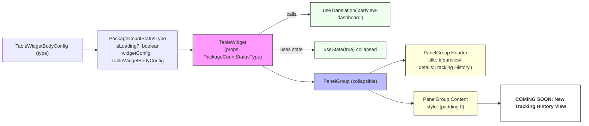

# Diagram: web/portal/src/pages/partview/components/molecules/TableWidget/TableWidget.tsx

> Auto-generated by Obscura crawlers

## Mermaid

### SVG

<svg id="container" width="1983.90625" xmlns="http://www.w3.org/2000/svg" class="flowchart" height="405.265625" viewBox="0 0 1983.90625 405.265625" role="graphics-document document" aria-roledescription="flowchart-v2"><g><marker id="container_flowchart-v2-pointEnd" class="marker flowchart-v2" viewBox="0 0 10 10" refX="5" refY="5" markerUnits="userSpaceOnUse" markerWidth="8" markerHeight="8" orient="auto"><path d="M 0 0 L 10 5 L 0 10 z" class="arrowMarkerPath" style="stroke-width: 1; stroke-dasharray: 1, 0;"></path></marker><marker id="container_flowchart-v2-pointStart" class="marker flowchart-v2" viewBox="0 0 10 10" refX="4.5" refY="5" markerUnits="userSpaceOnUse" markerWidth="8" markerHeight="8" orient="auto"><path d="M 0 5 L 10 10 L 10 0 z" class="arrowMarkerPath" style="stroke-width: 1; stroke-dasharray: 1, 0;"></path></marker><marker id="container_flowchart-v2-circleEnd" class="marker flowchart-v2" viewBox="0 0 10 10" refX="11" refY="5" markerUnits="userSpaceOnUse" markerWidth="11" markerHeight="11" orient="auto"><circle cx="5" cy="5" r="5" class="arrowMarkerPath" style="stroke-width: 1; stroke-dasharray: 1, 0;"></circle></marker><marker id="container_flowchart-v2-circleStart" class="marker flowchart-v2" viewBox="0 0 10 10" refX="-1" refY="5" markerUnits="userSpaceOnUse" markerWidth="11" markerHeight="11" orient="auto"><circle cx="5" cy="5" r="5" class="arrowMarkerPath" style="stroke-width: 1; stroke-dasharray: 1, 0;"></circle></marker><marker id="container_flowchart-v2-crossEnd" class="marker cross flowchart-v2" viewBox="0 0 11 11" refX="12" refY="5.2" markerUnits="userSpaceOnUse" markerWidth="11" markerHeight="11" orient="auto"><path d="M 1,1 l 9,9 M 10,1 l -9,9" class="arrowMarkerPath" style="stroke-width: 2; stroke-dasharray: 1, 0;"></path></marker><marker id="container_flowchart-v2-crossStart" class="marker cross flowchart-v2" viewBox="0 0 11 11" refX="-1" refY="5.2" markerUnits="userSpaceOnUse" markerWidth="11" markerHeight="11" orient="auto"><path d="M 1,1 l 9,9 M 10,1 l -9,9" class="arrowMarkerPath" style="stroke-width: 2; stroke-dasharray: 1, 0;"></path></marker><g class="root"><g class="clusters"></g><g class="edgePaths"><path d="M903.53,124L924.733,111.167C945.937,98.333,988.343,72.667,1019.156,59.833C1049.969,47,1069.188,47,1078.797,47L1088.406,47" id="L_TableWidget_useTranslation_0" class="edge-thickness-normal edge-pattern-solid edge-thickness-normal edge-pattern-solid flowchart-link" style=";" data-edge="true" data-et="edge" data-id="L_TableWidget_useTranslation_0" data-points="W3sieCI6OTAzLjUyOTkwMzAxNzI0MTQsInkiOjEyNH0seyJ4IjoxMDMwLjc1LCJ5Ijo0N30seyJ4IjoxMDkyLjQwNjI1LCJ5Ijo0N31d" marker-end="url(#container_flowchart-v2-pointEnd)"></path><path d="M969.094,163L979.37,163C989.646,163,1010.198,163,1031.967,163C1053.737,163,1076.724,163,1088.217,163L1099.711,163" id="L_TableWidget_useState_0" class="edge-thickness-normal edge-pattern-solid edge-thickness-normal edge-pattern-solid flowchart-link" style=";" data-edge="true" data-et="edge" data-id="L_TableWidget_useState_0" data-points="W3sieCI6OTY5LjA5Mzc1LCJ5IjoxNjN9LHsieCI6MTAzMC43NSwieSI6MTYzfSx7IngiOjExMDMuNzEwOTM3NSwieSI6MTYzfV0=" marker-end="url(#container_flowchart-v2-pointEnd)"></path><path d="M910.965,202L930.929,212.833C950.893,223.667,990.822,245.333,1022.273,256.167C1053.724,267,1076.698,267,1088.185,267L1099.672,267" id="L_TableWidget_PanelGroupComp_0" class="edge-thickness-normal edge-pattern-solid edge-thickness-normal edge-pattern-solid flowchart-link" style=";" data-edge="true" data-et="edge" data-id="L_TableWidget_PanelGroupComp_0" data-points="W3sieCI6OTEwLjk2NDg0Mzc1LCJ5IjoyMDJ9LHsieCI6MTAzMC43NSwieSI6MjY3fSx7IngiOjExMDMuNjcxODc1LCJ5IjoyNjd9XQ==" marker-end="url(#container_flowchart-v2-pointEnd)"></path><path d="M1282.192,240L1298.061,232.833C1313.93,225.667,1345.668,211.333,1365.329,204.167C1384.99,197,1392.573,197,1396.365,197L1400.156,197" id="L_PanelGroupComp_PanelHeader_0" class="edge-thickness-normal edge-pattern-solid edge-thickness-normal edge-pattern-solid flowchart-link" style=";" data-edge="true" data-et="edge" data-id="L_PanelGroupComp_PanelHeader_0" data-points="W3sieCI6MTI4Mi4xOTE5NjQyODU3MTQyLCJ5IjoyNDB9LHsieCI6MTM3Ny40MDYyNSwieSI6MTk3fSx7IngiOjE0MDQuMTU2MjUsInkiOjE5N31d" marker-end="url(#container_flowchart-v2-pointEnd)"></path><path d="M1282.192,294L1298.061,301.167C1313.93,308.333,1345.668,322.667,1365.037,329.833C1384.406,337,1391.406,337,1394.906,337L1398.406,337" id="L_PanelGroupComp_PanelContent_0" class="edge-thickness-normal edge-pattern-solid edge-thickness-normal edge-pattern-solid flowchart-link" style=";" data-edge="true" data-et="edge" data-id="L_PanelGroupComp_PanelContent_0" data-points="W3sieCI6MTI4Mi4xOTE5NjQyODU3MTQyLCJ5IjoyOTR9LHsieCI6MTM3Ny40MDYyNSwieSI6MzM3fSx7IngiOjE0MDIuNDA2MjUsInkiOjMzN31d" marker-end="url(#container_flowchart-v2-pointEnd)"></path><path d="M1665.906,337L1670.073,337C1674.24,337,1682.573,337,1690.24,337C1697.906,337,1704.906,337,1708.406,337L1711.906,337" id="L_PanelContent_H4_0" class="edge-thickness-normal edge-pattern-solid edge-thickness-normal edge-pattern-solid flowchart-link" style=";" data-edge="true" data-et="edge" data-id="L_PanelContent_H4_0" data-points="W3sieCI6MTY2NS45MDYyNSwieSI6MzM3fSx7IngiOjE2OTAuOTA2MjUsInkiOjMzN30seyJ4IjoxNzE1LjkwNjI1LCJ5IjozMzd9XQ==" marker-end="url(#container_flowchart-v2-pointEnd)"></path><path d="M659.094,163L663.26,163C667.427,163,675.76,163,683.427,163C691.094,163,698.094,163,701.594,163L705.094,163" id="L_PackageCountStatusType_TableWidget_0" class="edge-thickness-normal edge-pattern-solid edge-thickness-normal edge-pattern-solid flowchart-link" style=";" data-edge="true" data-et="edge" data-id="L_PackageCountStatusType_TableWidget_0" data-points="W3sieCI6NjU5LjA5Mzc1LCJ5IjoxNjN9LHsieCI6Njg0LjA5Mzc1LCJ5IjoxNjN9LHsieCI6NzA5LjA5Mzc1LCJ5IjoxNjN9XQ==" marker-end="url(#container_flowchart-v2-pointEnd)"></path><path d="M268,163L272.167,163C276.333,163,284.667,163,292.333,163C300,163,307,163,310.5,163L314,163" id="L_TableWidgetBodyConfig_PackageCountStatusType_0" class="edge-thickness-normal edge-pattern-solid edge-thickness-normal edge-pattern-solid flowchart-link" style=";" data-edge="true" data-et="edge" data-id="L_TableWidgetBodyConfig_PackageCountStatusType_0" data-points="W3sieCI6MjY4LCJ5IjoxNjN9LHsieCI6MjkzLCJ5IjoxNjN9LHsieCI6MzE4LCJ5IjoxNjN9XQ==" marker-end="url(#container_flowchart-v2-pointEnd)"></path></g><g class="edgeLabels"><g class="edgeLabel" transform="translate(1030.75, 47)"><g class="label" data-id="L_TableWidget_useTranslation_0" transform="translate(-16.4453125, -12)"><foreignObject width="32.890625" height="24">

calls

</foreignObject></g></g><g class="edgeLabel" transform="translate(1030.75, 163)"><g class="label" data-id="L_TableWidget_useState_0" transform="translate(-36.65625, -12)"><foreignObject width="73.3125" height="24">

uses state

</foreignObject></g></g><g class="edgeLabel"><g class="label" data-id="L_TableWidget_PanelGroupComp_0" transform="translate(0, 0)"><foreignObject width="0" height="0">

</foreignObject></g></g><g class="edgeLabel"><g class="label" data-id="L_PanelGroupComp_PanelHeader_0" transform="translate(0, 0)"><foreignObject width="0" height="0">

</foreignObject></g></g><g class="edgeLabel"><g class="label" data-id="L_PanelGroupComp_PanelContent_0" transform="translate(0, 0)"><foreignObject width="0" height="0">

</foreignObject></g></g><g class="edgeLabel"><g class="label" data-id="L_PanelContent_H4_0" transform="translate(0, 0)"><foreignObject width="0" height="0">

</foreignObject></g></g><g class="edgeLabel"><g class="label" data-id="L_PackageCountStatusType_TableWidget_0" transform="translate(0, 0)"><foreignObject width="0" height="0">

</foreignObject></g></g><g class="edgeLabel"><g class="label" data-id="L_TableWidgetBodyConfig_PackageCountStatusType_0" transform="translate(0, 0)"><foreignObject width="0" height="0">

</foreignObject></g></g></g><g class="nodes"><g class="node default" id="flowchart-TableWidget-0" transform="translate(839.09375, 163)"><rect class="basic label-container" style="fill:#f9f !important;stroke:#333 !important;stroke-width:1px !important" x="-130" y="-39" width="260" height="78"></rect><g class="label" style="" transform="translate(-100, -24)"><rect></rect><foreignObject width="200" height="48">

TableWidget\n(props: PackageCountStatusType)

</foreignObject></g></g><g class="node default" id="flowchart-useTranslation-1" transform="translate(1222.40625, 47)"><rect class="basic label-container" style="fill:#efe !important;stroke:#333 !important;stroke-width:1px !important" x="-130" y="-39" width="260" height="78"></rect><g class="label" style="" transform="translate(-100, -24)"><rect></rect><foreignObject width="200" height="48">

useTranslation('partview-dashboard')

</foreignObject></g></g><g class="node default" id="flowchart-useState-3" transform="translate(1222.40625, 163)"><rect class="basic label-container" style="fill:#efe !important;stroke:#333 !important;stroke-width:1px !important" x="-118.6953125" y="-27" width="237.390625" height="54"></rect><g class="label" style="" transform="translate(-88.6953125, -12)"><rect></rect><foreignObject width="177.390625" height="24">

useState(true) collapsed

</foreignObject></g></g><g class="node default" id="flowchart-PanelGroupComp-5" transform="translate(1222.40625, 267)"><rect class="basic label-container" style="fill:#bbf !important;stroke:#333 !important;stroke-width:1px !important" x="-118.734375" y="-27" width="237.46875" height="54"></rect><g class="label" style="" transform="translate(-88.734375, -12)"><rect></rect><foreignObject width="177.46875" height="24">

PanelGroup (collapsible)

</foreignObject></g></g><g class="node default" id="flowchart-PanelHeader-7" transform="translate(1534.15625, 197)"><rect class="basic label-container" style="fill:#ffd !important;stroke:#333 !important;stroke-width:1px !important" x="-130" y="-51" width="260" height="102"></rect><g class="label" style="" transform="translate(-100, -36)"><rect></rect><foreignObject width="200" height="72">

PanelGroup.Header\ntitle: t('partview-details:Tracking History')

</foreignObject></g></g><g class="node default" id="flowchart-PanelContent-9" transform="translate(1534.15625, 337)"><rect class="basic label-container" style="fill:#ffd !important;stroke:#333 !important;stroke-width:1px !important" x="-131.75" y="-39" width="263.5" height="78"></rect><g class="label" style="" transform="translate(-101.75, -24)"><rect></rect><foreignObject width="203.5" height="48">

PanelGroup.Content\nstyle: {padding:0}

</foreignObject></g></g><g class="node default" id="flowchart-H4-11" transform="translate(1845.90625, 337)"><rect class="basic label-container" style="fill:#fff !important;stroke:#333 !important;stroke-width:1px !important" x="-130" y="-60.265625" width="260" height="120.53125"></rect><g class="label" style="" transform="translate(-100, -45.265625)"><rect></rect><foreignObject width="200" height="90.53125">
<h4>COMING SOON: New Tracking History View</h4>
</foreignObject></g></g><g class="node default" id="flowchart-PackageCountStatusType-12" transform="translate(488.546875, 163)"><rect class="basic label-container" style="" x="-170.546875" y="-51" width="341.09375" height="102"></rect><g class="label" style="" transform="translate(-140.546875, -36)"><rect></rect><foreignObject width="281.09375" height="72">

PackageCountStatusType\nisLoading?: boolean\nwidgetConfig: TableWidgetBodyConfig

</foreignObject></g></g><g class="node default" id="flowchart-TableWidgetBodyConfig-14" transform="translate(138, 163)"><rect class="basic label-container" style="" x="-130" y="-39" width="260" height="78"></rect><g class="label" style="" transform="translate(-100, -24)"><rect></rect><foreignObject width="200" height="48">

TableWidgetBodyConfig (type)

</foreignObject></g></g></g></g></g></svg>
