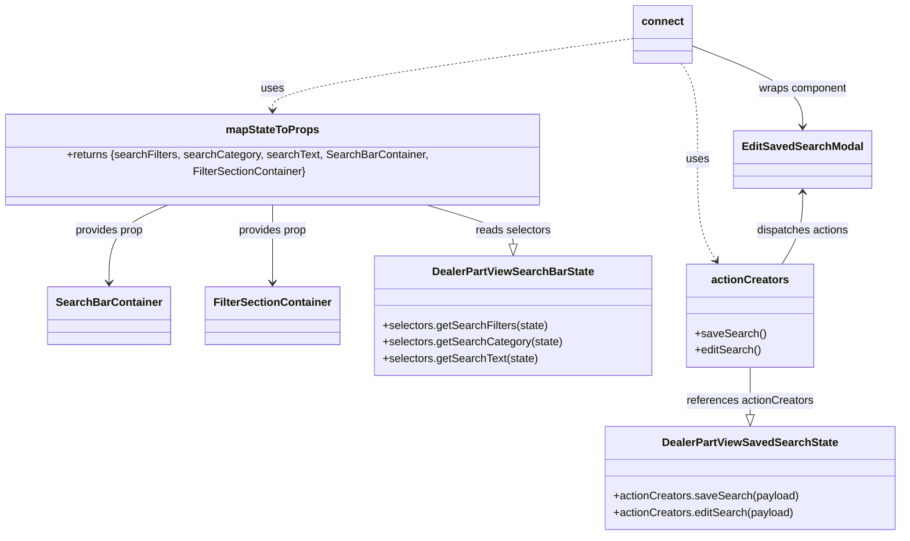

# Diagram: web/portal/src/pages/partview/components/search/DealerPartView.EditSavedSearchModal.container.js


> Auto-generated by Obscura crawlers

## Diagram 1



### SVG

<svg id="container" width="1288.7421875" xmlns="http://www.w3.org/2000/svg" class="classDiagram" height="766" viewBox="0 0 1288.7421875 766" role="graphics-document document" aria-roledescription="class"><style>#container{font-family:"trebuchet ms",verdana,arial,sans-serif;font-size:16px;fill:#333;}@keyframes edge-animation-frame{from{stroke-dashoffset:0;}}@keyframes dash{to{stroke-dashoffset:0;}}#container .edge-animation-slow{stroke-dasharray:9,5!important;stroke-dashoffset:900;animation:dash 50s linear infinite;stroke-linecap:round;}#container .edge-animation-fast{stroke-dasharray:9,5!important;stroke-dashoffset:900;animation:dash 20s linear infinite;stroke-linecap:round;}#container .error-icon{fill:#552222;}#container .error-text{fill:#552222;stroke:#552222;}#container .edge-thickness-normal{stroke-width:1px;}#container .edge-thickness-thick{stroke-width:3.5px;}#container .edge-pattern-solid{stroke-dasharray:0;}#container .edge-thickness-invisible{stroke-width:0;fill:none;}#container .edge-pattern-dashed{stroke-dasharray:3;}#container .edge-pattern-dotted{stroke-dasharray:2;}#container .marker{fill:#333333;stroke:#333333;}#container .marker.cross{stroke:#333333;}#container svg{font-family:"trebuchet ms",verdana,arial,sans-serif;font-size:16px;}#container p{margin:0;}#container g.classGroup text{fill:#9370DB;stroke:none;font-family:"trebuchet ms",verdana,arial,sans-serif;font-size:10px;}#container g.classGroup text .title{font-weight:bolder;}#container .nodeLabel,#container .edgeLabel{color:#131300;}#container .edgeLabel .label rect{fill:#ECECFF;}#container .label text{fill:#131300;}#container .labelBkg{background:#ECECFF;}#container .edgeLabel .label span{background:#ECECFF;}#container .classTitle{font-weight:bolder;}#container .node rect,#container .node circle,#container .node ellipse,#container .node polygon,#container .node path{fill:#ECECFF;stroke:#9370DB;stroke-width:1px;}#container .divider{stroke:#9370DB;stroke-width:1;}#container g.clickable{cursor:pointer;}#container g.classGroup rect{fill:#ECECFF;stroke:#9370DB;}#container g.classGroup line{stroke:#9370DB;stroke-width:1;}#container .classLabel .box{stroke:none;stroke-width:0;fill:#ECECFF;opacity:0.5;}#container .classLabel .label{fill:#9370DB;font-size:10px;}#container .relation{stroke:#333333;stroke-width:1;fill:none;}#container .dashed-line{stroke-dasharray:3;}#container .dotted-line{stroke-dasharray:1 2;}#container #compositionStart,#container .composition{fill:#333333!important;stroke:#333333!important;stroke-width:1;}#container #compositionEnd,#container .composition{fill:#333333!important;stroke:#333333!important;stroke-width:1;}#container #dependencyStart,#container .dependency{fill:#333333!important;stroke:#333333!important;stroke-width:1;}#container #dependencyStart,#container .dependency{fill:#333333!important;stroke:#333333!important;stroke-width:1;}#container #extensionStart,#container .extension{fill:transparent!important;stroke:#333333!important;stroke-width:1;}#container #extensionEnd,#container .extension{fill:transparent!important;stroke:#333333!important;stroke-width:1;}#container #aggregationStart,#container .aggregation{fill:transparent!important;stroke:#333333!important;stroke-width:1;}#container #aggregationEnd,#container .aggregation{fill:transparent!important;stroke:#333333!important;stroke-width:1;}#container #lollipopStart,#container .lollipop{fill:#ECECFF!important;stroke:#333333!important;stroke-width:1;}#container #lollipopEnd,#container .lollipop{fill:#ECECFF!important;stroke:#333333!important;stroke-width:1;}#container .edgeTerminals{font-size:11px;line-height:initial;}#container .classTitleText{text-anchor:middle;font-size:18px;fill:#333;}#container .label-icon{display:inline-block;height:1em;overflow:visible;vertical-align:-0.125em;}#container .node .label-icon path{fill:currentColor;stroke:revert;stroke-width:revert;}#container :root{--mermaid-font-family:"trebuchet ms",verdana,arial,sans-serif;}</style><g><defs><marker id="container_class-aggregationStart" class="marker aggregation class" refX="18" refY="7" markerWidth="190" markerHeight="240" orient="auto"><path d="M 18,7 L9,13 L1,7 L9,1 Z"></path></marker></defs><defs><marker id="container_class-aggregationEnd" class="marker aggregation class" refX="1" refY="7" markerWidth="20" markerHeight="28" orient="auto"><path d="M 18,7 L9,13 L1,7 L9,1 Z"></path></marker></defs><defs><marker id="container_class-extensionStart" class="marker extension class" refX="18" refY="7" markerWidth="190" markerHeight="240" orient="auto"><path d="M 1,7 L18,13 V 1 Z"></path></marker></defs><defs><marker id="container_class-extensionEnd" class="marker extension class" refX="1" refY="7" markerWidth="20" markerHeight="28" orient="auto"><path d="M 1,1 V 13 L18,7 Z"></path></marker></defs><defs><marker id="container_class-compositionStart" class="marker composition class" refX="18" refY="7" markerWidth="190" markerHeight="240" orient="auto"><path d="M 18,7 L9,13 L1,7 L9,1 Z"></path></marker></defs><defs><marker id="container_class-compositionEnd" class="marker composition class" refX="1" refY="7" markerWidth="20" markerHeight="28" orient="auto"><path d="M 18,7 L9,13 L1,7 L9,1 Z"></path></marker></defs><defs><marker id="container_class-dependencyStart" class="marker dependency class" refX="6" refY="7" markerWidth="190" markerHeight="240" orient="auto"><path d="M 5,7 L9,13 L1,7 L9,1 Z"></path></marker></defs><defs><marker id="container_class-dependencyEnd" class="marker dependency class" refX="13" refY="7" markerWidth="20" markerHeight="28" orient="auto"><path d="M 18,7 L9,13 L14,7 L9,1 Z"></path></marker></defs><defs><marker id="container_class-lollipopStart" class="marker lollipop class" refX="13" refY="7" markerWidth="190" markerHeight="240" orient="auto"><circle stroke="black" fill="transparent" cx="7" cy="7" r="6"></circle></marker></defs><defs><marker id="container_class-lollipopEnd" class="marker lollipop class" refX="1" refY="7" markerWidth="190" markerHeight="240" orient="auto"><circle stroke="black" fill="transparent" cx="7" cy="7" r="6"></circle></marker></defs><g class="root"><g class="clusters"></g><g class="edgePaths"><path d="M608.53,286L630.227,292.167C651.924,298.333,695.317,310.667,717.014,320.125C738.711,329.583,738.711,336.167,738.711,339.458L738.711,342.75" id="id_mapStateToProps_DealerPartViewSearchBarState_1" class="edge-thickness-normal edge-pattern-solid relation" style=";;;" data-edge="true" data-et="edge" data-id="id_mapStateToProps_DealerPartViewSearchBarState_1" data-points="W3sieCI6NjA4LjUzMDAwMTYxMDgyNDcsInkiOjI4Nn0seyJ4Ijo3MzguNzEwOTM3NSwieSI6MzIzfSx7IngiOjczOC43MTA5Mzc1LCJ5IjozNjB9XQ==" marker-end="url(#container_class-extensionEnd)"></path><path d="M1074.578,522L1074.578,530.167C1074.578,538.333,1074.578,554.667,1074.578,566.125C1074.578,577.583,1074.578,584.167,1074.578,587.458L1074.578,590.75" id="id_actionCreators_DealerPartViewSavedSearchState_2" class="edge-thickness-normal edge-pattern-solid relation" style=";;;" data-edge="true" data-et="edge" data-id="id_actionCreators_DealerPartViewSavedSearchState_2" data-points="W3sieCI6MTA3NC41NzgxMjUsInkiOjUyMn0seyJ4IjoxMDc0LjU3ODEyNSwieSI6NTcxfSx7IngiOjEwNzQuNTc4MTI1LCJ5Ijo2MDh9XQ==" marker-end="url(#container_class-extensionEnd)"></path><path d="M255.921,286L241.378,292.167C226.834,298.333,197.747,310.667,183.204,329.5C168.66,348.333,168.66,373.667,168.66,386.333L168.66,399" id="id_mapStateToProps_SearchBarContainer_3" class="edge-thickness-normal edge-pattern-solid relation" style=";;;" data-edge="true" data-et="edge" data-id="id_mapStateToProps_SearchBarContainer_3" data-points="W3sieCI6MjU1LjkyMTI3MDk0MDcyMTY2LCJ5IjoyODZ9LHsieCI6MTY4LjY2MDE1NjI1LCJ5IjozMjN9LHsieCI6MTY4LjY2MDE1NjI1LCJ5Ijo0MDV9XQ==" marker-end="url(#container_class-dependencyEnd)"></path><path d="M397.426,286L397.426,292.167C397.426,298.333,397.426,310.667,397.426,329.5C397.426,348.333,397.426,373.667,397.426,386.333L397.426,399" id="id_mapStateToProps_FilterSectionContainer_4" class="edge-thickness-normal edge-pattern-solid relation" style=";;;" data-edge="true" data-et="edge" data-id="id_mapStateToProps_FilterSectionContainer_4" data-points="W3sieCI6Mzk3LjQyNTc4MTI1LCJ5IjoyODZ9LHsieCI6Mzk3LjQyNTc4MTI1LCJ5IjozMjN9LHsieCI6Mzk3LjQyNTc4MTI1LCJ5Ijo0MDV9XQ==" marker-end="url(#container_class-dependencyEnd)"></path><path d="M915.547,55.782L829.193,67.985C742.84,80.188,570.133,104.594,483.779,121.964C397.426,139.333,397.426,149.667,397.426,154.833L397.426,160" id="id_connect_mapStateToProps_5" class="edge-thickness-normal edge-pattern-dashed relation" style=";;;" data-edge="true" data-et="edge" data-id="id_connect_mapStateToProps_5" data-points="W3sieCI6OTE1LjU0Njg3NSwieSI6NTUuNzgxNzY2ODU1NTYxNjl9LHsieCI6Mzk3LjQyNTc4MTI1LCJ5IjoxMjl9LHsieCI6Mzk3LjQyNTc4MTI1LCJ5IjoxNjZ9XQ==" marker-end="url(#container_class-dependencyEnd)"></path><path d="M980.198,92L983.683,98.167C987.169,104.333,994.139,116.667,997.624,139C1001.109,161.333,1001.109,193.667,1001.109,226C1001.109,258.333,1001.109,290.667,1005.438,314.14C1009.767,337.613,1018.425,352.225,1022.754,359.532L1027.083,366.838" id="id_connect_actionCreators_6" class="edge-thickness-normal edge-pattern-dashed relation" style=";;;" data-edge="true" data-et="edge" data-id="id_connect_actionCreators_6" data-points="W3sieCI6OTgwLjE5ODA4MTQ4NzM0MTgsInkiOjkyfSx7IngiOjEwMDEuMTA5Mzc1LCJ5IjoxMjl9LHsieCI6MTAwMS4xMDkzNzUsInkiOjIyNn0seyJ4IjoxMDAxLjEwOTM3NSwieSI6MzIzfSx7IngiOjEwMzAuMTQxMzgxMDQ4Mzg3LCJ5IjozNzJ9XQ==" marker-end="url(#container_class-dependencyEnd)"></path><path d="M997.375,66.871L1022.487,77.226C1047.599,87.581,1097.823,108.29,1122.935,126.812C1148.047,145.333,1148.047,161.667,1148.047,169.833L1148.047,178" id="id_connect_EditSavedSearchModal_7" class="edge-thickness-normal edge-pattern-solid relation" style=";;;" data-edge="true" data-et="edge" data-id="id_connect_EditSavedSearchModal_7" data-points="W3sieCI6OTk3LjM3NSwieSI6NjYuODcwODE1MTUzMTIxNTV9LHsieCI6MTE0OC4wNDY4NzUsInkiOjEyOX0seyJ4IjoxMTQ4LjA0Njg3NSwieSI6MTg0fV0=" marker-end="url(#container_class-dependencyEnd)"></path><path d="M1148.047,274L1148.047,282.167C1148.047,290.333,1148.047,306.667,1143.208,323C1138.37,339.333,1128.692,355.667,1123.854,363.833L1119.015,372" id="id_EditSavedSearchModal_actionCreators_8" class="edge-thickness-normal edge-pattern-solid relation" style=";;;" data-edge="true" data-et="edge" data-id="id_EditSavedSearchModal_actionCreators_8" data-points="W3sieCI6MTE0OC4wNDY4NzUsInkiOjI2OH0seyJ4IjoxMTQ4LjA0Njg3NSwieSI6MzIzfSx7IngiOjExMTkuMDE0ODY4OTUxNjEzLCJ5IjozNzJ9XQ==" marker-start="url(#container_class-dependencyStart)"></path></g><g class="edgeLabels"><g class="edgeLabel" transform="translate(738.7109375, 323)"><g class="label" data-id="id_mapStateToProps_DealerPartViewSearchBarState_1" transform="translate(-54.8515625, -12)"><foreignObject width="109.703125" height="24"><div xmlns="http://www.w3.org/1999/xhtml" class="labelBkg" style="display: table-cell; white-space: nowrap; line-height: 1.5; max-width: 200px; text-align: center;"><span class="edgeLabel"><p>reads selectors</p></span></div></foreignObject></g></g><g class="edgeLabel" transform="translate(1074.578125, 571)"><g class="label" data-id="id_actionCreators_DealerPartViewSavedSearchState_2" transform="translate(-92.609375, -12)"><foreignObject width="185.21875" height="24"><div xmlns="http://www.w3.org/1999/xhtml" class="labelBkg" style="display: table-cell; white-space: nowrap; line-height: 1.5; max-width: 200px; text-align: center;"><span class="edgeLabel"><p>references actionCreators</p></span></div></foreignObject></g></g><g class="edgeLabel" transform="translate(168.66015625, 323)"><g class="label" data-id="id_mapStateToProps_SearchBarContainer_3" transform="translate(-50.4609375, -12)"><foreignObject width="100.921875" height="24"><div xmlns="http://www.w3.org/1999/xhtml" class="labelBkg" style="display: table-cell; white-space: nowrap; line-height: 1.5; max-width: 200px; text-align: center;"><span class="edgeLabel"><p>provides prop</p></span></div></foreignObject></g></g><g class="edgeLabel" transform="translate(397.42578125, 323)"><g class="label" data-id="id_mapStateToProps_FilterSectionContainer_4" transform="translate(-50.4609375, -12)"><foreignObject width="100.921875" height="24"><div xmlns="http://www.w3.org/1999/xhtml" class="labelBkg" style="display: table-cell; white-space: nowrap; line-height: 1.5; max-width: 200px; text-align: center;"><span class="edgeLabel"><p>provides prop</p></span></div></foreignObject></g></g><g class="edgeLabel" transform="translate(397.42578125, 129)"><g class="label" data-id="id_connect_mapStateToProps_5" transform="translate(-16.4921875, -12)"><foreignObject width="32.984375" height="24"><div xmlns="http://www.w3.org/1999/xhtml" class="labelBkg" style="display: table-cell; white-space: nowrap; line-height: 1.5; max-width: 200px; text-align: center;"><span class="edgeLabel"><p>uses</p></span></div></foreignObject></g></g><g class="edgeLabel" transform="translate(1001.109375, 226)"><g class="label" data-id="id_connect_actionCreators_6" transform="translate(-16.4921875, -12)"><foreignObject width="32.984375" height="24"><div xmlns="http://www.w3.org/1999/xhtml" class="labelBkg" style="display: table-cell; white-space: nowrap; line-height: 1.5; max-width: 200px; text-align: center;"><span class="edgeLabel"><p>uses</p></span></div></foreignObject></g></g><g class="edgeLabel" transform="translate(1148.046875, 129)"><g class="label" data-id="id_connect_EditSavedSearchModal_7" transform="translate(-64.75, -12)"><foreignObject width="129.5" height="24"><div xmlns="http://www.w3.org/1999/xhtml" class="labelBkg" style="display: table-cell; white-space: nowrap; line-height: 1.5; max-width: 200px; text-align: center;"><span class="edgeLabel"><p>wraps component</p></span></div></foreignObject></g></g><g class="edgeLabel" transform="translate(1148.046875, 323)"><g class="label" data-id="id_EditSavedSearchModal_actionCreators_8" transform="translate(-67.71875, -12)"><foreignObject width="135.4375" height="24"><div xmlns="http://www.w3.org/1999/xhtml" class="labelBkg" style="display: table-cell; white-space: nowrap; line-height: 1.5; max-width: 200px; text-align: center;"><span class="edgeLabel"><p>dispatches actions</p></span></div></foreignObject></g></g></g><g class="nodes"><g class="node default" id="classId-EditSavedSearchModal-0" transform="translate(1148.046875, 226)"><g class="basic label-container"><path d="M-95.4453125 -42 L95.4453125 -42 L95.4453125 42 L-95.4453125 42" stroke="none" stroke-width="0" fill="#ECECFF" style=""></path><path d="M-95.4453125 -42 C-47.41486518504391 -42, 0.615582129912184 -42, 95.4453125 -42 M-95.4453125 -42 C-24.18319853012798 -42, 47.07891543974404 -42, 95.4453125 -42 M95.4453125 -42 C95.4453125 -19.808877206848827, 95.4453125 2.3822455863023464, 95.4453125 42 M95.4453125 -42 C95.4453125 -12.374383396294789, 95.4453125 17.251233207410422, 95.4453125 42 M95.4453125 42 C46.17291810349573 42, -3.0994762930085358 42, -95.4453125 42 M95.4453125 42 C51.86622080145985 42, 8.287129102919707 42, -95.4453125 42 M-95.4453125 42 C-95.4453125 10.812243119984252, -95.4453125 -20.375513760031495, -95.4453125 -42 M-95.4453125 42 C-95.4453125 22.980308558805103, -95.4453125 3.960617117610205, -95.4453125 -42" stroke="#9370DB" stroke-width="1.3" fill="none" stroke-dasharray="0 0" style=""></path></g><g class="annotation-group text" transform="translate(0, -18)"></g><g class="label-group text" transform="translate(-83.4453125, -18)"><g class="label" style="font-weight: bolder" transform="translate(0,-12)"><foreignObject width="166.890625" height="24"><div xmlns="http://www.w3.org/1999/xhtml" style="display: table-cell; white-space: nowrap; line-height: 1.5; max-width: 215px; text-align: center;"><span class="nodeLabel markdown-node-label" style=""><p>EditSavedSearchModal</p></span></div></foreignObject></g></g><g class="members-group text" transform="translate(-83.4453125, 30)"></g><g class="methods-group text" transform="translate(-83.4453125, 60)"></g><g class="divider" style=""><path d="M-95.4453125 6 C-34.879790969034595 6, 25.68573056193081 6, 95.4453125 6 M-95.4453125 6 C-26.14949266310144 6, 43.14632717379712 6, 95.4453125 6" stroke="#9370DB" stroke-width="1.3" fill="none" stroke-dasharray="0 0" style=""></path></g><g class="divider" style=""><path d="M-95.4453125 24 C-37.86779260322807 24, 19.709727293543864 24, 95.4453125 24 M-95.4453125 24 C-46.38773846355636 24, 2.66983557288728 24, 95.4453125 24" stroke="#9370DB" stroke-width="1.3" fill="none" stroke-dasharray="0 0" style=""></path></g></g><g class="node default" id="classId-SearchBarContainer-1" transform="translate(168.66015625, 447)"><g class="basic label-container"><path d="M-84.84375 -42 L84.84375 -42 L84.84375 42 L-84.84375 42" stroke="none" stroke-width="0" fill="#ECECFF" style=""></path><path d="M-84.84375 -42 C-25.73025030046974 -42, 33.38324939906052 -42, 84.84375 -42 M-84.84375 -42 C-31.847700529354213 -42, 21.148348941291573 -42, 84.84375 -42 M84.84375 -42 C84.84375 -14.30585654074168, 84.84375 13.388286918516641, 84.84375 42 M84.84375 -42 C84.84375 -13.313821313662896, 84.84375 15.372357372674209, 84.84375 42 M84.84375 42 C47.697602933493464 42, 10.551455866986927 42, -84.84375 42 M84.84375 42 C25.592429390975155 42, -33.65889121804969 42, -84.84375 42 M-84.84375 42 C-84.84375 9.20995755598581, -84.84375 -23.58008488802838, -84.84375 -42 M-84.84375 42 C-84.84375 17.571675714636015, -84.84375 -6.85664857072797, -84.84375 -42" stroke="#9370DB" stroke-width="1.3" fill="none" stroke-dasharray="0 0" style=""></path></g><g class="annotation-group text" transform="translate(0, -18)"></g><g class="label-group text" transform="translate(-72.84375, -18)"><g class="label" style="font-weight: bolder" transform="translate(0,-12)"><foreignObject width="145.6875" height="24"><div xmlns="http://www.w3.org/1999/xhtml" style="display: table-cell; white-space: nowrap; line-height: 1.5; max-width: 195px; text-align: center;"><span class="nodeLabel markdown-node-label" style=""><p>SearchBarContainer</p></span></div></foreignObject></g></g><g class="members-group text" transform="translate(-72.84375, 30)"></g><g class="methods-group text" transform="translate(-72.84375, 60)"></g><g class="divider" style=""><path d="M-84.84375 6 C-18.169937886532026 6, 48.50387422693595 6, 84.84375 6 M-84.84375 6 C-46.80287061688326 6, -8.761991233766523 6, 84.84375 6" stroke="#9370DB" stroke-width="1.3" fill="none" stroke-dasharray="0 0" style=""></path></g><g class="divider" style=""><path d="M-84.84375 24 C-43.16669294617708 24, -1.4896358923541584 24, 84.84375 24 M-84.84375 24 C-22.289248079327017 24, 40.26525384134597 24, 84.84375 24" stroke="#9370DB" stroke-width="1.3" fill="none" stroke-dasharray="0 0" style=""></path></g></g><g class="node default" id="classId-FilterSectionContainer-2" transform="translate(397.42578125, 447)"><g class="basic label-container"><path d="M-93.921875 -42 L93.921875 -42 L93.921875 42 L-93.921875 42" stroke="none" stroke-width="0" fill="#ECECFF" style=""></path><path d="M-93.921875 -42 C-25.443173470932933 -42, 43.03552805813413 -42, 93.921875 -42 M-93.921875 -42 C-28.35760818253614 -42, 37.20665863492772 -42, 93.921875 -42 M93.921875 -42 C93.921875 -15.5214133086542, 93.921875 10.9571733826916, 93.921875 42 M93.921875 -42 C93.921875 -9.255093590477976, 93.921875 23.489812819044047, 93.921875 42 M93.921875 42 C41.35831048184457 42, -11.205254036310862 42, -93.921875 42 M93.921875 42 C29.284465586294147 42, -35.35294382741171 42, -93.921875 42 M-93.921875 42 C-93.921875 13.839767442686181, -93.921875 -14.320465114627638, -93.921875 -42 M-93.921875 42 C-93.921875 18.326440538101526, -93.921875 -5.347118923796948, -93.921875 -42" stroke="#9370DB" stroke-width="1.3" fill="none" stroke-dasharray="0 0" style=""></path></g><g class="annotation-group text" transform="translate(0, -18)"></g><g class="label-group text" transform="translate(-81.921875, -18)"><g class="label" style="font-weight: bolder" transform="translate(0,-12)"><foreignObject width="163.84375" height="24"><div xmlns="http://www.w3.org/1999/xhtml" style="display: table-cell; white-space: nowrap; line-height: 1.5; max-width: 212px; text-align: center;"><span class="nodeLabel markdown-node-label" style=""><p>FilterSectionContainer</p></span></div></foreignObject></g></g><g class="members-group text" transform="translate(-81.921875, 30)"></g><g class="methods-group text" transform="translate(-81.921875, 60)"></g><g class="divider" style=""><path d="M-93.921875 6 C-33.20898429620847 6, 27.50390640758306 6, 93.921875 6 M-93.921875 6 C-48.019393780645345 6, -2.1169125612906896 6, 93.921875 6" stroke="#9370DB" stroke-width="1.3" fill="none" stroke-dasharray="0 0" style=""></path></g><g class="divider" style=""><path d="M-93.921875 24 C-49.39125419784976 24, -4.860633395699523 24, 93.921875 24 M-93.921875 24 C-40.456873574529496 24, 13.008127850941008 24, 93.921875 24" stroke="#9370DB" stroke-width="1.3" fill="none" stroke-dasharray="0 0" style=""></path></g></g><g class="node default" id="classId-DealerPartViewSearchBarState-3" transform="translate(738.7109375, 447)"><g class="basic label-container"><path d="M-197.36328125 -87 L197.36328125 -87 L197.36328125 87 L-197.36328125 87" stroke="none" stroke-width="0" fill="#ECECFF" style=""></path><path d="M-197.36328125 -87 C-88.75462868277272 -87, 19.854023884454563 -87, 197.36328125 -87 M-197.36328125 -87 C-55.888292226737065 -87, 85.58669679652587 -87, 197.36328125 -87 M197.36328125 -87 C197.36328125 -39.093503114462706, 197.36328125 8.812993771074588, 197.36328125 87 M197.36328125 -87 C197.36328125 -30.87235692964419, 197.36328125 25.25528614071162, 197.36328125 87 M197.36328125 87 C54.73281811212743 87, -87.89764502574513 87, -197.36328125 87 M197.36328125 87 C83.25702384489783 87, -30.84923356020434 87, -197.36328125 87 M-197.36328125 87 C-197.36328125 28.053595397467447, -197.36328125 -30.892809205065106, -197.36328125 -87 M-197.36328125 87 C-197.36328125 36.365712210767555, -197.36328125 -14.26857557846489, -197.36328125 -87" stroke="#9370DB" stroke-width="1.3" fill="none" stroke-dasharray="0 0" style=""></path></g><g class="annotation-group text" transform="translate(0, -63)"></g><g class="label-group text" transform="translate(-112.6484375, -63)"><g class="label" style="font-weight: bolder" transform="translate(0,-12)"><foreignObject width="225.296875" height="24"><div xmlns="http://www.w3.org/1999/xhtml" style="display: table-cell; white-space: nowrap; line-height: 1.5; max-width: 270px; text-align: center;"><span class="nodeLabel markdown-node-label" style=""><p>DealerPartViewSearchBarState</p></span></div></foreignObject></g></g><g class="members-group text" transform="translate(-185.36328125, -15)"></g><g class="methods-group text" transform="translate(-185.36328125, 15)"><g class="label" style="" transform="translate(0,-12)"><foreignObject width="239.015625" height="24"><div xmlns="http://www.w3.org/1999/xhtml" style="display: table-cell; white-space: nowrap; line-height: 1.5; max-width: 296px; text-align: center;"><span class="nodeLabel markdown-node-label" style=""><p>+selectors.getSearchFilters(state)</p></span></div></foreignObject></g><g class="label" style="" transform="translate(0,12)"><foreignObject width="258.078125" height="24"><div xmlns="http://www.w3.org/1999/xhtml" style="display: table-cell; white-space: nowrap; line-height: 1.5; max-width: 315px; text-align: center;"><span class="nodeLabel markdown-node-label" style=""><p>+selectors.getSearchCategory(state)</p></span></div></foreignObject></g><g class="label" style="" transform="translate(0,36)"><foreignObject width="224.359375" height="24"><div xmlns="http://www.w3.org/1999/xhtml" style="display: table-cell; white-space: nowrap; line-height: 1.5; max-width: 282px; text-align: center;"><span class="nodeLabel markdown-node-label" style=""><p>+selectors.getSearchText(state)</p></span></div></foreignObject></g></g><g class="divider" style=""><path d="M-197.36328125 -39 C-60.94425156953062 -39, 75.47477811093876 -39, 197.36328125 -39 M-197.36328125 -39 C-86.23474340462806 -39, 24.893794440743875 -39, 197.36328125 -39" stroke="#9370DB" stroke-width="1.3" fill="none" stroke-dasharray="0 0" style=""></path></g><g class="divider" style=""><path d="M-197.36328125 -15 C-78.69671671692564 -15, 39.96984781614873 -15, 197.36328125 -15 M-197.36328125 -15 C-113.69612250469321 -15, -30.028963759386414 -15, 197.36328125 -15" stroke="#9370DB" stroke-width="1.3" fill="none" stroke-dasharray="0 0" style=""></path></g></g><g class="node default" id="classId-DealerPartViewSavedSearchState-4" transform="translate(1074.578125, 683)"><g class="basic label-container"><path d="M-206.1640625 -75 L206.1640625 -75 L206.1640625 75 L-206.1640625 75" stroke="none" stroke-width="0" fill="#ECECFF" style=""></path><path d="M-206.1640625 -75 C-73.96572690213236 -75, 58.23260869573528 -75, 206.1640625 -75 M-206.1640625 -75 C-76.7382433405335 -75, 52.687575818933 -75, 206.1640625 -75 M206.1640625 -75 C206.1640625 -27.90700451116045, 206.1640625 19.185990977679097, 206.1640625 75 M206.1640625 -75 C206.1640625 -31.389340838200077, 206.1640625 12.221318323599846, 206.1640625 75 M206.1640625 75 C81.4296022899948 75, -43.30485792001039 75, -206.1640625 75 M206.1640625 75 C61.167199207995395 75, -83.82966408400921 75, -206.1640625 75 M-206.1640625 75 C-206.1640625 26.861883926900802, -206.1640625 -21.276232146198396, -206.1640625 -75 M-206.1640625 75 C-206.1640625 26.801694425701918, -206.1640625 -21.396611148596165, -206.1640625 -75" stroke="#9370DB" stroke-width="1.3" fill="none" stroke-dasharray="0 0" style=""></path></g><g class="annotation-group text" transform="translate(0, -51)"></g><g class="label-group text" transform="translate(-122.21875, -51)"><g class="label" style="font-weight: bolder" transform="translate(0,-12)"><foreignObject width="244.4375" height="24"><div xmlns="http://www.w3.org/1999/xhtml" style="display: table-cell; white-space: nowrap; line-height: 1.5; max-width: 289px; text-align: center;"><span class="nodeLabel markdown-node-label" style=""><p>DealerPartViewSavedSearchState</p></span></div></foreignObject></g></g><g class="members-group text" transform="translate(-194.1640625, -3)"></g><g class="methods-group text" transform="translate(-194.1640625, 27)"><g class="label" style="" transform="translate(0,-12)"><foreignObject width="266.109375" height="24"><div xmlns="http://www.w3.org/1999/xhtml" style="display: table-cell; white-space: nowrap; line-height: 1.5; max-width: 323px; text-align: center;"><span class="nodeLabel markdown-node-label" style=""><p>+actionCreators.saveSearch(payload)</p></span></div></foreignObject></g><g class="label" style="" transform="translate(0,12)"><foreignObject width="262.15625" height="24"><div xmlns="http://www.w3.org/1999/xhtml" style="display: table-cell; white-space: nowrap; line-height: 1.5; max-width: 320px; text-align: center;"><span class="nodeLabel markdown-node-label" style=""><p>+actionCreators.editSearch(payload)</p></span></div></foreignObject></g></g><g class="divider" style=""><path d="M-206.1640625 -27 C-68.00421965028235 -27, 70.1556231994353 -27, 206.1640625 -27 M-206.1640625 -27 C-78.28629479267848 -27, 49.59147291464305 -27, 206.1640625 -27" stroke="#9370DB" stroke-width="1.3" fill="none" stroke-dasharray="0 0" style=""></path></g><g class="divider" style=""><path d="M-206.1640625 -3 C-42.761913204834116 -3, 120.64023609033177 -3, 206.1640625 -3 M-206.1640625 -3 C-87.37637865622212 -3, 31.41130518755577 -3, 206.1640625 -3" stroke="#9370DB" stroke-width="1.3" fill="none" stroke-dasharray="0 0" style=""></path></g></g><g class="node default" id="classId-mapStateToProps-5" transform="translate(397.42578125, 226)"><g class="basic label-container"><path d="M-389.42578125 -60 L389.42578125 -60 L389.42578125 60 L-389.42578125 60" stroke="none" stroke-width="0" fill="#ECECFF" style=""></path><path d="M-389.42578125 -60 C-155.6316509421371 -60, 78.1624793657258 -60, 389.42578125 -60 M-389.42578125 -60 C-87.25172097758377 -60, 214.92233929483245 -60, 389.42578125 -60 M389.42578125 -60 C389.42578125 -19.512298751513548, 389.42578125 20.975402496972904, 389.42578125 60 M389.42578125 -60 C389.42578125 -27.958479631585547, 389.42578125 4.083040736828906, 389.42578125 60 M389.42578125 60 C224.34387327439555 60, 59.2619652987911 60, -389.42578125 60 M389.42578125 60 C96.44635615563391 60, -196.53306893873219 60, -389.42578125 60 M-389.42578125 60 C-389.42578125 35.28975735006534, -389.42578125 10.579514700130673, -389.42578125 -60 M-389.42578125 60 C-389.42578125 14.458777481383365, -389.42578125 -31.08244503723327, -389.42578125 -60" stroke="#9370DB" stroke-width="1.3" fill="none" stroke-dasharray="0 0" style=""></path></g><g class="annotation-group text" transform="translate(0, -36)"></g><g class="label-group text" transform="translate(-64.7109375, -36)"><g class="label" style="font-weight: bolder" transform="translate(0,-12)"><foreignObject width="129.421875" height="24"><div xmlns="http://www.w3.org/1999/xhtml" style="display: table-cell; white-space: nowrap; line-height: 1.5; max-width: 177px; text-align: center;"><span class="nodeLabel markdown-node-label" style=""><p>mapStateToProps</p></span></div></foreignObject></g></g><g class="members-group text" transform="translate(-377.42578125, 12)"><g class="label" style="" transform="translate(0,-12)"><foreignObject width="690.140625" height="24"><div xmlns="http://www.w3.org/1999/xhtml" style="display: table-cell; white-space: nowrap; line-height: 1.5; max-width: 748px; text-align: center;"><span class="nodeLabel markdown-node-label" style=""><p>+returns {searchFilters, searchCategory, searchText, SearchBarContainer, FilterSectionContainer}</p></span></div></foreignObject></g></g><g class="methods-group text" transform="translate(-377.42578125, 60)"></g><g class="divider" style=""><path d="M-389.42578125 -12 C-199.77896409325717 -12, -10.132146936514346 -12, 389.42578125 -12 M-389.42578125 -12 C-222.288452942903 -12, -55.15112463580601 -12, 389.42578125 -12" stroke="#9370DB" stroke-width="1.3" fill="none" stroke-dasharray="0 0" style=""></path></g><g class="divider" style=""><path d="M-389.42578125 36 C-140.90626205916524 36, 107.61325713166951 36, 389.42578125 36 M-389.42578125 36 C-175.1875237330341 36, 39.050733783931776 36, 389.42578125 36" stroke="#9370DB" stroke-width="1.3" fill="none" stroke-dasharray="0 0" style=""></path></g></g><g class="node default" id="classId-actionCreators-6" transform="translate(1074.578125, 447)"><g class="basic label-container"><path d="M-88.50390625 -75 L88.50390625 -75 L88.50390625 75 L-88.50390625 75" stroke="none" stroke-width="0" fill="#ECECFF" style=""></path><path d="M-88.50390625 -75 C-31.59620038307927 -75, 25.311505483841458 -75, 88.50390625 -75 M-88.50390625 -75 C-48.942392776601565 -75, -9.38087930320313 -75, 88.50390625 -75 M88.50390625 -75 C88.50390625 -18.47137251619148, 88.50390625 38.05725496761704, 88.50390625 75 M88.50390625 -75 C88.50390625 -26.566198445540998, 88.50390625 21.867603108918004, 88.50390625 75 M88.50390625 75 C28.808836649537476 75, -30.88623295092505 75, -88.50390625 75 M88.50390625 75 C48.838819304066426 75, 9.173732358132852 75, -88.50390625 75 M-88.50390625 75 C-88.50390625 44.732395605692346, -88.50390625 14.464791211384693, -88.50390625 -75 M-88.50390625 75 C-88.50390625 29.275788375742657, -88.50390625 -16.448423248514686, -88.50390625 -75" stroke="#9370DB" stroke-width="1.3" fill="none" stroke-dasharray="0 0" style=""></path></g><g class="annotation-group text" transform="translate(0, -51)"></g><g class="label-group text" transform="translate(-53.6328125, -51)"><g class="label" style="font-weight: bolder" transform="translate(0,-12)"><foreignObject width="107.265625" height="24"><div xmlns="http://www.w3.org/1999/xhtml" style="display: table-cell; white-space: nowrap; line-height: 1.5; max-width: 155px; text-align: center;"><span class="nodeLabel markdown-node-label" style=""><p>actionCreators</p></span></div></foreignObject></g></g><g class="members-group text" transform="translate(-76.50390625, -3)"></g><g class="methods-group text" transform="translate(-76.50390625, 27)"><g class="label" style="" transform="translate(0,-12)"><foreignObject width="99.375" height="24"><div xmlns="http://www.w3.org/1999/xhtml" style="display: table-cell; white-space: nowrap; line-height: 1.5; max-width: 157px; text-align: center;"><span class="nodeLabel markdown-node-label" style=""><p>+saveSearch()</p></span></div></foreignObject></g><g class="label" style="" transform="translate(0,12)"><foreignObject width="95.640625" height="24"><div xmlns="http://www.w3.org/1999/xhtml" style="display: table-cell; white-space: nowrap; line-height: 1.5; max-width: 153px; text-align: center;"><span class="nodeLabel markdown-node-label" style=""><p>+editSearch()</p></span></div></foreignObject></g></g><g class="divider" style=""><path d="M-88.50390625 -27 C-22.601020780835768 -27, 43.301864688328465 -27, 88.50390625 -27 M-88.50390625 -27 C-19.148221587905184 -27, 50.20746307418963 -27, 88.50390625 -27" stroke="#9370DB" stroke-width="1.3" fill="none" stroke-dasharray="0 0" style=""></path></g><g class="divider" style=""><path d="M-88.50390625 -3 C-47.10753476056258 -3, -5.711163271125159 -3, 88.50390625 -3 M-88.50390625 -3 C-49.635675250636325 -3, -10.76744425127265 -3, 88.50390625 -3" stroke="#9370DB" stroke-width="1.3" fill="none" stroke-dasharray="0 0" style=""></path></g></g><g class="node default" id="classId-connect-7" transform="translate(956.4609375, 50)"><g class="basic label-container"><path d="M-40.9140625 -42 L40.9140625 -42 L40.9140625 42 L-40.9140625 42" stroke="none" stroke-width="0" fill="#ECECFF" style=""></path><path d="M-40.9140625 -42 C-19.05199130378693 -42, 2.8100798924261383 -42, 40.9140625 -42 M-40.9140625 -42 C-23.09755170774938 -42, -5.281040915498757 -42, 40.9140625 -42 M40.9140625 -42 C40.9140625 -22.72661807242135, 40.9140625 -3.4532361448426983, 40.9140625 42 M40.9140625 -42 C40.9140625 -19.44775388232727, 40.9140625 3.104492235345461, 40.9140625 42 M40.9140625 42 C19.26994596094646 42, -2.3741705781070834 42, -40.9140625 42 M40.9140625 42 C14.427945162788657 42, -12.058172174422687 42, -40.9140625 42 M-40.9140625 42 C-40.9140625 13.727396290239618, -40.9140625 -14.545207419520764, -40.9140625 -42 M-40.9140625 42 C-40.9140625 25.0468392310619, -40.9140625 8.093678462123798, -40.9140625 -42" stroke="#9370DB" stroke-width="1.3" fill="none" stroke-dasharray="0 0" style=""></path></g><g class="annotation-group text" transform="translate(0, -18)"></g><g class="label-group text" transform="translate(-28.9140625, -18)"><g class="label" style="font-weight: bolder" transform="translate(0,-12)"><foreignObject width="57.828125" height="24"><div xmlns="http://www.w3.org/1999/xhtml" style="display: table-cell; white-space: nowrap; line-height: 1.5; max-width: 108px; text-align: center;"><span class="nodeLabel markdown-node-label" style=""><p>connect</p></span></div></foreignObject></g></g><g class="members-group text" transform="translate(-28.9140625, 30)"></g><g class="methods-group text" transform="translate(-28.9140625, 60)"></g><g class="divider" style=""><path d="M-40.9140625 6 C-20.689344775859237 6, -0.4646270517184732 6, 40.9140625 6 M-40.9140625 6 C-21.179299570469976 6, -1.4445366409399512 6, 40.9140625 6" stroke="#9370DB" stroke-width="1.3" fill="none" stroke-dasharray="0 0" style=""></path></g><g class="divider" style=""><path d="M-40.9140625 24 C-16.94573200503151 24, 7.022598489936982 24, 40.9140625 24 M-40.9140625 24 C-24.206090862537607 24, -7.4981192250752144 24, 40.9140625 24" stroke="#9370DB" stroke-width="1.3" fill="none" stroke-dasharray="0 0" style=""></path></g></g></g></g></g></svg>

## Diagram 2

```mermaid
flowchart LR
State["Redux State"] -->|getSearchFilters / getSearchCategory / getSearchText| mapStateToProps[mapStateToProps]
mapStateToProps -->|props: searchFilters, searchCategory, searchText, SearchBarContainer, FilterSectionContainer| Props[Component Props]
DealerPartViewSavedSearchState["DealerPartViewSavedSearchState.actionCreators"] -->|export saveSearch, editSearch| actionCreators[actionCreators]
actionCreators -->|connected as props| EditSavedSearchModalComp[EditSavedSearchModal Component]
Props --> EditSavedSearchModalComp
connect[connect(mapStateToProps, actionCreators)] --> EditSavedSearchModalComp
connect --> mapStateToProps
connect --> actionCreators
```

> SVG rendering failed for this diagram.
