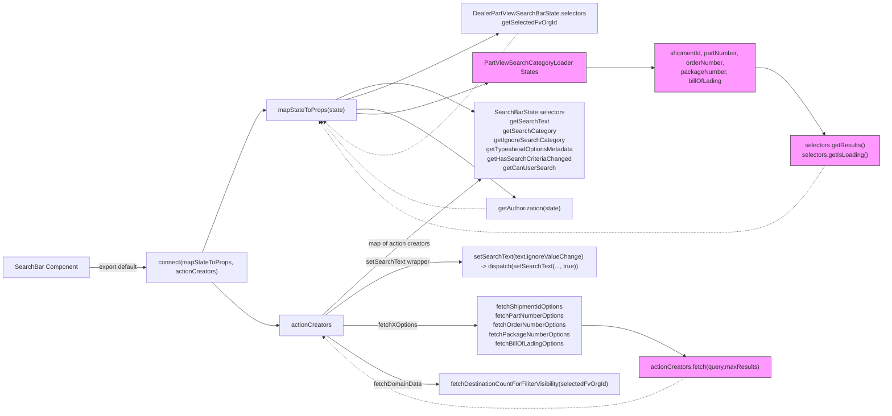

# Diagram: web/portal/src/pages/partview/components/search/DealerPartView.SearchBar.container.js

> Auto-generated by Obscura crawlers

## Mermaid

### SVG

<svg id="container" width="3326.453125" xmlns="http://www.w3.org/2000/svg" class="flowchart" height="799" viewBox="0 0 3326.453125 799" role="graphics-document document" aria-roledescription="flowchart-v2"><g><marker id="container_flowchart-v2-pointEnd" class="marker flowchart-v2" viewBox="0 0 10 10" refX="5" refY="5" markerUnits="userSpaceOnUse" markerWidth="8" markerHeight="8" orient="auto"><path d="M 0 0 L 10 5 L 0 10 z" class="arrowMarkerPath" style="stroke-width: 1; stroke-dasharray: 1, 0;"></path></marker><marker id="container_flowchart-v2-pointStart" class="marker flowchart-v2" viewBox="0 0 10 10" refX="4.5" refY="5" markerUnits="userSpaceOnUse" markerWidth="8" markerHeight="8" orient="auto"><path d="M 0 5 L 10 10 L 10 0 z" class="arrowMarkerPath" style="stroke-width: 1; stroke-dasharray: 1, 0;"></path></marker><marker id="container_flowchart-v2-circleEnd" class="marker flowchart-v2" viewBox="0 0 10 10" refX="11" refY="5" markerUnits="userSpaceOnUse" markerWidth="11" markerHeight="11" orient="auto"><circle cx="5" cy="5" r="5" class="arrowMarkerPath" style="stroke-width: 1; stroke-dasharray: 1, 0;"></circle></marker><marker id="container_flowchart-v2-circleStart" class="marker flowchart-v2" viewBox="0 0 10 10" refX="-1" refY="5" markerUnits="userSpaceOnUse" markerWidth="11" markerHeight="11" orient="auto"><circle cx="5" cy="5" r="5" class="arrowMarkerPath" style="stroke-width: 1; stroke-dasharray: 1, 0;"></circle></marker><marker id="container_flowchart-v2-crossEnd" class="marker cross flowchart-v2" viewBox="0 0 11 11" refX="12" refY="5.2" markerUnits="userSpaceOnUse" markerWidth="11" markerHeight="11" orient="auto"><path d="M 1,1 l 9,9 M 10,1 l -9,9" class="arrowMarkerPath" style="stroke-width: 2; stroke-dasharray: 1, 0;"></path></marker><marker id="container_flowchart-v2-crossStart" class="marker cross flowchart-v2" viewBox="0 0 11 11" refX="-1" refY="5.2" markerUnits="userSpaceOnUse" markerWidth="11" markerHeight="11" orient="auto"><path d="M 1,1 l 9,9 M 10,1 l -9,9" class="arrowMarkerPath" style="stroke-width: 2; stroke-dasharray: 1, 0;"></path></marker><g class="root"><g class="clusters"></g><g class="edgePaths"><path d="M229.359,499L242.122,499C254.885,499,280.411,499,305.271,499C330.13,499,354.323,499,366.419,499L378.516,499" id="L_SearchBar_Connect_0" class="edge-thickness-normal edge-pattern-solid edge-thickness-normal edge-pattern-solid flowchart-link" style=";" data-edge="true" data-et="edge" data-id="L_SearchBar_Connect_0" data-points="W3sieCI6MjI5LjM1OTM3NSwieSI6NDk5fSx7IngiOjMwNS45Mzc1LCJ5Ijo0OTl9LHsieCI6MzgyLjUxNTYyNSwieSI6NDk5fV0=" marker-end="url(#container_flowchart-v2-pointEnd)"></path><path d="M532.4,460L554.92,415.833C577.439,371.667,622.477,283.333,648.496,239.167C674.516,195,681.516,195,685.016,195L688.516,195" id="L_Connect_MapState_0" class="edge-thickness-normal edge-pattern-solid edge-thickness-normal edge-pattern-solid flowchart-link" style=";" data-edge="true" data-et="edge" data-id="L_Connect_MapState_0" data-points="W3sieCI6NTMyLjQwMDQ5MzQyMTA1MjYsInkiOjQ2MH0seyJ4Ijo2NjcuNTE1NjI1LCJ5IjoxOTV9LHsieCI6NjkyLjUxNTYyNSwieSI6MTk1fV0=" marker-end="url(#container_flowchart-v2-pointEnd)"></path><path d="M560.492,538L578.329,552.5C596.166,567,631.841,596,658.855,610.5C685.87,625,704.224,625,713.401,625L722.578,625" id="L_Connect_Actions_0" class="edge-thickness-normal edge-pattern-solid edge-thickness-normal edge-pattern-solid flowchart-link" style=";" data-edge="true" data-et="edge" data-id="L_Connect_Actions_0" data-points="W3sieCI6NTYwLjQ5MTgxNTQ3NjE5MDUsInkiOjUzOH0seyJ4Ijo2NjcuNTE1NjI1LCJ5Ijo2MjV9LHsieCI6NzI2LjU3ODEyNSwieSI6NjI1fV0=" marker-end="url(#container_flowchart-v2-pointEnd)"></path><path d="M906.71,168L927.766,162.167C948.822,156.333,990.935,144.667,1114.117,156.553C1237.299,168.439,1441.551,203.877,1543.677,221.597L1645.803,239.316" id="L_MapState_SearchBarStateSelectors_0" class="edge-thickness-normal edge-pattern-solid edge-thickness-normal edge-pattern-solid flowchart-link" style=";" data-edge="true" data-et="edge" data-id="L_MapState_SearchBarStateSelectors_0" data-points="W3sieCI6OTA2LjcwOTkyOTQzNTQ4MzksInkiOjE2OH0seyJ4IjoxMDMzLjA0Njg3NSwieSI6MTMzfSx7IngiOjE2NDkuNzQ0MTY5Nzc2MTE5NCwieSI6MjQwfV0=" marker-end="url(#container_flowchart-v2-pointEnd)"></path><path d="M925.984,177.787L943.828,175.156C961.672,172.525,997.359,167.262,1115.899,148.073C1234.438,128.883,1435.829,95.766,1536.524,79.208L1637.22,62.649" id="L_MapState_DealerSelectors_0" class="edge-thickness-normal edge-pattern-solid edge-thickness-normal edge-pattern-solid flowchart-link" style=";" data-edge="true" data-et="edge" data-id="L_MapState_DealerSelectors_0" data-points="W3sieCI6OTI1Ljk4NDM3NSwieSI6MTc3Ljc4NjkxNjE0ODg1MTV9LHsieCI6MTAzMy4wNDY4NzUsInkiOjE2Mn0seyJ4IjoxNjQxLjE2Njk1Mzc0MDE1NzQsInkiOjYyfV0=" marker-end="url(#container_flowchart-v2-pointEnd)"></path><path d="M925.984,208.04L943.828,210.034C961.672,212.027,997.359,216.013,1124.338,239.344C1251.316,262.675,1469.586,305.351,1578.721,326.688L1687.856,348.026" id="L_MapState_AuthSelector_0" class="edge-thickness-normal edge-pattern-solid edge-thickness-normal edge-pattern-solid flowchart-link" style=";" data-edge="true" data-et="edge" data-id="L_MapState_AuthSelector_0" data-points="W3sieCI6OTI1Ljk4NDM3NSwieSI6MjA4LjA0MDIxNTAzODc0ODg3fSx7IngiOjEwMzMuMDQ2ODc1LCJ5IjoyMjB9LHsieCI6MTY5MS43ODEyNSwieSI6MzQ4Ljc5MzU3ODUzODQ4MDIzfV0=" marker-end="url(#container_flowchart-v2-pointEnd)"></path><path d="M925.984,218.472L943.828,222.06C961.672,225.648,997.359,232.824,1119.196,224.428C1241.032,216.032,1449.018,192.064,1553.01,180.08L1657.003,168.096" id="L_MapState_PartViewOptions_0" class="edge-thickness-normal edge-pattern-solid edge-thickness-normal edge-pattern-solid flowchart-link" style=";" data-edge="true" data-et="edge" data-id="L_MapState_PartViewOptions_0" data-points="W3sieCI6OTI1Ljk4NDM3NSwieSI6MjE4LjQ3MjM4NzA2OTc0Nzk1fSx7IngiOjEwMzMuMDQ2ODc1LCJ5IjoyNDB9LHsieCI6MTY2MC45NzY1NjI1LCJ5IjoxNjcuNjM4NDMzNjgxMzE0MjR9XQ==" marker-end="url(#container_flowchart-v2-pointEnd)"></path><path d="M1949.742,151L2040.72,151C2131.698,151,2313.654,151,2411.772,151C2509.891,151,2524.172,151,2531.313,151L2538.453,151" id="L_PartViewOptions_PartViewOptions_sub_0" class="edge-thickness-normal edge-pattern-solid edge-thickness-normal edge-pattern-solid flowchart-link" style=";" data-edge="true" data-et="edge" data-id="L_PartViewOptions_PartViewOptions_sub_0" data-points="W3sieCI6MTk0OS43NDIxODc1LCJ5IjoxNTF9LHsieCI6MjQ5NS42MDkzNzUsInkiOjE1MX0seyJ4IjoyNTQyLjQ1MzEyNSwieSI6MTUxfV0=" marker-end="url(#container_flowchart-v2-pointEnd)"></path><path d="M2842.469,151L2850.276,151C2858.083,151,2873.698,151,2911.589,169.813C2949.48,188.626,3009.648,226.253,3039.732,245.066L3069.816,263.879" id="L_PartViewOptions_sub_OptionSelectors_0" class="edge-thickness-normal edge-pattern-solid edge-thickness-normal edge-pattern-solid flowchart-link" style=";" data-edge="true" data-et="edge" data-id="L_PartViewOptions_sub_OptionSelectors_0" data-points="W3sieCI6Mjg0Mi40Njg3NSwieSI6MTUxfSx7IngiOjI4ODkuMzEyNSwieSI6MTUxfSx7IngiOjMwNzMuMjA3NDcxMzkwODQ1LCJ5IjoyNjZ9XQ==" marker-end="url(#container_flowchart-v2-pointEnd)"></path><path d="M847.016,598L878.021,575.833C909.026,553.667,971.036,509.333,1112.562,458.832C1254.088,408.331,1475.129,351.662,1585.649,323.328L1696.169,294.993" id="L_Actions_SearchBarStateSelectors_0" class="edge-thickness-normal edge-pattern-solid edge-thickness-normal edge-pattern-solid flowchart-link" style=";" data-edge="true" data-et="edge" data-id="L_Actions_SearchBarStateSelectors_0" data-points="W3sieCI6ODQ3LjAxNTcyMjY1NjI1LCJ5Ijo1OTh9LHsieCI6MTAzMy4wNDY4NzUsInkiOjQ2NX0seyJ4IjoxNzAwLjA0NDAzNDA5MDkwOSwieSI6Mjk0fV0=" marker-end="url(#container_flowchart-v2-pointEnd)"></path><path d="M861.341,598L889.958,583.167C918.576,568.333,975.811,538.667,1103.742,523.833C1231.672,509,1430.297,509,1529.609,509L1628.922,509" id="L_Actions_SetSearchText_0" class="edge-thickness-normal edge-pattern-solid edge-thickness-normal edge-pattern-solid flowchart-link" style=";" data-edge="true" data-et="edge" data-id="L_Actions_SetSearchText_0" data-points="W3sieCI6ODYxLjM0MDY1MTkzOTY1NTEsInkiOjU5OH0seyJ4IjoxMDMzLjA0Njg3NSwieSI6NTA5fSx7IngiOjE2MzIuOTIxODc1LCJ5Ijo1MDl9XQ==" marker-end="url(#container_flowchart-v2-pointEnd)"></path><path d="M891.922,625L915.443,625C938.964,625,986.005,625,1048.275,625C1110.544,625,1188.042,625,1226.79,625L1265.539,625" id="L_Actions_FetchFuncs_0" class="edge-thickness-normal edge-pattern-solid edge-thickness-normal edge-pattern-solid flowchart-link" style=";" data-edge="true" data-et="edge" data-id="L_Actions_FetchFuncs_0" data-points="W3sieCI6ODkxLjkyMTg3NSwieSI6NjI1fSx7IngiOjEwMzMuMDQ2ODc1LCJ5Ijo2MjV9LHsieCI6MTI2OS41MzkwNjI1LCJ5Ijo2MjV9XQ==" marker-end="url(#container_flowchart-v2-pointEnd)"></path><path d="M2341.18,625L2366.918,625C2392.656,625,2444.133,625,2491.521,634.238C2538.909,643.477,2582.209,661.953,2603.858,671.192L2625.508,680.43" id="L_FetchFuncs_OptionActions_0" class="edge-thickness-normal edge-pattern-solid edge-thickness-normal edge-pattern-solid flowchart-link" style=";" data-edge="true" data-et="edge" data-id="L_FetchFuncs_OptionActions_0" data-points="W3sieCI6MjM0MS4xNzk2ODc1LCJ5Ijo2MjV9LHsieCI6MjQ5NS42MDkzNzUsInkiOjYyNX0seyJ4IjoyNjI5LjE4NzIyMDk4MjE0MjcsInkiOjY4Mn1d" marker-end="url(#container_flowchart-v2-pointEnd)"></path><path d="M867.351,652L894.967,664.833C922.583,677.667,977.815,703.333,1093.867,716.167C1209.919,729,1386.792,729,1475.228,729L1563.664,729" id="L_Actions_FetchDomain_0" class="edge-thickness-normal edge-pattern-solid edge-thickness-normal edge-pattern-solid flowchart-link" style=";" data-edge="true" data-et="edge" data-id="L_Actions_FetchDomain_0" data-points="W3sieCI6ODY3LjM1MTExMTc3ODg0NjIsInkiOjY1Mn0seyJ4IjoxMDMzLjA0Njg3NSwieSI6NzI5fSx7IngiOjE1NjcuNjY0MDYyNSwieSI6NzI5fV0=" marker-end="url(#container_flowchart-v2-pointEnd)"></path><path d="M1691.781,371.147L1581.992,371.289C1472.203,371.431,1252.625,371.716,1111.749,347.271C970.873,322.827,908.7,273.654,877.613,249.068L846.526,224.481" id="L_AuthSelector_MapState_0" class="edge-thickness-normal edge-pattern-dotted edge-thickness-normal edge-pattern-solid flowchart-link" style=";" data-edge="true" data-et="edge" data-id="L_AuthSelector_MapState_0" data-points="W3sieCI6MTY5MS43ODEyNSwieSI6MzcxLjE0NzA2MjM5Mzc4NDl9LHsieCI6MTAzMy4wNDY4NzUsInkiOjM3Mn0seyJ4Ijo4NDMuMzg4NTA2MzU1OTMyMiwieSI6MjIyfV0=" marker-end="url(#container_flowchart-v2-pointEnd)"></path><path d="M1739.161,62L1621.475,110C1503.79,158,1268.418,254,1120.478,281.046C972.539,308.092,912.03,266.185,881.776,245.231L851.522,224.277" id="L_DealerSelectors_MapState_0" class="edge-thickness-normal edge-pattern-dotted edge-thickness-normal edge-pattern-solid flowchart-link" style=";" data-edge="true" data-et="edge" data-id="L_DealerSelectors_MapState_0" data-points="W3sieCI6MTczOS4xNjExNjA3MTQyODU2LCJ5Ijo2Mn0seyJ4IjoxMDMzLjA0Njg3NSwieSI6MzUwfSx7IngiOjg0OC4yMzM5NzE3NzQxOTM2LCJ5IjoyMjJ9XQ==" marker-end="url(#container_flowchart-v2-pointEnd)"></path><path d="M3072.591,320L3042.044,338.833C3011.498,357.667,2950.405,395.333,2887.05,414.167C2823.695,433,2758.078,433,2692.461,433C2626.844,433,2561.227,433,2413.376,433C2265.526,433,2035.443,433,1791.682,433C1547.922,433,1290.484,433,1129.154,398.319C967.824,363.638,902.602,294.276,869.99,259.595L837.379,224.914" id="L_OptionSelectors_MapState_0" class="edge-thickness-normal edge-pattern-dotted edge-thickness-normal edge-pattern-solid flowchart-link" style=";" data-edge="true" data-et="edge" data-id="L_OptionSelectors_MapState_0" data-points="W3sieCI6MzA3Mi41OTA2ODA4MDM1NzE2LCJ5IjozMjB9LHsieCI6Mjg4OS4zMTI1LCJ5Ijo0MzN9LHsieCI6MjY5Mi40NjA5Mzc1LCJ5Ijo0MzN9LHsieCI6MjQ5NS42MDkzNzUsInkiOjQzM30seyJ4IjoxODA1LjM1OTM3NSwieSI6NDMzfSx7IngiOjEwMzMuMDQ2ODc1LCJ5Ijo0MzN9LHsieCI6ODM0LjYzODcyMTExMzQ0NTQsInkiOjIyMn1d" marker-end="url(#container_flowchart-v2-pointEnd)"></path><path d="M2627.644,736L2605.638,745.167C2583.632,754.333,2539.621,772.667,2402.573,781.833C2265.526,791,2035.443,791,1791.682,791C1547.922,791,1290.484,791,1131.068,768.23C971.652,745.461,910.258,699.922,879.561,677.152L848.863,654.383" id="L_OptionActions_Actions_0" class="edge-thickness-normal edge-pattern-dotted edge-thickness-normal edge-pattern-solid flowchart-link" style=";" data-edge="true" data-et="edge" data-id="L_OptionActions_Actions_0" data-points="W3sieCI6MjYyNy42NDM5NTk2MDM2NTg1LCJ5Ijo3MzZ9LHsieCI6MjQ5NS42MDkzNzUsInkiOjc5MX0seyJ4IjoxODA1LjM1OTM3NSwieSI6NzkxfSx7IngiOjEwMzMuMDQ2ODc1LCJ5Ijo3OTF9LHsieCI6ODQ1LjY1MDY5NjUzNjE0NDYsInkiOjY1Mn1d" marker-end="url(#container_flowchart-v2-pointEnd)"></path></g><g class="edgeLabels"><g class="edgeLabel" transform="translate(305.9375, 499)"><g class="label" data-id="L_SearchBar_Connect_0" transform="translate(-51.578125, -12)"><foreignObject width="103.15625" height="24">

export default

</foreignObject></g></g><g class="edgeLabel"><g class="label" data-id="L_Connect_MapState_0" transform="translate(0, 0)"><foreignObject width="0" height="0">

</foreignObject></g></g><g class="edgeLabel"><g class="label" data-id="L_Connect_Actions_0" transform="translate(0, 0)"><foreignObject width="0" height="0">

</foreignObject></g></g><g class="edgeLabel"><g class="label" data-id="L_MapState_SearchBarStateSelectors_0" transform="translate(0, 0)"><foreignObject width="0" height="0">

</foreignObject></g></g><g class="edgeLabel"><g class="label" data-id="L_MapState_DealerSelectors_0" transform="translate(0, 0)"><foreignObject width="0" height="0">

</foreignObject></g></g><g class="edgeLabel"><g class="label" data-id="L_MapState_AuthSelector_0" transform="translate(0, 0)"><foreignObject width="0" height="0">

</foreignObject></g></g><g class="edgeLabel"><g class="label" data-id="L_MapState_PartViewOptions_0" transform="translate(0, 0)"><foreignObject width="0" height="0">

</foreignObject></g></g><g class="edgeLabel"><g class="label" data-id="L_PartViewOptions_PartViewOptions_sub_0" transform="translate(0, 0)"><foreignObject width="0" height="0">

</foreignObject></g></g><g class="edgeLabel"><g class="label" data-id="L_PartViewOptions_sub_OptionSelectors_0" transform="translate(0, 0)"><foreignObject width="0" height="0">

</foreignObject></g></g><g class="edgeLabel" transform="translate(1255.78526, 407.89591)"><g class="label" data-id="L_Actions_SearchBarStateSelectors_0" transform="translate(-81.8046875, -12)"><foreignObject width="163.609375" height="24">

map of action creators

</foreignObject></g></g><g class="edgeLabel" transform="translate(1033.046875, 509)"><g class="label" data-id="L_Actions_SetSearchText_0" transform="translate(-82.0625, -12)"><foreignObject width="164.125" height="24">

setSearchText wrapper

</foreignObject></g></g><g class="edgeLabel" transform="translate(1033.046875, 625)"><g class="label" data-id="L_Actions_FetchFuncs_0" transform="translate(-50.9765625, -12)"><foreignObject width="101.953125" height="24">

fetchXOptions

</foreignObject></g></g><g class="edgeLabel"><g class="label" data-id="L_FetchFuncs_OptionActions_0" transform="translate(0, 0)"><foreignObject width="0" height="0">

</foreignObject></g></g><g class="edgeLabel" transform="translate(1033.046875, 729)"><g class="label" data-id="L_Actions_FetchDomain_0" transform="translate(-62.828125, -12)"><foreignObject width="125.65625" height="24">

fetchDomainData

</foreignObject></g></g><g class="edgeLabel"><g class="label" data-id="L_AuthSelector_MapState_0" transform="translate(0, 0)"><foreignObject width="0" height="0">

</foreignObject></g></g><g class="edgeLabel"><g class="label" data-id="L_DealerSelectors_MapState_0" transform="translate(0, 0)"><foreignObject width="0" height="0">

</foreignObject></g></g><g class="edgeLabel"><g class="label" data-id="L_OptionSelectors_MapState_0" transform="translate(0, 0)"><foreignObject width="0" height="0">

</foreignObject></g></g><g class="edgeLabel"><g class="label" data-id="L_OptionActions_Actions_0" transform="translate(0, 0)"><foreignObject width="0" height="0">

</foreignObject></g></g></g><g class="nodes"><g class="node default" id="flowchart-SearchBar-0" transform="translate(118.6796875, 499)"><rect class="basic label-container" style="" x="-110.6796875" y="-27" width="221.359375" height="54"></rect><g class="label" style="" transform="translate(-80.6796875, -12)"><rect></rect><foreignObject width="161.359375" height="24">

SearchBar Component

</foreignObject></g></g><g class="node default" id="flowchart-Connect-1" transform="translate(512.515625, 499)"><rect class="basic label-container" style="" x="-130" y="-39" width="260" height="78"></rect><g class="label" style="" transform="translate(-100, -24)"><rect></rect><foreignObject width="200" height="48">

connect(mapStateToProps, actionCreators)

</foreignObject></g></g><g class="node default" id="flowchart-MapState-2" transform="translate(809.25, 195)"><rect class="basic label-container" style="" x="-116.734375" y="-27" width="233.46875" height="54"></rect><g class="label" style="" transform="translate(-86.734375, -12)"><rect></rect><foreignObject width="173.46875" height="24">

mapStateToProps(state)

</foreignObject></g></g><g class="node default" id="flowchart-Actions-3" transform="translate(809.25, 625)"><rect class="basic label-container" style="" x="-82.671875" y="-27" width="165.34375" height="54"></rect><g class="label" style="" transform="translate(-52.671875, -12)"><rect></rect><foreignObject width="105.34375" height="24">

actionCreators

</foreignObject></g></g><g class="node default" id="flowchart-SearchBarStateSelectors-4" transform="translate(1805.359375, 267)"><rect class="basic label-container" style="" x="-665.25" y="-27" width="1330.5" height="54"></rect><g class="label" style="" transform="translate(-635.25, -12)"><rect></rect><foreignObject width="1270.5" height="24">

SearchBarState.selectors\ngetSearchText\ngetSearchCategory\ngetIgnoreSearchCategory\ngetTypeaheadOptionsMetadata\ngetHasSearchCriteriaChanged\ngetCanUserSearch

</foreignObject></g></g><g class="node default" id="flowchart-DealerSelectors-5" transform="translate(1805.359375, 35)"><rect class="basic label-container" style="" x="-253.046875" y="-27" width="506.09375" height="54"></rect><g class="label" style="" transform="translate(-223.046875, -12)"><rect></rect><foreignObject width="446.09375" height="24">

DealerPartViewSearchBarState.selectors\ngetSelectedFvOrgId

</foreignObject></g></g><g class="node default" id="flowchart-AuthSelector-6" transform="translate(1805.359375, 371)"><rect class="basic label-container" style="" x="-113.578125" y="-27" width="227.15625" height="54"></rect><g class="label" style="" transform="translate(-83.578125, -12)"><rect></rect><foreignObject width="167.15625" height="24">

getAuthorization(state)

</foreignObject></g></g><g class="node default state" id="flowchart-PartViewOptions-7" transform="translate(1805.359375, 151)"><rect class="basic label-container" style="fill:#f9f !important;stroke:#333 !important;stroke-width:1px !important" x="-144.3828125" y="-39" width="288.765625" height="78"></rect><g class="label" style="" transform="translate(-114.3828125, -24)"><rect></rect><foreignObject width="228.765625" height="48">

PartViewSearchCategoryLoader States

</foreignObject></g></g><g class="node default state" id="flowchart-PartViewOptions_sub-8" transform="translate(2692.4609375, 151)"><rect class="basic label-container" style="fill:#f9f !important;stroke:#333 !important;stroke-width:1px !important" x="-150.0078125" y="-51" width="300.015625" height="102"></rect><g class="label" style="" transform="translate(-120.0078125, -36)"><rect></rect><foreignObject width="240.015625" height="72">

shipmentId, partNumber, orderNumber,\npackageNumber, billOfLading

</foreignObject></g></g><g class="node default state" id="flowchart-OptionSelectors-9" transform="translate(3116.3828125, 293)"><rect class="basic label-container" style="fill:#f9f !important;stroke:#333 !important;stroke-width:1px !important" x="-202.0703125" y="-27" width="404.140625" height="54"></rect><g class="label" style="" transform="translate(-172.0703125, -12)"><rect></rect><foreignObject width="344.140625" height="24">

selectors.getResults()\nselectors.getIsLoading()

</foreignObject></g></g><g class="node default state" id="flowchart-OptionActions-10" transform="translate(2692.4609375, 709)"><rect class="basic label-container" style="fill:#f9f !important;stroke:#333 !important;stroke-width:1px !important" x="-171.8515625" y="-27" width="343.703125" height="54"></rect><g class="label" style="" transform="translate(-141.8515625, -12)"><rect></rect><foreignObject width="283.703125" height="24">

actionCreators.fetch(query,maxResults)

</foreignObject></g></g><g class="node default" id="flowchart-FetchDomain-11" transform="translate(1805.359375, 729)"><rect class="basic label-container" style="" x="-237.6953125" y="-27" width="475.390625" height="54"></rect><g class="label" style="" transform="translate(-207.6953125, -12)"><rect></rect><foreignObject width="415.390625" height="24">

fetchDestinationCountForFiliterVisibility(selectedFvOrgId)

</foreignObject></g></g><g class="node default" id="flowchart-SetSearchText-33" transform="translate(1805.359375, 509)"><rect class="basic label-container" style="" x="-172.4375" y="-39" width="344.875" height="78"></rect><g class="label" style="" transform="translate(-142.4375, -24)"><rect></rect><foreignObject width="284.875" height="48">

setSearchText(text,ignoreValueChange) -&gt; dispatch(setSearchText(..., true))

</foreignObject></g></g><g class="node default" id="flowchart-FetchFuncs-35" transform="translate(1805.359375, 625)"><rect class="basic label-container" style="" x="-535.8203125" y="-27" width="1071.640625" height="54"></rect><g class="label" style="" transform="translate(-505.8203125, -12)"><rect></rect><foreignObject width="1011.640625" height="24">

fetchShipmentIdOptions\nfetchPartNumberOptions\nfetchOrderNumberOptions\nfetchPackageNumberOptions\nfetchBillOfLadingOptions

</foreignObject></g></g></g></g></g></svg>
