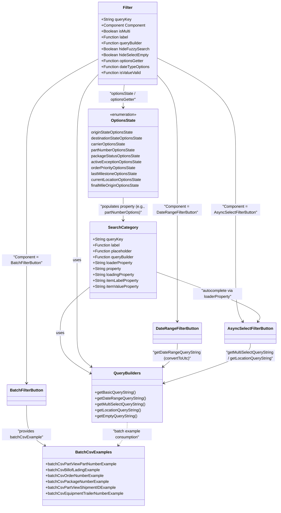

# Diagram: web/portal/src/pages/partview/components/search/PartView.searchOptions.js

> Auto-generated by Obscura crawlers

## Mermaid

### SVG

<svg id="container" width="1117.099609375" xmlns="http://www.w3.org/2000/svg" class="classDiagram" height="2060" viewBox="0 0 1117.099609375 2060" role="graphics-document document" aria-roledescription="class"><g><defs><marker id="container_class-aggregationStart" class="marker aggregation class" refX="18" refY="7" markerWidth="190" markerHeight="240" orient="auto"><path d="M 18,7 L9,13 L1,7 L9,1 Z"></path></marker></defs><defs><marker id="container_class-aggregationEnd" class="marker aggregation class" refX="1" refY="7" markerWidth="20" markerHeight="28" orient="auto"><path d="M 18,7 L9,13 L1,7 L9,1 Z"></path></marker></defs><defs><marker id="container_class-extensionStart" class="marker extension class" refX="18" refY="7" markerWidth="190" markerHeight="240" orient="auto"><path d="M 1,7 L18,13 V 1 Z"></path></marker></defs><defs><marker id="container_class-extensionEnd" class="marker extension class" refX="1" refY="7" markerWidth="20" markerHeight="28" orient="auto"><path d="M 1,1 V 13 L18,7 Z"></path></marker></defs><defs><marker id="container_class-compositionStart" class="marker composition class" refX="18" refY="7" markerWidth="190" markerHeight="240" orient="auto"><path d="M 18,7 L9,13 L1,7 L9,1 Z"></path></marker></defs><defs><marker id="container_class-compositionEnd" class="marker composition class" refX="1" refY="7" markerWidth="20" markerHeight="28" orient="auto"><path d="M 18,7 L9,13 L1,7 L9,1 Z"></path></marker></defs><defs><marker id="container_class-dependencyStart" class="marker dependency class" refX="6" refY="7" markerWidth="190" markerHeight="240" orient="auto"><path d="M 5,7 L9,13 L1,7 L9,1 Z"></path></marker></defs><defs><marker id="container_class-dependencyEnd" class="marker dependency class" refX="13" refY="7" markerWidth="20" markerHeight="28" orient="auto"><path d="M 18,7 L9,13 L14,7 L9,1 Z"></path></marker></defs><defs><marker id="container_class-lollipopStart" class="marker lollipop class" refX="13" refY="7" markerWidth="190" markerHeight="240" orient="auto"><circle stroke="black" fill="transparent" cx="7" cy="7" r="6"></circle></marker></defs><defs><marker id="container_class-lollipopEnd" class="marker lollipop class" refX="1" refY="7" markerWidth="190" markerHeight="240" orient="auto"><circle stroke="black" fill="transparent" cx="7" cy="7" r="6"></circle></marker></defs><g class="root"><g class="clusters"></g><g class="edgePaths"><path d="M361.951,1164.582L341.995,1180.651C322.038,1196.721,282.126,1228.861,262.169,1260.097C242.213,1291.333,242.213,1321.667,242.213,1352C242.213,1382.333,242.213,1412.667,262.918,1440.039C283.624,1467.412,325.035,1491.824,345.741,1504.03L366.446,1516.236" id="id_SearchCategory_QueryBuilders_1" class="edge-thickness-normal edge-pattern-solid relation" style=";;;" data-edge="true" data-et="edge" data-id="id_SearchCategory_QueryBuilders_1" data-points="W3sieCI6MzYxLjk1MTE3MTg3NSwieSI6MTE2NC41ODE3NzQ2NjEyODZ9LHsieCI6MjQyLjIxMjg5MDYyNSwieSI6MTI2MX0seyJ4IjoyNDIuMjEyODkwNjI1LCJ5IjoxMzUyfSx7IngiOjI0Mi4yMTI4OTA2MjUsInkiOjE0NDN9LHsieCI6MzcxLjYxNTIzNDM3NSwieSI6MTUxOS4yODMzNTM5NjIxNzcyfV0=" marker-end="url(#container_class-dependencyEnd)"></path><path d="M394.529,303.827L380.518,318.689C366.506,333.551,338.482,363.276,324.471,416.304C310.459,469.333,310.459,545.667,310.459,622C310.459,698.333,310.459,774.667,310.459,847C310.459,919.333,310.459,987.667,310.459,1056C310.459,1124.333,310.459,1192.667,310.459,1242C310.459,1291.333,310.459,1321.667,310.459,1352C310.459,1382.333,310.459,1412.667,320.043,1435.381C329.628,1458.096,348.797,1473.192,358.381,1480.74L367.965,1488.288" id="id_Filter_QueryBuilders_2" class="edge-thickness-normal edge-pattern-solid relation" style=";;;" data-edge="true" data-et="edge" data-id="id_Filter_QueryBuilders_2" data-points="W3sieCI6Mzk0LjUyOTI5Njg3NSwieSI6MzAzLjgyNjY4NTUwNTg5MDQ1fSx7IngiOjMxMC40NTg5ODQzNzUsInkiOjM5M30seyJ4IjozMTAuNDU4OTg0Mzc1LCJ5Ijo2MjJ9LHsieCI6MzEwLjQ1ODk4NDM3NSwieSI6ODUxfSx7IngiOjMxMC40NTg5ODQzNzUsInkiOjEwNTZ9LHsieCI6MzEwLjQ1ODk4NDM3NSwieSI6MTI2MX0seyJ4IjozMTAuNDU4OTg0Mzc1LCJ5IjoxMzUyfSx7IngiOjMxMC40NTg5ODQzNzUsInkiOjE0NDN9LHsieCI6MzcyLjY3OTE3NDgwNDY4NzUsInkiOjE0OTJ9XQ==" marker-end="url(#container_class-dependencyEnd)"></path><path d="M635.553,236.257L687.799,262.381C740.045,288.505,844.537,340.752,896.783,405.043C949.029,469.333,949.029,545.667,949.029,622C949.029,698.333,949.029,774.667,949.029,847C949.029,919.333,949.029,987.667,949.029,1056C949.029,1124.333,949.029,1192.667,953.863,1234.165C958.698,1275.664,968.366,1290.327,973.2,1297.659L978.034,1304.991" id="id_Filter_AsyncSelectFilterButton_3" class="edge-thickness-normal edge-pattern-solid relation" style=";;;" data-edge="true" data-et="edge" data-id="id_Filter_AsyncSelectFilterButton_3" data-points="W3sieCI6NjM1LjU1MjczNDM3NSwieSI6MjM2LjI1NzQ4NjQzMTI2NTI1fSx7IngiOjk0OS4wMjkyOTY4NzUsInkiOjM5M30seyJ4Ijo5NDkuMDI5Mjk2ODc1LCJ5Ijo2MjJ9LHsieCI6OTQ5LjAyOTI5Njg3NSwieSI6ODUxfSx7IngiOjk0OS4wMjkyOTY4NzUsInkiOjEwNTZ9LHsieCI6OTQ5LjAyOTI5Njg3NSwieSI6MTI2MX0seyJ4Ijo5ODEuMzM2OTg5MTgyNjkyMywieSI6MTMxMH1d" marker-end="url(#container_class-dependencyEnd)"></path><path d="M635.553,305.619L649.093,320.182C662.633,334.746,689.714,363.873,703.255,416.603C716.795,469.333,716.795,545.667,716.795,622C716.795,698.333,716.795,774.667,716.795,847C716.795,919.333,716.795,987.667,716.795,1056C716.795,1124.333,716.795,1192.667,716.795,1234C716.795,1275.333,716.795,1289.667,716.795,1296.833L716.795,1304" id="id_Filter_DateRangeFilterButton_4" class="edge-thickness-normal edge-pattern-solid relation" style=";;;" data-edge="true" data-et="edge" data-id="id_Filter_DateRangeFilterButton_4" data-points="W3sieCI6NjM1LjU1MjczNDM3NSwieSI6MzA1LjYxODUyMTE3MTc1NTV9LHsieCI6NzE2Ljc5NDkyMTg3NSwieSI6MzkzfSx7IngiOjcxNi43OTQ5MjE4NzUsInkiOjYyMn0seyJ4Ijo3MTYuNzk0OTIxODc1LCJ5Ijo4NTF9LHsieCI6NzE2Ljc5NDkyMTg3NSwieSI6MTA1Nn0seyJ4Ijo3MTYuNzk0OTIxODc1LCJ5IjoxMjYxfSx7IngiOjcxNi43OTQ5MjE4NzUsInkiOjEzMTB9XQ==" marker-end="url(#container_class-dependencyEnd)"></path><path d="M394.529,240.247L346.774,265.706C299.02,291.164,203.51,342.082,155.755,405.708C108,469.333,108,545.667,108,622C108,698.333,108,774.667,108,847C108,919.333,108,987.667,108,1056C108,1124.333,108,1192.667,108,1242C108,1291.333,108,1321.667,108,1352C108,1382.333,108,1412.667,108,1446.5C108,1480.333,108,1517.667,108,1536.333L108,1555" id="id_Filter_BatchFilterButton_5" class="edge-thickness-normal edge-pattern-solid relation" style=";;;" data-edge="true" data-et="edge" data-id="id_Filter_BatchFilterButton_5" data-points="W3sieCI6Mzk0LjUyOTI5Njg3NSwieSI6MjQwLjI0NjcwMjMzNDM5Njk2fSx7IngiOjEwOCwieSI6MzkzfSx7IngiOjEwOCwieSI6NjIyfSx7IngiOjEwOCwieSI6ODUxfSx7IngiOjEwOCwieSI6MTA1Nn0seyJ4IjoxMDgsInkiOjEyNjF9LHsieCI6MTA4LCJ5IjoxMzUyfSx7IngiOjEwOCwieSI6MTQ0M30seyJ4IjoxMDgsInkiOjE1NjF9XQ==" marker-end="url(#container_class-dependencyEnd)"></path><path d="M500.915,344L500.228,352.167C499.542,360.333,498.168,376.667,497.482,392C496.795,407.333,496.795,421.667,496.795,428.833L496.795,436" id="id_Filter_OptionsState_6" class="edge-thickness-normal edge-pattern-solid relation" style=";;;" data-edge="true" data-et="edge" data-id="id_Filter_OptionsState_6" data-points="W3sieCI6NTAwLjkxNTAwNzU2MDQ4Mzg0LCJ5IjozNDR9LHsieCI6NDk2Ljc5NDkyMTg3NSwieSI6MzkzfSx7IngiOjQ5Ni43OTQ5MjE4NzUsInkiOjQ0Mn1d" marker-end="url(#container_class-dependencyEnd)"></path><path d="M108,1645L108,1664.667C108,1684.333,108,1723.667,120.267,1750.971C132.534,1778.276,157.067,1793.552,169.334,1801.19L181.601,1808.829" id="id_BatchFilterButton_BatchCsvExamples_7" class="edge-thickness-normal edge-pattern-solid relation" style=";;;" data-edge="true" data-et="edge" data-id="id_BatchFilterButton_BatchCsvExamples_7" data-points="W3sieCI6MTA4LCJ5IjoxNjQ1fSx7IngiOjEwOCwieSI6MTc2M30seyJ4IjoxODYuNjk0MDE4MTIxMzAxNzgsInkiOjE4MTJ9XQ==" marker-end="url(#container_class-dependencyEnd)"></path><path d="M716.795,1394L716.795,1402.167C716.795,1410.333,716.795,1426.667,707.211,1442.381C697.626,1458.096,678.457,1473.192,668.873,1480.74L659.288,1488.288" id="id_DateRangeFilterButton_QueryBuilders_8" class="edge-thickness-normal edge-pattern-solid relation" style=";;;" data-edge="true" data-et="edge" data-id="id_DateRangeFilterButton_QueryBuilders_8" data-points="W3sieCI6NzE2Ljc5NDkyMTg3NSwieSI6MTM5NH0seyJ4Ijo3MTYuNzk0OTIxODc1LCJ5IjoxNDQzfSx7IngiOjY1NC41NzQ3MzE0NDUzMTI1LCJ5IjoxNDkyfV0=" marker-end="url(#container_class-dependencyEnd)"></path><path d="M1009.029,1394L1009.029,1402.167C1009.029,1410.333,1009.029,1426.667,951.082,1453.548C893.136,1480.43,777.242,1517.86,719.295,1536.575L661.348,1555.29" id="id_AsyncSelectFilterButton_QueryBuilders_9" class="edge-thickness-normal edge-pattern-solid relation" style=";;;" data-edge="true" data-et="edge" data-id="id_AsyncSelectFilterButton_QueryBuilders_9" data-points="W3sieCI6MTAwOS4wMjkyOTY4NzUsInkiOjEzOTR9LHsieCI6MTAwOS4wMjkyOTY4NzUsInkiOjE0NDN9LHsieCI6NjU1LjYzODY3MTg3NSwieSI6MTU1Ny4xMzQ1MDI0MTY3NTR9XQ==" marker-end="url(#container_class-dependencyEnd)"></path><path d="M631.639,1104.307L704.537,1130.423C777.436,1156.538,923.232,1208.769,991.297,1242.216C1059.361,1275.664,1049.693,1290.327,1044.859,1297.659L1040.024,1304.991" id="id_SearchCategory_AsyncSelectFilterButton_10" class="edge-thickness-normal edge-pattern-solid relation" style=";;;" data-edge="true" data-et="edge" data-id="id_SearchCategory_AsyncSelectFilterButton_10" data-points="W3sieCI6NjMxLjYzODY3MTg3NSwieSI6MTEwNC4zMDcwNzQ3ODkwNjd9LHsieCI6MTA2OS4wMjkyOTY4NzUsInkiOjEyNjF9LHsieCI6MTAzNi43MjE2MDQ1NjczMDc2LCJ5IjoxMzEwfV0=" marker-end="url(#container_class-dependencyEnd)"></path><path d="M496.795,802L496.795,810.167C496.795,818.333,496.795,834.667,496.795,850C496.795,865.333,496.795,879.667,496.795,886.833L496.795,894" id="id_OptionsState_SearchCategory_11" class="edge-thickness-normal edge-pattern-solid relation" style=";;;" data-edge="true" data-et="edge" data-id="id_OptionsState_SearchCategory_11" data-points="W3sieCI6NDk2Ljc5NDkyMTg3NSwieSI6ODAyfSx7IngiOjQ5Ni43OTQ5MjE4NzUsInkiOjg1MX0seyJ4Ijo0OTYuNzk0OTIxODc1LCJ5Ijo5MDB9XQ==" marker-end="url(#container_class-dependencyEnd)"></path><path d="M513.627,1714L513.627,1722.167C513.627,1730.333,513.627,1746.667,507.763,1762.217C501.899,1777.767,490.172,1792.534,484.308,1799.918L478.445,1807.301" id="id_QueryBuilders_BatchCsvExamples_12" class="edge-thickness-normal edge-pattern-dashed relation" style=";;;" data-edge="true" data-et="edge" data-id="id_QueryBuilders_BatchCsvExamples_12" data-points="W3sieCI6NTEzLjYyNjk1MzEyNSwieSI6MTcxNH0seyJ4Ijo1MTMuNjI2OTUzMTI1LCJ5IjoxNzYzfSx7IngiOjQ3NC43MTMxNTY0MzQ5MTEyNCwieSI6MTgxMn1d" marker-end="url(#container_class-dependencyEnd)"></path></g><g class="edgeLabels"><g class="edgeLabel" transform="translate(242.212890625, 1352)"><g class="label" data-id="id_SearchCategory_QueryBuilders_1" transform="translate(-16.4921875, -12)"><foreignObject width="32.984375" height="24">

uses

</foreignObject></g></g><g class="edgeLabel" transform="translate(310.458984375, 1056)"><g class="label" data-id="id_Filter_QueryBuilders_2" transform="translate(-16.4921875, -12)"><foreignObject width="32.984375" height="24">

uses

</foreignObject></g></g><g class="edgeLabel" transform="translate(949.029296875, 851)"><g class="label" data-id="id_Filter_AsyncSelectFilterButton_3" transform="translate(-100, -24)"><foreignObject width="200" height="48">

"Component = AsyncSelectFilterButton"

</foreignObject></g></g><g class="edgeLabel" transform="translate(716.794921875, 851)"><g class="label" data-id="id_Filter_DateRangeFilterButton_4" transform="translate(-100, -24)"><foreignObject width="200" height="48">

"Component = DateRangeFilterButton"

</foreignObject></g></g><g class="edgeLabel" transform="translate(108, 1056)"><g class="label" data-id="id_Filter_BatchFilterButton_5" transform="translate(-100, -24)"><foreignObject width="200" height="48">

"Component = BatchFilterButton"

</foreignObject></g></g><g class="edgeLabel" transform="translate(496.794921875, 393)"><g class="label" data-id="id_Filter_OptionsState_6" transform="translate(-100, -24)"><foreignObject width="200" height="48">

"optionsState / optionsGetter"

</foreignObject></g></g><g class="edgeLabel" transform="translate(108, 1763)"><g class="label" data-id="id_BatchFilterButton_BatchCsvExamples_7" transform="translate(-100, -24)"><foreignObject width="200" height="48">

"provides batchCsvExample"

</foreignObject></g></g><g class="edgeLabel" transform="translate(716.794921875, 1443)"><g class="label" data-id="id_DateRangeFilterButton_QueryBuilders_8" transform="translate(-100, -24)"><foreignObject width="200" height="48">

"getDateRangeQueryString (convertToUtc)"

</foreignObject></g></g><g class="edgeLabel" transform="translate(1009.029296875, 1443)"><g class="label" data-id="id_AsyncSelectFilterButton_QueryBuilders_9" transform="translate(-100.0703125, -24)"><foreignObject width="200.140625" height="48">

"getMultiSelectQueryString / getLocationQueryString"

</foreignObject></g></g><g class="edgeLabel" transform="translate(877.96083, 1192.55071)"><g class="label" data-id="id_SearchCategory_AsyncSelectFilterButton_10" transform="translate(-100, -24)"><foreignObject width="200" height="48">

"autocomplete via loaderProperty"

</foreignObject></g></g><g class="edgeLabel" transform="translate(496.794921875, 851)"><g class="label" data-id="id_OptionsState_SearchCategory_11" transform="translate(-100, -24)"><foreignObject width="200" height="48">

"populates property (e.g., partNumberOptions)"

</foreignObject></g></g><g class="edgeLabel" transform="translate(513.626953125, 1763)"><g class="label" data-id="id_QueryBuilders_BatchCsvExamples_12" transform="translate(-100, -24)"><foreignObject width="200" height="48">

"batch example consumption"

</foreignObject></g></g></g><g class="nodes"><g class="node default" id="classId-SearchCategory-0" transform="translate(496.794921875, 1056)"><g class="basic label-container"><path d="M-134.84375 -156 L134.84375 -156 L134.84375 156 L-134.84375 156" stroke="none" stroke-width="0" fill="#ECECFF" style=""></path><path d="M-134.84375 -156 C-51.4696208609173 -156, 31.904508278165395 -156, 134.84375 -156 M-134.84375 -156 C-63.07808423076274 -156, 8.687581538474518 -156, 134.84375 -156 M134.84375 -156 C134.84375 -88.8818808582973, 134.84375 -21.763761716594587, 134.84375 156 M134.84375 -156 C134.84375 -79.22572474609112, 134.84375 -2.4514494921822347, 134.84375 156 M134.84375 156 C65.64820015211485 156, -3.5473496957702935 156, -134.84375 156 M134.84375 156 C75.62273524639394 156, 16.401720492787874 156, -134.84375 156 M-134.84375 156 C-134.84375 76.46499980403745, -134.84375 -3.070000391925106, -134.84375 -156 M-134.84375 156 C-134.84375 63.51703798374696, -134.84375 -28.96592403250608, -134.84375 -156" stroke="#9370DB" stroke-width="1.3" fill="none" stroke-dasharray="0 0" style=""></path></g><g class="annotation-group text" transform="translate(0, -132)"></g><g class="label-group text" transform="translate(-57.234375, -132)"><g class="label" style="font-weight: bolder" transform="translate(0,-12)"><foreignObject width="114.46875" height="24">

SearchCategory

</foreignObject></g></g><g class="members-group text" transform="translate(-122.84375, -84)"><g class="label" style="" transform="translate(0,-12)"><foreignObject width="121.84375" height="24">

+String queryKey

</foreignObject></g><g class="label" style="" transform="translate(0,12)"><foreignObject width="111.0625" height="24">

+Function label

</foreignObject></g><g class="label" style="" transform="translate(0,36)"><foreignObject width="161.5" height="24">

+Function placeholder

</foreignObject></g><g class="label" style="" transform="translate(0,60)"><foreignObject width="169.109375" height="24">

+Function queryBuilder

</foreignObject></g><g class="label" style="" transform="translate(0,84)"><foreignObject width="163.421875" height="24">

+String loaderProperty

</foreignObject></g><g class="label" style="" transform="translate(0,108)"><foreignObject width="116.984375" height="24">

+String property

</foreignObject></g><g class="label" style="" transform="translate(0,132)"><foreignObject width="170.734375" height="24">

+String loadingProperty

</foreignObject></g><g class="label" style="" transform="translate(0,156)"><foreignObject width="188.359375" height="24">

+String itemLabelProperty

</foreignObject></g><g class="label" style="" transform="translate(0,180)"><foreignObject width="188.453125" height="24">

+String itemValueProperty

</foreignObject></g></g><g class="methods-group text" transform="translate(-122.84375, 156)"></g><g class="divider" style=""><path d="M-134.84375 -108 C-68.87587831515653 -108, -2.9080066303130536 -108, 134.84375 -108 M-134.84375 -108 C-76.12392967071884 -108, -17.40410934143769 -108, 134.84375 -108" stroke="#9370DB" stroke-width="1.3" fill="none" stroke-dasharray="0 0" style=""></path></g><g class="divider" style=""><path d="M-134.84375 132 C-51.955278127506446 132, 30.933193744987108 132, 134.84375 132 M-134.84375 132 C-28.458031567923996 132, 77.92768686415201 132, 134.84375 132" stroke="#9370DB" stroke-width="1.3" fill="none" stroke-dasharray="0 0" style=""></path></g></g><g class="node default" id="classId-Filter-1" transform="translate(515.041015625, 176)"><g class="basic label-container"><path d="M-120.51171875 -168 L120.51171875 -168 L120.51171875 168 L-120.51171875 168" stroke="none" stroke-width="0" fill="#ECECFF" style=""></path><path d="M-120.51171875 -168 C-69.44035576930531 -168, -18.36899278861064 -168, 120.51171875 -168 M-120.51171875 -168 C-25.773035393682235 -168, 68.96564796263553 -168, 120.51171875 -168 M120.51171875 -168 C120.51171875 -74.35448294643068, 120.51171875 19.291034107138643, 120.51171875 168 M120.51171875 -168 C120.51171875 -68.6164490359204, 120.51171875 30.767101928159207, 120.51171875 168 M120.51171875 168 C57.266382969323956 168, -5.978952811352087 168, -120.51171875 168 M120.51171875 168 C70.16127323067141 168, 19.81082771134284 168, -120.51171875 168 M-120.51171875 168 C-120.51171875 97.81031853999941, -120.51171875 27.62063707999883, -120.51171875 -168 M-120.51171875 168 C-120.51171875 61.1845807970241, -120.51171875 -45.630838405951806, -120.51171875 -168" stroke="#9370DB" stroke-width="1.3" fill="none" stroke-dasharray="0 0" style=""></path></g><g class="annotation-group text" transform="translate(0, -144)"></g><g class="label-group text" transform="translate(-18.8671875, -144)"><g class="label" style="font-weight: bolder" transform="translate(0,-12)"><foreignObject width="37.734375" height="24">

Filter

</foreignObject></g></g><g class="members-group text" transform="translate(-108.51171875, -96)"><g class="label" style="" transform="translate(0,-12)"><foreignObject width="121.84375" height="24">

+String queryKey

</foreignObject></g><g class="label" style="" transform="translate(0,12)"><foreignObject width="179.8125" height="24">

+Component Component

</foreignObject></g><g class="label" style="" transform="translate(0,36)"><foreignObject width="120.609375" height="24">

+Boolean isMulti

</foreignObject></g><g class="label" style="" transform="translate(0,60)"><foreignObject width="111.0625" height="24">

+Function label

</foreignObject></g><g class="label" style="" transform="translate(0,84)"><foreignObject width="169.109375" height="24">

+Function queryBuilder

</foreignObject></g><g class="label" style="" transform="translate(0,108)"><foreignObject width="191.203125" height="24">

+Boolean hideFuzzySearch

</foreignObject></g><g class="label" style="" transform="translate(0,132)"><foreignObject width="193.453125" height="24">

+Boolean hideSelectEmpty

</foreignObject></g><g class="label" style="" transform="translate(0,156)"><foreignObject width="175.1875" height="24">

+Function optionsGetter

</foreignObject></g><g class="label" style="" transform="translate(0,180)"><foreignObject width="198.15625" height="24">

+Function dateTypeOptions

</foreignObject></g><g class="label" style="" transform="translate(0,204)"><foreignObject width="161.90625" height="24">

+Function isValueValid

</foreignObject></g></g><g class="methods-group text" transform="translate(-108.51171875, 168)"></g><g class="divider" style=""><path d="M-120.51171875 -120 C-27.30321071184065 -120, 65.9052973263187 -120, 120.51171875 -120 M-120.51171875 -120 C-32.4626840209487 -120, 55.5863507081026 -120, 120.51171875 -120" stroke="#9370DB" stroke-width="1.3" fill="none" stroke-dasharray="0 0" style=""></path></g><g class="divider" style=""><path d="M-120.51171875 144 C-63.69638079219462 144, -6.881042834389234 144, 120.51171875 144 M-120.51171875 144 C-66.0790650751652 144, -11.646411400330393 144, 120.51171875 144" stroke="#9370DB" stroke-width="1.3" fill="none" stroke-dasharray="0 0" style=""></path></g></g><g class="node default" id="classId-AsyncSelectFilterButton-2" transform="translate(1009.029296875, 1352)"><g class="basic label-container"><path d="M-99.390625 -42 L99.390625 -42 L99.390625 42 L-99.390625 42" stroke="none" stroke-width="0" fill="#ECECFF" style=""></path><path d="M-99.390625 -42 C-50.30368742723381 -42, -1.216749854467622 -42, 99.390625 -42 M-99.390625 -42 C-44.28333775186105 -42, 10.823949496277905 -42, 99.390625 -42 M99.390625 -42 C99.390625 -10.007515796278259, 99.390625 21.984968407443482, 99.390625 42 M99.390625 -42 C99.390625 -13.951124544830293, 99.390625 14.097750910339414, 99.390625 42 M99.390625 42 C25.505333524139516 42, -48.37995795172097 42, -99.390625 42 M99.390625 42 C25.184667281786574 42, -49.02129043642685 42, -99.390625 42 M-99.390625 42 C-99.390625 12.752800472667111, -99.390625 -16.494399054665777, -99.390625 -42 M-99.390625 42 C-99.390625 20.378981375825237, -99.390625 -1.2420372483495257, -99.390625 -42" stroke="#9370DB" stroke-width="1.3" fill="none" stroke-dasharray="0 0" style=""></path></g><g class="annotation-group text" transform="translate(0, -18)"></g><g class="label-group text" transform="translate(-87.390625, -18)"><g class="label" style="font-weight: bolder" transform="translate(0,-12)"><foreignObject width="174.78125" height="24">

AsyncSelectFilterButton

</foreignObject></g></g><g class="members-group text" transform="translate(-87.390625, 30)"></g><g class="methods-group text" transform="translate(-87.390625, 60)"></g><g class="divider" style=""><path d="M-99.390625 6 C-36.84262258213776 6, 25.705379835724486 6, 99.390625 6 M-99.390625 6 C-39.61642696064274 6, 20.157771078714518 6, 99.390625 6" stroke="#9370DB" stroke-width="1.3" fill="none" stroke-dasharray="0 0" style=""></path></g><g class="divider" style=""><path d="M-99.390625 24 C-21.098237466212296 24, 57.19415006757541 24, 99.390625 24 M-99.390625 24 C-41.48303887785543 24, 16.424547244289144 24, 99.390625 24" stroke="#9370DB" stroke-width="1.3" fill="none" stroke-dasharray="0 0" style=""></path></g></g><g class="node default" id="classId-DateRangeFilterButton-3" transform="translate(716.794921875, 1352)"><g class="basic label-container"><path d="M-95.078125 -42 L95.078125 -42 L95.078125 42 L-95.078125 42" stroke="none" stroke-width="0" fill="#ECECFF" style=""></path><path d="M-95.078125 -42 C-44.75045452548943 -42, 5.577215949021138 -42, 95.078125 -42 M-95.078125 -42 C-40.12874858208294 -42, 14.820627835834117 -42, 95.078125 -42 M95.078125 -42 C95.078125 -9.921158492775412, 95.078125 22.157683014449177, 95.078125 42 M95.078125 -42 C95.078125 -18.58003382199167, 95.078125 4.839932356016661, 95.078125 42 M95.078125 42 C22.686998678430996 42, -49.70412764313801 42, -95.078125 42 M95.078125 42 C25.468116384326507 42, -44.141892231346986 42, -95.078125 42 M-95.078125 42 C-95.078125 24.47365717577534, -95.078125 6.9473143515506806, -95.078125 -42 M-95.078125 42 C-95.078125 9.362528910013125, -95.078125 -23.27494217997375, -95.078125 -42" stroke="#9370DB" stroke-width="1.3" fill="none" stroke-dasharray="0 0" style=""></path></g><g class="annotation-group text" transform="translate(0, -18)"></g><g class="label-group text" transform="translate(-83.078125, -18)"><g class="label" style="font-weight: bolder" transform="translate(0,-12)"><foreignObject width="166.15625" height="24">

DateRangeFilterButton

</foreignObject></g></g><g class="members-group text" transform="translate(-83.078125, 30)"></g><g class="methods-group text" transform="translate(-83.078125, 60)"></g><g class="divider" style=""><path d="M-95.078125 6 C-39.18099047963618 6, 16.71614404072764 6, 95.078125 6 M-95.078125 6 C-56.463692182814185 6, -17.84925936562837 6, 95.078125 6" stroke="#9370DB" stroke-width="1.3" fill="none" stroke-dasharray="0 0" style=""></path></g><g class="divider" style=""><path d="M-95.078125 24 C-51.6380810092923 24, -8.1980370185846 24, 95.078125 24 M-95.078125 24 C-56.112121162456944 24, -17.146117324913888 24, 95.078125 24" stroke="#9370DB" stroke-width="1.3" fill="none" stroke-dasharray="0 0" style=""></path></g></g><g class="node default" id="classId-BatchFilterButton-4" transform="translate(108, 1603)"><g class="basic label-container"><path d="M-76.4140625 -42 L76.4140625 -42 L76.4140625 42 L-76.4140625 42" stroke="none" stroke-width="0" fill="#ECECFF" style=""></path><path d="M-76.4140625 -42 C-45.15882584700275 -42, -13.903589194005505 -42, 76.4140625 -42 M-76.4140625 -42 C-41.12066197716782 -42, -5.827261454335641 -42, 76.4140625 -42 M76.4140625 -42 C76.4140625 -13.84854554152653, 76.4140625 14.30290891694694, 76.4140625 42 M76.4140625 -42 C76.4140625 -17.677082084694707, 76.4140625 6.6458358306105865, 76.4140625 42 M76.4140625 42 C45.740283155694726 42, 15.066503811389445 42, -76.4140625 42 M76.4140625 42 C41.0865141423554 42, 5.758965784710796 42, -76.4140625 42 M-76.4140625 42 C-76.4140625 14.555345857431323, -76.4140625 -12.889308285137353, -76.4140625 -42 M-76.4140625 42 C-76.4140625 20.411206869937192, -76.4140625 -1.177586260125615, -76.4140625 -42" stroke="#9370DB" stroke-width="1.3" fill="none" stroke-dasharray="0 0" style=""></path></g><g class="annotation-group text" transform="translate(0, -18)"></g><g class="label-group text" transform="translate(-64.4140625, -18)"><g class="label" style="font-weight: bolder" transform="translate(0,-12)"><foreignObject width="128.828125" height="24">

BatchFilterButton

</foreignObject></g></g><g class="members-group text" transform="translate(-64.4140625, 30)"></g><g class="methods-group text" transform="translate(-64.4140625, 60)"></g><g class="divider" style=""><path d="M-76.4140625 6 C-25.546763690725754 6, 25.32053511854849 6, 76.4140625 6 M-76.4140625 6 C-40.70724592722701 6, -5.000429354454013 6, 76.4140625 6" stroke="#9370DB" stroke-width="1.3" fill="none" stroke-dasharray="0 0" style=""></path></g><g class="divider" style=""><path d="M-76.4140625 24 C-27.572150751902164 24, 21.26976099619567 24, 76.4140625 24 M-76.4140625 24 C-37.13908043043234 24, 2.1359016391353265 24, 76.4140625 24" stroke="#9370DB" stroke-width="1.3" fill="none" stroke-dasharray="0 0" style=""></path></g></g><g class="node default" id="classId-QueryBuilders-5" transform="translate(513.626953125, 1603)"><g class="basic label-container"><path d="M-142.01171875 -111 L142.01171875 -111 L142.01171875 111 L-142.01171875 111" stroke="none" stroke-width="0" fill="#ECECFF" style=""></path><path d="M-142.01171875 -111 C-66.65696960623288 -111, 8.697779537534245 -111, 142.01171875 -111 M-142.01171875 -111 C-61.3356263298642 -111, 19.340466090271605 -111, 142.01171875 -111 M142.01171875 -111 C142.01171875 -42.52604037103052, 142.01171875 25.947919257938963, 142.01171875 111 M142.01171875 -111 C142.01171875 -40.84977837857727, 142.01171875 29.30044324284546, 142.01171875 111 M142.01171875 111 C76.7462383850818 111, 11.480758020163591 111, -142.01171875 111 M142.01171875 111 C51.316317082012986 111, -39.37908458597403 111, -142.01171875 111 M-142.01171875 111 C-142.01171875 27.365099712755068, -142.01171875 -56.269800574489864, -142.01171875 -111 M-142.01171875 111 C-142.01171875 36.64462674297603, -142.01171875 -37.71074651404794, -142.01171875 -111" stroke="#9370DB" stroke-width="1.3" fill="none" stroke-dasharray="0 0" style=""></path></g><g class="annotation-group text" transform="translate(0, -87)"></g><g class="label-group text" transform="translate(-52.1640625, -87)"><g class="label" style="font-weight: bolder" transform="translate(0,-12)"><foreignObject width="104.328125" height="24">

QueryBuilders

</foreignObject></g></g><g class="members-group text" transform="translate(-130.01171875, -39)"></g><g class="methods-group text" transform="translate(-130.01171875, -9)"><g class="label" style="" transform="translate(0,-12)"><foreignObject width="164.84375" height="24">

+getBasicQueryString()

</foreignObject></g><g class="label" style="" transform="translate(0,12)"><foreignObject width="204.421875" height="24">

+getDateRangeQueryString()

</foreignObject></g><g class="label" style="" transform="translate(0,36)"><foreignObject width="207.859375" height="24">

+getMultiSelectQueryString()

</foreignObject></g><g class="label" style="" transform="translate(0,60)"><foreignObject width="189.046875" height="24">

+getLocationQueryString()

</foreignObject></g><g class="label" style="" transform="translate(0,84)"><foreignObject width="172.125" height="24">

+getEmptyQueryString()

</foreignObject></g></g><g class="divider" style=""><path d="M-142.01171875 -63 C-38.185846763133725 -63, 65.64002522373255 -63, 142.01171875 -63 M-142.01171875 -63 C-55.56935771046618 -63, 30.873003329067643 -63, 142.01171875 -63" stroke="#9370DB" stroke-width="1.3" fill="none" stroke-dasharray="0 0" style=""></path></g><g class="divider" style=""><path d="M-142.01171875 -39 C-77.53383329397623 -39, -13.05594783795246 -39, 142.01171875 -39 M-142.01171875 -39 C-69.32355059961473 -39, 3.3646175507705323 -39, 142.01171875 -39" stroke="#9370DB" stroke-width="1.3" fill="none" stroke-dasharray="0 0" style=""></path></g></g><g class="node default" id="classId-OptionsState-6" transform="translate(496.794921875, 622)"><g class="basic label-container"><path d="M-147.22265625 -180 L147.22265625 -180 L147.22265625 180 L-147.22265625 180" stroke="none" stroke-width="0" fill="#ECECFF" style=""></path><path d="M-147.22265625 -180 C-45.839663001390434 -180, 55.54333024721913 -180, 147.22265625 -180 M-147.22265625 -180 C-67.2104687003855 -180, 12.80171884922899 -180, 147.22265625 -180 M147.22265625 -180 C147.22265625 -70.17154425429891, 147.22265625 39.656911491402184, 147.22265625 180 M147.22265625 -180 C147.22265625 -72.09179908313081, 147.22265625 35.81640183373838, 147.22265625 180 M147.22265625 180 C62.68653883477464 180, -21.849578580450725 180, -147.22265625 180 M147.22265625 180 C36.330894597130694 180, -74.56086705573861 180, -147.22265625 180 M-147.22265625 180 C-147.22265625 99.21708482499395, -147.22265625 18.434169649987894, -147.22265625 -180 M-147.22265625 180 C-147.22265625 85.19672997002834, -147.22265625 -9.606540059943313, -147.22265625 -180" stroke="#9370DB" stroke-width="1.3" fill="none" stroke-dasharray="0 0" style=""></path></g><g class="annotation-group text" transform="translate(-55.5546875, -156)"><g class="label" style="" transform="translate(0,-12)"><foreignObject width="111.109375" height="24">

«enumeration»

</foreignObject></g></g><g class="label-group text" transform="translate(-48.1171875, -132)"><g class="label" style="font-weight: bolder" transform="translate(0,-12)"><foreignObject width="96.234375" height="24">

OptionsState

</foreignObject></g></g><g class="members-group text" transform="translate(-135.22265625, -84)"><g class="label" style="" transform="translate(0,-12)"><foreignObject width="174" height="24">

originStateOptionsState

</foreignObject></g><g class="label" style="" transform="translate(0,12)"><foreignObject width="214.890625" height="24">

destinationStateOptionsState

</foreignObject></g><g class="label" style="" transform="translate(0,36)"><foreignObject width="142.359375" height="24">

carrierOptionsState

</foreignObject></g><g class="label" style="" transform="translate(0,60)"><foreignObject width="182.765625" height="24">

partNumberOptionsState

</foreignObject></g><g class="label" style="" transform="translate(0,84)"><foreignObject width="199.03125" height="24">

packageStatusOptionsState

</foreignObject></g><g class="label" style="" transform="translate(0,108)"><foreignObject width="208.3125" height="24">

activeExceptionOptionsState

</foreignObject></g><g class="label" style="" transform="translate(0,132)"><foreignObject width="187.171875" height="24">

orderPriorityOptionsState

</foreignObject></g><g class="label" style="" transform="translate(0,156)"><foreignObject width="191.546875" height="24">

lastMilestoneOptionsState

</foreignObject></g><g class="label" style="" transform="translate(0,180)"><foreignObject width="209.0625" height="24">

currentLocationOptionsState

</foreignObject></g><g class="label" style="" transform="translate(0,204)"><foreignObject width="200.46875" height="24">

finalMileOriginOptionsState

</foreignObject></g></g><g class="methods-group text" transform="translate(-135.22265625, 180)"></g><g class="divider" style=""><path d="M-147.22265625 -108 C-72.85689705452226 -108, 1.5088621409554719 -108, 147.22265625 -108 M-147.22265625 -108 C-80.91488525357975 -108, -14.607114257159509 -108, 147.22265625 -108" stroke="#9370DB" stroke-width="1.3" fill="none" stroke-dasharray="0 0" style=""></path></g><g class="divider" style=""><path d="M-147.22265625 156 C-72.47945350359181 156, 2.263749242816374 156, 147.22265625 156 M-147.22265625 156 C-49.35693819979872 156, 48.50877985040256 156, 147.22265625 156" stroke="#9370DB" stroke-width="1.3" fill="none" stroke-dasharray="0 0" style=""></path></g></g><g class="node default" id="classId-BatchCsvExamples-7" transform="translate(379.4140625, 1932)"><g class="basic label-container"><path d="M-204.37109375 -120 L204.37109375 -120 L204.37109375 120 L-204.37109375 120" stroke="none" stroke-width="0" fill="#ECECFF" style=""></path><path d="M-204.37109375 -120 C-103.2515219318896 -120, -2.1319501137791974 -120, 204.37109375 -120 M-204.37109375 -120 C-63.49853029416303 -120, 77.37403316167394 -120, 204.37109375 -120 M204.37109375 -120 C204.37109375 -53.02357654759244, 204.37109375 13.952846904815118, 204.37109375 120 M204.37109375 -120 C204.37109375 -29.936362825037833, 204.37109375 60.127274349924335, 204.37109375 120 M204.37109375 120 C45.6825819932896 120, -113.0059297634208 120, -204.37109375 120 M204.37109375 120 C116.61118018667091 120, 28.851266623341814 120, -204.37109375 120 M-204.37109375 120 C-204.37109375 39.474916415465515, -204.37109375 -41.05016716906897, -204.37109375 -120 M-204.37109375 120 C-204.37109375 70.76086251413548, -204.37109375 21.521725028270964, -204.37109375 -120" stroke="#9370DB" stroke-width="1.3" fill="none" stroke-dasharray="0 0" style=""></path></g><g class="annotation-group text" transform="translate(0, -96)"></g><g class="label-group text" transform="translate(-67.7890625, -96)"><g class="label" style="font-weight: bolder" transform="translate(0,-12)"><foreignObject width="135.578125" height="24">

BatchCsvExamples

</foreignObject></g></g><g class="members-group text" transform="translate(-192.37109375, -48)"><g class="label" style="" transform="translate(0,-12)"><foreignObject width="283.84375" height="24">

+batchCsvPartViewPartNumberExample

</foreignObject></g><g class="label" style="" transform="translate(0,12)"><foreignObject width="220.28125" height="24">

+batchCsvBillofLadingExample

</foreignObject></g><g class="label" style="" transform="translate(0,36)"><foreignObject width="233.34375" height="24">

+batchCsvOrderNumberExample

</foreignObject></g><g class="label" style="" transform="translate(0,60)"><foreignObject width="250.15625" height="24">

+batchCsvPackageNumberExample

</foreignObject></g><g class="label" style="" transform="translate(0,84)"><foreignObject width="281.140625" height="24">

+batchCsvPartViewShipmentIDExample

</foreignObject></g><g class="label" style="" transform="translate(0,108)"><foreignObject width="316.953125" height="24">

+batchCsvEquipmentTrailerNumberExample

</foreignObject></g></g><g class="methods-group text" transform="translate(-192.37109375, 120)"></g><g class="divider" style=""><path d="M-204.37109375 -72 C-97.69308340276247 -72, 8.984926944475063 -72, 204.37109375 -72 M-204.37109375 -72 C-42.72594229747082 -72, 118.91920915505835 -72, 204.37109375 -72" stroke="#9370DB" stroke-width="1.3" fill="none" stroke-dasharray="0 0" style=""></path></g><g class="divider" style=""><path d="M-204.37109375 96 C-90.56275470081555 96, 23.245584348368908 96, 204.37109375 96 M-204.37109375 96 C-49.76208377474538 96, 104.84692620050924 96, 204.37109375 96" stroke="#9370DB" stroke-width="1.3" fill="none" stroke-dasharray="0 0" style=""></path></g></g></g></g></g></svg>
