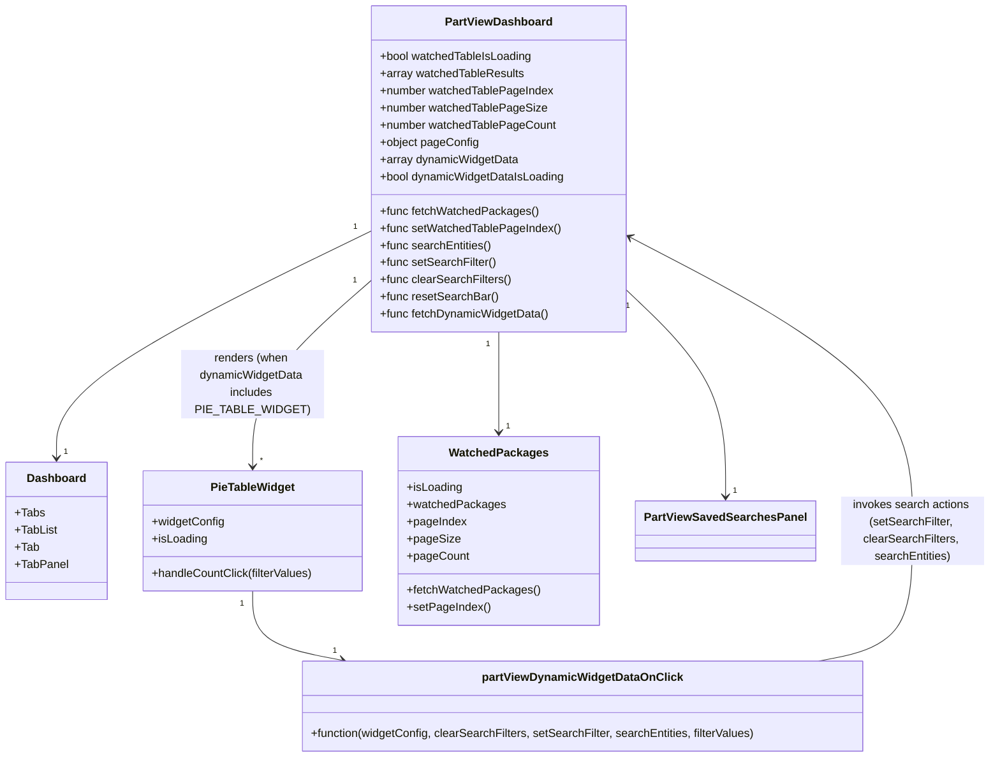

# Diagram: web/portal/src/pages/partview/dashboard/PartView.Dashboard.page.js


> Auto-generated by Obscura crawlers

## Diagram 1

```mermaid
flowchart LR
  A[PartViewDashboard Component] -->|calls| B[useTranslation("partview-dashboard")]
  A -->|calls| C[useSetTitle]
  A -->|calls| D[useTrackWithMixpanelOnce]
  A -->|useState| E[showFilters state]
  A -->|useEffect (on mount)| F[resetSearchBar & clearSearchFilters]
  A -->|useEffect (pageConfig)| G[fetchDynamicWidgetData(pageConfig.dashboardWidgets.widgets)]
  G --> H[dynamicWidgetData array]
  H -->|map| I{widgetConfig.widgetType}
  I -->|PIE_TABLE_WIDGET| J[PieTableWidget]
  J -->|onCountClick| K[partViewDynamicWidgetDataOnClick]
  K -->|calls| L[setSearchFilter / clearSearchFilters / searchEntities]
  A --> M[Dashboard]
  M --> N[Dashboard.Tabs]
  N --> O[Dashboard.TabList]
  O --> P[Dashboard.Tab (Summary View)]
  O --> Q[Dashboard.Tab (My PartView Homepage)]
  N --> R[Dashboard.TabPanel (Summary Content) with PieTableWidget(s)]
  N --> S[Dashboard.TabPanel (Homepage) with SavedSearches & WatchedPackages]
  S --> T[PartViewSavedSearchesPanel]
  S --> U[WatchedPackages]
  U -->|props| V{fetchWatchedPackages, isLoading, watchedPackages, pagination}
  style A fill:#f9f,stroke:#333,stroke-width:2px
```

> SVG rendering failed for this diagram.

## Diagram 2



### SVG

<svg id="container" width="1355.1640625" xmlns="http://www.w3.org/2000/svg" class="classDiagram" height="1058" viewBox="0 0 1355.1640625 1058" role="graphics-document document" aria-roledescription="class"><style>#container{font-family:"trebuchet ms",verdana,arial,sans-serif;font-size:16px;fill:#333;}@keyframes edge-animation-frame{from{stroke-dashoffset:0;}}@keyframes dash{to{stroke-dashoffset:0;}}#container .edge-animation-slow{stroke-dasharray:9,5!important;stroke-dashoffset:900;animation:dash 50s linear infinite;stroke-linecap:round;}#container .edge-animation-fast{stroke-dasharray:9,5!important;stroke-dashoffset:900;animation:dash 20s linear infinite;stroke-linecap:round;}#container .error-icon{fill:#552222;}#container .error-text{fill:#552222;stroke:#552222;}#container .edge-thickness-normal{stroke-width:1px;}#container .edge-thickness-thick{stroke-width:3.5px;}#container .edge-pattern-solid{stroke-dasharray:0;}#container .edge-thickness-invisible{stroke-width:0;fill:none;}#container .edge-pattern-dashed{stroke-dasharray:3;}#container .edge-pattern-dotted{stroke-dasharray:2;}#container .marker{fill:#333333;stroke:#333333;}#container .marker.cross{stroke:#333333;}#container svg{font-family:"trebuchet ms",verdana,arial,sans-serif;font-size:16px;}#container p{margin:0;}#container g.classGroup text{fill:#9370DB;stroke:none;font-family:"trebuchet ms",verdana,arial,sans-serif;font-size:10px;}#container g.classGroup text .title{font-weight:bolder;}#container .nodeLabel,#container .edgeLabel{color:#131300;}#container .edgeLabel .label rect{fill:#ECECFF;}#container .label text{fill:#131300;}#container .labelBkg{background:#ECECFF;}#container .edgeLabel .label span{background:#ECECFF;}#container .classTitle{font-weight:bolder;}#container .node rect,#container .node circle,#container .node ellipse,#container .node polygon,#container .node path{fill:#ECECFF;stroke:#9370DB;stroke-width:1px;}#container .divider{stroke:#9370DB;stroke-width:1;}#container g.clickable{cursor:pointer;}#container g.classGroup rect{fill:#ECECFF;stroke:#9370DB;}#container g.classGroup line{stroke:#9370DB;stroke-width:1;}#container .classLabel .box{stroke:none;stroke-width:0;fill:#ECECFF;opacity:0.5;}#container .classLabel .label{fill:#9370DB;font-size:10px;}#container .relation{stroke:#333333;stroke-width:1;fill:none;}#container .dashed-line{stroke-dasharray:3;}#container .dotted-line{stroke-dasharray:1 2;}#container #compositionStart,#container .composition{fill:#333333!important;stroke:#333333!important;stroke-width:1;}#container #compositionEnd,#container .composition{fill:#333333!important;stroke:#333333!important;stroke-width:1;}#container #dependencyStart,#container .dependency{fill:#333333!important;stroke:#333333!important;stroke-width:1;}#container #dependencyStart,#container .dependency{fill:#333333!important;stroke:#333333!important;stroke-width:1;}#container #extensionStart,#container .extension{fill:transparent!important;stroke:#333333!important;stroke-width:1;}#container #extensionEnd,#container .extension{fill:transparent!important;stroke:#333333!important;stroke-width:1;}#container #aggregationStart,#container .aggregation{fill:transparent!important;stroke:#333333!important;stroke-width:1;}#container #aggregationEnd,#container .aggregation{fill:transparent!important;stroke:#333333!important;stroke-width:1;}#container #lollipopStart,#container .lollipop{fill:#ECECFF!important;stroke:#333333!important;stroke-width:1;}#container #lollipopEnd,#container .lollipop{fill:#ECECFF!important;stroke:#333333!important;stroke-width:1;}#container .edgeTerminals{font-size:11px;line-height:initial;}#container .classTitleText{text-anchor:middle;font-size:18px;fill:#333;}#container .label-icon{display:inline-block;height:1em;overflow:visible;vertical-align:-0.125em;}#container .node .label-icon path{fill:currentColor;stroke:revert;stroke-width:revert;}#container :root{--mermaid-font-family:"trebuchet ms",verdana,arial,sans-serif;}</style><g><defs><marker id="container_class-aggregationStart" class="marker aggregation class" refX="18" refY="7" markerWidth="190" markerHeight="240" orient="auto"><path d="M 18,7 L9,13 L1,7 L9,1 Z"></path></marker></defs><defs><marker id="container_class-aggregationEnd" class="marker aggregation class" refX="1" refY="7" markerWidth="20" markerHeight="28" orient="auto"><path d="M 18,7 L9,13 L1,7 L9,1 Z"></path></marker></defs><defs><marker id="container_class-extensionStart" class="marker extension class" refX="18" refY="7" markerWidth="190" markerHeight="240" orient="auto"><path d="M 1,7 L18,13 V 1 Z"></path></marker></defs><defs><marker id="container_class-extensionEnd" class="marker extension class" refX="1" refY="7" markerWidth="20" markerHeight="28" orient="auto"><path d="M 1,1 V 13 L18,7 Z"></path></marker></defs><defs><marker id="container_class-compositionStart" class="marker composition class" refX="18" refY="7" markerWidth="190" markerHeight="240" orient="auto"><path d="M 18,7 L9,13 L1,7 L9,1 Z"></path></marker></defs><defs><marker id="container_class-compositionEnd" class="marker composition class" refX="1" refY="7" markerWidth="20" markerHeight="28" orient="auto"><path d="M 18,7 L9,13 L1,7 L9,1 Z"></path></marker></defs><defs><marker id="container_class-dependencyStart" class="marker dependency class" refX="6" refY="7" markerWidth="190" markerHeight="240" orient="auto"><path d="M 5,7 L9,13 L1,7 L9,1 Z"></path></marker></defs><defs><marker id="container_class-dependencyEnd" class="marker dependency class" refX="13" refY="7" markerWidth="20" markerHeight="28" orient="auto"><path d="M 18,7 L9,13 L14,7 L9,1 Z"></path></marker></defs><defs><marker id="container_class-lollipopStart" class="marker lollipop class" refX="13" refY="7" markerWidth="190" markerHeight="240" orient="auto"><circle stroke="black" fill="transparent" cx="7" cy="7" r="6"></circle></marker></defs><defs><marker id="container_class-lollipopEnd" class="marker lollipop class" refX="1" refY="7" markerWidth="190" markerHeight="240" orient="auto"><circle stroke="black" fill="transparent" cx="7" cy="7" r="6"></circle></marker></defs><g class="root"><g class="clusters"></g><g class="edgePaths"><path d="M509.867,323.358L437.574,358.965C365.281,394.572,220.695,465.786,148.402,518.56C76.109,571.333,76.109,605.667,76.109,622.833L76.109,640" id="id_PartViewDashboard_Dashboard_1" class="edge-thickness-normal edge-pattern-solid relation" style=";;;" data-edge="true" data-et="edge" data-id="id_PartViewDashboard_Dashboard_1" data-points="W3sieCI6NTA5Ljg2NzE4NzUsInkiOjMyMy4zNTgwNTA5NjkzMzc4NX0seyJ4Ijo3Ni4xMDkzNzUsInkiOjUzN30seyJ4Ijo3Ni4xMDkzNzUsInkiOjY0Nn1d" marker-end="url(#container_class-dependencyEnd)"></path><path d="M509.867,393.288L482.858,417.24C455.849,441.192,401.831,489.096,374.822,532.215C347.813,575.333,347.813,613.667,347.813,632.833L347.813,652" id="id_PartViewDashboard_PieTableWidget_2" class="edge-thickness-normal edge-pattern-solid relation" style=";;;" data-edge="true" data-et="edge" data-id="id_PartViewDashboard_PieTableWidget_2" data-points="W3sieCI6NTA5Ljg2NzE4NzUsInkiOjM5My4yODc5MjM5NTA2OTY4NH0seyJ4IjozNDcuODEyNSwieSI6NTM3fSx7IngiOjM0Ny44MTI1LCJ5Ijo2NTh9XQ==" marker-end="url(#container_class-dependencyEnd)"></path><path d="M687.23,464L687.23,476.167C687.23,488.333,687.23,512.667,687.23,536C687.23,559.333,687.23,581.667,687.23,592.833L687.23,604" id="id_PartViewDashboard_WatchedPackages_3" class="edge-thickness-normal edge-pattern-solid relation" style=";;;" data-edge="true" data-et="edge" data-id="id_PartViewDashboard_WatchedPackages_3" data-points="W3sieCI6Njg3LjIzMDQ2ODc1LCJ5Ijo0NjR9LHsieCI6Njg3LjIzMDQ2ODc1LCJ5Ijo1Mzd9LHsieCI6Njg3LjIzMDQ2ODc1LCJ5Ijo2MTB9XQ==" marker-end="url(#container_class-dependencyEnd)"></path><path d="M864.594,410.82L885.93,431.85C907.266,452.88,949.938,494.94,971.273,542.137C992.609,589.333,992.609,641.667,992.609,667.833L992.609,694" id="id_PartViewDashboard_PartViewSavedSearchesPanel_4" class="edge-thickness-normal edge-pattern-solid relation" style=";;;" data-edge="true" data-et="edge" data-id="id_PartViewDashboard_PartViewSavedSearchesPanel_4" data-points="W3sieCI6ODY0LjU5Mzc1LCJ5Ijo0MTAuODIwMDIzNzkyMTYzOTd9LHsieCI6OTkyLjYwOTM3NSwieSI6NTM3fSx7IngiOjk5Mi42MDkzNzUsInkiOjcwMH1d" marker-end="url(#container_class-dependencyEnd)"></path><path d="M347.813,826L347.813,838.167C347.813,850.333,347.813,874.667,368.123,890.808C388.433,906.949,429.053,914.898,449.363,918.873L469.673,922.848" id="id_PieTableWidget_partViewDynamicWidgetDataOnClick_5" class="edge-thickness-normal edge-pattern-solid relation" style=";;;" data-edge="true" data-et="edge" data-id="id_PieTableWidget_partViewDynamicWidgetDataOnClick_5" data-points="W3sieCI6MzQ3LjgxMjUsInkiOjgyNn0seyJ4IjozNDcuODEyNSwieSI6ODk5fSx7IngiOjQ3NS41NjEzMDE0OTE0NzcyNSwieSI6OTI0fV0=" marker-end="url(#container_class-dependencyEnd)"></path><path d="M1119.415,924L1140.707,919.833C1161.998,915.667,1204.581,907.333,1225.873,877C1247.164,846.667,1247.164,794.333,1247.164,734C1247.164,673.667,1247.164,605.333,1184.283,537.364C1121.402,469.395,995.64,401.79,932.759,367.987L869.879,334.185" id="id_partViewDynamicWidgetDataOnClick_PartViewDashboard_6" class="edge-thickness-normal edge-pattern-solid relation" style=";;;" data-edge="true" data-et="edge" data-id="id_partViewDynamicWidgetDataOnClick_PartViewDashboard_6" data-points="W3sieCI6MTExOS40MTUyNjEwMDg1MjI3LCJ5Ijo5MjR9LHsieCI6MTI0Ny4xNjQwNjI1LCJ5Ijo4OTl9LHsieCI6MTI0Ny4xNjQwNjI1LCJ5Ijo3NDJ9LHsieCI6MTI0Ny4xNjQwNjI1LCJ5Ijo1Mzd9LHsieCI6ODY0LjU5Mzc1LCJ5IjozMzEuMzQ0MDY5ODE4NTQ3MTV9XQ==" marker-end="url(#container_class-dependencyEnd)"></path></g><g class="edgeLabels"><g class="edgeLabel"><g class="label" data-id="id_PartViewDashboard_Dashboard_1" transform="translate(0, 0)"><foreignObject width="0" height="0"><div xmlns="http://www.w3.org/1999/xhtml" class="labelBkg" style="display: table-cell; white-space: nowrap; line-height: 1.5; max-width: 200px; text-align: center;"><span class="edgeLabel"></span></div></foreignObject></g></g><g class="edgeLabel" transform="translate(347.8125, 537)"><g class="label" data-id="id_PartViewDashboard_PieTableWidget_2" transform="translate(-100, -48)"><foreignObject width="200" height="96"><div xmlns="http://www.w3.org/1999/xhtml" class="labelBkg" style="display: table; white-space: break-spaces; line-height: 1.5; max-width: 200px; text-align: center; width: 200px;"><span class="edgeLabel"><p>renders (when dynamicWidgetData includes PIE_TABLE_WIDGET)</p></span></div></foreignObject></g></g><g class="edgeLabel"><g class="label" data-id="id_PartViewDashboard_WatchedPackages_3" transform="translate(0, 0)"><foreignObject width="0" height="0"><div xmlns="http://www.w3.org/1999/xhtml" class="labelBkg" style="display: table-cell; white-space: nowrap; line-height: 1.5; max-width: 200px; text-align: center;"><span class="edgeLabel"></span></div></foreignObject></g></g><g class="edgeLabel"><g class="label" data-id="id_PartViewDashboard_PartViewSavedSearchesPanel_4" transform="translate(0, 0)"><foreignObject width="0" height="0"><div xmlns="http://www.w3.org/1999/xhtml" class="labelBkg" style="display: table-cell; white-space: nowrap; line-height: 1.5; max-width: 200px; text-align: center;"><span class="edgeLabel"></span></div></foreignObject></g></g><g class="edgeLabel"><g class="label" data-id="id_PieTableWidget_partViewDynamicWidgetDataOnClick_5" transform="translate(0, 0)"><foreignObject width="0" height="0"><div xmlns="http://www.w3.org/1999/xhtml" class="labelBkg" style="display: table-cell; white-space: nowrap; line-height: 1.5; max-width: 200px; text-align: center;"><span class="edgeLabel"></span></div></foreignObject></g></g><g class="edgeLabel" transform="translate(1247.1640625, 742)"><g class="label" data-id="id_partViewDynamicWidgetDataOnClick_PartViewDashboard_6" transform="translate(-100, -48)"><foreignObject width="200" height="96"><div xmlns="http://www.w3.org/1999/xhtml" class="labelBkg" style="display: table; white-space: break-spaces; line-height: 1.5; max-width: 200px; text-align: center; width: 200px;"><span class="edgeLabel"><p>invokes search actions (setSearchFilter, clearSearchFilters, searchEntities)</p></span></div></foreignObject></g></g><g class="edgeTerminals" transform="translate(487.54037982854396, 317.6340907595612)"><g class="inner" transform="translate(0, 0)"><foreignObject style="width: 9px; height: 12px;"><div xmlns="http://www.w3.org/1999/xhtml" style="display: inline-block; padding-right: 1px; white-space: nowrap;"><span class="edgeLabel">1</span></div></foreignObject></g></g><g class="edgeTerminals" transform="translate(486.82160235748944, 393.6763868924653)"><g class="inner" transform="translate(0, 0)"><foreignObject style="width: 9px; height: 12px;"><div xmlns="http://www.w3.org/1999/xhtml" style="display: inline-block; padding-right: 1px; white-space: nowrap;"><span class="edgeLabel">1</span></div></foreignObject></g></g><g class="edgeTerminals" transform="translate(672.230469375, 481.50000053571426)"><g class="inner" transform="translate(0, 0)"><foreignObject style="width: 9px; height: 12px;"><div xmlns="http://www.w3.org/1999/xhtml" style="display: inline-block; padding-right: 1px; white-space: nowrap;"><span class="edgeLabel">1</span></div></foreignObject></g></g><g class="edgeTerminals" transform="translate(866.5274227865538, 433.7876300139519)"><g class="inner" transform="translate(0, 0)"><foreignObject style="width: 9px; height: 12px;"><div xmlns="http://www.w3.org/1999/xhtml" style="display: inline-block; padding-right: 1px; white-space: nowrap;"><span class="edgeLabel">1</span></div></foreignObject></g></g><g class="edgeTerminals" transform="translate(332.8125, 843.5)"><g class="inner" transform="translate(0, 0)"><foreignObject style="width: 9px; height: 12px;"><div xmlns="http://www.w3.org/1999/xhtml" style="display: inline-block; padding-right: 1px; white-space: nowrap;"><span class="edgeLabel">1</span></div></foreignObject></g></g><g class="edgeTerminals" transform="translate(86.10937749999984, 623.5000021428572)"><g class="inner" transform="translate(0, 0)"></g><foreignObject style="width: 9px; height: 12px;"><div xmlns="http://www.w3.org/1999/xhtml" style="display: inline-block; padding-right: 1px; white-space: nowrap;"><span class="edgeLabel">1</span></div></foreignObject></g><g class="edgeTerminals" transform="translate(357.8125, 635.5)"><g class="inner" transform="translate(0, 0)"></g><foreignObject style="width: 9px; height: 12px;"><div xmlns="http://www.w3.org/1999/xhtml" style="display: inline-block; padding-right: 1px; white-space: nowrap;"><span class="edgeLabel">*</span></div></foreignObject></g><g class="edgeTerminals" transform="translate(697.230469375, 587.5000005357143)"><g class="inner" transform="translate(0, 0)"></g><foreignObject style="width: 9px; height: 12px;"><div xmlns="http://www.w3.org/1999/xhtml" style="display: inline-block; padding-right: 1px; white-space: nowrap;"><span class="edgeLabel">1</span></div></foreignObject></g><g class="edgeTerminals" transform="translate(1002.6093774999998, 677.5000021428572)"><g class="inner" transform="translate(0, 0)"></g><foreignObject style="width: 9px; height: 12px;"><div xmlns="http://www.w3.org/1999/xhtml" style="display: inline-block; padding-right: 1px; white-space: nowrap;"><span class="edgeLabel">1</span></div></foreignObject></g><g class="edgeTerminals" transform="translate(456.2678775786109, 900.9182980091222)"><g class="inner" transform="translate(0, 0)"></g><foreignObject style="width: 9px; height: 12px;"><div xmlns="http://www.w3.org/1999/xhtml" style="display: inline-block; padding-right: 1px; white-space: nowrap;"><span class="edgeLabel">1</span></div></foreignObject></g></g><g class="nodes"><g class="node default" id="classId-PartViewDashboard-0" transform="translate(687.23046875, 236)"><g class="basic label-container"><path d="M-177.36328125 -228 L177.36328125 -228 L177.36328125 228 L-177.36328125 228" stroke="none" stroke-width="0" fill="#ECECFF" style=""></path><path d="M-177.36328125 -228 C-59.09923940576395 -228, 59.164802438472094 -228, 177.36328125 -228 M-177.36328125 -228 C-75.38364080433121 -228, 26.595999641337585 -228, 177.36328125 -228 M177.36328125 -228 C177.36328125 -73.99593022219858, 177.36328125 80.00813955560284, 177.36328125 228 M177.36328125 -228 C177.36328125 -129.18955868411814, 177.36328125 -30.37911736823628, 177.36328125 228 M177.36328125 228 C70.85936490256765 228, -35.6445514448647 228, -177.36328125 228 M177.36328125 228 C62.03516474426972 228, -53.29295176146056 228, -177.36328125 228 M-177.36328125 228 C-177.36328125 62.33703574076674, -177.36328125 -103.32592851846653, -177.36328125 -228 M-177.36328125 228 C-177.36328125 84.50945999929121, -177.36328125 -58.98108000141758, -177.36328125 -228" stroke="#9370DB" stroke-width="1.3" fill="none" stroke-dasharray="0 0" style=""></path></g><g class="annotation-group text" transform="translate(0, -204)"></g><g class="label-group text" transform="translate(-71.7265625, -204)"><g class="label" style="font-weight: bolder" transform="translate(0,-12)"><foreignObject width="143.453125" height="24"><div xmlns="http://www.w3.org/1999/xhtml" style="display: table-cell; white-space: nowrap; line-height: 1.5; max-width: 191px; text-align: center;"><span class="nodeLabel markdown-node-label" style=""><p>PartViewDashboard</p></span></div></foreignObject></g></g><g class="members-group text" transform="translate(-165.36328125, -156)"><g class="label" style="" transform="translate(0,-12)"><foreignObject width="214.375" height="24"><div xmlns="http://www.w3.org/1999/xhtml" style="display: table-cell; white-space: nowrap; line-height: 1.5; max-width: 272px; text-align: center;"><span class="nodeLabel markdown-node-label" style=""><p>+bool watchedTableIsLoading</p></span></div></foreignObject></g><g class="label" style="" transform="translate(0,12)"><foreignObject width="201.546875" height="24"><div xmlns="http://www.w3.org/1999/xhtml" style="display: table-cell; white-space: nowrap; line-height: 1.5; max-width: 259px; text-align: center;"><span class="nodeLabel markdown-node-label" style=""><p>+array watchedTableResults</p></span></div></foreignObject></g><g class="label" style="" transform="translate(0,36)"><foreignObject width="242.609375" height="24"><div xmlns="http://www.w3.org/1999/xhtml" style="display: table-cell; white-space: nowrap; line-height: 1.5; max-width: 300px; text-align: center;"><span class="nodeLabel markdown-node-label" style=""><p>+number watchedTablePageIndex</p></span></div></foreignObject></g><g class="label" style="" transform="translate(0,60)"><foreignObject width="231.453125" height="24"><div xmlns="http://www.w3.org/1999/xhtml" style="display: table-cell; white-space: nowrap; line-height: 1.5; max-width: 289px; text-align: center;"><span class="nodeLabel markdown-node-label" style=""><p>+number watchedTablePageSize</p></span></div></foreignObject></g><g class="label" style="" transform="translate(0,84)"><foreignObject width="245.0625" height="24"><div xmlns="http://www.w3.org/1999/xhtml" style="display: table-cell; white-space: nowrap; line-height: 1.5; max-width: 303px; text-align: center;"><span class="nodeLabel markdown-node-label" style=""><p>+number watchedTablePageCount</p></span></div></foreignObject></g><g class="label" style="" transform="translate(0,108)"><foreignObject width="137.25" height="24"><div xmlns="http://www.w3.org/1999/xhtml" style="display: table-cell; white-space: nowrap; line-height: 1.5; max-width: 195px; text-align: center;"><span class="nodeLabel markdown-node-label" style=""><p>+object pageConfig</p></span></div></foreignObject></g><g class="label" style="" transform="translate(0,132)"><foreignObject width="193.28125" height="24"><div xmlns="http://www.w3.org/1999/xhtml" style="display: table-cell; white-space: nowrap; line-height: 1.5; max-width: 251px; text-align: center;"><span class="nodeLabel markdown-node-label" style=""><p>+array dynamicWidgetData</p></span></div></foreignObject></g><g class="label" style="" transform="translate(0,156)"><foreignObject width="259" height="24"><div xmlns="http://www.w3.org/1999/xhtml" style="display: table-cell; white-space: nowrap; line-height: 1.5; max-width: 317px; text-align: center;"><span class="nodeLabel markdown-node-label" style=""><p>+bool dynamicWidgetDataIsLoading</p></span></div></foreignObject></g></g><g class="methods-group text" transform="translate(-165.36328125, 60)"><g class="label" style="" transform="translate(0,-12)"><foreignObject width="218.34375" height="24"><div xmlns="http://www.w3.org/1999/xhtml" style="display: table-cell; white-space: nowrap; line-height: 1.5; max-width: 276px; text-align: center;"><span class="nodeLabel markdown-node-label" style=""><p>+func fetchWatchedPackages()</p></span></div></foreignObject></g><g class="label" style="" transform="translate(0,12)"><foreignObject width="251.0625" height="24"><div xmlns="http://www.w3.org/1999/xhtml" style="display: table-cell; white-space: nowrap; line-height: 1.5; max-width: 308px; text-align: center;"><span class="nodeLabel markdown-node-label" style=""><p>+func setWatchedTablePageIndex()</p></span></div></foreignObject></g><g class="label" style="" transform="translate(0,36)"><foreignObject width="156.0625" height="24"><div xmlns="http://www.w3.org/1999/xhtml" style="display: table-cell; white-space: nowrap; line-height: 1.5; max-width: 213px; text-align: center;"><span class="nodeLabel markdown-node-label" style=""><p>+func searchEntities()</p></span></div></foreignObject></g><g class="label" style="" transform="translate(0,60)"><foreignObject width="161.65625" height="24"><div xmlns="http://www.w3.org/1999/xhtml" style="display: table-cell; white-space: nowrap; line-height: 1.5; max-width: 219px; text-align: center;"><span class="nodeLabel markdown-node-label" style=""><p>+func setSearchFilter()</p></span></div></foreignObject></g><g class="label" style="" transform="translate(0,84)"><foreignObject width="182.609375" height="24"><div xmlns="http://www.w3.org/1999/xhtml" style="display: table-cell; white-space: nowrap; line-height: 1.5; max-width: 240px; text-align: center;"><span class="nodeLabel markdown-node-label" style=""><p>+func clearSearchFilters()</p></span></div></foreignObject></g><g class="label" style="" transform="translate(0,108)"><foreignObject width="163.75" height="24"><div xmlns="http://www.w3.org/1999/xhtml" style="display: table-cell; white-space: nowrap; line-height: 1.5; max-width: 221px; text-align: center;"><span class="nodeLabel markdown-node-label" style=""><p>+func resetSearchBar()</p></span></div></foreignObject></g><g class="label" style="" transform="translate(0,132)"><foreignObject width="235.734375" height="24"><div xmlns="http://www.w3.org/1999/xhtml" style="display: table-cell; white-space: nowrap; line-height: 1.5; max-width: 293px; text-align: center;"><span class="nodeLabel markdown-node-label" style=""><p>+func fetchDynamicWidgetData()</p></span></div></foreignObject></g></g><g class="divider" style=""><path d="M-177.36328125 -180 C-59.01449717498362 -180, 59.334286900032765 -180, 177.36328125 -180 M-177.36328125 -180 C-68.79599568553978 -180, 39.77128987892044 -180, 177.36328125 -180" stroke="#9370DB" stroke-width="1.3" fill="none" stroke-dasharray="0 0" style=""></path></g><g class="divider" style=""><path d="M-177.36328125 36 C-65.67206830203205 36, 46.01914464593591 36, 177.36328125 36 M-177.36328125 36 C-40.75507923759423 36, 95.85312277481154 36, 177.36328125 36" stroke="#9370DB" stroke-width="1.3" fill="none" stroke-dasharray="0 0" style=""></path></g></g><g class="node default" id="classId-Dashboard-1" transform="translate(76.109375, 742)"><g class="basic label-container"><path d="M-68.109375 -96 L68.109375 -96 L68.109375 96 L-68.109375 96" stroke="none" stroke-width="0" fill="#ECECFF" style=""></path><path d="M-68.109375 -96 C-14.330216128028106 -96, 39.44894274394379 -96, 68.109375 -96 M-68.109375 -96 C-14.661384362226414 -96, 38.78660627554717 -96, 68.109375 -96 M68.109375 -96 C68.109375 -39.67562485303678, 68.109375 16.64875029392644, 68.109375 96 M68.109375 -96 C68.109375 -44.91183221481875, 68.109375 6.176335570362497, 68.109375 96 M68.109375 96 C37.238141674496944 96, 6.366908348993896 96, -68.109375 96 M68.109375 96 C35.32811884007341 96, 2.546862680146816 96, -68.109375 96 M-68.109375 96 C-68.109375 54.89623812080216, -68.109375 13.79247624160432, -68.109375 -96 M-68.109375 96 C-68.109375 32.443932563623676, -68.109375 -31.112134872752648, -68.109375 -96" stroke="#9370DB" stroke-width="1.3" fill="none" stroke-dasharray="0 0" style=""></path></g><g class="annotation-group text" transform="translate(0, -72)"></g><g class="label-group text" transform="translate(-39.4375, -72)"><g class="label" style="font-weight: bolder" transform="translate(0,-12)"><foreignObject width="78.875" height="24"><div xmlns="http://www.w3.org/1999/xhtml" style="display: table-cell; white-space: nowrap; line-height: 1.5; max-width: 128px; text-align: center;"><span class="nodeLabel markdown-node-label" style=""><p>Dashboard</p></span></div></foreignObject></g></g><g class="members-group text" transform="translate(-56.109375, -24)"><g class="label" style="" transform="translate(0,-12)"><foreignObject width="40.34375" height="24"><div xmlns="http://www.w3.org/1999/xhtml" style="display: table-cell; white-space: nowrap; line-height: 1.5; max-width: 98px; text-align: center;"><span class="nodeLabel markdown-node-label" style=""><p>+Tabs</p></span></div></foreignObject></g><g class="label" style="" transform="translate(0,12)"><foreignObject width="58.59375" height="24"><div xmlns="http://www.w3.org/1999/xhtml" style="display: table-cell; white-space: nowrap; line-height: 1.5; max-width: 116px; text-align: center;"><span class="nodeLabel markdown-node-label" style=""><p>+TabList</p></span></div></foreignObject></g><g class="label" style="" transform="translate(0,36)"><foreignObject width="32.875" height="24"><div xmlns="http://www.w3.org/1999/xhtml" style="display: table-cell; white-space: nowrap; line-height: 1.5; max-width: 90px; text-align: center;"><span class="nodeLabel markdown-node-label" style=""><p>+Tab</p></span></div></foreignObject></g><g class="label" style="" transform="translate(0,60)"><foreignObject width="72.78125" height="24"><div xmlns="http://www.w3.org/1999/xhtml" style="display: table-cell; white-space: nowrap; line-height: 1.5; max-width: 130px; text-align: center;"><span class="nodeLabel markdown-node-label" style=""><p>+TabPanel</p></span></div></foreignObject></g></g><g class="methods-group text" transform="translate(-56.109375, 96)"></g><g class="divider" style=""><path d="M-68.109375 -48 C-38.69547667577359 -48, -9.28157835154719 -48, 68.109375 -48 M-68.109375 -48 C-31.318973828160793 -48, 5.471427343678414 -48, 68.109375 -48" stroke="#9370DB" stroke-width="1.3" fill="none" stroke-dasharray="0 0" style=""></path></g><g class="divider" style=""><path d="M-68.109375 72 C-26.32401119459049 72, 15.46135261081902 72, 68.109375 72 M-68.109375 72 C-23.642748162734037 72, 20.823878674531926 72, 68.109375 72" stroke="#9370DB" stroke-width="1.3" fill="none" stroke-dasharray="0 0" style=""></path></g></g><g class="node default" id="classId-PieTableWidget-2" transform="translate(347.8125, 742)"><g class="basic label-container"><path d="M-153.59375 -84 L153.59375 -84 L153.59375 84 L-153.59375 84" stroke="none" stroke-width="0" fill="#ECECFF" style=""></path><path d="M-153.59375 -84 C-85.46844583790661 -84, -17.34314167581323 -84, 153.59375 -84 M-153.59375 -84 C-82.61808689331876 -84, -11.642423786637522 -84, 153.59375 -84 M153.59375 -84 C153.59375 -29.80505020628582, 153.59375 24.38989958742836, 153.59375 84 M153.59375 -84 C153.59375 -18.961504268994673, 153.59375 46.07699146201065, 153.59375 84 M153.59375 84 C62.801631224954605 84, -27.99048755009079 84, -153.59375 84 M153.59375 84 C58.578847321919085 84, -36.43605535616183 84, -153.59375 84 M-153.59375 84 C-153.59375 48.29798415282717, -153.59375 12.595968305654338, -153.59375 -84 M-153.59375 84 C-153.59375 18.77007292408787, -153.59375 -46.45985415182426, -153.59375 -84" stroke="#9370DB" stroke-width="1.3" fill="none" stroke-dasharray="0 0" style=""></path></g><g class="annotation-group text" transform="translate(0, -60)"></g><g class="label-group text" transform="translate(-56.875, -60)"><g class="label" style="font-weight: bolder" transform="translate(0,-12)"><foreignObject width="113.75" height="24"><div xmlns="http://www.w3.org/1999/xhtml" style="display: table-cell; white-space: nowrap; line-height: 1.5; max-width: 162px; text-align: center;"><span class="nodeLabel markdown-node-label" style=""><p>PieTableWidget</p></span></div></foreignObject></g></g><g class="members-group text" transform="translate(-141.59375, -12)"><g class="label" style="" transform="translate(0,-12)"><foreignObject width="100.984375" height="24"><div xmlns="http://www.w3.org/1999/xhtml" style="display: table-cell; white-space: nowrap; line-height: 1.5; max-width: 159px; text-align: center;"><span class="nodeLabel markdown-node-label" style=""><p>+widgetConfig</p></span></div></foreignObject></g><g class="label" style="" transform="translate(0,12)"><foreignObject width="77.203125" height="24"><div xmlns="http://www.w3.org/1999/xhtml" style="display: table-cell; white-space: nowrap; line-height: 1.5; max-width: 135px; text-align: center;"><span class="nodeLabel markdown-node-label" style=""><p>+isLoading</p></span></div></foreignObject></g></g><g class="methods-group text" transform="translate(-141.59375, 60)"><g class="label" style="" transform="translate(0,-12)"><foreignObject width="226.3125" height="24"><div xmlns="http://www.w3.org/1999/xhtml" style="display: table-cell; white-space: nowrap; line-height: 1.5; max-width: 284px; text-align: center;"><span class="nodeLabel markdown-node-label" style=""><p>+handleCountClick(filterValues)</p></span></div></foreignObject></g></g><g class="divider" style=""><path d="M-153.59375 -36 C-78.45037576624959 -36, -3.3070015324991857 -36, 153.59375 -36 M-153.59375 -36 C-63.56946286008237 -36, 26.454824279835265 -36, 153.59375 -36" stroke="#9370DB" stroke-width="1.3" fill="none" stroke-dasharray="0 0" style=""></path></g><g class="divider" style=""><path d="M-153.59375 36 C-87.95645983452043 36, -22.31916966904086 36, 153.59375 36 M-153.59375 36 C-81.16916643985759 36, -8.744582879715182 36, 153.59375 36" stroke="#9370DB" stroke-width="1.3" fill="none" stroke-dasharray="0 0" style=""></path></g></g><g class="node default" id="classId-WatchedPackages-3" transform="translate(687.23046875, 742)"><g class="basic label-container"><path d="M-135.82421875 -132 L135.82421875 -132 L135.82421875 132 L-135.82421875 132" stroke="none" stroke-width="0" fill="#ECECFF" style=""></path><path d="M-135.82421875 -132 C-78.44020139648165 -132, -21.056184042963324 -132, 135.82421875 -132 M-135.82421875 -132 C-46.142304414960066 -132, 43.53960992007987 -132, 135.82421875 -132 M135.82421875 -132 C135.82421875 -53.49694005577342, 135.82421875 25.006119888453156, 135.82421875 132 M135.82421875 -132 C135.82421875 -51.425003846752176, 135.82421875 29.149992306495648, 135.82421875 132 M135.82421875 132 C28.405647282973305 132, -79.01292418405339 132, -135.82421875 132 M135.82421875 132 C72.64571361202833 132, 9.467208474056662 132, -135.82421875 132 M-135.82421875 132 C-135.82421875 28.844154013385946, -135.82421875 -74.31169197322811, -135.82421875 -132 M-135.82421875 132 C-135.82421875 70.59170938020296, -135.82421875 9.183418760405914, -135.82421875 -132" stroke="#9370DB" stroke-width="1.3" fill="none" stroke-dasharray="0 0" style=""></path></g><g class="annotation-group text" transform="translate(0, -108)"></g><g class="label-group text" transform="translate(-65.2421875, -108)"><g class="label" style="font-weight: bolder" transform="translate(0,-12)"><foreignObject width="130.484375" height="24"><div xmlns="http://www.w3.org/1999/xhtml" style="display: table-cell; white-space: nowrap; line-height: 1.5; max-width: 178px; text-align: center;"><span class="nodeLabel markdown-node-label" style=""><p>WatchedPackages</p></span></div></foreignObject></g></g><g class="members-group text" transform="translate(-123.82421875, -60)"><g class="label" style="" transform="translate(0,-12)"><foreignObject width="77.203125" height="24"><div xmlns="http://www.w3.org/1999/xhtml" style="display: table-cell; white-space: nowrap; line-height: 1.5; max-width: 135px; text-align: center;"><span class="nodeLabel markdown-node-label" style=""><p>+isLoading</p></span></div></foreignObject></g><g class="label" style="" transform="translate(0,12)"><foreignObject width="134.34375" height="24"><div xmlns="http://www.w3.org/1999/xhtml" style="display: table-cell; white-space: nowrap; line-height: 1.5; max-width: 192px; text-align: center;"><span class="nodeLabel markdown-node-label" style=""><p>+watchedPackages</p></span></div></foreignObject></g><g class="label" style="" transform="translate(0,36)"><foreignObject width="82.65625" height="24"><div xmlns="http://www.w3.org/1999/xhtml" style="display: table-cell; white-space: nowrap; line-height: 1.5; max-width: 140px; text-align: center;"><span class="nodeLabel markdown-node-label" style=""><p>+pageIndex</p></span></div></foreignObject></g><g class="label" style="" transform="translate(0,60)"><foreignObject width="71.5" height="24"><div xmlns="http://www.w3.org/1999/xhtml" style="display: table-cell; white-space: nowrap; line-height: 1.5; max-width: 129px; text-align: center;"><span class="nodeLabel markdown-node-label" style=""><p>+pageSize</p></span></div></foreignObject></g><g class="label" style="" transform="translate(0,84)"><foreignObject width="85.109375" height="24"><div xmlns="http://www.w3.org/1999/xhtml" style="display: table-cell; white-space: nowrap; line-height: 1.5; max-width: 143px; text-align: center;"><span class="nodeLabel markdown-node-label" style=""><p>+pageCount</p></span></div></foreignObject></g></g><g class="methods-group text" transform="translate(-123.82421875, 84)"><g class="label" style="" transform="translate(0,-12)"><foreignObject width="182.40625" height="24"><div xmlns="http://www.w3.org/1999/xhtml" style="display: table-cell; white-space: nowrap; line-height: 1.5; max-width: 240px; text-align: center;"><span class="nodeLabel markdown-node-label" style=""><p>+fetchWatchedPackages()</p></span></div></foreignObject></g><g class="label" style="" transform="translate(0,12)"><foreignObject width="114.078125" height="24"><div xmlns="http://www.w3.org/1999/xhtml" style="display: table-cell; white-space: nowrap; line-height: 1.5; max-width: 171px; text-align: center;"><span class="nodeLabel markdown-node-label" style=""><p>+setPageIndex()</p></span></div></foreignObject></g></g><g class="divider" style=""><path d="M-135.82421875 -84 C-78.53314135727598 -84, -21.242063964551974 -84, 135.82421875 -84 M-135.82421875 -84 C-61.887598101179734 -84, 12.049022547640533 -84, 135.82421875 -84" stroke="#9370DB" stroke-width="1.3" fill="none" stroke-dasharray="0 0" style=""></path></g><g class="divider" style=""><path d="M-135.82421875 60 C-52.85535490406798 60, 30.11350894186404 60, 135.82421875 60 M-135.82421875 60 C-33.72501540655061 60, 68.37418793689878 60, 135.82421875 60" stroke="#9370DB" stroke-width="1.3" fill="none" stroke-dasharray="0 0" style=""></path></g></g><g class="node default" id="classId-PartViewSavedSearchesPanel-4" transform="translate(992.609375, 742)"><g class="basic label-container"><path d="M-119.5546875 -42 L119.5546875 -42 L119.5546875 42 L-119.5546875 42" stroke="none" stroke-width="0" fill="#ECECFF" style=""></path><path d="M-119.5546875 -42 C-68.11844448474851 -42, -16.682201469497016 -42, 119.5546875 -42 M-119.5546875 -42 C-52.50517870776345 -42, 14.544330084473103 -42, 119.5546875 -42 M119.5546875 -42 C119.5546875 -15.428060025547776, 119.5546875 11.143879948904448, 119.5546875 42 M119.5546875 -42 C119.5546875 -8.891882045053904, 119.5546875 24.21623590989219, 119.5546875 42 M119.5546875 42 C66.28247086288891 42, 13.010254225777842 42, -119.5546875 42 M119.5546875 42 C29.18490639311564 42, -61.18487471376872 42, -119.5546875 42 M-119.5546875 42 C-119.5546875 16.828534592487138, -119.5546875 -8.342930815025724, -119.5546875 -42 M-119.5546875 42 C-119.5546875 20.46550846865525, -119.5546875 -1.0689830626894974, -119.5546875 -42" stroke="#9370DB" stroke-width="1.3" fill="none" stroke-dasharray="0 0" style=""></path></g><g class="annotation-group text" transform="translate(0, -18)"></g><g class="label-group text" transform="translate(-107.5546875, -18)"><g class="label" style="font-weight: bolder" transform="translate(0,-12)"><foreignObject width="215.109375" height="24"><div xmlns="http://www.w3.org/1999/xhtml" style="display: table-cell; white-space: nowrap; line-height: 1.5; max-width: 261px; text-align: center;"><span class="nodeLabel markdown-node-label" style=""><p>PartViewSavedSearchesPanel</p></span></div></foreignObject></g></g><g class="members-group text" transform="translate(-107.5546875, 30)"></g><g class="methods-group text" transform="translate(-107.5546875, 60)"></g><g class="divider" style=""><path d="M-119.5546875 6 C-34.33657591696738 6, 50.88153566606525 6, 119.5546875 6 M-119.5546875 6 C-56.403778525146286 6, 6.747130449707427 6, 119.5546875 6" stroke="#9370DB" stroke-width="1.3" fill="none" stroke-dasharray="0 0" style=""></path></g><g class="divider" style=""><path d="M-119.5546875 24 C-36.81200951807084 24, 45.930668463858325 24, 119.5546875 24 M-119.5546875 24 C-45.0360420216131 24, 29.482603456773802 24, 119.5546875 24" stroke="#9370DB" stroke-width="1.3" fill="none" stroke-dasharray="0 0" style=""></path></g></g><g class="node default" id="classId-partViewDynamicWidgetDataOnClick-5" transform="translate(797.48828125, 987)"><g class="basic label-container"><path d="M-390.06640625 -63 L390.06640625 -63 L390.06640625 63 L-390.06640625 63" stroke="none" stroke-width="0" fill="#ECECFF" style=""></path><path d="M-390.06640625 -63 C-215.66160397448274 -63, -41.25680169896549 -63, 390.06640625 -63 M-390.06640625 -63 C-154.59972039333755 -63, 80.8669654633249 -63, 390.06640625 -63 M390.06640625 -63 C390.06640625 -36.46175204642957, 390.06640625 -9.923504092859126, 390.06640625 63 M390.06640625 -63 C390.06640625 -34.51013846426541, 390.06640625 -6.020276928530812, 390.06640625 63 M390.06640625 63 C189.62955521753932 63, -10.80729581492136 63, -390.06640625 63 M390.06640625 63 C140.95554752604215 63, -108.1553111979157 63, -390.06640625 63 M-390.06640625 63 C-390.06640625 13.426047200356692, -390.06640625 -36.14790559928662, -390.06640625 -63 M-390.06640625 63 C-390.06640625 36.20852508106696, -390.06640625 9.417050162133918, -390.06640625 -63" stroke="#9370DB" stroke-width="1.3" fill="none" stroke-dasharray="0 0" style=""></path></g><g class="annotation-group text" transform="translate(0, -39)"></g><g class="label-group text" transform="translate(-133.8046875, -39)"><g class="label" style="font-weight: bolder" transform="translate(0,-12)"><foreignObject width="267.609375" height="24"><div xmlns="http://www.w3.org/1999/xhtml" style="display: table-cell; white-space: nowrap; line-height: 1.5; max-width: 314px; text-align: center;"><span class="nodeLabel markdown-node-label" style=""><p>partViewDynamicWidgetDataOnClick</p></span></div></foreignObject></g></g><g class="members-group text" transform="translate(-378.06640625, 9)"></g><g class="methods-group text" transform="translate(-378.06640625, 39)"><g class="label" style="" transform="translate(0,-12)"><foreignObject width="622.328125" height="24"><div xmlns="http://www.w3.org/1999/xhtml" style="display: table-cell; white-space: nowrap; line-height: 1.5; max-width: 680px; text-align: center;"><span class="nodeLabel markdown-node-label" style=""><p>+function(widgetConfig, clearSearchFilters, setSearchFilter, searchEntities, filterValues)</p></span></div></foreignObject></g></g><g class="divider" style=""><path d="M-390.06640625 -15 C-170.57882958717428 -15, 48.90874707565143 -15, 390.06640625 -15 M-390.06640625 -15 C-148.37998440840977 -15, 93.30643743318046 -15, 390.06640625 -15" stroke="#9370DB" stroke-width="1.3" fill="none" stroke-dasharray="0 0" style=""></path></g><g class="divider" style=""><path d="M-390.06640625 9 C-92.7178083133864 9, 204.6307896232272 9, 390.06640625 9 M-390.06640625 9 C-144.70607652209563 9, 100.65425320580874 9, 390.06640625 9" stroke="#9370DB" stroke-width="1.3" fill="none" stroke-dasharray="0 0" style=""></path></g></g></g></g></g></svg>
