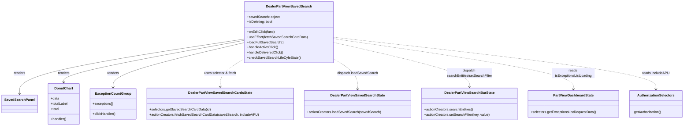

# Diagram: web/portal/src/pages/partview/dashboard/components/organisms/DealerPartView.SavedSearch.organism.js


> Auto-generated by Obscura crawlers

## Diagram 1



### SVG

<svg id="container" width="3151.9765625" xmlns="http://www.w3.org/2000/svg" class="classDiagram" height="594" viewBox="0 0 3151.9765625 594" role="graphics-document document" aria-roledescription="class"><style>#container{font-family:"trebuchet ms",verdana,arial,sans-serif;font-size:16px;fill:#333;}@keyframes edge-animation-frame{from{stroke-dashoffset:0;}}@keyframes dash{to{stroke-dashoffset:0;}}#container .edge-animation-slow{stroke-dasharray:9,5!important;stroke-dashoffset:900;animation:dash 50s linear infinite;stroke-linecap:round;}#container .edge-animation-fast{stroke-dasharray:9,5!important;stroke-dashoffset:900;animation:dash 20s linear infinite;stroke-linecap:round;}#container .error-icon{fill:#552222;}#container .error-text{fill:#552222;stroke:#552222;}#container .edge-thickness-normal{stroke-width:1px;}#container .edge-thickness-thick{stroke-width:3.5px;}#container .edge-pattern-solid{stroke-dasharray:0;}#container .edge-thickness-invisible{stroke-width:0;fill:none;}#container .edge-pattern-dashed{stroke-dasharray:3;}#container .edge-pattern-dotted{stroke-dasharray:2;}#container .marker{fill:#333333;stroke:#333333;}#container .marker.cross{stroke:#333333;}#container svg{font-family:"trebuchet ms",verdana,arial,sans-serif;font-size:16px;}#container p{margin:0;}#container g.classGroup text{fill:#9370DB;stroke:none;font-family:"trebuchet ms",verdana,arial,sans-serif;font-size:10px;}#container g.classGroup text .title{font-weight:bolder;}#container .nodeLabel,#container .edgeLabel{color:#131300;}#container .edgeLabel .label rect{fill:#ECECFF;}#container .label text{fill:#131300;}#container .labelBkg{background:#ECECFF;}#container .edgeLabel .label span{background:#ECECFF;}#container .classTitle{font-weight:bolder;}#container .node rect,#container .node circle,#container .node ellipse,#container .node polygon,#container .node path{fill:#ECECFF;stroke:#9370DB;stroke-width:1px;}#container .divider{stroke:#9370DB;stroke-width:1;}#container g.clickable{cursor:pointer;}#container g.classGroup rect{fill:#ECECFF;stroke:#9370DB;}#container g.classGroup line{stroke:#9370DB;stroke-width:1;}#container .classLabel .box{stroke:none;stroke-width:0;fill:#ECECFF;opacity:0.5;}#container .classLabel .label{fill:#9370DB;font-size:10px;}#container .relation{stroke:#333333;stroke-width:1;fill:none;}#container .dashed-line{stroke-dasharray:3;}#container .dotted-line{stroke-dasharray:1 2;}#container #compositionStart,#container .composition{fill:#333333!important;stroke:#333333!important;stroke-width:1;}#container #compositionEnd,#container .composition{fill:#333333!important;stroke:#333333!important;stroke-width:1;}#container #dependencyStart,#container .dependency{fill:#333333!important;stroke:#333333!important;stroke-width:1;}#container #dependencyStart,#container .dependency{fill:#333333!important;stroke:#333333!important;stroke-width:1;}#container #extensionStart,#container .extension{fill:transparent!important;stroke:#333333!important;stroke-width:1;}#container #extensionEnd,#container .extension{fill:transparent!important;stroke:#333333!important;stroke-width:1;}#container #aggregationStart,#container .aggregation{fill:transparent!important;stroke:#333333!important;stroke-width:1;}#container #aggregationEnd,#container .aggregation{fill:transparent!important;stroke:#333333!important;stroke-width:1;}#container #lollipopStart,#container .lollipop{fill:#ECECFF!important;stroke:#333333!important;stroke-width:1;}#container #lollipopEnd,#container .lollipop{fill:#ECECFF!important;stroke:#333333!important;stroke-width:1;}#container .edgeTerminals{font-size:11px;line-height:initial;}#container .classTitleText{text-anchor:middle;font-size:18px;fill:#333;}#container .label-icon{display:inline-block;height:1em;overflow:visible;vertical-align:-0.125em;}#container .node .label-icon path{fill:currentColor;stroke:revert;stroke-width:revert;}#container :root{--mermaid-font-family:"trebuchet ms",verdana,arial,sans-serif;}</style><g><defs><marker id="container_class-aggregationStart" class="marker aggregation class" refX="18" refY="7" markerWidth="190" markerHeight="240" orient="auto"><path d="M 18,7 L9,13 L1,7 L9,1 Z"></path></marker></defs><defs><marker id="container_class-aggregationEnd" class="marker aggregation class" refX="1" refY="7" markerWidth="20" markerHeight="28" orient="auto"><path d="M 18,7 L9,13 L1,7 L9,1 Z"></path></marker></defs><defs><marker id="container_class-extensionStart" class="marker extension class" refX="18" refY="7" markerWidth="190" markerHeight="240" orient="auto"><path d="M 1,7 L18,13 V 1 Z"></path></marker></defs><defs><marker id="container_class-extensionEnd" class="marker extension class" refX="1" refY="7" markerWidth="20" markerHeight="28" orient="auto"><path d="M 1,1 V 13 L18,7 Z"></path></marker></defs><defs><marker id="container_class-compositionStart" class="marker composition class" refX="18" refY="7" markerWidth="190" markerHeight="240" orient="auto"><path d="M 18,7 L9,13 L1,7 L9,1 Z"></path></marker></defs><defs><marker id="container_class-compositionEnd" class="marker composition class" refX="1" refY="7" markerWidth="20" markerHeight="28" orient="auto"><path d="M 18,7 L9,13 L1,7 L9,1 Z"></path></marker></defs><defs><marker id="container_class-dependencyStart" class="marker dependency class" refX="6" refY="7" markerWidth="190" markerHeight="240" orient="auto"><path d="M 5,7 L9,13 L1,7 L9,1 Z"></path></marker></defs><defs><marker id="container_class-dependencyEnd" class="marker dependency class" refX="13" refY="7" markerWidth="20" markerHeight="28" orient="auto"><path d="M 18,7 L9,13 L14,7 L9,1 Z"></path></marker></defs><defs><marker id="container_class-lollipopStart" class="marker lollipop class" refX="13" refY="7" markerWidth="190" markerHeight="240" orient="auto"><circle stroke="black" fill="transparent" cx="7" cy="7" r="6"></circle></marker></defs><defs><marker id="container_class-lollipopEnd" class="marker lollipop class" refX="1" refY="7" markerWidth="190" markerHeight="240" orient="auto"><circle stroke="black" fill="transparent" cx="7" cy="7" r="6"></circle></marker></defs><g class="root"><g class="clusters"></g><g class="edgePaths"><path d="M1121.682,183.665L949.232,210.554C776.783,237.443,431.883,291.222,259.434,334.277C86.984,377.333,86.984,409.667,86.984,425.833L86.984,442" id="id_DealerPartViewSavedSearch_SavedSearchPanel_1" class="edge-thickness-normal edge-pattern-solid relation" style=";;;" data-edge="true" data-et="edge" data-id="id_DealerPartViewSavedSearch_SavedSearchPanel_1" data-points="W3sieCI6MTEyMS42ODE2NDA2MjUsInkiOjE4My42NjQ5MzU2NzU2MTUxfSx7IngiOjg2Ljk4NDM3NSwieSI6MzQ1fSx7IngiOjg2Ljk4NDM3NSwieSI6NDQ4fV0=" marker-end="url(#container_class-dependencyEnd)"></path><path d="M1121.682,189.86L982.987,215.716C844.292,241.573,566.902,293.287,428.207,326.31C289.512,359.333,289.512,373.667,289.512,380.833L289.512,388" id="id_DealerPartViewSavedSearch_DonutChart_2" class="edge-thickness-normal edge-pattern-solid relation" style=";;;" data-edge="true" data-et="edge" data-id="id_DealerPartViewSavedSearch_DonutChart_2" data-points="W3sieCI6MTEyMS42ODE2NDA2MjUsInkiOjE4OS44NTk2MDExMjk3MTExNH0seyJ4IjoyODkuNTExNzE4NzUsInkiOjM0NX0seyJ4IjoyODkuNTExNzE4NzUsInkiOjM5NH1d" marker-end="url(#container_class-dependencyEnd)"></path><path d="M1121.682,200.655L1021.271,224.713C920.859,248.77,720.037,296.885,619.626,332.109C519.215,367.333,519.215,389.667,519.215,400.833L519.215,412" id="id_DealerPartViewSavedSearch_ExceptionCountGroup_3" class="edge-thickness-normal edge-pattern-solid relation" style=";;;" data-edge="true" data-et="edge" data-id="id_DealerPartViewSavedSearch_ExceptionCountGroup_3" data-points="W3sieCI6MTEyMS42ODE2NDA2MjUsInkiOjIwMC42NTUzNTk5NDQxMzcyfSx7IngiOjUxOS4yMTQ4NDM3NSwieSI6MzQ1fSx7IngiOjUxOS4yMTQ4NDM3NSwieSI6NDE4fV0=" marker-end="url(#container_class-dependencyEnd)"></path><path d="M1121.682,276.63L1103.114,288.025C1084.547,299.42,1047.412,322.21,1028.845,344.272C1010.277,366.333,1010.277,387.667,1010.277,398.333L1010.277,409" id="id_DealerPartViewSavedSearch_DealerPartViewSavedSearchCardsState_4" class="edge-thickness-normal edge-pattern-dashed relation" style=";;;" data-edge="true" data-et="edge" data-id="id_DealerPartViewSavedSearch_DealerPartViewSavedSearchCardsState_4" data-points="W3sieCI6MTEyMS42ODE2NDA2MjUsInkiOjI3Ni42MzA0MjU3MzY3MzI2fSx7IngiOjEwMTAuMjc3MzQzNzUsInkiOjM0NX0seyJ4IjoxMDEwLjI3NzM0Mzc1LCJ5Ijo0MTV9XQ==" marker-end="url(#container_class-dependencyEnd)"></path><path d="M1527.838,276.63L1546.405,288.025C1564.973,299.42,1602.107,322.21,1620.675,346.272C1639.242,370.333,1639.242,395.667,1639.242,408.333L1639.242,421" id="id_DealerPartViewSavedSearch_DealerPartViewSavedSearchState_5" class="edge-thickness-normal edge-pattern-dashed relation" style=";;;" data-edge="true" data-et="edge" data-id="id_DealerPartViewSavedSearch_DealerPartViewSavedSearchState_5" data-points="W3sieCI6MTUyNy44Mzc4OTA2MjUsInkiOjI3Ni42MzA0MjU3MzY3MzI2fSx7IngiOjE2MzkuMjQyMTg3NSwieSI6MzQ1fSx7IngiOjE2MzkuMjQyMTg3NSwieSI6NDI3fV0=" marker-end="url(#container_class-dependencyEnd)"></path><path d="M1527.838,199.234L1632.29,223.528C1736.742,247.822,1945.646,296.411,2050.099,331.372C2154.551,366.333,2154.551,387.667,2154.551,398.333L2154.551,409" id="id_DealerPartViewSavedSearch_DealerPartViewSearchBarState_6" class="edge-thickness-normal edge-pattern-dashed relation" style=";;;" data-edge="true" data-et="edge" data-id="id_DealerPartViewSavedSearch_DealerPartViewSearchBarState_6" data-points="W3sieCI6MTUyNy44Mzc4OTA2MjUsInkiOjE5OS4yMzM2NzM3NjQ4MDgwNn0seyJ4IjoyMTU0LjU1MDc4MTI1LCJ5IjozNDV9LHsieCI6MjE1NC41NTA3ODEyNSwieSI6NDE1fV0=" marker-end="url(#container_class-dependencyEnd)"></path><path d="M1527.838,181.881L1712.603,209.068C1897.367,236.254,2266.896,290.627,2451.661,330.48C2636.426,370.333,2636.426,395.667,2636.426,408.333L2636.426,421" id="id_DealerPartViewSavedSearch_PartViewDashboardState_7" class="edge-thickness-normal edge-pattern-dashed relation" style=";;;" data-edge="true" data-et="edge" data-id="id_DealerPartViewSavedSearch_PartViewDashboardState_7" data-points="W3sieCI6MTUyNy44Mzc4OTA2MjUsInkiOjE4MS44ODExNDE3MzczODM3M30seyJ4IjoyNjM2LjQyNTc4MTI1LCJ5IjozNDV9LHsieCI6MjYzNi40MjU3ODEyNSwieSI6NDI3fV0=" marker-end="url(#container_class-dependencyEnd)"></path><path d="M1527.838,175.113L1776.618,203.428C2025.397,231.742,2522.956,288.371,2771.736,329.352C3020.516,370.333,3020.516,395.667,3020.516,408.333L3020.516,421" id="id_DealerPartViewSavedSearch_AuthorizationSelectors_8" class="edge-thickness-normal edge-pattern-dashed relation" style=";;;" data-edge="true" data-et="edge" data-id="id_DealerPartViewSavedSearch_AuthorizationSelectors_8" data-points="W3sieCI6MTUyNy44Mzc4OTA2MjUsInkiOjE3NS4xMTMwNDMwMTc1NTE4Nn0seyJ4IjozMDIwLjUxNTYyNSwieSI6MzQ1fSx7IngiOjMwMjAuNTE1NjI1LCJ5Ijo0Mjd9XQ==" marker-end="url(#container_class-dependencyEnd)"></path></g><g class="edgeLabels"><g class="edgeLabel" transform="translate(86.984375, 345)"><g class="label" data-id="id_DealerPartViewSavedSearch_SavedSearchPanel_1" transform="translate(-27.75, -12)"><foreignObject width="55.5" height="24"><div xmlns="http://www.w3.org/1999/xhtml" class="labelBkg" style="display: table-cell; white-space: nowrap; line-height: 1.5; max-width: 200px; text-align: center;"><span class="edgeLabel"><p>renders</p></span></div></foreignObject></g></g><g class="edgeLabel" transform="translate(289.51171875, 345)"><g class="label" data-id="id_DealerPartViewSavedSearch_DonutChart_2" transform="translate(-27.75, -12)"><foreignObject width="55.5" height="24"><div xmlns="http://www.w3.org/1999/xhtml" class="labelBkg" style="display: table-cell; white-space: nowrap; line-height: 1.5; max-width: 200px; text-align: center;"><span class="edgeLabel"><p>renders</p></span></div></foreignObject></g></g><g class="edgeLabel" transform="translate(519.21484375, 345)"><g class="label" data-id="id_DealerPartViewSavedSearch_ExceptionCountGroup_3" transform="translate(-27.75, -12)"><foreignObject width="55.5" height="24"><div xmlns="http://www.w3.org/1999/xhtml" class="labelBkg" style="display: table-cell; white-space: nowrap; line-height: 1.5; max-width: 200px; text-align: center;"><span class="edgeLabel"><p>renders</p></span></div></foreignObject></g></g><g class="edgeLabel" transform="translate(1010.27734375, 345)"><g class="label" data-id="id_DealerPartViewSavedSearch_DealerPartViewSavedSearchCardsState_4" transform="translate(-76.0390625, -12)"><foreignObject width="152.078125" height="24"><div xmlns="http://www.w3.org/1999/xhtml" class="labelBkg" style="display: table-cell; white-space: nowrap; line-height: 1.5; max-width: 200px; text-align: center;"><span class="edgeLabel"><p>uses selector &amp; fetch</p></span></div></foreignObject></g></g><g class="edgeLabel" transform="translate(1639.2421875, 345)"><g class="label" data-id="id_DealerPartViewSavedSearch_DealerPartViewSavedSearchState_5" transform="translate(-95.2265625, -12)"><foreignObject width="190.453125" height="24"><div xmlns="http://www.w3.org/1999/xhtml" class="labelBkg" style="display: table-cell; white-space: nowrap; line-height: 1.5; max-width: 200px; text-align: center;"><span class="edgeLabel"><p>dispatch loadSavedSearch</p></span></div></foreignObject></g></g><g class="edgeLabel" transform="translate(2154.55078125, 345)"><g class="label" data-id="id_DealerPartViewSavedSearch_DealerPartViewSearchBarState_6" transform="translate(-108.71875, -24)"><foreignObject width="217.4375" height="48"><div xmlns="http://www.w3.org/1999/xhtml" class="labelBkg" style="display: table; white-space: break-spaces; line-height: 1.5; max-width: 200px; text-align: center; width: 200px;"><span class="edgeLabel"><p>dispatch searchEntities/setSearchFilter</p></span></div></foreignObject></g></g><g class="edgeLabel" transform="translate(2636.42578125, 345)"><g class="label" data-id="id_DealerPartViewSavedSearch_PartViewDashboardState_7" transform="translate(-100, -24)"><foreignObject width="200" height="48"><div xmlns="http://www.w3.org/1999/xhtml" class="labelBkg" style="display: table; white-space: break-spaces; line-height: 1.5; max-width: 200px; text-align: center; width: 200px;"><span class="edgeLabel"><p>reads isExceptionsListLoading</p></span></div></foreignObject></g></g><g class="edgeLabel" transform="translate(3020.515625, 345)"><g class="label" data-id="id_DealerPartViewSavedSearch_AuthorizationSelectors_8" transform="translate(-63.5625, -12)"><foreignObject width="127.125" height="24"><div xmlns="http://www.w3.org/1999/xhtml" class="labelBkg" style="display: table-cell; white-space: nowrap; line-height: 1.5; max-width: 200px; text-align: center;"><span class="edgeLabel"><p>reads includeAPU</p></span></div></foreignObject></g></g></g><g class="nodes"><g class="node default" id="classId-DealerPartViewSavedSearch-0" transform="translate(1324.759765625, 152)"><g class="basic label-container"><path d="M-203.078125 -144 L203.078125 -144 L203.078125 144 L-203.078125 144" stroke="none" stroke-width="0" fill="#ECECFF" style=""></path><path d="M-203.078125 -144 C-75.06402918922868 -144, 52.950066621542646 -144, 203.078125 -144 M-203.078125 -144 C-83.23029421594113 -144, 36.61753656811774 -144, 203.078125 -144 M203.078125 -144 C203.078125 -76.94916111241074, 203.078125 -9.89832222482147, 203.078125 144 M203.078125 -144 C203.078125 -63.33172977017159, 203.078125 17.336540459656817, 203.078125 144 M203.078125 144 C50.69717770633767 144, -101.68376958732466 144, -203.078125 144 M203.078125 144 C107.64401613149965 144, 12.209907262999309 144, -203.078125 144 M-203.078125 144 C-203.078125 37.65908862465396, -203.078125 -68.68182275069208, -203.078125 -144 M-203.078125 144 C-203.078125 79.06284044689399, -203.078125 14.125680893787973, -203.078125 -144" stroke="#9370DB" stroke-width="1.3" fill="none" stroke-dasharray="0 0" style=""></path></g><g class="annotation-group text" transform="translate(0, -120)"></g><g class="label-group text" transform="translate(-102.90625, -120)"><g class="label" style="font-weight: bolder" transform="translate(0,-12)"><foreignObject width="205.8125" height="24"><div xmlns="http://www.w3.org/1999/xhtml" style="display: table-cell; white-space: nowrap; line-height: 1.5; max-width: 252px; text-align: center;"><span class="nodeLabel markdown-node-label" style=""><p>DealerPartViewSavedSearch</p></span></div></foreignObject></g></g><g class="members-group text" transform="translate(-191.078125, -72)"><g class="label" style="" transform="translate(0,-12)"><foreignObject width="152.125" height="24"><div xmlns="http://www.w3.org/1999/xhtml" style="display: table-cell; white-space: nowrap; line-height: 1.5; max-width: 210px; text-align: center;"><span class="nodeLabel markdown-node-label" style=""><p>+savedSearch: object</p></span></div></foreignObject></g><g class="label" style="" transform="translate(0,12)"><foreignObject width="121.265625" height="24"><div xmlns="http://www.w3.org/1999/xhtml" style="display: table-cell; white-space: nowrap; line-height: 1.5; max-width: 179px; text-align: center;"><span class="nodeLabel markdown-node-label" style=""><p>+isDeleting: bool</p></span></div></foreignObject></g></g><g class="methods-group text" transform="translate(-191.078125, 0)"><g class="label" style="" transform="translate(0,-12)"><foreignObject width="130.71875" height="24"><div xmlns="http://www.w3.org/1999/xhtml" style="display: table-cell; white-space: nowrap; line-height: 1.5; max-width: 188px; text-align: center;"><span class="nodeLabel markdown-node-label" style=""><p>+onEditClick(func)</p></span></div></foreignObject></g><g class="label" style="" transform="translate(0,12)"><foreignObject width="279.25" height="24"><div xmlns="http://www.w3.org/1999/xhtml" style="display: table-cell; white-space: nowrap; line-height: 1.5; max-width: 337px; text-align: center;"><span class="nodeLabel markdown-node-label" style=""><p>+useEffect(fetchSavedSearchCardData)</p></span></div></foreignObject></g><g class="label" style="" transform="translate(0,36)"><foreignObject width="168.359375" height="24"><div xmlns="http://www.w3.org/1999/xhtml" style="display: table-cell; white-space: nowrap; line-height: 1.5; max-width: 226px; text-align: center;"><span class="nodeLabel markdown-node-label" style=""><p>+loadFullSavedSearch()</p></span></div></foreignObject></g><g class="label" style="" transform="translate(0,60)"><foreignObject width="146.1875" height="24"><div xmlns="http://www.w3.org/1999/xhtml" style="display: table-cell; white-space: nowrap; line-height: 1.5; max-width: 204px; text-align: center;"><span class="nodeLabel markdown-node-label" style=""><p>+handleActiveClick()</p></span></div></foreignObject></g><g class="label" style="" transform="translate(0,84)"><foreignObject width="171.28125" height="24"><div xmlns="http://www.w3.org/1999/xhtml" style="display: table-cell; white-space: nowrap; line-height: 1.5; max-width: 229px; text-align: center;"><span class="nodeLabel markdown-node-label" style=""><p>+handleDeliveredClick()</p></span></div></foreignObject></g><g class="label" style="" transform="translate(0,108)"><foreignObject width="245.03125" height="24"><div xmlns="http://www.w3.org/1999/xhtml" style="display: table-cell; white-space: nowrap; line-height: 1.5; max-width: 302px; text-align: center;"><span class="nodeLabel markdown-node-label" style=""><p>+checkSavedSearchLifeCyleState()</p></span></div></foreignObject></g></g><g class="divider" style=""><path d="M-203.078125 -96 C-58.14000872272027 -96, 86.79810755455946 -96, 203.078125 -96 M-203.078125 -96 C-104.66325670710152 -96, -6.248388414203049 -96, 203.078125 -96" stroke="#9370DB" stroke-width="1.3" fill="none" stroke-dasharray="0 0" style=""></path></g><g class="divider" style=""><path d="M-203.078125 -24 C-88.96013193486617 -24, 25.157861130267662 -24, 203.078125 -24 M-203.078125 -24 C-59.92419819474233 -24, 83.22972861051534 -24, 203.078125 -24" stroke="#9370DB" stroke-width="1.3" fill="none" stroke-dasharray="0 0" style=""></path></g></g><g class="node default" id="classId-SavedSearchPanel-1" transform="translate(86.984375, 490)"><g class="basic label-container"><path d="M-78.984375 -42 L78.984375 -42 L78.984375 42 L-78.984375 42" stroke="none" stroke-width="0" fill="#ECECFF" style=""></path><path d="M-78.984375 -42 C-35.08802084101464 -42, 8.808333317970721 -42, 78.984375 -42 M-78.984375 -42 C-18.92187868315768 -42, 41.14061763368464 -42, 78.984375 -42 M78.984375 -42 C78.984375 -16.758678503609907, 78.984375 8.482642992780185, 78.984375 42 M78.984375 -42 C78.984375 -15.561955659265248, 78.984375 10.876088681469504, 78.984375 42 M78.984375 42 C46.421581267991805 42, 13.858787535983609 42, -78.984375 42 M78.984375 42 C38.50439731415327 42, -1.9755803716934537 42, -78.984375 42 M-78.984375 42 C-78.984375 15.872549055006083, -78.984375 -10.254901889987835, -78.984375 -42 M-78.984375 42 C-78.984375 16.00461660367024, -78.984375 -9.990766792659521, -78.984375 -42" stroke="#9370DB" stroke-width="1.3" fill="none" stroke-dasharray="0 0" style=""></path></g><g class="annotation-group text" transform="translate(0, -18)"></g><g class="label-group text" transform="translate(-66.984375, -18)"><g class="label" style="font-weight: bolder" transform="translate(0,-12)"><foreignObject width="133.96875" height="24"><div xmlns="http://www.w3.org/1999/xhtml" style="display: table-cell; white-space: nowrap; line-height: 1.5; max-width: 182px; text-align: center;"><span class="nodeLabel markdown-node-label" style=""><p>SavedSearchPanel</p></span></div></foreignObject></g></g><g class="members-group text" transform="translate(-66.984375, 30)"></g><g class="methods-group text" transform="translate(-66.984375, 60)"></g><g class="divider" style=""><path d="M-78.984375 6 C-36.0300315325631 6, 6.924311934873799 6, 78.984375 6 M-78.984375 6 C-39.56540007309153 6, -0.1464251461830628 6, 78.984375 6" stroke="#9370DB" stroke-width="1.3" fill="none" stroke-dasharray="0 0" style=""></path></g><g class="divider" style=""><path d="M-78.984375 24 C-20.592310380463992 24, 37.799754239072016 24, 78.984375 24 M-78.984375 24 C-16.01844073986195 24, 46.9474935202761 24, 78.984375 24" stroke="#9370DB" stroke-width="1.3" fill="none" stroke-dasharray="0 0" style=""></path></g></g><g class="node default" id="classId-DonutChart-2" transform="translate(289.51171875, 490)"><g class="basic label-container"><path d="M-73.54296875 -96 L73.54296875 -96 L73.54296875 96 L-73.54296875 96" stroke="none" stroke-width="0" fill="#ECECFF" style=""></path><path d="M-73.54296875 -96 C-42.26525017173761 -96, -10.987531593475225 -96, 73.54296875 -96 M-73.54296875 -96 C-36.17282065793263 -96, 1.1973274341347349 -96, 73.54296875 -96 M73.54296875 -96 C73.54296875 -39.01624747010344, 73.54296875 17.967505059793126, 73.54296875 96 M73.54296875 -96 C73.54296875 -39.963288376458976, 73.54296875 16.073423247082047, 73.54296875 96 M73.54296875 96 C35.0776548717572 96, -3.387659006485606 96, -73.54296875 96 M73.54296875 96 C23.20528562934132 96, -27.132397491317363 96, -73.54296875 96 M-73.54296875 96 C-73.54296875 44.513949217285585, -73.54296875 -6.972101565428829, -73.54296875 -96 M-73.54296875 96 C-73.54296875 19.641838485316526, -73.54296875 -56.71632302936695, -73.54296875 -96" stroke="#9370DB" stroke-width="1.3" fill="none" stroke-dasharray="0 0" style=""></path></g><g class="annotation-group text" transform="translate(0, -72)"></g><g class="label-group text" transform="translate(-41.9765625, -72)"><g class="label" style="font-weight: bolder" transform="translate(0,-12)"><foreignObject width="83.953125" height="24"><div xmlns="http://www.w3.org/1999/xhtml" style="display: table-cell; white-space: nowrap; line-height: 1.5; max-width: 133px; text-align: center;"><span class="nodeLabel markdown-node-label" style=""><p>DonutChart</p></span></div></foreignObject></g></g><g class="members-group text" transform="translate(-61.54296875, -24)"><g class="label" style="" transform="translate(0,-12)"><foreignObject width="40.625" height="24"><div xmlns="http://www.w3.org/1999/xhtml" style="display: table-cell; white-space: nowrap; line-height: 1.5; max-width: 98px; text-align: center;"><span class="nodeLabel markdown-node-label" style=""><p>+data</p></span></div></foreignObject></g><g class="label" style="" transform="translate(0,12)"><foreignObject width="81.109375" height="24"><div xmlns="http://www.w3.org/1999/xhtml" style="display: table-cell; white-space: nowrap; line-height: 1.5; max-width: 139px; text-align: center;"><span class="nodeLabel markdown-node-label" style=""><p>+totalLabel</p></span></div></foreignObject></g><g class="label" style="" transform="translate(0,36)"><foreignObject width="41.6875" height="24"><div xmlns="http://www.w3.org/1999/xhtml" style="display: table-cell; white-space: nowrap; line-height: 1.5; max-width: 99px; text-align: center;"><span class="nodeLabel markdown-node-label" style=""><p>+total</p></span></div></foreignObject></g></g><g class="methods-group text" transform="translate(-61.54296875, 72)"><g class="label" style="" transform="translate(0,-12)"><foreignObject width="74.890625" height="24"><div xmlns="http://www.w3.org/1999/xhtml" style="display: table-cell; white-space: nowrap; line-height: 1.5; max-width: 132px; text-align: center;"><span class="nodeLabel markdown-node-label" style=""><p>+handler()</p></span></div></foreignObject></g></g><g class="divider" style=""><path d="M-73.54296875 -48 C-15.27904101598056 -48, 42.98488671803888 -48, 73.54296875 -48 M-73.54296875 -48 C-31.30282189413225 -48, 10.937324961735499 -48, 73.54296875 -48" stroke="#9370DB" stroke-width="1.3" fill="none" stroke-dasharray="0 0" style=""></path></g><g class="divider" style=""><path d="M-73.54296875 48 C-16.054800643400668 48, 41.433367463198664 48, 73.54296875 48 M-73.54296875 48 C-19.90469334715906 48, 33.73358205568188 48, 73.54296875 48" stroke="#9370DB" stroke-width="1.3" fill="none" stroke-dasharray="0 0" style=""></path></g></g><g class="node default" id="classId-ExceptionCountGroup-3" transform="translate(519.21484375, 490)"><g class="basic label-container"><path d="M-106.16015625 -72 L106.16015625 -72 L106.16015625 72 L-106.16015625 72" stroke="none" stroke-width="0" fill="#ECECFF" style=""></path><path d="M-106.16015625 -72 C-53.45723979249293 -72, -0.7543233349858554 -72, 106.16015625 -72 M-106.16015625 -72 C-41.19516979756921 -72, 23.769816654861586 -72, 106.16015625 -72 M106.16015625 -72 C106.16015625 -29.480762822653638, 106.16015625 13.038474354692724, 106.16015625 72 M106.16015625 -72 C106.16015625 -24.55979751468095, 106.16015625 22.880404970638097, 106.16015625 72 M106.16015625 72 C43.76254402451364 72, -18.635068200972725 72, -106.16015625 72 M106.16015625 72 C44.147407474208194 72, -17.865341301583612 72, -106.16015625 72 M-106.16015625 72 C-106.16015625 35.46685145683064, -106.16015625 -1.0662970863387216, -106.16015625 -72 M-106.16015625 72 C-106.16015625 38.996851300789906, -106.16015625 5.9937026015798125, -106.16015625 -72" stroke="#9370DB" stroke-width="1.3" fill="none" stroke-dasharray="0 0" style=""></path></g><g class="annotation-group text" transform="translate(0, -48)"></g><g class="label-group text" transform="translate(-79.2421875, -48)"><g class="label" style="font-weight: bolder" transform="translate(0,-12)"><foreignObject width="158.484375" height="24"><div xmlns="http://www.w3.org/1999/xhtml" style="display: table-cell; white-space: nowrap; line-height: 1.5; max-width: 207px; text-align: center;"><span class="nodeLabel markdown-node-label" style=""><p>ExceptionCountGroup</p></span></div></foreignObject></g></g><g class="members-group text" transform="translate(-94.16015625, 0)"><g class="label" style="" transform="translate(0,-12)"><foreignObject width="96.515625" height="24"><div xmlns="http://www.w3.org/1999/xhtml" style="display: table-cell; white-space: nowrap; line-height: 1.5; max-width: 154px; text-align: center;"><span class="nodeLabel markdown-node-label" style=""><p>+exceptions[]</p></span></div></foreignObject></g></g><g class="methods-group text" transform="translate(-94.16015625, 48)"><g class="label" style="" transform="translate(0,-12)"><foreignObject width="109.078125" height="24"><div xmlns="http://www.w3.org/1999/xhtml" style="display: table-cell; white-space: nowrap; line-height: 1.5; max-width: 166px; text-align: center;"><span class="nodeLabel markdown-node-label" style=""><p>+clickHandler()</p></span></div></foreignObject></g></g><g class="divider" style=""><path d="M-106.16015625 -24 C-47.35948399306513 -24, 11.441188263869734 -24, 106.16015625 -24 M-106.16015625 -24 C-38.38203122311185 -24, 29.396093803776296 -24, 106.16015625 -24" stroke="#9370DB" stroke-width="1.3" fill="none" stroke-dasharray="0 0" style=""></path></g><g class="divider" style=""><path d="M-106.16015625 24 C-30.710320864237175 24, 44.73951452152565 24, 106.16015625 24 M-106.16015625 24 C-49.74594127609099 24, 6.668273697818023 24, 106.16015625 24" stroke="#9370DB" stroke-width="1.3" fill="none" stroke-dasharray="0 0" style=""></path></g></g><g class="node default" id="classId-DealerPartViewSavedSearchCardsState-4" transform="translate(1010.27734375, 490)"><g class="basic label-container"><path d="M-334.90234375 -75 L334.90234375 -75 L334.90234375 75 L-334.90234375 75" stroke="none" stroke-width="0" fill="#ECECFF" style=""></path><path d="M-334.90234375 -75 C-122.4804693920156 -75, 89.94140496596879 -75, 334.90234375 -75 M-334.90234375 -75 C-164.10201659711495 -75, 6.698310555770092 -75, 334.90234375 -75 M334.90234375 -75 C334.90234375 -15.914002408239583, 334.90234375 43.171995183520835, 334.90234375 75 M334.90234375 -75 C334.90234375 -25.137772705336545, 334.90234375 24.72445458932691, 334.90234375 75 M334.90234375 75 C104.7692870841567 75, -125.3637695816866 75, -334.90234375 75 M334.90234375 75 C175.40974097289288 75, 15.917138195785753 75, -334.90234375 75 M-334.90234375 75 C-334.90234375 32.26495447581059, -334.90234375 -10.47009104837882, -334.90234375 -75 M-334.90234375 75 C-334.90234375 44.31867115571694, -334.90234375 13.63734231143389, -334.90234375 -75" stroke="#9370DB" stroke-width="1.3" fill="none" stroke-dasharray="0 0" style=""></path></g><g class="annotation-group text" transform="translate(0, -51)"></g><g class="label-group text" transform="translate(-142.7578125, -51)"><g class="label" style="font-weight: bolder" transform="translate(0,-12)"><foreignObject width="285.515625" height="24"><div xmlns="http://www.w3.org/1999/xhtml" style="display: table-cell; white-space: nowrap; line-height: 1.5; max-width: 329px; text-align: center;"><span class="nodeLabel markdown-node-label" style=""><p>DealerPartViewSavedSearchCardsState</p></span></div></foreignObject></g></g><g class="members-group text" transform="translate(-322.90234375, -3)"></g><g class="methods-group text" transform="translate(-322.90234375, 27)"><g class="label" style="" transform="translate(0,-12)"><foreignObject width="282.109375" height="24"><div xmlns="http://www.w3.org/1999/xhtml" style="display: table-cell; white-space: nowrap; line-height: 1.5; max-width: 339px; text-align: center;"><span class="nodeLabel markdown-node-label" style=""><p>+selectors.getSavedSearchCardData(id)</p></span></div></foreignObject></g><g class="label" style="" transform="translate(0,12)"><foreignObject width="503.046875" height="24"><div xmlns="http://www.w3.org/1999/xhtml" style="display: table-cell; white-space: nowrap; line-height: 1.5; max-width: 560px; text-align: center;"><span class="nodeLabel markdown-node-label" style=""><p>+actionCreators.fetchSavedSearchCardData(savedSearch, includeAPU)</p></span></div></foreignObject></g></g><g class="divider" style=""><path d="M-334.90234375 -27 C-197.66657666347052 -27, -60.430809576941044 -27, 334.90234375 -27 M-334.90234375 -27 C-125.15433986783077 -27, 84.59366401433846 -27, 334.90234375 -27" stroke="#9370DB" stroke-width="1.3" fill="none" stroke-dasharray="0 0" style=""></path></g><g class="divider" style=""><path d="M-334.90234375 -3 C-108.6038903739038 -3, 117.69456300219241 -3, 334.90234375 -3 M-334.90234375 -3 C-188.49661438525794 -3, -42.090885020515884 -3, 334.90234375 -3" stroke="#9370DB" stroke-width="1.3" fill="none" stroke-dasharray="0 0" style=""></path></g></g><g class="node default" id="classId-DealerPartViewSavedSearchState-5" transform="translate(1639.2421875, 490)"><g class="basic label-container"><path d="M-244.0625 -63 L244.0625 -63 L244.0625 63 L-244.0625 63" stroke="none" stroke-width="0" fill="#ECECFF" style=""></path><path d="M-244.0625 -63 C-80.81992749923913 -63, 82.42264500152174 -63, 244.0625 -63 M-244.0625 -63 C-121.33724892042797 -63, 1.3880021591440652 -63, 244.0625 -63 M244.0625 -63 C244.0625 -17.967015195543034, 244.0625 27.06596960891393, 244.0625 63 M244.0625 -63 C244.0625 -30.668810668423426, 244.0625 1.6623786631531488, 244.0625 63 M244.0625 63 C96.06232180549995 63, -51.9378563890001 63, -244.0625 63 M244.0625 63 C89.97497919751427 63, -64.11254160497145 63, -244.0625 63 M-244.0625 63 C-244.0625 13.928144927130226, -244.0625 -35.14371014573955, -244.0625 -63 M-244.0625 63 C-244.0625 33.00453743034947, -244.0625 3.009074860698952, -244.0625 -63" stroke="#9370DB" stroke-width="1.3" fill="none" stroke-dasharray="0 0" style=""></path></g><g class="annotation-group text" transform="translate(0, -39)"></g><g class="label-group text" transform="translate(-122.21875, -39)"><g class="label" style="font-weight: bolder" transform="translate(0,-12)"><foreignObject width="244.4375" height="24"><div xmlns="http://www.w3.org/1999/xhtml" style="display: table-cell; white-space: nowrap; line-height: 1.5; max-width: 289px; text-align: center;"><span class="nodeLabel markdown-node-label" style=""><p>DealerPartViewSavedSearchState</p></span></div></foreignObject></g></g><g class="members-group text" transform="translate(-232.0625, 9)"></g><g class="methods-group text" transform="translate(-232.0625, 39)"><g class="label" style="" transform="translate(0,-12)"><foreignObject width="341.90625" height="24"><div xmlns="http://www.w3.org/1999/xhtml" style="display: table-cell; white-space: nowrap; line-height: 1.5; max-width: 399px; text-align: center;"><span class="nodeLabel markdown-node-label" style=""><p>+actionCreators.loadSavedSearch(savedSearch)</p></span></div></foreignObject></g></g><g class="divider" style=""><path d="M-244.0625 -15 C-138.49473061886908 -15, -32.92696123773817 -15, 244.0625 -15 M-244.0625 -15 C-115.47569517245739 -15, 13.111109655085215 -15, 244.0625 -15" stroke="#9370DB" stroke-width="1.3" fill="none" stroke-dasharray="0 0" style=""></path></g><g class="divider" style=""><path d="M-244.0625 9 C-130.88582482318392 9, -17.709149646367848 9, 244.0625 9 M-244.0625 9 C-100.15565529475126 9, 43.75118941049749 9, 244.0625 9" stroke="#9370DB" stroke-width="1.3" fill="none" stroke-dasharray="0 0" style=""></path></g></g><g class="node default" id="classId-DealerPartViewSearchBarState-6" transform="translate(2154.55078125, 490)"><g class="basic label-container"><path d="M-221.24609375 -75 L221.24609375 -75 L221.24609375 75 L-221.24609375 75" stroke="none" stroke-width="0" fill="#ECECFF" style=""></path><path d="M-221.24609375 -75 C-61.39033278971752 -75, 98.46542817056496 -75, 221.24609375 -75 M-221.24609375 -75 C-104.37304971982896 -75, 12.499994310342089 -75, 221.24609375 -75 M221.24609375 -75 C221.24609375 -37.366999045339234, 221.24609375 0.2660019093215311, 221.24609375 75 M221.24609375 -75 C221.24609375 -28.520804147637918, 221.24609375 17.958391704724164, 221.24609375 75 M221.24609375 75 C73.8932238735621 75, -73.45964600287579 75, -221.24609375 75 M221.24609375 75 C79.92029960127073 75, -61.405494547458545 75, -221.24609375 75 M-221.24609375 75 C-221.24609375 17.930487582073972, -221.24609375 -39.139024835852055, -221.24609375 -75 M-221.24609375 75 C-221.24609375 35.31758494771432, -221.24609375 -4.364830104571354, -221.24609375 -75" stroke="#9370DB" stroke-width="1.3" fill="none" stroke-dasharray="0 0" style=""></path></g><g class="annotation-group text" transform="translate(0, -51)"></g><g class="label-group text" transform="translate(-112.6484375, -51)"><g class="label" style="font-weight: bolder" transform="translate(0,-12)"><foreignObject width="225.296875" height="24"><div xmlns="http://www.w3.org/1999/xhtml" style="display: table-cell; white-space: nowrap; line-height: 1.5; max-width: 270px; text-align: center;"><span class="nodeLabel markdown-node-label" style=""><p>DealerPartViewSearchBarState</p></span></div></foreignObject></g></g><g class="members-group text" transform="translate(-209.24609375, -3)"></g><g class="methods-group text" transform="translate(-209.24609375, 27)"><g class="label" style="" transform="translate(0,-12)"><foreignObject width="229.359375" height="24"><div xmlns="http://www.w3.org/1999/xhtml" style="display: table-cell; white-space: nowrap; line-height: 1.5; max-width: 287px; text-align: center;"><span class="nodeLabel markdown-node-label" style=""><p>+actionCreators.searchEntities()</p></span></div></foreignObject></g><g class="label" style="" transform="translate(0,12)"><foreignObject width="305.84375" height="24"><div xmlns="http://www.w3.org/1999/xhtml" style="display: table-cell; white-space: nowrap; line-height: 1.5; max-width: 363px; text-align: center;"><span class="nodeLabel markdown-node-label" style=""><p>+actionCreators.setSearchFilter(key, value)</p></span></div></foreignObject></g></g><g class="divider" style=""><path d="M-221.24609375 -27 C-89.30876899550015 -27, 42.62855575899971 -27, 221.24609375 -27 M-221.24609375 -27 C-58.40609526019145 -27, 104.4339032296171 -27, 221.24609375 -27" stroke="#9370DB" stroke-width="1.3" fill="none" stroke-dasharray="0 0" style=""></path></g><g class="divider" style=""><path d="M-221.24609375 -3 C-117.27634563219235 -3, -13.306597514384691 -3, 221.24609375 -3 M-221.24609375 -3 C-69.66121582956936 -3, 81.92366209086128 -3, 221.24609375 -3" stroke="#9370DB" stroke-width="1.3" fill="none" stroke-dasharray="0 0" style=""></path></g></g><g class="node default" id="classId-PartViewDashboardState-7" transform="translate(2636.42578125, 490)"><g class="basic label-container"><path d="M-210.62890625 -63 L210.62890625 -63 L210.62890625 63 L-210.62890625 63" stroke="none" stroke-width="0" fill="#ECECFF" style=""></path><path d="M-210.62890625 -63 C-87.51820992127374 -63, 35.592486407452526 -63, 210.62890625 -63 M-210.62890625 -63 C-42.49049320847388 -63, 125.64791983305224 -63, 210.62890625 -63 M210.62890625 -63 C210.62890625 -14.456020605540779, 210.62890625 34.08795878891844, 210.62890625 63 M210.62890625 -63 C210.62890625 -31.43925827161709, 210.62890625 0.12148345676582295, 210.62890625 63 M210.62890625 63 C48.32862189432993 63, -113.97166246134015 63, -210.62890625 63 M210.62890625 63 C84.28515380625758 63, -42.058598637484835 63, -210.62890625 63 M-210.62890625 63 C-210.62890625 21.644268943526676, -210.62890625 -19.71146211294665, -210.62890625 -63 M-210.62890625 63 C-210.62890625 32.71010039845223, -210.62890625 2.42020079690446, -210.62890625 -63" stroke="#9370DB" stroke-width="1.3" fill="none" stroke-dasharray="0 0" style=""></path></g><g class="annotation-group text" transform="translate(0, -39)"></g><g class="label-group text" transform="translate(-91.0390625, -39)"><g class="label" style="font-weight: bolder" transform="translate(0,-12)"><foreignObject width="182.078125" height="24"><div xmlns="http://www.w3.org/1999/xhtml" style="display: table-cell; white-space: nowrap; line-height: 1.5; max-width: 228px; text-align: center;"><span class="nodeLabel markdown-node-label" style=""><p>PartViewDashboardState</p></span></div></foreignObject></g></g><g class="members-group text" transform="translate(-198.62890625, 9)"></g><g class="methods-group text" transform="translate(-198.62890625, 39)"><g class="label" style="" transform="translate(0,-12)"><foreignObject width="306.21875" height="24"><div xmlns="http://www.w3.org/1999/xhtml" style="display: table-cell; white-space: nowrap; line-height: 1.5; max-width: 364px; text-align: center;"><span class="nodeLabel markdown-node-label" style=""><p>+selectors.getExceptionsListRequestData()</p></span></div></foreignObject></g></g><g class="divider" style=""><path d="M-210.62890625 -15 C-66.7987637879223 -15, 77.0313786741554 -15, 210.62890625 -15 M-210.62890625 -15 C-117.17547713793059 -15, -23.72204802586117 -15, 210.62890625 -15" stroke="#9370DB" stroke-width="1.3" fill="none" stroke-dasharray="0 0" style=""></path></g><g class="divider" style=""><path d="M-210.62890625 9 C-103.2997317784111 9, 4.029442693177799 9, 210.62890625 9 M-210.62890625 9 C-90.78239975701996 9, 29.06410673596008 9, 210.62890625 9" stroke="#9370DB" stroke-width="1.3" fill="none" stroke-dasharray="0 0" style=""></path></g></g><g class="node default" id="classId-AuthorizationSelectors-8" transform="translate(3020.515625, 490)"><g class="basic label-container"><path d="M-123.4609375 -63 L123.4609375 -63 L123.4609375 63 L-123.4609375 63" stroke="none" stroke-width="0" fill="#ECECFF" style=""></path><path d="M-123.4609375 -63 C-44.48090505968618 -63, 34.49912738062764 -63, 123.4609375 -63 M-123.4609375 -63 C-52.663781866401266 -63, 18.13337376719747 -63, 123.4609375 -63 M123.4609375 -63 C123.4609375 -30.234683855155538, 123.4609375 2.530632289688924, 123.4609375 63 M123.4609375 -63 C123.4609375 -27.41182885082614, 123.4609375 8.17634229834772, 123.4609375 63 M123.4609375 63 C41.09297950942732 63, -41.274978481145354 63, -123.4609375 63 M123.4609375 63 C34.69764134032883 63, -54.06565481934234 63, -123.4609375 63 M-123.4609375 63 C-123.4609375 29.93772995730864, -123.4609375 -3.124540085382719, -123.4609375 -63 M-123.4609375 63 C-123.4609375 14.067961877478275, -123.4609375 -34.86407624504345, -123.4609375 -63" stroke="#9370DB" stroke-width="1.3" fill="none" stroke-dasharray="0 0" style=""></path></g><g class="annotation-group text" transform="translate(0, -39)"></g><g class="label-group text" transform="translate(-83.875, -39)"><g class="label" style="font-weight: bolder" transform="translate(0,-12)"><foreignObject width="167.75" height="24"><div xmlns="http://www.w3.org/1999/xhtml" style="display: table-cell; white-space: nowrap; line-height: 1.5; max-width: 215px; text-align: center;"><span class="nodeLabel markdown-node-label" style=""><p>AuthorizationSelectors</p></span></div></foreignObject></g></g><g class="members-group text" transform="translate(-111.4609375, 9)"></g><g class="methods-group text" transform="translate(-111.4609375, 39)"><g class="label" style="" transform="translate(0,-12)"><foreignObject width="139.046875" height="24"><div xmlns="http://www.w3.org/1999/xhtml" style="display: table-cell; white-space: nowrap; line-height: 1.5; max-width: 196px; text-align: center;"><span class="nodeLabel markdown-node-label" style=""><p>+getAuthorization()</p></span></div></foreignObject></g></g><g class="divider" style=""><path d="M-123.4609375 -15 C-55.49900387579865 -15, 12.4629297484027 -15, 123.4609375 -15 M-123.4609375 -15 C-26.37062134028062 -15, 70.71969481943876 -15, 123.4609375 -15" stroke="#9370DB" stroke-width="1.3" fill="none" stroke-dasharray="0 0" style=""></path></g><g class="divider" style=""><path d="M-123.4609375 9 C-66.82263318903273 9, -10.184328878065443 9, 123.4609375 9 M-123.4609375 9 C-64.20060649664862 9, -4.94027549329725 9, 123.4609375 9" stroke="#9370DB" stroke-width="1.3" fill="none" stroke-dasharray="0 0" style=""></path></g></g></g></g></g></svg>

## Diagram 2

```mermaid
flowchart LR
  subgraph Init
    A[Component mount] -->|useEffect| B[fetchSavedSearchCardData(savedSearch, includeAPU)]
  end
  subgraph Clicks
    C[DonutChart click] --> D[handleActiveClick]
    E[Delivered item click] --> F[handleDeliveredClick]
  end
  D --> G[dispatch(loadSavedSearch(savedSearch))]
  D --> H{savedSearch.search.lifecycleState?}
  H -->|yes| I[dispatch(setSearchFilter("lifecycleState", savedSearchResult))]
  H -->|no| J[compute selectedActiveFilterOptions]
  J -->|includeAPU true| J2[add AVAILABLE_FOR_PICKUP]
  J2 --> I2[dispatch(setSearchFilter("lifecycleState", selectedActiveFilterOptions))]
  I2 --> G2[dispatch(searchEntities())]
  I --> G2
  F --> G
  G --> K[searchEntities -> update results]
  subgraph Data
    L[counts] --> M[totalCount / deliveredCount]
    N[getExceptionChartData] --> DonutChartData[chartData]
  end
  B --> L
  L --> DonutChartData
  DonutChartData --> DonutChart[DonutChart component]
```

> SVG rendering failed for this diagram.
