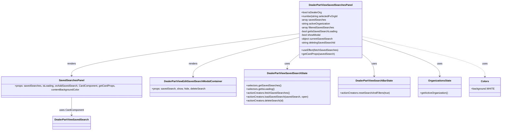

# Diagram: web/portal/src/pages/partview/dashboard/components/organisms/DealerPartView.SavedSearchesPanel.organism.js


> Auto-generated by Obscura crawlers

## Diagram 1



### SVG

<svg id="container" width="3150.4453125" xmlns="http://www.w3.org/2000/svg" class="classDiagram" height="830" viewBox="0 0 3150.4453125 830" role="graphics-document document" aria-roledescription="class"><style>#container{font-family:"trebuchet ms",verdana,arial,sans-serif;font-size:16px;fill:#333;}@keyframes edge-animation-frame{from{stroke-dashoffset:0;}}@keyframes dash{to{stroke-dashoffset:0;}}#container .edge-animation-slow{stroke-dasharray:9,5!important;stroke-dashoffset:900;animation:dash 50s linear infinite;stroke-linecap:round;}#container .edge-animation-fast{stroke-dasharray:9,5!important;stroke-dashoffset:900;animation:dash 20s linear infinite;stroke-linecap:round;}#container .error-icon{fill:#552222;}#container .error-text{fill:#552222;stroke:#552222;}#container .edge-thickness-normal{stroke-width:1px;}#container .edge-thickness-thick{stroke-width:3.5px;}#container .edge-pattern-solid{stroke-dasharray:0;}#container .edge-thickness-invisible{stroke-width:0;fill:none;}#container .edge-pattern-dashed{stroke-dasharray:3;}#container .edge-pattern-dotted{stroke-dasharray:2;}#container .marker{fill:#333333;stroke:#333333;}#container .marker.cross{stroke:#333333;}#container svg{font-family:"trebuchet ms",verdana,arial,sans-serif;font-size:16px;}#container p{margin:0;}#container g.classGroup text{fill:#9370DB;stroke:none;font-family:"trebuchet ms",verdana,arial,sans-serif;font-size:10px;}#container g.classGroup text .title{font-weight:bolder;}#container .nodeLabel,#container .edgeLabel{color:#131300;}#container .edgeLabel .label rect{fill:#ECECFF;}#container .label text{fill:#131300;}#container .labelBkg{background:#ECECFF;}#container .edgeLabel .label span{background:#ECECFF;}#container .classTitle{font-weight:bolder;}#container .node rect,#container .node circle,#container .node ellipse,#container .node polygon,#container .node path{fill:#ECECFF;stroke:#9370DB;stroke-width:1px;}#container .divider{stroke:#9370DB;stroke-width:1;}#container g.clickable{cursor:pointer;}#container g.classGroup rect{fill:#ECECFF;stroke:#9370DB;}#container g.classGroup line{stroke:#9370DB;stroke-width:1;}#container .classLabel .box{stroke:none;stroke-width:0;fill:#ECECFF;opacity:0.5;}#container .classLabel .label{fill:#9370DB;font-size:10px;}#container .relation{stroke:#333333;stroke-width:1;fill:none;}#container .dashed-line{stroke-dasharray:3;}#container .dotted-line{stroke-dasharray:1 2;}#container #compositionStart,#container .composition{fill:#333333!important;stroke:#333333!important;stroke-width:1;}#container #compositionEnd,#container .composition{fill:#333333!important;stroke:#333333!important;stroke-width:1;}#container #dependencyStart,#container .dependency{fill:#333333!important;stroke:#333333!important;stroke-width:1;}#container #dependencyStart,#container .dependency{fill:#333333!important;stroke:#333333!important;stroke-width:1;}#container #extensionStart,#container .extension{fill:transparent!important;stroke:#333333!important;stroke-width:1;}#container #extensionEnd,#container .extension{fill:transparent!important;stroke:#333333!important;stroke-width:1;}#container #aggregationStart,#container .aggregation{fill:transparent!important;stroke:#333333!important;stroke-width:1;}#container #aggregationEnd,#container .aggregation{fill:transparent!important;stroke:#333333!important;stroke-width:1;}#container #lollipopStart,#container .lollipop{fill:#ECECFF!important;stroke:#333333!important;stroke-width:1;}#container #lollipopEnd,#container .lollipop{fill:#ECECFF!important;stroke:#333333!important;stroke-width:1;}#container .edgeTerminals{font-size:11px;line-height:initial;}#container .classTitleText{text-anchor:middle;font-size:18px;fill:#333;}#container .label-icon{display:inline-block;height:1em;overflow:visible;vertical-align:-0.125em;}#container .node .label-icon path{fill:currentColor;stroke:revert;stroke-width:revert;}#container :root{--mermaid-font-family:"trebuchet ms",verdana,arial,sans-serif;}</style><g><defs><marker id="container_class-aggregationStart" class="marker aggregation class" refX="18" refY="7" markerWidth="190" markerHeight="240" orient="auto"><path d="M 18,7 L9,13 L1,7 L9,1 Z"></path></marker></defs><defs><marker id="container_class-aggregationEnd" class="marker aggregation class" refX="1" refY="7" markerWidth="20" markerHeight="28" orient="auto"><path d="M 18,7 L9,13 L1,7 L9,1 Z"></path></marker></defs><defs><marker id="container_class-extensionStart" class="marker extension class" refX="18" refY="7" markerWidth="190" markerHeight="240" orient="auto"><path d="M 1,7 L18,13 V 1 Z"></path></marker></defs><defs><marker id="container_class-extensionEnd" class="marker extension class" refX="1" refY="7" markerWidth="20" markerHeight="28" orient="auto"><path d="M 1,1 V 13 L18,7 Z"></path></marker></defs><defs><marker id="container_class-compositionStart" class="marker composition class" refX="18" refY="7" markerWidth="190" markerHeight="240" orient="auto"><path d="M 18,7 L9,13 L1,7 L9,1 Z"></path></marker></defs><defs><marker id="container_class-compositionEnd" class="marker composition class" refX="1" refY="7" markerWidth="20" markerHeight="28" orient="auto"><path d="M 18,7 L9,13 L1,7 L9,1 Z"></path></marker></defs><defs><marker id="container_class-dependencyStart" class="marker dependency class" refX="6" refY="7" markerWidth="190" markerHeight="240" orient="auto"><path d="M 5,7 L9,13 L1,7 L9,1 Z"></path></marker></defs><defs><marker id="container_class-dependencyEnd" class="marker dependency class" refX="13" refY="7" markerWidth="20" markerHeight="28" orient="auto"><path d="M 18,7 L9,13 L14,7 L9,1 Z"></path></marker></defs><defs><marker id="container_class-lollipopStart" class="marker lollipop class" refX="13" refY="7" markerWidth="190" markerHeight="240" orient="auto"><circle stroke="black" fill="transparent" cx="7" cy="7" r="6"></circle></marker></defs><defs><marker id="container_class-lollipopEnd" class="marker lollipop class" refX="1" refY="7" markerWidth="190" markerHeight="240" orient="auto"><circle stroke="black" fill="transparent" cx="7" cy="7" r="6"></circle></marker></defs><g class="root"><g class="clusters"></g><g class="edgePaths"><path d="M1891.588,213.917L1653.035,245.764C1414.483,277.611,937.378,341.306,698.826,386.819C460.273,432.333,460.273,459.667,460.273,473.333L460.273,487" id="id_DealerPartViewSavedSearchesPanel_SavedSearchesPanel_1" class="edge-thickness-normal edge-pattern-solid relation" style=";;;" data-edge="true" data-et="edge" data-id="id_DealerPartViewSavedSearchesPanel_SavedSearchesPanel_1" data-points="W3sieCI6MTg5MS41ODc4OTA2MjUsInkiOjIxMy45MTY2MDQ0ODQxMTMxMn0seyJ4Ijo0NjAuMjczNDM3NSwieSI6NDA1fSx7IngiOjQ2MC4yNzM0Mzc1LCJ5Ijo0OTN9XQ==" marker-end="url(#container_class-dependencyEnd)"></path><path d="M1891.588,237.246L1781.371,265.205C1671.155,293.164,1450.722,349.082,1340.506,390.708C1230.289,432.333,1230.289,459.667,1230.289,473.333L1230.289,487" id="id_DealerPartViewSavedSearchesPanel_DealerPartViewEditSavedSearchModalContainer_2" class="edge-thickness-normal edge-pattern-solid relation" style=";;;" data-edge="true" data-et="edge" data-id="id_DealerPartViewSavedSearchesPanel_DealerPartViewEditSavedSearchModalContainer_2" data-points="W3sieCI6MTg5MS41ODc4OTA2MjUsInkiOjIzNy4yNDU1MDcyMDQ2ODMzMn0seyJ4IjoxMjMwLjI4OTA2MjUsInkiOjQwNX0seyJ4IjoxMjMwLjI4OTA2MjUsInkiOjQ5M31d" marker-end="url(#container_class-dependencyEnd)"></path><path d="M1891.588,343.385L1878.758,353.654C1865.928,363.923,1840.269,384.462,1827.439,399.897C1814.609,415.333,1814.609,425.667,1814.609,430.833L1814.609,436" id="id_DealerPartViewSavedSearchesPanel_DealerPartViewSavedSearchState_3" class="edge-thickness-normal edge-pattern-solid relation" style=";;;" data-edge="true" data-et="edge" data-id="id_DealerPartViewSavedSearchesPanel_DealerPartViewSavedSearchState_3" data-points="W3sieCI6MTg5MS41ODc4OTA2MjUsInkiOjM0My4zODQ4MDA0NzgzNjIxfSx7IngiOjE4MTQuNjA5Mzc1LCJ5Ijo0MDV9LHsieCI6MTgxNC42MDkzNzUsInkiOjQ0Mn1d" marker-end="url(#container_class-dependencyEnd)"></path><path d="M2279.846,343.385L2292.675,353.654C2305.505,363.923,2331.165,384.462,2343.994,407.897C2356.824,431.333,2356.824,457.667,2356.824,470.833L2356.824,484" id="id_DealerPartViewSavedSearchesPanel_DealerPartViewSearchBarState_4" class="edge-thickness-normal edge-pattern-solid relation" style=";;;" data-edge="true" data-et="edge" data-id="id_DealerPartViewSavedSearchesPanel_DealerPartViewSearchBarState_4" data-points="W3sieCI6MjI3OS44NDU3MDMxMjUsInkiOjM0My4zODQ4MDA0NzgzNjIxfSx7IngiOjIzNTYuODI0MjE4NzUsInkiOjQwNX0seyJ4IjoyMzU2LjgyNDIxODc1LCJ5Ijo0OTB9XQ==" marker-end="url(#container_class-dependencyEnd)"></path><path d="M2279.846,249.769L2361.156,275.641C2442.466,301.513,2605.087,353.256,2686.397,392.295C2767.707,431.333,2767.707,457.667,2767.707,470.833L2767.707,484" id="id_DealerPartViewSavedSearchesPanel_OrganizationsState_5" class="edge-thickness-normal edge-pattern-solid relation" style=";;;" data-edge="true" data-et="edge" data-id="id_DealerPartViewSavedSearchesPanel_OrganizationsState_5" data-points="W3sieCI6MjI3OS44NDU3MDMxMjUsInkiOjI0OS43NjkxNzI4MzExMjY3Mn0seyJ4IjoyNzY3LjcwNzAzMTI1LCJ5Ijo0MDV9LHsieCI6Mjc2Ny43MDcwMzEyNSwieSI6NDkwfV0=" marker-end="url(#container_class-dependencyEnd)"></path><path d="M460.273,613L460.273,627.667C460.273,642.333,460.273,671.667,460.273,691.5C460.273,711.333,460.273,721.667,460.273,726.833L460.273,732" id="id_SavedSearchesPanel_DealerPartViewSavedSearch_6" class="edge-thickness-normal edge-pattern-solid relation" style=";;;" data-edge="true" data-et="edge" data-id="id_SavedSearchesPanel_DealerPartViewSavedSearch_6" data-points="W3sieCI6NDYwLjI3MzQzNzUsInkiOjYxM30seyJ4Ijo0NjAuMjczNDM3NSwieSI6NzAxfSx7IngiOjQ2MC4yNzM0Mzc1LCJ5Ijo3Mzh9XQ==" marker-end="url(#container_class-dependencyEnd)"></path><path d="M2279.846,231.791L2407.821,260.659C2535.797,289.527,2791.748,347.264,2919.724,389.798C3047.699,432.333,3047.699,459.667,3047.699,473.333L3047.699,487" id="id_DealerPartViewSavedSearchesPanel_Colors_7" class="edge-thickness-normal edge-pattern-dashed relation" style=";;;" data-edge="true" data-et="edge" data-id="id_DealerPartViewSavedSearchesPanel_Colors_7" data-points="W3sieCI6MjI3OS44NDU3MDMxMjUsInkiOjIzMS43OTA3OTI1MzI1MTAzOH0seyJ4IjozMDQ3LjY5OTIxODc1LCJ5Ijo0MDV9LHsieCI6MzA0Ny42OTkyMTg3NSwieSI6NDkzfV0=" marker-end="url(#container_class-dependencyEnd)"></path></g><g class="edgeLabels"><g class="edgeLabel" transform="translate(460.2734375, 405)"><g class="label" data-id="id_DealerPartViewSavedSearchesPanel_SavedSearchesPanel_1" transform="translate(-27.75, -12)"><foreignObject width="55.5" height="24"><div xmlns="http://www.w3.org/1999/xhtml" class="labelBkg" style="display: table-cell; white-space: nowrap; line-height: 1.5; max-width: 200px; text-align: center;"><span class="edgeLabel"><p>renders</p></span></div></foreignObject></g></g><g class="edgeLabel" transform="translate(1230.2890625, 405)"><g class="label" data-id="id_DealerPartViewSavedSearchesPanel_DealerPartViewEditSavedSearchModalContainer_2" transform="translate(-27.75, -12)"><foreignObject width="55.5" height="24"><div xmlns="http://www.w3.org/1999/xhtml" class="labelBkg" style="display: table-cell; white-space: nowrap; line-height: 1.5; max-width: 200px; text-align: center;"><span class="edgeLabel"><p>renders</p></span></div></foreignObject></g></g><g class="edgeLabel" transform="translate(1814.609375, 405)"><g class="label" data-id="id_DealerPartViewSavedSearchesPanel_DealerPartViewSavedSearchState_3" transform="translate(-16.4921875, -12)"><foreignObject width="32.984375" height="24"><div xmlns="http://www.w3.org/1999/xhtml" class="labelBkg" style="display: table-cell; white-space: nowrap; line-height: 1.5; max-width: 200px; text-align: center;"><span class="edgeLabel"><p>uses</p></span></div></foreignObject></g></g><g class="edgeLabel" transform="translate(2356.82421875, 405)"><g class="label" data-id="id_DealerPartViewSavedSearchesPanel_DealerPartViewSearchBarState_4" transform="translate(-16.4921875, -12)"><foreignObject width="32.984375" height="24"><div xmlns="http://www.w3.org/1999/xhtml" class="labelBkg" style="display: table-cell; white-space: nowrap; line-height: 1.5; max-width: 200px; text-align: center;"><span class="edgeLabel"><p>uses</p></span></div></foreignObject></g></g><g class="edgeLabel" transform="translate(2767.70703125, 405)"><g class="label" data-id="id_DealerPartViewSavedSearchesPanel_OrganizationsState_5" transform="translate(-16.4921875, -12)"><foreignObject width="32.984375" height="24"><div xmlns="http://www.w3.org/1999/xhtml" class="labelBkg" style="display: table-cell; white-space: nowrap; line-height: 1.5; max-width: 200px; text-align: center;"><span class="edgeLabel"><p>uses</p></span></div></foreignObject></g></g><g class="edgeLabel" transform="translate(460.2734375, 701)"><g class="label" data-id="id_SavedSearchesPanel_DealerPartViewSavedSearch_6" transform="translate(-76.890625, -12)"><foreignObject width="153.78125" height="24"><div xmlns="http://www.w3.org/1999/xhtml" class="labelBkg" style="display: table-cell; white-space: nowrap; line-height: 1.5; max-width: 200px; text-align: center;"><span class="edgeLabel"><p>uses CardComponent</p></span></div></foreignObject></g></g><g class="edgeLabel" transform="translate(3047.69921875, 405)"><g class="label" data-id="id_DealerPartViewSavedSearchesPanel_Colors_7" transform="translate(-16.4921875, -12)"><foreignObject width="32.984375" height="24"><div xmlns="http://www.w3.org/1999/xhtml" class="labelBkg" style="display: table-cell; white-space: nowrap; line-height: 1.5; max-width: 200px; text-align: center;"><span class="edgeLabel"><p>uses</p></span></div></foreignObject></g></g></g><g class="nodes"><g class="node default" id="classId-DealerPartViewSavedSearchesPanel-0" transform="translate(2085.716796875, 188)"><g class="basic label-container"><path d="M-194.12890625 -180 L194.12890625 -180 L194.12890625 180 L-194.12890625 180" stroke="none" stroke-width="0" fill="#ECECFF" style=""></path><path d="M-194.12890625 -180 C-59.5234752918887 -180, 75.0819556662226 -180, 194.12890625 -180 M-194.12890625 -180 C-54.95895561178776 -180, 84.21099502642448 -180, 194.12890625 -180 M194.12890625 -180 C194.12890625 -80.35475023931397, 194.12890625 19.290499521372055, 194.12890625 180 M194.12890625 -180 C194.12890625 -100.19365773616819, 194.12890625 -20.387315472336383, 194.12890625 180 M194.12890625 180 C88.84685399036326 180, -16.435198269273485 180, -194.12890625 180 M194.12890625 180 C40.86420816289245 180, -112.4004899242151 180, -194.12890625 180 M-194.12890625 180 C-194.12890625 60.8627944755565, -194.12890625 -58.274411048887, -194.12890625 -180 M-194.12890625 180 C-194.12890625 39.22950673959443, -194.12890625 -101.54098652081115, -194.12890625 -180" stroke="#9370DB" stroke-width="1.3" fill="none" stroke-dasharray="0 0" style=""></path></g><g class="annotation-group text" transform="translate(0, -156)"></g><g class="label-group text" transform="translate(-131.3671875, -156)"><g class="label" style="font-weight: bolder" transform="translate(0,-12)"><foreignObject width="262.734375" height="24"><div xmlns="http://www.w3.org/1999/xhtml" style="display: table-cell; white-space: nowrap; line-height: 1.5; max-width: 308px; text-align: center;"><span class="nodeLabel markdown-node-label" style=""><p>DealerPartViewSavedSearchesPanel</p></span></div></foreignObject></g></g><g class="members-group text" transform="translate(-182.12890625, -108)"><g class="label" style="" transform="translate(0,-12)"><foreignObject width="129.34375" height="24"><div xmlns="http://www.w3.org/1999/xhtml" style="display: table-cell; white-space: nowrap; line-height: 1.5; max-width: 187px; text-align: center;"><span class="nodeLabel markdown-node-label" style=""><p>+bool isDealerOrg</p></span></div></foreignObject></g><g class="label" style="" transform="translate(0,12)"><foreignObject width="232.890625" height="24"><div xmlns="http://www.w3.org/1999/xhtml" style="display: table-cell; white-space: nowrap; line-height: 1.5; max-width: 290px; text-align: center;"><span class="nodeLabel markdown-node-label" style=""><p>+number|string selectedFvOrgId</p></span></div></foreignObject></g><g class="label" style="" transform="translate(0,36)"><foreignObject width="154.0625" height="24"><div xmlns="http://www.w3.org/1999/xhtml" style="display: table-cell; white-space: nowrap; line-height: 1.5; max-width: 211px; text-align: center;"><span class="nodeLabel markdown-node-label" style=""><p>-array savedSearches</p></span></div></foreignObject></g><g class="label" style="" transform="translate(0,60)"><foreignObject width="187.578125" height="24"><div xmlns="http://www.w3.org/1999/xhtml" style="display: table-cell; white-space: nowrap; line-height: 1.5; max-width: 245px; text-align: center;"><span class="nodeLabel markdown-node-label" style=""><p>-string activeOrganization</p></span></div></foreignObject></g><g class="label" style="" transform="translate(0,84)"><foreignObject width="207.59375" height="24"><div xmlns="http://www.w3.org/1999/xhtml" style="display: table-cell; white-space: nowrap; line-height: 1.5; max-width: 265px; text-align: center;"><span class="nodeLabel markdown-node-label" style=""><p>-array filteredSavedSearches</p></span></div></foreignObject></g><g class="label" style="" transform="translate(0,108)"><foreignObject width="227.546875" height="24"><div xmlns="http://www.w3.org/1999/xhtml" style="display: table-cell; white-space: nowrap; line-height: 1.5; max-width: 286px; text-align: center;"><span class="nodeLabel markdown-node-label" style=""><p>-bool getIsSavedSearchLoading</p></span></div></foreignObject></g><g class="label" style="" transform="translate(0,132)"><foreignObject width="125.828125" height="24"><div xmlns="http://www.w3.org/1999/xhtml" style="display: table-cell; white-space: nowrap; line-height: 1.5; max-width: 183px; text-align: center;"><span class="nodeLabel markdown-node-label" style=""><p>-bool showModal</p></span></div></foreignObject></g><g class="label" style="" transform="translate(0,156)"><foreignObject width="200.703125" height="24"><div xmlns="http://www.w3.org/1999/xhtml" style="display: table-cell; white-space: nowrap; line-height: 1.5; max-width: 258px; text-align: center;"><span class="nodeLabel markdown-node-label" style=""><p>-object currentSavedSearch</p></span></div></foreignObject></g><g class="label" style="" transform="translate(0,180)"><foreignObject width="218.203125" height="24"><div xmlns="http://www.w3.org/1999/xhtml" style="display: table-cell; white-space: nowrap; line-height: 1.5; max-width: 276px; text-align: center;"><span class="nodeLabel markdown-node-label" style=""><p>-string deletingSavedSearchId</p></span></div></foreignObject></g></g><g class="methods-group text" transform="translate(-182.12890625, 132)"><g class="label" style="" transform="translate(0,-12)"><foreignObject width="229.46875" height="24"><div xmlns="http://www.w3.org/1999/xhtml" style="display: table-cell; white-space: nowrap; line-height: 1.5; max-width: 287px; text-align: center;"><span class="nodeLabel markdown-node-label" style=""><p>+useEffect(fetchSavedSearches)</p></span></div></foreignObject></g><g class="label" style="" transform="translate(0,12)"><foreignObject width="205.25" height="24"><div xmlns="http://www.w3.org/1999/xhtml" style="display: table-cell; white-space: nowrap; line-height: 1.5; max-width: 263px; text-align: center;"><span class="nodeLabel markdown-node-label" style=""><p>+getCardProps(savedSearch)</p></span></div></foreignObject></g></g><g class="divider" style=""><path d="M-194.12890625 -132 C-88.51109734049555 -132, 17.106711569008894 -132, 194.12890625 -132 M-194.12890625 -132 C-110.05841232120507 -132, -25.987918392410137 -132, 194.12890625 -132" stroke="#9370DB" stroke-width="1.3" fill="none" stroke-dasharray="0 0" style=""></path></g><g class="divider" style=""><path d="M-194.12890625 108 C-75.95916276205479 108, 42.21058072589042 108, 194.12890625 108 M-194.12890625 108 C-61.37969336483107 108, 71.36951952033786 108, 194.12890625 108" stroke="#9370DB" stroke-width="1.3" fill="none" stroke-dasharray="0 0" style=""></path></g></g><g class="node default" id="classId-SavedSearchesPanel-1" transform="translate(460.2734375, 553)"><g class="basic label-container"><path d="M-452.2734375 -60 L452.2734375 -60 L452.2734375 60 L-452.2734375 60" stroke="none" stroke-width="0" fill="#ECECFF" style=""></path><path d="M-452.2734375 -60 C-268.331189250196 -60, -84.38894100039204 -60, 452.2734375 -60 M-452.2734375 -60 C-126.31889044100143 -60, 199.63565661799714 -60, 452.2734375 -60 M452.2734375 -60 C452.2734375 -17.04798806794021, 452.2734375 25.90402386411958, 452.2734375 60 M452.2734375 -60 C452.2734375 -17.3321599482881, 452.2734375 25.335680103423798, 452.2734375 60 M452.2734375 60 C93.65362600019796 60, -264.9661854996041 60, -452.2734375 60 M452.2734375 60 C182.97353070533256 60, -86.32637608933487 60, -452.2734375 60 M-452.2734375 60 C-452.2734375 13.427771255664283, -452.2734375 -33.144457488671435, -452.2734375 -60 M-452.2734375 60 C-452.2734375 35.23802914482676, -452.2734375 10.476058289653523, -452.2734375 -60" stroke="#9370DB" stroke-width="1.3" fill="none" stroke-dasharray="0 0" style=""></path></g><g class="annotation-group text" transform="translate(0, -36)"></g><g class="label-group text" transform="translate(-75.265625, -36)"><g class="label" style="font-weight: bolder" transform="translate(0,-12)"><foreignObject width="150.53125" height="24"><div xmlns="http://www.w3.org/1999/xhtml" style="display: table-cell; white-space: nowrap; line-height: 1.5; max-width: 198px; text-align: center;"><span class="nodeLabel markdown-node-label" style=""><p>SavedSearchesPanel</p></span></div></foreignObject></g></g><g class="members-group text" transform="translate(-440.2734375, 12)"><g class="label" style="" transform="translate(0,-12)"><foreignObject width="805.28125" height="24"><div xmlns="http://www.w3.org/1999/xhtml" style="display: table-cell; white-space: nowrap; line-height: 1.5; max-width: 863px; text-align: center;"><span class="nodeLabel markdown-node-label" style=""><p>+props: savedSearches, isLoading, onAddSavedSearch, CardComponent, getCardProps, contentBackgroundColor</p></span></div></foreignObject></g></g><g class="methods-group text" transform="translate(-440.2734375, 60)"></g><g class="divider" style=""><path d="M-452.2734375 -12 C-103.76086959853649 -12, 244.75169830292702 -12, 452.2734375 -12 M-452.2734375 -12 C-177.03522033353187 -12, 98.20299683293626 -12, 452.2734375 -12" stroke="#9370DB" stroke-width="1.3" fill="none" stroke-dasharray="0 0" style=""></path></g><g class="divider" style=""><path d="M-452.2734375 36 C-186.5691298110554 36, 79.13517787788919 36, 452.2734375 36 M-452.2734375 36 C-102.96569978616913 36, 246.34203792766175 36, 452.2734375 36" stroke="#9370DB" stroke-width="1.3" fill="none" stroke-dasharray="0 0" style=""></path></g></g><g class="node default" id="classId-DealerPartViewSavedSearch-2" transform="translate(460.2734375, 780)"><g class="basic label-container"><path d="M-114.90625 -42 L114.90625 -42 L114.90625 42 L-114.90625 42" stroke="none" stroke-width="0" fill="#ECECFF" style=""></path><path d="M-114.90625 -42 C-24.455125599787166 -42, 65.99599880042567 -42, 114.90625 -42 M-114.90625 -42 C-24.60321390104943 -42, 65.69982219790114 -42, 114.90625 -42 M114.90625 -42 C114.90625 -24.948478942868533, 114.90625 -7.896957885737066, 114.90625 42 M114.90625 -42 C114.90625 -12.585532376990475, 114.90625 16.82893524601905, 114.90625 42 M114.90625 42 C29.895819563515033 42, -55.11461087296993 42, -114.90625 42 M114.90625 42 C49.039769909893934 42, -16.82671018021213 42, -114.90625 42 M-114.90625 42 C-114.90625 23.121292209550422, -114.90625 4.242584419100844, -114.90625 -42 M-114.90625 42 C-114.90625 23.04868437688416, -114.90625 4.097368753768322, -114.90625 -42" stroke="#9370DB" stroke-width="1.3" fill="none" stroke-dasharray="0 0" style=""></path></g><g class="annotation-group text" transform="translate(0, -18)"></g><g class="label-group text" transform="translate(-102.90625, -18)"><g class="label" style="font-weight: bolder" transform="translate(0,-12)"><foreignObject width="205.8125" height="24"><div xmlns="http://www.w3.org/1999/xhtml" style="display: table-cell; white-space: nowrap; line-height: 1.5; max-width: 252px; text-align: center;"><span class="nodeLabel markdown-node-label" style=""><p>DealerPartViewSavedSearch</p></span></div></foreignObject></g></g><g class="members-group text" transform="translate(-102.90625, 30)"></g><g class="methods-group text" transform="translate(-102.90625, 60)"></g><g class="divider" style=""><path d="M-114.90625 6 C-61.128357158431655 6, -7.3504643168633095 6, 114.90625 6 M-114.90625 6 C-23.897037156315164 6, 67.11217568736967 6, 114.90625 6" stroke="#9370DB" stroke-width="1.3" fill="none" stroke-dasharray="0 0" style=""></path></g><g class="divider" style=""><path d="M-114.90625 24 C-35.08101184795589 24, 44.744226304088215 24, 114.90625 24 M-114.90625 24 C-68.44155560213639 24, -21.976861204272794 24, 114.90625 24" stroke="#9370DB" stroke-width="1.3" fill="none" stroke-dasharray="0 0" style=""></path></g></g><g class="node default" id="classId-DealerPartViewEditSavedSearchModalContainer-3" transform="translate(1230.2890625, 553)"><g class="basic label-container"><path d="M-267.7421875 -60 L267.7421875 -60 L267.7421875 60 L-267.7421875 60" stroke="none" stroke-width="0" fill="#ECECFF" style=""></path><path d="M-267.7421875 -60 C-57.75859916708981 -60, 152.22498916582038 -60, 267.7421875 -60 M-267.7421875 -60 C-115.84314619069633 -60, 36.05589511860734 -60, 267.7421875 -60 M267.7421875 -60 C267.7421875 -28.365876649431534, 267.7421875 3.268246701136931, 267.7421875 60 M267.7421875 -60 C267.7421875 -19.84045737657552, 267.7421875 20.319085246848957, 267.7421875 60 M267.7421875 60 C97.04163949228939 60, -73.65890851542122 60, -267.7421875 60 M267.7421875 60 C154.42111026886423 60, 41.10003303772845 60, -267.7421875 60 M-267.7421875 60 C-267.7421875 22.09433641526047, -267.7421875 -15.811327169479057, -267.7421875 -60 M-267.7421875 60 C-267.7421875 30.519384049824943, -267.7421875 1.0387680996498858, -267.7421875 -60" stroke="#9370DB" stroke-width="1.3" fill="none" stroke-dasharray="0 0" style=""></path></g><g class="annotation-group text" transform="translate(0, -36)"></g><g class="label-group text" transform="translate(-175.140625, -36)"><g class="label" style="font-weight: bolder" transform="translate(0,-12)"><foreignObject width="350.28125" height="24"><div xmlns="http://www.w3.org/1999/xhtml" style="display: table-cell; white-space: nowrap; line-height: 1.5; max-width: 396px; text-align: center;"><span class="nodeLabel markdown-node-label" style=""><p>DealerPartViewEditSavedSearchModalContainer</p></span></div></foreignObject></g></g><g class="members-group text" transform="translate(-255.7421875, 12)"><g class="label" style="" transform="translate(0,-12)"><foreignObject width="336.34375" height="24"><div xmlns="http://www.w3.org/1999/xhtml" style="display: table-cell; white-space: nowrap; line-height: 1.5; max-width: 394px; text-align: center;"><span class="nodeLabel markdown-node-label" style=""><p>+props: savedSearch, show, hide, deleteSearch</p></span></div></foreignObject></g></g><g class="methods-group text" transform="translate(-255.7421875, 60)"></g><g class="divider" style=""><path d="M-267.7421875 -12 C-119.50855371212299 -12, 28.725080075754022 -12, 267.7421875 -12 M-267.7421875 -12 C-75.2864748515187 -12, 117.16923779696259 -12, 267.7421875 -12" stroke="#9370DB" stroke-width="1.3" fill="none" stroke-dasharray="0 0" style=""></path></g><g class="divider" style=""><path d="M-267.7421875 36 C-137.28721044125706 36, -6.832233382514119 36, 267.7421875 36 M-267.7421875 36 C-128.76625495847665 36, 10.209677583046698 36, 267.7421875 36" stroke="#9370DB" stroke-width="1.3" fill="none" stroke-dasharray="0 0" style=""></path></g></g><g class="node default" id="classId-DealerPartViewSavedSearchState-4" transform="translate(1814.609375, 553)"><g class="basic label-container"><path d="M-266.578125 -111 L266.578125 -111 L266.578125 111 L-266.578125 111" stroke="none" stroke-width="0" fill="#ECECFF" style=""></path><path d="M-266.578125 -111 C-58.213568257320134 -111, 150.15098848535973 -111, 266.578125 -111 M-266.578125 -111 C-107.52704375723482 -111, 51.52403748553036 -111, 266.578125 -111 M266.578125 -111 C266.578125 -34.028776432524396, 266.578125 42.94244713495121, 266.578125 111 M266.578125 -111 C266.578125 -43.24670255617258, 266.578125 24.506594887654842, 266.578125 111 M266.578125 111 C68.25407962373231 111, -130.06996575253538 111, -266.578125 111 M266.578125 111 C131.6570194648053 111, -3.2640860703893964 111, -266.578125 111 M-266.578125 111 C-266.578125 54.96330142110357, -266.578125 -1.0733971577928543, -266.578125 -111 M-266.578125 111 C-266.578125 25.985810869529175, -266.578125 -59.02837826094165, -266.578125 -111" stroke="#9370DB" stroke-width="1.3" fill="none" stroke-dasharray="0 0" style=""></path></g><g class="annotation-group text" transform="translate(0, -87)"></g><g class="label-group text" transform="translate(-122.21875, -87)"><g class="label" style="font-weight: bolder" transform="translate(0,-12)"><foreignObject width="244.4375" height="24"><div xmlns="http://www.w3.org/1999/xhtml" style="display: table-cell; white-space: nowrap; line-height: 1.5; max-width: 289px; text-align: center;"><span class="nodeLabel markdown-node-label" style=""><p>DealerPartViewSavedSearchState</p></span></div></foreignObject></g></g><g class="members-group text" transform="translate(-254.578125, -39)"></g><g class="methods-group text" transform="translate(-254.578125, -9)"><g class="label" style="" transform="translate(0,-12)"><foreignObject width="218.234375" height="24"><div xmlns="http://www.w3.org/1999/xhtml" style="display: table-cell; white-space: nowrap; line-height: 1.5; max-width: 276px; text-align: center;"><span class="nodeLabel markdown-node-label" style=""><p>+selectors.getSavedSearches()</p></span></div></foreignObject></g><g class="label" style="" transform="translate(0,12)"><foreignObject width="179.484375" height="24"><div xmlns="http://www.w3.org/1999/xhtml" style="display: table-cell; white-space: nowrap; line-height: 1.5; max-width: 237px; text-align: center;"><span class="nodeLabel markdown-node-label" style=""><p>+selectors.getIsLoading()</p></span></div></foreignObject></g><g class="label" style="" transform="translate(0,36)"><foreignObject width="271.71875" height="24"><div xmlns="http://www.w3.org/1999/xhtml" style="display: table-cell; white-space: nowrap; line-height: 1.5; max-width: 329px; text-align: center;"><span class="nodeLabel markdown-node-label" style=""><p>+actionCreators.fetchSavedSearches()</p></span></div></foreignObject></g><g class="label" style="" transform="translate(0,60)"><foreignObject width="386.9375" height="24"><div xmlns="http://www.w3.org/1999/xhtml" style="display: table-cell; white-space: nowrap; line-height: 1.5; max-width: 444px; text-align: center;"><span class="nodeLabel markdown-node-label" style=""><p>+actionCreators.loadSavedSearch(savedSearch, open)</p></span></div></foreignObject></g><g class="label" style="" transform="translate(0,84)"><foreignObject width="235.78125" height="24"><div xmlns="http://www.w3.org/1999/xhtml" style="display: table-cell; white-space: nowrap; line-height: 1.5; max-width: 293px; text-align: center;"><span class="nodeLabel markdown-node-label" style=""><p>+actionCreators.deleteSearch(id)</p></span></div></foreignObject></g></g><g class="divider" style=""><path d="M-266.578125 -63 C-81.74195911700613 -63, 103.09420676598774 -63, 266.578125 -63 M-266.578125 -63 C-97.57222871221126 -63, 71.43366757557749 -63, 266.578125 -63" stroke="#9370DB" stroke-width="1.3" fill="none" stroke-dasharray="0 0" style=""></path></g><g class="divider" style=""><path d="M-266.578125 -39 C-110.53196181209546 -39, 45.51420137580908 -39, 266.578125 -39 M-266.578125 -39 C-114.86178289405461 -39, 36.85455921189077 -39, 266.578125 -39" stroke="#9370DB" stroke-width="1.3" fill="none" stroke-dasharray="0 0" style=""></path></g></g><g class="node default" id="classId-DealerPartViewSearchBarState-5" transform="translate(2356.82421875, 553)"><g class="basic label-container"><path d="M-225.63671875 -63 L225.63671875 -63 L225.63671875 63 L-225.63671875 63" stroke="none" stroke-width="0" fill="#ECECFF" style=""></path><path d="M-225.63671875 -63 C-94.24689810025873 -63, 37.142922549482535 -63, 225.63671875 -63 M-225.63671875 -63 C-57.24045351369338 -63, 111.15581172261324 -63, 225.63671875 -63 M225.63671875 -63 C225.63671875 -14.366486855982863, 225.63671875 34.26702628803427, 225.63671875 63 M225.63671875 -63 C225.63671875 -21.494972265399, 225.63671875 20.010055469202, 225.63671875 63 M225.63671875 63 C79.6289101092693 63, -66.3788985314614 63, -225.63671875 63 M225.63671875 63 C45.407398471624674 63, -134.82192180675065 63, -225.63671875 63 M-225.63671875 63 C-225.63671875 33.45986313672538, -225.63671875 3.919726273450763, -225.63671875 -63 M-225.63671875 63 C-225.63671875 29.379876711298508, -225.63671875 -4.240246577402985, -225.63671875 -63" stroke="#9370DB" stroke-width="1.3" fill="none" stroke-dasharray="0 0" style=""></path></g><g class="annotation-group text" transform="translate(0, -39)"></g><g class="label-group text" transform="translate(-112.6484375, -39)"><g class="label" style="font-weight: bolder" transform="translate(0,-12)"><foreignObject width="225.296875" height="24"><div xmlns="http://www.w3.org/1999/xhtml" style="display: table-cell; white-space: nowrap; line-height: 1.5; max-width: 270px; text-align: center;"><span class="nodeLabel markdown-node-label" style=""><p>DealerPartViewSearchBarState</p></span></div></foreignObject></g></g><g class="members-group text" transform="translate(-213.63671875, 9)"></g><g class="methods-group text" transform="translate(-213.63671875, 39)"><g class="label" style="" transform="translate(0,-12)"><foreignObject width="314.625" height="24"><div xmlns="http://www.w3.org/1999/xhtml" style="display: table-cell; white-space: nowrap; line-height: 1.5; max-width: 372px; text-align: center;"><span class="nodeLabel markdown-node-label" style=""><p>+actionCreators.resetSearchAndFilters(true)</p></span></div></foreignObject></g></g><g class="divider" style=""><path d="M-225.63671875 -15 C-55.948299055377305 -15, 113.74012063924539 -15, 225.63671875 -15 M-225.63671875 -15 C-51.76155625500945 -15, 122.1136062399811 -15, 225.63671875 -15" stroke="#9370DB" stroke-width="1.3" fill="none" stroke-dasharray="0 0" style=""></path></g><g class="divider" style=""><path d="M-225.63671875 9 C-110.28050028806454 9, 5.075718173870911 9, 225.63671875 9 M-225.63671875 9 C-99.80021923329973 9, 26.036280283400544 9, 225.63671875 9" stroke="#9370DB" stroke-width="1.3" fill="none" stroke-dasharray="0 0" style=""></path></g></g><g class="node default" id="classId-OrganizationsState-6" transform="translate(2767.70703125, 553)"><g class="basic label-container"><path d="M-135.24609375 -63 L135.24609375 -63 L135.24609375 63 L-135.24609375 63" stroke="none" stroke-width="0" fill="#ECECFF" style=""></path><path d="M-135.24609375 -63 C-70.54202666007969 -63, -5.83795957015937 -63, 135.24609375 -63 M-135.24609375 -63 C-61.95990872790591 -63, 11.326276294188176 -63, 135.24609375 -63 M135.24609375 -63 C135.24609375 -19.936788927737176, 135.24609375 23.126422144525648, 135.24609375 63 M135.24609375 -63 C135.24609375 -30.2037743722318, 135.24609375 2.592451255536403, 135.24609375 63 M135.24609375 63 C70.08281146358514 63, 4.91952917717029 63, -135.24609375 63 M135.24609375 63 C73.42463260552488 63, 11.603171461049754 63, -135.24609375 63 M-135.24609375 63 C-135.24609375 15.286414933951107, -135.24609375 -32.427170132097785, -135.24609375 -63 M-135.24609375 63 C-135.24609375 26.52949877975292, -135.24609375 -9.94100244049416, -135.24609375 -63" stroke="#9370DB" stroke-width="1.3" fill="none" stroke-dasharray="0 0" style=""></path></g><g class="annotation-group text" transform="translate(0, -39)"></g><g class="label-group text" transform="translate(-69.8671875, -39)"><g class="label" style="font-weight: bolder" transform="translate(0,-12)"><foreignObject width="139.734375" height="24"><div xmlns="http://www.w3.org/1999/xhtml" style="display: table-cell; white-space: nowrap; line-height: 1.5; max-width: 187px; text-align: center;"><span class="nodeLabel markdown-node-label" style=""><p>OrganizationsState</p></span></div></foreignObject></g></g><g class="members-group text" transform="translate(-123.24609375, 9)"></g><g class="methods-group text" transform="translate(-123.24609375, 39)"><g class="label" style="" transform="translate(0,-12)"><foreignObject width="176.625" height="24"><div xmlns="http://www.w3.org/1999/xhtml" style="display: table-cell; white-space: nowrap; line-height: 1.5; max-width: 234px; text-align: center;"><span class="nodeLabel markdown-node-label" style=""><p>+getActiveOrganization()</p></span></div></foreignObject></g></g><g class="divider" style=""><path d="M-135.24609375 -15 C-45.25396283943918 -15, 44.738168071121635 -15, 135.24609375 -15 M-135.24609375 -15 C-66.51403612271476 -15, 2.218021504570487 -15, 135.24609375 -15" stroke="#9370DB" stroke-width="1.3" fill="none" stroke-dasharray="0 0" style=""></path></g><g class="divider" style=""><path d="M-135.24609375 9 C-76.07881577242688 9, -16.911537794853757 9, 135.24609375 9 M-135.24609375 9 C-51.641561856857564 9, 31.962970036284872 9, 135.24609375 9" stroke="#9370DB" stroke-width="1.3" fill="none" stroke-dasharray="0 0" style=""></path></g></g><g class="node default" id="classId-Colors-7" transform="translate(3047.69921875, 553)"><g class="basic label-container"><path d="M-94.74609375 -60 L94.74609375 -60 L94.74609375 60 L-94.74609375 60" stroke="none" stroke-width="0" fill="#ECECFF" style=""></path><path d="M-94.74609375 -60 C-46.69917917146736 -60, 1.3477354070652865 -60, 94.74609375 -60 M-94.74609375 -60 C-31.7983138719734 -60, 31.149466006053203 -60, 94.74609375 -60 M94.74609375 -60 C94.74609375 -13.983587426168548, 94.74609375 32.032825147662905, 94.74609375 60 M94.74609375 -60 C94.74609375 -16.023627953812813, 94.74609375 27.952744092374374, 94.74609375 60 M94.74609375 60 C34.898511522892726 60, -24.94907070421455 60, -94.74609375 60 M94.74609375 60 C21.765588118971678 60, -51.214917512056644 60, -94.74609375 60 M-94.74609375 60 C-94.74609375 30.47975163854328, -94.74609375 0.9595032770865615, -94.74609375 -60 M-94.74609375 60 C-94.74609375 19.815617146058628, -94.74609375 -20.368765707882744, -94.74609375 -60" stroke="#9370DB" stroke-width="1.3" fill="none" stroke-dasharray="0 0" style=""></path></g><g class="annotation-group text" transform="translate(0, -36)"></g><g class="label-group text" transform="translate(-23.1015625, -36)"><g class="label" style="font-weight: bolder" transform="translate(0,-12)"><foreignObject width="46.203125" height="24"><div xmlns="http://www.w3.org/1999/xhtml" style="display: table-cell; white-space: nowrap; line-height: 1.5; max-width: 95px; text-align: center;"><span class="nodeLabel markdown-node-label" style=""><p>Colors</p></span></div></foreignObject></g></g><g class="members-group text" transform="translate(-82.74609375, 12)"><g class="label" style="" transform="translate(0,-12)"><foreignObject width="142.390625" height="24"><div xmlns="http://www.w3.org/1999/xhtml" style="display: table-cell; white-space: nowrap; line-height: 1.5; max-width: 200px; text-align: center;"><span class="nodeLabel markdown-node-label" style=""><p>+background.WHITE</p></span></div></foreignObject></g></g><g class="methods-group text" transform="translate(-82.74609375, 60)"></g><g class="divider" style=""><path d="M-94.74609375 -12 C-33.001759320821925 -12, 28.74257510835615 -12, 94.74609375 -12 M-94.74609375 -12 C-41.183525204836855 -12, 12.379043340326291 -12, 94.74609375 -12" stroke="#9370DB" stroke-width="1.3" fill="none" stroke-dasharray="0 0" style=""></path></g><g class="divider" style=""><path d="M-94.74609375 36 C-44.89501185627511 36, 4.956070037449777 36, 94.74609375 36 M-94.74609375 36 C-36.08917883630631 36, 22.56773607738738 36, 94.74609375 36" stroke="#9370DB" stroke-width="1.3" fill="none" stroke-dasharray="0 0" style=""></path></g></g></g></g></g></svg>

## Diagram 2

```mermaid
flowchart TD
  A[Redux store: savedSearches] -->|useSelector|getSavedSearches(SavedSearches)
  B[Redux store: activeOrganization] -->|useSelector|getActiveOrganization
  C[Props: isDealerOrg, selectedFvOrgId] --> D[Compute fvOrgIdToUse]
  getSavedSearches --> E{savedSearches present?}
  E -- no --> F[filteredSavedSearches = []]
  E -- yes --> G[Filter by fvOrgId (useMemo)]
  D --> G
  G --> H[Render <SavedSearchesPanel ... />]
  H --> I[onAddSavedSearch -> setShowModal(true)]
  H --> J[getCardProps -> onEditClick -> dispatch(loadSavedSearch) & setCurrentSavedSearch & setShowModal(true)]
  H --> K[isDeleting check -> setDeletingSavedSearchId]
  L[useEffect deps: isDealerOrg, selectedFvOrgId] --> M[dispatch(fetchSavedSearches) when conditions met]
  H --> N[Render <DealerPartViewEditSavedSearchModalContainer />]
  N --> O[hide -> dispatch(resetSearchAndFilters(true)) & setShowModal(false) & clear currentSavedSearch]
  N --> P[deleteSearch(id) -> dispatch(deleteSearch(id)) & setDeletingSavedSearchId(id)]
```

> SVG rendering failed for this diagram.
