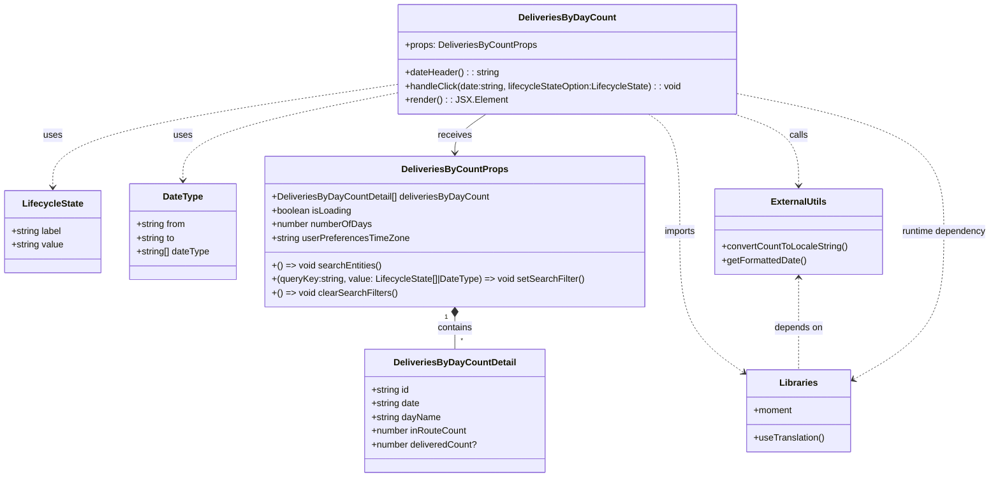

# Diagram: web/portal/src/pages/partview/dashboard/components/organisms/DeliveriesByDayCount.tsx

> Auto-generated by Obscura crawlers

## Mermaid

### SVG

<svg id="container" width="1737.2265625" xmlns="http://www.w3.org/2000/svg" class="classDiagram" height="836" viewBox="0 0 1737.2265625 836" role="graphics-document document" aria-roledescription="class"><g><defs><marker id="container_class-aggregationStart" class="marker aggregation class" refX="18" refY="7" markerWidth="190" markerHeight="240" orient="auto"><path d="M 18,7 L9,13 L1,7 L9,1 Z"></path></marker></defs><defs><marker id="container_class-aggregationEnd" class="marker aggregation class" refX="1" refY="7" markerWidth="20" markerHeight="28" orient="auto"><path d="M 18,7 L9,13 L1,7 L9,1 Z"></path></marker></defs><defs><marker id="container_class-extensionStart" class="marker extension class" refX="18" refY="7" markerWidth="190" markerHeight="240" orient="auto"><path d="M 1,7 L18,13 V 1 Z"></path></marker></defs><defs><marker id="container_class-extensionEnd" class="marker extension class" refX="1" refY="7" markerWidth="20" markerHeight="28" orient="auto"><path d="M 1,1 V 13 L18,7 Z"></path></marker></defs><defs><marker id="container_class-compositionStart" class="marker composition class" refX="18" refY="7" markerWidth="190" markerHeight="240" orient="auto"><path d="M 18,7 L9,13 L1,7 L9,1 Z"></path></marker></defs><defs><marker id="container_class-compositionEnd" class="marker composition class" refX="1" refY="7" markerWidth="20" markerHeight="28" orient="auto"><path d="M 18,7 L9,13 L1,7 L9,1 Z"></path></marker></defs><defs><marker id="container_class-dependencyStart" class="marker dependency class" refX="6" refY="7" markerWidth="190" markerHeight="240" orient="auto"><path d="M 5,7 L9,13 L1,7 L9,1 Z"></path></marker></defs><defs><marker id="container_class-dependencyEnd" class="marker dependency class" refX="13" refY="7" markerWidth="20" markerHeight="28" orient="auto"><path d="M 18,7 L9,13 L14,7 L9,1 Z"></path></marker></defs><defs><marker id="container_class-lollipopStart" class="marker lollipop class" refX="13" refY="7" markerWidth="190" markerHeight="240" orient="auto"><circle stroke="black" fill="transparent" cx="7" cy="7" r="6"></circle></marker></defs><defs><marker id="container_class-lollipopEnd" class="marker lollipop class" refX="1" refY="7" markerWidth="190" markerHeight="240" orient="auto"><circle stroke="black" fill="transparent" cx="7" cy="7" r="6"></circle></marker></defs><g class="root"><g class="clusters"></g><g class="edgePaths"><path d="M794.746,555.25L794.746,558.542C794.746,561.833,794.746,568.417,794.746,577.875C794.746,587.333,794.746,599.667,794.746,605.833L794.746,612" id="id_DeliveriesByCountProps_DeliveriesByDayCountDetail_1" class="edge-thickness-normal edge-pattern-solid relation" style=";;;" data-edge="true" data-et="edge" data-id="id_DeliveriesByCountProps_DeliveriesByDayCountDetail_1" data-points="W3sieCI6Nzk0Ljc0NjA5Mzc1LCJ5Ijo1Mzh9LHsieCI6Nzk0Ljc0NjA5Mzc1LCJ5Ijo1NzV9LHsieCI6Nzk0Ljc0NjA5Mzc1LCJ5Ijo2MTJ9XQ==" marker-start="url(#container_class-compositionStart)"></path><path d="M849.447,200L840.33,206.167C831.213,212.333,812.98,224.667,803.863,236C794.746,247.333,794.746,257.667,794.746,262.833L794.746,268" id="id_DeliveriesByDayCount_DeliveriesByCountProps_2" class="edge-thickness-normal edge-pattern-solid relation" style=";;;" data-edge="true" data-et="edge" data-id="id_DeliveriesByDayCount_DeliveriesByCountProps_2" data-points="W3sieCI6ODQ5LjQ0NjgyNTA3MDQ4ODgsInkiOjIwMH0seyJ4Ijo3OTQuNzQ2MDkzNzUsInkiOjIzN30seyJ4Ijo3OTQuNzQ2MDkzNzUsInkiOjI3NH1d" marker-end="url(#container_class-dependencyEnd)"></path><path d="M693.678,148.026L593.407,162.855C493.137,177.684,292.596,207.342,192.325,237.338C92.055,267.333,92.055,297.667,92.055,312.833L92.055,328" id="id_DeliveriesByDayCount_LifecycleState_3" class="edge-thickness-normal edge-pattern-dashed relation" style=";;;" data-edge="true" data-et="edge" data-id="id_DeliveriesByDayCount_LifecycleState_3" data-points="W3sieCI6NjkzLjY3NzczNDM3NSwieSI6MTQ4LjAyNjA5NjE1MzU1Mzh9LHsieCI6OTIuMDU0Njg3NSwieSI6MjM3fSx7IngiOjkyLjA1NDY4NzUsInkiOjMzNH1d" marker-end="url(#container_class-dependencyEnd)"></path><path d="M693.678,163.011L631.469,175.343C569.26,187.674,444.843,212.337,382.634,237.835C320.426,263.333,320.426,289.667,320.426,302.833L320.426,316" id="id_DeliveriesByDayCount_DateType_4" class="edge-thickness-normal edge-pattern-dashed relation" style=";;;" data-edge="true" data-et="edge" data-id="id_DeliveriesByDayCount_DateType_4" data-points="W3sieCI6NjkzLjY3NzczNDM3NSwieSI6MTYzLjAxMTMwOTIyMDU4MDc2fSx7IngiOjMyMC40MjU3ODEyNSwieSI6MjM3fSx7IngiOjMyMC40MjU3ODEyNSwieSI6MzIyfV0=" marker-end="url(#container_class-dependencyEnd)"></path><path d="M1284.362,200L1303.183,206.167C1322.003,212.333,1359.644,224.667,1378.465,245.5C1397.285,266.333,1397.285,295.667,1397.285,310.333L1397.285,325" id="id_DeliveriesByDayCount_ExternalUtils_5" class="edge-thickness-normal edge-pattern-dashed relation" style=";;;" data-edge="true" data-et="edge" data-id="id_DeliveriesByDayCount_ExternalUtils_5" data-points="W3sieCI6MTI4NC4zNjIyMzg2MDQzMjMyLCJ5IjoyMDB9LHsieCI6MTM5Ny4yODUxNTYyNSwieSI6MjM3fSx7IngiOjEzOTcuMjg1MTU2MjUsInkiOjMzMX1d" marker-end="url(#container_class-dependencyEnd)"></path><path d="M1133.299,200L1142.416,206.167C1151.533,212.333,1169.766,224.667,1178.883,259C1188,293.333,1188,349.667,1188,406C1188,462.333,1188,518.667,1206.948,559.961C1225.895,601.255,1263.79,627.51,1282.738,640.638L1301.685,653.765" id="id_DeliveriesByDayCount_Libraries_6" class="edge-thickness-normal edge-pattern-dashed relation" style=";;;" data-edge="true" data-et="edge" data-id="id_DeliveriesByDayCount_Libraries_6" data-points="W3sieCI6MTEzMy4yOTkyNjg2Nzk1MTEyLCJ5IjoyMDB9LHsieCI6MTE4OCwieSI6MjM3fSx7IngiOjExODgsInkiOjQwNn0seyJ4IjoxMTg4LCJ5Ijo1NzV9LHsieCI6MTMwNi42MTcxODc1LCJ5Ijo2NTcuMTgyMDkzMDYyMzIxNX1d" marker-end="url(#container_class-dependencyEnd)"></path><path d="M1397.285,487L1397.285,501.667C1397.285,516.333,1397.285,545.667,1397.285,572.5C1397.285,599.333,1397.285,623.667,1397.285,635.833L1397.285,648" id="id_ExternalUtils_Libraries_7" class="edge-thickness-normal edge-pattern-dashed relation" style=";;;" data-edge="true" data-et="edge" data-id="id_ExternalUtils_Libraries_7" data-points="W3sieCI6MTM5Ny4yODUxNTYyNSwieSI6NDgxfSx7IngiOjEzOTcuMjg1MTU2MjUsInkiOjU3NX0seyJ4IjoxMzk3LjI4NTE1NjI1LCJ5Ijo2NDh9XQ==" marker-start="url(#container_class-dependencyStart)"></path><path d="M1493.176,665.79L1519.942,650.658C1546.709,635.527,1600.241,605.263,1627.007,561.965C1653.773,518.667,1653.773,462.333,1653.773,406C1653.773,349.667,1653.773,293.333,1592.989,252.962C1532.205,212.591,1410.637,188.182,1349.853,175.977L1289.068,163.773" id="id_Libraries_DeliveriesByDayCount_8" class="edge-thickness-normal edge-pattern-dashed relation" style=";;;" data-edge="true" data-et="edge" data-id="id_Libraries_DeliveriesByDayCount_8" data-points="W3sieCI6MTQ4Ny45NTMxMjUsInkiOjY2OC43NDI4NjEwNTkwNzYyfSx7IngiOjE2NTMuNzczNDM3NSwieSI6NTc1fSx7IngiOjE2NTMuNzczNDM3NSwieSI6NDA2fSx7IngiOjE2NTMuNzczNDM3NSwieSI6MjM3fSx7IngiOjEyODkuMDY4MzU5Mzc1LCJ5IjoxNjMuNzcyNzI1MjYyMzQ3ODJ9XQ==" marker-start="url(#container_class-dependencyStart)"></path></g><g class="edgeLabels"><g class="edgeLabel" transform="translate(794.74609375, 575)"><g class="label" data-id="id_DeliveriesByCountProps_DeliveriesByDayCountDetail_1" transform="translate(-30.890625, -12)"><foreignObject width="61.78125" height="24">

contains

</foreignObject></g></g><g class="edgeLabel" transform="translate(794.74609375, 237)"><g class="label" data-id="id_DeliveriesByDayCount_DeliveriesByCountProps_2" transform="translate(-29.4921875, -12)"><foreignObject width="58.984375" height="24">

receives

</foreignObject></g></g><g class="edgeLabel" transform="translate(92.0546875, 237)"><g class="label" data-id="id_DeliveriesByDayCount_LifecycleState_3" transform="translate(-16.4921875, -12)"><foreignObject width="32.984375" height="24">

uses

</foreignObject></g></g><g class="edgeLabel" transform="translate(320.42578125, 237)"><g class="label" data-id="id_DeliveriesByDayCount_DateType_4" transform="translate(-16.4921875, -12)"><foreignObject width="32.984375" height="24">

uses

</foreignObject></g></g><g class="edgeLabel" transform="translate(1397.28515625, 237)"><g class="label" data-id="id_DeliveriesByDayCount_ExternalUtils_5" transform="translate(-16.4453125, -12)"><foreignObject width="32.890625" height="24">

calls

</foreignObject></g></g><g class="edgeLabel" transform="translate(1188, 406)"><g class="label" data-id="id_DeliveriesByDayCount_Libraries_6" transform="translate(-28.25, -12)"><foreignObject width="56.5" height="24">

imports

</foreignObject></g></g><g class="edgeLabel" transform="translate(1397.28515625, 575)"><g class="label" data-id="id_ExternalUtils_Libraries_7" transform="translate(-42.9453125, -12)"><foreignObject width="85.890625" height="24">

depends on

</foreignObject></g></g><g class="edgeLabel" transform="translate(1653.7734375, 406)"><g class="label" data-id="id_Libraries_DeliveriesByDayCount_8" transform="translate(-75.453125, -12)"><foreignObject width="150.90625" height="24">

runtime dependency

</foreignObject></g></g><g class="edgeTerminals" transform="translate(779.7460918750002, 555.4999983928572)"><g class="inner" transform="translate(0, 0)"><foreignObject style="width: 9px; height: 12px;">
1
</foreignObject></g></g><g class="edgeTerminals" transform="translate(804.7460918749999, 589.4999983928572)"><g class="inner" transform="translate(0, 0)"></g><foreignObject style="width: 9px; height: 12px;">
*
</foreignObject></g></g><g class="nodes"><g class="node default" id="classId-DeliveriesByDayCountDetail-0" transform="translate(794.74609375, 720)"><g class="basic label-container"><path d="M-156.22265625 -108 L156.22265625 -108 L156.22265625 108 L-156.22265625 108" stroke="none" stroke-width="0" fill="#ECECFF" style=""></path><path d="M-156.22265625 -108 C-90.23235121380498 -108, -24.24204617760995 -108, 156.22265625 -108 M-156.22265625 -108 C-85.2427627896652 -108, -14.262869329330414 -108, 156.22265625 -108 M156.22265625 -108 C156.22265625 -62.80533327207511, 156.22265625 -17.61066654415022, 156.22265625 108 M156.22265625 -108 C156.22265625 -39.26281337717117, 156.22265625 29.47437324565766, 156.22265625 108 M156.22265625 108 C69.68915753701621 108, -16.84434117596757 108, -156.22265625 108 M156.22265625 108 C75.4042095692525 108, -5.414237111494998 108, -156.22265625 108 M-156.22265625 108 C-156.22265625 42.597214818279596, -156.22265625 -22.805570363440808, -156.22265625 -108 M-156.22265625 108 C-156.22265625 30.913612159310034, -156.22265625 -46.17277568137993, -156.22265625 -108" stroke="#9370DB" stroke-width="1.3" fill="none" stroke-dasharray="0 0" style=""></path></g><g class="annotation-group text" transform="translate(0, -84)"></g><g class="label-group text" transform="translate(-102.1015625, -84)"><g class="label" style="font-weight: bolder" transform="translate(0,-12)"><foreignObject width="204.203125" height="24">

DeliveriesByDayCountDetail

</foreignObject></g></g><g class="members-group text" transform="translate(-144.22265625, -36)"><g class="label" style="" transform="translate(0,-12)"><foreignObject width="67.9375" height="24">

+string id

</foreignObject></g><g class="label" style="" transform="translate(0,12)"><foreignObject width="86.390625" height="24">

+string date

</foreignObject></g><g class="label" style="" transform="translate(0,36)"><foreignObject width="121.828125" height="24">

+string dayName

</foreignObject></g><g class="label" style="" transform="translate(0,60)"><foreignObject width="167.71875" height="24">

+number inRouteCount

</foreignObject></g><g class="label" style="" transform="translate(0,84)"><foreignObject width="186.34375" height="24">

+number deliveredCount?

</foreignObject></g></g><g class="methods-group text" transform="translate(-144.22265625, 108)"></g><g class="divider" style=""><path d="M-156.22265625 -60 C-84.5683154148331 -60, -12.913974579666188 -60, 156.22265625 -60 M-156.22265625 -60 C-67.58652949550722 -60, 21.049597258985557 -60, 156.22265625 -60" stroke="#9370DB" stroke-width="1.3" fill="none" stroke-dasharray="0 0" style=""></path></g><g class="divider" style=""><path d="M-156.22265625 84 C-50.85577907917282 84, 54.51109809165436 84, 156.22265625 84 M-156.22265625 84 C-41.208345835076784 84, 73.80596457984643 84, 156.22265625 84" stroke="#9370DB" stroke-width="1.3" fill="none" stroke-dasharray="0 0" style=""></path></g></g><g class="node default" id="classId-LifecycleState-1" transform="translate(92.0546875, 406)"><g class="basic label-container"><path d="M-84.0546875 -72 L84.0546875 -72 L84.0546875 72 L-84.0546875 72" stroke="none" stroke-width="0" fill="#ECECFF" style=""></path><path d="M-84.0546875 -72 C-25.56948223162412 -72, 32.91572303675176 -72, 84.0546875 -72 M-84.0546875 -72 C-21.89953345167801 -72, 40.25562059664398 -72, 84.0546875 -72 M84.0546875 -72 C84.0546875 -25.607034018317783, 84.0546875 20.785931963364433, 84.0546875 72 M84.0546875 -72 C84.0546875 -25.306299017698606, 84.0546875 21.387401964602788, 84.0546875 72 M84.0546875 72 C39.91182407256465 72, -4.231039354870703 72, -84.0546875 72 M84.0546875 72 C32.165604063986514 72, -19.723479372026972 72, -84.0546875 72 M-84.0546875 72 C-84.0546875 23.650643014789274, -84.0546875 -24.69871397042145, -84.0546875 -72 M-84.0546875 72 C-84.0546875 28.66389404218215, -84.0546875 -14.6722119156357, -84.0546875 -72" stroke="#9370DB" stroke-width="1.3" fill="none" stroke-dasharray="0 0" style=""></path></g><g class="annotation-group text" transform="translate(0, -48)"></g><g class="label-group text" transform="translate(-51.359375, -48)"><g class="label" style="font-weight: bolder" transform="translate(0,-12)"><foreignObject width="102.71875" height="24">

LifecycleState

</foreignObject></g></g><g class="members-group text" transform="translate(-72.0546875, 0)"><g class="label" style="" transform="translate(0,-12)"><foreignObject width="90.09375" height="24">

+string label

</foreignObject></g><g class="label" style="" transform="translate(0,12)"><foreignObject width="92.75" height="24">

+string value

</foreignObject></g></g><g class="methods-group text" transform="translate(-72.0546875, 72)"></g><g class="divider" style=""><path d="M-84.0546875 -24 C-43.509571612621095 -24, -2.964455725242189 -24, 84.0546875 -24 M-84.0546875 -24 C-22.365044620724873 -24, 39.32459825855025 -24, 84.0546875 -24" stroke="#9370DB" stroke-width="1.3" fill="none" stroke-dasharray="0 0" style=""></path></g><g class="divider" style=""><path d="M-84.0546875 48 C-46.98999492938852 48, -9.925302358777046 48, 84.0546875 48 M-84.0546875 48 C-35.93926417350254 48, 12.176159152994913 48, 84.0546875 48" stroke="#9370DB" stroke-width="1.3" fill="none" stroke-dasharray="0 0" style=""></path></g></g><g class="node default" id="classId-DateType-2" transform="translate(320.42578125, 406)"><g class="basic label-container"><path d="M-94.31640625 -84 L94.31640625 -84 L94.31640625 84 L-94.31640625 84" stroke="none" stroke-width="0" fill="#ECECFF" style=""></path><path d="M-94.31640625 -84 C-36.502547359072565 -84, 21.31131153185487 -84, 94.31640625 -84 M-94.31640625 -84 C-42.04998438561961 -84, 10.216437478760781 -84, 94.31640625 -84 M94.31640625 -84 C94.31640625 -47.07648703057483, 94.31640625 -10.152974061149663, 94.31640625 84 M94.31640625 -84 C94.31640625 -17.114234408687835, 94.31640625 49.77153118262433, 94.31640625 84 M94.31640625 84 C31.199856234089452 84, -31.916693781821095 84, -94.31640625 84 M94.31640625 84 C41.48365353173916 84, -11.349099186521684 84, -94.31640625 84 M-94.31640625 84 C-94.31640625 17.989735238997937, -94.31640625 -48.020529522004125, -94.31640625 -84 M-94.31640625 84 C-94.31640625 49.23393065658925, -94.31640625 14.467861313178503, -94.31640625 -84" stroke="#9370DB" stroke-width="1.3" fill="none" stroke-dasharray="0 0" style=""></path></g><g class="annotation-group text" transform="translate(0, -60)"></g><g class="label-group text" transform="translate(-34.2109375, -60)"><g class="label" style="font-weight: bolder" transform="translate(0,-12)"><foreignObject width="68.421875" height="24">

DateType

</foreignObject></g></g><g class="members-group text" transform="translate(-82.31640625, -12)"><g class="label" style="" transform="translate(0,-12)"><foreignObject width="87.96875" height="24">

+string from

</foreignObject></g><g class="label" style="" transform="translate(0,12)"><foreignObject width="68.75" height="24">

+string to

</foreignObject></g><g class="label" style="" transform="translate(0,36)"><foreignObject width="130.421875" height="24">

+string[] dateType

</foreignObject></g></g><g class="methods-group text" transform="translate(-82.31640625, 84)"></g><g class="divider" style=""><path d="M-94.31640625 -36 C-19.688415560700065 -36, 54.93957512859987 -36, 94.31640625 -36 M-94.31640625 -36 C-44.91000300820468 -36, 4.496400233590634 -36, 94.31640625 -36" stroke="#9370DB" stroke-width="1.3" fill="none" stroke-dasharray="0 0" style=""></path></g><g class="divider" style=""><path d="M-94.31640625 60 C-21.47559000593708 60, 51.36522623812584 60, 94.31640625 60 M-94.31640625 60 C-50.5840896140086 60, -6.851772978017195 60, 94.31640625 60" stroke="#9370DB" stroke-width="1.3" fill="none" stroke-dasharray="0 0" style=""></path></g></g><g class="node default" id="classId-DeliveriesByCountProps-3" transform="translate(794.74609375, 406)"><g class="basic label-container"><path d="M-330.00390625 -132 L330.00390625 -132 L330.00390625 132 L-330.00390625 132" stroke="none" stroke-width="0" fill="#ECECFF" style=""></path><path d="M-330.00390625 -132 C-92.25066746302468 -132, 145.50257132395063 -132, 330.00390625 -132 M-330.00390625 -132 C-107.43175719596007 -132, 115.14039185807985 -132, 330.00390625 -132 M330.00390625 -132 C330.00390625 -66.07205960773518, 330.00390625 -0.14411921547036854, 330.00390625 132 M330.00390625 -132 C330.00390625 -52.187818583968394, 330.00390625 27.624362832063213, 330.00390625 132 M330.00390625 132 C132.15564263336745 132, -65.6926209832651 132, -330.00390625 132 M330.00390625 132 C161.86600478161932 132, -6.271896686761352 132, -330.00390625 132 M-330.00390625 132 C-330.00390625 27.451610553956968, -330.00390625 -77.09677889208606, -330.00390625 -132 M-330.00390625 132 C-330.00390625 43.572032366087726, -330.00390625 -44.85593526782455, -330.00390625 -132" stroke="#9370DB" stroke-width="1.3" fill="none" stroke-dasharray="0 0" style=""></path></g><g class="annotation-group text" transform="translate(0, -108)"></g><g class="label-group text" transform="translate(-87.8515625, -108)"><g class="label" style="font-weight: bolder" transform="translate(0,-12)"><foreignObject width="175.703125" height="24">

DeliveriesByCountProps

</foreignObject></g></g><g class="members-group text" transform="translate(-318.00390625, -60)"><g class="label" style="" transform="translate(0,-12)"><foreignObject width="380.71875" height="24">

+DeliveriesByDayCountDetail[] deliveriesByDayCount

</foreignObject></g><g class="label" style="" transform="translate(0,12)"><foreignObject width="140.890625" height="24">

+boolean isLoading

</foreignObject></g><g class="label" style="" transform="translate(0,36)"><foreignObject width="176.109375" height="24">

+number numberOfDays

</foreignObject></g><g class="label" style="" transform="translate(0,60)"><foreignObject width="240.828125" height="24">

+string userPreferencesTimeZone

</foreignObject></g></g><g class="methods-group text" transform="translate(-318.00390625, 60)"><g class="label" style="" transform="translate(0,-12)"><foreignObject width="190.6875" height="24">

+() =&gt; void searchEntities()

</foreignObject></g><g class="label" style="" transform="translate(0,12)"><foreignObject width="548.15625" height="24">

+(queryKey:string, value: LifecycleState[]|DateType) =&gt; void setSearchFilter()

</foreignObject></g><g class="label" style="" transform="translate(0,36)"><foreignObject width="217.234375" height="24">

+() =&gt; void clearSearchFilters()

</foreignObject></g></g><g class="divider" style=""><path d="M-330.00390625 -84 C-142.37864436608172 -84, 45.24661751783657 -84, 330.00390625 -84 M-330.00390625 -84 C-185.57601242122107 -84, -41.14811859244213 -84, 330.00390625 -84" stroke="#9370DB" stroke-width="1.3" fill="none" stroke-dasharray="0 0" style=""></path></g><g class="divider" style=""><path d="M-330.00390625 36 C-128.5427016028418 36, 72.91850304431642 36, 330.00390625 36 M-330.00390625 36 C-161.04865810953513 36, 7.906590030929749 36, 330.00390625 36" stroke="#9370DB" stroke-width="1.3" fill="none" stroke-dasharray="0 0" style=""></path></g></g><g class="node default" id="classId-DeliveriesByDayCount-4" transform="translate(991.373046875, 104)"><g class="basic label-container"><path d="M-297.6953125 -96 L297.6953125 -96 L297.6953125 96 L-297.6953125 96" stroke="none" stroke-width="0" fill="#ECECFF" style=""></path><path d="M-297.6953125 -96 C-132.68628028397512 -96, 32.322751932049755 -96, 297.6953125 -96 M-297.6953125 -96 C-88.59981826505609 -96, 120.49567596988783 -96, 297.6953125 -96 M297.6953125 -96 C297.6953125 -29.342980498562127, 297.6953125 37.314039002875745, 297.6953125 96 M297.6953125 -96 C297.6953125 -30.84801161467861, 297.6953125 34.30397677064278, 297.6953125 96 M297.6953125 96 C78.99337495197432 96, -139.70856259605137 96, -297.6953125 96 M297.6953125 96 C65.99155033393112 96, -165.71221183213777 96, -297.6953125 96 M-297.6953125 96 C-297.6953125 35.09473285146261, -297.6953125 -25.81053429707478, -297.6953125 -96 M-297.6953125 96 C-297.6953125 51.20839166929808, -297.6953125 6.4167833385961615, -297.6953125 -96" stroke="#9370DB" stroke-width="1.3" fill="none" stroke-dasharray="0 0" style=""></path></g><g class="annotation-group text" transform="translate(0, -72)"></g><g class="label-group text" transform="translate(-80.46875, -72)"><g class="label" style="font-weight: bolder" transform="translate(0,-12)"><foreignObject width="160.9375" height="24">

DeliveriesByDayCount

</foreignObject></g></g><g class="members-group text" transform="translate(-285.6953125, -24)"><g class="label" style="" transform="translate(0,-12)"><foreignObject width="230.265625" height="24">

+props: DeliveriesByCountProps

</foreignObject></g></g><g class="methods-group text" transform="translate(-285.6953125, 24)"><g class="label" style="" transform="translate(0,-12)"><foreignObject width="165.53125" height="24">

+dateHeader() : : string

</foreignObject></g><g class="label" style="" transform="translate(0,12)"><foreignObject width="490.921875" height="24">

+handleClick(date:string, lifecycleStateOption:LifecycleState) : : void

</foreignObject></g><g class="label" style="" transform="translate(0,36)"><foreignObject width="172.34375" height="24">

+render() : : JSX.Element

</foreignObject></g></g><g class="divider" style=""><path d="M-297.6953125 -48 C-130.88094589241416 -48, 35.93342071517168 -48, 297.6953125 -48 M-297.6953125 -48 C-82.5071584052329 -48, 132.6809956895342 -48, 297.6953125 -48" stroke="#9370DB" stroke-width="1.3" fill="none" stroke-dasharray="0 0" style=""></path></g><g class="divider" style=""><path d="M-297.6953125 0 C-172.31485669649473 0, -46.93440089298946 0, 297.6953125 0 M-297.6953125 0 C-65.16049002979358 0, 167.37433244041284 0, 297.6953125 0" stroke="#9370DB" stroke-width="1.3" fill="none" stroke-dasharray="0 0" style=""></path></g></g><g class="node default" id="classId-ExternalUtils-5" transform="translate(1397.28515625, 406)"><g class="basic label-container"><path d="M-146.03515625 -75 L146.03515625 -75 L146.03515625 75 L-146.03515625 75" stroke="none" stroke-width="0" fill="#ECECFF" style=""></path><path d="M-146.03515625 -75 C-44.573205400890686 -75, 56.88874544821863 -75, 146.03515625 -75 M-146.03515625 -75 C-45.239259488325885 -75, 55.55663727334823 -75, 146.03515625 -75 M146.03515625 -75 C146.03515625 -37.057448324639715, 146.03515625 0.8851033507205699, 146.03515625 75 M146.03515625 -75 C146.03515625 -43.62381354938491, 146.03515625 -12.247627098769826, 146.03515625 75 M146.03515625 75 C46.3595605724919 75, -53.3160351050162 75, -146.03515625 75 M146.03515625 75 C78.38572665626265 75, 10.736297062525296 75, -146.03515625 75 M-146.03515625 75 C-146.03515625 39.09568540767654, -146.03515625 3.191370815353082, -146.03515625 -75 M-146.03515625 75 C-146.03515625 20.396663157349593, -146.03515625 -34.206673685300814, -146.03515625 -75" stroke="#9370DB" stroke-width="1.3" fill="none" stroke-dasharray="0 0" style=""></path></g><g class="annotation-group text" transform="translate(0, -51)"></g><g class="label-group text" transform="translate(-46.9609375, -51)"><g class="label" style="font-weight: bolder" transform="translate(0,-12)"><foreignObject width="93.921875" height="24">

ExternalUtils

</foreignObject></g></g><g class="members-group text" transform="translate(-134.03515625, -3)"></g><g class="methods-group text" transform="translate(-134.03515625, 27)"><g class="label" style="" transform="translate(0,-12)"><foreignObject width="221.109375" height="24">

+convertCountToLocaleString()

</foreignObject></g><g class="label" style="" transform="translate(0,12)"><foreignObject width="148.859375" height="24">

+getFormattedDate()

</foreignObject></g></g><g class="divider" style=""><path d="M-146.03515625 -27 C-78.48392866193674 -27, -10.932701073873488 -27, 146.03515625 -27 M-146.03515625 -27 C-67.02991031406695 -27, 11.975335621866094 -27, 146.03515625 -27" stroke="#9370DB" stroke-width="1.3" fill="none" stroke-dasharray="0 0" style=""></path></g><g class="divider" style=""><path d="M-146.03515625 -3 C-81.81737480801937 -3, -17.599593366038732 -3, 146.03515625 -3 M-146.03515625 -3 C-77.90815998423345 -3, -9.7811637184669 -3, 146.03515625 -3" stroke="#9370DB" stroke-width="1.3" fill="none" stroke-dasharray="0 0" style=""></path></g></g><g class="node default" id="classId-Libraries-6" transform="translate(1397.28515625, 720)"><g class="basic label-container"><path d="M-90.66796875 -72 L90.66796875 -72 L90.66796875 72 L-90.66796875 72" stroke="none" stroke-width="0" fill="#ECECFF" style=""></path><path d="M-90.66796875 -72 C-45.57477326654065 -72, -0.48157778308130617 -72, 90.66796875 -72 M-90.66796875 -72 C-51.07806006502504 -72, -11.488151380050084 -72, 90.66796875 -72 M90.66796875 -72 C90.66796875 -41.94132993201687, 90.66796875 -11.882659864033734, 90.66796875 72 M90.66796875 -72 C90.66796875 -17.425920925305718, 90.66796875 37.148158149388564, 90.66796875 72 M90.66796875 72 C30.18650727636956 72, -30.29495419726088 72, -90.66796875 72 M90.66796875 72 C43.1367932985445 72, -4.394382152911007 72, -90.66796875 72 M-90.66796875 72 C-90.66796875 29.010871374980212, -90.66796875 -13.978257250039576, -90.66796875 -72 M-90.66796875 72 C-90.66796875 36.57551511414335, -90.66796875 1.1510302282867002, -90.66796875 -72" stroke="#9370DB" stroke-width="1.3" fill="none" stroke-dasharray="0 0" style=""></path></g><g class="annotation-group text" transform="translate(0, -48)"></g><g class="label-group text" transform="translate(-32.1953125, -48)"><g class="label" style="font-weight: bolder" transform="translate(0,-12)"><foreignObject width="64.390625" height="24">

Libraries

</foreignObject></g></g><g class="members-group text" transform="translate(-78.66796875, 0)"><g class="label" style="" transform="translate(0,-12)"><foreignObject width="68.625" height="24">

+moment

</foreignObject></g></g><g class="methods-group text" transform="translate(-78.66796875, 48)"><g class="label" style="" transform="translate(0,-12)"><foreignObject width="125.140625" height="24">

+useTranslation()

</foreignObject></g></g><g class="divider" style=""><path d="M-90.66796875 -24 C-42.22567919328003 -24, 6.216610363439941 -24, 90.66796875 -24 M-90.66796875 -24 C-28.113159037557992 -24, 34.441650674884016 -24, 90.66796875 -24" stroke="#9370DB" stroke-width="1.3" fill="none" stroke-dasharray="0 0" style=""></path></g><g class="divider" style=""><path d="M-90.66796875 24 C-32.499669229076204 24, 25.66863029184759 24, 90.66796875 24 M-90.66796875 24 C-42.171293292641046 24, 6.325382164717908 24, 90.66796875 24" stroke="#9370DB" stroke-width="1.3" fill="none" stroke-dasharray="0 0" style=""></path></g></g></g></g></g></svg>
