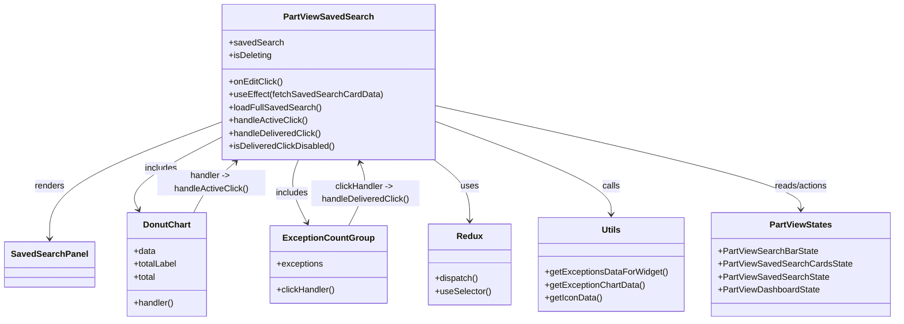

# Diagram: web/portal/src/pages/partview/dashboard/components/organisms/PartView.SavedSearch.organism.js


> Auto-generated by Obscura crawlers

## Diagram 1



### SVG

<svg id="container" width="1631.775390625" xmlns="http://www.w3.org/2000/svg" class="classDiagram" height="594" viewBox="0 0 1631.775390625 594" role="graphics-document document" aria-roledescription="class"><style>#container{font-family:"trebuchet ms",verdana,arial,sans-serif;font-size:16px;fill:#333;}@keyframes edge-animation-frame{from{stroke-dashoffset:0;}}@keyframes dash{to{stroke-dashoffset:0;}}#container .edge-animation-slow{stroke-dasharray:9,5!important;stroke-dashoffset:900;animation:dash 50s linear infinite;stroke-linecap:round;}#container .edge-animation-fast{stroke-dasharray:9,5!important;stroke-dashoffset:900;animation:dash 20s linear infinite;stroke-linecap:round;}#container .error-icon{fill:#552222;}#container .error-text{fill:#552222;stroke:#552222;}#container .edge-thickness-normal{stroke-width:1px;}#container .edge-thickness-thick{stroke-width:3.5px;}#container .edge-pattern-solid{stroke-dasharray:0;}#container .edge-thickness-invisible{stroke-width:0;fill:none;}#container .edge-pattern-dashed{stroke-dasharray:3;}#container .edge-pattern-dotted{stroke-dasharray:2;}#container .marker{fill:#333333;stroke:#333333;}#container .marker.cross{stroke:#333333;}#container svg{font-family:"trebuchet ms",verdana,arial,sans-serif;font-size:16px;}#container p{margin:0;}#container g.classGroup text{fill:#9370DB;stroke:none;font-family:"trebuchet ms",verdana,arial,sans-serif;font-size:10px;}#container g.classGroup text .title{font-weight:bolder;}#container .nodeLabel,#container .edgeLabel{color:#131300;}#container .edgeLabel .label rect{fill:#ECECFF;}#container .label text{fill:#131300;}#container .labelBkg{background:#ECECFF;}#container .edgeLabel .label span{background:#ECECFF;}#container .classTitle{font-weight:bolder;}#container .node rect,#container .node circle,#container .node ellipse,#container .node polygon,#container .node path{fill:#ECECFF;stroke:#9370DB;stroke-width:1px;}#container .divider{stroke:#9370DB;stroke-width:1;}#container g.clickable{cursor:pointer;}#container g.classGroup rect{fill:#ECECFF;stroke:#9370DB;}#container g.classGroup line{stroke:#9370DB;stroke-width:1;}#container .classLabel .box{stroke:none;stroke-width:0;fill:#ECECFF;opacity:0.5;}#container .classLabel .label{fill:#9370DB;font-size:10px;}#container .relation{stroke:#333333;stroke-width:1;fill:none;}#container .dashed-line{stroke-dasharray:3;}#container .dotted-line{stroke-dasharray:1 2;}#container #compositionStart,#container .composition{fill:#333333!important;stroke:#333333!important;stroke-width:1;}#container #compositionEnd,#container .composition{fill:#333333!important;stroke:#333333!important;stroke-width:1;}#container #dependencyStart,#container .dependency{fill:#333333!important;stroke:#333333!important;stroke-width:1;}#container #dependencyStart,#container .dependency{fill:#333333!important;stroke:#333333!important;stroke-width:1;}#container #extensionStart,#container .extension{fill:transparent!important;stroke:#333333!important;stroke-width:1;}#container #extensionEnd,#container .extension{fill:transparent!important;stroke:#333333!important;stroke-width:1;}#container #aggregationStart,#container .aggregation{fill:transparent!important;stroke:#333333!important;stroke-width:1;}#container #aggregationEnd,#container .aggregation{fill:transparent!important;stroke:#333333!important;stroke-width:1;}#container #lollipopStart,#container .lollipop{fill:#ECECFF!important;stroke:#333333!important;stroke-width:1;}#container #lollipopEnd,#container .lollipop{fill:#ECECFF!important;stroke:#333333!important;stroke-width:1;}#container .edgeTerminals{font-size:11px;line-height:initial;}#container .classTitleText{text-anchor:middle;font-size:18px;fill:#333;}#container .label-icon{display:inline-block;height:1em;overflow:visible;vertical-align:-0.125em;}#container .node .label-icon path{fill:currentColor;stroke:revert;stroke-width:revert;}#container :root{--mermaid-font-family:"trebuchet ms",verdana,arial,sans-serif;}</style><g><defs><marker id="container_class-aggregationStart" class="marker aggregation class" refX="18" refY="7" markerWidth="190" markerHeight="240" orient="auto"><path d="M 18,7 L9,13 L1,7 L9,1 Z"></path></marker></defs><defs><marker id="container_class-aggregationEnd" class="marker aggregation class" refX="1" refY="7" markerWidth="20" markerHeight="28" orient="auto"><path d="M 18,7 L9,13 L1,7 L9,1 Z"></path></marker></defs><defs><marker id="container_class-extensionStart" class="marker extension class" refX="18" refY="7" markerWidth="190" markerHeight="240" orient="auto"><path d="M 1,7 L18,13 V 1 Z"></path></marker></defs><defs><marker id="container_class-extensionEnd" class="marker extension class" refX="1" refY="7" markerWidth="20" markerHeight="28" orient="auto"><path d="M 1,1 V 13 L18,7 Z"></path></marker></defs><defs><marker id="container_class-compositionStart" class="marker composition class" refX="18" refY="7" markerWidth="190" markerHeight="240" orient="auto"><path d="M 18,7 L9,13 L1,7 L9,1 Z"></path></marker></defs><defs><marker id="container_class-compositionEnd" class="marker composition class" refX="1" refY="7" markerWidth="20" markerHeight="28" orient="auto"><path d="M 18,7 L9,13 L1,7 L9,1 Z"></path></marker></defs><defs><marker id="container_class-dependencyStart" class="marker dependency class" refX="6" refY="7" markerWidth="190" markerHeight="240" orient="auto"><path d="M 5,7 L9,13 L1,7 L9,1 Z"></path></marker></defs><defs><marker id="container_class-dependencyEnd" class="marker dependency class" refX="13" refY="7" markerWidth="20" markerHeight="28" orient="auto"><path d="M 18,7 L9,13 L14,7 L9,1 Z"></path></marker></defs><defs><marker id="container_class-lollipopStart" class="marker lollipop class" refX="13" refY="7" markerWidth="190" markerHeight="240" orient="auto"><circle stroke="black" fill="transparent" cx="7" cy="7" r="6"></circle></marker></defs><defs><marker id="container_class-lollipopEnd" class="marker lollipop class" refX="1" refY="7" markerWidth="190" markerHeight="240" orient="auto"><circle stroke="black" fill="transparent" cx="7" cy="7" r="6"></circle></marker></defs><g class="root"><g class="clusters"></g><g class="edgePaths"><path d="M412.893,223.356L358.575,243.63C304.257,263.904,195.62,304.452,141.302,340.893C86.984,377.333,86.984,409.667,86.984,425.833L86.984,442" id="id_PartViewSavedSearch_SavedSearchPanel_1" class="edge-thickness-normal edge-pattern-solid relation" style=";;;" data-edge="true" data-et="edge" data-id="id_PartViewSavedSearch_SavedSearchPanel_1" data-points="W3sieCI6NDEyLjg5MjU3ODEyNSwieSI6MjIzLjM1NTc2OTg0ODE5NDd9LHsieCI6ODYuOTg0Mzc1LCJ5IjozNDV9LHsieCI6ODYuOTg0Mzc1LCJ5Ijo0NDh9XQ==" marker-end="url(#container_class-dependencyEnd)"></path><path d="M412.893,249.968L381.985,265.807C351.077,281.646,289.262,313.323,262.136,336.441C235.01,359.559,242.573,374.117,246.354,381.396L250.136,388.676" id="id_PartViewSavedSearch_DonutChart_2" class="edge-thickness-normal edge-pattern-solid relation" style=";;;" data-edge="true" data-et="edge" data-id="id_PartViewSavedSearch_DonutChart_2" data-points="W3sieCI6NDEyLjg5MjU3ODEyNSwieSI6MjQ5Ljk2ODI5MzMxNTM1NTQ4fSx7IngiOjIyNy40NDcyNjU2MjUsInkiOjM0NX0seyJ4IjoyNTIuOTAxNjU2Nzg4NzkzMSwieSI6Mzk0fV0=" marker-end="url(#container_class-dependencyEnd)"></path><path d="M547.868,296L544.681,304.167C541.493,312.333,535.119,328.667,537.791,348.113C540.463,367.559,552.181,390.117,558.041,401.396L563.9,412.676" id="id_PartViewSavedSearch_ExceptionCountGroup_3" class="edge-thickness-normal edge-pattern-solid relation" style=";;;" data-edge="true" data-et="edge" data-id="id_PartViewSavedSearch_ExceptionCountGroup_3" data-points="W3sieCI6NTQ3Ljg2NzkwNjAwNzEyNDQsInkiOjI5Nn0seyJ4Ijo1MjguNzQ0MTQwNjI1LCJ5IjozNDV9LHsieCI6NTY2LjY2NTk4ODY4NTM0NDgsInkiOjQxOH1d" marker-end="url(#container_class-dependencyEnd)"></path><path d="M795.244,294.369L806.576,302.807C817.907,311.246,840.57,328.123,851.901,347.228C863.232,366.333,863.232,387.667,863.232,398.333L863.232,409" id="id_PartViewSavedSearch_Redux_4" class="edge-thickness-normal edge-pattern-solid relation" style=";;;" data-edge="true" data-et="edge" data-id="id_PartViewSavedSearch_Redux_4" data-points="W3sieCI6Nzk1LjI0NDE0MDYyNSwieSI6Mjk0LjM2ODk4OTg0MTEzNTl9LHsieCI6ODYzLjIzMjQyMTg3NSwieSI6MzQ1fSx7IngiOjg2My4yMzI0MjE4NzUsInkiOjQxNX1d" marker-end="url(#container_class-dependencyEnd)"></path><path d="M795.244,223.354L849.564,243.628C903.885,263.903,1012.525,304.451,1066.846,333.392C1121.166,362.333,1121.166,379.667,1121.166,388.333L1121.166,397" id="id_PartViewSavedSearch_Utils_5" class="edge-thickness-normal edge-pattern-solid relation" style=";;;" data-edge="true" data-et="edge" data-id="id_PartViewSavedSearch_Utils_5" data-points="W3sieCI6Nzk1LjI0NDE0MDYyNSwieSI6MjIzLjM1Mzg4MzIyNzQ0ODg4fSx7IngiOjExMjEuMTY2MDE1NjI1LCJ5IjozNDV9LHsieCI6MTEyMS4xNjYwMTU2MjUsInkiOjQwM31d" marker-end="url(#container_class-dependencyEnd)"></path><path d="M795.244,194.911L906.691,219.926C1018.137,244.94,1241.031,294.97,1352.477,327.152C1463.924,359.333,1463.924,373.667,1463.924,380.833L1463.924,388" id="id_PartViewSavedSearch_PartViewStates_6" class="edge-thickness-normal edge-pattern-solid relation" style=";;;" data-edge="true" data-et="edge" data-id="id_PartViewSavedSearch_PartViewStates_6" data-points="W3sieCI6Nzk1LjI0NDE0MDYyNSwieSI6MTk0LjkxMDYxMzYxMTQ4MDg3fSx7IngiOjE0NjMuOTIzODI4MTI1LCJ5IjozNDV9LHsieCI6MTQ2My45MjM4MjgxMjUsInkiOjM5NH1d" marker-end="url(#container_class-dependencyEnd)"></path><path d="M352.641,394L356.884,385.833C361.126,377.667,369.611,361.333,382.655,345.649C395.699,329.966,413.302,314.931,422.103,307.414L430.905,299.897" id="id_DonutChart_PartViewSavedSearch_7" class="edge-thickness-normal edge-pattern-solid relation" style=";;;" data-edge="true" data-et="edge" data-id="id_DonutChart_PartViewSavedSearch_7" data-points="W3sieCI6MzUyLjY0MTMxMTk2MTIwNjksInkiOjM5NH0seyJ4IjozNzguMDk1NzAzMTI1LCJ5IjozNDV9LHsieCI6NDM1LjQ2Njk5OTI3MTM3MzEsInkiOjI5Nn1d" marker-end="url(#container_class-dependencyEnd)"></path><path d="M641.471,418L647.791,405.833C654.111,393.667,666.752,369.333,670.249,349.932C673.745,330.53,668.098,316.06,665.274,308.824L662.45,301.589" id="id_ExceptionCountGroup_PartViewSavedSearch_8" class="edge-thickness-normal edge-pattern-solid relation" style=";;;" data-edge="true" data-et="edge" data-id="id_ExceptionCountGroup_PartViewSavedSearch_8" data-points="W3sieCI6NjQxLjQ3MDczMDA2NDY1NTIsInkiOjQxOH0seyJ4Ijo2NzkuMzkyNTc4MTI1LCJ5IjozNDV9LHsieCI6NjYwLjI2ODgxMjc0Mjg3NTYsInkiOjI5Nn1d" marker-end="url(#container_class-dependencyEnd)"></path></g><g class="edgeLabels"><g class="edgeLabel" transform="translate(86.984375, 345)"><g class="label" data-id="id_PartViewSavedSearch_SavedSearchPanel_1" transform="translate(-27.75, -12)"><foreignObject width="55.5" height="24"><div xmlns="http://www.w3.org/1999/xhtml" class="labelBkg" style="display: table-cell; white-space: nowrap; line-height: 1.5; max-width: 200px; text-align: center;"><span class="edgeLabel"><p>renders</p></span></div></foreignObject></g></g><g class="edgeLabel" transform="translate(295.59968, 310.0752)"><g class="label" data-id="id_PartViewSavedSearch_DonutChart_2" transform="translate(-30.6484375, -12)"><foreignObject width="61.296875" height="24"><div xmlns="http://www.w3.org/1999/xhtml" class="labelBkg" style="display: table-cell; white-space: nowrap; line-height: 1.5; max-width: 200px; text-align: center;"><span class="edgeLabel"><p>includes</p></span></div></foreignObject></g></g><g class="edgeLabel" transform="translate(535.58118, 358.16138)"><g class="label" data-id="id_PartViewSavedSearch_ExceptionCountGroup_3" transform="translate(-30.6484375, -12)"><foreignObject width="61.296875" height="24"><div xmlns="http://www.w3.org/1999/xhtml" class="labelBkg" style="display: table-cell; white-space: nowrap; line-height: 1.5; max-width: 200px; text-align: center;"><span class="edgeLabel"><p>includes</p></span></div></foreignObject></g></g><g class="edgeLabel" transform="translate(863.232421875, 345)"><g class="label" data-id="id_PartViewSavedSearch_Redux_4" transform="translate(-16.4921875, -12)"><foreignObject width="32.984375" height="24"><div xmlns="http://www.w3.org/1999/xhtml" class="labelBkg" style="display: table-cell; white-space: nowrap; line-height: 1.5; max-width: 200px; text-align: center;"><span class="edgeLabel"><p>uses</p></span></div></foreignObject></g></g><g class="edgeLabel" transform="translate(1121.166015625, 345)"><g class="label" data-id="id_PartViewSavedSearch_Utils_5" transform="translate(-16.4453125, -12)"><foreignObject width="32.890625" height="24"><div xmlns="http://www.w3.org/1999/xhtml" class="labelBkg" style="display: table-cell; white-space: nowrap; line-height: 1.5; max-width: 200px; text-align: center;"><span class="edgeLabel"><p>calls</p></span></div></foreignObject></g></g><g class="edgeLabel" transform="translate(1463.923828125, 345)"><g class="label" data-id="id_PartViewSavedSearch_PartViewStates_6" transform="translate(-50.1796875, -12)"><foreignObject width="100.359375" height="24"><div xmlns="http://www.w3.org/1999/xhtml" class="labelBkg" style="display: table-cell; white-space: nowrap; line-height: 1.5; max-width: 200px; text-align: center;"><span class="edgeLabel"><p>reads/actions</p></span></div></foreignObject></g></g><g class="edgeLabel" transform="translate(378.095703125, 345)"><g class="label" data-id="id_DonutChart_PartViewSavedSearch_7" transform="translate(-100, -24)"><foreignObject width="200" height="48"><div xmlns="http://www.w3.org/1999/xhtml" class="labelBkg" style="display: table; white-space: break-spaces; line-height: 1.5; max-width: 200px; text-align: center; width: 200px;"><span class="edgeLabel"><p>handler -&gt; handleActiveClick()</p></span></div></foreignObject></g></g><g class="edgeLabel" transform="translate(672.55554, 358.16138)"><g class="label" data-id="id_ExceptionCountGroup_PartViewSavedSearch_8" transform="translate(-100, -24)"><foreignObject width="200" height="48"><div xmlns="http://www.w3.org/1999/xhtml" class="labelBkg" style="display: table; white-space: break-spaces; line-height: 1.5; max-width: 200px; text-align: center; width: 200px;"><span class="edgeLabel"><p>clickHandler -&gt; handleDeliveredClick()</p></span></div></foreignObject></g></g></g><g class="nodes"><g class="node default" id="classId-PartViewSavedSearch-0" transform="translate(604.068359375, 152)"><g class="basic label-container"><path d="M-191.17578125 -144 L191.17578125 -144 L191.17578125 144 L-191.17578125 144" stroke="none" stroke-width="0" fill="#ECECFF" style=""></path><path d="M-191.17578125 -144 C-48.87295498557427 -144, 93.42987127885146 -144, 191.17578125 -144 M-191.17578125 -144 C-90.3660564723619 -144, 10.44366830527619 -144, 191.17578125 -144 M191.17578125 -144 C191.17578125 -73.79283259393534, 191.17578125 -3.5856651878706884, 191.17578125 144 M191.17578125 -144 C191.17578125 -69.33973192831205, 191.17578125 5.320536143375904, 191.17578125 144 M191.17578125 144 C74.52960040813171 144, -42.11658043373657 144, -191.17578125 144 M191.17578125 144 C101.03099717854553 144, 10.886213107091066 144, -191.17578125 144 M-191.17578125 144 C-191.17578125 58.004689601502534, -191.17578125 -27.990620796994932, -191.17578125 -144 M-191.17578125 144 C-191.17578125 34.63974955784646, -191.17578125 -74.72050088430709, -191.17578125 -144" stroke="#9370DB" stroke-width="1.3" fill="none" stroke-dasharray="0 0" style=""></path></g><g class="annotation-group text" transform="translate(0, -120)"></g><g class="label-group text" transform="translate(-79.1015625, -120)"><g class="label" style="font-weight: bolder" transform="translate(0,-12)"><foreignObject width="158.203125" height="24"><div xmlns="http://www.w3.org/1999/xhtml" style="display: table-cell; white-space: nowrap; line-height: 1.5; max-width: 205px; text-align: center;"><span class="nodeLabel markdown-node-label" style=""><p>PartViewSavedSearch</p></span></div></foreignObject></g></g><g class="members-group text" transform="translate(-179.17578125, -72)"><g class="label" style="" transform="translate(0,-12)"><foreignObject width="98.5625" height="24"><div xmlns="http://www.w3.org/1999/xhtml" style="display: table-cell; white-space: nowrap; line-height: 1.5; max-width: 156px; text-align: center;"><span class="nodeLabel markdown-node-label" style=""><p>+savedSearch</p></span></div></foreignObject></g><g class="label" style="" transform="translate(0,12)"><foreignObject width="80.3125" height="24"><div xmlns="http://www.w3.org/1999/xhtml" style="display: table-cell; white-space: nowrap; line-height: 1.5; max-width: 138px; text-align: center;"><span class="nodeLabel markdown-node-label" style=""><p>+isDeleting</p></span></div></foreignObject></g></g><g class="methods-group text" transform="translate(-179.17578125, 0)"><g class="label" style="" transform="translate(0,-12)"><foreignObject width="99.015625" height="24"><div xmlns="http://www.w3.org/1999/xhtml" style="display: table-cell; white-space: nowrap; line-height: 1.5; max-width: 156px; text-align: center;"><span class="nodeLabel markdown-node-label" style=""><p>+onEditClick()</p></span></div></foreignObject></g><g class="label" style="" transform="translate(0,12)"><foreignObject width="279.25" height="24"><div xmlns="http://www.w3.org/1999/xhtml" style="display: table-cell; white-space: nowrap; line-height: 1.5; max-width: 337px; text-align: center;"><span class="nodeLabel markdown-node-label" style=""><p>+useEffect(fetchSavedSearchCardData)</p></span></div></foreignObject></g><g class="label" style="" transform="translate(0,36)"><foreignObject width="168.359375" height="24"><div xmlns="http://www.w3.org/1999/xhtml" style="display: table-cell; white-space: nowrap; line-height: 1.5; max-width: 226px; text-align: center;"><span class="nodeLabel markdown-node-label" style=""><p>+loadFullSavedSearch()</p></span></div></foreignObject></g><g class="label" style="" transform="translate(0,60)"><foreignObject width="146.1875" height="24"><div xmlns="http://www.w3.org/1999/xhtml" style="display: table-cell; white-space: nowrap; line-height: 1.5; max-width: 204px; text-align: center;"><span class="nodeLabel markdown-node-label" style=""><p>+handleActiveClick()</p></span></div></foreignObject></g><g class="label" style="" transform="translate(0,84)"><foreignObject width="171.28125" height="24"><div xmlns="http://www.w3.org/1999/xhtml" style="display: table-cell; white-space: nowrap; line-height: 1.5; max-width: 229px; text-align: center;"><span class="nodeLabel markdown-node-label" style=""><p>+handleDeliveredClick()</p></span></div></foreignObject></g><g class="label" style="" transform="translate(0,108)"><foreignObject width="196.15625" height="24"><div xmlns="http://www.w3.org/1999/xhtml" style="display: table-cell; white-space: nowrap; line-height: 1.5; max-width: 254px; text-align: center;"><span class="nodeLabel markdown-node-label" style=""><p>+isDeliveredClickDisabled()</p></span></div></foreignObject></g></g><g class="divider" style=""><path d="M-191.17578125 -96 C-64.45481867070087 -96, 62.26614390859825 -96, 191.17578125 -96 M-191.17578125 -96 C-74.85513088884024 -96, 41.46551947231953 -96, 191.17578125 -96" stroke="#9370DB" stroke-width="1.3" fill="none" stroke-dasharray="0 0" style=""></path></g><g class="divider" style=""><path d="M-191.17578125 -24 C-55.54561540885683 -24, 80.08455043228633 -24, 191.17578125 -24 M-191.17578125 -24 C-59.60280164504397 -24, 71.97017795991206 -24, 191.17578125 -24" stroke="#9370DB" stroke-width="1.3" fill="none" stroke-dasharray="0 0" style=""></path></g></g><g class="node default" id="classId-SavedSearchPanel-1" transform="translate(86.984375, 490)"><g class="basic label-container"><path d="M-78.984375 -42 L78.984375 -42 L78.984375 42 L-78.984375 42" stroke="none" stroke-width="0" fill="#ECECFF" style=""></path><path d="M-78.984375 -42 C-36.661266041544486 -42, 5.661842916911027 -42, 78.984375 -42 M-78.984375 -42 C-30.199596280372475 -42, 18.58518243925505 -42, 78.984375 -42 M78.984375 -42 C78.984375 -23.711963606238406, 78.984375 -5.423927212476812, 78.984375 42 M78.984375 -42 C78.984375 -24.207156883647, 78.984375 -6.414313767293997, 78.984375 42 M78.984375 42 C18.58937523978296 42, -41.80562452043408 42, -78.984375 42 M78.984375 42 C22.99453755165611 42, -32.99529989668778 42, -78.984375 42 M-78.984375 42 C-78.984375 23.510775783293354, -78.984375 5.021551566586709, -78.984375 -42 M-78.984375 42 C-78.984375 19.284403521546043, -78.984375 -3.431192956907914, -78.984375 -42" stroke="#9370DB" stroke-width="1.3" fill="none" stroke-dasharray="0 0" style=""></path></g><g class="annotation-group text" transform="translate(0, -18)"></g><g class="label-group text" transform="translate(-66.984375, -18)"><g class="label" style="font-weight: bolder" transform="translate(0,-12)"><foreignObject width="133.96875" height="24"><div xmlns="http://www.w3.org/1999/xhtml" style="display: table-cell; white-space: nowrap; line-height: 1.5; max-width: 182px; text-align: center;"><span class="nodeLabel markdown-node-label" style=""><p>SavedSearchPanel</p></span></div></foreignObject></g></g><g class="members-group text" transform="translate(-66.984375, 30)"></g><g class="methods-group text" transform="translate(-66.984375, 60)"></g><g class="divider" style=""><path d="M-78.984375 6 C-38.348764606560145 6, 2.2868457868797094 6, 78.984375 6 M-78.984375 6 C-28.874580912608764 6, 21.235213174782473 6, 78.984375 6" stroke="#9370DB" stroke-width="1.3" fill="none" stroke-dasharray="0 0" style=""></path></g><g class="divider" style=""><path d="M-78.984375 24 C-30.315263953090657 24, 18.353847093818686 24, 78.984375 24 M-78.984375 24 C-37.21382063116087 24, 4.5567337376782575 24, 78.984375 24" stroke="#9370DB" stroke-width="1.3" fill="none" stroke-dasharray="0 0" style=""></path></g></g><g class="node default" id="classId-DonutChart-2" transform="translate(302.771484375, 490)"><g class="basic label-container"><path d="M-73.54296875 -96 L73.54296875 -96 L73.54296875 96 L-73.54296875 96" stroke="none" stroke-width="0" fill="#ECECFF" style=""></path><path d="M-73.54296875 -96 C-36.714612012155825 -96, 0.11374472568834904 -96, 73.54296875 -96 M-73.54296875 -96 C-35.814168089258 -96, 1.914632571484006 -96, 73.54296875 -96 M73.54296875 -96 C73.54296875 -51.095064290541735, 73.54296875 -6.190128581083471, 73.54296875 96 M73.54296875 -96 C73.54296875 -43.443413215385135, 73.54296875 9.11317356922973, 73.54296875 96 M73.54296875 96 C29.5176173691857 96, -14.5077340116286 96, -73.54296875 96 M73.54296875 96 C19.053383913020873 96, -35.43620092395825 96, -73.54296875 96 M-73.54296875 96 C-73.54296875 20.915545066171518, -73.54296875 -54.168909867656964, -73.54296875 -96 M-73.54296875 96 C-73.54296875 54.397502325719735, -73.54296875 12.79500465143947, -73.54296875 -96" stroke="#9370DB" stroke-width="1.3" fill="none" stroke-dasharray="0 0" style=""></path></g><g class="annotation-group text" transform="translate(0, -72)"></g><g class="label-group text" transform="translate(-41.9765625, -72)"><g class="label" style="font-weight: bolder" transform="translate(0,-12)"><foreignObject width="83.953125" height="24"><div xmlns="http://www.w3.org/1999/xhtml" style="display: table-cell; white-space: nowrap; line-height: 1.5; max-width: 133px; text-align: center;"><span class="nodeLabel markdown-node-label" style=""><p>DonutChart</p></span></div></foreignObject></g></g><g class="members-group text" transform="translate(-61.54296875, -24)"><g class="label" style="" transform="translate(0,-12)"><foreignObject width="40.625" height="24"><div xmlns="http://www.w3.org/1999/xhtml" style="display: table-cell; white-space: nowrap; line-height: 1.5; max-width: 98px; text-align: center;"><span class="nodeLabel markdown-node-label" style=""><p>+data</p></span></div></foreignObject></g><g class="label" style="" transform="translate(0,12)"><foreignObject width="81.109375" height="24"><div xmlns="http://www.w3.org/1999/xhtml" style="display: table-cell; white-space: nowrap; line-height: 1.5; max-width: 139px; text-align: center;"><span class="nodeLabel markdown-node-label" style=""><p>+totalLabel</p></span></div></foreignObject></g><g class="label" style="" transform="translate(0,36)"><foreignObject width="41.6875" height="24"><div xmlns="http://www.w3.org/1999/xhtml" style="display: table-cell; white-space: nowrap; line-height: 1.5; max-width: 99px; text-align: center;"><span class="nodeLabel markdown-node-label" style=""><p>+total</p></span></div></foreignObject></g></g><g class="methods-group text" transform="translate(-61.54296875, 72)"><g class="label" style="" transform="translate(0,-12)"><foreignObject width="74.890625" height="24"><div xmlns="http://www.w3.org/1999/xhtml" style="display: table-cell; white-space: nowrap; line-height: 1.5; max-width: 132px; text-align: center;"><span class="nodeLabel markdown-node-label" style=""><p>+handler()</p></span></div></foreignObject></g></g><g class="divider" style=""><path d="M-73.54296875 -48 C-32.471071403369116 -48, 8.600825943261768 -48, 73.54296875 -48 M-73.54296875 -48 C-40.900750008768156 -48, -8.258531267536313 -48, 73.54296875 -48" stroke="#9370DB" stroke-width="1.3" fill="none" stroke-dasharray="0 0" style=""></path></g><g class="divider" style=""><path d="M-73.54296875 48 C-23.92456558459167 48, 25.693837580816663 48, 73.54296875 48 M-73.54296875 48 C-39.79815859129392 48, -6.053348432587839 48, 73.54296875 48" stroke="#9370DB" stroke-width="1.3" fill="none" stroke-dasharray="0 0" style=""></path></g></g><g class="node default" id="classId-ExceptionCountGroup-3" transform="translate(604.068359375, 490)"><g class="basic label-container"><path d="M-106.16015625 -72 L106.16015625 -72 L106.16015625 72 L-106.16015625 72" stroke="none" stroke-width="0" fill="#ECECFF" style=""></path><path d="M-106.16015625 -72 C-28.388685752032714 -72, 49.38278474593457 -72, 106.16015625 -72 M-106.16015625 -72 C-51.775213146479636 -72, 2.6097299570407273 -72, 106.16015625 -72 M106.16015625 -72 C106.16015625 -15.962020397301607, 106.16015625 40.075959205396785, 106.16015625 72 M106.16015625 -72 C106.16015625 -28.245757388456013, 106.16015625 15.508485223087973, 106.16015625 72 M106.16015625 72 C39.50314758575519 72, -27.153861078489626 72, -106.16015625 72 M106.16015625 72 C62.66132062414039 72, 19.162484998280775 72, -106.16015625 72 M-106.16015625 72 C-106.16015625 27.559744526032503, -106.16015625 -16.880510947934994, -106.16015625 -72 M-106.16015625 72 C-106.16015625 39.79972941721469, -106.16015625 7.5994588344293845, -106.16015625 -72" stroke="#9370DB" stroke-width="1.3" fill="none" stroke-dasharray="0 0" style=""></path></g><g class="annotation-group text" transform="translate(0, -48)"></g><g class="label-group text" transform="translate(-79.2421875, -48)"><g class="label" style="font-weight: bolder" transform="translate(0,-12)"><foreignObject width="158.484375" height="24"><div xmlns="http://www.w3.org/1999/xhtml" style="display: table-cell; white-space: nowrap; line-height: 1.5; max-width: 207px; text-align: center;"><span class="nodeLabel markdown-node-label" style=""><p>ExceptionCountGroup</p></span></div></foreignObject></g></g><g class="members-group text" transform="translate(-94.16015625, 0)"><g class="label" style="" transform="translate(0,-12)"><foreignObject width="86.21875" height="24"><div xmlns="http://www.w3.org/1999/xhtml" style="display: table-cell; white-space: nowrap; line-height: 1.5; max-width: 144px; text-align: center;"><span class="nodeLabel markdown-node-label" style=""><p>+exceptions</p></span></div></foreignObject></g></g><g class="methods-group text" transform="translate(-94.16015625, 48)"><g class="label" style="" transform="translate(0,-12)"><foreignObject width="109.078125" height="24"><div xmlns="http://www.w3.org/1999/xhtml" style="display: table-cell; white-space: nowrap; line-height: 1.5; max-width: 166px; text-align: center;"><span class="nodeLabel markdown-node-label" style=""><p>+clickHandler()</p></span></div></foreignObject></g></g><g class="divider" style=""><path d="M-106.16015625 -24 C-30.676399804827824 -24, 44.80735664034435 -24, 106.16015625 -24 M-106.16015625 -24 C-45.688564964382664 -24, 14.783026321234672 -24, 106.16015625 -24" stroke="#9370DB" stroke-width="1.3" fill="none" stroke-dasharray="0 0" style=""></path></g><g class="divider" style=""><path d="M-106.16015625 24 C-30.619794083021233 24, 44.920568083957534 24, 106.16015625 24 M-106.16015625 24 C-52.04351577056632 24, 2.073124708867354 24, 106.16015625 24" stroke="#9370DB" stroke-width="1.3" fill="none" stroke-dasharray="0 0" style=""></path></g></g><g class="node default" id="classId-Redux-4" transform="translate(863.232421875, 490)"><g class="basic label-container"><path d="M-75.02734375 -75 L75.02734375 -75 L75.02734375 75 L-75.02734375 75" stroke="none" stroke-width="0" fill="#ECECFF" style=""></path><path d="M-75.02734375 -75 C-18.837669899652596 -75, 37.35200395069481 -75, 75.02734375 -75 M-75.02734375 -75 C-25.284614549186692 -75, 24.458114651626616 -75, 75.02734375 -75 M75.02734375 -75 C75.02734375 -17.22497011558375, 75.02734375 40.5500597688325, 75.02734375 75 M75.02734375 -75 C75.02734375 -34.86180253307159, 75.02734375 5.276394933856821, 75.02734375 75 M75.02734375 75 C43.47105040135966 75, 11.914757052719317 75, -75.02734375 75 M75.02734375 75 C27.992175138107406 75, -19.042993473785188 75, -75.02734375 75 M-75.02734375 75 C-75.02734375 43.80177008980529, -75.02734375 12.603540179610583, -75.02734375 -75 M-75.02734375 75 C-75.02734375 16.566691885543797, -75.02734375 -41.866616228912406, -75.02734375 -75" stroke="#9370DB" stroke-width="1.3" fill="none" stroke-dasharray="0 0" style=""></path></g><g class="annotation-group text" transform="translate(0, -51)"></g><g class="label-group text" transform="translate(-22.7109375, -51)"><g class="label" style="font-weight: bolder" transform="translate(0,-12)"><foreignObject width="45.421875" height="24"><div xmlns="http://www.w3.org/1999/xhtml" style="display: table-cell; white-space: nowrap; line-height: 1.5; max-width: 95px; text-align: center;"><span class="nodeLabel markdown-node-label" style=""><p>Redux</p></span></div></foreignObject></g></g><g class="members-group text" transform="translate(-63.02734375, -3)"></g><g class="methods-group text" transform="translate(-63.02734375, 27)"><g class="label" style="" transform="translate(0,-12)"><foreignObject width="80.515625" height="24"><div xmlns="http://www.w3.org/1999/xhtml" style="display: table-cell; white-space: nowrap; line-height: 1.5; max-width: 138px; text-align: center;"><span class="nodeLabel markdown-node-label" style=""><p>+dispatch()</p></span></div></foreignObject></g><g class="label" style="" transform="translate(0,12)"><foreignObject width="103.34375" height="24"><div xmlns="http://www.w3.org/1999/xhtml" style="display: table-cell; white-space: nowrap; line-height: 1.5; max-width: 161px; text-align: center;"><span class="nodeLabel markdown-node-label" style=""><p>+useSelector()</p></span></div></foreignObject></g></g><g class="divider" style=""><path d="M-75.02734375 -27 C-24.067499228566987 -27, 26.892345292866025 -27, 75.02734375 -27 M-75.02734375 -27 C-36.89375724480239 -27, 1.2398292603952257 -27, 75.02734375 -27" stroke="#9370DB" stroke-width="1.3" fill="none" stroke-dasharray="0 0" style=""></path></g><g class="divider" style=""><path d="M-75.02734375 -3 C-22.16118020177126 -3, 30.70498334645748 -3, 75.02734375 -3 M-75.02734375 -3 C-15.923639340859374 -3, 43.18006506828125 -3, 75.02734375 -3" stroke="#9370DB" stroke-width="1.3" fill="none" stroke-dasharray="0 0" style=""></path></g></g><g class="node default" id="classId-Utils-5" transform="translate(1121.166015625, 490)"><g class="basic label-container"><path d="M-132.90625 -87 L132.90625 -87 L132.90625 87 L-132.90625 87" stroke="none" stroke-width="0" fill="#ECECFF" style=""></path><path d="M-132.90625 -87 C-41.9099961768251 -87, 49.08625764634979 -87, 132.90625 -87 M-132.90625 -87 C-36.66041076845907 -87, 59.585428463081854 -87, 132.90625 -87 M132.90625 -87 C132.90625 -21.693840159647124, 132.90625 43.61231968070575, 132.90625 87 M132.90625 -87 C132.90625 -44.70254205458242, 132.90625 -2.4050841091648465, 132.90625 87 M132.90625 87 C55.28184591168102 87, -22.342558176637965 87, -132.90625 87 M132.90625 87 C30.844785706361236 87, -71.21667858727753 87, -132.90625 87 M-132.90625 87 C-132.90625 43.37370907387216, -132.90625 -0.2525818522556733, -132.90625 -87 M-132.90625 87 C-132.90625 49.40295212143105, -132.90625 11.805904242862098, -132.90625 -87" stroke="#9370DB" stroke-width="1.3" fill="none" stroke-dasharray="0 0" style=""></path></g><g class="annotation-group text" transform="translate(0, -63)"></g><g class="label-group text" transform="translate(-16.796875, -63)"><g class="label" style="font-weight: bolder" transform="translate(0,-12)"><foreignObject width="33.59375" height="24"><div xmlns="http://www.w3.org/1999/xhtml" style="display: table-cell; white-space: nowrap; line-height: 1.5; max-width: 83px; text-align: center;"><span class="nodeLabel markdown-node-label" style=""><p>Utils</p></span></div></foreignObject></g></g><g class="members-group text" transform="translate(-120.90625, -15)"></g><g class="methods-group text" transform="translate(-120.90625, 15)"><g class="label" style="" transform="translate(0,-12)"><foreignObject width="225.015625" height="24"><div xmlns="http://www.w3.org/1999/xhtml" style="display: table-cell; white-space: nowrap; line-height: 1.5; max-width: 282px; text-align: center;"><span class="nodeLabel markdown-node-label" style=""><p>+getExceptionsDataForWidget()</p></span></div></foreignObject></g><g class="label" style="" transform="translate(0,12)"><foreignObject width="183.703125" height="24"><div xmlns="http://www.w3.org/1999/xhtml" style="display: table-cell; white-space: nowrap; line-height: 1.5; max-width: 241px; text-align: center;"><span class="nodeLabel markdown-node-label" style=""><p>+getExceptionChartData()</p></span></div></foreignObject></g><g class="label" style="" transform="translate(0,36)"><foreignObject width="104.90625" height="24"><div xmlns="http://www.w3.org/1999/xhtml" style="display: table-cell; white-space: nowrap; line-height: 1.5; max-width: 162px; text-align: center;"><span class="nodeLabel markdown-node-label" style=""><p>+getIconData()</p></span></div></foreignObject></g></g><g class="divider" style=""><path d="M-132.90625 -39 C-32.83358844918273 -39, 67.23907310163455 -39, 132.90625 -39 M-132.90625 -39 C-39.21799610902485 -39, 54.470257781950295 -39, 132.90625 -39" stroke="#9370DB" stroke-width="1.3" fill="none" stroke-dasharray="0 0" style=""></path></g><g class="divider" style=""><path d="M-132.90625 -15 C-58.436741489574004 -15, 16.032767020851992 -15, 132.90625 -15 M-132.90625 -15 C-44.3935680250557 -15, 44.1191139498886 -15, 132.90625 -15" stroke="#9370DB" stroke-width="1.3" fill="none" stroke-dasharray="0 0" style=""></path></g></g><g class="node default" id="classId-PartViewStates-6" transform="translate(1463.923828125, 490)"><g class="basic label-container"><path d="M-159.8515625 -96 L159.8515625 -96 L159.8515625 96 L-159.8515625 96" stroke="none" stroke-width="0" fill="#ECECFF" style=""></path><path d="M-159.8515625 -96 C-76.03309283086911 -96, 7.785376838261783 -96, 159.8515625 -96 M-159.8515625 -96 C-74.30907886896722 -96, 11.233404762065561 -96, 159.8515625 -96 M159.8515625 -96 C159.8515625 -42.4488714610209, 159.8515625 11.1022570779582, 159.8515625 96 M159.8515625 -96 C159.8515625 -43.518053761710604, 159.8515625 8.963892476578792, 159.8515625 96 M159.8515625 96 C84.12527573665739 96, 8.398988973314772 96, -159.8515625 96 M159.8515625 96 C33.689139539490895 96, -92.47328342101821 96, -159.8515625 96 M-159.8515625 96 C-159.8515625 57.00678514297281, -159.8515625 18.01357028594562, -159.8515625 -96 M-159.8515625 96 C-159.8515625 42.448625395100834, -159.8515625 -11.102749209798333, -159.8515625 -96" stroke="#9370DB" stroke-width="1.3" fill="none" stroke-dasharray="0 0" style=""></path></g><g class="annotation-group text" transform="translate(0, -72)"></g><g class="label-group text" transform="translate(-55.46875, -72)"><g class="label" style="font-weight: bolder" transform="translate(0,-12)"><foreignObject width="110.9375" height="24"><div xmlns="http://www.w3.org/1999/xhtml" style="display: table-cell; white-space: nowrap; line-height: 1.5; max-width: 158px; text-align: center;"><span class="nodeLabel markdown-node-label" style=""><p>PartViewStates</p></span></div></foreignObject></g></g><g class="members-group text" transform="translate(-147.8515625, -24)"><g class="label" style="" transform="translate(0,-12)"><foreignObject width="181.3125" height="24"><div xmlns="http://www.w3.org/1999/xhtml" style="display: table-cell; white-space: nowrap; line-height: 1.5; max-width: 239px; text-align: center;"><span class="nodeLabel markdown-node-label" style=""><p>+PartViewSearchBarState</p></span></div></foreignObject></g><g class="label" style="" transform="translate(0,12)"><foreignObject width="240.234375" height="24"><div xmlns="http://www.w3.org/1999/xhtml" style="display: table-cell; white-space: nowrap; line-height: 1.5; max-width: 298px; text-align: center;"><span class="nodeLabel markdown-node-label" style=""><p>+PartViewSavedSearchCardsState</p></span></div></foreignObject></g><g class="label" style="" transform="translate(0,36)"><foreignObject width="200" height="24"><div xmlns="http://www.w3.org/1999/xhtml" style="display: table-cell; white-space: nowrap; line-height: 1.5; max-width: 257px; text-align: center;"><span class="nodeLabel markdown-node-label" style=""><p>+PartViewSavedSearchState</p></span></div></foreignObject></g><g class="label" style="" transform="translate(0,60)"><foreignObject width="186.203125" height="24"><div xmlns="http://www.w3.org/1999/xhtml" style="display: table-cell; white-space: nowrap; line-height: 1.5; max-width: 244px; text-align: center;"><span class="nodeLabel markdown-node-label" style=""><p>+PartViewDashboardState</p></span></div></foreignObject></g></g><g class="methods-group text" transform="translate(-147.8515625, 96)"></g><g class="divider" style=""><path d="M-159.8515625 -48 C-45.35066691023104 -48, 69.15022867953792 -48, 159.8515625 -48 M-159.8515625 -48 C-79.23449920565172 -48, 1.3825640886965687 -48, 159.8515625 -48" stroke="#9370DB" stroke-width="1.3" fill="none" stroke-dasharray="0 0" style=""></path></g><g class="divider" style=""><path d="M-159.8515625 72 C-76.08016324206058 72, 7.691236015878843 72, 159.8515625 72 M-159.8515625 72 C-47.0372533077028 72, 65.7770558845944 72, 159.8515625 72" stroke="#9370DB" stroke-width="1.3" fill="none" stroke-dasharray="0 0" style=""></path></g></g></g></g></g></svg>

## Diagram 2

```mermaid
flowchart TD
    A[Component mount] --> B[dispatch fetchSavedSearchCardData(savedSearch, includeAPU)]
    B --> C{responses: counts, exceptionsList}
    C --> D[getExceptionsDataForWidget(exceptionsList, counts)]
    D --> E[getExceptionChartData(exceptions)]
    E --> F[DonutChart renders chartData]
    F -->|click| G[handleActiveClick]
    G --> H[dispatch(loadSavedSearch(savedSearch))]
    H --> I{savedSearch.search.lifecycleState?}
    I -->|yes| J[dispatch(setSearchFilter("lifecycleState", savedSearchResult))]
    I -->|no| K[compute selectedActiveFilterOptions (+ AVAILABLE_FOR_PICKUP if includeAPU)]
    K --> L[dispatch(setSearchFilter("lifecycleState", selectedActiveFilterOptions))]
    J --> M[dispatch(searchEntities())]
    L --> M
    F --> N[ExceptionCountGroup renders Delivered count]
    N -->|click (if enabled)| O[handleDeliveredClick]
    O --> P[dispatch(loadSavedSearch(savedSearch)) -> dispatch(setSearchFilter("lifecycleState", [DELIVERED])) -> dispatch(searchEntities())]
    C --> Q{errorStatus?}
    Q -->|true| R[SavedSearchPanel shows timeout message]
    Q -->|false| F
```

> SVG rendering failed for this diagram.
