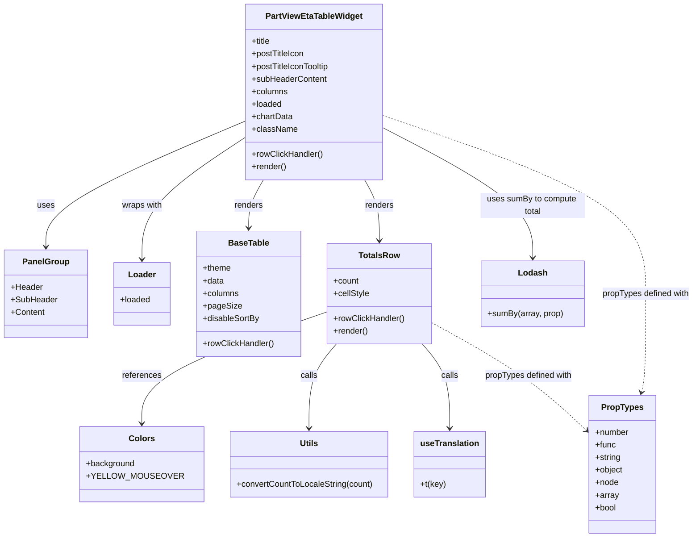

# Diagram: web/portal/src/pages/partview/dashboard/components/organisms/PartViewEtaTableWidget.organism.js

> Auto-generated by Obscura crawlers

## Mermaid

### SVG

<svg id="container" width="1317.94140625" xmlns="http://www.w3.org/2000/svg" class="classDiagram" height="1028" viewBox="0 0 1317.94140625 1028" role="graphics-document document" aria-roledescription="class"><g><defs><marker id="container_class-aggregationStart" class="marker aggregation class" refX="18" refY="7" markerWidth="190" markerHeight="240" orient="auto"><path d="M 18,7 L9,13 L1,7 L9,1 Z"></path></marker></defs><defs><marker id="container_class-aggregationEnd" class="marker aggregation class" refX="1" refY="7" markerWidth="20" markerHeight="28" orient="auto"><path d="M 18,7 L9,13 L1,7 L9,1 Z"></path></marker></defs><defs><marker id="container_class-extensionStart" class="marker extension class" refX="18" refY="7" markerWidth="190" markerHeight="240" orient="auto"><path d="M 1,7 L18,13 V 1 Z"></path></marker></defs><defs><marker id="container_class-extensionEnd" class="marker extension class" refX="1" refY="7" markerWidth="20" markerHeight="28" orient="auto"><path d="M 1,1 V 13 L18,7 Z"></path></marker></defs><defs><marker id="container_class-compositionStart" class="marker composition class" refX="18" refY="7" markerWidth="190" markerHeight="240" orient="auto"><path d="M 18,7 L9,13 L1,7 L9,1 Z"></path></marker></defs><defs><marker id="container_class-compositionEnd" class="marker composition class" refX="1" refY="7" markerWidth="20" markerHeight="28" orient="auto"><path d="M 18,7 L9,13 L1,7 L9,1 Z"></path></marker></defs><defs><marker id="container_class-dependencyStart" class="marker dependency class" refX="6" refY="7" markerWidth="190" markerHeight="240" orient="auto"><path d="M 5,7 L9,13 L1,7 L9,1 Z"></path></marker></defs><defs><marker id="container_class-dependencyEnd" class="marker dependency class" refX="13" refY="7" markerWidth="20" markerHeight="28" orient="auto"><path d="M 18,7 L9,13 L14,7 L9,1 Z"></path></marker></defs><defs><marker id="container_class-lollipopStart" class="marker lollipop class" refX="13" refY="7" markerWidth="190" markerHeight="240" orient="auto"><circle stroke="black" fill="transparent" cx="7" cy="7" r="6"></circle></marker></defs><defs><marker id="container_class-lollipopEnd" class="marker lollipop class" refX="1" refY="7" markerWidth="190" markerHeight="240" orient="auto"><circle stroke="black" fill="transparent" cx="7" cy="7" r="6"></circle></marker></defs><g class="root"><g class="clusters"></g><g class="edgePaths"><path d="M459.502,232.902L397.071,259.585C334.639,286.268,209.777,339.634,147.345,379.484C84.914,419.333,84.914,445.667,84.914,458.833L84.914,472" id="id_PartViewEtaTableWidget_PanelGroup_1" class="edge-thickness-normal edge-pattern-solid relation" style=";;;" data-edge="true" data-et="edge" data-id="id_PartViewEtaTableWidget_PanelGroup_1" data-points="W3sieCI6NDU5LjUwMTk1MzEyNSwieSI6MjMyLjkwMjI0MDc3MjQ0MTR9LHsieCI6ODQuOTE0MDYyNSwieSI6MzkzfSx7IngiOjg0LjkxNDA2MjUsInkiOjQ3OH1d" marker-end="url(#container_class-dependencyEnd)"></path><path d="M459.502,264.354L427.194,285.795C394.885,307.236,330.269,350.118,297.961,388.726C265.652,427.333,265.652,461.667,265.652,478.833L265.652,496" id="id_PartViewEtaTableWidget_Loader_2" class="edge-thickness-normal edge-pattern-solid relation" style=";;;" data-edge="true" data-et="edge" data-id="id_PartViewEtaTableWidget_Loader_2" data-points="W3sieCI6NDU5LjUwMTk1MzEyNSwieSI6MjY0LjM1NDM2MDY2ODI3MTQ1fSx7IngiOjI2NS42NTIzNDM3NSwieSI6MzkzfSx7IngiOjI2NS42NTIzNDM3NSwieSI6NTAyfV0=" marker-end="url(#container_class-dependencyEnd)"></path><path d="M496.556,344L491.885,352.167C487.214,360.333,477.873,376.667,473.202,392C468.531,407.333,468.531,421.667,468.531,428.833L468.531,436" id="id_PartViewEtaTableWidget_BaseTable_3" class="edge-thickness-normal edge-pattern-solid relation" style=";;;" data-edge="true" data-et="edge" data-id="id_PartViewEtaTableWidget_BaseTable_3" data-points="W3sieCI6NDk2LjU1NTUwNjU1MjQxOTQsInkiOjM0NH0seyJ4Ijo0NjguNTMxMjUsInkiOjM5M30seyJ4Ijo0NjguNTMxMjUsInkiOjQ0Mn1d" marker-end="url(#container_class-dependencyEnd)"></path><path d="M688.722,344L693.393,352.167C698.063,360.333,707.405,376.667,712.075,396C716.746,415.333,716.746,437.667,716.746,448.833L716.746,460" id="id_PartViewEtaTableWidget_TotalsRow_4" class="edge-thickness-normal edge-pattern-solid relation" style=";;;" data-edge="true" data-et="edge" data-id="id_PartViewEtaTableWidget_TotalsRow_4" data-points="W3sieCI6Njg4LjcyMTgzNzE5NzU4MDYsInkiOjM0NH0seyJ4Ijo3MTYuNzQ2MDkzNzUsInkiOjM5M30seyJ4Ijo3MTYuNzQ2MDkzNzUsInkiOjQ2Nn1d" marker-end="url(#container_class-dependencyEnd)"></path><path d="M617.586,597.456L560.932,617.713C504.279,637.971,390.971,678.485,334.318,713.909C277.664,749.333,277.664,779.667,277.664,794.833L277.664,810" id="id_TotalsRow_Colors_5" class="edge-thickness-normal edge-pattern-solid relation" style=";;;" data-edge="true" data-et="edge" data-id="id_TotalsRow_Colors_5" data-points="W3sieCI6NjE3LjU4NTkzNzUsInkiOjU5Ny40NTYxMTg1MDAwNjY3fSx7IngiOjI3Ny42NjQwNjI1LCJ5Ijo3MTl9LHsieCI6Mjc3LjY2NDA2MjUsInkiOjgxNn1d" marker-end="url(#container_class-dependencyEnd)"></path><path d="M634.929,658L626.265,668.167C617.6,678.333,600.271,698.667,591.606,725.5C582.941,752.333,582.941,785.667,582.941,802.333L582.941,819" id="id_TotalsRow_Utils_6" class="edge-thickness-normal edge-pattern-solid relation" style=";;;" data-edge="true" data-et="edge" data-id="id_TotalsRow_Utils_6" data-points="W3sieCI6NjM0LjkyOTIxNDc2OTEwODMsInkiOjY1OH0seyJ4Ijo1ODIuOTQxNDA2MjUsInkiOjcxOX0seyJ4Ijo1ODIuOTQxNDA2MjUsInkiOjgyNX1d" marker-end="url(#container_class-dependencyEnd)"></path><path d="M798.563,658L807.228,668.167C815.892,678.333,833.222,698.667,841.886,725.5C850.551,752.333,850.551,785.667,850.551,802.333L850.551,819" id="id_TotalsRow_useTranslation_7" class="edge-thickness-normal edge-pattern-solid relation" style=";;;" data-edge="true" data-et="edge" data-id="id_TotalsRow_useTranslation_7" data-points="W3sieCI6Nzk4LjU2Mjk3MjczMDg5MTcsInkiOjY1OH0seyJ4Ijo4NTAuNTUwNzgxMjUsInkiOjcxOX0seyJ4Ijo4NTAuNTUwNzgxMjUsInkiOjgyNX1d" marker-end="url(#container_class-dependencyEnd)"></path><path d="M725.775,245.65L772.719,270.208C819.663,294.767,913.55,343.883,960.494,385.108C1007.438,426.333,1007.438,459.667,1007.438,476.333L1007.438,493" id="id_PartViewEtaTableWidget_Lodash_8" class="edge-thickness-normal edge-pattern-solid relation" style=";;;" data-edge="true" data-et="edge" data-id="id_PartViewEtaTableWidget_Lodash_8" data-points="W3sieCI6NzI1Ljc3NTM5MDYyNSwieSI6MjQ1LjY0OTgzMDI1NDY4ODZ9LHsieCI6MTAwNy40Mzc1LCJ5IjozOTN9LHsieCI6MTAwNy40Mzc1LCJ5Ijo0OTl9XQ==" marker-end="url(#container_class-dependencyEnd)"></path><path d="M725.775,221.692L808.967,250.244C892.159,278.795,1058.542,335.897,1141.734,392.615C1224.926,449.333,1224.926,505.667,1224.926,560C1224.926,614.333,1224.926,666.667,1223.57,698.032C1222.215,729.398,1219.504,739.796,1218.149,744.995L1216.793,750.194" id="id_PartViewEtaTableWidget_PropTypes_9" class="edge-thickness-normal edge-pattern-dashed relation" style=";;;" data-edge="true" data-et="edge" data-id="id_PartViewEtaTableWidget_PropTypes_9" data-points="W3sieCI6NzI1Ljc3NTM5MDYyNSwieSI6MjIxLjY5MjMyNDgwMDUyODg0fSx7IngiOjEyMjQuOTI1NzgxMjUsInkiOjM5M30seyJ4IjoxMjI0LjkyNTc4MTI1LCJ5Ijo1NjJ9LHsieCI6MTIyNC45MjU3ODEyNSwieSI6NzE5fSx7IngiOjEyMTUuMjc5ODE2OTM3ODY5OCwieSI6NzU2fV0=" marker-end="url(#container_class-dependencyEnd)"></path><path d="M815.906,616.752L846.77,633.793C877.633,650.834,939.361,684.917,988.871,719.487C1038.381,754.057,1075.675,789.115,1094.321,806.643L1112.968,824.172" id="id_TotalsRow_PropTypes_10" class="edge-thickness-normal edge-pattern-dashed relation" style=";;;" data-edge="true" data-et="edge" data-id="id_TotalsRow_PropTypes_10" data-points="W3sieCI6ODE1LjkwNjI1LCJ5Ijo2MTYuNzUxNTE2MzE3MTUyNH0seyJ4IjoxMDAxLjA4Nzg5MDYyNSwieSI6NzE5fSx7IngiOjExMTcuMzM5ODQzNzUsInkiOjgyOC4yODE2NjA0NTYwNzEzfV0=" marker-end="url(#container_class-dependencyEnd)"></path></g><g class="edgeLabels"><g class="edgeLabel" transform="translate(84.9140625, 393)"><g class="label" data-id="id_PartViewEtaTableWidget_PanelGroup_1" transform="translate(-16.4921875, -12)"><foreignObject width="32.984375" height="24">

uses

</foreignObject></g></g><g class="edgeLabel" transform="translate(265.65234375, 393)"><g class="label" data-id="id_PartViewEtaTableWidget_Loader_2" transform="translate(-39.078125, -12)"><foreignObject width="78.15625" height="24">

wraps with

</foreignObject></g></g><g class="edgeLabel" transform="translate(468.53125, 393)"><g class="label" data-id="id_PartViewEtaTableWidget_BaseTable_3" transform="translate(-27.75, -12)"><foreignObject width="55.5" height="24">

renders

</foreignObject></g></g><g class="edgeLabel" transform="translate(716.74609375, 393)"><g class="label" data-id="id_PartViewEtaTableWidget_TotalsRow_4" transform="translate(-27.75, -12)"><foreignObject width="55.5" height="24">

renders

</foreignObject></g></g><g class="edgeLabel" transform="translate(277.6640625, 719)"><g class="label" data-id="id_TotalsRow_Colors_5" transform="translate(-37.828125, -12)"><foreignObject width="75.65625" height="24">

references

</foreignObject></g></g><g class="edgeLabel" transform="translate(582.94140625, 719)"><g class="label" data-id="id_TotalsRow_Utils_6" transform="translate(-16.4453125, -12)"><foreignObject width="32.890625" height="24">

calls

</foreignObject></g></g><g class="edgeLabel" transform="translate(850.55078125, 719)"><g class="label" data-id="id_TotalsRow_useTranslation_7" transform="translate(-16.4453125, -12)"><foreignObject width="32.890625" height="24">

calls

</foreignObject></g></g><g class="edgeLabel" transform="translate(1007.4375, 393)"><g class="label" data-id="id_PartViewEtaTableWidget_Lodash_8" transform="translate(-100, -24)"><foreignObject width="200" height="48">

uses sumBy to compute total

</foreignObject></g></g><g class="edgeLabel" transform="translate(1224.92578125, 562)"><g class="label" data-id="id_PartViewEtaTableWidget_PropTypes_9" transform="translate(-85.015625, -12)"><foreignObject width="170.03125" height="24">

propTypes defined with

</foreignObject></g></g><g class="edgeLabel" transform="translate(1001.087890625, 719)"><g class="label" data-id="id_TotalsRow_PropTypes_10" transform="translate(-85.015625, -12)"><foreignObject width="170.03125" height="24">

propTypes defined with

</foreignObject></g></g></g><g class="nodes"><g class="node default" id="classId-PartViewEtaTableWidget-0" transform="translate(592.638671875, 176)"><g class="basic label-container"><path d="M-133.13671875 -168 L133.13671875 -168 L133.13671875 168 L-133.13671875 168" stroke="none" stroke-width="0" fill="#ECECFF" style=""></path><path d="M-133.13671875 -168 C-40.47426779224449 -168, 52.18818316551102 -168, 133.13671875 -168 M-133.13671875 -168 C-48.86808211413846 -168, 35.40055452172308 -168, 133.13671875 -168 M133.13671875 -168 C133.13671875 -35.434223135807315, 133.13671875 97.13155372838537, 133.13671875 168 M133.13671875 -168 C133.13671875 -93.7846358618811, 133.13671875 -19.5692717237622, 133.13671875 168 M133.13671875 168 C40.23756189033678 168, -52.661594969326444 168, -133.13671875 168 M133.13671875 168 C73.20717075601581 168, 13.277622762031626 168, -133.13671875 168 M-133.13671875 168 C-133.13671875 51.61327202709643, -133.13671875 -64.77345594580714, -133.13671875 -168 M-133.13671875 168 C-133.13671875 86.18889767218128, -133.13671875 4.377795344362568, -133.13671875 -168" stroke="#9370DB" stroke-width="1.3" fill="none" stroke-dasharray="0 0" style=""></path></g><g class="annotation-group text" transform="translate(0, -144)"></g><g class="label-group text" transform="translate(-89.1328125, -144)"><g class="label" style="font-weight: bolder" transform="translate(0,-12)"><foreignObject width="178.265625" height="24">

PartViewEtaTableWidget

</foreignObject></g></g><g class="members-group text" transform="translate(-121.13671875, -96)"><g class="label" style="" transform="translate(0,-12)"><foreignObject width="37.140625" height="24">

+title

</foreignObject></g><g class="label" style="" transform="translate(0,12)"><foreignObject width="102.578125" height="24">

+postTitleIcon

</foreignObject></g><g class="label" style="" transform="translate(0,36)"><foreignObject width="153.140625" height="24">

+postTitleIconTooltip

</foreignObject></g><g class="label" style="" transform="translate(0,60)"><foreignObject width="143.65625" height="24">

+subHeaderContent

</foreignObject></g><g class="label" style="" transform="translate(0,84)"><foreignObject width="69.21875" height="24">

+columns

</foreignObject></g><g class="label" style="" transform="translate(0,108)"><foreignObject width="58.34375" height="24">

+loaded

</foreignObject></g><g class="label" style="" transform="translate(0,132)"><foreignObject width="78.890625" height="24">

+chartData

</foreignObject></g><g class="label" style="" transform="translate(0,156)"><foreignObject width="85.640625" height="24">

+className

</foreignObject></g></g><g class="methods-group text" transform="translate(-121.13671875, 120)"><g class="label" style="" transform="translate(0,-12)"><foreignObject width="136.75" height="24">

+rowClickHandler()

</foreignObject></g><g class="label" style="" transform="translate(0,12)"><foreignObject width="66.609375" height="24">

+render()

</foreignObject></g></g><g class="divider" style=""><path d="M-133.13671875 -120 C-61.36191479885596 -120, 10.412889152288074 -120, 133.13671875 -120 M-133.13671875 -120 C-43.18000270355286 -120, 46.77671334289428 -120, 133.13671875 -120" stroke="#9370DB" stroke-width="1.3" fill="none" stroke-dasharray="0 0" style=""></path></g><g class="divider" style=""><path d="M-133.13671875 96 C-51.61128401761795 96, 29.914150714764105 96, 133.13671875 96 M-133.13671875 96 C-61.01711623025871 96, 11.102486289482584 96, 133.13671875 96" stroke="#9370DB" stroke-width="1.3" fill="none" stroke-dasharray="0 0" style=""></path></g></g><g class="node default" id="classId-TotalsRow-1" transform="translate(716.74609375, 562)"><g class="basic label-container"><path d="M-99.16015625 -96 L99.16015625 -96 L99.16015625 96 L-99.16015625 96" stroke="none" stroke-width="0" fill="#ECECFF" style=""></path><path d="M-99.16015625 -96 C-54.483529586421525 -96, -9.80690292284305 -96, 99.16015625 -96 M-99.16015625 -96 C-37.74676358833164 -96, 23.666629073336722 -96, 99.16015625 -96 M99.16015625 -96 C99.16015625 -38.29232896160991, 99.16015625 19.415342076780178, 99.16015625 96 M99.16015625 -96 C99.16015625 -42.725828692862706, 99.16015625 10.548342614274588, 99.16015625 96 M99.16015625 96 C34.01674357729779 96, -31.126669095404424 96, -99.16015625 96 M99.16015625 96 C34.84529523914185 96, -29.469565771716304 96, -99.16015625 96 M-99.16015625 96 C-99.16015625 26.808888036771336, -99.16015625 -42.38222392645733, -99.16015625 -96 M-99.16015625 96 C-99.16015625 20.349287339722963, -99.16015625 -55.301425320554074, -99.16015625 -96" stroke="#9370DB" stroke-width="1.3" fill="none" stroke-dasharray="0 0" style=""></path></g><g class="annotation-group text" transform="translate(0, -72)"></g><g class="label-group text" transform="translate(-37.5703125, -72)"><g class="label" style="font-weight: bolder" transform="translate(0,-12)"><foreignObject width="75.140625" height="24">

TotalsRow

</foreignObject></g></g><g class="members-group text" transform="translate(-87.16015625, -24)"><g class="label" style="" transform="translate(0,-12)"><foreignObject width="49.125" height="24">

+count

</foreignObject></g><g class="label" style="" transform="translate(0,12)"><foreignObject width="69.03125" height="24">

+cellStyle

</foreignObject></g></g><g class="methods-group text" transform="translate(-87.16015625, 48)"><g class="label" style="" transform="translate(0,-12)"><foreignObject width="136.75" height="24">

+rowClickHandler()

</foreignObject></g><g class="label" style="" transform="translate(0,12)"><foreignObject width="66.609375" height="24">

+render()

</foreignObject></g></g><g class="divider" style=""><path d="M-99.16015625 -48 C-55.45223480269397 -48, -11.744313355387945 -48, 99.16015625 -48 M-99.16015625 -48 C-58.44300184748351 -48, -17.725847444967016 -48, 99.16015625 -48" stroke="#9370DB" stroke-width="1.3" fill="none" stroke-dasharray="0 0" style=""></path></g><g class="divider" style=""><path d="M-99.16015625 24 C-39.83880843242243 24, 19.482539385155135 24, 99.16015625 24 M-99.16015625 24 C-31.25575384041946 24, 36.64864856916108 24, 99.16015625 24" stroke="#9370DB" stroke-width="1.3" fill="none" stroke-dasharray="0 0" style=""></path></g></g><g class="node default" id="classId-PanelGroup-2" transform="translate(84.9140625, 562)"><g class="basic label-container"><path d="M-76.9140625 -84 L76.9140625 -84 L76.9140625 84 L-76.9140625 84" stroke="none" stroke-width="0" fill="#ECECFF" style=""></path><path d="M-76.9140625 -84 C-42.20407700277043 -84, -7.494091505540865 -84, 76.9140625 -84 M-76.9140625 -84 C-32.07574627775085 -84, 12.762569944498296 -84, 76.9140625 -84 M76.9140625 -84 C76.9140625 -25.76726013450071, 76.9140625 32.46547973099858, 76.9140625 84 M76.9140625 -84 C76.9140625 -42.31022682294564, 76.9140625 -0.6204536458912742, 76.9140625 84 M76.9140625 84 C37.03501777298072 84, -2.8440269540385543 84, -76.9140625 84 M76.9140625 84 C21.50998008062065 84, -33.8941023387587 84, -76.9140625 84 M-76.9140625 84 C-76.9140625 29.763537516118447, -76.9140625 -24.472924967763106, -76.9140625 -84 M-76.9140625 84 C-76.9140625 46.585273107984406, -76.9140625 9.170546215968812, -76.9140625 -84" stroke="#9370DB" stroke-width="1.3" fill="none" stroke-dasharray="0 0" style=""></path></g><g class="annotation-group text" transform="translate(0, -60)"></g><g class="label-group text" transform="translate(-42.328125, -60)"><g class="label" style="font-weight: bolder" transform="translate(0,-12)"><foreignObject width="84.65625" height="24">

PanelGroup

</foreignObject></g></g><g class="members-group text" transform="translate(-64.9140625, -12)"><g class="label" style="" transform="translate(0,-12)"><foreignObject width="60.59375" height="24">

+Header

</foreignObject></g><g class="label" style="" transform="translate(0,12)"><foreignObject width="87.5" height="24">

+SubHeader

</foreignObject></g><g class="label" style="" transform="translate(0,36)"><foreignObject width="64.765625" height="24">

+Content

</foreignObject></g></g><g class="methods-group text" transform="translate(-64.9140625, 84)"></g><g class="divider" style=""><path d="M-76.9140625 -36 C-22.593954706460657 -36, 31.726153087078686 -36, 76.9140625 -36 M-76.9140625 -36 C-42.40623164917166 -36, -7.898400798343317 -36, 76.9140625 -36" stroke="#9370DB" stroke-width="1.3" fill="none" stroke-dasharray="0 0" style=""></path></g><g class="divider" style=""><path d="M-76.9140625 60 C-43.52707127505802 60, -10.14008005011604 60, 76.9140625 60 M-76.9140625 60 C-32.188841532915156 60, 12.536379434169689 60, 76.9140625 60" stroke="#9370DB" stroke-width="1.3" fill="none" stroke-dasharray="0 0" style=""></path></g></g><g class="node default" id="classId-BaseTable-3" transform="translate(468.53125, 562)"><g class="basic label-container"><path d="M-99.0546875 -120 L99.0546875 -120 L99.0546875 120 L-99.0546875 120" stroke="none" stroke-width="0" fill="#ECECFF" style=""></path><path d="M-99.0546875 -120 C-37.67832158478678 -120, 23.69804433042644 -120, 99.0546875 -120 M-99.0546875 -120 C-58.178969854561466 -120, -17.30325220912293 -120, 99.0546875 -120 M99.0546875 -120 C99.0546875 -63.46645005927487, 99.0546875 -6.932900118549739, 99.0546875 120 M99.0546875 -120 C99.0546875 -27.05927460436797, 99.0546875 65.88145079126406, 99.0546875 120 M99.0546875 120 C22.489708053165515 120, -54.07527139366897 120, -99.0546875 120 M99.0546875 120 C32.104965849783326 120, -34.84475580043335 120, -99.0546875 120 M-99.0546875 120 C-99.0546875 41.448131608768165, -99.0546875 -37.10373678246367, -99.0546875 -120 M-99.0546875 120 C-99.0546875 60.0242514982296, -99.0546875 0.04850299645920586, -99.0546875 -120" stroke="#9370DB" stroke-width="1.3" fill="none" stroke-dasharray="0 0" style=""></path></g><g class="annotation-group text" transform="translate(0, -96)"></g><g class="label-group text" transform="translate(-37.359375, -96)"><g class="label" style="font-weight: bolder" transform="translate(0,-12)"><foreignObject width="74.71875" height="24">

BaseTable

</foreignObject></g></g><g class="members-group text" transform="translate(-87.0546875, -48)"><g class="label" style="" transform="translate(0,-12)"><foreignObject width="54.21875" height="24">

+theme

</foreignObject></g><g class="label" style="" transform="translate(0,12)"><foreignObject width="40.625" height="24">

+data

</foreignObject></g><g class="label" style="" transform="translate(0,36)"><foreignObject width="69.21875" height="24">

+columns

</foreignObject></g><g class="label" style="" transform="translate(0,60)"><foreignObject width="71.5" height="24">

+pageSize

</foreignObject></g><g class="label" style="" transform="translate(0,84)"><foreignObject width="108.53125" height="24">

+disableSortBy

</foreignObject></g></g><g class="methods-group text" transform="translate(-87.0546875, 96)"><g class="label" style="" transform="translate(0,-12)"><foreignObject width="136.75" height="24">

+rowClickHandler()

</foreignObject></g></g><g class="divider" style=""><path d="M-99.0546875 -72 C-38.82907058289449 -72, 21.396546334211024 -72, 99.0546875 -72 M-99.0546875 -72 C-42.938670172306765 -72, 13.177347155386471 -72, 99.0546875 -72" stroke="#9370DB" stroke-width="1.3" fill="none" stroke-dasharray="0 0" style=""></path></g><g class="divider" style=""><path d="M-99.0546875 72 C-38.65346370761344 72, 21.74776008477312 72, 99.0546875 72 M-99.0546875 72 C-43.75995550181001 72, 11.534776496379976 72, 99.0546875 72" stroke="#9370DB" stroke-width="1.3" fill="none" stroke-dasharray="0 0" style=""></path></g></g><g class="node default" id="classId-Loader-4" transform="translate(265.65234375, 562)"><g class="basic label-container"><path d="M-53.82421875 -60 L53.82421875 -60 L53.82421875 60 L-53.82421875 60" stroke="none" stroke-width="0" fill="#ECECFF" style=""></path><path d="M-53.82421875 -60 C-11.748491489056384 -60, 30.32723577188723 -60, 53.82421875 -60 M-53.82421875 -60 C-20.58505301645542 -60, 12.654112717089163 -60, 53.82421875 -60 M53.82421875 -60 C53.82421875 -16.24730607427862, 53.82421875 27.505387851442762, 53.82421875 60 M53.82421875 -60 C53.82421875 -28.984262240537117, 53.82421875 2.0314755189257667, 53.82421875 60 M53.82421875 60 C23.758704004087317 60, -6.306810741825366 60, -53.82421875 60 M53.82421875 60 C13.544146679967184 60, -26.73592539006563 60, -53.82421875 60 M-53.82421875 60 C-53.82421875 21.54961223607978, -53.82421875 -16.900775527840437, -53.82421875 -60 M-53.82421875 60 C-53.82421875 31.404643340531415, -53.82421875 2.8092866810628294, -53.82421875 -60" stroke="#9370DB" stroke-width="1.3" fill="none" stroke-dasharray="0 0" style=""></path></g><g class="annotation-group text" transform="translate(0, -36)"></g><g class="label-group text" transform="translate(-25.3046875, -36)"><g class="label" style="font-weight: bolder" transform="translate(0,-12)"><foreignObject width="50.609375" height="24">

Loader

</foreignObject></g></g><g class="members-group text" transform="translate(-41.82421875, 12)"><g class="label" style="" transform="translate(0,-12)"><foreignObject width="58.34375" height="24">

+loaded

</foreignObject></g></g><g class="methods-group text" transform="translate(-41.82421875, 60)"></g><g class="divider" style=""><path d="M-53.82421875 -12 C-21.78308880267899 -12, 10.258041144642021 -12, 53.82421875 -12 M-53.82421875 -12 C-11.845298968252777 -12, 30.133620813494446 -12, 53.82421875 -12" stroke="#9370DB" stroke-width="1.3" fill="none" stroke-dasharray="0 0" style=""></path></g><g class="divider" style=""><path d="M-53.82421875 36 C-12.224648413749264 36, 29.37492192250147 36, 53.82421875 36 M-53.82421875 36 C-31.958352900883956 36, -10.092487051767911 36, 53.82421875 36" stroke="#9370DB" stroke-width="1.3" fill="none" stroke-dasharray="0 0" style=""></path></g></g><g class="node default" id="classId-Utils-5" transform="translate(582.94140625, 888)"><g class="basic label-container"><path d="M-151.5234375 -63 L151.5234375 -63 L151.5234375 63 L-151.5234375 63" stroke="none" stroke-width="0" fill="#ECECFF" style=""></path><path d="M-151.5234375 -63 C-51.36407158174218 -63, 48.79529433651564 -63, 151.5234375 -63 M-151.5234375 -63 C-40.8765393006517 -63, 69.7703588986966 -63, 151.5234375 -63 M151.5234375 -63 C151.5234375 -12.763148629779089, 151.5234375 37.47370274044182, 151.5234375 63 M151.5234375 -63 C151.5234375 -20.048527278601775, 151.5234375 22.90294544279645, 151.5234375 63 M151.5234375 63 C59.374007349272105 63, -32.77542280145579 63, -151.5234375 63 M151.5234375 63 C61.70577821832293 63, -28.111881063354133 63, -151.5234375 63 M-151.5234375 63 C-151.5234375 31.32443943050204, -151.5234375 -0.35112113899592146, -151.5234375 -63 M-151.5234375 63 C-151.5234375 32.38526288556838, -151.5234375 1.7705257711367608, -151.5234375 -63" stroke="#9370DB" stroke-width="1.3" fill="none" stroke-dasharray="0 0" style=""></path></g><g class="annotation-group text" transform="translate(0, -39)"></g><g class="label-group text" transform="translate(-16.796875, -39)"><g class="label" style="font-weight: bolder" transform="translate(0,-12)"><foreignObject width="33.59375" height="24">

Utils

</foreignObject></g></g><g class="members-group text" transform="translate(-139.5234375, 9)"></g><g class="methods-group text" transform="translate(-139.5234375, 39)"><g class="label" style="" transform="translate(0,-12)"><foreignObject width="262.25" height="24">

+convertCountToLocaleString(count)

</foreignObject></g></g><g class="divider" style=""><path d="M-151.5234375 -15 C-59.922610097872635 -15, 31.67821730425473 -15, 151.5234375 -15 M-151.5234375 -15 C-85.13995268438185 -15, -18.756467868763707 -15, 151.5234375 -15" stroke="#9370DB" stroke-width="1.3" fill="none" stroke-dasharray="0 0" style=""></path></g><g class="divider" style=""><path d="M-151.5234375 9 C-69.70008455958956 9, 12.123268380820889 9, 151.5234375 9 M-151.5234375 9 C-61.353465035256306 9, 28.816507429487388 9, 151.5234375 9" stroke="#9370DB" stroke-width="1.3" fill="none" stroke-dasharray="0 0" style=""></path></g></g><g class="node default" id="classId-Colors-6" transform="translate(277.6640625, 888)"><g class="basic label-container"><path d="M-103.75390625 -72 L103.75390625 -72 L103.75390625 72 L-103.75390625 72" stroke="none" stroke-width="0" fill="#ECECFF" style=""></path><path d="M-103.75390625 -72 C-28.04170141939585 -72, 47.6705034112083 -72, 103.75390625 -72 M-103.75390625 -72 C-33.37304848206428 -72, 37.007809285871446 -72, 103.75390625 -72 M103.75390625 -72 C103.75390625 -19.182942981453998, 103.75390625 33.634114037092004, 103.75390625 72 M103.75390625 -72 C103.75390625 -20.800471200609074, 103.75390625 30.39905759878185, 103.75390625 72 M103.75390625 72 C44.916503259373265 72, -13.92089973125347 72, -103.75390625 72 M103.75390625 72 C50.60253152329048 72, -2.5488432034190396 72, -103.75390625 72 M-103.75390625 72 C-103.75390625 21.637978110145973, -103.75390625 -28.724043779708055, -103.75390625 -72 M-103.75390625 72 C-103.75390625 18.751886979484098, -103.75390625 -34.496226041031804, -103.75390625 -72" stroke="#9370DB" stroke-width="1.3" fill="none" stroke-dasharray="0 0" style=""></path></g><g class="annotation-group text" transform="translate(0, -48)"></g><g class="label-group text" transform="translate(-23.1015625, -48)"><g class="label" style="font-weight: bolder" transform="translate(0,-12)"><foreignObject width="46.203125" height="24">

Colors

</foreignObject></g></g><g class="members-group text" transform="translate(-91.75390625, 0)"><g class="label" style="" transform="translate(0,-12)"><foreignObject width="93.390625" height="24">

+background

</foreignObject></g><g class="label" style="" transform="translate(0,12)"><foreignObject width="160.40625" height="24">

+YELLOW_MOUSEOVER

</foreignObject></g></g><g class="methods-group text" transform="translate(-91.75390625, 72)"></g><g class="divider" style=""><path d="M-103.75390625 -24 C-47.35301462930246 -24, 9.047876991395086 -24, 103.75390625 -24 M-103.75390625 -24 C-56.59556216488549 -24, -9.437218079770986 -24, 103.75390625 -24" stroke="#9370DB" stroke-width="1.3" fill="none" stroke-dasharray="0 0" style=""></path></g><g class="divider" style=""><path d="M-103.75390625 48 C-35.85184839408264 48, 32.050209461834726 48, 103.75390625 48 M-103.75390625 48 C-49.851988731227266 48, 4.049928787545468 48, 103.75390625 48" stroke="#9370DB" stroke-width="1.3" fill="none" stroke-dasharray="0 0" style=""></path></g></g><g class="node default" id="classId-Lodash-7" transform="translate(1007.4375, 562)"><g class="basic label-container"><path d="M-97.47265625 -63 L97.47265625 -63 L97.47265625 63 L-97.47265625 63" stroke="none" stroke-width="0" fill="#ECECFF" style=""></path><path d="M-97.47265625 -63 C-38.43453760217006 -63, 20.60358104565988 -63, 97.47265625 -63 M-97.47265625 -63 C-55.02554267270579 -63, -12.578429095411579 -63, 97.47265625 -63 M97.47265625 -63 C97.47265625 -26.517618380735556, 97.47265625 9.964763238528889, 97.47265625 63 M97.47265625 -63 C97.47265625 -22.617629009977342, 97.47265625 17.764741980045315, 97.47265625 63 M97.47265625 63 C56.22418802304036 63, 14.975719796080725 63, -97.47265625 63 M97.47265625 63 C53.5409806265127 63, 9.609305003025398 63, -97.47265625 63 M-97.47265625 63 C-97.47265625 36.532587112643085, -97.47265625 10.065174225286164, -97.47265625 -63 M-97.47265625 63 C-97.47265625 20.86370537341297, -97.47265625 -21.27258925317406, -97.47265625 -63" stroke="#9370DB" stroke-width="1.3" fill="none" stroke-dasharray="0 0" style=""></path></g><g class="annotation-group text" transform="translate(0, -39)"></g><g class="label-group text" transform="translate(-26.1640625, -39)"><g class="label" style="font-weight: bolder" transform="translate(0,-12)"><foreignObject width="52.328125" height="24">

Lodash

</foreignObject></g></g><g class="members-group text" transform="translate(-85.47265625, 9)"></g><g class="methods-group text" transform="translate(-85.47265625, 39)"><g class="label" style="" transform="translate(0,-12)"><foreignObject width="144.78125" height="24">

+sumBy(array, prop)

</foreignObject></g></g><g class="divider" style=""><path d="M-97.47265625 -15 C-57.40744200793762 -15, -17.342227765875236 -15, 97.47265625 -15 M-97.47265625 -15 C-24.377526939301106 -15, 48.71760237139779 -15, 97.47265625 -15" stroke="#9370DB" stroke-width="1.3" fill="none" stroke-dasharray="0 0" style=""></path></g><g class="divider" style=""><path d="M-97.47265625 9 C-56.80369406345267 9, -16.134731876905335 9, 97.47265625 9 M-97.47265625 9 C-30.23223837376868 9, 37.00817950246264 9, 97.47265625 9" stroke="#9370DB" stroke-width="1.3" fill="none" stroke-dasharray="0 0" style=""></path></g></g><g class="node default" id="classId-useTranslation-8" transform="translate(850.55078125, 888)"><g class="basic label-container"><path d="M-66.0859375 -63 L66.0859375 -63 L66.0859375 63 L-66.0859375 63" stroke="none" stroke-width="0" fill="#ECECFF" style=""></path><path d="M-66.0859375 -63 C-24.730453942079755 -63, 16.62502961584049 -63, 66.0859375 -63 M-66.0859375 -63 C-17.783416529052097 -63, 30.519104441895806 -63, 66.0859375 -63 M66.0859375 -63 C66.0859375 -36.315105738425856, 66.0859375 -9.630211476851706, 66.0859375 63 M66.0859375 -63 C66.0859375 -27.68869110243694, 66.0859375 7.622617795126118, 66.0859375 63 M66.0859375 63 C28.731113395171406 63, -8.623710709657189 63, -66.0859375 63 M66.0859375 63 C15.132130739384337 63, -35.821676021231326 63, -66.0859375 63 M-66.0859375 63 C-66.0859375 27.836279214710856, -66.0859375 -7.327441570578287, -66.0859375 -63 M-66.0859375 63 C-66.0859375 16.379946754816544, -66.0859375 -30.240106490366912, -66.0859375 -63" stroke="#9370DB" stroke-width="1.3" fill="none" stroke-dasharray="0 0" style=""></path></g><g class="annotation-group text" transform="translate(0, -39)"></g><g class="label-group text" transform="translate(-54.0859375, -39)"><g class="label" style="font-weight: bolder" transform="translate(0,-12)"><foreignObject width="108.171875" height="24">

useTranslation

</foreignObject></g></g><g class="members-group text" transform="translate(-54.0859375, 9)"></g><g class="methods-group text" transform="translate(-54.0859375, 39)"><g class="label" style="" transform="translate(0,-12)"><foreignObject width="48.625" height="24">

+t(key)

</foreignObject></g></g><g class="divider" style=""><path d="M-66.0859375 -15 C-23.19963076243029 -15, 19.686675975139423 -15, 66.0859375 -15 M-66.0859375 -15 C-31.0975568669477 -15, 3.890823766104603 -15, 66.0859375 -15" stroke="#9370DB" stroke-width="1.3" fill="none" stroke-dasharray="0 0" style=""></path></g><g class="divider" style=""><path d="M-66.0859375 9 C-26.94305508975569 9, 12.199827320488623 9, 66.0859375 9 M-66.0859375 9 C-30.704825483907698 9, 4.676286532184605 9, 66.0859375 9" stroke="#9370DB" stroke-width="1.3" fill="none" stroke-dasharray="0 0" style=""></path></g></g><g class="node default" id="classId-PropTypes-9" transform="translate(1180.8671875, 888)"><g class="basic label-container"><path d="M-63.52734375 -132 L63.52734375 -132 L63.52734375 132 L-63.52734375 132" stroke="none" stroke-width="0" fill="#ECECFF" style=""></path><path d="M-63.52734375 -132 C-29.865707555970516 -132, 3.7959286380589674 -132, 63.52734375 -132 M-63.52734375 -132 C-24.299332626956613 -132, 14.928678496086775 -132, 63.52734375 -132 M63.52734375 -132 C63.52734375 -53.91948869643622, 63.52734375 24.161022607127563, 63.52734375 132 M63.52734375 -132 C63.52734375 -58.622643043209905, 63.52734375 14.75471391358019, 63.52734375 132 M63.52734375 132 C14.378121096659783 132, -34.771101556680435 132, -63.52734375 132 M63.52734375 132 C31.666596433264903 132, -0.1941508834701935 132, -63.52734375 132 M-63.52734375 132 C-63.52734375 38.549602676450405, -63.52734375 -54.90079464709919, -63.52734375 -132 M-63.52734375 132 C-63.52734375 27.985069418148157, -63.52734375 -76.02986116370369, -63.52734375 -132" stroke="#9370DB" stroke-width="1.3" fill="none" stroke-dasharray="0 0" style=""></path></g><g class="annotation-group text" transform="translate(0, -108)"></g><g class="label-group text" transform="translate(-38.2578125, -108)"><g class="label" style="font-weight: bolder" transform="translate(0,-12)"><foreignObject width="76.515625" height="24">

PropTypes

</foreignObject></g></g><g class="members-group text" transform="translate(-51.52734375, -60)"><g class="label" style="" transform="translate(0,-12)"><foreignObject width="64.796875" height="24">

+number

</foreignObject></g><g class="label" style="" transform="translate(0,12)"><foreignObject width="39.453125" height="24">

+func

</foreignObject></g><g class="label" style="" transform="translate(0,36)"><foreignObject width="49.625" height="24">

+string

</foreignObject></g><g class="label" style="" transform="translate(0,60)"><foreignObject width="53.46875" height="24">

+object

</foreignObject></g><g class="label" style="" transform="translate(0,84)"><foreignObject width="45" height="24">

+node

</foreignObject></g><g class="label" style="" transform="translate(0,108)"><foreignObject width="44.578125" height="24">

+array

</foreignObject></g><g class="label" style="" transform="translate(0,132)"><foreignObject width="40.875" height="24">

+bool

</foreignObject></g></g><g class="methods-group text" transform="translate(-51.52734375, 132)"></g><g class="divider" style=""><path d="M-63.52734375 -84 C-13.618337841604635 -84, 36.29066806679073 -84, 63.52734375 -84 M-63.52734375 -84 C-14.899849305898051 -84, 33.7276451382039 -84, 63.52734375 -84" stroke="#9370DB" stroke-width="1.3" fill="none" stroke-dasharray="0 0" style=""></path></g><g class="divider" style=""><path d="M-63.52734375 108 C-34.994229440805555 108, -6.461115131611109 108, 63.52734375 108 M-63.52734375 108 C-36.11118680783454 108, -8.695029865669085 108, 63.52734375 108" stroke="#9370DB" stroke-width="1.3" fill="none" stroke-dasharray="0 0" style=""></path></g></g></g></g></g></svg>
