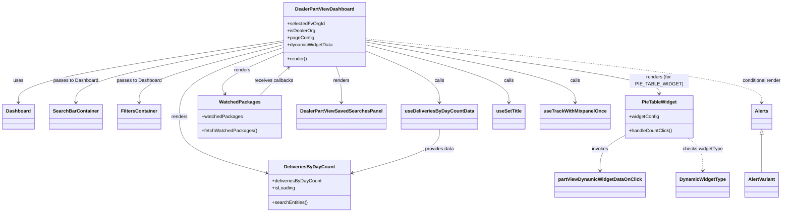

# Diagram: web/portal/src/pages/partview/dealer-partview-dashboard/DealerPartView.Dashboard.page.js

> Auto-generated by Obscura crawlers

## Mermaid

### SVG

<svg id="container" width="2554.71484375" xmlns="http://www.w3.org/2000/svg" class="classDiagram" height="716" viewBox="0 0 2554.71484375 716" role="graphics-document document" aria-roledescription="class"><g><defs><marker id="container_class-aggregationStart" class="marker aggregation class" refX="18" refY="7" markerWidth="190" markerHeight="240" orient="auto"><path d="M 18,7 L9,13 L1,7 L9,1 Z"></path></marker></defs><defs><marker id="container_class-aggregationEnd" class="marker aggregation class" refX="1" refY="7" markerWidth="20" markerHeight="28" orient="auto"><path d="M 18,7 L9,13 L1,7 L9,1 Z"></path></marker></defs><defs><marker id="container_class-extensionStart" class="marker extension class" refX="18" refY="7" markerWidth="190" markerHeight="240" orient="auto"><path d="M 1,7 L18,13 V 1 Z"></path></marker></defs><defs><marker id="container_class-extensionEnd" class="marker extension class" refX="1" refY="7" markerWidth="20" markerHeight="28" orient="auto"><path d="M 1,1 V 13 L18,7 Z"></path></marker></defs><defs><marker id="container_class-compositionStart" class="marker composition class" refX="18" refY="7" markerWidth="190" markerHeight="240" orient="auto"><path d="M 18,7 L9,13 L1,7 L9,1 Z"></path></marker></defs><defs><marker id="container_class-compositionEnd" class="marker composition class" refX="1" refY="7" markerWidth="20" markerHeight="28" orient="auto"><path d="M 18,7 L9,13 L1,7 L9,1 Z"></path></marker></defs><defs><marker id="container_class-dependencyStart" class="marker dependency class" refX="6" refY="7" markerWidth="190" markerHeight="240" orient="auto"><path d="M 5,7 L9,13 L1,7 L9,1 Z"></path></marker></defs><defs><marker id="container_class-dependencyEnd" class="marker dependency class" refX="13" refY="7" markerWidth="20" markerHeight="28" orient="auto"><path d="M 18,7 L9,13 L14,7 L9,1 Z"></path></marker></defs><defs><marker id="container_class-lollipopStart" class="marker lollipop class" refX="13" refY="7" markerWidth="190" markerHeight="240" orient="auto"><circle stroke="black" fill="transparent" cx="7" cy="7" r="6"></circle></marker></defs><defs><marker id="container_class-lollipopEnd" class="marker lollipop class" refX="1" refY="7" markerWidth="190" markerHeight="240" orient="auto"><circle stroke="black" fill="transparent" cx="7" cy="7" r="6"></circle></marker></defs><g class="root"><g class="clusters"></g><g class="edgePaths"><path d="M919.203,137.442L775.909,160.035C632.615,182.628,346.026,227.814,202.732,262.574C59.438,297.333,59.438,321.667,59.438,333.833L59.438,346" id="id_DealerPartViewDashboard_Dashboard_1" class="edge-thickness-normal edge-pattern-solid relation" style=";;;" data-edge="true" data-et="edge" data-id="id_DealerPartViewDashboard_Dashboard_1" data-points="W3sieCI6OTE5LjIwMzEyNSwieSI6MTM3LjQ0MTczMzI5MDQ0MzA0fSx7IngiOjU5LjQzNzUsInkiOjI3M30seyJ4Ijo1OS40Mzc1LCJ5IjozNTJ9XQ==" marker-end="url(#container_class-dependencyEnd)"></path><path d="M919.203,142.376L806.956,164.147C694.708,185.917,470.214,229.459,357.966,263.396C245.719,297.333,245.719,321.667,245.719,333.833L245.719,346" id="id_DealerPartViewDashboard_SearchBarContainer_2" class="edge-thickness-normal edge-pattern-solid relation" style=";;;" data-edge="true" data-et="edge" data-id="id_DealerPartViewDashboard_SearchBarContainer_2" data-points="W3sieCI6OTE5LjIwMzEyNSwieSI6MTQyLjM3NjAyNDI0NDA2MjAyfSx7IngiOjI0NS43MTg3NSwieSI6MjczfSx7IngiOjI0NS43MTg3NSwieSI6MzUyfV0=" marker-end="url(#container_class-dependencyEnd)"></path><path d="M919.203,151.326L841.135,171.605C763.068,191.884,606.932,232.442,528.865,264.888C450.797,297.333,450.797,321.667,450.797,333.833L450.797,346" id="id_DealerPartViewDashboard_FiltersContainer_3" class="edge-thickness-normal edge-pattern-solid relation" style=";;;" data-edge="true" data-et="edge" data-id="id_DealerPartViewDashboard_FiltersContainer_3" data-points="W3sieCI6OTE5LjIwMzEyNSwieSI6MTUxLjMyNTY1OTU1MzAxNjN9LHsieCI6NDUwLjc5Njg3NSwieSI6MjczfSx7IngiOjQ1MC43OTY4NzUsInkiOjM1Mn1d" marker-end="url(#container_class-dependencyEnd)"></path><path d="M1191.188,151.739L1268.091,171.949C1344.995,192.159,1498.802,232.58,1575.706,264.956C1652.609,297.333,1652.609,321.667,1652.609,333.833L1652.609,346" id="id_DealerPartViewDashboard_useSetTitle_4" class="edge-thickness-normal edge-pattern-solid relation" style=";;;" data-edge="true" data-et="edge" data-id="id_DealerPartViewDashboard_useSetTitle_4" data-points="W3sieCI6MTE5MS4xODc1LCJ5IjoxNTEuNzM4NjUyMjY0MzE2Mjd9LHsieCI6MTY1Mi42MDkzNzUsInkiOjI3M30seyJ4IjoxNjUyLjYwOTM3NSwieSI6MzUyfV0=" marker-end="url(#container_class-dependencyEnd)"></path><path d="M1191.188,142.253L1304.069,164.044C1416.951,185.835,1642.714,229.418,1755.595,263.375C1868.477,297.333,1868.477,321.667,1868.477,333.833L1868.477,346" id="id_DealerPartViewDashboard_useTrackWithMixpanelOnce_5" class="edge-thickness-normal edge-pattern-solid relation" style=";;;" data-edge="true" data-et="edge" data-id="id_DealerPartViewDashboard_useTrackWithMixpanelOnce_5" data-points="W3sieCI6MTE5MS4xODc1LCJ5IjoxNDIuMjUyNjMyMDg0NTM0MX0seyJ4IjoxODY4LjQ3NjU2MjUsInkiOjI3M30seyJ4IjoxODY4LjQ3NjU2MjUsInkiOjM1Mn1d" marker-end="url(#container_class-dependencyEnd)"></path><path d="M1191.188,173.405L1230.51,190.005C1269.833,206.604,1348.479,239.802,1387.802,268.568C1427.125,297.333,1427.125,321.667,1427.125,333.833L1427.125,346" id="id_DealerPartViewDashboard_useDeliveriesByDayCountData_6" class="edge-thickness-normal edge-pattern-solid relation" style=";;;" data-edge="true" data-et="edge" data-id="id_DealerPartViewDashboard_useDeliveriesByDayCountData_6" data-points="W3sieCI6MTE5MS4xODc1LCJ5IjoxNzMuNDA1NDAyNTY2ODQ5NH0seyJ4IjoxNDI3LjEyNSwieSI6MjczfSx7IngiOjE0MjcuMTI1LCJ5IjozNTJ9XQ==" marker-end="url(#container_class-dependencyEnd)"></path><path d="M919.203,161.291L863.299,179.909C807.396,198.527,695.589,235.764,639.685,274.548C583.781,313.333,583.781,353.667,583.781,392C583.781,430.333,583.781,466.667,630.608,498.27C677.434,529.874,771.087,556.748,817.914,570.185L864.741,583.622" id="id_DealerPartViewDashboard_DeliveriesByDayCount_7" class="edge-thickness-normal edge-pattern-solid relation" style=";;;" data-edge="true" data-et="edge" data-id="id_DealerPartViewDashboard_DeliveriesByDayCount_7" data-points="W3sieCI6OTE5LjIwMzEyNSwieSI6MTYxLjI5MDkxMzMwOTM1ODQ3fSx7IngiOjU4My43ODEyNSwieSI6MjczfSx7IngiOjU4My43ODEyNSwieSI6Mzk0fSx7IngiOjU4My43ODEyNSwieSI6NTAzfSx7IngiOjg3MC41MDc4MTI1LCJ5Ijo1ODUuMjc3MDQwNzk3NDIxfV0=" marker-end="url(#container_class-dependencyEnd)"></path><path d="M1191.188,135.609L1349.991,158.508C1508.794,181.406,1826.401,227.203,1985.204,257.268C2144.008,287.333,2144.008,301.667,2144.008,308.833L2144.008,316" id="id_DealerPartViewDashboard_PieTableWidget_8" class="edge-thickness-normal edge-pattern-solid relation" style=";;;" data-edge="true" data-et="edge" data-id="id_DealerPartViewDashboard_PieTableWidget_8" data-points="W3sieCI6MTE5MS4xODc1LCJ5IjoxMzUuNjA5MjI4ODA0MzE2NjF9LHsieCI6MjE0NC4wMDc4MTI1LCJ5IjoyNzN9LHsieCI6MjE0NC4wMDc4MTI1LCJ5IjozMjJ9XQ==" marker-end="url(#container_class-dependencyEnd)"></path><path d="M919.203,177.308L883.826,193.257C848.45,209.206,777.697,241.103,746.881,264.369C716.065,287.636,725.187,302.272,729.748,309.59L734.309,316.908" id="id_DealerPartViewDashboard_WatchedPackages_9" class="edge-thickness-normal edge-pattern-solid relation" style=";;;" data-edge="true" data-et="edge" data-id="id_DealerPartViewDashboard_WatchedPackages_9" data-points="W3sieCI6OTE5LjIwMzEyNSwieSI6MTc3LjMwODQwOTc0NzM0MzAzfSx7IngiOjcwNi45NDMzNTkzNzUsInkiOjI3M30seyJ4Ijo3MzcuNDgyMTQ3NDY5MDA4MywieSI6MzIyfV0=" marker-end="url(#container_class-dependencyEnd)"></path><path d="M1093.959,224L1096.891,232.167C1099.822,240.333,1105.684,256.667,1108.616,277C1111.547,297.333,1111.547,321.667,1111.547,333.833L1111.547,346" id="id_DealerPartViewDashboard_DealerPartViewSavedSearchesPanel_10" class="edge-thickness-normal edge-pattern-solid relation" style=";;;" data-edge="true" data-et="edge" data-id="id_DealerPartViewDashboard_DealerPartViewSavedSearchesPanel_10" data-points="W3sieCI6MTA5My45NTk0NDQ2NjU2MDUxLCJ5IjoyMjR9LHsieCI6MTExMS41NDY4NzUsInkiOjI3M30seyJ4IjoxMTExLjU0Njg3NSwieSI6MzUyfV0=" marker-end="url(#container_class-dependencyEnd)"></path><path d="M2031.07,457.761L2017.715,465.301C2004.361,472.841,1977.651,487.92,1964.296,507.627C1950.941,527.333,1950.941,551.667,1950.941,563.833L1950.941,576" id="id_PieTableWidget_partViewDynamicWidgetDataOnClick_11" class="edge-thickness-normal edge-pattern-solid relation" style=";;;" data-edge="true" data-et="edge" data-id="id_PieTableWidget_partViewDynamicWidgetDataOnClick_11" data-points="W3sieCI6MjAzMS4wNzAzMTI1LCJ5Ijo0NTcuNzYxNDE2Mjg3MzA0fSx7IngiOjE5NTAuOTQxNDA2MjUsInkiOjUwM30seyJ4IjoxOTUwLjk0MTQwNjI1LCJ5Ijo1ODJ9XQ==" marker-end="url(#container_class-dependencyEnd)"></path><path d="M2237.117,466L2245.092,472.167C2253.066,478.333,2269.016,490.667,2276.99,509C2284.965,527.333,2284.965,551.667,2284.965,563.833L2284.965,576" id="id_PieTableWidget_DynamicWidgetType_12" class="edge-thickness-normal edge-pattern-dashed relation" style=";;;" data-edge="true" data-et="edge" data-id="id_PieTableWidget_DynamicWidgetType_12" data-points="W3sieCI6MjIzNy4xMTcwNDQxNTEzNzYsInkiOjQ2Nn0seyJ4IjoyMjg0Ljk2NDg0Mzc1LCJ5Ijo1MDN9LHsieCI6MjI4NC45NjQ4NDM3NSwieSI6NTgyfV0=" marker-end="url(#container_class-dependencyEnd)"></path><path d="M1427.125,436L1427.125,447.167C1427.125,458.333,1427.125,480.667,1380.298,505.27C1333.472,529.874,1239.819,556.748,1192.992,570.185L1146.166,583.622" id="id_useDeliveriesByDayCountData_DeliveriesByDayCount_13" class="edge-thickness-normal edge-pattern-solid relation" style=";;;" data-edge="true" data-et="edge" data-id="id_useDeliveriesByDayCountData_DeliveriesByDayCount_13" data-points="W3sieCI6MTQyNy4xMjUsInkiOjQzNn0seyJ4IjoxNDI3LjEyNSwieSI6NTAzfSx7IngiOjExNDAuMzk4NDM3NSwieSI6NTg1LjI3NzA0MDc5NzQyMX1d" marker-end="url(#container_class-dependencyEnd)"></path><path d="M846.765,322L854.071,313.833C861.377,305.667,875.988,289.333,891.132,273.69C906.276,258.047,921.952,243.094,929.79,235.618L937.629,228.141" id="id_WatchedPackages_DealerPartViewDashboard_14" class="edge-thickness-normal edge-pattern-solid relation" style=";;;" data-edge="true" data-et="edge" data-id="id_WatchedPackages_DealerPartViewDashboard_14" data-points="W3sieCI6ODQ2Ljc2NTIwNTMyMDI0NzksInkiOjMyMn0seyJ4Ijo4OTAuNTk5NjA5Mzc1LCJ5IjoyNzN9LHsieCI6OTQxLjk3MDI0MjgzNDM5NDksInkiOjIyNH1d" marker-end="url(#container_class-dependencyEnd)"></path><path d="M1191.188,130.993L1405.869,154.661C1620.551,178.328,2049.914,225.664,2264.596,261.499C2479.277,297.333,2479.277,321.667,2479.277,333.833L2479.277,346" id="id_DealerPartViewDashboard_Alerts_15" class="edge-thickness-normal edge-pattern-dashed relation" style=";;;" data-edge="true" data-et="edge" data-id="id_DealerPartViewDashboard_Alerts_15" data-points="W3sieCI6MTE5MS4xODc1LCJ5IjoxMzAuOTkyNjU3MDAyMTgwN30seyJ4IjoyNDc5LjI3NzM0Mzc1LCJ5IjoyNzN9LHsieCI6MjQ3OS4yNzczNDM3NSwieSI6MzUyfV0=" marker-end="url(#container_class-dependencyEnd)"></path><path d="M2479.277,453.25L2479.277,461.542C2479.277,469.833,2479.277,486.417,2479.277,507.875C2479.277,529.333,2479.277,555.667,2479.277,568.833L2479.277,582" id="id_Alerts_AlertVariant_16" class="edge-thickness-normal edge-pattern-solid relation" style=";;;" data-edge="true" data-et="edge" data-id="id_Alerts_AlertVariant_16" data-points="W3sieCI6MjQ3OS4yNzczNDM3NSwieSI6NDM2fSx7IngiOjI0NzkuMjc3MzQzNzUsInkiOjUwM30seyJ4IjoyNDc5LjI3NzM0Mzc1LCJ5Ijo1ODJ9XQ==" marker-start="url(#container_class-extensionStart)"></path></g><g class="edgeLabels"><g class="edgeLabel" transform="translate(59.4375, 273)"><g class="label" data-id="id_DealerPartViewDashboard_Dashboard_1" transform="translate(-16.4921875, -12)"><foreignObject width="32.984375" height="24">

uses

</foreignObject></g></g><g class="edgeLabel" transform="translate(245.71875, 273)"><g class="label" data-id="id_DealerPartViewDashboard_SearchBarContainer_2" transform="translate(-75.2109375, -12)"><foreignObject width="150.421875" height="24">

passes to Dashboard

</foreignObject></g></g><g class="edgeLabel" transform="translate(450.796875, 273)"><g class="label" data-id="id_DealerPartViewDashboard_FiltersContainer_3" transform="translate(-75.2109375, -12)"><foreignObject width="150.421875" height="24">

passes to Dashboard

</foreignObject></g></g><g class="edgeLabel" transform="translate(1652.609375, 273)"><g class="label" data-id="id_DealerPartViewDashboard_useSetTitle_4" transform="translate(-16.4453125, -12)"><foreignObject width="32.890625" height="24">

calls

</foreignObject></g></g><g class="edgeLabel" transform="translate(1868.4765625, 273)"><g class="label" data-id="id_DealerPartViewDashboard_useTrackWithMixpanelOnce_5" transform="translate(-16.4453125, -12)"><foreignObject width="32.890625" height="24">

calls

</foreignObject></g></g><g class="edgeLabel" transform="translate(1427.125, 273)"><g class="label" data-id="id_DealerPartViewDashboard_useDeliveriesByDayCountData_6" transform="translate(-16.4453125, -12)"><foreignObject width="32.890625" height="24">

calls

</foreignObject></g></g><g class="edgeLabel" transform="translate(583.78125, 394)"><g class="label" data-id="id_DealerPartViewDashboard_DeliveriesByDayCount_7" transform="translate(-27.75, -12)"><foreignObject width="55.5" height="24">

renders

</foreignObject></g></g><g class="edgeLabel" transform="translate(2144.0078125, 273)"><g class="label" data-id="id_DealerPartViewDashboard_PieTableWidget_8" transform="translate(-100, -24)"><foreignObject width="200" height="48">

renders (for PIE_TABLE_WIDGET)

</foreignObject></g></g><g class="edgeLabel" transform="translate(786.75533, 237.01893)"><g class="label" data-id="id_DealerPartViewDashboard_WatchedPackages_9" transform="translate(-27.75, -12)"><foreignObject width="55.5" height="24">

renders

</foreignObject></g></g><g class="edgeLabel" transform="translate(1111.546875, 273)"><g class="label" data-id="id_DealerPartViewDashboard_DealerPartViewSavedSearchesPanel_10" transform="translate(-27.75, -12)"><foreignObject width="55.5" height="24">

renders

</foreignObject></g></g><g class="edgeLabel" transform="translate(1950.94140625, 503)"><g class="label" data-id="id_PieTableWidget_partViewDynamicWidgetDataOnClick_11" transform="translate(-27.5859375, -12)"><foreignObject width="55.171875" height="24">

invokes

</foreignObject></g></g><g class="edgeLabel" transform="translate(2284.96484375, 503)"><g class="label" data-id="id_PieTableWidget_DynamicWidgetType_12" transform="translate(-67.53125, -12)"><foreignObject width="135.0625" height="24">

checks widgetType

</foreignObject></g></g><g class="edgeLabel" transform="translate(1427.125, 503)"><g class="label" data-id="id_useDeliveriesByDayCountData_DeliveriesByDayCount_13" transform="translate(-49.7578125, -12)"><foreignObject width="99.515625" height="24">

provides data

</foreignObject></g></g><g class="edgeLabel" transform="translate(890.599609375, 273)"><g class="label" data-id="id_WatchedPackages_DealerPartViewDashboard_14" transform="translate(-64.953125, -12)"><foreignObject width="129.90625" height="24">

receives callbacks

</foreignObject></g></g><g class="edgeLabel" transform="translate(2479.27734375, 273)"><g class="label" data-id="id_DealerPartViewDashboard_Alerts_15" transform="translate(-67.4375, -12)"><foreignObject width="134.875" height="24">

conditional render

</foreignObject></g></g><g class="edgeLabel"><g class="label" data-id="id_Alerts_AlertVariant_16" transform="translate(0, 0)"><foreignObject width="0" height="0">

</foreignObject></g></g></g><g class="nodes"><g class="node default" id="classId-DealerPartViewDashboard-0" transform="translate(1055.1953125, 116)"><g class="basic label-container"><path d="M-135.9921875 -108 L135.9921875 -108 L135.9921875 108 L-135.9921875 108" stroke="none" stroke-width="0" fill="#ECECFF" style=""></path><path d="M-135.9921875 -108 C-76.49041588951017 -108, -16.98864427902035 -108, 135.9921875 -108 M-135.9921875 -108 C-28.484917000737568 -108, 79.02235349852486 -108, 135.9921875 -108 M135.9921875 -108 C135.9921875 -49.105749975151376, 135.9921875 9.788500049697248, 135.9921875 108 M135.9921875 -108 C135.9921875 -51.97512316710209, 135.9921875 4.049753665795819, 135.9921875 108 M135.9921875 108 C81.12965558917315 108, 26.267123678346294 108, -135.9921875 108 M135.9921875 108 C79.56129629761347 108, 23.13040509522692 108, -135.9921875 108 M-135.9921875 108 C-135.9921875 38.99719344987679, -135.9921875 -30.00561310024642, -135.9921875 -108 M-135.9921875 108 C-135.9921875 24.476940886869798, -135.9921875 -59.046118226260404, -135.9921875 -108" stroke="#9370DB" stroke-width="1.3" fill="none" stroke-dasharray="0 0" style=""></path></g><g class="annotation-group text" transform="translate(0, -84)"></g><g class="label-group text" transform="translate(-95.53125, -84)"><g class="label" style="font-weight: bolder" transform="translate(0,-12)"><foreignObject width="191.0625" height="24">

DealerPartViewDashboard

</foreignObject></g></g><g class="members-group text" transform="translate(-123.9921875, -36)"><g class="label" style="" transform="translate(0,-12)"><foreignObject width="123.765625" height="24">

+selectedFvOrgId

</foreignObject></g><g class="label" style="" transform="translate(0,12)"><foreignObject width="92.21875" height="24">

+isDealerOrg

</foreignObject></g><g class="label" style="" transform="translate(0,36)"><foreignObject width="87.546875" height="24">

+pageConfig

</foreignObject></g><g class="label" style="" transform="translate(0,60)"><foreignObject width="152.453125" height="24">

+dynamicWidgetData

</foreignObject></g></g><g class="methods-group text" transform="translate(-123.9921875, 84)"><g class="label" style="" transform="translate(0,-12)"><foreignObject width="66.609375" height="24">

+render()

</foreignObject></g></g><g class="divider" style=""><path d="M-135.9921875 -60 C-59.5146708397382 -60, 16.962845820523597 -60, 135.9921875 -60 M-135.9921875 -60 C-52.580397082637376 -60, 30.83139333472525 -60, 135.9921875 -60" stroke="#9370DB" stroke-width="1.3" fill="none" stroke-dasharray="0 0" style=""></path></g><g class="divider" style=""><path d="M-135.9921875 60 C-68.46797529693141 60, -0.9437630938628274 60, 135.9921875 60 M-135.9921875 60 C-34.746322051347605 60, 66.49954339730479 60, 135.9921875 60" stroke="#9370DB" stroke-width="1.3" fill="none" stroke-dasharray="0 0" style=""></path></g></g><g class="node default" id="classId-Dashboard-1" transform="translate(59.4375, 394)"><g class="basic label-container"><path d="M-51.4375 -42 L51.4375 -42 L51.4375 42 L-51.4375 42" stroke="none" stroke-width="0" fill="#ECECFF" style=""></path><path d="M-51.4375 -42 C-24.87652249635685 -42, 1.684455007286303 -42, 51.4375 -42 M-51.4375 -42 C-23.18944739818557 -42, 5.058605203628858 -42, 51.4375 -42 M51.4375 -42 C51.4375 -14.861220642730984, 51.4375 12.277558714538031, 51.4375 42 M51.4375 -42 C51.4375 -14.510377446064446, 51.4375 12.979245107871108, 51.4375 42 M51.4375 42 C30.81367801816724 42, 10.189856036334483 42, -51.4375 42 M51.4375 42 C18.91123378475654 42, -13.61503243048692 42, -51.4375 42 M-51.4375 42 C-51.4375 18.939104589642024, -51.4375 -4.121790820715951, -51.4375 -42 M-51.4375 42 C-51.4375 20.1914624605448, -51.4375 -1.6170750789104034, -51.4375 -42" stroke="#9370DB" stroke-width="1.3" fill="none" stroke-dasharray="0 0" style=""></path></g><g class="annotation-group text" transform="translate(0, -18)"></g><g class="label-group text" transform="translate(-39.4375, -18)"><g class="label" style="font-weight: bolder" transform="translate(0,-12)"><foreignObject width="78.875" height="24">

Dashboard

</foreignObject></g></g><g class="members-group text" transform="translate(-39.4375, 30)"></g><g class="methods-group text" transform="translate(-39.4375, 60)"></g><g class="divider" style=""><path d="M-51.4375 6 C-14.756456018348132 6, 21.924587963303736 6, 51.4375 6 M-51.4375 6 C-15.372161452579427 6, 20.693177094841147 6, 51.4375 6" stroke="#9370DB" stroke-width="1.3" fill="none" stroke-dasharray="0 0" style=""></path></g><g class="divider" style=""><path d="M-51.4375 24 C-13.70079346399828 24, 24.03591307200344 24, 51.4375 24 M-51.4375 24 C-24.612069882596817 24, 2.213360234806366 24, 51.4375 24" stroke="#9370DB" stroke-width="1.3" fill="none" stroke-dasharray="0 0" style=""></path></g></g><g class="node default" id="classId-SearchBarContainer-2" transform="translate(245.71875, 394)"><g class="basic label-container"><path d="M-84.84375 -42 L84.84375 -42 L84.84375 42 L-84.84375 42" stroke="none" stroke-width="0" fill="#ECECFF" style=""></path><path d="M-84.84375 -42 C-35.09981240976894 -42, 14.644125180462126 -42, 84.84375 -42 M-84.84375 -42 C-36.874782450031 -42, 11.094185099938002 -42, 84.84375 -42 M84.84375 -42 C84.84375 -24.729856089870058, 84.84375 -7.459712179740116, 84.84375 42 M84.84375 -42 C84.84375 -12.011833534739612, 84.84375 17.976332930520776, 84.84375 42 M84.84375 42 C35.40662441793679 42, -14.03050116412642 42, -84.84375 42 M84.84375 42 C45.333171348114156 42, 5.8225926962283125 42, -84.84375 42 M-84.84375 42 C-84.84375 22.42512936670798, -84.84375 2.850258733415963, -84.84375 -42 M-84.84375 42 C-84.84375 13.269703678141333, -84.84375 -15.460592643717334, -84.84375 -42" stroke="#9370DB" stroke-width="1.3" fill="none" stroke-dasharray="0 0" style=""></path></g><g class="annotation-group text" transform="translate(0, -18)"></g><g class="label-group text" transform="translate(-72.84375, -18)"><g class="label" style="font-weight: bolder" transform="translate(0,-12)"><foreignObject width="145.6875" height="24">

SearchBarContainer

</foreignObject></g></g><g class="members-group text" transform="translate(-72.84375, 30)"></g><g class="methods-group text" transform="translate(-72.84375, 60)"></g><g class="divider" style=""><path d="M-84.84375 6 C-38.7197948323005 6, 7.404160335398998 6, 84.84375 6 M-84.84375 6 C-22.272997640413642 6, 40.297754719172715 6, 84.84375 6" stroke="#9370DB" stroke-width="1.3" fill="none" stroke-dasharray="0 0" style=""></path></g><g class="divider" style=""><path d="M-84.84375 24 C-27.528937186613568 24, 29.785875626772864 24, 84.84375 24 M-84.84375 24 C-34.794248882459925 24, 15.25525223508015 24, 84.84375 24" stroke="#9370DB" stroke-width="1.3" fill="none" stroke-dasharray="0 0" style=""></path></g></g><g class="node default" id="classId-FiltersContainer-3" transform="translate(450.796875, 394)"><g class="basic label-container"><path d="M-70.234375 -42 L70.234375 -42 L70.234375 42 L-70.234375 42" stroke="none" stroke-width="0" fill="#ECECFF" style=""></path><path d="M-70.234375 -42 C-32.24746257295521 -42, 5.739449854089585 -42, 70.234375 -42 M-70.234375 -42 C-24.54838290459181 -42, 21.137609190816377 -42, 70.234375 -42 M70.234375 -42 C70.234375 -14.404159824735352, 70.234375 13.191680350529296, 70.234375 42 M70.234375 -42 C70.234375 -23.10490325197996, 70.234375 -4.209806503959918, 70.234375 42 M70.234375 42 C28.663818682964475 42, -12.90673763407105 42, -70.234375 42 M70.234375 42 C40.894183373672625 42, 11.55399174734525 42, -70.234375 42 M-70.234375 42 C-70.234375 23.050691572361455, -70.234375 4.101383144722909, -70.234375 -42 M-70.234375 42 C-70.234375 18.749471792738056, -70.234375 -4.501056414523887, -70.234375 -42" stroke="#9370DB" stroke-width="1.3" fill="none" stroke-dasharray="0 0" style=""></path></g><g class="annotation-group text" transform="translate(0, -18)"></g><g class="label-group text" transform="translate(-58.234375, -18)"><g class="label" style="font-weight: bolder" transform="translate(0,-12)"><foreignObject width="116.46875" height="24">

FiltersContainer

</foreignObject></g></g><g class="members-group text" transform="translate(-58.234375, 30)"></g><g class="methods-group text" transform="translate(-58.234375, 60)"></g><g class="divider" style=""><path d="M-70.234375 6 C-18.732015728407504 6, 32.77034354318499 6, 70.234375 6 M-70.234375 6 C-20.370706845364197 6, 29.492961309271607 6, 70.234375 6" stroke="#9370DB" stroke-width="1.3" fill="none" stroke-dasharray="0 0" style=""></path></g><g class="divider" style=""><path d="M-70.234375 24 C-28.226514439808206 24, 13.781346120383589 24, 70.234375 24 M-70.234375 24 C-41.25926877549257 24, -12.284162550985151 24, 70.234375 24" stroke="#9370DB" stroke-width="1.3" fill="none" stroke-dasharray="0 0" style=""></path></g></g><g class="node default" id="classId-DeliveriesByDayCount-4" transform="translate(1005.453125, 624)"><g class="basic label-container"><path d="M-134.9453125 -84 L134.9453125 -84 L134.9453125 84 L-134.9453125 84" stroke="none" stroke-width="0" fill="#ECECFF" style=""></path><path d="M-134.9453125 -84 C-64.41351838177494 -84, 6.11827573645013 -84, 134.9453125 -84 M-134.9453125 -84 C-73.2326700442912 -84, -11.520027588582394 -84, 134.9453125 -84 M134.9453125 -84 C134.9453125 -45.81314020778173, 134.9453125 -7.626280415563457, 134.9453125 84 M134.9453125 -84 C134.9453125 -33.989793035219854, 134.9453125 16.02041392956029, 134.9453125 84 M134.9453125 84 C36.37222620369927 84, -62.20086009260146 84, -134.9453125 84 M134.9453125 84 C68.99710538363918 84, 3.0488982672783607 84, -134.9453125 84 M-134.9453125 84 C-134.9453125 37.83457252138605, -134.9453125 -8.3308549572279, -134.9453125 -84 M-134.9453125 84 C-134.9453125 27.012263577145454, -134.9453125 -29.975472845709092, -134.9453125 -84" stroke="#9370DB" stroke-width="1.3" fill="none" stroke-dasharray="0 0" style=""></path></g><g class="annotation-group text" transform="translate(0, -60)"></g><g class="label-group text" transform="translate(-80.46875, -60)"><g class="label" style="font-weight: bolder" transform="translate(0,-12)"><foreignObject width="160.9375" height="24">

DeliveriesByDayCount

</foreignObject></g></g><g class="members-group text" transform="translate(-122.9453125, -12)"><g class="label" style="" transform="translate(0,-12)"><foreignObject width="165.421875" height="24">

+deliveriesByDayCount

</foreignObject></g><g class="label" style="" transform="translate(0,12)"><foreignObject width="77.203125" height="24">

+isLoading

</foreignObject></g></g><g class="methods-group text" transform="translate(-122.9453125, 60)"><g class="label" style="" transform="translate(0,-12)"><foreignObject width="120.359375" height="24">

+searchEntities()

</foreignObject></g></g><g class="divider" style=""><path d="M-134.9453125 -36 C-29.7138746152618 -36, 75.5175632694764 -36, 134.9453125 -36 M-134.9453125 -36 C-34.86986167399978 -36, 65.20558915200044 -36, 134.9453125 -36" stroke="#9370DB" stroke-width="1.3" fill="none" stroke-dasharray="0 0" style=""></path></g><g class="divider" style=""><path d="M-134.9453125 36 C-52.296324679776916 36, 30.352663140446168 36, 134.9453125 36 M-134.9453125 36 C-38.41604067254845 36, 58.113231154903104 36, 134.9453125 36" stroke="#9370DB" stroke-width="1.3" fill="none" stroke-dasharray="0 0" style=""></path></g></g><g class="node default" id="classId-PieTableWidget-5" transform="translate(2144.0078125, 394)"><g class="basic label-container"><path d="M-112.9375 -72 L112.9375 -72 L112.9375 72 L-112.9375 72" stroke="none" stroke-width="0" fill="#ECECFF" style=""></path><path d="M-112.9375 -72 C-59.81458151289471 -72, -6.691663025789424 -72, 112.9375 -72 M-112.9375 -72 C-57.5388146747488 -72, -2.140129349497599 -72, 112.9375 -72 M112.9375 -72 C112.9375 -15.646042557098674, 112.9375 40.70791488580265, 112.9375 72 M112.9375 -72 C112.9375 -24.147141975989456, 112.9375 23.70571604802109, 112.9375 72 M112.9375 72 C28.1504430649793 72, -56.6366138700414 72, -112.9375 72 M112.9375 72 C27.08070324325898 72, -58.77609351348204 72, -112.9375 72 M-112.9375 72 C-112.9375 26.227947186993703, -112.9375 -19.544105626012595, -112.9375 -72 M-112.9375 72 C-112.9375 24.281701940456124, -112.9375 -23.436596119087753, -112.9375 -72" stroke="#9370DB" stroke-width="1.3" fill="none" stroke-dasharray="0 0" style=""></path></g><g class="annotation-group text" transform="translate(0, -48)"></g><g class="label-group text" transform="translate(-56.875, -48)"><g class="label" style="font-weight: bolder" transform="translate(0,-12)"><foreignObject width="113.75" height="24">

PieTableWidget

</foreignObject></g></g><g class="members-group text" transform="translate(-100.9375, 0)"><g class="label" style="" transform="translate(0,-12)"><foreignObject width="100.984375" height="24">

+widgetConfig

</foreignObject></g></g><g class="methods-group text" transform="translate(-100.9375, 48)"><g class="label" style="" transform="translate(0,-12)"><foreignObject width="145" height="24">

+handleCountClick()

</foreignObject></g></g><g class="divider" style=""><path d="M-112.9375 -24 C-50.915558082862205 -24, 11.10638383427559 -24, 112.9375 -24 M-112.9375 -24 C-33.57937585182172 -24, 45.778748296356554 -24, 112.9375 -24" stroke="#9370DB" stroke-width="1.3" fill="none" stroke-dasharray="0 0" style=""></path></g><g class="divider" style=""><path d="M-112.9375 24 C-34.68079764724638 24, 43.57590470550724 24, 112.9375 24 M-112.9375 24 C-50.601514298667496 24, 11.734471402665008 24, 112.9375 24" stroke="#9370DB" stroke-width="1.3" fill="none" stroke-dasharray="0 0" style=""></path></g></g><g class="node default" id="classId-WatchedPackages-6" transform="translate(782.35546875, 394)"><g class="basic label-container"><path d="M-135.82421875 -72 L135.82421875 -72 L135.82421875 72 L-135.82421875 72" stroke="none" stroke-width="0" fill="#ECECFF" style=""></path><path d="M-135.82421875 -72 C-62.40019842926738 -72, 11.023821891465246 -72, 135.82421875 -72 M-135.82421875 -72 C-45.34651139084028 -72, 45.131195968319446 -72, 135.82421875 -72 M135.82421875 -72 C135.82421875 -25.585813903313877, 135.82421875 20.828372193372246, 135.82421875 72 M135.82421875 -72 C135.82421875 -36.802115082916, 135.82421875 -1.604230165832007, 135.82421875 72 M135.82421875 72 C56.637307944311075 72, -22.54960286137785 72, -135.82421875 72 M135.82421875 72 C73.85630157214234 72, 11.8883843942847 72, -135.82421875 72 M-135.82421875 72 C-135.82421875 37.64575344098336, -135.82421875 3.2915068819667255, -135.82421875 -72 M-135.82421875 72 C-135.82421875 17.50351871046219, -135.82421875 -36.99296257907562, -135.82421875 -72" stroke="#9370DB" stroke-width="1.3" fill="none" stroke-dasharray="0 0" style=""></path></g><g class="annotation-group text" transform="translate(0, -48)"></g><g class="label-group text" transform="translate(-65.2421875, -48)"><g class="label" style="font-weight: bolder" transform="translate(0,-12)"><foreignObject width="130.484375" height="24">

WatchedPackages

</foreignObject></g></g><g class="members-group text" transform="translate(-123.82421875, 0)"><g class="label" style="" transform="translate(0,-12)"><foreignObject width="134.34375" height="24">

+watchedPackages

</foreignObject></g></g><g class="methods-group text" transform="translate(-123.82421875, 48)"><g class="label" style="" transform="translate(0,-12)"><foreignObject width="182.40625" height="24">

+fetchWatchedPackages()

</foreignObject></g></g><g class="divider" style=""><path d="M-135.82421875 -24 C-72.00073308267488 -24, -8.177247415349783 -24, 135.82421875 -24 M-135.82421875 -24 C-31.69392827675331 -24, 72.43636219649338 -24, 135.82421875 -24" stroke="#9370DB" stroke-width="1.3" fill="none" stroke-dasharray="0 0" style=""></path></g><g class="divider" style=""><path d="M-135.82421875 24 C-72.97621317755724 24, -10.128207605114468 24, 135.82421875 24 M-135.82421875 24 C-71.99996857751084 24, -8.175718405021684 24, 135.82421875 24" stroke="#9370DB" stroke-width="1.3" fill="none" stroke-dasharray="0 0" style=""></path></g></g><g class="node default" id="classId-DealerPartViewSavedSearchesPanel-7" transform="translate(1111.546875, 394)"><g class="basic label-container"><path d="M-143.3671875 -42 L143.3671875 -42 L143.3671875 42 L-143.3671875 42" stroke="none" stroke-width="0" fill="#ECECFF" style=""></path><path d="M-143.3671875 -42 C-65.10386855033788 -42, 13.159450399324243 -42, 143.3671875 -42 M-143.3671875 -42 C-33.5889278114155 -42, 76.189331877169 -42, 143.3671875 -42 M143.3671875 -42 C143.3671875 -19.79764088424488, 143.3671875 2.4047182315102376, 143.3671875 42 M143.3671875 -42 C143.3671875 -10.89942865709773, 143.3671875 20.20114268580454, 143.3671875 42 M143.3671875 42 C35.489725255113754 42, -72.38773698977249 42, -143.3671875 42 M143.3671875 42 C67.46880013778015 42, -8.4295872244397 42, -143.3671875 42 M-143.3671875 42 C-143.3671875 12.052751357953582, -143.3671875 -17.894497284092836, -143.3671875 -42 M-143.3671875 42 C-143.3671875 19.151224487265644, -143.3671875 -3.6975510254687123, -143.3671875 -42" stroke="#9370DB" stroke-width="1.3" fill="none" stroke-dasharray="0 0" style=""></path></g><g class="annotation-group text" transform="translate(0, -18)"></g><g class="label-group text" transform="translate(-131.3671875, -18)"><g class="label" style="font-weight: bolder" transform="translate(0,-12)"><foreignObject width="262.734375" height="24">

DealerPartViewSavedSearchesPanel

</foreignObject></g></g><g class="members-group text" transform="translate(-131.3671875, 30)"></g><g class="methods-group text" transform="translate(-131.3671875, 60)"></g><g class="divider" style=""><path d="M-143.3671875 6 C-34.857918376025225 6, 73.65135074794955 6, 143.3671875 6 M-143.3671875 6 C-83.61741031548729 6, -23.867633130974596 6, 143.3671875 6" stroke="#9370DB" stroke-width="1.3" fill="none" stroke-dasharray="0 0" style=""></path></g><g class="divider" style=""><path d="M-143.3671875 24 C-33.73163285010021 24, 75.90392179979958 24, 143.3671875 24 M-143.3671875 24 C-64.06517275896749 24, 15.236841982065016 24, 143.3671875 24" stroke="#9370DB" stroke-width="1.3" fill="none" stroke-dasharray="0 0" style=""></path></g></g><g class="node default" id="classId-useDeliveriesByDayCountData-8" transform="translate(1427.125, 394)"><g class="basic label-container"><path d="M-122.2109375 -42 L122.2109375 -42 L122.2109375 42 L-122.2109375 42" stroke="none" stroke-width="0" fill="#ECECFF" style=""></path><path d="M-122.2109375 -42 C-70.72370111018081 -42, -19.236464720361624 -42, 122.2109375 -42 M-122.2109375 -42 C-50.36471476110616 -42, 21.481507977787686 -42, 122.2109375 -42 M122.2109375 -42 C122.2109375 -14.498790133533635, 122.2109375 13.00241973293273, 122.2109375 42 M122.2109375 -42 C122.2109375 -16.30321220717681, 122.2109375 9.393575585646381, 122.2109375 42 M122.2109375 42 C59.7364213622006 42, -2.738094775598796 42, -122.2109375 42 M122.2109375 42 C52.91450515472755 42, -16.3819271905449 42, -122.2109375 42 M-122.2109375 42 C-122.2109375 12.771463825045931, -122.2109375 -16.457072349908138, -122.2109375 -42 M-122.2109375 42 C-122.2109375 21.152584381224127, -122.2109375 0.30516876244825397, -122.2109375 -42" stroke="#9370DB" stroke-width="1.3" fill="none" stroke-dasharray="0 0" style=""></path></g><g class="annotation-group text" transform="translate(0, -18)"></g><g class="label-group text" transform="translate(-110.2109375, -18)"><g class="label" style="font-weight: bolder" transform="translate(0,-12)"><foreignObject width="220.421875" height="24">

useDeliveriesByDayCountData

</foreignObject></g></g><g class="members-group text" transform="translate(-110.2109375, 30)"></g><g class="methods-group text" transform="translate(-110.2109375, 60)"></g><g class="divider" style=""><path d="M-122.2109375 6 C-30.894026897911473 6, 60.42288370417705 6, 122.2109375 6 M-122.2109375 6 C-41.14169118435153 6, 39.92755513129694 6, 122.2109375 6" stroke="#9370DB" stroke-width="1.3" fill="none" stroke-dasharray="0 0" style=""></path></g><g class="divider" style=""><path d="M-122.2109375 24 C-51.458085271287345 24, 19.29476695742531 24, 122.2109375 24 M-122.2109375 24 C-31.366939056125375 24, 59.47705938774925 24, 122.2109375 24" stroke="#9370DB" stroke-width="1.3" fill="none" stroke-dasharray="0 0" style=""></path></g></g><g class="node default" id="classId-useSetTitle-9" transform="translate(1652.609375, 394)"><g class="basic label-container"><path d="M-53.2734375 -42 L53.2734375 -42 L53.2734375 42 L-53.2734375 42" stroke="none" stroke-width="0" fill="#ECECFF" style=""></path><path d="M-53.2734375 -42 C-12.898851606017033 -42, 27.475734287965935 -42, 53.2734375 -42 M-53.2734375 -42 C-28.906114708174773 -42, -4.538791916349545 -42, 53.2734375 -42 M53.2734375 -42 C53.2734375 -22.54565432653863, 53.2734375 -3.091308653077263, 53.2734375 42 M53.2734375 -42 C53.2734375 -9.331672682108035, 53.2734375 23.33665463578393, 53.2734375 42 M53.2734375 42 C28.624080181491543 42, 3.9747228629830857 42, -53.2734375 42 M53.2734375 42 C11.506060171805842 42, -30.261317156388316 42, -53.2734375 42 M-53.2734375 42 C-53.2734375 19.32457951486056, -53.2734375 -3.350840970278881, -53.2734375 -42 M-53.2734375 42 C-53.2734375 23.156520502748002, -53.2734375 4.313041005496004, -53.2734375 -42" stroke="#9370DB" stroke-width="1.3" fill="none" stroke-dasharray="0 0" style=""></path></g><g class="annotation-group text" transform="translate(0, -18)"></g><g class="label-group text" transform="translate(-41.2734375, -18)"><g class="label" style="font-weight: bolder" transform="translate(0,-12)"><foreignObject width="82.546875" height="24">

useSetTitle

</foreignObject></g></g><g class="members-group text" transform="translate(-41.2734375, 30)"></g><g class="methods-group text" transform="translate(-41.2734375, 60)"></g><g class="divider" style=""><path d="M-53.2734375 6 C-22.431290029054033 6, 8.410857441891935 6, 53.2734375 6 M-53.2734375 6 C-18.54880475195052 6, 16.17582799609896 6, 53.2734375 6" stroke="#9370DB" stroke-width="1.3" fill="none" stroke-dasharray="0 0" style=""></path></g><g class="divider" style=""><path d="M-53.2734375 24 C-30.322610791559864 24, -7.371784083119728 24, 53.2734375 24 M-53.2734375 24 C-17.106810832437226 24, 19.059815835125548 24, 53.2734375 24" stroke="#9370DB" stroke-width="1.3" fill="none" stroke-dasharray="0 0" style=""></path></g></g><g class="node default" id="classId-useTrackWithMixpanelOnce-10" transform="translate(1868.4765625, 394)"><g class="basic label-container"><path d="M-112.59375 -42 L112.59375 -42 L112.59375 42 L-112.59375 42" stroke="none" stroke-width="0" fill="#ECECFF" style=""></path><path d="M-112.59375 -42 C-58.92397259472088 -42, -5.254195189441759 -42, 112.59375 -42 M-112.59375 -42 C-54.12684465221438 -42, 4.340060695571239 -42, 112.59375 -42 M112.59375 -42 C112.59375 -13.606422024613817, 112.59375 14.787155950772366, 112.59375 42 M112.59375 -42 C112.59375 -14.167466732268064, 112.59375 13.665066535463872, 112.59375 42 M112.59375 42 C40.01496908055073 42, -32.563811838898545 42, -112.59375 42 M112.59375 42 C50.953569021316646 42, -10.686611957366708 42, -112.59375 42 M-112.59375 42 C-112.59375 16.58898520356116, -112.59375 -8.822029592877684, -112.59375 -42 M-112.59375 42 C-112.59375 18.23391373861665, -112.59375 -5.5321725227667, -112.59375 -42" stroke="#9370DB" stroke-width="1.3" fill="none" stroke-dasharray="0 0" style=""></path></g><g class="annotation-group text" transform="translate(0, -18)"></g><g class="label-group text" transform="translate(-100.59375, -18)"><g class="label" style="font-weight: bolder" transform="translate(0,-12)"><foreignObject width="201.1875" height="24">

useTrackWithMixpanelOnce

</foreignObject></g></g><g class="members-group text" transform="translate(-100.59375, 30)"></g><g class="methods-group text" transform="translate(-100.59375, 60)"></g><g class="divider" style=""><path d="M-112.59375 6 C-28.990942876916563 6, 54.611864246166874 6, 112.59375 6 M-112.59375 6 C-49.02518215693165 6, 14.543385686136702 6, 112.59375 6" stroke="#9370DB" stroke-width="1.3" fill="none" stroke-dasharray="0 0" style=""></path></g><g class="divider" style=""><path d="M-112.59375 24 C-46.08359668129991 24, 20.426556637400182 24, 112.59375 24 M-112.59375 24 C-54.84157573480716 24, 2.910598530385684 24, 112.59375 24" stroke="#9370DB" stroke-width="1.3" fill="none" stroke-dasharray="0 0" style=""></path></g></g><g class="node default" id="classId-partViewDynamicWidgetDataOnClick-11" transform="translate(1950.94140625, 624)"><g class="basic label-container"><path d="M-145.8046875 -42 L145.8046875 -42 L145.8046875 42 L-145.8046875 42" stroke="none" stroke-width="0" fill="#ECECFF" style=""></path><path d="M-145.8046875 -42 C-38.32684847959629 -42, 69.15099054080741 -42, 145.8046875 -42 M-145.8046875 -42 C-74.5421346225575 -42, -3.279581745114996 -42, 145.8046875 -42 M145.8046875 -42 C145.8046875 -22.303715687389158, 145.8046875 -2.607431374778315, 145.8046875 42 M145.8046875 -42 C145.8046875 -21.27897851608786, 145.8046875 -0.5579570321757217, 145.8046875 42 M145.8046875 42 C61.27617037299217 42, -23.25234675401566 42, -145.8046875 42 M145.8046875 42 C63.6930230145683 42, -18.418641470863406 42, -145.8046875 42 M-145.8046875 42 C-145.8046875 17.962914861518467, -145.8046875 -6.074170276963066, -145.8046875 -42 M-145.8046875 42 C-145.8046875 15.692929010785527, -145.8046875 -10.614141978428947, -145.8046875 -42" stroke="#9370DB" stroke-width="1.3" fill="none" stroke-dasharray="0 0" style=""></path></g><g class="annotation-group text" transform="translate(0, -18)"></g><g class="label-group text" transform="translate(-133.8046875, -18)"><g class="label" style="font-weight: bolder" transform="translate(0,-12)"><foreignObject width="267.609375" height="24">

partViewDynamicWidgetDataOnClick

</foreignObject></g></g><g class="members-group text" transform="translate(-133.8046875, 30)"></g><g class="methods-group text" transform="translate(-133.8046875, 60)"></g><g class="divider" style=""><path d="M-145.8046875 6 C-64.57110059554662 6, 16.66248630890675 6, 145.8046875 6 M-145.8046875 6 C-60.19960491518688 6, 25.405477669626237 6, 145.8046875 6" stroke="#9370DB" stroke-width="1.3" fill="none" stroke-dasharray="0 0" style=""></path></g><g class="divider" style=""><path d="M-145.8046875 24 C-58.35614189358611 24, 29.092403712827775 24, 145.8046875 24 M-145.8046875 24 C-54.29546073007579 24, 37.21376603984842 24, 145.8046875 24" stroke="#9370DB" stroke-width="1.3" fill="none" stroke-dasharray="0 0" style=""></path></g></g><g class="node default" id="classId-DynamicWidgetType-12" transform="translate(2284.96484375, 624)"><g class="basic label-container"><path d="M-86.109375 -42 L86.109375 -42 L86.109375 42 L-86.109375 42" stroke="none" stroke-width="0" fill="#ECECFF" style=""></path><path d="M-86.109375 -42 C-30.626909614378363 -42, 24.855555771243274 -42, 86.109375 -42 M-86.109375 -42 C-32.46421392140288 -42, 21.18094715719424 -42, 86.109375 -42 M86.109375 -42 C86.109375 -13.789646470980635, 86.109375 14.42070705803873, 86.109375 42 M86.109375 -42 C86.109375 -24.80292885196664, 86.109375 -7.605857703933282, 86.109375 42 M86.109375 42 C19.857073495036857 42, -46.395228009926285 42, -86.109375 42 M86.109375 42 C30.682154726813877 42, -24.745065546372246 42, -86.109375 42 M-86.109375 42 C-86.109375 18.925159330459994, -86.109375 -4.149681339080011, -86.109375 -42 M-86.109375 42 C-86.109375 21.202290137445566, -86.109375 0.40458027489113135, -86.109375 -42" stroke="#9370DB" stroke-width="1.3" fill="none" stroke-dasharray="0 0" style=""></path></g><g class="annotation-group text" transform="translate(0, -18)"></g><g class="label-group text" transform="translate(-74.109375, -18)"><g class="label" style="font-weight: bolder" transform="translate(0,-12)"><foreignObject width="148.21875" height="24">

DynamicWidgetType

</foreignObject></g></g><g class="members-group text" transform="translate(-74.109375, 30)"></g><g class="methods-group text" transform="translate(-74.109375, 60)"></g><g class="divider" style=""><path d="M-86.109375 6 C-41.22004895726318 6, 3.669277085473638 6, 86.109375 6 M-86.109375 6 C-23.019865393309757 6, 40.069644213380485 6, 86.109375 6" stroke="#9370DB" stroke-width="1.3" fill="none" stroke-dasharray="0 0" style=""></path></g><g class="divider" style=""><path d="M-86.109375 24 C-20.13971117022662 24, 45.82995265954676 24, 86.109375 24 M-86.109375 24 C-24.78910367285819 24, 36.53116765428362 24, 86.109375 24" stroke="#9370DB" stroke-width="1.3" fill="none" stroke-dasharray="0 0" style=""></path></g></g><g class="node default" id="classId-Alerts-13" transform="translate(2479.27734375, 394)"><g class="basic label-container"><path d="M-33.6328125 -42 L33.6328125 -42 L33.6328125 42 L-33.6328125 42" stroke="none" stroke-width="0" fill="#ECECFF" style=""></path><path d="M-33.6328125 -42 C-7.4007910911823345 -42, 18.83123031763533 -42, 33.6328125 -42 M-33.6328125 -42 C-18.684767896233275 -42, -3.7367232924665537 -42, 33.6328125 -42 M33.6328125 -42 C33.6328125 -21.510142653217695, 33.6328125 -1.0202853064353903, 33.6328125 42 M33.6328125 -42 C33.6328125 -21.913196725332003, 33.6328125 -1.826393450664007, 33.6328125 42 M33.6328125 42 C10.838042802793161 42, -11.956726894413677 42, -33.6328125 42 M33.6328125 42 C7.65088871216529 42, -18.33103507566942 42, -33.6328125 42 M-33.6328125 42 C-33.6328125 21.15082021734522, -33.6328125 0.3016404346904409, -33.6328125 -42 M-33.6328125 42 C-33.6328125 18.895914621601257, -33.6328125 -4.208170756797486, -33.6328125 -42" stroke="#9370DB" stroke-width="1.3" fill="none" stroke-dasharray="0 0" style=""></path></g><g class="annotation-group text" transform="translate(0, -18)"></g><g class="label-group text" transform="translate(-21.6328125, -18)"><g class="label" style="font-weight: bolder" transform="translate(0,-12)"><foreignObject width="43.265625" height="24">

Alerts

</foreignObject></g></g><g class="members-group text" transform="translate(-21.6328125, 30)"></g><g class="methods-group text" transform="translate(-21.6328125, 60)"></g><g class="divider" style=""><path d="M-33.6328125 6 C-9.297166641807102 6, 15.038479216385795 6, 33.6328125 6 M-33.6328125 6 C-12.915683505443845 6, 7.801445489112311 6, 33.6328125 6" stroke="#9370DB" stroke-width="1.3" fill="none" stroke-dasharray="0 0" style=""></path></g><g class="divider" style=""><path d="M-33.6328125 24 C-10.007252984764946 24, 13.618306530470107 24, 33.6328125 24 M-33.6328125 24 C-14.170108230755346 24, 5.292596038489307 24, 33.6328125 24" stroke="#9370DB" stroke-width="1.3" fill="none" stroke-dasharray="0 0" style=""></path></g></g><g class="node default" id="classId-AlertVariant-14" transform="translate(2479.27734375, 624)"><g class="basic label-container"><path d="M-55.9453125 -42 L55.9453125 -42 L55.9453125 42 L-55.9453125 42" stroke="none" stroke-width="0" fill="#ECECFF" style=""></path><path d="M-55.9453125 -42 C-22.862959765889343 -42, 10.219392968221314 -42, 55.9453125 -42 M-55.9453125 -42 C-23.188229549517878 -42, 9.568853400964244 -42, 55.9453125 -42 M55.9453125 -42 C55.9453125 -19.239438516123613, 55.9453125 3.521122967752774, 55.9453125 42 M55.9453125 -42 C55.9453125 -22.544883935907492, 55.9453125 -3.089767871814985, 55.9453125 42 M55.9453125 42 C32.39594770465344 42, 8.846582909306882 42, -55.9453125 42 M55.9453125 42 C32.68639343094276 42, 9.427474361885508 42, -55.9453125 42 M-55.9453125 42 C-55.9453125 11.84591938515586, -55.9453125 -18.30816122968828, -55.9453125 -42 M-55.9453125 42 C-55.9453125 10.535673245957835, -55.9453125 -20.92865350808433, -55.9453125 -42" stroke="#9370DB" stroke-width="1.3" fill="none" stroke-dasharray="0 0" style=""></path></g><g class="annotation-group text" transform="translate(0, -18)"></g><g class="label-group text" transform="translate(-43.9453125, -18)"><g class="label" style="font-weight: bolder" transform="translate(0,-12)"><foreignObject width="87.890625" height="24">

AlertVariant

</foreignObject></g></g><g class="members-group text" transform="translate(-43.9453125, 30)"></g><g class="methods-group text" transform="translate(-43.9453125, 60)"></g><g class="divider" style=""><path d="M-55.9453125 6 C-23.383345117891253 6, 9.178622264217495 6, 55.9453125 6 M-55.9453125 6 C-26.629360547612908 6, 2.686591404774184 6, 55.9453125 6" stroke="#9370DB" stroke-width="1.3" fill="none" stroke-dasharray="0 0" style=""></path></g><g class="divider" style=""><path d="M-55.9453125 24 C-32.14720662724964 24, -8.349100754499275 24, 55.9453125 24 M-55.9453125 24 C-16.92092930670062 24, 22.103453886598757 24, 55.9453125 24" stroke="#9370DB" stroke-width="1.3" fill="none" stroke-dasharray="0 0" style=""></path></g></g></g></g></g></svg>
