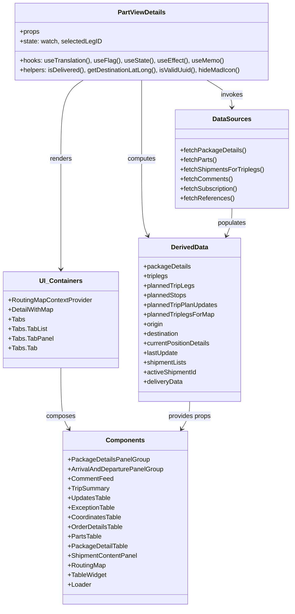

# Diagram: web/portal/src/pages/partview/details/PartView.Details.page.js


> Auto-generated by Obscura crawlers

## Diagram 1



### SVG

<svg id="container" width="725.931640625" xmlns="http://www.w3.org/2000/svg" class="classDiagram" height="1516" viewBox="0 0 725.931640625 1516" role="graphics-document document" aria-roledescription="class"><style>#container{font-family:"trebuchet ms",verdana,arial,sans-serif;font-size:16px;fill:#333;}@keyframes edge-animation-frame{from{stroke-dashoffset:0;}}@keyframes dash{to{stroke-dashoffset:0;}}#container .edge-animation-slow{stroke-dasharray:9,5!important;stroke-dashoffset:900;animation:dash 50s linear infinite;stroke-linecap:round;}#container .edge-animation-fast{stroke-dasharray:9,5!important;stroke-dashoffset:900;animation:dash 20s linear infinite;stroke-linecap:round;}#container .error-icon{fill:#552222;}#container .error-text{fill:#552222;stroke:#552222;}#container .edge-thickness-normal{stroke-width:1px;}#container .edge-thickness-thick{stroke-width:3.5px;}#container .edge-pattern-solid{stroke-dasharray:0;}#container .edge-thickness-invisible{stroke-width:0;fill:none;}#container .edge-pattern-dashed{stroke-dasharray:3;}#container .edge-pattern-dotted{stroke-dasharray:2;}#container .marker{fill:#333333;stroke:#333333;}#container .marker.cross{stroke:#333333;}#container svg{font-family:"trebuchet ms",verdana,arial,sans-serif;font-size:16px;}#container p{margin:0;}#container g.classGroup text{fill:#9370DB;stroke:none;font-family:"trebuchet ms",verdana,arial,sans-serif;font-size:10px;}#container g.classGroup text .title{font-weight:bolder;}#container .nodeLabel,#container .edgeLabel{color:#131300;}#container .edgeLabel .label rect{fill:#ECECFF;}#container .label text{fill:#131300;}#container .labelBkg{background:#ECECFF;}#container .edgeLabel .label span{background:#ECECFF;}#container .classTitle{font-weight:bolder;}#container .node rect,#container .node circle,#container .node ellipse,#container .node polygon,#container .node path{fill:#ECECFF;stroke:#9370DB;stroke-width:1px;}#container .divider{stroke:#9370DB;stroke-width:1;}#container g.clickable{cursor:pointer;}#container g.classGroup rect{fill:#ECECFF;stroke:#9370DB;}#container g.classGroup line{stroke:#9370DB;stroke-width:1;}#container .classLabel .box{stroke:none;stroke-width:0;fill:#ECECFF;opacity:0.5;}#container .classLabel .label{fill:#9370DB;font-size:10px;}#container .relation{stroke:#333333;stroke-width:1;fill:none;}#container .dashed-line{stroke-dasharray:3;}#container .dotted-line{stroke-dasharray:1 2;}#container #compositionStart,#container .composition{fill:#333333!important;stroke:#333333!important;stroke-width:1;}#container #compositionEnd,#container .composition{fill:#333333!important;stroke:#333333!important;stroke-width:1;}#container #dependencyStart,#container .dependency{fill:#333333!important;stroke:#333333!important;stroke-width:1;}#container #dependencyStart,#container .dependency{fill:#333333!important;stroke:#333333!important;stroke-width:1;}#container #extensionStart,#container .extension{fill:transparent!important;stroke:#333333!important;stroke-width:1;}#container #extensionEnd,#container .extension{fill:transparent!important;stroke:#333333!important;stroke-width:1;}#container #aggregationStart,#container .aggregation{fill:transparent!important;stroke:#333333!important;stroke-width:1;}#container #aggregationEnd,#container .aggregation{fill:transparent!important;stroke:#333333!important;stroke-width:1;}#container #lollipopStart,#container .lollipop{fill:#ECECFF!important;stroke:#333333!important;stroke-width:1;}#container #lollipopEnd,#container .lollipop{fill:#ECECFF!important;stroke:#333333!important;stroke-width:1;}#container .edgeTerminals{font-size:11px;line-height:initial;}#container .classTitleText{text-anchor:middle;font-size:18px;fill:#333;}#container .label-icon{display:inline-block;height:1em;overflow:visible;vertical-align:-0.125em;}#container .node .label-icon path{fill:currentColor;stroke:revert;stroke-width:revert;}#container :root{--mermaid-font-family:"trebuchet ms",verdana,arial,sans-serif;}</style><g><defs><marker id="container_class-aggregationStart" class="marker aggregation class" refX="18" refY="7" markerWidth="190" markerHeight="240" orient="auto"><path d="M 18,7 L9,13 L1,7 L9,1 Z"></path></marker></defs><defs><marker id="container_class-aggregationEnd" class="marker aggregation class" refX="1" refY="7" markerWidth="20" markerHeight="28" orient="auto"><path d="M 18,7 L9,13 L1,7 L9,1 Z"></path></marker></defs><defs><marker id="container_class-extensionStart" class="marker extension class" refX="18" refY="7" markerWidth="190" markerHeight="240" orient="auto"><path d="M 1,7 L18,13 V 1 Z"></path></marker></defs><defs><marker id="container_class-extensionEnd" class="marker extension class" refX="1" refY="7" markerWidth="20" markerHeight="28" orient="auto"><path d="M 1,1 V 13 L18,7 Z"></path></marker></defs><defs><marker id="container_class-compositionStart" class="marker composition class" refX="18" refY="7" markerWidth="190" markerHeight="240" orient="auto"><path d="M 18,7 L9,13 L1,7 L9,1 Z"></path></marker></defs><defs><marker id="container_class-compositionEnd" class="marker composition class" refX="1" refY="7" markerWidth="20" markerHeight="28" orient="auto"><path d="M 18,7 L9,13 L1,7 L9,1 Z"></path></marker></defs><defs><marker id="container_class-dependencyStart" class="marker dependency class" refX="6" refY="7" markerWidth="190" markerHeight="240" orient="auto"><path d="M 5,7 L9,13 L1,7 L9,1 Z"></path></marker></defs><defs><marker id="container_class-dependencyEnd" class="marker dependency class" refX="13" refY="7" markerWidth="20" markerHeight="28" orient="auto"><path d="M 18,7 L9,13 L14,7 L9,1 Z"></path></marker></defs><defs><marker id="container_class-lollipopStart" class="marker lollipop class" refX="13" refY="7" markerWidth="190" markerHeight="240" orient="auto"><circle stroke="black" fill="transparent" cx="7" cy="7" r="6"></circle></marker></defs><defs><marker id="container_class-lollipopEnd" class="marker lollipop class" refX="1" refY="7" markerWidth="190" markerHeight="240" orient="auto"><circle stroke="black" fill="transparent" cx="7" cy="7" r="6"></circle></marker></defs><g class="root"><g class="clusters"></g><g class="edgePaths"><path d="M514.872,200L525.281,206.167C535.69,212.333,556.508,224.667,566.917,236C577.326,247.333,577.326,257.667,577.326,262.833L577.326,268" id="id_PartViewDetails_DataSources_1" class="edge-thickness-normal edge-pattern-solid relation" style=";;;" data-edge="true" data-et="edge" data-id="id_PartViewDetails_DataSources_1" data-points="W3sieCI6NTE0Ljg3MTgyODAwNzUxODgsInkiOjIwMH0seyJ4Ijo1NzcuMzI2MTcxODc1LCJ5IjoyMzd9LHsieCI6NTc3LjMyNjE3MTg3NSwieSI6Mjc0fV0=" marker-end="url(#container_class-dependencyEnd)"></path><path d="M352.828,200L352.828,206.167C352.828,212.333,352.828,224.667,352.828,257.5C352.828,290.333,352.828,343.667,352.828,397C352.828,450.333,352.828,503.667,355.429,535.603C358.031,567.54,363.233,578.08,365.835,583.35L368.436,588.62" id="id_PartViewDetails_DerivedData_2" class="edge-thickness-normal edge-pattern-solid relation" style=";;;" data-edge="true" data-et="edge" data-id="id_PartViewDetails_DerivedData_2" data-points="W3sieCI6MzUyLjgyODEyNSwieSI6MjAwfSx7IngiOjM1Mi44MjgxMjUsInkiOjIzN30seyJ4IjozNTIuODI4MTI1LCJ5IjozOTd9LHsieCI6MzUyLjgyODEyNSwieSI6NTU3fSx7IngiOjM3MS4wOTE4MzczOTYyNjU1MywieSI6NTk0fV0=" marker-end="url(#container_class-dependencyEnd)"></path><path d="M206.894,200L197.52,206.167C188.145,212.333,169.397,224.667,160.023,257.5C150.648,290.333,150.648,343.667,150.648,397C150.648,450.333,150.648,503.667,150.648,549.5C150.648,595.333,150.648,633.667,150.648,652.833L150.648,672" id="id_PartViewDetails_UI_Containers_3" class="edge-thickness-normal edge-pattern-solid relation" style=";;;" data-edge="true" data-et="edge" data-id="id_PartViewDetails_UI_Containers_3" data-points="W3sieCI6MjA2Ljg5MzkxNDQ3MzY4NDIyLCJ5IjoyMDB9LHsieCI6MTUwLjY0ODQzNzUsInkiOjIzN30seyJ4IjoxNTAuNjQ4NDM3NSwieSI6Mzk3fSx7IngiOjE1MC42NDg0Mzc1LCJ5Ijo1NTd9LHsieCI6MTUwLjY0ODQzNzUsInkiOjY3OH1d" marker-end="url(#container_class-dependencyEnd)"></path><path d="M150.648,918L150.648,938.167C150.648,958.333,150.648,998.667,154.026,1024.156C157.404,1049.645,164.16,1060.289,167.538,1065.612L170.916,1070.934" id="id_UI_Containers_Components_4" class="edge-thickness-normal edge-pattern-solid relation" style=";;;" data-edge="true" data-et="edge" data-id="id_UI_Containers_Components_4" data-points="W3sieCI6MTUwLjY0ODQzNzUsInkiOjkxOH0seyJ4IjoxNTAuNjQ4NDM3NSwieSI6MTAzOX0seyJ4IjoxNzQuMTMxMDUyMzcxNTQxNSwieSI6MTA3Nn1d" marker-end="url(#container_class-dependencyEnd)"></path><path d="M471.789,1002L471.789,1008.167C471.789,1014.333,471.789,1026.667,468.411,1038.156C465.033,1049.645,458.277,1060.289,454.899,1065.612L451.522,1070.934" id="id_DerivedData_Components_5" class="edge-thickness-normal edge-pattern-solid relation" style=";;;" data-edge="true" data-et="edge" data-id="id_DerivedData_Components_5" data-points="W3sieCI6NDcxLjc4OTA2MjUsInkiOjEwMDJ9LHsieCI6NDcxLjc4OTA2MjUsInkiOjEwMzl9LHsieCI6NDQ4LjMwNjQ0NzYyODQ1ODUsInkiOjEwNzZ9XQ==" marker-end="url(#container_class-dependencyEnd)"></path><path d="M577.326,520L577.326,526.167C577.326,532.333,577.326,544.667,575.027,556.084C572.728,567.501,568.129,578.003,565.83,583.253L563.53,588.504" id="id_DataSources_DerivedData_6" class="edge-thickness-normal edge-pattern-solid relation" style=";;;" data-edge="true" data-et="edge" data-id="id_DataSources_DerivedData_6" data-points="W3sieCI6NTc3LjMyNjE3MTg3NSwieSI6NTIwfSx7IngiOjU3Ny4zMjYxNzE4NzUsInkiOjU1N30seyJ4Ijo1NjEuMTIzMzc5MTQ5Mzc3NiwieSI6NTk0fV0=" marker-end="url(#container_class-dependencyEnd)"></path></g><g class="edgeLabels"><g class="edgeLabel" transform="translate(577.326171875, 237)"><g class="label" data-id="id_PartViewDetails_DataSources_1" transform="translate(-27.5859375, -12)"><foreignObject width="55.171875" height="24"><div xmlns="http://www.w3.org/1999/xhtml" class="labelBkg" style="display: table-cell; white-space: nowrap; line-height: 1.5; max-width: 200px; text-align: center;"><span class="edgeLabel"><p>invokes</p></span></div></foreignObject></g></g><g class="edgeLabel" transform="translate(352.828125, 397)"><g class="label" data-id="id_PartViewDetails_DerivedData_2" transform="translate(-35.46875, -12)"><foreignObject width="70.9375" height="24"><div xmlns="http://www.w3.org/1999/xhtml" class="labelBkg" style="display: table-cell; white-space: nowrap; line-height: 1.5; max-width: 200px; text-align: center;"><span class="edgeLabel"><p>computes</p></span></div></foreignObject></g></g><g class="edgeLabel" transform="translate(150.6484375, 397)"><g class="label" data-id="id_PartViewDetails_UI_Containers_3" transform="translate(-27.75, -12)"><foreignObject width="55.5" height="24"><div xmlns="http://www.w3.org/1999/xhtml" class="labelBkg" style="display: table-cell; white-space: nowrap; line-height: 1.5; max-width: 200px; text-align: center;"><span class="edgeLabel"><p>renders</p></span></div></foreignObject></g></g><g class="edgeLabel" transform="translate(150.6484375, 1039)"><g class="label" data-id="id_UI_Containers_Components_4" transform="translate(-36.453125, -12)"><foreignObject width="72.90625" height="24"><div xmlns="http://www.w3.org/1999/xhtml" class="labelBkg" style="display: table-cell; white-space: nowrap; line-height: 1.5; max-width: 200px; text-align: center;"><span class="edgeLabel"><p>composes</p></span></div></foreignObject></g></g><g class="edgeLabel" transform="translate(471.7890625, 1039)"><g class="label" data-id="id_DerivedData_Components_5" transform="translate(-54.1953125, -12)"><foreignObject width="108.390625" height="24"><div xmlns="http://www.w3.org/1999/xhtml" class="labelBkg" style="display: table-cell; white-space: nowrap; line-height: 1.5; max-width: 200px; text-align: center;"><span class="edgeLabel"><p>provides props</p></span></div></foreignObject></g></g><g class="edgeLabel" transform="translate(577.326171875, 557)"><g class="label" data-id="id_DataSources_DerivedData_6" transform="translate(-36.359375, -12)"><foreignObject width="72.71875" height="24"><div xmlns="http://www.w3.org/1999/xhtml" class="labelBkg" style="display: table-cell; white-space: nowrap; line-height: 1.5; max-width: 200px; text-align: center;"><span class="edgeLabel"><p>populates</p></span></div></foreignObject></g></g></g><g class="nodes"><g class="node default" id="classId-PartViewDetails-0" transform="translate(352.828125, 104)"><g class="basic label-container"><path d="M-318.62109375 -96 L318.62109375 -96 L318.62109375 96 L-318.62109375 96" stroke="none" stroke-width="0" fill="#ECECFF" style=""></path><path d="M-318.62109375 -96 C-110.99499110846534 -96, 96.63111153306932 -96, 318.62109375 -96 M-318.62109375 -96 C-141.20759632848157 -96, 36.20590109303686 -96, 318.62109375 -96 M318.62109375 -96 C318.62109375 -36.0141303751615, 318.62109375 23.971739249677, 318.62109375 96 M318.62109375 -96 C318.62109375 -48.23941500908856, 318.62109375 -0.47883001817712056, 318.62109375 96 M318.62109375 96 C169.13350703149663 96, 19.64592031299327 96, -318.62109375 96 M318.62109375 96 C115.9075859493646 96, -86.8059218512708 96, -318.62109375 96 M-318.62109375 96 C-318.62109375 41.230099241524385, -318.62109375 -13.53980151695123, -318.62109375 -96 M-318.62109375 96 C-318.62109375 46.00532948789551, -318.62109375 -3.989341024208983, -318.62109375 -96" stroke="#9370DB" stroke-width="1.3" fill="none" stroke-dasharray="0 0" style=""></path></g><g class="annotation-group text" transform="translate(0, -72)"></g><g class="label-group text" transform="translate(-57.7890625, -72)"><g class="label" style="font-weight: bolder" transform="translate(0,-12)"><foreignObject width="115.578125" height="24"><div xmlns="http://www.w3.org/1999/xhtml" style="display: table-cell; white-space: nowrap; line-height: 1.5; max-width: 163px; text-align: center;"><span class="nodeLabel markdown-node-label" style=""><p>PartViewDetails</p></span></div></foreignObject></g></g><g class="members-group text" transform="translate(-306.62109375, -24)"><g class="label" style="" transform="translate(0,-12)"><foreignObject width="49.515625" height="24"><div xmlns="http://www.w3.org/1999/xhtml" style="display: table-cell; white-space: nowrap; line-height: 1.5; max-width: 107px; text-align: center;"><span class="nodeLabel markdown-node-label" style=""><p>+props</p></span></div></foreignObject></g><g class="label" style="" transform="translate(0,12)"><foreignObject width="203.421875" height="24"><div xmlns="http://www.w3.org/1999/xhtml" style="display: table-cell; white-space: nowrap; line-height: 1.5; max-width: 261px; text-align: center;"><span class="nodeLabel markdown-node-label" style=""><p>+state: watch, selectedLegID</p></span></div></foreignObject></g></g><g class="methods-group text" transform="translate(-306.62109375, 48)"><g class="label" style="" transform="translate(0,-12)"><foreignObject width="504.359375" height="24"><div xmlns="http://www.w3.org/1999/xhtml" style="display: table-cell; white-space: nowrap; line-height: 1.5; max-width: 562px; text-align: center;"><span class="nodeLabel markdown-node-label" style=""><p>+hooks: useTranslation(), useFlag(), useState(), useEffect(), useMemo()</p></span></div></foreignObject></g><g class="label" style="" transform="translate(0,12)"><foreignObject width="555.453125" height="24"><div xmlns="http://www.w3.org/1999/xhtml" style="display: table-cell; white-space: nowrap; line-height: 1.5; max-width: 613px; text-align: center;"><span class="nodeLabel markdown-node-label" style=""><p>+helpers: isDelivered(), getDestinationLatLong(), isValidUuid(), hideMadIcon()</p></span></div></foreignObject></g></g><g class="divider" style=""><path d="M-318.62109375 -48 C-129.28697748365929 -48, 60.04713878268143 -48, 318.62109375 -48 M-318.62109375 -48 C-93.27071992327546 -48, 132.07965390344907 -48, 318.62109375 -48" stroke="#9370DB" stroke-width="1.3" fill="none" stroke-dasharray="0 0" style=""></path></g><g class="divider" style=""><path d="M-318.62109375 24 C-75.6066179596935 24, 167.407857830613 24, 318.62109375 24 M-318.62109375 24 C-80.74338878203244 24, 157.13431618593512 24, 318.62109375 24" stroke="#9370DB" stroke-width="1.3" fill="none" stroke-dasharray="0 0" style=""></path></g></g><g class="node default" id="classId-DataSources-1" transform="translate(577.326171875, 397)"><g class="basic label-container"><path d="M-140.60546875 -123 L140.60546875 -123 L140.60546875 123 L-140.60546875 123" stroke="none" stroke-width="0" fill="#ECECFF" style=""></path><path d="M-140.60546875 -123 C-68.37964450532154 -123, 3.846179739356927 -123, 140.60546875 -123 M-140.60546875 -123 C-70.90995285675466 -123, -1.2144369635093142 -123, 140.60546875 -123 M140.60546875 -123 C140.60546875 -29.185308753080946, 140.60546875 64.62938249383811, 140.60546875 123 M140.60546875 -123 C140.60546875 -32.69933657589384, 140.60546875 57.601326848212324, 140.60546875 123 M140.60546875 123 C50.4017819830235 123, -39.801904783953006 123, -140.60546875 123 M140.60546875 123 C39.020553223597304 123, -62.56436230280539 123, -140.60546875 123 M-140.60546875 123 C-140.60546875 30.377672876518844, -140.60546875 -62.24465424696231, -140.60546875 -123 M-140.60546875 123 C-140.60546875 32.50943555682707, -140.60546875 -57.98112888634586, -140.60546875 -123" stroke="#9370DB" stroke-width="1.3" fill="none" stroke-dasharray="0 0" style=""></path></g><g class="annotation-group text" transform="translate(0, -99)"></g><g class="label-group text" transform="translate(-45.6328125, -99)"><g class="label" style="font-weight: bolder" transform="translate(0,-12)"><foreignObject width="91.265625" height="24"><div xmlns="http://www.w3.org/1999/xhtml" style="display: table-cell; white-space: nowrap; line-height: 1.5; max-width: 140px; text-align: center;"><span class="nodeLabel markdown-node-label" style=""><p>DataSources</p></span></div></foreignObject></g></g><g class="members-group text" transform="translate(-128.60546875, -51)"></g><g class="methods-group text" transform="translate(-128.60546875, -21)"><g class="label" style="" transform="translate(0,-12)"><foreignObject width="162.71875" height="24"><div xmlns="http://www.w3.org/1999/xhtml" style="display: table-cell; white-space: nowrap; line-height: 1.5; max-width: 220px; text-align: center;"><span class="nodeLabel markdown-node-label" style=""><p>+fetchPackageDetails()</p></span></div></foreignObject></g><g class="label" style="" transform="translate(0,12)"><foreignObject width="91.140625" height="24"><div xmlns="http://www.w3.org/1999/xhtml" style="display: table-cell; white-space: nowrap; line-height: 1.5; max-width: 149px; text-align: center;"><span class="nodeLabel markdown-node-label" style=""><p>+fetchParts()</p></span></div></foreignObject></g><g class="label" style="" transform="translate(0,36)"><foreignObject width="211.578125" height="24"><div xmlns="http://www.w3.org/1999/xhtml" style="display: table-cell; white-space: nowrap; line-height: 1.5; max-width: 269px; text-align: center;"><span class="nodeLabel markdown-node-label" style=""><p>+fetchShipmentsForTriplegs()</p></span></div></foreignObject></g><g class="label" style="" transform="translate(0,60)"><foreignObject width="131.359375" height="24"><div xmlns="http://www.w3.org/1999/xhtml" style="display: table-cell; white-space: nowrap; line-height: 1.5; max-width: 189px; text-align: center;"><span class="nodeLabel markdown-node-label" style=""><p>+fetchComments()</p></span></div></foreignObject></g><g class="label" style="" transform="translate(0,84)"><foreignObject width="146.453125" height="24"><div xmlns="http://www.w3.org/1999/xhtml" style="display: table-cell; white-space: nowrap; line-height: 1.5; max-width: 204px; text-align: center;"><span class="nodeLabel markdown-node-label" style=""><p>+fetchSubscription()</p></span></div></foreignObject></g><g class="label" style="" transform="translate(0,108)"><foreignObject width="133.984375" height="24"><div xmlns="http://www.w3.org/1999/xhtml" style="display: table-cell; white-space: nowrap; line-height: 1.5; max-width: 191px; text-align: center;"><span class="nodeLabel markdown-node-label" style=""><p>+fetchReferences()</p></span></div></foreignObject></g></g><g class="divider" style=""><path d="M-140.60546875 -75 C-46.53171377186567 -75, 47.542041206268664 -75, 140.60546875 -75 M-140.60546875 -75 C-45.72171208534414 -75, 49.162044579311726 -75, 140.60546875 -75" stroke="#9370DB" stroke-width="1.3" fill="none" stroke-dasharray="0 0" style=""></path></g><g class="divider" style=""><path d="M-140.60546875 -51 C-70.94233907707195 -51, -1.2792094041438986 -51, 140.60546875 -51 M-140.60546875 -51 C-69.48825928092268 -51, 1.628950188154647 -51, 140.60546875 -51" stroke="#9370DB" stroke-width="1.3" fill="none" stroke-dasharray="0 0" style=""></path></g></g><g class="node default" id="classId-DerivedData-2" transform="translate(471.7890625, 798)"><g class="basic label-container"><path d="M-128.4921875 -204 L128.4921875 -204 L128.4921875 204 L-128.4921875 204" stroke="none" stroke-width="0" fill="#ECECFF" style=""></path><path d="M-128.4921875 -204 C-52.244058462933594 -204, 24.00407057413281 -204, 128.4921875 -204 M-128.4921875 -204 C-27.113347433585076 -204, 74.26549263282985 -204, 128.4921875 -204 M128.4921875 -204 C128.4921875 -60.00376037148936, 128.4921875 83.99247925702127, 128.4921875 204 M128.4921875 -204 C128.4921875 -50.008165397981145, 128.4921875 103.98366920403771, 128.4921875 204 M128.4921875 204 C66.19210610929119 204, 3.892024718582377 204, -128.4921875 204 M128.4921875 204 C46.470613296023274 204, -35.55096090795345 204, -128.4921875 204 M-128.4921875 204 C-128.4921875 43.46802975110697, -128.4921875 -117.06394049778606, -128.4921875 -204 M-128.4921875 204 C-128.4921875 90.00465473863474, -128.4921875 -23.990690522730517, -128.4921875 -204" stroke="#9370DB" stroke-width="1.3" fill="none" stroke-dasharray="0 0" style=""></path></g><g class="annotation-group text" transform="translate(0, -180)"></g><g class="label-group text" transform="translate(-45.234375, -180)"><g class="label" style="font-weight: bolder" transform="translate(0,-12)"><foreignObject width="90.46875" height="24"><div xmlns="http://www.w3.org/1999/xhtml" style="display: table-cell; white-space: nowrap; line-height: 1.5; max-width: 139px; text-align: center;"><span class="nodeLabel markdown-node-label" style=""><p>DerivedData</p></span></div></foreignObject></g></g><g class="members-group text" transform="translate(-116.4921875, -132)"><g class="label" style="" transform="translate(0,-12)"><foreignObject width="117.03125" height="24"><div xmlns="http://www.w3.org/1999/xhtml" style="display: table-cell; white-space: nowrap; line-height: 1.5; max-width: 174px; text-align: center;"><span class="nodeLabel markdown-node-label" style=""><p>+packageDetails</p></span></div></foreignObject></g><g class="label" style="" transform="translate(0,12)"><foreignObject width="62.890625" height="24"><div xmlns="http://www.w3.org/1999/xhtml" style="display: table-cell; white-space: nowrap; line-height: 1.5; max-width: 120px; text-align: center;"><span class="nodeLabel markdown-node-label" style=""><p>+triplegs</p></span></div></foreignObject></g><g class="label" style="" transform="translate(0,36)"><foreignObject width="127.796875" height="24"><div xmlns="http://www.w3.org/1999/xhtml" style="display: table-cell; white-space: nowrap; line-height: 1.5; max-width: 185px; text-align: center;"><span class="nodeLabel markdown-node-label" style=""><p>+plannedTripLegs</p></span></div></foreignObject></g><g class="label" style="" transform="translate(0,60)"><foreignObject width="108.421875" height="24"><div xmlns="http://www.w3.org/1999/xhtml" style="display: table-cell; white-space: nowrap; line-height: 1.5; max-width: 166px; text-align: center;"><span class="nodeLabel markdown-node-label" style=""><p>+plannedStops</p></span></div></foreignObject></g><g class="label" style="" transform="translate(0,84)"><foreignObject width="187.75" height="24"><div xmlns="http://www.w3.org/1999/xhtml" style="display: table-cell; white-space: nowrap; line-height: 1.5; max-width: 245px; text-align: center;"><span class="nodeLabel markdown-node-label" style=""><p>+plannedTripPlanUpdates</p></span></div></foreignObject></g><g class="label" style="" transform="translate(0,108)"><foreignObject width="178.3125" height="24"><div xmlns="http://www.w3.org/1999/xhtml" style="display: table-cell; white-space: nowrap; line-height: 1.5; max-width: 236px; text-align: center;"><span class="nodeLabel markdown-node-label" style=""><p>+plannedTriplegsForMap</p></span></div></foreignObject></g><g class="label" style="" transform="translate(0,132)"><foreignObject width="50.234375" height="24"><div xmlns="http://www.w3.org/1999/xhtml" style="display: table-cell; white-space: nowrap; line-height: 1.5; max-width: 108px; text-align: center;"><span class="nodeLabel markdown-node-label" style=""><p>+origin</p></span></div></foreignObject></g><g class="label" style="" transform="translate(0,156)"><foreignObject width="91.125" height="24"><div xmlns="http://www.w3.org/1999/xhtml" style="display: table-cell; white-space: nowrap; line-height: 1.5; max-width: 148px; text-align: center;"><span class="nodeLabel markdown-node-label" style=""><p>+destination</p></span></div></foreignObject></g><g class="label" style="" transform="translate(0,180)"><foreignObject width="169.75" height="24"><div xmlns="http://www.w3.org/1999/xhtml" style="display: table-cell; white-space: nowrap; line-height: 1.5; max-width: 227px; text-align: center;"><span class="nodeLabel markdown-node-label" style=""><p>+currentPositionDetails</p></span></div></foreignObject></g><g class="label" style="" transform="translate(0,204)"><foreignObject width="87.015625" height="24"><div xmlns="http://www.w3.org/1999/xhtml" style="display: table-cell; white-space: nowrap; line-height: 1.5; max-width: 144px; text-align: center;"><span class="nodeLabel markdown-node-label" style=""><p>+lastUpdate</p></span></div></foreignObject></g><g class="label" style="" transform="translate(0,228)"><foreignObject width="109.640625" height="24"><div xmlns="http://www.w3.org/1999/xhtml" style="display: table-cell; white-space: nowrap; line-height: 1.5; max-width: 167px; text-align: center;"><span class="nodeLabel markdown-node-label" style=""><p>+shipmentLists</p></span></div></foreignObject></g><g class="label" style="" transform="translate(0,252)"><foreignObject width="134.90625" height="24"><div xmlns="http://www.w3.org/1999/xhtml" style="display: table-cell; white-space: nowrap; line-height: 1.5; max-width: 192px; text-align: center;"><span class="nodeLabel markdown-node-label" style=""><p>+activeShipmentId</p></span></div></foreignObject></g><g class="label" style="" transform="translate(0,276)"><foreignObject width="99.265625" height="24"><div xmlns="http://www.w3.org/1999/xhtml" style="display: table-cell; white-space: nowrap; line-height: 1.5; max-width: 157px; text-align: center;"><span class="nodeLabel markdown-node-label" style=""><p>+deliveryData</p></span></div></foreignObject></g></g><g class="methods-group text" transform="translate(-116.4921875, 204)"></g><g class="divider" style=""><path d="M-128.4921875 -156 C-60.34205523687929 -156, 7.8080770262414205 -156, 128.4921875 -156 M-128.4921875 -156 C-67.87628404600662 -156, -7.260380592013249 -156, 128.4921875 -156" stroke="#9370DB" stroke-width="1.3" fill="none" stroke-dasharray="0 0" style=""></path></g><g class="divider" style=""><path d="M-128.4921875 180 C-33.391761080361135 180, 61.70866533927773 180, 128.4921875 180 M-128.4921875 180 C-60.38863191486553 180, 7.714923670268945 180, 128.4921875 180" stroke="#9370DB" stroke-width="1.3" fill="none" stroke-dasharray="0 0" style=""></path></g></g><g class="node default" id="classId-UI_Containers-3" transform="translate(150.6484375, 798)"><g class="basic label-container"><path d="M-142.6484375 -120 L142.6484375 -120 L142.6484375 120 L-142.6484375 120" stroke="none" stroke-width="0" fill="#ECECFF" style=""></path><path d="M-142.6484375 -120 C-76.4986120612202 -120, -10.3487866224404 -120, 142.6484375 -120 M-142.6484375 -120 C-53.94083651941959 -120, 34.76676446116082 -120, 142.6484375 -120 M142.6484375 -120 C142.6484375 -45.201562139053834, 142.6484375 29.59687572189233, 142.6484375 120 M142.6484375 -120 C142.6484375 -29.709791954925365, 142.6484375 60.58041609014927, 142.6484375 120 M142.6484375 120 C73.27384173362864 120, 3.8992459672572863 120, -142.6484375 120 M142.6484375 120 C47.967971589522705 120, -46.71249432095459 120, -142.6484375 120 M-142.6484375 120 C-142.6484375 32.731850453925674, -142.6484375 -54.53629909214865, -142.6484375 -120 M-142.6484375 120 C-142.6484375 39.70231241635291, -142.6484375 -40.59537516729418, -142.6484375 -120" stroke="#9370DB" stroke-width="1.3" fill="none" stroke-dasharray="0 0" style=""></path></g><g class="annotation-group text" transform="translate(0, -96)"></g><g class="label-group text" transform="translate(-50.765625, -96)"><g class="label" style="font-weight: bolder" transform="translate(0,-12)"><foreignObject width="101.53125" height="24"><div xmlns="http://www.w3.org/1999/xhtml" style="display: table-cell; white-space: nowrap; line-height: 1.5; max-width: 151px; text-align: center;"><span class="nodeLabel markdown-node-label" style=""><p>UI_Containers</p></span></div></foreignObject></g></g><g class="members-group text" transform="translate(-130.6484375, -48)"><g class="label" style="" transform="translate(0,-12)"><foreignObject width="210.53125" height="24"><div xmlns="http://www.w3.org/1999/xhtml" style="display: table-cell; white-space: nowrap; line-height: 1.5; max-width: 269px; text-align: center;"><span class="nodeLabel markdown-node-label" style=""><p>+RoutingMapContextProvider</p></span></div></foreignObject></g><g class="label" style="" transform="translate(0,12)"><foreignObject width="114.125" height="24"><div xmlns="http://www.w3.org/1999/xhtml" style="display: table-cell; white-space: nowrap; line-height: 1.5; max-width: 171px; text-align: center;"><span class="nodeLabel markdown-node-label" style=""><p>+DetailWithMap</p></span></div></foreignObject></g><g class="label" style="" transform="translate(0,36)"><foreignObject width="40.34375" height="24"><div xmlns="http://www.w3.org/1999/xhtml" style="display: table-cell; white-space: nowrap; line-height: 1.5; max-width: 98px; text-align: center;"><span class="nodeLabel markdown-node-label" style=""><p>+Tabs</p></span></div></foreignObject></g><g class="label" style="" transform="translate(0,60)"><foreignObject width="94.625" height="24"><div xmlns="http://www.w3.org/1999/xhtml" style="display: table-cell; white-space: nowrap; line-height: 1.5; max-width: 152px; text-align: center;"><span class="nodeLabel markdown-node-label" style=""><p>+Tabs.TabList</p></span></div></foreignObject></g><g class="label" style="" transform="translate(0,84)"><foreignObject width="108.8125" height="24"><div xmlns="http://www.w3.org/1999/xhtml" style="display: table-cell; white-space: nowrap; line-height: 1.5; max-width: 166px; text-align: center;"><span class="nodeLabel markdown-node-label" style=""><p>+Tabs.TabPanel</p></span></div></foreignObject></g><g class="label" style="" transform="translate(0,108)"><foreignObject width="68.90625" height="24"><div xmlns="http://www.w3.org/1999/xhtml" style="display: table-cell; white-space: nowrap; line-height: 1.5; max-width: 126px; text-align: center;"><span class="nodeLabel markdown-node-label" style=""><p>+Tabs.Tab</p></span></div></foreignObject></g></g><g class="methods-group text" transform="translate(-130.6484375, 120)"></g><g class="divider" style=""><path d="M-142.6484375 -72 C-33.99730861905638 -72, 74.65382026188723 -72, 142.6484375 -72 M-142.6484375 -72 C-76.39036390790298 -72, -10.13229031580596 -72, 142.6484375 -72" stroke="#9370DB" stroke-width="1.3" fill="none" stroke-dasharray="0 0" style=""></path></g><g class="divider" style=""><path d="M-142.6484375 96 C-55.527232557920556 96, 31.59397238415889 96, 142.6484375 96 M-142.6484375 96 C-67.05207458156896 96, 8.544288336862081 96, 142.6484375 96" stroke="#9370DB" stroke-width="1.3" fill="none" stroke-dasharray="0 0" style=""></path></g></g><g class="node default" id="classId-Components-4" transform="translate(311.21875, 1292)"><g class="basic label-container"><path d="M-154.6796875 -216 L154.6796875 -216 L154.6796875 216 L-154.6796875 216" stroke="none" stroke-width="0" fill="#ECECFF" style=""></path><path d="M-154.6796875 -216 C-77.96003651915242 -216, -1.2403855383048494 -216, 154.6796875 -216 M-154.6796875 -216 C-53.11262597347809 -216, 48.45443555304382 -216, 154.6796875 -216 M154.6796875 -216 C154.6796875 -73.73611685806429, 154.6796875 68.52776628387141, 154.6796875 216 M154.6796875 -216 C154.6796875 -89.82384814815167, 154.6796875 36.35230370369666, 154.6796875 216 M154.6796875 216 C70.48748370102071 216, -13.704720097958585 216, -154.6796875 216 M154.6796875 216 C77.79909537587552 216, 0.9185032517510479 216, -154.6796875 216 M-154.6796875 216 C-154.6796875 109.73295308634333, -154.6796875 3.4659061726866582, -154.6796875 -216 M-154.6796875 216 C-154.6796875 50.051543878563876, -154.6796875 -115.89691224287225, -154.6796875 -216" stroke="#9370DB" stroke-width="1.3" fill="none" stroke-dasharray="0 0" style=""></path></g><g class="annotation-group text" transform="translate(0, -192)"></g><g class="label-group text" transform="translate(-45.921875, -192)"><g class="label" style="font-weight: bolder" transform="translate(0,-12)"><foreignObject width="91.84375" height="24"><div xmlns="http://www.w3.org/1999/xhtml" style="display: table-cell; white-space: nowrap; line-height: 1.5; max-width: 141px; text-align: center;"><span class="nodeLabel markdown-node-label" style=""><p>Components</p></span></div></foreignObject></g></g><g class="members-group text" transform="translate(-142.6796875, -144)"><g class="label" style="" transform="translate(0,-12)"><foreignObject width="199.953125" height="24"><div xmlns="http://www.w3.org/1999/xhtml" style="display: table-cell; white-space: nowrap; line-height: 1.5; max-width: 257px; text-align: center;"><span class="nodeLabel markdown-node-label" style=""><p>+PackageDetailsPanelGroup</p></span></div></foreignObject></g><g class="label" style="" transform="translate(0,12)"><foreignObject width="239.4375" height="24"><div xmlns="http://www.w3.org/1999/xhtml" style="display: table-cell; white-space: nowrap; line-height: 1.5; max-width: 297px; text-align: center;"><span class="nodeLabel markdown-node-label" style=""><p>+ArrivalAndDeparturePanelGroup</p></span></div></foreignObject></g><g class="label" style="" transform="translate(0,36)"><foreignObject width="111.578125" height="24"><div xmlns="http://www.w3.org/1999/xhtml" style="display: table-cell; white-space: nowrap; line-height: 1.5; max-width: 169px; text-align: center;"><span class="nodeLabel markdown-node-label" style=""><p>+CommentFeed</p></span></div></foreignObject></g><g class="label" style="" transform="translate(0,60)"><foreignObject width="103.390625" height="24"><div xmlns="http://www.w3.org/1999/xhtml" style="display: table-cell; white-space: nowrap; line-height: 1.5; max-width: 161px; text-align: center;"><span class="nodeLabel markdown-node-label" style=""><p>+TripSummary</p></span></div></foreignObject></g><g class="label" style="" transform="translate(0,84)"><foreignObject width="107.09375" height="24"><div xmlns="http://www.w3.org/1999/xhtml" style="display: table-cell; white-space: nowrap; line-height: 1.5; max-width: 164px; text-align: center;"><span class="nodeLabel markdown-node-label" style=""><p>+UpdatesTable</p></span></div></foreignObject></g><g class="label" style="" transform="translate(0,108)"><foreignObject width="117.734375" height="24"><div xmlns="http://www.w3.org/1999/xhtml" style="display: table-cell; white-space: nowrap; line-height: 1.5; max-width: 175px; text-align: center;"><span class="nodeLabel markdown-node-label" style=""><p>+ExceptionTable</p></span></div></foreignObject></g><g class="label" style="" transform="translate(0,132)"><foreignObject width="133.90625" height="24"><div xmlns="http://www.w3.org/1999/xhtml" style="display: table-cell; white-space: nowrap; line-height: 1.5; max-width: 191px; text-align: center;"><span class="nodeLabel markdown-node-label" style=""><p>+CoordinatesTable</p></span></div></foreignObject></g><g class="label" style="" transform="translate(0,156)"><foreignObject width="138.296875" height="24"><div xmlns="http://www.w3.org/1999/xhtml" style="display: table-cell; white-space: nowrap; line-height: 1.5; max-width: 196px; text-align: center;"><span class="nodeLabel markdown-node-label" style=""><p>+OrderDetailsTable</p></span></div></foreignObject></g><g class="label" style="" transform="translate(0,180)"><foreignObject width="83.546875" height="24"><div xmlns="http://www.w3.org/1999/xhtml" style="display: table-cell; white-space: nowrap; line-height: 1.5; max-width: 141px; text-align: center;"><span class="nodeLabel markdown-node-label" style=""><p>+PartsTable</p></span></div></foreignObject></g><g class="label" style="" transform="translate(0,204)"><foreignObject width="147.640625" height="24"><div xmlns="http://www.w3.org/1999/xhtml" style="display: table-cell; white-space: nowrap; line-height: 1.5; max-width: 205px; text-align: center;"><span class="nodeLabel markdown-node-label" style=""><p>+PackageDetailTable</p></span></div></foreignObject></g><g class="label" style="" transform="translate(0,228)"><foreignObject width="173.71875" height="24"><div xmlns="http://www.w3.org/1999/xhtml" style="display: table-cell; white-space: nowrap; line-height: 1.5; max-width: 231px; text-align: center;"><span class="nodeLabel markdown-node-label" style=""><p>+ShipmentContentPanel</p></span></div></foreignObject></g><g class="label" style="" transform="translate(0,252)"><foreignObject width="94.734375" height="24"><div xmlns="http://www.w3.org/1999/xhtml" style="display: table-cell; white-space: nowrap; line-height: 1.5; max-width: 152px; text-align: center;"><span class="nodeLabel markdown-node-label" style=""><p>+RoutingMap</p></span></div></foreignObject></g><g class="label" style="" transform="translate(0,276)"><foreignObject width="96.0625" height="24"><div xmlns="http://www.w3.org/1999/xhtml" style="display: table-cell; white-space: nowrap; line-height: 1.5; max-width: 154px; text-align: center;"><span class="nodeLabel markdown-node-label" style=""><p>+TableWidget</p></span></div></foreignObject></g><g class="label" style="" transform="translate(0,300)"><foreignObject width="57.90625" height="24"><div xmlns="http://www.w3.org/1999/xhtml" style="display: table-cell; white-space: nowrap; line-height: 1.5; max-width: 116px; text-align: center;"><span class="nodeLabel markdown-node-label" style=""><p>+Loader</p></span></div></foreignObject></g></g><g class="methods-group text" transform="translate(-142.6796875, 216)"></g><g class="divider" style=""><path d="M-154.6796875 -168 C-35.83300763361797 -168, 83.01367223276407 -168, 154.6796875 -168 M-154.6796875 -168 C-61.83534266293738 -168, 31.009002174125243 -168, 154.6796875 -168" stroke="#9370DB" stroke-width="1.3" fill="none" stroke-dasharray="0 0" style=""></path></g><g class="divider" style=""><path d="M-154.6796875 192 C-78.25048610034334 192, -1.8212847006866753 192, 154.6796875 192 M-154.6796875 192 C-45.93276749145508 192, 62.81415251708984 192, 154.6796875 192" stroke="#9370DB" stroke-width="1.3" fill="none" stroke-dasharray="0 0" style=""></path></g></g></g></g></g></svg>

## Diagram 2

```mermaid
flowchart LR
  subgraph Fetching
    A1[fetchPackageDetails(trackingNumber)]
    A2[fetchParts(trackingNumber)]
    A3[fetchShipmentsForTriplegs(packageDetails.data)]
    A4[fetchSubscription(packageDetails.data)]
    A5[fetchReferences(trackingNumberUUID)]
  end
  subgraph State
    B1[packageDetails]
    B2[parts]
    B3[shipmentsForTriplegs]
    B4[subscription]
    B5[references]
  end
  subgraph Derivations
    C1[plannedTripLegs = getFilteredTriplegsByType(triplegs,"planned")]
    C2[plannedStops / plannedTripPlanUpdates = useTripPlanAndUpdates]
    C3[plannedTriplegsForMap = useTransformPlannedTripleg]
    C4[origin = transformLocation(...)]
    C5[destination = transformLocation(...)]
    C6[currentPositionDetails / lastUpdate]
    C7[shipmentNumbers / loadCode]
    C8[deliveryData (computed)]
  end
  subgraph UI
    D1[Tabs -> End-to-End Tab]
    D2[PackageDetailsPanelGroup]
    D3[ArrivalAndDeparturePanelGroup]
    D4[CommentFeed]
    D5[Detail Tabs -> Trip Plan / Updates / Exceptions / Coordinates / Orders / Parts / Package Details]
    D6[RoutingMapContextProvider -> DetailWithMap -> RoutingMap]
    D7[ShipmentContentPanel(s)]
  end
  A1 --> B1
  A2 --> B2
  A3 --> B3
  A4 --> B4
  A5 --> B5
  B1 --> C1
  B1 --> C2
  B1 --> C3
  C3 --> C6
  C1 --> C7
  C2 --> C6
  C4 --> D3
  C5 --> D3
  C6 --> D2
  C7 --> D5
  C8 --> D2
  B3 --> D7
  D1 --> D2
  D2 --> D6
  D6 --> D1
```

> SVG rendering failed for this diagram.
