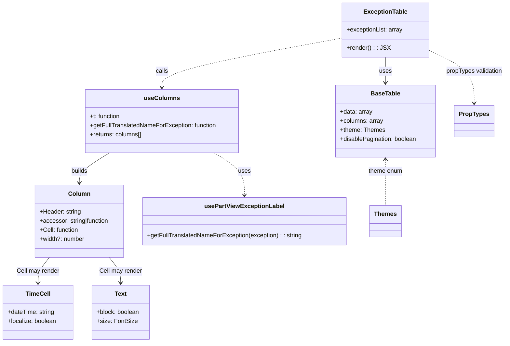

# Diagram: web/portal/src/pages/partview/details/components/organisms/ExceptionTable.organism.js


> Auto-generated by Obscura crawlers

## Diagram 1



### SVG

<svg id="container" width="1338.08203125" xmlns="http://www.w3.org/2000/svg" class="classDiagram" height="910" viewBox="0 0 1338.08203125 910" role="graphics-document document" aria-roledescription="class"><style>#container{font-family:"trebuchet ms",verdana,arial,sans-serif;font-size:16px;fill:#333;}@keyframes edge-animation-frame{from{stroke-dashoffset:0;}}@keyframes dash{to{stroke-dashoffset:0;}}#container .edge-animation-slow{stroke-dasharray:9,5!important;stroke-dashoffset:900;animation:dash 50s linear infinite;stroke-linecap:round;}#container .edge-animation-fast{stroke-dasharray:9,5!important;stroke-dashoffset:900;animation:dash 20s linear infinite;stroke-linecap:round;}#container .error-icon{fill:#552222;}#container .error-text{fill:#552222;stroke:#552222;}#container .edge-thickness-normal{stroke-width:1px;}#container .edge-thickness-thick{stroke-width:3.5px;}#container .edge-pattern-solid{stroke-dasharray:0;}#container .edge-thickness-invisible{stroke-width:0;fill:none;}#container .edge-pattern-dashed{stroke-dasharray:3;}#container .edge-pattern-dotted{stroke-dasharray:2;}#container .marker{fill:#333333;stroke:#333333;}#container .marker.cross{stroke:#333333;}#container svg{font-family:"trebuchet ms",verdana,arial,sans-serif;font-size:16px;}#container p{margin:0;}#container g.classGroup text{fill:#9370DB;stroke:none;font-family:"trebuchet ms",verdana,arial,sans-serif;font-size:10px;}#container g.classGroup text .title{font-weight:bolder;}#container .nodeLabel,#container .edgeLabel{color:#131300;}#container .edgeLabel .label rect{fill:#ECECFF;}#container .label text{fill:#131300;}#container .labelBkg{background:#ECECFF;}#container .edgeLabel .label span{background:#ECECFF;}#container .classTitle{font-weight:bolder;}#container .node rect,#container .node circle,#container .node ellipse,#container .node polygon,#container .node path{fill:#ECECFF;stroke:#9370DB;stroke-width:1px;}#container .divider{stroke:#9370DB;stroke-width:1;}#container g.clickable{cursor:pointer;}#container g.classGroup rect{fill:#ECECFF;stroke:#9370DB;}#container g.classGroup line{stroke:#9370DB;stroke-width:1;}#container .classLabel .box{stroke:none;stroke-width:0;fill:#ECECFF;opacity:0.5;}#container .classLabel .label{fill:#9370DB;font-size:10px;}#container .relation{stroke:#333333;stroke-width:1;fill:none;}#container .dashed-line{stroke-dasharray:3;}#container .dotted-line{stroke-dasharray:1 2;}#container #compositionStart,#container .composition{fill:#333333!important;stroke:#333333!important;stroke-width:1;}#container #compositionEnd,#container .composition{fill:#333333!important;stroke:#333333!important;stroke-width:1;}#container #dependencyStart,#container .dependency{fill:#333333!important;stroke:#333333!important;stroke-width:1;}#container #dependencyStart,#container .dependency{fill:#333333!important;stroke:#333333!important;stroke-width:1;}#container #extensionStart,#container .extension{fill:transparent!important;stroke:#333333!important;stroke-width:1;}#container #extensionEnd,#container .extension{fill:transparent!important;stroke:#333333!important;stroke-width:1;}#container #aggregationStart,#container .aggregation{fill:transparent!important;stroke:#333333!important;stroke-width:1;}#container #aggregationEnd,#container .aggregation{fill:transparent!important;stroke:#333333!important;stroke-width:1;}#container #lollipopStart,#container .lollipop{fill:#ECECFF!important;stroke:#333333!important;stroke-width:1;}#container #lollipopEnd,#container .lollipop{fill:#ECECFF!important;stroke:#333333!important;stroke-width:1;}#container .edgeTerminals{font-size:11px;line-height:initial;}#container .classTitleText{text-anchor:middle;font-size:18px;fill:#333;}#container .label-icon{display:inline-block;height:1em;overflow:visible;vertical-align:-0.125em;}#container .node .label-icon path{fill:currentColor;stroke:revert;stroke-width:revert;}#container :root{--mermaid-font-family:"trebuchet ms",verdana,arial,sans-serif;}</style><g><defs><marker id="container_class-aggregationStart" class="marker aggregation class" refX="18" refY="7" markerWidth="190" markerHeight="240" orient="auto"><path d="M 18,7 L9,13 L1,7 L9,1 Z"></path></marker></defs><defs><marker id="container_class-aggregationEnd" class="marker aggregation class" refX="1" refY="7" markerWidth="20" markerHeight="28" orient="auto"><path d="M 18,7 L9,13 L1,7 L9,1 Z"></path></marker></defs><defs><marker id="container_class-extensionStart" class="marker extension class" refX="18" refY="7" markerWidth="190" markerHeight="240" orient="auto"><path d="M 1,7 L18,13 V 1 Z"></path></marker></defs><defs><marker id="container_class-extensionEnd" class="marker extension class" refX="1" refY="7" markerWidth="20" markerHeight="28" orient="auto"><path d="M 1,1 V 13 L18,7 Z"></path></marker></defs><defs><marker id="container_class-compositionStart" class="marker composition class" refX="18" refY="7" markerWidth="190" markerHeight="240" orient="auto"><path d="M 18,7 L9,13 L1,7 L9,1 Z"></path></marker></defs><defs><marker id="container_class-compositionEnd" class="marker composition class" refX="1" refY="7" markerWidth="20" markerHeight="28" orient="auto"><path d="M 18,7 L9,13 L1,7 L9,1 Z"></path></marker></defs><defs><marker id="container_class-dependencyStart" class="marker dependency class" refX="6" refY="7" markerWidth="190" markerHeight="240" orient="auto"><path d="M 5,7 L9,13 L1,7 L9,1 Z"></path></marker></defs><defs><marker id="container_class-dependencyEnd" class="marker dependency class" refX="13" refY="7" markerWidth="20" markerHeight="28" orient="auto"><path d="M 18,7 L9,13 L14,7 L9,1 Z"></path></marker></defs><defs><marker id="container_class-lollipopStart" class="marker lollipop class" refX="13" refY="7" markerWidth="190" markerHeight="240" orient="auto"><circle stroke="black" fill="transparent" cx="7" cy="7" r="6"></circle></marker></defs><defs><marker id="container_class-lollipopEnd" class="marker lollipop class" refX="1" refY="7" markerWidth="190" markerHeight="240" orient="auto"><circle stroke="black" fill="transparent" cx="7" cy="7" r="6"></circle></marker></defs><g class="root"><g class="clusters"></g><g class="edgePaths"><path d="M1020.418,152L1020.418,158.167C1020.418,164.333,1020.418,176.667,1020.418,188C1020.418,199.333,1020.418,209.667,1020.418,214.833L1020.418,220" id="id_ExceptionTable_BaseTable_1" class="edge-thickness-normal edge-pattern-solid relation" style=";;;" data-edge="true" data-et="edge" data-id="id_ExceptionTable_BaseTable_1" data-points="W3sieCI6MTAyMC40MTc5Njg3NSwieSI6MTUyfSx7IngiOjEwMjAuNDE3OTY4NzUsInkiOjE4OX0seyJ4IjoxMDIwLjQxNzk2ODc1LCJ5IjoyMjZ9XQ==" marker-end="url(#container_class-dependencyEnd)"></path><path d="M905.926,101.12L826.523,115.766C747.121,130.413,588.316,159.707,508.914,181.52C429.512,203.333,429.512,217.667,429.512,224.833L429.512,232" id="id_ExceptionTable_useColumns_2" class="edge-thickness-normal edge-pattern-dashed relation" style=";;;" data-edge="true" data-et="edge" data-id="id_ExceptionTable_useColumns_2" data-points="W3sieCI6OTA1LjkyNTc4MTI1LCJ5IjoxMDEuMTE5NTA2NTg0MTY2Mjd9LHsieCI6NDI5LjUxMTcxODc1LCJ5IjoxODl9LHsieCI6NDI5LjUxMTcxODc1LCJ5IjoyMzh9XQ==" marker-end="url(#container_class-dependencyEnd)"></path><path d="M291.386,406L277.957,414.167C264.528,422.333,237.67,438.667,224.241,452C210.813,465.333,210.813,475.667,210.813,480.833L210.813,486" id="id_useColumns_Column_3" class="edge-thickness-normal edge-pattern-solid relation" style=";;;" data-edge="true" data-et="edge" data-id="id_useColumns_Column_3" data-points="W3sieCI6MjkxLjM4NTg5NjM4MTU3ODk2LCJ5Ijo0MDZ9LHsieCI6MjEwLjgxMjUsInkiOjQ1NX0seyJ4IjoyMTAuODEyNSwieSI6NDkyfV0=" marker-end="url(#container_class-dependencyEnd)"></path><path d="M131.428,684L126.329,690.167C121.229,696.333,111.031,708.667,105.931,720C100.832,731.333,100.832,741.667,100.832,746.833L100.832,752" id="id_Column_TimeCell_4" class="edge-thickness-normal edge-pattern-solid relation" style=";;;" data-edge="true" data-et="edge" data-id="id_Column_TimeCell_4" data-points="W3sieCI6MTMxLjQyODEwMTUwMzc1OTQsInkiOjY4NH0seyJ4IjoxMDAuODMyMDMxMjUsInkiOjcyMX0seyJ4IjoxMDAuODMyMDMxMjUsInkiOjc1OH1d" marker-end="url(#container_class-dependencyEnd)"></path><path d="M290.197,684L295.296,690.167C300.396,696.333,310.594,708.667,315.694,720C320.793,731.333,320.793,741.667,320.793,746.833L320.793,752" id="id_Column_Text_5" class="edge-thickness-normal edge-pattern-solid relation" style=";;;" data-edge="true" data-et="edge" data-id="id_Column_Text_5" data-points="W3sieCI6MjkwLjE5Njg5ODQ5NjI0MDYsInkiOjY4NH0seyJ4IjozMjAuNzkyOTY4NzUsInkiOjcyMX0seyJ4IjozMjAuNzkyOTY4NzUsInkiOjc1OH1d" marker-end="url(#container_class-dependencyEnd)"></path><path d="M567.638,406L581.066,414.167C594.495,422.333,621.353,438.667,634.782,457.5C648.211,476.333,648.211,497.667,648.211,508.333L648.211,519" id="id_useColumns_usePartViewExceptionLabel_6" class="edge-thickness-normal edge-pattern-dashed relation" style=";;;" data-edge="true" data-et="edge" data-id="id_useColumns_usePartViewExceptionLabel_6" data-points="W3sieCI6NTY3LjYzNzU0MTExODQyMSwieSI6NDA2fSx7IngiOjY0OC4yMTA5Mzc1LCJ5Ijo0NTV9LHsieCI6NjQ4LjIxMDkzNzUsInkiOjUyNX1d" marker-end="url(#container_class-dependencyEnd)"></path><path d="M1020.418,424L1020.418,429.167C1020.418,434.333,1020.418,444.667,1020.418,465C1020.418,485.333,1020.418,515.667,1020.418,530.833L1020.418,546" id="id_BaseTable_Themes_7" class="edge-thickness-normal edge-pattern-dashed relation" style=";;;" data-edge="true" data-et="edge" data-id="id_BaseTable_Themes_7" data-points="W3sieCI6MTAyMC40MTc5Njg3NSwieSI6NDE4fSx7IngiOjEwMjAuNDE3OTY4NzUsInkiOjQ1NX0seyJ4IjoxMDIwLjQxNzk2ODc1LCJ5Ijo1NDZ9XQ==" marker-start="url(#container_class-dependencyStart)"></path><path d="M1134.91,133.425L1154.76,142.687C1174.611,151.95,1214.311,170.475,1234.161,193.904C1254.012,217.333,1254.012,245.667,1254.012,259.833L1254.012,274" id="id_ExceptionTable_PropTypes_8" class="edge-thickness-normal edge-pattern-dashed relation" style=";;;" data-edge="true" data-et="edge" data-id="id_ExceptionTable_PropTypes_8" data-points="W3sieCI6MTEzNC45MTAxNTYyNSwieSI6MTMzLjQyNDU4MTkzOTc5OTM0fSx7IngiOjEyNTQuMDExNzE4NzUsInkiOjE4OX0seyJ4IjoxMjU0LjAxMTcxODc1LCJ5IjoyODB9XQ==" marker-end="url(#container_class-dependencyEnd)"></path></g><g class="edgeLabels"><g class="edgeLabel" transform="translate(1020.41796875, 189)"><g class="label" data-id="id_ExceptionTable_BaseTable_1" transform="translate(-16.4921875, -12)"><foreignObject width="32.984375" height="24"><div xmlns="http://www.w3.org/1999/xhtml" class="labelBkg" style="display: table-cell; white-space: nowrap; line-height: 1.5; max-width: 200px; text-align: center;"><span class="edgeLabel"><p>uses</p></span></div></foreignObject></g></g><g class="edgeLabel" transform="translate(429.51171875, 189)"><g class="label" data-id="id_ExceptionTable_useColumns_2" transform="translate(-16.4453125, -12)"><foreignObject width="32.890625" height="24"><div xmlns="http://www.w3.org/1999/xhtml" class="labelBkg" style="display: table-cell; white-space: nowrap; line-height: 1.5; max-width: 200px; text-align: center;"><span class="edgeLabel"><p>calls</p></span></div></foreignObject></g></g><g class="edgeLabel" transform="translate(210.8125, 455)"><g class="label" data-id="id_useColumns_Column_3" transform="translate(-22.4921875, -12)"><foreignObject width="44.984375" height="24"><div xmlns="http://www.w3.org/1999/xhtml" class="labelBkg" style="display: table-cell; white-space: nowrap; line-height: 1.5; max-width: 200px; text-align: center;"><span class="edgeLabel"><p>builds</p></span></div></foreignObject></g></g><g class="edgeLabel" transform="translate(100.83203125, 721)"><g class="label" data-id="id_Column_TimeCell_4" transform="translate(-56.765625, -12)"><foreignObject width="113.53125" height="24"><div xmlns="http://www.w3.org/1999/xhtml" class="labelBkg" style="display: table-cell; white-space: nowrap; line-height: 1.5; max-width: 200px; text-align: center;"><span class="edgeLabel"><p>Cell may render</p></span></div></foreignObject></g></g><g class="edgeLabel" transform="translate(320.79296875, 721)"><g class="label" data-id="id_Column_Text_5" transform="translate(-56.765625, -12)"><foreignObject width="113.53125" height="24"><div xmlns="http://www.w3.org/1999/xhtml" class="labelBkg" style="display: table-cell; white-space: nowrap; line-height: 1.5; max-width: 200px; text-align: center;"><span class="edgeLabel"><p>Cell may render</p></span></div></foreignObject></g></g><g class="edgeLabel" transform="translate(648.2109375, 455)"><g class="label" data-id="id_useColumns_usePartViewExceptionLabel_6" transform="translate(-16.4921875, -12)"><foreignObject width="32.984375" height="24"><div xmlns="http://www.w3.org/1999/xhtml" class="labelBkg" style="display: table-cell; white-space: nowrap; line-height: 1.5; max-width: 200px; text-align: center;"><span class="edgeLabel"><p>uses</p></span></div></foreignObject></g></g><g class="edgeLabel" transform="translate(1020.41796875, 455)"><g class="label" data-id="id_BaseTable_Themes_7" transform="translate(-45.8359375, -12)"><foreignObject width="91.671875" height="24"><div xmlns="http://www.w3.org/1999/xhtml" class="labelBkg" style="display: table-cell; white-space: nowrap; line-height: 1.5; max-width: 200px; text-align: center;"><span class="edgeLabel"><p>theme enum</p></span></div></foreignObject></g></g><g class="edgeLabel" transform="translate(1254.01171875, 189)"><g class="label" data-id="id_ExceptionTable_PropTypes_8" transform="translate(-76.0703125, -12)"><foreignObject width="152.140625" height="24"><div xmlns="http://www.w3.org/1999/xhtml" class="labelBkg" style="display: table-cell; white-space: nowrap; line-height: 1.5; max-width: 200px; text-align: center;"><span class="edgeLabel"><p>propTypes validation</p></span></div></foreignObject></g></g></g><g class="nodes"><g class="node default" id="classId-ExceptionTable-0" transform="translate(1020.41796875, 80)"><g class="basic label-container"><path d="M-114.4921875 -72 L114.4921875 -72 L114.4921875 72 L-114.4921875 72" stroke="none" stroke-width="0" fill="#ECECFF" style=""></path><path d="M-114.4921875 -72 C-62.59928052516327 -72, -10.706373550326546 -72, 114.4921875 -72 M-114.4921875 -72 C-32.847429238192916 -72, 48.79732902361417 -72, 114.4921875 -72 M114.4921875 -72 C114.4921875 -25.502726736286476, 114.4921875 20.994546527427048, 114.4921875 72 M114.4921875 -72 C114.4921875 -17.87504729830956, 114.4921875 36.24990540338088, 114.4921875 72 M114.4921875 72 C31.237356804328016 72, -52.01747389134397 72, -114.4921875 72 M114.4921875 72 C45.50492958667901 72, -23.482328326641976 72, -114.4921875 72 M-114.4921875 72 C-114.4921875 16.70715451611271, -114.4921875 -38.58569096777458, -114.4921875 -72 M-114.4921875 72 C-114.4921875 15.538562517311327, -114.4921875 -40.922874965377346, -114.4921875 -72" stroke="#9370DB" stroke-width="1.3" fill="none" stroke-dasharray="0 0" style=""></path></g><g class="annotation-group text" transform="translate(0, -48)"></g><g class="label-group text" transform="translate(-55.53125, -48)"><g class="label" style="font-weight: bolder" transform="translate(0,-12)"><foreignObject width="111.0625" height="24"><div xmlns="http://www.w3.org/1999/xhtml" style="display: table-cell; white-space: nowrap; line-height: 1.5; max-width: 160px; text-align: center;"><span class="nodeLabel markdown-node-label" style=""><p>ExceptionTable</p></span></div></foreignObject></g></g><g class="members-group text" transform="translate(-102.4921875, 0)"><g class="label" style="" transform="translate(0,-12)"><foreignObject width="149.453125" height="24"><div xmlns="http://www.w3.org/1999/xhtml" style="display: table-cell; white-space: nowrap; line-height: 1.5; max-width: 207px; text-align: center;"><span class="nodeLabel markdown-node-label" style=""><p>+exceptionList: array</p></span></div></foreignObject></g></g><g class="methods-group text" transform="translate(-102.4921875, 48)"><g class="label" style="" transform="translate(0,-12)"><foreignObject width="109.140625" height="24"><div xmlns="http://www.w3.org/1999/xhtml" style="display: table-cell; white-space: nowrap; line-height: 1.5; max-width: 167px; text-align: center;"><span class="nodeLabel markdown-node-label" style=""><p>+render() : : JSX</p></span></div></foreignObject></g></g><g class="divider" style=""><path d="M-114.4921875 -24 C-34.34055102173133 -24, 45.81108545653734 -24, 114.4921875 -24 M-114.4921875 -24 C-55.7468525327288 -24, 2.998482434542396 -24, 114.4921875 -24" stroke="#9370DB" stroke-width="1.3" fill="none" stroke-dasharray="0 0" style=""></path></g><g class="divider" style=""><path d="M-114.4921875 24 C-42.68860409515155 24, 29.114979309696906 24, 114.4921875 24 M-114.4921875 24 C-51.30160057717378 24, 11.888986345652441 24, 114.4921875 24" stroke="#9370DB" stroke-width="1.3" fill="none" stroke-dasharray="0 0" style=""></path></g></g><g class="node default" id="classId-useColumns-1" transform="translate(429.51171875, 322)"><g class="basic label-container"><path d="M-202.58203125 -84 L202.58203125 -84 L202.58203125 84 L-202.58203125 84" stroke="none" stroke-width="0" fill="#ECECFF" style=""></path><path d="M-202.58203125 -84 C-84.95970069162438 -84, 32.662629866751246 -84, 202.58203125 -84 M-202.58203125 -84 C-59.01026456388598 -84, 84.56150212222803 -84, 202.58203125 -84 M202.58203125 -84 C202.58203125 -43.46819912912431, 202.58203125 -2.936398258248616, 202.58203125 84 M202.58203125 -84 C202.58203125 -46.59303548734623, 202.58203125 -9.186070974692456, 202.58203125 84 M202.58203125 84 C79.79729762638696 84, -42.98743599722607 84, -202.58203125 84 M202.58203125 84 C119.28018473630924 84, 35.978338222618476 84, -202.58203125 84 M-202.58203125 84 C-202.58203125 32.31134147908571, -202.58203125 -19.377317041828576, -202.58203125 -84 M-202.58203125 84 C-202.58203125 50.0721020882603, -202.58203125 16.144204176520603, -202.58203125 -84" stroke="#9370DB" stroke-width="1.3" fill="none" stroke-dasharray="0 0" style=""></path></g><g class="annotation-group text" transform="translate(0, -60)"></g><g class="label-group text" transform="translate(-44.1640625, -60)"><g class="label" style="font-weight: bolder" transform="translate(0,-12)"><foreignObject width="88.328125" height="24"><div xmlns="http://www.w3.org/1999/xhtml" style="display: table-cell; white-space: nowrap; line-height: 1.5; max-width: 138px; text-align: center;"><span class="nodeLabel markdown-node-label" style=""><p>useColumns</p></span></div></foreignObject></g></g><g class="members-group text" transform="translate(-190.58203125, -12)"><g class="label" style="" transform="translate(0,-12)"><foreignObject width="82.53125" height="24"><div xmlns="http://www.w3.org/1999/xhtml" style="display: table-cell; white-space: nowrap; line-height: 1.5; max-width: 140px; text-align: center;"><span class="nodeLabel markdown-node-label" style=""><p>+t: function</p></span></div></foreignObject></g><g class="label" style="" transform="translate(0,12)"><foreignObject width="337" height="24"><div xmlns="http://www.w3.org/1999/xhtml" style="display: table-cell; white-space: nowrap; line-height: 1.5; max-width: 394px; text-align: center;"><span class="nodeLabel markdown-node-label" style=""><p>+getFullTranslatedNameForException: function</p></span></div></foreignObject></g><g class="label" style="" transform="translate(0,36)"><foreignObject width="140.140625" height="24"><div xmlns="http://www.w3.org/1999/xhtml" style="display: table-cell; white-space: nowrap; line-height: 1.5; max-width: 198px; text-align: center;"><span class="nodeLabel markdown-node-label" style=""><p>+returns: columns[]</p></span></div></foreignObject></g></g><g class="methods-group text" transform="translate(-190.58203125, 84)"></g><g class="divider" style=""><path d="M-202.58203125 -36 C-118.09188324330097 -36, -33.60173523660194 -36, 202.58203125 -36 M-202.58203125 -36 C-108.94063676833336 -36, -15.299242286666725 -36, 202.58203125 -36" stroke="#9370DB" stroke-width="1.3" fill="none" stroke-dasharray="0 0" style=""></path></g><g class="divider" style=""><path d="M-202.58203125 60 C-93.2646337652873 60, 16.0527637194254 60, 202.58203125 60 M-202.58203125 60 C-75.52651660635314 60, 51.52899803729372 60, 202.58203125 60" stroke="#9370DB" stroke-width="1.3" fill="none" stroke-dasharray="0 0" style=""></path></g></g><g class="node default" id="classId-Column-2" transform="translate(210.8125, 588)"><g class="basic label-container"><path d="M-119.30078125 -96 L119.30078125 -96 L119.30078125 96 L-119.30078125 96" stroke="none" stroke-width="0" fill="#ECECFF" style=""></path><path d="M-119.30078125 -96 C-32.71387752691075 -96, 53.8730261961785 -96, 119.30078125 -96 M-119.30078125 -96 C-50.9797013284431 -96, 17.341378593113802 -96, 119.30078125 -96 M119.30078125 -96 C119.30078125 -49.7722020864233, 119.30078125 -3.5444041728465976, 119.30078125 96 M119.30078125 -96 C119.30078125 -42.12725563871031, 119.30078125 11.745488722579381, 119.30078125 96 M119.30078125 96 C32.449384913287986 96, -54.40201142342403 96, -119.30078125 96 M119.30078125 96 C35.17664756371801 96, -48.94748612256399 96, -119.30078125 96 M-119.30078125 96 C-119.30078125 31.25145005550762, -119.30078125 -33.49709988898476, -119.30078125 -96 M-119.30078125 96 C-119.30078125 42.33286958598969, -119.30078125 -11.334260828020618, -119.30078125 -96" stroke="#9370DB" stroke-width="1.3" fill="none" stroke-dasharray="0 0" style=""></path></g><g class="annotation-group text" transform="translate(0, -72)"></g><g class="label-group text" transform="translate(-27.4453125, -72)"><g class="label" style="font-weight: bolder" transform="translate(0,-12)"><foreignObject width="54.890625" height="24"><div xmlns="http://www.w3.org/1999/xhtml" style="display: table-cell; white-space: nowrap; line-height: 1.5; max-width: 105px; text-align: center;"><span class="nodeLabel markdown-node-label" style=""><p>Column</p></span></div></foreignObject></g></g><g class="members-group text" transform="translate(-107.30078125, -24)"><g class="label" style="" transform="translate(0,-12)"><foreignObject width="110.46875" height="24"><div xmlns="http://www.w3.org/1999/xhtml" style="display: table-cell; white-space: nowrap; line-height: 1.5; max-width: 169px; text-align: center;"><span class="nodeLabel markdown-node-label" style=""><p>+Header: string</p></span></div></foreignObject></g><g class="label" style="" transform="translate(0,12)"><foreignObject width="187.15625" height="24"><div xmlns="http://www.w3.org/1999/xhtml" style="display: table-cell; white-space: nowrap; line-height: 1.5; max-width: 245px; text-align: center;"><span class="nodeLabel markdown-node-label" style=""><p>+accessor: string|function</p></span></div></foreignObject></g><g class="label" style="" transform="translate(0,36)"><foreignObject width="103.671875" height="24"><div xmlns="http://www.w3.org/1999/xhtml" style="display: table-cell; white-space: nowrap; line-height: 1.5; max-width: 161px; text-align: center;"><span class="nodeLabel markdown-node-label" style=""><p>+Cell: function</p></span></div></foreignObject></g><g class="label" style="" transform="translate(0,60)"><foreignObject width="120.4375" height="24"><div xmlns="http://www.w3.org/1999/xhtml" style="display: table-cell; white-space: nowrap; line-height: 1.5; max-width: 179px; text-align: center;"><span class="nodeLabel markdown-node-label" style=""><p>+width?: number</p></span></div></foreignObject></g></g><g class="methods-group text" transform="translate(-107.30078125, 96)"></g><g class="divider" style=""><path d="M-119.30078125 -48 C-37.774746326515114 -48, 43.75128859696977 -48, 119.30078125 -48 M-119.30078125 -48 C-43.65197955833787 -48, 31.996822133324258 -48, 119.30078125 -48" stroke="#9370DB" stroke-width="1.3" fill="none" stroke-dasharray="0 0" style=""></path></g><g class="divider" style=""><path d="M-119.30078125 72 C-51.88995813531814 72, 15.520864979363722 72, 119.30078125 72 M-119.30078125 72 C-30.92672362239084 72, 57.44733400521832 72, 119.30078125 72" stroke="#9370DB" stroke-width="1.3" fill="none" stroke-dasharray="0 0" style=""></path></g></g><g class="node default" id="classId-BaseTable-3" transform="translate(1020.41796875, 322)"><g class="basic label-container"><path d="M-133.3359375 -96 L133.3359375 -96 L133.3359375 96 L-133.3359375 96" stroke="none" stroke-width="0" fill="#ECECFF" style=""></path><path d="M-133.3359375 -96 C-56.990730366171135 -96, 19.35447676765773 -96, 133.3359375 -96 M-133.3359375 -96 C-68.36620381923322 -96, -3.396470138466441 -96, 133.3359375 -96 M133.3359375 -96 C133.3359375 -25.780434237963618, 133.3359375 44.439131524072764, 133.3359375 96 M133.3359375 -96 C133.3359375 -37.728804129530495, 133.3359375 20.54239174093901, 133.3359375 96 M133.3359375 96 C66.95073828967747 96, 0.5655390793549486 96, -133.3359375 96 M133.3359375 96 C79.13258409816089 96, 24.929230696321767 96, -133.3359375 96 M-133.3359375 96 C-133.3359375 37.49942512980479, -133.3359375 -21.001149740390417, -133.3359375 -96 M-133.3359375 96 C-133.3359375 23.990711111061103, -133.3359375 -48.018577777877795, -133.3359375 -96" stroke="#9370DB" stroke-width="1.3" fill="none" stroke-dasharray="0 0" style=""></path></g><g class="annotation-group text" transform="translate(0, -72)"></g><g class="label-group text" transform="translate(-37.359375, -72)"><g class="label" style="font-weight: bolder" transform="translate(0,-12)"><foreignObject width="74.71875" height="24"><div xmlns="http://www.w3.org/1999/xhtml" style="display: table-cell; white-space: nowrap; line-height: 1.5; max-width: 123px; text-align: center;"><span class="nodeLabel markdown-node-label" style=""><p>BaseTable</p></span></div></foreignObject></g></g><g class="members-group text" transform="translate(-121.3359375, -24)"><g class="label" style="" transform="translate(0,-12)"><foreignObject width="85.546875" height="24"><div xmlns="http://www.w3.org/1999/xhtml" style="display: table-cell; white-space: nowrap; line-height: 1.5; max-width: 143px; text-align: center;"><span class="nodeLabel markdown-node-label" style=""><p>+data: array</p></span></div></foreignObject></g><g class="label" style="" transform="translate(0,12)"><foreignObject width="114.140625" height="24"><div xmlns="http://www.w3.org/1999/xhtml" style="display: table-cell; white-space: nowrap; line-height: 1.5; max-width: 172px; text-align: center;"><span class="nodeLabel markdown-node-label" style=""><p>+columns: array</p></span></div></foreignObject></g><g class="label" style="" transform="translate(0,36)"><foreignObject width="118.5625" height="24"><div xmlns="http://www.w3.org/1999/xhtml" style="display: table-cell; white-space: nowrap; line-height: 1.5; max-width: 176px; text-align: center;"><span class="nodeLabel markdown-node-label" style=""><p>+theme: Themes</p></span></div></foreignObject></g><g class="label" style="" transform="translate(0,60)"><foreignObject width="205.3125" height="24"><div xmlns="http://www.w3.org/1999/xhtml" style="display: table-cell; white-space: nowrap; line-height: 1.5; max-width: 263px; text-align: center;"><span class="nodeLabel markdown-node-label" style=""><p>+disablePagination: boolean</p></span></div></foreignObject></g></g><g class="methods-group text" transform="translate(-121.3359375, 96)"></g><g class="divider" style=""><path d="M-133.3359375 -48 C-46.40751138750643 -48, 40.520914724987136 -48, 133.3359375 -48 M-133.3359375 -48 C-54.53795234601816 -48, 24.260032807963682 -48, 133.3359375 -48" stroke="#9370DB" stroke-width="1.3" fill="none" stroke-dasharray="0 0" style=""></path></g><g class="divider" style=""><path d="M-133.3359375 72 C-37.35212571904401 72, 58.63168606191198 72, 133.3359375 72 M-133.3359375 72 C-29.356809627524015 72, 74.62231824495197 72, 133.3359375 72" stroke="#9370DB" stroke-width="1.3" fill="none" stroke-dasharray="0 0" style=""></path></g></g><g class="node default" id="classId-TimeCell-4" transform="translate(100.83203125, 830)"><g class="basic label-container"><path d="M-92.83203125 -72 L92.83203125 -72 L92.83203125 72 L-92.83203125 72" stroke="none" stroke-width="0" fill="#ECECFF" style=""></path><path d="M-92.83203125 -72 C-44.256966609576864 -72, 4.318098030846272 -72, 92.83203125 -72 M-92.83203125 -72 C-43.36906205676702 -72, 6.093907136465958 -72, 92.83203125 -72 M92.83203125 -72 C92.83203125 -39.793686218825336, 92.83203125 -7.5873724376506715, 92.83203125 72 M92.83203125 -72 C92.83203125 -35.979389957102114, 92.83203125 0.04122008579577141, 92.83203125 72 M92.83203125 72 C31.39887394191514 72, -30.034283366169717 72, -92.83203125 72 M92.83203125 72 C32.01898846050695 72, -28.794054328986107 72, -92.83203125 72 M-92.83203125 72 C-92.83203125 29.51363511673106, -92.83203125 -12.972729766537881, -92.83203125 -72 M-92.83203125 72 C-92.83203125 24.669064438694292, -92.83203125 -22.661871122611416, -92.83203125 -72" stroke="#9370DB" stroke-width="1.3" fill="none" stroke-dasharray="0 0" style=""></path></g><g class="annotation-group text" transform="translate(0, -48)"></g><g class="label-group text" transform="translate(-31.3671875, -48)"><g class="label" style="font-weight: bolder" transform="translate(0,-12)"><foreignObject width="62.734375" height="24"><div xmlns="http://www.w3.org/1999/xhtml" style="display: table-cell; white-space: nowrap; line-height: 1.5; max-width: 112px; text-align: center;"><span class="nodeLabel markdown-node-label" style=""><p>TimeCell</p></span></div></foreignObject></g></g><g class="members-group text" transform="translate(-80.83203125, 0)"><g class="label" style="" transform="translate(0,-12)"><foreignObject width="125.453125" height="24"><div xmlns="http://www.w3.org/1999/xhtml" style="display: table-cell; white-space: nowrap; line-height: 1.5; max-width: 183px; text-align: center;"><span class="nodeLabel markdown-node-label" style=""><p>+dateTime: string</p></span></div></foreignObject></g><g class="label" style="" transform="translate(0,12)"><foreignObject width="130.296875" height="24"><div xmlns="http://www.w3.org/1999/xhtml" style="display: table-cell; white-space: nowrap; line-height: 1.5; max-width: 188px; text-align: center;"><span class="nodeLabel markdown-node-label" style=""><p>+localize: boolean</p></span></div></foreignObject></g></g><g class="methods-group text" transform="translate(-80.83203125, 72)"></g><g class="divider" style=""><path d="M-92.83203125 -24 C-25.283144760955096 -24, 42.26574172808981 -24, 92.83203125 -24 M-92.83203125 -24 C-50.776658663658516 -24, -8.721286077317032 -24, 92.83203125 -24" stroke="#9370DB" stroke-width="1.3" fill="none" stroke-dasharray="0 0" style=""></path></g><g class="divider" style=""><path d="M-92.83203125 48 C-44.46304914535055 48, 3.9059329592988945 48, 92.83203125 48 M-92.83203125 48 C-45.892251771688635 48, 1.0475277066227306 48, 92.83203125 48" stroke="#9370DB" stroke-width="1.3" fill="none" stroke-dasharray="0 0" style=""></path></g></g><g class="node default" id="classId-Text-5" transform="translate(320.79296875, 830)"><g class="basic label-container"><path d="M-77.12890625 -72 L77.12890625 -72 L77.12890625 72 L-77.12890625 72" stroke="none" stroke-width="0" fill="#ECECFF" style=""></path><path d="M-77.12890625 -72 C-42.350049469958634 -72, -7.571192689917268 -72, 77.12890625 -72 M-77.12890625 -72 C-22.396946384362025 -72, 32.33501348127595 -72, 77.12890625 -72 M77.12890625 -72 C77.12890625 -22.13015926373437, 77.12890625 27.73968147253126, 77.12890625 72 M77.12890625 -72 C77.12890625 -24.776937693923607, 77.12890625 22.446124612152786, 77.12890625 72 M77.12890625 72 C42.11665180871328 72, 7.104397367426557 72, -77.12890625 72 M77.12890625 72 C40.12744956018125 72, 3.125992870362495 72, -77.12890625 72 M-77.12890625 72 C-77.12890625 28.48256179346697, -77.12890625 -15.034876413066058, -77.12890625 -72 M-77.12890625 72 C-77.12890625 35.75397836846166, -77.12890625 -0.4920432630766811, -77.12890625 -72" stroke="#9370DB" stroke-width="1.3" fill="none" stroke-dasharray="0 0" style=""></path></g><g class="annotation-group text" transform="translate(0, -48)"></g><g class="label-group text" transform="translate(-15.3828125, -48)"><g class="label" style="font-weight: bolder" transform="translate(0,-12)"><foreignObject width="30.765625" height="24"><div xmlns="http://www.w3.org/1999/xhtml" style="display: table-cell; white-space: nowrap; line-height: 1.5; max-width: 80px; text-align: center;"><span class="nodeLabel markdown-node-label" style=""><p>Text</p></span></div></foreignObject></g></g><g class="members-group text" transform="translate(-65.12890625, 0)"><g class="label" style="" transform="translate(0,-12)"><foreignObject width="114.875" height="24"><div xmlns="http://www.w3.org/1999/xhtml" style="display: table-cell; white-space: nowrap; line-height: 1.5; max-width: 172px; text-align: center;"><span class="nodeLabel markdown-node-label" style=""><p>+block: boolean</p></span></div></foreignObject></g><g class="label" style="" transform="translate(0,12)"><foreignObject width="104.28125" height="24"><div xmlns="http://www.w3.org/1999/xhtml" style="display: table-cell; white-space: nowrap; line-height: 1.5; max-width: 162px; text-align: center;"><span class="nodeLabel markdown-node-label" style=""><p>+size: FontSize</p></span></div></foreignObject></g></g><g class="methods-group text" transform="translate(-65.12890625, 72)"></g><g class="divider" style=""><path d="M-77.12890625 -24 C-39.5218026757319 -24, -1.9146991014637962 -24, 77.12890625 -24 M-77.12890625 -24 C-45.04639738067939 -24, -12.963888511358775 -24, 77.12890625 -24" stroke="#9370DB" stroke-width="1.3" fill="none" stroke-dasharray="0 0" style=""></path></g><g class="divider" style=""><path d="M-77.12890625 48 C-41.65478135723756 48, -6.1806564644751205 48, 77.12890625 48 M-77.12890625 48 C-29.610655432993326 48, 17.907595384013348 48, 77.12890625 48" stroke="#9370DB" stroke-width="1.3" fill="none" stroke-dasharray="0 0" style=""></path></g></g><g class="node default" id="classId-usePartViewExceptionLabel-6" transform="translate(648.2109375, 588)"><g class="basic label-container"><path d="M-268.09765625 -63 L268.09765625 -63 L268.09765625 63 L-268.09765625 63" stroke="none" stroke-width="0" fill="#ECECFF" style=""></path><path d="M-268.09765625 -63 C-153.58138548396107 -63, -39.06511471792214 -63, 268.09765625 -63 M-268.09765625 -63 C-78.6915403739315 -63, 110.714575502137 -63, 268.09765625 -63 M268.09765625 -63 C268.09765625 -16.993349190121677, 268.09765625 29.013301619756646, 268.09765625 63 M268.09765625 -63 C268.09765625 -14.190440691547607, 268.09765625 34.619118616904785, 268.09765625 63 M268.09765625 63 C138.79501472808556 63, 9.492373206171123 63, -268.09765625 63 M268.09765625 63 C117.50551284101357 63, -33.08663056797286 63, -268.09765625 63 M-268.09765625 63 C-268.09765625 23.456946336502064, -268.09765625 -16.086107326995872, -268.09765625 -63 M-268.09765625 63 C-268.09765625 35.418590720093455, -268.09765625 7.83718144018691, -268.09765625 -63" stroke="#9370DB" stroke-width="1.3" fill="none" stroke-dasharray="0 0" style=""></path></g><g class="annotation-group text" transform="translate(0, -39)"></g><g class="label-group text" transform="translate(-100.8203125, -39)"><g class="label" style="font-weight: bolder" transform="translate(0,-12)"><foreignObject width="201.640625" height="24"><div xmlns="http://www.w3.org/1999/xhtml" style="display: table-cell; white-space: nowrap; line-height: 1.5; max-width: 249px; text-align: center;"><span class="nodeLabel markdown-node-label" style=""><p>usePartViewExceptionLabel</p></span></div></foreignObject></g></g><g class="members-group text" transform="translate(-256.09765625, 9)"></g><g class="methods-group text" transform="translate(-256.09765625, 39)"><g class="label" style="" transform="translate(0,-12)"><foreignObject width="411.375" height="24"><div xmlns="http://www.w3.org/1999/xhtml" style="display: table-cell; white-space: nowrap; line-height: 1.5; max-width: 469px; text-align: center;"><span class="nodeLabel markdown-node-label" style=""><p>+getFullTranslatedNameForException(exception) : : string</p></span></div></foreignObject></g></g><g class="divider" style=""><path d="M-268.09765625 -15 C-62.04869978296392 -15, 144.00025668407216 -15, 268.09765625 -15 M-268.09765625 -15 C-76.5062107214467 -15, 115.08523480710659 -15, 268.09765625 -15" stroke="#9370DB" stroke-width="1.3" fill="none" stroke-dasharray="0 0" style=""></path></g><g class="divider" style=""><path d="M-268.09765625 9 C-131.3650388398746 9, 5.367578570250828 9, 268.09765625 9 M-268.09765625 9 C-109.78680002151876 9, 48.524056206962484 9, 268.09765625 9" stroke="#9370DB" stroke-width="1.3" fill="none" stroke-dasharray="0 0" style=""></path></g></g><g class="node default" id="classId-Themes-7" transform="translate(1020.41796875, 588)"><g class="basic label-container"><path d="M-40.3984375 -42 L40.3984375 -42 L40.3984375 42 L-40.3984375 42" stroke="none" stroke-width="0" fill="#ECECFF" style=""></path><path d="M-40.3984375 -42 C-17.869746437970353 -42, 4.658944624059295 -42, 40.3984375 -42 M-40.3984375 -42 C-11.423922251351673 -42, 17.550592997296654 -42, 40.3984375 -42 M40.3984375 -42 C40.3984375 -17.44238741866616, 40.3984375 7.115225162667677, 40.3984375 42 M40.3984375 -42 C40.3984375 -12.424779318348758, 40.3984375 17.150441363302484, 40.3984375 42 M40.3984375 42 C11.587013995772857 42, -17.224409508454286 42, -40.3984375 42 M40.3984375 42 C17.436546919331512 42, -5.525343661336976 42, -40.3984375 42 M-40.3984375 42 C-40.3984375 16.83671971363886, -40.3984375 -8.32656057272228, -40.3984375 -42 M-40.3984375 42 C-40.3984375 16.6637487615547, -40.3984375 -8.6725024768906, -40.3984375 -42" stroke="#9370DB" stroke-width="1.3" fill="none" stroke-dasharray="0 0" style=""></path></g><g class="annotation-group text" transform="translate(0, -18)"></g><g class="label-group text" transform="translate(-28.3984375, -18)"><g class="label" style="font-weight: bolder" transform="translate(0,-12)"><foreignObject width="56.796875" height="24"><div xmlns="http://www.w3.org/1999/xhtml" style="display: table-cell; white-space: nowrap; line-height: 1.5; max-width: 106px; text-align: center;"><span class="nodeLabel markdown-node-label" style=""><p>Themes</p></span></div></foreignObject></g></g><g class="members-group text" transform="translate(-28.3984375, 30)"></g><g class="methods-group text" transform="translate(-28.3984375, 60)"></g><g class="divider" style=""><path d="M-40.3984375 6 C-20.890249616070413 6, -1.3820617321408264 6, 40.3984375 6 M-40.3984375 6 C-13.129493453920496 6, 14.139450592159008 6, 40.3984375 6" stroke="#9370DB" stroke-width="1.3" fill="none" stroke-dasharray="0 0" style=""></path></g><g class="divider" style=""><path d="M-40.3984375 24 C-15.571104655850945 24, 9.25622818829811 24, 40.3984375 24 M-40.3984375 24 C-9.83660399225764 24, 20.72522951548472 24, 40.3984375 24" stroke="#9370DB" stroke-width="1.3" fill="none" stroke-dasharray="0 0" style=""></path></g></g><g class="node default" id="classId-PropTypes-8" transform="translate(1254.01171875, 322)"><g class="basic label-container"><path d="M-50.2578125 -42 L50.2578125 -42 L50.2578125 42 L-50.2578125 42" stroke="none" stroke-width="0" fill="#ECECFF" style=""></path><path d="M-50.2578125 -42 C-14.446282051761528 -42, 21.365248396476943 -42, 50.2578125 -42 M-50.2578125 -42 C-23.512978363000826 -42, 3.2318557739983476 -42, 50.2578125 -42 M50.2578125 -42 C50.2578125 -23.545077145988756, 50.2578125 -5.0901542919775125, 50.2578125 42 M50.2578125 -42 C50.2578125 -23.73824631643416, 50.2578125 -5.476492632868322, 50.2578125 42 M50.2578125 42 C15.952590213227246 42, -18.352632073545507 42, -50.2578125 42 M50.2578125 42 C28.491686452181625 42, 6.72556040436325 42, -50.2578125 42 M-50.2578125 42 C-50.2578125 13.9715847444063, -50.2578125 -14.0568305111874, -50.2578125 -42 M-50.2578125 42 C-50.2578125 22.73353753020649, -50.2578125 3.4670750604129807, -50.2578125 -42" stroke="#9370DB" stroke-width="1.3" fill="none" stroke-dasharray="0 0" style=""></path></g><g class="annotation-group text" transform="translate(0, -18)"></g><g class="label-group text" transform="translate(-38.2578125, -18)"><g class="label" style="font-weight: bolder" transform="translate(0,-12)"><foreignObject width="76.515625" height="24"><div xmlns="http://www.w3.org/1999/xhtml" style="display: table-cell; white-space: nowrap; line-height: 1.5; max-width: 125px; text-align: center;"><span class="nodeLabel markdown-node-label" style=""><p>PropTypes</p></span></div></foreignObject></g></g><g class="members-group text" transform="translate(-38.2578125, 30)"></g><g class="methods-group text" transform="translate(-38.2578125, 60)"></g><g class="divider" style=""><path d="M-50.2578125 6 C-26.769906430014174 6, -3.2820003600283485 6, 50.2578125 6 M-50.2578125 6 C-11.68292546773879 6, 26.89196156452242 6, 50.2578125 6" stroke="#9370DB" stroke-width="1.3" fill="none" stroke-dasharray="0 0" style=""></path></g><g class="divider" style=""><path d="M-50.2578125 24 C-18.040867583207586 24, 14.176077333584828 24, 50.2578125 24 M-50.2578125 24 C-17.38067680802805 24, 15.496458883943902 24, 50.2578125 24" stroke="#9370DB" stroke-width="1.3" fill="none" stroke-dasharray="0 0" style=""></path></g></g></g></g></g></svg>

## Diagram 2

```mermaid
flowchart TD
    subgraph Inputs
        A[exceptionList (prop)] 
    end
    A --> B[ExceptionTable]
    B --> C[useColumns()]
    C --> D[columns array]
    D --> E{Column: Type}
    E -->|Type Cell| F[Text component]
    E -->|Timestamp Set/Cleared| G[TimeCell component]
    E -->|Comments| F
    C --> H[usePartViewExceptionLabel.getFullTranslatedNameForException]
    H --> F
    B --> I[BaseTable]
    I --> J[Render table rows using columns and data]
    style A fill:#f9f,stroke:#333,stroke-width:1px
    style I fill:#efe,stroke:#333,stroke-width:1px
```

> SVG rendering failed for this diagram.
