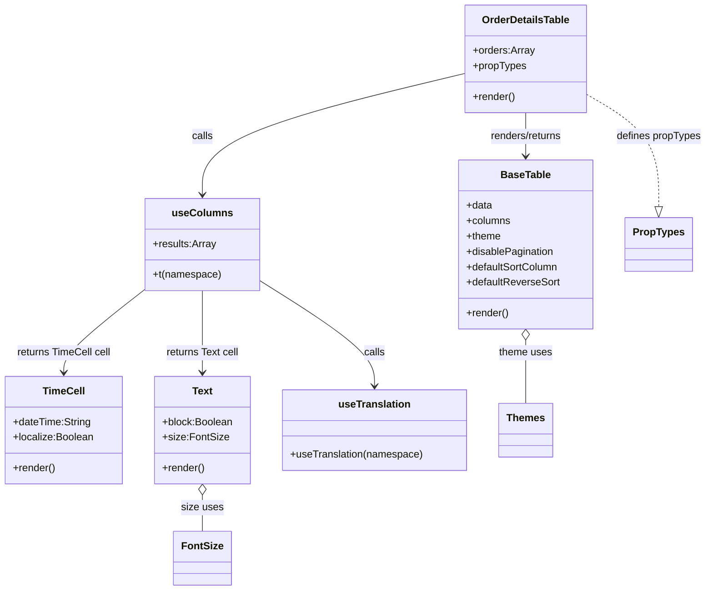

# Diagram: web/portal/src/pages/partview/details/components/organisms/OrderDetailsTable.organism.js

> Auto-generated by Obscura crawlers

## Mermaid

### SVG

<svg id="container" width="1094.0703125" xmlns="http://www.w3.org/2000/svg" class="classDiagram" height="922" viewBox="0 0 1094.0703125 922" role="graphics-document document" aria-roledescription="class"><g><defs><marker id="container_class-aggregationStart" class="marker aggregation class" refX="18" refY="7" markerWidth="190" markerHeight="240" orient="auto"><path d="M 18,7 L9,13 L1,7 L9,1 Z"></path></marker></defs><defs><marker id="container_class-aggregationEnd" class="marker aggregation class" refX="1" refY="7" markerWidth="20" markerHeight="28" orient="auto"><path d="M 18,7 L9,13 L1,7 L9,1 Z"></path></marker></defs><defs><marker id="container_class-extensionStart" class="marker extension class" refX="18" refY="7" markerWidth="190" markerHeight="240" orient="auto"><path d="M 1,7 L18,13 V 1 Z"></path></marker></defs><defs><marker id="container_class-extensionEnd" class="marker extension class" refX="1" refY="7" markerWidth="20" markerHeight="28" orient="auto"><path d="M 1,1 V 13 L18,7 Z"></path></marker></defs><defs><marker id="container_class-compositionStart" class="marker composition class" refX="18" refY="7" markerWidth="190" markerHeight="240" orient="auto"><path d="M 18,7 L9,13 L1,7 L9,1 Z"></path></marker></defs><defs><marker id="container_class-compositionEnd" class="marker composition class" refX="1" refY="7" markerWidth="20" markerHeight="28" orient="auto"><path d="M 18,7 L9,13 L1,7 L9,1 Z"></path></marker></defs><defs><marker id="container_class-dependencyStart" class="marker dependency class" refX="6" refY="7" markerWidth="190" markerHeight="240" orient="auto"><path d="M 5,7 L9,13 L1,7 L9,1 Z"></path></marker></defs><defs><marker id="container_class-dependencyEnd" class="marker dependency class" refX="13" refY="7" markerWidth="20" markerHeight="28" orient="auto"><path d="M 18,7 L9,13 L14,7 L9,1 Z"></path></marker></defs><defs><marker id="container_class-lollipopStart" class="marker lollipop class" refX="13" refY="7" markerWidth="190" markerHeight="240" orient="auto"><circle stroke="black" fill="transparent" cx="7" cy="7" r="6"></circle></marker></defs><defs><marker id="container_class-lollipopEnd" class="marker lollipop class" refX="1" refY="7" markerWidth="190" markerHeight="240" orient="auto"><circle stroke="black" fill="transparent" cx="7" cy="7" r="6"></circle></marker></defs><g class="root"><g class="clusters"></g><g class="edgePaths"><path d="M815.594,176L815.594,182.167C815.594,188.333,815.594,200.667,815.594,212C815.594,223.333,815.594,233.667,815.594,238.833L815.594,244" id="id_OrderDetailsTable_BaseTable_1" class="edge-thickness-normal edge-pattern-solid relation" style=";;;" data-edge="true" data-et="edge" data-id="id_OrderDetailsTable_BaseTable_1" data-points="W3sieCI6ODE1LjU5Mzc1LCJ5IjoxNzZ9LHsieCI6ODE1LjU5Mzc1LCJ5IjoyMTN9LHsieCI6ODE1LjU5Mzc1LCJ5IjoyNTB9XQ==" marker-end="url(#container_class-dependencyEnd)"></path><path d="M722.508,114.49L654.551,130.908C586.595,147.326,450.682,180.163,382.726,211.748C314.77,243.333,314.77,273.667,314.77,288.833L314.77,304" id="id_OrderDetailsTable_useColumns_2" class="edge-thickness-normal edge-pattern-solid relation" style=";;;" data-edge="true" data-et="edge" data-id="id_OrderDetailsTable_useColumns_2" data-points="W3sieCI6NzIyLjUwNzgxMjUsInkiOjExNC40ODk3MjM5NzA2NDIxNX0seyJ4IjozMTQuNzY5NTMxMjUsInkiOjIxM30seyJ4IjozMTQuNzY5NTMxMjUsInkiOjMxMH1d" marker-end="url(#container_class-dependencyEnd)"></path><path d="M908.68,147.158L927.199,158.132C945.719,169.105,982.758,191.053,1001.277,220.318C1019.797,249.583,1019.797,286.167,1019.797,304.458L1019.797,322.75" id="id_OrderDetailsTable_PropTypes_3" class="edge-thickness-normal edge-pattern-dashed relation" style=";;;" data-edge="true" data-et="edge" data-id="id_OrderDetailsTable_PropTypes_3" data-points="W3sieCI6OTA4LjY3OTY4NzUsInkiOjE0Ny4xNTc4MTYyMDYyODk2OH0seyJ4IjoxMDE5Ljc5Njg3NSwieSI6MjEzfSx7IngiOjEwMTkuNzk2ODc1LCJ5IjozNDB9XQ==" marker-end="url(#container_class-extensionEnd)"></path><path d="M401.922,437.005L432.025,456.004C462.129,475.003,522.336,513.002,552.439,540.667C582.543,568.333,582.543,585.667,582.543,594.333L582.543,603" id="id_useColumns_useTranslation_4" class="edge-thickness-normal edge-pattern-solid relation" style=";;;" data-edge="true" data-et="edge" data-id="id_useColumns_useTranslation_4" data-points="W3sieCI6NDAxLjkyMTg3NSwieSI6NDM3LjAwNDUwNzY1ODY0MzN9LHsieCI6NTgyLjU0Mjk2ODc1LCJ5Ijo1NTF9LHsieCI6NTgyLjU0Mjk2ODc1LCJ5Ijo2MDl9XQ==" marker-end="url(#container_class-dependencyEnd)"></path><path d="M314.77,454L314.77,470.167C314.77,486.333,314.77,518.667,314.77,540C314.77,561.333,314.77,571.667,314.77,576.833L314.77,582" id="id_useColumns_Text_5" class="edge-thickness-normal edge-pattern-solid relation" style=";;;" data-edge="true" data-et="edge" data-id="id_useColumns_Text_5" data-points="W3sieCI6MzE0Ljc2OTUzMTI1LCJ5Ijo0NTR9LHsieCI6MzE0Ljc2OTUzMTI1LCJ5Ijo1NTF9LHsieCI6MzE0Ljc2OTUzMTI1LCJ5Ijo1ODh9XQ==" marker-end="url(#container_class-dependencyEnd)"></path><path d="M227.617,450.206L206.152,467.005C184.686,483.804,141.755,517.402,120.29,539.368C98.824,561.333,98.824,571.667,98.824,576.833L98.824,582" id="id_useColumns_TimeCell_6" class="edge-thickness-normal edge-pattern-solid relation" style=";;;" data-edge="true" data-et="edge" data-id="id_useColumns_TimeCell_6" data-points="W3sieCI6MjI3LjYxNzE4NzUsInkiOjQ1MC4yMDU5MDc4OTA0NTI2fSx7IngiOjk4LjgyNDIxODc1LCJ5Ijo1NTF9LHsieCI6OTguODI0MjE4NzUsInkiOjU4OH1d" marker-end="url(#container_class-dependencyEnd)"></path><path d="M815.594,531.25L815.594,534.542C815.594,537.833,815.594,544.417,815.594,560.875C815.594,577.333,815.594,603.667,815.594,616.833L815.594,630" id="id_BaseTable_Themes_7" class="edge-thickness-normal edge-pattern-solid relation" style=";;;" data-edge="true" data-et="edge" data-id="id_BaseTable_Themes_7" data-points="W3sieCI6ODE1LjU5Mzc1LCJ5Ijo1MTR9LHsieCI6ODE1LjU5Mzc1LCJ5Ijo1NTF9LHsieCI6ODE1LjU5Mzc1LCJ5Ijo2MzB9XQ==" marker-start="url(#container_class-aggregationStart)"></path><path d="M314.77,773.25L314.77,776.542C314.77,779.833,314.77,786.417,314.77,795.875C314.77,805.333,314.77,817.667,314.77,823.833L314.77,830" id="id_Text_FontSize_8" class="edge-thickness-normal edge-pattern-solid relation" style=";;;" data-edge="true" data-et="edge" data-id="id_Text_FontSize_8" data-points="W3sieCI6MzE0Ljc2OTUzMTI1LCJ5Ijo3NTZ9LHsieCI6MzE0Ljc2OTUzMTI1LCJ5Ijo3OTN9LHsieCI6MzE0Ljc2OTUzMTI1LCJ5Ijo4MzB9XQ==" marker-start="url(#container_class-aggregationStart)"></path></g><g class="edgeLabels"><g class="edgeLabel" transform="translate(815.59375, 213)"><g class="label" data-id="id_OrderDetailsTable_BaseTable_1" transform="translate(-57.9296875, -12)"><foreignObject width="115.859375" height="24">

renders/returns

</foreignObject></g></g><g class="edgeLabel" transform="translate(314.76953125, 213)"><g class="label" data-id="id_OrderDetailsTable_useColumns_2" transform="translate(-16.4453125, -12)"><foreignObject width="32.890625" height="24">

calls

</foreignObject></g></g><g class="edgeLabel" transform="translate(1019.796875, 213)"><g class="label" data-id="id_OrderDetailsTable_PropTypes_3" transform="translate(-66.2734375, -12)"><foreignObject width="132.546875" height="24">

defines propTypes

</foreignObject></g></g><g class="edgeLabel" transform="translate(582.54296875, 551)"><g class="label" data-id="id_useColumns_useTranslation_4" transform="translate(-16.4453125, -12)"><foreignObject width="32.890625" height="24">

calls

</foreignObject></g></g><g class="edgeLabel" transform="translate(314.76953125, 551)"><g class="label" data-id="id_useColumns_Text_5" transform="translate(-57.96875, -12)"><foreignObject width="115.9375" height="24">

returns Text cell

</foreignObject></g></g><g class="edgeLabel" transform="translate(98.82421875, 551)"><g class="label" data-id="id_useColumns_TimeCell_6" transform="translate(-74.1953125, -12)"><foreignObject width="148.390625" height="24">

returns TimeCell cell

</foreignObject></g></g><g class="edgeLabel" transform="translate(815.59375, 551)"><g class="label" data-id="id_BaseTable_Themes_7" transform="translate(-41.765625, -12)"><foreignObject width="83.53125" height="24">

theme uses

</foreignObject></g></g><g class="edgeLabel" transform="translate(314.76953125, 793)"><g class="label" data-id="id_Text_FontSize_8" transform="translate(-32.40625, -12)"><foreignObject width="64.8125" height="24">

size uses

</foreignObject></g></g></g><g class="nodes"><g class="node default" id="classId-OrderDetailsTable-0" transform="translate(815.59375, 92)"><g class="basic label-container"><path d="M-93.0859375 -84 L93.0859375 -84 L93.0859375 84 L-93.0859375 84" stroke="none" stroke-width="0" fill="#ECECFF" style=""></path><path d="M-93.0859375 -84 C-24.644201446738137 -84, 43.797534606523726 -84, 93.0859375 -84 M-93.0859375 -84 C-34.11855562151974 -84, 24.84882625696052 -84, 93.0859375 -84 M93.0859375 -84 C93.0859375 -16.995651506536177, 93.0859375 50.008696986927646, 93.0859375 84 M93.0859375 -84 C93.0859375 -49.59194017409648, 93.0859375 -15.183880348192957, 93.0859375 84 M93.0859375 84 C55.65359324409332 84, 18.221248988186645 84, -93.0859375 84 M93.0859375 84 C27.868706662775452 84, -37.348524174449096 84, -93.0859375 84 M-93.0859375 84 C-93.0859375 39.794990161719326, -93.0859375 -4.4100196765613475, -93.0859375 -84 M-93.0859375 84 C-93.0859375 45.01753466218106, -93.0859375 6.0350693243621265, -93.0859375 -84" stroke="#9370DB" stroke-width="1.3" fill="none" stroke-dasharray="0 0" style=""></path></g><g class="annotation-group text" transform="translate(0, -60)"></g><g class="label-group text" transform="translate(-66.25, -60)"><g class="label" style="font-weight: bolder" transform="translate(0,-12)"><foreignObject width="132.5" height="24">

OrderDetailsTable

</foreignObject></g></g><g class="members-group text" transform="translate(-81.0859375, -12)"><g class="label" style="" transform="translate(0,-12)"><foreignObject width="95.921875" height="24">

+orders:Array

</foreignObject></g><g class="label" style="" transform="translate(0,12)"><foreignObject width="83.234375" height="24">

+propTypes

</foreignObject></g></g><g class="methods-group text" transform="translate(-81.0859375, 60)"><g class="label" style="" transform="translate(0,-12)"><foreignObject width="66.609375" height="24">

+render()

</foreignObject></g></g><g class="divider" style=""><path d="M-93.0859375 -36 C-18.843910428155425 -36, 55.39811664368915 -36, 93.0859375 -36 M-93.0859375 -36 C-28.40635203378463 -36, 36.27323343243074 -36, 93.0859375 -36" stroke="#9370DB" stroke-width="1.3" fill="none" stroke-dasharray="0 0" style=""></path></g><g class="divider" style=""><path d="M-93.0859375 36 C-39.567602588289766 36, 13.950732323420468 36, 93.0859375 36 M-93.0859375 36 C-52.95548691305793 36, -12.825036326115864 36, 93.0859375 36" stroke="#9370DB" stroke-width="1.3" fill="none" stroke-dasharray="0 0" style=""></path></g></g><g class="node default" id="classId-useColumns-1" transform="translate(314.76953125, 382)"><g class="basic label-container"><path d="M-87.15234375 -72 L87.15234375 -72 L87.15234375 72 L-87.15234375 72" stroke="none" stroke-width="0" fill="#ECECFF" style=""></path><path d="M-87.15234375 -72 C-31.40104170398849 -72, 24.35026034202302 -72, 87.15234375 -72 M-87.15234375 -72 C-47.310847576655306 -72, -7.469351403310611 -72, 87.15234375 -72 M87.15234375 -72 C87.15234375 -15.006140965453746, 87.15234375 41.98771806909251, 87.15234375 72 M87.15234375 -72 C87.15234375 -21.179933019855305, 87.15234375 29.64013396028939, 87.15234375 72 M87.15234375 72 C42.0464132837717 72, -3.0595171824566023 72, -87.15234375 72 M87.15234375 72 C32.621898918661664 72, -21.908545912676672 72, -87.15234375 72 M-87.15234375 72 C-87.15234375 17.70960313619956, -87.15234375 -36.58079372760088, -87.15234375 -72 M-87.15234375 72 C-87.15234375 18.496036593872255, -87.15234375 -35.00792681225549, -87.15234375 -72" stroke="#9370DB" stroke-width="1.3" fill="none" stroke-dasharray="0 0" style=""></path></g><g class="annotation-group text" transform="translate(0, -48)"></g><g class="label-group text" transform="translate(-44.1640625, -48)"><g class="label" style="font-weight: bolder" transform="translate(0,-12)"><foreignObject width="88.328125" height="24">

useColumns

</foreignObject></g></g><g class="members-group text" transform="translate(-75.15234375, 0)"><g class="label" style="" transform="translate(0,-12)"><foreignObject width="98.328125" height="24">

+results:Array

</foreignObject></g></g><g class="methods-group text" transform="translate(-75.15234375, 48)"><g class="label" style="" transform="translate(0,-12)"><foreignObject width="106.140625" height="24">

+t(namespace)

</foreignObject></g></g><g class="divider" style=""><path d="M-87.15234375 -24 C-23.502559337926876 -24, 40.14722507414625 -24, 87.15234375 -24 M-87.15234375 -24 C-41.73975953614247 -24, 3.672824677715056 -24, 87.15234375 -24" stroke="#9370DB" stroke-width="1.3" fill="none" stroke-dasharray="0 0" style=""></path></g><g class="divider" style=""><path d="M-87.15234375 24 C-18.822920429427896 24, 49.50650289114421 24, 87.15234375 24 M-87.15234375 24 C-20.638429244126 24, 45.875485261748 24, 87.15234375 24" stroke="#9370DB" stroke-width="1.3" fill="none" stroke-dasharray="0 0" style=""></path></g></g><g class="node default" id="classId-BaseTable-2" transform="translate(815.59375, 382)"><g class="basic label-container"><path d="M-103.9453125 -132 L103.9453125 -132 L103.9453125 132 L-103.9453125 132" stroke="none" stroke-width="0" fill="#ECECFF" style=""></path><path d="M-103.9453125 -132 C-21.328497893714527 -132, 61.288316712570946 -132, 103.9453125 -132 M-103.9453125 -132 C-57.35583972616886 -132, -10.76636695233772 -132, 103.9453125 -132 M103.9453125 -132 C103.9453125 -51.59267526403936, 103.9453125 28.814649471921285, 103.9453125 132 M103.9453125 -132 C103.9453125 -42.10700180664443, 103.9453125 47.78599638671113, 103.9453125 132 M103.9453125 132 C21.742734607448057 132, -60.45984328510389 132, -103.9453125 132 M103.9453125 132 C46.17334205442214 132, -11.598628391155714 132, -103.9453125 132 M-103.9453125 132 C-103.9453125 39.76613012822081, -103.9453125 -52.46773974355838, -103.9453125 -132 M-103.9453125 132 C-103.9453125 53.187474174264466, -103.9453125 -25.62505165147107, -103.9453125 -132" stroke="#9370DB" stroke-width="1.3" fill="none" stroke-dasharray="0 0" style=""></path></g><g class="annotation-group text" transform="translate(0, -108)"></g><g class="label-group text" transform="translate(-37.359375, -108)"><g class="label" style="font-weight: bolder" transform="translate(0,-12)"><foreignObject width="74.71875" height="24">

BaseTable

</foreignObject></g></g><g class="members-group text" transform="translate(-91.9453125, -60)"><g class="label" style="" transform="translate(0,-12)"><foreignObject width="40.625" height="24">

+data

</foreignObject></g><g class="label" style="" transform="translate(0,12)"><foreignObject width="69.21875" height="24">

+columns

</foreignObject></g><g class="label" style="" transform="translate(0,36)"><foreignObject width="54.21875" height="24">

+theme

</foreignObject></g><g class="label" style="" transform="translate(0,60)"><foreignObject width="137.796875" height="24">

+disablePagination

</foreignObject></g><g class="label" style="" transform="translate(0,84)"><foreignObject width="144.859375" height="24">

+defaultSortColumn

</foreignObject></g><g class="label" style="" transform="translate(0,108)"><foreignObject width="146.53125" height="24">

+defaultReverseSort

</foreignObject></g></g><g class="methods-group text" transform="translate(-91.9453125, 108)"><g class="label" style="" transform="translate(0,-12)"><foreignObject width="66.609375" height="24">

+render()

</foreignObject></g></g><g class="divider" style=""><path d="M-103.9453125 -84 C-25.455337299008363 -84, 53.034637901983274 -84, 103.9453125 -84 M-103.9453125 -84 C-48.146963369460686 -84, 7.651385761078629 -84, 103.9453125 -84" stroke="#9370DB" stroke-width="1.3" fill="none" stroke-dasharray="0 0" style=""></path></g><g class="divider" style=""><path d="M-103.9453125 84 C-61.666032902589464 84, -19.386753305178928 84, 103.9453125 84 M-103.9453125 84 C-44.31896189882034 84, 15.307388702359319 84, 103.9453125 84" stroke="#9370DB" stroke-width="1.3" fill="none" stroke-dasharray="0 0" style=""></path></g></g><g class="node default" id="classId-TimeCell-3" transform="translate(98.82421875, 672)"><g class="basic label-container"><path d="M-90.82421875 -84 L90.82421875 -84 L90.82421875 84 L-90.82421875 84" stroke="none" stroke-width="0" fill="#ECECFF" style=""></path><path d="M-90.82421875 -84 C-20.474720595005834 -84, 49.87477755998833 -84, 90.82421875 -84 M-90.82421875 -84 C-43.49155615120127 -84, 3.841106447597454 -84, 90.82421875 -84 M90.82421875 -84 C90.82421875 -36.989274232709015, 90.82421875 10.02145153458197, 90.82421875 84 M90.82421875 -84 C90.82421875 -43.74434144256179, 90.82421875 -3.4886828851235805, 90.82421875 84 M90.82421875 84 C39.32461667956539 84, -12.174985390869224 84, -90.82421875 84 M90.82421875 84 C32.58571796054983 84, -25.652782828900342 84, -90.82421875 84 M-90.82421875 84 C-90.82421875 48.524777327421155, -90.82421875 13.04955465484231, -90.82421875 -84 M-90.82421875 84 C-90.82421875 43.51261353505086, -90.82421875 3.025227070101721, -90.82421875 -84" stroke="#9370DB" stroke-width="1.3" fill="none" stroke-dasharray="0 0" style=""></path></g><g class="annotation-group text" transform="translate(0, -60)"></g><g class="label-group text" transform="translate(-31.3671875, -60)"><g class="label" style="font-weight: bolder" transform="translate(0,-12)"><foreignObject width="62.734375" height="24">

TimeCell

</foreignObject></g></g><g class="members-group text" transform="translate(-78.82421875, -12)"><g class="label" style="" transform="translate(0,-12)"><foreignObject width="122.453125" height="24">

+dateTime:String

</foreignObject></g><g class="label" style="" transform="translate(0,12)"><foreignObject width="126.28125" height="24">

+localize:Boolean

</foreignObject></g></g><g class="methods-group text" transform="translate(-78.82421875, 60)"><g class="label" style="" transform="translate(0,-12)"><foreignObject width="66.609375" height="24">

+render()

</foreignObject></g></g><g class="divider" style=""><path d="M-90.82421875 -36 C-25.030043767825646 -36, 40.76413121434871 -36, 90.82421875 -36 M-90.82421875 -36 C-44.75717333877638 -36, 1.3098720724472344 -36, 90.82421875 -36" stroke="#9370DB" stroke-width="1.3" fill="none" stroke-dasharray="0 0" style=""></path></g><g class="divider" style=""><path d="M-90.82421875 36 C-34.869194157298686 36, 21.085830435402627 36, 90.82421875 36 M-90.82421875 36 C-40.167189791412085 36, 10.48983916717583 36, 90.82421875 36" stroke="#9370DB" stroke-width="1.3" fill="none" stroke-dasharray="0 0" style=""></path></g></g><g class="node default" id="classId-Text-4" transform="translate(314.76953125, 672)"><g class="basic label-container"><path d="M-75.12109375 -84 L75.12109375 -84 L75.12109375 84 L-75.12109375 84" stroke="none" stroke-width="0" fill="#ECECFF" style=""></path><path d="M-75.12109375 -84 C-23.936852718760726 -84, 27.24738831247855 -84, 75.12109375 -84 M-75.12109375 -84 C-24.017719008850854 -84, 27.085655732298292 -84, 75.12109375 -84 M75.12109375 -84 C75.12109375 -47.56769963177818, 75.12109375 -11.135399263556366, 75.12109375 84 M75.12109375 -84 C75.12109375 -38.66451876695963, 75.12109375 6.670962466080738, 75.12109375 84 M75.12109375 84 C45.03668952640687 84, 14.952285302813735 84, -75.12109375 84 M75.12109375 84 C20.33395737809186 84, -34.45317899381628 84, -75.12109375 84 M-75.12109375 84 C-75.12109375 30.587061298664295, -75.12109375 -22.82587740267141, -75.12109375 -84 M-75.12109375 84 C-75.12109375 31.204315910467827, -75.12109375 -21.591368179064347, -75.12109375 -84" stroke="#9370DB" stroke-width="1.3" fill="none" stroke-dasharray="0 0" style=""></path></g><g class="annotation-group text" transform="translate(0, -60)"></g><g class="label-group text" transform="translate(-15.3828125, -60)"><g class="label" style="font-weight: bolder" transform="translate(0,-12)"><foreignObject width="30.765625" height="24">

Text

</foreignObject></g></g><g class="members-group text" transform="translate(-63.12109375, -12)"><g class="label" style="" transform="translate(0,-12)"><foreignObject width="110.859375" height="24">

+block:Boolean

</foreignObject></g><g class="label" style="" transform="translate(0,12)"><foreignObject width="100.046875" height="24">

+size:FontSize

</foreignObject></g></g><g class="methods-group text" transform="translate(-63.12109375, 60)"><g class="label" style="" transform="translate(0,-12)"><foreignObject width="66.609375" height="24">

+render()

</foreignObject></g></g><g class="divider" style=""><path d="M-75.12109375 -36 C-16.8731777140798 -36, 41.3747383218404 -36, 75.12109375 -36 M-75.12109375 -36 C-44.47150154274475 -36, -13.821909335489494 -36, 75.12109375 -36" stroke="#9370DB" stroke-width="1.3" fill="none" stroke-dasharray="0 0" style=""></path></g><g class="divider" style=""><path d="M-75.12109375 36 C-42.261210225331375 36, -9.40132670066275 36, 75.12109375 36 M-75.12109375 36 C-33.04865640061987 36, 9.023780948760262 36, 75.12109375 36" stroke="#9370DB" stroke-width="1.3" fill="none" stroke-dasharray="0 0" style=""></path></g></g><g class="node default" id="classId-useTranslation-5" transform="translate(582.54296875, 672)"><g class="basic label-container"><path d="M-142.65234375 -63 L142.65234375 -63 L142.65234375 63 L-142.65234375 63" stroke="none" stroke-width="0" fill="#ECECFF" style=""></path><path d="M-142.65234375 -63 C-60.23074689623948 -63, 22.19084995752104 -63, 142.65234375 -63 M-142.65234375 -63 C-73.56275283707177 -63, -4.47316192414354 -63, 142.65234375 -63 M142.65234375 -63 C142.65234375 -18.96520068190101, 142.65234375 25.06959863619798, 142.65234375 63 M142.65234375 -63 C142.65234375 -20.911514069460097, 142.65234375 21.176971861079807, 142.65234375 63 M142.65234375 63 C44.229970206066 63, -54.192403337868 63, -142.65234375 63 M142.65234375 63 C31.572785241983993 63, -79.50677326603201 63, -142.65234375 63 M-142.65234375 63 C-142.65234375 14.550434621569167, -142.65234375 -33.899130756861666, -142.65234375 -63 M-142.65234375 63 C-142.65234375 16.9123468269403, -142.65234375 -29.1753063461194, -142.65234375 -63" stroke="#9370DB" stroke-width="1.3" fill="none" stroke-dasharray="0 0" style=""></path></g><g class="annotation-group text" transform="translate(0, -39)"></g><g class="label-group text" transform="translate(-54.0859375, -39)"><g class="label" style="font-weight: bolder" transform="translate(0,-12)"><foreignObject width="108.171875" height="24">

useTranslation

</foreignObject></g></g><g class="members-group text" transform="translate(-130.65234375, 9)"></g><g class="methods-group text" transform="translate(-130.65234375, 39)"><g class="label" style="" transform="translate(0,-12)"><foreignObject width="207.21875" height="24">

+useTranslation(namespace)

</foreignObject></g></g><g class="divider" style=""><path d="M-142.65234375 -15 C-32.6261474299928 -15, 77.4000488900144 -15, 142.65234375 -15 M-142.65234375 -15 C-57.45161871780647 -15, 27.749106314387063 -15, 142.65234375 -15" stroke="#9370DB" stroke-width="1.3" fill="none" stroke-dasharray="0 0" style=""></path></g><g class="divider" style=""><path d="M-142.65234375 9 C-51.90506015196169 9, 38.842223446076616 9, 142.65234375 9 M-142.65234375 9 C-66.85060201053321 9, 8.951139728933583 9, 142.65234375 9" stroke="#9370DB" stroke-width="1.3" fill="none" stroke-dasharray="0 0" style=""></path></g></g><g class="node default" id="classId-PropTypes-6" transform="translate(1019.796875, 382)"><g class="basic label-container"><path d="M-50.2578125 -42 L50.2578125 -42 L50.2578125 42 L-50.2578125 42" stroke="none" stroke-width="0" fill="#ECECFF" style=""></path><path d="M-50.2578125 -42 C-16.274154445038548 -42, 17.709503609922905 -42, 50.2578125 -42 M-50.2578125 -42 C-15.296029428568112 -42, 19.665753642863777 -42, 50.2578125 -42 M50.2578125 -42 C50.2578125 -8.71447354301614, 50.2578125 24.57105291396772, 50.2578125 42 M50.2578125 -42 C50.2578125 -12.983695971550503, 50.2578125 16.032608056898994, 50.2578125 42 M50.2578125 42 C22.65901936619472 42, -4.939773767610561 42, -50.2578125 42 M50.2578125 42 C13.702258947438054 42, -22.853294605123892 42, -50.2578125 42 M-50.2578125 42 C-50.2578125 16.108481529591963, -50.2578125 -9.783036940816075, -50.2578125 -42 M-50.2578125 42 C-50.2578125 13.869420878441755, -50.2578125 -14.26115824311649, -50.2578125 -42" stroke="#9370DB" stroke-width="1.3" fill="none" stroke-dasharray="0 0" style=""></path></g><g class="annotation-group text" transform="translate(0, -18)"></g><g class="label-group text" transform="translate(-38.2578125, -18)"><g class="label" style="font-weight: bolder" transform="translate(0,-12)"><foreignObject width="76.515625" height="24">

PropTypes

</foreignObject></g></g><g class="members-group text" transform="translate(-38.2578125, 30)"></g><g class="methods-group text" transform="translate(-38.2578125, 60)"></g><g class="divider" style=""><path d="M-50.2578125 6 C-25.442686595961618 6, -0.6275606919232359 6, 50.2578125 6 M-50.2578125 6 C-19.47603691926031 6, 11.305738661479381 6, 50.2578125 6" stroke="#9370DB" stroke-width="1.3" fill="none" stroke-dasharray="0 0" style=""></path></g><g class="divider" style=""><path d="M-50.2578125 24 C-22.8237314324016 24, 4.610349635196798 24, 50.2578125 24 M-50.2578125 24 C-23.04346566846937 24, 4.17088116306126 24, 50.2578125 24" stroke="#9370DB" stroke-width="1.3" fill="none" stroke-dasharray="0 0" style=""></path></g></g><g class="node default" id="classId-Themes-7" transform="translate(815.59375, 672)"><g class="basic label-container"><path d="M-40.3984375 -42 L40.3984375 -42 L40.3984375 42 L-40.3984375 42" stroke="none" stroke-width="0" fill="#ECECFF" style=""></path><path d="M-40.3984375 -42 C-15.34927261855681 -42, 9.69989226288638 -42, 40.3984375 -42 M-40.3984375 -42 C-10.01998736251155 -42, 20.3584627749769 -42, 40.3984375 -42 M40.3984375 -42 C40.3984375 -19.259317528911197, 40.3984375 3.4813649421776063, 40.3984375 42 M40.3984375 -42 C40.3984375 -12.375785461564178, 40.3984375 17.248429076871645, 40.3984375 42 M40.3984375 42 C22.41259936052332 42, 4.42676122104664 42, -40.3984375 42 M40.3984375 42 C10.733095534484598 42, -18.932246431030805 42, -40.3984375 42 M-40.3984375 42 C-40.3984375 18.277848423264974, -40.3984375 -5.444303153470052, -40.3984375 -42 M-40.3984375 42 C-40.3984375 24.16148800340169, -40.3984375 6.32297600680338, -40.3984375 -42" stroke="#9370DB" stroke-width="1.3" fill="none" stroke-dasharray="0 0" style=""></path></g><g class="annotation-group text" transform="translate(0, -18)"></g><g class="label-group text" transform="translate(-28.3984375, -18)"><g class="label" style="font-weight: bolder" transform="translate(0,-12)"><foreignObject width="56.796875" height="24">

Themes

</foreignObject></g></g><g class="members-group text" transform="translate(-28.3984375, 30)"></g><g class="methods-group text" transform="translate(-28.3984375, 60)"></g><g class="divider" style=""><path d="M-40.3984375 6 C-23.86856361389232 6, -7.33868972778464 6, 40.3984375 6 M-40.3984375 6 C-10.33358582145339 6, 19.73126585709322 6, 40.3984375 6" stroke="#9370DB" stroke-width="1.3" fill="none" stroke-dasharray="0 0" style=""></path></g><g class="divider" style=""><path d="M-40.3984375 24 C-22.400068056605225 24, -4.401698613210449 24, 40.3984375 24 M-40.3984375 24 C-14.29637679731297 24, 11.80568390537406 24, 40.3984375 24" stroke="#9370DB" stroke-width="1.3" fill="none" stroke-dasharray="0 0" style=""></path></g></g><g class="node default" id="classId-FontSize-8" transform="translate(314.76953125, 872)"><g class="basic label-container"><path d="M-42.84375 -42 L42.84375 -42 L42.84375 42 L-42.84375 42" stroke="none" stroke-width="0" fill="#ECECFF" style=""></path><path d="M-42.84375 -42 C-12.03678913432313 -42, 18.77017173135374 -42, 42.84375 -42 M-42.84375 -42 C-8.9074540496635 -42, 25.028841900673 -42, 42.84375 -42 M42.84375 -42 C42.84375 -21.608668398502672, 42.84375 -1.2173367970053448, 42.84375 42 M42.84375 -42 C42.84375 -18.84411198878052, 42.84375 4.311776022438963, 42.84375 42 M42.84375 42 C13.266908956091306 42, -16.309932087817387 42, -42.84375 42 M42.84375 42 C16.63526144961913 42, -9.573227100761741 42, -42.84375 42 M-42.84375 42 C-42.84375 20.51400250175072, -42.84375 -0.9719949964985588, -42.84375 -42 M-42.84375 42 C-42.84375 10.668813307921987, -42.84375 -20.662373384156027, -42.84375 -42" stroke="#9370DB" stroke-width="1.3" fill="none" stroke-dasharray="0 0" style=""></path></g><g class="annotation-group text" transform="translate(0, -18)"></g><g class="label-group text" transform="translate(-30.84375, -18)"><g class="label" style="font-weight: bolder" transform="translate(0,-12)"><foreignObject width="61.6875" height="24">

FontSize

</foreignObject></g></g><g class="members-group text" transform="translate(-30.84375, 30)"></g><g class="methods-group text" transform="translate(-30.84375, 60)"></g><g class="divider" style=""><path d="M-42.84375 6 C-25.663734090192552 6, -8.483718180385104 6, 42.84375 6 M-42.84375 6 C-25.371189332156185 6, -7.898628664312369 6, 42.84375 6" stroke="#9370DB" stroke-width="1.3" fill="none" stroke-dasharray="0 0" style=""></path></g><g class="divider" style=""><path d="M-42.84375 24 C-22.918303564202215 24, -2.992857128404431 24, 42.84375 24 M-42.84375 24 C-19.164858916170626 24, 4.514032167658748 24, 42.84375 24" stroke="#9370DB" stroke-width="1.3" fill="none" stroke-dasharray="0 0" style=""></path></g></g></g></g></g></svg>
