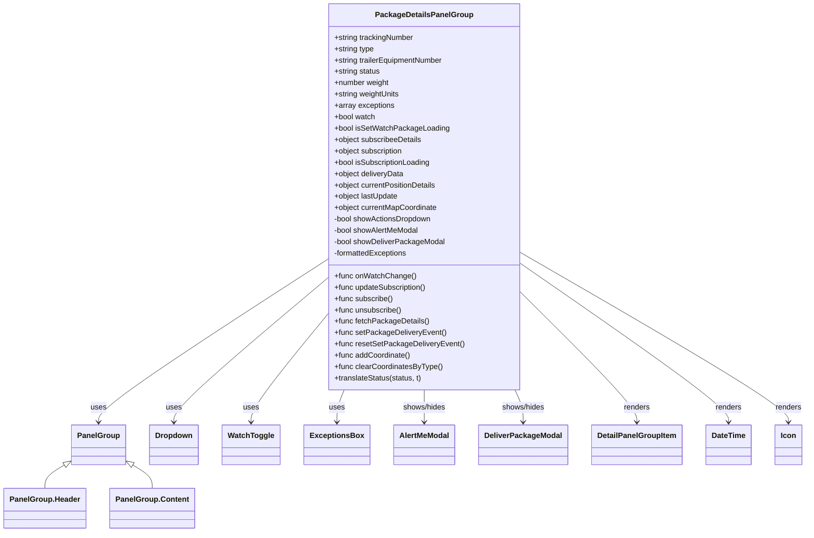

# Diagram: web/portal/src/pages/partview/details/components/organisms/PackageDetailsPanelGroup.organism.js


> Auto-generated by Obscura crawlers

## Diagram 1



### SVG

<svg id="container" width="1647.73046875" xmlns="http://www.w3.org/2000/svg" class="classDiagram" height="1124" viewBox="0 0 1647.73046875 1124" role="graphics-document document" aria-roledescription="class"><style>#container{font-family:"trebuchet ms",verdana,arial,sans-serif;font-size:16px;fill:#333;}@keyframes edge-animation-frame{from{stroke-dashoffset:0;}}@keyframes dash{to{stroke-dashoffset:0;}}#container .edge-animation-slow{stroke-dasharray:9,5!important;stroke-dashoffset:900;animation:dash 50s linear infinite;stroke-linecap:round;}#container .edge-animation-fast{stroke-dasharray:9,5!important;stroke-dashoffset:900;animation:dash 20s linear infinite;stroke-linecap:round;}#container .error-icon{fill:#552222;}#container .error-text{fill:#552222;stroke:#552222;}#container .edge-thickness-normal{stroke-width:1px;}#container .edge-thickness-thick{stroke-width:3.5px;}#container .edge-pattern-solid{stroke-dasharray:0;}#container .edge-thickness-invisible{stroke-width:0;fill:none;}#container .edge-pattern-dashed{stroke-dasharray:3;}#container .edge-pattern-dotted{stroke-dasharray:2;}#container .marker{fill:#333333;stroke:#333333;}#container .marker.cross{stroke:#333333;}#container svg{font-family:"trebuchet ms",verdana,arial,sans-serif;font-size:16px;}#container p{margin:0;}#container g.classGroup text{fill:#9370DB;stroke:none;font-family:"trebuchet ms",verdana,arial,sans-serif;font-size:10px;}#container g.classGroup text .title{font-weight:bolder;}#container .nodeLabel,#container .edgeLabel{color:#131300;}#container .edgeLabel .label rect{fill:#ECECFF;}#container .label text{fill:#131300;}#container .labelBkg{background:#ECECFF;}#container .edgeLabel .label span{background:#ECECFF;}#container .classTitle{font-weight:bolder;}#container .node rect,#container .node circle,#container .node ellipse,#container .node polygon,#container .node path{fill:#ECECFF;stroke:#9370DB;stroke-width:1px;}#container .divider{stroke:#9370DB;stroke-width:1;}#container g.clickable{cursor:pointer;}#container g.classGroup rect{fill:#ECECFF;stroke:#9370DB;}#container g.classGroup line{stroke:#9370DB;stroke-width:1;}#container .classLabel .box{stroke:none;stroke-width:0;fill:#ECECFF;opacity:0.5;}#container .classLabel .label{fill:#9370DB;font-size:10px;}#container .relation{stroke:#333333;stroke-width:1;fill:none;}#container .dashed-line{stroke-dasharray:3;}#container .dotted-line{stroke-dasharray:1 2;}#container #compositionStart,#container .composition{fill:#333333!important;stroke:#333333!important;stroke-width:1;}#container #compositionEnd,#container .composition{fill:#333333!important;stroke:#333333!important;stroke-width:1;}#container #dependencyStart,#container .dependency{fill:#333333!important;stroke:#333333!important;stroke-width:1;}#container #dependencyStart,#container .dependency{fill:#333333!important;stroke:#333333!important;stroke-width:1;}#container #extensionStart,#container .extension{fill:transparent!important;stroke:#333333!important;stroke-width:1;}#container #extensionEnd,#container .extension{fill:transparent!important;stroke:#333333!important;stroke-width:1;}#container #aggregationStart,#container .aggregation{fill:transparent!important;stroke:#333333!important;stroke-width:1;}#container #aggregationEnd,#container .aggregation{fill:transparent!important;stroke:#333333!important;stroke-width:1;}#container #lollipopStart,#container .lollipop{fill:#ECECFF!important;stroke:#333333!important;stroke-width:1;}#container #lollipopEnd,#container .lollipop{fill:#ECECFF!important;stroke:#333333!important;stroke-width:1;}#container .edgeTerminals{font-size:11px;line-height:initial;}#container .classTitleText{text-anchor:middle;font-size:18px;fill:#333;}#container .label-icon{display:inline-block;height:1em;overflow:visible;vertical-align:-0.125em;}#container .node .label-icon path{fill:currentColor;stroke:revert;stroke-width:revert;}#container :root{--mermaid-font-family:"trebuchet ms",verdana,arial,sans-serif;}</style><g><defs><marker id="container_class-aggregationStart" class="marker aggregation class" refX="18" refY="7" markerWidth="190" markerHeight="240" orient="auto"><path d="M 18,7 L9,13 L1,7 L9,1 Z"></path></marker></defs><defs><marker id="container_class-aggregationEnd" class="marker aggregation class" refX="1" refY="7" markerWidth="20" markerHeight="28" orient="auto"><path d="M 18,7 L9,13 L1,7 L9,1 Z"></path></marker></defs><defs><marker id="container_class-extensionStart" class="marker extension class" refX="18" refY="7" markerWidth="190" markerHeight="240" orient="auto"><path d="M 1,7 L18,13 V 1 Z"></path></marker></defs><defs><marker id="container_class-extensionEnd" class="marker extension class" refX="1" refY="7" markerWidth="20" markerHeight="28" orient="auto"><path d="M 1,1 V 13 L18,7 Z"></path></marker></defs><defs><marker id="container_class-compositionStart" class="marker composition class" refX="18" refY="7" markerWidth="190" markerHeight="240" orient="auto"><path d="M 18,7 L9,13 L1,7 L9,1 Z"></path></marker></defs><defs><marker id="container_class-compositionEnd" class="marker composition class" refX="1" refY="7" markerWidth="20" markerHeight="28" orient="auto"><path d="M 18,7 L9,13 L1,7 L9,1 Z"></path></marker></defs><defs><marker id="container_class-dependencyStart" class="marker dependency class" refX="6" refY="7" markerWidth="190" markerHeight="240" orient="auto"><path d="M 5,7 L9,13 L1,7 L9,1 Z"></path></marker></defs><defs><marker id="container_class-dependencyEnd" class="marker dependency class" refX="13" refY="7" markerWidth="20" markerHeight="28" orient="auto"><path d="M 18,7 L9,13 L14,7 L9,1 Z"></path></marker></defs><defs><marker id="container_class-lollipopStart" class="marker lollipop class" refX="13" refY="7" markerWidth="190" markerHeight="240" orient="auto"><circle stroke="black" fill="transparent" cx="7" cy="7" r="6"></circle></marker></defs><defs><marker id="container_class-lollipopEnd" class="marker lollipop class" refX="1" refY="7" markerWidth="190" markerHeight="240" orient="auto"><circle stroke="black" fill="transparent" cx="7" cy="7" r="6"></circle></marker></defs><g class="root"><g class="clusters"></g><g class="edgePaths"><path d="M667.18,547.416L589.21,599.68C511.241,651.944,355.302,756.472,277.333,813.903C199.363,871.333,199.363,881.667,199.363,886.833L199.363,892" id="id_PackageDetailsPanelGroup_PanelGroup_1" class="edge-thickness-normal edge-pattern-solid relation" style=";;;" data-edge="true" data-et="edge" data-id="id_PackageDetailsPanelGroup_PanelGroup_1" data-points="W3sieCI6NjY3LjE3OTY4NzUsInkiOjU0Ny40MTU3Mzk5MjM1MDY5fSx7IngiOjE5OS4zNjMyODEyNSwieSI6ODYxfSx7IngiOjE5OS4zNjMyODEyNSwieSI6ODk4fV0=" marker-end="url(#container_class-dependencyEnd)"></path><path d="M667.18,587.122L614.883,632.768C562.587,678.414,457.995,769.707,405.699,820.52C353.402,871.333,353.402,881.667,353.402,886.833L353.402,892" id="id_PackageDetailsPanelGroup_Dropdown_2" class="edge-thickness-normal edge-pattern-solid relation" style=";;;" data-edge="true" data-et="edge" data-id="id_PackageDetailsPanelGroup_Dropdown_2" data-points="W3sieCI6NjY3LjE3OTY4NzUsInkiOjU4Ny4xMjE1ODY2MjUzOTQ2fSx7IngiOjM1My40MDIzNDM3NSwieSI6ODYxfSx7IngiOjM1My40MDIzNDM3NSwieSI6ODk4fV0=" marker-end="url(#container_class-dependencyEnd)"></path><path d="M667.18,664.074L641.242,696.895C615.303,729.716,563.427,795.358,537.489,833.346C511.551,871.333,511.551,881.667,511.551,886.833L511.551,892" id="id_PackageDetailsPanelGroup_WatchToggle_3" class="edge-thickness-normal edge-pattern-solid relation" style=";;;" data-edge="true" data-et="edge" data-id="id_PackageDetailsPanelGroup_WatchToggle_3" data-points="W3sieCI6NjY3LjE3OTY4NzUsInkiOjY2NC4wNzQwMzA4Nzg1OTZ9LHsieCI6NTExLjU1MDc4MTI1LCJ5Ijo4NjF9LHsieCI6NTExLjU1MDc4MTI1LCJ5Ijo4OTh9XQ==" marker-end="url(#container_class-dependencyEnd)"></path><path d="M699.959,824L697.491,830.167C695.023,836.333,690.088,848.667,687.62,860C685.152,871.333,685.152,881.667,685.152,886.833L685.152,892" id="id_PackageDetailsPanelGroup_ExceptionsBox_4" class="edge-thickness-normal edge-pattern-solid relation" style=";;;" data-edge="true" data-et="edge" data-id="id_PackageDetailsPanelGroup_ExceptionsBox_4" data-points="W3sieCI6Njk5Ljk1ODgzOTUzNjUxNjgsInkiOjgyNH0seyJ4Ijo2ODUuMTUyMzQzNzUsInkiOjg2MX0seyJ4Ijo2ODUuMTUyMzQzNzUsInkiOjg5OH1d" marker-end="url(#container_class-dependencyEnd)"></path><path d="M863.23,824L863.23,830.167C863.23,836.333,863.23,848.667,863.23,860C863.23,871.333,863.23,881.667,863.23,886.833L863.23,892" id="id_PackageDetailsPanelGroup_AlertMeModal_5" class="edge-thickness-normal edge-pattern-solid relation" style=";;;" data-edge="true" data-et="edge" data-id="id_PackageDetailsPanelGroup_AlertMeModal_5" data-points="W3sieCI6ODYzLjIzMDQ2ODc1LCJ5Ijo4MjR9LHsieCI6ODYzLjIzMDQ2ODc1LCJ5Ijo4NjF9LHsieCI6ODYzLjIzMDQ2ODc1LCJ5Ijo4OTh9XQ==" marker-end="url(#container_class-dependencyEnd)"></path><path d="M1049.466,824L1052.281,830.167C1055.096,836.333,1060.726,848.667,1063.541,860C1066.355,871.333,1066.355,881.667,1066.355,886.833L1066.355,892" id="id_PackageDetailsPanelGroup_DeliverPackageModal_6" class="edge-thickness-normal edge-pattern-solid relation" style=";;;" data-edge="true" data-et="edge" data-id="id_PackageDetailsPanelGroup_DeliverPackageModal_6" data-points="W3sieCI6MTA0OS40NjY0MjM4MDYxNzk4LCJ5Ijo4MjR9LHsieCI6MTA2Ni4zNTU0Njg3NSwieSI6ODYxfSx7IngiOjEwNjYuMzU1NDY4NzUsInkiOjg5OH1d" marker-end="url(#container_class-dependencyEnd)"></path><path d="M1059.281,616.205L1099.234,657.004C1139.186,697.804,1219.091,779.402,1259.044,825.368C1298.996,871.333,1298.996,881.667,1298.996,886.833L1298.996,892" id="id_PackageDetailsPanelGroup_DetailPanelGroupItem_7" class="edge-thickness-normal edge-pattern-solid relation" style=";;;" data-edge="true" data-et="edge" data-id="id_PackageDetailsPanelGroup_DetailPanelGroupItem_7" data-points="W3sieCI6MTA1OS4yODEyNSwieSI6NjE2LjIwNTMyMjg4NzE1OTh9LHsieCI6MTI5OC45OTYwOTM3NSwieSI6ODYxfSx7IngiOjEyOTguOTk2MDkzNzUsInkiOjg5OH1d" marker-end="url(#container_class-dependencyEnd)"></path><path d="M1059.281,555.628L1130.743,606.524C1202.204,657.419,1345.128,759.209,1416.589,815.271C1488.051,871.333,1488.051,881.667,1488.051,886.833L1488.051,892" id="id_PackageDetailsPanelGroup_DateTime_8" class="edge-thickness-normal edge-pattern-solid relation" style=";;;" data-edge="true" data-et="edge" data-id="id_PackageDetailsPanelGroup_DateTime_8" data-points="W3sieCI6MTA1OS4yODEyNSwieSI6NTU1LjYyODI5OTM4NjA3MzV9LHsieCI6MTQ4OC4wNTA3ODEyNSwieSI6ODYxfSx7IngiOjE0ODguMDUwNzgxMjUsInkiOjg5OH1d" marker-end="url(#container_class-dependencyEnd)"></path><path d="M1059.281,532.518L1151.398,587.265C1243.514,642.012,1427.747,751.506,1519.864,811.42C1611.98,871.333,1611.98,881.667,1611.98,886.833L1611.98,892" id="id_PackageDetailsPanelGroup_Icon_9" class="edge-thickness-normal edge-pattern-solid relation" style=";;;" data-edge="true" data-et="edge" data-id="id_PackageDetailsPanelGroup_Icon_9" data-points="W3sieCI6MTA1OS4yODEyNSwieSI6NTMyLjUxNzY1OTY0MTA2ODV9LHsieCI6MTYxMS45ODA0Njg3NSwieSI6ODYxfSx7IngiOjE2MTEuOTgwNDY4NzUsInkiOjg5OH1d" marker-end="url(#container_class-dependencyEnd)"></path><path d="M130.35,982.529L123.732,986.608C117.113,990.686,103.877,998.843,97.259,1007.088C90.641,1015.333,90.641,1023.667,90.641,1027.833L90.641,1032" id="id_PanelGroup_PanelGroup.Header_10" class="edge-thickness-normal edge-pattern-solid relation" style=";;;" data-edge="true" data-et="edge" data-id="id_PanelGroup_PanelGroup.Header_10" data-points="W3sieCI6MTQ1LjAzNTE1NjI1LCJ5Ijo5NzMuNDc5NTM4Njc3MTA5OX0seyJ4Ijo5MC42NDA2MjUsInkiOjEwMDd9LHsieCI6OTAuNjQwNjI1LCJ5IjoxMDMyfV0=" marker-start="url(#container_class-extensionStart)"></path><path d="M268.377,982.529L274.995,986.608C281.613,990.686,294.85,998.843,301.468,1007.088C308.086,1015.333,308.086,1023.667,308.086,1027.833L308.086,1032" id="id_PanelGroup_PanelGroup.Content_11" class="edge-thickness-normal edge-pattern-solid relation" style=";;;" data-edge="true" data-et="edge" data-id="id_PanelGroup_PanelGroup.Content_11" data-points="W3sieCI6MjUzLjY5MTQwNjI1LCJ5Ijo5NzMuNDc5NTM4Njc3MTA5OX0seyJ4IjozMDguMDg1OTM3NSwieSI6MTAwN30seyJ4IjozMDguMDg1OTM3NSwieSI6MTAzMn1d" marker-start="url(#container_class-extensionStart)"></path></g><g class="edgeLabels"><g class="edgeLabel" transform="translate(199.36328125, 861)"><g class="label" data-id="id_PackageDetailsPanelGroup_PanelGroup_1" transform="translate(-16.4921875, -12)"><foreignObject width="32.984375" height="24"><div xmlns="http://www.w3.org/1999/xhtml" class="labelBkg" style="display: table-cell; white-space: nowrap; line-height: 1.5; max-width: 200px; text-align: center;"><span class="edgeLabel"><p>uses</p></span></div></foreignObject></g></g><g class="edgeLabel" transform="translate(353.40234375, 861)"><g class="label" data-id="id_PackageDetailsPanelGroup_Dropdown_2" transform="translate(-16.4921875, -12)"><foreignObject width="32.984375" height="24"><div xmlns="http://www.w3.org/1999/xhtml" class="labelBkg" style="display: table-cell; white-space: nowrap; line-height: 1.5; max-width: 200px; text-align: center;"><span class="edgeLabel"><p>uses</p></span></div></foreignObject></g></g><g class="edgeLabel" transform="translate(511.55078125, 861)"><g class="label" data-id="id_PackageDetailsPanelGroup_WatchToggle_3" transform="translate(-16.4921875, -12)"><foreignObject width="32.984375" height="24"><div xmlns="http://www.w3.org/1999/xhtml" class="labelBkg" style="display: table-cell; white-space: nowrap; line-height: 1.5; max-width: 200px; text-align: center;"><span class="edgeLabel"><p>uses</p></span></div></foreignObject></g></g><g class="edgeLabel" transform="translate(685.15234375, 861)"><g class="label" data-id="id_PackageDetailsPanelGroup_ExceptionsBox_4" transform="translate(-16.4921875, -12)"><foreignObject width="32.984375" height="24"><div xmlns="http://www.w3.org/1999/xhtml" class="labelBkg" style="display: table-cell; white-space: nowrap; line-height: 1.5; max-width: 200px; text-align: center;"><span class="edgeLabel"><p>uses</p></span></div></foreignObject></g></g><g class="edgeLabel" transform="translate(863.23046875, 861)"><g class="label" data-id="id_PackageDetailsPanelGroup_AlertMeModal_5" transform="translate(-46.5546875, -12)"><foreignObject width="93.109375" height="24"><div xmlns="http://www.w3.org/1999/xhtml" class="labelBkg" style="display: table-cell; white-space: nowrap; line-height: 1.5; max-width: 200px; text-align: center;"><span class="edgeLabel"><p>shows/hides</p></span></div></foreignObject></g></g><g class="edgeLabel" transform="translate(1066.35546875, 861)"><g class="label" data-id="id_PackageDetailsPanelGroup_DeliverPackageModal_6" transform="translate(-46.5546875, -12)"><foreignObject width="93.109375" height="24"><div xmlns="http://www.w3.org/1999/xhtml" class="labelBkg" style="display: table-cell; white-space: nowrap; line-height: 1.5; max-width: 200px; text-align: center;"><span class="edgeLabel"><p>shows/hides</p></span></div></foreignObject></g></g><g class="edgeLabel" transform="translate(1298.99609375, 861)"><g class="label" data-id="id_PackageDetailsPanelGroup_DetailPanelGroupItem_7" transform="translate(-27.75, -12)"><foreignObject width="55.5" height="24"><div xmlns="http://www.w3.org/1999/xhtml" class="labelBkg" style="display: table-cell; white-space: nowrap; line-height: 1.5; max-width: 200px; text-align: center;"><span class="edgeLabel"><p>renders</p></span></div></foreignObject></g></g><g class="edgeLabel" transform="translate(1488.05078125, 861)"><g class="label" data-id="id_PackageDetailsPanelGroup_DateTime_8" transform="translate(-27.75, -12)"><foreignObject width="55.5" height="24"><div xmlns="http://www.w3.org/1999/xhtml" class="labelBkg" style="display: table-cell; white-space: nowrap; line-height: 1.5; max-width: 200px; text-align: center;"><span class="edgeLabel"><p>renders</p></span></div></foreignObject></g></g><g class="edgeLabel" transform="translate(1611.98046875, 861)"><g class="label" data-id="id_PackageDetailsPanelGroup_Icon_9" transform="translate(-27.75, -12)"><foreignObject width="55.5" height="24"><div xmlns="http://www.w3.org/1999/xhtml" class="labelBkg" style="display: table-cell; white-space: nowrap; line-height: 1.5; max-width: 200px; text-align: center;"><span class="edgeLabel"><p>renders</p></span></div></foreignObject></g></g><g class="edgeLabel"><g class="label" data-id="id_PanelGroup_PanelGroup.Header_10" transform="translate(0, 0)"><foreignObject width="0" height="0"><div xmlns="http://www.w3.org/1999/xhtml" class="labelBkg" style="display: table-cell; white-space: nowrap; line-height: 1.5; max-width: 200px; text-align: center;"><span class="edgeLabel"></span></div></foreignObject></g></g><g class="edgeLabel"><g class="label" data-id="id_PanelGroup_PanelGroup.Content_11" transform="translate(0, 0)"><foreignObject width="0" height="0"><div xmlns="http://www.w3.org/1999/xhtml" class="labelBkg" style="display: table-cell; white-space: nowrap; line-height: 1.5; max-width: 200px; text-align: center;"><span class="edgeLabel"></span></div></foreignObject></g></g></g><g class="nodes"><g class="node default" id="classId-PackageDetailsPanelGroup-0" transform="translate(863.23046875, 416)"><g class="basic label-container"><path d="M-196.05078125 -408 L196.05078125 -408 L196.05078125 408 L-196.05078125 408" stroke="none" stroke-width="0" fill="#ECECFF" style=""></path><path d="M-196.05078125 -408 C-73.96786867903828 -408, 48.11504389192345 -408, 196.05078125 -408 M-196.05078125 -408 C-77.67468863713614 -408, 40.701403975727715 -408, 196.05078125 -408 M196.05078125 -408 C196.05078125 -138.7659374651828, 196.05078125 130.46812506963443, 196.05078125 408 M196.05078125 -408 C196.05078125 -96.26396819489293, 196.05078125 215.47206361021415, 196.05078125 408 M196.05078125 408 C76.79337018753618 408, -42.46404087492763 408, -196.05078125 408 M196.05078125 408 C82.15205056087791 408, -31.74668012824418 408, -196.05078125 408 M-196.05078125 408 C-196.05078125 113.93238228739739, -196.05078125 -180.13523542520522, -196.05078125 -408 M-196.05078125 408 C-196.05078125 148.58376381259308, -196.05078125 -110.83247237481385, -196.05078125 -408" stroke="#9370DB" stroke-width="1.3" fill="none" stroke-dasharray="0 0" style=""></path></g><g class="annotation-group text" transform="translate(0, -384)"></g><g class="label-group text" transform="translate(-97.6796875, -384)"><g class="label" style="font-weight: bolder" transform="translate(0,-12)"><foreignObject width="195.359375" height="24"><div xmlns="http://www.w3.org/1999/xhtml" style="display: table-cell; white-space: nowrap; line-height: 1.5; max-width: 242px; text-align: center;"><span class="nodeLabel markdown-node-label" style=""><p>PackageDetailsPanelGroup</p></span></div></foreignObject></g></g><g class="members-group text" transform="translate(-184.05078125, -336)"><g class="label" style="" transform="translate(0,-12)"><foreignObject width="170.359375" height="24"><div xmlns="http://www.w3.org/1999/xhtml" style="display: table-cell; white-space: nowrap; line-height: 1.5; max-width: 229px; text-align: center;"><span class="nodeLabel markdown-node-label" style=""><p>+string trackingNumber</p></span></div></foreignObject></g><g class="label" style="" transform="translate(0,12)"><foreignObject width="85.65625" height="24"><div xmlns="http://www.w3.org/1999/xhtml" style="display: table-cell; white-space: nowrap; line-height: 1.5; max-width: 143px; text-align: center;"><span class="nodeLabel markdown-node-label" style=""><p>+string type</p></span></div></foreignObject></g><g class="label" style="" transform="translate(0,36)"><foreignObject width="235.046875" height="24"><div xmlns="http://www.w3.org/1999/xhtml" style="display: table-cell; white-space: nowrap; line-height: 1.5; max-width: 293px; text-align: center;"><span class="nodeLabel markdown-node-label" style=""><p>+string trailerEquipmentNumber</p></span></div></foreignObject></g><g class="label" style="" transform="translate(0,60)"><foreignObject width="98.265625" height="24"><div xmlns="http://www.w3.org/1999/xhtml" style="display: table-cell; white-space: nowrap; line-height: 1.5; max-width: 156px; text-align: center;"><span class="nodeLabel markdown-node-label" style=""><p>+string status</p></span></div></foreignObject></g><g class="label" style="" transform="translate(0,84)"><foreignObject width="117.203125" height="24"><div xmlns="http://www.w3.org/1999/xhtml" style="display: table-cell; white-space: nowrap; line-height: 1.5; max-width: 175px; text-align: center;"><span class="nodeLabel markdown-node-label" style=""><p>+number weight</p></span></div></foreignObject></g><g class="label" style="" transform="translate(0,108)"><foreignObject width="139.765625" height="24"><div xmlns="http://www.w3.org/1999/xhtml" style="display: table-cell; white-space: nowrap; line-height: 1.5; max-width: 197px; text-align: center;"><span class="nodeLabel markdown-node-label" style=""><p>+string weightUnits</p></span></div></foreignObject></g><g class="label" style="" transform="translate(0,132)"><foreignObject width="127.046875" height="24"><div xmlns="http://www.w3.org/1999/xhtml" style="display: table-cell; white-space: nowrap; line-height: 1.5; max-width: 184px; text-align: center;"><span class="nodeLabel markdown-node-label" style=""><p>+array exceptions</p></span></div></foreignObject></g><g class="label" style="" transform="translate(0,156)"><foreignObject width="87.65625" height="24"><div xmlns="http://www.w3.org/1999/xhtml" style="display: table-cell; white-space: nowrap; line-height: 1.5; max-width: 145px; text-align: center;"><span class="nodeLabel markdown-node-label" style=""><p>+bool watch</p></span></div></foreignObject></g><g class="label" style="" transform="translate(0,180)"><foreignObject width="239.59375" height="24"><div xmlns="http://www.w3.org/1999/xhtml" style="display: table-cell; white-space: nowrap; line-height: 1.5; max-width: 298px; text-align: center;"><span class="nodeLabel markdown-node-label" style=""><p>+bool isSetWatchPackageLoading</p></span></div></foreignObject></g><g class="label" style="" transform="translate(0,204)"><foreignObject width="186.8125" height="24"><div xmlns="http://www.w3.org/1999/xhtml" style="display: table-cell; white-space: nowrap; line-height: 1.5; max-width: 244px; text-align: center;"><span class="nodeLabel markdown-node-label" style=""><p>+object subscribeeDetails</p></span></div></foreignObject></g><g class="label" style="" transform="translate(0,228)"><foreignObject width="148.3125" height="24"><div xmlns="http://www.w3.org/1999/xhtml" style="display: table-cell; white-space: nowrap; line-height: 1.5; max-width: 206px; text-align: center;"><span class="nodeLabel markdown-node-label" style=""><p>+object subscription</p></span></div></foreignObject></g><g class="label" style="" transform="translate(0,252)"><foreignObject width="206.1875" height="24"><div xmlns="http://www.w3.org/1999/xhtml" style="display: table-cell; white-space: nowrap; line-height: 1.5; max-width: 264px; text-align: center;"><span class="nodeLabel markdown-node-label" style=""><p>+bool isSubscriptionLoading</p></span></div></foreignObject></g><g class="label" style="" transform="translate(0,276)"><foreignObject width="148.984375" height="24"><div xmlns="http://www.w3.org/1999/xhtml" style="display: table-cell; white-space: nowrap; line-height: 1.5; max-width: 206px; text-align: center;"><span class="nodeLabel markdown-node-label" style=""><p>+object deliveryData</p></span></div></foreignObject></g><g class="label" style="" transform="translate(0,300)"><foreignObject width="219.46875" height="24"><div xmlns="http://www.w3.org/1999/xhtml" style="display: table-cell; white-space: nowrap; line-height: 1.5; max-width: 277px; text-align: center;"><span class="nodeLabel markdown-node-label" style=""><p>+object currentPositionDetails</p></span></div></foreignObject></g><g class="label" style="" transform="translate(0,324)"><foreignObject width="136.734375" height="24"><div xmlns="http://www.w3.org/1999/xhtml" style="display: table-cell; white-space: nowrap; line-height: 1.5; max-width: 194px; text-align: center;"><span class="nodeLabel markdown-node-label" style=""><p>+object lastUpdate</p></span></div></foreignObject></g><g class="label" style="" transform="translate(0,348)"><foreignObject width="220.34375" height="24"><div xmlns="http://www.w3.org/1999/xhtml" style="display: table-cell; white-space: nowrap; line-height: 1.5; max-width: 278px; text-align: center;"><span class="nodeLabel markdown-node-label" style=""><p>+object currentMapCoordinate</p></span></div></foreignObject></g><g class="label" style="" transform="translate(0,372)"><foreignObject width="209.140625" height="24"><div xmlns="http://www.w3.org/1999/xhtml" style="display: table-cell; white-space: nowrap; line-height: 1.5; max-width: 267px; text-align: center;"><span class="nodeLabel markdown-node-label" style=""><p>-bool showActionsDropdown</p></span></div></foreignObject></g><g class="label" style="" transform="translate(0,396)"><foreignObject width="181.453125" height="24"><div xmlns="http://www.w3.org/1999/xhtml" style="display: table-cell; white-space: nowrap; line-height: 1.5; max-width: 239px; text-align: center;"><span class="nodeLabel markdown-node-label" style=""><p>-bool showAlertMeModal</p></span></div></foreignObject></g><g class="label" style="" transform="translate(0,420)"><foreignObject width="234.8125" height="24"><div xmlns="http://www.w3.org/1999/xhtml" style="display: table-cell; white-space: nowrap; line-height: 1.5; max-width: 292px; text-align: center;"><span class="nodeLabel markdown-node-label" style=""><p>-bool showDeliverPackageModal</p></span></div></foreignObject></g><g class="label" style="" transform="translate(0,444)"><foreignObject width="157.15625" height="24"><div xmlns="http://www.w3.org/1999/xhtml" style="display: table-cell; white-space: nowrap; line-height: 1.5; max-width: 215px; text-align: center;"><span class="nodeLabel markdown-node-label" style=""><p>-formattedExceptions</p></span></div></foreignObject></g></g><g class="methods-group text" transform="translate(-184.05078125, 168)"><g class="label" style="" transform="translate(0,-12)"><foreignObject width="169.8125" height="24"><div xmlns="http://www.w3.org/1999/xhtml" style="display: table-cell; white-space: nowrap; line-height: 1.5; max-width: 227px; text-align: center;"><span class="nodeLabel markdown-node-label" style=""><p>+func onWatchChange()</p></span></div></foreignObject></g><g class="label" style="" transform="translate(0,12)"><foreignObject width="197.25" height="24"><div xmlns="http://www.w3.org/1999/xhtml" style="display: table-cell; white-space: nowrap; line-height: 1.5; max-width: 255px; text-align: center;"><span class="nodeLabel markdown-node-label" style=""><p>+func updateSubscription()</p></span></div></foreignObject></g><g class="label" style="" transform="translate(0,36)"><foreignObject width="124.375" height="24"><div xmlns="http://www.w3.org/1999/xhtml" style="display: table-cell; white-space: nowrap; line-height: 1.5; max-width: 182px; text-align: center;"><span class="nodeLabel markdown-node-label" style=""><p>+func subscribe()</p></span></div></foreignObject></g><g class="label" style="" transform="translate(0,60)"><foreignObject width="143.0625" height="24"><div xmlns="http://www.w3.org/1999/xhtml" style="display: table-cell; white-space: nowrap; line-height: 1.5; max-width: 200px; text-align: center;"><span class="nodeLabel markdown-node-label" style=""><p>+func unsubscribe()</p></span></div></foreignObject></g><g class="label" style="" transform="translate(0,84)"><foreignObject width="198.640625" height="24"><div xmlns="http://www.w3.org/1999/xhtml" style="display: table-cell; white-space: nowrap; line-height: 1.5; max-width: 256px; text-align: center;"><span class="nodeLabel markdown-node-label" style=""><p>+func fetchPackageDetails()</p></span></div></foreignObject></g><g class="label" style="" transform="translate(0,108)"><foreignObject width="232.796875" height="24"><div xmlns="http://www.w3.org/1999/xhtml" style="display: table-cell; white-space: nowrap; line-height: 1.5; max-width: 290px; text-align: center;"><span class="nodeLabel markdown-node-label" style=""><p>+func setPackageDeliveryEvent()</p></span></div></foreignObject></g><g class="label" style="" transform="translate(0,132)"><foreignObject width="270.421875" height="24"><div xmlns="http://www.w3.org/1999/xhtml" style="display: table-cell; white-space: nowrap; line-height: 1.5; max-width: 328px; text-align: center;"><span class="nodeLabel markdown-node-label" style=""><p>+func resetSetPackageDeliveryEvent()</p></span></div></foreignObject></g><g class="label" style="" transform="translate(0,156)"><foreignObject width="161.34375" height="24"><div xmlns="http://www.w3.org/1999/xhtml" style="display: table-cell; white-space: nowrap; line-height: 1.5; max-width: 219px; text-align: center;"><span class="nodeLabel markdown-node-label" style=""><p>+func addCoordinate()</p></span></div></foreignObject></g><g class="label" style="" transform="translate(0,180)"><foreignObject width="228" height="24"><div xmlns="http://www.w3.org/1999/xhtml" style="display: table-cell; white-space: nowrap; line-height: 1.5; max-width: 285px; text-align: center;"><span class="nodeLabel markdown-node-label" style=""><p>+func clearCoordinatesByType()</p></span></div></foreignObject></g><g class="label" style="" transform="translate(0,204)"><foreignObject width="186.703125" height="24"><div xmlns="http://www.w3.org/1999/xhtml" style="display: table-cell; white-space: nowrap; line-height: 1.5; max-width: 244px; text-align: center;"><span class="nodeLabel markdown-node-label" style=""><p>+translateStatus(status, t)</p></span></div></foreignObject></g></g><g class="divider" style=""><path d="M-196.05078125 -360 C-62.407030066128044 -360, 71.23672111774391 -360, 196.05078125 -360 M-196.05078125 -360 C-75.86021021063631 -360, 44.33036082872738 -360, 196.05078125 -360" stroke="#9370DB" stroke-width="1.3" fill="none" stroke-dasharray="0 0" style=""></path></g><g class="divider" style=""><path d="M-196.05078125 144 C-80.40897722590698 144, 35.23282679818604 144, 196.05078125 144 M-196.05078125 144 C-48.628748026241226 144, 98.79328519751755 144, 196.05078125 144" stroke="#9370DB" stroke-width="1.3" fill="none" stroke-dasharray="0 0" style=""></path></g></g><g class="node default" id="classId-PanelGroup-1" transform="translate(199.36328125, 940)"><g class="basic label-container"><path d="M-54.328125 -42 L54.328125 -42 L54.328125 42 L-54.328125 42" stroke="none" stroke-width="0" fill="#ECECFF" style=""></path><path d="M-54.328125 -42 C-12.998646506547601 -42, 28.330831986904798 -42, 54.328125 -42 M-54.328125 -42 C-11.66423701332166 -42, 30.99965097335668 -42, 54.328125 -42 M54.328125 -42 C54.328125 -24.687654791661338, 54.328125 -7.375309583322675, 54.328125 42 M54.328125 -42 C54.328125 -25.08203697127536, 54.328125 -8.164073942550722, 54.328125 42 M54.328125 42 C31.7877486195809 42, 9.247372239161798 42, -54.328125 42 M54.328125 42 C21.704715093156857 42, -10.918694813686287 42, -54.328125 42 M-54.328125 42 C-54.328125 8.625371638630973, -54.328125 -24.749256722738053, -54.328125 -42 M-54.328125 42 C-54.328125 12.404991599756492, -54.328125 -17.190016800487015, -54.328125 -42" stroke="#9370DB" stroke-width="1.3" fill="none" stroke-dasharray="0 0" style=""></path></g><g class="annotation-group text" transform="translate(0, -18)"></g><g class="label-group text" transform="translate(-42.328125, -18)"><g class="label" style="font-weight: bolder" transform="translate(0,-12)"><foreignObject width="84.65625" height="24"><div xmlns="http://www.w3.org/1999/xhtml" style="display: table-cell; white-space: nowrap; line-height: 1.5; max-width: 134px; text-align: center;"><span class="nodeLabel markdown-node-label" style=""><p>PanelGroup</p></span></div></foreignObject></g></g><g class="members-group text" transform="translate(-42.328125, 30)"></g><g class="methods-group text" transform="translate(-42.328125, 60)"></g><g class="divider" style=""><path d="M-54.328125 6 C-31.425284031836675 6, -8.52244306367335 6, 54.328125 6 M-54.328125 6 C-27.247827223889406 6, -0.1675294477788114 6, 54.328125 6" stroke="#9370DB" stroke-width="1.3" fill="none" stroke-dasharray="0 0" style=""></path></g><g class="divider" style=""><path d="M-54.328125 24 C-27.187183343761067 24, -0.046241687522133645 24, 54.328125 24 M-54.328125 24 C-19.010190476676343 24, 16.307744046647315 24, 54.328125 24" stroke="#9370DB" stroke-width="1.3" fill="none" stroke-dasharray="0 0" style=""></path></g></g><g class="node default" id="classId-Dropdown-2" transform="translate(353.40234375, 940)"><g class="basic label-container"><path d="M-49.7109375 -42 L49.7109375 -42 L49.7109375 42 L-49.7109375 42" stroke="none" stroke-width="0" fill="#ECECFF" style=""></path><path d="M-49.7109375 -42 C-17.75750150659863 -42, 14.195934486802742 -42, 49.7109375 -42 M-49.7109375 -42 C-18.399930023400845 -42, 12.91107745319831 -42, 49.7109375 -42 M49.7109375 -42 C49.7109375 -15.17097000967238, 49.7109375 11.658059980655239, 49.7109375 42 M49.7109375 -42 C49.7109375 -16.688609027611594, 49.7109375 8.622781944776811, 49.7109375 42 M49.7109375 42 C27.35053909895008 42, 4.990140697900159 42, -49.7109375 42 M49.7109375 42 C13.57675345277866 42, -22.55743059444268 42, -49.7109375 42 M-49.7109375 42 C-49.7109375 18.94468546865676, -49.7109375 -4.110629062686478, -49.7109375 -42 M-49.7109375 42 C-49.7109375 20.53146543750531, -49.7109375 -0.9370691249893781, -49.7109375 -42" stroke="#9370DB" stroke-width="1.3" fill="none" stroke-dasharray="0 0" style=""></path></g><g class="annotation-group text" transform="translate(0, -18)"></g><g class="label-group text" transform="translate(-37.7109375, -18)"><g class="label" style="font-weight: bolder" transform="translate(0,-12)"><foreignObject width="75.421875" height="24"><div xmlns="http://www.w3.org/1999/xhtml" style="display: table-cell; white-space: nowrap; line-height: 1.5; max-width: 125px; text-align: center;"><span class="nodeLabel markdown-node-label" style=""><p>Dropdown</p></span></div></foreignObject></g></g><g class="members-group text" transform="translate(-37.7109375, 30)"></g><g class="methods-group text" transform="translate(-37.7109375, 60)"></g><g class="divider" style=""><path d="M-49.7109375 6 C-24.617060181067426 6, 0.47681713786514734 6, 49.7109375 6 M-49.7109375 6 C-16.819975224851362 6, 16.070987050297276 6, 49.7109375 6" stroke="#9370DB" stroke-width="1.3" fill="none" stroke-dasharray="0 0" style=""></path></g><g class="divider" style=""><path d="M-49.7109375 24 C-15.826297880380416 24, 18.058341739239168 24, 49.7109375 24 M-49.7109375 24 C-28.887037307167617 24, -8.063137114335234 24, 49.7109375 24" stroke="#9370DB" stroke-width="1.3" fill="none" stroke-dasharray="0 0" style=""></path></g></g><g class="node default" id="classId-WatchToggle-3" transform="translate(511.55078125, 940)"><g class="basic label-container"><path d="M-58.4375 -42 L58.4375 -42 L58.4375 42 L-58.4375 42" stroke="none" stroke-width="0" fill="#ECECFF" style=""></path><path d="M-58.4375 -42 C-11.987522191520291 -42, 34.46245561695942 -42, 58.4375 -42 M-58.4375 -42 C-23.17587856562885 -42, 12.085742868742301 -42, 58.4375 -42 M58.4375 -42 C58.4375 -8.584629234947023, 58.4375 24.830741530105954, 58.4375 42 M58.4375 -42 C58.4375 -24.926647618096155, 58.4375 -7.853295236192309, 58.4375 42 M58.4375 42 C15.868216842606735 42, -26.70106631478653 42, -58.4375 42 M58.4375 42 C14.51140252836786 42, -29.41469494326428 42, -58.4375 42 M-58.4375 42 C-58.4375 23.908708115720174, -58.4375 5.8174162314403475, -58.4375 -42 M-58.4375 42 C-58.4375 8.818177074541666, -58.4375 -24.36364585091667, -58.4375 -42" stroke="#9370DB" stroke-width="1.3" fill="none" stroke-dasharray="0 0" style=""></path></g><g class="annotation-group text" transform="translate(0, -18)"></g><g class="label-group text" transform="translate(-46.4375, -18)"><g class="label" style="font-weight: bolder" transform="translate(0,-12)"><foreignObject width="92.875" height="24"><div xmlns="http://www.w3.org/1999/xhtml" style="display: table-cell; white-space: nowrap; line-height: 1.5; max-width: 141px; text-align: center;"><span class="nodeLabel markdown-node-label" style=""><p>WatchToggle</p></span></div></foreignObject></g></g><g class="members-group text" transform="translate(-46.4375, 30)"></g><g class="methods-group text" transform="translate(-46.4375, 60)"></g><g class="divider" style=""><path d="M-58.4375 6 C-12.104319953375814 6, 34.22886009324837 6, 58.4375 6 M-58.4375 6 C-16.045684771673827 6, 26.346130456652347 6, 58.4375 6" stroke="#9370DB" stroke-width="1.3" fill="none" stroke-dasharray="0 0" style=""></path></g><g class="divider" style=""><path d="M-58.4375 24 C-29.411395985786488 24, -0.38529197157297546 24, 58.4375 24 M-58.4375 24 C-27.5749133709032 24, 3.2876732581935997 24, 58.4375 24" stroke="#9370DB" stroke-width="1.3" fill="none" stroke-dasharray="0 0" style=""></path></g></g><g class="node default" id="classId-ExceptionsBox-4" transform="translate(685.15234375, 940)"><g class="basic label-container"><path d="M-65.1640625 -42 L65.1640625 -42 L65.1640625 42 L-65.1640625 42" stroke="none" stroke-width="0" fill="#ECECFF" style=""></path><path d="M-65.1640625 -42 C-23.290567426453414 -42, 18.58292764709317 -42, 65.1640625 -42 M-65.1640625 -42 C-31.069163964210425 -42, 3.02573457157915 -42, 65.1640625 -42 M65.1640625 -42 C65.1640625 -9.48651757678298, 65.1640625 23.02696484643404, 65.1640625 42 M65.1640625 -42 C65.1640625 -11.119142679796656, 65.1640625 19.761714640406687, 65.1640625 42 M65.1640625 42 C13.38439133851817 42, -38.39527982296366 42, -65.1640625 42 M65.1640625 42 C26.486551231030546 42, -12.190960037938908 42, -65.1640625 42 M-65.1640625 42 C-65.1640625 9.688365119499814, -65.1640625 -22.623269761000373, -65.1640625 -42 M-65.1640625 42 C-65.1640625 18.336035269912436, -65.1640625 -5.3279294601751275, -65.1640625 -42" stroke="#9370DB" stroke-width="1.3" fill="none" stroke-dasharray="0 0" style=""></path></g><g class="annotation-group text" transform="translate(0, -18)"></g><g class="label-group text" transform="translate(-53.1640625, -18)"><g class="label" style="font-weight: bolder" transform="translate(0,-12)"><foreignObject width="106.328125" height="24"><div xmlns="http://www.w3.org/1999/xhtml" style="display: table-cell; white-space: nowrap; line-height: 1.5; max-width: 155px; text-align: center;"><span class="nodeLabel markdown-node-label" style=""><p>ExceptionsBox</p></span></div></foreignObject></g></g><g class="members-group text" transform="translate(-53.1640625, 30)"></g><g class="methods-group text" transform="translate(-53.1640625, 60)"></g><g class="divider" style=""><path d="M-65.1640625 6 C-34.68941104737996 6, -4.214759594759926 6, 65.1640625 6 M-65.1640625 6 C-33.2166595656857 6, -1.2692566313714053 6, 65.1640625 6" stroke="#9370DB" stroke-width="1.3" fill="none" stroke-dasharray="0 0" style=""></path></g><g class="divider" style=""><path d="M-65.1640625 24 C-14.682509206211435 24, 35.79904408757713 24, 65.1640625 24 M-65.1640625 24 C-30.696832838850938 24, 3.7703968222981246 24, 65.1640625 24" stroke="#9370DB" stroke-width="1.3" fill="none" stroke-dasharray="0 0" style=""></path></g></g><g class="node default" id="classId-AlertMeModal-5" transform="translate(863.23046875, 940)"><g class="basic label-container"><path d="M-62.9140625 -42 L62.9140625 -42 L62.9140625 42 L-62.9140625 42" stroke="none" stroke-width="0" fill="#ECECFF" style=""></path><path d="M-62.9140625 -42 C-22.157074360202976 -42, 18.599913779594047 -42, 62.9140625 -42 M-62.9140625 -42 C-23.59815788587735 -42, 15.717746728245302 -42, 62.9140625 -42 M62.9140625 -42 C62.9140625 -24.78995675329749, 62.9140625 -7.579913506594977, 62.9140625 42 M62.9140625 -42 C62.9140625 -23.08916465279464, 62.9140625 -4.17832930558928, 62.9140625 42 M62.9140625 42 C18.880828924296992 42, -25.152404651406016 42, -62.9140625 42 M62.9140625 42 C32.340691494300884 42, 1.7673204886017686 42, -62.9140625 42 M-62.9140625 42 C-62.9140625 10.53181512697557, -62.9140625 -20.93636974604886, -62.9140625 -42 M-62.9140625 42 C-62.9140625 18.927851560645667, -62.9140625 -4.144296878708666, -62.9140625 -42" stroke="#9370DB" stroke-width="1.3" fill="none" stroke-dasharray="0 0" style=""></path></g><g class="annotation-group text" transform="translate(0, -18)"></g><g class="label-group text" transform="translate(-50.9140625, -18)"><g class="label" style="font-weight: bolder" transform="translate(0,-12)"><foreignObject width="101.828125" height="24"><div xmlns="http://www.w3.org/1999/xhtml" style="display: table-cell; white-space: nowrap; line-height: 1.5; max-width: 151px; text-align: center;"><span class="nodeLabel markdown-node-label" style=""><p>AlertMeModal</p></span></div></foreignObject></g></g><g class="members-group text" transform="translate(-50.9140625, 30)"></g><g class="methods-group text" transform="translate(-50.9140625, 60)"></g><g class="divider" style=""><path d="M-62.9140625 6 C-17.41890471380293 6, 28.076253072394138 6, 62.9140625 6 M-62.9140625 6 C-37.7156197724979 6, -12.517177044995812 6, 62.9140625 6" stroke="#9370DB" stroke-width="1.3" fill="none" stroke-dasharray="0 0" style=""></path></g><g class="divider" style=""><path d="M-62.9140625 24 C-30.77468459453904 24, 1.364693310921922 24, 62.9140625 24 M-62.9140625 24 C-18.917111309270986 24, 25.079839881458028 24, 62.9140625 24" stroke="#9370DB" stroke-width="1.3" fill="none" stroke-dasharray="0 0" style=""></path></g></g><g class="node default" id="classId-DeliverPackageModal-6" transform="translate(1066.35546875, 940)"><g class="basic label-container"><path d="M-90.2109375 -42 L90.2109375 -42 L90.2109375 42 L-90.2109375 42" stroke="none" stroke-width="0" fill="#ECECFF" style=""></path><path d="M-90.2109375 -42 C-32.72177868120427 -42, 24.76738013759146 -42, 90.2109375 -42 M-90.2109375 -42 C-19.18705166605858 -42, 51.83683416788284 -42, 90.2109375 -42 M90.2109375 -42 C90.2109375 -15.582185999693003, 90.2109375 10.835628000613994, 90.2109375 42 M90.2109375 -42 C90.2109375 -13.561871282425482, 90.2109375 14.876257435149036, 90.2109375 42 M90.2109375 42 C24.256148069739353 42, -41.69864136052129 42, -90.2109375 42 M90.2109375 42 C43.21496600678485 42, -3.7810054864303027 42, -90.2109375 42 M-90.2109375 42 C-90.2109375 22.59315470571915, -90.2109375 3.1863094114383017, -90.2109375 -42 M-90.2109375 42 C-90.2109375 12.712787651113679, -90.2109375 -16.574424697772642, -90.2109375 -42" stroke="#9370DB" stroke-width="1.3" fill="none" stroke-dasharray="0 0" style=""></path></g><g class="annotation-group text" transform="translate(0, -18)"></g><g class="label-group text" transform="translate(-78.2109375, -18)"><g class="label" style="font-weight: bolder" transform="translate(0,-12)"><foreignObject width="156.421875" height="24"><div xmlns="http://www.w3.org/1999/xhtml" style="display: table-cell; white-space: nowrap; line-height: 1.5; max-width: 204px; text-align: center;"><span class="nodeLabel markdown-node-label" style=""><p>DeliverPackageModal</p></span></div></foreignObject></g></g><g class="members-group text" transform="translate(-78.2109375, 30)"></g><g class="methods-group text" transform="translate(-78.2109375, 60)"></g><g class="divider" style=""><path d="M-90.2109375 6 C-32.7509608511313 6, 24.709015797737393 6, 90.2109375 6 M-90.2109375 6 C-35.53335462211106 6, 19.144228255777875 6, 90.2109375 6" stroke="#9370DB" stroke-width="1.3" fill="none" stroke-dasharray="0 0" style=""></path></g><g class="divider" style=""><path d="M-90.2109375 24 C-22.584737524742337 24, 45.041462450515326 24, 90.2109375 24 M-90.2109375 24 C-45.63561425989698 24, -1.060291019793965 24, 90.2109375 24" stroke="#9370DB" stroke-width="1.3" fill="none" stroke-dasharray="0 0" style=""></path></g></g><g class="node default" id="classId-DetailPanelGroupItem-7" transform="translate(1298.99609375, 940)"><g class="basic label-container"><path d="M-92.4296875 -42 L92.4296875 -42 L92.4296875 42 L-92.4296875 42" stroke="none" stroke-width="0" fill="#ECECFF" style=""></path><path d="M-92.4296875 -42 C-52.554103120501374 -42, -12.678518741002748 -42, 92.4296875 -42 M-92.4296875 -42 C-36.53013555847562 -42, 19.36941638304876 -42, 92.4296875 -42 M92.4296875 -42 C92.4296875 -13.94921855246875, 92.4296875 14.1015628950625, 92.4296875 42 M92.4296875 -42 C92.4296875 -9.479826315570172, 92.4296875 23.040347368859656, 92.4296875 42 M92.4296875 42 C30.73630457910673 42, -30.95707834178654 42, -92.4296875 42 M92.4296875 42 C54.376100526868846 42, 16.322513553737693 42, -92.4296875 42 M-92.4296875 42 C-92.4296875 21.917526411779356, -92.4296875 1.835052823558712, -92.4296875 -42 M-92.4296875 42 C-92.4296875 18.787666181782033, -92.4296875 -4.4246676364359345, -92.4296875 -42" stroke="#9370DB" stroke-width="1.3" fill="none" stroke-dasharray="0 0" style=""></path></g><g class="annotation-group text" transform="translate(0, -18)"></g><g class="label-group text" transform="translate(-80.4296875, -18)"><g class="label" style="font-weight: bolder" transform="translate(0,-12)"><foreignObject width="160.859375" height="24"><div xmlns="http://www.w3.org/1999/xhtml" style="display: table-cell; white-space: nowrap; line-height: 1.5; max-width: 209px; text-align: center;"><span class="nodeLabel markdown-node-label" style=""><p>DetailPanelGroupItem</p></span></div></foreignObject></g></g><g class="members-group text" transform="translate(-80.4296875, 30)"></g><g class="methods-group text" transform="translate(-80.4296875, 60)"></g><g class="divider" style=""><path d="M-92.4296875 6 C-49.986074973312455 6, -7.54246244662491 6, 92.4296875 6 M-92.4296875 6 C-52.487018752801156 6, -12.544350005602311 6, 92.4296875 6" stroke="#9370DB" stroke-width="1.3" fill="none" stroke-dasharray="0 0" style=""></path></g><g class="divider" style=""><path d="M-92.4296875 24 C-41.92636029308923 24, 8.576966913821536 24, 92.4296875 24 M-92.4296875 24 C-23.486730061494868 24, 45.456227377010265 24, 92.4296875 24" stroke="#9370DB" stroke-width="1.3" fill="none" stroke-dasharray="0 0" style=""></path></g></g><g class="node default" id="classId-DateTime-8" transform="translate(1488.05078125, 940)"><g class="basic label-container"><path d="M-46.625 -42 L46.625 -42 L46.625 42 L-46.625 42" stroke="none" stroke-width="0" fill="#ECECFF" style=""></path><path d="M-46.625 -42 C-19.363944615609856 -42, 7.897110768780287 -42, 46.625 -42 M-46.625 -42 C-24.9116145863741 -42, -3.1982291727481993 -42, 46.625 -42 M46.625 -42 C46.625 -14.708685745493483, 46.625 12.582628509013034, 46.625 42 M46.625 -42 C46.625 -17.23009626470415, 46.625 7.539807470591697, 46.625 42 M46.625 42 C16.12359915487102 42, -14.37780169025796 42, -46.625 42 M46.625 42 C17.805696131473372 42, -11.013607737053256 42, -46.625 42 M-46.625 42 C-46.625 18.10961567417413, -46.625 -5.780768651651741, -46.625 -42 M-46.625 42 C-46.625 14.496066130150432, -46.625 -13.007867739699137, -46.625 -42" stroke="#9370DB" stroke-width="1.3" fill="none" stroke-dasharray="0 0" style=""></path></g><g class="annotation-group text" transform="translate(0, -18)"></g><g class="label-group text" transform="translate(-34.625, -18)"><g class="label" style="font-weight: bolder" transform="translate(0,-12)"><foreignObject width="69.25" height="24"><div xmlns="http://www.w3.org/1999/xhtml" style="display: table-cell; white-space: nowrap; line-height: 1.5; max-width: 118px; text-align: center;"><span class="nodeLabel markdown-node-label" style=""><p>DateTime</p></span></div></foreignObject></g></g><g class="members-group text" transform="translate(-34.625, 30)"></g><g class="methods-group text" transform="translate(-34.625, 60)"></g><g class="divider" style=""><path d="M-46.625 6 C-16.55499759520481 6, 13.51500480959038 6, 46.625 6 M-46.625 6 C-16.26952669486393 6, 14.085946610272138 6, 46.625 6" stroke="#9370DB" stroke-width="1.3" fill="none" stroke-dasharray="0 0" style=""></path></g><g class="divider" style=""><path d="M-46.625 24 C-14.464772943251738 24, 17.695454113496524 24, 46.625 24 M-46.625 24 C-18.809843948245017 24, 9.005312103509965 24, 46.625 24" stroke="#9370DB" stroke-width="1.3" fill="none" stroke-dasharray="0 0" style=""></path></g></g><g class="node default" id="classId-Icon-9" transform="translate(1611.98046875, 940)"><g class="basic label-container"><path d="M-27.3046875 -42 L27.3046875 -42 L27.3046875 42 L-27.3046875 42" stroke="none" stroke-width="0" fill="#ECECFF" style=""></path><path d="M-27.3046875 -42 C-10.903083986211335 -42, 5.498519527577329 -42, 27.3046875 -42 M-27.3046875 -42 C-13.142308621605638 -42, 1.020070256788724 -42, 27.3046875 -42 M27.3046875 -42 C27.3046875 -21.284391672601696, 27.3046875 -0.5687833452033928, 27.3046875 42 M27.3046875 -42 C27.3046875 -21.61461572422201, 27.3046875 -1.2292314484440183, 27.3046875 42 M27.3046875 42 C12.15977411157596 42, -2.9851392768480807 42, -27.3046875 42 M27.3046875 42 C8.163253064551196 42, -10.978181370897609 42, -27.3046875 42 M-27.3046875 42 C-27.3046875 21.968780572105157, -27.3046875 1.9375611442103136, -27.3046875 -42 M-27.3046875 42 C-27.3046875 11.910294312383904, -27.3046875 -18.179411375232192, -27.3046875 -42" stroke="#9370DB" stroke-width="1.3" fill="none" stroke-dasharray="0 0" style=""></path></g><g class="annotation-group text" transform="translate(0, -18)"></g><g class="label-group text" transform="translate(-15.3046875, -18)"><g class="label" style="font-weight: bolder" transform="translate(0,-12)"><foreignObject width="30.609375" height="24"><div xmlns="http://www.w3.org/1999/xhtml" style="display: table-cell; white-space: nowrap; line-height: 1.5; max-width: 81px; text-align: center;"><span class="nodeLabel markdown-node-label" style=""><p>Icon</p></span></div></foreignObject></g></g><g class="members-group text" transform="translate(-15.3046875, 30)"></g><g class="methods-group text" transform="translate(-15.3046875, 60)"></g><g class="divider" style=""><path d="M-27.3046875 6 C-7.907292204465563 6, 11.490103091068875 6, 27.3046875 6 M-27.3046875 6 C-12.652135896783612 6, 2.0004157064327757 6, 27.3046875 6" stroke="#9370DB" stroke-width="1.3" fill="none" stroke-dasharray="0 0" style=""></path></g><g class="divider" style=""><path d="M-27.3046875 24 C-15.528140493257526 24, -3.751593486515052 24, 27.3046875 24 M-27.3046875 24 C-12.738896453492687 24, 1.8268945930146252 24, 27.3046875 24" stroke="#9370DB" stroke-width="1.3" fill="none" stroke-dasharray="0 0" style=""></path></g></g><g class="node default" id="classId-PanelGroup.Header-10" transform="translate(90.640625, 1074)"><g class="basic label-container"><path d="M-82.640625 -42 L82.640625 -42 L82.640625 42 L-82.640625 42" stroke="none" stroke-width="0" fill="#ECECFF" style=""></path><path d="M-82.640625 -42 C-19.029582045770496 -42, 44.58146090845901 -42, 82.640625 -42 M-82.640625 -42 C-47.449680934694044 -42, -12.258736869388088 -42, 82.640625 -42 M82.640625 -42 C82.640625 -20.023594182146127, 82.640625 1.9528116357077465, 82.640625 42 M82.640625 -42 C82.640625 -15.009260732846663, 82.640625 11.981478534306675, 82.640625 42 M82.640625 42 C25.760592486728704 42, -31.11944002654259 42, -82.640625 42 M82.640625 42 C36.85187385601482 42, -8.936877287970361 42, -82.640625 42 M-82.640625 42 C-82.640625 20.564905275688634, -82.640625 -0.8701894486227317, -82.640625 -42 M-82.640625 42 C-82.640625 12.667841739935806, -82.640625 -16.664316520128388, -82.640625 -42" stroke="#9370DB" stroke-width="1.3" fill="none" stroke-dasharray="0 0" style=""></path></g><g class="annotation-group text" transform="translate(0, -18)"></g><g class="label-group text" transform="translate(-70.640625, -18)"><g class="label" style="font-weight: bolder" transform="translate(0,-12)"><foreignObject width="141.28125" height="24"><div xmlns="http://www.w3.org/1999/xhtml" style="display: table-cell; white-space: nowrap; line-height: 1.5; max-width: 191px; text-align: center;"><span class="nodeLabel markdown-node-label" style=""><p>PanelGroup.Header</p></span></div></foreignObject></g></g><g class="members-group text" transform="translate(-70.640625, 30)"></g><g class="methods-group text" transform="translate(-70.640625, 60)"></g><g class="divider" style=""><path d="M-82.640625 6 C-32.22042313532506 6, 18.199778729349873 6, 82.640625 6 M-82.640625 6 C-39.87829821096739 6, 2.8840285780652266 6, 82.640625 6" stroke="#9370DB" stroke-width="1.3" fill="none" stroke-dasharray="0 0" style=""></path></g><g class="divider" style=""><path d="M-82.640625 24 C-16.877927204931467 24, 48.884770590137066 24, 82.640625 24 M-82.640625 24 C-44.554461175557734 24, -6.468297351115467 24, 82.640625 24" stroke="#9370DB" stroke-width="1.3" fill="none" stroke-dasharray="0 0" style=""></path></g></g><g class="node default" id="classId-PanelGroup.Content-11" transform="translate(308.0859375, 1074)"><g class="basic label-container"><path d="M-84.8046875 -42 L84.8046875 -42 L84.8046875 42 L-84.8046875 42" stroke="none" stroke-width="0" fill="#ECECFF" style=""></path><path d="M-84.8046875 -42 C-26.47068870614055 -42, 31.8633100877189 -42, 84.8046875 -42 M-84.8046875 -42 C-31.865657813576235 -42, 21.07337187284753 -42, 84.8046875 -42 M84.8046875 -42 C84.8046875 -20.001970722803016, 84.8046875 1.9960585543939686, 84.8046875 42 M84.8046875 -42 C84.8046875 -11.140630107353147, 84.8046875 19.718739785293707, 84.8046875 42 M84.8046875 42 C48.915255936914534 42, 13.025824373829067 42, -84.8046875 42 M84.8046875 42 C27.182978696865355 42, -30.43873010626929 42, -84.8046875 42 M-84.8046875 42 C-84.8046875 22.146217883432826, -84.8046875 2.292435766865651, -84.8046875 -42 M-84.8046875 42 C-84.8046875 14.367498532306136, -84.8046875 -13.265002935387727, -84.8046875 -42" stroke="#9370DB" stroke-width="1.3" fill="none" stroke-dasharray="0 0" style=""></path></g><g class="annotation-group text" transform="translate(0, -18)"></g><g class="label-group text" transform="translate(-72.8046875, -18)"><g class="label" style="font-weight: bolder" transform="translate(0,-12)"><foreignObject width="145.609375" height="24"><div xmlns="http://www.w3.org/1999/xhtml" style="display: table-cell; white-space: nowrap; line-height: 1.5; max-width: 194px; text-align: center;"><span class="nodeLabel markdown-node-label" style=""><p>PanelGroup.Content</p></span></div></foreignObject></g></g><g class="members-group text" transform="translate(-72.8046875, 30)"></g><g class="methods-group text" transform="translate(-72.8046875, 60)"></g><g class="divider" style=""><path d="M-84.8046875 6 C-19.1776050967362 6, 46.4494773065276 6, 84.8046875 6 M-84.8046875 6 C-18.601673160869893 6, 47.60134117826021 6, 84.8046875 6" stroke="#9370DB" stroke-width="1.3" fill="none" stroke-dasharray="0 0" style=""></path></g><g class="divider" style=""><path d="M-84.8046875 24 C-39.99476629233754 24, 4.815154915324925 24, 84.8046875 24 M-84.8046875 24 C-19.71996307476512 24, 45.36476135046976 24, 84.8046875 24" stroke="#9370DB" stroke-width="1.3" fill="none" stroke-dasharray="0 0" style=""></path></g></g></g></g></g></svg>

## Diagram 2

```mermaid
flowchart LR
  Props[Props passed into PackageDetailsPanelGroup] --> Component[PackageDetailsPanelGroup Component]
  Component --> RenderUI[Render PanelGroup, Details, Actions dropdown, WatchToggle, ExceptionsBox]
  Component -->|useEffect on currentPositionDetails| AddCoord[addCoordinate(MapCoordinateType.CURRENT_LOCATION_PACKAGE,...)]
  currentPos[currentPositionDetails exists] --> AddCoord
  RenderUI --> DropdownActions[Actions dropdown]
  DropdownActions --> |"Alert Me"| OpenAlert[setShowAlertMeModal = true]
  DropdownActions --> |"Package Delivered"| OpenDeliver[setShowDeliverPackageModal = true]
  OpenAlert --> AlertModal[AlertMeModal]
  OpenDeliver --> DeliverModal[DeliverPackageModal]
  WatchToggleClick[WatchToggle onChange/click] --> Component
  Component -->|formats| ExceptionsBox[ExceptionsBox(formattedExceptions)]
  DeliverModal -->|onHide| FetchDetails[resetSetPackageDeliveryEvent(); fetchPackageDetails(trackingNumber)]
```

> SVG rendering failed for this diagram.
