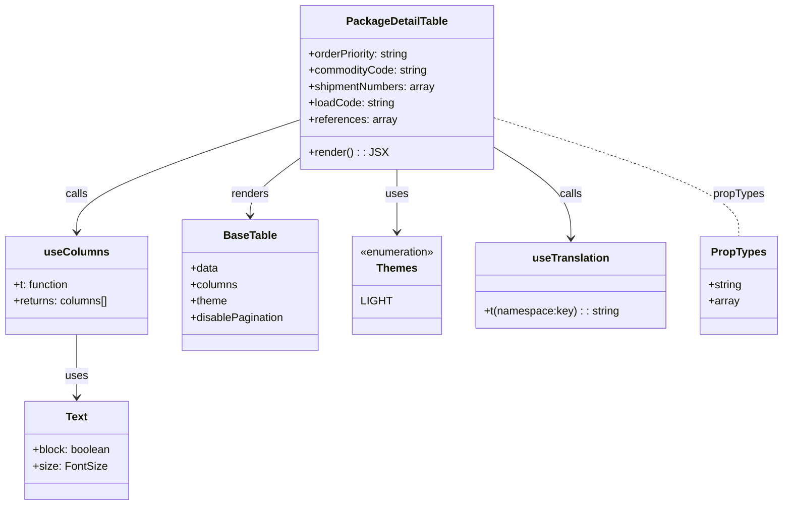

# Diagram: web/portal/src/pages/partview/details/components/organisms/PackageDetailsTable.organism.js


> Auto-generated by Obscura crawlers

## Diagram 1



### SVG

<svg id="container" width="1145.1171875" xmlns="http://www.w3.org/2000/svg" class="classDiagram" height="740" viewBox="0 0 1145.1171875 740" role="graphics-document document" aria-roledescription="class"><style>#container{font-family:"trebuchet ms",verdana,arial,sans-serif;font-size:16px;fill:#333;}@keyframes edge-animation-frame{from{stroke-dashoffset:0;}}@keyframes dash{to{stroke-dashoffset:0;}}#container .edge-animation-slow{stroke-dasharray:9,5!important;stroke-dashoffset:900;animation:dash 50s linear infinite;stroke-linecap:round;}#container .edge-animation-fast{stroke-dasharray:9,5!important;stroke-dashoffset:900;animation:dash 20s linear infinite;stroke-linecap:round;}#container .error-icon{fill:#552222;}#container .error-text{fill:#552222;stroke:#552222;}#container .edge-thickness-normal{stroke-width:1px;}#container .edge-thickness-thick{stroke-width:3.5px;}#container .edge-pattern-solid{stroke-dasharray:0;}#container .edge-thickness-invisible{stroke-width:0;fill:none;}#container .edge-pattern-dashed{stroke-dasharray:3;}#container .edge-pattern-dotted{stroke-dasharray:2;}#container .marker{fill:#333333;stroke:#333333;}#container .marker.cross{stroke:#333333;}#container svg{font-family:"trebuchet ms",verdana,arial,sans-serif;font-size:16px;}#container p{margin:0;}#container g.classGroup text{fill:#9370DB;stroke:none;font-family:"trebuchet ms",verdana,arial,sans-serif;font-size:10px;}#container g.classGroup text .title{font-weight:bolder;}#container .nodeLabel,#container .edgeLabel{color:#131300;}#container .edgeLabel .label rect{fill:#ECECFF;}#container .label text{fill:#131300;}#container .labelBkg{background:#ECECFF;}#container .edgeLabel .label span{background:#ECECFF;}#container .classTitle{font-weight:bolder;}#container .node rect,#container .node circle,#container .node ellipse,#container .node polygon,#container .node path{fill:#ECECFF;stroke:#9370DB;stroke-width:1px;}#container .divider{stroke:#9370DB;stroke-width:1;}#container g.clickable{cursor:pointer;}#container g.classGroup rect{fill:#ECECFF;stroke:#9370DB;}#container g.classGroup line{stroke:#9370DB;stroke-width:1;}#container .classLabel .box{stroke:none;stroke-width:0;fill:#ECECFF;opacity:0.5;}#container .classLabel .label{fill:#9370DB;font-size:10px;}#container .relation{stroke:#333333;stroke-width:1;fill:none;}#container .dashed-line{stroke-dasharray:3;}#container .dotted-line{stroke-dasharray:1 2;}#container #compositionStart,#container .composition{fill:#333333!important;stroke:#333333!important;stroke-width:1;}#container #compositionEnd,#container .composition{fill:#333333!important;stroke:#333333!important;stroke-width:1;}#container #dependencyStart,#container .dependency{fill:#333333!important;stroke:#333333!important;stroke-width:1;}#container #dependencyStart,#container .dependency{fill:#333333!important;stroke:#333333!important;stroke-width:1;}#container #extensionStart,#container .extension{fill:transparent!important;stroke:#333333!important;stroke-width:1;}#container #extensionEnd,#container .extension{fill:transparent!important;stroke:#333333!important;stroke-width:1;}#container #aggregationStart,#container .aggregation{fill:transparent!important;stroke:#333333!important;stroke-width:1;}#container #aggregationEnd,#container .aggregation{fill:transparent!important;stroke:#333333!important;stroke-width:1;}#container #lollipopStart,#container .lollipop{fill:#ECECFF!important;stroke:#333333!important;stroke-width:1;}#container #lollipopEnd,#container .lollipop{fill:#ECECFF!important;stroke:#333333!important;stroke-width:1;}#container .edgeTerminals{font-size:11px;line-height:initial;}#container .classTitleText{text-anchor:middle;font-size:18px;fill:#333;}#container .label-icon{display:inline-block;height:1em;overflow:visible;vertical-align:-0.125em;}#container .node .label-icon path{fill:currentColor;stroke:revert;stroke-width:revert;}#container :root{--mermaid-font-family:"trebuchet ms",verdana,arial,sans-serif;}</style><g><defs><marker id="container_class-aggregationStart" class="marker aggregation class" refX="18" refY="7" markerWidth="190" markerHeight="240" orient="auto"><path d="M 18,7 L9,13 L1,7 L9,1 Z"></path></marker></defs><defs><marker id="container_class-aggregationEnd" class="marker aggregation class" refX="1" refY="7" markerWidth="20" markerHeight="28" orient="auto"><path d="M 18,7 L9,13 L1,7 L9,1 Z"></path></marker></defs><defs><marker id="container_class-extensionStart" class="marker extension class" refX="18" refY="7" markerWidth="190" markerHeight="240" orient="auto"><path d="M 1,7 L18,13 V 1 Z"></path></marker></defs><defs><marker id="container_class-extensionEnd" class="marker extension class" refX="1" refY="7" markerWidth="20" markerHeight="28" orient="auto"><path d="M 1,1 V 13 L18,7 Z"></path></marker></defs><defs><marker id="container_class-compositionStart" class="marker composition class" refX="18" refY="7" markerWidth="190" markerHeight="240" orient="auto"><path d="M 18,7 L9,13 L1,7 L9,1 Z"></path></marker></defs><defs><marker id="container_class-compositionEnd" class="marker composition class" refX="1" refY="7" markerWidth="20" markerHeight="28" orient="auto"><path d="M 18,7 L9,13 L1,7 L9,1 Z"></path></marker></defs><defs><marker id="container_class-dependencyStart" class="marker dependency class" refX="6" refY="7" markerWidth="190" markerHeight="240" orient="auto"><path d="M 5,7 L9,13 L1,7 L9,1 Z"></path></marker></defs><defs><marker id="container_class-dependencyEnd" class="marker dependency class" refX="13" refY="7" markerWidth="20" markerHeight="28" orient="auto"><path d="M 18,7 L9,13 L14,7 L9,1 Z"></path></marker></defs><defs><marker id="container_class-lollipopStart" class="marker lollipop class" refX="13" refY="7" markerWidth="190" markerHeight="240" orient="auto"><circle stroke="black" fill="transparent" cx="7" cy="7" r="6"></circle></marker></defs><defs><marker id="container_class-lollipopEnd" class="marker lollipop class" refX="1" refY="7" markerWidth="190" markerHeight="240" orient="auto"><circle stroke="black" fill="transparent" cx="7" cy="7" r="6"></circle></marker></defs><g class="root"><g class="clusters"></g><g class="edgePaths"><path d="M441.891,175.055L386.934,193.379C331.978,211.704,222.065,248.352,167.109,275.843C112.152,303.333,112.152,321.667,112.152,330.833L112.152,340" id="id_PackageDetailTable_useColumns_1" class="edge-thickness-normal edge-pattern-solid relation" style=";;;" data-edge="true" data-et="edge" data-id="id_PackageDetailTable_useColumns_1" data-points="W3sieCI6NDQxLjg5MDYyNSwieSI6MTc1LjA1NTMyNTU3Mzg3MTEzfSx7IngiOjExMi4xNTIzNDM3NSwieSI6Mjg1fSx7IngiOjExMi4xNTIzNDM3NSwieSI6MzQ2fV0=" marker-end="url(#container_class-dependencyEnd)"></path><path d="M724.141,214.927L743.101,226.606C762.061,238.285,799.982,261.642,818.942,283.988C837.902,306.333,837.902,327.667,837.902,338.333L837.902,349" id="id_PackageDetailTable_useTranslation_2" class="edge-thickness-normal edge-pattern-solid relation" style=";;;" data-edge="true" data-et="edge" data-id="id_PackageDetailTable_useTranslation_2" data-points="W3sieCI6NzI0LjE0MDYyNSwieSI6MjE0LjkyNzM0MjEwOTY5OTQ1fSx7IngiOjgzNy45MDIzNDM3NSwieSI6Mjg1fSx7IngiOjgzNy45MDIzNDM3NSwieSI6MzU1fV0=" marker-end="url(#container_class-dependencyEnd)"></path><path d="M441.891,230.042L429.223,239.202C416.555,248.361,391.219,266.681,378.551,281.007C365.883,295.333,365.883,305.667,365.883,310.833L365.883,316" id="id_PackageDetailTable_BaseTable_3" class="edge-thickness-normal edge-pattern-solid relation" style=";;;" data-edge="true" data-et="edge" data-id="id_PackageDetailTable_BaseTable_3" data-points="W3sieCI6NDQxLjg5MDYyNSwieSI6MjMwLjA0MTgwOTA4ODYxOTQzfSx7IngiOjM2NS44ODI4MTI1LCJ5IjoyODV9LHsieCI6MzY1Ljg4MjgxMjUsInkiOjMyMn1d" marker-end="url(#container_class-dependencyEnd)"></path><path d="M112.152,490L112.152,500.167C112.152,510.333,112.152,530.667,112.152,546C112.152,561.333,112.152,571.667,112.152,576.833L112.152,582" id="id_useColumns_Text_4" class="edge-thickness-normal edge-pattern-solid relation" style=";;;" data-edge="true" data-et="edge" data-id="id_useColumns_Text_4" data-points="W3sieCI6MTEyLjE1MjM0Mzc1LCJ5Ijo0OTB9LHsieCI6MTEyLjE1MjM0Mzc1LCJ5Ijo1NTF9LHsieCI6MTEyLjE1MjM0Mzc1LCJ5Ijo1ODh9XQ==" marker-end="url(#container_class-dependencyEnd)"></path><path d="M583.016,248L583.016,254.167C583.016,260.333,583.016,272.667,583.016,288C583.016,303.333,583.016,321.667,583.016,330.833L583.016,340" id="id_PackageDetailTable_Themes_5" class="edge-thickness-normal edge-pattern-solid relation" style=";;;" data-edge="true" data-et="edge" data-id="id_PackageDetailTable_Themes_5" data-points="W3sieCI6NTgzLjAxNTYyNSwieSI6MjQ4fSx7IngiOjU4My4wMTU2MjUsInkiOjI4NX0seyJ4Ijo1ODMuMDE1NjI1LCJ5IjozNDZ9XQ==" marker-end="url(#container_class-dependencyEnd)"></path><path d="M724.141,172.477L783.646,191.231C843.152,209.985,962.164,247.492,1021.67,276.413C1081.176,305.333,1081.176,325.667,1081.176,335.833L1081.176,346" id="id_PackageDetailTable_PropTypes_6" class="edge-thickness-normal edge-pattern-dashed relation" style=";;;" data-edge="true" data-et="edge" data-id="id_PackageDetailTable_PropTypes_6" data-points="W3sieCI6NzI0LjE0MDYyNSwieSI6MTcyLjQ3NjkxMTEzMzkzODE2fSx7IngiOjEwODEuMTc1NzgxMjUsInkiOjI4NX0seyJ4IjoxMDgxLjE3NTc4MTI1LCJ5IjozNDZ9XQ=="></path></g><g class="edgeLabels"><g class="edgeLabel" transform="translate(112.15234375, 285)"><g class="label" data-id="id_PackageDetailTable_useColumns_1" transform="translate(-16.4453125, -12)"><foreignObject width="32.890625" height="24"><div xmlns="http://www.w3.org/1999/xhtml" class="labelBkg" style="display: table-cell; white-space: nowrap; line-height: 1.5; max-width: 200px; text-align: center;"><span class="edgeLabel"><p>calls</p></span></div></foreignObject></g></g><g class="edgeLabel" transform="translate(837.90234375, 285)"><g class="label" data-id="id_PackageDetailTable_useTranslation_2" transform="translate(-16.4453125, -12)"><foreignObject width="32.890625" height="24"><div xmlns="http://www.w3.org/1999/xhtml" class="labelBkg" style="display: table-cell; white-space: nowrap; line-height: 1.5; max-width: 200px; text-align: center;"><span class="edgeLabel"><p>calls</p></span></div></foreignObject></g></g><g class="edgeLabel" transform="translate(365.8828125, 285)"><g class="label" data-id="id_PackageDetailTable_BaseTable_3" transform="translate(-27.75, -12)"><foreignObject width="55.5" height="24"><div xmlns="http://www.w3.org/1999/xhtml" class="labelBkg" style="display: table-cell; white-space: nowrap; line-height: 1.5; max-width: 200px; text-align: center;"><span class="edgeLabel"><p>renders</p></span></div></foreignObject></g></g><g class="edgeLabel" transform="translate(112.15234375, 551)"><g class="label" data-id="id_useColumns_Text_4" transform="translate(-16.4921875, -12)"><foreignObject width="32.984375" height="24"><div xmlns="http://www.w3.org/1999/xhtml" class="labelBkg" style="display: table-cell; white-space: nowrap; line-height: 1.5; max-width: 200px; text-align: center;"><span class="edgeLabel"><p>uses</p></span></div></foreignObject></g></g><g class="edgeLabel" transform="translate(583.015625, 285)"><g class="label" data-id="id_PackageDetailTable_Themes_5" transform="translate(-16.4921875, -12)"><foreignObject width="32.984375" height="24"><div xmlns="http://www.w3.org/1999/xhtml" class="labelBkg" style="display: table-cell; white-space: nowrap; line-height: 1.5; max-width: 200px; text-align: center;"><span class="edgeLabel"><p>uses</p></span></div></foreignObject></g></g><g class="edgeLabel" transform="translate(1081.17578125, 285)"><g class="label" data-id="id_PackageDetailTable_PropTypes_6" transform="translate(-37.625, -12)"><foreignObject width="75.25" height="24"><div xmlns="http://www.w3.org/1999/xhtml" class="labelBkg" style="display: table-cell; white-space: nowrap; line-height: 1.5; max-width: 200px; text-align: center;"><span class="edgeLabel"><p>propTypes</p></span></div></foreignObject></g></g></g><g class="nodes"><g class="node default" id="classId-PackageDetailTable-0" transform="translate(583.015625, 128)"><g class="basic label-container"><path d="M-141.125 -120 L141.125 -120 L141.125 120 L-141.125 120" stroke="none" stroke-width="0" fill="#ECECFF" style=""></path><path d="M-141.125 -120 C-36.79472834141728 -120, 67.53554331716543 -120, 141.125 -120 M-141.125 -120 C-30.934574950231635 -120, 79.25585009953673 -120, 141.125 -120 M141.125 -120 C141.125 -63.375251350439044, 141.125 -6.750502700878087, 141.125 120 M141.125 -120 C141.125 -55.297870918175335, 141.125 9.404258163649331, 141.125 120 M141.125 120 C81.62412894279741 120, 22.123257885594825 120, -141.125 120 M141.125 120 C55.094168567729525 120, -30.93666286454095 120, -141.125 120 M-141.125 120 C-141.125 28.75812686277996, -141.125 -62.48374627444008, -141.125 -120 M-141.125 120 C-141.125 57.04486757977869, -141.125 -5.910264840442622, -141.125 -120" stroke="#9370DB" stroke-width="1.3" fill="none" stroke-dasharray="0 0" style=""></path></g><g class="annotation-group text" transform="translate(0, -96)"></g><g class="label-group text" transform="translate(-71.3125, -96)"><g class="label" style="font-weight: bolder" transform="translate(0,-12)"><foreignObject width="142.625" height="24"><div xmlns="http://www.w3.org/1999/xhtml" style="display: table-cell; white-space: nowrap; line-height: 1.5; max-width: 190px; text-align: center;"><span class="nodeLabel markdown-node-label" style=""><p>PackageDetailTable</p></span></div></foreignObject></g></g><g class="members-group text" transform="translate(-129.125, -48)"><g class="label" style="" transform="translate(0,-12)"><foreignObject width="150.53125" height="24"><div xmlns="http://www.w3.org/1999/xhtml" style="display: table-cell; white-space: nowrap; line-height: 1.5; max-width: 209px; text-align: center;"><span class="nodeLabel markdown-node-label" style=""><p>+orderPriority: string</p></span></div></foreignObject></g><g class="label" style="" transform="translate(0,12)"><foreignObject width="175.0625" height="24"><div xmlns="http://www.w3.org/1999/xhtml" style="display: table-cell; white-space: nowrap; line-height: 1.5; max-width: 233px; text-align: center;"><span class="nodeLabel markdown-node-label" style=""><p>+commodityCode: string</p></span></div></foreignObject></g><g class="label" style="" transform="translate(0,36)"><foreignObject width="186.9375" height="24"><div xmlns="http://www.w3.org/1999/xhtml" style="display: table-cell; white-space: nowrap; line-height: 1.5; max-width: 244px; text-align: center;"><span class="nodeLabel markdown-node-label" style=""><p>+shipmentNumbers: array</p></span></div></foreignObject></g><g class="label" style="" transform="translate(0,60)"><foreignObject width="126.046875" height="24"><div xmlns="http://www.w3.org/1999/xhtml" style="display: table-cell; white-space: nowrap; line-height: 1.5; max-width: 184px; text-align: center;"><span class="nodeLabel markdown-node-label" style=""><p>+loadCode: string</p></span></div></foreignObject></g><g class="label" style="" transform="translate(0,84)"><foreignObject width="128.546875" height="24"><div xmlns="http://www.w3.org/1999/xhtml" style="display: table-cell; white-space: nowrap; line-height: 1.5; max-width: 186px; text-align: center;"><span class="nodeLabel markdown-node-label" style=""><p>+references: array</p></span></div></foreignObject></g></g><g class="methods-group text" transform="translate(-129.125, 96)"><g class="label" style="" transform="translate(0,-12)"><foreignObject width="109.140625" height="24"><div xmlns="http://www.w3.org/1999/xhtml" style="display: table-cell; white-space: nowrap; line-height: 1.5; max-width: 167px; text-align: center;"><span class="nodeLabel markdown-node-label" style=""><p>+render() : : JSX</p></span></div></foreignObject></g></g><g class="divider" style=""><path d="M-141.125 -72 C-80.8036468316835 -72, -20.482293663366974 -72, 141.125 -72 M-141.125 -72 C-69.95237749382645 -72, 1.2202450123471067 -72, 141.125 -72" stroke="#9370DB" stroke-width="1.3" fill="none" stroke-dasharray="0 0" style=""></path></g><g class="divider" style=""><path d="M-141.125 72 C-73.8361911589206 72, -6.547382317841198 72, 141.125 72 M-141.125 72 C-42.19543498236605 72, 56.734130035267896 72, 141.125 72" stroke="#9370DB" stroke-width="1.3" fill="none" stroke-dasharray="0 0" style=""></path></g></g><g class="node default" id="classId-useColumns-1" transform="translate(112.15234375, 418)"><g class="basic label-container"><path d="M-104.15234375 -72 L104.15234375 -72 L104.15234375 72 L-104.15234375 72" stroke="none" stroke-width="0" fill="#ECECFF" style=""></path><path d="M-104.15234375 -72 C-52.9389294933043 -72, -1.7255152366086008 -72, 104.15234375 -72 M-104.15234375 -72 C-44.297482524614246 -72, 15.557378700771508 -72, 104.15234375 -72 M104.15234375 -72 C104.15234375 -25.215321066160705, 104.15234375 21.56935786767859, 104.15234375 72 M104.15234375 -72 C104.15234375 -34.22894559893061, 104.15234375 3.5421088021387845, 104.15234375 72 M104.15234375 72 C57.521524676965804 72, 10.890705603931607 72, -104.15234375 72 M104.15234375 72 C57.48594618354156 72, 10.819548617083115 72, -104.15234375 72 M-104.15234375 72 C-104.15234375 42.01581900687027, -104.15234375 12.031638013740533, -104.15234375 -72 M-104.15234375 72 C-104.15234375 33.41751750937797, -104.15234375 -5.164964981244054, -104.15234375 -72" stroke="#9370DB" stroke-width="1.3" fill="none" stroke-dasharray="0 0" style=""></path></g><g class="annotation-group text" transform="translate(0, -48)"></g><g class="label-group text" transform="translate(-44.1640625, -48)"><g class="label" style="font-weight: bolder" transform="translate(0,-12)"><foreignObject width="88.328125" height="24"><div xmlns="http://www.w3.org/1999/xhtml" style="display: table-cell; white-space: nowrap; line-height: 1.5; max-width: 138px; text-align: center;"><span class="nodeLabel markdown-node-label" style=""><p>useColumns</p></span></div></foreignObject></g></g><g class="members-group text" transform="translate(-92.15234375, 0)"><g class="label" style="" transform="translate(0,-12)"><foreignObject width="82.53125" height="24"><div xmlns="http://www.w3.org/1999/xhtml" style="display: table-cell; white-space: nowrap; line-height: 1.5; max-width: 140px; text-align: center;"><span class="nodeLabel markdown-node-label" style=""><p>+t: function</p></span></div></foreignObject></g><g class="label" style="" transform="translate(0,12)"><foreignObject width="140.140625" height="24"><div xmlns="http://www.w3.org/1999/xhtml" style="display: table-cell; white-space: nowrap; line-height: 1.5; max-width: 198px; text-align: center;"><span class="nodeLabel markdown-node-label" style=""><p>+returns: columns[]</p></span></div></foreignObject></g></g><g class="methods-group text" transform="translate(-92.15234375, 72)"></g><g class="divider" style=""><path d="M-104.15234375 -24 C-55.45218827933822 -24, -6.7520328086764465 -24, 104.15234375 -24 M-104.15234375 -24 C-54.49935818962721 -24, -4.846372629254418 -24, 104.15234375 -24" stroke="#9370DB" stroke-width="1.3" fill="none" stroke-dasharray="0 0" style=""></path></g><g class="divider" style=""><path d="M-104.15234375 48 C-24.32345373911396 48, 55.50543627177208 48, 104.15234375 48 M-104.15234375 48 C-50.6487812497836 48, 2.8547812504327936 48, 104.15234375 48" stroke="#9370DB" stroke-width="1.3" fill="none" stroke-dasharray="0 0" style=""></path></g></g><g class="node default" id="classId-BaseTable-2" transform="translate(365.8828125, 418)"><g class="basic label-container"><path d="M-99.578125 -96 L99.578125 -96 L99.578125 96 L-99.578125 96" stroke="none" stroke-width="0" fill="#ECECFF" style=""></path><path d="M-99.578125 -96 C-37.294628434348894 -96, 24.988868131302212 -96, 99.578125 -96 M-99.578125 -96 C-37.591540520629685 -96, 24.39504395874063 -96, 99.578125 -96 M99.578125 -96 C99.578125 -41.72034577236708, 99.578125 12.559308455265835, 99.578125 96 M99.578125 -96 C99.578125 -44.666528337432794, 99.578125 6.666943325134412, 99.578125 96 M99.578125 96 C20.274771843202984 96, -59.02858131359403 96, -99.578125 96 M99.578125 96 C49.76319532753628 96, -0.051734344927439224 96, -99.578125 96 M-99.578125 96 C-99.578125 45.64474960743584, -99.578125 -4.710500785128318, -99.578125 -96 M-99.578125 96 C-99.578125 22.47164012586984, -99.578125 -51.05671974826032, -99.578125 -96" stroke="#9370DB" stroke-width="1.3" fill="none" stroke-dasharray="0 0" style=""></path></g><g class="annotation-group text" transform="translate(0, -72)"></g><g class="label-group text" transform="translate(-37.359375, -72)"><g class="label" style="font-weight: bolder" transform="translate(0,-12)"><foreignObject width="74.71875" height="24"><div xmlns="http://www.w3.org/1999/xhtml" style="display: table-cell; white-space: nowrap; line-height: 1.5; max-width: 123px; text-align: center;"><span class="nodeLabel markdown-node-label" style=""><p>BaseTable</p></span></div></foreignObject></g></g><g class="members-group text" transform="translate(-87.578125, -24)"><g class="label" style="" transform="translate(0,-12)"><foreignObject width="40.625" height="24"><div xmlns="http://www.w3.org/1999/xhtml" style="display: table-cell; white-space: nowrap; line-height: 1.5; max-width: 98px; text-align: center;"><span class="nodeLabel markdown-node-label" style=""><p>+data</p></span></div></foreignObject></g><g class="label" style="" transform="translate(0,12)"><foreignObject width="69.21875" height="24"><div xmlns="http://www.w3.org/1999/xhtml" style="display: table-cell; white-space: nowrap; line-height: 1.5; max-width: 127px; text-align: center;"><span class="nodeLabel markdown-node-label" style=""><p>+columns</p></span></div></foreignObject></g><g class="label" style="" transform="translate(0,36)"><foreignObject width="54.21875" height="24"><div xmlns="http://www.w3.org/1999/xhtml" style="display: table-cell; white-space: nowrap; line-height: 1.5; max-width: 112px; text-align: center;"><span class="nodeLabel markdown-node-label" style=""><p>+theme</p></span></div></foreignObject></g><g class="label" style="" transform="translate(0,60)"><foreignObject width="137.796875" height="24"><div xmlns="http://www.w3.org/1999/xhtml" style="display: table-cell; white-space: nowrap; line-height: 1.5; max-width: 195px; text-align: center;"><span class="nodeLabel markdown-node-label" style=""><p>+disablePagination</p></span></div></foreignObject></g></g><g class="methods-group text" transform="translate(-87.578125, 96)"></g><g class="divider" style=""><path d="M-99.578125 -48 C-43.38910155611929 -48, 12.799921887761414 -48, 99.578125 -48 M-99.578125 -48 C-25.794946686711256 -48, 47.98823162657749 -48, 99.578125 -48" stroke="#9370DB" stroke-width="1.3" fill="none" stroke-dasharray="0 0" style=""></path></g><g class="divider" style=""><path d="M-99.578125 72 C-59.431215275640355 72, -19.28430555128071 72, 99.578125 72 M-99.578125 72 C-37.65517519490286 72, 24.26777461019428 72, 99.578125 72" stroke="#9370DB" stroke-width="1.3" fill="none" stroke-dasharray="0 0" style=""></path></g></g><g class="node default" id="classId-Text-3" transform="translate(112.15234375, 660)"><g class="basic label-container"><path d="M-77.12890625 -72 L77.12890625 -72 L77.12890625 72 L-77.12890625 72" stroke="none" stroke-width="0" fill="#ECECFF" style=""></path><path d="M-77.12890625 -72 C-22.308809632688494 -72, 32.51128698462301 -72, 77.12890625 -72 M-77.12890625 -72 C-43.32444824442875 -72, -9.519990238857503 -72, 77.12890625 -72 M77.12890625 -72 C77.12890625 -15.880193043337513, 77.12890625 40.23961391332497, 77.12890625 72 M77.12890625 -72 C77.12890625 -31.10003365929115, 77.12890625 9.799932681417701, 77.12890625 72 M77.12890625 72 C34.153104415509496 72, -8.822697418981008 72, -77.12890625 72 M77.12890625 72 C24.814631698948546 72, -27.49964285210291 72, -77.12890625 72 M-77.12890625 72 C-77.12890625 17.379399146065765, -77.12890625 -37.24120170786847, -77.12890625 -72 M-77.12890625 72 C-77.12890625 23.482582627125495, -77.12890625 -25.03483474574901, -77.12890625 -72" stroke="#9370DB" stroke-width="1.3" fill="none" stroke-dasharray="0 0" style=""></path></g><g class="annotation-group text" transform="translate(0, -48)"></g><g class="label-group text" transform="translate(-15.3828125, -48)"><g class="label" style="font-weight: bolder" transform="translate(0,-12)"><foreignObject width="30.765625" height="24"><div xmlns="http://www.w3.org/1999/xhtml" style="display: table-cell; white-space: nowrap; line-height: 1.5; max-width: 80px; text-align: center;"><span class="nodeLabel markdown-node-label" style=""><p>Text</p></span></div></foreignObject></g></g><g class="members-group text" transform="translate(-65.12890625, 0)"><g class="label" style="" transform="translate(0,-12)"><foreignObject width="114.875" height="24"><div xmlns="http://www.w3.org/1999/xhtml" style="display: table-cell; white-space: nowrap; line-height: 1.5; max-width: 172px; text-align: center;"><span class="nodeLabel markdown-node-label" style=""><p>+block: boolean</p></span></div></foreignObject></g><g class="label" style="" transform="translate(0,12)"><foreignObject width="104.28125" height="24"><div xmlns="http://www.w3.org/1999/xhtml" style="display: table-cell; white-space: nowrap; line-height: 1.5; max-width: 162px; text-align: center;"><span class="nodeLabel markdown-node-label" style=""><p>+size: FontSize</p></span></div></foreignObject></g></g><g class="methods-group text" transform="translate(-65.12890625, 72)"></g><g class="divider" style=""><path d="M-77.12890625 -24 C-26.05748521153862 -24, 25.01393582692276 -24, 77.12890625 -24 M-77.12890625 -24 C-43.352046718897036 -24, -9.575187187794072 -24, 77.12890625 -24" stroke="#9370DB" stroke-width="1.3" fill="none" stroke-dasharray="0 0" style=""></path></g><g class="divider" style=""><path d="M-77.12890625 48 C-28.911479050842033 48, 19.305948148315935 48, 77.12890625 48 M-77.12890625 48 C-43.00220420877287 48, -8.875502167545747 48, 77.12890625 48" stroke="#9370DB" stroke-width="1.3" fill="none" stroke-dasharray="0 0" style=""></path></g></g><g class="node default" id="classId-Themes-4" transform="translate(583.015625, 418)"><g class="basic label-container"><path d="M-67.5546875 -72 L67.5546875 -72 L67.5546875 72 L-67.5546875 72" stroke="none" stroke-width="0" fill="#ECECFF" style=""></path><path d="M-67.5546875 -72 C-27.60317215906153 -72, 12.348343181876942 -72, 67.5546875 -72 M-67.5546875 -72 C-39.29774668462247 -72, -11.040805869244934 -72, 67.5546875 -72 M67.5546875 -72 C67.5546875 -18.16908553083877, 67.5546875 35.66182893832246, 67.5546875 72 M67.5546875 -72 C67.5546875 -27.911989133446, 67.5546875 16.176021733108, 67.5546875 72 M67.5546875 72 C24.062750823829802 72, -19.429185852340396 72, -67.5546875 72 M67.5546875 72 C28.076656344809926 72, -11.401374810380148 72, -67.5546875 72 M-67.5546875 72 C-67.5546875 35.58616071276433, -67.5546875 -0.8276785744713351, -67.5546875 -72 M-67.5546875 72 C-67.5546875 42.447611664656264, -67.5546875 12.895223329312529, -67.5546875 -72" stroke="#9370DB" stroke-width="1.3" fill="none" stroke-dasharray="0 0" style=""></path></g><g class="annotation-group text" transform="translate(-55.5546875, -48)"><g class="label" style="" transform="translate(0,-12)"><foreignObject width="111.109375" height="24"><div xmlns="http://www.w3.org/1999/xhtml" style="display: table-cell; white-space: nowrap; line-height: 1.5; max-width: 161px; text-align: center;"><span class="nodeLabel markdown-node-label" style=""><p>«enumeration»</p></span></div></foreignObject></g></g><g class="label-group text" transform="translate(-28.3984375, -24)"><g class="label" style="font-weight: bolder" transform="translate(0,-12)"><foreignObject width="56.796875" height="24"><div xmlns="http://www.w3.org/1999/xhtml" style="display: table-cell; white-space: nowrap; line-height: 1.5; max-width: 106px; text-align: center;"><span class="nodeLabel markdown-node-label" style=""><p>Themes</p></span></div></foreignObject></g></g><g class="members-group text" transform="translate(-55.5546875, 24)"><g class="label" style="" transform="translate(0,-12)"><foreignObject width="41.9375" height="24"><div xmlns="http://www.w3.org/1999/xhtml" style="display: table-cell; white-space: nowrap; line-height: 1.5; max-width: 93px; text-align: center;"><span class="nodeLabel markdown-node-label" style=""><p>LIGHT</p></span></div></foreignObject></g></g><g class="methods-group text" transform="translate(-55.5546875, 72)"></g><g class="divider" style=""><path d="M-67.5546875 0 C-25.755678302495554 0, 16.043330895008893 0, 67.5546875 0 M-67.5546875 0 C-36.320832165270645 0, -5.086976830541296 0, 67.5546875 0" stroke="#9370DB" stroke-width="1.3" fill="none" stroke-dasharray="0 0" style=""></path></g><g class="divider" style=""><path d="M-67.5546875 48 C-38.3633582681298 48, -9.172029036259602 48, 67.5546875 48 M-67.5546875 48 C-17.33381350032252 48, 32.88706049935496 48, 67.5546875 48" stroke="#9370DB" stroke-width="1.3" fill="none" stroke-dasharray="0 0" style=""></path></g></g><g class="node default" id="classId-useTranslation-5" transform="translate(837.90234375, 418)"><g class="basic label-container"><path d="M-137.33203125 -63 L137.33203125 -63 L137.33203125 63 L-137.33203125 63" stroke="none" stroke-width="0" fill="#ECECFF" style=""></path><path d="M-137.33203125 -63 C-44.09082606565502 -63, 49.150379118689955 -63, 137.33203125 -63 M-137.33203125 -63 C-57.92248523454718 -63, 21.487060780905637 -63, 137.33203125 -63 M137.33203125 -63 C137.33203125 -15.685171420671836, 137.33203125 31.62965715865633, 137.33203125 63 M137.33203125 -63 C137.33203125 -18.030833627520515, 137.33203125 26.93833274495897, 137.33203125 63 M137.33203125 63 C79.4685520384727 63, 21.605072826945403 63, -137.33203125 63 M137.33203125 63 C50.5937639567902 63, -36.144503336419604 63, -137.33203125 63 M-137.33203125 63 C-137.33203125 34.591321954233365, -137.33203125 6.182643908466723, -137.33203125 -63 M-137.33203125 63 C-137.33203125 19.107526658271524, -137.33203125 -24.78494668345695, -137.33203125 -63" stroke="#9370DB" stroke-width="1.3" fill="none" stroke-dasharray="0 0" style=""></path></g><g class="annotation-group text" transform="translate(0, -39)"></g><g class="label-group text" transform="translate(-54.0859375, -39)"><g class="label" style="font-weight: bolder" transform="translate(0,-12)"><foreignObject width="108.171875" height="24"><div xmlns="http://www.w3.org/1999/xhtml" style="display: table-cell; white-space: nowrap; line-height: 1.5; max-width: 157px; text-align: center;"><span class="nodeLabel markdown-node-label" style=""><p>useTranslation</p></span></div></foreignObject></g></g><g class="members-group text" transform="translate(-125.33203125, 9)"></g><g class="methods-group text" transform="translate(-125.33203125, 39)"><g class="label" style="" transform="translate(0,-12)"><foreignObject width="196.578125" height="24"><div xmlns="http://www.w3.org/1999/xhtml" style="display: table-cell; white-space: nowrap; line-height: 1.5; max-width: 255px; text-align: center;"><span class="nodeLabel markdown-node-label" style=""><p>+t(namespace:key) : : string</p></span></div></foreignObject></g></g><g class="divider" style=""><path d="M-137.33203125 -15 C-27.8769352054495 -15, 81.578160839101 -15, 137.33203125 -15 M-137.33203125 -15 C-35.943412768565366 -15, 65.44520571286927 -15, 137.33203125 -15" stroke="#9370DB" stroke-width="1.3" fill="none" stroke-dasharray="0 0" style=""></path></g><g class="divider" style=""><path d="M-137.33203125 9 C-76.4524845576199 9, -15.572937865239808 9, 137.33203125 9 M-137.33203125 9 C-28.145055797614873 9, 81.04191965477025 9, 137.33203125 9" stroke="#9370DB" stroke-width="1.3" fill="none" stroke-dasharray="0 0" style=""></path></g></g><g class="node default" id="classId-PropTypes-6" transform="translate(1081.17578125, 418)"><g class="basic label-container"><path d="M-55.94140625 -72 L55.94140625 -72 L55.94140625 72 L-55.94140625 72" stroke="none" stroke-width="0" fill="#ECECFF" style=""></path><path d="M-55.94140625 -72 C-30.9640867055421 -72, -5.986767161084202 -72, 55.94140625 -72 M-55.94140625 -72 C-21.695248830072877 -72, 12.550908589854245 -72, 55.94140625 -72 M55.94140625 -72 C55.94140625 -30.920283987776898, 55.94140625 10.159432024446204, 55.94140625 72 M55.94140625 -72 C55.94140625 -35.5929556158637, 55.94140625 0.8140887682725975, 55.94140625 72 M55.94140625 72 C29.910074405938442 72, 3.8787425618768836 72, -55.94140625 72 M55.94140625 72 C32.47180527479202 72, 9.002204299584044 72, -55.94140625 72 M-55.94140625 72 C-55.94140625 17.558140678021736, -55.94140625 -36.88371864395653, -55.94140625 -72 M-55.94140625 72 C-55.94140625 15.506273822646648, -55.94140625 -40.987452354706704, -55.94140625 -72" stroke="#9370DB" stroke-width="1.3" fill="none" stroke-dasharray="0 0" style=""></path></g><g class="annotation-group text" transform="translate(0, -48)"></g><g class="label-group text" transform="translate(-38.2578125, -48)"><g class="label" style="font-weight: bolder" transform="translate(0,-12)"><foreignObject width="76.515625" height="24"><div xmlns="http://www.w3.org/1999/xhtml" style="display: table-cell; white-space: nowrap; line-height: 1.5; max-width: 125px; text-align: center;"><span class="nodeLabel markdown-node-label" style=""><p>PropTypes</p></span></div></foreignObject></g></g><g class="members-group text" transform="translate(-43.94140625, 0)"><g class="label" style="" transform="translate(0,-12)"><foreignObject width="49.625" height="24"><div xmlns="http://www.w3.org/1999/xhtml" style="display: table-cell; white-space: nowrap; line-height: 1.5; max-width: 108px; text-align: center;"><span class="nodeLabel markdown-node-label" style=""><p>+string</p></span></div></foreignObject></g><g class="label" style="" transform="translate(0,12)"><foreignObject width="44.578125" height="24"><div xmlns="http://www.w3.org/1999/xhtml" style="display: table-cell; white-space: nowrap; line-height: 1.5; max-width: 102px; text-align: center;"><span class="nodeLabel markdown-node-label" style=""><p>+array</p></span></div></foreignObject></g></g><g class="methods-group text" transform="translate(-43.94140625, 72)"></g><g class="divider" style=""><path d="M-55.94140625 -24 C-12.70741714912652 -24, 30.52657195174696 -24, 55.94140625 -24 M-55.94140625 -24 C-16.58126782977694 -24, 22.778870590446118 -24, 55.94140625 -24" stroke="#9370DB" stroke-width="1.3" fill="none" stroke-dasharray="0 0" style=""></path></g><g class="divider" style=""><path d="M-55.94140625 48 C-12.405413915142702 48, 31.130578419714595 48, 55.94140625 48 M-55.94140625 48 C-32.69871577686827 48, -9.456025303736546 48, 55.94140625 48" stroke="#9370DB" stroke-width="1.3" fill="none" stroke-dasharray="0 0" style=""></path></g></g></g></g></g></svg>

## Diagram 2

```mermaid
flowchart LR
    A[PackageDetailTable(props)] --> B[useTranslation("partview-details")]
    A --> C[useColumns()]
    C --> D[columns array with Name & Value columns]
    A --> E[Build packageDetailsList]
    E --> F{references?.length > 0}
    F -- yes --> G[for each reference: push key/value to packageDetailsList]
    F -- no --> H[skip references]
    E --> I[handle shipmentNumbers array or single value]
    I --> J[final packageDetailsList]
    J --> K[BaseTable data=packageDetailsList, columns=columns, theme=LIGHT, disablePagination]
    K --> L[Rendered table UI]
```

> SVG rendering failed for this diagram.
