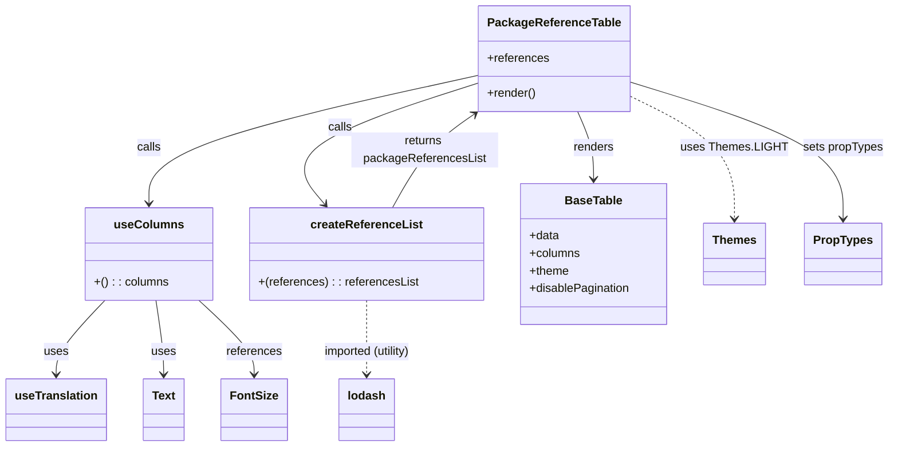

# Diagram: web/portal/src/pages/partview/details/components/organisms/PackageReferencesTable.organism.js

> Auto-generated by Obscura crawlers

## Mermaid

### SVG

<svg id="container" width="1189.912109375" xmlns="http://www.w3.org/2000/svg" class="classDiagram" height="608" viewBox="0 0 1189.912109375 608" role="graphics-document document" aria-roledescription="class"><g><defs><marker id="container_class-aggregationStart" class="marker aggregation class" refX="18" refY="7" markerWidth="190" markerHeight="240" orient="auto"><path d="M 18,7 L9,13 L1,7 L9,1 Z"></path></marker></defs><defs><marker id="container_class-aggregationEnd" class="marker aggregation class" refX="1" refY="7" markerWidth="20" markerHeight="28" orient="auto"><path d="M 18,7 L9,13 L1,7 L9,1 Z"></path></marker></defs><defs><marker id="container_class-extensionStart" class="marker extension class" refX="18" refY="7" markerWidth="190" markerHeight="240" orient="auto"><path d="M 1,7 L18,13 V 1 Z"></path></marker></defs><defs><marker id="container_class-extensionEnd" class="marker extension class" refX="1" refY="7" markerWidth="20" markerHeight="28" orient="auto"><path d="M 1,1 V 13 L18,7 Z"></path></marker></defs><defs><marker id="container_class-compositionStart" class="marker composition class" refX="18" refY="7" markerWidth="190" markerHeight="240" orient="auto"><path d="M 18,7 L9,13 L1,7 L9,1 Z"></path></marker></defs><defs><marker id="container_class-compositionEnd" class="marker composition class" refX="1" refY="7" markerWidth="20" markerHeight="28" orient="auto"><path d="M 18,7 L9,13 L1,7 L9,1 Z"></path></marker></defs><defs><marker id="container_class-dependencyStart" class="marker dependency class" refX="6" refY="7" markerWidth="190" markerHeight="240" orient="auto"><path d="M 5,7 L9,13 L1,7 L9,1 Z"></path></marker></defs><defs><marker id="container_class-dependencyEnd" class="marker dependency class" refX="13" refY="7" markerWidth="20" markerHeight="28" orient="auto"><path d="M 18,7 L9,13 L14,7 L9,1 Z"></path></marker></defs><defs><marker id="container_class-lollipopStart" class="marker lollipop class" refX="13" refY="7" markerWidth="190" markerHeight="240" orient="auto"><circle stroke="black" fill="transparent" cx="7" cy="7" r="6"></circle></marker></defs><defs><marker id="container_class-lollipopEnd" class="marker lollipop class" refX="1" refY="7" markerWidth="190" markerHeight="240" orient="auto"><circle stroke="black" fill="transparent" cx="7" cy="7" r="6"></circle></marker></defs><g class="root"><g class="clusters"></g><g class="edgePaths"><path d="M641.629,101.896L567.562,118.414C493.495,134.931,345.362,167.965,271.295,197.149C197.229,226.333,197.229,251.667,197.229,264.333L197.229,277" id="id_PackageReferenceTable_useColumns_1" class="edge-thickness-normal edge-pattern-solid relation" style=";;;" data-edge="true" data-et="edge" data-id="id_PackageReferenceTable_useColumns_1" data-points="W3sieCI6NjQxLjYyODkwNjI1LCJ5IjoxMDEuODk2MzM3MzU4OTM4ODJ9LHsieCI6MTk3LjIyODUxNTYyNSwieSI6MjAxfSx7IngiOjE5Ny4yMjg1MTU2MjUsInkiOjI4M31d" marker-end="url(#container_class-dependencyEnd)"></path><path d="M641.629,112.025L596.163,126.854C550.697,141.683,459.764,171.342,424.854,199.064C389.943,226.786,411.054,252.572,421.61,265.465L432.165,278.357" id="id_PackageReferenceTable_createReferenceList_2" class="edge-thickness-normal edge-pattern-solid relation" style=";;;" data-edge="true" data-et="edge" data-id="id_PackageReferenceTable_createReferenceList_2" data-points="W3sieCI6NjQxLjYyODkwNjI1LCJ5IjoxMTIuMDI0NzY1MTkzOTUxOTF9LHsieCI6MzY4LjgzMjAzMTI1LCJ5IjoyMDF9LHsieCI6NDM1Ljk2NjIxNzY3MjQxMzgsInkiOjI4M31d" marker-end="url(#container_class-dependencyEnd)"></path><path d="M771.68,152L775.294,160.167C778.909,168.333,786.137,184.667,789.751,200C793.365,215.333,793.365,229.667,793.365,236.833L793.365,244" id="id_PackageReferenceTable_BaseTable_3" class="edge-thickness-normal edge-pattern-solid relation" style=";;;" data-edge="true" data-et="edge" data-id="id_PackageReferenceTable_BaseTable_3" data-points="W3sieCI6NzcxLjY4MDE3MTc0NTg2NzcsInkiOjE1Mn0seyJ4Ijo3OTMuMzY1MjM0Mzc1LCJ5IjoyMDF9LHsieCI6NzkzLjM2NTIzNDM3NSwieSI6MjUwfV0=" marker-end="url(#container_class-dependencyEnd)"></path><path d="M838.004,110.65L886.244,125.708C934.484,140.767,1030.964,170.883,1079.203,202.108C1127.443,233.333,1127.443,265.667,1127.443,281.833L1127.443,298" id="id_PackageReferenceTable_PropTypes_4" class="edge-thickness-normal edge-pattern-solid relation" style=";;;" data-edge="true" data-et="edge" data-id="id_PackageReferenceTable_PropTypes_4" data-points="W3sieCI6ODM4LjAwMzkwNjI1LCJ5IjoxMTAuNjQ5Nzk3MTkzNDU5OH0seyJ4IjoxMTI3LjQ0MzM1OTM3NSwieSI6MjAxfSx7IngiOjExMjcuNDQzMzU5Mzc1LCJ5IjozMDR9XQ==" marker-end="url(#container_class-dependencyEnd)"></path><path d="M838.004,128.786L862.227,140.822C886.45,152.857,934.896,176.929,959.119,205.131C983.342,233.333,983.342,265.667,983.342,281.833L983.342,298" id="id_PackageReferenceTable_Themes_5" class="edge-thickness-normal edge-pattern-dashed relation" style=";;;" data-edge="true" data-et="edge" data-id="id_PackageReferenceTable_Themes_5" data-points="W3sieCI6ODM4LjAwMzkwNjI1LCJ5IjoxMjguNzg2MjM3MzE4MDQxNDZ9LHsieCI6OTgzLjM0MTc5Njg3NSwieSI6MjAxfSx7IngiOjk4My4zNDE3OTY4NzUsInkiOjMwNH1d" marker-end="url(#container_class-dependencyEnd)"></path><path d="M138.898,409L128.096,420.667C117.294,432.333,95.69,455.667,84.888,472.5C74.086,489.333,74.086,499.667,74.086,504.833L74.086,510" id="id_useColumns_useTranslation_6" class="edge-thickness-normal edge-pattern-solid relation" style=";;;" data-edge="true" data-et="edge" data-id="id_useColumns_useTranslation_6" data-points="W3sieCI6MTM4Ljg5NzgyMDcyMzY4NDIyLCJ5Ijo0MDl9LHsieCI6NzQuMDg1OTM3NSwieSI6NDc5fSx7IngiOjc0LjA4NTkzNzUsInkiOjUxNn1d" marker-end="url(#container_class-dependencyEnd)"></path><path d="M206.857,409L208.64,420.667C210.423,432.333,213.989,455.667,215.772,472.5C217.555,489.333,217.555,499.667,217.555,504.833L217.555,510" id="id_useColumns_Text_7" class="edge-thickness-normal edge-pattern-solid relation" style=";;;" data-edge="true" data-et="edge" data-id="id_useColumns_Text_7" data-points="W3sieCI6MjA2Ljg1NjcwMjMwMjYzMTYsInkiOjQwOX0seyJ4IjoyMTcuNTU0Njg3NSwieSI6NDc5fSx7IngiOjIxNy41NTQ2ODc1LCJ5Ijo1MTZ9XQ==" marker-end="url(#container_class-dependencyEnd)"></path><path d="M263.806,409L276.135,420.667C288.465,432.333,313.123,455.667,325.452,472.5C337.781,489.333,337.781,499.667,337.781,504.833L337.781,510" id="id_useColumns_FontSize_8" class="edge-thickness-normal edge-pattern-solid relation" style=";;;" data-edge="true" data-et="edge" data-id="id_useColumns_FontSize_8" data-points="W3sieCI6MjYzLjgwNjEyNjY0NDczNjgsInkiOjQwOX0seyJ4IjozMzcuNzgxMjUsInkiOjQ3OX0seyJ4IjozMzcuNzgxMjUsInkiOjUxNn1d" marker-end="url(#container_class-dependencyEnd)"></path><path d="M487.545,409L487.545,420.667C487.545,432.333,487.545,455.667,487.545,472.5C487.545,489.333,487.545,499.667,487.545,504.833L487.545,510" id="id_createReferenceList_lodash_9" class="edge-thickness-normal edge-pattern-dashed relation" style=";;;" data-edge="true" data-et="edge" data-id="id_createReferenceList_lodash_9" data-points="W3sieCI6NDg3LjU0NDkyMTg3NSwieSI6NDA5fSx7IngiOjQ4Ny41NDQ5MjE4NzUsInkiOjQ3OX0seyJ4Ijo0ODcuNTQ0OTIxODc1LCJ5Ijo1MTZ9XQ==" marker-end="url(#container_class-dependencyEnd)"></path><path d="M521.884,283L529.334,269.333C536.783,255.667,551.681,228.333,570.819,206.503C589.957,184.672,613.333,168.344,625.022,160.18L636.71,152.017" id="id_createReferenceList_PackageReferenceTable_10" class="edge-thickness-normal edge-pattern-solid relation" style=";;;" data-edge="true" data-et="edge" data-id="id_createReferenceList_PackageReferenceTable_10" data-points="W3sieCI6NTIxLjg4NDMzNDU5MDUxNzMsInkiOjI4M30seyJ4Ijo1NjYuNTgwMDc4MTI1LCJ5IjoyMDF9LHsieCI6NjQxLjYyODkwNjI1LCJ5IjoxNDguNTgwODA4ODIxMDQyNH1d" marker-end="url(#container_class-dependencyEnd)"></path></g><g class="edgeLabels"><g class="edgeLabel" transform="translate(197.228515625, 201)"><g class="label" data-id="id_PackageReferenceTable_useColumns_1" transform="translate(-16.4453125, -12)"><foreignObject width="32.890625" height="24">

calls

</foreignObject></g></g><g class="edgeLabel" transform="translate(454.85408, 172.94311)"><g class="label" data-id="id_PackageReferenceTable_createReferenceList_2" transform="translate(-16.4453125, -12)"><foreignObject width="32.890625" height="24">

calls

</foreignObject></g></g><g class="edgeLabel" transform="translate(793.365234375, 201)"><g class="label" data-id="id_PackageReferenceTable_BaseTable_3" transform="translate(-27.75, -12)"><foreignObject width="55.5" height="24">

renders

</foreignObject></g></g><g class="edgeLabel" transform="translate(1127.443359375, 201)"><g class="label" data-id="id_PackageReferenceTable_PropTypes_4" transform="translate(-54.46875, -12)"><foreignObject width="108.9375" height="24">

sets propTypes

</foreignObject></g></g><g class="edgeLabel" transform="translate(983.341796875, 201)"><g class="label" data-id="id_PackageReferenceTable_Themes_5" transform="translate(-69.6328125, -12)"><foreignObject width="139.265625" height="24">

uses Themes.LIGHT

</foreignObject></g></g><g class="edgeLabel" transform="translate(74.0859375, 479)"><g class="label" data-id="id_useColumns_useTranslation_6" transform="translate(-16.4921875, -12)"><foreignObject width="32.984375" height="24">

uses

</foreignObject></g></g><g class="edgeLabel" transform="translate(217.5546875, 479)"><g class="label" data-id="id_useColumns_Text_7" transform="translate(-16.4921875, -12)"><foreignObject width="32.984375" height="24">

uses

</foreignObject></g></g><g class="edgeLabel" transform="translate(337.78125, 479)"><g class="label" data-id="id_useColumns_FontSize_8" transform="translate(-37.828125, -12)"><foreignObject width="75.65625" height="24">

references

</foreignObject></g></g><g class="edgeLabel" transform="translate(487.544921875, 479)"><g class="label" data-id="id_createReferenceList_lodash_9" transform="translate(-62.03125, -12)"><foreignObject width="124.0625" height="24">

imported (utility)

</foreignObject></g></g><g class="edgeLabel" transform="translate(566.13805, 201.81096)"><g class="label" data-id="id_createReferenceList_PackageReferenceTable_10" transform="translate(-100, -24)"><foreignObject width="200" height="48">

returns packageReferencesList

</foreignObject></g></g></g><g class="nodes"><g class="node default" id="classId-PackageReferenceTable-0" transform="translate(739.81640625, 80)"><g class="basic label-container"><path d="M-98.1875 -72 L98.1875 -72 L98.1875 72 L-98.1875 72" stroke="none" stroke-width="0" fill="#ECECFF" style=""></path><path d="M-98.1875 -72 C-21.154806436940106 -72, 55.87788712611979 -72, 98.1875 -72 M-98.1875 -72 C-44.81493263161569 -72, 8.55763473676862 -72, 98.1875 -72 M98.1875 -72 C98.1875 -40.72007291076876, 98.1875 -9.440145821537513, 98.1875 72 M98.1875 -72 C98.1875 -21.705494912621504, 98.1875 28.589010174756993, 98.1875 72 M98.1875 72 C27.002925653597302 72, -44.181648692805396 72, -98.1875 72 M98.1875 72 C50.25066241610839 72, 2.313824832216781 72, -98.1875 72 M-98.1875 72 C-98.1875 36.13496529902249, -98.1875 0.2699305980449793, -98.1875 -72 M-98.1875 72 C-98.1875 37.53314510856274, -98.1875 3.066290217125484, -98.1875 -72" stroke="#9370DB" stroke-width="1.3" fill="none" stroke-dasharray="0 0" style=""></path></g><g class="annotation-group text" transform="translate(0, -48)"></g><g class="label-group text" transform="translate(-86.1875, -48)"><g class="label" style="font-weight: bolder" transform="translate(0,-12)"><foreignObject width="172.375" height="24">

PackageReferenceTable

</foreignObject></g></g><g class="members-group text" transform="translate(-86.1875, 0)"><g class="label" style="" transform="translate(0,-12)"><foreignObject width="83.640625" height="24">

+references

</foreignObject></g></g><g class="methods-group text" transform="translate(-86.1875, 48)"><g class="label" style="" transform="translate(0,-12)"><foreignObject width="66.609375" height="24">

+render()

</foreignObject></g></g><g class="divider" style=""><path d="M-98.1875 -24 C-46.123741784691525 -24, 5.94001643061695 -24, 98.1875 -24 M-98.1875 -24 C-24.289003807199492 -24, 49.609492385601015 -24, 98.1875 -24" stroke="#9370DB" stroke-width="1.3" fill="none" stroke-dasharray="0 0" style=""></path></g><g class="divider" style=""><path d="M-98.1875 24 C-39.04793805456996 24, 20.091623890860077 24, 98.1875 24 M-98.1875 24 C-27.215170828796275 24, 43.75715834240745 24, 98.1875 24" stroke="#9370DB" stroke-width="1.3" fill="none" stroke-dasharray="0 0" style=""></path></g></g><g class="node default" id="classId-useColumns-1" transform="translate(197.228515625, 346)"><g class="basic label-container"><path d="M-84.07421875 -63 L84.07421875 -63 L84.07421875 63 L-84.07421875 63" stroke="none" stroke-width="0" fill="#ECECFF" style=""></path><path d="M-84.07421875 -63 C-49.66021567705864 -63, -15.246212604117275 -63, 84.07421875 -63 M-84.07421875 -63 C-30.801083203524847 -63, 22.472052342950306 -63, 84.07421875 -63 M84.07421875 -63 C84.07421875 -29.498642093035144, 84.07421875 4.002715813929711, 84.07421875 63 M84.07421875 -63 C84.07421875 -24.00946580915187, 84.07421875 14.98106838169626, 84.07421875 63 M84.07421875 63 C33.80936459520893 63, -16.455489559582134 63, -84.07421875 63 M84.07421875 63 C38.96848551216001 63, -6.137247725679984 63, -84.07421875 63 M-84.07421875 63 C-84.07421875 13.961898967951136, -84.07421875 -35.07620206409773, -84.07421875 -63 M-84.07421875 63 C-84.07421875 36.82929473640488, -84.07421875 10.658589472809766, -84.07421875 -63" stroke="#9370DB" stroke-width="1.3" fill="none" stroke-dasharray="0 0" style=""></path></g><g class="annotation-group text" transform="translate(0, -39)"></g><g class="label-group text" transform="translate(-44.1640625, -39)"><g class="label" style="font-weight: bolder" transform="translate(0,-12)"><foreignObject width="88.328125" height="24">

useColumns

</foreignObject></g></g><g class="members-group text" transform="translate(-72.07421875, 9)"></g><g class="methods-group text" transform="translate(-72.07421875, 39)"><g class="label" style="" transform="translate(0,-12)"><foreignObject width="99.984375" height="24">

+() : : columns

</foreignObject></g></g><g class="divider" style=""><path d="M-84.07421875 -15 C-43.903386589711545 -15, -3.7325544294230895 -15, 84.07421875 -15 M-84.07421875 -15 C-34.741707299720254 -15, 14.590804150559492 -15, 84.07421875 -15" stroke="#9370DB" stroke-width="1.3" fill="none" stroke-dasharray="0 0" style=""></path></g><g class="divider" style=""><path d="M-84.07421875 9 C-38.23198114894123 9, 7.6102564521175395 9, 84.07421875 9 M-84.07421875 9 C-18.083301702876994 9, 47.90761534424601 9, 84.07421875 9" stroke="#9370DB" stroke-width="1.3" fill="none" stroke-dasharray="0 0" style=""></path></g></g><g class="node default" id="classId-createReferenceList-2" transform="translate(487.544921875, 346)"><g class="basic label-container"><path d="M-156.2421875 -63 L156.2421875 -63 L156.2421875 63 L-156.2421875 63" stroke="none" stroke-width="0" fill="#ECECFF" style=""></path><path d="M-156.2421875 -63 C-68.555223042812 -63, 19.131741414375995 -63, 156.2421875 -63 M-156.2421875 -63 C-72.60289201279579 -63, 11.036403474408417 -63, 156.2421875 -63 M156.2421875 -63 C156.2421875 -25.401461258400666, 156.2421875 12.197077483198669, 156.2421875 63 M156.2421875 -63 C156.2421875 -33.061966856647295, 156.2421875 -3.1239337132945906, 156.2421875 63 M156.2421875 63 C74.47667615421992 63, -7.2888351915601675 63, -156.2421875 63 M156.2421875 63 C69.66329666932481 63, -16.915594161350384 63, -156.2421875 63 M-156.2421875 63 C-156.2421875 17.397733021517034, -156.2421875 -28.204533956965932, -156.2421875 -63 M-156.2421875 63 C-156.2421875 12.736490114423063, -156.2421875 -37.527019771153874, -156.2421875 -63" stroke="#9370DB" stroke-width="1.3" fill="none" stroke-dasharray="0 0" style=""></path></g><g class="annotation-group text" transform="translate(0, -39)"></g><g class="label-group text" transform="translate(-72.703125, -39)"><g class="label" style="font-weight: bolder" transform="translate(0,-12)"><foreignObject width="145.40625" height="24">

createReferenceList

</foreignObject></g></g><g class="members-group text" transform="translate(-144.2421875, 9)"></g><g class="methods-group text" transform="translate(-144.2421875, 39)"><g class="label" style="" transform="translate(0,-12)"><foreignObject width="215.78125" height="24">

+(references) : : referencesList

</foreignObject></g></g><g class="divider" style=""><path d="M-156.2421875 -15 C-57.1791082881593 -15, 41.8839709236814 -15, 156.2421875 -15 M-156.2421875 -15 C-52.261598292114456 -15, 51.71899091577109 -15, 156.2421875 -15" stroke="#9370DB" stroke-width="1.3" fill="none" stroke-dasharray="0 0" style=""></path></g><g class="divider" style=""><path d="M-156.2421875 9 C-47.7456596933591 9, 60.7508681132818 9, 156.2421875 9 M-156.2421875 9 C-73.56783983628247 9, 9.106507827435053 9, 156.2421875 9" stroke="#9370DB" stroke-width="1.3" fill="none" stroke-dasharray="0 0" style=""></path></g></g><g class="node default" id="classId-BaseTable-3" transform="translate(793.365234375, 346)"><g class="basic label-container"><path d="M-99.578125 -96 L99.578125 -96 L99.578125 96 L-99.578125 96" stroke="none" stroke-width="0" fill="#ECECFF" style=""></path><path d="M-99.578125 -96 C-29.79987780726904 -96, 39.97836938546192 -96, 99.578125 -96 M-99.578125 -96 C-44.181436229569705 -96, 11.21525254086059 -96, 99.578125 -96 M99.578125 -96 C99.578125 -31.83969251215302, 99.578125 32.32061497569396, 99.578125 96 M99.578125 -96 C99.578125 -53.72752153848796, 99.578125 -11.455043076975926, 99.578125 96 M99.578125 96 C38.33310147755959 96, -22.911922044880825 96, -99.578125 96 M99.578125 96 C39.540382486922645 96, -20.49736002615471 96, -99.578125 96 M-99.578125 96 C-99.578125 26.619176390030304, -99.578125 -42.76164721993939, -99.578125 -96 M-99.578125 96 C-99.578125 38.12402104555173, -99.578125 -19.751957908896543, -99.578125 -96" stroke="#9370DB" stroke-width="1.3" fill="none" stroke-dasharray="0 0" style=""></path></g><g class="annotation-group text" transform="translate(0, -72)"></g><g class="label-group text" transform="translate(-37.359375, -72)"><g class="label" style="font-weight: bolder" transform="translate(0,-12)"><foreignObject width="74.71875" height="24">

BaseTable

</foreignObject></g></g><g class="members-group text" transform="translate(-87.578125, -24)"><g class="label" style="" transform="translate(0,-12)"><foreignObject width="40.625" height="24">

+data

</foreignObject></g><g class="label" style="" transform="translate(0,12)"><foreignObject width="69.21875" height="24">

+columns

</foreignObject></g><g class="label" style="" transform="translate(0,36)"><foreignObject width="54.21875" height="24">

+theme

</foreignObject></g><g class="label" style="" transform="translate(0,60)"><foreignObject width="137.796875" height="24">

+disablePagination

</foreignObject></g></g><g class="methods-group text" transform="translate(-87.578125, 96)"></g><g class="divider" style=""><path d="M-99.578125 -48 C-31.220591020467594 -48, 37.13694295906481 -48, 99.578125 -48 M-99.578125 -48 C-58.47882269489408 -48, -17.379520389788155 -48, 99.578125 -48" stroke="#9370DB" stroke-width="1.3" fill="none" stroke-dasharray="0 0" style=""></path></g><g class="divider" style=""><path d="M-99.578125 72 C-56.89944264669157 72, -14.220760293383137 72, 99.578125 72 M-99.578125 72 C-47.72982693847589 72, 4.118471123048224 72, 99.578125 72" stroke="#9370DB" stroke-width="1.3" fill="none" stroke-dasharray="0 0" style=""></path></g></g><g class="node default" id="classId-Text-4" transform="translate(217.5546875, 558)"><g class="basic label-container"><path d="M-27.3828125 -42 L27.3828125 -42 L27.3828125 42 L-27.3828125 42" stroke="none" stroke-width="0" fill="#ECECFF" style=""></path><path d="M-27.3828125 -42 C-9.412760573784993 -42, 8.557291352430013 -42, 27.3828125 -42 M-27.3828125 -42 C-6.681531162472044 -42, 14.019750175055911 -42, 27.3828125 -42 M27.3828125 -42 C27.3828125 -13.079587168152095, 27.3828125 15.84082566369581, 27.3828125 42 M27.3828125 -42 C27.3828125 -19.99551774264386, 27.3828125 2.0089645147122823, 27.3828125 42 M27.3828125 42 C10.195378984882453 42, -6.9920545302350945 42, -27.3828125 42 M27.3828125 42 C9.773091144512229 42, -7.836630210975542 42, -27.3828125 42 M-27.3828125 42 C-27.3828125 10.68132175405843, -27.3828125 -20.63735649188314, -27.3828125 -42 M-27.3828125 42 C-27.3828125 10.74940824173796, -27.3828125 -20.50118351652408, -27.3828125 -42" stroke="#9370DB" stroke-width="1.3" fill="none" stroke-dasharray="0 0" style=""></path></g><g class="annotation-group text" transform="translate(0, -18)"></g><g class="label-group text" transform="translate(-15.3828125, -18)"><g class="label" style="font-weight: bolder" transform="translate(0,-12)"><foreignObject width="30.765625" height="24">

Text

</foreignObject></g></g><g class="members-group text" transform="translate(-15.3828125, 30)"></g><g class="methods-group text" transform="translate(-15.3828125, 60)"></g><g class="divider" style=""><path d="M-27.3828125 6 C-16.14124627889967 6, -4.899680057799337 6, 27.3828125 6 M-27.3828125 6 C-15.699651542634108 6, -4.016490585268215 6, 27.3828125 6" stroke="#9370DB" stroke-width="1.3" fill="none" stroke-dasharray="0 0" style=""></path></g><g class="divider" style=""><path d="M-27.3828125 24 C-10.148934680036742 24, 7.084943139926516 24, 27.3828125 24 M-27.3828125 24 C-12.370276771830294 24, 2.642258956339411 24, 27.3828125 24" stroke="#9370DB" stroke-width="1.3" fill="none" stroke-dasharray="0 0" style=""></path></g></g><g class="node default" id="classId-FontSize-5" transform="translate(337.78125, 558)"><g class="basic label-container"><path d="M-42.84375 -42 L42.84375 -42 L42.84375 42 L-42.84375 42" stroke="none" stroke-width="0" fill="#ECECFF" style=""></path><path d="M-42.84375 -42 C-24.500925570526295 -42, -6.15810114105259 -42, 42.84375 -42 M-42.84375 -42 C-14.190705066788443 -42, 14.462339866423115 -42, 42.84375 -42 M42.84375 -42 C42.84375 -23.65489765381377, 42.84375 -5.309795307627539, 42.84375 42 M42.84375 -42 C42.84375 -19.817710253424412, 42.84375 2.364579493151176, 42.84375 42 M42.84375 42 C18.313385474929504 42, -6.216979050140992 42, -42.84375 42 M42.84375 42 C22.86434705113391 42, 2.8849441022678235 42, -42.84375 42 M-42.84375 42 C-42.84375 10.186748561792164, -42.84375 -21.62650287641567, -42.84375 -42 M-42.84375 42 C-42.84375 13.355470295830628, -42.84375 -15.289059408338744, -42.84375 -42" stroke="#9370DB" stroke-width="1.3" fill="none" stroke-dasharray="0 0" style=""></path></g><g class="annotation-group text" transform="translate(0, -18)"></g><g class="label-group text" transform="translate(-30.84375, -18)"><g class="label" style="font-weight: bolder" transform="translate(0,-12)"><foreignObject width="61.6875" height="24">

FontSize

</foreignObject></g></g><g class="members-group text" transform="translate(-30.84375, 30)"></g><g class="methods-group text" transform="translate(-30.84375, 60)"></g><g class="divider" style=""><path d="M-42.84375 6 C-24.469675810694213 6, -6.095601621388425 6, 42.84375 6 M-42.84375 6 C-23.221553981068087 6, -3.5993579621361746 6, 42.84375 6" stroke="#9370DB" stroke-width="1.3" fill="none" stroke-dasharray="0 0" style=""></path></g><g class="divider" style=""><path d="M-42.84375 24 C-23.700523473273975 24, -4.55729694654795 24, 42.84375 24 M-42.84375 24 C-19.153114355036774 24, 4.5375212899264525 24, 42.84375 24" stroke="#9370DB" stroke-width="1.3" fill="none" stroke-dasharray="0 0" style=""></path></g></g><g class="node default" id="classId-Themes-6" transform="translate(983.341796875, 346)"><g class="basic label-container"><path d="M-40.3984375 -42 L40.3984375 -42 L40.3984375 42 L-40.3984375 42" stroke="none" stroke-width="0" fill="#ECECFF" style=""></path><path d="M-40.3984375 -42 C-10.73948700986967 -42, 18.91946348026066 -42, 40.3984375 -42 M-40.3984375 -42 C-18.35786672815659 -42, 3.682704043686819 -42, 40.3984375 -42 M40.3984375 -42 C40.3984375 -16.503972327548997, 40.3984375 8.992055344902006, 40.3984375 42 M40.3984375 -42 C40.3984375 -20.119922840962033, 40.3984375 1.7601543180759336, 40.3984375 42 M40.3984375 42 C20.05878909941563 42, -0.28085930116873925 42, -40.3984375 42 M40.3984375 42 C8.673226941517559 42, -23.051983616964883 42, -40.3984375 42 M-40.3984375 42 C-40.3984375 17.218568981394167, -40.3984375 -7.562862037211666, -40.3984375 -42 M-40.3984375 42 C-40.3984375 19.624693327646764, -40.3984375 -2.7506133447064727, -40.3984375 -42" stroke="#9370DB" stroke-width="1.3" fill="none" stroke-dasharray="0 0" style=""></path></g><g class="annotation-group text" transform="translate(0, -18)"></g><g class="label-group text" transform="translate(-28.3984375, -18)"><g class="label" style="font-weight: bolder" transform="translate(0,-12)"><foreignObject width="56.796875" height="24">

Themes

</foreignObject></g></g><g class="members-group text" transform="translate(-28.3984375, 30)"></g><g class="methods-group text" transform="translate(-28.3984375, 60)"></g><g class="divider" style=""><path d="M-40.3984375 6 C-14.545270799529781 6, 11.307895900940437 6, 40.3984375 6 M-40.3984375 6 C-10.009968915941368 6, 20.378499668117264 6, 40.3984375 6" stroke="#9370DB" stroke-width="1.3" fill="none" stroke-dasharray="0 0" style=""></path></g><g class="divider" style=""><path d="M-40.3984375 24 C-9.382287767698255 24, 21.63386196460349 24, 40.3984375 24 M-40.3984375 24 C-12.704824618527262 24, 14.988788262945477 24, 40.3984375 24" stroke="#9370DB" stroke-width="1.3" fill="none" stroke-dasharray="0 0" style=""></path></g></g><g class="node default" id="classId-useTranslation-7" transform="translate(74.0859375, 558)"><g class="basic label-container"><path d="M-66.0859375 -42 L66.0859375 -42 L66.0859375 42 L-66.0859375 42" stroke="none" stroke-width="0" fill="#ECECFF" style=""></path><path d="M-66.0859375 -42 C-23.407311005459107 -42, 19.271315489081786 -42, 66.0859375 -42 M-66.0859375 -42 C-31.520953219979667 -42, 3.044031060040666 -42, 66.0859375 -42 M66.0859375 -42 C66.0859375 -23.613728685141663, 66.0859375 -5.227457370283325, 66.0859375 42 M66.0859375 -42 C66.0859375 -15.086301703695394, 66.0859375 11.827396592609212, 66.0859375 42 M66.0859375 42 C24.61184162939422 42, -16.86225424121156 42, -66.0859375 42 M66.0859375 42 C22.391800831899964 42, -21.302335836200072 42, -66.0859375 42 M-66.0859375 42 C-66.0859375 14.798313300932609, -66.0859375 -12.403373398134782, -66.0859375 -42 M-66.0859375 42 C-66.0859375 9.566411611094054, -66.0859375 -22.867176777811892, -66.0859375 -42" stroke="#9370DB" stroke-width="1.3" fill="none" stroke-dasharray="0 0" style=""></path></g><g class="annotation-group text" transform="translate(0, -18)"></g><g class="label-group text" transform="translate(-54.0859375, -18)"><g class="label" style="font-weight: bolder" transform="translate(0,-12)"><foreignObject width="108.171875" height="24">

useTranslation

</foreignObject></g></g><g class="members-group text" transform="translate(-54.0859375, 30)"></g><g class="methods-group text" transform="translate(-54.0859375, 60)"></g><g class="divider" style=""><path d="M-66.0859375 6 C-16.721677355121273 6, 32.642582789757455 6, 66.0859375 6 M-66.0859375 6 C-30.88828305274707 6, 4.30937139450586 6, 66.0859375 6" stroke="#9370DB" stroke-width="1.3" fill="none" stroke-dasharray="0 0" style=""></path></g><g class="divider" style=""><path d="M-66.0859375 24 C-17.50363872242341 24, 31.07866005515318 24, 66.0859375 24 M-66.0859375 24 C-36.57074482498184 24, -7.055552149963674 24, 66.0859375 24" stroke="#9370DB" stroke-width="1.3" fill="none" stroke-dasharray="0 0" style=""></path></g></g><g class="node default" id="classId-PropTypes-8" transform="translate(1127.443359375, 346)"><g class="basic label-container"><path d="M-50.2578125 -42 L50.2578125 -42 L50.2578125 42 L-50.2578125 42" stroke="none" stroke-width="0" fill="#ECECFF" style=""></path><path d="M-50.2578125 -42 C-21.554695081333332 -42, 7.148422337333336 -42, 50.2578125 -42 M-50.2578125 -42 C-14.653225022047529 -42, 20.951362455904942 -42, 50.2578125 -42 M50.2578125 -42 C50.2578125 -20.250079115058156, 50.2578125 1.4998417698836874, 50.2578125 42 M50.2578125 -42 C50.2578125 -20.917853909215093, 50.2578125 0.16429218156981307, 50.2578125 42 M50.2578125 42 C28.016220419521787 42, 5.7746283390435735 42, -50.2578125 42 M50.2578125 42 C18.79576058835098 42, -12.66629132329804 42, -50.2578125 42 M-50.2578125 42 C-50.2578125 21.41193487860099, -50.2578125 0.8238697572019831, -50.2578125 -42 M-50.2578125 42 C-50.2578125 14.01249593660156, -50.2578125 -13.97500812679688, -50.2578125 -42" stroke="#9370DB" stroke-width="1.3" fill="none" stroke-dasharray="0 0" style=""></path></g><g class="annotation-group text" transform="translate(0, -18)"></g><g class="label-group text" transform="translate(-38.2578125, -18)"><g class="label" style="font-weight: bolder" transform="translate(0,-12)"><foreignObject width="76.515625" height="24">

PropTypes

</foreignObject></g></g><g class="members-group text" transform="translate(-38.2578125, 30)"></g><g class="methods-group text" transform="translate(-38.2578125, 60)"></g><g class="divider" style=""><path d="M-50.2578125 6 C-18.145939432368273 6, 13.965933635263454 6, 50.2578125 6 M-50.2578125 6 C-18.84206273406033 6, 12.573687031879338 6, 50.2578125 6" stroke="#9370DB" stroke-width="1.3" fill="none" stroke-dasharray="0 0" style=""></path></g><g class="divider" style=""><path d="M-50.2578125 24 C-24.02107480450091 24, 2.215662890998182 24, 50.2578125 24 M-50.2578125 24 C-25.19780544915084 24, -0.13779839830168328 24, 50.2578125 24" stroke="#9370DB" stroke-width="1.3" fill="none" stroke-dasharray="0 0" style=""></path></g></g><g class="node default" id="classId-lodash-9" transform="translate(487.544921875, 558)"><g class="basic label-container"><path d="M-36.59375 -42 L36.59375 -42 L36.59375 42 L-36.59375 42" stroke="none" stroke-width="0" fill="#ECECFF" style=""></path><path d="M-36.59375 -42 C-9.063267188731672 -42, 18.467215622536656 -42, 36.59375 -42 M-36.59375 -42 C-15.06818225898995 -42, 6.457385482020101 -42, 36.59375 -42 M36.59375 -42 C36.59375 -21.969371260111366, 36.59375 -1.938742520222732, 36.59375 42 M36.59375 -42 C36.59375 -24.560770323334253, 36.59375 -7.121540646668507, 36.59375 42 M36.59375 42 C7.491219771917816 42, -21.611310456164368 42, -36.59375 42 M36.59375 42 C14.803613093025916 42, -6.986523813948168 42, -36.59375 42 M-36.59375 42 C-36.59375 19.157922210404397, -36.59375 -3.6841555791912057, -36.59375 -42 M-36.59375 42 C-36.59375 24.738295814864895, -36.59375 7.476591629729789, -36.59375 -42" stroke="#9370DB" stroke-width="1.3" fill="none" stroke-dasharray="0 0" style=""></path></g><g class="annotation-group text" transform="translate(0, -18)"></g><g class="label-group text" transform="translate(-24.59375, -18)"><g class="label" style="font-weight: bolder" transform="translate(0,-12)"><foreignObject width="49.1875" height="24">

lodash

</foreignObject></g></g><g class="members-group text" transform="translate(-24.59375, 30)"></g><g class="methods-group text" transform="translate(-24.59375, 60)"></g><g class="divider" style=""><path d="M-36.59375 6 C-15.959613201405688 6, 4.6745235971886245 6, 36.59375 6 M-36.59375 6 C-16.771104898845206 6, 3.051540202309589 6, 36.59375 6" stroke="#9370DB" stroke-width="1.3" fill="none" stroke-dasharray="0 0" style=""></path></g><g class="divider" style=""><path d="M-36.59375 24 C-21.508358874862264 24, -6.422967749724528 24, 36.59375 24 M-36.59375 24 C-17.75622610391555 24, 1.0812977921688969 24, 36.59375 24" stroke="#9370DB" stroke-width="1.3" fill="none" stroke-dasharray="0 0" style=""></path></g></g></g></g></g></svg>
