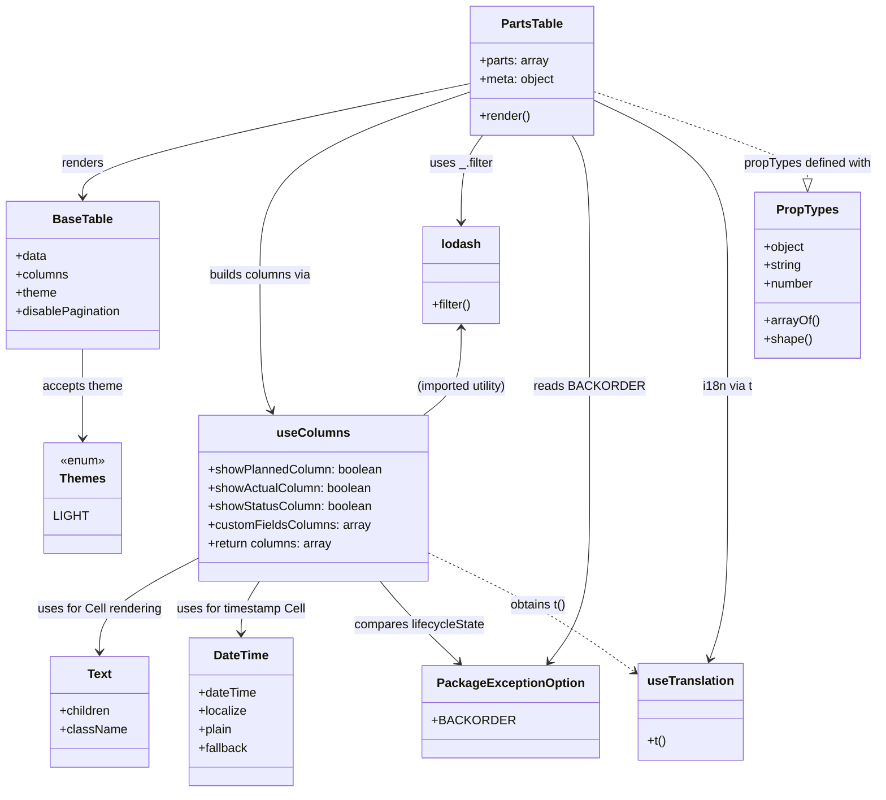

# Diagram: web/portal/src/pages/partview/details/components/organisms/PartsTable.organism.js

> Auto-generated by Obscura crawlers

## Mermaid

### SVG

<svg id="container" width="1125.439453125" xmlns="http://www.w3.org/2000/svg" class="classDiagram" height="1030" viewBox="0 0 1125.439453125 1030" role="graphics-document document" aria-roledescription="class"><g><defs><marker id="container_class-aggregationStart" class="marker aggregation class" refX="18" refY="7" markerWidth="190" markerHeight="240" orient="auto"><path d="M 18,7 L9,13 L1,7 L9,1 Z"></path></marker></defs><defs><marker id="container_class-aggregationEnd" class="marker aggregation class" refX="1" refY="7" markerWidth="20" markerHeight="28" orient="auto"><path d="M 18,7 L9,13 L1,7 L9,1 Z"></path></marker></defs><defs><marker id="container_class-extensionStart" class="marker extension class" refX="18" refY="7" markerWidth="190" markerHeight="240" orient="auto"><path d="M 1,7 L18,13 V 1 Z"></path></marker></defs><defs><marker id="container_class-extensionEnd" class="marker extension class" refX="1" refY="7" markerWidth="20" markerHeight="28" orient="auto"><path d="M 1,1 V 13 L18,7 Z"></path></marker></defs><defs><marker id="container_class-compositionStart" class="marker composition class" refX="18" refY="7" markerWidth="190" markerHeight="240" orient="auto"><path d="M 18,7 L9,13 L1,7 L9,1 Z"></path></marker></defs><defs><marker id="container_class-compositionEnd" class="marker composition class" refX="1" refY="7" markerWidth="20" markerHeight="28" orient="auto"><path d="M 18,7 L9,13 L1,7 L9,1 Z"></path></marker></defs><defs><marker id="container_class-dependencyStart" class="marker dependency class" refX="6" refY="7" markerWidth="190" markerHeight="240" orient="auto"><path d="M 5,7 L9,13 L1,7 L9,1 Z"></path></marker></defs><defs><marker id="container_class-dependencyEnd" class="marker dependency class" refX="13" refY="7" markerWidth="20" markerHeight="28" orient="auto"><path d="M 18,7 L9,13 L14,7 L9,1 Z"></path></marker></defs><defs><marker id="container_class-lollipopStart" class="marker lollipop class" refX="13" refY="7" markerWidth="190" markerHeight="240" orient="auto"><circle stroke="black" fill="transparent" cx="7" cy="7" r="6"></circle></marker></defs><defs><marker id="container_class-lollipopEnd" class="marker lollipop class" refX="1" refY="7" markerWidth="190" markerHeight="240" orient="auto"><circle stroke="black" fill="transparent" cx="7" cy="7" r="6"></circle></marker></defs><g class="root"><g class="clusters"></g><g class="edgePaths"><path d="M604.221,108.887L521.447,126.239C438.673,143.591,273.126,178.296,190.352,202.814C107.578,227.333,107.578,241.667,107.578,248.833L107.578,256" id="id_PartsTable_BaseTable_1" class="edge-thickness-normal edge-pattern-solid relation" style=";;;" data-edge="true" data-et="edge" data-id="id_PartsTable_BaseTable_1" data-points="W3sieCI6NjA0LjIyMDcwMzEyNSwieSI6MTA4Ljg4Njk3NzQxMzA3ODQzfSx7IngiOjEwNy41NzgxMjUsInkiOjIxM30seyJ4IjoxMDcuNTc4MTI1LCJ5IjoyNjJ9XQ==" marker-end="url(#container_class-dependencyEnd)"></path><path d="M604.221,120.315L560.272,135.762C516.324,151.21,428.428,182.105,384.479,221.719C340.531,261.333,340.531,309.667,340.531,358C340.531,406.333,340.531,454.667,342.992,484.094C345.453,513.522,350.375,524.043,352.836,529.304L355.296,534.565" id="id_PartsTable_useColumns_2" class="edge-thickness-normal edge-pattern-solid relation" style=";;;" data-edge="true" data-et="edge" data-id="id_PartsTable_useColumns_2" data-points="W3sieCI6NjA0LjIyMDcwMzEyNSwieSI6MTIwLjMxNDU0NzgzNzQ4MzYyfSx7IngiOjM0MC41MzEyNSwieSI6MjEzfSx7IngiOjM0MC41MzEyNSwieSI6MzU4fSx7IngiOjM0MC41MzEyNSwieSI6NTAzfSx7IngiOjM1Ny44Mzg2MTc5OTU2ODk3LCJ5Ijo1NDB9XQ==" marker-end="url(#container_class-dependencyEnd)"></path><path d="M621.272,176L616.61,182.167C611.948,188.333,602.625,200.667,597.963,219.5C593.301,238.333,593.301,263.667,593.301,276.333L593.301,289" id="id_PartsTable_lodash_3" class="edge-thickness-normal edge-pattern-solid relation" style=";;;" data-edge="true" data-et="edge" data-id="id_PartsTable_lodash_3" data-points="W3sieCI6NjIxLjI3MjM1NjAxNzU2MiwieSI6MTc2fSx7IngiOjU5My4zMDA3ODEyNSwieSI6MjEzfSx7IngiOjU5My4zMDA3ODEyNSwieSI6Mjk1fV0=" marker-end="url(#container_class-dependencyEnd)"></path><path d="M735.873,176L739.625,182.167C743.376,188.333,750.878,200.667,754.63,231C758.381,261.333,758.381,309.667,758.381,358C758.381,406.333,758.381,454.667,758.381,503C758.381,551.333,758.381,599.667,758.381,648C758.381,696.333,758.381,744.667,751.325,780.151C744.268,815.636,730.155,838.272,723.099,849.59L716.043,860.908" id="id_PartsTable_PackageExceptionOption_4" class="edge-thickness-normal edge-pattern-solid relation" style=";;;" data-edge="true" data-et="edge" data-id="id_PartsTable_PackageExceptionOption_4" data-points="W3sieCI6NzM1Ljg3MzQwMTk4ODYzNjQsInkiOjE3Nn0seyJ4Ijo3NTguMzgwODU5Mzc1LCJ5IjoyMTN9LHsieCI6NzU4LjM4MDg1OTM3NSwieSI6MzU4fSx7IngiOjc1OC4zODA4NTkzNzUsInkiOjUwM30seyJ4Ijo3NTguMzgwODU5Mzc1LCJ5Ijo2NDh9LHsieCI6NzU4LjM4MDg1OTM3NSwieSI6NzkzfSx7IngiOjcxMi44Njg0MjEwNTI2MzE2LCJ5Ijo4NjZ9XQ==" marker-end="url(#container_class-dependencyEnd)"></path><path d="M765.33,132.172L792.343,145.644C819.356,159.115,873.382,186.057,900.395,223.695C927.408,261.333,927.408,309.667,927.408,358C927.408,406.333,927.408,454.667,927.408,503C927.408,551.333,927.408,599.667,927.408,648C927.408,696.333,927.408,744.667,924.87,779.527C922.332,814.387,917.257,835.775,914.719,846.468L912.181,857.162" id="id_PartsTable_useTranslation_5" class="edge-thickness-normal edge-pattern-solid relation" style=";;;" data-edge="true" data-et="edge" data-id="id_PartsTable_useTranslation_5" data-points="W3sieCI6NzY1LjMzMDA3ODEyNSwieSI6MTMyLjE3MjI5NjEwMDcxODAzfSx7IngiOjkyNy40MDgyMDMxMjUsInkiOjIxM30seyJ4Ijo5MjcuNDA4MjAzMTI1LCJ5IjozNTh9LHsieCI6OTI3LjQwODIwMzEyNSwieSI6NTAzfSx7IngiOjkyNy40MDgyMDMxMjUsInkiOjY0OH0seyJ4Ijo5MjcuNDA4MjAzMTI1LCJ5Ijo3OTN9LHsieCI6OTEwLjc5NTMzMzA1OTIxMDUsInkiOjg2M31d" marker-end="url(#container_class-dependencyEnd)"></path><path d="M260.408,723.836L237.919,735.363C215.43,746.891,170.452,769.945,147.964,790.639C125.475,811.333,125.475,829.667,125.475,838.833L125.475,848" id="id_useColumns_Text_6" class="edge-thickness-normal edge-pattern-solid relation" style=";;;" data-edge="true" data-et="edge" data-id="id_useColumns_Text_6" data-points="W3sieCI6MjYwLjQwODIwMzEyNSwieSI6NzIzLjgzNTc3Mjg3NDE0NzN9LHsieCI6MTI1LjQ3NDYwOTM3NSwieSI6NzkzfSx7IngiOjEyNS40NzQ2MDkzNzUsInkiOjg1NH1d" marker-end="url(#container_class-dependencyEnd)"></path><path d="M337.151,756L333.085,762.167C329.019,768.333,320.887,780.667,316.822,792C312.756,803.333,312.756,813.667,312.756,818.833L312.756,824" id="id_useColumns_DateTime_7" class="edge-thickness-normal edge-pattern-solid relation" style=";;;" data-edge="true" data-et="edge" data-id="id_useColumns_DateTime_7" data-points="W3sieCI6MzM3LjE1MDc0MDg0MDUxNzI0LCJ5Ijo3NTZ9LHsieCI6MzEyLjc1NTg1OTM3NSwieSI6NzkzfSx7IngiOjMxMi43NTU4NTkzNzUsInkiOjgzMH1d" marker-end="url(#container_class-dependencyEnd)"></path><path d="M490.838,756L495.548,762.167C500.257,768.333,509.677,780.667,527.929,798.352C546.18,816.038,573.265,839.075,586.808,850.594L600.35,862.113" id="id_useColumns_PackageExceptionOption_8" class="edge-thickness-normal edge-pattern-solid relation" style=";;;" data-edge="true" data-et="edge" data-id="id_useColumns_PackageExceptionOption_8" data-points="W3sieCI6NDkwLjgzODM0ODU5OTEzNzkzLCJ5Ijo3NTZ9LHsieCI6NTE5LjA5NTcwMzEyNSwieSI6NzkzfSx7IngiOjYwNC45MjAyMzAyNjMxNTc5LCJ5Ijo4NjZ9XQ==" marker-end="url(#container_class-dependencyEnd)"></path><path d="M107.578,454L107.578,462.167C107.578,470.333,107.578,486.667,107.578,506C107.578,525.333,107.578,547.667,107.578,558.833L107.578,570" id="id_BaseTable_Themes_9" class="edge-thickness-normal edge-pattern-solid relation" style=";;;" data-edge="true" data-et="edge" data-id="id_BaseTable_Themes_9" data-points="W3sieCI6MTA3LjU3ODEyNSwieSI6NDU0fSx7IngiOjEwNy41NzgxMjUsInkiOjUwM30seyJ4IjoxMDcuNTc4MTI1LCJ5Ijo1NzZ9XQ==" marker-end="url(#container_class-dependencyEnd)"></path><path d="M765.33,120.037L809.846,135.531C854.361,151.025,943.393,182.012,987.908,200.798C1032.424,219.583,1032.424,226.167,1032.424,229.458L1032.424,232.75" id="id_PartsTable_PropTypes_10" class="edge-thickness-normal edge-pattern-dashed relation" style=";;;" data-edge="true" data-et="edge" data-id="id_PartsTable_PropTypes_10" data-points="W3sieCI6NzY1LjMzMDA3ODEyNSwieSI6MTIwLjAzNzI4MTczNjY2ODIzfSx7IngiOjEwMzIuNDIzODI4MTI1LCJ5IjoyMTN9LHsieCI6MTAzMi40MjM4MjgxMjUsInkiOjI1MH1d" marker-end="url(#container_class-extensionEnd)"></path><path d="M556.307,721.333L580.405,733.277C604.503,745.222,652.7,769.111,697.449,795.144C742.198,821.177,783.5,849.355,804.151,863.444L824.801,877.532" id="id_useColumns_useTranslation_11" class="edge-thickness-normal edge-pattern-dashed relation" style=";;;" data-edge="true" data-et="edge" data-id="id_useColumns_useTranslation_11" data-points="W3sieCI6NTU2LjMwNjY0MDYyNSwieSI6NzIxLjMzMjU1NDQxMzEzOTN9LHsieCI6NzAwLjg5NjQ4NDM3NSwieSI6NzkzfSx7IngiOjgyOS43NTc4MTI1LCJ5Ijo4ODAuOTEzODA4ODIyNDk4fV0=" marker-end="url(#container_class-dependencyEnd)"></path><path d="M593.301,427L593.301,439.667C593.301,452.333,593.301,477.667,585.435,496.5C577.57,515.333,561.839,527.667,553.974,533.833L546.108,540" id="id_lodash_useColumns_12" class="edge-thickness-normal edge-pattern-solid relation" style=";;;" data-edge="true" data-et="edge" data-id="id_lodash_useColumns_12" data-points="W3sieCI6NTkzLjMwMDc4MTI1LCJ5Ijo0MjF9LHsieCI6NTkzLjMwMDc4MTI1LCJ5Ijo1MDN9LHsieCI6NTQ2LjEwODMzNzgyMzI3NTksInkiOjU0MH1d" marker-start="url(#container_class-dependencyStart)"></path></g><g class="edgeLabels"><g class="edgeLabel" transform="translate(107.578125, 213)"><g class="label" data-id="id_PartsTable_BaseTable_1" transform="translate(-27.75, -12)"><foreignObject width="55.5" height="24">

renders

</foreignObject></g></g><g class="edgeLabel" transform="translate(340.53125, 358)"><g class="label" data-id="id_PartsTable_useColumns_2" transform="translate(-67.890625, -12)"><foreignObject width="135.78125" height="24">

builds columns via

</foreignObject></g></g><g class="edgeLabel" transform="translate(593.30078125, 213)"><g class="label" data-id="id_PartsTable_lodash_3" transform="translate(-41.7421875, -12)"><foreignObject width="83.484375" height="24">

uses _.filter

</foreignObject></g></g><g class="edgeLabel" transform="translate(758.380859375, 503)"><g class="label" data-id="id_PartsTable_PackageExceptionOption_4" transform="translate(-65.1796875, -12)"><foreignObject width="130.359375" height="24">

reads BACKORDER

</foreignObject></g></g><g class="edgeLabel" transform="translate(927.408203125, 503)"><g class="label" data-id="id_PartsTable_useTranslation_5" transform="translate(-32.4921875, -12)"><foreignObject width="64.984375" height="24">

i18n via t

</foreignObject></g></g><g class="edgeLabel" transform="translate(125.474609375, 793)"><g class="label" data-id="id_useColumns_Text_6" transform="translate(-81.8125, -12)"><foreignObject width="163.625" height="24">

uses for Cell rendering

</foreignObject></g></g><g class="edgeLabel" transform="translate(312.755859375, 793)"><g class="label" data-id="id_useColumns_DateTime_7" transform="translate(-85.46875, -12)"><foreignObject width="170.9375" height="24">

uses for timestamp Cell

</foreignObject></g></g><g class="edgeLabel" transform="translate(544.27649, 814.41809)"><g class="label" data-id="id_useColumns_PackageExceptionOption_8" transform="translate(-85.734375, -12)"><foreignObject width="171.46875" height="24">

compares lifecycleState

</foreignObject></g></g><g class="edgeLabel" transform="translate(107.578125, 503)"><g class="label" data-id="id_BaseTable_Themes_9" transform="translate(-52.6953125, -12)"><foreignObject width="105.390625" height="24">

accepts theme

</foreignObject></g></g><g class="edgeLabel" transform="translate(1032.423828125, 213)"><g class="label" data-id="id_PartsTable_PropTypes_10" transform="translate(-85.015625, -12)"><foreignObject width="170.03125" height="24">

propTypes defined with

</foreignObject></g></g><g class="edgeLabel" transform="translate(698.48502, 791.80473)"><g class="label" data-id="id_useColumns_useTranslation_11" transform="translate(-37.484375, -12)"><foreignObject width="74.96875" height="24">

obtains t()

</foreignObject></g></g><g class="edgeLabel" transform="translate(593.30078125, 503)"><g class="label" data-id="id_lodash_useColumns_12" transform="translate(-62.03125, -12)"><foreignObject width="124.0625" height="24">

(imported utility)

</foreignObject></g></g></g><g class="nodes"><g class="node default" id="classId-PartsTable-0" transform="translate(684.775390625, 92)"><g class="basic label-container"><path d="M-80.5546875 -84 L80.5546875 -84 L80.5546875 84 L-80.5546875 84" stroke="none" stroke-width="0" fill="#ECECFF" style=""></path><path d="M-80.5546875 -84 C-17.169340287908874 -84, 46.21600692418225 -84, 80.5546875 -84 M-80.5546875 -84 C-32.50345094246998 -84, 15.547785615060036 -84, 80.5546875 -84 M80.5546875 -84 C80.5546875 -40.65826219489614, 80.5546875 2.683475610207722, 80.5546875 84 M80.5546875 -84 C80.5546875 -48.8758959928752, 80.5546875 -13.751791985750401, 80.5546875 84 M80.5546875 84 C29.695293425310425 84, -21.16410064937915 84, -80.5546875 84 M80.5546875 84 C35.911577684270284 84, -8.731532131459431 84, -80.5546875 84 M-80.5546875 84 C-80.5546875 45.43799472425538, -80.5546875 6.875989448510765, -80.5546875 -84 M-80.5546875 84 C-80.5546875 34.13515028117617, -80.5546875 -15.729699437647653, -80.5546875 -84" stroke="#9370DB" stroke-width="1.3" fill="none" stroke-dasharray="0 0" style=""></path></g><g class="annotation-group text" transform="translate(0, -60)"></g><g class="label-group text" transform="translate(-38.765625, -60)"><g class="label" style="font-weight: bolder" transform="translate(0,-12)"><foreignObject width="77.53125" height="24">

PartsTable

</foreignObject></g></g><g class="members-group text" transform="translate(-68.5546875, -12)"><g class="label" style="" transform="translate(0,-12)"><foreignObject width="90.375" height="24">

+parts: array

</foreignObject></g><g class="label" style="" transform="translate(0,12)"><foreignObject width="98.34375" height="24">

+meta: object

</foreignObject></g></g><g class="methods-group text" transform="translate(-68.5546875, 60)"><g class="label" style="" transform="translate(0,-12)"><foreignObject width="66.609375" height="24">

+render()

</foreignObject></g></g><g class="divider" style=""><path d="M-80.5546875 -36 C-29.310204258863017 -36, 21.934278982273966 -36, 80.5546875 -36 M-80.5546875 -36 C-31.75532530762144 -36, 17.04403688475712 -36, 80.5546875 -36" stroke="#9370DB" stroke-width="1.3" fill="none" stroke-dasharray="0 0" style=""></path></g><g class="divider" style=""><path d="M-80.5546875 36 C-17.45136537677096 36, 45.65195674645808 36, 80.5546875 36 M-80.5546875 36 C-41.22348790862386 36, -1.8922883172477185 36, 80.5546875 36" stroke="#9370DB" stroke-width="1.3" fill="none" stroke-dasharray="0 0" style=""></path></g></g><g class="node default" id="classId-useColumns-1" transform="translate(408.357421875, 648)"><g class="basic label-container"><path d="M-147.94921875 -108 L147.94921875 -108 L147.94921875 108 L-147.94921875 108" stroke="none" stroke-width="0" fill="#ECECFF" style=""></path><path d="M-147.94921875 -108 C-69.8708125506527 -108, 8.207593648694598 -108, 147.94921875 -108 M-147.94921875 -108 C-32.584928250803515 -108, 82.77936224839297 -108, 147.94921875 -108 M147.94921875 -108 C147.94921875 -33.30501767462951, 147.94921875 41.38996465074098, 147.94921875 108 M147.94921875 -108 C147.94921875 -58.37064736442533, 147.94921875 -8.741294728850661, 147.94921875 108 M147.94921875 108 C50.30007606820462 108, -47.349066613590765 108, -147.94921875 108 M147.94921875 108 C88.67811504863727 108, 29.407011347274548 108, -147.94921875 108 M-147.94921875 108 C-147.94921875 50.35908387526522, -147.94921875 -7.281832249469559, -147.94921875 -108 M-147.94921875 108 C-147.94921875 43.14717157926869, -147.94921875 -21.705656841462627, -147.94921875 -108" stroke="#9370DB" stroke-width="1.3" fill="none" stroke-dasharray="0 0" style=""></path></g><g class="annotation-group text" transform="translate(0, -84)"></g><g class="label-group text" transform="translate(-44.1640625, -84)"><g class="label" style="font-weight: bolder" transform="translate(0,-12)"><foreignObject width="88.328125" height="24">

useColumns

</foreignObject></g></g><g class="members-group text" transform="translate(-135.94921875, -36)"><g class="label" style="" transform="translate(0,-12)"><foreignObject width="227.734375" height="24">

+showPlannedColumn: boolean

</foreignObject></g><g class="label" style="" transform="translate(0,12)"><foreignObject width="213.390625" height="24">

+showActualColumn: boolean

</foreignObject></g><g class="label" style="" transform="translate(0,36)"><foreignObject width="213.890625" height="24">

+showStatusColumn: boolean

</foreignObject></g><g class="label" style="" transform="translate(0,60)"><foreignObject width="210.484375" height="24">

+customFieldsColumns: array

</foreignObject></g><g class="label" style="" transform="translate(0,84)"><foreignObject width="163.4375" height="24">

+return columns: array

</foreignObject></g></g><g class="methods-group text" transform="translate(-135.94921875, 108)"></g><g class="divider" style=""><path d="M-147.94921875 -60 C-69.75640714071525 -60, 8.436404468569492 -60, 147.94921875 -60 M-147.94921875 -60 C-33.80453313098987 -60, 80.34015248802027 -60, 147.94921875 -60" stroke="#9370DB" stroke-width="1.3" fill="none" stroke-dasharray="0 0" style=""></path></g><g class="divider" style=""><path d="M-147.94921875 84 C-38.21032285368864 84, 71.52857304262272 84, 147.94921875 84 M-147.94921875 84 C-57.929014441072084 84, 32.09118986785583 84, 147.94921875 84" stroke="#9370DB" stroke-width="1.3" fill="none" stroke-dasharray="0 0" style=""></path></g></g><g class="node default" id="classId-BaseTable-2" transform="translate(107.578125, 358)"><g class="basic label-container"><path d="M-99.578125 -96 L99.578125 -96 L99.578125 96 L-99.578125 96" stroke="none" stroke-width="0" fill="#ECECFF" style=""></path><path d="M-99.578125 -96 C-44.702164996247824 -96, 10.173795007504353 -96, 99.578125 -96 M-99.578125 -96 C-33.11085918659175 -96, 33.356406626816494 -96, 99.578125 -96 M99.578125 -96 C99.578125 -28.83781691259442, 99.578125 38.32436617481116, 99.578125 96 M99.578125 -96 C99.578125 -34.55499027618072, 99.578125 26.890019447638565, 99.578125 96 M99.578125 96 C41.14419120255665 96, -17.289742594886704 96, -99.578125 96 M99.578125 96 C24.978946733245863 96, -49.620231533508274 96, -99.578125 96 M-99.578125 96 C-99.578125 44.499087461293655, -99.578125 -7.00182507741269, -99.578125 -96 M-99.578125 96 C-99.578125 46.22740507163604, -99.578125 -3.545189856727916, -99.578125 -96" stroke="#9370DB" stroke-width="1.3" fill="none" stroke-dasharray="0 0" style=""></path></g><g class="annotation-group text" transform="translate(0, -72)"></g><g class="label-group text" transform="translate(-37.359375, -72)"><g class="label" style="font-weight: bolder" transform="translate(0,-12)"><foreignObject width="74.71875" height="24">

BaseTable

</foreignObject></g></g><g class="members-group text" transform="translate(-87.578125, -24)"><g class="label" style="" transform="translate(0,-12)"><foreignObject width="40.625" height="24">

+data

</foreignObject></g><g class="label" style="" transform="translate(0,12)"><foreignObject width="69.21875" height="24">

+columns

</foreignObject></g><g class="label" style="" transform="translate(0,36)"><foreignObject width="54.21875" height="24">

+theme

</foreignObject></g><g class="label" style="" transform="translate(0,60)"><foreignObject width="137.796875" height="24">

+disablePagination

</foreignObject></g></g><g class="methods-group text" transform="translate(-87.578125, 96)"></g><g class="divider" style=""><path d="M-99.578125 -48 C-45.98084368588377 -48, 7.616437628232461 -48, 99.578125 -48 M-99.578125 -48 C-35.697887593337335 -48, 28.18234981332533 -48, 99.578125 -48" stroke="#9370DB" stroke-width="1.3" fill="none" stroke-dasharray="0 0" style=""></path></g><g class="divider" style=""><path d="M-99.578125 72 C-31.71904453682049 72, 36.14003592635902 72, 99.578125 72 M-99.578125 72 C-55.142990474115805 72, -10.707855948231611 72, 99.578125 72" stroke="#9370DB" stroke-width="1.3" fill="none" stroke-dasharray="0 0" style=""></path></g></g><g class="node default" id="classId-Themes-3" transform="translate(107.578125, 648)"><g class="basic label-container"><path d="M-47.734375 -72 L47.734375 -72 L47.734375 72 L-47.734375 72" stroke="none" stroke-width="0" fill="#ECECFF" style=""></path><path d="M-47.734375 -72 C-21.97591843598918 -72, 3.782538128021642 -72, 47.734375 -72 M-47.734375 -72 C-22.77461948054604 -72, 2.1851360389079204 -72, 47.734375 -72 M47.734375 -72 C47.734375 -19.88848972256948, 47.734375 32.22302055486104, 47.734375 72 M47.734375 -72 C47.734375 -36.02372685180596, 47.734375 -0.04745370361192158, 47.734375 72 M47.734375 72 C28.53069966735098 72, 9.32702433470196 72, -47.734375 72 M47.734375 72 C15.010435568728013 72, -17.713503862543973 72, -47.734375 72 M-47.734375 72 C-47.734375 15.306474605211108, -47.734375 -41.387050789577785, -47.734375 -72 M-47.734375 72 C-47.734375 42.78418031206259, -47.734375 13.568360624125184, -47.734375 -72" stroke="#9370DB" stroke-width="1.3" fill="none" stroke-dasharray="0 0" style=""></path></g><g class="annotation-group text" transform="translate(-29.53125, -48)"><g class="label" style="" transform="translate(0,-12)"><foreignObject width="59.0625" height="24">

«enum»

</foreignObject></g></g><g class="label-group text" transform="translate(-28.3984375, -24)"><g class="label" style="font-weight: bolder" transform="translate(0,-12)"><foreignObject width="56.796875" height="24">

Themes

</foreignObject></g></g><g class="members-group text" transform="translate(-35.734375, 24)"><g class="label" style="" transform="translate(0,-12)"><foreignObject width="41.9375" height="24">

LIGHT

</foreignObject></g></g><g class="methods-group text" transform="translate(-35.734375, 72)"></g><g class="divider" style=""><path d="M-47.734375 0 C-12.526767255732736 0, 22.68084048853453 0, 47.734375 0 M-47.734375 0 C-15.278224178867035 0, 17.17792664226593 0, 47.734375 0" stroke="#9370DB" stroke-width="1.3" fill="none" stroke-dasharray="0 0" style=""></path></g><g class="divider" style=""><path d="M-47.734375 48 C-13.633143262115752 48, 20.468088475768496 48, 47.734375 48 M-47.734375 48 C-24.616685601498386 48, -1.4989962029967714 48, 47.734375 48" stroke="#9370DB" stroke-width="1.3" fill="none" stroke-dasharray="0 0" style=""></path></g></g><g class="node default" id="classId-Text-4" transform="translate(125.474609375, 926)"><g class="basic label-container"><path d="M-62.51171875 -72 L62.51171875 -72 L62.51171875 72 L-62.51171875 72" stroke="none" stroke-width="0" fill="#ECECFF" style=""></path><path d="M-62.51171875 -72 C-34.493434732114835 -72, -6.475150714229663 -72, 62.51171875 -72 M-62.51171875 -72 C-27.869110792487938 -72, 6.773497165024125 -72, 62.51171875 -72 M62.51171875 -72 C62.51171875 -22.474694907327077, 62.51171875 27.050610185345846, 62.51171875 72 M62.51171875 -72 C62.51171875 -20.744522177702216, 62.51171875 30.51095564459557, 62.51171875 72 M62.51171875 72 C23.912793939092438 72, -14.686130871815124 72, -62.51171875 72 M62.51171875 72 C20.8098811060394 72, -20.891956537921203 72, -62.51171875 72 M-62.51171875 72 C-62.51171875 32.54145051528859, -62.51171875 -6.917098969422824, -62.51171875 -72 M-62.51171875 72 C-62.51171875 38.84575209804787, -62.51171875 5.691504196095735, -62.51171875 -72" stroke="#9370DB" stroke-width="1.3" fill="none" stroke-dasharray="0 0" style=""></path></g><g class="annotation-group text" transform="translate(0, -48)"></g><g class="label-group text" transform="translate(-15.3828125, -48)"><g class="label" style="font-weight: bolder" transform="translate(0,-12)"><foreignObject width="30.765625" height="24">

Text

</foreignObject></g></g><g class="members-group text" transform="translate(-50.51171875, 0)"><g class="label" style="" transform="translate(0,-12)"><foreignObject width="67.5" height="24">

+children

</foreignObject></g><g class="label" style="" transform="translate(0,12)"><foreignObject width="85.640625" height="24">

+className

</foreignObject></g></g><g class="methods-group text" transform="translate(-50.51171875, 72)"></g><g class="divider" style=""><path d="M-62.51171875 -24 C-23.239990756284485 -24, 16.03173723743103 -24, 62.51171875 -24 M-62.51171875 -24 C-27.600533084611733 -24, 7.310652580776534 -24, 62.51171875 -24" stroke="#9370DB" stroke-width="1.3" fill="none" stroke-dasharray="0 0" style=""></path></g><g class="divider" style=""><path d="M-62.51171875 48 C-36.73184552236406 48, -10.951972294728122 48, 62.51171875 48 M-62.51171875 48 C-22.238534642177946 48, 18.034649465644108 48, 62.51171875 48" stroke="#9370DB" stroke-width="1.3" fill="none" stroke-dasharray="0 0" style=""></path></g></g><g class="node default" id="classId-DateTime-5" transform="translate(312.755859375, 926)"><g class="basic label-container"><path d="M-67.1796875 -96 L67.1796875 -96 L67.1796875 96 L-67.1796875 96" stroke="none" stroke-width="0" fill="#ECECFF" style=""></path><path d="M-67.1796875 -96 C-35.757496104002854 -96, -4.335304708005701 -96, 67.1796875 -96 M-67.1796875 -96 C-37.82127771144398 -96, -8.462867922887966 -96, 67.1796875 -96 M67.1796875 -96 C67.1796875 -19.732501072527057, 67.1796875 56.534997854945885, 67.1796875 96 M67.1796875 -96 C67.1796875 -37.11005320182983, 67.1796875 21.779893596340344, 67.1796875 96 M67.1796875 96 C21.352862981538628 96, -24.473961536922744 96, -67.1796875 96 M67.1796875 96 C33.779129285588525 96, 0.37857107117704913 96, -67.1796875 96 M-67.1796875 96 C-67.1796875 53.35373260088624, -67.1796875 10.707465201772479, -67.1796875 -96 M-67.1796875 96 C-67.1796875 32.758809563620076, -67.1796875 -30.482380872759848, -67.1796875 -96" stroke="#9370DB" stroke-width="1.3" fill="none" stroke-dasharray="0 0" style=""></path></g><g class="annotation-group text" transform="translate(0, -72)"></g><g class="label-group text" transform="translate(-34.625, -72)"><g class="label" style="font-weight: bolder" transform="translate(0,-12)"><foreignObject width="69.25" height="24">

DateTime

</foreignObject></g></g><g class="members-group text" transform="translate(-55.1796875, -24)"><g class="label" style="" transform="translate(0,-12)"><foreignObject width="75.734375" height="24">

+dateTime

</foreignObject></g><g class="label" style="" transform="translate(0,12)"><foreignObject width="62.78125" height="24">

+localize

</foreignObject></g><g class="label" style="" transform="translate(0,36)"><foreignObject width="44.703125" height="24">

+plain

</foreignObject></g><g class="label" style="" transform="translate(0,60)"><foreignObject width="64.5625" height="24">

+fallback

</foreignObject></g></g><g class="methods-group text" transform="translate(-55.1796875, 96)"></g><g class="divider" style=""><path d="M-67.1796875 -48 C-38.989592830506766 -48, -10.799498161013538 -48, 67.1796875 -48 M-67.1796875 -48 C-38.525990352421246 -48, -9.872293204842492 -48, 67.1796875 -48" stroke="#9370DB" stroke-width="1.3" fill="none" stroke-dasharray="0 0" style=""></path></g><g class="divider" style=""><path d="M-67.1796875 72 C-14.561946550538522 72, 38.055794398922956 72, 67.1796875 72 M-67.1796875 72 C-39.45461195012274 72, -11.729536400245472 72, 67.1796875 72" stroke="#9370DB" stroke-width="1.3" fill="none" stroke-dasharray="0 0" style=""></path></g></g><g class="node default" id="classId-PackageExceptionOption-6" transform="translate(675.4609375, 926)"><g class="basic label-container"><path d="M-104.296875 -60 L104.296875 -60 L104.296875 60 L-104.296875 60" stroke="none" stroke-width="0" fill="#ECECFF" style=""></path><path d="M-104.296875 -60 C-47.00304944557487 -60, 10.290776108850267 -60, 104.296875 -60 M-104.296875 -60 C-54.684878215837735 -60, -5.072881431675469 -60, 104.296875 -60 M104.296875 -60 C104.296875 -24.010417391177135, 104.296875 11.979165217645729, 104.296875 60 M104.296875 -60 C104.296875 -22.918351016026037, 104.296875 14.163297967947926, 104.296875 60 M104.296875 60 C39.83723716776424 60, -24.622400664471513 60, -104.296875 60 M104.296875 60 C31.050293455280297 60, -42.196288089439406 60, -104.296875 60 M-104.296875 60 C-104.296875 19.133921453138008, -104.296875 -21.732157093723984, -104.296875 -60 M-104.296875 60 C-104.296875 19.039632034696893, -104.296875 -21.920735930606213, -104.296875 -60" stroke="#9370DB" stroke-width="1.3" fill="none" stroke-dasharray="0 0" style=""></path></g><g class="annotation-group text" transform="translate(0, -36)"></g><g class="label-group text" transform="translate(-90.484375, -36)"><g class="label" style="font-weight: bolder" transform="translate(0,-12)"><foreignObject width="180.96875" height="24">

PackageExceptionOption

</foreignObject></g></g><g class="members-group text" transform="translate(-92.296875, 12)"><g class="label" style="" transform="translate(0,-12)"><foreignObject width="94.109375" height="24">

+BACKORDER

</foreignObject></g></g><g class="methods-group text" transform="translate(-92.296875, 60)"></g><g class="divider" style=""><path d="M-104.296875 -12 C-23.188357331112584 -12, 57.92016033777483 -12, 104.296875 -12 M-104.296875 -12 C-24.434445237042496 -12, 55.42798452591501 -12, 104.296875 -12" stroke="#9370DB" stroke-width="1.3" fill="none" stroke-dasharray="0 0" style=""></path></g><g class="divider" style=""><path d="M-104.296875 36 C-23.926533487954373 36, 56.443808024091254 36, 104.296875 36 M-104.296875 36 C-48.216463903017036 36, 7.863947193965927 36, 104.296875 36" stroke="#9370DB" stroke-width="1.3" fill="none" stroke-dasharray="0 0" style=""></path></g></g><g class="node default" id="classId-PropTypes-7" transform="translate(1032.423828125, 358)"><g class="basic label-container"><path d="M-66.82421875 -108 L66.82421875 -108 L66.82421875 108 L-66.82421875 108" stroke="none" stroke-width="0" fill="#ECECFF" style=""></path><path d="M-66.82421875 -108 C-15.31867160764574 -108, 36.18687553470852 -108, 66.82421875 -108 M-66.82421875 -108 C-23.992119495048627 -108, 18.839979759902747 -108, 66.82421875 -108 M66.82421875 -108 C66.82421875 -27.594274305793547, 66.82421875 52.811451388412905, 66.82421875 108 M66.82421875 -108 C66.82421875 -64.50347248206316, 66.82421875 -21.006944964126305, 66.82421875 108 M66.82421875 108 C17.869574551777973 108, -31.085069646444055 108, -66.82421875 108 M66.82421875 108 C23.190332214392818 108, -20.443554321214364 108, -66.82421875 108 M-66.82421875 108 C-66.82421875 24.685294607733823, -66.82421875 -58.629410784532354, -66.82421875 -108 M-66.82421875 108 C-66.82421875 56.38708066657176, -66.82421875 4.774161333143525, -66.82421875 -108" stroke="#9370DB" stroke-width="1.3" fill="none" stroke-dasharray="0 0" style=""></path></g><g class="annotation-group text" transform="translate(0, -84)"></g><g class="label-group text" transform="translate(-38.2578125, -84)"><g class="label" style="font-weight: bolder" transform="translate(0,-12)"><foreignObject width="76.515625" height="24">

PropTypes

</foreignObject></g></g><g class="members-group text" transform="translate(-54.82421875, -36)"><g class="label" style="" transform="translate(0,-12)"><foreignObject width="53.46875" height="24">

+object

</foreignObject></g><g class="label" style="" transform="translate(0,12)"><foreignObject width="49.625" height="24">

+string

</foreignObject></g><g class="label" style="" transform="translate(0,36)"><foreignObject width="64.796875" height="24">

+number

</foreignObject></g></g><g class="methods-group text" transform="translate(-54.82421875, 60)"><g class="label" style="" transform="translate(0,-12)"><foreignObject width="71.390625" height="24">

+arrayOf()

</foreignObject></g><g class="label" style="" transform="translate(0,12)"><foreignObject width="62.140625" height="24">

+shape()

</foreignObject></g></g><g class="divider" style=""><path d="M-66.82421875 -60 C-31.79534100300728 -60, 3.2335367439854394 -60, 66.82421875 -60 M-66.82421875 -60 C-38.22890025471638 -60, -9.633581759432758 -60, 66.82421875 -60" stroke="#9370DB" stroke-width="1.3" fill="none" stroke-dasharray="0 0" style=""></path></g><g class="divider" style=""><path d="M-66.82421875 36 C-24.25279031847655 36, 18.3186381130469 36, 66.82421875 36 M-66.82421875 36 C-33.71625686046323 36, -0.6082949709264653 36, 66.82421875 36" stroke="#9370DB" stroke-width="1.3" fill="none" stroke-dasharray="0 0" style=""></path></g></g><g class="node default" id="classId-lodash-8" transform="translate(593.30078125, 358)"><g class="basic label-container"><path d="M-50.515625 -63 L50.515625 -63 L50.515625 63 L-50.515625 63" stroke="none" stroke-width="0" fill="#ECECFF" style=""></path><path d="M-50.515625 -63 C-24.519132534811195 -63, 1.4773599303776095 -63, 50.515625 -63 M-50.515625 -63 C-25.472032350599733 -63, -0.4284397011994656 -63, 50.515625 -63 M50.515625 -63 C50.515625 -16.850198676909137, 50.515625 29.299602646181725, 50.515625 63 M50.515625 -63 C50.515625 -23.629501489028392, 50.515625 15.740997021943215, 50.515625 63 M50.515625 63 C19.33190307401237 63, -11.85181885197526 63, -50.515625 63 M50.515625 63 C12.372340135716556 63, -25.77094472856689 63, -50.515625 63 M-50.515625 63 C-50.515625 20.729896120727886, -50.515625 -21.540207758544227, -50.515625 -63 M-50.515625 63 C-50.515625 24.22078724849719, -50.515625 -14.558425503005623, -50.515625 -63" stroke="#9370DB" stroke-width="1.3" fill="none" stroke-dasharray="0 0" style=""></path></g><g class="annotation-group text" transform="translate(0, -39)"></g><g class="label-group text" transform="translate(-24.59375, -39)"><g class="label" style="font-weight: bolder" transform="translate(0,-12)"><foreignObject width="49.1875" height="24">

lodash

</foreignObject></g></g><g class="members-group text" transform="translate(-38.515625, 9)"></g><g class="methods-group text" transform="translate(-38.515625, 39)"><g class="label" style="" transform="translate(0,-12)"><foreignObject width="52.4375" height="24">

+filter()

</foreignObject></g></g><g class="divider" style=""><path d="M-50.515625 -15 C-19.92796877170987 -15, 10.659687456580258 -15, 50.515625 -15 M-50.515625 -15 C-22.026116527873082 -15, 6.463391944253836 -15, 50.515625 -15" stroke="#9370DB" stroke-width="1.3" fill="none" stroke-dasharray="0 0" style=""></path></g><g class="divider" style=""><path d="M-50.515625 9 C-28.743354684017316 9, -6.9710843680346315 9, 50.515625 9 M-50.515625 9 C-26.33271058170545 9, -2.1497961634108975 9, 50.515625 9" stroke="#9370DB" stroke-width="1.3" fill="none" stroke-dasharray="0 0" style=""></path></g></g><g class="node default" id="classId-useTranslation-9" transform="translate(895.84375, 926)"><g class="basic label-container"><path d="M-66.0859375 -63 L66.0859375 -63 L66.0859375 63 L-66.0859375 63" stroke="none" stroke-width="0" fill="#ECECFF" style=""></path><path d="M-66.0859375 -63 C-20.392405423058186 -63, 25.301126653883628 -63, 66.0859375 -63 M-66.0859375 -63 C-22.355481345276452 -63, 21.374974809447096 -63, 66.0859375 -63 M66.0859375 -63 C66.0859375 -28.927924299467897, 66.0859375 5.144151401064207, 66.0859375 63 M66.0859375 -63 C66.0859375 -32.90190319940075, 66.0859375 -2.8038063988014983, 66.0859375 63 M66.0859375 63 C25.774972975168332 63, -14.535991549663336 63, -66.0859375 63 M66.0859375 63 C13.253046388114498 63, -39.579844723771004 63, -66.0859375 63 M-66.0859375 63 C-66.0859375 37.543901562824814, -66.0859375 12.087803125649621, -66.0859375 -63 M-66.0859375 63 C-66.0859375 14.580093097703887, -66.0859375 -33.839813804592225, -66.0859375 -63" stroke="#9370DB" stroke-width="1.3" fill="none" stroke-dasharray="0 0" style=""></path></g><g class="annotation-group text" transform="translate(0, -39)"></g><g class="label-group text" transform="translate(-54.0859375, -39)"><g class="label" style="font-weight: bolder" transform="translate(0,-12)"><foreignObject width="108.171875" height="24">

useTranslation

</foreignObject></g></g><g class="members-group text" transform="translate(-54.0859375, 9)"></g><g class="methods-group text" transform="translate(-54.0859375, 39)"><g class="label" style="" transform="translate(0,-12)"><foreignObject width="24.0625" height="24">

+t()

</foreignObject></g></g><g class="divider" style=""><path d="M-66.0859375 -15 C-29.229352792809017 -15, 7.627231914381966 -15, 66.0859375 -15 M-66.0859375 -15 C-15.314772350490983 -15, 35.45639279901803 -15, 66.0859375 -15" stroke="#9370DB" stroke-width="1.3" fill="none" stroke-dasharray="0 0" style=""></path></g><g class="divider" style=""><path d="M-66.0859375 9 C-33.451315217205305 9, -0.8166929344106109 9, 66.0859375 9 M-66.0859375 9 C-14.22843959107687 9, 37.62905831784626 9, 66.0859375 9" stroke="#9370DB" stroke-width="1.3" fill="none" stroke-dasharray="0 0" style=""></path></g></g></g></g></g></svg>
