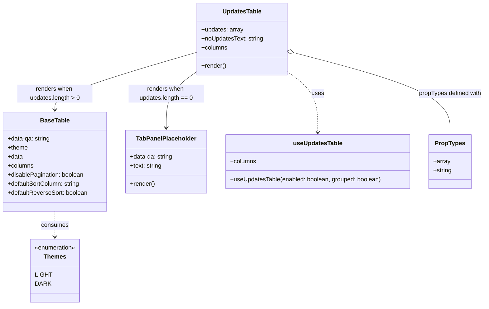

# Diagram: web/portal/src/pages/partview/details/components/organisms/UpdatesTable.organism.js

> Auto-generated by Obscura crawlers

## Mermaid

### SVG

<svg id="container" width="1291.01953125" xmlns="http://www.w3.org/2000/svg" class="classDiagram" height="812" viewBox="0 0 1291.01953125 812" role="graphics-document document" aria-roledescription="class"><g><defs><marker id="container_class-aggregationStart" class="marker aggregation class" refX="18" refY="7" markerWidth="190" markerHeight="240" orient="auto"><path d="M 18,7 L9,13 L1,7 L9,1 Z"></path></marker></defs><defs><marker id="container_class-aggregationEnd" class="marker aggregation class" refX="1" refY="7" markerWidth="20" markerHeight="28" orient="auto"><path d="M 18,7 L9,13 L1,7 L9,1 Z"></path></marker></defs><defs><marker id="container_class-extensionStart" class="marker extension class" refX="18" refY="7" markerWidth="190" markerHeight="240" orient="auto"><path d="M 1,7 L18,13 V 1 Z"></path></marker></defs><defs><marker id="container_class-extensionEnd" class="marker extension class" refX="1" refY="7" markerWidth="20" markerHeight="28" orient="auto"><path d="M 1,1 V 13 L18,7 Z"></path></marker></defs><defs><marker id="container_class-compositionStart" class="marker composition class" refX="18" refY="7" markerWidth="190" markerHeight="240" orient="auto"><path d="M 18,7 L9,13 L1,7 L9,1 Z"></path></marker></defs><defs><marker id="container_class-compositionEnd" class="marker composition class" refX="1" refY="7" markerWidth="20" markerHeight="28" orient="auto"><path d="M 18,7 L9,13 L1,7 L9,1 Z"></path></marker></defs><defs><marker id="container_class-dependencyStart" class="marker dependency class" refX="6" refY="7" markerWidth="190" markerHeight="240" orient="auto"><path d="M 5,7 L9,13 L1,7 L9,1 Z"></path></marker></defs><defs><marker id="container_class-dependencyEnd" class="marker dependency class" refX="13" refY="7" markerWidth="20" markerHeight="28" orient="auto"><path d="M 18,7 L9,13 L14,7 L9,1 Z"></path></marker></defs><defs><marker id="container_class-lollipopStart" class="marker lollipop class" refX="13" refY="7" markerWidth="190" markerHeight="240" orient="auto"><circle stroke="black" fill="transparent" cx="7" cy="7" r="6"></circle></marker></defs><defs><marker id="container_class-lollipopEnd" class="marker lollipop class" refX="1" refY="7" markerWidth="190" markerHeight="240" orient="auto"><circle stroke="black" fill="transparent" cx="7" cy="7" r="6"></circle></marker></defs><g class="root"><g class="clusters"></g><g class="edgePaths"><path d="M523.34,139.003L460.407,157.336C397.474,175.669,271.608,212.334,208.675,237.834C145.742,263.333,145.742,277.667,145.742,284.833L145.742,292" id="id_UpdatesTable_BaseTable_1" class="edge-thickness-normal edge-pattern-solid relation" style=";;;" data-edge="true" data-et="edge" data-id="id_UpdatesTable_BaseTable_1" data-points="W3sieCI6NTIzLjMzOTg0Mzc1LCJ5IjoxMzkuMDAzNDEzNzQ2MDE3M30seyJ4IjoxNDUuNzQyMTg3NSwieSI6MjQ5fSx7IngiOjE0NS43NDIxODc1LCJ5IjoyOTh9XQ==" marker-end="url(#container_class-dependencyEnd)"></path><path d="M523.34,190.192L509.676,199.993C496.012,209.795,468.684,229.397,455.02,254.365C441.355,279.333,441.355,309.667,441.355,324.833L441.355,340" id="id_UpdatesTable_TabPanelPlaceholder_2" class="edge-thickness-normal edge-pattern-solid relation" style=";;;" data-edge="true" data-et="edge" data-id="id_UpdatesTable_TabPanelPlaceholder_2" data-points="W3sieCI6NTIzLjMzOTg0Mzc1LCJ5IjoxOTAuMTkxOTA3MDg5OTkyMDd9LHsieCI6NDQxLjM1NTQ2ODc1LCJ5IjoyNDl9LHsieCI6NDQxLjM1NTQ2ODc1LCJ5IjozNDZ9XQ==" marker-end="url(#container_class-dependencyEnd)"></path><path d="M763.66,190.192L777.324,199.993C790.988,209.795,818.316,229.397,831.98,256.365C845.645,283.333,845.645,317.667,845.645,334.833L845.645,352" id="id_UpdatesTable_useUpdatesTable_3" class="edge-thickness-normal edge-pattern-dashed relation" style=";;;" data-edge="true" data-et="edge" data-id="id_UpdatesTable_useUpdatesTable_3" data-points="W3sieCI6NzYzLjY2MDE1NjI1LCJ5IjoxOTAuMTkxOTA3MDg5OTkyMDd9LHsieCI6ODQ1LjY0NDUzMTI1LCJ5IjoyNDl9LHsieCI6ODQ1LjY0NDUzMTI1LCJ5IjozNTh9XQ==" marker-end="url(#container_class-dependencyEnd)"></path><path d="M145.742,562L145.742,568.167C145.742,574.333,145.742,586.667,145.742,598C145.742,609.333,145.742,619.667,145.742,624.833L145.742,630" id="id_BaseTable_Themes_4" class="edge-thickness-normal edge-pattern-dashed relation" style=";;;" data-edge="true" data-et="edge" data-id="id_BaseTable_Themes_4" data-points="W3sieCI6MTQ1Ljc0MjE4NzUsInkiOjU2Mn0seyJ4IjoxNDUuNzQyMTg3NSwieSI6NTk5fSx7IngiOjE0NS43NDIxODc1LCJ5Ijo2MzZ9XQ==" marker-end="url(#container_class-dependencyEnd)"></path><path d="M780.349,139.785L849.958,157.988C919.567,176.19,1058.786,212.595,1128.395,248.964C1198.004,285.333,1198.004,321.667,1198.004,339.833L1198.004,358" id="id_UpdatesTable_PropTypes_5" class="edge-thickness-normal edge-pattern-solid relation" style=";;;" data-edge="true" data-et="edge" data-id="id_UpdatesTable_PropTypes_5" data-points="W3sieCI6NzYzLjY2MDE1NjI1LCJ5IjoxMzUuNDIxMjgwMjgyOTEwNTR9LHsieCI6MTE5OC4wMDM5MDYyNSwieSI6MjQ5fSx7IngiOjExOTguMDAzOTA2MjUsInkiOjM1OH1d" marker-start="url(#container_class-aggregationStart)"></path></g><g class="edgeLabels"><g class="edgeLabel" transform="translate(145.7421875, 249)"><g class="label" data-id="id_UpdatesTable_BaseTable_1" transform="translate(-100, -24)"><foreignObject width="200" height="48">

renders when updates.length &gt; 0

</foreignObject></g></g><g class="edgeLabel" transform="translate(441.35546875, 249)"><g class="label" data-id="id_UpdatesTable_TabPanelPlaceholder_2" transform="translate(-100, -24)"><foreignObject width="200" height="48">

renders when updates.length == 0

</foreignObject></g></g><g class="edgeLabel" transform="translate(845.64453125, 249)"><g class="label" data-id="id_UpdatesTable_useUpdatesTable_3" transform="translate(-16.4921875, -12)"><foreignObject width="32.984375" height="24">

uses

</foreignObject></g></g><g class="edgeLabel" transform="translate(145.7421875, 599)"><g class="label" data-id="id_BaseTable_Themes_4" transform="translate(-36.375, -12)"><foreignObject width="72.75" height="24">

consumes

</foreignObject></g></g><g class="edgeLabel" transform="translate(1198.00390625, 249)"><g class="label" data-id="id_UpdatesTable_PropTypes_5" transform="translate(-85.015625, -12)"><foreignObject width="170.03125" height="24">

propTypes defined with

</foreignObject></g></g></g><g class="nodes"><g class="node default" id="classId-UpdatesTable-0" transform="translate(643.5, 104)"><g class="basic label-container"><path d="M-120.16015625 -96 L120.16015625 -96 L120.16015625 96 L-120.16015625 96" stroke="none" stroke-width="0" fill="#ECECFF" style=""></path><path d="M-120.16015625 -96 C-51.55205152523233 -96, 17.05605319953534 -96, 120.16015625 -96 M-120.16015625 -96 C-57.46045574344483 -96, 5.239244763110335 -96, 120.16015625 -96 M120.16015625 -96 C120.16015625 -41.082982445261514, 120.16015625 13.834035109476972, 120.16015625 96 M120.16015625 -96 C120.16015625 -42.86548354117734, 120.16015625 10.269032917645319, 120.16015625 96 M120.16015625 96 C56.1905242572506 96, -7.779107735498798 96, -120.16015625 96 M120.16015625 96 C36.71629950944971 96, -46.727557231100576 96, -120.16015625 96 M-120.16015625 96 C-120.16015625 54.632298728717515, -120.16015625 13.26459745743503, -120.16015625 -96 M-120.16015625 96 C-120.16015625 46.097193019494995, -120.16015625 -3.8056139610100104, -120.16015625 -96" stroke="#9370DB" stroke-width="1.3" fill="none" stroke-dasharray="0 0" style=""></path></g><g class="annotation-group text" transform="translate(0, -72)"></g><g class="label-group text" transform="translate(-50.2265625, -72)"><g class="label" style="font-weight: bolder" transform="translate(0,-12)"><foreignObject width="100.453125" height="24">

UpdatesTable

</foreignObject></g></g><g class="members-group text" transform="translate(-108.16015625, -24)"><g class="label" style="" transform="translate(0,-12)"><foreignObject width="111.71875" height="24">

+updates: array

</foreignObject></g><g class="label" style="" transform="translate(0,12)"><foreignObject width="166.09375" height="24">

+noUpdatesText: string

</foreignObject></g><g class="label" style="" transform="translate(0,36)"><foreignObject width="69.21875" height="24">

+columns

</foreignObject></g></g><g class="methods-group text" transform="translate(-108.16015625, 72)"><g class="label" style="" transform="translate(0,-12)"><foreignObject width="66.609375" height="24">

+render()

</foreignObject></g></g><g class="divider" style=""><path d="M-120.16015625 -48 C-37.6341396903928 -48, 44.8918768692144 -48, 120.16015625 -48 M-120.16015625 -48 C-46.310284319106984 -48, 27.539587611786033 -48, 120.16015625 -48" stroke="#9370DB" stroke-width="1.3" fill="none" stroke-dasharray="0 0" style=""></path></g><g class="divider" style=""><path d="M-120.16015625 48 C-29.614653631111594 48, 60.93084898777681 48, 120.16015625 48 M-120.16015625 48 C-47.64531013820259 48, 24.86953597359482 48, 120.16015625 48" stroke="#9370DB" stroke-width="1.3" fill="none" stroke-dasharray="0 0" style=""></path></g></g><g class="node default" id="classId-BaseTable-1" transform="translate(145.7421875, 430)"><g class="basic label-container"><path d="M-137.7421875 -132 L137.7421875 -132 L137.7421875 132 L-137.7421875 132" stroke="none" stroke-width="0" fill="#ECECFF" style=""></path><path d="M-137.7421875 -132 C-37.62320895385521 -132, 62.49576959228958 -132, 137.7421875 -132 M-137.7421875 -132 C-70.47745401523991 -132, -3.212720530479828 -132, 137.7421875 -132 M137.7421875 -132 C137.7421875 -48.46385429979094, 137.7421875 35.07229140041812, 137.7421875 132 M137.7421875 -132 C137.7421875 -62.965849120108814, 137.7421875 6.068301759782372, 137.7421875 132 M137.7421875 132 C59.20186276499939 132, -19.33846197000122 132, -137.7421875 132 M137.7421875 132 C72.08765636517496 132, 6.43312523034993 132, -137.7421875 132 M-137.7421875 132 C-137.7421875 49.40448306547694, -137.7421875 -33.19103386904612, -137.7421875 -132 M-137.7421875 132 C-137.7421875 47.12639261599611, -137.7421875 -37.74721476800778, -137.7421875 -132" stroke="#9370DB" stroke-width="1.3" fill="none" stroke-dasharray="0 0" style=""></path></g><g class="annotation-group text" transform="translate(0, -108)"></g><g class="label-group text" transform="translate(-37.359375, -108)"><g class="label" style="font-weight: bolder" transform="translate(0,-12)"><foreignObject width="74.71875" height="24">

BaseTable

</foreignObject></g></g><g class="members-group text" transform="translate(-125.7421875, -60)"><g class="label" style="" transform="translate(0,-12)"><foreignObject width="114.90625" height="24">

+data-qa: string

</foreignObject></g><g class="label" style="" transform="translate(0,12)"><foreignObject width="54.21875" height="24">

+theme

</foreignObject></g><g class="label" style="" transform="translate(0,36)"><foreignObject width="40.625" height="24">

+data

</foreignObject></g><g class="label" style="" transform="translate(0,60)"><foreignObject width="69.21875" height="24">

+columns

</foreignObject></g><g class="label" style="" transform="translate(0,84)"><foreignObject width="205.3125" height="24">

+disablePagination: boolean

</foreignObject></g><g class="label" style="" transform="translate(0,108)"><foreignObject width="194.5625" height="24">

+defaultSortColumn: string

</foreignObject></g><g class="label" style="" transform="translate(0,132)"><foreignObject width="214.125" height="24">

+defaultReverseSort: boolean

</foreignObject></g></g><g class="methods-group text" transform="translate(-125.7421875, 132)"></g><g class="divider" style=""><path d="M-137.7421875 -84 C-69.97174754704392 -84, -2.2013075940878366 -84, 137.7421875 -84 M-137.7421875 -84 C-66.27505905288855 -84, 5.192069394222898 -84, 137.7421875 -84" stroke="#9370DB" stroke-width="1.3" fill="none" stroke-dasharray="0 0" style=""></path></g><g class="divider" style=""><path d="M-137.7421875 108 C-48.075163883019584 108, 41.59185973396083 108, 137.7421875 108 M-137.7421875 108 C-72.79645705455273 108, -7.850726609105465 108, 137.7421875 108" stroke="#9370DB" stroke-width="1.3" fill="none" stroke-dasharray="0 0" style=""></path></g></g><g class="node default" id="classId-TabPanelPlaceholder-2" transform="translate(441.35546875, 430)"><g class="basic label-container"><path d="M-107.87109375 -84 L107.87109375 -84 L107.87109375 84 L-107.87109375 84" stroke="none" stroke-width="0" fill="#ECECFF" style=""></path><path d="M-107.87109375 -84 C-56.05666315840999 -84, -4.242232566819979 -84, 107.87109375 -84 M-107.87109375 -84 C-42.841803927930016 -84, 22.187485894139968 -84, 107.87109375 -84 M107.87109375 -84 C107.87109375 -31.353473808179913, 107.87109375 21.293052383640173, 107.87109375 84 M107.87109375 -84 C107.87109375 -24.176346553433575, 107.87109375 35.64730689313285, 107.87109375 84 M107.87109375 84 C62.61059403283526 84, 17.350094315670518 84, -107.87109375 84 M107.87109375 84 C56.017022105970426 84, 4.162950461940852 84, -107.87109375 84 M-107.87109375 84 C-107.87109375 30.988949099466694, -107.87109375 -22.02210180106661, -107.87109375 -84 M-107.87109375 84 C-107.87109375 48.93772309392824, -107.87109375 13.875446187856483, -107.87109375 -84" stroke="#9370DB" stroke-width="1.3" fill="none" stroke-dasharray="0 0" style=""></path></g><g class="annotation-group text" transform="translate(0, -60)"></g><g class="label-group text" transform="translate(-76.8359375, -60)"><g class="label" style="font-weight: bolder" transform="translate(0,-12)"><foreignObject width="153.671875" height="24">

TabPanelPlaceholder

</foreignObject></g></g><g class="members-group text" transform="translate(-95.87109375, -12)"><g class="label" style="" transform="translate(0,-12)"><foreignObject width="114.90625" height="24">

+data-qa: string

</foreignObject></g><g class="label" style="" transform="translate(0,12)"><foreignObject width="85.34375" height="24">

+text: string

</foreignObject></g></g><g class="methods-group text" transform="translate(-95.87109375, 60)"><g class="label" style="" transform="translate(0,-12)"><foreignObject width="66.609375" height="24">

+render()

</foreignObject></g></g><g class="divider" style=""><path d="M-107.87109375 -36 C-53.018850441924094 -36, 1.8333928661518115 -36, 107.87109375 -36 M-107.87109375 -36 C-63.93759530795416 -36, -20.004096865908323 -36, 107.87109375 -36" stroke="#9370DB" stroke-width="1.3" fill="none" stroke-dasharray="0 0" style=""></path></g><g class="divider" style=""><path d="M-107.87109375 36 C-60.78551443966973 36, -13.699935129339465 36, 107.87109375 36 M-107.87109375 36 C-25.108541469125555 36, 57.65401081174889 36, 107.87109375 36" stroke="#9370DB" stroke-width="1.3" fill="none" stroke-dasharray="0 0" style=""></path></g></g><g class="node default" id="classId-useUpdatesTable-3" transform="translate(845.64453125, 430)"><g class="basic label-container"><path d="M-246.41796875 -72 L246.41796875 -72 L246.41796875 72 L-246.41796875 72" stroke="none" stroke-width="0" fill="#ECECFF" style=""></path><path d="M-246.41796875 -72 C-87.77261584144935 -72, 70.8727370671013 -72, 246.41796875 -72 M-246.41796875 -72 C-91.81644840588496 -72, 62.78507193823009 -72, 246.41796875 -72 M246.41796875 -72 C246.41796875 -36.996750025423026, 246.41796875 -1.9935000508460519, 246.41796875 72 M246.41796875 -72 C246.41796875 -26.649034000114995, 246.41796875 18.70193199977001, 246.41796875 72 M246.41796875 72 C110.17612123931823 72, -26.06572627136353 72, -246.41796875 72 M246.41796875 72 C124.92413467042492 72, 3.430300590849839 72, -246.41796875 72 M-246.41796875 72 C-246.41796875 41.835318155208284, -246.41796875 11.670636310416576, -246.41796875 -72 M-246.41796875 72 C-246.41796875 39.67161124295018, -246.41796875 7.343222485900355, -246.41796875 -72" stroke="#9370DB" stroke-width="1.3" fill="none" stroke-dasharray="0 0" style=""></path></g><g class="annotation-group text" transform="translate(0, -48)"></g><g class="label-group text" transform="translate(-63.0859375, -48)"><g class="label" style="font-weight: bolder" transform="translate(0,-12)"><foreignObject width="126.171875" height="24">

useUpdatesTable

</foreignObject></g></g><g class="members-group text" transform="translate(-234.41796875, 0)"><g class="label" style="" transform="translate(0,-12)"><foreignObject width="69.21875" height="24">

+columns

</foreignObject></g></g><g class="methods-group text" transform="translate(-234.41796875, 48)"><g class="label" style="" transform="translate(0,-12)"><foreignObject width="405.75" height="24">

+useUpdatesTable(enabled: boolean, grouped: boolean)

</foreignObject></g></g><g class="divider" style=""><path d="M-246.41796875 -24 C-72.28777436538334 -24, 101.84242001923332 -24, 246.41796875 -24 M-246.41796875 -24 C-100.8525652707651 -24, 44.712838208469805 -24, 246.41796875 -24" stroke="#9370DB" stroke-width="1.3" fill="none" stroke-dasharray="0 0" style=""></path></g><g class="divider" style=""><path d="M-246.41796875 24 C-80.08976048447494 24, 86.23844778105013 24, 246.41796875 24 M-246.41796875 24 C-97.1006155794629 24, 52.21673759107421 24, 246.41796875 24" stroke="#9370DB" stroke-width="1.3" fill="none" stroke-dasharray="0 0" style=""></path></g></g><g class="node default" id="classId-Themes-4" transform="translate(145.7421875, 720)"><g class="basic label-container"><path d="M-67.5546875 -84 L67.5546875 -84 L67.5546875 84 L-67.5546875 84" stroke="none" stroke-width="0" fill="#ECECFF" style=""></path><path d="M-67.5546875 -84 C-14.037693454431292 -84, 39.47930059113742 -84, 67.5546875 -84 M-67.5546875 -84 C-38.06928870703305 -84, -8.583889914066113 -84, 67.5546875 -84 M67.5546875 -84 C67.5546875 -46.54523787840638, 67.5546875 -9.090475756812765, 67.5546875 84 M67.5546875 -84 C67.5546875 -47.44291884501022, 67.5546875 -10.885837690020438, 67.5546875 84 M67.5546875 84 C40.430788015833215 84, 13.306888531666424 84, -67.5546875 84 M67.5546875 84 C32.77178810213476 84, -2.011111295730487 84, -67.5546875 84 M-67.5546875 84 C-67.5546875 24.460940503601897, -67.5546875 -35.078118992796206, -67.5546875 -84 M-67.5546875 84 C-67.5546875 39.97756399513349, -67.5546875 -4.044872009733027, -67.5546875 -84" stroke="#9370DB" stroke-width="1.3" fill="none" stroke-dasharray="0 0" style=""></path></g><g class="annotation-group text" transform="translate(-55.5546875, -60)"><g class="label" style="" transform="translate(0,-12)"><foreignObject width="111.109375" height="24">

«enumeration»

</foreignObject></g></g><g class="label-group text" transform="translate(-28.3984375, -36)"><g class="label" style="font-weight: bolder" transform="translate(0,-12)"><foreignObject width="56.796875" height="24">

Themes

</foreignObject></g></g><g class="members-group text" transform="translate(-55.5546875, 12)"><g class="label" style="" transform="translate(0,-12)"><foreignObject width="41.9375" height="24">

LIGHT

</foreignObject></g><g class="label" style="" transform="translate(0,12)"><foreignObject width="38.421875" height="24">

DARK

</foreignObject></g></g><g class="methods-group text" transform="translate(-55.5546875, 84)"></g><g class="divider" style=""><path d="M-67.5546875 -12 C-13.772181756485871 -12, 40.01032398702826 -12, 67.5546875 -12 M-67.5546875 -12 C-25.163887703249642 -12, 17.226912093500715 -12, 67.5546875 -12" stroke="#9370DB" stroke-width="1.3" fill="none" stroke-dasharray="0 0" style=""></path></g><g class="divider" style=""><path d="M-67.5546875 60 C-26.60879286067948 60, 14.337101778641042 60, 67.5546875 60 M-67.5546875 60 C-20.93632953598162 60, 25.68202842803676 60, 67.5546875 60" stroke="#9370DB" stroke-width="1.3" fill="none" stroke-dasharray="0 0" style=""></path></g></g><g class="node default" id="classId-PropTypes-5" transform="translate(1198.00390625, 430)"><g class="basic label-container"><path d="M-55.94140625 -72 L55.94140625 -72 L55.94140625 72 L-55.94140625 72" stroke="none" stroke-width="0" fill="#ECECFF" style=""></path><path d="M-55.94140625 -72 C-24.66165238177719 -72, 6.618101486445617 -72, 55.94140625 -72 M-55.94140625 -72 C-17.522699265454172 -72, 20.896007719091656 -72, 55.94140625 -72 M55.94140625 -72 C55.94140625 -39.023392290535185, 55.94140625 -6.046784581070369, 55.94140625 72 M55.94140625 -72 C55.94140625 -17.188716031909287, 55.94140625 37.622567936181426, 55.94140625 72 M55.94140625 72 C21.279697047181806 72, -13.382012155636389 72, -55.94140625 72 M55.94140625 72 C26.12607467660233 72, -3.6892568967953423 72, -55.94140625 72 M-55.94140625 72 C-55.94140625 23.85463027665638, -55.94140625 -24.29073944668724, -55.94140625 -72 M-55.94140625 72 C-55.94140625 39.819457513361634, -55.94140625 7.638915026723268, -55.94140625 -72" stroke="#9370DB" stroke-width="1.3" fill="none" stroke-dasharray="0 0" style=""></path></g><g class="annotation-group text" transform="translate(0, -48)"></g><g class="label-group text" transform="translate(-38.2578125, -48)"><g class="label" style="font-weight: bolder" transform="translate(0,-12)"><foreignObject width="76.515625" height="24">

PropTypes

</foreignObject></g></g><g class="members-group text" transform="translate(-43.94140625, 0)"><g class="label" style="" transform="translate(0,-12)"><foreignObject width="44.578125" height="24">

+array

</foreignObject></g><g class="label" style="" transform="translate(0,12)"><foreignObject width="49.625" height="24">

+string

</foreignObject></g></g><g class="methods-group text" transform="translate(-43.94140625, 72)"></g><g class="divider" style=""><path d="M-55.94140625 -24 C-16.34890813049276 -24, 23.24358998901448 -24, 55.94140625 -24 M-55.94140625 -24 C-16.296477099467296 -24, 23.348452051065408 -24, 55.94140625 -24" stroke="#9370DB" stroke-width="1.3" fill="none" stroke-dasharray="0 0" style=""></path></g><g class="divider" style=""><path d="M-55.94140625 48 C-30.130666667586475 48, -4.319927085172949 48, 55.94140625 48 M-55.94140625 48 C-33.38058831326758 48, -10.819770376535153 48, 55.94140625 48" stroke="#9370DB" stroke-width="1.3" fill="none" stroke-dasharray="0 0" style=""></path></g></g></g></g></g></svg>
