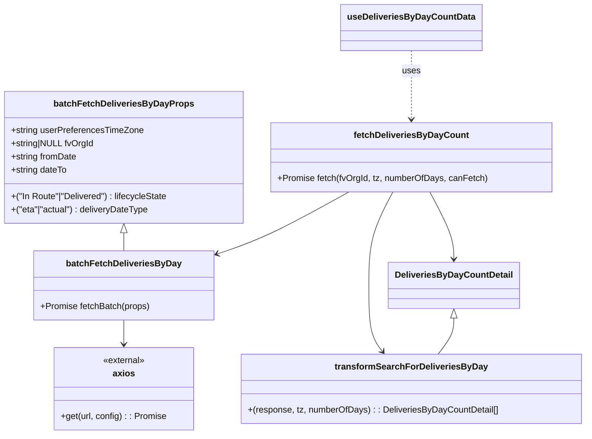

# Diagram: web/portal/src/pages/partview/hooks/useDeliveriesByDayCountData.ts


> Auto-generated by Obscura crawlers

## Diagram 1

```mermaid
flowchart TD
    A[useDeliveriesByDayCountData] -->|calls queryFn| B[fetchDeliveriesByDayCount]
    B --> C{canFetchData?}
    C -- no --> D[return []]
    C -- yes --> E[build date range & props]
    E --> F[batchFetchDeliveriesByDay (In Route, eta)]
    E --> G[batchFetchDeliveriesByDay (Delivered, actual)]
    F --> H[responseData += results]
    G --> H
    H --> I[transformSearchForDeliveriesByDay]
    I --> J[DeliveriesByDayCountDetail[]]
    B --> J
    A -->|useQuery returns| K{isFetchingDeliveriesByCount, deliveriesByCount}
    K --> L[consumer]
```

> SVG rendering failed for this diagram.

## Diagram 2



### SVG

<svg id="container" width="1053.29296875" xmlns="http://www.w3.org/2000/svg" class="classDiagram" height="790" viewBox="0 0 1053.29296875 790" role="graphics-document document" aria-roledescription="class"><style>#container{font-family:"trebuchet ms",verdana,arial,sans-serif;font-size:16px;fill:#333;}@keyframes edge-animation-frame{from{stroke-dashoffset:0;}}@keyframes dash{to{stroke-dashoffset:0;}}#container .edge-animation-slow{stroke-dasharray:9,5!important;stroke-dashoffset:900;animation:dash 50s linear infinite;stroke-linecap:round;}#container .edge-animation-fast{stroke-dasharray:9,5!important;stroke-dashoffset:900;animation:dash 20s linear infinite;stroke-linecap:round;}#container .error-icon{fill:#552222;}#container .error-text{fill:#552222;stroke:#552222;}#container .edge-thickness-normal{stroke-width:1px;}#container .edge-thickness-thick{stroke-width:3.5px;}#container .edge-pattern-solid{stroke-dasharray:0;}#container .edge-thickness-invisible{stroke-width:0;fill:none;}#container .edge-pattern-dashed{stroke-dasharray:3;}#container .edge-pattern-dotted{stroke-dasharray:2;}#container .marker{fill:#333333;stroke:#333333;}#container .marker.cross{stroke:#333333;}#container svg{font-family:"trebuchet ms",verdana,arial,sans-serif;font-size:16px;}#container p{margin:0;}#container g.classGroup text{fill:#9370DB;stroke:none;font-family:"trebuchet ms",verdana,arial,sans-serif;font-size:10px;}#container g.classGroup text .title{font-weight:bolder;}#container .nodeLabel,#container .edgeLabel{color:#131300;}#container .edgeLabel .label rect{fill:#ECECFF;}#container .label text{fill:#131300;}#container .labelBkg{background:#ECECFF;}#container .edgeLabel .label span{background:#ECECFF;}#container .classTitle{font-weight:bolder;}#container .node rect,#container .node circle,#container .node ellipse,#container .node polygon,#container .node path{fill:#ECECFF;stroke:#9370DB;stroke-width:1px;}#container .divider{stroke:#9370DB;stroke-width:1;}#container g.clickable{cursor:pointer;}#container g.classGroup rect{fill:#ECECFF;stroke:#9370DB;}#container g.classGroup line{stroke:#9370DB;stroke-width:1;}#container .classLabel .box{stroke:none;stroke-width:0;fill:#ECECFF;opacity:0.5;}#container .classLabel .label{fill:#9370DB;font-size:10px;}#container .relation{stroke:#333333;stroke-width:1;fill:none;}#container .dashed-line{stroke-dasharray:3;}#container .dotted-line{stroke-dasharray:1 2;}#container #compositionStart,#container .composition{fill:#333333!important;stroke:#333333!important;stroke-width:1;}#container #compositionEnd,#container .composition{fill:#333333!important;stroke:#333333!important;stroke-width:1;}#container #dependencyStart,#container .dependency{fill:#333333!important;stroke:#333333!important;stroke-width:1;}#container #dependencyStart,#container .dependency{fill:#333333!important;stroke:#333333!important;stroke-width:1;}#container #extensionStart,#container .extension{fill:transparent!important;stroke:#333333!important;stroke-width:1;}#container #extensionEnd,#container .extension{fill:transparent!important;stroke:#333333!important;stroke-width:1;}#container #aggregationStart,#container .aggregation{fill:transparent!important;stroke:#333333!important;stroke-width:1;}#container #aggregationEnd,#container .aggregation{fill:transparent!important;stroke:#333333!important;stroke-width:1;}#container #lollipopStart,#container .lollipop{fill:#ECECFF!important;stroke:#333333!important;stroke-width:1;}#container #lollipopEnd,#container .lollipop{fill:#ECECFF!important;stroke:#333333!important;stroke-width:1;}#container .edgeTerminals{font-size:11px;line-height:initial;}#container .classTitleText{text-anchor:middle;font-size:18px;fill:#333;}#container .label-icon{display:inline-block;height:1em;overflow:visible;vertical-align:-0.125em;}#container .node .label-icon path{fill:currentColor;stroke:revert;stroke-width:revert;}#container :root{--mermaid-font-family:"trebuchet ms",verdana,arial,sans-serif;}</style><g><defs><marker id="container_class-aggregationStart" class="marker aggregation class" refX="18" refY="7" markerWidth="190" markerHeight="240" orient="auto"><path d="M 18,7 L9,13 L1,7 L9,1 Z"></path></marker></defs><defs><marker id="container_class-aggregationEnd" class="marker aggregation class" refX="1" refY="7" markerWidth="20" markerHeight="28" orient="auto"><path d="M 18,7 L9,13 L1,7 L9,1 Z"></path></marker></defs><defs><marker id="container_class-extensionStart" class="marker extension class" refX="18" refY="7" markerWidth="190" markerHeight="240" orient="auto"><path d="M 1,7 L18,13 V 1 Z"></path></marker></defs><defs><marker id="container_class-extensionEnd" class="marker extension class" refX="1" refY="7" markerWidth="20" markerHeight="28" orient="auto"><path d="M 1,1 V 13 L18,7 Z"></path></marker></defs><defs><marker id="container_class-compositionStart" class="marker composition class" refX="18" refY="7" markerWidth="190" markerHeight="240" orient="auto"><path d="M 18,7 L9,13 L1,7 L9,1 Z"></path></marker></defs><defs><marker id="container_class-compositionEnd" class="marker composition class" refX="1" refY="7" markerWidth="20" markerHeight="28" orient="auto"><path d="M 18,7 L9,13 L1,7 L9,1 Z"></path></marker></defs><defs><marker id="container_class-dependencyStart" class="marker dependency class" refX="6" refY="7" markerWidth="190" markerHeight="240" orient="auto"><path d="M 5,7 L9,13 L1,7 L9,1 Z"></path></marker></defs><defs><marker id="container_class-dependencyEnd" class="marker dependency class" refX="13" refY="7" markerWidth="20" markerHeight="28" orient="auto"><path d="M 18,7 L9,13 L14,7 L9,1 Z"></path></marker></defs><defs><marker id="container_class-lollipopStart" class="marker lollipop class" refX="13" refY="7" markerWidth="190" markerHeight="240" orient="auto"><circle stroke="black" fill="transparent" cx="7" cy="7" r="6"></circle></marker></defs><defs><marker id="container_class-lollipopEnd" class="marker lollipop class" refX="1" refY="7" markerWidth="190" markerHeight="240" orient="auto"><circle stroke="black" fill="transparent" cx="7" cy="7" r="6"></circle></marker></defs><g class="root"><g class="clusters"></g><g class="edgePaths"><path d="M224.359,423.25L224.359,424.542C224.359,425.833,224.359,428.417,224.359,433.875C224.359,439.333,224.359,447.667,224.359,451.833L224.359,456" id="id_batchFetchDeliveriesByDayProps_batchFetchDeliveriesByDay_1" class="edge-thickness-normal edge-pattern-solid relation" style=";;;" data-edge="true" data-et="edge" data-id="id_batchFetchDeliveriesByDayProps_batchFetchDeliveriesByDay_1" data-points="W3sieCI6MjI0LjM1OTM3NSwieSI6NDA2fSx7IngiOjIyNC4zNTkzNzUsInkiOjQzMX0seyJ4IjoyMjQuMzU5Mzc1LCJ5Ijo0NTZ9XQ==" marker-start="url(#container_class-extensionStart)"></path><path d="M224.359,582L224.359,586.167C224.359,590.333,224.359,598.667,224.359,606C224.359,613.333,224.359,619.667,224.359,622.833L224.359,626" id="id_batchFetchDeliveriesByDay_axios_2" class="edge-thickness-normal edge-pattern-solid relation" style=";;;" data-edge="true" data-et="edge" data-id="id_batchFetchDeliveriesByDay_axios_2" data-points="W3sieCI6MjI0LjM1OTM3NSwieSI6NTgyfSx7IngiOjIyNC4zNTkzNzUsInkiOjYwN30seyJ4IjoyMjQuMzU5Mzc1LCJ5Ijo2MzJ9XQ==" marker-end="url(#container_class-dependencyEnd)"></path><path d="M629.18,349L604.808,362.667C580.435,376.333,531.69,403.667,492.083,422.518C452.477,441.369,422.008,451.738,406.774,456.922L391.539,462.107" id="id_fetchDeliveriesByDayCount_batchFetchDeliveriesByDay_3" class="edge-thickness-normal edge-pattern-solid relation" style=";;;" data-edge="true" data-et="edge" data-id="id_fetchDeliveriesByDayCount_batchFetchDeliveriesByDay_3" data-points="W3sieCI6NjI5LjE4MDExODUzNDQ4MjcsInkiOjM0OX0seyJ4Ijo0ODIuOTQ1MzEyNSwieSI6NDMxfSx7IngiOjM4NS44NTkzNzUsInkiOjQ2NC4wMzk1NDgwMjI1OTg4Nn1d" marker-end="url(#container_class-dependencyEnd)"></path><path d="M709.14,349L702.114,362.667C695.087,376.333,681.034,403.667,674.007,432C666.98,460.333,666.98,489.667,666.98,519C666.98,548.333,666.98,577.667,670.98,597.698C674.98,617.73,682.979,628.46,686.978,633.825L690.978,639.19" id="id_fetchDeliveriesByDayCount_transformSearchForDeliveriesByDay_4" class="edge-thickness-normal edge-pattern-solid relation" style=";;;" data-edge="true" data-et="edge" data-id="id_fetchDeliveriesByDayCount_transformSearchForDeliveriesByDay_4" data-points="W3sieCI6NzA5LjE0MDIyMDkwNTE3MjQsInkiOjM0OX0seyJ4Ijo2NjYuOTgwNDY4NzUsInkiOjQzMX0seyJ4Ijo2NjYuOTgwNDY4NzUsInkiOjUxOX0seyJ4Ijo2NjYuOTgwNDY4NzUsInkiOjYwN30seyJ4Ijo2OTQuNTY0MjU3ODEyNSwieSI6NjQ0fV0=" marker-end="url(#container_class-dependencyEnd)"></path><path d="M773.922,349L780.949,362.667C787.976,376.333,802.029,403.667,809.055,424C816.082,444.333,816.082,457.667,816.082,464.333L816.082,471" id="id_fetchDeliveriesByDayCount_DeliveriesByDayCountDetail_5" class="edge-thickness-normal edge-pattern-solid relation" style=";;;" data-edge="true" data-et="edge" data-id="id_fetchDeliveriesByDayCount_DeliveriesByDayCountDetail_5" data-points="W3sieCI6NzczLjkyMjI3OTA5NDgyNzYsInkiOjM0OX0seyJ4Ijo4MTYuMDgyMDMxMjUsInkiOjQzMX0seyJ4Ijo4MTYuMDgyMDMxMjUsInkiOjQ3N31d" marker-end="url(#container_class-dependencyEnd)"></path><path d="M741.531,92L741.531,98.167C741.531,104.333,741.531,116.667,741.531,137.5C741.531,158.333,741.531,187.667,741.531,202.333L741.531,217" id="id_useDeliveriesByDayCountData_fetchDeliveriesByDayCount_6" class="edge-thickness-normal edge-pattern-dashed relation" style=";;;" data-edge="true" data-et="edge" data-id="id_useDeliveriesByDayCountData_fetchDeliveriesByDayCount_6" data-points="W3sieCI6NzQxLjUzMTI1LCJ5Ijo5Mn0seyJ4Ijo3NDEuNTMxMjUsInkiOjEyOX0seyJ4Ijo3NDEuNTMxMjUsInkiOjIyM31d" marker-end="url(#container_class-dependencyEnd)"></path><path d="M816.082,578.25L816.082,583.042C816.082,587.833,816.082,597.417,811.485,608.375C806.887,619.333,797.693,631.667,793.096,637.833L788.498,644" id="id_DeliveriesByDayCountDetail_transformSearchForDeliveriesByDay_7" class="edge-thickness-normal edge-pattern-solid relation" style=";;;" data-edge="true" data-et="edge" data-id="id_DeliveriesByDayCountDetail_transformSearchForDeliveriesByDay_7" data-points="W3sieCI6ODE2LjA4MjAzMTI1LCJ5Ijo1NjF9LHsieCI6ODE2LjA4MjAzMTI1LCJ5Ijo2MDd9LHsieCI6Nzg4LjQ5ODI0MjE4NzUsInkiOjY0NH1d" marker-start="url(#container_class-extensionStart)"></path></g><g class="edgeLabels"><g class="edgeLabel"><g class="label" data-id="id_batchFetchDeliveriesByDayProps_batchFetchDeliveriesByDay_1" transform="translate(0, 0)"><foreignObject width="0" height="0"><div xmlns="http://www.w3.org/1999/xhtml" class="labelBkg" style="display: table-cell; white-space: nowrap; line-height: 1.5; max-width: 200px; text-align: center;"><span class="edgeLabel"></span></div></foreignObject></g></g><g class="edgeLabel"><g class="label" data-id="id_batchFetchDeliveriesByDay_axios_2" transform="translate(0, 0)"><foreignObject width="0" height="0"><div xmlns="http://www.w3.org/1999/xhtml" class="labelBkg" style="display: table-cell; white-space: nowrap; line-height: 1.5; max-width: 200px; text-align: center;"><span class="edgeLabel"></span></div></foreignObject></g></g><g class="edgeLabel"><g class="label" data-id="id_fetchDeliveriesByDayCount_batchFetchDeliveriesByDay_3" transform="translate(0, 0)"><foreignObject width="0" height="0"><div xmlns="http://www.w3.org/1999/xhtml" class="labelBkg" style="display: table-cell; white-space: nowrap; line-height: 1.5; max-width: 200px; text-align: center;"><span class="edgeLabel"></span></div></foreignObject></g></g><g class="edgeLabel"><g class="label" data-id="id_fetchDeliveriesByDayCount_transformSearchForDeliveriesByDay_4" transform="translate(0, 0)"><foreignObject width="0" height="0"><div xmlns="http://www.w3.org/1999/xhtml" class="labelBkg" style="display: table-cell; white-space: nowrap; line-height: 1.5; max-width: 200px; text-align: center;"><span class="edgeLabel"></span></div></foreignObject></g></g><g class="edgeLabel"><g class="label" data-id="id_fetchDeliveriesByDayCount_DeliveriesByDayCountDetail_5" transform="translate(0, 0)"><foreignObject width="0" height="0"><div xmlns="http://www.w3.org/1999/xhtml" class="labelBkg" style="display: table-cell; white-space: nowrap; line-height: 1.5; max-width: 200px; text-align: center;"><span class="edgeLabel"></span></div></foreignObject></g></g><g class="edgeLabel" transform="translate(741.53125, 129)"><g class="label" data-id="id_useDeliveriesByDayCountData_fetchDeliveriesByDayCount_6" transform="translate(-16.4921875, -12)"><foreignObject width="32.984375" height="24"><div xmlns="http://www.w3.org/1999/xhtml" class="labelBkg" style="display: table-cell; white-space: nowrap; line-height: 1.5; max-width: 200px; text-align: center;"><span class="edgeLabel"><p>uses</p></span></div></foreignObject></g></g><g class="edgeLabel"><g class="label" data-id="id_DeliveriesByDayCountDetail_transformSearchForDeliveriesByDay_7" transform="translate(0, 0)"><foreignObject width="0" height="0"><div xmlns="http://www.w3.org/1999/xhtml" class="labelBkg" style="display: table-cell; white-space: nowrap; line-height: 1.5; max-width: 200px; text-align: center;"><span class="edgeLabel"></span></div></foreignObject></g></g></g><g class="nodes"><g class="node default" id="classId-batchFetchDeliveriesByDayProps-0" transform="translate(224.359375, 286)"><g class="basic label-container"><path d="M-216.359375 -120 L216.359375 -120 L216.359375 120 L-216.359375 120" stroke="none" stroke-width="0" fill="#ECECFF" style=""></path><path d="M-216.359375 -120 C-51.441605497755546 -120, 113.47616400448891 -120, 216.359375 -120 M-216.359375 -120 C-69.2978913568958 -120, 77.7635922862084 -120, 216.359375 -120 M216.359375 -120 C216.359375 -30.174001711719242, 216.359375 59.651996576561515, 216.359375 120 M216.359375 -120 C216.359375 -55.12287003444884, 216.359375 9.754259931102325, 216.359375 120 M216.359375 120 C45.84938118535902 120, -124.66061262928196 120, -216.359375 120 M216.359375 120 C76.47660013933566 120, -63.40617472132868 120, -216.359375 120 M-216.359375 120 C-216.359375 43.06614457612507, -216.359375 -33.86771084774986, -216.359375 -120 M-216.359375 120 C-216.359375 34.05934244999719, -216.359375 -51.88131510000562, -216.359375 -120" stroke="#9370DB" stroke-width="1.3" fill="none" stroke-dasharray="0 0" style=""></path></g><g class="annotation-group text" transform="translate(0, -96)"></g><g class="label-group text" transform="translate(-119.890625, -96)"><g class="label" style="font-weight: bolder" transform="translate(0,-12)"><foreignObject width="239.78125" height="24"><div xmlns="http://www.w3.org/1999/xhtml" style="display: table-cell; white-space: nowrap; line-height: 1.5; max-width: 286px; text-align: center;"><span class="nodeLabel markdown-node-label" style=""><p>batchFetchDeliveriesByDayProps</p></span></div></foreignObject></g></g><g class="members-group text" transform="translate(-204.359375, -48)"><g class="label" style="" transform="translate(0,-12)"><foreignObject width="240.828125" height="24"><div xmlns="http://www.w3.org/1999/xhtml" style="display: table-cell; white-space: nowrap; line-height: 1.5; max-width: 298px; text-align: center;"><span class="nodeLabel markdown-node-label" style=""><p>+string userPreferencesTimeZone</p></span></div></foreignObject></g><g class="label" style="" transform="translate(0,12)"><foreignObject width="150.609375" height="24"><div xmlns="http://www.w3.org/1999/xhtml" style="display: table-cell; white-space: nowrap; line-height: 1.5; max-width: 208px; text-align: center;"><span class="nodeLabel markdown-node-label" style=""><p>+string|NULL fvOrgId</p></span></div></foreignObject></g><g class="label" style="" transform="translate(0,36)"><foreignObject width="121.078125" height="24"><div xmlns="http://www.w3.org/1999/xhtml" style="display: table-cell; white-space: nowrap; line-height: 1.5; max-width: 178px; text-align: center;"><span class="nodeLabel markdown-node-label" style=""><p>+string fromDate</p></span></div></foreignObject></g><g class="label" style="" transform="translate(0,60)"><foreignObject width="103.125" height="24"><div xmlns="http://www.w3.org/1999/xhtml" style="display: table-cell; white-space: nowrap; line-height: 1.5; max-width: 160px; text-align: center;"><span class="nodeLabel markdown-node-label" style=""><p>+string dateTo</p></span></div></foreignObject></g></g><g class="methods-group text" transform="translate(-204.359375, 72)"><g class="label" style="" transform="translate(0,-12)"><foreignObject width="288.828125" height="24"><div xmlns="http://www.w3.org/1999/xhtml" style="display: table-cell; white-space: nowrap; line-height: 1.5; max-width: 339px; text-align: center;"><span class="nodeLabel markdown-node-label" style=""><p>+("In Route"|"Delivered") : lifecycleState</p></span></div></foreignObject></g><g class="label" style="" transform="translate(0,12)"><foreignObject width="254.515625" height="24"><div xmlns="http://www.w3.org/1999/xhtml" style="display: table-cell; white-space: nowrap; line-height: 1.5; max-width: 305px; text-align: center;"><span class="nodeLabel markdown-node-label" style=""><p>+("eta"|"actual") : deliveryDateType</p></span></div></foreignObject></g></g><g class="divider" style=""><path d="M-216.359375 -72 C-46.25841113168275 -72, 123.8425527366345 -72, 216.359375 -72 M-216.359375 -72 C-63.995902591900375 -72, 88.36756981619925 -72, 216.359375 -72" stroke="#9370DB" stroke-width="1.3" fill="none" stroke-dasharray="0 0" style=""></path></g><g class="divider" style=""><path d="M-216.359375 48 C-91.92127522501518 48, 32.51682454996964 48, 216.359375 48 M-216.359375 48 C-123.77668517251676 48, -31.193995345033528 48, 216.359375 48" stroke="#9370DB" stroke-width="1.3" fill="none" stroke-dasharray="0 0" style=""></path></g></g><g class="node default" id="classId-DeliveriesByDayCountDetail-1" transform="translate(816.08203125, 519)"><g class="basic label-container"><path d="M-114.1015625 -42 L114.1015625 -42 L114.1015625 42 L-114.1015625 42" stroke="none" stroke-width="0" fill="#ECECFF" style=""></path><path d="M-114.1015625 -42 C-56.919229904981975 -42, 0.2631026900360496 -42, 114.1015625 -42 M-114.1015625 -42 C-45.32704271317576 -42, 23.447477073648486 -42, 114.1015625 -42 M114.1015625 -42 C114.1015625 -23.266563111435392, 114.1015625 -4.533126222870784, 114.1015625 42 M114.1015625 -42 C114.1015625 -17.050098309402152, 114.1015625 7.899803381195696, 114.1015625 42 M114.1015625 42 C67.11330609142753 42, 20.125049682855064 42, -114.1015625 42 M114.1015625 42 C31.591013607872696 42, -50.91953528425461 42, -114.1015625 42 M-114.1015625 42 C-114.1015625 9.651946256848724, -114.1015625 -22.69610748630255, -114.1015625 -42 M-114.1015625 42 C-114.1015625 15.452490859967842, -114.1015625 -11.095018280064316, -114.1015625 -42" stroke="#9370DB" stroke-width="1.3" fill="none" stroke-dasharray="0 0" style=""></path></g><g class="annotation-group text" transform="translate(0, -18)"></g><g class="label-group text" transform="translate(-102.1015625, -18)"><g class="label" style="font-weight: bolder" transform="translate(0,-12)"><foreignObject width="204.203125" height="24"><div xmlns="http://www.w3.org/1999/xhtml" style="display: table-cell; white-space: nowrap; line-height: 1.5; max-width: 251px; text-align: center;"><span class="nodeLabel markdown-node-label" style=""><p>DeliveriesByDayCountDetail</p></span></div></foreignObject></g></g><g class="members-group text" transform="translate(-102.1015625, 30)"></g><g class="methods-group text" transform="translate(-102.1015625, 60)"></g><g class="divider" style=""><path d="M-114.1015625 6 C-42.52224315866813 6, 29.057076182663735 6, 114.1015625 6 M-114.1015625 6 C-24.254913236274305 6, 65.59173602745139 6, 114.1015625 6" stroke="#9370DB" stroke-width="1.3" fill="none" stroke-dasharray="0 0" style=""></path></g><g class="divider" style=""><path d="M-114.1015625 24 C-25.32582347891544 24, 63.44991554216912 24, 114.1015625 24 M-114.1015625 24 C-36.08594017519792 24, 41.92968214960416 24, 114.1015625 24" stroke="#9370DB" stroke-width="1.3" fill="none" stroke-dasharray="0 0" style=""></path></g></g><g class="node default" id="classId-fetchDeliveriesByDayCount-2" transform="translate(741.53125, 286)"><g class="basic label-container"><path d="M-250.8125 -63 L250.8125 -63 L250.8125 63 L-250.8125 63" stroke="none" stroke-width="0" fill="#ECECFF" style=""></path><path d="M-250.8125 -63 C-87.58487988048742 -63, 75.64274023902516 -63, 250.8125 -63 M-250.8125 -63 C-71.94290921285227 -63, 106.92668157429546 -63, 250.8125 -63 M250.8125 -63 C250.8125 -27.7838960690476, 250.8125 7.4322078619048, 250.8125 63 M250.8125 -63 C250.8125 -19.446370401883804, 250.8125 24.10725919623239, 250.8125 63 M250.8125 63 C141.01367763359826 63, 31.214855267196526 63, -250.8125 63 M250.8125 63 C54.15668595497317 63, -142.49912809005366 63, -250.8125 63 M-250.8125 63 C-250.8125 24.203589821918293, -250.8125 -14.592820356163415, -250.8125 -63 M-250.8125 63 C-250.8125 22.058837376917936, -250.8125 -18.88232524616413, -250.8125 -63" stroke="#9370DB" stroke-width="1.3" fill="none" stroke-dasharray="0 0" style=""></path></g><g class="annotation-group text" transform="translate(0, -39)"></g><g class="label-group text" transform="translate(-99.046875, -39)"><g class="label" style="font-weight: bolder" transform="translate(0,-12)"><foreignObject width="198.09375" height="24"><div xmlns="http://www.w3.org/1999/xhtml" style="display: table-cell; white-space: nowrap; line-height: 1.5; max-width: 245px; text-align: center;"><span class="nodeLabel markdown-node-label" style=""><p>fetchDeliveriesByDayCount</p></span></div></foreignObject></g></g><g class="members-group text" transform="translate(-238.8125, 9)"></g><g class="methods-group text" transform="translate(-238.8125, 39)"><g class="label" style="" transform="translate(0,-12)"><foreignObject width="378.578125" height="24"><div xmlns="http://www.w3.org/1999/xhtml" style="display: table-cell; white-space: nowrap; line-height: 1.5; max-width: 436px; text-align: center;"><span class="nodeLabel markdown-node-label" style=""><p>+Promise fetch(fvOrgId, tz, numberOfDays, canFetch)</p></span></div></foreignObject></g></g><g class="divider" style=""><path d="M-250.8125 -15 C-85.06040013857566 -15, 80.69169972284868 -15, 250.8125 -15 M-250.8125 -15 C-128.7503178102677 -15, -6.688135620535405 -15, 250.8125 -15" stroke="#9370DB" stroke-width="1.3" fill="none" stroke-dasharray="0 0" style=""></path></g><g class="divider" style=""><path d="M-250.8125 9 C-84.0512604953579 9, 82.70997900928421 9, 250.8125 9 M-250.8125 9 C-89.29411311844643 9, 72.22427376310713 9, 250.8125 9" stroke="#9370DB" stroke-width="1.3" fill="none" stroke-dasharray="0 0" style=""></path></g></g><g class="node default" id="classId-batchFetchDeliveriesByDay-3" transform="translate(224.359375, 519)"><g class="basic label-container"><path d="M-161.5 -63 L161.5 -63 L161.5 63 L-161.5 63" stroke="none" stroke-width="0" fill="#ECECFF" style=""></path><path d="M-161.5 -63 C-96.00871485310772 -63, -30.517429706215438 -63, 161.5 -63 M-161.5 -63 C-96.42302185068559 -63, -31.346043701371173 -63, 161.5 -63 M161.5 -63 C161.5 -19.901957069475856, 161.5 23.19608586104829, 161.5 63 M161.5 -63 C161.5 -23.839642419203805, 161.5 15.320715161592389, 161.5 63 M161.5 63 C55.82636128003578 63, -49.84727743992843 63, -161.5 63 M161.5 63 C55.04169223242981 63, -51.41661553514038 63, -161.5 63 M-161.5 63 C-161.5 18.35961565112097, -161.5 -26.280768697758063, -161.5 -63 M-161.5 63 C-161.5 28.9416933564841, -161.5 -5.116613287031797, -161.5 -63" stroke="#9370DB" stroke-width="1.3" fill="none" stroke-dasharray="0 0" style=""></path></g><g class="annotation-group text" transform="translate(0, -39)"></g><g class="label-group text" transform="translate(-98.96875, -39)"><g class="label" style="font-weight: bolder" transform="translate(0,-12)"><foreignObject width="197.9375" height="24"><div xmlns="http://www.w3.org/1999/xhtml" style="display: table-cell; white-space: nowrap; line-height: 1.5; max-width: 245px; text-align: center;"><span class="nodeLabel markdown-node-label" style=""><p>batchFetchDeliveriesByDay</p></span></div></foreignObject></g></g><g class="members-group text" transform="translate(-149.5, 9)"></g><g class="methods-group text" transform="translate(-149.5, 39)"><g class="label" style="" transform="translate(0,-12)"><foreignObject width="200.03125" height="24"><div xmlns="http://www.w3.org/1999/xhtml" style="display: table-cell; white-space: nowrap; line-height: 1.5; max-width: 257px; text-align: center;"><span class="nodeLabel markdown-node-label" style=""><p>+Promise fetchBatch(props)</p></span></div></foreignObject></g></g><g class="divider" style=""><path d="M-161.5 -15 C-82.15330264515259 -15, -2.8066052903051855 -15, 161.5 -15 M-161.5 -15 C-43.09310675462456 -15, 75.31378649075089 -15, 161.5 -15" stroke="#9370DB" stroke-width="1.3" fill="none" stroke-dasharray="0 0" style=""></path></g><g class="divider" style=""><path d="M-161.5 9 C-40.181665072707446 9, 81.13666985458511 9, 161.5 9 M-161.5 9 C-81.94475487462398 9, -2.3895097492479636 9, 161.5 9" stroke="#9370DB" stroke-width="1.3" fill="none" stroke-dasharray="0 0" style=""></path></g></g><g class="node default" id="classId-axios-4" transform="translate(224.359375, 707)"><g class="basic label-container"><path d="M-127.1484375 -75 L127.1484375 -75 L127.1484375 75 L-127.1484375 75" stroke="none" stroke-width="0" fill="#ECECFF" style=""></path><path d="M-127.1484375 -75 C-27.67744497655903 -75, 71.79354754688194 -75, 127.1484375 -75 M-127.1484375 -75 C-72.83768844976206 -75, -18.526939399524096 -75, 127.1484375 -75 M127.1484375 -75 C127.1484375 -25.60642993298913, 127.1484375 23.78714013402174, 127.1484375 75 M127.1484375 -75 C127.1484375 -15.821756395995536, 127.1484375 43.35648720800893, 127.1484375 75 M127.1484375 75 C73.65477326276621 75, 20.16110902553241 75, -127.1484375 75 M127.1484375 75 C52.45768068043489 75, -22.23307613913022 75, -127.1484375 75 M-127.1484375 75 C-127.1484375 31.572994084464497, -127.1484375 -11.854011831071006, -127.1484375 -75 M-127.1484375 75 C-127.1484375 32.261234882841826, -127.1484375 -10.477530234316347, -127.1484375 -75" stroke="#9370DB" stroke-width="1.3" fill="none" stroke-dasharray="0 0" style=""></path></g><g class="annotation-group text" transform="translate(-38.65625, -51)"><g class="label" style="" transform="translate(0,-12)"><foreignObject width="77.3125" height="24"><div xmlns="http://www.w3.org/1999/xhtml" style="display: table-cell; white-space: nowrap; line-height: 1.5; max-width: 127px; text-align: center;"><span class="nodeLabel markdown-node-label" style=""><p>«external»</p></span></div></foreignObject></g></g><g class="label-group text" transform="translate(-19.2734375, -27)"><g class="label" style="font-weight: bolder" transform="translate(0,-12)"><foreignObject width="38.546875" height="24"><div xmlns="http://www.w3.org/1999/xhtml" style="display: table-cell; white-space: nowrap; line-height: 1.5; max-width: 88px; text-align: center;"><span class="nodeLabel markdown-node-label" style=""><p>axios</p></span></div></foreignObject></g></g><g class="members-group text" transform="translate(-115.1484375, 21)"></g><g class="methods-group text" transform="translate(-115.1484375, 51)"><g class="label" style="" transform="translate(0,-12)"><foreignObject width="191.640625" height="24"><div xmlns="http://www.w3.org/1999/xhtml" style="display: table-cell; white-space: nowrap; line-height: 1.5; max-width: 249px; text-align: center;"><span class="nodeLabel markdown-node-label" style=""><p>+get(url, config) : : Promise</p></span></div></foreignObject></g></g><g class="divider" style=""><path d="M-127.1484375 -3 C-52.58404977595082 -3, 21.980337948098366 -3, 127.1484375 -3 M-127.1484375 -3 C-43.86045874325403 -3, 39.42752001349194 -3, 127.1484375 -3" stroke="#9370DB" stroke-width="1.3" fill="none" stroke-dasharray="0 0" style=""></path></g><g class="divider" style=""><path d="M-127.1484375 21 C-71.81552902367964 21, -16.48262054735929 21, 127.1484375 21 M-127.1484375 21 C-33.5409404566945 21, 60.066556586611 21, 127.1484375 21" stroke="#9370DB" stroke-width="1.3" fill="none" stroke-dasharray="0 0" style=""></path></g></g><g class="node default" id="classId-transformSearchForDeliveriesByDay-5" transform="translate(741.53125, 707)"><g class="basic label-container"><path d="M-303.76171875 -63 L303.76171875 -63 L303.76171875 63 L-303.76171875 63" stroke="none" stroke-width="0" fill="#ECECFF" style=""></path><path d="M-303.76171875 -63 C-158.84689134169986 -63, -13.932063933399718 -63, 303.76171875 -63 M-303.76171875 -63 C-100.84723394825195 -63, 102.06725085349609 -63, 303.76171875 -63 M303.76171875 -63 C303.76171875 -36.58143706783062, 303.76171875 -10.162874135661248, 303.76171875 63 M303.76171875 -63 C303.76171875 -24.583664852764173, 303.76171875 13.832670294471654, 303.76171875 63 M303.76171875 63 C90.29723504507083 63, -123.16724865985833 63, -303.76171875 63 M303.76171875 63 C92.01771955170491 63, -119.72627964659017 63, -303.76171875 63 M-303.76171875 63 C-303.76171875 12.683485438562691, -303.76171875 -37.63302912287462, -303.76171875 -63 M-303.76171875 63 C-303.76171875 18.464655207437325, -303.76171875 -26.07068958512535, -303.76171875 -63" stroke="#9370DB" stroke-width="1.3" fill="none" stroke-dasharray="0 0" style=""></path></g><g class="annotation-group text" transform="translate(0, -39)"></g><g class="label-group text" transform="translate(-131.5703125, -39)"><g class="label" style="font-weight: bolder" transform="translate(0,-12)"><foreignObject width="263.140625" height="24"><div xmlns="http://www.w3.org/1999/xhtml" style="display: table-cell; white-space: nowrap; line-height: 1.5; max-width: 309px; text-align: center;"><span class="nodeLabel markdown-node-label" style=""><p>transformSearchForDeliveriesByDay</p></span></div></foreignObject></g></g><g class="members-group text" transform="translate(-291.76171875, 9)"></g><g class="methods-group text" transform="translate(-291.76171875, 39)"><g class="label" style="" transform="translate(0,-12)"><foreignObject width="451.953125" height="24"><div xmlns="http://www.w3.org/1999/xhtml" style="display: table-cell; white-space: nowrap; line-height: 1.5; max-width: 502px; text-align: center;"><span class="nodeLabel markdown-node-label" style=""><p>+(response, tz, numberOfDays) : : DeliveriesByDayCountDetail[]</p></span></div></foreignObject></g></g><g class="divider" style=""><path d="M-303.76171875 -15 C-156.75508207671024 -15, -9.748445403420476 -15, 303.76171875 -15 M-303.76171875 -15 C-66.17195868908209 -15, 171.41780137183582 -15, 303.76171875 -15" stroke="#9370DB" stroke-width="1.3" fill="none" stroke-dasharray="0 0" style=""></path></g><g class="divider" style=""><path d="M-303.76171875 9 C-92.67205782074288 9, 118.41760310851424 9, 303.76171875 9 M-303.76171875 9 C-126.71139420666506 9, 50.338930336669875 9, 303.76171875 9" stroke="#9370DB" stroke-width="1.3" fill="none" stroke-dasharray="0 0" style=""></path></g></g><g class="node default" id="classId-useDeliveriesByDayCountData-6" transform="translate(741.53125, 50)"><g class="basic label-container"><path d="M-122.2109375 -42 L122.2109375 -42 L122.2109375 42 L-122.2109375 42" stroke="none" stroke-width="0" fill="#ECECFF" style=""></path><path d="M-122.2109375 -42 C-48.029179380225145 -42, 26.15257873954971 -42, 122.2109375 -42 M-122.2109375 -42 C-31.936694713865023 -42, 58.33754807226995 -42, 122.2109375 -42 M122.2109375 -42 C122.2109375 -18.676491177348804, 122.2109375 4.647017645302391, 122.2109375 42 M122.2109375 -42 C122.2109375 -16.88610112929594, 122.2109375 8.227797741408118, 122.2109375 42 M122.2109375 42 C69.93133552609515 42, 17.651733552190322 42, -122.2109375 42 M122.2109375 42 C39.88293841990436 42, -42.445060660191274 42, -122.2109375 42 M-122.2109375 42 C-122.2109375 13.357054645103428, -122.2109375 -15.285890709793144, -122.2109375 -42 M-122.2109375 42 C-122.2109375 12.634513911875722, -122.2109375 -16.730972176248557, -122.2109375 -42" stroke="#9370DB" stroke-width="1.3" fill="none" stroke-dasharray="0 0" style=""></path></g><g class="annotation-group text" transform="translate(0, -18)"></g><g class="label-group text" transform="translate(-110.2109375, -18)"><g class="label" style="font-weight: bolder" transform="translate(0,-12)"><foreignObject width="220.421875" height="24"><div xmlns="http://www.w3.org/1999/xhtml" style="display: table-cell; white-space: nowrap; line-height: 1.5; max-width: 267px; text-align: center;"><span class="nodeLabel markdown-node-label" style=""><p>useDeliveriesByDayCountData</p></span></div></foreignObject></g></g><g class="members-group text" transform="translate(-110.2109375, 30)"></g><g class="methods-group text" transform="translate(-110.2109375, 60)"></g><g class="divider" style=""><path d="M-122.2109375 6 C-52.06465935235599 6, 18.081618795288023 6, 122.2109375 6 M-122.2109375 6 C-46.61872525216532 6, 28.97348699566936 6, 122.2109375 6" stroke="#9370DB" stroke-width="1.3" fill="none" stroke-dasharray="0 0" style=""></path></g><g class="divider" style=""><path d="M-122.2109375 24 C-24.952119400149684 24, 72.30669869970063 24, 122.2109375 24 M-122.2109375 24 C-38.08313136951733 24, 46.044674760965336 24, 122.2109375 24" stroke="#9370DB" stroke-width="1.3" fill="none" stroke-dasharray="0 0" style=""></path></g></g></g></g></g></svg>
