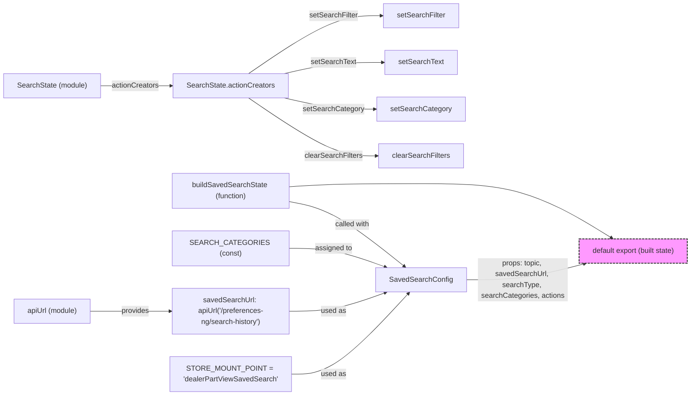

# Diagram: web/portal/src/pages/partview/redux/DealerPartViewSavedSearchState.js

> Auto-generated by Obscura crawlers

## Mermaid

### SVG

<svg id="container" width="1537.453125" xmlns="http://www.w3.org/2000/svg" class="flowchart" height="880" viewBox="0 0 1537.453125 880" role="graphics-document document" aria-roledescription="flowchart-v2"><g><marker id="container_flowchart-v2-pointEnd" class="marker flowchart-v2" viewBox="0 0 10 10" refX="5" refY="5" markerUnits="userSpaceOnUse" markerWidth="8" markerHeight="8" orient="auto"><path d="M 0 0 L 10 5 L 0 10 z" class="arrowMarkerPath" style="stroke-width: 1; stroke-dasharray: 1, 0;"></path></marker><marker id="container_flowchart-v2-pointStart" class="marker flowchart-v2" viewBox="0 0 10 10" refX="4.5" refY="5" markerUnits="userSpaceOnUse" markerWidth="8" markerHeight="8" orient="auto"><path d="M 0 5 L 10 10 L 10 0 z" class="arrowMarkerPath" style="stroke-width: 1; stroke-dasharray: 1, 0;"></path></marker><marker id="container_flowchart-v2-circleEnd" class="marker flowchart-v2" viewBox="0 0 10 10" refX="11" refY="5" markerUnits="userSpaceOnUse" markerWidth="11" markerHeight="11" orient="auto"><circle cx="5" cy="5" r="5" class="arrowMarkerPath" style="stroke-width: 1; stroke-dasharray: 1, 0;"></circle></marker><marker id="container_flowchart-v2-circleStart" class="marker flowchart-v2" viewBox="0 0 10 10" refX="-1" refY="5" markerUnits="userSpaceOnUse" markerWidth="11" markerHeight="11" orient="auto"><circle cx="5" cy="5" r="5" class="arrowMarkerPath" style="stroke-width: 1; stroke-dasharray: 1, 0;"></circle></marker><marker id="container_flowchart-v2-crossEnd" class="marker cross flowchart-v2" viewBox="0 0 11 11" refX="12" refY="5.2" markerUnits="userSpaceOnUse" markerWidth="11" markerHeight="11" orient="auto"><path d="M 1,1 l 9,9 M 10,1 l -9,9" class="arrowMarkerPath" style="stroke-width: 2; stroke-dasharray: 1, 0;"></path></marker><marker id="container_flowchart-v2-crossStart" class="marker cross flowchart-v2" viewBox="0 0 11 11" refX="-1" refY="5.2" markerUnits="userSpaceOnUse" markerWidth="11" markerHeight="11" orient="auto"><path d="M 1,1 l 9,9 M 10,1 l -9,9" class="arrowMarkerPath" style="stroke-width: 2; stroke-dasharray: 1, 0;"></path></marker><g class="root"><g class="clusters"></g><g class="edgePaths"><path d="M202.992,693L219.426,693C235.859,693,268.727,693,298.066,693C327.406,693,353.219,693,366.125,693L379.031,693" id="L_apiUrl_savedSearchUrl_0" class="edge-thickness-normal edge-pattern-solid edge-thickness-normal edge-pattern-solid flowchart-link" style=";" data-edge="true" data-et="edge" data-id="L_apiUrl_savedSearchUrl_0" data-points="W3sieCI6MjAyLjk5MjE4NzUsInkiOjY5M30seyJ4IjozMDEuNTkzNzUsInkiOjY5M30seyJ4IjozODMuMDMxMjUsInkiOjY5M31d" marker-end="url(#container_flowchart-v2-pointEnd)"></path><path d="M643.031,449.19L658.983,452.159C674.935,455.127,706.839,461.063,748.513,485.109C790.188,509.155,841.634,551.31,867.357,572.387L893.08,593.465" id="L_buildSavedSearchState_config_0" class="edge-thickness-normal edge-pattern-solid edge-thickness-normal edge-pattern-solid flowchart-link" style=";" data-edge="true" data-et="edge" data-id="L_buildSavedSearchState_config_0" data-points="W3sieCI6NjQzLjAzMTI1LCJ5Ijo0NDkuMTkwMjMyMjUyMjU4NX0seyJ4Ijo3MzguNzQyMTg3NSwieSI6NDY3fSx7IngiOjg5Ni4xNzQxMjg2MDU3NjkzLCJ5Ijo1OTZ9XQ==" marker-end="url(#container_flowchart-v2-pointEnd)"></path><path d="M643.031,553L658.983,553C674.935,553,706.839,553,741.656,559.937C776.474,566.873,814.206,580.746,833.071,587.683L851.937,594.62" id="L_SEARCH_CATEGORIES_config_0" class="edge-thickness-normal edge-pattern-solid edge-thickness-normal edge-pattern-solid flowchart-link" style=";" data-edge="true" data-et="edge" data-id="L_SEARCH_CATEGORIES_config_0" data-points="W3sieCI6NjQzLjAzMTI1LCJ5Ijo1NTN9LHsieCI6NzM4Ljc0MjE4NzUsInkiOjU1M30seyJ4Ijo4NTUuNjkxNjI5NDY0Mjg1NywieSI6NTk2fV0=" marker-end="url(#container_flowchart-v2-pointEnd)"></path><path d="M223.922,191L236.867,191C249.813,191,275.703,191,301.966,191C328.229,191,354.865,191,368.182,191L381.5,191" id="L_SearchState_Actions_0" class="edge-thickness-normal edge-pattern-solid edge-thickness-normal edge-pattern-solid flowchart-link" style=";" data-edge="true" data-et="edge" data-id="L_SearchState_Actions_0" data-points="W3sieCI6MjIzLjkyMTg3NSwieSI6MTkxfSx7IngiOjMwMS41OTM3NSwieSI6MTkxfSx7IngiOjM4NS41LCJ5IjoxOTF9XQ==" marker-end="url(#container_flowchart-v2-pointEnd)"></path><path d="M552.097,218L583.204,239.5C614.312,261,676.527,304,722.985,325.5C769.443,347,800.143,347,815.493,347L830.844,347" id="L_Actions_clear_0" class="edge-thickness-normal edge-pattern-solid edge-thickness-normal edge-pattern-solid flowchart-link" style=";" data-edge="true" data-et="edge" data-id="L_Actions_clear_0" data-points="W3sieCI6NTUyLjA5NjYwNDU2NzMwNzcsInkiOjIxOH0seyJ4Ijo3MzguNzQyMTg3NSwieSI6MzQ3fSx7IngiOjgzNC44NDM3NSwieSI6MzQ3fV0=" marker-end="url(#container_flowchart-v2-pointEnd)"></path><path d="M630.227,218L648.313,222.167C666.399,226.333,702.571,234.667,735.563,238.833C768.555,243,798.367,243,813.273,243L828.18,243" id="L_Actions_setCat_0" class="edge-thickness-normal edge-pattern-solid edge-thickness-normal edge-pattern-solid flowchart-link" style=";" data-edge="true" data-et="edge" data-id="L_Actions_setCat_0" data-points="W3sieCI6NjMwLjIyNzMxMzcwMTkyMzEsInkiOjIxOH0seyJ4Ijo3MzguNzQyMTg3NSwieSI6MjQzfSx7IngiOjgzMi4xNzk2ODc1LCJ5IjoyNDN9XQ==" marker-end="url(#container_flowchart-v2-pointEnd)"></path><path d="M630.227,164L648.313,159.833C666.399,155.667,702.571,147.333,738.371,143.167C774.172,139,809.602,139,827.316,139L845.031,139" id="L_Actions_setText_0" class="edge-thickness-normal edge-pattern-solid edge-thickness-normal edge-pattern-solid flowchart-link" style=";" data-edge="true" data-et="edge" data-id="L_Actions_setText_0" data-points="W3sieCI6NjMwLjIyNzMxMzcwMTkyMzEsInkiOjE2NH0seyJ4Ijo3MzguNzQyMTg3NSwieSI6MTM5fSx7IngiOjg0OS4wMzEyNSwieSI6MTM5fV0=" marker-end="url(#container_flowchart-v2-pointEnd)"></path><path d="M552.097,164L583.204,142.5C614.312,121,676.527,78,724.731,56.5C772.935,35,807.128,35,824.224,35L841.32,35" id="L_Actions_setFilter_0" class="edge-thickness-normal edge-pattern-solid edge-thickness-normal edge-pattern-solid flowchart-link" style=";" data-edge="true" data-et="edge" data-id="L_Actions_setFilter_0" data-points="W3sieCI6NTUyLjA5NjYwNDU2NzMwNzcsInkiOjE2NH0seyJ4Ijo3MzguNzQyMTg3NSwieSI6MzV9LHsieCI6ODQ1LjMyMDMxMjUsInkiOjM1fV0=" marker-end="url(#container_flowchart-v2-pointEnd)"></path><path d="M646.797,833L662.121,833C677.445,833,708.094,833,750.621,802.994C793.148,772.988,847.554,712.976,874.758,682.97L901.961,652.963" id="L_STORE_MOUNT_POINT_config_0" class="edge-thickness-normal edge-pattern-solid edge-thickness-normal edge-pattern-solid flowchart-link" style=";" data-edge="true" data-et="edge" data-id="L_STORE_MOUNT_POINT_config_0" data-points="W3sieCI6NjQ2Ljc5Njg3NSwieSI6ODMzfSx7IngiOjczOC43NDIxODc1LCJ5Ijo4MzN9LHsieCI6OTA0LjY0NzIwOTgyMTQyODUsInkiOjY1MH1d" marker-end="url(#container_flowchart-v2-pointEnd)"></path><path d="M643.031,693L658.983,693C674.935,693,706.839,693,741.656,686.063C776.474,679.127,814.206,665.254,833.071,658.317L851.937,651.38" id="L_savedSearchUrl_config_0" class="edge-thickness-normal edge-pattern-solid edge-thickness-normal edge-pattern-solid flowchart-link" style=";" data-edge="true" data-et="edge" data-id="L_savedSearchUrl_config_0" data-points="W3sieCI6NjQzLjAzMTI1LCJ5Ijo2OTN9LHsieCI6NzM4Ljc0MjE4NzUsInkiOjY5M30seyJ4Ijo4NTUuNjkxNjI5NDY0Mjg1NywieSI6NjUwfV0=" marker-end="url(#container_flowchart-v2-pointEnd)"></path><path d="M1027.563,623L1048.396,623C1069.229,623,1110.896,623,1155.263,616.998C1199.63,610.996,1246.697,598.992,1270.231,592.99L1293.764,586.989" id="L_config_Export_0" class="edge-thickness-normal edge-pattern-solid edge-thickness-normal edge-pattern-solid flowchart-link" style=";" data-edge="true" data-et="edge" data-id="L_config_Export_0" data-points="W3sieCI6MTAyNy41NjI1LCJ5Ijo2MjN9LHsieCI6MTE1Mi41NjI1LCJ5Ijo2MjN9LHsieCI6MTI5Ny42NDAyNTg3ODkwNjI1LCJ5Ijo1ODZ9XQ==" marker-end="url(#container_flowchart-v2-pointEnd)"></path><path d="M643.031,415.785L658.983,414.654C674.935,413.523,706.839,411.262,754.521,410.131C802.203,409,865.664,409,934.634,409C1003.604,409,1078.083,409,1149.047,429.158C1220.01,449.316,1287.457,489.632,1321.181,509.79L1354.904,529.948" id="L_buildSavedSearchState_Export_0" class="edge-thickness-normal edge-pattern-solid edge-thickness-normal edge-pattern-solid flowchart-link" style=";" data-edge="true" data-et="edge" data-id="L_buildSavedSearchState_Export_0" data-points="W3sieCI6NjQzLjAzMTI1LCJ5Ijo0MTUuNzg0NjczNDI3NzExfSx7IngiOjczOC43NDIxODc1LCJ5Ijo0MDl9LHsieCI6OTI5LjEyNSwieSI6NDA5fSx7IngiOjExNTIuNTYyNSwieSI6NDA5fSx7IngiOjEzNTguMzM3NjU2MjUsInkiOjUzMn1d" marker-end="url(#container_flowchart-v2-pointEnd)"></path></g><g class="edgeLabels"><g class="edgeLabel" transform="translate(301.59375, 693)"><g class="label" data-id="L_apiUrl_savedSearchUrl_0" transform="translate(-31.3125, -12)"><foreignObject width="62.625" height="24">

provides

</foreignObject></g></g><g class="edgeLabel" transform="translate(779.80682, 500.64843)"><g class="label" data-id="L_buildSavedSearchState_config_0" transform="translate(-39.5, -12)"><foreignObject width="79" height="24">

called with

</foreignObject></g></g><g class="edgeLabel" transform="translate(738.7421875, 553)"><g class="label" data-id="L_SEARCH_CATEGORIES_config_0" transform="translate(-41.4765625, -12)"><foreignObject width="82.953125" height="24">

assigned to

</foreignObject></g></g><g class="edgeLabel" transform="translate(301.59375, 191)"><g class="label" data-id="L_SearchState_Actions_0" transform="translate(-52.671875, -12)"><foreignObject width="105.34375" height="24">

actionCreators

</foreignObject></g></g><g class="edgeLabel" transform="translate(738.7421875, 347)"><g class="label" data-id="L_Actions_clear_0" transform="translate(-64.28125, -12)"><foreignObject width="128.5625" height="24">

clearSearchFilters

</foreignObject></g></g><g class="edgeLabel" transform="translate(738.7421875, 243)"><g class="label" data-id="L_Actions_setCat_0" transform="translate(-66.9453125, -12)"><foreignObject width="133.890625" height="24">

setSearchCategory

</foreignObject></g></g><g class="edgeLabel" transform="translate(738.7421875, 139)"><g class="label" data-id="L_Actions_setText_0" transform="translate(-50.09375, -12)"><foreignObject width="100.1875" height="24">

setSearchText

</foreignObject></g></g><g class="edgeLabel" transform="translate(738.7421875, 35)"><g class="label" data-id="L_Actions_setFilter_0" transform="translate(-53.8046875, -12)"><foreignObject width="107.609375" height="24">

setSearchFilter

</foreignObject></g></g><g class="edgeLabel" transform="translate(738.7421875, 833)"><g class="label" data-id="L_STORE_MOUNT_POINT_config_0" transform="translate(-27.6640625, -12)"><foreignObject width="55.328125" height="24">

used as

</foreignObject></g></g><g class="edgeLabel" transform="translate(738.7421875, 693)"><g class="label" data-id="L_savedSearchUrl_config_0" transform="translate(-27.6640625, -12)"><foreignObject width="55.328125" height="24">

used as

</foreignObject></g></g><g class="edgeLabel" transform="translate(1152.5625, 623)"><g class="label" data-id="L_config_Export_0" transform="translate(-100, -48)"><foreignObject width="200" height="96">

props: topic, savedSearchUrl, searchType, searchCategories, actions

</foreignObject></g></g><g class="edgeLabel"><g class="label" data-id="L_buildSavedSearchState_Export_0" transform="translate(0, 0)"><foreignObject width="0" height="0">

</foreignObject></g></g></g><g class="nodes"><g class="node default" id="flowchart-apiUrl-0" transform="translate(115.9609375, 693)"><rect class="basic label-container" style="" x="-87.03125" y="-27" width="174.0625" height="54"></rect><g class="label" style="" transform="translate(-57.03125, -12)"><rect></rect><foreignObject width="114.0625" height="24">

apiUrl (module)

</foreignObject></g></g><g class="node default" id="flowchart-savedSearchUrl-1" transform="translate(513.03125, 693)"><rect class="basic label-container" style="" x="-130" y="-51" width="260" height="102"></rect><g class="label" style="" transform="translate(-100, -36)"><rect></rect><foreignObject width="200" height="72">

savedSearchUrl: apiUrl('/preferences-ng/search-history')

</foreignObject></g></g><g class="node default" id="flowchart-buildSavedSearchState-2" transform="translate(513.03125, 425)"><rect class="basic label-container" style="" x="-130" y="-39" width="260" height="78"></rect><g class="label" style="" transform="translate(-100, -24)"><rect></rect><foreignObject width="200" height="48">

buildSavedSearchState (function)

</foreignObject></g></g><g class="node default" id="flowchart-config-3" transform="translate(929.125, 623)"><rect class="basic label-container" style="" x="-98.4375" y="-27" width="196.875" height="54"></rect><g class="label" style="" transform="translate(-68.4375, -12)"><rect></rect><foreignObject width="136.875" height="24">

SavedSearchConfig

</foreignObject></g></g><g class="node default" id="flowchart-SEARCH_CATEGORIES-4" transform="translate(513.03125, 553)"><rect class="basic label-container" style="" x="-130" y="-39" width="260" height="78"></rect><g class="label" style="" transform="translate(-100, -24)"><rect></rect><foreignObject width="200" height="48">

SEARCH_CATEGORIES (const)

</foreignObject></g></g><g class="node default" id="flowchart-SearchState-6" transform="translate(115.9609375, 191)"><rect class="basic label-container" style="" x="-107.9609375" y="-27" width="215.921875" height="54"></rect><g class="label" style="" transform="translate(-77.9609375, -12)"><rect></rect><foreignObject width="155.921875" height="24">

SearchState (module)

</foreignObject></g></g><g class="node default" id="flowchart-Actions-7" transform="translate(513.03125, 191)"><rect class="basic label-container" style="" x="-127.53125" y="-27" width="255.0625" height="54"></rect><g class="label" style="" transform="translate(-97.53125, -12)"><rect></rect><foreignObject width="195.0625" height="24">

SearchState.actionCreators

</foreignObject></g></g><g class="node default" id="flowchart-clear-9" transform="translate(929.125, 347)"><rect class="basic label-container" style="" x="-94.28125" y="-27" width="188.5625" height="54"></rect><g class="label" style="" transform="translate(-64.28125, -12)"><rect></rect><foreignObject width="128.5625" height="24">

clearSearchFilters

</foreignObject></g></g><g class="node default" id="flowchart-setCat-11" transform="translate(929.125, 243)"><rect class="basic label-container" style="" x="-96.9453125" y="-27" width="193.890625" height="54"></rect><g class="label" style="" transform="translate(-66.9453125, -12)"><rect></rect><foreignObject width="133.890625" height="24">

setSearchCategory

</foreignObject></g></g><g class="node default" id="flowchart-setText-13" transform="translate(929.125, 139)"><rect class="basic label-container" style="" x="-80.09375" y="-27" width="160.1875" height="54"></rect><g class="label" style="" transform="translate(-50.09375, -12)"><rect></rect><foreignObject width="100.1875" height="24">

setSearchText

</foreignObject></g></g><g class="node default" id="flowchart-setFilter-15" transform="translate(929.125, 35)"><rect class="basic label-container" style="" x="-83.8046875" y="-27" width="167.609375" height="54"></rect><g class="label" style="" transform="translate(-53.8046875, -12)"><rect></rect><foreignObject width="107.609375" height="24">

setSearchFilter

</foreignObject></g></g><g class="node default" id="flowchart-STORE_MOUNT_POINT-16" transform="translate(513.03125, 833)"><rect class="basic label-container" style="" x="-133.765625" y="-39" width="267.53125" height="78"></rect><g class="label" style="" transform="translate(-103.765625, -24)"><rect></rect><foreignObject width="207.53125" height="48">

STORE_MOUNT_POINT = 'dealerPartViewSavedSearch'

</foreignObject></g></g><g class="node default" id="flowchart-Export-21" transform="translate(1403.5078125, 559)"><rect class="basic label-container" style="stroke:#333 !important;stroke-width:2px !important;fill:#f9f !important;stroke-dasharray:5 2 !important" x="-125.9453125" y="-27" width="251.890625" height="54"></rect><g class="label" style="" transform="translate(-95.9453125, -12)"><rect></rect><foreignObject width="191.890625" height="24">

default export (built state)

</foreignObject></g></g></g></g></g></svg>
