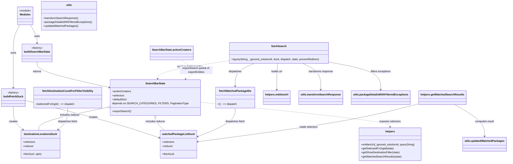

# Diagram: web/portal/src/pages/partview/redux/DealerPartViewSearchBarState.js

> Auto-generated by Obscura crawlers

## Mermaid

### SVG

<svg id="container" width="2969.095703125" xmlns="http://www.w3.org/2000/svg" class="classDiagram" height="976" viewBox="0 0 2969.095703125 976" role="graphics-document document" aria-roledescription="class"><g><defs><marker id="container_class-aggregationStart" class="marker aggregation class" refX="18" refY="7" markerWidth="190" markerHeight="240" orient="auto"><path d="M 18,7 L9,13 L1,7 L9,1 Z"></path></marker></defs><defs><marker id="container_class-aggregationEnd" class="marker aggregation class" refX="1" refY="7" markerWidth="20" markerHeight="28" orient="auto"><path d="M 18,7 L9,13 L1,7 L9,1 Z"></path></marker></defs><defs><marker id="container_class-extensionStart" class="marker extension class" refX="18" refY="7" markerWidth="190" markerHeight="240" orient="auto"><path d="M 1,7 L18,13 V 1 Z"></path></marker></defs><defs><marker id="container_class-extensionEnd" class="marker extension class" refX="1" refY="7" markerWidth="20" markerHeight="28" orient="auto"><path d="M 1,1 V 13 L18,7 Z"></path></marker></defs><defs><marker id="container_class-compositionStart" class="marker composition class" refX="18" refY="7" markerWidth="190" markerHeight="240" orient="auto"><path d="M 18,7 L9,13 L1,7 L9,1 Z"></path></marker></defs><defs><marker id="container_class-compositionEnd" class="marker composition class" refX="1" refY="7" markerWidth="20" markerHeight="28" orient="auto"><path d="M 18,7 L9,13 L1,7 L9,1 Z"></path></marker></defs><defs><marker id="container_class-dependencyStart" class="marker dependency class" refX="6" refY="7" markerWidth="190" markerHeight="240" orient="auto"><path d="M 5,7 L9,13 L1,7 L9,1 Z"></path></marker></defs><defs><marker id="container_class-dependencyEnd" class="marker dependency class" refX="13" refY="7" markerWidth="20" markerHeight="28" orient="auto"><path d="M 18,7 L9,13 L14,7 L9,1 Z"></path></marker></defs><defs><marker id="container_class-lollipopStart" class="marker lollipop class" refX="13" refY="7" markerWidth="190" markerHeight="240" orient="auto"><circle stroke="black" fill="transparent" cx="7" cy="7" r="6"></circle></marker></defs><defs><marker id="container_class-lollipopEnd" class="marker lollipop class" refX="1" refY="7" markerWidth="190" markerHeight="240" orient="auto"><circle stroke="black" fill="transparent" cx="7" cy="7" r="6"></circle></marker></defs><g class="root"><g class="clusters"></g><g class="edgePaths"><path d="M175.818,149L182.347,160.667C188.876,172.333,201.934,195.667,208.463,214C214.992,232.333,214.992,245.667,214.992,252.333L214.992,259" id="id_Modules_buildSearchBarState_1" class="edge-thickness-normal edge-pattern-solid relation" style=";;;" data-edge="true" data-et="edge" data-id="id_Modules_buildSearchBarState_1" data-points="W3sieCI6MTc1LjgxNzg1NTM0Mjc0MTk1LCJ5IjoxNDl9LHsieCI6MjE0Ljk5MjE4NzUsInkiOjIxOX0seyJ4IjoyMTQuOTkyMTg3NSwieSI6MjY1fV0=" marker-end="url(#container_class-dependencyEnd)"></path><path d="M115.377,149L108.848,160.667C102.319,172.333,89.261,195.667,82.732,224C76.203,252.333,76.203,285.667,76.203,321C76.203,356.333,76.203,393.667,76.203,428.5C76.203,463.333,76.203,495.667,76.203,511.833L76.203,528" id="id_Modules_buildFetchDuck_2" class="edge-thickness-normal edge-pattern-solid relation" style=";;;" data-edge="true" data-et="edge" data-id="id_Modules_buildFetchDuck_2" data-points="W3sieCI6MTE1LjM3NzQ1NzE1NzI1ODA2LCJ5IjoxNDl9LHsieCI6NzYuMjAzMTI1LCJ5IjoyMTl9LHsieCI6NzYuMjAzMTI1LCJ5IjozMTl9LHsieCI6NzYuMjAzMTI1LCJ5Ijo0MzF9LHsieCI6NzYuMjAzMTI1LCJ5Ijo1MzR9XQ==" marker-end="url(#container_class-dependencyEnd)"></path><path d="M76.203,642L76.203,657.167C76.203,672.333,76.203,702.667,85.577,725.85C94.951,749.033,113.7,765.067,123.074,773.084L132.448,781.1" id="id_buildFetchDuck_destinationLocationsDuck_3" class="edge-thickness-normal edge-pattern-solid relation" style=";;;" data-edge="true" data-et="edge" data-id="id_buildFetchDuck_destinationLocationsDuck_3" data-points="W3sieCI6NzYuMjAzMTI1LCJ5Ijo2NDJ9LHsieCI6NzYuMjAzMTI1LCJ5Ijo3MzN9LHsieCI6MTM3LjAwNzY5NzYxMDI5NDEyLCJ5Ijo3ODV9XQ==" marker-end="url(#container_class-dependencyEnd)"></path><path d="M144.406,605.412L227.701,626.676C310.997,647.941,477.587,690.471,609.719,728.225C741.851,765.98,839.525,798.96,888.361,815.45L937.198,831.94" id="id_buildFetchDuck_watchedPackageListDuck_4" class="edge-thickness-normal edge-pattern-solid relation" style=";;;" data-edge="true" data-et="edge" data-id="id_buildFetchDuck_watchedPackageListDuck_4" data-points="W3sieCI6MTQ0LjQwNjI1LCJ5Ijo2MDUuNDExNzg3MzYxMjAzM30seyJ4Ijo2NDQuMTc3NzM0Mzc1LCJ5Ijo3MzN9LHsieCI6OTQyLjg4MjgxMjUsInkiOjgzMy44NTk5MTI0MjQwNX1d" marker-end="url(#container_class-dependencyEnd)"></path><path d="M214.992,373L214.992,382.667C214.992,392.333,214.992,411.667,285.537,437.619C356.083,463.571,497.173,496.141,567.718,512.426L638.263,528.712" id="id_buildSearchBarState_SearchBarState_5" class="edge-thickness-normal edge-pattern-solid relation" style=";;;" data-edge="true" data-et="edge" data-id="id_buildSearchBarState_SearchBarState_5" data-points="W3sieCI6MjE0Ljk5MjE4NzUsInkiOjM3M30seyJ4IjoyMTQuOTkyMTg3NSwieSI6NDMxfSx7IngiOjY0NC4xMDkzNzUsInkiOjUzMC4wNjEzNTk1MjQ0MjQ5fV0=" marker-end="url(#container_class-dependencyEnd)"></path><path d="M627.242,645.406L559.126,660.005C491.011,674.604,354.779,703.802,287.726,727.068C220.673,750.333,222.8,767.667,223.863,776.333L224.926,785" id="id_SearchBarState_destinationLocationsDuck_6" class="edge-thickness-normal edge-pattern-solid relation" style=";;;" data-edge="true" data-et="edge" data-id="id_SearchBarState_destinationLocationsDuck_6" data-points="W3sieCI6NjQ0LjEwOTM3NSwieSI6NjQxLjc5MTM2MjMzNzI0OTl9LHsieCI6MjE4LjU0Njg3NSwieSI6NzMzfSx7IngiOjIyNC45MjU4OTYxMzk3MDU4OCwieSI6Nzg1fV0=" marker-start="url(#container_class-aggregationStart)"></path><path d="M895.09,713.25L895.09,716.542C895.09,719.833,895.09,726.417,904.767,738.375C914.445,750.333,933.8,767.667,943.478,776.333L953.155,785" id="id_SearchBarState_watchedPackageListDuck_7" class="edge-thickness-normal edge-pattern-solid relation" style=";;;" data-edge="true" data-et="edge" data-id="id_SearchBarState_watchedPackageListDuck_7" data-points="W3sieCI6ODk1LjA4OTg0Mzc1LCJ5Ijo2OTZ9LHsieCI6ODk1LjA4OTg0Mzc1LCJ5Ijo3MzN9LHsieCI6OTUzLjE1NTIxNTk5MjY0NzEsInkiOjc4NX1d" marker-start="url(#container_class-aggregationStart)"></path><path d="M1146.07,614.094L1336.682,633.912C1527.294,653.729,1908.517,693.365,2099.129,718.349C2289.74,743.333,2289.74,753.667,2289.74,758.833L2289.74,764" id="id_SearchBarState_helpers_8" class="edge-thickness-normal edge-pattern-dashed relation" style=";;;" data-edge="true" data-et="edge" data-id="id_SearchBarState_helpers_8" data-points="W3sieCI6MTE0Ni4wNzAzMTI1LCJ5Ijo2MTQuMDk0MTE1MjA4NjQ0N30seyJ4IjoyMjg5Ljc0MDIzNDM3NSwieSI6NzMzfSx7IngiOjIyODkuNzQwMjM0Mzc1LCJ5Ijo3NzB9XQ==" marker-end="url(#container_class-dependencyEnd)"></path><path d="M394.258,651L394.258,664.667C394.258,678.333,394.258,705.667,384.884,727.35C375.51,749.033,356.761,765.067,347.387,773.084L338.013,781.1" id="id_fetchDestinationCountForFiliterVisibility_destinationLocationsDuck_9" class="edge-thickness-normal edge-pattern-solid relation" style=";;;" data-edge="true" data-et="edge" data-id="id_fetchDestinationCountForFiliterVisibility_destinationLocationsDuck_9" data-points="W3sieCI6Mzk0LjI1NzgxMjUsInkiOjY1MX0seyJ4IjozOTQuMjU3ODEyNSwieSI6NzMzfSx7IngiOjMzMy40NTMyMzk4ODk3MDU4NiwieSI6Nzg1fV0=" marker-end="url(#container_class-dependencyEnd)"></path><path d="M1377.943,651L1377.943,664.667C1377.943,678.333,1377.943,705.667,1341.048,734.493C1304.153,763.319,1230.363,793.639,1193.468,808.799L1156.573,823.958" id="id_fetchWatchedPackageIDs_watchedPackageListDuck_10" class="edge-thickness-normal edge-pattern-solid relation" style=";;;" data-edge="true" data-et="edge" data-id="id_fetchWatchedPackageIDs_watchedPackageListDuck_10" data-points="W3sieCI6MTM3Ny45NDMzNTkzNzUsInkiOjY1MX0seyJ4IjoxMzc3Ljk0MzM1OTM3NSwieSI6NzMzfSx7IngiOjExNTEuMDIzNDM3NSwieSI6ODI2LjIzODczMDg0NDM1MzJ9XQ==" marker-end="url(#container_class-dependencyEnd)"></path><path d="M1623.446,382L1623.269,390.167C1623.091,398.333,1622.736,414.667,1622.558,441C1622.381,467.333,1622.381,503.667,1622.381,521.833L1622.381,540" id="id_fetchSearch_helpers.entitiesUrl_11" class="edge-thickness-normal edge-pattern-solid relation" style=";;;" data-edge="true" data-et="edge" data-id="id_fetchSearch_helpers.entitiesUrl_11" data-points="W3sieCI6MTYyMy40NDY0MTExMzI4MTI1LCJ5IjozODJ9LHsieCI6MTYyMi4zODA4NTkzNzUsInkiOjQzMX0seyJ4IjoxNjIyLjM4MDg1OTM3NSwieSI6NTQ2fV0=" marker-end="url(#container_class-dependencyEnd)"></path><path d="M1767.723,382L1786.248,390.167C1804.773,398.333,1841.823,414.667,1860.348,441C1878.873,467.333,1878.873,503.667,1878.873,521.833L1878.873,540" id="id_fetchSearch_utils.transformSearchResponse_12" class="edge-thickness-normal edge-pattern-solid relation" style=";;;" data-edge="true" data-et="edge" data-id="id_fetchSearch_utils.transformSearchResponse_12" data-points="W3sieCI6MTc2Ny43MjMyNjY2MDE1NjI1LCJ5IjozODJ9LHsieCI6MTg3OC44NzMwNDY4NzUsInkiOjQzMX0seyJ4IjoxODc4Ljg3MzA0Njg3NSwieSI6NTQ2fV0=" marker-end="url(#container_class-dependencyEnd)"></path><path d="M1927.5,375.481L1977.088,384.734C2026.676,393.987,2125.853,412.494,2175.441,439.913C2225.029,467.333,2225.029,503.667,2225.029,521.833L2225.029,540" id="id_fetchSearch_utils.packageDetailsWithFilteredExceptions_13" class="edge-thickness-normal edge-pattern-solid relation" style=";;;" data-edge="true" data-et="edge" data-id="id_fetchSearch_utils.packageDetailsWithFilteredExceptions_13" data-points="W3sieCI6MTkyNy41LCJ5IjozNzUuNDgwODk3MDc3NTM0MzR9LHsieCI6MjIyNS4wMjkyOTY4NzUsInkiOjQzMX0seyJ4IjoyMjI1LjAyOTI5Njg3NSwieSI6NTQ2fV0=" marker-end="url(#container_class-dependencyEnd)"></path><path d="M1485.95,382L1467.949,390.167C1449.948,398.333,1413.946,414.667,1395.945,437.5C1377.943,460.333,1377.943,489.667,1377.943,504.333L1377.943,519" id="id_fetchSearch_fetchWatchedPackageIDs_14" class="edge-thickness-normal edge-pattern-solid relation" style=";;;" data-edge="true" data-et="edge" data-id="id_fetchSearch_fetchWatchedPackageIDs_14" data-points="W3sieCI6MTQ4NS45NTAzMTczODI4MTI1LCJ5IjozODJ9LHsieCI6MTM3Ny45NDMzNTkzNzUsInkiOjQzMX0seyJ4IjoxMzc3Ljk0MzM1OTM3NSwieSI6NTI1fV0=" marker-end="url(#container_class-dependencyEnd)"></path><path d="M1322.133,367.377L1255.788,377.981C1189.443,388.585,1056.753,409.792,989.082,427.579C921.411,445.367,918.76,459.733,917.435,466.916L916.109,474.1" id="id_fetchSearch_SearchBarState_15" class="edge-thickness-normal edge-pattern-dashed relation" style=";;;" data-edge="true" data-et="edge" data-id="id_fetchSearch_SearchBarState_15" data-points="W3sieCI6MTMyMi4xMzI4MTI1LCJ5IjozNjcuMzc3MjcyMjQ1ODUxMjZ9LHsieCI6OTI0LjA2MjUsInkiOjQzMX0seyJ4Ijo5MTUuMDIwMDc4NjIyNjExNCwieSI6NDgwfV0=" marker-end="url(#container_class-dependencyEnd)"></path><path d="M1054.877,361L1071.705,372.667C1088.533,384.333,1122.188,407.667,1126.309,426.984C1130.43,446.302,1105.016,461.603,1092.309,469.254L1079.602,476.905" id="id_SearchBarState.actionCreators_SearchBarState_16" class="edge-thickness-normal edge-pattern-dashed relation" style=";;;" data-edge="true" data-et="edge" data-id="id_SearchBarState.actionCreators_SearchBarState_16" data-points="W3sieCI6MTA1NC44NzY5NTMxMjUsInkiOjM2MX0seyJ4IjoxMTU1Ljg0Mzc1LCJ5Ijo0MzF9LHsieCI6MTA3NC40NjE5NTc2MDM1MDMyLCJ5Ijo0ODB9XQ==" marker-end="url(#container_class-dependencyEnd)"></path><path d="M2444.904,625.003L2378.557,643.003C2312.209,661.002,2179.514,697.001,1964.858,735.173C1750.202,773.345,1453.585,813.691,1305.277,833.863L1156.969,854.036" id="id_helpers.getWatchedSearchResults_watchedPackageListDuck_17" class="edge-thickness-normal edge-pattern-solid relation" style=";;;" data-edge="true" data-et="edge" data-id="id_helpers.getWatchedSearchResults_watchedPackageListDuck_17" data-points="W3sieCI6MjQ0NC45MDQyOTY4NzUsInkiOjYyNS4wMDM0NjQyMDMyMzMzfSx7IngiOjIwNDYuODE4MzU5Mzc1LCJ5Ijo3MzN9LHsieCI6MTE1MS4wMjM0Mzc1LCJ5Ijo4NTQuODQ0NTI5ODI5MjE1M31d" marker-end="url(#container_class-dependencyEnd)"></path><path d="M2654.833,630L2684.887,647.167C2714.942,664.333,2775.05,698.667,2805.104,730.5C2835.158,762.333,2835.158,791.667,2835.158,806.333L2835.158,821" id="id_helpers.getWatchedSearchResults_utils.updatedWatchedPackages_18" class="edge-thickness-normal edge-pattern-solid relation" style=";;;" data-edge="true" data-et="edge" data-id="id_helpers.getWatchedSearchResults_utils.updatedWatchedPackages_18" data-points="W3sieCI6MjY1NC44MzMyODM5NDM5NjU0LCJ5Ijo2MzB9LHsieCI6MjgzNS4xNTgyMDMxMjUsInkiOjczM30seyJ4IjoyODM1LjE1ODIwMzEyNSwieSI6ODI3fV0=" marker-end="url(#container_class-dependencyEnd)"></path></g><g class="edgeLabels"><g class="edgeLabel" transform="translate(214.9921875, 219)"><g class="label" data-id="id_Modules_buildSearchBarState_1" transform="translate(-16.4921875, -12)"><foreignObject width="32.984375" height="24">

uses

</foreignObject></g></g><g class="edgeLabel" transform="translate(76.203125, 319)"><g class="label" data-id="id_Modules_buildFetchDuck_2" transform="translate(-16.4921875, -12)"><foreignObject width="32.984375" height="24">

uses

</foreignObject></g></g><g class="edgeLabel" transform="translate(76.203125, 733)"><g class="label" data-id="id_buildFetchDuck_destinationLocationsDuck_3" transform="translate(-26.171875, -12)"><foreignObject width="52.34375" height="24">

creates

</foreignObject></g></g><g class="edgeLabel" transform="translate(547.03004, 708.19886)"><g class="label" data-id="id_buildFetchDuck_watchedPackageListDuck_4" transform="translate(-26.171875, -12)"><foreignObject width="52.34375" height="24">

creates

</foreignObject></g></g><g class="edgeLabel" transform="translate(214.9921875, 431)"><g class="label" data-id="id_buildSearchBarState_SearchBarState_5" transform="translate(-26.265625, -12)"><foreignObject width="52.53125" height="24">

returns

</foreignObject></g></g><g class="edgeLabel" transform="translate(405.71489, 692.88523)"><g class="label" data-id="id_SearchBarState_destinationLocationsDuck_6" transform="translate(-60.53125, -12)"><foreignObject width="121.0625" height="24">

includes reducer

</foreignObject></g></g><g class="edgeLabel" transform="translate(895.08984375, 733)"><g class="label" data-id="id_SearchBarState_watchedPackageListDuck_7" transform="translate(-60.53125, -12)"><foreignObject width="121.0625" height="24">

includes reducer

</foreignObject></g></g><g class="edgeLabel" transform="translate(2289.740234375, 733)"><g class="label" data-id="id_SearchBarState_helpers_8" transform="translate(-64.2734375, -12)"><foreignObject width="128.546875" height="24">

exposes selectors

</foreignObject></g></g><g class="edgeLabel" transform="translate(394.2578125, 733)"><g class="label" data-id="id_fetchDestinationCountForFiliterVisibility_destinationLocationsDuck_9" transform="translate(-59.5390625, -12)"><foreignObject width="119.078125" height="24">

dispatches fetch

</foreignObject></g></g><g class="edgeLabel" transform="translate(1377.943359375, 733)"><g class="label" data-id="id_fetchWatchedPackageIDs_watchedPackageListDuck_10" transform="translate(-59.5390625, -12)"><foreignObject width="119.078125" height="24">

dispatches fetch

</foreignObject></g></g><g class="edgeLabel" transform="translate(1622.380859375, 431)"><g class="label" data-id="id_fetchSearch_helpers.entitiesUrl_11" transform="translate(-34.703125, -12)"><foreignObject width="69.40625" height="24">

builds url

</foreignObject></g></g><g class="edgeLabel" transform="translate(1878.873046875, 431)"><g class="label" data-id="id_fetchSearch_utils.transformSearchResponse_12" transform="translate(-74.703125, -12)"><foreignObject width="149.40625" height="24">

transforms response

</foreignObject></g></g><g class="edgeLabel" transform="translate(2225.029296875, 431)"><g class="label" data-id="id_fetchSearch_utils.packageDetailsWithFilteredExceptions_13" transform="translate(-62.015625, -12)"><foreignObject width="124.03125" height="24">

filters exceptions

</foreignObject></g></g><g class="edgeLabel" transform="translate(1377.943359375, 431)"><g class="label" data-id="id_fetchSearch_fetchWatchedPackageIDs_14" transform="translate(-39.1796875, -12)"><foreignObject width="78.359375" height="24">

dispatches

</foreignObject></g></g><g class="edgeLabel" transform="translate(1098.49622, 403.12063)"><g class="label" data-id="id_fetchSearch_SearchBarState_15" transform="translate(-78.4140625, -12)"><foreignObject width="156.828125" height="24">

used as fetch handler

</foreignObject></g></g><g class="edgeLabel" transform="translate(1144.39422, 423.06207)"><g class="label" data-id="id_SearchBarState.actionCreators_SearchBarState_16" transform="translate(-100, -24)"><foreignObject width="200" height="48">

exportSearch partial of exportEntities

</foreignObject></g></g><g class="edgeLabel" transform="translate(1803.27669, 766.12613)"><g class="label" data-id="id_helpers.getWatchedSearchResults_watchedPackageListDuck_17" transform="translate(-54.8515625, -12)"><foreignObject width="109.703125" height="24">

reads selectors

</foreignObject></g></g><g class="edgeLabel" transform="translate(2835.158203125, 733)"><g class="label" data-id="id_helpers.getWatchedSearchResults_utils.updatedWatchedPackages_18" transform="translate(-58.421875, -12)"><foreignObject width="116.84375" height="24">

computes result

</foreignObject></g></g></g><g class="nodes"><g class="node default" id="classId-Modules-0" transform="translate(145.59765625, 95)"><g class="basic label-container"><path d="M-48.6015625 -54 L48.6015625 -54 L48.6015625 54 L-48.6015625 54" stroke="none" stroke-width="0" fill="#ECECFF" style=""></path><path d="M-48.6015625 -54 C-15.263162494249308 -54, 18.075237511501385 -54, 48.6015625 -54 M-48.6015625 -54 C-18.953672214120413 -54, 10.694218071759174 -54, 48.6015625 -54 M48.6015625 -54 C48.6015625 -13.720396716825938, 48.6015625 26.559206566348124, 48.6015625 54 M48.6015625 -54 C48.6015625 -25.74428835407226, 48.6015625 2.511423291855479, 48.6015625 54 M48.6015625 54 C12.75279269543266 54, -23.09597710913468 54, -48.6015625 54 M48.6015625 54 C13.17727527788707 54, -22.24701194422586 54, -48.6015625 54 M-48.6015625 54 C-48.6015625 17.86538288151602, -48.6015625 -18.26923423696796, -48.6015625 -54 M-48.6015625 54 C-48.6015625 24.417672915250417, -48.6015625 -5.1646541694991654, -48.6015625 -54" stroke="#9370DB" stroke-width="1.3" fill="none" stroke-dasharray="0 0" style=""></path></g><g class="annotation-group text" transform="translate(-36.6015625, -30)"><g class="label" style="" transform="translate(0,-12)"><foreignObject width="73.203125" height="24">

«module»

</foreignObject></g></g><g class="label-group text" transform="translate(-30.953125, -6)"><g class="label" style="font-weight: bolder" transform="translate(0,-12)"><foreignObject width="61.90625" height="24">

Modules

</foreignObject></g></g><g class="members-group text" transform="translate(-36.6015625, 42)"></g><g class="methods-group text" transform="translate(-36.6015625, 72)"></g><g class="divider" style=""><path d="M-48.6015625 18 C-22.81779059247471 18, 2.965981315050577 18, 48.6015625 18 M-48.6015625 18 C-13.188153214446004 18, 22.225256071107992 18, 48.6015625 18" stroke="#9370DB" stroke-width="1.3" fill="none" stroke-dasharray="0 0" style=""></path></g><g class="divider" style=""><path d="M-48.6015625 36 C-25.480215050112065 36, -2.35886760022413 36, 48.6015625 36 M-48.6015625 36 C-21.583675590231366 36, 5.434211319537269 36, 48.6015625 36" stroke="#9370DB" stroke-width="1.3" fill="none" stroke-dasharray="0 0" style=""></path></g></g><g class="node default" id="classId-buildSearchBarState-1" transform="translate(214.9921875, 319)"><g class="basic label-container"><path d="M-87.296875 -54 L87.296875 -54 L87.296875 54 L-87.296875 54" stroke="none" stroke-width="0" fill="#ECECFF" style=""></path><path d="M-87.296875 -54 C-42.14026322397037 -54, 3.016348552059256 -54, 87.296875 -54 M-87.296875 -54 C-36.473867327453355 -54, 14.34914034509329 -54, 87.296875 -54 M87.296875 -54 C87.296875 -18.695669498644584, 87.296875 16.608661002710832, 87.296875 54 M87.296875 -54 C87.296875 -17.551710666170763, 87.296875 18.896578667658474, 87.296875 54 M87.296875 54 C42.08462067664649 54, -3.127633646707025 54, -87.296875 54 M87.296875 54 C48.052453533641156 54, 8.808032067282312 54, -87.296875 54 M-87.296875 54 C-87.296875 19.936603770998666, -87.296875 -14.126792458002669, -87.296875 -54 M-87.296875 54 C-87.296875 19.697100512385745, -87.296875 -14.60579897522851, -87.296875 -54" stroke="#9370DB" stroke-width="1.3" fill="none" stroke-dasharray="0 0" style=""></path></g><g class="annotation-group text" transform="translate(-34.2734375, -30)"><g class="label" style="" transform="translate(0,-12)"><foreignObject width="68.546875" height="24">

«factory»

</foreignObject></g></g><g class="label-group text" transform="translate(-75.296875, -6)"><g class="label" style="font-weight: bolder" transform="translate(0,-12)"><foreignObject width="150.59375" height="24">

buildSearchBarState

</foreignObject></g></g><g class="members-group text" transform="translate(-75.296875, 42)"></g><g class="methods-group text" transform="translate(-75.296875, 72)"></g><g class="divider" style=""><path d="M-87.296875 18 C-32.33330347517752 18, 22.630268049644954 18, 87.296875 18 M-87.296875 18 C-44.1125642192747 18, -0.9282534385494046 18, 87.296875 18" stroke="#9370DB" stroke-width="1.3" fill="none" stroke-dasharray="0 0" style=""></path></g><g class="divider" style=""><path d="M-87.296875 36 C-49.261034859434396 36, -11.225194718868792 36, 87.296875 36 M-87.296875 36 C-48.450740749231045 36, -9.60460649846209 36, 87.296875 36" stroke="#9370DB" stroke-width="1.3" fill="none" stroke-dasharray="0 0" style=""></path></g></g><g class="node default" id="classId-buildFetchDuck-2" transform="translate(76.203125, 588)"><g class="basic label-container"><path d="M-68.203125 -54 L68.203125 -54 L68.203125 54 L-68.203125 54" stroke="none" stroke-width="0" fill="#ECECFF" style=""></path><path d="M-68.203125 -54 C-17.10435178766719 -54, 33.99442142466562 -54, 68.203125 -54 M-68.203125 -54 C-27.521120416440574 -54, 13.160884167118851 -54, 68.203125 -54 M68.203125 -54 C68.203125 -23.420992630690304, 68.203125 7.158014738619393, 68.203125 54 M68.203125 -54 C68.203125 -32.1631278954257, 68.203125 -10.326255790851398, 68.203125 54 M68.203125 54 C24.744123106976517 54, -18.714878786046967 54, -68.203125 54 M68.203125 54 C36.05647159774327 54, 3.9098181954865368 54, -68.203125 54 M-68.203125 54 C-68.203125 15.597847126758971, -68.203125 -22.804305746482058, -68.203125 -54 M-68.203125 54 C-68.203125 22.480682971238792, -68.203125 -9.038634057522415, -68.203125 -54" stroke="#9370DB" stroke-width="1.3" fill="none" stroke-dasharray="0 0" style=""></path></g><g class="annotation-group text" transform="translate(-34.2734375, -30)"><g class="label" style="" transform="translate(0,-12)"><foreignObject width="68.546875" height="24">

«factory»

</foreignObject></g></g><g class="label-group text" transform="translate(-56.203125, -6)"><g class="label" style="font-weight: bolder" transform="translate(0,-12)"><foreignObject width="112.40625" height="24">

buildFetchDuck

</foreignObject></g></g><g class="members-group text" transform="translate(-56.203125, 42)"></g><g class="methods-group text" transform="translate(-56.203125, 72)"></g><g class="divider" style=""><path d="M-68.203125 18 C-32.266024903370216 18, 3.6710751932595684 18, 68.203125 18 M-68.203125 18 C-29.763738357702344 18, 8.675648284595312 18, 68.203125 18" stroke="#9370DB" stroke-width="1.3" fill="none" stroke-dasharray="0 0" style=""></path></g><g class="divider" style=""><path d="M-68.203125 36 C-14.985508287935147 36, 38.232108424129706 36, 68.203125 36 M-68.203125 36 C-30.301386402210177 36, 7.600352195579646 36, 68.203125 36" stroke="#9370DB" stroke-width="1.3" fill="none" stroke-dasharray="0 0" style=""></path></g></g><g class="node default" id="classId-destinationLocationsDuck-3" transform="translate(235.23046875, 869)"><g class="basic label-container"><path d="M-117.15625 -84 L117.15625 -84 L117.15625 84 L-117.15625 84" stroke="none" stroke-width="0" fill="#ECECFF" style=""></path><path d="M-117.15625 -84 C-27.464106253390895 -84, 62.22803749321821 -84, 117.15625 -84 M-117.15625 -84 C-67.19979028891271 -84, -17.243330577825432 -84, 117.15625 -84 M117.15625 -84 C117.15625 -17.707257961899117, 117.15625 48.585484076201766, 117.15625 84 M117.15625 -84 C117.15625 -27.525580816613335, 117.15625 28.94883836677333, 117.15625 84 M117.15625 84 C64.69827535960692 84, 12.240300719213849 84, -117.15625 84 M117.15625 84 C48.57393798489963 84, -20.00837403020074 84, -117.15625 84 M-117.15625 84 C-117.15625 44.445599277561186, -117.15625 4.891198555122372, -117.15625 -84 M-117.15625 84 C-117.15625 45.866186014585445, -117.15625 7.7323720291708895, -117.15625 -84" stroke="#9370DB" stroke-width="1.3" fill="none" stroke-dasharray="0 0" style=""></path></g><g class="annotation-group text" transform="translate(0, -60)"></g><g class="label-group text" transform="translate(-95.296875, -60)"><g class="label" style="font-weight: bolder" transform="translate(0,-12)"><foreignObject width="190.59375" height="24">

destinationLocationsDuck

</foreignObject></g></g><g class="members-group text" transform="translate(-105.15625, -12)"><g class="label" style="" transform="translate(0,-12)"><foreignObject width="73.453125" height="24">

+selectors

</foreignObject></g><g class="label" style="" transform="translate(0,12)"><foreignObject width="63.515625" height="24">

+reducer

</foreignObject></g></g><g class="methods-group text" transform="translate(-105.15625, 60)"><g class="label" style="" transform="translate(0,-12)"><foreignObject width="115.015625" height="24">

+fetch(url, opts)

</foreignObject></g></g><g class="divider" style=""><path d="M-117.15625 -36 C-63.86465141378644 -36, -10.57305282757288 -36, 117.15625 -36 M-117.15625 -36 C-44.60799724758394 -36, 27.940255504832123 -36, 117.15625 -36" stroke="#9370DB" stroke-width="1.3" fill="none" stroke-dasharray="0 0" style=""></path></g><g class="divider" style=""><path d="M-117.15625 36 C-42.34897764060783 36, 32.458294718784344 36, 117.15625 36 M-117.15625 36 C-67.25419584574173 36, -17.352141691483467 36, 117.15625 36" stroke="#9370DB" stroke-width="1.3" fill="none" stroke-dasharray="0 0" style=""></path></g></g><g class="node default" id="classId-watchedPackageListDuck-4" transform="translate(1046.953125, 869)"><g class="basic label-container"><path d="M-104.0703125 -84 L104.0703125 -84 L104.0703125 84 L-104.0703125 84" stroke="none" stroke-width="0" fill="#ECECFF" style=""></path><path d="M-104.0703125 -84 C-47.41998045488431 -84, 9.230351590231379 -84, 104.0703125 -84 M-104.0703125 -84 C-21.56628526819425 -84, 60.9377419636115 -84, 104.0703125 -84 M104.0703125 -84 C104.0703125 -21.322886470967717, 104.0703125 41.354227058064566, 104.0703125 84 M104.0703125 -84 C104.0703125 -25.339901953732486, 104.0703125 33.32019609253503, 104.0703125 84 M104.0703125 84 C25.80768863603336 84, -52.45493522793328 84, -104.0703125 84 M104.0703125 84 C23.987673365343767 84, -56.094965769312466 84, -104.0703125 84 M-104.0703125 84 C-104.0703125 21.083358821265882, -104.0703125 -41.833282357468235, -104.0703125 -84 M-104.0703125 84 C-104.0703125 34.37778951864307, -104.0703125 -15.24442096271386, -104.0703125 -84" stroke="#9370DB" stroke-width="1.3" fill="none" stroke-dasharray="0 0" style=""></path></g><g class="annotation-group text" transform="translate(0, -60)"></g><g class="label-group text" transform="translate(-92.0703125, -60)"><g class="label" style="font-weight: bolder" transform="translate(0,-12)"><foreignObject width="184.140625" height="24">

watchedPackageListDuck

</foreignObject></g></g><g class="members-group text" transform="translate(-92.0703125, -12)"><g class="label" style="" transform="translate(0,-12)"><foreignObject width="73.453125" height="24">

+selectors

</foreignObject></g><g class="label" style="" transform="translate(0,12)"><foreignObject width="63.515625" height="24">

+reducer

</foreignObject></g></g><g class="methods-group text" transform="translate(-92.0703125, 60)"><g class="label" style="" transform="translate(0,-12)"><foreignObject width="74.78125" height="24">

+fetch(url)

</foreignObject></g></g><g class="divider" style=""><path d="M-104.0703125 -36 C-45.43057135567617 -36, 13.209169788647657 -36, 104.0703125 -36 M-104.0703125 -36 C-35.021079517199254 -36, 34.02815346560149 -36, 104.0703125 -36" stroke="#9370DB" stroke-width="1.3" fill="none" stroke-dasharray="0 0" style=""></path></g><g class="divider" style=""><path d="M-104.0703125 36 C-60.63193950084877 36, -17.193566501697546 36, 104.0703125 36 M-104.0703125 36 C-58.22285156814101 36, -12.37539063628202 36, 104.0703125 36" stroke="#9370DB" stroke-width="1.3" fill="none" stroke-dasharray="0 0" style=""></path></g></g><g class="node default" id="classId-SearchBarState-5" transform="translate(895.08984375, 588)"><g class="basic label-container"><path d="M-250.98046875 -108 L250.98046875 -108 L250.98046875 108 L-250.98046875 108" stroke="none" stroke-width="0" fill="#ECECFF" style=""></path><path d="M-250.98046875 -108 C-90.18595712354909 -108, 70.60855450290182 -108, 250.98046875 -108 M-250.98046875 -108 C-65.85972442442997 -108, 119.26101990114006 -108, 250.98046875 -108 M250.98046875 -108 C250.98046875 -46.64758788425502, 250.98046875 14.704824231489965, 250.98046875 108 M250.98046875 -108 C250.98046875 -53.08132175642278, 250.98046875 1.8373564871544374, 250.98046875 108 M250.98046875 108 C82.8139656191768 108, -85.3525375116464 108, -250.98046875 108 M250.98046875 108 C121.39141815591995 108, -8.197632438160099 108, -250.98046875 108 M-250.98046875 108 C-250.98046875 51.52206510954879, -250.98046875 -4.955869780902418, -250.98046875 -108 M-250.98046875 108 C-250.98046875 61.310817572942625, -250.98046875 14.62163514588525, -250.98046875 -108" stroke="#9370DB" stroke-width="1.3" fill="none" stroke-dasharray="0 0" style=""></path></g><g class="annotation-group text" transform="translate(0, -84)"></g><g class="label-group text" transform="translate(-56.5546875, -84)"><g class="label" style="font-weight: bolder" transform="translate(0,-12)"><foreignObject width="113.109375" height="24">

SearchBarState

</foreignObject></g></g><g class="members-group text" transform="translate(-238.98046875, -36)"><g class="label" style="" transform="translate(0,-12)"><foreignObject width="113.078125" height="24">

+actionCreators

</foreignObject></g><g class="label" style="" transform="translate(0,12)"><foreignObject width="73.453125" height="24">

+selectors

</foreignObject></g><g class="label" style="" transform="translate(0,36)"><foreignObject width="89.78125" height="24">

+defaultSort

</foreignObject></g><g class="label" style="" transform="translate(0,60)"><foreignObject width="421.40625" height="24">

depends on SEARCH_CATEGORIES, FILTERS, PaginationType

</foreignObject></g></g><g class="methods-group text" transform="translate(-238.98046875, 84)"><g class="label" style="" transform="translate(0,-12)"><foreignObject width="114.203125" height="24">

+exportSearch()

</foreignObject></g></g><g class="divider" style=""><path d="M-250.98046875 -60 C-147.80207005736457 -60, -44.62367136472915 -60, 250.98046875 -60 M-250.98046875 -60 C-68.35521674983761 -60, 114.27003525032478 -60, 250.98046875 -60" stroke="#9370DB" stroke-width="1.3" fill="none" stroke-dasharray="0 0" style=""></path></g><g class="divider" style=""><path d="M-250.98046875 60 C-65.842430521496 60, 119.295607707008 60, 250.98046875 60 M-250.98046875 60 C-80.68023499496738 60, 89.61999876006524 60, 250.98046875 60" stroke="#9370DB" stroke-width="1.3" fill="none" stroke-dasharray="0 0" style=""></path></g></g><g class="node default" id="classId-fetchDestinationCountForFiliterVisibility-6" transform="translate(394.2578125, 588)"><g class="basic label-container"><path d="M-199.8515625 -63 L199.8515625 -63 L199.8515625 63 L-199.8515625 63" stroke="none" stroke-width="0" fill="#ECECFF" style=""></path><path d="M-199.8515625 -63 C-53.40461464441566 -63, 93.04233321116868 -63, 199.8515625 -63 M-199.8515625 -63 C-113.4197737437418 -63, -26.9879849874836 -63, 199.8515625 -63 M199.8515625 -63 C199.8515625 -29.456421124954083, 199.8515625 4.0871577500918335, 199.8515625 63 M199.8515625 -63 C199.8515625 -14.950326132086659, 199.8515625 33.09934773582668, 199.8515625 63 M199.8515625 63 C112.67500861015145 63, 25.498454720302902 63, -199.8515625 63 M199.8515625 63 C55.19695113698447 63, -89.45766022603107 63, -199.8515625 63 M-199.8515625 63 C-199.8515625 24.54499859900764, -199.8515625 -13.910002801984717, -199.8515625 -63 M-199.8515625 63 C-199.8515625 20.089414528030986, -199.8515625 -22.82117094393803, -199.8515625 -63" stroke="#9370DB" stroke-width="1.3" fill="none" stroke-dasharray="0 0" style=""></path></g><g class="annotation-group text" transform="translate(0, -39)"></g><g class="label-group text" transform="translate(-146.84375, -39)"><g class="label" style="font-weight: bolder" transform="translate(0,-12)"><foreignObject width="293.6875" height="24">

fetchDestinationCountForFiliterVisibility

</foreignObject></g></g><g class="members-group text" transform="translate(-187.8515625, 9)"></g><g class="methods-group text" transform="translate(-187.8515625, 39)"><g class="label" style="" transform="translate(0,-12)"><foreignObject width="228.859375" height="24">

+(selectedFvOrgId) : =&gt; dispatch

</foreignObject></g></g><g class="divider" style=""><path d="M-199.8515625 -15 C-108.78733585289822 -15, -17.723109205796447 -15, 199.8515625 -15 M-199.8515625 -15 C-79.45719767540108 -15, 40.93716714919785 -15, 199.8515625 -15" stroke="#9370DB" stroke-width="1.3" fill="none" stroke-dasharray="0 0" style=""></path></g><g class="divider" style=""><path d="M-199.8515625 9 C-41.493346667154384 9, 116.86486916569123 9, 199.8515625 9 M-199.8515625 9 C-63.378302001174205 9, 73.09495849765159 9, 199.8515625 9" stroke="#9370DB" stroke-width="1.3" fill="none" stroke-dasharray="0 0" style=""></path></g></g><g class="node default" id="classId-fetchWatchedPackageIDs-7" transform="translate(1377.943359375, 588)"><g class="basic label-container"><path d="M-114.2265625 -63 L114.2265625 -63 L114.2265625 63 L-114.2265625 63" stroke="none" stroke-width="0" fill="#ECECFF" style=""></path><path d="M-114.2265625 -63 C-68.1548563330293 -63, -22.083150166058616 -63, 114.2265625 -63 M-114.2265625 -63 C-29.947660609155335 -63, 54.33124128168933 -63, 114.2265625 -63 M114.2265625 -63 C114.2265625 -13.836212590091364, 114.2265625 35.32757481981727, 114.2265625 63 M114.2265625 -63 C114.2265625 -14.069105241848035, 114.2265625 34.86178951630393, 114.2265625 63 M114.2265625 63 C45.552755748596695 63, -23.12105100280661 63, -114.2265625 63 M114.2265625 63 C49.130348513447785 63, -15.96586547310443 63, -114.2265625 63 M-114.2265625 63 C-114.2265625 14.32453638382512, -114.2265625 -34.35092723234976, -114.2265625 -63 M-114.2265625 63 C-114.2265625 24.398403161462006, -114.2265625 -14.203193677075987, -114.2265625 -63" stroke="#9370DB" stroke-width="1.3" fill="none" stroke-dasharray="0 0" style=""></path></g><g class="annotation-group text" transform="translate(0, -39)"></g><g class="label-group text" transform="translate(-91.375, -39)"><g class="label" style="font-weight: bolder" transform="translate(0,-12)"><foreignObject width="182.75" height="24">

fetchWatchedPackageIDs

</foreignObject></g></g><g class="members-group text" transform="translate(-102.2265625, 9)"></g><g class="methods-group text" transform="translate(-102.2265625, 39)"><g class="label" style="" transform="translate(0,-12)"><foreignObject width="113.078125" height="24">

+() : =&gt; dispatch

</foreignObject></g></g><g class="divider" style=""><path d="M-114.2265625 -15 C-33.389579935446804 -15, 47.44740262910639 -15, 114.2265625 -15 M-114.2265625 -15 C-38.05457429192529 -15, 38.11741391614942 -15, 114.2265625 -15" stroke="#9370DB" stroke-width="1.3" fill="none" stroke-dasharray="0 0" style=""></path></g><g class="divider" style=""><path d="M-114.2265625 9 C-67.13100936308463 9, -20.03545622616926 9, 114.2265625 9 M-114.2265625 9 C-30.10776582875259 9, 54.01103084249482 9, 114.2265625 9" stroke="#9370DB" stroke-width="1.3" fill="none" stroke-dasharray="0 0" style=""></path></g></g><g class="node default" id="classId-fetchSearch-8" transform="translate(1624.81640625, 319)"><g class="basic label-container"><path d="M-302.68359375 -63 L302.68359375 -63 L302.68359375 63 L-302.68359375 63" stroke="none" stroke-width="0" fill="#ECECFF" style=""></path><path d="M-302.68359375 -63 C-174.66481164910462 -63, -46.64602954820924 -63, 302.68359375 -63 M-302.68359375 -63 C-119.64878806580543 -63, 63.38601761838913 -63, 302.68359375 -63 M302.68359375 -63 C302.68359375 -33.700886052412116, 302.68359375 -4.401772104824239, 302.68359375 63 M302.68359375 -63 C302.68359375 -19.76229327838619, 302.68359375 23.475413443227623, 302.68359375 63 M302.68359375 63 C85.15697176934589 63, -132.36965021130823 63, -302.68359375 63 M302.68359375 63 C133.12625883770409 63, -36.43107607459183 63, -302.68359375 63 M-302.68359375 63 C-302.68359375 22.95021568269474, -302.68359375 -17.09956863461052, -302.68359375 -63 M-302.68359375 63 C-302.68359375 24.33124862665337, -302.68359375 -14.33750274669326, -302.68359375 -63" stroke="#9370DB" stroke-width="1.3" fill="none" stroke-dasharray="0 0" style=""></path></g><g class="annotation-group text" transform="translate(0, -39)"></g><g class="label-group text" transform="translate(-43.2890625, -39)"><g class="label" style="font-weight: bolder" transform="translate(0,-12)"><foreignObject width="86.578125" height="24">

fetchSearch

</foreignObject></g></g><g class="members-group text" transform="translate(-290.68359375, 9)"></g><g class="methods-group text" transform="translate(-290.68359375, 39)"><g class="label" style="" transform="translate(0,-12)"><foreignObject width="538.078125" height="24">

+(queryString, _ignored_solutionId, duck, dispatch, state, preventRedirect)

</foreignObject></g></g><g class="divider" style=""><path d="M-302.68359375 -15 C-176.32363444038089 -15, -49.96367513076177 -15, 302.68359375 -15 M-302.68359375 -15 C-117.88980443739848 -15, 66.90398487520304 -15, 302.68359375 -15" stroke="#9370DB" stroke-width="1.3" fill="none" stroke-dasharray="0 0" style=""></path></g><g class="divider" style=""><path d="M-302.68359375 9 C-179.53887934193344 9, -56.394164933866875 9, 302.68359375 9 M-302.68359375 9 C-138.31218049496394 9, 26.05923276007212 9, 302.68359375 9" stroke="#9370DB" stroke-width="1.3" fill="none" stroke-dasharray="0 0" style=""></path></g></g><g class="node default" id="classId-helpers-9" transform="translate(2289.740234375, 869)"><g class="basic label-container"><path d="M-192.6484375 -99 L192.6484375 -99 L192.6484375 99 L-192.6484375 99" stroke="none" stroke-width="0" fill="#ECECFF" style=""></path><path d="M-192.6484375 -99 C-88.44820629508044 -99, 15.752024909839122 -99, 192.6484375 -99 M-192.6484375 -99 C-108.98243959781885 -99, -25.316441695637707 -99, 192.6484375 -99 M192.6484375 -99 C192.6484375 -49.781946737414174, 192.6484375 -0.5638934748283475, 192.6484375 99 M192.6484375 -99 C192.6484375 -46.140690251264715, 192.6484375 6.71861949747057, 192.6484375 99 M192.6484375 99 C77.46761638214613 99, -37.713204735707734 99, -192.6484375 99 M192.6484375 99 C77.56517844971907 99, -37.51808060056186 99, -192.6484375 99 M-192.6484375 99 C-192.6484375 24.28049804602891, -192.6484375 -50.43900390794218, -192.6484375 -99 M-192.6484375 99 C-192.6484375 42.66354346947731, -192.6484375 -13.672913061045378, -192.6484375 -99" stroke="#9370DB" stroke-width="1.3" fill="none" stroke-dasharray="0 0" style=""></path></g><g class="annotation-group text" transform="translate(0, -75)"></g><g class="label-group text" transform="translate(-27.578125, -75)"><g class="label" style="font-weight: bolder" transform="translate(0,-12)"><foreignObject width="55.15625" height="24">

helpers

</foreignObject></g></g><g class="members-group text" transform="translate(-180.6484375, -27)"></g><g class="methods-group text" transform="translate(-180.6484375, 3)"><g class="label" style="" transform="translate(0,-12)"><foreignObject width="333.71875" height="24">

+entitiesUrl(_ignored_solutionId, queryString)

</foreignObject></g><g class="label" style="" transform="translate(0,12)"><foreignObject width="194.046875" height="24">

+getSelectedFvOrgId(state)

</foreignObject></g><g class="label" style="" transform="translate(0,36)"><foreignObject width="236.734375" height="24">

+getShowDestinationFilter(state)

</foreignObject></g><g class="label" style="" transform="translate(0,60)"><foreignObject width="240.890625" height="24">

+getWatchedSearchResults(state)

</foreignObject></g></g><g class="divider" style=""><path d="M-192.6484375 -51 C-103.18905839945322 -51, -13.729679298906433 -51, 192.6484375 -51 M-192.6484375 -51 C-113.50120690456068 -51, -34.35397630912135 -51, 192.6484375 -51" stroke="#9370DB" stroke-width="1.3" fill="none" stroke-dasharray="0 0" style=""></path></g><g class="divider" style=""><path d="M-192.6484375 -27 C-94.5668315435863 -27, 3.514774412827393 -27, 192.6484375 -27 M-192.6484375 -27 C-68.45215016733506 -27, 55.744137165329875 -27, 192.6484375 -27" stroke="#9370DB" stroke-width="1.3" fill="none" stroke-dasharray="0 0" style=""></path></g></g><g class="node default" id="classId-utils-10" transform="translate(410.890625, 95)"><g class="basic label-container"><path d="M-166.69140625 -87 L166.69140625 -87 L166.69140625 87 L-166.69140625 87" stroke="none" stroke-width="0" fill="#ECECFF" style=""></path><path d="M-166.69140625 -87 C-68.78958887750689 -87, 29.112228494986226 -87, 166.69140625 -87 M-166.69140625 -87 C-68.84479600517682 -87, 29.001814239646365 -87, 166.69140625 -87 M166.69140625 -87 C166.69140625 -38.90991451812151, 166.69140625 9.180170963756979, 166.69140625 87 M166.69140625 -87 C166.69140625 -22.97151508934337, 166.69140625 41.05696982131326, 166.69140625 87 M166.69140625 87 C80.292475534855 87, -6.1064551802899985 87, -166.69140625 87 M166.69140625 87 C82.98153203109551 87, -0.7283421878089769 87, -166.69140625 87 M-166.69140625 87 C-166.69140625 29.920198656058503, -166.69140625 -27.159602687882995, -166.69140625 -87 M-166.69140625 87 C-166.69140625 18.919661102213297, -166.69140625 -49.160677795573406, -166.69140625 -87" stroke="#9370DB" stroke-width="1.3" fill="none" stroke-dasharray="0 0" style=""></path></g><g class="annotation-group text" transform="translate(0, -63)"></g><g class="label-group text" transform="translate(-16.1640625, -63)"><g class="label" style="font-weight: bolder" transform="translate(0,-12)"><foreignObject width="32.328125" height="24">

utils

</foreignObject></g></g><g class="members-group text" transform="translate(-154.69140625, -15)"></g><g class="methods-group text" transform="translate(-154.69140625, 15)"><g class="label" style="" transform="translate(0,-12)"><foreignObject width="208.40625" height="24">

+transformSearchResponse()

</foreignObject></g><g class="label" style="" transform="translate(0,12)"><foreignObject width="293.21875" height="24">

+packageDetailsWithFilteredExceptions()

</foreignObject></g><g class="label" style="" transform="translate(0,36)"><foreignObject width="207.078125" height="24">

+updatedWatchedPackages()

</foreignObject></g></g><g class="divider" style=""><path d="M-166.69140625 -39 C-50.18787291113391 -39, 66.31566042773218 -39, 166.69140625 -39 M-166.69140625 -39 C-75.22826042446155 -39, 16.234885401076895 -39, 166.69140625 -39" stroke="#9370DB" stroke-width="1.3" fill="none" stroke-dasharray="0 0" style=""></path></g><g class="divider" style=""><path d="M-166.69140625 -15 C-50.867659456343674 -15, 64.95608733731265 -15, 166.69140625 -15 M-166.69140625 -15 C-56.96504850133415 -15, 52.761309247331695 -15, 166.69140625 -15" stroke="#9370DB" stroke-width="1.3" fill="none" stroke-dasharray="0 0" style=""></path></g></g><g class="node default" id="classId-helpers.entitiesUrl-11" transform="translate(1622.380859375, 588)"><g class="basic label-container"><path d="M-80.2109375 -42 L80.2109375 -42 L80.2109375 42 L-80.2109375 42" stroke="none" stroke-width="0" fill="#ECECFF" style=""></path><path d="M-80.2109375 -42 C-46.78056631011048 -42, -13.35019512022096 -42, 80.2109375 -42 M-80.2109375 -42 C-43.71041234946111 -42, -7.2098871989222175 -42, 80.2109375 -42 M80.2109375 -42 C80.2109375 -19.04001531945508, 80.2109375 3.9199693610898407, 80.2109375 42 M80.2109375 -42 C80.2109375 -23.330369028965787, 80.2109375 -4.6607380579315745, 80.2109375 42 M80.2109375 42 C37.09913687340951 42, -6.0126637531809735 42, -80.2109375 42 M80.2109375 42 C27.145743969839053 42, -25.919449560321894 42, -80.2109375 42 M-80.2109375 42 C-80.2109375 10.872419892709939, -80.2109375 -20.255160214580123, -80.2109375 -42 M-80.2109375 42 C-80.2109375 16.605336710851876, -80.2109375 -8.789326578296247, -80.2109375 -42" stroke="#9370DB" stroke-width="1.3" fill="none" stroke-dasharray="0 0" style=""></path></g><g class="annotation-group text" transform="translate(0, -18)"></g><g class="label-group text" transform="translate(-68.2109375, -18)"><g class="label" style="font-weight: bolder" transform="translate(0,-12)"><foreignObject width="136.421875" height="24">

helpers.entitiesUrl

</foreignObject></g></g><g class="members-group text" transform="translate(-68.2109375, 30)"></g><g class="methods-group text" transform="translate(-68.2109375, 60)"></g><g class="divider" style=""><path d="M-80.2109375 6 C-23.65412209408568 6, 32.90269331182864 6, 80.2109375 6 M-80.2109375 6 C-45.672034290883126 6, -11.133131081766251 6, 80.2109375 6" stroke="#9370DB" stroke-width="1.3" fill="none" stroke-dasharray="0 0" style=""></path></g><g class="divider" style=""><path d="M-80.2109375 24 C-38.310017666203684 24, 3.590902167592631 24, 80.2109375 24 M-80.2109375 24 C-28.40591296434328 24, 23.39911157131344 24, 80.2109375 24" stroke="#9370DB" stroke-width="1.3" fill="none" stroke-dasharray="0 0" style=""></path></g></g><g class="node default" id="classId-utils.transformSearchResponse-12" transform="translate(1878.873046875, 588)"><g class="basic label-container"><path d="M-126.28125 -42 L126.28125 -42 L126.28125 42 L-126.28125 42" stroke="none" stroke-width="0" fill="#ECECFF" style=""></path><path d="M-126.28125 -42 C-38.33129120082948 -42, 49.618667598341034 -42, 126.28125 -42 M-126.28125 -42 C-43.82247162537725 -42, 38.636306749245506 -42, 126.28125 -42 M126.28125 -42 C126.28125 -16.722736012238563, 126.28125 8.554527975522873, 126.28125 42 M126.28125 -42 C126.28125 -20.750883980988643, 126.28125 0.49823203802271365, 126.28125 42 M126.28125 42 C41.07105160801042 42, -44.13914678397916 42, -126.28125 42 M126.28125 42 C60.877021609135824 42, -4.527206781728353 42, -126.28125 42 M-126.28125 42 C-126.28125 18.546672676345086, -126.28125 -4.9066546473098285, -126.28125 -42 M-126.28125 42 C-126.28125 19.51451954541126, -126.28125 -2.970960909177478, -126.28125 -42" stroke="#9370DB" stroke-width="1.3" fill="none" stroke-dasharray="0 0" style=""></path></g><g class="annotation-group text" transform="translate(0, -18)"></g><g class="label-group text" transform="translate(-114.28125, -18)"><g class="label" style="font-weight: bolder" transform="translate(0,-12)"><foreignObject width="228.5625" height="24">

utils.transformSearchResponse

</foreignObject></g></g><g class="members-group text" transform="translate(-114.28125, 30)"></g><g class="methods-group text" transform="translate(-114.28125, 60)"></g><g class="divider" style=""><path d="M-126.28125 6 C-39.53654332664466 6, 47.20816334671068 6, 126.28125 6 M-126.28125 6 C-33.69156584433075 6, 58.89811831133849 6, 126.28125 6" stroke="#9370DB" stroke-width="1.3" fill="none" stroke-dasharray="0 0" style=""></path></g><g class="divider" style=""><path d="M-126.28125 24 C-65.41195861517392 24, -4.5426672303478455 24, 126.28125 24 M-126.28125 24 C-75.69261660638529 24, -25.103983212770558 24, 126.28125 24" stroke="#9370DB" stroke-width="1.3" fill="none" stroke-dasharray="0 0" style=""></path></g></g><g class="node default" id="classId-utils.packageDetailsWithFilteredExceptions-13" transform="translate(2225.029296875, 588)"><g class="basic label-container"><path d="M-169.875 -42 L169.875 -42 L169.875 42 L-169.875 42" stroke="none" stroke-width="0" fill="#ECECFF" style=""></path><path d="M-169.875 -42 C-51.71481397043307 -42, 66.44537205913386 -42, 169.875 -42 M-169.875 -42 C-36.19222205344212 -42, 97.49055589311575 -42, 169.875 -42 M169.875 -42 C169.875 -16.949030130945047, 169.875 8.101939738109905, 169.875 42 M169.875 -42 C169.875 -12.046553114826224, 169.875 17.90689377034755, 169.875 42 M169.875 42 C72.6387754714463 42, -24.59744905710741 42, -169.875 42 M169.875 42 C42.737823975447256 42, -84.39935204910549 42, -169.875 42 M-169.875 42 C-169.875 20.74636992749367, -169.875 -0.5072601450126584, -169.875 -42 M-169.875 42 C-169.875 24.321132248331903, -169.875 6.642264496663806, -169.875 -42" stroke="#9370DB" stroke-width="1.3" fill="none" stroke-dasharray="0 0" style=""></path></g><g class="annotation-group text" transform="translate(0, -18)"></g><g class="label-group text" transform="translate(-157.875, -18)"><g class="label" style="font-weight: bolder" transform="translate(0,-12)"><foreignObject width="315.75" height="24">

utils.packageDetailsWithFilteredExceptions

</foreignObject></g></g><g class="members-group text" transform="translate(-157.875, 30)"></g><g class="methods-group text" transform="translate(-157.875, 60)"></g><g class="divider" style=""><path d="M-169.875 6 C-70.05659576519133 6, 29.761808469617336 6, 169.875 6 M-169.875 6 C-99.46482047105964 6, -29.054640942119278 6, 169.875 6" stroke="#9370DB" stroke-width="1.3" fill="none" stroke-dasharray="0 0" style=""></path></g><g class="divider" style=""><path d="M-169.875 24 C-71.06010639022168 24, 27.754787219556647 24, 169.875 24 M-169.875 24 C-66.70539529114676 24, 36.464209417706485 24, 169.875 24" stroke="#9370DB" stroke-width="1.3" fill="none" stroke-dasharray="0 0" style=""></path></g></g><g class="node default" id="classId-SearchBarState.actionCreators-14" transform="translate(994.296875, 319)"><g class="basic label-container"><path d="M-124.03125 -42 L124.03125 -42 L124.03125 42 L-124.03125 42" stroke="none" stroke-width="0" fill="#ECECFF" style=""></path><path d="M-124.03125 -42 C-66.44251111052797 -42, -8.853772221055948 -42, 124.03125 -42 M-124.03125 -42 C-58.65902015313668 -42, 6.71320969372664 -42, 124.03125 -42 M124.03125 -42 C124.03125 -8.446859854437278, 124.03125 25.106280291125444, 124.03125 42 M124.03125 -42 C124.03125 -21.276282092924088, 124.03125 -0.5525641858481762, 124.03125 42 M124.03125 42 C69.08510099974454 42, 14.13895199948908 42, -124.03125 42 M124.03125 42 C37.173706552066804 42, -49.68383689586639 42, -124.03125 42 M-124.03125 42 C-124.03125 20.597608205884917, -124.03125 -0.8047835882301655, -124.03125 -42 M-124.03125 42 C-124.03125 12.98825261169754, -124.03125 -16.02349477660492, -124.03125 -42" stroke="#9370DB" stroke-width="1.3" fill="none" stroke-dasharray="0 0" style=""></path></g><g class="annotation-group text" transform="translate(0, -18)"></g><g class="label-group text" transform="translate(-112.03125, -18)"><g class="label" style="font-weight: bolder" transform="translate(0,-12)"><foreignObject width="224.0625" height="24">

SearchBarState.actionCreators

</foreignObject></g></g><g class="members-group text" transform="translate(-112.03125, 30)"></g><g class="methods-group text" transform="translate(-112.03125, 60)"></g><g class="divider" style=""><path d="M-124.03125 6 C-69.09324725126038 6, -14.155244502520759 6, 124.03125 6 M-124.03125 6 C-36.097964980791176 6, 51.83532003841765 6, 124.03125 6" stroke="#9370DB" stroke-width="1.3" fill="none" stroke-dasharray="0 0" style=""></path></g><g class="divider" style=""><path d="M-124.03125 24 C-34.51410987415808 24, 55.00303025168384 24, 124.03125 24 M-124.03125 24 C-65.85309449488378 24, -7.67493898976754 24, 124.03125 24" stroke="#9370DB" stroke-width="1.3" fill="none" stroke-dasharray="0 0" style=""></path></g></g><g class="node default" id="classId-helpers.getWatchedSearchResults-15" transform="translate(2581.302734375, 588)"><g class="basic label-container"><path d="M-136.3984375 -42 L136.3984375 -42 L136.3984375 42 L-136.3984375 42" stroke="none" stroke-width="0" fill="#ECECFF" style=""></path><path d="M-136.3984375 -42 C-37.128639626892465 -42, 62.14115824621507 -42, 136.3984375 -42 M-136.3984375 -42 C-46.31125428303423 -42, 43.77592893393154 -42, 136.3984375 -42 M136.3984375 -42 C136.3984375 -18.33311783660292, 136.3984375 5.33376432679416, 136.3984375 42 M136.3984375 -42 C136.3984375 -15.124017498902472, 136.3984375 11.751965002195057, 136.3984375 42 M136.3984375 42 C37.35457759022482 42, -61.68928231955036 42, -136.3984375 42 M136.3984375 42 C34.44629160368274 42, -67.50585429263452 42, -136.3984375 42 M-136.3984375 42 C-136.3984375 24.513825656677536, -136.3984375 7.027651313355072, -136.3984375 -42 M-136.3984375 42 C-136.3984375 14.949972822738367, -136.3984375 -12.100054354523266, -136.3984375 -42" stroke="#9370DB" stroke-width="1.3" fill="none" stroke-dasharray="0 0" style=""></path></g><g class="annotation-group text" transform="translate(0, -18)"></g><g class="label-group text" transform="translate(-124.3984375, -18)"><g class="label" style="font-weight: bolder" transform="translate(0,-12)"><foreignObject width="248.796875" height="24">

helpers.getWatchedSearchResults

</foreignObject></g></g><g class="members-group text" transform="translate(-124.3984375, 30)"></g><g class="methods-group text" transform="translate(-124.3984375, 60)"></g><g class="divider" style=""><path d="M-136.3984375 6 C-63.961098865282665 6, 8.47623976943467 6, 136.3984375 6 M-136.3984375 6 C-54.37924592676761 6, 27.63994564646478 6, 136.3984375 6" stroke="#9370DB" stroke-width="1.3" fill="none" stroke-dasharray="0 0" style=""></path></g><g class="divider" style=""><path d="M-136.3984375 24 C-41.8282942625235 24, 52.741848974953 24, 136.3984375 24 M-136.3984375 24 C-33.013482840234374 24, 70.37147181953125 24, 136.3984375 24" stroke="#9370DB" stroke-width="1.3" fill="none" stroke-dasharray="0 0" style=""></path></g></g><g class="node default" id="classId-utils.updatedWatchedPackages-16" transform="translate(2835.158203125, 869)"><g class="basic label-container"><path d="M-125.9375 -42 L125.9375 -42 L125.9375 42 L-125.9375 42" stroke="none" stroke-width="0" fill="#ECECFF" style=""></path><path d="M-125.9375 -42 C-45.64756709811351 -42, 34.642365803772975 -42, 125.9375 -42 M-125.9375 -42 C-54.47238117944063 -42, 16.992737641118737 -42, 125.9375 -42 M125.9375 -42 C125.9375 -18.193687657714328, 125.9375 5.612624684571344, 125.9375 42 M125.9375 -42 C125.9375 -22.29495866182961, 125.9375 -2.589917323659222, 125.9375 42 M125.9375 42 C44.65659022457615 42, -36.6243195508477 42, -125.9375 42 M125.9375 42 C43.171078272204426 42, -39.59534345559115 42, -125.9375 42 M-125.9375 42 C-125.9375 9.702580867595607, -125.9375 -22.594838264808786, -125.9375 -42 M-125.9375 42 C-125.9375 16.748721079658228, -125.9375 -8.502557840683544, -125.9375 -42" stroke="#9370DB" stroke-width="1.3" fill="none" stroke-dasharray="0 0" style=""></path></g><g class="annotation-group text" transform="translate(0, -18)"></g><g class="label-group text" transform="translate(-113.9375, -18)"><g class="label" style="font-weight: bolder" transform="translate(0,-12)"><foreignObject width="227.875" height="24">

utils.updatedWatchedPackages

</foreignObject></g></g><g class="members-group text" transform="translate(-113.9375, 30)"></g><g class="methods-group text" transform="translate(-113.9375, 60)"></g><g class="divider" style=""><path d="M-125.9375 6 C-34.77605361462835 6, 56.385392770743294 6, 125.9375 6 M-125.9375 6 C-28.207949102220923 6, 69.52160179555815 6, 125.9375 6" stroke="#9370DB" stroke-width="1.3" fill="none" stroke-dasharray="0 0" style=""></path></g><g class="divider" style=""><path d="M-125.9375 24 C-69.61435215569598 24, -13.291204311391965 24, 125.9375 24 M-125.9375 24 C-75.08780662930656 24, -24.238113258613126 24, 125.9375 24" stroke="#9370DB" stroke-width="1.3" fill="none" stroke-dasharray="0 0" style=""></path></g></g></g></g></g></svg>
