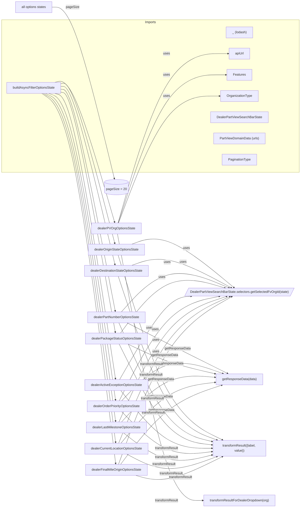

# Diagram: web/portal/src/pages/partview/redux/DealerPartViewSearchFilterLoaders.js


> Auto-generated by Obscura crawlers

## Diagram 1



### SVG

<svg id="container" width="1480.421875" xmlns="http://www.w3.org/2000/svg" class="flowchart" height="2488.4169921875" viewBox="0 0 1480.421875 2488.4169921875" role="graphics-document document" aria-roledescription="flowchart-v2"><style>#container{font-family:"trebuchet ms",verdana,arial,sans-serif;font-size:16px;fill:#333;}@keyframes edge-animation-frame{from{stroke-dashoffset:0;}}@keyframes dash{to{stroke-dashoffset:0;}}#container .edge-animation-slow{stroke-dasharray:9,5!important;stroke-dashoffset:900;animation:dash 50s linear infinite;stroke-linecap:round;}#container .edge-animation-fast{stroke-dasharray:9,5!important;stroke-dashoffset:900;animation:dash 20s linear infinite;stroke-linecap:round;}#container .error-icon{fill:#552222;}#container .error-text{fill:#552222;stroke:#552222;}#container .edge-thickness-normal{stroke-width:1px;}#container .edge-thickness-thick{stroke-width:3.5px;}#container .edge-pattern-solid{stroke-dasharray:0;}#container .edge-thickness-invisible{stroke-width:0;fill:none;}#container .edge-pattern-dashed{stroke-dasharray:3;}#container .edge-pattern-dotted{stroke-dasharray:2;}#container .marker{fill:#333333;stroke:#333333;}#container .marker.cross{stroke:#333333;}#container svg{font-family:"trebuchet ms",verdana,arial,sans-serif;font-size:16px;}#container p{margin:0;}#container .label{font-family:"trebuchet ms",verdana,arial,sans-serif;color:#333;}#container .cluster-label text{fill:#333;}#container .cluster-label span{color:#333;}#container .cluster-label span p{background-color:transparent;}#container .label text,#container span{fill:#333;color:#333;}#container .node rect,#container .node circle,#container .node ellipse,#container .node polygon,#container .node path{fill:#ECECFF;stroke:#9370DB;stroke-width:1px;}#container .rough-node .label text,#container .node .label text,#container .image-shape .label,#container .icon-shape .label{text-anchor:middle;}#container .node .katex path{fill:#000;stroke:#000;stroke-width:1px;}#container .rough-node .label,#container .node .label,#container .image-shape .label,#container .icon-shape .label{text-align:center;}#container .node.clickable{cursor:pointer;}#container .root .anchor path{fill:#333333!important;stroke-width:0;stroke:#333333;}#container .arrowheadPath{fill:#333333;}#container .edgePath .path{stroke:#333333;stroke-width:2.0px;}#container .flowchart-link{stroke:#333333;fill:none;}#container .edgeLabel{background-color:rgba(232,232,232, 0.8);text-align:center;}#container .edgeLabel p{background-color:rgba(232,232,232, 0.8);}#container .edgeLabel rect{opacity:0.5;background-color:rgba(232,232,232, 0.8);fill:rgba(232,232,232, 0.8);}#container .labelBkg{background-color:rgba(232, 232, 232, 0.5);}#container .cluster rect{fill:#ffffde;stroke:#aaaa33;stroke-width:1px;}#container .cluster text{fill:#333;}#container .cluster span{color:#333;}#container div.mermaidTooltip{position:absolute;text-align:center;max-width:200px;padding:2px;font-family:"trebuchet ms",verdana,arial,sans-serif;font-size:12px;background:hsl(80, 100%, 96.2745098039%);border:1px solid #aaaa33;border-radius:2px;pointer-events:none;z-index:100;}#container .flowchartTitleText{text-anchor:middle;font-size:18px;fill:#333;}#container rect.text{fill:none;stroke-width:0;}#container .icon-shape,#container .image-shape{background-color:rgba(232,232,232, 0.8);text-align:center;}#container .icon-shape p,#container .image-shape p{background-color:rgba(232,232,232, 0.8);padding:2px;}#container .icon-shape rect,#container .image-shape rect{opacity:0.5;background-color:rgba(232,232,232, 0.8);fill:rgba(232,232,232, 0.8);}#container .label-icon{display:inline-block;height:1em;overflow:visible;vertical-align:-0.125em;}#container .node .label-icon path{fill:currentColor;stroke:revert;stroke-width:revert;}#container :root{--mermaid-font-family:"trebuchet ms",verdana,arial,sans-serif;}</style><g><marker id="container_flowchart-v2-pointEnd" class="marker flowchart-v2" viewBox="0 0 10 10" refX="5" refY="5" markerUnits="userSpaceOnUse" markerWidth="8" markerHeight="8" orient="auto"><path d="M 0 0 L 10 5 L 0 10 z" class="arrowMarkerPath" style="stroke-width: 1; stroke-dasharray: 1, 0;"></path></marker><marker id="container_flowchart-v2-pointStart" class="marker flowchart-v2" viewBox="0 0 10 10" refX="4.5" refY="5" markerUnits="userSpaceOnUse" markerWidth="8" markerHeight="8" orient="auto"><path d="M 0 5 L 10 10 L 10 0 z" class="arrowMarkerPath" style="stroke-width: 1; stroke-dasharray: 1, 0;"></path></marker><marker id="container_flowchart-v2-circleEnd" class="marker flowchart-v2" viewBox="0 0 10 10" refX="11" refY="5" markerUnits="userSpaceOnUse" markerWidth="11" markerHeight="11" orient="auto"><circle cx="5" cy="5" r="5" class="arrowMarkerPath" style="stroke-width: 1; stroke-dasharray: 1, 0;"></circle></marker><marker id="container_flowchart-v2-circleStart" class="marker flowchart-v2" viewBox="0 0 10 10" refX="-1" refY="5" markerUnits="userSpaceOnUse" markerWidth="11" markerHeight="11" orient="auto"><circle cx="5" cy="5" r="5" class="arrowMarkerPath" style="stroke-width: 1; stroke-dasharray: 1, 0;"></circle></marker><marker id="container_flowchart-v2-crossEnd" class="marker cross flowchart-v2" viewBox="0 0 11 11" refX="12" refY="5.2" markerUnits="userSpaceOnUse" markerWidth="11" markerHeight="11" orient="auto"><path d="M 1,1 l 9,9 M 10,1 l -9,9" class="arrowMarkerPath" style="stroke-width: 2; stroke-dasharray: 1, 0;"></path></marker><marker id="container_flowchart-v2-crossStart" class="marker cross flowchart-v2" viewBox="0 0 11 11" refX="-1" refY="5.2" markerUnits="userSpaceOnUse" markerWidth="11" markerHeight="11" orient="auto"><path d="M 1,1 l 9,9 M 10,1 l -9,9" class="arrowMarkerPath" style="stroke-width: 2; stroke-dasharray: 1, 0;"></path></marker><g class="root"><g class="clusters"><g class="cluster" id="Imports" data-look="classic"><rect style="" x="8" y="97" width="1464.421875" height="748"></rect><g class="cluster-label" transform="translate(711.8515625, 97)"><foreignObject width="56.71875" height="24"><div xmlns="http://www.w3.org/1999/xhtml" style="display: table-cell; white-space: nowrap; line-height: 1.5; max-width: 200px; text-align: center;"><span class="nodeLabel"><p>Imports</p></span></div></foreignObject></g></g></g><g class="edgePaths"><path d="M303.109,409.877L312.569,408.398C322.029,406.918,340.948,403.959,385.322,534.405C429.696,664.85,499.525,928.7,534.44,1060.625L569.354,1192.55" id="L_builder_dealerOrigin_0" class="edge-thickness-normal edge-pattern-solid edge-thickness-normal edge-pattern-solid flowchart-link" style=";" data-edge="true" data-et="edge" data-id="L_builder_dealerOrigin_0" data-points="W3sieCI6MzAzLjEwOTM3NSwieSI6NDA5Ljg3NzA3NzIyMzg1MTR9LHsieCI6MzU5Ljg2NzE4NzUsInkiOjQwMX0seyJ4Ijo1NzAuMzc3NzY5MDc2OTkxNSwieSI6MTE5Ni40MTY5Mzg3ODE3MzgzfV0=" marker-end="url(#container_flowchart-v2-pointEnd)"></path><path d="M303.109,423.959L312.569,423.466C322.029,422.973,340.948,421.986,385.447,567.414C429.947,712.843,500.026,1004.685,535.066,1150.606L570.106,1296.528" id="L_builder_dealerDestination_0" class="edge-thickness-normal edge-pattern-solid edge-thickness-normal edge-pattern-solid flowchart-link" style=";" data-edge="true" data-et="edge" data-id="L_builder_dealerDestination_0" data-points="W3sieCI6MzAzLjEwOTM3NSwieSI6NDIzLjk1OTAyNTc0MTI4Mzh9LHsieCI6MzU5Ljg2NzE4NzUsInkiOjQyMX0seyJ4Ijo1NzEuMDM5OTc2NjM0OTYwOCwieSI6MTMwMC40MTY5Mzg3ODE3MzgzfV0=" marker-end="url(#container_flowchart-v2-pointEnd)"></path><path d="M303.109,438.041L312.569,438.534C322.029,439.027,340.948,440.014,385.677,621.089C430.406,802.164,500.945,1163.327,536.214,1343.909L571.483,1524.491" id="L_builder_dealerPartNumber_0" class="edge-thickness-normal edge-pattern-solid edge-thickness-normal edge-pattern-solid flowchart-link" style=";" data-edge="true" data-et="edge" data-id="L_builder_dealerPartNumber_0" data-points="W3sieCI6MzAzLjEwOTM3NSwieSI6NDM4LjA0MDk3NDI1ODcxNjJ9LHsieCI6MzU5Ljg2NzE4NzUsInkiOjQ0MX0seyJ4Ijo1NzIuMjUwMDgwMTU0NTY2NywieSI6MTUyOC40MTY5Mzg3ODE3MzgzfV0=" marker-end="url(#container_flowchart-v2-pointEnd)"></path><path d="M303.109,452.123L312.569,453.602C322.029,455.082,340.948,458.041,385.747,654.101C430.546,850.16,501.226,1239.321,536.565,1433.901L571.905,1628.481" id="L_builder_dealerPackageStatus_0" class="edge-thickness-normal edge-pattern-solid edge-thickness-normal edge-pattern-solid flowchart-link" style=";" data-edge="true" data-et="edge" data-id="L_builder_dealerPackageStatus_0" data-points="W3sieCI6MzAzLjEwOTM3NSwieSI6NDUyLjEyMjkyMjc3NjE0ODZ9LHsieCI6MzU5Ljg2NzE4NzUsInkiOjQ2MX0seyJ4Ijo1NzIuNjE5NzAyNzgxNDUyLCJ5IjoxNjMyLjQxNjkzODc4MTczODN9XQ==" marker-end="url(#container_flowchart-v2-pointEnd)"></path><path d="M271.633,458L286.339,461.833C301.045,465.667,330.456,473.333,380.639,706.411C430.823,939.488,501.778,1397.976,537.256,1627.22L572.733,1856.464" id="L_builder_dealerActiveException_0" class="edge-thickness-normal edge-pattern-solid edge-thickness-normal edge-pattern-solid flowchart-link" style=";" data-edge="true" data-et="edge" data-id="L_builder_dealerActiveException_0" data-points="W3sieCI6MjcxLjYzMzQzNzUsInkiOjQ1OH0seyJ4IjozNTkuODY3MTg3NSwieSI6NDgxfSx7IngiOjU3My4zNDQ5MzM1Mzg2NTY2LCJ5IjoxODYwLjQxNjkzODc4MTczODN9XQ==" marker-end="url(#container_flowchart-v2-pointEnd)"></path><path d="M242.04,458L261.677,465.167C281.315,472.333,320.591,486.667,375.752,737.076C430.912,987.486,501.957,1473.973,537.48,1717.216L573.002,1960.459" id="L_builder_dealerOrderPriority_0" class="edge-thickness-normal edge-pattern-solid edge-thickness-normal edge-pattern-solid flowchart-link" style=";" data-edge="true" data-et="edge" data-id="L_builder_dealerOrderPriority_0" data-points="W3sieCI6MjQyLjAzOTUwODkyODU3MTQyLCJ5Ijo0NTh9LHsieCI6MzU5Ljg2NzE4NzUsInkiOjUwMX0seyJ4Ijo1NzMuNTgwNDM0MzA2MDA1NSwieSI6MTk2NC40MTY5Mzg3ODE3MzgzfV0=" marker-end="url(#container_flowchart-v2-pointEnd)"></path><path d="M271.633,404L286.339,400.167C301.045,396.333,330.456,388.667,379.923,502.763C429.389,616.86,498.912,852.72,533.673,970.65L568.434,1088.58" id="L_builder_dealerPVOrg_0" class="edge-thickness-normal edge-pattern-solid edge-thickness-normal edge-pattern-solid flowchart-link" style=";" data-edge="true" data-et="edge" data-id="L_builder_dealerPVOrg_0" data-points="W3sieCI6MjcxLjYzMzQzNzUsInkiOjQwNH0seyJ4IjozNTkuODY3MTg3NSwieSI6MzgxfSx7IngiOjU2OS41NjQ5MDAyMDAzMzM2LCJ5IjoxMDkyLjQxNjkzODc4MTczODN9XQ==" marker-end="url(#container_flowchart-v2-pointEnd)"></path><path d="M225.598,458L247.977,468.5C270.355,479,315.111,500,373.052,767.742C430.992,1035.485,502.118,1549.97,537.68,1807.212L573.243,2064.455" id="L_builder_dealerLastMilestone_0" class="edge-thickness-normal edge-pattern-solid edge-thickness-normal edge-pattern-solid flowchart-link" style=";" data-edge="true" data-et="edge" data-id="L_builder_dealerLastMilestone_0" data-points="W3sieCI6MjI1LjU5ODQzNzUsInkiOjQ1OH0seyJ4IjozNTkuODY3MTg3NSwieSI6NTIxfSx7IngiOjU3My43OTA4MDU2ODg2NjU4LCJ5IjoyMDY4LjQxNjkzODc4MTczODN9XQ==" marker-end="url(#container_flowchart-v2-pointEnd)"></path><path d="M215.136,458L239.258,471.833C263.38,485.667,311.623,513.333,371.344,798.408C431.065,1083.484,502.262,1625.967,537.861,1897.209L573.459,2168.451" id="L_builder_dealerCurrentLocation_0" class="edge-thickness-normal edge-pattern-solid edge-thickness-normal edge-pattern-solid flowchart-link" style=";" data-edge="true" data-et="edge" data-id="L_builder_dealerCurrentLocation_0" data-points="W3sieCI6MjE1LjEzNTkzNzUsInkiOjQ1OH0seyJ4IjozNTkuODY3MTg3NSwieSI6NTQxfSx7IngiOjU3My45Nzk4NjYxNTAzNzQ4LCJ5IjoyMTcyLjQxNjkzODc4MTczODN9XQ==" marker-end="url(#container_flowchart-v2-pointEnd)"></path><path d="M207.893,458L233.222,475.167C258.551,492.333,309.209,526.667,370.169,829.075C431.13,1131.483,502.392,1701.965,538.024,1987.206L573.655,2272.448" id="L_builder_dealerFinalMile_0" class="edge-thickness-normal edge-pattern-solid edge-thickness-normal edge-pattern-solid flowchart-link" style=";" data-edge="true" data-et="edge" data-id="L_builder_dealerFinalMile_0" data-points="W3sieCI6MjA3Ljg5MjY2ODI2OTIzMDc3LCJ5Ijo0NTh9LHsieCI6MzU5Ljg2NzE4NzUsInkiOjU2MX0seyJ4Ijo1NzQuMTUwNjk3ODE5MTU4MywieSI6MjI3Ni40MTY5Mzg3ODE3MzgzfV0=" marker-end="url(#container_flowchart-v2-pointEnd)"></path><path d="M653.864,1196.417L682.609,1186.25C711.354,1176.084,768.845,1155.75,852.353,1191.323C935.861,1226.896,1045.387,1318.374,1100.149,1364.113L1154.912,1409.853" id="L_dealerOrigin_getSelectedFvId_0" class="edge-thickness-normal edge-pattern-solid edge-thickness-normal edge-pattern-solid flowchart-link" style=";" data-edge="true" data-et="edge" data-id="L_dealerOrigin_getSelectedFvId_0" data-points="W3sieCI6NjUzLjg2MzYzNjM2MzYzNjQsInkiOjExOTYuNDE2OTM4NzgxNzM4M30seyJ4Ijo4MjYuMzM1OTM3NSwieSI6MTEzNS40MTY5Mzg3ODE3MzgzfSx7IngiOjExNTcuOTgyMDUyMzY0ODY0OCwieSI6MTQxMi40MTY5Mzg3ODE3MzgzfV0=" marker-end="url(#container_flowchart-v2-pointEnd)"></path><path d="M653.864,1300.417L682.609,1290.25C711.354,1280.084,768.845,1259.75,850.171,1278.099C931.496,1296.448,1036.656,1353.479,1089.236,1381.995L1141.816,1410.51" id="L_dealerDestination_getSelectedFvId_0" class="edge-thickness-normal edge-pattern-solid edge-thickness-normal edge-pattern-solid flowchart-link" style=";" data-edge="true" data-et="edge" data-id="L_dealerDestination_getSelectedFvId_0" data-points="W3sieCI6NjUzLjg2MzYzNjM2MzYzNjQsInkiOjEzMDAuNDE2OTM4NzgxNzM4M30seyJ4Ijo4MjYuMzM1OTM3NSwieSI6MTIzOS40MTY5Mzg3ODE3MzgzfSx7IngiOjExNDUuMzMyMDMxMjUsInkiOjE0MTIuNDE2OTM4NzgxNzM4M31d" marker-end="url(#container_flowchart-v2-pointEnd)"></path><path d="M602.222,1528.417L639.574,1487.584C676.926,1446.75,751.631,1365.084,839.751,1345.493C927.87,1325.902,1029.404,1368.388,1080.171,1389.63L1130.938,1410.873" id="L_dealerPartNumber_getSelectedFvId_0" class="edge-thickness-normal edge-pattern-solid edge-thickness-normal edge-pattern-solid flowchart-link" style=";" data-edge="true" data-et="edge" data-id="L_dealerPartNumber_getSelectedFvId_0" data-points="W3sieCI6NjAyLjIyMTczNzEzMjM1MjksInkiOjE1MjguNDE2OTM4NzgxNzM4M30seyJ4Ijo4MjYuMzM1OTM3NSwieSI6MTI4My40MTY5Mzg3ODE3MzgzfSx7IngiOjExMzQuNjI4MTY3MjI5NzI5OCwieSI6MTQxMi40MTY5Mzg3ODE3MzgzfV0=" marker-end="url(#container_flowchart-v2-pointEnd)"></path><path d="M597.758,1632.417L635.854,1581.584C673.951,1530.75,750.143,1429.084,835.689,1392.229C921.234,1355.373,1016.132,1383.33,1063.581,1397.308L1111.03,1411.287" id="L_dealerPackageStatus_getSelectedFvId_0" class="edge-thickness-normal edge-pattern-solid edge-thickness-normal edge-pattern-solid flowchart-link" style=";" data-edge="true" data-et="edge" data-id="L_dealerPackageStatus_getSelectedFvId_0" data-points="W3sieCI6NTk3Ljc1ODE4OTAwNjAyNCwieSI6MTYzMi40MTY5Mzg3ODE3MzgzfSx7IngiOjgyNi4zMzU5Mzc1LCJ5IjoxMzI3LjQxNjkzODc4MTczODN9LHsieCI6MTExNC44NjcxODc1LCJ5IjoxNDEyLjQxNjkzODc4MTczODN9XQ==" marker-end="url(#container_flowchart-v2-pointEnd)"></path><path d="M593.293,1860.417L632.134,1793.917C670.974,1727.417,748.655,1594.417,807.593,1526.304C866.532,1458.19,906.728,1454.964,926.826,1453.35L946.924,1451.737" id="L_dealerActiveException_getSelectedFvId_0" class="edge-thickness-normal edge-pattern-solid edge-thickness-normal edge-pattern-solid flowchart-link" style=";" data-edge="true" data-et="edge" data-id="L_dealerActiveException_getSelectedFvId_0" data-points="W3sieCI6NTkzLjI5MzI0MzgzODAyODIsInkiOjE4NjAuNDE2OTM4NzgxNzM4M30seyJ4Ijo4MjYuMzM1OTM3NSwieSI6MTQ2MS40MTY5Mzg3ODE3MzgzfSx7IngiOjk1MC45MTA5Mzc1LCJ5IjoxNDUxLjQxNjkzODc4MTczODN9XQ==" marker-end="url(#container_flowchart-v2-pointEnd)"></path><path d="M591.346,1964.417L630.511,1887.917C669.676,1811.417,748.006,1658.417,830.116,1573.052C912.225,1487.687,998.114,1469.956,1041.058,1461.091L1084.003,1452.226" id="L_dealerOrderPriority_getSelectedFvId_0" class="edge-thickness-normal edge-pattern-solid edge-thickness-normal edge-pattern-solid flowchart-link" style=";" data-edge="true" data-et="edge" data-id="L_dealerOrderPriority_getSelectedFvId_0" data-points="W3sieCI6NTkxLjM0NjM1NDE2NjY2NjYsInkiOjE5NjQuNDE2OTM4NzgxNzM4M30seyJ4Ijo4MjYuMzM1OTM3NSwieSI6MTUwNS40MTY5Mzg3ODE3MzgzfSx7IngiOjEwODcuOTIwMzk2OTU5NDU5NCwieSI6MTQ1MS40MTY5Mzg3ODE3MzgzfV0=" marker-end="url(#container_flowchart-v2-pointEnd)"></path><path d="M589.827,2068.417L629.245,1981.917C668.664,1895.417,747.5,1722.417,835.688,1619.793C923.876,1517.169,1021.416,1484.921,1070.186,1468.797L1118.955,1452.673" id="L_dealerLastMilestone_getSelectedFvId_0" class="edge-thickness-normal edge-pattern-solid edge-thickness-normal edge-pattern-solid flowchart-link" style=";" data-edge="true" data-et="edge" data-id="L_dealerLastMilestone_getSelectedFvId_0" data-points="W3sieCI6NTg5LjgyNzM1MjMzNTE2NDgsInkiOjIwNjguNDE2OTM4NzgxNzM4M30seyJ4Ijo4MjYuMzM1OTM3NSwieSI6MTU0OS40MTY5Mzg3ODE3MzgzfSx7IngiOjExMjIuNzUzMzEwMzgxMzU2LCJ5IjoxNDUxLjQxNjkzODc4MTczODN9XQ==" marker-end="url(#container_flowchart-v2-pointEnd)"></path><path d="M588.609,2172.417L628.23,2075.917C667.851,1979.417,747.094,1786.417,838.163,1666.526C929.232,1546.635,1032.128,1499.854,1083.575,1476.463L1135.023,1453.072" id="L_dealerCurrentLocation_getSelectedFvId_0" class="edge-thickness-normal edge-pattern-solid edge-thickness-normal edge-pattern-solid flowchart-link" style=";" data-edge="true" data-et="edge" data-id="L_dealerCurrentLocation_getSelectedFvId_0" data-points="W3sieCI6NTg4LjYwOTE0Mjk0NTU0NDYsInkiOjIxNzIuNDE2OTM4NzgxNzM4M30seyJ4Ijo4MjYuMzM1OTM3NSwieSI6MTU5My40MTY5Mzg3ODE3MzgzfSx7IngiOjExMzguNjY0NjQxMjAzNzAzNywieSI6MTQ1MS40MTY5Mzg3ODE3MzgzfV0=" marker-end="url(#container_flowchart-v2-pointEnd)"></path><path d="M587.61,2276.417L627.398,2169.917C667.186,2063.417,746.761,1850.417,839.545,1713.251C932.33,1576.085,1038.323,1514.753,1091.32,1484.086L1144.317,1453.42" id="L_dealerFinalMile_getSelectedFvId_0" class="edge-thickness-normal edge-pattern-solid edge-thickness-normal edge-pattern-solid flowchart-link" style=";" data-edge="true" data-et="edge" data-id="L_dealerFinalMile_getSelectedFvId_0" data-points="W3sieCI6NTg3LjYxMDQzMDc0MzI0MzIsInkiOjIyNzYuNDE2OTM4NzgxNzM4M30seyJ4Ijo4MjYuMzM1OTM3NSwieSI6MTYzNy40MTY5Mzg3ODE3MzgzfSx7IngiOjExNDcuNzc4ODk4NjY1MDQ4NSwieSI6MTQ1MS40MTY5Mzg3ODE3MzgzfV0=" marker-end="url(#container_flowchart-v2-pointEnd)"></path><path d="M585.368,1092.417L625.529,954.181C665.69,815.945,746.013,539.472,835.909,401.236C925.805,263,1025.273,263,1075.008,263L1124.742,263" id="L_dealerPVOrg_apiUrl_0" class="edge-thickness-normal edge-pattern-solid edge-thickness-normal edge-pattern-solid flowchart-link" style=";" data-edge="true" data-et="edge" data-id="L_dealerPVOrg_apiUrl_0" data-points="W3sieCI6NTg1LjM2NzY3NDU3MTY3MjUsInkiOjEwOTIuNDE2OTM4NzgxNzM4M30seyJ4Ijo4MjYuMzM1OTM3NSwieSI6MjYzfSx7IngiOjExMjguNzQyMTg3NSwieSI6MjYzfV0=" marker-end="url(#container_flowchart-v2-pointEnd)"></path><path d="M587.884,1092.417L627.626,988.847C667.368,885.278,746.852,678.139,829.526,574.569C912.201,471,998.065,471,1040.997,471L1083.93,471" id="L_dealerPVOrg_OrgType_0" class="edge-thickness-normal edge-pattern-solid edge-thickness-normal edge-pattern-solid flowchart-link" style=";" data-edge="true" data-et="edge" data-id="L_dealerPVOrg_OrgType_0" data-points="W3sieCI6NTg3Ljg4Mzk1ODc5MTQ3MzEsInkiOjEwOTIuNDE2OTM4NzgxNzM4M30seyJ4Ijo4MjYuMzM1OTM3NSwieSI6NDcxfSx7IngiOjEwODcuOTI5Njg3NSwieSI6NDcxfV0=" marker-end="url(#container_flowchart-v2-pointEnd)"></path><path d="M586.452,1092.417L626.433,971.514C666.413,850.611,746.375,608.806,834.643,487.903C922.911,367,1019.487,367,1067.775,367L1116.063,367" id="L_dealerPVOrg_Features_0" class="edge-thickness-normal edge-pattern-solid edge-thickness-normal edge-pattern-solid flowchart-link" style=";" data-edge="true" data-et="edge" data-id="L_dealerPVOrg_Features_0" data-points="W3sieCI6NTg2LjQ1MTkxNDcyMjg1MDksInkiOjEwOTIuNDE2OTM4NzgxNzM4M30seyJ4Ijo4MjYuMzM1OTM3NSwieSI6MzY3fSx7IngiOjExMjAuMDYyNSwieSI6MzY3fV0=" marker-end="url(#container_flowchart-v2-pointEnd)"></path><path d="M260.703,35L277.23,35C293.758,35,326.813,35,377.926,175.213C429.04,315.426,498.213,595.851,532.799,736.064L567.385,876.277" id="L_allStates_pageSize_0" class="edge-thickness-normal edge-pattern-solid edge-thickness-normal edge-pattern-solid flowchart-link" style=";" data-edge="true" data-et="edge" data-id="L_allStates_pageSize_0" data-points="W3sieCI6MjYwLjcwMzEyNSwieSI6MzV9LHsieCI6MzU5Ljg2NzE4NzUsInkiOjM1fSx7IngiOjU2OC4zNDM0NTc3MTQyMTUxLCJ5Ijo4ODAuMTYwMTUzMTk5NzU0Nn1d" marker-end="url(#container_flowchart-v2-pointEnd)"></path><path d="M630.84,1582.417L663.423,1598.917C696.006,1615.417,761.171,1648.417,843.279,1689.784C925.387,1731.152,1024.438,1780.887,1073.963,1805.755L1123.489,1830.622" id="L_dealerPartNumber_getResponseData_0" class="edge-thickness-normal edge-pattern-solid edge-thickness-normal edge-pattern-solid flowchart-link" style=";" data-edge="true" data-et="edge" data-id="L_dealerPartNumber_getResponseData_0" data-points="W3sieCI6NjMwLjg0MDQwMTc4NTcxNDMsInkiOjE1ODIuNDE2OTM4NzgxNzM4M30seyJ4Ijo4MjYuMzM1OTM3NSwieSI6MTY4MS40MTY5Mzg3ODE3MzgzfSx7IngiOjExMjcuMDYzNDY1NTg5ODg3NSwieSI6MTgzMi40MTY5Mzg3ODE3MzgzfV0=" marker-end="url(#container_flowchart-v2-pointEnd)"></path><path d="M603.562,1964.417L640.691,1925.917C677.82,1887.417,752.078,1810.417,835.001,1788.194C917.925,1765.97,1009.514,1798.524,1055.308,1814.801L1101.103,1831.077" id="L_dealerOrderPriority_getResponseData_0" class="edge-thickness-normal edge-pattern-solid edge-thickness-normal edge-pattern-solid flowchart-link" style=";" data-edge="true" data-et="edge" data-id="L_dealerOrderPriority_getResponseData_0" data-points="W3sieCI6NjAzLjU2MTk1NDk0MTg2MDQsInkiOjE5NjQuNDE2OTM4NzgxNzM4M30seyJ4Ijo4MjYuMzM1OTM3NSwieSI6MTczMy40MTY5Mzg3ODE3MzgzfSx7IngiOjExMDQuODcxNjUxNzg1NzE0MiwieSI6MTgzMi40MTY5Mzg3ODE3MzgzfV0=" marker-end="url(#container_flowchart-v2-pointEnd)"></path><path d="M634.455,1686.417L666.435,1701.584C698.415,1716.75,762.376,1747.084,833.719,1771.356C905.063,1795.627,983.79,1813.838,1023.153,1822.943L1062.517,1832.048" id="L_dealerPackageStatus_getResponseData_0" class="edge-thickness-normal edge-pattern-solid edge-thickness-normal edge-pattern-solid flowchart-link" style=";" data-edge="true" data-et="edge" data-id="L_dealerPackageStatus_getResponseData_0" data-points="W3sieCI6NjM0LjQ1NTExMTIyODgxMzUsInkiOjE2ODYuNDE2OTM4NzgxNzM4M30seyJ4Ijo4MjYuMzM1OTM3NSwieSI6MTc3Ny40MTY5Mzg3ODE3MzgzfSx7IngiOjEwNjYuNDE0MDYyNSwieSI6MTgzMi45NDk4MTk1OTk3OTJ9XQ==" marker-end="url(#container_flowchart-v2-pointEnd)"></path><path d="M602.779,2068.417L640.038,2028.584C677.298,1988.75,751.817,1909.084,828.425,1872.58C905.033,1836.077,983.731,1842.737,1023.08,1846.067L1062.428,1849.397" id="L_dealerLastMilestone_getResponseData_0" class="edge-thickness-normal edge-pattern-solid edge-thickness-normal edge-pattern-solid flowchart-link" style=";" data-edge="true" data-et="edge" data-id="L_dealerLastMilestone_getResponseData_0" data-points="W3sieCI6NjAyLjc3ODg0MTYzNTMzODQsInkiOjIwNjguNDE2OTM4NzgxNzM4M30seyJ4Ijo4MjYuMzM1OTM3NSwieSI6MTgyOS40MTY5Mzg3ODE3MzgzfSx7IngiOjEwNjYuNDE0MDYyNSwieSI6MTg0OS43MzM4NDYzOTgwOTkzfV0=" marker-end="url(#container_flowchart-v2-pointEnd)"></path><path d="M600.219,2172.417L637.905,2127.584C675.591,2082.75,750.964,1993.084,828.001,1943.366C905.039,1893.648,983.742,1883.88,1023.093,1878.996L1062.445,1874.112" id="L_dealerCurrentLocation_getResponseData_0" class="edge-thickness-normal edge-pattern-solid edge-thickness-normal edge-pattern-solid flowchart-link" style=";" data-edge="true" data-et="edge" data-id="L_dealerCurrentLocation_getResponseData_0" data-points="W3sieCI6NjAwLjIxOTE3MjI5NzI5NzMsInkiOjIxNzIuNDE2OTM4NzgxNzM4M30seyJ4Ijo4MjYuMzM1OTM3NSwieSI6MTkwMy40MTY5Mzg3ODE3MzgzfSx7IngiOjEwNjYuNDE0MDYyNSwieSI6MTg3My42MTg4MDc2MTEwNzU1fV0=" marker-end="url(#container_flowchart-v2-pointEnd)"></path><path d="M598.131,2276.417L636.165,2226.584C674.199,2176.75,750.267,2077.084,833.233,2012.294C916.199,1947.505,1006.063,1917.592,1050.995,1902.636L1095.926,1887.68" id="L_dealerFinalMile_getResponseData_0" class="edge-thickness-normal edge-pattern-solid edge-thickness-normal edge-pattern-solid flowchart-link" style=";" data-edge="true" data-et="edge" data-id="L_dealerFinalMile_getResponseData_0" data-points="W3sieCI6NTk4LjEzMDYwNzc0NTM5ODcsInkiOjIyNzYuNDE2OTM4NzgxNzM4M30seyJ4Ijo4MjYuMzM1OTM3NSwieSI6MTk3Ny40MTY5Mzg3ODE3MzgzfSx7IngiOjEwOTkuNzIxNTMwNzIwMzM5LCJ5IjoxODg2LjQxNjkzODc4MTczODN9XQ==" marker-end="url(#container_flowchart-v2-pointEnd)"></path><path d="M582.559,1146.417L623.189,1364.25C663.818,1582.084,745.077,2017.75,814.532,2235.584C883.987,2453.417,941.638,2453.417,970.464,2453.417L999.289,2453.417" id="L_dealerPVOrg_transformDealer_0" class="edge-thickness-normal edge-pattern-solid edge-thickness-normal edge-pattern-solid flowchart-link" style=";" data-edge="true" data-et="edge" data-id="L_dealerPVOrg_transformDealer_0" data-points="W3sieCI6NTgyLjU1OTM3MjY1NzQyMTIsInkiOjExNDYuNDE2OTM4NzgxNzM4M30seyJ4Ijo4MjYuMzM1OTM3NSwieSI6MjQ1My40MTY5Mzg3ODE3MzgzfSx7IngiOjEwMDMuMjg5MDYyNSwieSI6MjQ1My40MTY5Mzg3ODE3MzgzfV0=" marker-end="url(#container_flowchart-v2-pointEnd)"></path><path d="M585.942,1250.417L626.008,1378.917C666.073,1507.417,746.205,1764.417,831.664,1915.454C917.124,2066.491,1007.911,2111.564,1053.305,2134.101L1098.699,2156.638" id="L_dealerOrigin_transformResult_0" class="edge-thickness-normal edge-pattern-solid edge-thickness-normal edge-pattern-solid flowchart-link" style=";" data-edge="true" data-et="edge" data-id="L_dealerOrigin_transformResult_0" data-points="W3sieCI6NTg1Ljk0MTkwNTU0NTExMjgsInkiOjEyNTAuNDE2OTM4NzgxNzM4M30seyJ4Ijo4MjYuMzM1OTM3NSwieSI6MjAyMS40MTY5Mzg3ODE3MzgzfSx7IngiOjExMDIuMjgxOTYwMjI3MjcyNywieSI6MjE1OC40MTY5Mzg3ODE3MzgzfV0=" marker-end="url(#container_flowchart-v2-pointEnd)"></path><path d="M586.626,1354.417L626.578,1472.917C666.53,1591.417,746.433,1828.417,827.386,1962.184C908.34,2095.952,990.344,2126.486,1031.347,2141.754L1072.349,2157.021" id="L_dealerDestination_transformResult_0" class="edge-thickness-normal edge-pattern-solid edge-thickness-normal edge-pattern-solid flowchart-link" style=";" data-edge="true" data-et="edge" data-id="L_dealerDestination_transformResult_0" data-points="W3sieCI6NTg2LjYyNjMzMzg0MTQ2MzQsInkiOjEzNTQuNDE2OTM4NzgxNzM4M30seyJ4Ijo4MjYuMzM1OTM3NSwieSI6MjA2NS40MTY5Mzg3ODE3MzgzfSx7IngiOjEwNzYuMDk3MzAxMTM2MzYzNywieSI6MjE1OC40MTY5Mzg3ODE3MzgzfV0=" marker-end="url(#container_flowchart-v2-pointEnd)"></path><path d="M589.65,1582.417L629.097,1670.25C668.545,1758.084,747.441,1933.75,823.658,2030.711C899.875,2127.672,973.414,2145.927,1010.184,2155.055L1046.954,2164.182" id="L_dealerPartNumber_transformResult_0" class="edge-thickness-normal edge-pattern-solid edge-thickness-normal edge-pattern-solid flowchart-link" style=";" data-edge="true" data-et="edge" data-id="L_dealerPartNumber_transformResult_0" data-points="W3sieCI6NTg5LjY0OTY3ODQ3NDcyOTMsInkiOjE1ODIuNDE2OTM4NzgxNzM4M30seyJ4Ijo4MjYuMzM1OTM3NSwieSI6MjEwOS40MTY5Mzg3ODE3MzgzfSx7IngiOjEwNTAuODM1OTM3NSwieSI6MjE2NS4xNDYxMzQ4MzI1MTQyfV0=" marker-end="url(#container_flowchart-v2-pointEnd)"></path><path d="M591.123,1686.417L630.325,1764.25C669.527,1842.084,747.931,1997.75,823.889,2080.146C899.846,2162.541,973.356,2171.665,1010.111,2176.227L1046.866,2180.789" id="L_dealerPackageStatus_transformResult_0" class="edge-thickness-normal edge-pattern-solid edge-thickness-normal edge-pattern-solid flowchart-link" style=";" data-edge="true" data-et="edge" data-id="L_dealerPackageStatus_transformResult_0" data-points="W3sieCI6NTkxLjEyMjUwMTI2NTE4MjIsInkiOjE2ODYuNDE2OTM4NzgxNzM4M30seyJ4Ijo4MjYuMzM1OTM3NSwieSI6MjE1My40MTY5Mzg3ODE3MzgzfSx7IngiOjEwNTAuODM1OTM3NSwieSI6MjE4MS4yODE1MzY4MDcxMjZ9XQ==" marker-end="url(#container_flowchart-v2-pointEnd)"></path><path d="M599.194,1914.417L637.051,1961.584C674.908,2008.75,750.622,2103.084,825.229,2150.25C899.836,2197.417,973.336,2197.417,1010.086,2197.417L1046.836,2197.417" id="L_dealerActiveException_transformResult_0" class="edge-thickness-normal edge-pattern-solid edge-thickness-normal edge-pattern-solid flowchart-link" style=";" data-edge="true" data-et="edge" data-id="L_dealerActiveException_transformResult_0" data-points="W3sieCI6NTk5LjE5NDIwMzYyOTAzMjIsInkiOjE5MTQuNDE2OTM4NzgxNzM4M30seyJ4Ijo4MjYuMzM1OTM3NSwieSI6MjE5Ny40MTY5Mzg3ODE3MzgzfSx7IngiOjEwNTAuODM1OTM3NSwieSI6MjE5Ny40MTY5Mzg3ODE3MzgzfV0=" marker-end="url(#container_flowchart-v2-pointEnd)"></path><path d="M604.395,2018.417L641.385,2055.584C678.375,2092.75,752.356,2167.084,826.101,2199.688C899.846,2232.293,973.356,2223.169,1010.111,2218.607L1046.866,2214.045" id="L_dealerOrderPriority_transformResult_0" class="edge-thickness-normal edge-pattern-solid edge-thickness-normal edge-pattern-solid flowchart-link" style=";" data-edge="true" data-et="edge" data-id="L_dealerOrderPriority_transformResult_0" data-points="W3sieCI6NjA0LjM5NTE4NzUsInkiOjIwMTguNDE2OTM4NzgxNzM4M30seyJ4Ijo4MjYuMzM1OTM3NSwieSI6MjI0MS40MTY5Mzg3ODE3MzgzfSx7IngiOjEwNTAuODM1OTM3NSwieSI6MjIxMy41NTIzNDA3NTYzNTA1fV0=" marker-end="url(#container_flowchart-v2-pointEnd)"></path><path d="M612.881,2122.417L648.457,2149.584C684.033,2176.75,755.184,2231.084,827.53,2249.123C899.875,2267.162,973.414,2248.907,1010.184,2239.779L1046.954,2230.651" id="L_dealerLastMilestone_transformResult_0" class="edge-thickness-normal edge-pattern-solid edge-thickness-normal edge-pattern-solid flowchart-link" style=";" data-edge="true" data-et="edge" data-id="L_dealerLastMilestone_transformResult_0" data-points="W3sieCI6NjEyLjg4MTAwMzI4OTQ3MzcsInkiOjIxMjIuNDE2OTM4NzgxNzM4M30seyJ4Ijo4MjYuMzM1OTM3NSwieSI6MjI4NS40MTY5Mzg3ODE3MzgzfSx7IngiOjEwNTAuODM1OTM3NSwieSI6MjIyOS42ODc3NDI3MzA5NjIzfV0=" marker-end="url(#container_flowchart-v2-pointEnd)"></path><path d="M629.2,2226.417L662.056,2243.584C694.912,2260.75,760.624,2295.084,834.482,2296.983C908.34,2298.882,990.344,2268.347,1031.347,2253.08L1072.349,2237.813" id="L_dealerCurrentLocation_transformResult_0" class="edge-thickness-normal edge-pattern-solid edge-thickness-normal edge-pattern-solid flowchart-link" style=";" data-edge="true" data-et="edge" data-id="L_dealerCurrentLocation_transformResult_0" data-points="W3sieCI6NjI5LjE5OTg3OTgwNzY5MjQsInkiOjIyMjYuNDE2OTM4NzgxNzM4M30seyJ4Ijo4MjYuMzM1OTM3NSwieSI6MjMyOS40MTY5Mzg3ODE3MzgzfSx7IngiOjEwNzYuMDk3MzAxMTM2MzYzNywieSI6MjIzNi40MTY5Mzg3ODE3MzgzfV0=" marker-end="url(#container_flowchart-v2-pointEnd)"></path><path d="M673.494,2330.417L698.968,2337.584C724.441,2344.75,775.389,2359.084,846.256,2343.713C917.124,2328.343,1007.911,2283.269,1053.305,2260.733L1098.699,2238.196" id="L_dealerFinalMile_transformResult_0" class="edge-thickness-normal edge-pattern-solid edge-thickness-normal edge-pattern-solid flowchart-link" style=";" data-edge="true" data-et="edge" data-id="L_dealerFinalMile_transformResult_0" data-points="W3sieCI6NjczLjQ5Mzk3MzIxNDI4NTcsInkiOjIzMzAuNDE2OTM4NzgxNzM4M30seyJ4Ijo4MjYuMzM1OTM3NSwieSI6MjM3My40MTY5Mzg3ODE3MzgzfSx7IngiOjExMDIuMjgxOTYwMjI3MjcyNywieSI6MjIzNi40MTY5Mzg3ODE3MzgzfV0=" marker-end="url(#container_flowchart-v2-pointEnd)"></path></g><g class="edgeLabels"><g class="edgeLabel"><g class="label" data-id="L_builder_dealerOrigin_0" transform="translate(0, 0)"><foreignObject width="0" height="0"><div xmlns="http://www.w3.org/1999/xhtml" class="labelBkg" style="display: table-cell; white-space: nowrap; line-height: 1.5; max-width: 200px; text-align: center;"><span class="edgeLabel"></span></div></foreignObject></g></g><g class="edgeLabel"><g class="label" data-id="L_builder_dealerDestination_0" transform="translate(0, 0)"><foreignObject width="0" height="0"><div xmlns="http://www.w3.org/1999/xhtml" class="labelBkg" style="display: table-cell; white-space: nowrap; line-height: 1.5; max-width: 200px; text-align: center;"><span class="edgeLabel"></span></div></foreignObject></g></g><g class="edgeLabel"><g class="label" data-id="L_builder_dealerPartNumber_0" transform="translate(0, 0)"><foreignObject width="0" height="0"><div xmlns="http://www.w3.org/1999/xhtml" class="labelBkg" style="display: table-cell; white-space: nowrap; line-height: 1.5; max-width: 200px; text-align: center;"><span class="edgeLabel"></span></div></foreignObject></g></g><g class="edgeLabel"><g class="label" data-id="L_builder_dealerPackageStatus_0" transform="translate(0, 0)"><foreignObject width="0" height="0"><div xmlns="http://www.w3.org/1999/xhtml" class="labelBkg" style="display: table-cell; white-space: nowrap; line-height: 1.5; max-width: 200px; text-align: center;"><span class="edgeLabel"></span></div></foreignObject></g></g><g class="edgeLabel"><g class="label" data-id="L_builder_dealerActiveException_0" transform="translate(0, 0)"><foreignObject width="0" height="0"><div xmlns="http://www.w3.org/1999/xhtml" class="labelBkg" style="display: table-cell; white-space: nowrap; line-height: 1.5; max-width: 200px; text-align: center;"><span class="edgeLabel"></span></div></foreignObject></g></g><g class="edgeLabel"><g class="label" data-id="L_builder_dealerOrderPriority_0" transform="translate(0, 0)"><foreignObject width="0" height="0"><div xmlns="http://www.w3.org/1999/xhtml" class="labelBkg" style="display: table-cell; white-space: nowrap; line-height: 1.5; max-width: 200px; text-align: center;"><span class="edgeLabel"></span></div></foreignObject></g></g><g class="edgeLabel"><g class="label" data-id="L_builder_dealerPVOrg_0" transform="translate(0, 0)"><foreignObject width="0" height="0"><div xmlns="http://www.w3.org/1999/xhtml" class="labelBkg" style="display: table-cell; white-space: nowrap; line-height: 1.5; max-width: 200px; text-align: center;"><span class="edgeLabel"></span></div></foreignObject></g></g><g class="edgeLabel"><g class="label" data-id="L_builder_dealerLastMilestone_0" transform="translate(0, 0)"><foreignObject width="0" height="0"><div xmlns="http://www.w3.org/1999/xhtml" class="labelBkg" style="display: table-cell; white-space: nowrap; line-height: 1.5; max-width: 200px; text-align: center;"><span class="edgeLabel"></span></div></foreignObject></g></g><g class="edgeLabel"><g class="label" data-id="L_builder_dealerCurrentLocation_0" transform="translate(0, 0)"><foreignObject width="0" height="0"><div xmlns="http://www.w3.org/1999/xhtml" class="labelBkg" style="display: table-cell; white-space: nowrap; line-height: 1.5; max-width: 200px; text-align: center;"><span class="edgeLabel"></span></div></foreignObject></g></g><g class="edgeLabel"><g class="label" data-id="L_builder_dealerFinalMile_0" transform="translate(0, 0)"><foreignObject width="0" height="0"><div xmlns="http://www.w3.org/1999/xhtml" class="labelBkg" style="display: table-cell; white-space: nowrap; line-height: 1.5; max-width: 200px; text-align: center;"><span class="edgeLabel"></span></div></foreignObject></g></g><g class="edgeLabel" transform="translate(921.95456, 1215.28025)"><g class="label" data-id="L_dealerOrigin_getSelectedFvId_0" transform="translate(-16.4921875, -12)"><foreignObject width="32.984375" height="24"><div xmlns="http://www.w3.org/1999/xhtml" class="labelBkg" style="display: table-cell; white-space: nowrap; line-height: 1.5; max-width: 200px; text-align: center;"><span class="edgeLabel"><p>uses</p></span></div></foreignObject></g></g><g class="edgeLabel" transform="translate(905.42659, 1282.30989)"><g class="label" data-id="L_dealerDestination_getSelectedFvId_0" transform="translate(-16.4921875, -12)"><foreignObject width="32.984375" height="24"><div xmlns="http://www.w3.org/1999/xhtml" class="labelBkg" style="display: table-cell; white-space: nowrap; line-height: 1.5; max-width: 200px; text-align: center;"><span class="edgeLabel"><p>uses</p></span></div></foreignObject></g></g><g class="edgeLabel" transform="translate(827.32798, 1283.83204)"><g class="label" data-id="L_dealerPartNumber_getSelectedFvId_0" transform="translate(-16.4921875, -12)"><foreignObject width="32.984375" height="24"><div xmlns="http://www.w3.org/1999/xhtml" class="labelBkg" style="display: table-cell; white-space: nowrap; line-height: 1.5; max-width: 200px; text-align: center;"><span class="edgeLabel"><p>uses</p></span></div></foreignObject></g></g><g class="edgeLabel" transform="translate(802.24089, 1359.56788)"><g class="label" data-id="L_dealerPackageStatus_getSelectedFvId_0" transform="translate(-16.4921875, -12)"><foreignObject width="32.984375" height="24"><div xmlns="http://www.w3.org/1999/xhtml" class="labelBkg" style="display: table-cell; white-space: nowrap; line-height: 1.5; max-width: 200px; text-align: center;"><span class="edgeLabel"><p>uses</p></span></div></foreignObject></g></g><g class="edgeLabel" transform="translate(741.32994, 1606.95848)"><g class="label" data-id="L_dealerActiveException_getSelectedFvId_0" transform="translate(-16.4921875, -12)"><foreignObject width="32.984375" height="24"><div xmlns="http://www.w3.org/1999/xhtml" class="labelBkg" style="display: table-cell; white-space: nowrap; line-height: 1.5; max-width: 200px; text-align: center;"><span class="edgeLabel"><p>uses</p></span></div></foreignObject></g></g><g class="edgeLabel" transform="translate(769.70122, 1616.04029)"><g class="label" data-id="L_dealerOrderPriority_getSelectedFvId_0" transform="translate(-16.4921875, -12)"><foreignObject width="32.984375" height="24"><div xmlns="http://www.w3.org/1999/xhtml" class="labelBkg" style="display: table-cell; white-space: nowrap; line-height: 1.5; max-width: 200px; text-align: center;"><span class="edgeLabel"><p>uses</p></span></div></foreignObject></g></g><g class="edgeLabel" transform="translate(772.81171, 1666.87176)"><g class="label" data-id="L_dealerLastMilestone_getSelectedFvId_0" transform="translate(-16.4921875, -12)"><foreignObject width="32.984375" height="24"><div xmlns="http://www.w3.org/1999/xhtml" class="labelBkg" style="display: table-cell; white-space: nowrap; line-height: 1.5; max-width: 200px; text-align: center;"><span class="edgeLabel"><p>uses</p></span></div></foreignObject></g></g><g class="edgeLabel" transform="translate(772.6284, 1724.22535)"><g class="label" data-id="L_dealerCurrentLocation_getSelectedFvId_0" transform="translate(-16.4921875, -12)"><foreignObject width="32.984375" height="24"><div xmlns="http://www.w3.org/1999/xhtml" class="labelBkg" style="display: table-cell; white-space: nowrap; line-height: 1.5; max-width: 200px; text-align: center;"><span class="edgeLabel"><p>uses</p></span></div></foreignObject></g></g><g class="edgeLabel" transform="translate(771.95822, 1782.97057)"><g class="label" data-id="L_dealerFinalMile_getSelectedFvId_0" transform="translate(-16.4921875, -12)"><foreignObject width="32.984375" height="24"><div xmlns="http://www.w3.org/1999/xhtml" class="labelBkg" style="display: table-cell; white-space: nowrap; line-height: 1.5; max-width: 200px; text-align: center;"><span class="edgeLabel"><p>uses</p></span></div></foreignObject></g></g><g class="edgeLabel" transform="translate(826.3359375, 263)"><g class="label" data-id="L_dealerPVOrg_apiUrl_0" transform="translate(-16.4921875, -12)"><foreignObject width="32.984375" height="24"><div xmlns="http://www.w3.org/1999/xhtml" class="labelBkg" style="display: table-cell; white-space: nowrap; line-height: 1.5; max-width: 200px; text-align: center;"><span class="edgeLabel"><p>uses</p></span></div></foreignObject></g></g><g class="edgeLabel" transform="translate(826.3359375, 471)"><g class="label" data-id="L_dealerPVOrg_OrgType_0" transform="translate(-16.4921875, -12)"><foreignObject width="32.984375" height="24"><div xmlns="http://www.w3.org/1999/xhtml" class="labelBkg" style="display: table-cell; white-space: nowrap; line-height: 1.5; max-width: 200px; text-align: center;"><span class="edgeLabel"><p>uses</p></span></div></foreignObject></g></g><g class="edgeLabel" transform="translate(826.3359375, 367)"><g class="label" data-id="L_dealerPVOrg_Features_0" transform="translate(-16.4921875, -12)"><foreignObject width="32.984375" height="24"><div xmlns="http://www.w3.org/1999/xhtml" class="labelBkg" style="display: table-cell; white-space: nowrap; line-height: 1.5; max-width: 200px; text-align: center;"><span class="edgeLabel"><p>uses</p></span></div></foreignObject></g></g><g class="edgeLabel" transform="translate(359.8671875, 35)"><g class="label" data-id="L_allStates_pageSize_0" transform="translate(-31.7578125, -12)"><foreignObject width="63.515625" height="24"><div xmlns="http://www.w3.org/1999/xhtml" class="labelBkg" style="display: table-cell; white-space: nowrap; line-height: 1.5; max-width: 200px; text-align: center;"><span class="edgeLabel"><p>pageSize</p></span></div></foreignObject></g></g><g class="edgeLabel" transform="translate(878.78321, 1707.75154)"><g class="label" data-id="L_dealerPartNumber_getResponseData_0" transform="translate(-62.9140625, -12)"><foreignObject width="125.828125" height="24"><div xmlns="http://www.w3.org/1999/xhtml" class="labelBkg" style="display: table-cell; white-space: nowrap; line-height: 1.5; max-width: 200px; text-align: center;"><span class="edgeLabel"><p>getResponseData</p></span></div></foreignObject></g></g><g class="edgeLabel" transform="translate(817.55013, 1742.52717)"><g class="label" data-id="L_dealerOrderPriority_getResponseData_0" transform="translate(-62.9140625, -12)"><foreignObject width="125.828125" height="24"><div xmlns="http://www.w3.org/1999/xhtml" class="labelBkg" style="display: table-cell; white-space: nowrap; line-height: 1.5; max-width: 200px; text-align: center;"><span class="edgeLabel"><p>getResponseData</p></span></div></foreignObject></g></g><g class="edgeLabel" transform="translate(842.92361, 1781.25386)"><g class="label" data-id="L_dealerPackageStatus_getResponseData_0" transform="translate(-62.9140625, -12)"><foreignObject width="125.828125" height="24"><div xmlns="http://www.w3.org/1999/xhtml" class="labelBkg" style="display: table-cell; white-space: nowrap; line-height: 1.5; max-width: 200px; text-align: center;"><span class="edgeLabel"><p>getResponseData</p></span></div></foreignObject></g></g><g class="edgeLabel" transform="translate(796.85143, 1860.93818)"><g class="label" data-id="L_dealerLastMilestone_getResponseData_0" transform="translate(-62.9140625, -12)"><foreignObject width="125.828125" height="24"><div xmlns="http://www.w3.org/1999/xhtml" class="labelBkg" style="display: table-cell; white-space: nowrap; line-height: 1.5; max-width: 200px; text-align: center;"><span class="edgeLabel"><p>getResponseData</p></span></div></foreignObject></g></g><g class="edgeLabel" transform="translate(791.1098, 1945.32374)"><g class="label" data-id="L_dealerCurrentLocation_getResponseData_0" transform="translate(-62.9140625, -12)"><foreignObject width="125.828125" height="24"><div xmlns="http://www.w3.org/1999/xhtml" class="labelBkg" style="display: table-cell; white-space: nowrap; line-height: 1.5; max-width: 200px; text-align: center;"><span class="edgeLabel"><p>getResponseData</p></span></div></foreignObject></g></g><g class="edgeLabel" transform="translate(799.63972, 2012.39496)"><g class="label" data-id="L_dealerFinalMile_getResponseData_0" transform="translate(-62.9140625, -12)"><foreignObject width="125.828125" height="24"><div xmlns="http://www.w3.org/1999/xhtml" class="labelBkg" style="display: table-cell; white-space: nowrap; line-height: 1.5; max-width: 200px; text-align: center;"><span class="edgeLabel"><p>getResponseData</p></span></div></foreignObject></g></g><g class="edgeLabel" transform="translate(826.3359375, 2453.4169387817383)"><g class="label" data-id="L_dealerPVOrg_transformDealer_0" transform="translate(-58.3984375, -12)"><foreignObject width="116.796875" height="24"><div xmlns="http://www.w3.org/1999/xhtml" class="labelBkg" style="display: table-cell; white-space: nowrap; line-height: 1.5; max-width: 200px; text-align: center;"><span class="edgeLabel"><p>transformResult</p></span></div></foreignObject></g></g><g class="edgeLabel" transform="translate(751.99122, 1782.976)"><g class="label" data-id="L_dealerOrigin_transformResult_0" transform="translate(-58.3984375, -12)"><foreignObject width="116.796875" height="24"><div xmlns="http://www.w3.org/1999/xhtml" class="labelBkg" style="display: table-cell; white-space: nowrap; line-height: 1.5; max-width: 200px; text-align: center;"><span class="edgeLabel"><p>transformResult</p></span></div></foreignObject></g></g><g class="edgeLabel" transform="translate(749.05356, 1836.19054)"><g class="label" data-id="L_dealerDestination_transformResult_0" transform="translate(-58.3984375, -12)"><foreignObject width="116.796875" height="24"><div xmlns="http://www.w3.org/1999/xhtml" class="labelBkg" style="display: table-cell; white-space: nowrap; line-height: 1.5; max-width: 200px; text-align: center;"><span class="edgeLabel"><p>transformResult</p></span></div></foreignObject></g></g><g class="edgeLabel" transform="translate(755.37706, 1951.42159)"><g class="label" data-id="L_dealerPartNumber_transformResult_0" transform="translate(-58.3984375, -12)"><foreignObject width="116.796875" height="24"><div xmlns="http://www.w3.org/1999/xhtml" class="labelBkg" style="display: table-cell; white-space: nowrap; line-height: 1.5; max-width: 200px; text-align: center;"><span class="edgeLabel"><p>transformResult</p></span></div></foreignObject></g></g><g class="edgeLabel" transform="translate(759.61044, 2020.93809)"><g class="label" data-id="L_dealerPackageStatus_transformResult_0" transform="translate(-58.3984375, -12)"><foreignObject width="116.796875" height="24"><div xmlns="http://www.w3.org/1999/xhtml" class="labelBkg" style="display: table-cell; white-space: nowrap; line-height: 1.5; max-width: 200px; text-align: center;"><span class="edgeLabel"><p>transformResult</p></span></div></foreignObject></g></g><g class="edgeLabel" transform="translate(826.3359375, 2197.4169387817383)"><g class="label" data-id="L_dealerActiveException_transformResult_0" transform="translate(-58.3984375, -12)"><foreignObject width="116.796875" height="24"><div xmlns="http://www.w3.org/1999/xhtml" class="labelBkg" style="display: table-cell; white-space: nowrap; line-height: 1.5; max-width: 200px; text-align: center;"><span class="edgeLabel"><p>transformResult</p></span></div></foreignObject></g></g><g class="edgeLabel" transform="translate(826.3359375, 2241.4169387817383)"><g class="label" data-id="L_dealerOrderPriority_transformResult_0" transform="translate(-58.3984375, -12)"><foreignObject width="116.796875" height="24"><div xmlns="http://www.w3.org/1999/xhtml" class="labelBkg" style="display: table-cell; white-space: nowrap; line-height: 1.5; max-width: 200px; text-align: center;"><span class="edgeLabel"><p>transformResult</p></span></div></foreignObject></g></g><g class="edgeLabel" transform="translate(811.52919, 2274.1101)"><g class="label" data-id="L_dealerLastMilestone_transformResult_0" transform="translate(-58.3984375, -12)"><foreignObject width="116.796875" height="24"><div xmlns="http://www.w3.org/1999/xhtml" class="labelBkg" style="display: table-cell; white-space: nowrap; line-height: 1.5; max-width: 200px; text-align: center;"><span class="edgeLabel"><p>transformResult</p></span></div></foreignObject></g></g><g class="edgeLabel" transform="translate(846.9961, 2321.72402)"><g class="label" data-id="L_dealerCurrentLocation_transformResult_0" transform="translate(-58.3984375, -12)"><foreignObject width="116.796875" height="24"><div xmlns="http://www.w3.org/1999/xhtml" class="labelBkg" style="display: table-cell; white-space: nowrap; line-height: 1.5; max-width: 200px; text-align: center;"><span class="edgeLabel"><p>transformResult</p></span></div></foreignObject></g></g><g class="edgeLabel" transform="translate(893.20237, 2340.2195)"><g class="label" data-id="L_dealerFinalMile_transformResult_0" transform="translate(-58.3984375, -12)"><foreignObject width="116.796875" height="24"><div xmlns="http://www.w3.org/1999/xhtml" class="labelBkg" style="display: table-cell; white-space: nowrap; line-height: 1.5; max-width: 200px; text-align: center;"><span class="edgeLabel"><p>transformResult</p></span></div></foreignObject></g></g></g><g class="nodes"><g class="node default" id="flowchart-lodash-0" transform="translate(1180.8359375, 159)"><rect class="basic label-container" style="" x="-65.921875" y="-27" width="131.84375" height="54"></rect><g class="label" style="" transform="translate(-35.921875, -12)"><rect></rect><foreignObject width="71.84375" height="24"><div xmlns="http://www.w3.org/1999/xhtml" style="display: table-cell; white-space: nowrap; line-height: 1.5; max-width: 200px; text-align: center;"><span class="nodeLabel"><p>_ (lodash)</p></span></div></foreignObject></g></g><g class="node default" id="flowchart-apiUrl-1" transform="translate(1180.8359375, 263)"><rect class="basic label-container" style="" x="-52.09375" y="-27" width="104.1875" height="54"></rect><g class="label" style="" transform="translate(-22.09375, -12)"><rect></rect><foreignObject width="44.1875" height="24"><div xmlns="http://www.w3.org/1999/xhtml" style="display: table-cell; white-space: nowrap; line-height: 1.5; max-width: 200px; text-align: center;"><span class="nodeLabel"><p>apiUrl</p></span></div></foreignObject></g></g><g class="node default" id="flowchart-builder-2" transform="translate(168.0546875, 431)"><rect class="basic label-container" style="" x="-135.0546875" y="-27" width="270.109375" height="54"></rect><g class="label" style="" transform="translate(-105.0546875, -12)"><rect></rect><foreignObject width="210.109375" height="24"><div xmlns="http://www.w3.org/1999/xhtml" style="display: table; white-space: break-spaces; line-height: 1.5; max-width: 200px; text-align: center; width: 200px;"><span class="nodeLabel"><p>buildAsyncFilterOptionsState</p></span></div></foreignObject></g></g><g class="node default" id="flowchart-Features-3" transform="translate(1180.8359375, 367)"><rect class="basic label-container" style="" x="-60.7734375" y="-27" width="121.546875" height="54"></rect><g class="label" style="" transform="translate(-30.7734375, -12)"><rect></rect><foreignObject width="61.546875" height="24"><div xmlns="http://www.w3.org/1999/xhtml" style="display: table-cell; white-space: nowrap; line-height: 1.5; max-width: 200px; text-align: center;"><span class="nodeLabel"><p>Features</p></span></div></foreignObject></g></g><g class="node default" id="flowchart-OrgType-4" transform="translate(1180.8359375, 471)"><rect class="basic label-container" style="" x="-92.90625" y="-27" width="185.8125" height="54"></rect><g class="label" style="" transform="translate(-62.90625, -12)"><rect></rect><foreignObject width="125.8125" height="24"><div xmlns="http://www.w3.org/1999/xhtml" style="display: table-cell; white-space: nowrap; line-height: 1.5; max-width: 200px; text-align: center;"><span class="nodeLabel"><p>OrganizationType</p></span></div></foreignObject></g></g><g class="node default" id="flowchart-DealerState-5" transform="translate(1180.8359375, 575)"><rect class="basic label-container" style="" x="-140.125" y="-27" width="280.25" height="54"></rect><g class="label" style="" transform="translate(-110.125, -12)"><rect></rect><foreignObject width="220.25" height="24"><div xmlns="http://www.w3.org/1999/xhtml" style="display: table; white-space: break-spaces; line-height: 1.5; max-width: 200px; text-align: center; width: 200px;"><span class="nodeLabel"><p>DealerPartViewSearchBarState</p></span></div></foreignObject></g></g><g class="node default" id="flowchart-urls-6" transform="translate(1180.8359375, 679)"><rect class="basic label-container" style="" x="-127.0546875" y="-27" width="254.109375" height="54"></rect><g class="label" style="" transform="translate(-97.0546875, -12)"><rect></rect><foreignObject width="194.109375" height="24"><div xmlns="http://www.w3.org/1999/xhtml" style="display: table-cell; white-space: nowrap; line-height: 1.5; max-width: 200px; text-align: center;"><span class="nodeLabel"><p>PartViewDomainData (urls)</p></span></div></foreignObject></g></g><g class="node default" id="flowchart-PaginationType-7" transform="translate(1180.8359375, 783)"><rect class="basic label-container" style="" x="-85.3046875" y="-27" width="170.609375" height="54"></rect><g class="label" style="" transform="translate(-55.3046875, -12)"><rect></rect><foreignObject width="110.609375" height="24"><div xmlns="http://www.w3.org/1999/xhtml" style="display: table-cell; white-space: nowrap; line-height: 1.5; max-width: 200px; text-align: center;"><span class="nodeLabel"><p>PaginationType</p></span></div></foreignObject></g></g><g class="node default" id="flowchart-getSelectedFvId-8" transform="translate(1180.8359375, 1431.4169387817383)"><polygon points="-19.5,0 494.171875,0 513.671875,-39 0,-39" class="label-container" transform="translate(-247.0859375,19.5)"></polygon><g class="label" style="" transform="translate(-239.5859375, -12)"><rect></rect><foreignObject width="479.171875" height="24"><div xmlns="http://www.w3.org/1999/xhtml" style="display: table; white-space: break-spaces; line-height: 1.5; max-width: 200px; text-align: center; width: 200px;"><span class="nodeLabel"><p>DealerPartViewSearchBarState.selectors.getSelectedFvOrgId(state)</p></span></div></foreignObject></g></g><g class="node default" id="flowchart-pageSize-9" transform="translate(577.5234375, 917.2084693908691)"><path d="M0,11.805647183005675 a55.921875,11.805647183005675 0,0,0 111.84375,0 a55.921875,11.805647183005675 0,0,0 -111.84375,0 l0,50.805647183005675 a55.921875,11.805647183005675 0,0,0 111.84375,0 l0,-50.805647183005675" class="basic label-container" style="" transform="translate(-55.921875, -37.20847077450851)"></path><g class="label" style="" transform="translate(-48.421875, -2)"><rect></rect><foreignObject width="96.84375" height="24"><div xmlns="http://www.w3.org/1999/xhtml" style="display: table-cell; white-space: nowrap; line-height: 1.5; max-width: 200px; text-align: center;"><span class="nodeLabel"><p>pageSize = 20</p></span></div></foreignObject></g></g><g class="node default" id="flowchart-getResponseData-10" transform="translate(1180.8359375, 1859.4169387817383)"><rect class="basic label-container" style="" x="-114.421875" y="-27" width="228.84375" height="54"></rect><g class="label" style="" transform="translate(-84.421875, -12)"><rect></rect><foreignObject width="168.84375" height="24"><div xmlns="http://www.w3.org/1999/xhtml" style="display: table-cell; white-space: nowrap; line-height: 1.5; max-width: 200px; text-align: center;"><span class="nodeLabel"><p>getResponseData(data)</p></span></div></foreignObject></g></g><g class="node default" id="flowchart-transformResult-11" transform="translate(1180.8359375, 2197.4169387817383)"><rect class="basic label-container" style="" x="-130" y="-39" width="260" height="78"></rect><g class="label" style="" transform="translate(-100, -24)"><rect></rect><foreignObject width="200" height="48"><div xmlns="http://www.w3.org/1999/xhtml" style="display: table; white-space: break-spaces; line-height: 1.5; max-width: 200px; text-align: center; width: 200px;"><span class="nodeLabel"><p>transformResult({label, value})</p></span></div></foreignObject></g></g><g class="node default" id="flowchart-transformDealer-12" transform="translate(1180.8359375, 2453.4169387817383)"><rect class="basic label-container" style="" x="-177.546875" y="-27" width="355.09375" height="54"></rect><g class="label" style="" transform="translate(-147.546875, -12)"><rect></rect><foreignObject width="295.09375" height="24"><div xmlns="http://www.w3.org/1999/xhtml" style="display: table; white-space: break-spaces; line-height: 1.5; max-width: 200px; text-align: center; width: 200px;"><span class="nodeLabel"><p>transformResultForDealerDropdown(org)</p></span></div></foreignObject></g></g><g class="node default" id="flowchart-dealerOrigin-14" transform="translate(577.5234375, 1223.4169387817383)"><rect class="basic label-container" style="" x="-140.9453125" y="-27" width="281.890625" height="54"></rect><g class="label" style="" transform="translate(-110.9453125, -12)"><rect></rect><foreignObject width="221.890625" height="24"><div xmlns="http://www.w3.org/1999/xhtml" style="display: table; white-space: break-spaces; line-height: 1.5; max-width: 200px; text-align: center; width: 200px;"><span class="nodeLabel"><p>dealerOriginStateOptionsState</p></span></div></foreignObject></g></g><g class="node default" id="flowchart-dealerDestination-16" transform="translate(577.5234375, 1327.4169387817383)"><rect class="basic label-container" style="" x="-160.8984375" y="-27" width="321.796875" height="54"></rect><g class="label" style="" transform="translate(-130.8984375, -12)"><rect></rect><foreignObject width="261.796875" height="24"><div xmlns="http://www.w3.org/1999/xhtml" style="display: table; white-space: break-spaces; line-height: 1.5; max-width: 200px; text-align: center; width: 200px;"><span class="nodeLabel"><p>dealerDestinationStateOptionsState</p></span></div></foreignObject></g></g><g class="node default" id="flowchart-dealerPartNumber-18" transform="translate(577.5234375, 1555.4169387817383)"><rect class="basic label-container" style="" x="-144.0078125" y="-27" width="288.015625" height="54"></rect><g class="label" style="" transform="translate(-114.0078125, -12)"><rect></rect><foreignObject width="228.015625" height="24"><div xmlns="http://www.w3.org/1999/xhtml" style="display: table; white-space: break-spaces; line-height: 1.5; max-width: 200px; text-align: center; width: 200px;"><span class="nodeLabel"><p>dealerPartNumberOptionsState</p></span></div></foreignObject></g></g><g class="node default" id="flowchart-dealerPackageStatus-20" transform="translate(577.5234375, 1659.4169387817383)"><rect class="basic label-container" style="" x="-152.140625" y="-27" width="304.28125" height="54"></rect><g class="label" style="" transform="translate(-122.140625, -12)"><rect></rect><foreignObject width="244.28125" height="24"><div xmlns="http://www.w3.org/1999/xhtml" style="display: table; white-space: break-spaces; line-height: 1.5; max-width: 200px; text-align: center; width: 200px;"><span class="nodeLabel"><p>dealerPackageStatusOptionsState</p></span></div></foreignObject></g></g><g class="node default" id="flowchart-dealerActiveException-22" transform="translate(577.5234375, 1887.4169387817383)"><rect class="basic label-container" style="" x="-157.4765625" y="-27" width="314.953125" height="54"></rect><g class="label" style="" transform="translate(-127.4765625, -12)"><rect></rect><foreignObject width="254.953125" height="24"><div xmlns="http://www.w3.org/1999/xhtml" style="display: table; white-space: break-spaces; line-height: 1.5; max-width: 200px; text-align: center; width: 200px;"><span class="nodeLabel"><p>dealerActiveExceptionOptionsState</p></span></div></foreignObject></g></g><g class="node default" id="flowchart-dealerOrderPriority-24" transform="translate(577.5234375, 1991.4169387817383)"><rect class="basic label-container" style="" x="-147.5390625" y="-27" width="295.078125" height="54"></rect><g class="label" style="" transform="translate(-117.5390625, -12)"><rect></rect><foreignObject width="235.078125" height="24"><div xmlns="http://www.w3.org/1999/xhtml" style="display: table; white-space: break-spaces; line-height: 1.5; max-width: 200px; text-align: center; width: 200px;"><span class="nodeLabel"><p>dealerOrderPriorityOptionsState</p></span></div></foreignObject></g></g><g class="node default" id="flowchart-dealerPVOrg-26" transform="translate(577.5234375, 1119.4169387817383)"><rect class="basic label-container" style="" x="-121.8515625" y="-27" width="243.703125" height="54"></rect><g class="label" style="" transform="translate(-91.8515625, -12)"><rect></rect><foreignObject width="183.703125" height="24"><div xmlns="http://www.w3.org/1999/xhtml" style="display: table-cell; white-space: nowrap; line-height: 1.5; max-width: 200px; text-align: center;"><span class="nodeLabel"><p>dealerPVOrgOptionsState</p></span></div></foreignObject></g></g><g class="node default" id="flowchart-dealerLastMilestone-28" transform="translate(577.5234375, 2095.4169387817383)"><rect class="basic label-container" style="" x="-150.4609375" y="-27" width="300.921875" height="54"></rect><g class="label" style="" transform="translate(-120.4609375, -12)"><rect></rect><foreignObject width="240.921875" height="24"><div xmlns="http://www.w3.org/1999/xhtml" style="display: table; white-space: break-spaces; line-height: 1.5; max-width: 200px; text-align: center; width: 200px;"><span class="nodeLabel"><p>dealerLastMilestoneOptionsState</p></span></div></foreignObject></g></g><g class="node default" id="flowchart-dealerCurrentLocation-30" transform="translate(577.5234375, 2199.4169387817383)"><rect class="basic label-container" style="" x="-158.21875" y="-27" width="316.4375" height="54"></rect><g class="label" style="" transform="translate(-128.21875, -12)"><rect></rect><foreignObject width="256.4375" height="24"><div xmlns="http://www.w3.org/1999/xhtml" style="display: table; white-space: break-spaces; line-height: 1.5; max-width: 200px; text-align: center; width: 200px;"><span class="nodeLabel"><p>dealerCurrentLocationOptionsState</p></span></div></foreignObject></g></g><g class="node default" id="flowchart-dealerFinalMile-32" transform="translate(577.5234375, 2303.4169387817383)"><rect class="basic label-container" style="" x="-154.625" y="-27" width="309.25" height="54"></rect><g class="label" style="" transform="translate(-124.625, -12)"><rect></rect><foreignObject width="249.25" height="24"><div xmlns="http://www.w3.org/1999/xhtml" style="display: table; white-space: break-spaces; line-height: 1.5; max-width: 200px; text-align: center; width: 200px;"><span class="nodeLabel"><p>dealerFinalMileOriginOptionsState</p></span></div></foreignObject></g></g><g class="node default" id="flowchart-allStates-57" transform="translate(168.0546875, 35)"><rect class="basic label-container" style="" x="-92.6484375" y="-27" width="185.296875" height="54"></rect><g class="label" style="" transform="translate(-62.6484375, -12)"><rect></rect><foreignObject width="125.296875" height="24"><div xmlns="http://www.w3.org/1999/xhtml" style="display: table-cell; white-space: nowrap; line-height: 1.5; max-width: 200px; text-align: center;"><span class="nodeLabel"><p>all options states</p></span></div></foreignObject></g></g></g></g></g></svg>

## Diagram 2

```mermaid
classDiagram
  class Utils {
    +pageSize: number
    +getResponseData(data): array
    +transformResult({label, value}): object
    +transformResultForDealerDropdown(org): object
  }

  class Builder {
    +buildAsyncFilterOptionsState(config): State
  }

  class DealerStateSelectors {
    +getSelectedFvOrgId(state): id
  }

  class OptionsState {
    +topic: string
    +getUrl(id, state): string
    +url: string
    +queryParam: string
    +additionalParams: object
    +additionalHeaders: object
    +pageSize: number
    +paginationType: enum
    +getResponseData(data): array
    +transformResult(item): object
  }

  Utils <|-- OptionsState
  Builder <|-- OptionsState
  DealerStateSelectors <-- OptionsState : uses
  OptionsState "10" *-- "1" Builder : instantiated_by
  OptionsState --> Utils : calls
```

> SVG rendering failed for this diagram.
