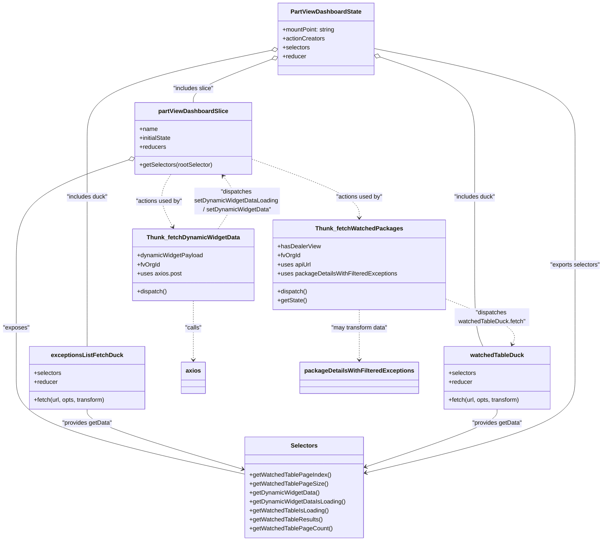

# Diagram: web/portal/src/pages/partview/redux/PartViewDashboardState.ts

> Auto-generated by Obscura crawlers

## Mermaid

### SVG

<svg id="container" width="1605.564453125" xmlns="http://www.w3.org/2000/svg" class="classDiagram" height="1446" viewBox="0 0 1605.564453125 1446" role="graphics-document document" aria-roledescription="class"><g><defs><marker id="container_class-aggregationStart" class="marker aggregation class" refX="18" refY="7" markerWidth="190" markerHeight="240" orient="auto"><path d="M 18,7 L9,13 L1,7 L9,1 Z"></path></marker></defs><defs><marker id="container_class-aggregationEnd" class="marker aggregation class" refX="1" refY="7" markerWidth="20" markerHeight="28" orient="auto"><path d="M 18,7 L9,13 L1,7 L9,1 Z"></path></marker></defs><defs><marker id="container_class-extensionStart" class="marker extension class" refX="18" refY="7" markerWidth="190" markerHeight="240" orient="auto"><path d="M 1,7 L18,13 V 1 Z"></path></marker></defs><defs><marker id="container_class-extensionEnd" class="marker extension class" refX="1" refY="7" markerWidth="20" markerHeight="28" orient="auto"><path d="M 1,1 V 13 L18,7 Z"></path></marker></defs><defs><marker id="container_class-compositionStart" class="marker composition class" refX="18" refY="7" markerWidth="190" markerHeight="240" orient="auto"><path d="M 18,7 L9,13 L1,7 L9,1 Z"></path></marker></defs><defs><marker id="container_class-compositionEnd" class="marker composition class" refX="1" refY="7" markerWidth="20" markerHeight="28" orient="auto"><path d="M 18,7 L9,13 L1,7 L9,1 Z"></path></marker></defs><defs><marker id="container_class-dependencyStart" class="marker dependency class" refX="6" refY="7" markerWidth="190" markerHeight="240" orient="auto"><path d="M 5,7 L9,13 L1,7 L9,1 Z"></path></marker></defs><defs><marker id="container_class-dependencyEnd" class="marker dependency class" refX="13" refY="7" markerWidth="20" markerHeight="28" orient="auto"><path d="M 18,7 L9,13 L14,7 L9,1 Z"></path></marker></defs><defs><marker id="container_class-lollipopStart" class="marker lollipop class" refX="13" refY="7" markerWidth="190" markerHeight="240" orient="auto"><circle stroke="black" fill="transparent" cx="7" cy="7" r="6"></circle></marker></defs><defs><marker id="container_class-lollipopEnd" class="marker lollipop class" refX="1" refY="7" markerWidth="190" markerHeight="240" orient="auto"><circle stroke="black" fill="transparent" cx="7" cy="7" r="6"></circle></marker></defs><g class="root"><g class="clusters"></g><g class="edgePaths"><path d="M723.699,159.264L689.659,172.22C655.619,185.176,587.54,211.088,553.501,230.211C519.461,249.333,519.461,261.667,519.461,267.833L519.461,274" id="id_PartViewDashboardState_partViewDashboardSlice_1" class="edge-thickness-normal edge-pattern-solid relation" style=";;;" data-edge="true" data-et="edge" data-id="id_PartViewDashboardState_partViewDashboardSlice_1" data-points="W3sieCI6NzM5LjgyMDMxMjUsInkiOjE1My4xMjc3MDY2NjgxNTcxN30seyJ4Ijo1MTkuNDYwOTM3NSwieSI6MjM3fSx7IngiOjUxOS40NjA5Mzc1LCJ5IjoyNzR9XQ==" marker-start="url(#container_class-aggregationStart)"></path><path d="M722.936,134.531L641.29,151.609C559.645,168.687,396.354,202.844,314.708,242.088C233.063,281.333,233.063,325.667,233.063,374C233.063,422.333,233.063,474.667,233.063,531C233.063,587.333,233.063,647.667,233.063,706C233.063,764.333,233.063,820.667,233.063,857C233.063,893.333,233.063,909.667,233.063,917.833L233.063,926" id="id_PartViewDashboardState_exceptionsListFetchDuck_2" class="edge-thickness-normal edge-pattern-solid relation" style=";;;" data-edge="true" data-et="edge" data-id="id_PartViewDashboardState_exceptionsListFetchDuck_2" data-points="W3sieCI6NzM5LjgyMDMxMjUsInkiOjEzMC45OTkwNjYxODQxOTUxNn0seyJ4IjoyMzMuMDYyNSwieSI6MjM3fSx7IngiOjIzMy4wNjI1LCJ5IjozNzB9LHsieCI6MjMzLjA2MjUsInkiOjUyN30seyJ4IjoyMzMuMDYyNSwieSI6NzA4fSx7IngiOjIzMy4wNjI1LCJ5Ijo4Nzd9LHsieCI6MjMzLjA2MjUsInkiOjkyNn1d" marker-start="url(#container_class-aggregationStart)"></path><path d="M1014.3,153.457L1055.236,167.381C1096.173,181.305,1178.045,209.152,1218.982,245.243C1259.918,281.333,1259.918,325.667,1259.918,374C1259.918,422.333,1259.918,474.667,1259.918,531C1259.918,587.333,1259.918,647.667,1259.918,706C1259.918,764.333,1259.918,820.667,1263.602,857C1267.286,893.333,1274.655,909.667,1278.339,917.833L1282.023,926" id="id_PartViewDashboardState_watchedTableDuck_3" class="edge-thickness-normal edge-pattern-solid relation" style=";;;" data-edge="true" data-et="edge" data-id="id_PartViewDashboardState_watchedTableDuck_3" data-points="W3sieCI6OTk3Ljk2ODc1LCJ5IjoxNDcuOTAyNDA5NTQyMjY2OX0seyJ4IjoxMjU5LjkxNzk2ODc1LCJ5IjoyMzd9LHsieCI6MTI1OS45MTc5Njg3NSwieSI6MzcwfSx7IngiOjEyNTkuOTE3OTY4NzUsInkiOjUyN30seyJ4IjoxMjU5LjkxNzk2ODc1LCJ5Ijo3MDh9LHsieCI6MTI1OS45MTc5Njg3NSwieSI6ODc3fSx7IngiOjEyODIuMDIzMjMxOTA3ODk0OCwieSI6OTI2fV0=" marker-start="url(#container_class-aggregationStart)"></path><path d="M347.787,426.641L297.09,443.368C246.394,460.094,145.002,493.547,94.306,540.44C43.609,587.333,43.609,647.667,43.609,706C43.609,764.333,43.609,820.667,43.609,871C43.609,921.333,43.609,965.667,43.609,1008C43.609,1050.333,43.609,1090.667,145.37,1133.641C247.13,1176.615,450.651,1222.229,552.411,1245.036L654.172,1267.844" id="id_partViewDashboardSlice_Selectors_4" class="edge-thickness-normal edge-pattern-solid relation" style=";;;" data-edge="true" data-et="edge" data-id="id_partViewDashboardSlice_Selectors_4" data-points="W3sieCI6MzY0LjE2Nzk2ODc1LCJ5Ijo0MjEuMjM2NTU3ODE1NzU3OX0seyJ4Ijo0My42MDkzNzUsInkiOjUyN30seyJ4Ijo0My42MDkzNzUsInkiOjcwOH0seyJ4Ijo0My42MDkzNzUsInkiOjg3N30seyJ4Ijo0My42MDkzNzUsInkiOjEwMTB9LHsieCI6NDMuNjA5Mzc1LCJ5IjoxMTMxfSx7IngiOjY1NC4xNzE4NzUsInkiOjEyNjcuODQzNTcxMjEwNDI0NH1d" marker-start="url(#container_class-aggregationStart)"></path><path d="M459.098,466L452.705,476.167C446.313,486.333,433.527,506.667,434.383,530.122C435.238,553.578,449.733,580.155,456.981,593.444L464.229,606.733" id="id_partViewDashboardSlice_Thunk_fetchDynamicWidgetData_5" class="edge-thickness-normal edge-pattern-dashed relation" style=";;;" data-edge="true" data-et="edge" data-id="id_partViewDashboardSlice_Thunk_fetchDynamicWidgetData_5" data-points="W3sieCI6NDU5LjA5Nzg4MDE3NTE1OTIsInkiOjQ2Nn0seyJ4Ijo0MjAuNzQyMTg3NSwieSI6NTI3fSx7IngiOjQ2Ny4xMDE4MjE0Nzc5MDA1NiwieSI6NjEyfV0=" marker-end="url(#container_class-dependencyEnd)"></path><path d="M674.754,425.837L721.646,442.698C768.538,459.558,862.322,493.279,909.214,519.306C956.105,545.333,956.105,563.667,956.105,572.833L956.105,582" id="id_partViewDashboardSlice_Thunk_fetchWatchedPackages_6" class="edge-thickness-normal edge-pattern-dashed relation" style=";;;" data-edge="true" data-et="edge" data-id="id_partViewDashboardSlice_Thunk_fetchWatchedPackages_6" data-points="W3sieCI6Njc0Ljc1MzkwNjI1LCJ5Ijo0MjUuODM3MTcyNjg1ODc2ODV9LHsieCI6OTU2LjEwNTQ2ODc1LCJ5Ijo1Mjd9LHsieCI6OTU2LjEwNTQ2ODc1LCJ5Ijo1ODh9XQ==" marker-end="url(#container_class-dependencyEnd)"></path><path d="M519.461,804L519.461,816.167C519.461,828.333,519.461,852.667,519.461,879C519.461,905.333,519.461,933.667,519.461,947.833L519.461,962" id="id_Thunk_fetchDynamicWidgetData_axios_7" class="edge-thickness-normal edge-pattern-dashed relation" style=";;;" data-edge="true" data-et="edge" data-id="id_Thunk_fetchDynamicWidgetData_axios_7" data-points="W3sieCI6NTE5LjQ2MDkzNzUsInkiOjgwNH0seyJ4Ijo1MTkuNDYwOTM3NSwieSI6ODc3fSx7IngiOjUxOS40NjA5Mzc1LCJ5Ijo5Njh9XQ==" marker-end="url(#container_class-dependencyEnd)"></path><path d="M582.897,612L592.258,597.833C601.62,583.667,620.342,555.333,622.564,531.795C624.786,508.258,610.508,489.515,603.369,480.144L596.23,470.773" id="id_Thunk_fetchDynamicWidgetData_partViewDashboardSlice_8" class="edge-thickness-normal edge-pattern-dashed relation" style=";;;" data-edge="true" data-et="edge" data-id="id_Thunk_fetchDynamicWidgetData_partViewDashboardSlice_8" data-points="W3sieCI6NTgyLjg5NzA1NjI4NDUzMDQsInkiOjYxMn0seyJ4Ijo2MzkuMDY0NDUzMTI1LCJ5Ijo1Mjd9LHsieCI6NTkyLjU5NDI5NzM3MjYxMTQsInkiOjQ2Nn1d" marker-end="url(#container_class-dependencyEnd)"></path><path d="M1183.328,798.608L1216.093,811.673C1248.858,824.738,1314.388,850.869,1343.88,871.19C1373.372,891.51,1366.826,906.021,1363.553,913.276L1360.28,920.531" id="id_Thunk_fetchWatchedPackages_watchedTableDuck_9" class="edge-thickness-normal edge-pattern-dashed relation" style=";;;" data-edge="true" data-et="edge" data-id="id_Thunk_fetchWatchedPackages_watchedTableDuck_9" data-points="W3sieCI6MTE4My4zMjgxMjUsInkiOjc5OC42MDc1ODkyMTk4NzkxfSx7IngiOjEzNzkuOTE3OTY4NzUsInkiOjg3N30seyJ4IjoxMzU3LjgxMjcwNTU5MjEwNTIsInkiOjkyNn1d" marker-end="url(#container_class-dependencyEnd)"></path><path d="M956.105,828L956.105,836.167C956.105,844.333,956.105,860.667,956.105,883C956.105,905.333,956.105,933.667,956.105,947.833L956.105,962" id="id_Thunk_fetchWatchedPackages_packageDetailsWithFilteredExceptions_10" class="edge-thickness-normal edge-pattern-dashed relation" style=";;;" data-edge="true" data-et="edge" data-id="id_Thunk_fetchWatchedPackages_packageDetailsWithFilteredExceptions_10" data-points="W3sieCI6OTU2LjEwNTQ2ODc1LCJ5Ijo4Mjh9LHsieCI6OTU2LjEwNTQ2ODc1LCJ5Ijo4Nzd9LHsieCI6OTU2LjEwNTQ2ODc1LCJ5Ijo5Njh9XQ==" marker-end="url(#container_class-dependencyEnd)"></path><path d="M233.063,1094L233.063,1100.167C233.063,1106.333,233.063,1118.667,302.289,1145.435C371.515,1172.203,509.968,1213.405,579.195,1234.007L648.421,1254.608" id="id_exceptionsListFetchDuck_Selectors_11" class="edge-thickness-normal edge-pattern-solid relation" style=";;;" data-edge="true" data-et="edge" data-id="id_exceptionsListFetchDuck_Selectors_11" data-points="W3sieCI6MjMzLjA2MjUsInkiOjEwOTR9LHsieCI6MjMzLjA2MjUsInkiOjExMzF9LHsieCI6NjU0LjE3MTg3NSwieSI6MTI1Ni4zMTk1OTk4OTE4NjI3fV0=" marker-end="url(#container_class-dependencyEnd)"></path><path d="M1319.918,1094L1319.918,1100.167C1319.918,1106.333,1319.918,1118.667,1262.194,1144.344C1204.47,1170.02,1089.022,1209.041,1031.299,1228.551L973.575,1248.061" id="id_watchedTableDuck_Selectors_12" class="edge-thickness-normal edge-pattern-solid relation" style=";;;" data-edge="true" data-et="edge" data-id="id_watchedTableDuck_Selectors_12" data-points="W3sieCI6MTMxOS45MTc5Njg3NSwieSI6MTA5NH0seyJ4IjoxMzE5LjkxNzk2ODc1LCJ5IjoxMTMxfSx7IngiOjk2Ny44OTA2MjUsInkiOjEyNDkuOTgyNjc1MTEwMzQzNX1d" marker-end="url(#container_class-dependencyEnd)"></path><path d="M997.969,129.998L1086.511,147.831C1175.053,165.665,1352.137,201.333,1440.679,241.333C1529.221,281.333,1529.221,325.667,1529.221,374C1529.221,422.333,1529.221,474.667,1529.221,531C1529.221,587.333,1529.221,647.667,1529.221,706C1529.221,764.333,1529.221,820.667,1529.221,871C1529.221,921.333,1529.221,965.667,1529.221,1008C1529.221,1050.333,1529.221,1090.667,1436.638,1133.006C1344.056,1175.345,1158.891,1219.691,1066.308,1241.863L973.726,1264.036" id="id_PartViewDashboardState_Selectors_13" class="edge-thickness-normal edge-pattern-solid relation" style=";;;" data-edge="true" data-et="edge" data-id="id_PartViewDashboardState_Selectors_13" data-points="W3sieCI6OTk3Ljk2ODc1LCJ5IjoxMjkuOTk3NTYyNzU3NTE1MDh9LHsieCI6MTUyOS4yMjA3MDMxMjUsInkiOjIzN30seyJ4IjoxNTI5LjIyMDcwMzEyNSwieSI6MzcwfSx7IngiOjE1MjkuMjIwNzAzMTI1LCJ5Ijo1Mjd9LHsieCI6MTUyOS4yMjA3MDMxMjUsInkiOjcwOH0seyJ4IjoxNTI5LjIyMDcwMzEyNSwieSI6ODc3fSx7IngiOjE1MjkuMjIwNzAzMTI1LCJ5IjoxMDEwfSx7IngiOjE1MjkuMjIwNzAzMTI1LCJ5IjoxMTMxfSx7IngiOjk2Ny44OTA2MjUsInkiOjEyNjUuNDMzNTcxODM0NTU1OH1d" marker-end="url(#container_class-dependencyEnd)"></path></g><g class="edgeLabels"><g class="edgeLabel" transform="translate(519.4609375, 237)"><g class="label" data-id="id_PartViewDashboardState_partViewDashboardSlice_1" transform="translate(-55.4375, -12)"><foreignObject width="110.875" height="24">

"includes slice"

</foreignObject></g></g><g class="edgeLabel" transform="translate(233.0625, 527)"><g class="label" data-id="id_PartViewDashboardState_exceptionsListFetchDuck_2" transform="translate(-56.515625, -12)"><foreignObject width="113.03125" height="24">

"includes duck"

</foreignObject></g></g><g class="edgeLabel" transform="translate(1259.91796875, 527)"><g class="label" data-id="id_PartViewDashboardState_watchedTableDuck_3" transform="translate(-56.515625, -12)"><foreignObject width="113.03125" height="24">

"includes duck"

</foreignObject></g></g><g class="edgeLabel" transform="translate(43.609375, 877)"><g class="label" data-id="id_partViewDashboardSlice_Selectors_4" transform="translate(-35.609375, -12)"><foreignObject width="71.21875" height="24">

"exposes"

</foreignObject></g></g><g class="edgeLabel" transform="translate(426.67091, 537.87027)"><g class="label" data-id="id_partViewDashboardSlice_Thunk_fetchDynamicWidgetData_5" transform="translate(-63.1171875, -12)"><foreignObject width="126.234375" height="24">

"actions used by"

</foreignObject></g></g><g class="edgeLabel" transform="translate(956.10546875, 527)"><g class="label" data-id="id_partViewDashboardSlice_Thunk_fetchWatchedPackages_6" transform="translate(-63.1171875, -12)"><foreignObject width="126.234375" height="24">

"actions used by"

</foreignObject></g></g><g class="edgeLabel" transform="translate(519.4609375, 877)"><g class="label" data-id="id_Thunk_fetchDynamicWidgetData_axios_7" transform="translate(-22.625, -12)"><foreignObject width="45.25" height="24">

"calls"

</foreignObject></g></g><g class="edgeLabel" transform="translate(632.11888, 537.51096)"><g class="label" data-id="id_Thunk_fetchDynamicWidgetData_partViewDashboardSlice_8" transform="translate(-114.3203125, -36)"><foreignObject width="228.640625" height="72">

"dispatches setDynamicWidgetDataLoading / setDynamicWidgetData"

</foreignObject></g></g><g class="edgeLabel" transform="translate(1306.58901, 847.75925)"><g class="label" data-id="id_Thunk_fetchWatchedPackages_watchedTableDuck_9" transform="translate(-100, -24)"><foreignObject width="200" height="48">

"dispatches watchedTableDuck.fetch"

</foreignObject></g></g><g class="edgeLabel" transform="translate(956.10546875, 877)"><g class="label" data-id="id_Thunk_fetchWatchedPackages_packageDetailsWithFilteredExceptions_10" transform="translate(-77.578125, -12)"><foreignObject width="155.15625" height="24">

"may transform data"

</foreignObject></g></g><g class="edgeLabel" transform="translate(233.0625, 1131)"><g class="label" data-id="id_exceptionsListFetchDuck_Selectors_11" transform="translate(-67.625, -12)"><foreignObject width="135.25" height="24">

"provides getData"

</foreignObject></g></g><g class="edgeLabel" transform="translate(1319.91796875, 1131)"><g class="label" data-id="id_watchedTableDuck_Selectors_12" transform="translate(-67.625, -12)"><foreignObject width="135.25" height="24">

"provides getData"

</foreignObject></g></g><g class="edgeLabel" transform="translate(1529.220703125, 708)"><g class="label" data-id="id_PartViewDashboardState_Selectors_13" transform="translate(-68.34375, -12)"><foreignObject width="136.6875" height="24">

"exports selectors"

</foreignObject></g></g></g><g class="nodes"><g class="node default" id="classId-PartViewDashboardState-0" transform="translate(868.89453125, 104)"><g class="basic label-container"><path d="M-129.07421875 -96 L129.07421875 -96 L129.07421875 96 L-129.07421875 96" stroke="none" stroke-width="0" fill="#ECECFF" style=""></path><path d="M-129.07421875 -96 C-34.22653359487698 -96, 60.621151560246034 -96, 129.07421875 -96 M-129.07421875 -96 C-49.32071893602665 -96, 30.432780877946698 -96, 129.07421875 -96 M129.07421875 -96 C129.07421875 -50.008893725245926, 129.07421875 -4.017787450491852, 129.07421875 96 M129.07421875 -96 C129.07421875 -41.07835924078782, 129.07421875 13.843281518424362, 129.07421875 96 M129.07421875 96 C60.5670123114934 96, -7.9401941270132 96, -129.07421875 96 M129.07421875 96 C72.55750962767624 96, 16.04080050535248 96, -129.07421875 96 M-129.07421875 96 C-129.07421875 38.968468930879396, -129.07421875 -18.063062138241207, -129.07421875 -96 M-129.07421875 96 C-129.07421875 35.04661208017079, -129.07421875 -25.906775839658422, -129.07421875 -96" stroke="#9370DB" stroke-width="1.3" fill="none" stroke-dasharray="0 0" style=""></path></g><g class="annotation-group text" transform="translate(0, -72)"></g><g class="label-group text" transform="translate(-91.0390625, -72)"><g class="label" style="font-weight: bolder" transform="translate(0,-12)"><foreignObject width="182.078125" height="24">

PartViewDashboardState

</foreignObject></g></g><g class="members-group text" transform="translate(-117.07421875, -24)"><g class="label" style="" transform="translate(0,-12)"><foreignObject width="143.109375" height="24">

+mountPoint: string

</foreignObject></g><g class="label" style="" transform="translate(0,12)"><foreignObject width="113.078125" height="24">

+actionCreators

</foreignObject></g><g class="label" style="" transform="translate(0,36)"><foreignObject width="73.453125" height="24">

+selectors

</foreignObject></g><g class="label" style="" transform="translate(0,60)"><foreignObject width="63.515625" height="24">

+reducer

</foreignObject></g></g><g class="methods-group text" transform="translate(-117.07421875, 96)"></g><g class="divider" style=""><path d="M-129.07421875 -48 C-56.15955176900269 -48, 16.75511521199462 -48, 129.07421875 -48 M-129.07421875 -48 C-31.763849288285684 -48, 65.54652017342863 -48, 129.07421875 -48" stroke="#9370DB" stroke-width="1.3" fill="none" stroke-dasharray="0 0" style=""></path></g><g class="divider" style=""><path d="M-129.07421875 72 C-61.4128615534222 72, 6.248495643155593 72, 129.07421875 72 M-129.07421875 72 C-39.72213984324914 72, 49.62993906350172 72, 129.07421875 72" stroke="#9370DB" stroke-width="1.3" fill="none" stroke-dasharray="0 0" style=""></path></g></g><g class="node default" id="classId-partViewDashboardSlice-1" transform="translate(519.4609375, 370)"><g class="basic label-container"><path d="M-155.29296875 -96 L155.29296875 -96 L155.29296875 96 L-155.29296875 96" stroke="none" stroke-width="0" fill="#ECECFF" style=""></path><path d="M-155.29296875 -96 C-89.86324643646255 -96, -24.433524122925093 -96, 155.29296875 -96 M-155.29296875 -96 C-46.03257789778512 -96, 63.227812954429766 -96, 155.29296875 -96 M155.29296875 -96 C155.29296875 -32.480963685002244, 155.29296875 31.03807262999551, 155.29296875 96 M155.29296875 -96 C155.29296875 -54.85465777783671, 155.29296875 -13.709315555673413, 155.29296875 96 M155.29296875 96 C69.99932085321737 96, -15.29432704356526 96, -155.29296875 96 M155.29296875 96 C37.621061531222196 96, -80.05084568755561 96, -155.29296875 96 M-155.29296875 96 C-155.29296875 35.632701065160944, -155.29296875 -24.73459786967811, -155.29296875 -96 M-155.29296875 96 C-155.29296875 34.38728337750079, -155.29296875 -27.225433244998413, -155.29296875 -96" stroke="#9370DB" stroke-width="1.3" fill="none" stroke-dasharray="0 0" style=""></path></g><g class="annotation-group text" transform="translate(0, -72)"></g><g class="label-group text" transform="translate(-89.3359375, -72)"><g class="label" style="font-weight: bolder" transform="translate(0,-12)"><foreignObject width="178.671875" height="24">

partViewDashboardSlice

</foreignObject></g></g><g class="members-group text" transform="translate(-143.29296875, -24)"><g class="label" style="" transform="translate(0,-12)"><foreignObject width="48.5" height="24">

+name

</foreignObject></g><g class="label" style="" transform="translate(0,12)"><foreignObject width="87.25" height="24">

+initialState

</foreignObject></g><g class="label" style="" transform="translate(0,36)"><foreignObject width="70.75" height="24">

+reducers

</foreignObject></g></g><g class="methods-group text" transform="translate(-143.29296875, 72)"><g class="label" style="" transform="translate(0,-12)"><foreignObject width="197.25" height="24">

+getSelectors(rootSelector)

</foreignObject></g></g><g class="divider" style=""><path d="M-155.29296875 -48 C-52.22793309423545 -48, 50.83710256152909 -48, 155.29296875 -48 M-155.29296875 -48 C-84.2248706233339 -48, -13.156772496667799 -48, 155.29296875 -48" stroke="#9370DB" stroke-width="1.3" fill="none" stroke-dasharray="0 0" style=""></path></g><g class="divider" style=""><path d="M-155.29296875 48 C-51.783718318574614 48, 51.72553211285077 48, 155.29296875 48 M-155.29296875 48 C-70.57872720900723 48, 14.135514331985547 48, 155.29296875 48" stroke="#9370DB" stroke-width="1.3" fill="none" stroke-dasharray="0 0" style=""></path></g></g><g class="node default" id="classId-exceptionsListFetchDuck-2" transform="translate(233.0625, 1010)"><g class="basic label-container"><path d="M-154.453125 -84 L154.453125 -84 L154.453125 84 L-154.453125 84" stroke="none" stroke-width="0" fill="#ECECFF" style=""></path><path d="M-154.453125 -84 C-65.98161757045094 -84, 22.489889859098128 -84, 154.453125 -84 M-154.453125 -84 C-85.19937105152997 -84, -15.94561710305993 -84, 154.453125 -84 M154.453125 -84 C154.453125 -33.68831778151811, 154.453125 16.623364436963783, 154.453125 84 M154.453125 -84 C154.453125 -41.39966954128762, 154.453125 1.2006609174247558, 154.453125 84 M154.453125 84 C91.46893558380401 84, 28.484746167608037 84, -154.453125 84 M154.453125 84 C42.6711428195682 84, -69.1108393608636 84, -154.453125 84 M-154.453125 84 C-154.453125 25.203623410998567, -154.453125 -33.592753178002866, -154.453125 -84 M-154.453125 84 C-154.453125 41.84626847000995, -154.453125 -0.30746305998009404, -154.453125 -84" stroke="#9370DB" stroke-width="1.3" fill="none" stroke-dasharray="0 0" style=""></path></g><g class="annotation-group text" transform="translate(0, -60)"></g><g class="label-group text" transform="translate(-90.4375, -60)"><g class="label" style="font-weight: bolder" transform="translate(0,-12)"><foreignObject width="180.875" height="24">

exceptionsListFetchDuck

</foreignObject></g></g><g class="members-group text" transform="translate(-142.453125, -12)"><g class="label" style="" transform="translate(0,-12)"><foreignObject width="73.453125" height="24">

+selectors

</foreignObject></g><g class="label" style="" transform="translate(0,12)"><foreignObject width="63.515625" height="24">

+reducer

</foreignObject></g></g><g class="methods-group text" transform="translate(-142.453125, 60)"><g class="label" style="" transform="translate(0,-12)"><foreignObject width="194.46875" height="24">

+fetch(url, opts, transform)

</foreignObject></g></g><g class="divider" style=""><path d="M-154.453125 -36 C-68.97889125546607 -36, 16.495342489067866 -36, 154.453125 -36 M-154.453125 -36 C-69.27021287957133 -36, 15.912699240857336 -36, 154.453125 -36" stroke="#9370DB" stroke-width="1.3" fill="none" stroke-dasharray="0 0" style=""></path></g><g class="divider" style=""><path d="M-154.453125 36 C-43.127107351730615 36, 68.19891029653877 36, 154.453125 36 M-154.453125 36 C-38.040499091729444 36, 78.37212681654111 36, 154.453125 36" stroke="#9370DB" stroke-width="1.3" fill="none" stroke-dasharray="0 0" style=""></path></g></g><g class="node default" id="classId-watchedTableDuck-3" transform="translate(1319.91796875, 1010)"><g class="basic label-container"><path d="M-143.60546875 -84 L143.60546875 -84 L143.60546875 84 L-143.60546875 84" stroke="none" stroke-width="0" fill="#ECECFF" style=""></path><path d="M-143.60546875 -84 C-64.47793665680653 -84, 14.649595436386932 -84, 143.60546875 -84 M-143.60546875 -84 C-74.89147506080663 -84, -6.177481371613254 -84, 143.60546875 -84 M143.60546875 -84 C143.60546875 -31.03999947997368, 143.60546875 21.92000104005264, 143.60546875 84 M143.60546875 -84 C143.60546875 -39.674409839503895, 143.60546875 4.651180320992211, 143.60546875 84 M143.60546875 84 C74.67192605625975 84, 5.7383833625194995 84, -143.60546875 84 M143.60546875 84 C35.312405860388594 84, -72.98065702922281 84, -143.60546875 84 M-143.60546875 84 C-143.60546875 36.27828776460587, -143.60546875 -11.443424470788258, -143.60546875 -84 M-143.60546875 84 C-143.60546875 17.52335698125796, -143.60546875 -48.95328603748408, -143.60546875 -84" stroke="#9370DB" stroke-width="1.3" fill="none" stroke-dasharray="0 0" style=""></path></g><g class="annotation-group text" transform="translate(0, -60)"></g><g class="label-group text" transform="translate(-68.7421875, -60)"><g class="label" style="font-weight: bolder" transform="translate(0,-12)"><foreignObject width="137.484375" height="24">

watchedTableDuck

</foreignObject></g></g><g class="members-group text" transform="translate(-131.60546875, -12)"><g class="label" style="" transform="translate(0,-12)"><foreignObject width="73.453125" height="24">

+selectors

</foreignObject></g><g class="label" style="" transform="translate(0,12)"><foreignObject width="63.515625" height="24">

+reducer

</foreignObject></g></g><g class="methods-group text" transform="translate(-131.60546875, 60)"><g class="label" style="" transform="translate(0,-12)"><foreignObject width="194.46875" height="24">

+fetch(url, opts, transform)

</foreignObject></g></g><g class="divider" style=""><path d="M-143.60546875 -36 C-79.56861549783596 -36, -15.531762245671928 -36, 143.60546875 -36 M-143.60546875 -36 C-68.84207800561839 -36, 5.92131273876322 -36, 143.60546875 -36" stroke="#9370DB" stroke-width="1.3" fill="none" stroke-dasharray="0 0" style=""></path></g><g class="divider" style=""><path d="M-143.60546875 36 C-34.47619086209302 36, 74.65308702581396 36, 143.60546875 36 M-143.60546875 36 C-68.37549008672075 36, 6.854488576558509 36, 143.60546875 36" stroke="#9370DB" stroke-width="1.3" fill="none" stroke-dasharray="0 0" style=""></path></g></g><g class="node default" id="classId-Thunk_fetchDynamicWidgetData-4" transform="translate(519.4609375, 708)"><g class="basic label-container"><path d="M-159.421875 -96 L159.421875 -96 L159.421875 96 L-159.421875 96" stroke="none" stroke-width="0" fill="#ECECFF" style=""></path><path d="M-159.421875 -96 C-82.40037900237326 -96, -5.378883004746513 -96, 159.421875 -96 M-159.421875 -96 C-68.4054402556507 -96, 22.610994488698594 -96, 159.421875 -96 M159.421875 -96 C159.421875 -35.91985198363195, 159.421875 24.1602960327361, 159.421875 96 M159.421875 -96 C159.421875 -35.26430878568928, 159.421875 25.47138242862144, 159.421875 96 M159.421875 96 C35.45598784600028 96, -88.50989930799943 96, -159.421875 96 M159.421875 96 C62.494364895706184 96, -34.43314520858763 96, -159.421875 96 M-159.421875 96 C-159.421875 21.394089731514228, -159.421875 -53.211820536971544, -159.421875 -96 M-159.421875 96 C-159.421875 21.880787396663777, -159.421875 -52.238425206672446, -159.421875 -96" stroke="#9370DB" stroke-width="1.3" fill="none" stroke-dasharray="0 0" style=""></path></g><g class="annotation-group text" transform="translate(0, -72)"></g><g class="label-group text" transform="translate(-118.78125, -72)"><g class="label" style="font-weight: bolder" transform="translate(0,-12)"><foreignObject width="237.5625" height="24">

Thunk_fetchDynamicWidgetData

</foreignObject></g></g><g class="members-group text" transform="translate(-147.421875, -24)"><g class="label" style="" transform="translate(0,-12)"><foreignObject width="176.0625" height="24">

+dynamicWidgetPayload

</foreignObject></g><g class="label" style="" transform="translate(0,12)"><foreignObject width="60.59375" height="24">

+fvOrgId

</foreignObject></g><g class="label" style="" transform="translate(0,36)"><foreignObject width="118.9375" height="24">

+uses axios.post

</foreignObject></g></g><g class="methods-group text" transform="translate(-147.421875, 72)"><g class="label" style="" transform="translate(0,-12)"><foreignObject width="80.515625" height="24">

+dispatch()

</foreignObject></g></g><g class="divider" style=""><path d="M-159.421875 -48 C-73.82374760321228 -48, 11.774379793575434 -48, 159.421875 -48 M-159.421875 -48 C-33.783602994556674 -48, 91.85466901088665 -48, 159.421875 -48" stroke="#9370DB" stroke-width="1.3" fill="none" stroke-dasharray="0 0" style=""></path></g><g class="divider" style=""><path d="M-159.421875 48 C-69.50616816624404 48, 20.409538667511924 48, 159.421875 48 M-159.421875 48 C-86.67906237186811 48, -13.936249743736226 48, 159.421875 48" stroke="#9370DB" stroke-width="1.3" fill="none" stroke-dasharray="0 0" style=""></path></g></g><g class="node default" id="classId-Thunk_fetchWatchedPackages-5" transform="translate(956.10546875, 708)"><g class="basic label-container"><path d="M-227.22265625 -120 L227.22265625 -120 L227.22265625 120 L-227.22265625 120" stroke="none" stroke-width="0" fill="#ECECFF" style=""></path><path d="M-227.22265625 -120 C-73.22227491261248 -120, 80.77810642477505 -120, 227.22265625 -120 M-227.22265625 -120 C-133.46383013697607 -120, -39.705004023952114 -120, 227.22265625 -120 M227.22265625 -120 C227.22265625 -39.967029502279544, 227.22265625 40.06594099544091, 227.22265625 120 M227.22265625 -120 C227.22265625 -46.82476282830727, 227.22265625 26.350474343385457, 227.22265625 120 M227.22265625 120 C54.41743695595122 120, -118.38778233809757 120, -227.22265625 120 M227.22265625 120 C100.592859735444 120, -26.03693677911201 120, -227.22265625 120 M-227.22265625 120 C-227.22265625 35.438365632315836, -227.22265625 -49.12326873536833, -227.22265625 -120 M-227.22265625 120 C-227.22265625 71.11835360832004, -227.22265625 22.236707216640056, -227.22265625 -120" stroke="#9370DB" stroke-width="1.3" fill="none" stroke-dasharray="0 0" style=""></path></g><g class="annotation-group text" transform="translate(0, -96)"></g><g class="label-group text" transform="translate(-110.3671875, -96)"><g class="label" style="font-weight: bolder" transform="translate(0,-12)"><foreignObject width="220.734375" height="24">

Thunk_fetchWatchedPackages

</foreignObject></g></g><g class="members-group text" transform="translate(-215.22265625, -48)"><g class="label" style="" transform="translate(0,-12)"><foreignObject width="113.890625" height="24">

+hasDealerView

</foreignObject></g><g class="label" style="" transform="translate(0,12)"><foreignObject width="60.59375" height="24">

+fvOrgId

</foreignObject></g><g class="label" style="" transform="translate(0,36)"><foreignObject width="89.390625" height="24">

+uses apiUrl

</foreignObject></g><g class="label" style="" transform="translate(0,60)"><foreignObject width="320.078125" height="24">

+uses packageDetailsWithFilteredExceptions

</foreignObject></g></g><g class="methods-group text" transform="translate(-215.22265625, 72)"><g class="label" style="" transform="translate(0,-12)"><foreignObject width="80.515625" height="24">

+dispatch()

</foreignObject></g><g class="label" style="" transform="translate(0,12)"><foreignObject width="78.265625" height="24">

+getState()

</foreignObject></g></g><g class="divider" style=""><path d="M-227.22265625 -72 C-101.99416350193714 -72, 23.234329246125725 -72, 227.22265625 -72 M-227.22265625 -72 C-89.17978234427267 -72, 48.86309156145467 -72, 227.22265625 -72" stroke="#9370DB" stroke-width="1.3" fill="none" stroke-dasharray="0 0" style=""></path></g><g class="divider" style=""><path d="M-227.22265625 48 C-88.92207105949939 48, 49.378514131001225 48, 227.22265625 48 M-227.22265625 48 C-45.68673922568328 48, 135.84917779863343 48, 227.22265625 48" stroke="#9370DB" stroke-width="1.3" fill="none" stroke-dasharray="0 0" style=""></path></g></g><g class="node default" id="classId-Selectors-6" transform="translate(811.03125, 1303)"><g class="basic label-container"><path d="M-156.859375 -135 L156.859375 -135 L156.859375 135 L-156.859375 135" stroke="none" stroke-width="0" fill="#ECECFF" style=""></path><path d="M-156.859375 -135 C-89.1772399744817 -135, -21.495104948963387 -135, 156.859375 -135 M-156.859375 -135 C-45.362913539629105 -135, 66.13354792074179 -135, 156.859375 -135 M156.859375 -135 C156.859375 -79.7731911106658, 156.859375 -24.546382221331626, 156.859375 135 M156.859375 -135 C156.859375 -49.06801164750128, 156.859375 36.86397670499744, 156.859375 135 M156.859375 135 C56.341668172453936 135, -44.17603865509213 135, -156.859375 135 M156.859375 135 C93.58151443135137 135, 30.303653862702745 135, -156.859375 135 M-156.859375 135 C-156.859375 39.12529802477505, -156.859375 -56.7494039504499, -156.859375 -135 M-156.859375 135 C-156.859375 63.57111333504487, -156.859375 -7.857773329910259, -156.859375 -135" stroke="#9370DB" stroke-width="1.3" fill="none" stroke-dasharray="0 0" style=""></path></g><g class="annotation-group text" transform="translate(0, -111)"></g><g class="label-group text" transform="translate(-34.171875, -111)"><g class="label" style="font-weight: bolder" transform="translate(0,-12)"><foreignObject width="68.34375" height="24">

Selectors

</foreignObject></g></g><g class="members-group text" transform="translate(-144.859375, -63)"></g><g class="methods-group text" transform="translate(-144.859375, -33)"><g class="label" style="" transform="translate(0,-12)"><foreignObject width="215.953125" height="24">

+getWatchedTablePageIndex()

</foreignObject></g><g class="label" style="" transform="translate(0,12)"><foreignObject width="204.796875" height="24">

+getWatchedTablePageSize()

</foreignObject></g><g class="label" style="" transform="translate(0,36)"><foreignObject width="186.125" height="24">

+getDynamicWidgetData()

</foreignObject></g><g class="label" style="" transform="translate(0,60)"><foreignObject width="255.546875" height="24">

+getDynamicWidgetDataIsLoading()

</foreignObject></g><g class="label" style="" transform="translate(0,84)"><foreignObject width="211.640625" height="24">

+getWatchedTableIsLoading()

</foreignObject></g><g class="label" style="" transform="translate(0,108)"><foreignObject width="195.09375" height="24">

+getWatchedTableResults()

</foreignObject></g><g class="label" style="" transform="translate(0,132)"><foreignObject width="218.40625" height="24">

+getWatchedTablePageCount()

</foreignObject></g></g><g class="divider" style=""><path d="M-156.859375 -87 C-85.92052314423762 -87, -14.98167128847524 -87, 156.859375 -87 M-156.859375 -87 C-41.48947040814623 -87, 73.88043418370754 -87, 156.859375 -87" stroke="#9370DB" stroke-width="1.3" fill="none" stroke-dasharray="0 0" style=""></path></g><g class="divider" style=""><path d="M-156.859375 -63 C-38.180113554329495 -63, 80.49914789134101 -63, 156.859375 -63 M-156.859375 -63 C-61.164330788852894 -63, 34.53071342229421 -63, 156.859375 -63" stroke="#9370DB" stroke-width="1.3" fill="none" stroke-dasharray="0 0" style=""></path></g></g><g class="node default" id="classId-axios-7" transform="translate(519.4609375, 1010)"><g class="basic label-container"><path d="M-31.2734375 -42 L31.2734375 -42 L31.2734375 42 L-31.2734375 42" stroke="none" stroke-width="0" fill="#ECECFF" style=""></path><path d="M-31.2734375 -42 C-10.262408245241325 -42, 10.74862100951735 -42, 31.2734375 -42 M-31.2734375 -42 C-16.69728403828638 -42, -2.12113057657276 -42, 31.2734375 -42 M31.2734375 -42 C31.2734375 -10.912731470511197, 31.2734375 20.174537058977606, 31.2734375 42 M31.2734375 -42 C31.2734375 -20.145955687658542, 31.2734375 1.7080886246829152, 31.2734375 42 M31.2734375 42 C7.021340699955132 42, -17.230756100089735 42, -31.2734375 42 M31.2734375 42 C11.296581993860329 42, -8.680273512279342 42, -31.2734375 42 M-31.2734375 42 C-31.2734375 14.02437030458508, -31.2734375 -13.95125939082984, -31.2734375 -42 M-31.2734375 42 C-31.2734375 17.01484247707163, -31.2734375 -7.9703150458567436, -31.2734375 -42" stroke="#9370DB" stroke-width="1.3" fill="none" stroke-dasharray="0 0" style=""></path></g><g class="annotation-group text" transform="translate(0, -18)"></g><g class="label-group text" transform="translate(-19.2734375, -18)"><g class="label" style="font-weight: bolder" transform="translate(0,-12)"><foreignObject width="38.546875" height="24">

axios

</foreignObject></g></g><g class="members-group text" transform="translate(-19.2734375, 30)"></g><g class="methods-group text" transform="translate(-19.2734375, 60)"></g><g class="divider" style=""><path d="M-31.2734375 6 C-17.53826267204503 6, -3.8030878440900615 6, 31.2734375 6 M-31.2734375 6 C-7.242748910084483 6, 16.787939679831034 6, 31.2734375 6" stroke="#9370DB" stroke-width="1.3" fill="none" stroke-dasharray="0 0" style=""></path></g><g class="divider" style=""><path d="M-31.2734375 24 C-7.225941238833055 24, 16.82155502233389 24, 31.2734375 24 M-31.2734375 24 C-15.346939472274816 24, 0.5795585554503688 24, 31.2734375 24" stroke="#9370DB" stroke-width="1.3" fill="none" stroke-dasharray="0 0" style=""></path></g></g><g class="node default" id="classId-packageDetailsWithFilteredExceptions-8" transform="translate(956.10546875, 1010)"><g class="basic label-container"><path d="M-151.796875 -42 L151.796875 -42 L151.796875 42 L-151.796875 42" stroke="none" stroke-width="0" fill="#ECECFF" style=""></path><path d="M-151.796875 -42 C-43.79629682372796 -42, 64.20428135254409 -42, 151.796875 -42 M-151.796875 -42 C-31.918587870894427 -42, 87.95969925821115 -42, 151.796875 -42 M151.796875 -42 C151.796875 -20.436466440435524, 151.796875 1.1270671191289523, 151.796875 42 M151.796875 -42 C151.796875 -23.84935132313044, 151.796875 -5.698702646260877, 151.796875 42 M151.796875 42 C60.111889678306255 42, -31.57309564338749 42, -151.796875 42 M151.796875 42 C38.46914411503249 42, -74.85858676993502 42, -151.796875 42 M-151.796875 42 C-151.796875 17.990146003396386, -151.796875 -6.019707993207227, -151.796875 -42 M-151.796875 42 C-151.796875 24.056116690729286, -151.796875 6.112233381458573, -151.796875 -42" stroke="#9370DB" stroke-width="1.3" fill="none" stroke-dasharray="0 0" style=""></path></g><g class="annotation-group text" transform="translate(0, -18)"></g><g class="label-group text" transform="translate(-139.796875, -18)"><g class="label" style="font-weight: bolder" transform="translate(0,-12)"><foreignObject width="279.59375" height="24">

packageDetailsWithFilteredExceptions

</foreignObject></g></g><g class="members-group text" transform="translate(-139.796875, 30)"></g><g class="methods-group text" transform="translate(-139.796875, 60)"></g><g class="divider" style=""><path d="M-151.796875 6 C-49.789892870388684 6, 52.21708925922263 6, 151.796875 6 M-151.796875 6 C-83.5917577500548 6, -15.386640500109593 6, 151.796875 6" stroke="#9370DB" stroke-width="1.3" fill="none" stroke-dasharray="0 0" style=""></path></g><g class="divider" style=""><path d="M-151.796875 24 C-83.70928420480436 24, -15.621693409608724 24, 151.796875 24 M-151.796875 24 C-32.558148503875486 24, 86.68057799224903 24, 151.796875 24" stroke="#9370DB" stroke-width="1.3" fill="none" stroke-dasharray="0 0" style=""></path></g></g></g></g></g></svg>
