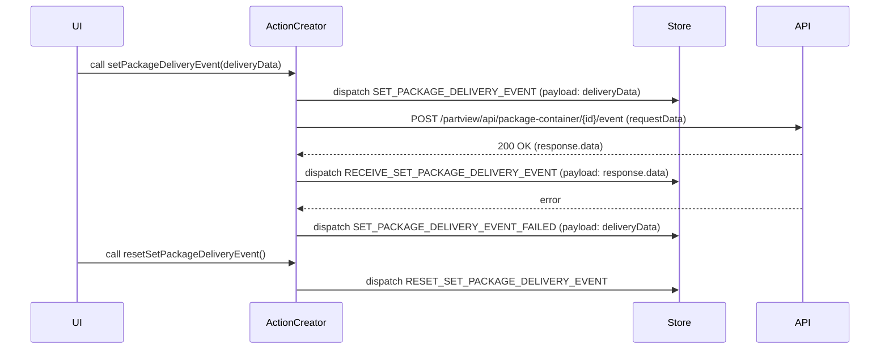
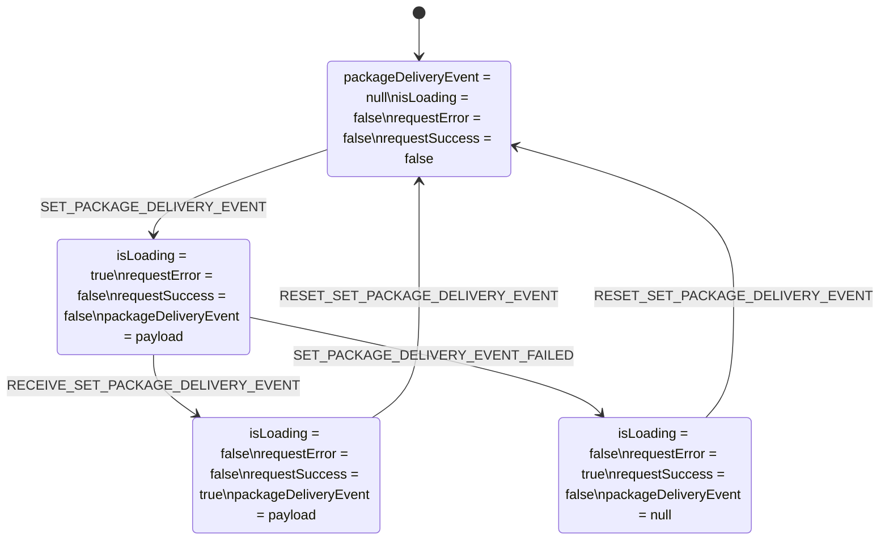

# Diagram: web/portal/src/pages/partview/redux/PartViewDeliverPackageState.js

> Auto-generated by Obscura crawlers

## Diagram 1

### SVG

<svg id="container" width="1439" xmlns="http://www.w3.org/2000/svg" height="603" viewBox="-50 -10 1439 603" role="graphics-document document" aria-roledescription="sequence"><g><rect x="1189" y="517" fill="#eaeaea" stroke="#666" width="150" height="65" name="API" rx="3" ry="3" class="actor actor-bottom"></rect><text x="1264" y="549.5" dominant-baseline="central" alignment-baseline="central" class="actor actor-box" style="text-anchor: middle; font-size: 16px; font-weight: 400;"><tspan x="1264" dy="0">API</tspan></text></g><g><rect x="989" y="517" fill="#eaeaea" stroke="#666" width="150" height="65" name="Store" rx="3" ry="3" class="actor actor-bottom"></rect><text x="1064" y="549.5" dominant-baseline="central" alignment-baseline="central" class="actor actor-box" style="text-anchor: middle; font-size: 16px; font-weight: 400;"><tspan x="1064" dy="0">Store</tspan></text></g><g><rect x="380" y="517" fill="#eaeaea" stroke="#666" width="150" height="65" name="Thunk" rx="3" ry="3" class="actor actor-bottom"></rect><text x="455" y="549.5" dominant-baseline="central" alignment-baseline="central" class="actor actor-box" style="text-anchor: middle; font-size: 16px; font-weight: 400;"><tspan x="455" dy="0">ActionCreator</tspan></text></g><g><rect x="0" y="517" fill="#eaeaea" stroke="#666" width="150" height="65" name="UI" rx="3" ry="3" class="actor actor-bottom"></rect><text x="75" y="549.5" dominant-baseline="central" alignment-baseline="central" class="actor actor-box" style="text-anchor: middle; font-size: 16px; font-weight: 400;"><tspan x="75" dy="0">UI</tspan></text></g><g><line id="actor3" x1="1264" y1="65" x2="1264" y2="517" class="actor-line 200" stroke-width="0.5px" stroke="#999" name="API"></line><g id="root-3"><rect x="1189" y="0" fill="#eaeaea" stroke="#666" width="150" height="65" name="API" rx="3" ry="3" class="actor actor-top"></rect><text x="1264" y="32.5" dominant-baseline="central" alignment-baseline="central" class="actor actor-box" style="text-anchor: middle; font-size: 16px; font-weight: 400;"><tspan x="1264" dy="0">API</tspan></text></g></g><g><line id="actor2" x1="1064" y1="65" x2="1064" y2="517" class="actor-line 200" stroke-width="0.5px" stroke="#999" name="Store"></line><g id="root-2"><rect x="989" y="0" fill="#eaeaea" stroke="#666" width="150" height="65" name="Store" rx="3" ry="3" class="actor actor-top"></rect><text x="1064" y="32.5" dominant-baseline="central" alignment-baseline="central" class="actor actor-box" style="text-anchor: middle; font-size: 16px; font-weight: 400;"><tspan x="1064" dy="0">Store</tspan></text></g></g><g><line id="actor1" x1="455" y1="65" x2="455" y2="517" class="actor-line 200" stroke-width="0.5px" stroke="#999" name="Thunk"></line><g id="root-1"><rect x="380" y="0" fill="#eaeaea" stroke="#666" width="150" height="65" name="Thunk" rx="3" ry="3" class="actor actor-top"></rect><text x="455" y="32.5" dominant-baseline="central" alignment-baseline="central" class="actor actor-box" style="text-anchor: middle; font-size: 16px; font-weight: 400;"><tspan x="455" dy="0">ActionCreator</tspan></text></g></g><g><line id="actor0" x1="75" y1="65" x2="75" y2="517" class="actor-line 200" stroke-width="0.5px" stroke="#999" name="UI"></line><g id="root-0"><rect x="0" y="0" fill="#eaeaea" stroke="#666" width="150" height="65" name="UI" rx="3" ry="3" class="actor actor-top"></rect><text x="75" y="32.5" dominant-baseline="central" alignment-baseline="central" class="actor actor-box" style="text-anchor: middle; font-size: 16px; font-weight: 400;"><tspan x="75" dy="0">UI</tspan></text></g></g><g></g><defs><symbol id="computer" width="24" height="24"><path transform="scale(.5)" d="M2 2v13h20v-13h-20zm18 11h-16v-9h16v9zm-10.228 6l.466-1h3.524l.467 1h-4.457zm14.228 3h-24l2-6h2.104l-1.33 4h18.45l-1.297-4h2.073l2 6zm-5-10h-14v-7h14v7z"></path></symbol></defs><defs><symbol id="database" fill-rule="evenodd" clip-rule="evenodd"><path transform="scale(.5)" d="M12.258.001l.256.004.255.005.253.008.251.01.249.012.247.015.246.016.242.019.241.02.239.023.236.024.233.027.231.028.229.031.225.032.223.034.22.036.217.038.214.04.211.041.208.043.205.045.201.046.198.048.194.05.191.051.187.053.183.054.18.056.175.057.172.059.168.06.163.061.16.063.155.064.15.066.074.033.073.033.071.034.07.034.069.035.068.035.067.035.066.035.064.036.064.036.062.036.06.036.06.037.058.037.058.037.055.038.055.038.053.038.052.038.051.039.05.039.048.039.047.039.045.04.044.04.043.04.041.04.04.041.039.041.037.041.036.041.034.041.033.042.032.042.03.042.029.042.027.042.026.043.024.043.023.043.021.043.02.043.018.044.017.043.015.044.013.044.012.044.011.045.009.044.007.045.006.045.004.045.002.045.001.045v17l-.001.045-.002.045-.004.045-.006.045-.007.045-.009.044-.011.045-.012.044-.013.044-.015.044-.017.043-.018.044-.02.043-.021.043-.023.043-.024.043-.026.043-.027.042-.029.042-.03.042-.032.042-.033.042-.034.041-.036.041-.037.041-.039.041-.04.041-.041.04-.043.04-.044.04-.045.04-.047.039-.048.039-.05.039-.051.039-.052.038-.053.038-.055.038-.055.038-.058.037-.058.037-.06.037-.06.036-.062.036-.064.036-.064.036-.066.035-.067.035-.068.035-.069.035-.07.034-.071.034-.073.033-.074.033-.15.066-.155.064-.16.063-.163.061-.168.06-.172.059-.175.057-.18.056-.183.054-.187.053-.191.051-.194.05-.198.048-.201.046-.205.045-.208.043-.211.041-.214.04-.217.038-.22.036-.223.034-.225.032-.229.031-.231.028-.233.027-.236.024-.239.023-.241.02-.242.019-.246.016-.247.015-.249.012-.251.01-.253.008-.255.005-.256.004-.258.001-.258-.001-.256-.004-.255-.005-.253-.008-.251-.01-.249-.012-.247-.015-.245-.016-.243-.019-.241-.02-.238-.023-.236-.024-.234-.027-.231-.028-.228-.031-.226-.032-.223-.034-.22-.036-.217-.038-.214-.04-.211-.041-.208-.043-.204-.045-.201-.046-.198-.048-.195-.05-.19-.051-.187-.053-.184-.054-.179-.056-.176-.057-.172-.059-.167-.06-.164-.061-.159-.063-.155-.064-.151-.066-.074-.033-.072-.033-.072-.034-.07-.034-.069-.035-.068-.035-.067-.035-.066-.035-.064-.036-.063-.036-.062-.036-.061-.036-.06-.037-.058-.037-.057-.037-.056-.038-.055-.038-.053-.038-.052-.038-.051-.039-.049-.039-.049-.039-.046-.039-.046-.04-.044-.04-.043-.04-.041-.04-.04-.041-.039-.041-.037-.041-.036-.041-.034-.041-.033-.042-.032-.042-.03-.042-.029-.042-.027-.042-.026-.043-.024-.043-.023-.043-.021-.043-.02-.043-.018-.044-.017-.043-.015-.044-.013-.044-.012-.044-.011-.045-.009-.044-.007-.045-.006-.045-.004-.045-.002-.045-.001-.045v-17l.001-.045.002-.045.004-.045.006-.045.007-.045.009-.044.011-.045.012-.044.013-.044.015-.044.017-.043.018-.044.02-.043.021-.043.023-.043.024-.043.026-.043.027-.042.029-.042.03-.042.032-.042.033-.042.034-.041.036-.041.037-.041.039-.041.04-.041.041-.04.043-.04.044-.04.046-.04.046-.039.049-.039.049-.039.051-.039.052-.038.053-.038.055-.038.056-.038.057-.037.058-.037.06-.037.061-.036.062-.036.063-.036.064-.036.066-.035.067-.035.068-.035.069-.035.07-.034.072-.034.072-.033.074-.033.151-.066.155-.064.159-.063.164-.061.167-.06.172-.059.176-.057.179-.056.184-.054.187-.053.19-.051.195-.05.198-.048.201-.046.204-.045.208-.043.211-.041.214-.04.217-.038.22-.036.223-.034.226-.032.228-.031.231-.028.234-.027.236-.024.238-.023.241-.02.243-.019.245-.016.247-.015.249-.012.251-.01.253-.008.255-.005.256-.004.258-.001.258.001zm-9.258 20.499v.01l.001.021.003.021.004.022.005.021.006.022.007.022.009.023.01.022.011.023.012.023.013.023.015.023.016.024.017.023.018.024.019.024.021.024.022.025.023.024.024.025.052.049.056.05.061.051.066.051.07.051.075.051.079.052.084.052.088.052.092.052.097.052.102.051.105.052.11.052.114.051.119.051.123.051.127.05.131.05.135.05.139.048.144.049.147.047.152.047.155.047.16.045.163.045.167.043.171.043.176.041.178.041.183.039.187.039.19.037.194.035.197.035.202.033.204.031.209.03.212.029.216.027.219.025.222.024.226.021.23.02.233.018.236.016.24.015.243.012.246.01.249.008.253.005.256.004.259.001.26-.001.257-.004.254-.005.25-.008.247-.011.244-.012.241-.014.237-.016.233-.018.231-.021.226-.021.224-.024.22-.026.216-.027.212-.028.21-.031.205-.031.202-.034.198-.034.194-.036.191-.037.187-.039.183-.04.179-.04.175-.042.172-.043.168-.044.163-.045.16-.046.155-.046.152-.047.148-.048.143-.049.139-.049.136-.05.131-.05.126-.05.123-.051.118-.052.114-.051.11-.052.106-.052.101-.052.096-.052.092-.052.088-.053.083-.051.079-.052.074-.052.07-.051.065-.051.06-.051.056-.05.051-.05.023-.024.023-.025.021-.024.02-.024.019-.024.018-.024.017-.024.015-.023.014-.024.013-.023.012-.023.01-.023.01-.022.008-.022.006-.022.006-.022.004-.022.004-.021.001-.021.001-.021v-4.127l-.077.055-.08.053-.083.054-.085.053-.087.052-.09.052-.093.051-.095.05-.097.05-.1.049-.102.049-.105.048-.106.047-.109.047-.111.046-.114.045-.115.045-.118.044-.12.043-.122.042-.124.042-.126.041-.128.04-.13.04-.132.038-.134.038-.135.037-.138.037-.139.035-.142.035-.143.034-.144.033-.147.032-.148.031-.15.03-.151.03-.153.029-.154.027-.156.027-.158.026-.159.025-.161.024-.162.023-.163.022-.165.021-.166.02-.167.019-.169.018-.169.017-.171.016-.173.015-.173.014-.175.013-.175.012-.177.011-.178.01-.179.008-.179.008-.181.006-.182.005-.182.004-.184.003-.184.002h-.37l-.184-.002-.184-.003-.182-.004-.182-.005-.181-.006-.179-.008-.179-.008-.178-.01-.176-.011-.176-.012-.175-.013-.173-.014-.172-.015-.171-.016-.17-.017-.169-.018-.167-.019-.166-.02-.165-.021-.163-.022-.162-.023-.161-.024-.159-.025-.157-.026-.156-.027-.155-.027-.153-.029-.151-.03-.15-.03-.148-.031-.146-.032-.145-.033-.143-.034-.141-.035-.14-.035-.137-.037-.136-.037-.134-.038-.132-.038-.13-.04-.128-.04-.126-.041-.124-.042-.122-.042-.12-.044-.117-.043-.116-.045-.113-.045-.112-.046-.109-.047-.106-.047-.105-.048-.102-.049-.1-.049-.097-.05-.095-.05-.093-.052-.09-.051-.087-.052-.085-.053-.083-.054-.08-.054-.077-.054v4.127zm0-5.654v.011l.001.021.003.021.004.021.005.022.006.022.007.022.009.022.01.022.011.023.012.023.013.023.015.024.016.023.017.024.018.024.019.024.021.024.022.024.023.025.024.024.052.05.056.05.061.05.066.051.07.051.075.052.079.051.084.052.088.052.092.052.097.052.102.052.105.052.11.051.114.051.119.052.123.05.127.051.131.05.135.049.139.049.144.048.147.048.152.047.155.046.16.045.163.045.167.044.171.042.176.042.178.04.183.04.187.038.19.037.194.036.197.034.202.033.204.032.209.03.212.028.216.027.219.025.222.024.226.022.23.02.233.018.236.016.24.014.243.012.246.01.249.008.253.006.256.003.259.001.26-.001.257-.003.254-.006.25-.008.247-.01.244-.012.241-.015.237-.016.233-.018.231-.02.226-.022.224-.024.22-.025.216-.027.212-.029.21-.03.205-.032.202-.033.198-.035.194-.036.191-.037.187-.039.183-.039.179-.041.175-.042.172-.043.168-.044.163-.045.16-.045.155-.047.152-.047.148-.048.143-.048.139-.05.136-.049.131-.05.126-.051.123-.051.118-.051.114-.052.11-.052.106-.052.101-.052.096-.052.092-.052.088-.052.083-.052.079-.052.074-.051.07-.052.065-.051.06-.05.056-.051.051-.049.023-.025.023-.024.021-.025.02-.024.019-.024.018-.024.017-.024.015-.023.014-.023.013-.024.012-.022.01-.023.01-.023.008-.022.006-.022.006-.022.004-.021.004-.022.001-.021.001-.021v-4.139l-.077.054-.08.054-.083.054-.085.052-.087.053-.09.051-.093.051-.095.051-.097.05-.1.049-.102.049-.105.048-.106.047-.109.047-.111.046-.114.045-.115.044-.118.044-.12.044-.122.042-.124.042-.126.041-.128.04-.13.039-.132.039-.134.038-.135.037-.138.036-.139.036-.142.035-.143.033-.144.033-.147.033-.148.031-.15.03-.151.03-.153.028-.154.028-.156.027-.158.026-.159.025-.161.024-.162.023-.163.022-.165.021-.166.02-.167.019-.169.018-.169.017-.171.016-.173.015-.173.014-.175.013-.175.012-.177.011-.178.009-.179.009-.179.007-.181.007-.182.005-.182.004-.184.003-.184.002h-.37l-.184-.002-.184-.003-.182-.004-.182-.005-.181-.007-.179-.007-.179-.009-.178-.009-.176-.011-.176-.012-.175-.013-.173-.014-.172-.015-.171-.016-.17-.017-.169-.018-.167-.019-.166-.02-.165-.021-.163-.022-.162-.023-.161-.024-.159-.025-.157-.026-.156-.027-.155-.028-.153-.028-.151-.03-.15-.03-.148-.031-.146-.033-.145-.033-.143-.033-.141-.035-.14-.036-.137-.036-.136-.037-.134-.038-.132-.039-.13-.039-.128-.04-.126-.041-.124-.042-.122-.043-.12-.043-.117-.044-.116-.044-.113-.046-.112-.046-.109-.046-.106-.047-.105-.048-.102-.049-.1-.049-.097-.05-.095-.051-.093-.051-.09-.051-.087-.053-.085-.052-.083-.054-.08-.054-.077-.054v4.139zm0-5.666v.011l.001.02.003.022.004.021.005.022.006.021.007.022.009.023.01.022.011.023.012.023.013.023.015.023.016.024.017.024.018.023.019.024.021.025.022.024.023.024.024.025.052.05.056.05.061.05.066.051.07.051.075.052.079.051.084.052.088.052.092.052.097.052.102.052.105.051.11.052.114.051.119.051.123.051.127.05.131.05.135.05.139.049.144.048.147.048.152.047.155.046.16.045.163.045.167.043.171.043.176.042.178.04.183.04.187.038.19.037.194.036.197.034.202.033.204.032.209.03.212.028.216.027.219.025.222.024.226.021.23.02.233.018.236.017.24.014.243.012.246.01.249.008.253.006.256.003.259.001.26-.001.257-.003.254-.006.25-.008.247-.01.244-.013.241-.014.237-.016.233-.018.231-.02.226-.022.224-.024.22-.025.216-.027.212-.029.21-.03.205-.032.202-.033.198-.035.194-.036.191-.037.187-.039.183-.039.179-.041.175-.042.172-.043.168-.044.163-.045.16-.045.155-.047.152-.047.148-.048.143-.049.139-.049.136-.049.131-.051.126-.05.123-.051.118-.052.114-.051.11-.052.106-.052.101-.052.096-.052.092-.052.088-.052.083-.052.079-.052.074-.052.07-.051.065-.051.06-.051.056-.05.051-.049.023-.025.023-.025.021-.024.02-.024.019-.024.018-.024.017-.024.015-.023.014-.024.013-.023.012-.023.01-.022.01-.023.008-.022.006-.022.006-.022.004-.022.004-.021.001-.021.001-.021v-4.153l-.077.054-.08.054-.083.053-.085.053-.087.053-.09.051-.093.051-.095.051-.097.05-.1.049-.102.048-.105.048-.106.048-.109.046-.111.046-.114.046-.115.044-.118.044-.12.043-.122.043-.124.042-.126.041-.128.04-.13.039-.132.039-.134.038-.135.037-.138.036-.139.036-.142.034-.143.034-.144.033-.147.032-.148.032-.15.03-.151.03-.153.028-.154.028-.156.027-.158.026-.159.024-.161.024-.162.023-.163.023-.165.021-.166.02-.167.019-.169.018-.169.017-.171.016-.173.015-.173.014-.175.013-.175.012-.177.01-.178.01-.179.009-.179.007-.181.006-.182.006-.182.004-.184.003-.184.001-.185.001-.185-.001-.184-.001-.184-.003-.182-.004-.182-.006-.181-.006-.179-.007-.179-.009-.178-.01-.176-.01-.176-.012-.175-.013-.173-.014-.172-.015-.171-.016-.17-.017-.169-.018-.167-.019-.166-.02-.165-.021-.163-.023-.162-.023-.161-.024-.159-.024-.157-.026-.156-.027-.155-.028-.153-.028-.151-.03-.15-.03-.148-.032-.146-.032-.145-.033-.143-.034-.141-.034-.14-.036-.137-.036-.136-.037-.134-.038-.132-.039-.13-.039-.128-.041-.126-.041-.124-.041-.122-.043-.12-.043-.117-.044-.116-.044-.113-.046-.112-.046-.109-.046-.106-.048-.105-.048-.102-.048-.1-.05-.097-.049-.095-.051-.093-.051-.09-.052-.087-.052-.085-.053-.083-.053-.08-.054-.077-.054v4.153zm8.74-8.179l-.257.004-.254.005-.25.008-.247.011-.244.012-.241.014-.237.016-.233.018-.231.021-.226.022-.224.023-.22.026-.216.027-.212.028-.21.031-.205.032-.202.033-.198.034-.194.036-.191.038-.187.038-.183.04-.179.041-.175.042-.172.043-.168.043-.163.045-.16.046-.155.046-.152.048-.148.048-.143.048-.139.049-.136.05-.131.05-.126.051-.123.051-.118.051-.114.052-.11.052-.106.052-.101.052-.096.052-.092.052-.088.052-.083.052-.079.052-.074.051-.07.052-.065.051-.06.05-.056.05-.051.05-.023.025-.023.024-.021.024-.02.025-.019.024-.018.024-.017.023-.015.024-.014.023-.013.023-.012.023-.01.023-.01.022-.008.022-.006.023-.006.021-.004.022-.004.021-.001.021-.001.021.001.021.001.021.004.021.004.022.006.021.006.023.008.022.01.022.01.023.012.023.013.023.014.023.015.024.017.023.018.024.019.024.02.025.021.024.023.024.023.025.051.05.056.05.06.05.065.051.07.052.074.051.079.052.083.052.088.052.092.052.096.052.101.052.106.052.11.052.114.052.118.051.123.051.126.051.131.05.136.05.139.049.143.048.148.048.152.048.155.046.16.046.163.045.168.043.172.043.175.042.179.041.183.04.187.038.191.038.194.036.198.034.202.033.205.032.21.031.212.028.216.027.22.026.224.023.226.022.231.021.233.018.237.016.241.014.244.012.247.011.25.008.254.005.257.004.26.001.26-.001.257-.004.254-.005.25-.008.247-.011.244-.012.241-.014.237-.016.233-.018.231-.021.226-.022.224-.023.22-.026.216-.027.212-.028.21-.031.205-.032.202-.033.198-.034.194-.036.191-.038.187-.038.183-.04.179-.041.175-.042.172-.043.168-.043.163-.045.16-.046.155-.046.152-.048.148-.048.143-.048.139-.049.136-.05.131-.05.126-.051.123-.051.118-.051.114-.052.11-.052.106-.052.101-.052.096-.052.092-.052.088-.052.083-.052.079-.052.074-.051.07-.052.065-.051.06-.05.056-.05.051-.05.023-.025.023-.024.021-.024.02-.025.019-.024.018-.024.017-.023.015-.024.014-.023.013-.023.012-.023.01-.023.01-.022.008-.022.006-.023.006-.021.004-.022.004-.021.001-.021.001-.021-.001-.021-.001-.021-.004-.021-.004-.022-.006-.021-.006-.023-.008-.022-.01-.022-.01-.023-.012-.023-.013-.023-.014-.023-.015-.024-.017-.023-.018-.024-.019-.024-.02-.025-.021-.024-.023-.024-.023-.025-.051-.05-.056-.05-.06-.05-.065-.051-.07-.052-.074-.051-.079-.052-.083-.052-.088-.052-.092-.052-.096-.052-.101-.052-.106-.052-.11-.052-.114-.052-.118-.051-.123-.051-.126-.051-.131-.05-.136-.05-.139-.049-.143-.048-.148-.048-.152-.048-.155-.046-.16-.046-.163-.045-.168-.043-.172-.043-.175-.042-.179-.041-.183-.04-.187-.038-.191-.038-.194-.036-.198-.034-.202-.033-.205-.032-.21-.031-.212-.028-.216-.027-.22-.026-.224-.023-.226-.022-.231-.021-.233-.018-.237-.016-.241-.014-.244-.012-.247-.011-.25-.008-.254-.005-.257-.004-.26-.001-.26.001z"></path></symbol></defs><defs><symbol id="clock" width="24" height="24"><path transform="scale(.5)" d="M12 2c5.514 0 10 4.486 10 10s-4.486 10-10 10-10-4.486-10-10 4.486-10 10-10zm0-2c-6.627 0-12 5.373-12 12s5.373 12 12 12 12-5.373 12-12-5.373-12-12-12zm5.848 12.459c.202.038.202.333.001.372-1.907.361-6.045 1.111-6.547 1.111-.719 0-1.301-.582-1.301-1.301 0-.512.77-5.447 1.125-7.445.034-.192.312-.181.343.014l.985 6.238 5.394 1.011z"></path></symbol></defs><defs><marker id="arrowhead" refX="7.9" refY="5" markerUnits="userSpaceOnUse" markerWidth="12" markerHeight="12" orient="auto-start-reverse"><path d="M -1 0 L 10 5 L 0 10 z"></path></marker></defs><defs><marker id="crosshead" markerWidth="15" markerHeight="8" orient="auto" refX="4" refY="4.5"><path fill="none" stroke="#000000" stroke-width="1pt" d="M 1,2 L 6,7 M 6,2 L 1,7" style="stroke-dasharray: 0, 0;"></path></marker></defs><defs><marker id="filled-head" refX="15.5" refY="7" markerWidth="20" markerHeight="28" orient="auto"><path d="M 18,7 L9,13 L14,7 L9,1 Z"></path></marker></defs><defs><marker id="sequencenumber" refX="15" refY="15" markerWidth="60" markerHeight="40" orient="auto"><circle cx="15" cy="15" r="6"></circle></marker></defs><text x="264" y="80" text-anchor="middle" dominant-baseline="middle" alignment-baseline="middle" class="messageText" dy="1em" style="font-size: 16px; font-weight: 400;">call setPackageDeliveryEvent(deliveryData)</text><line x1="76" y1="113" x2="451" y2="113" class="messageLine0" stroke-width="2" stroke="none" marker-end="url(#arrowhead)" style="fill: none;"></line><text x="758" y="128" text-anchor="middle" dominant-baseline="middle" alignment-baseline="middle" class="messageText" dy="1em" style="font-size: 16px; font-weight: 400;">dispatch SET_PACKAGE_DELIVERY_EVENT (payload: deliveryData)</text><line x1="456" y1="161" x2="1060" y2="161" class="messageLine0" stroke-width="2" stroke="none" marker-end="url(#arrowhead)" style="fill: none;"></line><text x="858" y="176" text-anchor="middle" dominant-baseline="middle" alignment-baseline="middle" class="messageText" dy="1em" style="font-size: 16px; font-weight: 400;">POST /partview/api/package-container/{id}/event (requestData)</text><line x1="456" y1="209" x2="1260" y2="209" class="messageLine0" stroke-width="2" stroke="none" marker-end="url(#arrowhead)" style="fill: none;"></line><text x="861" y="224" text-anchor="middle" dominant-baseline="middle" alignment-baseline="middle" class="messageText" dy="1em" style="font-size: 16px; font-weight: 400;">200 OK (response.data)</text><line x1="1263" y1="257" x2="459" y2="257" class="messageLine1" stroke-width="2" stroke="none" marker-end="url(#arrowhead)" style="stroke-dasharray: 3, 3; fill: none;"></line><text x="758" y="272" text-anchor="middle" dominant-baseline="middle" alignment-baseline="middle" class="messageText" dy="1em" style="font-size: 16px; font-weight: 400;">dispatch RECEIVE_SET_PACKAGE_DELIVERY_EVENT (payload: response.data)</text><line x1="456" y1="305" x2="1060" y2="305" class="messageLine0" stroke-width="2" stroke="none" marker-end="url(#arrowhead)" style="fill: none;"></line><text x="861" y="320" text-anchor="middle" dominant-baseline="middle" alignment-baseline="middle" class="messageText" dy="1em" style="font-size: 16px; font-weight: 400;">error</text><line x1="1263" y1="353" x2="459" y2="353" class="messageLine1" stroke-width="2" stroke="none" marker-end="url(#arrowhead)" style="stroke-dasharray: 3, 3; fill: none;"></line><text x="758" y="368" text-anchor="middle" dominant-baseline="middle" alignment-baseline="middle" class="messageText" dy="1em" style="font-size: 16px; font-weight: 400;">dispatch SET_PACKAGE_DELIVERY_EVENT_FAILED (payload: deliveryData)</text><line x1="456" y1="401" x2="1060" y2="401" class="messageLine0" stroke-width="2" stroke="none" marker-end="url(#arrowhead)" style="fill: none;"></line><text x="264" y="416" text-anchor="middle" dominant-baseline="middle" alignment-baseline="middle" class="messageText" dy="1em" style="font-size: 16px; font-weight: 400;">call resetSetPackageDeliveryEvent()</text><line x1="76" y1="449" x2="451" y2="449" class="messageLine0" stroke-width="2" stroke="none" marker-end="url(#arrowhead)" style="fill: none;"></line><text x="758" y="464" text-anchor="middle" dominant-baseline="middle" alignment-baseline="middle" class="messageText" dy="1em" style="font-size: 16px; font-weight: 400;">dispatch RESET_SET_PACKAGE_DELIVERY_EVENT</text><line x1="456" y1="497" x2="1060" y2="497" class="messageLine0" stroke-width="2" stroke="none" marker-end="url(#arrowhead)" style="fill: none;"></line></svg>

## Diagram 2

### SVG

<svg id="container" width="904.9375" xmlns="http://www.w3.org/2000/svg" class="statediagram" height="636" viewBox="0 0 904.9375 636" role="graphics-document document" aria-roledescription="stateDiagram"><g><defs><marker id="container_stateDiagram-barbEnd" refX="19" refY="7" markerWidth="20" markerHeight="14" markerUnits="userSpaceOnUse" orient="auto"><path d="M 19,7 L9,13 L14,7 L9,1 Z"></path></marker></defs><g class="root"><g class="clusters"></g><g class="edgePaths"><path d="M440.039,22L440.039,26.167C440.039,30.333,440.039,38.667,440.122,47.083C440.206,55.5,440.372,64,440.456,68.25L440.539,72.5" id="edge0" class="edge-thickness-normal edge-pattern-solid transition" style="fill:none;;;fill:none" data-edge="true" data-et="edge" data-id="edge0" data-points="W3sieCI6NDQwLjAzOTA2MjUsInkiOjIyfSx7IngiOjQ0MC4wMzkwNjI1LCJ5Ijo0N30seyJ4Ijo0NDAuNTM5MDYyNSwieSI6NzIuNX1d" marker-end="url(#container_stateDiagram-barbEnd)"></path><path d="M332.539,179.997L302.604,190.831C272.669,201.665,212.799,223.332,182.948,240.416C153.096,257.5,153.263,270,153.346,276.25L153.43,282.5" id="edge1" class="edge-thickness-normal edge-pattern-solid transition" style="fill:none;;;fill:none" data-edge="true" data-et="edge" data-id="edge1" data-points="W3sieCI6MzMyLjUzOTA2MjUsInkiOjE3OS45OTcxNDI4NTcxNDI4NX0seyJ4IjoxNTIuOTI5Njg3NSwieSI6MjQ1fSx7IngiOjE1My40Mjk2ODc1LCJ5IjoyODIuNX1d" marker-end="url(#container_stateDiagram-barbEnd)"></path><path d="M153.43,418.5L153.346,424.583C153.263,430.667,153.096,442.833,161.527,455.167C169.958,467.5,186.987,480,195.501,486.25L204.016,492.5" id="edge2" class="edge-thickness-normal edge-pattern-solid transition" style="fill:none;;;fill:none" data-edge="true" data-et="edge" data-id="edge2" data-points="W3sieCI6MTUzLjQyOTY4NzUsInkiOjQxOC41fSx7IngiOjE1Mi45Mjk2ODc1LCJ5Ijo0NTV9LHsieCI6MjA0LjAxNTYyNSwieSI6NDkyLjV9XQ==" marker-end="url(#container_stateDiagram-barbEnd)"></path><path d="M268.063,377.438L323.344,390.365C378.625,403.292,489.188,429.146,549.242,448.323C609.297,467.5,618.843,480,623.616,486.25L628.39,492.5" id="edge3" class="edge-thickness-normal edge-pattern-solid transition" style="fill:none;;;fill:none" data-edge="true" data-et="edge" data-id="edge3" data-points="W3sieCI6MjY4LjA2MjUsInkiOjM3Ny40Mzc5OTk0MDU1MjE3fSx7IngiOjU5OS43NSwieSI6NDU1fSx7IngiOjYyOC4zODk1NDYxMzA5NTIzLCJ5Ijo0OTIuNX1d" marker-end="url(#container_stateDiagram-barbEnd)"></path><path d="M389.953,492.5L398.301,486.25C406.648,480,423.344,467.5,431.691,443.75C440.039,420,440.039,385,440.039,350C440.039,315,440.039,280,440.122,256.417C440.206,232.833,440.372,220.667,440.456,214.583L440.539,208.5" id="edge4" class="edge-thickness-normal edge-pattern-solid transition" style="fill:none;;;fill:none" data-edge="true" data-et="edge" data-id="edge4" data-points="W3sieCI6Mzg5Ljk1MzEyNSwieSI6NDkyLjV9LHsieCI6NDQwLjAzOTA2MjUsInkiOjQ1NX0seyJ4Ijo0NDAuMDM5MDYyNSwieSI6MzUwfSx7IngiOjQ0MC4wMzkwNjI1LCJ5IjoyNDV9LHsieCI6NDQwLjUzOTA2MjUsInkiOjIwOC41fV0=" marker-end="url(#container_stateDiagram-barbEnd)"></path><path d="M731.821,492.5L736.428,486.25C741.035,480,750.248,467.5,754.854,443.75C759.461,420,759.461,385,759.461,350C759.461,315,759.461,280,724.307,251C689.154,222.001,618.846,199.001,583.693,187.501L548.539,176.002" id="edge5" class="edge-thickness-normal edge-pattern-solid transition" style="fill:none;;;fill:none" data-edge="true" data-et="edge" data-id="edge5" data-points="W3sieCI6NzMxLjgyMTM5MTM2OTA0NzcsInkiOjQ5Mi41fSx7IngiOjc1OS40NjA5Mzc1LCJ5Ijo0NTV9LHsieCI6NzU5LjQ2MDkzNzUsInkiOjM1MH0seyJ4Ijo3NTkuNDYwOTM3NSwieSI6MjQ1fSx7IngiOjU0OC41MzkwNjI1LCJ5IjoxNzYuMDAxNjM4NzAyNzM0NDN9XQ==" marker-end="url(#container_stateDiagram-barbEnd)"></path></g><g class="edgeLabels"><g class="edgeLabel"><g class="label" data-id="edge0" transform="translate(0, 0)"><foreignObject width="0" height="0">

</foreignObject></g></g><g class="edgeLabel" transform="translate(152.9296875, 245)"><g class="label" data-id="edge1" transform="translate(-112.0625, -12)"><foreignObject width="224.125" height="24">

SET_PACKAGE_DELIVERY_EVENT

</foreignObject></g></g><g class="edgeLabel" transform="translate(152.9296875, 455)"><g class="label" data-id="edge2" transform="translate(-144.9296875, -12)"><foreignObject width="289.859375" height="24">

RECEIVE_SET_PACKAGE_DELIVERY_EVENT

</foreignObject></g></g><g class="edgeLabel" transform="translate(456.87927, 421.59102)"><g class="label" data-id="edge3" transform="translate(-139.7109375, -12)"><foreignObject width="279.421875" height="24">

SET_PACKAGE_DELIVERY_EVENT_FAILED

</foreignObject></g></g><g class="edgeLabel" transform="translate(440.0390625, 350)"><g class="label" data-id="edge4" transform="translate(-137.4765625, -12)"><foreignObject width="274.953125" height="24">

RESET_SET_PACKAGE_DELIVERY_EVENT

</foreignObject></g></g><g class="edgeLabel" transform="translate(759.4609375, 350)"><g class="label" data-id="edge5" transform="translate(-137.4765625, -12)"><foreignObject width="274.953125" height="24">

RESET_SET_PACKAGE_DELIVERY_EVENT

</foreignObject></g></g></g><g class="nodes"><g class="node default" id="state-root_start-0" transform="translate(440.0390625, 15)"><circle class="state-start" r="7" width="14" height="14"></circle></g><g class="node  statediagram-state" id="state-Idle-6" transform="translate(440.0390625, 140)"><g class="basic label-container outer-path"><path d="M-103 -68 C-24.029276746785854 -68, 54.94144650642829 -68, 103 -68 C103 -68, 103 -68, 103 -68 C103.09099213241451 -67.99623653756491, 103.18198426482904 -67.99247307512981, 103.41289672736166 -67.98292246503335 C103.55444213285863 -67.96527884863809, 103.6959875383556 -67.94763523224282, 103.82297295140367 -67.93180651701361 C103.95857920454435 -67.90337287578735, 104.09418545768504 -67.8749392345611, 104.227427435704 -67.84700132969665 C104.38361919945243 -67.80050102691686, 104.53981096320085 -67.75400072413706, 104.62349734602341 -67.72908620850318 C104.71598006103108 -67.69299934112557, 104.80846277603872 -67.65691247374797, 105.00847712326485 -67.57886663327528 C105.08617357251211 -67.54088315374048, 105.16387002175935 -67.50289967420568, 105.37973696518537 -67.39736875603245 C105.4780422682794 -67.33879150993042, 105.57634757137342 -67.28021426382837, 105.73474079061214 -67.18583239131264 C105.85055121241855 -67.10314533944955, 105.96636163422495 -67.02045828758648, 106.07106356344833 -66.94570254698196 C106.16785627239572 -66.86372330428755, 106.26464898134311 -66.78174406159314, 106.3864078581287 -66.67861955336566 C106.48886768076011 -66.57615973073426, 106.5913275033915 -66.47369990810287, 106.67861955336566 -66.3864078581287 C106.76431360172346 -66.28522908642256, 106.85000765008127 -66.18405031471642, 106.94570254698196 -66.07106356344833 C107.01965119763035 -65.96749203404146, 107.09359984827876 -65.86392050463458, 107.18583239131264 -65.73474079061214 C107.24891856140574 -65.62886853671273, 107.31200473149885 -65.52299628281332, 107.39736875603245 -65.37973696518537 C107.46608472077757 -65.23917621265073, 107.53480068552271 -65.09861546011608, 107.57886663327528 -65.00847712326485 C107.61261635749034 -64.92198399285519, 107.6463660817054 -64.83549086244551, 107.72908620850318 -64.62349734602341 C107.77287462471881 -64.47641464867287, 107.81666304093443 -64.32933195132232, 107.84700132969665 -64.227427435704 C107.87503780281112 -64.09371536414487, 107.90307427592559 -63.96000329258573, 107.93180651701361 -63.82297295140367 C107.94985334768073 -63.678192770998194, 107.96790017834783 -63.53341259059272, 107.98292246503335 -63.41289672736166 C107.98836292730617 -63.281358477130134, 107.99380338957899 -63.14982022689861, 108 -63 C108 -63, 108 -63, 108 -63 C108 -29.90408268382842, 108 3.1918346323431592, 108 63 C108 63, 108 63, 108 63 C107.99369660748958 63.15240197978859, 107.98739321497918 63.30480395957718, 107.98292246503335 63.41289672736166 C107.96772458041318 63.53482131997731, 107.952526695793 63.65674591259296, 107.93180651701361 63.82297295140367 C107.91319124198634 63.91175326896994, 107.89457596695905 64.0005335865362, 107.84700132969665 64.227427435704 C107.80539199337585 64.36719073271142, 107.76378265705506 64.50695402971883, 107.72908620850318 64.62349734602341 C107.6794717390289 64.75064833401673, 107.6298572695546 64.87779932201003, 107.57886663327528 65.00847712326485 C107.52693205977215 65.11471099135129, 107.47499748626902 65.22094485943772, 107.39736875603245 65.37973696518537 C107.33998197287826 65.47604441367375, 107.28259518972408 65.57235186216214, 107.18583239131264 65.73474079061214 C107.09712245758972 65.85898678332067, 107.00841252386678 65.9832327760292, 106.94570254698196 66.07106356344833 C106.87158169646783 66.15857788628114, 106.79746084595371 66.24609220911394, 106.67861955336566 66.3864078581287 C106.59070267570839 66.47432473578598, 106.5027857980511 66.56224161344328, 106.3864078581287 66.67861955336566 C106.27876715383084 66.76978657945052, 106.17112644953299 66.8609536055354, 106.07106356344833 66.94570254698196 C106.00237798432929 66.99474310787687, 105.93369240521025 67.04378366877178, 105.73474079061214 67.18583239131264 C105.61755038098175 67.25566271836176, 105.50035997135136 67.32549304541087, 105.37973696518537 67.39736875603245 C105.2833639936377 67.44448263096436, 105.18699102209003 67.49159650589628, 105.00847712326485 67.57886663327528 C104.88046907306963 67.62881552945852, 104.75246102287441 67.67876442564175, 104.62349734602341 67.72908620850318 C104.53666302667642 67.7549379054455, 104.44982870732942 67.78078960238784, 104.227427435704 67.84700132969665 C104.1446300587015 67.86436211400888, 104.061832681699 67.8817228983211, 103.82297295140367 67.93180651701361 C103.7092588369076 67.9459809666035, 103.5955447224115 67.96015541619337, 103.41289672736166 67.98292246503335 C103.29275408143191 67.98789160162585, 103.17261143550216 67.99286073821833, 103 68 C103 68, 103 68, 103 68 C49.51333476726015 68, -3.9733304654797053 68, -103 68 C-103 68, -103 68, -103 68 C-103.144514630178 67.99402283068257, -103.289029260356 67.98804566136512, -103.41289672736166 67.98292246503335 C-103.50791260484435 67.97107874825655, -103.60292848232703 67.95923503147975, -103.82297295140367 67.93180651701361 C-103.96868276933589 67.90125438102966, -104.11439258726811 67.8707022450457, -104.227427435704 67.84700132969665 C-104.31756563968086 67.82016602368333, -104.40770384365771 67.79333071766999, -104.62349734602341 67.72908620850318 C-104.70976279219185 67.69542532695473, -104.7960282383603 67.6617644454063, -105.00847712326485 67.57886663327528 C-105.10522826960538 67.5315678799526, -105.20197941594589 67.48426912662993, -105.37973696518537 67.39736875603245 C-105.51699438399552 67.3155810869249, -105.65425180280567 67.23379341781732, -105.73474079061214 67.18583239131264 C-105.85098311376917 67.10283696781234, -105.96722543692621 67.01984154431204, -106.07106356344833 66.94570254698196 C-106.19422172015447 66.84139290911557, -106.31737987686061 66.73708327124919, -106.3864078581287 66.67861955336566 C-106.45896467152372 66.60606273997065, -106.53152148491874 66.53350592657563, -106.67861955336566 66.3864078581287 C-106.76896687441815 66.27973497773375, -106.85931419547063 66.1730620973388, -106.94570254698196 66.07106356344833 C-107.03601513636877 65.94457291182087, -107.12632772575557 65.81808226019342, -107.18583239131264 65.73474079061214 C-107.23445058557166 65.65314893301283, -107.28306877983067 65.57155707541354, -107.39736875603245 65.37973696518537 C-107.4683642024946 65.23451345827158, -107.53935964895675 65.08928995135778, -107.57886663327528 65.00847712326485 C-107.62563804048843 64.88861227939967, -107.67240944770158 64.76874743553448, -107.72908620850318 64.62349734602341 C-107.77328561307343 64.47503416312436, -107.81748501764368 64.32657098022533, -107.84700132969665 64.227427435704 C-107.8748008099378 64.09484563498556, -107.90260029017892 63.96226383426712, -107.93180651701361 63.82297295140367 C-107.94809243995596 63.69231960261601, -107.9643783628983 63.56166625382834, -107.98292246503335 63.41289672736166 C-107.98827087740332 63.283584038589204, -107.9936192897733 63.15427134981675, -108 63 C-108 63, -108 63, -108 63 C-108 29.44492754850426, -108 -4.110144902991479, -108 -63 C-108 -63, -108 -63, -108 -63 C-107.9957597662568 -63.10251939985702, -107.99151953251359 -63.20503879971405, -107.98292246503335 -63.41289672736166 C-107.96484009148854 -63.557962049482036, -107.94675771794374 -63.7030273716024, -107.93180651701361 -63.82297295140367 C-107.90047399768167 -63.972404588183956, -107.86914147834972 -64.12183622496424, -107.84700132969665 -64.22742743570399 C-107.81408460793662 -64.33799275509263, -107.78116788617658 -64.44855807448128, -107.72908620850318 -64.62349734602341 C-107.67291237692547 -64.7674585383965, -107.61673854534774 -64.91141973076958, -107.57886663327528 -65.00847712326484 C-107.53492798952558 -65.09835505561604, -107.49098934577589 -65.18823298796723, -107.39736875603245 -65.37973696518537 C-107.3254439345678 -65.50044238998035, -107.25351911310314 -65.62114781477531, -107.18583239131264 -65.73474079061214 C-107.11473198469697 -65.83432310604408, -107.04363157808132 -65.93390542147603, -106.94570254698196 -66.07106356344833 C-106.88845408405325 -66.1386566959026, -106.83120562112454 -66.20624982835687, -106.67861955336566 -66.3864078581287 C-106.56375818715544 -66.50126922433893, -106.44889682094524 -66.61613059054913, -106.3864078581287 -66.67861955336566 C-106.30240299764677 -66.74976804088968, -106.21839813716483 -66.82091652841369, -106.07106356344833 -66.94570254698196 C-105.96803304195068 -67.01926492540761, -105.86500252045303 -67.09282730383326, -105.73474079061214 -67.18583239131264 C-105.63470777890886 -67.24543912828864, -105.53467476720559 -67.30504586526463, -105.37973696518537 -67.39736875603245 C-105.29279288691191 -67.43987312592023, -105.20584880863845 -67.48237749580801, -105.00847712326485 -67.57886663327528 C-104.9226899842989 -67.61234087877416, -104.83690284533294 -67.64581512427303, -104.62349734602341 -67.72908620850318 C-104.46900532203439 -67.77508047683172, -104.31451329804537 -67.82107474516026, -104.227427435704 -67.84700132969665 C-104.12484694905478 -67.86851019589307, -104.02226646240555 -67.89001906208946, -103.82297295140367 -67.93180651701361 C-103.71765659434232 -67.9449341872309, -103.61234023728097 -67.9580618574482, -103.41289672736167 -67.98292246503335 C-103.25294684191202 -67.98953804123114, -103.09299695646239 -67.99615361742893, -103 -68 C-103 -68, -103 -68, -103 -68" stroke="none" stroke-width="0" fill="#ECECFF" style=""></path><path d="M-103 -68 C-47.14168265507402 -68, 8.716634689851958 -68, 103 -68 M-103 -68 C-44.33599614282819 -68, 14.328007714343613 -68, 103 -68 M103 -68 C103 -68, 103 -68, 103 -68 M103 -68 C103 -68, 103 -68, 103 -68 M103 -68 C103.14437780727536 -67.99402848971968, 103.28875561455071 -67.98805697943935, 103.41289672736166 -67.98292246503335 M103 -68 C103.11199526056382 -67.99536784175889, 103.22399052112763 -67.99073568351777, 103.41289672736166 -67.98292246503335 M103.41289672736166 -67.98292246503335 C103.55537556059913 -67.96516249699157, 103.6978543938366 -67.9474025289498, 103.82297295140367 -67.93180651701361 M103.41289672736166 -67.98292246503335 C103.54156999106347 -67.96688335943956, 103.67024325476528 -67.95084425384577, 103.82297295140367 -67.93180651701361 M103.82297295140367 -67.93180651701361 C103.93503534507117 -67.9083095039873, 104.04709773873867 -67.88481249096097, 104.227427435704 -67.84700132969665 M103.82297295140367 -67.93180651701361 C103.94767117590231 -67.90566004887643, 104.07236940040096 -67.87951358073924, 104.227427435704 -67.84700132969665 M104.227427435704 -67.84700132969665 C104.36092217554885 -67.80725822370104, 104.4944169153937 -67.76751511770543, 104.62349734602341 -67.72908620850318 M104.227427435704 -67.84700132969665 C104.3278381224339 -67.81710777306336, 104.4282488091638 -67.78721421643006, 104.62349734602341 -67.72908620850318 M104.62349734602341 -67.72908620850318 C104.74685171986123 -67.68095318246945, 104.87020609369904 -67.63282015643573, 105.00847712326485 -67.57886663327528 M104.62349734602341 -67.72908620850318 C104.76965202356185 -67.67205647635798, 104.9158067011003 -67.6150267442128, 105.00847712326485 -67.57886663327528 M105.00847712326485 -67.57886663327528 C105.15682879729279 -67.5063419190961, 105.30518047132074 -67.43381720491693, 105.37973696518537 -67.39736875603245 M105.00847712326485 -67.57886663327528 C105.1129905999399 -67.52777310788437, 105.21750407661494 -67.47667958249347, 105.37973696518537 -67.39736875603245 M105.37973696518537 -67.39736875603245 C105.46001474776766 -67.34953358052466, 105.54029253034996 -67.30169840501688, 105.73474079061214 -67.18583239131264 M105.37973696518537 -67.39736875603245 C105.48637675946318 -67.33382523114543, 105.593016553741 -67.27028170625839, 105.73474079061214 -67.18583239131264 M105.73474079061214 -67.18583239131264 C105.80968119718321 -67.13232596945416, 105.88462160375428 -67.07881954759567, 106.07106356344833 -66.94570254698196 M105.73474079061214 -67.18583239131264 C105.81905416992151 -67.12563379554757, 105.9033675492309 -67.0654351997825, 106.07106356344833 -66.94570254698196 M106.07106356344833 -66.94570254698196 C106.17180584322492 -66.86037818843052, 106.27254812300149 -66.77505382987908, 106.3864078581287 -66.67861955336566 M106.07106356344833 -66.94570254698196 C106.19294416069953 -66.84247494677886, 106.31482475795073 -66.73924734657578, 106.3864078581287 -66.67861955336566 M106.3864078581287 -66.67861955336566 C106.4722731215438 -66.59275428995058, 106.5581383849589 -66.50688902653548, 106.67861955336566 -66.3864078581287 M106.3864078581287 -66.67861955336566 C106.4917738895745 -66.57325352191987, 106.59713992102031 -66.46788749047406, 106.67861955336566 -66.3864078581287 M106.67861955336566 -66.3864078581287 C106.77933611803007 -66.26749203493571, 106.88005268269448 -66.14857621174274, 106.94570254698196 -66.07106356344833 M106.67861955336566 -66.3864078581287 C106.76215790253798 -66.28777431564134, 106.84569625171028 -66.189140773154, 106.94570254698196 -66.07106356344833 M106.94570254698196 -66.07106356344833 C107.01765877153498 -65.9702826004158, 107.08961499608802 -65.86950163738328, 107.18583239131264 -65.73474079061214 M106.94570254698196 -66.07106356344833 C107.041707711201 -65.93659996469518, 107.13771287542002 -65.80213636594202, 107.18583239131264 -65.73474079061214 M107.18583239131264 -65.73474079061214 C107.24003272085137 -65.64378090127524, 107.29423305039012 -65.55282101193835, 107.39736875603245 -65.37973696518537 M107.18583239131264 -65.73474079061214 C107.25820732199915 -65.61327998507763, 107.33058225268567 -65.49181917954313, 107.39736875603245 -65.37973696518537 M107.39736875603245 -65.37973696518537 C107.44066342776917 -65.29117629864122, 107.48395809950588 -65.20261563209706, 107.57886663327528 -65.00847712326485 M107.39736875603245 -65.37973696518537 C107.45583120847895 -65.26015010729317, 107.51429366092546 -65.14056324940097, 107.57886663327528 -65.00847712326485 M107.57886663327528 -65.00847712326485 C107.62138011892729 -64.8995243971555, 107.6638936045793 -64.79057167104615, 107.72908620850318 -64.62349734602341 M107.57886663327528 -65.00847712326485 C107.62060805342679 -64.90150303145765, 107.6623494735783 -64.79452893965043, 107.72908620850318 -64.62349734602341 M107.72908620850318 -64.62349734602341 C107.76622434435563 -64.49875254664882, 107.8033624802081 -64.3740077472742, 107.84700132969665 -64.227427435704 M107.72908620850318 -64.62349734602341 C107.75627033820841 -64.53218746391936, 107.78345446791364 -64.4408775818153, 107.84700132969665 -64.227427435704 M107.84700132969665 -64.227427435704 C107.87407156239067 -64.09832357601644, 107.90114179508467 -63.96921971632888, 107.93180651701361 -63.82297295140367 M107.84700132969665 -64.227427435704 C107.86971038770969 -64.1191229718122, 107.89241944572272 -64.01081850792039, 107.93180651701361 -63.82297295140367 M107.93180651701361 -63.82297295140367 C107.95139593927325 -63.66581737427739, 107.9709853615329 -63.508661797151106, 107.98292246503335 -63.41289672736166 M107.93180651701361 -63.82297295140367 C107.94915786127578 -63.68377229069531, 107.96650920553795 -63.54457162998695, 107.98292246503335 -63.41289672736166 M107.98292246503335 -63.41289672736166 C107.98687662530952 -63.3172939462414, 107.99083078558567 -63.221691165121136, 108 -63 M107.98292246503335 -63.41289672736166 C107.98907954161415 -63.264032340593424, 107.99523661819494 -63.115167953825186, 108 -63 M108 -63 C108 -63, 108 -63, 108 -63 M108 -63 C108 -63, 108 -63, 108 -63 M108 -63 C108 -16.600328245373426, 108 29.79934350925315, 108 63 M108 -63 C108 -13.760343628220546, 108 35.47931274355891, 108 63 M108 63 C108 63, 108 63, 108 63 M108 63 C108 63, 108 63, 108 63 M108 63 C107.9953411410351 63.11264082454541, 107.99068228207021 63.22528164909082, 107.98292246503335 63.41289672736166 M108 63 C107.99570514179676 63.10384009753543, 107.99141028359351 63.20768019507087, 107.98292246503335 63.41289672736166 M107.98292246503335 63.41289672736166 C107.97137802341761 63.50551167846511, 107.95983358180187 63.59812662956857, 107.93180651701361 63.82297295140367 M107.98292246503335 63.41289672736166 C107.9666998143077 63.54304247660924, 107.95047716358204 63.67318822585681, 107.93180651701361 63.82297295140367 M107.93180651701361 63.82297295140367 C107.90383651637904 63.95636800116937, 107.87586651574448 64.08976305093508, 107.84700132969665 64.227427435704 M107.93180651701361 63.82297295140367 C107.9006877526352 63.97138514406461, 107.8695689882568 64.11979733672555, 107.84700132969665 64.227427435704 M107.84700132969665 64.227427435704 C107.80082877883768 64.38251830015662, 107.75465622797871 64.53760916460924, 107.72908620850318 64.62349734602341 M107.84700132969665 64.227427435704 C107.8149894157383 64.33495355926057, 107.78297750177994 64.44247968281714, 107.72908620850318 64.62349734602341 M107.72908620850318 64.62349734602341 C107.67892468801885 64.75205030560176, 107.62876316753453 64.8806032651801, 107.57886663327528 65.00847712326485 M107.72908620850318 64.62349734602341 C107.68388813980582 64.73933006883902, 107.63869007110846 64.85516279165464, 107.57886663327528 65.00847712326485 M107.57886663327528 65.00847712326485 C107.51090098409608 65.14750308077804, 107.44293533491688 65.28652903829122, 107.39736875603245 65.37973696518537 M107.57886663327528 65.00847712326485 C107.50908238046195 65.15122309397037, 107.43929812764861 65.29396906467589, 107.39736875603245 65.37973696518537 M107.39736875603245 65.37973696518537 C107.33521103140217 65.48405108655548, 107.2730533067719 65.58836520792558, 107.18583239131264 65.73474079061214 M107.39736875603245 65.37973696518537 C107.33519633875642 65.48407574399654, 107.27302392148039 65.58841452280772, 107.18583239131264 65.73474079061214 M107.18583239131264 65.73474079061214 C107.1163841156391 65.83200915268652, 107.04693583996554 65.92927751476091, 106.94570254698196 66.07106356344833 M107.18583239131264 65.73474079061214 C107.09708643114658 65.85903724149377, 107.00834047098051 65.9833336923754, 106.94570254698196 66.07106356344833 M106.94570254698196 66.07106356344833 C106.88190630035312 66.14638764950875, 106.81811005372428 66.22171173556916, 106.67861955336566 66.3864078581287 M106.94570254698196 66.07106356344833 C106.86843630672685 66.1622916409307, 106.79117006647174 66.25351971841309, 106.67861955336566 66.3864078581287 M106.67861955336566 66.3864078581287 C106.5897554262448 66.47527198524956, 106.50089129912395 66.56413611237042, 106.3864078581287 66.67861955336566 M106.67861955336566 66.3864078581287 C106.5700550370983 66.49497237439607, 106.46149052083094 66.60353689066343, 106.3864078581287 66.67861955336566 M106.3864078581287 66.67861955336566 C106.2830609094143 66.76614995397662, 106.1797139606999 66.85368035458758, 106.07106356344833 66.94570254698196 M106.3864078581287 66.67861955336566 C106.2959331033074 66.75524776187302, 106.2054583484861 66.83187597038038, 106.07106356344833 66.94570254698196 M106.07106356344833 66.94570254698196 C105.99950728246476 66.99679274961251, 105.92795100148118 67.04788295224306, 105.73474079061214 67.18583239131264 M106.07106356344833 66.94570254698196 C105.96866005250196 67.01881724847868, 105.86625654155557 67.09193194997542, 105.73474079061214 67.18583239131264 M105.73474079061214 67.18583239131264 C105.6084325184263 67.26109578516512, 105.48212424624046 67.3363591790176, 105.37973696518537 67.39736875603245 M105.73474079061214 67.18583239131264 C105.60013291577583 67.26604127489665, 105.46552504093953 67.34625015848064, 105.37973696518537 67.39736875603245 M105.37973696518537 67.39736875603245 C105.24728606080512 67.46212005759944, 105.11483515642487 67.52687135916644, 105.00847712326485 67.57886663327528 M105.37973696518537 67.39736875603245 C105.2353500767427 67.46795520464612, 105.09096318830002 67.5385416532598, 105.00847712326485 67.57886663327528 M105.00847712326485 67.57886663327528 C104.8810762149505 67.62857862196145, 104.75367530663613 67.67829061064762, 104.62349734602341 67.72908620850318 M105.00847712326485 67.57886663327528 C104.88292757420754 67.62785621933766, 104.75737802515022 67.67684580540003, 104.62349734602341 67.72908620850318 M104.62349734602341 67.72908620850318 C104.4836122007145 67.77073182063505, 104.3437270554056 67.81237743276692, 104.227427435704 67.84700132969665 M104.62349734602341 67.72908620850318 C104.5354114727135 67.75531050920402, 104.4473255994036 67.78153480990485, 104.227427435704 67.84700132969665 M104.227427435704 67.84700132969665 C104.14410927339534 67.8644713112045, 104.06079111108667 67.88194129271234, 103.82297295140367 67.93180651701361 M104.227427435704 67.84700132969665 C104.11292827836118 67.87100927833613, 103.99842912101836 67.89501722697563, 103.82297295140367 67.93180651701361 M103.82297295140367 67.93180651701361 C103.72513363116504 67.94400217556291, 103.62729431092642 67.95619783411222, 103.41289672736166 67.98292246503335 M103.82297295140367 67.93180651701361 C103.6946632055855 67.94780031015046, 103.56635345976731 67.96379410328731, 103.41289672736166 67.98292246503335 M103.41289672736166 67.98292246503335 C103.2477486800442 67.98975303879634, 103.08260063272675 67.99658361255932, 103 68 M103.41289672736166 67.98292246503335 C103.27752352556689 67.9885215420761, 103.14215032377213 67.99412061911885, 103 68 M103 68 C103 68, 103 68, 103 68 M103 68 C103 68, 103 68, 103 68 M103 68 C41.008110251614504 68, -20.983779496770993 68, -103 68 M103 68 C22.988317388404397 68, -57.023365223191206 68, -103 68 M-103 68 C-103 68, -103 68, -103 68 M-103 68 C-103 68, -103 68, -103 68 M-103 68 C-103.11026008691455 67.99543960907188, -103.22052017382909 67.99087921814377, -103.41289672736166 67.98292246503335 M-103 68 C-103.14491050864775 67.99400645702794, -103.2898210172955 67.98801291405587, -103.41289672736166 67.98292246503335 M-103.41289672736166 67.98292246503335 C-103.56250498629159 67.96427381500578, -103.71211324522152 67.94562516497821, -103.82297295140367 67.93180651701361 M-103.41289672736166 67.98292246503335 C-103.56363824139869 67.964132554904, -103.71437975543574 67.94534264477464, -103.82297295140367 67.93180651701361 M-103.82297295140367 67.93180651701361 C-103.9796679635663 67.89895102801817, -104.13636297572891 67.86609553902274, -104.227427435704 67.84700132969665 M-103.82297295140367 67.93180651701361 C-103.97036082270856 67.90090253023774, -104.11774869401343 67.86999854346188, -104.227427435704 67.84700132969665 M-104.227427435704 67.84700132969665 C-104.31804194801369 67.82002422054876, -104.40865646032337 67.79304711140087, -104.62349734602341 67.72908620850318 M-104.227427435704 67.84700132969665 C-104.38077960368881 67.80134641120353, -104.53413177167361 67.75569149271041, -104.62349734602341 67.72908620850318 M-104.62349734602341 67.72908620850318 C-104.73887479829136 67.68406578692478, -104.8542522505593 67.63904536534638, -105.00847712326485 67.57886663327528 M-104.62349734602341 67.72908620850318 C-104.72779222525239 67.68839022034379, -104.83208710448136 67.6476942321844, -105.00847712326485 67.57886663327528 M-105.00847712326485 67.57886663327528 C-105.14440015969507 67.51241790978052, -105.28032319612528 67.44596918628577, -105.37973696518537 67.39736875603245 M-105.00847712326485 67.57886663327528 C-105.13605652227368 67.51649686556694, -105.26363592128251 67.45412709785859, -105.37973696518537 67.39736875603245 M-105.37973696518537 67.39736875603245 C-105.50899868211091 67.32034549110566, -105.63826039903645 67.24332222617888, -105.73474079061214 67.18583239131264 M-105.37973696518537 67.39736875603245 C-105.47784946323375 67.33890639680072, -105.57596196128215 67.28044403756901, -105.73474079061214 67.18583239131264 M-105.73474079061214 67.18583239131264 C-105.83675882592406 67.11299291412891, -105.93877686123598 67.04015343694516, -106.07106356344833 66.94570254698196 M-105.73474079061214 67.18583239131264 C-105.80577996622435 67.13511139482083, -105.87681914183658 67.08439039832902, -106.07106356344833 66.94570254698196 M-106.07106356344833 66.94570254698196 C-106.14970554708628 66.87909618444975, -106.22834753072422 66.81248982191754, -106.3864078581287 66.67861955336566 M-106.07106356344833 66.94570254698196 C-106.16071497024242 66.86977167868213, -106.25036637703651 66.79384081038229, -106.3864078581287 66.67861955336566 M-106.3864078581287 66.67861955336566 C-106.46112058265118 66.6039068288432, -106.53583330717365 66.52919410432072, -106.67861955336566 66.3864078581287 M-106.3864078581287 66.67861955336566 C-106.49595511527563 66.56907229621874, -106.60550237242255 66.45952503907182, -106.67861955336566 66.3864078581287 M-106.67861955336566 66.3864078581287 C-106.75399395225001 66.29741347353195, -106.82936835113436 66.20841908893519, -106.94570254698196 66.07106356344833 M-106.67861955336566 66.3864078581287 C-106.75691953176198 66.29395924832936, -106.8352195101583 66.20151063853001, -106.94570254698196 66.07106356344833 M-106.94570254698196 66.07106356344833 C-107.03085785427612 65.9517961348173, -107.1160131615703 65.83252870618627, -107.18583239131264 65.73474079061214 M-106.94570254698196 66.07106356344833 C-107.02076533076689 65.96593159349383, -107.09582811455184 65.86079962353932, -107.18583239131264 65.73474079061214 M-107.18583239131264 65.73474079061214 C-107.26832005617615 65.5963086273486, -107.35080772103966 65.45787646408507, -107.39736875603245 65.37973696518537 M-107.18583239131264 65.73474079061214 C-107.26756330054943 65.59757862715577, -107.34929420978621 65.4604164636994, -107.39736875603245 65.37973696518537 M-107.39736875603245 65.37973696518537 C-107.43859303353639 65.2954113577353, -107.47981731104034 65.21108575028522, -107.57886663327528 65.00847712326485 M-107.39736875603245 65.37973696518537 C-107.45042431114794 65.27121009256071, -107.50347986626342 65.16268321993604, -107.57886663327528 65.00847712326485 M-107.57886663327528 65.00847712326485 C-107.6095784230575 64.92976955155787, -107.6402902128397 64.8510619798509, -107.72908620850318 64.62349734602341 M-107.57886663327528 65.00847712326485 C-107.6319387357747 64.87246498125897, -107.68501083827411 64.73645283925309, -107.72908620850318 64.62349734602341 M-107.72908620850318 64.62349734602341 C-107.77338969862828 64.47468454590853, -107.81769318875338 64.32587174579365, -107.84700132969665 64.227427435704 M-107.72908620850318 64.62349734602341 C-107.76358988068048 64.50760155414667, -107.79809355285781 64.39170576226994, -107.84700132969665 64.227427435704 M-107.84700132969665 64.227427435704 C-107.87487177433556 64.09450719025344, -107.90274221897448 63.96158694480287, -107.93180651701361 63.82297295140367 M-107.84700132969665 64.227427435704 C-107.86777513770677 64.12835260229451, -107.8885489457169 64.02927776888501, -107.93180651701361 63.82297295140367 M-107.93180651701361 63.82297295140367 C-107.94635621273159 63.706248435628574, -107.96090590844958 63.58952391985348, -107.98292246503335 63.41289672736166 M-107.93180651701361 63.82297295140367 C-107.94606986169309 63.70854567860599, -107.96033320637255 63.5941184058083, -107.98292246503335 63.41289672736166 M-107.98292246503335 63.41289672736166 C-107.98677958248423 63.319640225435094, -107.99063669993511 63.22638372350853, -108 63 M-107.98292246503335 63.41289672736166 C-107.98963301028047 63.25065070199801, -107.99634355552759 63.08840467663436, -108 63 M-108 63 C-108 63, -108 63, -108 63 M-108 63 C-108 63, -108 63, -108 63 M-108 63 C-108 13.98765662309637, -108 -35.02468675380726, -108 -63 M-108 63 C-108 19.435762865346632, -108 -24.128474269306736, -108 -63 M-108 -63 C-108 -63, -108 -63, -108 -63 M-108 -63 C-108 -63, -108 -63, -108 -63 M-108 -63 C-107.99373903668503 -63.151376136423266, -107.98747807337006 -63.30275227284654, -107.98292246503335 -63.41289672736166 M-108 -63 C-107.9934185656373 -63.159124411983996, -107.9868371312746 -63.31824882396799, -107.98292246503335 -63.41289672736166 M-107.98292246503335 -63.41289672736166 C-107.97157429986711 -63.5039370562895, -107.96022613470087 -63.59497738521734, -107.93180651701361 -63.82297295140367 M-107.98292246503335 -63.41289672736166 C-107.97002765737669 -63.51634495122229, -107.95713284972003 -63.619793175082904, -107.93180651701361 -63.82297295140367 M-107.93180651701361 -63.82297295140367 C-107.89936060332093 -63.97771460937774, -107.86691468962825 -64.13245626735181, -107.84700132969665 -64.22742743570399 M-107.93180651701361 -63.82297295140367 C-107.89793902859489 -63.98449441012934, -107.86407154017618 -64.146015868855, -107.84700132969665 -64.22742743570399 M-107.84700132969665 -64.22742743570399 C-107.81699250794821 -64.3282252911308, -107.78698368619978 -64.42902314655763, -107.72908620850318 -64.62349734602341 M-107.84700132969665 -64.22742743570399 C-107.81046201940492 -64.35016081547666, -107.7739227091132 -64.47289419524932, -107.72908620850318 -64.62349734602341 M-107.72908620850318 -64.62349734602341 C-107.67532896386359 -64.76126535685066, -107.62157171922401 -64.89903336767789, -107.57886663327528 -65.00847712326484 M-107.72908620850318 -64.62349734602341 C-107.69252267889338 -64.71720164163857, -107.65595914928359 -64.81090593725372, -107.57886663327528 -65.00847712326484 M-107.57886663327528 -65.00847712326484 C-107.51864919791011 -65.13165385609582, -107.45843176254495 -65.25483058892682, -107.39736875603245 -65.37973696518537 M-107.57886663327528 -65.00847712326484 C-107.54212562935324 -65.08363204802382, -107.50538462543119 -65.1587869727828, -107.39736875603245 -65.37973696518537 M-107.39736875603245 -65.37973696518537 C-107.31542510650652 -65.51725615291306, -107.23348145698058 -65.65477534064074, -107.18583239131264 -65.73474079061214 M-107.39736875603245 -65.37973696518537 C-107.31969993104667 -65.51008207167747, -107.24203110606088 -65.64042717816957, -107.18583239131264 -65.73474079061214 M-107.18583239131264 -65.73474079061214 C-107.09068965615985 -65.8679964823026, -106.99554692100705 -66.00125217399307, -106.94570254698196 -66.07106356344833 M-107.18583239131264 -65.73474079061214 C-107.10693204431895 -65.84524760226074, -107.02803169732525 -65.95575441390933, -106.94570254698196 -66.07106356344833 M-106.94570254698196 -66.07106356344833 C-106.89146655475136 -66.1350998784704, -106.83723056252076 -66.19913619349246, -106.67861955336566 -66.3864078581287 M-106.94570254698196 -66.07106356344833 C-106.87533424398225 -66.15414726180308, -106.80496594098254 -66.23723096015782, -106.67861955336566 -66.3864078581287 M-106.67861955336566 -66.3864078581287 C-106.57987104247553 -66.48515636901884, -106.48112253158541 -66.58390487990896, -106.3864078581287 -66.67861955336566 M-106.67861955336566 -66.3864078581287 C-106.57225271506019 -66.49277469643418, -106.46588587675471 -66.59914153473966, -106.3864078581287 -66.67861955336566 M-106.3864078581287 -66.67861955336566 C-106.28715130035299 -66.76268556957076, -106.18789474257729 -66.84675158577586, -106.07106356344833 -66.94570254698196 M-106.3864078581287 -66.67861955336566 C-106.28312379516159 -66.76609669246555, -106.17983973219447 -66.85357383156544, -106.07106356344833 -66.94570254698196 M-106.07106356344833 -66.94570254698196 C-105.98322249554282 -67.00841986399297, -105.89538142763732 -67.07113718100399, -105.73474079061214 -67.18583239131264 M-106.07106356344833 -66.94570254698196 C-105.94024266697434 -67.03910687176374, -105.80942177050036 -67.13251119654551, -105.73474079061214 -67.18583239131264 M-105.73474079061214 -67.18583239131264 C-105.59811023616543 -67.26724653033654, -105.46147968171871 -67.34866066936043, -105.37973696518537 -67.39736875603245 M-105.73474079061214 -67.18583239131264 C-105.64199758500068 -67.24109534670171, -105.54925437938923 -67.29635830209078, -105.37973696518537 -67.39736875603245 M-105.37973696518537 -67.39736875603245 C-105.25262779906666 -67.4595086408886, -105.12551863294794 -67.52164852574475, -105.00847712326485 -67.57886663327528 M-105.37973696518537 -67.39736875603245 C-105.25493834132914 -67.4583790856053, -105.13013971747289 -67.51938941517815, -105.00847712326485 -67.57886663327528 M-105.00847712326485 -67.57886663327528 C-104.85784306535228 -67.63764422506627, -104.70720900743973 -67.69642181685724, -104.62349734602341 -67.72908620850318 M-105.00847712326485 -67.57886663327528 C-104.91440007733179 -67.61557561051046, -104.82032303139874 -67.65228458774563, -104.62349734602341 -67.72908620850318 M-104.62349734602341 -67.72908620850318 C-104.46799148903337 -67.77538230799351, -104.3124856320433 -67.82167840748386, -104.227427435704 -67.84700132969665 M-104.62349734602341 -67.72908620850318 C-104.5337219846189 -67.75581349160242, -104.44394662321436 -67.78254077470169, -104.227427435704 -67.84700132969665 M-104.227427435704 -67.84700132969665 C-104.08021340158317 -67.87786886664806, -103.93299936746233 -67.90873640359946, -103.82297295140367 -67.93180651701361 M-104.227427435704 -67.84700132969665 C-104.09627760524138 -67.87450055734945, -103.96512777477875 -67.90199978500225, -103.82297295140367 -67.93180651701361 M-103.82297295140367 -67.93180651701361 C-103.73584115766951 -67.94266748377603, -103.64870936393534 -67.95352845053847, -103.41289672736167 -67.98292246503335 M-103.82297295140367 -67.93180651701361 C-103.7152650407766 -67.94523229407199, -103.60755713014953 -67.95865807113036, -103.41289672736167 -67.98292246503335 M-103.41289672736167 -67.98292246503335 C-103.30752269774776 -67.98728076713665, -103.20214866813386 -67.99163906923997, -103 -68 M-103.41289672736167 -67.98292246503335 C-103.25261148214577 -67.98955191181368, -103.09232623692986 -67.99618135859399, -103 -68 M-103 -68 C-103 -68, -103 -68, -103 -68 M-103 -68 C-103 -68, -103 -68, -103 -68" stroke="#9370DB" stroke-width="1.3" fill="none" stroke-dasharray="0 0" style=""></path></g><g class="label" style="" transform="translate(-100, -60)"><rect></rect><foreignObject width="200" height="120">

packageDeliveryEvent = null\nisLoading = false\nrequestError = false\nrequestSuccess = false

</foreignObject></g></g><g class="node  statediagram-state" id="state-Loading-6" transform="translate(152.9296875, 350)"><g class="basic label-container outer-path"><path d="M-109.6328125 -68 C-55.249103328263374 -68, -0.8653941565267473 -68, 109.6328125 -68 C109.6328125 -68, 109.6328125 -68, 109.6328125 -68 C109.75144818358585 -67.9950931918311, 109.87008386717169 -67.9901863836622, 110.04570922736166 -67.98292246503335 C110.19615937129768 -67.96416887414921, 110.3466095152337 -67.94541528326508, 110.45578545140367 -67.93180651701361 C110.59941713656677 -67.90169011964944, 110.74304882172989 -67.87157372228528, 110.860239935704 -67.84700132969665 C110.9860625872034 -67.80954230336347, 111.11188523870281 -67.77208327703029, 111.25630984602341 -67.72908620850318 C111.35427432559119 -67.69086034995668, 111.45223880515898 -67.65263449141018, 111.64128962326485 -67.57886663327528 C111.7424953511714 -67.52939016772265, 111.84370107907796 -67.47991370217002, 112.01254946518537 -67.39736875603245 C112.09454724615541 -67.34850868394551, 112.17654502712544 -67.29964861185856, 112.36755329061214 -67.18583239131264 C112.48814233232685 -67.0997334704137, 112.60873137404154 -67.01363454951475, 112.70387606344833 -66.94570254698196 C112.79342764429819 -66.86985622694407, 112.88297922514806 -66.79400990690617, 113.0192203581287 -66.67861955336566 C113.08431951089399 -66.61352040060038, 113.14941866365929 -66.54842124783508, 113.31143205336566 -66.3864078581287 C113.41123464223587 -66.26857116411679, 113.51103723110607 -66.15073447010488, 113.57851504698196 -66.07106356344833 C113.63566656251831 -65.99101788553374, 113.69281807805466 -65.91097220761914, 113.81864489131264 -65.73474079061214 C113.87335980868451 -65.64291731146399, 113.9280747260564 -65.55109383231583, 114.03018125603245 -65.37973696518537 C114.06784473172723 -65.3026950942553, 114.10550820742203 -65.22565322332521, 114.21167913327528 -65.00847712326485 C114.24635981437946 -64.91959815482274, 114.28104049548365 -64.8307191863806, 114.36189870850318 -64.62349734602341 C114.39961713038936 -64.49680340022034, 114.43733555227554 -64.37010945441726, 114.47981382969665 -64.227427435704 C114.511760368667 -64.07506740498869, 114.54370690763733 -63.92270737427338, 114.56461901701361 -63.82297295140367 C114.58368222525661 -63.6700389111038, 114.60274543349962 -63.517104870803934, 114.61573496503335 -63.41289672736166 C114.62211615084865 -63.25861387887266, 114.62849733666395 -63.10433103038366, 114.6328125 -63 C114.6328125 -63, 114.6328125 -63, 114.6328125 -63 C114.6328125 -16.862496942341323, 114.6328125 29.275006115317353, 114.6328125 63 C114.6328125 63, 114.6328125 63, 114.6328125 63 C114.62598566389542 63.16505767906893, 114.61915882779086 63.33011535813786, 114.61573496503335 63.41289672736166 C114.59579378697944 63.57287425523885, 114.57585260892553 63.73285178311604, 114.56461901701361 63.82297295140367 C114.53902391058686 63.94504161132832, 114.51342880416013 64.06711027125297, 114.47981382969665 64.227427435704 C114.45228095865701 64.3199087193013, 114.42474808761739 64.4123900028986, 114.36189870850318 64.62349734602341 C114.33084293269397 64.70308647836485, 114.29978715688478 64.78267561070628, 114.21167913327528 65.00847712326485 C114.1611502508819 65.11183560422762, 114.11062136848852 65.21519408519039, 114.03018125603245 65.37973696518537 C113.95622303463297 65.50385487537709, 113.88226481323349 65.6279727855688, 113.81864489131264 65.73474079061214 C113.75454101994646 65.82452384872182, 113.69043714858026 65.91430690683151, 113.57851504698196 66.07106356344833 C113.50206931861905 66.1613228643702, 113.42562359025615 66.25158216529208, 113.31143205336566 66.3864078581287 C113.19895343030012 66.49888648119425, 113.08647480723458 66.61136510425979, 113.0192203581287 66.67861955336566 C112.9432532405239 66.74296041993139, 112.8672861229191 66.80730128649711, 112.70387606344833 66.94570254698196 C112.61043894631132 67.01241536634774, 112.51700182917432 67.07912818571351, 112.36755329061214 67.18583239131264 C112.29062865634579 67.23166952411127, 112.21370402207944 67.27750665690988, 112.01254946518537 67.39736875603245 C111.92233978101358 67.44146958336468, 111.8321300968418 67.48557041069691, 111.64128962326485 67.57886663327528 C111.54247100678842 67.61742577707776, 111.443652390312 67.65598492088023, 111.25630984602341 67.72908620850318 C111.15069488527003 67.760529144643, 111.04507992451666 67.79197208078283, 110.860239935704 67.84700132969665 C110.7503413498569 67.87004463993404, 110.64044276400979 67.89308795017142, 110.45578545140367 67.93180651701361 C110.35182427952249 67.94476526357437, 110.24786310764132 67.95772401013511, 110.04570922736166 67.98292246503335 C109.88950466214067 67.98938313364063, 109.73330009691966 67.9958438022479, 109.6328125 68 C109.6328125 68, 109.6328125 68, 109.6328125 68 C56.61324073191613 68, 3.5936689638322576 68, -109.6328125 68 C-109.6328125 68, -109.6328125 68, -109.6328125 68 C-109.79684650595436 67.99321550332863, -109.96088051190871 67.98643100665726, -110.04570922736166 67.98292246503335 C-110.14810706038102 67.9701585884585, -110.25050489340038 67.95739471188367, -110.45578545140367 67.93180651701361 C-110.56069431317947 67.90980944189279, -110.66560317495528 67.88781236677198, -110.860239935704 67.84700132969665 C-110.97009372216006 67.81429644046868, -111.07994750861612 67.78159155124071, -111.25630984602341 67.72908620850318 C-111.35972681967579 67.68873278016278, -111.46314379332814 67.64837935182238, -111.64128962326485 67.57886663327528 C-111.72896260880036 67.53600592234054, -111.81663559433588 67.49314521140577, -112.01254946518537 67.39736875603245 C-112.14103929197242 67.32080543779402, -112.26952911875946 67.2442421195556, -112.36755329061214 67.18583239131264 C-112.4403264681424 67.13387334124765, -112.51309964567267 67.08191429118267, -112.70387606344833 66.94570254698196 C-112.77002691694774 66.88967563201652, -112.83617777044715 66.83364871705108, -113.0192203581287 66.67861955336566 C-113.13539315963338 66.56244675186099, -113.25156596113806 66.44627395035631, -113.31143205336566 66.3864078581287 C-113.38191995622567 66.30318294848574, -113.4524078590857 66.21995803884278, -113.57851504698196 66.07106356344833 C-113.65921342922857 65.95803844674023, -113.73991181147518 65.84501333003212, -113.81864489131264 65.73474079061214 C-113.88580650494752 65.62202905996574, -113.9529681185824 65.50931732931934, -114.03018125603245 65.37973696518537 C-114.07408101507065 65.2899385727829, -114.11798077410883 65.20014018038042, -114.21167913327528 65.00847712326485 C-114.27023971730809 64.85839920857316, -114.32880030134088 64.70832129388145, -114.36189870850318 64.62349734602341 C-114.40465002419023 64.4798982079415, -114.44740133987727 64.3362990698596, -114.47981382969665 64.227427435704 C-114.50024754142187 64.12997459585262, -114.52068125314709 64.03252175600124, -114.56461901701361 63.82297295140367 C-114.57796168025918 63.715931818951404, -114.59130434350473 63.60889068649914, -114.61573496503335 63.41289672736166 C-114.62107380927722 63.28381537454976, -114.62641265352109 63.15473402173786, -114.6328125 63 C-114.6328125 63, -114.6328125 63, -114.6328125 63 C-114.6328125 31.090617170250635, -114.6328125 -0.8187656594987303, -114.6328125 -63 C-114.6328125 -63, -114.6328125 -63, -114.6328125 -63 C-114.62797708988597 -63.1169094377748, -114.62314167977196 -63.23381887554961, -114.61573496503335 -63.41289672736166 C-114.59943564632496 -63.54365754329752, -114.58313632761656 -63.674418359233385, -114.56461901701361 -63.82297295140367 C-114.53531854269134 -63.96271332114633, -114.50601806836907 -64.10245369088899, -114.47981382969665 -64.22742743570399 C-114.43397250628986 -64.38140572675677, -114.38813118288306 -64.53538401780956, -114.36189870850318 -64.62349734602341 C-114.3280060960703 -64.71035666755157, -114.2941134836374 -64.79721598907972, -114.21167913327528 -65.00847712326484 C-114.16314707778228 -65.1077510295172, -114.11461502228929 -65.20702493576957, -114.03018125603245 -65.37973696518537 C-113.96887160489393 -65.48262783559709, -113.90756195375543 -65.58551870600881, -113.81864489131264 -65.73474079061214 C-113.76055129617106 -65.81610593311036, -113.70245770102947 -65.89747107560858, -113.57851504698196 -66.07106356344833 C-113.47441581763805 -66.19397329128142, -113.37031658829414 -66.31688301911451, -113.31143205336566 -66.3864078581287 C-113.25271309582001 -66.44512681567436, -113.19399413827438 -66.50384577322, -113.0192203581287 -66.67861955336566 C-112.89418208166721 -66.78452157143707, -112.76914380520573 -66.89042358950849, -112.70387606344833 -66.94570254698196 C-112.62678335131072 -67.00074568547812, -112.54969063917312 -67.05578882397427, -112.36755329061214 -67.18583239131264 C-112.24128423455483 -67.26107241742463, -112.11501517849753 -67.33631244353661, -112.01254946518537 -67.39736875603245 C-111.9202954455106 -67.4424689980933, -111.82804142583583 -67.48756924015416, -111.64128962326485 -67.57886663327528 C-111.55454005572787 -67.61271641956792, -111.46779048819087 -67.64656620586055, -111.25630984602341 -67.72908620850318 C-111.16210450689752 -67.7571323531122, -111.06789916777163 -67.78517849772123, -110.860239935704 -67.84700132969665 C-110.72832128403371 -67.87466176220454, -110.59640263236342 -67.90232219471243, -110.45578545140367 -67.93180651701361 C-110.30082066968637 -67.95112285691032, -110.14585588796906 -67.97043919680702, -110.04570922736167 -67.98292246503335 C-109.91477126615457 -67.98833809916846, -109.78383330494749 -67.99375373330358, -109.6328125 -68 C-109.6328125 -68, -109.6328125 -68, -109.6328125 -68" stroke="none" stroke-width="0" fill="#ECECFF" style=""></path><path d="M-109.6328125 -68 C-61.46498424239034 -68, -13.297155984780673 -68, 109.6328125 -68 M-109.6328125 -68 C-35.25428507476738 -68, 39.12424235046524 -68, 109.6328125 -68 M109.6328125 -68 C109.6328125 -68, 109.6328125 -68, 109.6328125 -68 M109.6328125 -68 C109.6328125 -68, 109.6328125 -68, 109.6328125 -68 M109.6328125 -68 C109.76773099166265 -67.99441972990743, 109.90264948332529 -67.98883945981486, 110.04570922736166 -67.98292246503335 M109.6328125 -68 C109.77901737311491 -67.99395292171758, 109.92522224622982 -67.98790584343514, 110.04570922736166 -67.98292246503335 M110.04570922736166 -67.98292246503335 C110.18011620849394 -67.9661686523072, 110.31452318962624 -67.94941483958104, 110.45578545140367 -67.93180651701361 M110.04570922736166 -67.98292246503335 C110.14410531602813 -67.9706574053719, 110.24250140469462 -67.95839234571044, 110.45578545140367 -67.93180651701361 M110.45578545140367 -67.93180651701361 C110.56796632176015 -67.90828466203797, 110.68014719211664 -67.88476280706233, 110.860239935704 -67.84700132969665 M110.45578545140367 -67.93180651701361 C110.61473623649285 -67.89847804217426, 110.77368702158202 -67.86514956733491, 110.860239935704 -67.84700132969665 M110.860239935704 -67.84700132969665 C110.97288683148409 -67.81346489579471, 111.08553372726418 -67.77992846189275, 111.25630984602341 -67.72908620850318 M110.860239935704 -67.84700132969665 C111.00650221352967 -67.80345716295614, 111.15276449135534 -67.75991299621563, 111.25630984602341 -67.72908620850318 M111.25630984602341 -67.72908620850318 C111.3929807124242 -67.67575707094726, 111.529651578825 -67.62242793339135, 111.64128962326485 -67.57886663327528 M111.25630984602341 -67.72908620850318 C111.38139123541403 -67.68027929890961, 111.50647262480463 -67.63147238931606, 111.64128962326485 -67.57886663327528 M111.64128962326485 -67.57886663327528 C111.7243967069176 -67.5382380557572, 111.80750379057035 -67.49760947823913, 112.01254946518537 -67.39736875603245 M111.64128962326485 -67.57886663327528 C111.75056334363285 -67.52544596654596, 111.85983706400084 -67.47202529981664, 112.01254946518537 -67.39736875603245 M112.01254946518537 -67.39736875603245 C112.12231213090811 -67.331964403668, 112.23207479663084 -67.26656005130353, 112.36755329061214 -67.18583239131264 M112.01254946518537 -67.39736875603245 C112.14757003118152 -67.31691396189355, 112.28259059717766 -67.23645916775465, 112.36755329061214 -67.18583239131264 M112.36755329061214 -67.18583239131264 C112.45153563868459 -67.12587014730788, 112.53551798675703 -67.06590790330311, 112.70387606344833 -66.94570254698196 M112.36755329061214 -67.18583239131264 C112.45461415005461 -67.12367213243716, 112.54167500949707 -67.0615118735617, 112.70387606344833 -66.94570254698196 M112.70387606344833 -66.94570254698196 C112.82179863904021 -66.84582722012392, 112.93972121463209 -66.74595189326587, 113.0192203581287 -66.67861955336566 M112.70387606344833 -66.94570254698196 C112.79399510892095 -66.86937560892505, 112.88411415439357 -66.79304867086813, 113.0192203581287 -66.67861955336566 M113.0192203581287 -66.67861955336566 C113.0931228027992 -66.60471710869517, 113.16702524746968 -66.53081466402469, 113.31143205336566 -66.3864078581287 M113.0192203581287 -66.67861955336566 C113.08071458858595 -66.61712532290842, 113.1422088190432 -66.55563109245116, 113.31143205336566 -66.3864078581287 M113.31143205336566 -66.3864078581287 C113.39983544297674 -66.28203017324957, 113.48823883258781 -66.17765248837043, 113.57851504698196 -66.07106356344833 M113.31143205336566 -66.3864078581287 C113.3663649343441 -66.32154872811688, 113.42129781532253 -66.25668959810507, 113.57851504698196 -66.07106356344833 M113.57851504698196 -66.07106356344833 C113.66351778392033 -65.95200982289617, 113.74852052085868 -65.83295608234403, 113.81864489131264 -65.73474079061214 M113.57851504698196 -66.07106356344833 C113.64967620411052 -65.97139616162904, 113.72083736123908 -65.87172875980976, 113.81864489131264 -65.73474079061214 M113.81864489131264 -65.73474079061214 C113.88147007252786 -65.62930653256353, 113.94429525374308 -65.52387227451494, 114.03018125603245 -65.37973696518537 M113.81864489131264 -65.73474079061214 C113.89252235300549 -65.61075841269562, 113.96639981469833 -65.48677603477908, 114.03018125603245 -65.37973696518537 M114.03018125603245 -65.37973696518537 C114.09707717227566 -65.24289918136735, 114.16397308851889 -65.10606139754933, 114.21167913327528 -65.00847712326485 M114.03018125603245 -65.37973696518537 C114.08059326765088 -65.2766175472138, 114.13100527926932 -65.17349812924225, 114.21167913327528 -65.00847712326485 M114.21167913327528 -65.00847712326485 C114.26952021197606 -64.86024314270773, 114.32736129067685 -64.71200916215061, 114.36189870850318 -64.62349734602341 M114.21167913327528 -65.00847712326485 C114.26642642835652 -64.86817183060927, 114.32117372343775 -64.7278665379537, 114.36189870850318 -64.62349734602341 M114.36189870850318 -64.62349734602341 C114.391812949399 -64.5230171820804, 114.42172719029482 -64.42253701813739, 114.47981382969665 -64.227427435704 M114.36189870850318 -64.62349734602341 C114.4049046063398 -64.47904308157493, 114.44791050417642 -64.33458881712644, 114.47981382969665 -64.227427435704 M114.47981382969665 -64.227427435704 C114.50779261434151 -64.09399049307227, 114.53577139898637 -63.96055355044055, 114.56461901701361 -63.82297295140367 M114.47981382969665 -64.227427435704 C114.5097441702205 -64.08468309630103, 114.53967451074433 -63.94193875689806, 114.56461901701361 -63.82297295140367 M114.56461901701361 -63.82297295140367 C114.58149648427568 -63.68757395531053, 114.59837395153775 -63.5521749592174, 114.61573496503335 -63.41289672736166 M114.56461901701361 -63.82297295140367 C114.58320889710836 -63.67383617257082, 114.60179877720313 -63.52469939373798, 114.61573496503335 -63.41289672736166 M114.61573496503335 -63.41289672736166 C114.62216890494553 -63.257338402406226, 114.62860284485771 -63.10178007745079, 114.6328125 -63 M114.61573496503335 -63.41289672736166 C114.6215944661928 -63.271227050945754, 114.62745396735224 -63.129557374529846, 114.6328125 -63 M114.6328125 -63 C114.6328125 -63, 114.6328125 -63, 114.6328125 -63 M114.6328125 -63 C114.6328125 -63, 114.6328125 -63, 114.6328125 -63 M114.6328125 -63 C114.6328125 -24.603156898129953, 114.6328125 13.793686203740094, 114.6328125 63 M114.6328125 -63 C114.6328125 -21.1827965092167, 114.6328125 20.6344069815666, 114.6328125 63 M114.6328125 63 C114.6328125 63, 114.6328125 63, 114.6328125 63 M114.6328125 63 C114.6328125 63, 114.6328125 63, 114.6328125 63 M114.6328125 63 C114.62712042084088 63.1376217856544, 114.62142834168175 63.27524357130881, 114.61573496503335 63.41289672736166 M114.6328125 63 C114.62845562869653 63.10533943606329, 114.62409875739307 63.21067887212657, 114.61573496503335 63.41289672736166 M114.61573496503335 63.41289672736166 C114.59812118522954 63.55420276966114, 114.58050740542572 63.69550881196061, 114.56461901701361 63.82297295140367 M114.61573496503335 63.41289672736166 C114.60467119953542 63.50165546812349, 114.59360743403748 63.59041420888531, 114.56461901701361 63.82297295140367 M114.56461901701361 63.82297295140367 C114.54632242769353 63.91023338713923, 114.52802583837342 63.99749382287478, 114.47981382969665 64.227427435704 M114.56461901701361 63.82297295140367 C114.5372907657056 63.95330735828729, 114.5099625143976 64.08364176517091, 114.47981382969665 64.227427435704 M114.47981382969665 64.227427435704 C114.43548470352717 64.37632634577406, 114.39115557735767 64.52522525584413, 114.36189870850318 64.62349734602341 M114.47981382969665 64.227427435704 C114.44714076615884 64.33717432155125, 114.41446770262101 64.44692120739849, 114.36189870850318 64.62349734602341 M114.36189870850318 64.62349734602341 C114.31562978282085 64.74207444008961, 114.26936085713852 64.8606515341558, 114.21167913327528 65.00847712326485 M114.36189870850318 64.62349734602341 C114.33178404316277 64.70067461893784, 114.30166937782235 64.77785189185226, 114.21167913327528 65.00847712326485 M114.21167913327528 65.00847712326485 C114.15240462191444 65.12972507421637, 114.0931301105536 65.25097302516788, 114.03018125603245 65.37973696518537 M114.21167913327528 65.00847712326485 C114.14256010430606 65.14986235684796, 114.07344107533683 65.29124759043106, 114.03018125603245 65.37973696518537 M114.03018125603245 65.37973696518537 C113.96467814456976 65.48966537005992, 113.89917503310708 65.59959377493446, 113.81864489131264 65.73474079061214 M114.03018125603245 65.37973696518537 C113.96019556032958 65.4971881170598, 113.89020986462671 65.61463926893424, 113.81864489131264 65.73474079061214 M113.81864489131264 65.73474079061214 C113.76459222437937 65.81044626101237, 113.7105395574461 65.8861517314126, 113.57851504698196 66.07106356344833 M113.81864489131264 65.73474079061214 C113.74988782378625 65.83104105544184, 113.68113075625985 65.92734132027157, 113.57851504698196 66.07106356344833 M113.57851504698196 66.07106356344833 C113.49313183935 66.171875326203, 113.40774863171802 66.27268708895765, 113.31143205336566 66.3864078581287 M113.57851504698196 66.07106356344833 C113.50831860654684 66.15394434405651, 113.4381221661117 66.2368251246647, 113.31143205336566 66.3864078581287 M113.31143205336566 66.3864078581287 C113.20374790385137 66.494092007643, 113.09606375433707 66.6017761571573, 113.0192203581287 66.67861955336566 M113.31143205336566 66.3864078581287 C113.20746598282946 66.49037392866491, 113.10349991229326 66.59433999920111, 113.0192203581287 66.67861955336566 M113.0192203581287 66.67861955336566 C112.91053776315675 66.77066901583817, 112.80185516818479 66.86271847831067, 112.70387606344833 66.94570254698196 M113.0192203581287 66.67861955336566 C112.89419454352364 66.78451101678307, 112.76916872891859 66.89040248020049, 112.70387606344833 66.94570254698196 M112.70387606344833 66.94570254698196 C112.57158840014658 67.0401541231498, 112.43930073684483 67.13460569931766, 112.36755329061214 67.18583239131264 M112.70387606344833 66.94570254698196 C112.61789059166563 67.00709499382629, 112.53190511988294 67.0684874406706, 112.36755329061214 67.18583239131264 M112.36755329061214 67.18583239131264 C112.28400597966757 67.23561578285239, 112.200458668723 67.28539917439214, 112.01254946518537 67.39736875603245 M112.36755329061214 67.18583239131264 C112.26239108277717 67.24849546578677, 112.1572288749422 67.3111585402609, 112.01254946518537 67.39736875603245 M112.01254946518537 67.39736875603245 C111.8663761782393 67.46882852165935, 111.72020289129324 67.54028828728624, 111.64128962326485 67.57886663327528 M112.01254946518537 67.39736875603245 C111.92906213947346 67.43818322256621, 111.84557481376156 67.47899768909996, 111.64128962326485 67.57886663327528 M111.64128962326485 67.57886663327528 C111.54837312160723 67.61512276472895, 111.4554566199496 67.65137889618262, 111.25630984602341 67.72908620850318 M111.64128962326485 67.57886663327528 C111.52795906565528 67.62308835407953, 111.41462850804571 67.66731007488377, 111.25630984602341 67.72908620850318 M111.25630984602341 67.72908620850318 C111.13677587547075 67.76467301340105, 111.01724190491807 67.80025981829893, 110.860239935704 67.84700132969665 M111.25630984602341 67.72908620850318 C111.11522466989209 67.77108908529003, 110.97413949376076 67.8130919620769, 110.860239935704 67.84700132969665 M110.860239935704 67.84700132969665 C110.70019557949023 67.88055910228807, 110.54015122327645 67.9141168748795, 110.45578545140367 67.93180651701361 M110.860239935704 67.84700132969665 C110.75575118272094 67.86891031726684, 110.65126242973788 67.89081930483704, 110.45578545140367 67.93180651701361 M110.45578545140367 67.93180651701361 C110.31925502939616 67.94882501636883, 110.18272460738865 67.96584351572405, 110.04570922736166 67.98292246503335 M110.45578545140367 67.93180651701361 C110.36165910157564 67.9435393542839, 110.26753275174761 67.95527219155419, 110.04570922736166 67.98292246503335 M110.04570922736166 67.98292246503335 C109.90441151234917 67.98876658175536, 109.76311379733667 67.99461069847736, 109.6328125 68 M110.04570922736166 67.98292246503335 C109.89284421604468 67.98924500866944, 109.7399792047277 67.99556755230553, 109.6328125 68 M109.6328125 68 C109.6328125 68, 109.6328125 68, 109.6328125 68 M109.6328125 68 C109.6328125 68, 109.6328125 68, 109.6328125 68 M109.6328125 68 C65.3333368982693 68, 21.033861296538575 68, -109.6328125 68 M109.6328125 68 C31.899835982052224 68, -45.83314053589555 68, -109.6328125 68 M-109.6328125 68 C-109.6328125 68, -109.6328125 68, -109.6328125 68 M-109.6328125 68 C-109.6328125 68, -109.6328125 68, -109.6328125 68 M-109.6328125 68 C-109.77315549355438 67.9941953708496, -109.91349848710878 67.98839074169919, -110.04570922736166 67.98292246503335 M-109.6328125 68 C-109.77273034182876 67.99421295525504, -109.91264818365751 67.98842591051009, -110.04570922736166 67.98292246503335 M-110.04570922736166 67.98292246503335 C-110.16477678002046 67.9680807100724, -110.28384433267925 67.95323895511144, -110.45578545140367 67.93180651701361 M-110.04570922736166 67.98292246503335 C-110.19224067675576 67.96465733891446, -110.33877212614986 67.94639221279557, -110.45578545140367 67.93180651701361 M-110.45578545140367 67.93180651701361 C-110.58267707565909 67.90520014131091, -110.70956869991451 67.87859376560822, -110.860239935704 67.84700132969665 M-110.45578545140367 67.93180651701361 C-110.5713375455296 67.9075777907475, -110.68688963965553 67.88334906448138, -110.860239935704 67.84700132969665 M-110.860239935704 67.84700132969665 C-110.99780993534193 67.80604496629401, -111.13537993497987 67.76508860289137, -111.25630984602341 67.72908620850318 M-110.860239935704 67.84700132969665 C-110.99407272747368 67.8071575812825, -111.12790551924334 67.76731383286835, -111.25630984602341 67.72908620850318 M-111.25630984602341 67.72908620850318 C-111.35437459303272 67.69082122547958, -111.45243934004202 67.652556242456, -111.64128962326485 67.57886663327528 M-111.25630984602341 67.72908620850318 C-111.35003748137215 67.69251357170108, -111.44376511672088 67.655940934899, -111.64128962326485 67.57886663327528 M-111.64128962326485 67.57886663327528 C-111.74919756541232 67.52611365483277, -111.85710550755978 67.47336067639024, -112.01254946518537 67.39736875603245 M-111.64128962326485 67.57886663327528 C-111.75801772982201 67.52180173919703, -111.87474583637918 67.4647368451188, -112.01254946518537 67.39736875603245 M-112.01254946518537 67.39736875603245 C-112.11204505792567 67.33808225125007, -112.21154065066597 67.2787957464677, -112.36755329061214 67.18583239131264 M-112.01254946518537 67.39736875603245 C-112.08424540871691 67.35464724664706, -112.15594135224846 67.31192573726166, -112.36755329061214 67.18583239131264 M-112.36755329061214 67.18583239131264 C-112.48536975270736 67.10171305421294, -112.60318621480258 67.01759371711323, -112.70387606344833 66.94570254698196 M-112.36755329061214 67.18583239131264 C-112.49332385774014 67.09603393237649, -112.61909442486814 67.00623547344031, -112.70387606344833 66.94570254698196 M-112.70387606344833 66.94570254698196 C-112.77016079729364 66.88956224114764, -112.83644553113893 66.83342193531332, -113.0192203581287 66.67861955336566 M-112.70387606344833 66.94570254698196 C-112.82843154972407 66.84020943133966, -112.95298703599981 66.73471631569736, -113.0192203581287 66.67861955336566 M-113.0192203581287 66.67861955336566 C-113.10207325875119 66.59576665274318, -113.18492615937369 66.51291375212068, -113.31143205336566 66.3864078581287 M-113.0192203581287 66.67861955336566 C-113.08016002205677 66.6176798894376, -113.14109968598486 66.55674022550951, -113.31143205336566 66.3864078581287 M-113.31143205336566 66.3864078581287 C-113.41351791383697 66.26587531043153, -113.51560377430827 66.14534276273433, -113.57851504698196 66.07106356344833 M-113.31143205336566 66.3864078581287 C-113.37222778098756 66.31462647816541, -113.43302350860945 66.24284509820211, -113.57851504698196 66.07106356344833 M-113.57851504698196 66.07106356344833 C-113.63358426613813 65.9939343230736, -113.68865348529431 65.91680508269887, -113.81864489131264 65.73474079061214 M-113.57851504698196 66.07106356344833 C-113.63587452710297 65.99072661301007, -113.69323400722398 65.91038966257182, -113.81864489131264 65.73474079061214 M-113.81864489131264 65.73474079061214 C-113.86880492543607 65.65056139185515, -113.91896495955949 65.56638199309816, -114.03018125603245 65.37973696518537 M-113.81864489131264 65.73474079061214 C-113.86402234484375 65.6585875976942, -113.90939979837485 65.58243440477627, -114.03018125603245 65.37973696518537 M-114.03018125603245 65.37973696518537 C-114.0908467988696 65.2556436138697, -114.15151234170675 65.13155026255403, -114.21167913327528 65.00847712326485 M-114.03018125603245 65.37973696518537 C-114.08430561405342 65.26902382127335, -114.13842997207438 65.15831067736131, -114.21167913327528 65.00847712326485 M-114.21167913327528 65.00847712326485 C-114.24543557491108 64.92196677758123, -114.27919201654687 64.8354564318976, -114.36189870850318 64.62349734602341 M-114.21167913327528 65.00847712326485 C-114.24782542676323 64.91584211218868, -114.28397172025117 64.82320710111252, -114.36189870850318 64.62349734602341 M-114.36189870850318 64.62349734602341 C-114.39064266163933 64.52694810937223, -114.41938661477549 64.43039887272104, -114.47981382969665 64.227427435704 M-114.36189870850318 64.62349734602341 C-114.39230597484149 64.52136113881116, -114.4227132411798 64.4192249315989, -114.47981382969665 64.227427435704 M-114.47981382969665 64.227427435704 C-114.50524882965125 64.10612235855861, -114.53068382960583 63.9848172814132, -114.56461901701361 63.82297295140367 M-114.47981382969665 64.227427435704 C-114.50133741814693 64.1247767354065, -114.5228610065972 64.02212603510898, -114.56461901701361 63.82297295140367 M-114.56461901701361 63.82297295140367 C-114.58498188965501 63.65961239081677, -114.60534476229643 63.49625183022986, -114.61573496503335 63.41289672736166 M-114.56461901701361 63.82297295140367 C-114.57673743784201 63.72575326856143, -114.5888558586704 63.62853358571918, -114.61573496503335 63.41289672736166 M-114.61573496503335 63.41289672736166 C-114.622191938153 63.25678151079386, -114.62864891127263 63.10066629422605, -114.6328125 63 M-114.61573496503335 63.41289672736166 C-114.62138352598669 63.27632711491519, -114.62703208694003 63.13975750246872, -114.6328125 63 M-114.6328125 63 C-114.6328125 63, -114.6328125 63, -114.6328125 63 M-114.6328125 63 C-114.6328125 63, -114.6328125 63, -114.6328125 63 M-114.6328125 63 C-114.6328125 21.796580806243277, -114.6328125 -19.406838387513446, -114.6328125 -63 M-114.6328125 63 C-114.6328125 36.905752346211116, -114.6328125 10.811504692422233, -114.6328125 -63 M-114.6328125 -63 C-114.6328125 -63, -114.6328125 -63, -114.6328125 -63 M-114.6328125 -63 C-114.6328125 -63, -114.6328125 -63, -114.6328125 -63 M-114.6328125 -63 C-114.62744776694673 -63.12970728651349, -114.62208303389346 -63.25941457302697, -114.61573496503335 -63.41289672736166 M-114.6328125 -63 C-114.62770651845219 -63.123451251903816, -114.62260053690436 -63.24690250380764, -114.61573496503335 -63.41289672736166 M-114.61573496503335 -63.41289672736166 C-114.60044191087631 -63.53558481485186, -114.58514885671927 -63.658272902342055, -114.56461901701361 -63.82297295140367 M-114.61573496503335 -63.41289672736166 C-114.60485080310004 -63.50021460368768, -114.59396664116673 -63.5875324800137, -114.56461901701361 -63.82297295140367 M-114.56461901701361 -63.82297295140367 C-114.54290298357466 -63.926541463937845, -114.52118695013571 -64.03010997647202, -114.47981382969665 -64.22742743570399 M-114.56461901701361 -63.82297295140367 C-114.54520520706467 -63.91556165664241, -114.52579139711571 -64.00815036188115, -114.47981382969665 -64.22742743570399 M-114.47981382969665 -64.22742743570399 C-114.44103477102237 -64.35768399767784, -114.4022557123481 -64.48794055965169, -114.36189870850318 -64.62349734602341 M-114.47981382969665 -64.22742743570399 C-114.45096504138162 -64.32432880751371, -114.42211625306659 -64.42123017932344, -114.36189870850318 -64.62349734602341 M-114.36189870850318 -64.62349734602341 C-114.31975566180628 -64.7315007184536, -114.27761261510939 -64.8395040908838, -114.21167913327528 -65.00847712326484 M-114.36189870850318 -64.62349734602341 C-114.30183307320506 -64.77743237654028, -114.24176743790693 -64.93136740705714, -114.21167913327528 -65.00847712326484 M-114.21167913327528 -65.00847712326484 C-114.17225640596766 -65.0891176008872, -114.13283367866002 -65.16975807850956, -114.03018125603245 -65.37973696518537 M-114.21167913327528 -65.00847712326484 C-114.16811513413234 -65.09758870782402, -114.12455113498939 -65.1867002923832, -114.03018125603245 -65.37973696518537 M-114.03018125603245 -65.37973696518537 C-113.95966792084647 -65.49807361036588, -113.8891545856605 -65.61641025554637, -113.81864489131264 -65.73474079061214 M-114.03018125603245 -65.37973696518537 C-113.94663043697419 -65.5199533313998, -113.86307961791593 -65.66016969761424, -113.81864489131264 -65.73474079061214 M-113.81864489131264 -65.73474079061214 C-113.73889468244899 -65.8464379078699, -113.65914447358531 -65.95813502512767, -113.57851504698196 -66.07106356344833 M-113.81864489131264 -65.73474079061214 C-113.7396464463492 -65.84538499701601, -113.66064800138575 -65.95602920341989, -113.57851504698196 -66.07106356344833 M-113.57851504698196 -66.07106356344833 C-113.51100783155721 -66.15076918208662, -113.44350061613247 -66.2304748007249, -113.31143205336566 -66.3864078581287 M-113.57851504698196 -66.07106356344833 C-113.48300902511167 -66.1838273103894, -113.38750300324139 -66.29659105733049, -113.31143205336566 -66.3864078581287 M-113.31143205336566 -66.3864078581287 C-113.20043008502175 -66.49740982647262, -113.08942811667784 -66.60841179481653, -113.0192203581287 -66.67861955336566 M-113.31143205336566 -66.3864078581287 C-113.20902540071113 -66.48881451078324, -113.10661874805658 -66.5912211634378, -113.0192203581287 -66.67861955336566 M-113.0192203581287 -66.67861955336566 C-112.8970913060788 -66.78205758404914, -112.7749622540289 -66.88549561473262, -112.70387606344833 -66.94570254698196 M-113.0192203581287 -66.67861955336566 C-112.94223171729972 -66.7438256059689, -112.86524307647072 -66.80903165857212, -112.70387606344833 -66.94570254698196 M-112.70387606344833 -66.94570254698196 C-112.58705591602872 -67.02911052907606, -112.4702357686091 -67.11251851117017, -112.36755329061214 -67.18583239131264 M-112.70387606344833 -66.94570254698196 C-112.62775944777786 -67.0000487659959, -112.55164283210739 -67.05439498500982, -112.36755329061214 -67.18583239131264 M-112.36755329061214 -67.18583239131264 C-112.25860600137818 -67.25075088474838, -112.14965871214423 -67.31566937818411, -112.01254946518537 -67.39736875603245 M-112.36755329061214 -67.18583239131264 C-112.22637171630575 -67.2699583495563, -112.08519014199938 -67.35408430779997, -112.01254946518537 -67.39736875603245 M-112.01254946518537 -67.39736875603245 C-111.88911265191857 -67.45771333697515, -111.76567583865176 -67.51805791791784, -111.64128962326485 -67.57886663327528 M-112.01254946518537 -67.39736875603245 C-111.88857727675133 -67.4579750659461, -111.7646050883173 -67.51858137585974, -111.64128962326485 -67.57886663327528 M-111.64128962326485 -67.57886663327528 C-111.52118164160129 -67.62573291315175, -111.40107365993772 -67.67259919302823, -111.25630984602341 -67.72908620850318 M-111.64128962326485 -67.57886663327528 C-111.53964492233563 -67.61852851865316, -111.4380002214064 -67.65819040403106, -111.25630984602341 -67.72908620850318 M-111.25630984602341 -67.72908620850318 C-111.1050024477622 -67.77413237267417, -110.953695049501 -67.81917853684517, -110.860239935704 -67.84700132969665 M-111.25630984602341 -67.72908620850318 C-111.13462984163202 -67.76531191535645, -111.01294983724063 -67.80153762220972, -110.860239935704 -67.84700132969665 M-110.860239935704 -67.84700132969665 C-110.71462677844315 -67.87753319806914, -110.56901362118231 -67.90806506644162, -110.45578545140367 -67.93180651701361 M-110.860239935704 -67.84700132969665 C-110.71775770402373 -67.8768767120104, -110.57527547234346 -67.90675209432416, -110.45578545140367 -67.93180651701361 M-110.45578545140367 -67.93180651701361 C-110.34403308395372 -67.9457364350892, -110.23228071650375 -67.9596663531648, -110.04570922736167 -67.98292246503335 M-110.45578545140367 -67.93180651701361 C-110.34825537107545 -67.94521012754835, -110.24072529074722 -67.95861373808309, -110.04570922736167 -67.98292246503335 M-110.04570922736167 -67.98292246503335 C-109.89670581192112 -67.98908529188256, -109.74770239648056 -67.99524811873178, -109.6328125 -68 M-110.04570922736167 -67.98292246503335 C-109.9104295205778 -67.98851767509385, -109.7751498137939 -67.99411288515434, -109.6328125 -68 M-109.6328125 -68 C-109.6328125 -68, -109.6328125 -68, -109.6328125 -68 M-109.6328125 -68 C-109.6328125 -68, -109.6328125 -68, -109.6328125 -68" stroke="#9370DB" stroke-width="1.3" fill="none" stroke-dasharray="0 0" style=""></path></g><g class="label" style="" transform="translate(-106.6328125, -60)"><rect></rect><foreignObject width="213.265625" height="120">

isLoading = true\nrequestError = false\nrequestSuccess = false\npackageDeliveryEvent = payload

</foreignObject></g></g><g class="node  statediagram-state" id="state-Success-6" transform="translate(296.484375, 560)"><g class="basic label-container outer-path"><path d="M-107.4140625 -68 C-62.54255742963493 -68, -17.671052359269865 -68, 107.4140625 -68 C107.4140625 -68, 107.4140625 -68, 107.4140625 -68 C107.51599051268016 -67.99578422621136, 107.61791852536031 -67.99156845242273, 107.82695922736166 -67.98292246503335 C107.9596863122692 -67.96637805115324, 108.09241339717674 -67.94983363727313, 108.23703545140367 -67.93180651701361 C108.38195994868109 -67.901419045455, 108.52688444595849 -67.8710315738964, 108.641489935704 -67.84700132969665 C108.77180716002415 -67.8082042110594, 108.9021243843443 -67.76940709242214, 109.03755984602341 -67.72908620850318 C109.1335115419583 -67.6916457405674, 109.22946323789319 -67.6542052726316, 109.42253962326485 -67.57886663327528 C109.56135825511454 -67.51100233943694, 109.70017688696421 -67.44313804559859, 109.79379946518537 -67.39736875603245 C109.91941750957214 -67.32251664867601, 110.0450355539589 -67.2476645413196, 110.14880329061214 -67.18583239131264 C110.22929291336324 -67.12836390525544, 110.30978253611435 -67.07089541919822, 110.48512606344833 -66.94570254698196 C110.56388391059157 -66.87899805306647, 110.64264175773481 -66.81229355915099, 110.8004703581287 -66.67861955336566 C110.90992595004587 -66.5691639614485, 111.01938154196303 -66.45970836953134, 111.09268205336566 -66.3864078581287 C111.19399900368698 -66.2667831609301, 111.29531595400832 -66.14715846373151, 111.35976504698196 -66.07106356344833 C111.4324418685986 -65.96927334143258, 111.50511869021524 -65.86748311941682, 111.59989489131264 -65.73474079061214 C111.647346792285 -65.65510622569336, 111.69479869325738 -65.57547166077458, 111.81143125603245 -65.37973696518537 C111.85298436016467 -65.29473873211627, 111.89453746429689 -65.20974049904717, 111.99292913327528 -65.00847712326485 C112.0414026245587 -64.88425021177149, 112.08987611584213 -64.7600233002781, 112.14314870850318 -64.62349734602341 C112.16986835768121 -64.53374762650827, 112.19658800685923 -64.44399790699315, 112.26106382969665 -64.227427435704 C112.28087076091931 -64.13296384913949, 112.30067769214199 -64.03850026257496, 112.34586901701361 -63.82297295140367 C112.36067743197297 -63.70417286794954, 112.37548584693234 -63.585372784495405, 112.39698496503335 -63.41289672736166 C112.40215527737348 -63.28789010030178, 112.40732558971362 -63.1628834732419, 112.4140625 -63 C112.4140625 -63, 112.4140625 -63, 112.4140625 -63 C112.4140625 -29.528895718768254, 112.4140625 3.9422085624634917, 112.4140625 63 C112.4140625 63, 112.4140625 63, 112.4140625 63 C112.40731213473389 63.16320878465882, 112.40056176946777 63.326417569317634, 112.39698496503335 63.41289672736166 C112.38574736683097 63.5030500359994, 112.37450976862858 63.59320334463714, 112.34586901701361 63.82297295140367 C112.32011279179729 63.945810022070816, 112.29435656658096 64.06864709273796, 112.26106382969665 64.227427435704 C112.2185488343818 64.37023278764822, 112.17603383906696 64.51303813959244, 112.14314870850318 64.62349734602341 C112.11183799318457 64.70373983233283, 112.08052727786595 64.78398231864223, 111.99292913327528 65.00847712326485 C111.94997149727767 65.09634837218537, 111.90701386128006 65.1842196211059, 111.81143125603245 65.37973696518537 C111.74300252107068 65.4945751997968, 111.67457378610892 65.60941343440822, 111.59989489131264 65.73474079061214 C111.54259105824487 65.81499980250304, 111.4852872251771 65.89525881439393, 111.35976504698196 66.07106356344833 C111.30512650438223 66.13557516879311, 111.2504879617825 66.20008677413789, 111.09268205336566 66.3864078581287 C110.97849321015238 66.50059670134199, 110.8643043669391 66.61478554455528, 110.8004703581287 66.67861955336566 C110.69557200878923 66.76746392328012, 110.59067365944973 66.85630829319459, 110.48512606344833 66.94570254698196 C110.40213922299539 67.00495401220809, 110.31915238254246 67.06420547743423, 110.14880329061214 67.18583239131264 C110.01177108921702 67.26748585996985, 109.87473888782192 67.34913932862706, 109.79379946518537 67.39736875603245 C109.65370076963342 67.46585883488298, 109.51360207408145 67.53434891373351, 109.42253962326485 67.57886663327528 C109.31771768697276 67.61976827973888, 109.21289575068066 67.66066992620247, 109.03755984602341 67.72908620850318 C108.91932098754388 67.76428744183127, 108.80108212906437 67.79948867515937, 108.641489935704 67.84700132969665 C108.52422707894115 67.87158876516618, 108.40696422217832 67.89617620063571, 108.23703545140367 67.93180651701361 C108.09196749898773 67.94988921842442, 107.94689954657179 67.96797191983524, 107.82695922736166 67.98292246503335 C107.70460055512568 67.98798325715184, 107.58224188288969 67.99304404927034, 107.4140625 68 C107.4140625 68, 107.4140625 68, 107.4140625 68 C32.84747442109287 68, -41.71911365781426 68, -107.4140625 68 C-107.4140625 68, -107.4140625 68, -107.4140625 68 C-107.52237200888675 67.99552028557588, -107.63068151777351 67.99104057115176, -107.82695922736166 67.98292246503335 C-107.9208511805292 67.97121884527633, -108.01474313369674 67.95951522551931, -108.23703545140367 67.93180651701361 C-108.3803988834395 67.90174636641538, -108.52376231547532 67.87168621581714, -108.641489935704 67.84700132969665 C-108.74011720924794 67.817638718173, -108.8387444827919 67.78827610664935, -109.03755984602341 67.72908620850318 C-109.17245293101307 67.67645076340649, -109.30734601600273 67.62381531830981, -109.42253962326485 67.57886663327528 C-109.5635311415292 67.509940079997, -109.70452265979353 67.44101352671872, -109.79379946518537 67.39736875603245 C-109.88365220838828 67.34382814239429, -109.9735049515912 67.29028752875611, -110.14880329061214 67.18583239131264 C-110.24218698272277 67.11915771668252, -110.33557067483342 67.05248304205242, -110.48512606344833 66.94570254698196 C-110.57868808591208 66.86645955616223, -110.67225010837583 66.78721656534249, -110.8004703581287 66.67861955336566 C-110.87273579848909 66.60635411300528, -110.94500123884949 66.53408867264488, -111.09268205336566 66.3864078581287 C-111.18736122603305 66.27462037019673, -111.28204039870043 66.16283288226475, -111.35976504698196 66.07106356344833 C-111.42526633523602 65.97932330121083, -111.49076762349009 65.88758303897332, -111.59989489131264 65.73474079061214 C-111.64932252609995 65.65179051653264, -111.69875016088724 65.56884024245313, -111.81143125603245 65.37973696518537 C-111.87828990595624 65.24297541084215, -111.94514855588002 65.10621385649893, -111.99292913327528 65.00847712326485 C-112.04126146651292 64.88461196883902, -112.08959379975056 64.76074681441318, -112.14314870850318 64.62349734602341 C-112.17867177740965 64.50417746089204, -112.21419484631612 64.38485757576068, -112.26106382969665 64.227427435704 C-112.29167806925923 64.0814214322239, -112.32229230882182 63.9354154287438, -112.34586901701361 63.82297295140367 C-112.3635130682945 63.68142405704939, -112.38115711957536 63.53987516269511, -112.39698496503335 63.41289672736166 C-112.40119864520723 63.31101933361936, -112.40541232538112 63.209141939877064, -112.4140625 63 C-112.4140625 63, -112.4140625 63, -112.4140625 63 C-112.4140625 16.396163236744258, -112.4140625 -30.207673526511485, -112.4140625 -63 C-112.4140625 -63, -112.4140625 -63, -112.4140625 -63 C-112.40726403995002 -63.16437160932301, -112.40046557990003 -63.328743218646025, -112.39698496503335 -63.41289672736166 C-112.38650397406542 -63.49698017620411, -112.37602298309747 -63.58106362504656, -112.34586901701361 -63.82297295140367 C-112.32228308006134 -63.93545944272072, -112.29869714310907 -64.04794593403777, -112.26106382969665 -64.22742743570399 C-112.22837676566978 -64.33722134836502, -112.19568970164289 -64.44701526102605, -112.14314870850318 -64.62349734602341 C-112.11220750245977 -64.70279286121911, -112.08126629641635 -64.7820883764148, -111.99292913327528 -65.00847712326484 C-111.93754793902664 -65.12176116677249, -111.88216674477799 -65.23504521028012, -111.81143125603245 -65.37973696518537 C-111.76022747909914 -65.46566799038618, -111.70902370216582 -65.55159901558699, -111.59989489131264 -65.73474079061214 C-111.54273654357787 -65.814796037616, -111.4855781958431 -65.89485128461988, -111.35976504698196 -66.07106356344833 C-111.27291033999663 -66.17361272220649, -111.18605563301129 -66.27616188096464, -111.09268205336566 -66.3864078581287 C-110.98712105924541 -66.49196885224896, -110.88156006512514 -66.59752984636923, -110.8004703581287 -66.67861955336566 C-110.73228022063736 -66.73637365376806, -110.66409008314604 -66.79412775417046, -110.48512606344833 -66.94570254698196 C-110.40485828599715 -67.00301263853949, -110.32459050854597 -67.06032273009701, -110.14880329061214 -67.18583239131264 C-110.06734176454681 -67.23437292483413, -109.9858802384815 -67.28291345835562, -109.79379946518537 -67.39736875603245 C-109.68296746012362 -67.45155122172875, -109.57213545506188 -67.50573368742506, -109.42253962326485 -67.57886663327528 C-109.34353344943906 -67.60969493796581, -109.26452727561328 -67.64052324265634, -109.03755984602341 -67.72908620850318 C-108.90930826340654 -67.76726835896072, -108.78105668078969 -67.80545050941826, -108.641489935704 -67.84700132969665 C-108.52177311012493 -67.87210330831803, -108.40205628454585 -67.8972052869394, -108.23703545140367 -67.93180651701361 C-108.15101231210488 -67.94252929014479, -108.0649891728061 -67.95325206327597, -107.82695922736167 -67.98292246503335 C-107.7349270878505 -67.98672894248016, -107.64289494833932 -67.99053541992694, -107.4140625 -68 C-107.4140625 -68, -107.4140625 -68, -107.4140625 -68" stroke="none" stroke-width="0" fill="#ECECFF" style=""></path><path d="M-107.4140625 -68 C-42.5696955191935 -68, 22.274671461612996 -68, 107.4140625 -68 M-107.4140625 -68 C-27.444361157703455 -68, 52.52534018459309 -68, 107.4140625 -68 M107.4140625 -68 C107.4140625 -68, 107.4140625 -68, 107.4140625 -68 M107.4140625 -68 C107.4140625 -68, 107.4140625 -68, 107.4140625 -68 M107.4140625 -68 C107.49695811686344 -67.99657141192517, 107.57985373372689 -67.99314282385035, 107.82695922736166 -67.98292246503335 M107.4140625 -68 C107.55667603955732 -67.99410146037226, 107.69928957911465 -67.98820292074451, 107.82695922736166 -67.98292246503335 M107.82695922736166 -67.98292246503335 C107.93775190325188 -67.96911217238592, 108.04854457914209 -67.9553018797385, 108.23703545140367 -67.93180651701361 M107.82695922736166 -67.98292246503335 C107.97794329640581 -67.96410232045389, 108.12892736544998 -67.94528217587442, 108.23703545140367 -67.93180651701361 M108.23703545140367 -67.93180651701361 C108.37591520899151 -67.9026864940841, 108.51479496657936 -67.87356647115458, 108.641489935704 -67.84700132969665 M108.23703545140367 -67.93180651701361 C108.3411644954536 -67.90997295247527, 108.44529353950354 -67.88813938793695, 108.641489935704 -67.84700132969665 M108.641489935704 -67.84700132969665 C108.74599845491682 -67.8158877954754, 108.85050697412963 -67.78477426125416, 109.03755984602341 -67.72908620850318 M108.641489935704 -67.84700132969665 C108.75464815127913 -67.81331266929622, 108.86780636685427 -67.7796240088958, 109.03755984602341 -67.72908620850318 M109.03755984602341 -67.72908620850318 C109.13080767436004 -67.69270079297817, 109.22405550269667 -67.65631537745318, 109.42253962326485 -67.57886663327528 M109.03755984602341 -67.72908620850318 C109.1313862022718 -67.69247505068651, 109.22521255852018 -67.65586389286983, 109.42253962326485 -67.57886663327528 M109.42253962326485 -67.57886663327528 C109.54506081637426 -67.5189696717521, 109.66758200948367 -67.45907271022891, 109.79379946518537 -67.39736875603245 M109.42253962326485 -67.57886663327528 C109.53921521388645 -67.52182741267353, 109.65589080450805 -67.4647881920718, 109.79379946518537 -67.39736875603245 M109.79379946518537 -67.39736875603245 C109.87162838350564 -67.35099278689536, 109.94945730182589 -67.30461681775826, 110.14880329061214 -67.18583239131264 M109.79379946518537 -67.39736875603245 C109.91881762757755 -67.32287410075767, 110.04383578996975 -67.2483794454829, 110.14880329061214 -67.18583239131264 M110.14880329061214 -67.18583239131264 C110.22445802819776 -67.13181594691278, 110.30011276578338 -67.07779950251292, 110.48512606344833 -66.94570254698196 M110.14880329061214 -67.18583239131264 C110.21744487392044 -67.13682324282283, 110.28608645722875 -67.08781409433301, 110.48512606344833 -66.94570254698196 M110.48512606344833 -66.94570254698196 C110.59473956785048 -66.85286464444063, 110.70435307225264 -66.76002674189931, 110.8004703581287 -66.67861955336566 M110.48512606344833 -66.94570254698196 C110.5665339946942 -66.87675354632447, 110.64794192594007 -66.80780454566697, 110.8004703581287 -66.67861955336566 M110.8004703581287 -66.67861955336566 C110.90253003739393 -66.57655987410044, 111.00458971665914 -66.47450019483523, 111.09268205336566 -66.3864078581287 M110.8004703581287 -66.67861955336566 C110.86262008835085 -66.61646982314352, 110.924769818573 -66.55432009292137, 111.09268205336566 -66.3864078581287 M111.09268205336566 -66.3864078581287 C111.15400311949185 -66.31400621216547, 111.21532418561802 -66.24160456620224, 111.35976504698196 -66.07106356344833 M111.09268205336566 -66.3864078581287 C111.18069250966522 -66.28249410873381, 111.26870296596478 -66.17858035933892, 111.35976504698196 -66.07106356344833 M111.35976504698196 -66.07106356344833 C111.43420207494945 -65.96680801904697, 111.50863910291693 -65.86255247464561, 111.59989489131264 -65.73474079061214 M111.35976504698196 -66.07106356344833 C111.43917679797414 -65.95984048593411, 111.51858854896633 -65.8486174084199, 111.59989489131264 -65.73474079061214 M111.59989489131264 -65.73474079061214 C111.6680708790021 -65.62032672065277, 111.73624686669154 -65.50591265069339, 111.81143125603245 -65.37973696518537 M111.59989489131264 -65.73474079061214 C111.64377248525946 -65.66110468685156, 111.68765007920629 -65.58746858309097, 111.81143125603245 -65.37973696518537 M111.81143125603245 -65.37973696518537 C111.87254745775088 -65.2547217763939, 111.9336636594693 -65.1297065876024, 111.99292913327528 -65.00847712326485 M111.81143125603245 -65.37973696518537 C111.85164160537748 -65.29748538093443, 111.89185195472251 -65.2152337966835, 111.99292913327528 -65.00847712326485 M111.99292913327528 -65.00847712326485 C112.04511583941743 -64.87473405765513, 112.09730254555959 -64.74099099204541, 112.14314870850318 -64.62349734602341 M111.99292913327528 -65.00847712326485 C112.0406942549937 -64.88606560738106, 112.08845937671211 -64.76365409149727, 112.14314870850318 -64.62349734602341 M112.14314870850318 -64.62349734602341 C112.18159206020091 -64.49436840390653, 112.22003541189864 -64.36523946178964, 112.26106382969665 -64.227427435704 M112.14314870850318 -64.62349734602341 C112.17319803165881 -64.5225634487679, 112.20324735481445 -64.4216295515124, 112.26106382969665 -64.227427435704 M112.26106382969665 -64.227427435704 C112.28138749470088 -64.13049943273109, 112.3017111597051 -64.03357142975817, 112.34586901701361 -63.82297295140367 M112.26106382969665 -64.227427435704 C112.28178178275914 -64.12861898675467, 112.30249973582163 -64.02981053780535, 112.34586901701361 -63.82297295140367 M112.34586901701361 -63.82297295140367 C112.36548170702059 -63.665630709443064, 112.38509439702757 -63.50828846748245, 112.39698496503335 -63.41289672736166 M112.34586901701361 -63.82297295140367 C112.35788118502751 -63.72660567871231, 112.3698933530414 -63.63023840602095, 112.39698496503335 -63.41289672736166 M112.39698496503335 -63.41289672736166 C112.40339764349604 -63.25785245686023, 112.40981032195873 -63.10280818635879, 112.4140625 -63 M112.39698496503335 -63.41289672736166 C112.40289103641773 -63.27010108671824, 112.4087971078021 -63.127305446074814, 112.4140625 -63 M112.4140625 -63 C112.4140625 -63, 112.4140625 -63, 112.4140625 -63 M112.4140625 -63 C112.4140625 -63, 112.4140625 -63, 112.4140625 -63 M112.4140625 -63 C112.4140625 -28.254542501015862, 112.4140625 6.490914997968275, 112.4140625 63 M112.4140625 -63 C112.4140625 -12.718823886385472, 112.4140625 37.562352227229056, 112.4140625 63 M112.4140625 63 C112.4140625 63, 112.4140625 63, 112.4140625 63 M112.4140625 63 C112.4140625 63, 112.4140625 63, 112.4140625 63 M112.4140625 63 C112.40807074183499 63.14486735599184, 112.40207898366998 63.289734711983684, 112.39698496503335 63.41289672736166 M112.4140625 63 C112.40857681063788 63.132631740433496, 112.40309112127576 63.265263480866984, 112.39698496503335 63.41289672736166 M112.39698496503335 63.41289672736166 C112.38601630999382 63.50089244720421, 112.37504765495429 63.58888816704675, 112.34586901701361 63.82297295140367 M112.39698496503335 63.41289672736166 C112.38103933046685 63.54082012243317, 112.36509369590036 63.66874351750467, 112.34586901701361 63.82297295140367 M112.34586901701361 63.82297295140367 C112.31932712200742 63.949557053116195, 112.29278522700125 64.07614115482872, 112.26106382969665 64.227427435704 M112.34586901701361 63.82297295140367 C112.31520557369406 63.969213618361124, 112.2845421303745 64.11545428531858, 112.26106382969665 64.227427435704 M112.26106382969665 64.227427435704 C112.21426902541035 64.38460841257535, 112.16747422112402 64.5417893894467, 112.14314870850318 64.62349734602341 M112.26106382969665 64.227427435704 C112.21635736996417 64.37759378687016, 112.17165091023169 64.52776013803634, 112.14314870850318 64.62349734602341 M112.14314870850318 64.62349734602341 C112.09322398187362 64.75144345496112, 112.04329925524408 64.87938956389881, 111.99292913327528 65.00847712326485 M112.14314870850318 64.62349734602341 C112.11103282062125 64.70580331276535, 112.07891693273933 64.78810927950728, 111.99292913327528 65.00847712326485 M111.99292913327528 65.00847712326485 C111.94476990609334 65.10698839701743, 111.8966106789114 65.20549967077002, 111.81143125603245 65.37973696518537 M111.99292913327528 65.00847712326485 C111.92754493041039 65.14222264794248, 111.8621607275455 65.27596817262011, 111.81143125603245 65.37973696518537 M111.81143125603245 65.37973696518537 C111.7619401711907 65.4627937221955, 111.71244908634895 65.54585047920564, 111.59989489131264 65.73474079061214 M111.81143125603245 65.37973696518537 C111.75761120789073 65.47005865999313, 111.703791159749 65.56038035480087, 111.59989489131264 65.73474079061214 M111.59989489131264 65.73474079061214 C111.55038231183632 65.804087472888, 111.50086973235999 65.87343415516386, 111.35976504698196 66.07106356344833 M111.59989489131264 65.73474079061214 C111.51470450948354 65.85405734418589, 111.42951412765443 65.97337389775966, 111.35976504698196 66.07106356344833 M111.35976504698196 66.07106356344833 C111.25821362207591 66.19096510426598, 111.15666219716987 66.31086664508364, 111.09268205336566 66.3864078581287 M111.35976504698196 66.07106356344833 C111.27464012211163 66.17157037232258, 111.18951519724129 66.27207718119682, 111.09268205336566 66.3864078581287 M111.09268205336566 66.3864078581287 C110.99380253715157 66.4852873743428, 110.89492302093748 66.58416689055689, 110.8004703581287 66.67861955336566 M111.09268205336566 66.3864078581287 C110.97720073486903 66.50188917662534, 110.8617194163724 66.61737049512197, 110.8004703581287 66.67861955336566 M110.8004703581287 66.67861955336566 C110.7133893635932 66.75237339353329, 110.62630836905768 66.82612723370092, 110.48512606344833 66.94570254698196 M110.8004703581287 66.67861955336566 C110.70945516284152 66.7557054915987, 110.61843996755435 66.83279142983174, 110.48512606344833 66.94570254698196 M110.48512606344833 66.94570254698196 C110.38314521149888 67.01851547575518, 110.28116435954942 67.0913284045284, 110.14880329061214 67.18583239131264 M110.48512606344833 66.94570254698196 C110.41189685311332 66.99798719821125, 110.3386676427783 67.05027184944053, 110.14880329061214 67.18583239131264 M110.14880329061214 67.18583239131264 C110.03750987705212 67.25214887140534, 109.92621646349208 67.31846535149803, 109.79379946518537 67.39736875603245 M110.14880329061214 67.18583239131264 C110.01923248648531 67.2630398322349, 109.88966168235848 67.34024727315716, 109.79379946518537 67.39736875603245 M109.79379946518537 67.39736875603245 C109.68100867646135 67.45250881271097, 109.56821788773732 67.50764886938948, 109.42253962326485 67.57886663327528 M109.79379946518537 67.39736875603245 C109.68764308121091 67.44926544986141, 109.58148669723643 67.5011621436904, 109.42253962326485 67.57886663327528 M109.42253962326485 67.57886663327528 C109.29429763930047 67.6289068106985, 109.16605565533608 67.67894698812172, 109.03755984602341 67.72908620850318 M109.42253962326485 67.57886663327528 C109.31991641907109 67.6189103318118, 109.21729321487732 67.65895403034833, 109.03755984602341 67.72908620850318 M109.03755984602341 67.72908620850318 C108.89607959038983 67.77120670555398, 108.75459933475625 67.81332720260477, 108.641489935704 67.84700132969665 M109.03755984602341 67.72908620850318 C108.91224395460682 67.76639436582303, 108.78692806319023 67.80370252314287, 108.641489935704 67.84700132969665 M108.641489935704 67.84700132969665 C108.48786696517469 67.87921267929873, 108.33424399464539 67.91142402890081, 108.23703545140367 67.93180651701361 M108.641489935704 67.84700132969665 C108.54685366996205 67.86684446793532, 108.45221740422008 67.88668760617401, 108.23703545140367 67.93180651701361 M108.23703545140367 67.93180651701361 C108.11105797718048 67.94750959279932, 107.9850805029573 67.96321266858504, 107.82695922736166 67.98292246503335 M108.23703545140367 67.93180651701361 C108.09397213614407 67.94963934066347, 107.95090882088446 67.96747216431334, 107.82695922736166 67.98292246503335 M107.82695922736166 67.98292246503335 C107.69377305267666 67.98843108596574, 107.56058687799168 67.99393970689812, 107.4140625 68 M107.82695922736166 67.98292246503335 C107.69567877105841 67.98835226487043, 107.56439831475515 67.9937820647075, 107.4140625 68 M107.4140625 68 C107.4140625 68, 107.4140625 68, 107.4140625 68 M107.4140625 68 C107.4140625 68, 107.4140625 68, 107.4140625 68 M107.4140625 68 C41.219055874552836 68, -24.975950750894327 68, -107.4140625 68 M107.4140625 68 C61.4780778047773 68, 15.5420931095546 68, -107.4140625 68 M-107.4140625 68 C-107.4140625 68, -107.4140625 68, -107.4140625 68 M-107.4140625 68 C-107.4140625 68, -107.4140625 68, -107.4140625 68 M-107.4140625 68 C-107.4971585951639 67.99656312008133, -107.58025469032779 67.99312624016267, -107.82695922736166 67.98292246503335 M-107.4140625 68 C-107.52381583491028 67.99546056848982, -107.63356916982056 67.99092113697964, -107.82695922736166 67.98292246503335 M-107.82695922736166 67.98292246503335 C-107.93605951018468 67.96932312896175, -108.04515979300768 67.95572379289015, -108.23703545140367 67.93180651701361 M-107.82695922736166 67.98292246503335 C-107.96386038235029 67.96585775386023, -108.10076153733893 67.94879304268711, -108.23703545140367 67.93180651701361 M-108.23703545140367 67.93180651701361 C-108.37969051164357 67.9018948963617, -108.52234557188348 67.87198327570978, -108.641489935704 67.84700132969665 M-108.23703545140367 67.93180651701361 C-108.38479307243051 67.90082500187387, -108.53255069345735 67.86984348673411, -108.641489935704 67.84700132969665 M-108.641489935704 67.84700132969665 C-108.74465284794975 67.81628840002644, -108.84781576019552 67.78557547035622, -109.03755984602341 67.72908620850318 M-108.641489935704 67.84700132969665 C-108.76206420287326 67.81110481507727, -108.88263847004252 67.77520830045789, -109.03755984602341 67.72908620850318 M-109.03755984602341 67.72908620850318 C-109.19014535286641 67.66954715897666, -109.3427308597094 67.61000810945013, -109.42253962326485 67.57886663327528 M-109.03755984602341 67.72908620850318 C-109.15089993892313 67.68486076701717, -109.26424003182285 67.64063532553118, -109.42253962326485 67.57886663327528 M-109.42253962326485 67.57886663327528 C-109.50821253465614 67.53698369900937, -109.59388544604742 67.49510076474346, -109.79379946518537 67.39736875603245 M-109.42253962326485 67.57886663327528 C-109.5039500851929 67.5390674835777, -109.58536054712093 67.49926833388011, -109.79379946518537 67.39736875603245 M-109.79379946518537 67.39736875603245 C-109.88333899284972 67.34401477834481, -109.97287852051406 67.2906608006572, -110.14880329061214 67.18583239131264 M-109.79379946518537 67.39736875603245 C-109.86963548211561 67.35218029836733, -109.94547149904585 67.30699184070221, -110.14880329061214 67.18583239131264 M-110.14880329061214 67.18583239131264 C-110.28304546876701 67.08998531836215, -110.41728764692189 66.99413824541166, -110.48512606344833 66.94570254698196 M-110.14880329061214 67.18583239131264 C-110.24183633459491 67.11940807463375, -110.3348693785777 67.05298375795486, -110.48512606344833 66.94570254698196 M-110.48512606344833 66.94570254698196 C-110.58747120684326 66.8590206321951, -110.68981635023819 66.77233871740823, -110.8004703581287 66.67861955336566 M-110.48512606344833 66.94570254698196 C-110.57138914084997 66.87264144728984, -110.65765221825163 66.79958034759771, -110.8004703581287 66.67861955336566 M-110.8004703581287 66.67861955336566 C-110.90543820932055 66.57365170217382, -111.0104060605124 66.46868385098198, -111.09268205336566 66.3864078581287 M-110.8004703581287 66.67861955336566 C-110.87255548467976 66.6065344268146, -110.94464061123081 66.53444930026356, -111.09268205336566 66.3864078581287 M-111.09268205336566 66.3864078581287 C-111.1883047860202 66.27350631102506, -111.28392751867472 66.16060476392143, -111.35976504698196 66.07106356344833 M-111.09268205336566 66.3864078581287 C-111.15073909977656 66.31786003296104, -111.20879614618745 66.24931220779337, -111.35976504698196 66.07106356344833 M-111.35976504698196 66.07106356344833 C-111.42225781369741 65.98353699779996, -111.48475058041286 65.89601043215157, -111.59989489131264 65.73474079061214 M-111.35976504698196 66.07106356344833 C-111.42370831782083 65.98150544037253, -111.48765158865967 65.89194731729674, -111.59989489131264 65.73474079061214 M-111.59989489131264 65.73474079061214 C-111.67846567372065 65.6028820042585, -111.75703645612865 65.47102321790486, -111.81143125603245 65.37973696518537 M-111.59989489131264 65.73474079061214 C-111.67269635656834 65.61256416771009, -111.74549782182402 65.49038754480803, -111.81143125603245 65.37973696518537 M-111.81143125603245 65.37973696518537 C-111.85489038516802 65.29083989565497, -111.8983495143036 65.20194282612457, -111.99292913327528 65.00847712326485 M-111.81143125603245 65.37973696518537 C-111.87635859033485 65.2469259800895, -111.94128592463726 65.11411499499363, -111.99292913327528 65.00847712326485 M-111.99292913327528 65.00847712326485 C-112.04470364273573 64.87579042721589, -112.09647815219618 64.74310373116691, -112.14314870850318 64.62349734602341 M-111.99292913327528 65.00847712326485 C-112.03012117645112 64.91316208542598, -112.06731321962694 64.81784704758712, -112.14314870850318 64.62349734602341 M-112.14314870850318 64.62349734602341 C-112.18001885105654 64.49965272027252, -112.21688899360991 64.37580809452163, -112.26106382969665 64.227427435704 M-112.14314870850318 64.62349734602341 C-112.18327108398113 64.48872866244398, -112.22339345945909 64.35395997886452, -112.26106382969665 64.227427435704 M-112.26106382969665 64.227427435704 C-112.27881836206701 64.14275218810377, -112.29657289443738 64.05807694050354, -112.34586901701361 63.82297295140367 M-112.26106382969665 64.227427435704 C-112.29079639788304 64.08562631582906, -112.32052896606942 63.94382519595412, -112.34586901701361 63.82297295140367 M-112.34586901701361 63.82297295140367 C-112.35924471564758 63.71566679349733, -112.37262041428154 63.60836063559099, -112.39698496503335 63.41289672736166 M-112.34586901701361 63.82297295140367 C-112.36039719804245 63.70642103660397, -112.37492537907129 63.58986912180426, -112.39698496503335 63.41289672736166 M-112.39698496503335 63.41289672736166 C-112.40340114421899 63.25776781718301, -112.40981732340462 63.10263890700436, -112.4140625 63 M-112.39698496503335 63.41289672736166 C-112.4006318842748 63.32472234957887, -112.40427880351626 63.23654797179608, -112.4140625 63 M-112.4140625 63 C-112.4140625 63, -112.4140625 63, -112.4140625 63 M-112.4140625 63 C-112.4140625 63, -112.4140625 63, -112.4140625 63 M-112.4140625 63 C-112.4140625 24.362538627308986, -112.4140625 -14.274922745382028, -112.4140625 -63 M-112.4140625 63 C-112.4140625 33.587563025611544, -112.4140625 4.1751260512230814, -112.4140625 -63 M-112.4140625 -63 C-112.4140625 -63, -112.4140625 -63, -112.4140625 -63 M-112.4140625 -63 C-112.4140625 -63, -112.4140625 -63, -112.4140625 -63 M-112.4140625 -63 C-112.40763546799246 -63.15539130721992, -112.40120843598493 -63.31078261443985, -112.39698496503335 -63.41289672736166 M-112.4140625 -63 C-112.40975925537856 -63.104042862432834, -112.40545601075713 -63.20808572486567, -112.39698496503335 -63.41289672736166 M-112.39698496503335 -63.41289672736166 C-112.37720643491448 -63.57156941685404, -112.35742790479563 -63.730242106346424, -112.34586901701361 -63.82297295140367 M-112.39698496503335 -63.41289672736166 C-112.38189044991891 -63.53399204108814, -112.36679593480446 -63.65508735481462, -112.34586901701361 -63.82297295140367 M-112.34586901701361 -63.82297295140367 C-112.31523813044824 -63.96905834808059, -112.28460724388287 -64.1151437447575, -112.26106382969665 -64.22742743570399 M-112.34586901701361 -63.82297295140367 C-112.31983408077073 -63.94713925590757, -112.29379914452784 -64.07130556041147, -112.26106382969665 -64.22742743570399 M-112.26106382969665 -64.22742743570399 C-112.21874105664597 -64.3695871244444, -112.1764182835953 -64.51174681318481, -112.14314870850318 -64.62349734602341 M-112.26106382969665 -64.22742743570399 C-112.23504387196884 -64.31482693306668, -112.20902391424103 -64.40222643042937, -112.14314870850318 -64.62349734602341 M-112.14314870850318 -64.62349734602341 C-112.0881617288604 -64.76441689756616, -112.03317474921761 -64.90533644910892, -111.99292913327528 -65.00847712326484 M-112.14314870850318 -64.62349734602341 C-112.09381212783889 -64.7499361660319, -112.0444755471746 -64.8763749860404, -111.99292913327528 -65.00847712326484 M-111.99292913327528 -65.00847712326484 C-111.92496182683021 -65.14750647076954, -111.85699452038516 -65.28653581827423, -111.81143125603245 -65.37973696518537 M-111.99292913327528 -65.00847712326484 C-111.94724816315077 -65.10191904118057, -111.90156719302625 -65.19536095909629, -111.81143125603245 -65.37973696518537 M-111.81143125603245 -65.37973696518537 C-111.76567298443165 -65.45652925328544, -111.71991471283083 -65.5333215413855, -111.59989489131264 -65.73474079061214 M-111.81143125603245 -65.37973696518537 C-111.76514690201316 -65.4574121334999, -111.71886254799387 -65.53508730181443, -111.59989489131264 -65.73474079061214 M-111.59989489131264 -65.73474079061214 C-111.53080584075269 -65.83150602661064, -111.46171679019274 -65.92827126260916, -111.35976504698196 -66.07106356344833 M-111.59989489131264 -65.73474079061214 C-111.53083513981338 -65.83146499072294, -111.4617753883141 -65.92818919083372, -111.35976504698196 -66.07106356344833 M-111.35976504698196 -66.07106356344833 C-111.26604547372511 -66.18171805449722, -111.17232590046827 -66.29237254554612, -111.09268205336566 -66.3864078581287 M-111.35976504698196 -66.07106356344833 C-111.30136805275272 -66.14001276424668, -111.24297105852348 -66.20896196504502, -111.09268205336566 -66.3864078581287 M-111.09268205336566 -66.3864078581287 C-111.02727853392295 -66.45181137757142, -110.96187501448024 -66.51721489701413, -110.8004703581287 -66.67861955336566 M-111.09268205336566 -66.3864078581287 C-111.01149557122008 -66.46759434027429, -110.9303090890745 -66.54878082241987, -110.8004703581287 -66.67861955336566 M-110.8004703581287 -66.67861955336566 C-110.72909585066928 -66.73907067755509, -110.65772134320987 -66.79952180174452, -110.48512606344833 -66.94570254698196 M-110.8004703581287 -66.67861955336566 C-110.72908570117683 -66.7390792737367, -110.65770104422496 -66.79953899410775, -110.48512606344833 -66.94570254698196 M-110.48512606344833 -66.94570254698196 C-110.40998310103296 -66.99935359093352, -110.33484013861761 -67.0530046348851, -110.14880329061214 -67.18583239131264 M-110.48512606344833 -66.94570254698196 C-110.39694909615211 -67.00865969154827, -110.30877212885589 -67.0716168361146, -110.14880329061214 -67.18583239131264 M-110.14880329061214 -67.18583239131264 C-110.05722919328585 -67.24039870937305, -109.96565509595956 -67.29496502743348, -109.79379946518537 -67.39736875603245 M-110.14880329061214 -67.18583239131264 C-110.06006804500622 -67.23870712091711, -109.9713327994003 -67.2915818505216, -109.79379946518537 -67.39736875603245 M-109.79379946518537 -67.39736875603245 C-109.70845061642554 -67.43909326573136, -109.6231017676657 -67.48081777543028, -109.42253962326485 -67.57886663327528 M-109.79379946518537 -67.39736875603245 C-109.70860769351067 -67.43901647542361, -109.62341592183596 -67.48066419481479, -109.42253962326485 -67.57886663327528 M-109.42253962326485 -67.57886663327528 C-109.32998473837843 -67.61498166142697, -109.23742985349202 -67.65109668957865, -109.03755984602341 -67.72908620850318 M-109.42253962326485 -67.57886663327528 C-109.29952820640794 -67.62686583707979, -109.17651678955103 -67.6748650408843, -109.03755984602341 -67.72908620850318 M-109.03755984602341 -67.72908620850318 C-108.95417786283343 -67.75391010044001, -108.87079587964345 -67.77873399237684, -108.641489935704 -67.84700132969665 M-109.03755984602341 -67.72908620850318 C-108.88097329511106 -67.77570404451401, -108.72438674419871 -67.82232188052485, -108.641489935704 -67.84700132969665 M-108.641489935704 -67.84700132969665 C-108.55342984620253 -67.86546558877946, -108.46536975670105 -67.88392984786225, -108.23703545140367 -67.93180651701361 M-108.641489935704 -67.84700132969665 C-108.52816985423597 -67.8707620521233, -108.41484977276792 -67.89452277454993, -108.23703545140367 -67.93180651701361 M-108.23703545140367 -67.93180651701361 C-108.1122702447509 -67.94735848380427, -107.98750503809812 -67.9629104505949, -107.82695922736167 -67.98292246503335 M-108.23703545140367 -67.93180651701361 C-108.07677172424718 -67.95178336977048, -107.9165079970907 -67.97176022252735, -107.82695922736167 -67.98292246503335 M-107.82695922736167 -67.98292246503335 C-107.70863717251292 -67.98781630142173, -107.59031511766418 -67.9927101378101, -107.4140625 -68 M-107.82695922736167 -67.98292246503335 C-107.7339744540031 -67.98676834370752, -107.64098968064454 -67.99061422238171, -107.4140625 -68 M-107.4140625 -68 C-107.4140625 -68, -107.4140625 -68, -107.4140625 -68 M-107.4140625 -68 C-107.4140625 -68, -107.4140625 -68, -107.4140625 -68" stroke="#9370DB" stroke-width="1.3" fill="none" stroke-dasharray="0 0" style=""></path></g><g class="label" style="" transform="translate(-104.4140625, -60)"><rect></rect><foreignObject width="208.828125" height="120">

isLoading = false\nrequestError = false\nrequestSuccess = true\npackageDeliveryEvent = payload

</foreignObject></g></g><g class="node  statediagram-state" id="state-Error-6" transform="translate(679.60546875, 560)"><g class="basic label-container outer-path"><path d="M-109.6328125 -68 C-62.214227955195526 -68, -14.795643410391051 -68, 109.6328125 -68 C109.6328125 -68, 109.6328125 -68, 109.6328125 -68 C109.71926842597397 -67.99642415645111, 109.80572435194794 -67.99284831290223, 110.04570922736166 -67.98292246503335 C110.12878328135005 -67.97256729500276, 110.21185733533844 -67.96221212497217, 110.45578545140367 -67.93180651701361 C110.58436172126295 -67.90484690827347, 110.71293799112225 -67.87788729953333, 110.860239935704 -67.84700132969665 C110.98141484622202 -67.81092599580467, 111.10258975674004 -67.77485066191268, 111.25630984602341 -67.72908620850318 C111.33940488456419 -67.6966624238499, 111.42249992310497 -67.66423863919663, 111.64128962326485 -67.57886663327528 C111.71912384670217 -67.54081580004312, 111.7969580701395 -67.50276496681094, 112.01254946518537 -67.39736875603245 C112.113622512224 -67.33714229251194, 112.21469555926262 -67.27691582899143, 112.36755329061214 -67.18583239131264 C112.49058616538342 -67.09798860714886, 112.6136190401547 -67.0101448229851, 112.70387606344833 -66.94570254698196 C112.80440806135472 -66.86055628808967, 112.9049400592611 -66.77541002919737, 113.0192203581287 -66.67861955336566 C113.12463242191285 -66.57320748958152, 113.230044485697 -66.46779542579738, 113.31143205336566 -66.3864078581287 C113.36913543673569 -66.31827760212433, 113.42683882010573 -66.25014734611996, 113.57851504698196 -66.07106356344833 C113.6707068952897 -65.94194084593617, 113.76289874359742 -65.81281812842401, 113.81864489131264 -65.73474079061214 C113.88717974394703 -65.61972446756765, 113.95571459658143 -65.50470814452318, 114.03018125603245 -65.37973696518537 C114.09932098519846 -65.23830938867296, 114.16846071436449 -65.09688181216053, 114.21167913327528 -65.00847712326485 C114.24256748214248 -64.92931706940232, 114.27345583100967 -64.85015701553978, 114.36189870850318 -64.62349734602341 C114.38676418226129 -64.53997569195779, 114.41162965601941 -64.45645403789216, 114.47981382969665 -64.227427435704 C114.49885323024527 -64.13662437077477, 114.51789263079388 -64.04582130584552, 114.56461901701361 -63.82297295140367 C114.57493134044363 -63.740242633037184, 114.58524366387363 -63.657512314670704, 114.61573496503335 -63.41289672736166 C114.61916399339596 -63.32999046532108, 114.62259302175858 -63.2470842032805, 114.6328125 -63 C114.6328125 -63, 114.6328125 -63, 114.6328125 -63 C114.6328125 -24.770212838887275, 114.6328125 13.45957432222545, 114.6328125 63 C114.6328125 63, 114.6328125 63, 114.6328125 63 C114.62860402403619 63.101751567543644, 114.62439554807239 63.20350313508728, 114.61573496503335 63.41289672736166 C114.60114484187588 63.52994557110835, 114.5865547187184 63.64699441485504, 114.56461901701361 63.82297295140367 C114.53355705778031 63.97111422790492, 114.50249509854702 64.11925550440617, 114.47981382969665 64.227427435704 C114.43380267137378 64.3819761921839, 114.38779151305093 64.53652494866381, 114.36189870850318 64.62349734602341 C114.30786465243264 64.76197476374962, 114.25383059636209 64.90045218147584, 114.21167913327528 65.00847712326485 C114.15077618791408 65.13305608920528, 114.08987324255288 65.2576350551457, 114.03018125603245 65.37973696518537 C113.94933487217557 65.5154147035219, 113.86848848831869 65.65109244185841, 113.81864489131264 65.73474079061214 C113.75104446500687 65.82942107861814, 113.6834440387011 65.92410136662416, 113.57851504698196 66.07106356344833 C113.49649733064611 66.16790169813834, 113.41447961431025 66.26473983282834, 113.31143205336566 66.3864078581287 C113.23026937187439 66.46757053961998, 113.1491066903831 66.54873322111126, 113.0192203581287 66.67861955336566 C112.90352472048026 66.77660875999713, 112.78782908283183 66.87459796662861, 112.70387606344833 66.94570254698196 C112.60103340290645 67.01913079526327, 112.49819074236457 67.09255904354458, 112.36755329061214 67.18583239131264 C112.2570423715107 67.25168260591374, 112.14653145240926 67.31753282051483, 112.01254946518537 67.39736875603245 C111.88426929665825 67.46008110908303, 111.75598912813113 67.52279346213362, 111.64128962326485 67.57886663327528 C111.51194771539821 67.629336002337, 111.38260580753156 67.6798053713987, 111.25630984602341 67.72908620850318 C111.13820799093223 67.76424665415536, 111.02010613584106 67.79940709980754, 110.860239935704 67.84700132969665 C110.75600777332426 67.86885651587504, 110.65177561094451 67.89071170205342, 110.45578545140367 67.93180651701361 C110.31993825199508 67.9487398527607, 110.18409105258648 67.96567318850776, 110.04570922736166 67.98292246503335 C109.93727195686743 67.98740746371665, 109.82883468637321 67.99189246239993, 109.6328125 68 C109.6328125 68, 109.6328125 68, 109.6328125 68 C33.1563708861419 68, -43.3200707277162 68, -109.6328125 68 C-109.6328125 68, -109.6328125 68, -109.6328125 68 C-109.76330407559901 67.99460282851021, -109.89379565119802 67.98920565702042, -110.04570922736166 67.98292246503335 C-110.1552867514966 67.96926364089425, -110.26486427563154 67.95560481675517, -110.45578545140367 67.93180651701361 C-110.5606990402179 67.90980845073706, -110.66561262903214 67.88781038446052, -110.860239935704 67.84700132969665 C-110.94015750889184 67.82320883730476, -111.02007508207969 67.79941634491287, -111.25630984602341 67.72908620850318 C-111.3488132719035 67.69299125971807, -111.44131669778356 67.65689631093296, -111.64128962326485 67.57886663327528 C-111.73910185615756 67.53104914634598, -111.83691408905028 67.48323165941667, -112.01254946518537 67.39736875603245 C-112.11062487613715 67.33892849591356, -112.20870028708893 67.28048823579466, -112.36755329061214 67.18583239131264 C-112.47652673764763 67.10802684560981, -112.58550018468311 67.03022129990698, -112.70387606344833 66.94570254698196 C-112.78813515335378 66.87433873811985, -112.87239424325922 66.80297492925772, -113.0192203581287 66.67861955336566 C-113.10512909181871 66.59271081967566, -113.19103782550872 66.50680208598565, -113.31143205336566 66.3864078581287 C-113.36767358228644 66.32000361041106, -113.42391511120721 66.25359936269341, -113.57851504698196 66.07106356344833 C-113.67133661524628 65.94105886826073, -113.76415818351059 65.81105417307312, -113.81864489131264 65.73474079061214 C-113.87555588796354 65.63923181490159, -113.93246688461446 65.54372283919105, -114.03018125603245 65.37973696518537 C-114.07264148604231 65.29288317647534, -114.11510171605217 65.2060293877653, -114.21167913327528 65.00847712326485 C-114.24704119934272 64.91785191482059, -114.28240326541014 64.82722670637632, -114.36189870850318 64.62349734602341 C-114.40720169074139 64.47132731108069, -114.45250467297959 64.31915727613794, -114.47981382969665 64.227427435704 C-114.5094827644353 64.08592979765729, -114.53915169917394 63.94443215961056, -114.56461901701361 63.82297295140367 C-114.58391345419619 63.66818388358101, -114.60320789137877 63.51339481575835, -114.61573496503335 63.41289672736166 C-114.61941118363947 63.324013956253346, -114.6230874022456 63.235131185145036, -114.6328125 63 C-114.6328125 63, -114.6328125 63, -114.6328125 63 C-114.6328125 35.441983173168225, -114.6328125 7.883966346336443, -114.6328125 -63 C-114.6328125 -63, -114.6328125 -63, -114.6328125 -63 C-114.62914672752152 -63.08863020702776, -114.62548095504303 -63.177260414055525, -114.61573496503335 -63.41289672736166 C-114.59972313892881 -63.54135114214497, -114.58371131282426 -63.669805556928274, -114.56461901701361 -63.82297295140367 C-114.53419502459748 -63.96807162463736, -114.50377103218133 -64.11317029787105, -114.47981382969665 -64.22742743570399 C-114.43559633345369 -64.37595138746047, -114.39137883721072 -64.52447533921696, -114.36189870850318 -64.62349734602341 C-114.3035372011232 -64.7730650709789, -114.24517569374324 -64.92263279593438, -114.21167913327528 -65.00847712326484 C-114.16129771919678 -65.1115339529681, -114.11091630511828 -65.21459078267137, -114.03018125603245 -65.37973696518537 C-113.97189971181496 -65.47754601648676, -113.91361816759746 -65.57535506778814, -113.81864489131264 -65.73474079061214 C-113.76094051520748 -65.81556079793178, -113.70323613910233 -65.89638080525141, -113.57851504698196 -66.07106356344833 C-113.5176705890483 -66.14290247918203, -113.45682613111462 -66.21474139491572, -113.31143205336566 -66.3864078581287 C-113.21772068735551 -66.48011922413886, -113.12400932134535 -66.57383059014902, -113.0192203581287 -66.67861955336566 C-112.90195407432137 -66.77793902943631, -112.78468779051404 -66.87725850550696, -112.70387606344833 -66.94570254698196 C-112.57278130233239 -67.03930240735976, -112.44168654121644 -67.13290226773755, -112.36755329061214 -67.18583239131264 C-112.27591374886654 -67.24043770578255, -112.18427420712095 -67.29504302025248, -112.01254946518537 -67.39736875603245 C-111.90492316727956 -67.44998404699514, -111.79729686937375 -67.50259933795782, -111.64128962326485 -67.57886663327528 C-111.51679054656532 -67.6274463237517, -111.39229146986578 -67.67602601422811, -111.25630984602341 -67.72908620850318 C-111.17507473672485 -67.75327094839008, -111.0938396274263 -67.77745568827699, -110.860239935704 -67.84700132969665 C-110.7566568021035 -67.86872042885082, -110.65307366850303 -67.89043952800499, -110.45578545140367 -67.93180651701361 C-110.32134335251573 -67.94856470716344, -110.18690125362777 -67.96532289731329, -110.04570922736167 -67.98292246503335 C-109.93745592546165 -67.9873998547193, -109.82920262356163 -67.99187724440526, -109.6328125 -68 C-109.6328125 -68, -109.6328125 -68, -109.6328125 -68" stroke="none" stroke-width="0" fill="#ECECFF" style=""></path><path d="M-109.6328125 -68 C-25.58260066164432 -68, 58.46761117671136 -68, 109.6328125 -68 M-109.6328125 -68 C-37.244838242803496 -68, 35.14313601439301 -68, 109.6328125 -68 M109.6328125 -68 C109.6328125 -68, 109.6328125 -68, 109.6328125 -68 M109.6328125 -68 C109.6328125 -68, 109.6328125 -68, 109.6328125 -68 M109.6328125 -68 C109.78946336173227 -67.99352087243248, 109.94611422346453 -67.98704174486495, 110.04570922736166 -67.98292246503335 M109.6328125 -68 C109.72335195514202 -67.99625526043539, 109.81389141028404 -67.99251052087078, 110.04570922736166 -67.98292246503335 M110.04570922736166 -67.98292246503335 C110.14136954816549 -67.97099841848035, 110.23702986896932 -67.95907437192733, 110.45578545140367 -67.93180651701361 M110.04570922736166 -67.98292246503335 C110.14243561613513 -67.97086553324651, 110.23916200490862 -67.95880860145967, 110.45578545140367 -67.93180651701361 M110.45578545140367 -67.93180651701361 C110.6022732471611 -67.90109125623378, 110.74876104291853 -67.87037599545395, 110.860239935704 -67.84700132969665 M110.45578545140367 -67.93180651701361 C110.58792172734599 -67.90410045349441, 110.7200580032883 -67.87639438997519, 110.860239935704 -67.84700132969665 M110.860239935704 -67.84700132969665 C110.98749958833912 -67.80911448958955, 111.11475924097424 -67.77122764948243, 111.25630984602341 -67.72908620850318 M110.860239935704 -67.84700132969665 C110.9444457922724 -67.82193216002796, 111.0286516488408 -67.79686299035926, 111.25630984602341 -67.72908620850318 M111.25630984602341 -67.72908620850318 C111.39341374954107 -67.67558809933992, 111.53051765305872 -67.62208999017666, 111.64128962326485 -67.57886663327528 M111.25630984602341 -67.72908620850318 C111.36406503598705 -67.68704000290525, 111.4718202259507 -67.64499379730732, 111.64128962326485 -67.57886663327528 M111.64128962326485 -67.57886663327528 C111.74941629729453 -67.52600672333136, 111.85754297132422 -67.47314681338743, 112.01254946518537 -67.39736875603245 M111.64128962326485 -67.57886663327528 C111.72380258917099 -67.53852850222533, 111.8063155550771 -67.49819037117538, 112.01254946518537 -67.39736875603245 M112.01254946518537 -67.39736875603245 C112.08897689805642 -67.35182789095875, 112.16540433092747 -67.30628702588504, 112.36755329061214 -67.18583239131264 M112.01254946518537 -67.39736875603245 C112.13480320178807 -67.32452134098486, 112.25705693839078 -67.25167392593725, 112.36755329061214 -67.18583239131264 M112.36755329061214 -67.18583239131264 C112.49747553119099 -67.09306969450743, 112.62739777176982 -67.00030699770222, 112.70387606344833 -66.94570254698196 M112.36755329061214 -67.18583239131264 C112.49129834561063 -67.09748012024015, 112.61504340060911 -67.00912784916764, 112.70387606344833 -66.94570254698196 M112.70387606344833 -66.94570254698196 C112.79253157859519 -66.87061515588134, 112.88118709374204 -66.7955277647807, 113.0192203581287 -66.67861955336566 M112.70387606344833 -66.94570254698196 C112.82917176911971 -66.83958249749162, 112.95446747479107 -66.73346244800129, 113.0192203581287 -66.67861955336566 M113.0192203581287 -66.67861955336566 C113.09974652176535 -66.59809338972902, 113.180272685402 -66.51756722609237, 113.31143205336566 -66.3864078581287 M113.0192203581287 -66.67861955336566 C113.12574214063739 -66.57209777085698, 113.23226392314605 -66.46557598834832, 113.31143205336566 -66.3864078581287 M113.31143205336566 -66.3864078581287 C113.3804468619477 -66.30492222761315, 113.44946167052976 -66.22343659709759, 113.57851504698196 -66.07106356344833 M113.31143205336566 -66.3864078581287 C113.37006213813159 -66.31718344785374, 113.42869222289752 -66.24795903757877, 113.57851504698196 -66.07106356344833 M113.57851504698196 -66.07106356344833 C113.67183359892157 -65.94036279931437, 113.76515215086118 -65.80966203518042, 113.81864489131264 -65.73474079061214 M113.57851504698196 -66.07106356344833 C113.64942745105155 -65.97174456196544, 113.72033985512115 -65.87242556048254, 113.81864489131264 -65.73474079061214 M113.81864489131264 -65.73474079061214 C113.86715844358393 -65.65332454492709, 113.91567199585523 -65.57190829924203, 114.03018125603245 -65.37973696518537 M113.81864489131264 -65.73474079061214 C113.86290864503373 -65.66045662713252, 113.90717239875481 -65.58617246365289, 114.03018125603245 -65.37973696518537 M114.03018125603245 -65.37973696518537 C114.09996756655472 -65.23698678536893, 114.16975387707701 -65.09423660555247, 114.21167913327528 -65.00847712326485 M114.03018125603245 -65.37973696518537 C114.08375779837613 -65.2701443961519, 114.1373343407198 -65.16055182711845, 114.21167913327528 -65.00847712326485 M114.21167913327528 -65.00847712326485 C114.25232957065572 -64.90429898067761, 114.29298000803615 -64.80012083809035, 114.36189870850318 -64.62349734602341 M114.21167913327528 -65.00847712326485 C114.25068082079571 -64.90852436443913, 114.28968250831615 -64.80857160561341, 114.36189870850318 -64.62349734602341 M114.36189870850318 -64.62349734602341 C114.39941371657173 -64.49748665518958, 114.4369287246403 -64.37147596435572, 114.47981382969665 -64.227427435704 M114.36189870850318 -64.62349734602341 C114.39140934255904 -64.52437287355818, 114.42091997661493 -64.42524840109293, 114.47981382969665 -64.227427435704 M114.47981382969665 -64.227427435704 C114.51302478844244 -64.06903711056454, 114.54623574718822 -63.910646785425065, 114.56461901701361 -63.82297295140367 M114.47981382969665 -64.227427435704 C114.50083676271151 -64.12716447066596, 114.52185969572636 -64.02690150562793, 114.56461901701361 -63.82297295140367 M114.56461901701361 -63.82297295140367 C114.58415611329782 -63.666237157911574, 114.60369320958203 -63.50950136441947, 114.61573496503335 -63.41289672736166 M114.56461901701361 -63.82297295140367 C114.57820631522944 -63.71396924193271, 114.59179361344525 -63.604965532461755, 114.61573496503335 -63.41289672736166 M114.61573496503335 -63.41289672736166 C114.6196354588145 -63.3185914824609, 114.62353595259565 -63.22428623756014, 114.6328125 -63 M114.61573496503335 -63.41289672736166 C114.6200704222143 -63.30807503704612, 114.62440587939523 -63.203253346730584, 114.6328125 -63 M114.6328125 -63 C114.6328125 -63, 114.6328125 -63, 114.6328125 -63 M114.6328125 -63 C114.6328125 -63, 114.6328125 -63, 114.6328125 -63 M114.6328125 -63 C114.6328125 -21.392544055679345, 114.6328125 20.21491188864131, 114.6328125 63 M114.6328125 -63 C114.6328125 -15.419853888258544, 114.6328125 32.16029222348291, 114.6328125 63 M114.6328125 63 C114.6328125 63, 114.6328125 63, 114.6328125 63 M114.6328125 63 C114.6328125 63, 114.6328125 63, 114.6328125 63 M114.6328125 63 C114.627655526984 63.124684111937455, 114.62249855396801 63.24936822387492, 114.61573496503335 63.41289672736166 M114.6328125 63 C114.62661791462244 63.1497712658619, 114.62042332924489 63.299542531723795, 114.61573496503335 63.41289672736166 M114.61573496503335 63.41289672736166 C114.59873333255578 63.54929183532797, 114.58173170007821 63.685686943294286, 114.56461901701361 63.82297295140367 M114.61573496503335 63.41289672736166 C114.60332634632752 63.51244451433614, 114.59091772762167 63.611992301310615, 114.56461901701361 63.82297295140367 M114.56461901701361 63.82297295140367 C114.53374004637755 63.97024151526704, 114.50286107574149 64.11751007913041, 114.47981382969665 64.227427435704 M114.56461901701361 63.82297295140367 C114.53405746306292 63.96872768567888, 114.50349590911223 64.11448241995409, 114.47981382969665 64.227427435704 M114.47981382969665 64.227427435704 C114.43484604553537 64.3784715601535, 114.38987826137407 64.52951568460301, 114.36189870850318 64.62349734602341 M114.47981382969665 64.227427435704 C114.44281066311005 64.35171888130614, 114.40580749652345 64.47601032690828, 114.36189870850318 64.62349734602341 M114.36189870850318 64.62349734602341 C114.30404612613557 64.77176080795195, 114.24619354376797 64.92002426988047, 114.21167913327528 65.00847712326485 M114.36189870850318 64.62349734602341 C114.31957877635476 64.73195403701496, 114.27725884420633 64.8404107280065, 114.21167913327528 65.00847712326485 M114.21167913327528 65.00847712326485 C114.1496033375434 65.13545519298451, 114.08752754181151 65.26243326270418, 114.03018125603245 65.37973696518537 M114.21167913327528 65.00847712326485 C114.15445940205299 65.12552195426252, 114.0972396708307 65.24256678526018, 114.03018125603245 65.37973696518537 M114.03018125603245 65.37973696518537 C113.98478621251618 65.45591967790729, 113.93939116899992 65.5321023906292, 113.81864489131264 65.73474079061214 M114.03018125603245 65.37973696518537 C113.94643825543535 65.52027585363638, 113.86269525483824 65.66081474208738, 113.81864489131264 65.73474079061214 M113.81864489131264 65.73474079061214 C113.7282768895973 65.86130905203456, 113.63790888788196 65.98787731345698, 113.57851504698196 66.07106356344833 M113.81864489131264 65.73474079061214 C113.73459389844864 65.85246153064948, 113.65054290558462 65.97018227068683, 113.57851504698196 66.07106356344833 M113.57851504698196 66.07106356344833 C113.5003971815145 66.16329715291889, 113.42227931604704 66.25553074238944, 113.31143205336566 66.3864078581287 M113.57851504698196 66.07106356344833 C113.47260274443568 66.19611398276638, 113.36669044188938 66.3211644020844, 113.31143205336566 66.3864078581287 M113.31143205336566 66.3864078581287 C113.20629223419895 66.49154767729542, 113.10115241503225 66.59668749646212, 113.0192203581287 66.67861955336566 M113.31143205336566 66.3864078581287 C113.21436551715756 66.48347439433681, 113.11729898094947 66.5805409305449, 113.0192203581287 66.67861955336566 M113.0192203581287 66.67861955336566 C112.90159791722736 66.7782406791077, 112.78397547632603 66.87786180484973, 112.70387606344833 66.94570254698196 M113.0192203581287 66.67861955336566 C112.91424394243458 66.76753004210977, 112.80926752674046 66.85644053085387, 112.70387606344833 66.94570254698196 M112.70387606344833 66.94570254698196 C112.59528818916961 67.02323279902781, 112.48670031489088 67.10076305107366, 112.36755329061214 67.18583239131264 M112.70387606344833 66.94570254698196 C112.58150927265228 67.03307075632833, 112.45914248185622 67.12043896567468, 112.36755329061214 67.18583239131264 M112.36755329061214 67.18583239131264 C112.2601486705892 67.24983165342327, 112.15274405056627 67.3138309155339, 112.01254946518537 67.39736875603245 M112.36755329061214 67.18583239131264 C112.2736451890582 67.24178947401894, 112.17973708750425 67.29774655672524, 112.01254946518537 67.39736875603245 M112.01254946518537 67.39736875603245 C111.92890084405926 67.43826207508938, 111.84525222293314 67.4791553941463, 111.64128962326485 67.57886663327528 M112.01254946518537 67.39736875603245 C111.92253357857477 67.44137484151005, 111.83251769196417 67.48538092698766, 111.64128962326485 67.57886663327528 M111.64128962326485 67.57886663327528 C111.52508138573386 67.62421122826927, 111.40887314820287 67.66955582326325, 111.25630984602341 67.72908620850318 M111.64128962326485 67.57886663327528 C111.55982282892604 67.6106550750694, 111.47835603458725 67.64244351686352, 111.25630984602341 67.72908620850318 M111.25630984602341 67.72908620850318 C111.14887169530391 67.76107193181318, 111.04143354458442 67.79305765512318, 110.860239935704 67.84700132969665 M111.25630984602341 67.72908620850318 C111.0997044586456 67.77570965237275, 110.94309907126778 67.82233309624233, 110.860239935704 67.84700132969665 M110.860239935704 67.84700132969665 C110.70169779434171 67.88024412095689, 110.54315565297941 67.91348691221712, 110.45578545140367 67.93180651701361 M110.860239935704 67.84700132969665 C110.70934149956314 67.87864140451224, 110.55844306342229 67.91028147932782, 110.45578545140367 67.93180651701361 M110.45578545140367 67.93180651701361 C110.32501278506437 67.94810731287326, 110.19424011872508 67.9644081087329, 110.04570922736166 67.98292246503335 M110.45578545140367 67.93180651701361 C110.34406830066104 67.94573204533121, 110.2323511499184 67.95965757364883, 110.04570922736166 67.98292246503335 M110.04570922736166 67.98292246503335 C109.89871768361085 67.98900208025395, 109.75172613986004 67.99508169547457, 109.6328125 68 M110.04570922736166 67.98292246503335 C109.94869090135956 67.9869351726789, 109.85167257535745 67.99094788032446, 109.6328125 68 M109.6328125 68 C109.6328125 68, 109.6328125 68, 109.6328125 68 M109.6328125 68 C109.6328125 68, 109.6328125 68, 109.6328125 68 M109.6328125 68 C32.76682803978923 68, -44.09915642042154 68, -109.6328125 68 M109.6328125 68 C56.28127544394557 68, 2.9297383878911347 68, -109.6328125 68 M-109.6328125 68 C-109.6328125 68, -109.6328125 68, -109.6328125 68 M-109.6328125 68 C-109.6328125 68, -109.6328125 68, -109.6328125 68 M-109.6328125 68 C-109.75015621881992 67.99514662788908, -109.86749993763985 67.99029325577818, -110.04570922736166 67.98292246503335 M-109.6328125 68 C-109.73745756527565 67.99567184808475, -109.8421026305513 67.9913436961695, -110.04570922736166 67.98292246503335 M-110.04570922736166 67.98292246503335 C-110.14108479905073 67.97103391242048, -110.23646037073982 67.95914535980761, -110.45578545140367 67.93180651701361 M-110.04570922736166 67.98292246503335 C-110.13477240906377 67.97182075101179, -110.2238355907659 67.96071903699023, -110.45578545140367 67.93180651701361 M-110.45578545140367 67.93180651701361 C-110.56741174755162 67.90840094402138, -110.67903804369956 67.88499537102916, -110.860239935704 67.84700132969665 M-110.45578545140367 67.93180651701361 C-110.56973037446136 67.9079147790831, -110.68367529751904 67.88402304115259, -110.860239935704 67.84700132969665 M-110.860239935704 67.84700132969665 C-110.97612037308865 67.8125022287497, -111.09200081047331 67.77800312780272, -111.25630984602341 67.72908620850318 M-110.860239935704 67.84700132969665 C-110.97239764909179 67.81361053170284, -111.08455536247958 67.78021973370902, -111.25630984602341 67.72908620850318 M-111.25630984602341 67.72908620850318 C-111.36606799079492 67.68625844751396, -111.47582613556644 67.64343068652475, -111.64128962326485 67.57886663327528 M-111.25630984602341 67.72908620850318 C-111.34097336888141 67.69605039937015, -111.4256368917394 67.66301459023711, -111.64128962326485 67.57886663327528 M-111.64128962326485 67.57886663327528 C-111.76303858167292 67.51934719429346, -111.88478754008098 67.45982775531164, -112.01254946518537 67.39736875603245 M-111.64128962326485 67.57886663327528 C-111.74373547748866 67.52878390690832, -111.84618133171246 67.47870118054135, -112.01254946518537 67.39736875603245 M-112.01254946518537 67.39736875603245 C-112.09587597114361 67.34771693570623, -112.17920247710184 67.29806511538003, -112.36755329061214 67.18583239131264 M-112.01254946518537 67.39736875603245 C-112.10282234982856 67.34357779243584, -112.19309523447174 67.28978682883921, -112.36755329061214 67.18583239131264 M-112.36755329061214 67.18583239131264 C-112.45416252663111 67.12399458536376, -112.54077176265007 67.06215677941488, -112.70387606344833 66.94570254698196 M-112.36755329061214 67.18583239131264 C-112.44633279671717 67.1295849050722, -112.52511230282222 67.07333741883176, -112.70387606344833 66.94570254698196 M-112.70387606344833 66.94570254698196 C-112.78401931378534 66.87782467641563, -112.86416256412234 66.8099468058493, -113.0192203581287 66.67861955336566 M-112.70387606344833 66.94570254698196 C-112.8105698906746 66.85533748486833, -112.91726371790085 66.76497242275471, -113.0192203581287 66.67861955336566 M-113.0192203581287 66.67861955336566 C-113.09238208527661 66.60545782621776, -113.16554381242452 66.53229609906985, -113.31143205336566 66.3864078581287 M-113.0192203581287 66.67861955336566 C-113.09984406380143 66.59799584769294, -113.18046776947415 66.51737214202022, -113.31143205336566 66.3864078581287 M-113.31143205336566 66.3864078581287 C-113.36916222109598 66.3182459778899, -113.42689238882629 66.2500840976511, -113.57851504698196 66.07106356344833 M-113.31143205336566 66.3864078581287 C-113.39793779332804 66.284270723956, -113.4844435332904 66.18213358978329, -113.57851504698196 66.07106356344833 M-113.57851504698196 66.07106356344833 C-113.6486357451114 65.97285341512695, -113.71875644324086 65.87464326680558, -113.81864489131264 65.73474079061214 M-113.57851504698196 66.07106356344833 C-113.63570398478852 65.9909654723832, -113.69289292259508 65.91086738131804, -113.81864489131264 65.73474079061214 M-113.81864489131264 65.73474079061214 C-113.8648098582884 65.65726597960835, -113.91097482526415 65.57979116860457, -114.03018125603245 65.37973696518537 M-113.81864489131264 65.73474079061214 C-113.8880009259944 65.61834634627597, -113.95735696067615 65.5019519019398, -114.03018125603245 65.37973696518537 M-114.03018125603245 65.37973696518537 C-114.0921341934797 65.25301020610377, -114.15408713092694 65.12628344702216, -114.21167913327528 65.00847712326485 M-114.03018125603245 65.37973696518537 C-114.09833252413011 65.24033131810572, -114.16648379222777 65.10092567102606, -114.21167913327528 65.00847712326485 M-114.21167913327528 65.00847712326485 C-114.26436168642937 64.87346331067086, -114.31704423958345 64.73844949807686, -114.36189870850318 64.62349734602341 M-114.21167913327528 65.00847712326485 C-114.26986702097354 64.85935434741997, -114.32805490867179 64.7102315715751, -114.36189870850318 64.62349734602341 M-114.36189870850318 64.62349734602341 C-114.40419531120105 64.48142556194854, -114.44649191389891 64.33935377787368, -114.47981382969665 64.227427435704 M-114.36189870850318 64.62349734602341 C-114.39178507712298 64.52311080340522, -114.42167144574279 64.42272426078702, -114.47981382969665 64.227427435704 M-114.47981382969665 64.227427435704 C-114.50280537228392 64.11777574110134, -114.52579691487118 64.00812404649868, -114.56461901701361 63.82297295140367 M-114.47981382969665 64.227427435704 C-114.50660407433357 64.09965890029112, -114.53339431897048 63.97189036487823, -114.56461901701361 63.82297295140367 M-114.56461901701361 63.82297295140367 C-114.57981895156686 63.70103191325883, -114.59501888612013 63.579090875114, -114.61573496503335 63.41289672736166 M-114.56461901701361 63.82297295140367 C-114.57505029957515 63.73928828682302, -114.58548158213671 63.65560362224236, -114.61573496503335 63.41289672736166 M-114.61573496503335 63.41289672736166 C-114.62049843830553 63.29772656206559, -114.62526191157771 63.18255639676952, -114.6328125 63 M-114.61573496503335 63.41289672736166 C-114.62194098373723 63.26284902915574, -114.62814700244111 63.11280133094981, -114.6328125 63 M-114.6328125 63 C-114.6328125 63, -114.6328125 63, -114.6328125 63 M-114.6328125 63 C-114.6328125 63, -114.6328125 63, -114.6328125 63 M-114.6328125 63 C-114.6328125 26.262244065547726, -114.6328125 -10.475511868904547, -114.6328125 -63 M-114.6328125 63 C-114.6328125 19.711908461369823, -114.6328125 -23.576183077260353, -114.6328125 -63 M-114.6328125 -63 C-114.6328125 -63, -114.6328125 -63, -114.6328125 -63 M-114.6328125 -63 C-114.6328125 -63, -114.6328125 -63, -114.6328125 -63 M-114.6328125 -63 C-114.62933307162412 -63.084124822013095, -114.62585364324823 -63.16824964402619, -114.61573496503335 -63.41289672736166 M-114.6328125 -63 C-114.62873218782131 -63.09865285291365, -114.62465187564263 -63.197305705827304, -114.61573496503335 -63.41289672736166 M-114.61573496503335 -63.41289672736166 C-114.59866956539383 -63.549803405552176, -114.58160416575431 -63.68671008374269, -114.56461901701361 -63.82297295140367 M-114.61573496503335 -63.41289672736166 C-114.60133276646106 -63.52843795152422, -114.58693056788876 -63.64397917568678, -114.56461901701361 -63.82297295140367 M-114.56461901701361 -63.82297295140367 C-114.53363097059628 -63.970761721521654, -114.50264292417894 -64.11855049163964, -114.47981382969665 -64.22742743570399 M-114.56461901701361 -63.82297295140367 C-114.53300181790121 -63.97376228831339, -114.5013846187888 -64.1245516252231, -114.47981382969665 -64.22742743570399 M-114.47981382969665 -64.22742743570399 C-114.43486793155107 -64.37839804632263, -114.38992203340547 -64.52936865694126, -114.36189870850318 -64.62349734602341 M-114.47981382969665 -64.22742743570399 C-114.45154051917385 -64.32239581168373, -114.42326720865104 -64.4173641876635, -114.36189870850318 -64.62349734602341 M-114.36189870850318 -64.62349734602341 C-114.32700879133765 -64.71291254053436, -114.29211887417213 -64.80232773504531, -114.21167913327528 -65.00847712326484 M-114.36189870850318 -64.62349734602341 C-114.31702067108478 -64.73850989896238, -114.27214263366638 -64.85352245190134, -114.21167913327528 -65.00847712326484 M-114.21167913327528 -65.00847712326484 C-114.14502937416128 -65.14481138462702, -114.07837961504728 -65.28114564598918, -114.03018125603245 -65.37973696518537 M-114.21167913327528 -65.00847712326484 C-114.15484641159888 -65.12473031358321, -114.09801368992248 -65.2409835039016, -114.03018125603245 -65.37973696518537 M-114.03018125603245 -65.37973696518537 C-113.96555572465068 -65.48819260065567, -113.90093019326892 -65.59664823612597, -113.81864489131264 -65.73474079061214 M-114.03018125603245 -65.37973696518537 C-113.97904222362965 -65.46555933504439, -113.92790319122686 -65.5513817049034, -113.81864489131264 -65.73474079061214 M-113.81864489131264 -65.73474079061214 C-113.7236793728674 -65.86774827486032, -113.62871385442214 -66.00075575910851, -113.57851504698196 -66.07106356344833 M-113.81864489131264 -65.73474079061214 C-113.75048346065168 -65.8302068141057, -113.68232202999071 -65.92567283759927, -113.57851504698196 -66.07106356344833 M-113.57851504698196 -66.07106356344833 C-113.47515704521825 -66.19309812553122, -113.37179904345453 -66.31513268761411, -113.31143205336566 -66.3864078581287 M-113.57851504698196 -66.07106356344833 C-113.47198277579885 -66.19684597835267, -113.36545050461572 -66.32262839325702, -113.31143205336566 -66.3864078581287 M-113.31143205336566 -66.3864078581287 C-113.2345458314409 -66.46329408005347, -113.15765960951613 -66.54018030197824, -113.0192203581287 -66.67861955336566 M-113.31143205336566 -66.3864078581287 C-113.24045607699743 -66.45738383449694, -113.1694801006292 -66.52835981086517, -113.0192203581287 -66.67861955336566 M-113.0192203581287 -66.67861955336566 C-112.9174070785835 -66.76485100245019, -112.8155937990383 -66.85108245153472, -112.70387606344833 -66.94570254698196 M-113.0192203581287 -66.67861955336566 C-112.92658507054077 -66.75707763978379, -112.83394978295281 -66.83553572620191, -112.70387606344833 -66.94570254698196 M-112.70387606344833 -66.94570254698196 C-112.61493473565253 -67.0092054344554, -112.52599340785672 -67.07270832192884, -112.36755329061214 -67.18583239131264 M-112.70387606344833 -66.94570254698196 C-112.57392232773707 -67.03848773087951, -112.44396859202578 -67.13127291477706, -112.36755329061214 -67.18583239131264 M-112.36755329061214 -67.18583239131264 C-112.28013694100278 -67.23792122948562, -112.19272059139341 -67.29001006765859, -112.01254946518537 -67.39736875603245 M-112.36755329061214 -67.18583239131264 C-112.25289022678159 -67.25415674714512, -112.13822716295104 -67.3224811029776, -112.01254946518537 -67.39736875603245 M-112.01254946518537 -67.39736875603245 C-111.90001332943152 -67.45238432045971, -111.78747719367766 -67.507399884887, -111.64128962326485 -67.57886663327528 M-112.01254946518537 -67.39736875603245 C-111.91528705168245 -67.44491745264067, -111.81802463817954 -67.49246614924888, -111.64128962326485 -67.57886663327528 M-111.64128962326485 -67.57886663327528 C-111.5097051714424 -67.6302110457039, -111.37812071961996 -67.68155545813252, -111.25630984602341 -67.72908620850318 M-111.64128962326485 -67.57886663327528 C-111.52119622885472 -67.6257272211878, -111.40110283444457 -67.67258780910034, -111.25630984602341 -67.72908620850318 M-111.25630984602341 -67.72908620850318 C-111.14265630088981 -67.7629223349024, -111.02900275575621 -67.79675846130162, -110.860239935704 -67.84700132969665 M-111.25630984602341 -67.72908620850318 C-111.15433012644336 -67.75944688645485, -111.0523504068633 -67.78980756440654, -110.860239935704 -67.84700132969665 M-110.860239935704 -67.84700132969665 C-110.77300288616388 -67.86529301544722, -110.68576583662374 -67.88358470119779, -110.45578545140367 -67.93180651701361 M-110.860239935704 -67.84700132969665 C-110.74943042784538 -67.87023564019442, -110.63862091998676 -67.8934699506922, -110.45578545140367 -67.93180651701361 M-110.45578545140367 -67.93180651701361 C-110.36898047380396 -67.94262674618737, -110.28217549620425 -67.95344697536112, -110.04570922736167 -67.98292246503335 M-110.45578545140367 -67.93180651701361 C-110.34356355671127 -67.94579496159895, -110.23134166201888 -67.95978340618427, -110.04570922736167 -67.98292246503335 M-110.04570922736167 -67.98292246503335 C-109.9139416484812 -67.98837241240925, -109.78217406960074 -67.99382235978516, -109.6328125 -68 M-110.04570922736167 -67.98292246503335 C-109.89695620126396 -67.98907493570275, -109.74820317516625 -67.99522740637212, -109.6328125 -68 M-109.6328125 -68 C-109.6328125 -68, -109.6328125 -68, -109.6328125 -68 M-109.6328125 -68 C-109.6328125 -68, -109.6328125 -68, -109.6328125 -68" stroke="#9370DB" stroke-width="1.3" fill="none" stroke-dasharray="0 0" style=""></path></g><g class="label" style="" transform="translate(-106.6328125, -60)"><rect></rect><foreignObject width="213.265625" height="120">

isLoading = false\nrequestError = true\nrequestSuccess = false\npackageDeliveryEvent = null

</foreignObject></g></g></g></g></g></svg>
