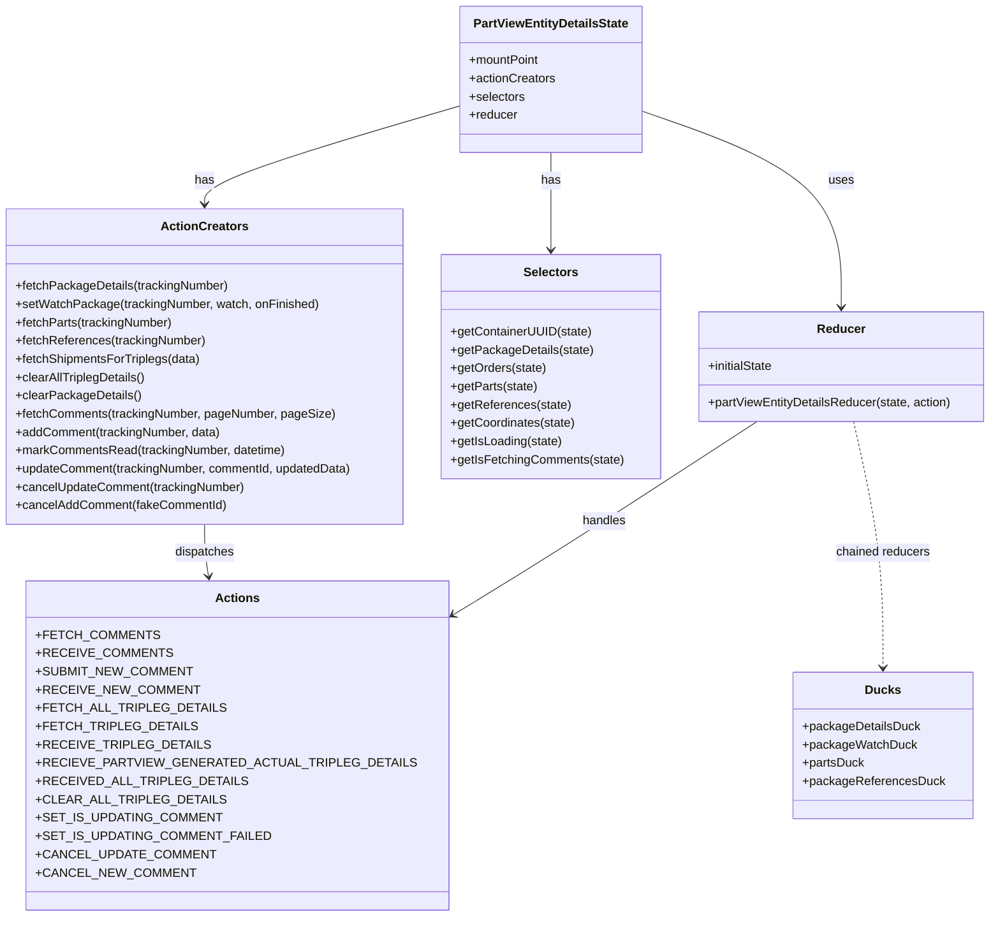

# Diagram: web/portal/src/pages/partview/redux/PartViewEntityDetailsState.js


> Auto-generated by Obscura crawlers

## Diagram 1



### SVG

<svg id="container" width="1301.84375" xmlns="http://www.w3.org/2000/svg" class="classDiagram" height="1202" viewBox="0 0 1301.84375 1202" role="graphics-document document" aria-roledescription="class"><style>#container{font-family:"trebuchet ms",verdana,arial,sans-serif;font-size:16px;fill:#333;}@keyframes edge-animation-frame{from{stroke-dashoffset:0;}}@keyframes dash{to{stroke-dashoffset:0;}}#container .edge-animation-slow{stroke-dasharray:9,5!important;stroke-dashoffset:900;animation:dash 50s linear infinite;stroke-linecap:round;}#container .edge-animation-fast{stroke-dasharray:9,5!important;stroke-dashoffset:900;animation:dash 20s linear infinite;stroke-linecap:round;}#container .error-icon{fill:#552222;}#container .error-text{fill:#552222;stroke:#552222;}#container .edge-thickness-normal{stroke-width:1px;}#container .edge-thickness-thick{stroke-width:3.5px;}#container .edge-pattern-solid{stroke-dasharray:0;}#container .edge-thickness-invisible{stroke-width:0;fill:none;}#container .edge-pattern-dashed{stroke-dasharray:3;}#container .edge-pattern-dotted{stroke-dasharray:2;}#container .marker{fill:#333333;stroke:#333333;}#container .marker.cross{stroke:#333333;}#container svg{font-family:"trebuchet ms",verdana,arial,sans-serif;font-size:16px;}#container p{margin:0;}#container g.classGroup text{fill:#9370DB;stroke:none;font-family:"trebuchet ms",verdana,arial,sans-serif;font-size:10px;}#container g.classGroup text .title{font-weight:bolder;}#container .nodeLabel,#container .edgeLabel{color:#131300;}#container .edgeLabel .label rect{fill:#ECECFF;}#container .label text{fill:#131300;}#container .labelBkg{background:#ECECFF;}#container .edgeLabel .label span{background:#ECECFF;}#container .classTitle{font-weight:bolder;}#container .node rect,#container .node circle,#container .node ellipse,#container .node polygon,#container .node path{fill:#ECECFF;stroke:#9370DB;stroke-width:1px;}#container .divider{stroke:#9370DB;stroke-width:1;}#container g.clickable{cursor:pointer;}#container g.classGroup rect{fill:#ECECFF;stroke:#9370DB;}#container g.classGroup line{stroke:#9370DB;stroke-width:1;}#container .classLabel .box{stroke:none;stroke-width:0;fill:#ECECFF;opacity:0.5;}#container .classLabel .label{fill:#9370DB;font-size:10px;}#container .relation{stroke:#333333;stroke-width:1;fill:none;}#container .dashed-line{stroke-dasharray:3;}#container .dotted-line{stroke-dasharray:1 2;}#container #compositionStart,#container .composition{fill:#333333!important;stroke:#333333!important;stroke-width:1;}#container #compositionEnd,#container .composition{fill:#333333!important;stroke:#333333!important;stroke-width:1;}#container #dependencyStart,#container .dependency{fill:#333333!important;stroke:#333333!important;stroke-width:1;}#container #dependencyStart,#container .dependency{fill:#333333!important;stroke:#333333!important;stroke-width:1;}#container #extensionStart,#container .extension{fill:transparent!important;stroke:#333333!important;stroke-width:1;}#container #extensionEnd,#container .extension{fill:transparent!important;stroke:#333333!important;stroke-width:1;}#container #aggregationStart,#container .aggregation{fill:transparent!important;stroke:#333333!important;stroke-width:1;}#container #aggregationEnd,#container .aggregation{fill:transparent!important;stroke:#333333!important;stroke-width:1;}#container #lollipopStart,#container .lollipop{fill:#ECECFF!important;stroke:#333333!important;stroke-width:1;}#container #lollipopEnd,#container .lollipop{fill:#ECECFF!important;stroke:#333333!important;stroke-width:1;}#container .edgeTerminals{font-size:11px;line-height:initial;}#container .classTitleText{text-anchor:middle;font-size:18px;fill:#333;}#container .label-icon{display:inline-block;height:1em;overflow:visible;vertical-align:-0.125em;}#container .node .label-icon path{fill:currentColor;stroke:revert;stroke-width:revert;}#container :root{--mermaid-font-family:"trebuchet ms",verdana,arial,sans-serif;}</style><g><defs><marker id="container_class-aggregationStart" class="marker aggregation class" refX="18" refY="7" markerWidth="190" markerHeight="240" orient="auto"><path d="M 18,7 L9,13 L1,7 L9,1 Z"></path></marker></defs><defs><marker id="container_class-aggregationEnd" class="marker aggregation class" refX="1" refY="7" markerWidth="20" markerHeight="28" orient="auto"><path d="M 18,7 L9,13 L1,7 L9,1 Z"></path></marker></defs><defs><marker id="container_class-extensionStart" class="marker extension class" refX="18" refY="7" markerWidth="190" markerHeight="240" orient="auto"><path d="M 1,7 L18,13 V 1 Z"></path></marker></defs><defs><marker id="container_class-extensionEnd" class="marker extension class" refX="1" refY="7" markerWidth="20" markerHeight="28" orient="auto"><path d="M 1,1 V 13 L18,7 Z"></path></marker></defs><defs><marker id="container_class-compositionStart" class="marker composition class" refX="18" refY="7" markerWidth="190" markerHeight="240" orient="auto"><path d="M 18,7 L9,13 L1,7 L9,1 Z"></path></marker></defs><defs><marker id="container_class-compositionEnd" class="marker composition class" refX="1" refY="7" markerWidth="20" markerHeight="28" orient="auto"><path d="M 18,7 L9,13 L1,7 L9,1 Z"></path></marker></defs><defs><marker id="container_class-dependencyStart" class="marker dependency class" refX="6" refY="7" markerWidth="190" markerHeight="240" orient="auto"><path d="M 5,7 L9,13 L1,7 L9,1 Z"></path></marker></defs><defs><marker id="container_class-dependencyEnd" class="marker dependency class" refX="13" refY="7" markerWidth="20" markerHeight="28" orient="auto"><path d="M 18,7 L9,13 L14,7 L9,1 Z"></path></marker></defs><defs><marker id="container_class-lollipopStart" class="marker lollipop class" refX="13" refY="7" markerWidth="190" markerHeight="240" orient="auto"><circle stroke="black" fill="transparent" cx="7" cy="7" r="6"></circle></marker></defs><defs><marker id="container_class-lollipopEnd" class="marker lollipop class" refX="1" refY="7" markerWidth="190" markerHeight="240" orient="auto"><circle stroke="black" fill="transparent" cx="7" cy="7" r="6"></circle></marker></defs><g class="root"><g class="clusters"></g><g class="edgePaths"><path d="M607.449,138.427L551.268,154.856C495.086,171.285,382.723,204.142,326.541,225.738C270.359,247.333,270.359,257.667,270.359,262.833L270.359,268" id="id_PartViewEntityDetailsState_ActionCreators_1" class="edge-thickness-normal edge-pattern-solid relation" style=";;;" data-edge="true" data-et="edge" data-id="id_PartViewEntityDetailsState_ActionCreators_1" data-points="W3sieCI6NjA3LjQ0OTIxODc1LCJ5IjoxMzguNDI3MTE3NTA4NjMxNX0seyJ4IjoyNzAuMzU5Mzc1LCJ5IjoyMzd9LHsieCI6MjcwLjM1OTM3NSwieSI6Mjc0fV0=" marker-end="url(#container_class-dependencyEnd)"></path><path d="M725.18,200L725.18,206.167C725.18,212.333,725.18,224.667,725.18,246C725.18,267.333,725.18,297.667,725.18,312.833L725.18,328" id="id_PartViewEntityDetailsState_Selectors_2" class="edge-thickness-normal edge-pattern-solid relation" style=";;;" data-edge="true" data-et="edge" data-id="id_PartViewEntityDetailsState_Selectors_2" data-points="W3sieCI6NzI1LjE3OTY4NzUsInkiOjIwMH0seyJ4Ijo3MjUuMTc5Njg3NSwieSI6MjM3fSx7IngiOjcyNS4xNzk2ODc1LCJ5IjozMzR9XQ==" marker-end="url(#container_class-dependencyEnd)"></path><path d="M842.91,145.145L886.715,160.454C930.521,175.763,1018.132,206.382,1061.937,249.357C1105.742,292.333,1105.742,347.667,1105.742,375.333L1105.742,403" id="id_PartViewEntityDetailsState_Reducer_3" class="edge-thickness-normal edge-pattern-solid relation" style=";;;" data-edge="true" data-et="edge" data-id="id_PartViewEntityDetailsState_Reducer_3" data-points="W3sieCI6ODQyLjkxMDE1NjI1LCJ5IjoxNDUuMTQ0NzU4OTkxNjI0MjZ9LHsieCI6MTEwNS43NDIxODc1LCJ5IjoyMzd9LHsieCI6MTEwNS43NDIxODc1LCJ5Ijo0MDl9XQ==" marker-end="url(#container_class-dependencyEnd)"></path><path d="M1122.173,553L1128.715,581.667C1135.258,610.333,1148.342,667.667,1154.884,721.5C1161.426,775.333,1161.426,825.667,1161.426,850.833L1161.426,876" id="id_Reducer_Ducks_4" class="edge-thickness-normal edge-pattern-dashed relation" style=";;;" data-edge="true" data-et="edge" data-id="id_Reducer_Ducks_4" data-points="W3sieCI6MTEyMi4xNzM0MTE4ODUyNDYsInkiOjU1M30seyJ4IjoxMTYxLjQyNTc4MTI1LCJ5Ijo3MjV9LHsieCI6MTE2MS40MjU3ODEyNSwieSI6ODgyfV0=" marker-end="url(#container_class-dependencyEnd)"></path><path d="M270.359,688L270.359,694.167C270.359,700.333,270.359,712.667,271.261,724.015C272.164,735.363,273.968,745.726,274.87,750.907L275.772,756.089" id="id_ActionCreators_Actions_5" class="edge-thickness-normal edge-pattern-solid relation" style=";;;" data-edge="true" data-et="edge" data-id="id_ActionCreators_Actions_5" data-points="W3sieCI6MjcwLjM1OTM3NSwieSI6Njg4fSx7IngiOjI3MC4zNTkzNzUsInkiOjcyNX0seyJ4IjoyNzYuODAxMDEyODQ1ODQ5OCwieSI6NzYyfV0=" marker-end="url(#container_class-dependencyEnd)"></path><path d="M995.486,553L951.588,581.667C907.69,610.333,819.894,667.667,747.063,713.858C674.233,760.049,616.368,795.099,587.436,812.623L558.503,830.148" id="id_Reducer_Actions_6" class="edge-thickness-normal edge-pattern-solid relation" style=";;;" data-edge="true" data-et="edge" data-id="id_Reducer_Actions_6" data-points="W3sieCI6OTk1LjQ4NjQyNDE4MDMyNzgsInkiOjU1M30seyJ4Ijo3MzIuMDk3NjU2MjUsInkiOjcyNX0seyJ4Ijo1NTMuMzcxMDkzNzUsInkiOjgzMy4yNTY1MjUzNTc5NDc4fV0=" marker-end="url(#container_class-dependencyEnd)"></path></g><g class="edgeLabels"><g class="edgeLabel" transform="translate(270.359375, 237)"><g class="label" data-id="id_PartViewEntityDetailsState_ActionCreators_1" transform="translate(-12.703125, -12)"><foreignObject width="25.40625" height="24"><div xmlns="http://www.w3.org/1999/xhtml" class="labelBkg" style="display: table-cell; white-space: nowrap; line-height: 1.5; max-width: 200px; text-align: center;"><span class="edgeLabel"><p>has</p></span></div></foreignObject></g></g><g class="edgeLabel" transform="translate(725.1796875, 237)"><g class="label" data-id="id_PartViewEntityDetailsState_Selectors_2" transform="translate(-12.703125, -12)"><foreignObject width="25.40625" height="24"><div xmlns="http://www.w3.org/1999/xhtml" class="labelBkg" style="display: table-cell; white-space: nowrap; line-height: 1.5; max-width: 200px; text-align: center;"><span class="edgeLabel"><p>has</p></span></div></foreignObject></g></g><g class="edgeLabel" transform="translate(1105.7421875, 237)"><g class="label" data-id="id_PartViewEntityDetailsState_Reducer_3" transform="translate(-16.4921875, -12)"><foreignObject width="32.984375" height="24"><div xmlns="http://www.w3.org/1999/xhtml" class="labelBkg" style="display: table-cell; white-space: nowrap; line-height: 1.5; max-width: 200px; text-align: center;"><span class="edgeLabel"><p>uses</p></span></div></foreignObject></g></g><g class="edgeLabel" transform="translate(1161.42578125, 725)"><g class="label" data-id="id_Reducer_Ducks_4" transform="translate(-62.453125, -12)"><foreignObject width="124.90625" height="24"><div xmlns="http://www.w3.org/1999/xhtml" class="labelBkg" style="display: table-cell; white-space: nowrap; line-height: 1.5; max-width: 200px; text-align: center;"><span class="edgeLabel"><p>chained reducers</p></span></div></foreignObject></g></g><g class="edgeLabel" transform="translate(270.359375, 725)"><g class="label" data-id="id_ActionCreators_Actions_5" transform="translate(-39.1796875, -12)"><foreignObject width="78.359375" height="24"><div xmlns="http://www.w3.org/1999/xhtml" class="labelBkg" style="display: table-cell; white-space: nowrap; line-height: 1.5; max-width: 200px; text-align: center;"><span class="edgeLabel"><p>dispatches</p></span></div></foreignObject></g></g><g class="edgeLabel" transform="translate(776.31428, 696.12535)"><g class="label" data-id="id_Reducer_Actions_6" transform="translate(-28.9140625, -12)"><foreignObject width="57.828125" height="24"><div xmlns="http://www.w3.org/1999/xhtml" class="labelBkg" style="display: table-cell; white-space: nowrap; line-height: 1.5; max-width: 200px; text-align: center;"><span class="edgeLabel"><p>handles</p></span></div></foreignObject></g></g></g><g class="nodes"><g class="node default" id="classId-PartViewEntityDetailsState-0" transform="translate(725.1796875, 104)"><g class="basic label-container"><path d="M-117.73046875 -96 L117.73046875 -96 L117.73046875 96 L-117.73046875 96" stroke="none" stroke-width="0" fill="#ECECFF" style=""></path><path d="M-117.73046875 -96 C-28.775194498459257 -96, 60.180079753081486 -96, 117.73046875 -96 M-117.73046875 -96 C-57.15530441366589 -96, 3.4198599226682234 -96, 117.73046875 -96 M117.73046875 -96 C117.73046875 -24.03615164383301, 117.73046875 47.92769671233398, 117.73046875 96 M117.73046875 -96 C117.73046875 -39.93027332494084, 117.73046875 16.139453350118316, 117.73046875 96 M117.73046875 96 C26.42006019432401 96, -64.89034836135198 96, -117.73046875 96 M117.73046875 96 C62.87103490645959 96, 8.011601062919183 96, -117.73046875 96 M-117.73046875 96 C-117.73046875 46.616043491678084, -117.73046875 -2.7679130166438313, -117.73046875 -96 M-117.73046875 96 C-117.73046875 34.15129386249162, -117.73046875 -27.69741227501676, -117.73046875 -96" stroke="#9370DB" stroke-width="1.3" fill="none" stroke-dasharray="0 0" style=""></path></g><g class="annotation-group text" transform="translate(0, -72)"></g><g class="label-group text" transform="translate(-98.3828125, -72)"><g class="label" style="font-weight: bolder" transform="translate(0,-12)"><foreignObject width="196.765625" height="24"><div xmlns="http://www.w3.org/1999/xhtml" style="display: table-cell; white-space: nowrap; line-height: 1.5; max-width: 242px; text-align: center;"><span class="nodeLabel markdown-node-label" style=""><p>PartViewEntityDetailsState</p></span></div></foreignObject></g></g><g class="members-group text" transform="translate(-105.73046875, -24)"><g class="label" style="" transform="translate(0,-12)"><foreignObject width="93.34375" height="24"><div xmlns="http://www.w3.org/1999/xhtml" style="display: table-cell; white-space: nowrap; line-height: 1.5; max-width: 151px; text-align: center;"><span class="nodeLabel markdown-node-label" style=""><p>+mountPoint</p></span></div></foreignObject></g><g class="label" style="" transform="translate(0,12)"><foreignObject width="113.078125" height="24"><div xmlns="http://www.w3.org/1999/xhtml" style="display: table-cell; white-space: nowrap; line-height: 1.5; max-width: 170px; text-align: center;"><span class="nodeLabel markdown-node-label" style=""><p>+actionCreators</p></span></div></foreignObject></g><g class="label" style="" transform="translate(0,36)"><foreignObject width="73.453125" height="24"><div xmlns="http://www.w3.org/1999/xhtml" style="display: table-cell; white-space: nowrap; line-height: 1.5; max-width: 131px; text-align: center;"><span class="nodeLabel markdown-node-label" style=""><p>+selectors</p></span></div></foreignObject></g><g class="label" style="" transform="translate(0,60)"><foreignObject width="63.515625" height="24"><div xmlns="http://www.w3.org/1999/xhtml" style="display: table-cell; white-space: nowrap; line-height: 1.5; max-width: 122px; text-align: center;"><span class="nodeLabel markdown-node-label" style=""><p>+reducer</p></span></div></foreignObject></g></g><g class="methods-group text" transform="translate(-105.73046875, 96)"></g><g class="divider" style=""><path d="M-117.73046875 -48 C-33.13126592649927 -48, 51.467936897001465 -48, 117.73046875 -48 M-117.73046875 -48 C-49.70543175350913 -48, 18.319605242981737 -48, 117.73046875 -48" stroke="#9370DB" stroke-width="1.3" fill="none" stroke-dasharray="0 0" style=""></path></g><g class="divider" style=""><path d="M-117.73046875 72 C-24.62311857827642 72, 68.48423159344716 72, 117.73046875 72 M-117.73046875 72 C-31.402824415533075 72, 54.92481991893385 72, 117.73046875 72" stroke="#9370DB" stroke-width="1.3" fill="none" stroke-dasharray="0 0" style=""></path></g></g><g class="node default" id="classId-Ducks-1" transform="translate(1161.42578125, 978)"><g class="basic label-container"><path d="M-113.8359375 -96 L113.8359375 -96 L113.8359375 96 L-113.8359375 96" stroke="none" stroke-width="0" fill="#ECECFF" style=""></path><path d="M-113.8359375 -96 C-40.97767660930029 -96, 31.880584281399422 -96, 113.8359375 -96 M-113.8359375 -96 C-46.48365038426333 -96, 20.868636731473345 -96, 113.8359375 -96 M113.8359375 -96 C113.8359375 -33.5950431708215, 113.8359375 28.809913658357004, 113.8359375 96 M113.8359375 -96 C113.8359375 -22.33477209623092, 113.8359375 51.33045580753816, 113.8359375 96 M113.8359375 96 C59.29912263479495 96, 4.762307769589896 96, -113.8359375 96 M113.8359375 96 C52.441324956856754 96, -8.953287586286493 96, -113.8359375 96 M-113.8359375 96 C-113.8359375 55.93599615538865, -113.8359375 15.871992310777301, -113.8359375 -96 M-113.8359375 96 C-113.8359375 40.4017095910463, -113.8359375 -15.196580817907403, -113.8359375 -96" stroke="#9370DB" stroke-width="1.3" fill="none" stroke-dasharray="0 0" style=""></path></g><g class="annotation-group text" transform="translate(0, -72)"></g><g class="label-group text" transform="translate(-21.859375, -72)"><g class="label" style="font-weight: bolder" transform="translate(0,-12)"><foreignObject width="43.71875" height="24"><div xmlns="http://www.w3.org/1999/xhtml" style="display: table-cell; white-space: nowrap; line-height: 1.5; max-width: 93px; text-align: center;"><span class="nodeLabel markdown-node-label" style=""><p>Ducks</p></span></div></foreignObject></g></g><g class="members-group text" transform="translate(-101.8359375, -24)"><g class="label" style="" transform="translate(0,-12)"><foreignObject width="152.484375" height="24"><div xmlns="http://www.w3.org/1999/xhtml" style="display: table-cell; white-space: nowrap; line-height: 1.5; max-width: 211px; text-align: center;"><span class="nodeLabel markdown-node-label" style=""><p>+packageDetailsDuck</p></span></div></foreignObject></g><g class="label" style="" transform="translate(0,12)"><foreignObject width="146.421875" height="24"><div xmlns="http://www.w3.org/1999/xhtml" style="display: table-cell; white-space: nowrap; line-height: 1.5; max-width: 205px; text-align: center;"><span class="nodeLabel markdown-node-label" style=""><p>+packageWatchDuck</p></span></div></foreignObject></g><g class="label" style="" transform="translate(0,36)"><foreignObject width="80.921875" height="24"><div xmlns="http://www.w3.org/1999/xhtml" style="display: table-cell; white-space: nowrap; line-height: 1.5; max-width: 139px; text-align: center;"><span class="nodeLabel markdown-node-label" style=""><p>+partsDuck</p></span></div></foreignObject></g><g class="label" style="" transform="translate(0,60)"><foreignObject width="181.8125" height="24"><div xmlns="http://www.w3.org/1999/xhtml" style="display: table-cell; white-space: nowrap; line-height: 1.5; max-width: 240px; text-align: center;"><span class="nodeLabel markdown-node-label" style=""><p>+packageReferencesDuck</p></span></div></foreignObject></g></g><g class="methods-group text" transform="translate(-101.8359375, 96)"></g><g class="divider" style=""><path d="M-113.8359375 -48 C-61.25744497686862 -48, -8.678952453737239 -48, 113.8359375 -48 M-113.8359375 -48 C-25.904965363918024 -48, 62.02600677216395 -48, 113.8359375 -48" stroke="#9370DB" stroke-width="1.3" fill="none" stroke-dasharray="0 0" style=""></path></g><g class="divider" style=""><path d="M-113.8359375 72 C-33.00129923854979 72, 47.83333902290042 72, 113.8359375 72 M-113.8359375 72 C-62.74835509115732 72, -11.660772682314644 72, 113.8359375 72" stroke="#9370DB" stroke-width="1.3" fill="none" stroke-dasharray="0 0" style=""></path></g></g><g class="node default" id="classId-Actions-2" transform="translate(314.40625, 978)"><g class="basic label-container"><path d="M-238.96484375 -216 L238.96484375 -216 L238.96484375 216 L-238.96484375 216" stroke="none" stroke-width="0" fill="#ECECFF" style=""></path><path d="M-238.96484375 -216 C-72.30212240364696 -216, 94.36059894270608 -216, 238.96484375 -216 M-238.96484375 -216 C-81.52477157938617 -216, 75.91530059122766 -216, 238.96484375 -216 M238.96484375 -216 C238.96484375 -49.18510225673205, 238.96484375 117.6297954865359, 238.96484375 216 M238.96484375 -216 C238.96484375 -60.64480371422596, 238.96484375 94.71039257154808, 238.96484375 216 M238.96484375 216 C113.53081313908385 216, -11.903217471832306 216, -238.96484375 216 M238.96484375 216 C49.692755995651055 216, -139.5793317586979 216, -238.96484375 216 M-238.96484375 216 C-238.96484375 49.94991011020571, -238.96484375 -116.10017977958859, -238.96484375 -216 M-238.96484375 216 C-238.96484375 59.15103494553128, -238.96484375 -97.69793010893744, -238.96484375 -216" stroke="#9370DB" stroke-width="1.3" fill="none" stroke-dasharray="0 0" style=""></path></g><g class="annotation-group text" transform="translate(0, -192)"></g><g class="label-group text" transform="translate(-27.0546875, -192)"><g class="label" style="font-weight: bolder" transform="translate(0,-12)"><foreignObject width="54.109375" height="24"><div xmlns="http://www.w3.org/1999/xhtml" style="display: table-cell; white-space: nowrap; line-height: 1.5; max-width: 103px; text-align: center;"><span class="nodeLabel markdown-node-label" style=""><p>Actions</p></span></div></foreignObject></g></g><g class="members-group text" transform="translate(-226.96484375, -144)"><g class="label" style="" transform="translate(0,-12)"><foreignObject width="140.296875" height="24"><div xmlns="http://www.w3.org/1999/xhtml" style="display: table-cell; white-space: nowrap; line-height: 1.5; max-width: 198px; text-align: center;"><span class="nodeLabel markdown-node-label" style=""><p>+FETCH_COMMENTS</p></span></div></foreignObject></g><g class="label" style="" transform="translate(0,12)"><foreignObject width="154.078125" height="24"><div xmlns="http://www.w3.org/1999/xhtml" style="display: table-cell; white-space: nowrap; line-height: 1.5; max-width: 212px; text-align: center;"><span class="nodeLabel markdown-node-label" style=""><p>+RECEIVE_COMMENTS</p></span></div></foreignObject></g><g class="label" style="" transform="translate(0,36)"><foreignObject width="181.03125" height="24"><div xmlns="http://www.w3.org/1999/xhtml" style="display: table-cell; white-space: nowrap; line-height: 1.5; max-width: 239px; text-align: center;"><span class="nodeLabel markdown-node-label" style=""><p>+SUBMIT_NEW_COMMENT</p></span></div></foreignObject></g><g class="label" style="" transform="translate(0,60)"><foreignObject width="185.734375" height="24"><div xmlns="http://www.w3.org/1999/xhtml" style="display: table-cell; white-space: nowrap; line-height: 1.5; max-width: 244px; text-align: center;"><span class="nodeLabel markdown-node-label" style=""><p>+RECEIVE_NEW_COMMENT</p></span></div></foreignObject></g><g class="label" style="" transform="translate(0,84)"><foreignObject width="216.296875" height="24"><div xmlns="http://www.w3.org/1999/xhtml" style="display: table-cell; white-space: nowrap; line-height: 1.5; max-width: 274px; text-align: center;"><span class="nodeLabel markdown-node-label" style=""><p>+FETCH_ALL_TRIPLEG_DETAILS</p></span></div></foreignObject></g><g class="label" style="" transform="translate(0,108)"><foreignObject width="182.875" height="24"><div xmlns="http://www.w3.org/1999/xhtml" style="display: table-cell; white-space: nowrap; line-height: 1.5; max-width: 241px; text-align: center;"><span class="nodeLabel markdown-node-label" style=""><p>+FETCH_TRIPLEG_DETAILS</p></span></div></foreignObject></g><g class="label" style="" transform="translate(0,132)"><foreignObject width="196.640625" height="24"><div xmlns="http://www.w3.org/1999/xhtml" style="display: table-cell; white-space: nowrap; line-height: 1.5; max-width: 254px; text-align: center;"><span class="nodeLabel markdown-node-label" style=""><p>+RECEIVE_TRIPLEG_DETAILS</p></span></div></foreignObject></g><g class="label" style="" transform="translate(0,156)"><foreignObject width="426.875" height="24"><div xmlns="http://www.w3.org/1999/xhtml" style="display: table-cell; white-space: nowrap; line-height: 1.5; max-width: 485px; text-align: center;"><span class="nodeLabel markdown-node-label" style=""><p>+RECIEVE_PARTVIEW_GENERATED_ACTUAL_TRIPLEG_DETAILS</p></span></div></foreignObject></g><g class="label" style="" transform="translate(0,180)"><foreignObject width="239.734375" height="24"><div xmlns="http://www.w3.org/1999/xhtml" style="display: table-cell; white-space: nowrap; line-height: 1.5; max-width: 297px; text-align: center;"><span class="nodeLabel markdown-node-label" style=""><p>+RECEIVED_ALL_TRIPLEG_DETAILS</p></span></div></foreignObject></g><g class="label" style="" transform="translate(0,204)"><foreignObject width="216.671875" height="24"><div xmlns="http://www.w3.org/1999/xhtml" style="display: table-cell; white-space: nowrap; line-height: 1.5; max-width: 274px; text-align: center;"><span class="nodeLabel markdown-node-label" style=""><p>+CLEAR_ALL_TRIPLEG_DETAILS</p></span></div></foreignObject></g><g class="label" style="" transform="translate(0,228)"><foreignObject width="213.578125" height="24"><div xmlns="http://www.w3.org/1999/xhtml" style="display: table-cell; white-space: nowrap; line-height: 1.5; max-width: 272px; text-align: center;"><span class="nodeLabel markdown-node-label" style=""><p>+SET_IS_UPDATING_COMMENT</p></span></div></foreignObject></g><g class="label" style="" transform="translate(0,252)"><foreignObject width="268.875" height="24"><div xmlns="http://www.w3.org/1999/xhtml" style="display: table-cell; white-space: nowrap; line-height: 1.5; max-width: 326px; text-align: center;"><span class="nodeLabel markdown-node-label" style=""><p>+SET_IS_UPDATING_COMMENT_FAILED</p></span></div></foreignObject></g><g class="label" style="" transform="translate(0,276)"><foreignObject width="205.546875" height="24"><div xmlns="http://www.w3.org/1999/xhtml" style="display: table-cell; white-space: nowrap; line-height: 1.5; max-width: 264px; text-align: center;"><span class="nodeLabel markdown-node-label" style=""><p>+CANCEL_UPDATE_COMMENT</p></span></div></foreignObject></g><g class="label" style="" transform="translate(0,300)"><foreignObject width="182.53125" height="24"><div xmlns="http://www.w3.org/1999/xhtml" style="display: table-cell; white-space: nowrap; line-height: 1.5; max-width: 241px; text-align: center;"><span class="nodeLabel markdown-node-label" style=""><p>+CANCEL_NEW_COMMENT</p></span></div></foreignObject></g></g><g class="methods-group text" transform="translate(-226.96484375, 216)"></g><g class="divider" style=""><path d="M-238.96484375 -168 C-111.16252577182472 -168, 16.639792206350563 -168, 238.96484375 -168 M-238.96484375 -168 C-99.0520123474723 -168, 40.8608190550554 -168, 238.96484375 -168" stroke="#9370DB" stroke-width="1.3" fill="none" stroke-dasharray="0 0" style=""></path></g><g class="divider" style=""><path d="M-238.96484375 192 C-66.10810176982238 192, 106.74864021035523 192, 238.96484375 192 M-238.96484375 192 C-141.29080401017583 192, -43.616764270351666 192, 238.96484375 192" stroke="#9370DB" stroke-width="1.3" fill="none" stroke-dasharray="0 0" style=""></path></g></g><g class="node default" id="classId-ActionCreators-3" transform="translate(270.359375, 481)"><g class="basic label-container"><path d="M-262.359375 -207 L262.359375 -207 L262.359375 207 L-262.359375 207" stroke="none" stroke-width="0" fill="#ECECFF" style=""></path><path d="M-262.359375 -207 C-121.00452244073702 -207, 20.35033011852596 -207, 262.359375 -207 M-262.359375 -207 C-72.82008078184327 -207, 116.71921343631345 -207, 262.359375 -207 M262.359375 -207 C262.359375 -93.42687391449944, 262.359375 20.146252171001123, 262.359375 207 M262.359375 -207 C262.359375 -56.043044103579064, 262.359375 94.91391179284187, 262.359375 207 M262.359375 207 C134.19462524859725 207, 6.029875497194496 207, -262.359375 207 M262.359375 207 C116.90506554297394 207, -28.549243914052113 207, -262.359375 207 M-262.359375 207 C-262.359375 112.45498986260793, -262.359375 17.909979725215862, -262.359375 -207 M-262.359375 207 C-262.359375 83.22805727987621, -262.359375 -40.54388544024758, -262.359375 -207" stroke="#9370DB" stroke-width="1.3" fill="none" stroke-dasharray="0 0" style=""></path></g><g class="annotation-group text" transform="translate(0, -183)"></g><g class="label-group text" transform="translate(-53.96875, -183)"><g class="label" style="font-weight: bolder" transform="translate(0,-12)"><foreignObject width="107.9375" height="24"><div xmlns="http://www.w3.org/1999/xhtml" style="display: table-cell; white-space: nowrap; line-height: 1.5; max-width: 156px; text-align: center;"><span class="nodeLabel markdown-node-label" style=""><p>ActionCreators</p></span></div></foreignObject></g></g><g class="members-group text" transform="translate(-250.359375, -135)"></g><g class="methods-group text" transform="translate(-250.359375, -105)"><g class="label" style="" transform="translate(0,-12)"><foreignObject width="279.203125" height="24"><div xmlns="http://www.w3.org/1999/xhtml" style="display: table-cell; white-space: nowrap; line-height: 1.5; max-width: 337px; text-align: center;"><span class="nodeLabel markdown-node-label" style=""><p>+fetchPackageDetails(trackingNumber)</p></span></div></foreignObject></g><g class="label" style="" transform="translate(0,12)"><foreignObject width="395.84375" height="24"><div xmlns="http://www.w3.org/1999/xhtml" style="display: table-cell; white-space: nowrap; line-height: 1.5; max-width: 453px; text-align: center;"><span class="nodeLabel markdown-node-label" style=""><p>+setWatchPackage(trackingNumber, watch, onFinished)</p></span></div></foreignObject></g><g class="label" style="" transform="translate(0,36)"><foreignObject width="207.640625" height="24"><div xmlns="http://www.w3.org/1999/xhtml" style="display: table-cell; white-space: nowrap; line-height: 1.5; max-width: 265px; text-align: center;"><span class="nodeLabel markdown-node-label" style=""><p>+fetchParts(trackingNumber)</p></span></div></foreignObject></g><g class="label" style="" transform="translate(0,60)"><foreignObject width="250.484375" height="24"><div xmlns="http://www.w3.org/1999/xhtml" style="display: table-cell; white-space: nowrap; line-height: 1.5; max-width: 308px; text-align: center;"><span class="nodeLabel markdown-node-label" style=""><p>+fetchReferences(trackingNumber)</p></span></div></foreignObject></g><g class="label" style="" transform="translate(0,84)"><foreignObject width="244.21875" height="24"><div xmlns="http://www.w3.org/1999/xhtml" style="display: table-cell; white-space: nowrap; line-height: 1.5; max-width: 302px; text-align: center;"><span class="nodeLabel markdown-node-label" style=""><p>+fetchShipmentsForTriplegs(data)</p></span></div></foreignObject></g><g class="label" style="" transform="translate(0,108)"><foreignObject width="172.296875" height="24"><div xmlns="http://www.w3.org/1999/xhtml" style="display: table-cell; white-space: nowrap; line-height: 1.5; max-width: 230px; text-align: center;"><span class="nodeLabel markdown-node-label" style=""><p>+clearAllTriplegDetails()</p></span></div></foreignObject></g><g class="label" style="" transform="translate(0,132)"><foreignObject width="162.171875" height="24"><div xmlns="http://www.w3.org/1999/xhtml" style="display: table-cell; white-space: nowrap; line-height: 1.5; max-width: 220px; text-align: center;"><span class="nodeLabel markdown-node-label" style=""><p>+clearPackageDetails()</p></span></div></foreignObject></g><g class="label" style="" transform="translate(0,156)"><foreignObject width="417.984375" height="24"><div xmlns="http://www.w3.org/1999/xhtml" style="display: table-cell; white-space: nowrap; line-height: 1.5; max-width: 475px; text-align: center;"><span class="nodeLabel markdown-node-label" style=""><p>+fetchComments(trackingNumber, pageNumber, pageSize)</p></span></div></foreignObject></g><g class="label" style="" transform="translate(0,180)"><foreignObject width="271.171875" height="24"><div xmlns="http://www.w3.org/1999/xhtml" style="display: table-cell; white-space: nowrap; line-height: 1.5; max-width: 329px; text-align: center;"><span class="nodeLabel markdown-node-label" style=""><p>+addComment(trackingNumber, data)</p></span></div></foreignObject></g><g class="label" style="" transform="translate(0,204)"><foreignObject width="356.71875" height="24"><div xmlns="http://www.w3.org/1999/xhtml" style="display: table-cell; white-space: nowrap; line-height: 1.5; max-width: 414px; text-align: center;"><span class="nodeLabel markdown-node-label" style=""><p>+markCommentsRead(trackingNumber, datetime)</p></span></div></foreignObject></g><g class="label" style="" transform="translate(0,228)"><foreignObject width="446.75" height="24"><div xmlns="http://www.w3.org/1999/xhtml" style="display: table-cell; white-space: nowrap; line-height: 1.5; max-width: 504px; text-align: center;"><span class="nodeLabel markdown-node-label" style=""><p>+updateComment(trackingNumber, commentId, updatedData)</p></span></div></foreignObject></g><g class="label" style="" transform="translate(0,252)"><foreignObject width="303.0625" height="24"><div xmlns="http://www.w3.org/1999/xhtml" style="display: table-cell; white-space: nowrap; line-height: 1.5; max-width: 360px; text-align: center;"><span class="nodeLabel markdown-node-label" style=""><p>+cancelUpdateComment(trackingNumber)</p></span></div></foreignObject></g><g class="label" style="" transform="translate(0,276)"><foreignObject width="276.296875" height="24"><div xmlns="http://www.w3.org/1999/xhtml" style="display: table-cell; white-space: nowrap; line-height: 1.5; max-width: 334px; text-align: center;"><span class="nodeLabel markdown-node-label" style=""><p>+cancelAddComment(fakeCommentId)</p></span></div></foreignObject></g></g><g class="divider" style=""><path d="M-262.359375 -159 C-101.76487629123076 -159, 58.829622417538474 -159, 262.359375 -159 M-262.359375 -159 C-107.59638812734426 -159, 47.16659874531149 -159, 262.359375 -159" stroke="#9370DB" stroke-width="1.3" fill="none" stroke-dasharray="0 0" style=""></path></g><g class="divider" style=""><path d="M-262.359375 -135 C-144.4161667496819 -135, -26.47295849936384 -135, 262.359375 -135 M-262.359375 -135 C-55.11378956057385 -135, 152.1317958788523 -135, 262.359375 -135" stroke="#9370DB" stroke-width="1.3" fill="none" stroke-dasharray="0 0" style=""></path></g></g><g class="node default" id="classId-Selectors-4" transform="translate(725.1796875, 481)"><g class="basic label-container"><path d="M-142.4609375 -147 L142.4609375 -147 L142.4609375 147 L-142.4609375 147" stroke="none" stroke-width="0" fill="#ECECFF" style=""></path><path d="M-142.4609375 -147 C-40.01502068441894 -147, 62.430896131162115 -147, 142.4609375 -147 M-142.4609375 -147 C-31.596424146193897 -147, 79.2680892076122 -147, 142.4609375 -147 M142.4609375 -147 C142.4609375 -55.56975194243667, 142.4609375 35.860496115126665, 142.4609375 147 M142.4609375 -147 C142.4609375 -47.269208515016146, 142.4609375 52.46158296996771, 142.4609375 147 M142.4609375 147 C47.08285467013637 147, -48.29522815972726 147, -142.4609375 147 M142.4609375 147 C84.95958904219103 147, 27.45824058438204 147, -142.4609375 147 M-142.4609375 147 C-142.4609375 53.88352713213821, -142.4609375 -39.232945735723575, -142.4609375 -147 M-142.4609375 147 C-142.4609375 76.51173679745007, -142.4609375 6.023473594900139, -142.4609375 -147" stroke="#9370DB" stroke-width="1.3" fill="none" stroke-dasharray="0 0" style=""></path></g><g class="annotation-group text" transform="translate(0, -123)"></g><g class="label-group text" transform="translate(-34.171875, -123)"><g class="label" style="font-weight: bolder" transform="translate(0,-12)"><foreignObject width="68.34375" height="24"><div xmlns="http://www.w3.org/1999/xhtml" style="display: table-cell; white-space: nowrap; line-height: 1.5; max-width: 117px; text-align: center;"><span class="nodeLabel markdown-node-label" style=""><p>Selectors</p></span></div></foreignObject></g></g><g class="members-group text" transform="translate(-130.4609375, -75)"></g><g class="methods-group text" transform="translate(-130.4609375, -45)"><g class="label" style="" transform="translate(0,-12)"><foreignObject width="183.734375" height="24"><div xmlns="http://www.w3.org/1999/xhtml" style="display: table-cell; white-space: nowrap; line-height: 1.5; max-width: 241px; text-align: center;"><span class="nodeLabel markdown-node-label" style=""><p>+getContainerUUID(state)</p></span></div></foreignObject></g><g class="label" style="" transform="translate(0,12)"><foreignObject width="185.125" height="24"><div xmlns="http://www.w3.org/1999/xhtml" style="display: table-cell; white-space: nowrap; line-height: 1.5; max-width: 242px; text-align: center;"><span class="nodeLabel markdown-node-label" style=""><p>+getPackageDetails(state)</p></span></div></foreignObject></g><g class="label" style="" transform="translate(0,36)"><foreignObject width="125.484375" height="24"><div xmlns="http://www.w3.org/1999/xhtml" style="display: table-cell; white-space: nowrap; line-height: 1.5; max-width: 183px; text-align: center;"><span class="nodeLabel markdown-node-label" style=""><p>+getOrders(state)</p></span></div></foreignObject></g><g class="label" style="" transform="translate(0,60)"><foreignObject width="113.5625" height="24"><div xmlns="http://www.w3.org/1999/xhtml" style="display: table-cell; white-space: nowrap; line-height: 1.5; max-width: 171px; text-align: center;"><span class="nodeLabel markdown-node-label" style=""><p>+getParts(state)</p></span></div></foreignObject></g><g class="label" style="" transform="translate(0,84)"><foreignObject width="156.40625" height="24"><div xmlns="http://www.w3.org/1999/xhtml" style="display: table-cell; white-space: nowrap; line-height: 1.5; max-width: 214px; text-align: center;"><span class="nodeLabel markdown-node-label" style=""><p>+getReferences(state)</p></span></div></foreignObject></g><g class="label" style="" transform="translate(0,108)"><foreignObject width="163.921875" height="24"><div xmlns="http://www.w3.org/1999/xhtml" style="display: table-cell; white-space: nowrap; line-height: 1.5; max-width: 221px; text-align: center;"><span class="nodeLabel markdown-node-label" style=""><p>+getCoordinates(state)</p></span></div></foreignObject></g><g class="label" style="" transform="translate(0,132)"><foreignObject width="146.4375" height="24"><div xmlns="http://www.w3.org/1999/xhtml" style="display: table-cell; white-space: nowrap; line-height: 1.5; max-width: 204px; text-align: center;"><span class="nodeLabel markdown-node-label" style=""><p>+getIsLoading(state)</p></span></div></foreignObject></g><g class="label" style="" transform="translate(0,156)"><foreignObject width="226.75" height="24"><div xmlns="http://www.w3.org/1999/xhtml" style="display: table-cell; white-space: nowrap; line-height: 1.5; max-width: 284px; text-align: center;"><span class="nodeLabel markdown-node-label" style=""><p>+getIsFetchingComments(state)</p></span></div></foreignObject></g></g><g class="divider" style=""><path d="M-142.4609375 -99 C-49.79766549995891 -99, 42.86560650008218 -99, 142.4609375 -99 M-142.4609375 -99 C-30.109229224003982 -99, 82.24247905199204 -99, 142.4609375 -99" stroke="#9370DB" stroke-width="1.3" fill="none" stroke-dasharray="0 0" style=""></path></g><g class="divider" style=""><path d="M-142.4609375 -75 C-51.21487507204749 -75, 40.03118735590502 -75, 142.4609375 -75 M-142.4609375 -75 C-49.80208182698169 -75, 42.85677384603662 -75, 142.4609375 -75" stroke="#9370DB" stroke-width="1.3" fill="none" stroke-dasharray="0 0" style=""></path></g></g><g class="node default" id="classId-Reducer-5" transform="translate(1105.7421875, 481)"><g class="basic label-container"><path d="M-188.1015625 -72 L188.1015625 -72 L188.1015625 72 L-188.1015625 72" stroke="none" stroke-width="0" fill="#ECECFF" style=""></path><path d="M-188.1015625 -72 C-71.86659778120665 -72, 44.3683669375867 -72, 188.1015625 -72 M-188.1015625 -72 C-90.65909981839397 -72, 6.783362863212062 -72, 188.1015625 -72 M188.1015625 -72 C188.1015625 -38.35403152402167, 188.1015625 -4.708063048043343, 188.1015625 72 M188.1015625 -72 C188.1015625 -34.32126415039247, 188.1015625 3.357471699215054, 188.1015625 72 M188.1015625 72 C49.169653815695284 72, -89.76225486860943 72, -188.1015625 72 M188.1015625 72 C80.14285586058813 72, -27.815850778823744 72, -188.1015625 72 M-188.1015625 72 C-188.1015625 40.196527275361476, -188.1015625 8.393054550722958, -188.1015625 -72 M-188.1015625 72 C-188.1015625 35.50502419629629, -188.1015625 -0.9899516074074199, -188.1015625 -72" stroke="#9370DB" stroke-width="1.3" fill="none" stroke-dasharray="0 0" style=""></path></g><g class="annotation-group text" transform="translate(0, -48)"></g><g class="label-group text" transform="translate(-29.90625, -48)"><g class="label" style="font-weight: bolder" transform="translate(0,-12)"><foreignObject width="59.8125" height="24"><div xmlns="http://www.w3.org/1999/xhtml" style="display: table-cell; white-space: nowrap; line-height: 1.5; max-width: 110px; text-align: center;"><span class="nodeLabel markdown-node-label" style=""><p>Reducer</p></span></div></foreignObject></g></g><g class="members-group text" transform="translate(-176.1015625, 0)"><g class="label" style="" transform="translate(0,-12)"><foreignObject width="87.25" height="24"><div xmlns="http://www.w3.org/1999/xhtml" style="display: table-cell; white-space: nowrap; line-height: 1.5; max-width: 145px; text-align: center;"><span class="nodeLabel markdown-node-label" style=""><p>+initialState</p></span></div></foreignObject></g></g><g class="methods-group text" transform="translate(-176.1015625, 48)"><g class="label" style="" transform="translate(0,-12)"><foreignObject width="322.296875" height="24"><div xmlns="http://www.w3.org/1999/xhtml" style="display: table-cell; white-space: nowrap; line-height: 1.5; max-width: 380px; text-align: center;"><span class="nodeLabel markdown-node-label" style=""><p>+partViewEntityDetailsReducer(state, action)</p></span></div></foreignObject></g></g><g class="divider" style=""><path d="M-188.1015625 -24 C-102.42420621053523 -24, -16.746849921070464 -24, 188.1015625 -24 M-188.1015625 -24 C-71.09454272714495 -24, 45.91247704571009 -24, 188.1015625 -24" stroke="#9370DB" stroke-width="1.3" fill="none" stroke-dasharray="0 0" style=""></path></g><g class="divider" style=""><path d="M-188.1015625 24 C-88.91843131770567 24, 10.264699864588664 24, 188.1015625 24 M-188.1015625 24 C-110.68212185200224 24, -33.26268120400448 24, 188.1015625 24" stroke="#9370DB" stroke-width="1.3" fill="none" stroke-dasharray="0 0" style=""></path></g></g></g></g></g></svg>

## Diagram 2

```mermaid
flowchart TD
    Start([fetchShipmentsForTriplegs(data)]) --> A{Triplegs empty?}
    A -- Yes --> Clear[dispatch CLEAR_ALL_TRIPLEG_DETAILS] --> End([done])
    A -- No --> B[dispatch FETCH_ALL_TRIPLEG_DETAILS\ncreate cancel token]
    B --> C[getFilteredTriplegsByType(triplegs,"actual")]
    C --> D[map over triplegs]
    D --> E{tripleg has shipmentId?}
    E -- No --> MapContinue[return null]
    E -- Yes --> F[dispatch FETCH_TRIPLEG_DETAILS(id)]
    F --> G[axios.get(getShipmentUrl(carrierScac, shipmentId), params:{format:DETAIL}, cancelToken)]
    G --> H{response}
    H -- success --> I[dispatch RECEIVE_TRIPLEG_DETAILS(id, data + shipmentLegSequence)]
    H -- error 404 --> J[dispatch RECIEVE_PARTVIEW_GENERATED_ACTUAL_TRIPLEG_DETAILS(id, transformedTripleg)]
    H -- other error --> K[console.error]
    I --> MapContinue
    J --> MapContinue
    K --> MapContinue
    MapContinue --> L[collect requests array]
    L --> M[axios.all(requests)]
    M --> N[.catch(console.error)]
    M --> O[.finally() -> dispatch RECEIVED_ALL_TRIPLEG_DETAILS]
    O --> End([done])
```

> SVG rendering failed for this diagram.
