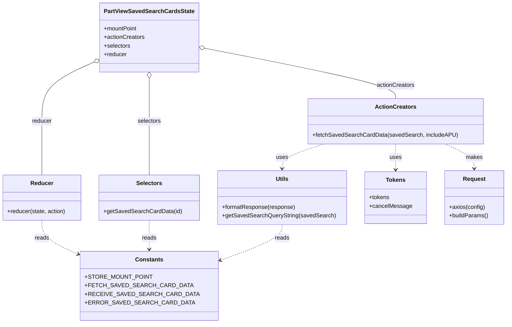

# Diagram: web/portal/src/pages/partview/redux/PartViewSavedSearchCardsState.js

> Auto-generated by Obscura crawlers

## Mermaid

### SVG

<svg id="container" width="1382.2421875" xmlns="http://www.w3.org/2000/svg" class="classDiagram" height="898" viewBox="0 0 1382.2421875 898" role="graphics-document document" aria-roledescription="class"><g><defs><marker id="container_class-aggregationStart" class="marker aggregation class" refX="18" refY="7" markerWidth="190" markerHeight="240" orient="auto"><path d="M 18,7 L9,13 L1,7 L9,1 Z"></path></marker></defs><defs><marker id="container_class-aggregationEnd" class="marker aggregation class" refX="1" refY="7" markerWidth="20" markerHeight="28" orient="auto"><path d="M 18,7 L9,13 L1,7 L9,1 Z"></path></marker></defs><defs><marker id="container_class-extensionStart" class="marker extension class" refX="18" refY="7" markerWidth="190" markerHeight="240" orient="auto"><path d="M 1,7 L18,13 V 1 Z"></path></marker></defs><defs><marker id="container_class-extensionEnd" class="marker extension class" refX="1" refY="7" markerWidth="20" markerHeight="28" orient="auto"><path d="M 1,1 V 13 L18,7 Z"></path></marker></defs><defs><marker id="container_class-compositionStart" class="marker composition class" refX="18" refY="7" markerWidth="190" markerHeight="240" orient="auto"><path d="M 18,7 L9,13 L1,7 L9,1 Z"></path></marker></defs><defs><marker id="container_class-compositionEnd" class="marker composition class" refX="1" refY="7" markerWidth="20" markerHeight="28" orient="auto"><path d="M 18,7 L9,13 L1,7 L9,1 Z"></path></marker></defs><defs><marker id="container_class-dependencyStart" class="marker dependency class" refX="6" refY="7" markerWidth="190" markerHeight="240" orient="auto"><path d="M 5,7 L9,13 L1,7 L9,1 Z"></path></marker></defs><defs><marker id="container_class-dependencyEnd" class="marker dependency class" refX="13" refY="7" markerWidth="20" markerHeight="28" orient="auto"><path d="M 18,7 L9,13 L14,7 L9,1 Z"></path></marker></defs><defs><marker id="container_class-lollipopStart" class="marker lollipop class" refX="13" refY="7" markerWidth="190" markerHeight="240" orient="auto"><circle stroke="black" fill="transparent" cx="7" cy="7" r="6"></circle></marker></defs><defs><marker id="container_class-lollipopEnd" class="marker lollipop class" refX="1" refY="7" markerWidth="190" markerHeight="240" orient="auto"><circle stroke="black" fill="transparent" cx="7" cy="7" r="6"></circle></marker></defs><g class="root"><g class="clusters"></g><g class="edgePaths"><path d="M558.59,133.42L645.356,150.683C732.123,167.946,905.655,202.473,992.421,225.903C1079.188,249.333,1079.188,261.667,1079.188,267.833L1079.188,274" id="id_PartViewSavedSearchCardsState_ActionCreators_1" class="edge-thickness-normal edge-pattern-solid relation" style=";;;" data-edge="true" data-et="edge" data-id="id_PartViewSavedSearchCardsState_ActionCreators_1" data-points="W3sieCI6NTQxLjY3MTg3NSwieSI6MTMwLjA1MzQ2OTM3MzQ0NDEzfSx7IngiOjEwNzkuMTg3NSwieSI6MjM3fSx7IngiOjEwNzkuMTg3NSwieSI6Mjc0fV0=" marker-start="url(#container_class-aggregationStart)"></path><path d="M410.727,217.25L410.727,220.542C410.727,223.833,410.727,230.417,410.727,250.375C410.727,270.333,410.727,303.667,410.727,337C410.727,370.333,410.727,403.667,410.727,428.5C410.727,453.333,410.727,469.667,410.727,477.833L410.727,486" id="id_PartViewSavedSearchCardsState_Selectors_2" class="edge-thickness-normal edge-pattern-solid relation" style=";;;" data-edge="true" data-et="edge" data-id="id_PartViewSavedSearchCardsState_Selectors_2" data-points="W3sieCI6NDEwLjcyNjU2MjUsInkiOjIwMH0seyJ4Ijo0MTAuNzI2NTYyNSwieSI6MjM3fSx7IngiOjQxMC43MjY1NjI1LCJ5IjozMzd9LHsieCI6NDEwLjcyNjU2MjUsInkiOjQzN30seyJ4Ijo0MTAuNzI2NTYyNSwieSI6NDg2fV0=" marker-start="url(#container_class-aggregationStart)"></path><path d="M264.063,170.314L239.482,181.428C214.902,192.543,165.74,214.771,141.159,242.552C116.578,270.333,116.578,303.667,116.578,337C116.578,370.333,116.578,403.667,116.578,428.5C116.578,453.333,116.578,469.667,116.578,477.833L116.578,486" id="id_PartViewSavedSearchCardsState_Reducer_3" class="edge-thickness-normal edge-pattern-solid relation" style=";;;" data-edge="true" data-et="edge" data-id="id_PartViewSavedSearchCardsState_Reducer_3" data-points="W3sieCI6Mjc5Ljc4MTI1LCJ5IjoxNjMuMjA3MjcyMDUxMjA3MTZ9LHsieCI6MTE2LjU3ODEyNSwieSI6MjM3fSx7IngiOjExNi41NzgxMjUsInkiOjMzN30seyJ4IjoxMTYuNTc4MTI1LCJ5Ijo0Mzd9LHsieCI6MTE2LjU3ODEyNSwieSI6NDg2fV0=" marker-start="url(#container_class-aggregationStart)"></path><path d="M885.31,400L866.332,406.167C847.355,412.333,809.4,424.667,790.423,436C771.445,447.333,771.445,457.667,771.445,462.833L771.445,468" id="id_ActionCreators_Utils_4" class="edge-thickness-normal edge-pattern-dashed relation" style=";;;" data-edge="true" data-et="edge" data-id="id_ActionCreators_Utils_4" data-points="W3sieCI6ODg1LjMwOTkyMTg3NSwieSI6NDAwfSx7IngiOjc3MS40NDUzMTI1LCJ5Ijo0Mzd9LHsieCI6NzcxLjQ0NTMxMjUsInkiOjQ3NH1d" marker-end="url(#container_class-dependencyEnd)"></path><path d="M1079.188,400L1079.188,406.167C1079.188,412.333,1079.188,424.667,1079.188,436.5C1079.188,448.333,1079.188,459.667,1079.188,465.333L1079.188,471" id="id_ActionCreators_Tokens_5" class="edge-thickness-normal edge-pattern-dashed relation" style=";;;" data-edge="true" data-et="edge" data-id="id_ActionCreators_Tokens_5" data-points="W3sieCI6MTA3OS4xODc1LCJ5Ijo0MDB9LHsieCI6MTA3OS4xODc1LCJ5Ijo0Mzd9LHsieCI6MTA3OS4xODc1LCJ5Ijo0Nzd9XQ==" marker-end="url(#container_class-dependencyEnd)"></path><path d="M1213.897,400L1227.083,406.167C1240.268,412.333,1266.64,424.667,1279.826,436C1293.012,447.333,1293.012,457.667,1293.012,462.833L1293.012,468" id="id_ActionCreators_Request_6" class="edge-thickness-normal edge-pattern-dashed relation" style=";;;" data-edge="true" data-et="edge" data-id="id_ActionCreators_Request_6" data-points="W3sieCI6MTIxMy44OTY3NTc4MTI1LCJ5Ijo0MDB9LHsieCI6MTI5My4wMTE3MTg3NSwieSI6NDM3fSx7IngiOjEyOTMuMDExNzE4NzUsInkiOjQ3NH1d" marker-end="url(#container_class-dependencyEnd)"></path><path d="M116.578,612L116.578,620.167C116.578,628.333,116.578,644.667,137.073,662.1C157.567,679.533,198.556,698.066,219.05,707.333L239.545,716.6" id="id_Reducer_Constants_7" class="edge-thickness-normal edge-pattern-dashed relation" style=";;;" data-edge="true" data-et="edge" data-id="id_Reducer_Constants_7" data-points="W3sieCI6MTE2LjU3ODEyNSwieSI6NjEyfSx7IngiOjExNi41NzgxMjUsInkiOjY2MX0seyJ4IjoyNDUuMDExNzE4NzUsInkiOjcxOS4wNzE1OTE3MjM5OTEzfV0=" marker-end="url(#container_class-dependencyEnd)"></path><path d="M410.727,612L410.727,620.167C410.727,628.333,410.727,644.667,410.727,658C410.727,671.333,410.727,681.667,410.727,686.833L410.727,692" id="id_Selectors_Constants_8" class="edge-thickness-normal edge-pattern-dashed relation" style=";;;" data-edge="true" data-et="edge" data-id="id_Selectors_Constants_8" data-points="W3sieCI6NDEwLjcyNjU2MjUsInkiOjYxMn0seyJ4Ijo0MTAuNzI2NTYyNSwieSI6NjYxfSx7IngiOjQxMC43MjY1NjI1LCJ5Ijo2OTh9XQ==" marker-end="url(#container_class-dependencyEnd)"></path><path d="M771.445,624L771.445,630.167C771.445,636.333,771.445,648.667,739.883,666.471C708.321,684.275,645.196,707.549,613.633,719.187L582.071,730.824" id="id_Utils_Constants_9" class="edge-thickness-normal edge-pattern-dashed relation" style=";;;" data-edge="true" data-et="edge" data-id="id_Utils_Constants_9" data-points="W3sieCI6NzcxLjQ0NTMxMjUsInkiOjYyNH0seyJ4Ijo3NzEuNDQ1MzEyNSwieSI6NjYxfSx7IngiOjU3Ni40NDE0MDYyNSwieSI6NzMyLjg5OTU2MDMzOTU5OTd9XQ==" marker-end="url(#container_class-dependencyEnd)"></path></g><g class="edgeLabels"><g class="edgeLabel" transform="translate(1079.1875, 237)"><g class="label" data-id="id_PartViewSavedSearchCardsState_ActionCreators_1" transform="translate(-52.671875, -12)"><foreignObject width="105.34375" height="24">

actionCreators

</foreignObject></g></g><g class="edgeLabel" transform="translate(410.7265625, 337)"><g class="label" data-id="id_PartViewSavedSearchCardsState_Selectors_2" transform="translate(-32.734375, -12)"><foreignObject width="65.46875" height="24">

selectors

</foreignObject></g></g><g class="edgeLabel" transform="translate(116.578125, 337)"><g class="label" data-id="id_PartViewSavedSearchCardsState_Reducer_3" transform="translate(-27.765625, -12)"><foreignObject width="55.53125" height="24">

reducer

</foreignObject></g></g><g class="edgeLabel" transform="translate(771.4453125, 437)"><g class="label" data-id="id_ActionCreators_Utils_4" transform="translate(-16.4921875, -12)"><foreignObject width="32.984375" height="24">

uses

</foreignObject></g></g><g class="edgeLabel" transform="translate(1079.1875, 437)"><g class="label" data-id="id_ActionCreators_Tokens_5" transform="translate(-16.4921875, -12)"><foreignObject width="32.984375" height="24">

uses

</foreignObject></g></g><g class="edgeLabel" transform="translate(1293.01171875, 437)"><g class="label" data-id="id_ActionCreators_Request_6" transform="translate(-23.328125, -12)"><foreignObject width="46.65625" height="24">

makes

</foreignObject></g></g><g class="edgeLabel" transform="translate(116.578125, 661)"><g class="label" data-id="id_Reducer_Constants_7" transform="translate(-20.0078125, -12)"><foreignObject width="40.015625" height="24">

reads

</foreignObject></g></g><g class="edgeLabel" transform="translate(410.7265625, 661)"><g class="label" data-id="id_Selectors_Constants_8" transform="translate(-20.0078125, -12)"><foreignObject width="40.015625" height="24">

reads

</foreignObject></g></g><g class="edgeLabel" transform="translate(771.4453125, 661)"><g class="label" data-id="id_Utils_Constants_9" transform="translate(-20.0078125, -12)"><foreignObject width="40.015625" height="24">

reads

</foreignObject></g></g></g><g class="nodes"><g class="node default" id="classId-PartViewSavedSearchCardsState-0" transform="translate(410.7265625, 104)"><g class="basic label-container"><path d="M-130.9453125 -96 L130.9453125 -96 L130.9453125 96 L-130.9453125 96" stroke="none" stroke-width="0" fill="#ECECFF" style=""></path><path d="M-130.9453125 -96 C-38.66636619534329 -96, 53.61258010931343 -96, 130.9453125 -96 M-130.9453125 -96 C-61.85714822209199 -96, 7.2310160558160135 -96, 130.9453125 -96 M130.9453125 -96 C130.9453125 -30.78051038864818, 130.9453125 34.43897922270364, 130.9453125 96 M130.9453125 -96 C130.9453125 -27.30351578294092, 130.9453125 41.39296843411816, 130.9453125 96 M130.9453125 96 C76.32387925544106 96, 21.7024460108821 96, -130.9453125 96 M130.9453125 96 C33.49686654386038 96, -63.951579412279244 96, -130.9453125 96 M-130.9453125 96 C-130.9453125 44.56391679384708, -130.9453125 -6.872166412305845, -130.9453125 -96 M-130.9453125 96 C-130.9453125 38.21345154915012, -130.9453125 -19.573096901699756, -130.9453125 -96" stroke="#9370DB" stroke-width="1.3" fill="none" stroke-dasharray="0 0" style=""></path></g><g class="annotation-group text" transform="translate(0, -72)"></g><g class="label-group text" transform="translate(-118.9453125, -72)"><g class="label" style="font-weight: bolder" transform="translate(0,-12)"><foreignObject width="237.890625" height="24">

PartViewSavedSearchCardsState

</foreignObject></g></g><g class="members-group text" transform="translate(-118.9453125, -24)"><g class="label" style="" transform="translate(0,-12)"><foreignObject width="93.34375" height="24">

+mountPoint

</foreignObject></g><g class="label" style="" transform="translate(0,12)"><foreignObject width="113.078125" height="24">

+actionCreators

</foreignObject></g><g class="label" style="" transform="translate(0,36)"><foreignObject width="73.453125" height="24">

+selectors

</foreignObject></g><g class="label" style="" transform="translate(0,60)"><foreignObject width="63.515625" height="24">

+reducer

</foreignObject></g></g><g class="methods-group text" transform="translate(-118.9453125, 96)"></g><g class="divider" style=""><path d="M-130.9453125 -48 C-68.22159002317534 -48, -5.497867546350662 -48, 130.9453125 -48 M-130.9453125 -48 C-54.27526259712596 -48, 22.394787305748082 -48, 130.9453125 -48" stroke="#9370DB" stroke-width="1.3" fill="none" stroke-dasharray="0 0" style=""></path></g><g class="divider" style=""><path d="M-130.9453125 72 C-41.842225737147174 72, 47.26086102570565 72, 130.9453125 72 M-130.9453125 72 C-36.84556940279522 72, 57.25417369440956 72, 130.9453125 72" stroke="#9370DB" stroke-width="1.3" fill="none" stroke-dasharray="0 0" style=""></path></g></g><g class="node default" id="classId-ActionCreators-1" transform="translate(1079.1875, 337)"><g class="basic label-container"><path d="M-236.0390625 -63 L236.0390625 -63 L236.0390625 63 L-236.0390625 63" stroke="none" stroke-width="0" fill="#ECECFF" style=""></path><path d="M-236.0390625 -63 C-69.7385182612841 -63, 96.5620259774318 -63, 236.0390625 -63 M-236.0390625 -63 C-103.5327141678577 -63, 28.97363416428459 -63, 236.0390625 -63 M236.0390625 -63 C236.0390625 -17.86117465430881, 236.0390625 27.277650691382377, 236.0390625 63 M236.0390625 -63 C236.0390625 -27.761650322754136, 236.0390625 7.476699354491728, 236.0390625 63 M236.0390625 63 C139.9728376198488 63, 43.90661273969758 63, -236.0390625 63 M236.0390625 63 C68.8587563520633 63, -98.32154979587341 63, -236.0390625 63 M-236.0390625 63 C-236.0390625 27.22332334308259, -236.0390625 -8.553353313834819, -236.0390625 -63 M-236.0390625 63 C-236.0390625 28.381355177933408, -236.0390625 -6.237289644133185, -236.0390625 -63" stroke="#9370DB" stroke-width="1.3" fill="none" stroke-dasharray="0 0" style=""></path></g><g class="annotation-group text" transform="translate(0, -39)"></g><g class="label-group text" transform="translate(-53.96875, -39)"><g class="label" style="font-weight: bolder" transform="translate(0,-12)"><foreignObject width="107.9375" height="24">

ActionCreators

</foreignObject></g></g><g class="members-group text" transform="translate(-224.0390625, 9)"></g><g class="methods-group text" transform="translate(-224.0390625, 39)"><g class="label" style="" transform="translate(0,-12)"><foreignObject width="394.109375" height="24">

+fetchSavedSearchCardData(savedSearch, includeAPU)

</foreignObject></g></g><g class="divider" style=""><path d="M-236.0390625 -15 C-134.2929993655352 -15, -32.54693623107036 -15, 236.0390625 -15 M-236.0390625 -15 C-94.12500369331113 -15, 47.78905511337774 -15, 236.0390625 -15" stroke="#9370DB" stroke-width="1.3" fill="none" stroke-dasharray="0 0" style=""></path></g><g class="divider" style=""><path d="M-236.0390625 9 C-110.36910842793733 9, 15.300845644125332 9, 236.0390625 9 M-236.0390625 9 C-121.38086964455701 9, -6.7226767891140184 9, 236.0390625 9" stroke="#9370DB" stroke-width="1.3" fill="none" stroke-dasharray="0 0" style=""></path></g></g><g class="node default" id="classId-Selectors-2" transform="translate(410.7265625, 549)"><g class="basic label-container"><path d="M-135.5703125 -63 L135.5703125 -63 L135.5703125 63 L-135.5703125 63" stroke="none" stroke-width="0" fill="#ECECFF" style=""></path><path d="M-135.5703125 -63 C-43.35406242651737 -63, 48.86218764696525 -63, 135.5703125 -63 M-135.5703125 -63 C-73.48601076679766 -63, -11.401709033595324 -63, 135.5703125 -63 M135.5703125 -63 C135.5703125 -21.392974037599195, 135.5703125 20.21405192480161, 135.5703125 63 M135.5703125 -63 C135.5703125 -30.544549296374065, 135.5703125 1.9109014072518704, 135.5703125 63 M135.5703125 63 C41.77959041164513 63, -52.01113167670974 63, -135.5703125 63 M135.5703125 63 C81.06381857804021 63, 26.557324656080425 63, -135.5703125 63 M-135.5703125 63 C-135.5703125 35.21404530400018, -135.5703125 7.42809060800036, -135.5703125 -63 M-135.5703125 63 C-135.5703125 18.68870633434217, -135.5703125 -25.622587331315657, -135.5703125 -63" stroke="#9370DB" stroke-width="1.3" fill="none" stroke-dasharray="0 0" style=""></path></g><g class="annotation-group text" transform="translate(0, -39)"></g><g class="label-group text" transform="translate(-34.171875, -39)"><g class="label" style="font-weight: bolder" transform="translate(0,-12)"><foreignObject width="68.34375" height="24">

Selectors

</foreignObject></g></g><g class="members-group text" transform="translate(-123.5703125, 9)"></g><g class="methods-group text" transform="translate(-123.5703125, 39)"><g class="label" style="" transform="translate(0,-12)"><foreignObject width="212.96875" height="24">

+getSavedSearchCardData(id)

</foreignObject></g></g><g class="divider" style=""><path d="M-135.5703125 -15 C-79.58739753386931 -15, -23.6044825677386 -15, 135.5703125 -15 M-135.5703125 -15 C-32.88209165132449 -15, 69.80612919735103 -15, 135.5703125 -15" stroke="#9370DB" stroke-width="1.3" fill="none" stroke-dasharray="0 0" style=""></path></g><g class="divider" style=""><path d="M-135.5703125 9 C-57.69107579633334 9, 20.188160907333327 9, 135.5703125 9 M-135.5703125 9 C-65.73943937277483 9, 4.09143375445035 9, 135.5703125 9" stroke="#9370DB" stroke-width="1.3" fill="none" stroke-dasharray="0 0" style=""></path></g></g><g class="node default" id="classId-Reducer-3" transform="translate(116.578125, 549)"><g class="basic label-container"><path d="M-108.578125 -63 L108.578125 -63 L108.578125 63 L-108.578125 63" stroke="none" stroke-width="0" fill="#ECECFF" style=""></path><path d="M-108.578125 -63 C-46.262141831529206 -63, 16.053841336941588 -63, 108.578125 -63 M-108.578125 -63 C-41.14763628045981 -63, 26.282852439080386 -63, 108.578125 -63 M108.578125 -63 C108.578125 -37.665634035644985, 108.578125 -12.33126807128997, 108.578125 63 M108.578125 -63 C108.578125 -13.324192033190094, 108.578125 36.35161593361981, 108.578125 63 M108.578125 63 C58.83422858837728 63, 9.090332176754558 63, -108.578125 63 M108.578125 63 C53.60055276509464 63, -1.377019469810719 63, -108.578125 63 M-108.578125 63 C-108.578125 20.335246280345032, -108.578125 -22.329507439309936, -108.578125 -63 M-108.578125 63 C-108.578125 13.397519040935094, -108.578125 -36.20496191812981, -108.578125 -63" stroke="#9370DB" stroke-width="1.3" fill="none" stroke-dasharray="0 0" style=""></path></g><g class="annotation-group text" transform="translate(0, -39)"></g><g class="label-group text" transform="translate(-29.90625, -39)"><g class="label" style="font-weight: bolder" transform="translate(0,-12)"><foreignObject width="59.8125" height="24">

Reducer

</foreignObject></g></g><g class="members-group text" transform="translate(-96.578125, 9)"></g><g class="methods-group text" transform="translate(-96.578125, 39)"><g class="label" style="" transform="translate(0,-12)"><foreignObject width="163.25" height="24">

+reducer(state, action)

</foreignObject></g></g><g class="divider" style=""><path d="M-108.578125 -15 C-58.70905921695646 -15, -8.839993433912923 -15, 108.578125 -15 M-108.578125 -15 C-33.76494649486784 -15, 41.048232010264314 -15, 108.578125 -15" stroke="#9370DB" stroke-width="1.3" fill="none" stroke-dasharray="0 0" style=""></path></g><g class="divider" style=""><path d="M-108.578125 9 C-60.28668924644609 9, -11.995253492892175 9, 108.578125 9 M-108.578125 9 C-29.522213465225747 9, 49.53369806954851 9, 108.578125 9" stroke="#9370DB" stroke-width="1.3" fill="none" stroke-dasharray="0 0" style=""></path></g></g><g class="node default" id="classId-Constants-4" transform="translate(410.7265625, 794)"><g class="basic label-container"><path d="M-165.71484375 -96 L165.71484375 -96 L165.71484375 96 L-165.71484375 96" stroke="none" stroke-width="0" fill="#ECECFF" style=""></path><path d="M-165.71484375 -96 C-77.17757360836266 -96, 11.359696533274672 -96, 165.71484375 -96 M-165.71484375 -96 C-71.79062584228937 -96, 22.133592065421254 -96, 165.71484375 -96 M165.71484375 -96 C165.71484375 -27.633453113818973, 165.71484375 40.733093772362054, 165.71484375 96 M165.71484375 -96 C165.71484375 -57.376181095782506, 165.71484375 -18.752362191565012, 165.71484375 96 M165.71484375 96 C88.35001536871125 96, 10.985186987422509 96, -165.71484375 96 M165.71484375 96 C75.14026991528182 96, -15.43430391943636 96, -165.71484375 96 M-165.71484375 96 C-165.71484375 29.03007862169308, -165.71484375 -37.93984275661384, -165.71484375 -96 M-165.71484375 96 C-165.71484375 30.412478572604414, -165.71484375 -35.17504285479117, -165.71484375 -96" stroke="#9370DB" stroke-width="1.3" fill="none" stroke-dasharray="0 0" style=""></path></g><g class="annotation-group text" transform="translate(0, -72)"></g><g class="label-group text" transform="translate(-36.5390625, -72)"><g class="label" style="font-weight: bolder" transform="translate(0,-12)"><foreignObject width="73.078125" height="24">

Constants

</foreignObject></g></g><g class="members-group text" transform="translate(-153.71484375, -24)"><g class="label" style="" transform="translate(0,-12)"><foreignObject width="166.03125" height="24">

+STORE_MOUNT_POINT

</foreignObject></g><g class="label" style="" transform="translate(0,12)"><foreignObject width="257.109375" height="24">

+FETCH_SAVED_SEARCH_CARD_DATA

</foreignObject></g><g class="label" style="" transform="translate(0,36)"><foreignObject width="270.890625" height="24">

+RECEIVE_SAVED_SEARCH_CARD_DATA

</foreignObject></g><g class="label" style="" transform="translate(0,60)"><foreignObject width="261.671875" height="24">

+ERROR_SAVED_SEARCH_CARD_DATA

</foreignObject></g></g><g class="methods-group text" transform="translate(-153.71484375, 96)"></g><g class="divider" style=""><path d="M-165.71484375 -48 C-94.39733845360085 -48, -23.079833157201705 -48, 165.71484375 -48 M-165.71484375 -48 C-57.130263365216194 -48, 51.45431701956761 -48, 165.71484375 -48" stroke="#9370DB" stroke-width="1.3" fill="none" stroke-dasharray="0 0" style=""></path></g><g class="divider" style=""><path d="M-165.71484375 72 C-95.04986763675335 72, -24.384891523506695 72, 165.71484375 72 M-165.71484375 72 C-56.206984299504285 72, 53.30087515099143 72, 165.71484375 72" stroke="#9370DB" stroke-width="1.3" fill="none" stroke-dasharray="0 0" style=""></path></g></g><g class="node default" id="classId-Utils-5" transform="translate(771.4453125, 549)"><g class="basic label-container"><path d="M-175.1484375 -75 L175.1484375 -75 L175.1484375 75 L-175.1484375 75" stroke="none" stroke-width="0" fill="#ECECFF" style=""></path><path d="M-175.1484375 -75 C-69.40682823657392 -75, 36.33478102685217 -75, 175.1484375 -75 M-175.1484375 -75 C-94.10284802003571 -75, -13.057258540071416 -75, 175.1484375 -75 M175.1484375 -75 C175.1484375 -37.963817507122414, 175.1484375 -0.927635014244828, 175.1484375 75 M175.1484375 -75 C175.1484375 -39.01710452598941, 175.1484375 -3.03420905197882, 175.1484375 75 M175.1484375 75 C89.77666233507851 75, 4.404887170157025 75, -175.1484375 75 M175.1484375 75 C87.08122590441671 75, -0.9859856911665759 75, -175.1484375 75 M-175.1484375 75 C-175.1484375 23.337330970732864, -175.1484375 -28.32533805853427, -175.1484375 -75 M-175.1484375 75 C-175.1484375 29.88218185795852, -175.1484375 -15.235636284082958, -175.1484375 -75" stroke="#9370DB" stroke-width="1.3" fill="none" stroke-dasharray="0 0" style=""></path></g><g class="annotation-group text" transform="translate(0, -51)"></g><g class="label-group text" transform="translate(-16.796875, -51)"><g class="label" style="font-weight: bolder" transform="translate(0,-12)"><foreignObject width="33.59375" height="24">

Utils

</foreignObject></g></g><g class="members-group text" transform="translate(-163.1484375, -3)"></g><g class="methods-group text" transform="translate(-163.1484375, 27)"><g class="label" style="" transform="translate(0,-12)"><foreignObject width="203.390625" height="24">

+formatResponse(response)

</foreignObject></g><g class="label" style="" transform="translate(0,12)"><foreignObject width="309.5" height="24">

+getSavedSearchQueryString(savedSearch)

</foreignObject></g></g><g class="divider" style=""><path d="M-175.1484375 -27 C-77.34654110031332 -27, 20.455355299373366 -27, 175.1484375 -27 M-175.1484375 -27 C-81.8107499743687 -27, 11.526937551262591 -27, 175.1484375 -27" stroke="#9370DB" stroke-width="1.3" fill="none" stroke-dasharray="0 0" style=""></path></g><g class="divider" style=""><path d="M-175.1484375 -3 C-91.09648956392866 -3, -7.044541627857313 -3, 175.1484375 -3 M-175.1484375 -3 C-57.75923377504628 -3, 59.629969949907434 -3, 175.1484375 -3" stroke="#9370DB" stroke-width="1.3" fill="none" stroke-dasharray="0 0" style=""></path></g></g><g class="node default" id="classId-Tokens-6" transform="translate(1079.1875, 549)"><g class="basic label-container"><path d="M-82.59375 -72 L82.59375 -72 L82.59375 72 L-82.59375 72" stroke="none" stroke-width="0" fill="#ECECFF" style=""></path><path d="M-82.59375 -72 C-17.299072785035165 -72, 47.99560442992967 -72, 82.59375 -72 M-82.59375 -72 C-31.5353783455325 -72, 19.522993308935 -72, 82.59375 -72 M82.59375 -72 C82.59375 -26.65751143491122, 82.59375 18.684977130177558, 82.59375 72 M82.59375 -72 C82.59375 -25.691500612209396, 82.59375 20.61699877558121, 82.59375 72 M82.59375 72 C37.01537161435552 72, -8.563006771288954 72, -82.59375 72 M82.59375 72 C38.98910321402259 72, -4.615543571954817 72, -82.59375 72 M-82.59375 72 C-82.59375 14.533285050146446, -82.59375 -42.93342989970711, -82.59375 -72 M-82.59375 72 C-82.59375 14.490257367997877, -82.59375 -43.019485264004246, -82.59375 -72" stroke="#9370DB" stroke-width="1.3" fill="none" stroke-dasharray="0 0" style=""></path></g><g class="annotation-group text" transform="translate(0, -48)"></g><g class="label-group text" transform="translate(-25.765625, -48)"><g class="label" style="font-weight: bolder" transform="translate(0,-12)"><foreignObject width="51.53125" height="24">

Tokens

</foreignObject></g></g><g class="members-group text" transform="translate(-70.59375, 0)"><g class="label" style="" transform="translate(0,-12)"><foreignObject width="56.40625" height="24">

+tokens

</foreignObject></g><g class="label" style="" transform="translate(0,12)"><foreignObject width="115.421875" height="24">

+cancelMessage

</foreignObject></g></g><g class="methods-group text" transform="translate(-70.59375, 72)"></g><g class="divider" style=""><path d="M-82.59375 -24 C-30.974643330261628 -24, 20.644463339476744 -24, 82.59375 -24 M-82.59375 -24 C-18.157905773005524 -24, 46.27793845398895 -24, 82.59375 -24" stroke="#9370DB" stroke-width="1.3" fill="none" stroke-dasharray="0 0" style=""></path></g><g class="divider" style=""><path d="M-82.59375 48 C-38.56356468771705 48, 5.4666206245659055 48, 82.59375 48 M-82.59375 48 C-38.39291368265497 48, 5.807922634690058 48, 82.59375 48" stroke="#9370DB" stroke-width="1.3" fill="none" stroke-dasharray="0 0" style=""></path></g></g><g class="node default" id="classId-Request-7" transform="translate(1293.01171875, 549)"><g class="basic label-container"><path d="M-81.23046875 -75 L81.23046875 -75 L81.23046875 75 L-81.23046875 75" stroke="none" stroke-width="0" fill="#ECECFF" style=""></path><path d="M-81.23046875 -75 C-42.788587144336105 -75, -4.346705538672211 -75, 81.23046875 -75 M-81.23046875 -75 C-30.28056343775293 -75, 20.669341874494137 -75, 81.23046875 -75 M81.23046875 -75 C81.23046875 -18.509203694872802, 81.23046875 37.981592610254395, 81.23046875 75 M81.23046875 -75 C81.23046875 -26.01580095767242, 81.23046875 22.968398084655163, 81.23046875 75 M81.23046875 75 C30.923241182245626 75, -19.38398638550875 75, -81.23046875 75 M81.23046875 75 C48.11449376985152 75, 14.998518789703041 75, -81.23046875 75 M-81.23046875 75 C-81.23046875 17.041674859671858, -81.23046875 -40.916650280656285, -81.23046875 -75 M-81.23046875 75 C-81.23046875 16.82659791248644, -81.23046875 -41.34680417502712, -81.23046875 -75" stroke="#9370DB" stroke-width="1.3" fill="none" stroke-dasharray="0 0" style=""></path></g><g class="annotation-group text" transform="translate(0, -51)"></g><g class="label-group text" transform="translate(-29.9765625, -51)"><g class="label" style="font-weight: bolder" transform="translate(0,-12)"><foreignObject width="59.953125" height="24">

Request

</foreignObject></g></g><g class="members-group text" transform="translate(-69.23046875, -3)"></g><g class="methods-group text" transform="translate(-69.23046875, 27)"><g class="label" style="" transform="translate(0,-12)"><foreignObject width="99.484375" height="24">

+axios(config)

</foreignObject></g><g class="label" style="" transform="translate(0,12)"><foreignObject width="108.484375" height="24">

+buildParams()

</foreignObject></g></g><g class="divider" style=""><path d="M-81.23046875 -27 C-40.189522438628195 -27, 0.8514238727436094 -27, 81.23046875 -27 M-81.23046875 -27 C-46.05560057966823 -27, -10.88073240933646 -27, 81.23046875 -27" stroke="#9370DB" stroke-width="1.3" fill="none" stroke-dasharray="0 0" style=""></path></g><g class="divider" style=""><path d="M-81.23046875 -3 C-41.29989295366975 -3, -1.3693171573394949 -3, 81.23046875 -3 M-81.23046875 -3 C-47.49569003689666 -3, -13.760911323793323 -3, 81.23046875 -3" stroke="#9370DB" stroke-width="1.3" fill="none" stroke-dasharray="0 0" style=""></path></g></g></g></g></g></svg>
