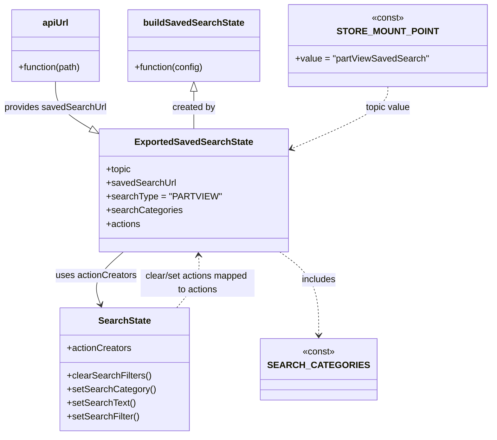

# Diagram: web/portal/src/pages/partview/redux/PartViewSavedSearchState.js

> Auto-generated by Obscura crawlers

## Mermaid

### SVG

<svg id="container" width="851.12890625" xmlns="http://www.w3.org/2000/svg" class="classDiagram" height="764" viewBox="0 0 851.12890625 764" role="graphics-document document" aria-roledescription="class"><g><defs><marker id="container_class-aggregationStart" class="marker aggregation class" refX="18" refY="7" markerWidth="190" markerHeight="240" orient="auto"><path d="M 18,7 L9,13 L1,7 L9,1 Z"></path></marker></defs><defs><marker id="container_class-aggregationEnd" class="marker aggregation class" refX="1" refY="7" markerWidth="20" markerHeight="28" orient="auto"><path d="M 18,7 L9,13 L1,7 L9,1 Z"></path></marker></defs><defs><marker id="container_class-extensionStart" class="marker extension class" refX="18" refY="7" markerWidth="190" markerHeight="240" orient="auto"><path d="M 1,7 L18,13 V 1 Z"></path></marker></defs><defs><marker id="container_class-extensionEnd" class="marker extension class" refX="1" refY="7" markerWidth="20" markerHeight="28" orient="auto"><path d="M 1,1 V 13 L18,7 Z"></path></marker></defs><defs><marker id="container_class-compositionStart" class="marker composition class" refX="18" refY="7" markerWidth="190" markerHeight="240" orient="auto"><path d="M 18,7 L9,13 L1,7 L9,1 Z"></path></marker></defs><defs><marker id="container_class-compositionEnd" class="marker composition class" refX="1" refY="7" markerWidth="20" markerHeight="28" orient="auto"><path d="M 18,7 L9,13 L1,7 L9,1 Z"></path></marker></defs><defs><marker id="container_class-dependencyStart" class="marker dependency class" refX="6" refY="7" markerWidth="190" markerHeight="240" orient="auto"><path d="M 5,7 L9,13 L1,7 L9,1 Z"></path></marker></defs><defs><marker id="container_class-dependencyEnd" class="marker dependency class" refX="13" refY="7" markerWidth="20" markerHeight="28" orient="auto"><path d="M 18,7 L9,13 L14,7 L9,1 Z"></path></marker></defs><defs><marker id="container_class-lollipopStart" class="marker lollipop class" refX="13" refY="7" markerWidth="190" markerHeight="240" orient="auto"><circle stroke="black" fill="transparent" cx="7" cy="7" r="6"></circle></marker></defs><defs><marker id="container_class-lollipopEnd" class="marker lollipop class" refX="1" refY="7" markerWidth="190" markerHeight="240" orient="auto"><circle stroke="black" fill="transparent" cx="7" cy="7" r="6"></circle></marker></defs><g class="root"><g class="clusters"></g><g class="edgePaths"><path d="M97.453,143L97.453,150.667C97.453,158.333,97.453,173.667,109.755,188.621C122.057,203.576,146.661,218.153,158.963,225.441L171.264,232.729" id="id_apiUrl_ExportedSavedSearchState_1" class="edge-thickness-normal edge-pattern-solid relation" style=";;;" data-edge="true" data-et="edge" data-id="id_apiUrl_ExportedSavedSearchState_1" data-points="W3sieCI6OTcuNDUzMTI1LCJ5IjoxNDN9LHsieCI6OTcuNDUzMTI1LCJ5IjoxODl9LHsieCI6MTg2LjEwNTQ2ODc1LCJ5IjoyNDEuNTIxMzA2ODE4MTgxOH1d" marker-end="url(#container_class-extensionEnd)"></path><path d="M342.203,160.25L342.203,165.042C342.203,169.833,342.203,179.417,342.203,190.375C342.203,201.333,342.203,213.667,342.203,219.833L342.203,226" id="id_buildSavedSearchState_ExportedSavedSearchState_2" class="edge-thickness-normal edge-pattern-solid relation" style=";;;" data-edge="true" data-et="edge" data-id="id_buildSavedSearchState_ExportedSavedSearchState_2" data-points="W3sieCI6MzQyLjIwMzEyNSwieSI6MTQzfSx7IngiOjM0Mi4yMDMxMjUsInkiOjE4OX0seyJ4IjozNDIuMjAzMTI1LCJ5IjoyMjZ9XQ==" marker-start="url(#container_class-extensionStart)"></path><path d="M221.476,442L212.347,450.167C203.218,458.333,184.959,474.667,178.192,490.05C171.424,505.433,176.146,519.865,178.508,527.081L180.869,534.298" id="id_ExportedSavedSearchState_SearchState_3" class="edge-thickness-normal edge-pattern-solid relation" style=";;;" data-edge="true" data-et="edge" data-id="id_ExportedSavedSearchState_SearchState_3" data-points="W3sieCI6MjIxLjQ3NTY2Njc5OTM2MzA3LCJ5Ijo0NDJ9LHsieCI6MTY2LjcwMTE3MTg3NSwieSI6NDkxfSx7IngiOjE4Mi43MzQ3OTc5Njk3NDUyMiwieSI6NTQwfV0=" marker-end="url(#container_class-dependencyEnd)"></path><path d="M490.256,442L501.451,450.167C512.646,458.333,535.037,474.667,546.232,499C557.428,523.333,557.428,555.667,557.428,571.833L557.428,588" id="id_ExportedSavedSearchState_SEARCH_CATEGORIES_4" class="edge-thickness-normal edge-pattern-dashed relation" style=";;;" data-edge="true" data-et="edge" data-id="id_ExportedSavedSearchState_SEARCH_CATEGORIES_4" data-points="W3sieCI6NDkwLjI1NTcyMjUzMTg0NzE0LCJ5Ijo0NDJ9LHsieCI6NTU3LjQyNzczNDM3NSwieSI6NDkxfSx7IngiOjU1Ny40Mjc3MzQzNzUsInkiOjU5NH1d" marker-end="url(#container_class-dependencyEnd)"></path><path d="M675.48,152L675.48,158.167C675.48,164.333,675.48,176.667,646.867,195.282C618.255,213.897,561.029,238.795,532.416,251.244L503.803,263.692" id="id_STORE_MOUNT_POINT_ExportedSavedSearchState_5" class="edge-thickness-normal edge-pattern-dashed relation" style=";;;" data-edge="true" data-et="edge" data-id="id_STORE_MOUNT_POINT_ExportedSavedSearchState_5" data-points="W3sieCI6Njc1LjQ4MDQ2ODc1LCJ5IjoxNTJ9LHsieCI6Njc1LjQ4MDQ2ODc1LCJ5IjoxODl9LHsieCI6NDk4LjMwMDc4MTI1LCJ5IjoyNjYuMDg2MTEyMTIwMzk1Mn1d" marker-end="url(#container_class-dependencyEnd)"></path><path d="M314.311,540L321.589,531.833C328.866,523.667,343.42,507.333,349.977,491.995C356.534,476.657,355.093,462.313,354.372,455.142L353.652,447.97" id="id_SearchState_ExportedSavedSearchState_6" class="edge-thickness-normal edge-pattern-dashed relation" style=";;;" data-edge="true" data-et="edge" data-id="id_SearchState_ExportedSavedSearchState_6" data-points="W3sieCI6MzE0LjMxMTQzMDEzNTM1MDMsInkiOjU0MH0seyJ4IjozNTcuOTc0NjA5Mzc1LCJ5Ijo0OTF9LHsieCI6MzUzLjA1MjI5ODk2NDk2ODE0LCJ5Ijo0NDJ9XQ==" marker-end="url(#container_class-dependencyEnd)"></path></g><g class="edgeLabels"><g class="edgeLabel" transform="translate(97.453125, 189)"><g class="label" data-id="id_apiUrl_ExportedSavedSearchState_1" transform="translate(-89.453125, -12)"><foreignObject width="178.90625" height="24">

provides savedSearchUrl

</foreignObject></g></g><g class="edgeLabel" transform="translate(342.203125, 189)"><g class="label" data-id="id_buildSavedSearchState_ExportedSavedSearchState_2" transform="translate(-37.9921875, -12)"><foreignObject width="75.984375" height="24">

created by

</foreignObject></g></g><g class="edgeLabel" transform="translate(174.87586, 483.68711)"><g class="label" data-id="id_ExportedSavedSearchState_SearchState_3" transform="translate(-71.2734375, -12)"><foreignObject width="142.546875" height="24">

uses actionCreators

</foreignObject></g></g><g class="edgeLabel" transform="translate(557.427734375, 491)"><g class="label" data-id="id_ExportedSavedSearchState_SEARCH_CATEGORIES_4" transform="translate(-30.6484375, -12)"><foreignObject width="61.296875" height="24">

includes

</foreignObject></g></g><g class="edgeLabel" transform="translate(675.48046875, 189)"><g class="label" data-id="id_STORE_MOUNT_POINT_ExportedSavedSearchState_5" transform="translate(-39.8359375, -12)"><foreignObject width="79.671875" height="24">

topic value

</foreignObject></g></g><g class="edgeLabel" transform="translate(352.5244, 497.11637)"><g class="label" data-id="id_SearchState_ExportedSavedSearchState_6" transform="translate(-100, -24)"><foreignObject width="200" height="48">

clear/set actions mapped to actions

</foreignObject></g></g></g><g class="nodes"><g class="node default" id="classId-apiUrl-0" transform="translate(97.453125, 80)"><g class="basic label-container"><path d="M-79.12109375 -63 L79.12109375 -63 L79.12109375 63 L-79.12109375 63" stroke="none" stroke-width="0" fill="#ECECFF" style=""></path><path d="M-79.12109375 -63 C-38.65021278196922 -63, 1.8206681860615532 -63, 79.12109375 -63 M-79.12109375 -63 C-21.778046445343776 -63, 35.56500085931245 -63, 79.12109375 -63 M79.12109375 -63 C79.12109375 -26.208526269891408, 79.12109375 10.582947460217184, 79.12109375 63 M79.12109375 -63 C79.12109375 -20.243740210085953, 79.12109375 22.512519579828094, 79.12109375 63 M79.12109375 63 C20.211949812615686 63, -38.69719412476863 63, -79.12109375 63 M79.12109375 63 C19.984305720074147 63, -39.152482309851706 63, -79.12109375 63 M-79.12109375 63 C-79.12109375 35.46778156811076, -79.12109375 7.935563136221518, -79.12109375 -63 M-79.12109375 63 C-79.12109375 19.713501660137986, -79.12109375 -23.572996679724028, -79.12109375 -63" stroke="#9370DB" stroke-width="1.3" fill="none" stroke-dasharray="0 0" style=""></path></g><g class="annotation-group text" transform="translate(0, -39)"></g><g class="label-group text" transform="translate(-22.2109375, -39)"><g class="label" style="font-weight: bolder" transform="translate(0,-12)"><foreignObject width="44.421875" height="24">

apiUrl

</foreignObject></g></g><g class="members-group text" transform="translate(-67.12109375, 9)"></g><g class="methods-group text" transform="translate(-67.12109375, 39)"><g class="label" style="" transform="translate(0,-12)"><foreignObject width="112.03125" height="24">

+function(path)

</foreignObject></g></g><g class="divider" style=""><path d="M-79.12109375 -15 C-39.54852040629598 -15, 0.024052937408043817 -15, 79.12109375 -15 M-79.12109375 -15 C-41.18167006279382 -15, -3.2422463755876407 -15, 79.12109375 -15" stroke="#9370DB" stroke-width="1.3" fill="none" stroke-dasharray="0 0" style=""></path></g><g class="divider" style=""><path d="M-79.12109375 9 C-46.86223246044339 9, -14.603371170886774 9, 79.12109375 9 M-79.12109375 9 C-41.31531612063089 9, -3.509538491261779 9, 79.12109375 9" stroke="#9370DB" stroke-width="1.3" fill="none" stroke-dasharray="0 0" style=""></path></g></g><g class="node default" id="classId-buildSavedSearchState-1" transform="translate(342.203125, 80)"><g class="basic label-container"><path d="M-115.62890625 -63 L115.62890625 -63 L115.62890625 63 L-115.62890625 63" stroke="none" stroke-width="0" fill="#ECECFF" style=""></path><path d="M-115.62890625 -63 C-55.03184891137977 -63, 5.565208427240464 -63, 115.62890625 -63 M-115.62890625 -63 C-26.02472142655415 -63, 63.5794633968917 -63, 115.62890625 -63 M115.62890625 -63 C115.62890625 -16.31020975234273, 115.62890625 30.379580495314542, 115.62890625 63 M115.62890625 -63 C115.62890625 -34.727785717358785, 115.62890625 -6.455571434717562, 115.62890625 63 M115.62890625 63 C46.63981053695575 63, -22.3492851760885 63, -115.62890625 63 M115.62890625 63 C33.626074971954324 63, -48.37675630609135 63, -115.62890625 63 M-115.62890625 63 C-115.62890625 30.781667521655507, -115.62890625 -1.4366649566889862, -115.62890625 -63 M-115.62890625 63 C-115.62890625 25.203260024457073, -115.62890625 -12.593479951085854, -115.62890625 -63" stroke="#9370DB" stroke-width="1.3" fill="none" stroke-dasharray="0 0" style=""></path></g><g class="annotation-group text" transform="translate(0, -39)"></g><g class="label-group text" transform="translate(-84.8671875, -39)"><g class="label" style="font-weight: bolder" transform="translate(0,-12)"><foreignObject width="169.734375" height="24">

buildSavedSearchState

</foreignObject></g></g><g class="members-group text" transform="translate(-103.62890625, 9)"></g><g class="methods-group text" transform="translate(-103.62890625, 39)"><g class="label" style="" transform="translate(0,-12)"><foreignObject width="122.390625" height="24">

+function(config)

</foreignObject></g></g><g class="divider" style=""><path d="M-115.62890625 -15 C-63.939711214185984 -15, -12.250516178371967 -15, 115.62890625 -15 M-115.62890625 -15 C-37.1915628060089 -15, 41.24578063798219 -15, 115.62890625 -15" stroke="#9370DB" stroke-width="1.3" fill="none" stroke-dasharray="0 0" style=""></path></g><g class="divider" style=""><path d="M-115.62890625 9 C-36.4280663107551 9, 42.7727736284898 9, 115.62890625 9 M-115.62890625 9 C-31.64461170619566 9, 52.33968283760868 9, 115.62890625 9" stroke="#9370DB" stroke-width="1.3" fill="none" stroke-dasharray="0 0" style=""></path></g></g><g class="node default" id="classId-SearchState-2" transform="translate(218.07421875, 648)"><g class="basic label-container"><path d="M-110.140625 -108 L110.140625 -108 L110.140625 108 L-110.140625 108" stroke="none" stroke-width="0" fill="#ECECFF" style=""></path><path d="M-110.140625 -108 C-38.16729884953136 -108, 33.806027300937274 -108, 110.140625 -108 M-110.140625 -108 C-23.009344972501992 -108, 64.12193505499602 -108, 110.140625 -108 M110.140625 -108 C110.140625 -42.31433707444481, 110.140625 23.371325851110385, 110.140625 108 M110.140625 -108 C110.140625 -52.3185290070733, 110.140625 3.3629419858533964, 110.140625 108 M110.140625 108 C40.110543715795416 108, -29.91953756840917 108, -110.140625 108 M110.140625 108 C48.09325345297103 108, -13.954118094057947 108, -110.140625 108 M-110.140625 108 C-110.140625 43.121125858584264, -110.140625 -21.75774828283147, -110.140625 -108 M-110.140625 108 C-110.140625 34.736480382167485, -110.140625 -38.52703923566503, -110.140625 -108" stroke="#9370DB" stroke-width="1.3" fill="none" stroke-dasharray="0 0" style=""></path></g><g class="annotation-group text" transform="translate(0, -84)"></g><g class="label-group text" transform="translate(-44.03125, -84)"><g class="label" style="font-weight: bolder" transform="translate(0,-12)"><foreignObject width="88.0625" height="24">

SearchState

</foreignObject></g></g><g class="members-group text" transform="translate(-98.140625, -36)"><g class="label" style="" transform="translate(0,-12)"><foreignObject width="113.078125" height="24">

+actionCreators

</foreignObject></g></g><g class="methods-group text" transform="translate(-98.140625, 12)"><g class="label" style="" transform="translate(0,-12)"><foreignObject width="146.921875" height="24">

+clearSearchFilters()

</foreignObject></g><g class="label" style="" transform="translate(0,12)"><foreignObject width="152.25" height="24">

+setSearchCategory()

</foreignObject></g><g class="label" style="" transform="translate(0,36)"><foreignObject width="118.53125" height="24">

+setSearchText()

</foreignObject></g><g class="label" style="" transform="translate(0,60)"><foreignObject width="125.953125" height="24">

+setSearchFilter()

</foreignObject></g></g><g class="divider" style=""><path d="M-110.140625 -60 C-57.592985890035344 -60, -5.0453467800706875 -60, 110.140625 -60 M-110.140625 -60 C-64.7985219854105 -60, -19.456418970821005 -60, 110.140625 -60" stroke="#9370DB" stroke-width="1.3" fill="none" stroke-dasharray="0 0" style=""></path></g><g class="divider" style=""><path d="M-110.140625 -12 C-45.548492803459695 -12, 19.04363939308061 -12, 110.140625 -12 M-110.140625 -12 C-65.00145987817925 -12, -19.86229475635851 -12, 110.140625 -12" stroke="#9370DB" stroke-width="1.3" fill="none" stroke-dasharray="0 0" style=""></path></g></g><g class="node default" id="classId-SEARCH_CATEGORIES-3" transform="translate(557.427734375, 648)"><g class="basic label-container"><path d="M-88.1171875 -54 L88.1171875 -54 L88.1171875 54 L-88.1171875 54" stroke="none" stroke-width="0" fill="#ECECFF" style=""></path><path d="M-88.1171875 -54 C-24.9115553410945 -54, 38.294076817811 -54, 88.1171875 -54 M-88.1171875 -54 C-31.487305470651513 -54, 25.142576558696973 -54, 88.1171875 -54 M88.1171875 -54 C88.1171875 -19.792946002752856, 88.1171875 14.414107994494287, 88.1171875 54 M88.1171875 -54 C88.1171875 -28.19525666066116, 88.1171875 -2.3905133213223166, 88.1171875 54 M88.1171875 54 C46.320349122470944 54, 4.523510744941888 54, -88.1171875 54 M88.1171875 54 C32.053445305636835 54, -24.01029688872633 54, -88.1171875 54 M-88.1171875 54 C-88.1171875 27.379451894036897, -88.1171875 0.7589037880737948, -88.1171875 -54 M-88.1171875 54 C-88.1171875 18.99826539603668, -88.1171875 -16.003469207926642, -88.1171875 -54" stroke="#9370DB" stroke-width="1.3" fill="none" stroke-dasharray="0 0" style=""></path></g><g class="annotation-group text" transform="translate(-28.6171875, -30)"><g class="label" style="" transform="translate(0,-12)"><foreignObject width="57.234375" height="24">

«const»

</foreignObject></g></g><g class="label-group text" transform="translate(-76.1171875, -6)"><g class="label" style="font-weight: bolder" transform="translate(0,-12)"><foreignObject width="152.234375" height="24">

SEARCH_CATEGORIES

</foreignObject></g></g><g class="members-group text" transform="translate(-76.1171875, 42)"></g><g class="methods-group text" transform="translate(-76.1171875, 72)"></g><g class="divider" style=""><path d="M-88.1171875 18 C-24.361886460575448 18, 39.393414578849104 18, 88.1171875 18 M-88.1171875 18 C-25.617189035232634 18, 36.88280942953473 18, 88.1171875 18" stroke="#9370DB" stroke-width="1.3" fill="none" stroke-dasharray="0 0" style=""></path></g><g class="divider" style=""><path d="M-88.1171875 36 C-29.301274355855675 36, 29.51463878828865 36, 88.1171875 36 M-88.1171875 36 C-42.41623512518204 36, 3.284717249635918 36, 88.1171875 36" stroke="#9370DB" stroke-width="1.3" fill="none" stroke-dasharray="0 0" style=""></path></g></g><g class="node default" id="classId-STORE_MOUNT_POINT-4" transform="translate(675.48046875, 80)"><g class="basic label-container"><path d="M-167.6484375 -72 L167.6484375 -72 L167.6484375 72 L-167.6484375 72" stroke="none" stroke-width="0" fill="#ECECFF" style=""></path><path d="M-167.6484375 -72 C-50.26369957751227 -72, 67.12103834497546 -72, 167.6484375 -72 M-167.6484375 -72 C-46.50074718615846 -72, 74.64694312768307 -72, 167.6484375 -72 M167.6484375 -72 C167.6484375 -14.801659628547107, 167.6484375 42.39668074290579, 167.6484375 72 M167.6484375 -72 C167.6484375 -22.395354986926066, 167.6484375 27.20929002614787, 167.6484375 72 M167.6484375 72 C53.47477282863821 72, -60.69889184272358 72, -167.6484375 72 M167.6484375 72 C61.55355432228373 72, -44.54132885543254 72, -167.6484375 72 M-167.6484375 72 C-167.6484375 30.10905952677704, -167.6484375 -11.781880946445924, -167.6484375 -72 M-167.6484375 72 C-167.6484375 41.73036908653036, -167.6484375 11.460738173060719, -167.6484375 -72" stroke="#9370DB" stroke-width="1.3" fill="none" stroke-dasharray="0 0" style=""></path></g><g class="annotation-group text" transform="translate(-28.6171875, -48)"><g class="label" style="" transform="translate(0,-12)"><foreignObject width="57.234375" height="24">

«const»

</foreignObject></g></g><g class="label-group text" transform="translate(-79.90625, -24)"><g class="label" style="font-weight: bolder" transform="translate(0,-12)"><foreignObject width="159.8125" height="24">

STORE_MOUNT_POINT

</foreignObject></g></g><g class="members-group text" transform="translate(-155.6484375, 24)"><g class="label" style="" transform="translate(0,-12)"><foreignObject width="231.390625" height="24">

+value = "partViewSavedSearch"

</foreignObject></g></g><g class="methods-group text" transform="translate(-155.6484375, 72)"></g><g class="divider" style=""><path d="M-167.6484375 0 C-59.35573117799446 0, 48.936975144011086 0, 167.6484375 0 M-167.6484375 0 C-52.815774236080415 0, 62.01688902783917 0, 167.6484375 0" stroke="#9370DB" stroke-width="1.3" fill="none" stroke-dasharray="0 0" style=""></path></g><g class="divider" style=""><path d="M-167.6484375 48 C-44.298287641921675 48, 79.05186221615665 48, 167.6484375 48 M-167.6484375 48 C-46.22936402414069 48, 75.18970945171861 48, 167.6484375 48" stroke="#9370DB" stroke-width="1.3" fill="none" stroke-dasharray="0 0" style=""></path></g></g><g class="node default" id="classId-ExportedSavedSearchState-5" transform="translate(342.203125, 334)"><g class="basic label-container"><path d="M-156.09765625 -108 L156.09765625 -108 L156.09765625 108 L-156.09765625 108" stroke="none" stroke-width="0" fill="#ECECFF" style=""></path><path d="M-156.09765625 -108 C-82.52996169262664 -108, -8.962267135253285 -108, 156.09765625 -108 M-156.09765625 -108 C-38.90756550834112 -108, 78.28252523331776 -108, 156.09765625 -108 M156.09765625 -108 C156.09765625 -24.349854590549782, 156.09765625 59.300290818900436, 156.09765625 108 M156.09765625 -108 C156.09765625 -55.693620178589555, 156.09765625 -3.3872403571791097, 156.09765625 108 M156.09765625 108 C54.17443052327934 108, -47.74879520344132 108, -156.09765625 108 M156.09765625 108 C64.82788008017897 108, -26.441896089642057 108, -156.09765625 108 M-156.09765625 108 C-156.09765625 43.199920791708394, -156.09765625 -21.600158416583213, -156.09765625 -108 M-156.09765625 108 C-156.09765625 60.312191892877124, -156.09765625 12.624383785754247, -156.09765625 -108" stroke="#9370DB" stroke-width="1.3" fill="none" stroke-dasharray="0 0" style=""></path></g><g class="annotation-group text" transform="translate(0, -84)"></g><g class="label-group text" transform="translate(-99.2421875, -84)"><g class="label" style="font-weight: bolder" transform="translate(0,-12)"><foreignObject width="198.484375" height="24">

ExportedSavedSearchState

</foreignObject></g></g><g class="members-group text" transform="translate(-144.09765625, -36)"><g class="label" style="" transform="translate(0,-12)"><foreignObject width="44.453125" height="24">

+topic

</foreignObject></g><g class="label" style="" transform="translate(0,12)"><foreignObject width="120.03125" height="24">

+savedSearchUrl

</foreignObject></g><g class="label" style="" transform="translate(0,36)"><foreignObject width="188.953125" height="24">

+searchType = "PARTVIEW"

</foreignObject></g><g class="label" style="" transform="translate(0,60)"><foreignObject width="131.5" height="24">

+searchCategories

</foreignObject></g><g class="label" style="" transform="translate(0,84)"><foreignObject width="60.578125" height="24">

+actions

</foreignObject></g></g><g class="methods-group text" transform="translate(-144.09765625, 108)"></g><g class="divider" style=""><path d="M-156.09765625 -60 C-68.91860903502872 -60, 18.260438179942554 -60, 156.09765625 -60 M-156.09765625 -60 C-50.30324578773215 -60, 55.491164674535696 -60, 156.09765625 -60" stroke="#9370DB" stroke-width="1.3" fill="none" stroke-dasharray="0 0" style=""></path></g><g class="divider" style=""><path d="M-156.09765625 84 C-75.67567793194397 84, 4.746300386112068 84, 156.09765625 84 M-156.09765625 84 C-49.01024673677925 84, 58.0771627764415 84, 156.09765625 84" stroke="#9370DB" stroke-width="1.3" fill="none" stroke-dasharray="0 0" style=""></path></g></g></g></g></g></svg>
