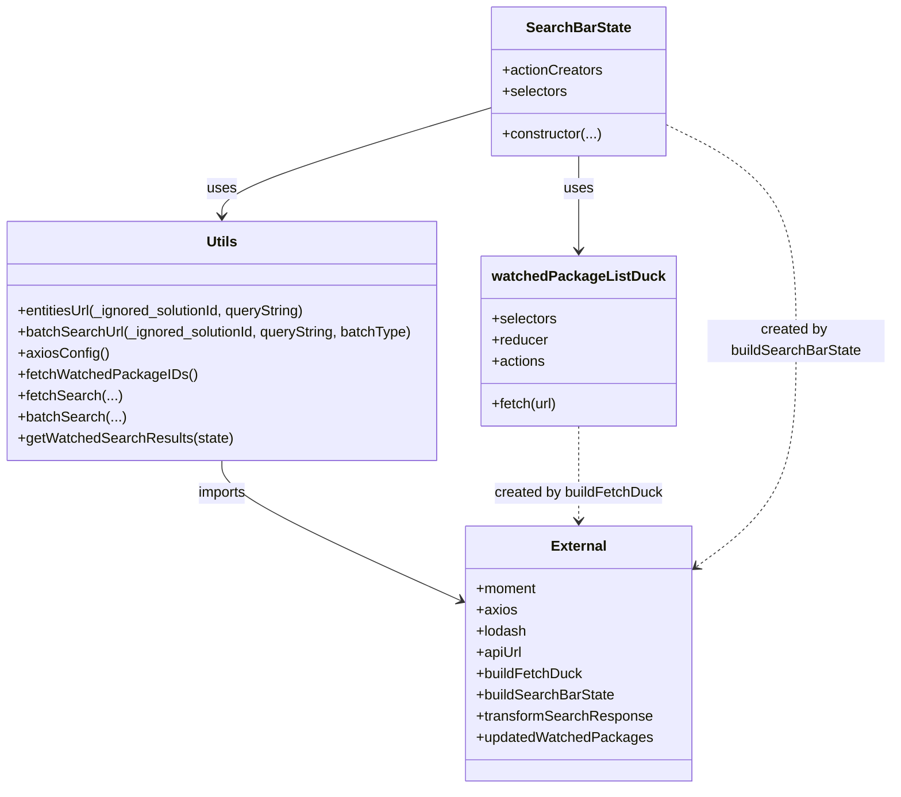

# Diagram: web/portal/src/pages/partview/redux/PartViewSearchBarState.js


> Auto-generated by Obscura crawlers

## Diagram 1

```mermaid
flowchart LR
  subgraph Init
    A[imports: moment, axios, lodash, apiUrl, buildFetchDuck, buildSearchBarState]
  end
  A --> B[STORE_MOUNT_POINT = "partViewSearch"]
  B --> C[watchedPackageListDuck = buildFetchDuck(...)]
  B --> D[SearchBarState = buildSearchBarState(...)]

  subgraph API_URLS
    E[entitiesUrl(_ignored_solutionId, queryString)] -->|returns| Eurl[apiUrl(partViewOpenSearchUrl?status=active&query)]
    F[batchSearchUrl(_ignored_solutionId, queryString, batchType)] -->|returns| Furl[apiUrl(partViewOpenSearchUrl?status=active&query&batchType)]
  end

  G[axiosConfig()] -->|returns headers| H["{ x-time-zone, Accept }"]

  subgraph FetchFlows
    fetchWatched[fetchWatchedPackageIDs()] -->|dispatch| watchedPackageListDuck.fetch
    fetchSearch[fetchSearch(queryString,...)] --> checkBatch{state[STORE_MOUNT_POINT].searchFilters.batch?}
    checkBatch -- yes --> batchSearchCall[batchSearch(...)]
    checkBatch -- no --> normalFetch[dispatch duck.fetch(entitiesUrl, axiosConfig, transformSearchResponse)]
    normalFetch --> fetchWatched
    normalFetch --> dispatchPartview[dispatch({type: \"PARTVIEW_SEARCH\"})]
  end

  subgraph BatchFlow
    batchSearchCall --> buildUrl[Furl]
    buildUrl --> prepareData[data = { batch_list }]
    prepareData --> config[axiosConfig()]
    config --> axiosPost[axios.post(url,data,config)]
    axiosPost -->|then| dispatchReceive[dispatch({type: duck.actions.RECEIVE, payload: transformSearchResponse(response.data)})]
    axiosPost -->|then| dispatchPartview2[dispatch({type: \"PARTVIEW_SEARCH\"})]
    axiosPost -->|catch| dispatchError[dispatch({type: duck.actions.REQUEST_ERROR, err})]
  end

  D --> SearchBarStateExport[SearchBarState.actionCreators.exportSearch = _.partial(exportEntities,...)]
  D --> SearchBarStateSelectors[SearchBarState.selectors += getWatchedSearchResults]
  getWatched[getWatchedSearchResults(state)] --> readDuck[watchedPackageListDuck.selectors.getData(state)?.data?.userWatchedContainerIds]
  getWatched --> updated[updatedWatchedPackages(searchWatchedPackage, duckState)]
```

> SVG rendering failed for this diagram.

## Diagram 2



### SVG

<svg id="container" width="1000.515625" xmlns="http://www.w3.org/2000/svg" class="classDiagram" height="890" viewBox="0 0 1000.515625 890" role="graphics-document document" aria-roledescription="class"><style>#container{font-family:"trebuchet ms",verdana,arial,sans-serif;font-size:16px;fill:#333;}@keyframes edge-animation-frame{from{stroke-dashoffset:0;}}@keyframes dash{to{stroke-dashoffset:0;}}#container .edge-animation-slow{stroke-dasharray:9,5!important;stroke-dashoffset:900;animation:dash 50s linear infinite;stroke-linecap:round;}#container .edge-animation-fast{stroke-dasharray:9,5!important;stroke-dashoffset:900;animation:dash 20s linear infinite;stroke-linecap:round;}#container .error-icon{fill:#552222;}#container .error-text{fill:#552222;stroke:#552222;}#container .edge-thickness-normal{stroke-width:1px;}#container .edge-thickness-thick{stroke-width:3.5px;}#container .edge-pattern-solid{stroke-dasharray:0;}#container .edge-thickness-invisible{stroke-width:0;fill:none;}#container .edge-pattern-dashed{stroke-dasharray:3;}#container .edge-pattern-dotted{stroke-dasharray:2;}#container .marker{fill:#333333;stroke:#333333;}#container .marker.cross{stroke:#333333;}#container svg{font-family:"trebuchet ms",verdana,arial,sans-serif;font-size:16px;}#container p{margin:0;}#container g.classGroup text{fill:#9370DB;stroke:none;font-family:"trebuchet ms",verdana,arial,sans-serif;font-size:10px;}#container g.classGroup text .title{font-weight:bolder;}#container .nodeLabel,#container .edgeLabel{color:#131300;}#container .edgeLabel .label rect{fill:#ECECFF;}#container .label text{fill:#131300;}#container .labelBkg{background:#ECECFF;}#container .edgeLabel .label span{background:#ECECFF;}#container .classTitle{font-weight:bolder;}#container .node rect,#container .node circle,#container .node ellipse,#container .node polygon,#container .node path{fill:#ECECFF;stroke:#9370DB;stroke-width:1px;}#container .divider{stroke:#9370DB;stroke-width:1;}#container g.clickable{cursor:pointer;}#container g.classGroup rect{fill:#ECECFF;stroke:#9370DB;}#container g.classGroup line{stroke:#9370DB;stroke-width:1;}#container .classLabel .box{stroke:none;stroke-width:0;fill:#ECECFF;opacity:0.5;}#container .classLabel .label{fill:#9370DB;font-size:10px;}#container .relation{stroke:#333333;stroke-width:1;fill:none;}#container .dashed-line{stroke-dasharray:3;}#container .dotted-line{stroke-dasharray:1 2;}#container #compositionStart,#container .composition{fill:#333333!important;stroke:#333333!important;stroke-width:1;}#container #compositionEnd,#container .composition{fill:#333333!important;stroke:#333333!important;stroke-width:1;}#container #dependencyStart,#container .dependency{fill:#333333!important;stroke:#333333!important;stroke-width:1;}#container #dependencyStart,#container .dependency{fill:#333333!important;stroke:#333333!important;stroke-width:1;}#container #extensionStart,#container .extension{fill:transparent!important;stroke:#333333!important;stroke-width:1;}#container #extensionEnd,#container .extension{fill:transparent!important;stroke:#333333!important;stroke-width:1;}#container #aggregationStart,#container .aggregation{fill:transparent!important;stroke:#333333!important;stroke-width:1;}#container #aggregationEnd,#container .aggregation{fill:transparent!important;stroke:#333333!important;stroke-width:1;}#container #lollipopStart,#container .lollipop{fill:#ECECFF!important;stroke:#333333!important;stroke-width:1;}#container #lollipopEnd,#container .lollipop{fill:#ECECFF!important;stroke:#333333!important;stroke-width:1;}#container .edgeTerminals{font-size:11px;line-height:initial;}#container .classTitleText{text-anchor:middle;font-size:18px;fill:#333;}#container .label-icon{display:inline-block;height:1em;overflow:visible;vertical-align:-0.125em;}#container .node .label-icon path{fill:currentColor;stroke:revert;stroke-width:revert;}#container :root{--mermaid-font-family:"trebuchet ms",verdana,arial,sans-serif;}</style><g><defs><marker id="container_class-aggregationStart" class="marker aggregation class" refX="18" refY="7" markerWidth="190" markerHeight="240" orient="auto"><path d="M 18,7 L9,13 L1,7 L9,1 Z"></path></marker></defs><defs><marker id="container_class-aggregationEnd" class="marker aggregation class" refX="1" refY="7" markerWidth="20" markerHeight="28" orient="auto"><path d="M 18,7 L9,13 L1,7 L9,1 Z"></path></marker></defs><defs><marker id="container_class-extensionStart" class="marker extension class" refX="18" refY="7" markerWidth="190" markerHeight="240" orient="auto"><path d="M 1,7 L18,13 V 1 Z"></path></marker></defs><defs><marker id="container_class-extensionEnd" class="marker extension class" refX="1" refY="7" markerWidth="20" markerHeight="28" orient="auto"><path d="M 1,1 V 13 L18,7 Z"></path></marker></defs><defs><marker id="container_class-compositionStart" class="marker composition class" refX="18" refY="7" markerWidth="190" markerHeight="240" orient="auto"><path d="M 18,7 L9,13 L1,7 L9,1 Z"></path></marker></defs><defs><marker id="container_class-compositionEnd" class="marker composition class" refX="1" refY="7" markerWidth="20" markerHeight="28" orient="auto"><path d="M 18,7 L9,13 L1,7 L9,1 Z"></path></marker></defs><defs><marker id="container_class-dependencyStart" class="marker dependency class" refX="6" refY="7" markerWidth="190" markerHeight="240" orient="auto"><path d="M 5,7 L9,13 L1,7 L9,1 Z"></path></marker></defs><defs><marker id="container_class-dependencyEnd" class="marker dependency class" refX="13" refY="7" markerWidth="20" markerHeight="28" orient="auto"><path d="M 18,7 L9,13 L14,7 L9,1 Z"></path></marker></defs><defs><marker id="container_class-lollipopStart" class="marker lollipop class" refX="13" refY="7" markerWidth="190" markerHeight="240" orient="auto"><circle stroke="black" fill="transparent" cx="7" cy="7" r="6"></circle></marker></defs><defs><marker id="container_class-lollipopEnd" class="marker lollipop class" refX="1" refY="7" markerWidth="190" markerHeight="240" orient="auto"><circle stroke="black" fill="transparent" cx="7" cy="7" r="6"></circle></marker></defs><g class="root"><g class="clusters"></g><g class="edgePaths"><path d="M653.445,176L653.445,182.167C653.445,188.333,653.445,200.667,653.445,218.5C653.445,236.333,653.445,259.667,653.445,271.333L653.445,283" id="id_SearchBarState_watchedPackageListDuck_1" class="edge-thickness-normal edge-pattern-solid relation" style=";;;" data-edge="true" data-et="edge" data-id="id_SearchBarState_watchedPackageListDuck_1" data-points="W3sieCI6NjUzLjQ0NTMxMjUsInkiOjE3Nn0seyJ4Ijo2NTMuNDQ1MzEyNSwieSI6MjEzfSx7IngiOjY1My40NDUzMTI1LCJ5IjoyODl9XQ==" marker-end="url(#container_class-dependencyEnd)"></path><path d="M556.48,121.35L506.015,136.625C455.549,151.9,354.618,182.45,304.153,202.892C253.688,223.333,253.688,233.667,253.688,238.833L253.688,244" id="id_SearchBarState_Utils_2" class="edge-thickness-normal edge-pattern-solid relation" style=";;;" data-edge="true" data-et="edge" data-id="id_SearchBarState_Utils_2" data-points="W3sieCI6NTU2LjQ4MDQ2ODc1LCJ5IjoxMjEuMzQ5NjM1NTIxNTA3MTd9LHsieCI6MjUzLjY4NzUsInkiOjIxM30seyJ4IjoyNTMuNjg3NSwieSI6MjUwfV0=" marker-end="url(#container_class-dependencyEnd)"></path><path d="M253.688,520L253.688,526.167C253.688,532.333,253.688,544.667,298.385,571.071C343.082,597.475,432.476,637.951,477.173,658.188L521.87,678.426" id="id_Utils_External_3" class="edge-thickness-normal edge-pattern-solid relation" style=";;;" data-edge="true" data-et="edge" data-id="id_Utils_External_3" data-points="W3sieCI6MjUzLjY4NzUsInkiOjUyMH0seyJ4IjoyNTMuNjg3NSwieSI6NTU3fSx7IngiOjUyNy4zMzU5Mzc1LCJ5Ijo2ODAuOTAwOTM2MTEzNjYyNX1d" marker-end="url(#container_class-dependencyEnd)"></path><path d="M653.445,481L653.445,493.667C653.445,506.333,653.445,531.667,653.445,549.5C653.445,567.333,653.445,577.667,653.445,582.833L653.445,588" id="id_watchedPackageListDuck_External_4" class="edge-thickness-normal edge-pattern-dashed relation" style=";;;" data-edge="true" data-et="edge" data-id="id_watchedPackageListDuck_External_4" data-points="W3sieCI6NjUzLjQ0NTMxMjUsInkiOjQ4MX0seyJ4Ijo2NTMuNDQ1MzEyNSwieSI6NTU3fSx7IngiOjY1My40NDUzMTI1LCJ5Ijo1OTR9XQ==" marker-end="url(#container_class-dependencyEnd)"></path><path d="M750.41,141.077L774.094,153.064C797.779,165.051,845.147,189.026,868.831,229.679C892.516,270.333,892.516,327.667,892.516,385C892.516,442.333,892.516,499.667,874.486,541.983C856.457,584.3,820.397,611.601,802.368,625.251L784.338,638.901" id="id_SearchBarState_External_5" class="edge-thickness-normal edge-pattern-dashed relation" style=";;;" data-edge="true" data-et="edge" data-id="id_SearchBarState_External_5" data-points="W3sieCI6NzUwLjQxMDE1NjI1LCJ5IjoxNDEuMDc2NTQ5Nzg1OTU0N30seyJ4Ijo4OTIuNTE1NjI1LCJ5IjoyMTN9LHsieCI6ODkyLjUxNTYyNSwieSI6Mzg1fSx7IngiOjg5Mi41MTU2MjUsInkiOjU1N30seyJ4Ijo3NzkuNTU0Njg3NSwieSI6NjQyLjUyMjY2MjY1ODA4M31d" marker-end="url(#container_class-dependencyEnd)"></path></g><g class="edgeLabels"><g class="edgeLabel" transform="translate(653.4453125, 213)"><g class="label" data-id="id_SearchBarState_watchedPackageListDuck_1" transform="translate(-16.4921875, -12)"><foreignObject width="32.984375" height="24"><div xmlns="http://www.w3.org/1999/xhtml" class="labelBkg" style="display: table-cell; white-space: nowrap; line-height: 1.5; max-width: 200px; text-align: center;"><span class="edgeLabel"><p>uses</p></span></div></foreignObject></g></g><g class="edgeLabel" transform="translate(253.6875, 213)"><g class="label" data-id="id_SearchBarState_Utils_2" transform="translate(-16.4921875, -12)"><foreignObject width="32.984375" height="24"><div xmlns="http://www.w3.org/1999/xhtml" class="labelBkg" style="display: table-cell; white-space: nowrap; line-height: 1.5; max-width: 200px; text-align: center;"><span class="edgeLabel"><p>uses</p></span></div></foreignObject></g></g><g class="edgeLabel" transform="translate(253.6875, 557)"><g class="label" data-id="id_Utils_External_3" transform="translate(-28.25, -12)"><foreignObject width="56.5" height="24"><div xmlns="http://www.w3.org/1999/xhtml" class="labelBkg" style="display: table-cell; white-space: nowrap; line-height: 1.5; max-width: 200px; text-align: center;"><span class="edgeLabel"><p>imports</p></span></div></foreignObject></g></g><g class="edgeLabel" transform="translate(653.4453125, 557)"><g class="label" data-id="id_watchedPackageListDuck_External_4" transform="translate(-95.8828125, -12)"><foreignObject width="191.765625" height="24"><div xmlns="http://www.w3.org/1999/xhtml" class="labelBkg" style="display: table-cell; white-space: nowrap; line-height: 1.5; max-width: 200px; text-align: center;"><span class="edgeLabel"><p>created by buildFetchDuck</p></span></div></foreignObject></g></g><g class="edgeLabel" transform="translate(892.515625, 385)"><g class="label" data-id="id_SearchBarState_External_5" transform="translate(-100, -24)"><foreignObject width="200" height="48"><div xmlns="http://www.w3.org/1999/xhtml" class="labelBkg" style="display: table; white-space: break-spaces; line-height: 1.5; max-width: 200px; text-align: center; width: 200px;"><span class="edgeLabel"><p>created by buildSearchBarState</p></span></div></foreignObject></g></g></g><g class="nodes"><g class="node default" id="classId-SearchBarState-0" transform="translate(653.4453125, 92)"><g class="basic label-container"><path d="M-96.96484375 -84 L96.96484375 -84 L96.96484375 84 L-96.96484375 84" stroke="none" stroke-width="0" fill="#ECECFF" style=""></path><path d="M-96.96484375 -84 C-52.248397904609895 -84, -7.53195205921979 -84, 96.96484375 -84 M-96.96484375 -84 C-57.06282426521971 -84, -17.16080478043942 -84, 96.96484375 -84 M96.96484375 -84 C96.96484375 -20.70174290594693, 96.96484375 42.59651418810614, 96.96484375 84 M96.96484375 -84 C96.96484375 -43.25988930131155, 96.96484375 -2.5197786026231057, 96.96484375 84 M96.96484375 84 C40.04998060772177 84, -16.864882534556457 84, -96.96484375 84 M96.96484375 84 C54.58531777186899 84, 12.205791793737987 84, -96.96484375 84 M-96.96484375 84 C-96.96484375 42.68950004340648, -96.96484375 1.3790000868129653, -96.96484375 -84 M-96.96484375 84 C-96.96484375 32.10117004698434, -96.96484375 -19.797659906031313, -96.96484375 -84" stroke="#9370DB" stroke-width="1.3" fill="none" stroke-dasharray="0 0" style=""></path></g><g class="annotation-group text" transform="translate(0, -60)"></g><g class="label-group text" transform="translate(-56.5546875, -60)"><g class="label" style="font-weight: bolder" transform="translate(0,-12)"><foreignObject width="113.109375" height="24"><div xmlns="http://www.w3.org/1999/xhtml" style="display: table-cell; white-space: nowrap; line-height: 1.5; max-width: 161px; text-align: center;"><span class="nodeLabel markdown-node-label" style=""><p>SearchBarState</p></span></div></foreignObject></g></g><g class="members-group text" transform="translate(-84.96484375, -12)"><g class="label" style="" transform="translate(0,-12)"><foreignObject width="113.078125" height="24"><div xmlns="http://www.w3.org/1999/xhtml" style="display: table-cell; white-space: nowrap; line-height: 1.5; max-width: 170px; text-align: center;"><span class="nodeLabel markdown-node-label" style=""><p>+actionCreators</p></span></div></foreignObject></g><g class="label" style="" transform="translate(0,12)"><foreignObject width="73.453125" height="24"><div xmlns="http://www.w3.org/1999/xhtml" style="display: table-cell; white-space: nowrap; line-height: 1.5; max-width: 131px; text-align: center;"><span class="nodeLabel markdown-node-label" style=""><p>+selectors</p></span></div></foreignObject></g></g><g class="methods-group text" transform="translate(-84.96484375, 60)"><g class="label" style="" transform="translate(0,-12)"><foreignObject width="113.375" height="24"><div xmlns="http://www.w3.org/1999/xhtml" style="display: table-cell; white-space: nowrap; line-height: 1.5; max-width: 171px; text-align: center;"><span class="nodeLabel markdown-node-label" style=""><p>+constructor(...)</p></span></div></foreignObject></g></g><g class="divider" style=""><path d="M-96.96484375 -36 C-35.13483520163497 -36, 26.69517334673006 -36, 96.96484375 -36 M-96.96484375 -36 C-48.32086159842237 -36, 0.3231205531552632 -36, 96.96484375 -36" stroke="#9370DB" stroke-width="1.3" fill="none" stroke-dasharray="0 0" style=""></path></g><g class="divider" style=""><path d="M-96.96484375 36 C-32.37109391196785 36, 32.222655926064306 36, 96.96484375 36 M-96.96484375 36 C-29.700299249059867 36, 37.564245251880266 36, 96.96484375 36" stroke="#9370DB" stroke-width="1.3" fill="none" stroke-dasharray="0 0" style=""></path></g></g><g class="node default" id="classId-watchedPackageListDuck-1" transform="translate(653.4453125, 385)"><g class="basic label-container"><path d="M-104.0703125 -96 L104.0703125 -96 L104.0703125 96 L-104.0703125 96" stroke="none" stroke-width="0" fill="#ECECFF" style=""></path><path d="M-104.0703125 -96 C-50.39141293931771 -96, 3.287486621364579 -96, 104.0703125 -96 M-104.0703125 -96 C-23.368692890364954 -96, 57.33292671927009 -96, 104.0703125 -96 M104.0703125 -96 C104.0703125 -42.4925399879183, 104.0703125 11.014920024163402, 104.0703125 96 M104.0703125 -96 C104.0703125 -36.19215063216616, 104.0703125 23.615698735667678, 104.0703125 96 M104.0703125 96 C61.31894981344489 96, 18.567587126889777 96, -104.0703125 96 M104.0703125 96 C36.42940057310072 96, -31.211511353798556 96, -104.0703125 96 M-104.0703125 96 C-104.0703125 38.608809223982774, -104.0703125 -18.78238155203445, -104.0703125 -96 M-104.0703125 96 C-104.0703125 45.37345962215768, -104.0703125 -5.2530807556846355, -104.0703125 -96" stroke="#9370DB" stroke-width="1.3" fill="none" stroke-dasharray="0 0" style=""></path></g><g class="annotation-group text" transform="translate(0, -72)"></g><g class="label-group text" transform="translate(-92.0703125, -72)"><g class="label" style="font-weight: bolder" transform="translate(0,-12)"><foreignObject width="184.140625" height="24"><div xmlns="http://www.w3.org/1999/xhtml" style="display: table-cell; white-space: nowrap; line-height: 1.5; max-width: 231px; text-align: center;"><span class="nodeLabel markdown-node-label" style=""><p>watchedPackageListDuck</p></span></div></foreignObject></g></g><g class="members-group text" transform="translate(-92.0703125, -24)"><g class="label" style="" transform="translate(0,-12)"><foreignObject width="73.453125" height="24"><div xmlns="http://www.w3.org/1999/xhtml" style="display: table-cell; white-space: nowrap; line-height: 1.5; max-width: 131px; text-align: center;"><span class="nodeLabel markdown-node-label" style=""><p>+selectors</p></span></div></foreignObject></g><g class="label" style="" transform="translate(0,12)"><foreignObject width="63.515625" height="24"><div xmlns="http://www.w3.org/1999/xhtml" style="display: table-cell; white-space: nowrap; line-height: 1.5; max-width: 122px; text-align: center;"><span class="nodeLabel markdown-node-label" style=""><p>+reducer</p></span></div></foreignObject></g><g class="label" style="" transform="translate(0,36)"><foreignObject width="60.578125" height="24"><div xmlns="http://www.w3.org/1999/xhtml" style="display: table-cell; white-space: nowrap; line-height: 1.5; max-width: 118px; text-align: center;"><span class="nodeLabel markdown-node-label" style=""><p>+actions</p></span></div></foreignObject></g></g><g class="methods-group text" transform="translate(-92.0703125, 72)"><g class="label" style="" transform="translate(0,-12)"><foreignObject width="74.78125" height="24"><div xmlns="http://www.w3.org/1999/xhtml" style="display: table-cell; white-space: nowrap; line-height: 1.5; max-width: 132px; text-align: center;"><span class="nodeLabel markdown-node-label" style=""><p>+fetch(url)</p></span></div></foreignObject></g></g><g class="divider" style=""><path d="M-104.0703125 -48 C-22.62534536710787 -48, 58.81962176578426 -48, 104.0703125 -48 M-104.0703125 -48 C-23.861058964871702 -48, 56.348194570256595 -48, 104.0703125 -48" stroke="#9370DB" stroke-width="1.3" fill="none" stroke-dasharray="0 0" style=""></path></g><g class="divider" style=""><path d="M-104.0703125 48 C-34.90024222916392 48, 34.269828041672156 48, 104.0703125 48 M-104.0703125 48 C-34.483405518342934 48, 35.10350146331413 48, 104.0703125 48" stroke="#9370DB" stroke-width="1.3" fill="none" stroke-dasharray="0 0" style=""></path></g></g><g class="node default" id="classId-Utils-2" transform="translate(253.6875, 385)"><g class="basic label-container"><path d="M-245.6875 -135 L245.6875 -135 L245.6875 135 L-245.6875 135" stroke="none" stroke-width="0" fill="#ECECFF" style=""></path><path d="M-245.6875 -135 C-145.54952688481356 -135, -45.41155376962712 -135, 245.6875 -135 M-245.6875 -135 C-63.20100736289544 -135, 119.28548527420912 -135, 245.6875 -135 M245.6875 -135 C245.6875 -55.90713595596513, 245.6875 23.185728088069737, 245.6875 135 M245.6875 -135 C245.6875 -58.098357252620346, 245.6875 18.803285494759308, 245.6875 135 M245.6875 135 C95.28693575644539 135, -55.113628487109224 135, -245.6875 135 M245.6875 135 C123.67325027252437 135, 1.659000545048741 135, -245.6875 135 M-245.6875 135 C-245.6875 54.726190929977975, -245.6875 -25.54761814004405, -245.6875 -135 M-245.6875 135 C-245.6875 69.46926992094696, -245.6875 3.9385398418939133, -245.6875 -135" stroke="#9370DB" stroke-width="1.3" fill="none" stroke-dasharray="0 0" style=""></path></g><g class="annotation-group text" transform="translate(0, -111)"></g><g class="label-group text" transform="translate(-16.796875, -111)"><g class="label" style="font-weight: bolder" transform="translate(0,-12)"><foreignObject width="33.59375" height="24"><div xmlns="http://www.w3.org/1999/xhtml" style="display: table-cell; white-space: nowrap; line-height: 1.5; max-width: 83px; text-align: center;"><span class="nodeLabel markdown-node-label" style=""><p>Utils</p></span></div></foreignObject></g></g><g class="members-group text" transform="translate(-233.6875, -63)"></g><g class="methods-group text" transform="translate(-233.6875, -33)"><g class="label" style="" transform="translate(0,-12)"><foreignObject width="333.71875" height="24"><div xmlns="http://www.w3.org/1999/xhtml" style="display: table-cell; white-space: nowrap; line-height: 1.5; max-width: 391px; text-align: center;"><span class="nodeLabel markdown-node-label" style=""><p>+entitiesUrl(_ignored_solutionId, queryString)</p></span></div></foreignObject></g><g class="label" style="" transform="translate(0,12)"><foreignObject width="450.578125" height="24"><div xmlns="http://www.w3.org/1999/xhtml" style="display: table-cell; white-space: nowrap; line-height: 1.5; max-width: 508px; text-align: center;"><span class="nodeLabel markdown-node-label" style=""><p>+batchSearchUrl(_ignored_solutionId, queryString, batchType)</p></span></div></foreignObject></g><g class="label" style="" transform="translate(0,36)"><foreignObject width="100.796875" height="24"><div xmlns="http://www.w3.org/1999/xhtml" style="display: table-cell; white-space: nowrap; line-height: 1.5; max-width: 158px; text-align: center;"><span class="nodeLabel markdown-node-label" style=""><p>+axiosConfig()</p></span></div></foreignObject></g><g class="label" style="" transform="translate(0,60)"><foreignObject width="197.4375" height="24"><div xmlns="http://www.w3.org/1999/xhtml" style="display: table-cell; white-space: nowrap; line-height: 1.5; max-width: 255px; text-align: center;"><span class="nodeLabel markdown-node-label" style=""><p>+fetchWatchedPackageIDs()</p></span></div></foreignObject></g><g class="label" style="" transform="translate(0,84)"><foreignObject width="114.828125" height="24"><div xmlns="http://www.w3.org/1999/xhtml" style="display: table-cell; white-space: nowrap; line-height: 1.5; max-width: 172px; text-align: center;"><span class="nodeLabel markdown-node-label" style=""><p>+fetchSearch(...)</p></span></div></foreignObject></g><g class="label" style="" transform="translate(0,108)"><foreignObject width="119.1875" height="24"><div xmlns="http://www.w3.org/1999/xhtml" style="display: table-cell; white-space: nowrap; line-height: 1.5; max-width: 177px; text-align: center;"><span class="nodeLabel markdown-node-label" style=""><p>+batchSearch(...)</p></span></div></foreignObject></g><g class="label" style="" transform="translate(0,132)"><foreignObject width="240.890625" height="24"><div xmlns="http://www.w3.org/1999/xhtml" style="display: table-cell; white-space: nowrap; line-height: 1.5; max-width: 298px; text-align: center;"><span class="nodeLabel markdown-node-label" style=""><p>+getWatchedSearchResults(state)</p></span></div></foreignObject></g></g><g class="divider" style=""><path d="M-245.6875 -87 C-77.23142308084002 -87, 91.22465383831997 -87, 245.6875 -87 M-245.6875 -87 C-105.67714691199086 -87, 34.33320617601828 -87, 245.6875 -87" stroke="#9370DB" stroke-width="1.3" fill="none" stroke-dasharray="0 0" style=""></path></g><g class="divider" style=""><path d="M-245.6875 -63 C-63.38117919325802 -63, 118.92514161348396 -63, 245.6875 -63 M-245.6875 -63 C-144.76143469169315 -63, -43.83536938338631 -63, 245.6875 -63" stroke="#9370DB" stroke-width="1.3" fill="none" stroke-dasharray="0 0" style=""></path></g></g><g class="node default" id="classId-External-3" transform="translate(653.4453125, 738)"><g class="basic label-container"><path d="M-126.109375 -144 L126.109375 -144 L126.109375 144 L-126.109375 144" stroke="none" stroke-width="0" fill="#ECECFF" style=""></path><path d="M-126.109375 -144 C-44.964228997482266 -144, 36.18091700503547 -144, 126.109375 -144 M-126.109375 -144 C-71.78820115934187 -144, -17.46702731868372 -144, 126.109375 -144 M126.109375 -144 C126.109375 -66.36294849748698, 126.109375 11.274103005026035, 126.109375 144 M126.109375 -144 C126.109375 -81.01599303556914, 126.109375 -18.031986071138277, 126.109375 144 M126.109375 144 C47.1873905688644 144, -31.734593862271197 144, -126.109375 144 M126.109375 144 C46.345275192330135 144, -33.41882461533973 144, -126.109375 144 M-126.109375 144 C-126.109375 68.59113613734118, -126.109375 -6.8177277253176385, -126.109375 -144 M-126.109375 144 C-126.109375 31.273569884126587, -126.109375 -81.45286023174683, -126.109375 -144" stroke="#9370DB" stroke-width="1.3" fill="none" stroke-dasharray="0 0" style=""></path></g><g class="annotation-group text" transform="translate(0, -120)"></g><g class="label-group text" transform="translate(-30.171875, -120)"><g class="label" style="font-weight: bolder" transform="translate(0,-12)"><foreignObject width="60.34375" height="24"><div xmlns="http://www.w3.org/1999/xhtml" style="display: table-cell; white-space: nowrap; line-height: 1.5; max-width: 110px; text-align: center;"><span class="nodeLabel markdown-node-label" style=""><p>External</p></span></div></foreignObject></g></g><g class="members-group text" transform="translate(-114.109375, -72)"><g class="label" style="" transform="translate(0,-12)"><foreignObject width="68.625" height="24"><div xmlns="http://www.w3.org/1999/xhtml" style="display: table-cell; white-space: nowrap; line-height: 1.5; max-width: 126px; text-align: center;"><span class="nodeLabel markdown-node-label" style=""><p>+moment</p></span></div></foreignObject></g><g class="label" style="" transform="translate(0,12)"><foreignObject width="45.546875" height="24"><div xmlns="http://www.w3.org/1999/xhtml" style="display: table-cell; white-space: nowrap; line-height: 1.5; max-width: 103px; text-align: center;"><span class="nodeLabel markdown-node-label" style=""><p>+axios</p></span></div></foreignObject></g><g class="label" style="" transform="translate(0,36)"><foreignObject width="56.90625" height="24"><div xmlns="http://www.w3.org/1999/xhtml" style="display: table-cell; white-space: nowrap; line-height: 1.5; max-width: 114px; text-align: center;"><span class="nodeLabel markdown-node-label" style=""><p>+lodash</p></span></div></foreignObject></g><g class="label" style="" transform="translate(0,60)"><foreignObject width="51.921875" height="24"><div xmlns="http://www.w3.org/1999/xhtml" style="display: table-cell; white-space: nowrap; line-height: 1.5; max-width: 110px; text-align: center;"><span class="nodeLabel markdown-node-label" style=""><p>+apiUrl</p></span></div></foreignObject></g><g class="label" style="" transform="translate(0,84)"><foreignObject width="119.53125" height="24"><div xmlns="http://www.w3.org/1999/xhtml" style="display: table-cell; white-space: nowrap; line-height: 1.5; max-width: 178px; text-align: center;"><span class="nodeLabel markdown-node-label" style=""><p>+buildFetchDuck</p></span></div></foreignObject></g><g class="label" style="" transform="translate(0,108)"><foreignObject width="156.15625" height="24"><div xmlns="http://www.w3.org/1999/xhtml" style="display: table-cell; white-space: nowrap; line-height: 1.5; max-width: 214px; text-align: center;"><span class="nodeLabel markdown-node-label" style=""><p>+buildSearchBarState</p></span></div></foreignObject></g><g class="label" style="" transform="translate(0,132)"><foreignObject width="198.046875" height="24"><div xmlns="http://www.w3.org/1999/xhtml" style="display: table-cell; white-space: nowrap; line-height: 1.5; max-width: 255px; text-align: center;"><span class="nodeLabel markdown-node-label" style=""><p>+transformSearchResponse</p></span></div></foreignObject></g><g class="label" style="" transform="translate(0,156)"><foreignObject width="196.71875" height="24"><div xmlns="http://www.w3.org/1999/xhtml" style="display: table-cell; white-space: nowrap; line-height: 1.5; max-width: 254px; text-align: center;"><span class="nodeLabel markdown-node-label" style=""><p>+updatedWatchedPackages</p></span></div></foreignObject></g></g><g class="methods-group text" transform="translate(-114.109375, 144)"></g><g class="divider" style=""><path d="M-126.109375 -96 C-63.23739108240951 -96, -0.36540716481901825 -96, 126.109375 -96 M-126.109375 -96 C-60.167022108079465 -96, 5.775330783841071 -96, 126.109375 -96" stroke="#9370DB" stroke-width="1.3" fill="none" stroke-dasharray="0 0" style=""></path></g><g class="divider" style=""><path d="M-126.109375 120 C-47.887951075409546 120, 30.333472849180907 120, 126.109375 120 M-126.109375 120 C-39.245013952315844 120, 47.61934709536831 120, 126.109375 120" stroke="#9370DB" stroke-width="1.3" fill="none" stroke-dasharray="0 0" style=""></path></g></g></g></g></g></svg>
