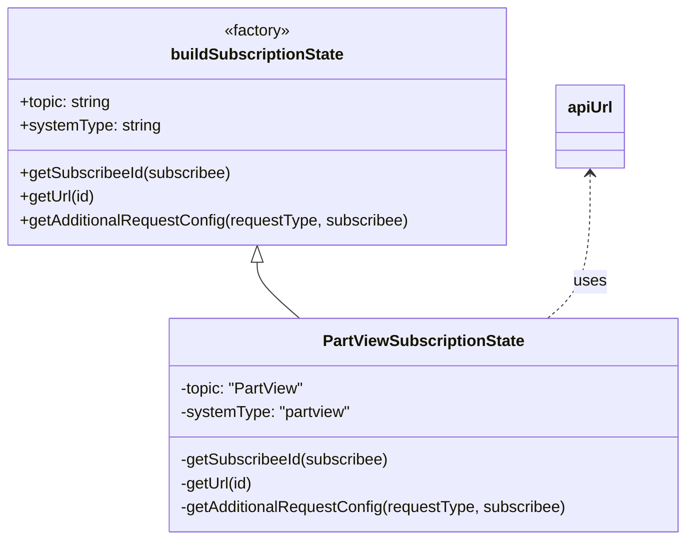

# Diagram: web/portal/src/pages/partview/redux/PartViewSubscriptionState.js


> Auto-generated by Obscura crawlers

## Diagram 1



### SVG

<svg id="container" width="694.572265625" xmlns="http://www.w3.org/2000/svg" class="classDiagram" height="546" viewBox="0 0 694.572265625 546" role="graphics-document document" aria-roledescription="class"><style>#container{font-family:"trebuchet ms",verdana,arial,sans-serif;font-size:16px;fill:#333;}@keyframes edge-animation-frame{from{stroke-dashoffset:0;}}@keyframes dash{to{stroke-dashoffset:0;}}#container .edge-animation-slow{stroke-dasharray:9,5!important;stroke-dashoffset:900;animation:dash 50s linear infinite;stroke-linecap:round;}#container .edge-animation-fast{stroke-dasharray:9,5!important;stroke-dashoffset:900;animation:dash 20s linear infinite;stroke-linecap:round;}#container .error-icon{fill:#552222;}#container .error-text{fill:#552222;stroke:#552222;}#container .edge-thickness-normal{stroke-width:1px;}#container .edge-thickness-thick{stroke-width:3.5px;}#container .edge-pattern-solid{stroke-dasharray:0;}#container .edge-thickness-invisible{stroke-width:0;fill:none;}#container .edge-pattern-dashed{stroke-dasharray:3;}#container .edge-pattern-dotted{stroke-dasharray:2;}#container .marker{fill:#333333;stroke:#333333;}#container .marker.cross{stroke:#333333;}#container svg{font-family:"trebuchet ms",verdana,arial,sans-serif;font-size:16px;}#container p{margin:0;}#container g.classGroup text{fill:#9370DB;stroke:none;font-family:"trebuchet ms",verdana,arial,sans-serif;font-size:10px;}#container g.classGroup text .title{font-weight:bolder;}#container .nodeLabel,#container .edgeLabel{color:#131300;}#container .edgeLabel .label rect{fill:#ECECFF;}#container .label text{fill:#131300;}#container .labelBkg{background:#ECECFF;}#container .edgeLabel .label span{background:#ECECFF;}#container .classTitle{font-weight:bolder;}#container .node rect,#container .node circle,#container .node ellipse,#container .node polygon,#container .node path{fill:#ECECFF;stroke:#9370DB;stroke-width:1px;}#container .divider{stroke:#9370DB;stroke-width:1;}#container g.clickable{cursor:pointer;}#container g.classGroup rect{fill:#ECECFF;stroke:#9370DB;}#container g.classGroup line{stroke:#9370DB;stroke-width:1;}#container .classLabel .box{stroke:none;stroke-width:0;fill:#ECECFF;opacity:0.5;}#container .classLabel .label{fill:#9370DB;font-size:10px;}#container .relation{stroke:#333333;stroke-width:1;fill:none;}#container .dashed-line{stroke-dasharray:3;}#container .dotted-line{stroke-dasharray:1 2;}#container #compositionStart,#container .composition{fill:#333333!important;stroke:#333333!important;stroke-width:1;}#container #compositionEnd,#container .composition{fill:#333333!important;stroke:#333333!important;stroke-width:1;}#container #dependencyStart,#container .dependency{fill:#333333!important;stroke:#333333!important;stroke-width:1;}#container #dependencyStart,#container .dependency{fill:#333333!important;stroke:#333333!important;stroke-width:1;}#container #extensionStart,#container .extension{fill:transparent!important;stroke:#333333!important;stroke-width:1;}#container #extensionEnd,#container .extension{fill:transparent!important;stroke:#333333!important;stroke-width:1;}#container #aggregationStart,#container .aggregation{fill:transparent!important;stroke:#333333!important;stroke-width:1;}#container #aggregationEnd,#container .aggregation{fill:transparent!important;stroke:#333333!important;stroke-width:1;}#container #lollipopStart,#container .lollipop{fill:#ECECFF!important;stroke:#333333!important;stroke-width:1;}#container #lollipopEnd,#container .lollipop{fill:#ECECFF!important;stroke:#333333!important;stroke-width:1;}#container .edgeTerminals{font-size:11px;line-height:initial;}#container .classTitleText{text-anchor:middle;font-size:18px;fill:#333;}#container .label-icon{display:inline-block;height:1em;overflow:visible;vertical-align:-0.125em;}#container .node .label-icon path{fill:currentColor;stroke:revert;stroke-width:revert;}#container :root{--mermaid-font-family:"trebuchet ms",verdana,arial,sans-serif;}</style><g><defs><marker id="container_class-aggregationStart" class="marker aggregation class" refX="18" refY="7" markerWidth="190" markerHeight="240" orient="auto"><path d="M 18,7 L9,13 L1,7 L9,1 Z"></path></marker></defs><defs><marker id="container_class-aggregationEnd" class="marker aggregation class" refX="1" refY="7" markerWidth="20" markerHeight="28" orient="auto"><path d="M 18,7 L9,13 L1,7 L9,1 Z"></path></marker></defs><defs><marker id="container_class-extensionStart" class="marker extension class" refX="18" refY="7" markerWidth="190" markerHeight="240" orient="auto"><path d="M 1,7 L18,13 V 1 Z"></path></marker></defs><defs><marker id="container_class-extensionEnd" class="marker extension class" refX="1" refY="7" markerWidth="20" markerHeight="28" orient="auto"><path d="M 1,1 V 13 L18,7 Z"></path></marker></defs><defs><marker id="container_class-compositionStart" class="marker composition class" refX="18" refY="7" markerWidth="190" markerHeight="240" orient="auto"><path d="M 18,7 L9,13 L1,7 L9,1 Z"></path></marker></defs><defs><marker id="container_class-compositionEnd" class="marker composition class" refX="1" refY="7" markerWidth="20" markerHeight="28" orient="auto"><path d="M 18,7 L9,13 L1,7 L9,1 Z"></path></marker></defs><defs><marker id="container_class-dependencyStart" class="marker dependency class" refX="6" refY="7" markerWidth="190" markerHeight="240" orient="auto"><path d="M 5,7 L9,13 L1,7 L9,1 Z"></path></marker></defs><defs><marker id="container_class-dependencyEnd" class="marker dependency class" refX="13" refY="7" markerWidth="20" markerHeight="28" orient="auto"><path d="M 18,7 L9,13 L14,7 L9,1 Z"></path></marker></defs><defs><marker id="container_class-lollipopStart" class="marker lollipop class" refX="13" refY="7" markerWidth="190" markerHeight="240" orient="auto"><circle stroke="black" fill="transparent" cx="7" cy="7" r="6"></circle></marker></defs><defs><marker id="container_class-lollipopEnd" class="marker lollipop class" refX="1" refY="7" markerWidth="190" markerHeight="240" orient="auto"><circle stroke="black" fill="transparent" cx="7" cy="7" r="6"></circle></marker></defs><g class="root"><g class="clusters"></g><g class="edgePaths"><path d="M260.184,265.25L260.184,268.542C260.184,271.833,260.184,278.417,267.337,287.875C274.49,297.333,288.796,309.667,295.95,315.833L303.103,322" id="id_buildSubscriptionState_PartViewSubscriptionState_1" class="edge-thickness-normal edge-pattern-solid relation" style=";;;" data-edge="true" data-et="edge" data-id="id_buildSubscriptionState_PartViewSubscriptionState_1" data-points="W3sieCI6MjYwLjE4MzU5Mzc1LCJ5IjoyNDh9LHsieCI6MjYwLjE4MzU5Mzc1LCJ5IjoyODV9LHsieCI6MzAzLjEwMjg5NjAxMjkzMTA3LCJ5IjozMjJ9XQ==" marker-start="url(#container_class-extensionStart)"></path><path d="M596.578,176L596.578,194.167C596.578,212.333,596.578,248.667,589.425,273C582.272,297.333,567.965,309.667,560.812,315.833L553.659,322" id="id_apiUrl_PartViewSubscriptionState_2" class="edge-thickness-normal edge-pattern-dashed relation" style=";;;" data-edge="true" data-et="edge" data-id="id_apiUrl_PartViewSubscriptionState_2" data-points="W3sieCI6NTk2LjU3ODEyNSwieSI6MTcwfSx7IngiOjU5Ni41NzgxMjUsInkiOjI4NX0seyJ4Ijo1NTMuNjU4ODIyNzM3MDY4OSwieSI6MzIyfV0=" marker-start="url(#container_class-dependencyStart)"></path></g><g class="edgeLabels"><g class="edgeLabel"><g class="label" data-id="id_buildSubscriptionState_PartViewSubscriptionState_1" transform="translate(0, 0)"><foreignObject width="0" height="0"><div xmlns="http://www.w3.org/1999/xhtml" class="labelBkg" style="display: table-cell; white-space: nowrap; line-height: 1.5; max-width: 200px; text-align: center;"><span class="edgeLabel"></span></div></foreignObject></g></g><g class="edgeLabel" transform="translate(596.578125, 285)"><g class="label" data-id="id_apiUrl_PartViewSubscriptionState_2" transform="translate(-16.4921875, -12)"><foreignObject width="32.984375" height="24"><div xmlns="http://www.w3.org/1999/xhtml" class="labelBkg" style="display: table-cell; white-space: nowrap; line-height: 1.5; max-width: 200px; text-align: center;"><span class="edgeLabel"><p>uses</p></span></div></foreignObject></g></g></g><g class="nodes"><g class="node default" id="classId-buildSubscriptionState-0" transform="translate(260.18359375, 128)"><g class="basic label-container"><path d="M-252.18359375 -120 L252.18359375 -120 L252.18359375 120 L-252.18359375 120" stroke="none" stroke-width="0" fill="#ECECFF" style=""></path><path d="M-252.18359375 -120 C-101.44606591023202 -120, 49.291461929535956 -120, 252.18359375 -120 M-252.18359375 -120 C-89.8884966925786 -120, 72.4066003648428 -120, 252.18359375 -120 M252.18359375 -120 C252.18359375 -56.27159878074875, 252.18359375 7.456802438502507, 252.18359375 120 M252.18359375 -120 C252.18359375 -46.44472927259936, 252.18359375 27.11054145480128, 252.18359375 120 M252.18359375 120 C142.03842211988194 120, 31.893250489763915 120, -252.18359375 120 M252.18359375 120 C79.78187969321982 120, -92.61983436356036 120, -252.18359375 120 M-252.18359375 120 C-252.18359375 62.381254275912575, -252.18359375 4.7625085518251495, -252.18359375 -120 M-252.18359375 120 C-252.18359375 25.74759664755554, -252.18359375 -68.50480670488892, -252.18359375 -120" stroke="#9370DB" stroke-width="1.3" fill="none" stroke-dasharray="0 0" style=""></path></g><g class="annotation-group text" transform="translate(-34.2734375, -96)"><g class="label" style="" transform="translate(0,-12)"><foreignObject width="68.546875" height="24"><div xmlns="http://www.w3.org/1999/xhtml" style="display: table-cell; white-space: nowrap; line-height: 1.5; max-width: 119px; text-align: center;"><span class="nodeLabel markdown-node-label" style=""><p>«factory»</p></span></div></foreignObject></g></g><g class="label-group text" transform="translate(-84.5546875, -72)"><g class="label" style="font-weight: bolder" transform="translate(0,-12)"><foreignObject width="169.109375" height="24"><div xmlns="http://www.w3.org/1999/xhtml" style="display: table-cell; white-space: nowrap; line-height: 1.5; max-width: 217px; text-align: center;"><span class="nodeLabel markdown-node-label" style=""><p>buildSubscriptionState</p></span></div></foreignObject></g></g><g class="members-group text" transform="translate(-240.18359375, -24)"><g class="label" style="" transform="translate(0,-12)"><foreignObject width="94.234375" height="24"><div xmlns="http://www.w3.org/1999/xhtml" style="display: table-cell; white-space: nowrap; line-height: 1.5; max-width: 152px; text-align: center;"><span class="nodeLabel markdown-node-label" style=""><p>+topic: string</p></span></div></foreignObject></g><g class="label" style="" transform="translate(0,12)"><foreignObject width="141.828125" height="24"><div xmlns="http://www.w3.org/1999/xhtml" style="display: table-cell; white-space: nowrap; line-height: 1.5; max-width: 200px; text-align: center;"><span class="nodeLabel markdown-node-label" style=""><p>+systemType: string</p></span></div></foreignObject></g></g><g class="methods-group text" transform="translate(-240.18359375, 48)"><g class="label" style="" transform="translate(0,-12)"><foreignObject width="214.53125" height="24"><div xmlns="http://www.w3.org/1999/xhtml" style="display: table-cell; white-space: nowrap; line-height: 1.5; max-width: 272px; text-align: center;"><span class="nodeLabel markdown-node-label" style=""><p>+getSubscribeeId(subscribee)</p></span></div></foreignObject></g><g class="label" style="" transform="translate(0,12)"><foreignObject width="76.453125" height="24"><div xmlns="http://www.w3.org/1999/xhtml" style="display: table-cell; white-space: nowrap; line-height: 1.5; max-width: 134px; text-align: center;"><span class="nodeLabel markdown-node-label" style=""><p>+getUrl(id)</p></span></div></foreignObject></g><g class="label" style="" transform="translate(0,36)"><foreignObject width="395.8125" height="24"><div xmlns="http://www.w3.org/1999/xhtml" style="display: table-cell; white-space: nowrap; line-height: 1.5; max-width: 453px; text-align: center;"><span class="nodeLabel markdown-node-label" style=""><p>+getAdditionalRequestConfig(requestType, subscribee)</p></span></div></foreignObject></g></g><g class="divider" style=""><path d="M-252.18359375 -48 C-139.35748442402726 -48, -26.531375098054525 -48, 252.18359375 -48 M-252.18359375 -48 C-96.51703454600681 -48, 59.149524657986376 -48, 252.18359375 -48" stroke="#9370DB" stroke-width="1.3" fill="none" stroke-dasharray="0 0" style=""></path></g><g class="divider" style=""><path d="M-252.18359375 24 C-127.18181946661814 24, -2.180045183236274 24, 252.18359375 24 M-252.18359375 24 C-121.69445353167436 24, 8.79468668665129 24, 252.18359375 24" stroke="#9370DB" stroke-width="1.3" fill="none" stroke-dasharray="0 0" style=""></path></g></g><g class="node default" id="classId-PartViewSubscriptionState-1" transform="translate(428.380859375, 430)"><g class="basic label-container"><path d="M-258.19140625 -108 L258.19140625 -108 L258.19140625 108 L-258.19140625 108" stroke="none" stroke-width="0" fill="#ECECFF" style=""></path><path d="M-258.19140625 -108 C-106.86903477288988 -108, 44.45333670422025 -108, 258.19140625 -108 M-258.19140625 -108 C-135.44538820701734 -108, -12.699370164034661 -108, 258.19140625 -108 M258.19140625 -108 C258.19140625 -52.441695342030584, 258.19140625 3.116609315938831, 258.19140625 108 M258.19140625 -108 C258.19140625 -45.46138069686844, 258.19140625 17.077238606263123, 258.19140625 108 M258.19140625 108 C122.97133833594185 108, -12.248729578116297 108, -258.19140625 108 M258.19140625 108 C109.66853913218412 108, -38.854327985631755 108, -258.19140625 108 M-258.19140625 108 C-258.19140625 55.543139760405104, -258.19140625 3.0862795208102085, -258.19140625 -108 M-258.19140625 108 C-258.19140625 58.460394794561694, -258.19140625 8.920789589123387, -258.19140625 -108" stroke="#9370DB" stroke-width="1.3" fill="none" stroke-dasharray="0 0" style=""></path></g><g class="annotation-group text" transform="translate(0, -84)"></g><g class="label-group text" transform="translate(-98.1015625, -84)"><g class="label" style="font-weight: bolder" transform="translate(0,-12)"><foreignObject width="196.203125" height="24"><div xmlns="http://www.w3.org/1999/xhtml" style="display: table-cell; white-space: nowrap; line-height: 1.5; max-width: 242px; text-align: center;"><span class="nodeLabel markdown-node-label" style=""><p>PartViewSubscriptionState</p></span></div></foreignObject></g></g><g class="members-group text" transform="translate(-246.19140625, -36)"><g class="label" style="" transform="translate(0,-12)"><foreignObject width="126.5" height="24"><div xmlns="http://www.w3.org/1999/xhtml" style="display: table-cell; white-space: nowrap; line-height: 1.5; max-width: 184px; text-align: center;"><span class="nodeLabel markdown-node-label" style=""><p>-topic: "PartView"</p></span></div></foreignObject></g><g class="label" style="" transform="translate(0,12)"><foreignObject width="173.921875" height="24"><div xmlns="http://www.w3.org/1999/xhtml" style="display: table-cell; white-space: nowrap; line-height: 1.5; max-width: 231px; text-align: center;"><span class="nodeLabel markdown-node-label" style=""><p>-systemType: "partview"</p></span></div></foreignObject></g></g><g class="methods-group text" transform="translate(-246.19140625, 36)"><g class="label" style="" transform="translate(0,-12)"><foreignObject width="213" height="24"><div xmlns="http://www.w3.org/1999/xhtml" style="display: table-cell; white-space: nowrap; line-height: 1.5; max-width: 270px; text-align: center;"><span class="nodeLabel markdown-node-label" style=""><p>-getSubscribeeId(subscribee)</p></span></div></foreignObject></g><g class="label" style="" transform="translate(0,12)"><foreignObject width="74.921875" height="24"><div xmlns="http://www.w3.org/1999/xhtml" style="display: table-cell; white-space: nowrap; line-height: 1.5; max-width: 132px; text-align: center;"><span class="nodeLabel markdown-node-label" style=""><p>-getUrl(id)</p></span></div></foreignObject></g><g class="label" style="" transform="translate(0,36)"><foreignObject width="394.28125" height="24"><div xmlns="http://www.w3.org/1999/xhtml" style="display: table-cell; white-space: nowrap; line-height: 1.5; max-width: 452px; text-align: center;"><span class="nodeLabel markdown-node-label" style=""><p>-getAdditionalRequestConfig(requestType, subscribee)</p></span></div></foreignObject></g></g><g class="divider" style=""><path d="M-258.19140625 -60 C-131.16226948931313 -60, -4.133132728626293 -60, 258.19140625 -60 M-258.19140625 -60 C-85.67489843142906 -60, 86.84160938714189 -60, 258.19140625 -60" stroke="#9370DB" stroke-width="1.3" fill="none" stroke-dasharray="0 0" style=""></path></g><g class="divider" style=""><path d="M-258.19140625 12 C-94.95111637878736 12, 68.28917349242528 12, 258.19140625 12 M-258.19140625 12 C-61.61876216727788 12, 134.95388191544424 12, 258.19140625 12" stroke="#9370DB" stroke-width="1.3" fill="none" stroke-dasharray="0 0" style=""></path></g></g><g class="node default" id="classId-apiUrl-2" transform="translate(596.578125, 128)"><g class="basic label-container"><path d="M-34.2109375 -42 L34.2109375 -42 L34.2109375 42 L-34.2109375 42" stroke="none" stroke-width="0" fill="#ECECFF" style=""></path><path d="M-34.2109375 -42 C-11.525472994573029 -42, 11.159991510853942 -42, 34.2109375 -42 M-34.2109375 -42 C-18.75107081658463 -42, -3.2912041331692627 -42, 34.2109375 -42 M34.2109375 -42 C34.2109375 -12.310411918815351, 34.2109375 17.379176162369298, 34.2109375 42 M34.2109375 -42 C34.2109375 -9.327504987550185, 34.2109375 23.34499002489963, 34.2109375 42 M34.2109375 42 C13.411492468439548 42, -7.387952563120905 42, -34.2109375 42 M34.2109375 42 C17.589082226335364 42, 0.9672269526707282 42, -34.2109375 42 M-34.2109375 42 C-34.2109375 24.44253172761146, -34.2109375 6.8850634552229195, -34.2109375 -42 M-34.2109375 42 C-34.2109375 9.982611695820054, -34.2109375 -22.03477660835989, -34.2109375 -42" stroke="#9370DB" stroke-width="1.3" fill="none" stroke-dasharray="0 0" style=""></path></g><g class="annotation-group text" transform="translate(0, -18)"></g><g class="label-group text" transform="translate(-22.2109375, -18)"><g class="label" style="font-weight: bolder" transform="translate(0,-12)"><foreignObject width="44.421875" height="24"><div xmlns="http://www.w3.org/1999/xhtml" style="display: table-cell; white-space: nowrap; line-height: 1.5; max-width: 94px; text-align: center;"><span class="nodeLabel markdown-node-label" style=""><p>apiUrl</p></span></div></foreignObject></g></g><g class="members-group text" transform="translate(-22.2109375, 30)"></g><g class="methods-group text" transform="translate(-22.2109375, 60)"></g><g class="divider" style=""><path d="M-34.2109375 6 C-8.062101462623605 6, 18.08673457475279 6, 34.2109375 6 M-34.2109375 6 C-7.911862848424587 6, 18.387211803150826 6, 34.2109375 6" stroke="#9370DB" stroke-width="1.3" fill="none" stroke-dasharray="0 0" style=""></path></g><g class="divider" style=""><path d="M-34.2109375 24 C-20.468901949625653 24, -6.7268663992513105 24, 34.2109375 24 M-34.2109375 24 C-6.859906713986263 24, 20.491124072027475 24, 34.2109375 24" stroke="#9370DB" stroke-width="1.3" fill="none" stroke-dasharray="0 0" style=""></path></g></g></g></g></g></svg>

## Diagram 2

```mermaid
flowchart TD
    A[Incoming request type] --> B{Is requestType == "FETCH_SUBSCRIPTION"?}
    B -- Yes --> C[config = {}]
    C --> D[Return config]
    B -- No --> E[config = {}]
    E --> F[config.data = { owner_solution_id: subscribee?.OwnerSolutionId }]
    F --> D
    subgraph URL
        U[getUrl(id)] --> U2[apiUrl("/partview/app/package-container/" + encodeURIComponent(id))]
    end
    PartView[PartView subscription] --> U
    PartView --> A
```

> SVG rendering failed for this diagram.
