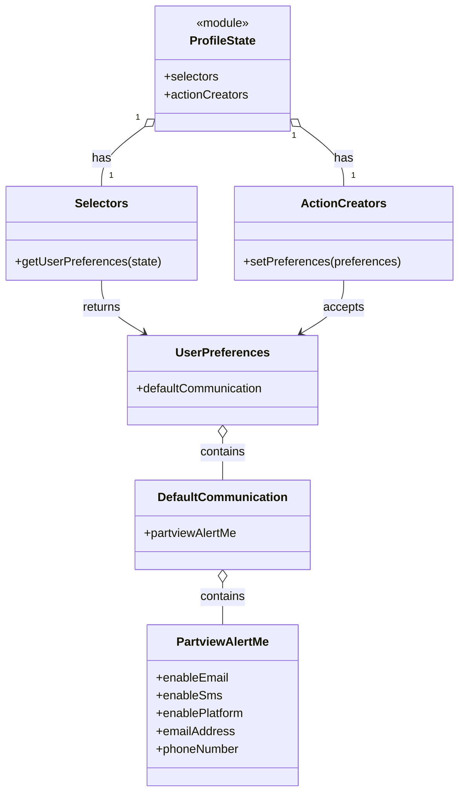

# Diagram: web/portal/src/pages/partview/redux/PartViewWatchedPackagesSubscriptionState.ts


> Auto-generated by Obscura crawlers

## Diagram 1

```mermaid
flowchart LR
  A[PartViewWatchedPackagesSubscriptionState] --> B[buildSubscriptionState]
  B --> C{config}
  C --> |topic| D[PartViewWatchedPackages]
  C --> |systemType| E[partview]
  C --> |subscriptionType| F[update]
  C --> |getUrl()| G[/apiUrl("/partview/api/watched-package-subscription")/]
  C --> |getSubscribeeId()| H["\"\" (empty string)"]
  C --> |getAdditionalRequestConfig| I[function: returns data with action & owner_solution_id=FV_PARTVIEW]
  C --> |onChange| J[function: reads ProfileState.selectors.getUserPreferences(state)]
  J --> K[creates preferences object with defaultCommunication.partviewAlertMe fields]
  K --> L[returns ProfileState.actionCreators.setPreferences(preferences)]
  C --> |updateUrl| M[false]
  C --> |fetchSubscriptionOnSuccess| N[false]
```

> SVG rendering failed for this diagram.

## Diagram 2



### SVG

<svg id="container" width="606.765625" xmlns="http://www.w3.org/2000/svg" class="classDiagram" height="1062" viewBox="0 0 606.765625 1062" role="graphics-document document" aria-roledescription="class"><style>#container{font-family:"trebuchet ms",verdana,arial,sans-serif;font-size:16px;fill:#333;}@keyframes edge-animation-frame{from{stroke-dashoffset:0;}}@keyframes dash{to{stroke-dashoffset:0;}}#container .edge-animation-slow{stroke-dasharray:9,5!important;stroke-dashoffset:900;animation:dash 50s linear infinite;stroke-linecap:round;}#container .edge-animation-fast{stroke-dasharray:9,5!important;stroke-dashoffset:900;animation:dash 20s linear infinite;stroke-linecap:round;}#container .error-icon{fill:#552222;}#container .error-text{fill:#552222;stroke:#552222;}#container .edge-thickness-normal{stroke-width:1px;}#container .edge-thickness-thick{stroke-width:3.5px;}#container .edge-pattern-solid{stroke-dasharray:0;}#container .edge-thickness-invisible{stroke-width:0;fill:none;}#container .edge-pattern-dashed{stroke-dasharray:3;}#container .edge-pattern-dotted{stroke-dasharray:2;}#container .marker{fill:#333333;stroke:#333333;}#container .marker.cross{stroke:#333333;}#container svg{font-family:"trebuchet ms",verdana,arial,sans-serif;font-size:16px;}#container p{margin:0;}#container g.classGroup text{fill:#9370DB;stroke:none;font-family:"trebuchet ms",verdana,arial,sans-serif;font-size:10px;}#container g.classGroup text .title{font-weight:bolder;}#container .nodeLabel,#container .edgeLabel{color:#131300;}#container .edgeLabel .label rect{fill:#ECECFF;}#container .label text{fill:#131300;}#container .labelBkg{background:#ECECFF;}#container .edgeLabel .label span{background:#ECECFF;}#container .classTitle{font-weight:bolder;}#container .node rect,#container .node circle,#container .node ellipse,#container .node polygon,#container .node path{fill:#ECECFF;stroke:#9370DB;stroke-width:1px;}#container .divider{stroke:#9370DB;stroke-width:1;}#container g.clickable{cursor:pointer;}#container g.classGroup rect{fill:#ECECFF;stroke:#9370DB;}#container g.classGroup line{stroke:#9370DB;stroke-width:1;}#container .classLabel .box{stroke:none;stroke-width:0;fill:#ECECFF;opacity:0.5;}#container .classLabel .label{fill:#9370DB;font-size:10px;}#container .relation{stroke:#333333;stroke-width:1;fill:none;}#container .dashed-line{stroke-dasharray:3;}#container .dotted-line{stroke-dasharray:1 2;}#container #compositionStart,#container .composition{fill:#333333!important;stroke:#333333!important;stroke-width:1;}#container #compositionEnd,#container .composition{fill:#333333!important;stroke:#333333!important;stroke-width:1;}#container #dependencyStart,#container .dependency{fill:#333333!important;stroke:#333333!important;stroke-width:1;}#container #dependencyStart,#container .dependency{fill:#333333!important;stroke:#333333!important;stroke-width:1;}#container #extensionStart,#container .extension{fill:transparent!important;stroke:#333333!important;stroke-width:1;}#container #extensionEnd,#container .extension{fill:transparent!important;stroke:#333333!important;stroke-width:1;}#container #aggregationStart,#container .aggregation{fill:transparent!important;stroke:#333333!important;stroke-width:1;}#container #aggregationEnd,#container .aggregation{fill:transparent!important;stroke:#333333!important;stroke-width:1;}#container #lollipopStart,#container .lollipop{fill:#ECECFF!important;stroke:#333333!important;stroke-width:1;}#container #lollipopEnd,#container .lollipop{fill:#ECECFF!important;stroke:#333333!important;stroke-width:1;}#container .edgeTerminals{font-size:11px;line-height:initial;}#container .classTitleText{text-anchor:middle;font-size:18px;fill:#333;}#container .label-icon{display:inline-block;height:1em;overflow:visible;vertical-align:-0.125em;}#container .node .label-icon path{fill:currentColor;stroke:revert;stroke-width:revert;}#container :root{--mermaid-font-family:"trebuchet ms",verdana,arial,sans-serif;}</style><g><defs><marker id="container_class-aggregationStart" class="marker aggregation class" refX="18" refY="7" markerWidth="190" markerHeight="240" orient="auto"><path d="M 18,7 L9,13 L1,7 L9,1 Z"></path></marker></defs><defs><marker id="container_class-aggregationEnd" class="marker aggregation class" refX="1" refY="7" markerWidth="20" markerHeight="28" orient="auto"><path d="M 18,7 L9,13 L1,7 L9,1 Z"></path></marker></defs><defs><marker id="container_class-extensionStart" class="marker extension class" refX="18" refY="7" markerWidth="190" markerHeight="240" orient="auto"><path d="M 1,7 L18,13 V 1 Z"></path></marker></defs><defs><marker id="container_class-extensionEnd" class="marker extension class" refX="1" refY="7" markerWidth="20" markerHeight="28" orient="auto"><path d="M 1,1 V 13 L18,7 Z"></path></marker></defs><defs><marker id="container_class-compositionStart" class="marker composition class" refX="18" refY="7" markerWidth="190" markerHeight="240" orient="auto"><path d="M 18,7 L9,13 L1,7 L9,1 Z"></path></marker></defs><defs><marker id="container_class-compositionEnd" class="marker composition class" refX="1" refY="7" markerWidth="20" markerHeight="28" orient="auto"><path d="M 18,7 L9,13 L1,7 L9,1 Z"></path></marker></defs><defs><marker id="container_class-dependencyStart" class="marker dependency class" refX="6" refY="7" markerWidth="190" markerHeight="240" orient="auto"><path d="M 5,7 L9,13 L1,7 L9,1 Z"></path></marker></defs><defs><marker id="container_class-dependencyEnd" class="marker dependency class" refX="13" refY="7" markerWidth="20" markerHeight="28" orient="auto"><path d="M 18,7 L9,13 L14,7 L9,1 Z"></path></marker></defs><defs><marker id="container_class-lollipopStart" class="marker lollipop class" refX="13" refY="7" markerWidth="190" markerHeight="240" orient="auto"><circle stroke="black" fill="transparent" cx="7" cy="7" r="6"></circle></marker></defs><defs><marker id="container_class-lollipopEnd" class="marker lollipop class" refX="1" refY="7" markerWidth="190" markerHeight="240" orient="auto"><circle stroke="black" fill="transparent" cx="7" cy="7" r="6"></circle></marker></defs><g class="root"><g class="clusters"></g><g class="edgePaths"><path d="M190.661,170.461L181.275,177.551C171.889,184.641,153.116,198.82,143.73,212.077C134.344,225.333,134.344,237.667,134.344,243.833L134.344,250" id="id_ProfileState_Selectors_1" class="edge-thickness-normal edge-pattern-solid relation" style=";;;" data-edge="true" data-et="edge" data-id="id_ProfileState_Selectors_1" data-points="W3sieCI6MjA0LjQyNTc4MTI1LCJ5IjoxNjAuMDYzNzkwODc1MTczNzR9LHsieCI6MTM0LjM0Mzc1LCJ5IjoyMTN9LHsieCI6MTM0LjM0Mzc1LCJ5IjoyNTB9XQ==" marker-start="url(#container_class-aggregationStart)"></path><path d="M398.409,170.461L407.795,177.551C417.182,184.641,435.954,198.82,445.34,212.077C454.727,225.333,454.727,237.667,454.727,243.833L454.727,250" id="id_ProfileState_ActionCreators_2" class="edge-thickness-normal edge-pattern-solid relation" style=";;;" data-edge="true" data-et="edge" data-id="id_ProfileState_ActionCreators_2" data-points="W3sieCI6Mzg0LjY0NDUzMTI1LCJ5IjoxNjAuMDYzNzkwODc1MTczNzR9LHsieCI6NDU0LjcyNjU2MjUsInkiOjIxM30seyJ4Ijo0NTQuNzI2NTYyNSwieSI6MjUwfV0=" marker-start="url(#container_class-aggregationStart)"></path><path d="M134.344,376L134.344,382.167C134.344,388.333,134.344,400.667,143.672,412.482C153.001,424.297,171.658,435.595,180.987,441.243L190.315,446.892" id="id_Selectors_UserPreferences_3" class="edge-thickness-normal edge-pattern-solid relation" style=";;;" data-edge="true" data-et="edge" data-id="id_Selectors_UserPreferences_3" data-points="W3sieCI6MTM0LjM0Mzc1LCJ5IjozNzZ9LHsieCI6MTM0LjM0Mzc1LCJ5Ijo0MTN9LHsieCI6MTk1LjQ0NzY4ODQ2NjQ5NDg0LCJ5Ijo0NTB9XQ==" marker-end="url(#container_class-dependencyEnd)"></path><path d="M454.727,376L454.727,382.167C454.727,388.333,454.727,400.667,445.398,412.482C436.069,424.297,417.412,435.595,408.084,441.243L398.755,446.892" id="id_ActionCreators_UserPreferences_4" class="edge-thickness-normal edge-pattern-solid relation" style=";;;" data-edge="true" data-et="edge" data-id="id_ActionCreators_UserPreferences_4" data-points="W3sieCI6NDU0LjcyNjU2MjUsInkiOjM3Nn0seyJ4Ijo0NTQuNzI2NTYyNSwieSI6NDEzfSx7IngiOjM5My42MjI2MjQwMzM1MDUyLCJ5Ijo0NTB9XQ==" marker-end="url(#container_class-dependencyEnd)"></path><path d="M294.535,587.25L294.535,590.542C294.535,593.833,294.535,600.417,294.535,609.875C294.535,619.333,294.535,631.667,294.535,637.833L294.535,644" id="id_UserPreferences_DefaultCommunication_5" class="edge-thickness-normal edge-pattern-solid relation" style=";;;" data-edge="true" data-et="edge" data-id="id_UserPreferences_DefaultCommunication_5" data-points="W3sieCI6Mjk0LjUzNTE1NjI1LCJ5Ijo1NzB9LHsieCI6Mjk0LjUzNTE1NjI1LCJ5Ijo2MDd9LHsieCI6Mjk0LjUzNTE1NjI1LCJ5Ijo2NDR9XQ==" marker-start="url(#container_class-aggregationStart)"></path><path d="M294.535,781.25L294.535,784.542C294.535,787.833,294.535,794.417,294.535,803.875C294.535,813.333,294.535,825.667,294.535,831.833L294.535,838" id="id_DefaultCommunication_PartviewAlertMe_6" class="edge-thickness-normal edge-pattern-solid relation" style=";;;" data-edge="true" data-et="edge" data-id="id_DefaultCommunication_PartviewAlertMe_6" data-points="W3sieCI6Mjk0LjUzNTE1NjI1LCJ5Ijo3NjR9LHsieCI6Mjk0LjUzNTE1NjI1LCJ5Ijo4MDF9LHsieCI6Mjk0LjUzNTE1NjI1LCJ5Ijo4Mzh9XQ==" marker-start="url(#container_class-aggregationStart)"></path></g><g class="edgeLabels"><g class="edgeLabel" transform="translate(134.34375, 213)"><g class="label" data-id="id_ProfileState_Selectors_1" transform="translate(-12.703125, -12)"><foreignObject width="25.40625" height="24"><div xmlns="http://www.w3.org/1999/xhtml" class="labelBkg" style="display: table-cell; white-space: nowrap; line-height: 1.5; max-width: 200px; text-align: center;"><span class="edgeLabel"><p>has</p></span></div></foreignObject></g></g><g class="edgeLabel" transform="translate(454.7265625, 213)"><g class="label" data-id="id_ProfileState_ActionCreators_2" transform="translate(-12.703125, -12)"><foreignObject width="25.40625" height="24"><div xmlns="http://www.w3.org/1999/xhtml" class="labelBkg" style="display: table-cell; white-space: nowrap; line-height: 1.5; max-width: 200px; text-align: center;"><span class="edgeLabel"><p>has</p></span></div></foreignObject></g></g><g class="edgeLabel" transform="translate(134.34375, 413)"><g class="label" data-id="id_Selectors_UserPreferences_3" transform="translate(-26.265625, -12)"><foreignObject width="52.53125" height="24"><div xmlns="http://www.w3.org/1999/xhtml" class="labelBkg" style="display: table-cell; white-space: nowrap; line-height: 1.5; max-width: 200px; text-align: center;"><span class="edgeLabel"><p>returns</p></span></div></foreignObject></g></g><g class="edgeLabel" transform="translate(454.7265625, 413)"><g class="label" data-id="id_ActionCreators_UserPreferences_4" transform="translate(-27.421875, -12)"><foreignObject width="54.84375" height="24"><div xmlns="http://www.w3.org/1999/xhtml" class="labelBkg" style="display: table-cell; white-space: nowrap; line-height: 1.5; max-width: 200px; text-align: center;"><span class="edgeLabel"><p>accepts</p></span></div></foreignObject></g></g><g class="edgeLabel" transform="translate(294.53515625, 607)"><g class="label" data-id="id_UserPreferences_DefaultCommunication_5" transform="translate(-30.890625, -12)"><foreignObject width="61.78125" height="24"><div xmlns="http://www.w3.org/1999/xhtml" class="labelBkg" style="display: table-cell; white-space: nowrap; line-height: 1.5; max-width: 200px; text-align: center;"><span class="edgeLabel"><p>contains</p></span></div></foreignObject></g></g><g class="edgeLabel" transform="translate(294.53515625, 801)"><g class="label" data-id="id_DefaultCommunication_PartviewAlertMe_6" transform="translate(-30.890625, -12)"><foreignObject width="61.78125" height="24"><div xmlns="http://www.w3.org/1999/xhtml" class="labelBkg" style="display: table-cell; white-space: nowrap; line-height: 1.5; max-width: 200px; text-align: center;"><span class="edgeLabel"><p>contains</p></span></div></foreignObject></g></g><g class="edgeTerminals" transform="translate(181.42079719336084, 158.64229721616854)"><g class="inner" transform="translate(0, 0)"><foreignObject style="width: 9px; height: 12px;"><div xmlns="http://www.w3.org/1999/xhtml" style="display: inline-block; padding-right: 1px; white-space: nowrap;"><span class="edgeLabel">1</span></div></foreignObject></g></g><g class="edgeTerminals" transform="translate(389.5677137392537, 182.58072482668982)"><g class="inner" transform="translate(0, 0)"><foreignObject style="width: 9px; height: 12px;"><div xmlns="http://www.w3.org/1999/xhtml" style="display: inline-block; padding-right: 1px; white-space: nowrap;"><span class="edgeLabel">1</span></div></foreignObject></g></g><g class="edgeTerminals" transform="translate(144.34375, 227.5)"><g class="inner" transform="translate(0, 0)"></g><foreignObject style="width: 9px; height: 12px;"><div xmlns="http://www.w3.org/1999/xhtml" style="display: inline-block; padding-right: 1px; white-space: nowrap;"><span class="edgeLabel">1</span></div></foreignObject></g><g class="edgeTerminals" transform="translate(464.72656125, 227.49999892857144)"><g class="inner" transform="translate(0, 0)"></g><foreignObject style="width: 9px; height: 12px;"><div xmlns="http://www.w3.org/1999/xhtml" style="display: inline-block; padding-right: 1px; white-space: nowrap;"><span class="edgeLabel">1</span></div></foreignObject></g></g><g class="nodes"><g class="node default" id="classId-ProfileState-0" transform="translate(294.53515625, 92)"><g class="basic label-container"><path d="M-90.109375 -84 L90.109375 -84 L90.109375 84 L-90.109375 84" stroke="none" stroke-width="0" fill="#ECECFF" style=""></path><path d="M-90.109375 -84 C-43.966436481602805 -84, 2.176502036794389 -84, 90.109375 -84 M-90.109375 -84 C-26.328654492469816 -84, 37.45206601506037 -84, 90.109375 -84 M90.109375 -84 C90.109375 -42.47457530596226, 90.109375 -0.949150611924523, 90.109375 84 M90.109375 -84 C90.109375 -20.76491549217789, 90.109375 42.47016901564422, 90.109375 84 M90.109375 84 C44.492981298106535 84, -1.1234124037869293 84, -90.109375 84 M90.109375 84 C51.22527470033478 84, 12.341174400669559 84, -90.109375 84 M-90.109375 84 C-90.109375 50.29697280904368, -90.109375 16.59394561808736, -90.109375 -84 M-90.109375 84 C-90.109375 38.32322005752927, -90.109375 -7.353559884941461, -90.109375 -84" stroke="#9370DB" stroke-width="1.3" fill="none" stroke-dasharray="0 0" style=""></path></g><g class="annotation-group text" transform="translate(-36.6015625, -60)"><g class="label" style="" transform="translate(0,-12)"><foreignObject width="73.203125" height="24"><div xmlns="http://www.w3.org/1999/xhtml" style="display: table-cell; white-space: nowrap; line-height: 1.5; max-width: 123px; text-align: center;"><span class="nodeLabel markdown-node-label" style=""><p>«module»</p></span></div></foreignObject></g></g><g class="label-group text" transform="translate(-43.140625, -36)"><g class="label" style="font-weight: bolder" transform="translate(0,-12)"><foreignObject width="86.28125" height="24"><div xmlns="http://www.w3.org/1999/xhtml" style="display: table-cell; white-space: nowrap; line-height: 1.5; max-width: 134px; text-align: center;"><span class="nodeLabel markdown-node-label" style=""><p>ProfileState</p></span></div></foreignObject></g></g><g class="members-group text" transform="translate(-78.109375, 12)"><g class="label" style="" transform="translate(0,-12)"><foreignObject width="73.453125" height="24"><div xmlns="http://www.w3.org/1999/xhtml" style="display: table-cell; white-space: nowrap; line-height: 1.5; max-width: 131px; text-align: center;"><span class="nodeLabel markdown-node-label" style=""><p>+selectors</p></span></div></foreignObject></g><g class="label" style="" transform="translate(0,12)"><foreignObject width="113.078125" height="24"><div xmlns="http://www.w3.org/1999/xhtml" style="display: table-cell; white-space: nowrap; line-height: 1.5; max-width: 170px; text-align: center;"><span class="nodeLabel markdown-node-label" style=""><p>+actionCreators</p></span></div></foreignObject></g></g><g class="methods-group text" transform="translate(-78.109375, 84)"></g><g class="divider" style=""><path d="M-90.109375 -12 C-32.25696187078861 -12, 25.595451258422784 -12, 90.109375 -12 M-90.109375 -12 C-42.57001391885027 -12, 4.9693471622994565 -12, 90.109375 -12" stroke="#9370DB" stroke-width="1.3" fill="none" stroke-dasharray="0 0" style=""></path></g><g class="divider" style=""><path d="M-90.109375 60 C-19.128541800981097 60, 51.852291398037806 60, 90.109375 60 M-90.109375 60 C-28.547156326848132 60, 33.015062346303736 60, 90.109375 60" stroke="#9370DB" stroke-width="1.3" fill="none" stroke-dasharray="0 0" style=""></path></g></g><g class="node default" id="classId-Selectors-1" transform="translate(134.34375, 313)"><g class="basic label-container"><path d="M-126.34375 -63 L126.34375 -63 L126.34375 63 L-126.34375 63" stroke="none" stroke-width="0" fill="#ECECFF" style=""></path><path d="M-126.34375 -63 C-29.19499054397818 -63, 67.95376891204364 -63, 126.34375 -63 M-126.34375 -63 C-40.390802418648164 -63, 45.56214516270367 -63, 126.34375 -63 M126.34375 -63 C126.34375 -14.940887529813608, 126.34375 33.118224940372784, 126.34375 63 M126.34375 -63 C126.34375 -29.223016190485872, 126.34375 4.553967619028256, 126.34375 63 M126.34375 63 C27.374239896040763 63, -71.59527020791847 63, -126.34375 63 M126.34375 63 C43.84770081170133 63, -38.64834837659734 63, -126.34375 63 M-126.34375 63 C-126.34375 23.731787717325957, -126.34375 -15.536424565348085, -126.34375 -63 M-126.34375 63 C-126.34375 31.609163780599093, -126.34375 0.21832756119818697, -126.34375 -63" stroke="#9370DB" stroke-width="1.3" fill="none" stroke-dasharray="0 0" style=""></path></g><g class="annotation-group text" transform="translate(0, -39)"></g><g class="label-group text" transform="translate(-34.171875, -39)"><g class="label" style="font-weight: bolder" transform="translate(0,-12)"><foreignObject width="68.34375" height="24"><div xmlns="http://www.w3.org/1999/xhtml" style="display: table-cell; white-space: nowrap; line-height: 1.5; max-width: 117px; text-align: center;"><span class="nodeLabel markdown-node-label" style=""><p>Selectors</p></span></div></foreignObject></g></g><g class="members-group text" transform="translate(-114.34375, 9)"></g><g class="methods-group text" transform="translate(-114.34375, 39)"><g class="label" style="" transform="translate(0,-12)"><foreignObject width="194.515625" height="24"><div xmlns="http://www.w3.org/1999/xhtml" style="display: table-cell; white-space: nowrap; line-height: 1.5; max-width: 252px; text-align: center;"><span class="nodeLabel markdown-node-label" style=""><p>+getUserPreferences(state)</p></span></div></foreignObject></g></g><g class="divider" style=""><path d="M-126.34375 -15 C-25.64260702261825 -15, 75.0585359547635 -15, 126.34375 -15 M-126.34375 -15 C-39.63121763315473 -15, 47.08131473369053 -15, 126.34375 -15" stroke="#9370DB" stroke-width="1.3" fill="none" stroke-dasharray="0 0" style=""></path></g><g class="divider" style=""><path d="M-126.34375 9 C-50.10507586419921 9, 26.133598271601585 9, 126.34375 9 M-126.34375 9 C-32.40058826538106 9, 61.54257346923788 9, 126.34375 9" stroke="#9370DB" stroke-width="1.3" fill="none" stroke-dasharray="0 0" style=""></path></g></g><g class="node default" id="classId-ActionCreators-2" transform="translate(454.7265625, 313)"><g class="basic label-container"><path d="M-144.0390625 -63 L144.0390625 -63 L144.0390625 63 L-144.0390625 63" stroke="none" stroke-width="0" fill="#ECECFF" style=""></path><path d="M-144.0390625 -63 C-75.04233793153179 -63, -6.04561336306358 -63, 144.0390625 -63 M-144.0390625 -63 C-73.30714490911971 -63, -2.5752273182394276 -63, 144.0390625 -63 M144.0390625 -63 C144.0390625 -21.223811829878727, 144.0390625 20.552376340242546, 144.0390625 63 M144.0390625 -63 C144.0390625 -20.22389906594063, 144.0390625 22.552201868118743, 144.0390625 63 M144.0390625 63 C38.0164612950837 63, -68.0061399098326 63, -144.0390625 63 M144.0390625 63 C52.569139124084 63, -38.90078425183199 63, -144.0390625 63 M-144.0390625 63 C-144.0390625 27.474298449518407, -144.0390625 -8.051403100963185, -144.0390625 -63 M-144.0390625 63 C-144.0390625 30.65337005731621, -144.0390625 -1.6932598853675813, -144.0390625 -63" stroke="#9370DB" stroke-width="1.3" fill="none" stroke-dasharray="0 0" style=""></path></g><g class="annotation-group text" transform="translate(0, -39)"></g><g class="label-group text" transform="translate(-53.96875, -39)"><g class="label" style="font-weight: bolder" transform="translate(0,-12)"><foreignObject width="107.9375" height="24"><div xmlns="http://www.w3.org/1999/xhtml" style="display: table-cell; white-space: nowrap; line-height: 1.5; max-width: 156px; text-align: center;"><span class="nodeLabel markdown-node-label" style=""><p>ActionCreators</p></span></div></foreignObject></g></g><g class="members-group text" transform="translate(-132.0390625, 9)"></g><g class="methods-group text" transform="translate(-132.0390625, 39)"><g class="label" style="" transform="translate(0,-12)"><foreignObject width="210.109375" height="24"><div xmlns="http://www.w3.org/1999/xhtml" style="display: table-cell; white-space: nowrap; line-height: 1.5; max-width: 267px; text-align: center;"><span class="nodeLabel markdown-node-label" style=""><p>+setPreferences(preferences)</p></span></div></foreignObject></g></g><g class="divider" style=""><path d="M-144.0390625 -15 C-70.59489340562027 -15, 2.8492756887594624 -15, 144.0390625 -15 M-144.0390625 -15 C-48.55563795193217 -15, 46.92778659613566 -15, 144.0390625 -15" stroke="#9370DB" stroke-width="1.3" fill="none" stroke-dasharray="0 0" style=""></path></g><g class="divider" style=""><path d="M-144.0390625 9 C-58.47511688525306 9, 27.088828729493883 9, 144.0390625 9 M-144.0390625 9 C-56.67589318493964 9, 30.687276130120722 9, 144.0390625 9" stroke="#9370DB" stroke-width="1.3" fill="none" stroke-dasharray="0 0" style=""></path></g></g><g class="node default" id="classId-UserPreferences-3" transform="translate(294.53515625, 510)"><g class="basic label-container"><path d="M-128.69921875 -60 L128.69921875 -60 L128.69921875 60 L-128.69921875 60" stroke="none" stroke-width="0" fill="#ECECFF" style=""></path><path d="M-128.69921875 -60 C-52.16012758719735 -60, 24.378963575605297 -60, 128.69921875 -60 M-128.69921875 -60 C-53.62418456373746 -60, 21.450849622525084 -60, 128.69921875 -60 M128.69921875 -60 C128.69921875 -31.440027414741877, 128.69921875 -2.880054829483754, 128.69921875 60 M128.69921875 -60 C128.69921875 -33.26521131731708, 128.69921875 -6.5304226346341565, 128.69921875 60 M128.69921875 60 C68.0099318975434 60, 7.320645045086806 60, -128.69921875 60 M128.69921875 60 C42.40159483763347 60, -43.896029074733065 60, -128.69921875 60 M-128.69921875 60 C-128.69921875 20.022816576925855, -128.69921875 -19.95436684614829, -128.69921875 -60 M-128.69921875 60 C-128.69921875 35.41253666539002, -128.69921875 10.825073330780043, -128.69921875 -60" stroke="#9370DB" stroke-width="1.3" fill="none" stroke-dasharray="0 0" style=""></path></g><g class="annotation-group text" transform="translate(0, -36)"></g><g class="label-group text" transform="translate(-59.8203125, -36)"><g class="label" style="font-weight: bolder" transform="translate(0,-12)"><foreignObject width="119.640625" height="24"><div xmlns="http://www.w3.org/1999/xhtml" style="display: table-cell; white-space: nowrap; line-height: 1.5; max-width: 168px; text-align: center;"><span class="nodeLabel markdown-node-label" style=""><p>UserPreferences</p></span></div></foreignObject></g></g><g class="members-group text" transform="translate(-116.69921875, 12)"><g class="label" style="" transform="translate(0,-12)"><foreignObject width="173.578125" height="24"><div xmlns="http://www.w3.org/1999/xhtml" style="display: table-cell; white-space: nowrap; line-height: 1.5; max-width: 231px; text-align: center;"><span class="nodeLabel markdown-node-label" style=""><p>+defaultCommunication</p></span></div></foreignObject></g></g><g class="methods-group text" transform="translate(-116.69921875, 60)"></g><g class="divider" style=""><path d="M-128.69921875 -12 C-28.777378950381348 -12, 71.1444608492373 -12, 128.69921875 -12 M-128.69921875 -12 C-30.02841726837643 -12, 68.64238421324714 -12, 128.69921875 -12" stroke="#9370DB" stroke-width="1.3" fill="none" stroke-dasharray="0 0" style=""></path></g><g class="divider" style=""><path d="M-128.69921875 36 C-30.693268772050047 36, 67.3126812058999 36, 128.69921875 36 M-128.69921875 36 C-45.73993740967805 36, 37.2193439306439 36, 128.69921875 36" stroke="#9370DB" stroke-width="1.3" fill="none" stroke-dasharray="0 0" style=""></path></g></g><g class="node default" id="classId-DefaultCommunication-4" transform="translate(294.53515625, 704)"><g class="basic label-container"><path d="M-116.83203125 -60 L116.83203125 -60 L116.83203125 60 L-116.83203125 60" stroke="none" stroke-width="0" fill="#ECECFF" style=""></path><path d="M-116.83203125 -60 C-54.905742243836094 -60, 7.020546762327811 -60, 116.83203125 -60 M-116.83203125 -60 C-28.35008507433311 -60, 60.13186110133378 -60, 116.83203125 -60 M116.83203125 -60 C116.83203125 -31.571140898735596, 116.83203125 -3.142281797471192, 116.83203125 60 M116.83203125 -60 C116.83203125 -32.79339673707328, 116.83203125 -5.58679347414656, 116.83203125 60 M116.83203125 60 C69.78494306509566 60, 22.737854880191335 60, -116.83203125 60 M116.83203125 60 C63.446302681013165 60, 10.06057411202633 60, -116.83203125 60 M-116.83203125 60 C-116.83203125 22.00627058300433, -116.83203125 -15.98745883399134, -116.83203125 -60 M-116.83203125 60 C-116.83203125 31.841621642822066, -116.83203125 3.6832432856441315, -116.83203125 -60" stroke="#9370DB" stroke-width="1.3" fill="none" stroke-dasharray="0 0" style=""></path></g><g class="annotation-group text" transform="translate(0, -36)"></g><g class="label-group text" transform="translate(-83.5546875, -36)"><g class="label" style="font-weight: bolder" transform="translate(0,-12)"><foreignObject width="167.109375" height="24"><div xmlns="http://www.w3.org/1999/xhtml" style="display: table-cell; white-space: nowrap; line-height: 1.5; max-width: 216px; text-align: center;"><span class="nodeLabel markdown-node-label" style=""><p>DefaultCommunication</p></span></div></foreignObject></g></g><g class="members-group text" transform="translate(-104.83203125, 12)"><g class="label" style="" transform="translate(0,-12)"><foreignObject width="126.109375" height="24"><div xmlns="http://www.w3.org/1999/xhtml" style="display: table-cell; white-space: nowrap; line-height: 1.5; max-width: 183px; text-align: center;"><span class="nodeLabel markdown-node-label" style=""><p>+partviewAlertMe</p></span></div></foreignObject></g></g><g class="methods-group text" transform="translate(-104.83203125, 60)"></g><g class="divider" style=""><path d="M-116.83203125 -12 C-48.420314903651786 -12, 19.99140144269643 -12, 116.83203125 -12 M-116.83203125 -12 C-56.943950581593015 -12, 2.9441300868139706 -12, 116.83203125 -12" stroke="#9370DB" stroke-width="1.3" fill="none" stroke-dasharray="0 0" style=""></path></g><g class="divider" style=""><path d="M-116.83203125 36 C-44.04890950849273 36, 28.734212233014546 36, 116.83203125 36 M-116.83203125 36 C-57.9837054919277 36, 0.8646202661445983 36, 116.83203125 36" stroke="#9370DB" stroke-width="1.3" fill="none" stroke-dasharray="0 0" style=""></path></g></g><g class="node default" id="classId-PartviewAlertMe-5" transform="translate(294.53515625, 946)"><g class="basic label-container"><path d="M-102.2734375 -108 L102.2734375 -108 L102.2734375 108 L-102.2734375 108" stroke="none" stroke-width="0" fill="#ECECFF" style=""></path><path d="M-102.2734375 -108 C-59.5301623309956 -108, -16.786887161991203 -108, 102.2734375 -108 M-102.2734375 -108 C-41.65984776796906 -108, 18.953741964061877 -108, 102.2734375 -108 M102.2734375 -108 C102.2734375 -43.59181429926895, 102.2734375 20.816371401462106, 102.2734375 108 M102.2734375 -108 C102.2734375 -58.70261305893908, 102.2734375 -9.405226117878158, 102.2734375 108 M102.2734375 108 C60.86606015829512 108, 19.45868281659024 108, -102.2734375 108 M102.2734375 108 C31.392371165684807 108, -39.488695168630386 108, -102.2734375 108 M-102.2734375 108 C-102.2734375 58.90729541938491, -102.2734375 9.814590838769817, -102.2734375 -108 M-102.2734375 108 C-102.2734375 44.220213304722485, -102.2734375 -19.55957339055503, -102.2734375 -108" stroke="#9370DB" stroke-width="1.3" fill="none" stroke-dasharray="0 0" style=""></path></g><g class="annotation-group text" transform="translate(0, -84)"></g><g class="label-group text" transform="translate(-60.265625, -84)"><g class="label" style="font-weight: bolder" transform="translate(0,-12)"><foreignObject width="120.53125" height="24"><div xmlns="http://www.w3.org/1999/xhtml" style="display: table-cell; white-space: nowrap; line-height: 1.5; max-width: 167px; text-align: center;"><span class="nodeLabel markdown-node-label" style=""><p>PartviewAlertMe</p></span></div></foreignObject></g></g><g class="members-group text" transform="translate(-90.2734375, -36)"><g class="label" style="" transform="translate(0,-12)"><foreignObject width="97.640625" height="24"><div xmlns="http://www.w3.org/1999/xhtml" style="display: table-cell; white-space: nowrap; line-height: 1.5; max-width: 155px; text-align: center;"><span class="nodeLabel markdown-node-label" style=""><p>+enableEmail</p></span></div></foreignObject></g><g class="label" style="" transform="translate(0,12)"><foreignObject width="87.53125" height="24"><div xmlns="http://www.w3.org/1999/xhtml" style="display: table-cell; white-space: nowrap; line-height: 1.5; max-width: 145px; text-align: center;"><span class="nodeLabel markdown-node-label" style=""><p>+enableSms</p></span></div></foreignObject></g><g class="label" style="" transform="translate(0,36)"><foreignObject width="120.28125" height="24"><div xmlns="http://www.w3.org/1999/xhtml" style="display: table-cell; white-space: nowrap; line-height: 1.5; max-width: 178px; text-align: center;"><span class="nodeLabel markdown-node-label" style=""><p>+enablePlatform</p></span></div></foreignObject></g><g class="label" style="" transform="translate(0,60)"><foreignObject width="105.828125" height="24"><div xmlns="http://www.w3.org/1999/xhtml" style="display: table-cell; white-space: nowrap; line-height: 1.5; max-width: 163px; text-align: center;"><span class="nodeLabel markdown-node-label" style=""><p>+emailAddress</p></span></div></foreignObject></g><g class="label" style="" transform="translate(0,84)"><foreignObject width="112.65625" height="24"><div xmlns="http://www.w3.org/1999/xhtml" style="display: table-cell; white-space: nowrap; line-height: 1.5; max-width: 171px; text-align: center;"><span class="nodeLabel markdown-node-label" style=""><p>+phoneNumber</p></span></div></foreignObject></g></g><g class="methods-group text" transform="translate(-90.2734375, 108)"></g><g class="divider" style=""><path d="M-102.2734375 -60 C-29.46830190683579 -60, 43.33683368632842 -60, 102.2734375 -60 M-102.2734375 -60 C-23.00335141849665 -60, 56.2667346630067 -60, 102.2734375 -60" stroke="#9370DB" stroke-width="1.3" fill="none" stroke-dasharray="0 0" style=""></path></g><g class="divider" style=""><path d="M-102.2734375 84 C-29.157897559396446 84, 43.95764238120711 84, 102.2734375 84 M-102.2734375 84 C-60.12530645021476 84, -17.977175400429516 84, 102.2734375 84" stroke="#9370DB" stroke-width="1.3" fill="none" stroke-dasharray="0 0" style=""></path></g></g></g></g></g></svg>
