# Diagram: web/portal/src/pages/partview/search/PartView.Search.columns.js

> Auto-generated by Obscura crawlers

## Diagram 1

```mermaid
classDiagram
    class PackageCell <<component>> {
        +props.value
        +render()
    }
    class DestinationEtaCell <<component>> {
        +props
        +render()
    }
    class OrderNumbersCell <<component>> {
        +props.value
        +render()
    }
    class LocationCell <<component>> {
        +props.value
        +render()
    }
    class ExceptionCell <<component>> {
        +props.value
        +render()
    }
    class BackOrderCell <<component>> {
        +props.value
        +render()
    }
    class useColumns <<function>> {
        +isPartSeller
        +returns columns[]
    }

    class Icon <<atom>>
    class Text <<atom>>
    class DateTime <<atom>>
    class ShowMoreList <<molecule>>
    class WatchToggle <<molecule>>
    class PartsCell <<molecule>>
    class PackageMilestoneCell <<shared>>
    class PartViewEntityDetailsState <<redux>>
    class PartViewSearchBarState <<redux>>
    class DealerPartViewSearchBarState <<redux>>
    class getIconData <<util>>
    class transformLocation <<util>>
    class useCopyToClipboard <<hook>>
    class getRecentLastUpdate <<util>>
    class useEtaTranslations <<hook>>
    class useOrderPriorityNameTranslation <<hook>>
    class usePartViewExceptionLabel <<hook>>
    class Colors <<const>>

    PackageCell --> Icon : uses
    PackageCell --> Text : uses
    PackageCell --> useCopyToClipboard : uses
    DestinationEtaCell --> DateTime : uses
    DestinationEtaCell --> Text : uses
    DestinationEtaCell --> useEtaTranslations : uses
    OrderNumbersCell --> ShowMoreList : uses
    OrderNumbersCell --> Text : uses
    OrderNumbersCell --> useOrderPriorityNameTranslation : uses
    LocationCell --> DateTime : uses
    LocationCell --> Text : uses
    LocationCell --> DestinationEtaCell : composes
    LocationCell --> transformLocation : uses
    ExceptionCell --> Icon : uses
    ExceptionCell --> Text : uses
    ExceptionCell --> usePartViewExceptionLabel : uses
    BackOrderCell --> ShowMoreList : uses
    useColumns --> PackageCell : references
    useColumns --> PartsCell : references
    useColumns --> OrderNumbersCell : references
    useColumns --> PackageMilestoneCell : references
    useColumns --> LocationCell : references
    useColumns --> ExceptionCell : references
    useColumns --> PartViewEntityDetailsState : uses
    useColumns --> PartViewSearchBarState : uses
    useColumns --> DealerPartViewSearchBarState : uses
    useColumns --> useCopyToClipboard : uses
    useColumns --> WatchToggle : uses
    useColumns --> Colors : uses
    useColumns --> getRecentLastUpdate : uses
    OrderNumbersCell ..> lodash : <<library>>
    PackageCell ..> PropTypes : <<type-checking>>
    DestinationEtaCell ..> PackageStatus : <<const>>
```

> SVG rendering failed for this diagram.

## Diagram 2

```mermaid
flowchart LR
    Start([start]) --> CreateColumns[("Create columns array")]
    CreateColumns --> GetHooks["Obtain hooks: useTranslation, useDispatch, useCopyToClipboard"]
    GetHooks --> PushWatch["Push 'Watch' column (WatchToggle, dispatch, PartViewEntityDetailsState)"]
    PushWatch --> PushPackage["Push 'Package' column (PackageCell, Icon, useCopyToClipboard)"]
    PushPackage --> PushPartDetails["Push 'Part Details' (PartsCell)"]
    PushPartDetails --> PushOrder["Push 'Order' (OrderNumbersCell, ShowMoreList, lodash)"]
    PushOrder --> PushLastUpdate["Push 'Last Update' (PackageMilestoneCell, getRecentLastUpdate)"]
    PushLastUpdate --> PushUltimateOrigin["Push 'Ultimate Origin' (LocationCell, transformLocation)"]
    PushUltimateOrigin --> PushFinalMile["Push 'Final Mile Origin' (simple accessor)"]
    PushFinalMile --> PushUltimateDestination["Push 'Ultimate Destination' (LocationCell with ETA props)"]
    PushUltimateDestination --> PushExceptions["Push 'Active Exceptions' (ExceptionCell, getIconData)"]
    PushExceptions --> ReturnColumns["Return columns array"]
    ReturnColumns --> End([end])
```

### SVG

<svg id="container" width="3759.7724609375" xmlns="http://www.w3.org/2000/svg" class="flowchart" height="142" viewBox="-0.0000019073486328125 0 3759.7724609375 142" role="graphics-document document" aria-roledescription="flowchart-v2"><g><marker id="container_flowchart-v2-pointEnd" class="marker flowchart-v2" viewBox="0 0 10 10" refX="5" refY="5" markerUnits="userSpaceOnUse" markerWidth="8" markerHeight="8" orient="auto"><path d="M 0 0 L 10 5 L 0 10 z" class="arrowMarkerPath" style="stroke-width: 1; stroke-dasharray: 1, 0;"></path></marker><marker id="container_flowchart-v2-pointStart" class="marker flowchart-v2" viewBox="0 0 10 10" refX="4.5" refY="5" markerUnits="userSpaceOnUse" markerWidth="8" markerHeight="8" orient="auto"><path d="M 0 5 L 10 10 L 10 0 z" class="arrowMarkerPath" style="stroke-width: 1; stroke-dasharray: 1, 0;"></path></marker><marker id="container_flowchart-v2-circleEnd" class="marker flowchart-v2" viewBox="0 0 10 10" refX="11" refY="5" markerUnits="userSpaceOnUse" markerWidth="11" markerHeight="11" orient="auto"><circle cx="5" cy="5" r="5" class="arrowMarkerPath" style="stroke-width: 1; stroke-dasharray: 1, 0;"></circle></marker><marker id="container_flowchart-v2-circleStart" class="marker flowchart-v2" viewBox="0 0 10 10" refX="-1" refY="5" markerUnits="userSpaceOnUse" markerWidth="11" markerHeight="11" orient="auto"><circle cx="5" cy="5" r="5" class="arrowMarkerPath" style="stroke-width: 1; stroke-dasharray: 1, 0;"></circle></marker><marker id="container_flowchart-v2-crossEnd" class="marker cross flowchart-v2" viewBox="0 0 11 11" refX="12" refY="5.2" markerUnits="userSpaceOnUse" markerWidth="11" markerHeight="11" orient="auto"><path d="M 1,1 l 9,9 M 10,1 l -9,9" class="arrowMarkerPath" style="stroke-width: 2; stroke-dasharray: 1, 0;"></path></marker><marker id="container_flowchart-v2-crossStart" class="marker cross flowchart-v2" viewBox="0 0 11 11" refX="-1" refY="5.2" markerUnits="userSpaceOnUse" markerWidth="11" markerHeight="11" orient="auto"><path d="M 1,1 l 9,9 M 10,1 l -9,9" class="arrowMarkerPath" style="stroke-width: 2; stroke-dasharray: 1, 0;"></path></marker><g class="root"><g class="clusters"></g><g class="edgePaths"><path d="M67.027,71.5L71.11,71.417C75.194,71.333,83.36,71.167,90.944,71.083C98.527,71,105.527,71,109.027,71L112.527,71" id="L_Start_CreateColumns_0" class="edge-thickness-normal edge-pattern-solid edge-thickness-normal edge-pattern-solid flowchart-link" style=";" data-edge="true" data-et="edge" data-id="L_Start_CreateColumns_0" data-points="W3sieCI6NjcuMDI2ODM3NDMxODI2NzIsInkiOjcxLjUwMDAwMDAwMDAwMDAxfSx7IngiOjkxLjUyNjgzNjM5NTI2MzY3LCJ5Ijo3MX0seyJ4IjoxMTYuNTI2ODM2Mzk1MjYzNjcsInkiOjcxfV0=" marker-end="url(#container_flowchart-v2-pointEnd)"></path><path d="M284.011,71L288.178,71C292.345,71,300.678,71,308.345,71C316.011,71,323.011,71,326.511,71L330.011,71" id="L_CreateColumns_GetHooks_0" class="edge-thickness-normal edge-pattern-solid edge-thickness-normal edge-pattern-solid flowchart-link" style=";" data-edge="true" data-et="edge" data-id="L_CreateColumns_GetHooks_0" data-points="W3sieCI6Mjg0LjAxMTIxMTM5NTI2MzcsInkiOjcxfSx7IngiOjMwOS4wMTEyMTEzOTUyNjM3LCJ5Ijo3MX0seyJ4IjozMzQuMDExMjExMzk1MjYzNywieSI6NzF9XQ==" marker-end="url(#container_flowchart-v2-pointEnd)"></path><path d="M594.011,71L598.178,71C602.345,71,610.678,71,618.345,71C626.011,71,633.011,71,636.511,71L640.011,71" id="L_GetHooks_PushWatch_0" class="edge-thickness-normal edge-pattern-solid edge-thickness-normal edge-pattern-solid flowchart-link" style=";" data-edge="true" data-et="edge" data-id="L_GetHooks_PushWatch_0" data-points="W3sieCI6NTk0LjAxMTIxMTM5NTI2MzcsInkiOjcxfSx7IngiOjYxOS4wMTEyMTEzOTUyNjM3LCJ5Ijo3MX0seyJ4Ijo2NDQuMDExMjExMzk1MjYzNywieSI6NzF9XQ==" marker-end="url(#container_flowchart-v2-pointEnd)"></path><path d="M904.011,71L908.178,71C912.345,71,920.678,71,928.345,71C936.011,71,943.011,71,946.511,71L950.011,71" id="L_PushWatch_PushPackage_0" class="edge-thickness-normal edge-pattern-solid edge-thickness-normal edge-pattern-solid flowchart-link" style=";" data-edge="true" data-et="edge" data-id="L_PushWatch_PushPackage_0" data-points="W3sieCI6OTA0LjAxMTIxMTM5NTI2MzcsInkiOjcxfSx7IngiOjkyOS4wMTEyMTEzOTUyNjM3LCJ5Ijo3MX0seyJ4Ijo5NTQuMDExMjExMzk1MjYzNywieSI6NzF9XQ==" marker-end="url(#container_flowchart-v2-pointEnd)"></path><path d="M1214.011,71L1218.178,71C1222.345,71,1230.678,71,1238.345,71C1246.011,71,1253.011,71,1256.511,71L1260.011,71" id="L_PushPackage_PushPartDetails_0" class="edge-thickness-normal edge-pattern-solid edge-thickness-normal edge-pattern-solid flowchart-link" style=";" data-edge="true" data-et="edge" data-id="L_PushPackage_PushPartDetails_0" data-points="W3sieCI6MTIxNC4wMTEyMTEzOTUyNjM3LCJ5Ijo3MX0seyJ4IjoxMjM5LjAxMTIxMTM5NTI2MzcsInkiOjcxfSx7IngiOjEyNjQuMDExMjExMzk1MjYzNywieSI6NzF9XQ==" marker-end="url(#container_flowchart-v2-pointEnd)"></path><path d="M1524.011,71L1528.178,71C1532.345,71,1540.678,71,1548.345,71C1556.011,71,1563.011,71,1566.511,71L1570.011,71" id="L_PushPartDetails_PushOrder_0" class="edge-thickness-normal edge-pattern-solid edge-thickness-normal edge-pattern-solid flowchart-link" style=";" data-edge="true" data-et="edge" data-id="L_PushPartDetails_PushOrder_0" data-points="W3sieCI6MTUyNC4wMTEyMTEzOTUyNjM3LCJ5Ijo3MX0seyJ4IjoxNTQ5LjAxMTIxMTM5NTI2MzcsInkiOjcxfSx7IngiOjE1NzQuMDExMjExMzk1MjYzNywieSI6NzF9XQ==" marker-end="url(#container_flowchart-v2-pointEnd)"></path><path d="M1834.011,71L1838.178,71C1842.345,71,1850.678,71,1858.345,71C1866.011,71,1873.011,71,1876.511,71L1880.011,71" id="L_PushOrder_PushLastUpdate_0" class="edge-thickness-normal edge-pattern-solid edge-thickness-normal edge-pattern-solid flowchart-link" style=";" data-edge="true" data-et="edge" data-id="L_PushOrder_PushLastUpdate_0" data-points="W3sieCI6MTgzNC4wMTEyMTEzOTUyNjM3LCJ5Ijo3MX0seyJ4IjoxODU5LjAxMTIxMTM5NTI2MzcsInkiOjcxfSx7IngiOjE4ODQuMDExMjExMzk1MjYzNywieSI6NzF9XQ==" marker-end="url(#container_flowchart-v2-pointEnd)"></path><path d="M2144.011,71L2148.178,71C2152.345,71,2160.678,71,2168.345,71C2176.011,71,2183.011,71,2186.511,71L2190.011,71" id="L_PushLastUpdate_PushUltimateOrigin_0" class="edge-thickness-normal edge-pattern-solid edge-thickness-normal edge-pattern-solid flowchart-link" style=";" data-edge="true" data-et="edge" data-id="L_PushLastUpdate_PushUltimateOrigin_0" data-points="W3sieCI6MjE0NC4wMTEyMTEzOTUyNjM3LCJ5Ijo3MX0seyJ4IjoyMTY5LjAxMTIxMTM5NTI2MzcsInkiOjcxfSx7IngiOjIxOTQuMDExMjExMzk1MjYzNywieSI6NzF9XQ==" marker-end="url(#container_flowchart-v2-pointEnd)"></path><path d="M2454.011,71L2458.178,71C2462.345,71,2470.678,71,2478.345,71C2486.011,71,2493.011,71,2496.511,71L2500.011,71" id="L_PushUltimateOrigin_PushFinalMile_0" class="edge-thickness-normal edge-pattern-solid edge-thickness-normal edge-pattern-solid flowchart-link" style=";" data-edge="true" data-et="edge" data-id="L_PushUltimateOrigin_PushFinalMile_0" data-points="W3sieCI6MjQ1NC4wMTEyMTEzOTUyNjM3LCJ5Ijo3MX0seyJ4IjoyNDc5LjAxMTIxMTM5NTI2MzcsInkiOjcxfSx7IngiOjI1MDQuMDExMjExMzk1MjYzNywieSI6NzF9XQ==" marker-end="url(#container_flowchart-v2-pointEnd)"></path><path d="M2764.011,71L2768.178,71C2772.345,71,2780.678,71,2788.345,71C2796.011,71,2803.011,71,2806.511,71L2810.011,71" id="L_PushFinalMile_PushUltimateDestination_0" class="edge-thickness-normal edge-pattern-solid edge-thickness-normal edge-pattern-solid flowchart-link" style=";" data-edge="true" data-et="edge" data-id="L_PushFinalMile_PushUltimateDestination_0" data-points="W3sieCI6Mjc2NC4wMTEyMTEzOTUyNjM3LCJ5Ijo3MX0seyJ4IjoyNzg5LjAxMTIxMTM5NTI2MzcsInkiOjcxfSx7IngiOjI4MTQuMDExMjExMzk1MjYzNywieSI6NzF9XQ==" marker-end="url(#container_flowchart-v2-pointEnd)"></path><path d="M3074.011,71L3078.178,71C3082.345,71,3090.678,71,3098.345,71C3106.011,71,3113.011,71,3116.511,71L3120.011,71" id="L_PushUltimateDestination_PushExceptions_0" class="edge-thickness-normal edge-pattern-solid edge-thickness-normal edge-pattern-solid flowchart-link" style=";" data-edge="true" data-et="edge" data-id="L_PushUltimateDestination_PushExceptions_0" data-points="W3sieCI6MzA3NC4wMTEyMTEzOTUyNjM3LCJ5Ijo3MX0seyJ4IjozMDk5LjAxMTIxMTM5NTI2MzcsInkiOjcxfSx7IngiOjMxMjQuMDExMjExMzk1MjYzNywieSI6NzF9XQ==" marker-end="url(#container_flowchart-v2-pointEnd)"></path><path d="M3384.011,71L3388.178,71C3392.345,71,3400.678,71,3408.345,71C3416.011,71,3423.011,71,3426.511,71L3430.011,71" id="L_PushExceptions_ReturnColumns_0" class="edge-thickness-normal edge-pattern-solid edge-thickness-normal edge-pattern-solid flowchart-link" style=";" data-edge="true" data-et="edge" data-id="L_PushExceptions_ReturnColumns_0" data-points="W3sieCI6MzM4NC4wMTEyMTEzOTUyNjM3LCJ5Ijo3MX0seyJ4IjozNDA5LjAxMTIxMTM5NTI2MzcsInkiOjcxfSx7IngiOjM0MzQuMDExMjExMzk1MjYzNywieSI6NzF9XQ==" marker-end="url(#container_flowchart-v2-pointEnd)"></path><path d="M3649.371,71L3653.537,71C3657.704,71,3666.037,71,3673.787,71.07C3681.538,71.141,3688.704,71.281,3692.288,71.351L3695.871,71.422" id="L_ReturnColumns_End_0" class="edge-thickness-normal edge-pattern-solid edge-thickness-normal edge-pattern-solid flowchart-link" style=";" data-edge="true" data-et="edge" data-id="L_ReturnColumns_End_0" data-points="W3sieCI6MzY0OS4zNzA1ODYzOTUyNjM3LCJ5Ijo3MX0seyJ4IjozNjc0LjM3MDU4NjM5NTI2MzcsInkiOjcxfSx7IngiOjM2OTkuODcwNTg2Mzk1MjY3OCwieSI6NzEuNX1d" marker-end="url(#container_flowchart-v2-pointEnd)"></path></g><g class="edgeLabels"><g class="edgeLabel"><g class="label" data-id="L_Start_CreateColumns_0" transform="translate(0, 0)"><foreignObject width="0" height="0">

</foreignObject></g></g><g class="edgeLabel"><g class="label" data-id="L_CreateColumns_GetHooks_0" transform="translate(0, 0)"><foreignObject width="0" height="0">

</foreignObject></g></g><g class="edgeLabel"><g class="label" data-id="L_GetHooks_PushWatch_0" transform="translate(0, 0)"><foreignObject width="0" height="0">

</foreignObject></g></g><g class="edgeLabel"><g class="label" data-id="L_PushWatch_PushPackage_0" transform="translate(0, 0)"><foreignObject width="0" height="0">

</foreignObject></g></g><g class="edgeLabel"><g class="label" data-id="L_PushPackage_PushPartDetails_0" transform="translate(0, 0)"><foreignObject width="0" height="0">

</foreignObject></g></g><g class="edgeLabel"><g class="label" data-id="L_PushPartDetails_PushOrder_0" transform="translate(0, 0)"><foreignObject width="0" height="0">

</foreignObject></g></g><g class="edgeLabel"><g class="label" data-id="L_PushOrder_PushLastUpdate_0" transform="translate(0, 0)"><foreignObject width="0" height="0">

</foreignObject></g></g><g class="edgeLabel"><g class="label" data-id="L_PushLastUpdate_PushUltimateOrigin_0" transform="translate(0, 0)"><foreignObject width="0" height="0">

</foreignObject></g></g><g class="edgeLabel"><g class="label" data-id="L_PushUltimateOrigin_PushFinalMile_0" transform="translate(0, 0)"><foreignObject width="0" height="0">

</foreignObject></g></g><g class="edgeLabel"><g class="label" data-id="L_PushFinalMile_PushUltimateDestination_0" transform="translate(0, 0)"><foreignObject width="0" height="0">

</foreignObject></g></g><g class="edgeLabel"><g class="label" data-id="L_PushUltimateDestination_PushExceptions_0" transform="translate(0, 0)"><foreignObject width="0" height="0">

</foreignObject></g></g><g class="edgeLabel"><g class="label" data-id="L_PushExceptions_ReturnColumns_0" transform="translate(0, 0)"><foreignObject width="0" height="0">

</foreignObject></g></g><g class="edgeLabel"><g class="label" data-id="L_ReturnColumns_End_0" transform="translate(0, 0)"><foreignObject width="0" height="0">

</foreignObject></g></g></g><g class="nodes"><g class="node default" id="flowchart-Start-0" transform="translate(37.263418197631836, 71)"><g class="basic label-container outer-path"><path d="M-9.7734375 -19.5 C-5.828251421045847 -19.5, -1.883065342091693 -19.5, 9.7734375 -19.5 C9.7734375 -19.5, 9.7734375 -19.5, 9.773437499999998 -19.5 C10.090270510355419 -19.489839782035943, 10.407103520710839 -19.47967956407189, 11.0228067896239 -19.45993515863156 C11.471260689863326 -19.416673350220186, 11.919714590102753 -19.37341154180881, 12.267042152847864 -19.3399052695533 C12.591151583415655 -19.28750577032527, 12.915261013983445 -19.235106271097248, 13.501030759676757 -19.140403561325776 C13.822804495772253 -19.06696080583184, 14.14457823186775 -18.993518050337904, 14.71970188623539 -18.862249829261074 C15.12777793466576 -18.74113500012183, 15.53585398309613 -18.620020170982585, 15.918047751460602 -18.50658706670804 C16.18219924182603 -18.409376876463952, 16.44635073219146 -18.312166686219864, 17.091144095147794 -18.074876768247425 C17.443877048000193 -17.918732353470947, 17.79661000085259 -17.76258793869447, 18.23417041279238 -17.568892924097174 C18.52334887998227 -17.418028702991858, 18.812527347172157 -17.267164481886542, 19.342429764076783 -16.990714730406097 C19.58152576462793 -16.84577332978793, 19.820621765179073 -16.700831929169766, 20.411368073605697 -16.342718045390892 C20.744156936756216 -16.11057894065479, 21.076945799906735 -15.878439835918687, 21.436592844578712 -15.627565626425154 C21.71814118164311 -15.403038319932204, 21.999689518707505 -15.178511013439254, 22.41389120850187 -14.848196188198123 C22.73348448189474 -14.55795003327736, 23.05307775528761 -14.267703878356595, 23.339247236767985 -14.007812326905688 C23.666298176919387 -13.67010537981781, 23.99334911707079 -13.332398432729933, 24.208858442968648 -13.10986736009568 C24.51821686521018 -12.746477354337879, 24.82757528745172 -12.383087348580077, 25.019151408126582 -12.158051136245305 C25.255603131711833 -11.84122736783623, 25.49205485529708 -11.524403599427158, 25.766796464640635 -11.156274872382312 C25.986613574612033 -10.818576762307353, 26.206430684583434 -10.480878652232397, 26.448721378604247 -10.108655082055241 C26.634563879184945 -9.778672903680413, 26.820406379765643 -9.448690725305582, 27.0621239742735 -9.019496659696287 C27.239788867348743 -8.650571707805808, 27.41745376042399 -8.281646755915329, 27.60448364880834 -7.893275190886684 C27.738905840324662 -7.561249778965101, 27.87332803184098 -7.229224367043518, 28.073571729970325 -6.734618561215508 C28.18768522805034 -6.3909268865153175, 28.301798726130357 -6.047235211815128, 28.46746063421488 -5.548287939305138 C28.57616449844613 -5.133752992438605, 28.68486836267738 -4.719218045572073, 28.78453178754556 -4.339158212148133 C28.865272563122453 -3.924571394129762, 28.94601333869934 -3.509984576111391, 29.023482276581777 -3.1121979531509023 C29.082563544817614 -2.653975303629781, 29.141644813053453 -2.1957526541086594, 29.183330202509367 -1.872449005199798 C29.204654105234713 -1.5403120079080466, 29.22597800796006 -1.2081750106162952, 29.263418715913414 -0.6250057626472757 C29.263418715913414 -0.1401560348797476, 29.263418715913414 0.3446936928877805, 29.263418715913414 0.625005762647271 C29.24492984110734 0.9129849117030271, 29.226440966301265 1.2009640607587833, 29.183330202509367 1.8724490051997846 C29.12683125676545 2.3106436714108454, 29.070332311021527 2.7488383376219057, 29.023482276581777 3.1121979531508885 C28.96828532806215 3.395622617919967, 28.913088379542526 3.6790472826890452, 28.78453178754556 4.339158212148129 C28.70289010805439 4.650493319775681, 28.62124842856322 4.961828427403233, 28.467460634214884 5.548287939305125 C28.339833870748432 5.932679416302811, 28.21220710728198 6.317070893300498, 28.07357172997033 6.734618561215495 C27.921926594945106 7.109184976587034, 27.77028145991988 7.483751391958574, 27.604483648808344 7.893275190886679 C27.392720345135814 8.333006221971536, 27.18095704146328 8.772737253056393, 27.062123974273504 9.019496659696284 C26.830892121980042 9.430072228207381, 26.599660269686577 9.84064779671848, 26.44872137860425 10.108655082055236 C26.301220181947855 10.335256529736634, 26.153718985291455 10.561857977418033, 25.76679646464064 11.156274872382301 C25.5839365289566 11.401290527316071, 25.40107659327256 11.646306182249841, 25.019151408126582 12.158051136245302 C24.763049547936273 12.458882953833506, 24.506947687745967 12.759714771421711, 24.20885844296866 13.10986736009567 C23.9122212927249 13.416169572085316, 23.61558414248114 13.722471784074962, 23.33924723676799 14.007812326905684 C23.09154635979115 14.232767709569982, 22.843845482814313 14.45772309223428, 22.413891208501887 14.848196188198111 C22.079924238969664 15.11452595916576, 21.74595726943744 15.38085573013341, 21.436592844578715 15.627565626425152 C21.089763661137468 15.8694986508004, 20.742934477696217 16.11143167517565, 20.411368073605708 16.34271804539089 C20.163926299713925 16.492718702853356, 19.916484525822142 16.642719360315827, 19.342429764076787 16.990714730406093 C19.07890240209727 17.128196786353477, 18.815375040117754 17.265678842300858, 18.234170412792388 17.56889292409717 C17.98288777033059 17.680128295880262, 17.731605127868786 17.791363667663354, 17.091144095147804 18.07487676824742 C16.663620530241506 18.23220939211745, 16.23609696533521 18.389542015987477, 15.918047751460616 18.506587066708033 C15.624916412523467 18.593586909426783, 15.331785073586317 18.680586752145533, 14.719701886235413 18.86224982926107 C14.349249537550316 18.94680316042095, 13.978797188865219 19.031356491580826, 13.501030759676766 19.140403561325773 C13.041803007966061 19.214647942857955, 12.582575256255357 19.28889232439014, 12.267042152847878 19.3399052695533 C11.962630903273368 19.36927145669166, 11.65821965369886 19.39863764383002, 11.0228067896239 19.45993515863156 C10.574216357184437 19.474320580671584, 10.125625924744975 19.488706002711613, 9.773437500000004 19.5 C9.773437500000004 19.5, 9.773437500000002 19.5, 9.7734375 19.5 C4.749592071023049 19.5, -0.2742533579539028 19.5, -9.773437499999996 19.5 C-10.10653942596664 19.489318069577816, -10.439641351933282 19.478636139155633, -11.022806789623893 19.45993515863156 C-11.353869703834944 19.427997917459027, -11.684932618045993 19.396060676286492, -12.267042152847871 19.3399052695533 C-12.583448645660381 19.28875112156437, -12.899855138472889 19.237596973575442, -13.501030759676759 19.140403561325773 C-13.972719808883742 19.032743613902984, -14.444408858090725 18.925083666480198, -14.719701886235388 18.862249829261074 C-15.053214828875062 18.76326493853078, -15.386727771514733 18.664280047800485, -15.918047751460593 18.506587066708043 C-16.248584938664088 18.384946326364894, -16.57912212586758 18.263305586021744, -17.091144095147797 18.074876768247425 C-17.470641120265604 17.906884692607047, -17.850138145383408 17.73889261696667, -18.23417041279238 17.568892924097174 C-18.522786140634196 17.418322283749294, -18.81140186847601 17.267751643401418, -19.34242976407678 16.990714730406097 C-19.59079513034716 16.84015418581609, -19.839160496617545 16.689593641226082, -20.411368073605686 16.3427180453909 C-20.652592150048324 16.174450572086485, -20.89381622649096 16.006183098782067, -21.436592844578712 15.627565626425156 C-21.730772932846374 15.392964834492618, -22.024953021114037 15.15836404256008, -22.41389120850187 14.848196188198125 C-22.732362410359325 14.558969068957438, -23.05083361221678 14.269741949716751, -23.339247236767974 14.007812326905697 C-23.6429148337338 13.694250601465107, -23.946582430699628 13.380688876024518, -24.208858442968655 13.109867360095677 C-24.431737398205037 12.848061057103198, -24.65461635344142 12.58625475411072, -25.01915140812658 12.158051136245307 C-25.175763052677095 11.948205800161949, -25.33237469722761 11.738360464078589, -25.766796464640635 11.156274872382316 C-26.033418506310213 10.746671818334985, -26.30004054797979 10.337068764287654, -26.448721378604244 10.108655082055249 C-26.58708530887297 9.862975912995894, -26.725449239141703 9.617296743936539, -27.0621239742735 9.019496659696289 C-27.19632835967559 8.740818381895007, -27.330532745077683 8.462140104093727, -27.60448364880834 7.893275190886686 C-27.715817155253358 7.61827927748058, -27.827150661698376 7.343283364074474, -28.073571729970325 6.73461856121551 C-28.21197357160778 6.317774265542328, -28.350375413245235 5.9009299698691455, -28.46746063421488 5.5482879393051325 C-28.585188683320556 5.099339864405944, -28.702916732426235 4.650391789506756, -28.784531787545557 4.339158212148136 C-28.863544755152375 3.9334433228837455, -28.942557722759194 3.527728433619355, -29.023482276581777 3.112197953150904 C-29.059971199785085 2.8291970703389344, -29.096460122988393 2.546196187526965, -29.183330202509364 1.872449005199809 C-29.20820417385481 1.4850168235861887, -29.233078145200256 1.0975846419725683, -29.263418715913414 0.6250057626472781 C-29.263418715913414 0.16792196053708686, -29.263418715913414 -0.28916184157310443, -29.263418715913414 -0.6250057626472687 C-29.239863107229446 -0.9919033816451657, -29.21630749854548 -1.3588010006430626, -29.183330202509367 -1.8724490051997822 C-29.123238767438913 -2.338506309210206, -29.063147332368455 -2.8045636132206297, -29.023482276581777 -3.112197953150895 C-28.951324067348487 -3.482715106920922, -28.879165858115197 -3.853232260690949, -28.78453178754556 -4.339158212148126 C-28.700877659695546 -4.658167657568589, -28.61722353184553 -4.977177102989051, -28.467460634214884 -5.548287939305123 C-28.33275792555266 -5.953991035833714, -28.198055216890435 -6.359694132362305, -28.073571729970332 -6.734618561215485 C-27.94955569019833 -7.040940577139342, -27.825539650426332 -7.347262593063199, -27.604483648808344 -7.893275190886676 C-27.4141196768673 -8.28857005175875, -27.223755704926255 -8.683864912630824, -27.062123974273504 -9.019496659696282 C-26.926916086270264 -9.25957195612933, -26.79170819826702 -9.499647252562378, -26.448721378604247 -10.108655082055243 C-26.18601432303594 -10.512243666130056, -25.923307267467635 -10.915832250204868, -25.76679646464064 -11.156274872382308 C-25.596058939737 -11.385047601244688, -25.425321414833352 -11.613820330107066, -25.019151408126586 -12.158051136245302 C-24.765748737746797 -12.455712331893821, -24.512346067367005 -12.75337352754234, -24.208858442968662 -13.10986736009567 C-24.029983681177146 -13.294570237536472, -23.85110891938563 -13.479273114977275, -23.339247236767996 -14.007812326905677 C-23.046655483677814 -14.273536415508618, -22.75406373058763 -14.539260504111558, -22.413891208501887 -14.848196188198107 C-22.069678171899497 -15.12269692499492, -21.72546513529711 -15.39719766179173, -21.43659284457872 -15.627565626425149 C-21.07714898146306 -15.878298105260582, -20.717705118347403 -16.129030584096014, -20.41136807360571 -16.342718045390885 C-20.12822828018644 -16.514359052075765, -19.845088486767175 -16.68600005876064, -19.34242976407679 -16.99071473040609 C-18.97684418374372 -17.181440493497114, -18.611258603410647 -17.372166256588137, -18.234170412792388 -17.56889292409717 C-17.79867763469592 -17.76167265852621, -17.363184856599453 -17.954452392955243, -17.091144095147804 -18.07487676824742 C-16.654827682056172 -18.235445241529852, -16.218511268964537 -18.39601371481228, -15.918047751460618 -18.506587066708033 C-15.439629960868755 -18.64857895568947, -14.961212170276893 -18.790570844670906, -14.719701886235413 -18.862249829261067 C-14.268647798425782 -18.96519998140062, -13.817593710616151 -19.06815013354017, -13.501030759676768 -19.140403561325773 C-13.00922455759955 -19.21991497406356, -12.517418355522333 -19.299426386801343, -12.26704215284788 -19.3399052695533 C-11.967901559049693 -19.36876300286781, -11.668760965251506 -19.397620736182322, -11.022806789623903 -19.45993515863156 C-10.676938515248215 -19.471026480999033, -10.331070240872528 -19.482117803366503, -9.773437500000005 -19.5 C-9.773437500000004 -19.5, -9.773437500000002 -19.5, -9.7734375 -19.5" stroke="none" stroke-width="0" fill="#ECECFF" style=""></path><path d="M-9.7734375 -19.5 C-5.434340164885774 -19.5, -1.0952428297715482 -19.5, 9.7734375 -19.5 M-9.7734375 -19.5 C-4.620832161371206 -19.5, 0.5317731772575875 -19.5, 9.7734375 -19.5 M9.7734375 -19.5 C9.7734375 -19.5, 9.773437499999998 -19.5, 9.773437499999998 -19.5 M9.7734375 -19.5 C9.7734375 -19.5, 9.773437499999998 -19.5, 9.773437499999998 -19.5 M9.773437499999998 -19.5 C10.22644710956515 -19.48547286355096, 10.6794567191303 -19.47094572710192, 11.0228067896239 -19.45993515863156 M9.773437499999998 -19.5 C10.091348643406638 -19.48980520840745, 10.40925978681328 -19.479610416814904, 11.0228067896239 -19.45993515863156 M11.0228067896239 -19.45993515863156 C11.398776931092613 -19.42366577125432, 11.774747072561325 -19.387396383877086, 12.267042152847864 -19.3399052695533 M11.0228067896239 -19.45993515863156 C11.512205775064386 -19.41272342709451, 12.001604760504872 -19.36551169555746, 12.267042152847864 -19.3399052695533 M12.267042152847864 -19.3399052695533 C12.651024203185488 -19.277826029479986, 13.035006253523111 -19.215746789406676, 13.501030759676757 -19.140403561325776 M12.267042152847864 -19.3399052695533 C12.58962595292171 -19.287752422432092, 12.912209752995555 -19.235599575310886, 13.501030759676757 -19.140403561325776 M13.501030759676757 -19.140403561325776 C13.762557630558055 -19.080711759669445, 14.024084501439352 -19.021019958013113, 14.71970188623539 -18.862249829261074 M13.501030759676757 -19.140403561325776 C13.796293110902683 -19.073011856425367, 14.09155546212861 -19.005620151524955, 14.71970188623539 -18.862249829261074 M14.71970188623539 -18.862249829261074 C15.008934328252407 -18.776407158682492, 15.298166770269422 -18.690564488103913, 15.918047751460602 -18.50658706670804 M14.71970188623539 -18.862249829261074 C15.168896187408391 -18.72893131854193, 15.618090488581393 -18.595612807822786, 15.918047751460602 -18.50658706670804 M15.918047751460602 -18.50658706670804 C16.368253822229264 -18.340907071005873, 16.81845989299793 -18.17522707530371, 17.091144095147794 -18.074876768247425 M15.918047751460602 -18.50658706670804 C16.268147767394442 -18.377747024555315, 16.61824778332828 -18.24890698240259, 17.091144095147794 -18.074876768247425 M17.091144095147794 -18.074876768247425 C17.46588547542649 -17.90898987550613, 17.840626855705185 -17.743102982764835, 18.23417041279238 -17.568892924097174 M17.091144095147794 -18.074876768247425 C17.442552198218888 -17.919318825168858, 17.793960301289985 -17.763760882090292, 18.23417041279238 -17.568892924097174 M18.23417041279238 -17.568892924097174 C18.615781131301915 -17.369806856684082, 18.997391849811446 -17.17072078927099, 19.342429764076783 -16.990714730406097 M18.23417041279238 -17.568892924097174 C18.627663407768615 -17.363607880662364, 19.021156402744847 -17.15832283722756, 19.342429764076783 -16.990714730406097 M19.342429764076783 -16.990714730406097 C19.713603994153726 -16.76570673087156, 20.08477822423067 -16.540698731337024, 20.411368073605697 -16.342718045390892 M19.342429764076783 -16.990714730406097 C19.569863867256426 -16.852842840507453, 19.797297970436066 -16.71497095060881, 20.411368073605697 -16.342718045390892 M20.411368073605697 -16.342718045390892 C20.796221922461836 -16.074260660483457, 21.18107577131797 -15.805803275576018, 21.436592844578712 -15.627565626425154 M20.411368073605697 -16.342718045390892 C20.623393588743667 -16.194818224467266, 20.83541910388164 -16.046918403543636, 21.436592844578712 -15.627565626425154 M21.436592844578712 -15.627565626425154 C21.671129598207195 -15.440528806691571, 21.905666351835674 -15.253491986957988, 22.41389120850187 -14.848196188198123 M21.436592844578712 -15.627565626425154 C21.6611025858017 -15.448525082254948, 21.885612327024685 -15.26948453808474, 22.41389120850187 -14.848196188198123 M22.41389120850187 -14.848196188198123 C22.603314011740927 -14.676167410149144, 22.792736814979985 -14.504138632100164, 23.339247236767985 -14.007812326905688 M22.41389120850187 -14.848196188198123 C22.64562792064626 -14.637739037646002, 22.87736463279065 -14.42728188709388, 23.339247236767985 -14.007812326905688 M23.339247236767985 -14.007812326905688 C23.515141880459826 -13.826186666075046, 23.691036524151666 -13.644561005244402, 24.208858442968648 -13.10986736009568 M23.339247236767985 -14.007812326905688 C23.584182639227674 -13.754896414295532, 23.82911804168736 -13.501980501685374, 24.208858442968648 -13.10986736009568 M24.208858442968648 -13.10986736009568 C24.52670949562871 -12.736501427403915, 24.844560548288772 -12.363135494712152, 25.019151408126582 -12.158051136245305 M24.208858442968648 -13.10986736009568 C24.385853916119476 -12.901958406004988, 24.562849389270305 -12.694049451914296, 25.019151408126582 -12.158051136245305 M25.019151408126582 -12.158051136245305 C25.218330338162353 -11.891169515571189, 25.41750926819812 -11.624287894897071, 25.766796464640635 -11.156274872382312 M25.019151408126582 -12.158051136245305 C25.25907848388876 -11.836570712530243, 25.499005559650943 -11.51509028881518, 25.766796464640635 -11.156274872382312 M25.766796464640635 -11.156274872382312 C26.037474232080665 -10.740441134436704, 26.3081519995207 -10.324607396491096, 26.448721378604247 -10.108655082055241 M25.766796464640635 -11.156274872382312 C25.940427456556854 -10.889531042349352, 26.11405844847307 -10.622787212316393, 26.448721378604247 -10.108655082055241 M26.448721378604247 -10.108655082055241 C26.623586220357776 -9.798164848536546, 26.798451062111305 -9.48767461501785, 27.0621239742735 -9.019496659696287 M26.448721378604247 -10.108655082055241 C26.681964495547636 -9.694508309495571, 26.915207612491024 -9.280361536935901, 27.0621239742735 -9.019496659696287 M27.0621239742735 -9.019496659696287 C27.226080989085325 -8.679036410321407, 27.39003800389715 -8.338576160946529, 27.60448364880834 -7.893275190886684 M27.0621239742735 -9.019496659696287 C27.2246671162284 -8.681972347560846, 27.3872102581833 -8.344448035425403, 27.60448364880834 -7.893275190886684 M27.60448364880834 -7.893275190886684 C27.774698080831495 -7.472842252917328, 27.94491251285465 -7.052409314947972, 28.073571729970325 -6.734618561215508 M27.60448364880834 -7.893275190886684 C27.784918566617378 -7.447597455426545, 27.965353484426416 -7.0019197199664065, 28.073571729970325 -6.734618561215508 M28.073571729970325 -6.734618561215508 C28.16593189253922 -6.456444467151481, 28.258292055108118 -6.1782703730874555, 28.46746063421488 -5.548287939305138 M28.073571729970325 -6.734618561215508 C28.20699132819484 -6.332779988889417, 28.340410926419356 -5.930941416563325, 28.46746063421488 -5.548287939305138 M28.46746063421488 -5.548287939305138 C28.56941475619329 -5.159492685005489, 28.671368878171698 -4.770697430705839, 28.78453178754556 -4.339158212148133 M28.46746063421488 -5.548287939305138 C28.548145042622043 -5.240603321204818, 28.62882945102921 -4.932918703104499, 28.78453178754556 -4.339158212148133 M28.78453178754556 -4.339158212148133 C28.842800968323914 -4.039958284047001, 28.90107014910227 -3.74075835594587, 29.023482276581777 -3.1121979531509023 M28.78453178754556 -4.339158212148133 C28.86056230421067 -3.9487575781281894, 28.936592820875777 -3.558356944108246, 29.023482276581777 -3.1121979531509023 M29.023482276581777 -3.1121979531509023 C29.0692719609025 -2.7570622037552797, 29.115061645223225 -2.4019264543596575, 29.183330202509367 -1.872449005199798 M29.023482276581777 -3.1121979531509023 C29.06935871200964 -2.7563893792992467, 29.115235147437506 -2.4005808054475914, 29.183330202509367 -1.872449005199798 M29.183330202509367 -1.872449005199798 C29.212205161664787 -1.4226982089065667, 29.24108012082021 -0.9729474126133357, 29.263418715913414 -0.6250057626472757 M29.183330202509367 -1.872449005199798 C29.213362503738857 -1.404671671913239, 29.243394804968347 -0.9368943386266803, 29.263418715913414 -0.6250057626472757 M29.263418715913414 -0.6250057626472757 C29.263418715913414 -0.3279320598431131, 29.263418715913414 -0.030858357038950457, 29.263418715913414 0.625005762647271 M29.263418715913414 -0.6250057626472757 C29.263418715913414 -0.36207245519397446, 29.263418715913414 -0.09913914774067323, 29.263418715913414 0.625005762647271 M29.263418715913414 0.625005762647271 C29.23175072260135 1.1182603204267774, 29.20008272928929 1.6115148782062836, 29.183330202509367 1.8724490051997846 M29.263418715913414 0.625005762647271 C29.233121382943576 1.0969111792195072, 29.20282404997374 1.5688165957917433, 29.183330202509367 1.8724490051997846 M29.183330202509367 1.8724490051997846 C29.133591549839224 2.258212173301504, 29.08385289716908 2.6439753414032237, 29.023482276581777 3.1121979531508885 M29.183330202509367 1.8724490051997846 C29.131230969317624 2.276520369677673, 29.079131736125884 2.680591734155562, 29.023482276581777 3.1121979531508885 M29.023482276581777 3.1121979531508885 C28.93522386591607 3.5653862384976023, 28.846965455250363 4.018574523844316, 28.78453178754556 4.339158212148129 M29.023482276581777 3.1121979531508885 C28.97288955189425 3.371980901645183, 28.922296827206726 3.6317638501394782, 28.78453178754556 4.339158212148129 M28.78453178754556 4.339158212148129 C28.680470171007606 4.735990256597249, 28.57640855446965 5.132822301046371, 28.467460634214884 5.548287939305125 M28.78453178754556 4.339158212148129 C28.690991486066064 4.6958679223125595, 28.597451184586568 5.05257763247699, 28.467460634214884 5.548287939305125 M28.467460634214884 5.548287939305125 C28.370885445205946 5.839157021433293, 28.274310256197012 6.130026103561461, 28.07357172997033 6.734618561215495 M28.467460634214884 5.548287939305125 C28.375526588575752 5.8251786370692145, 28.28359254293662 6.102069334833303, 28.07357172997033 6.734618561215495 M28.07357172997033 6.734618561215495 C27.90060126733798 7.161858948073795, 27.72763080470563 7.589099334932095, 27.604483648808344 7.893275190886679 M28.07357172997033 6.734618561215495 C27.961546892261143 7.011322076210079, 27.849522054551958 7.288025591204663, 27.604483648808344 7.893275190886679 M27.604483648808344 7.893275190886679 C27.49309630908907 8.124573385121026, 27.381708969369793 8.355871579355373, 27.062123974273504 9.019496659696284 M27.604483648808344 7.893275190886679 C27.43572548205667 8.243705134992847, 27.266967315305 8.594135079099017, 27.062123974273504 9.019496659696284 M27.062123974273504 9.019496659696284 C26.841461923794107 9.411304474778012, 26.62079987331471 9.80311228985974, 26.44872137860425 10.108655082055236 M27.062123974273504 9.019496659696284 C26.892280402958445 9.321071119092709, 26.72243683164339 9.622645578489134, 26.44872137860425 10.108655082055236 M26.44872137860425 10.108655082055236 C26.18084820183534 10.520180215591958, 25.912975025066427 10.93170534912868, 25.76679646464064 11.156274872382301 M26.44872137860425 10.108655082055236 C26.28772462427608 10.355989330385132, 26.126727869947906 10.603323578715026, 25.76679646464064 11.156274872382301 M25.76679646464064 11.156274872382301 C25.50355327750114 11.508996761201532, 25.24031009036164 11.86171865002076, 25.019151408126582 12.158051136245302 M25.76679646464064 11.156274872382301 C25.499427031129066 11.514525555431334, 25.232057597617487 11.872776238480366, 25.019151408126582 12.158051136245302 M25.019151408126582 12.158051136245302 C24.853081059273222 12.353126817679005, 24.687010710419862 12.548202499112708, 24.20885844296866 13.10986736009567 M25.019151408126582 12.158051136245302 C24.746158787117285 12.47872380260301, 24.473166166107987 12.799396468960719, 24.20885844296866 13.10986736009567 M24.20885844296866 13.10986736009567 C23.927740274399998 13.400144949373688, 23.646622105831334 13.690422538651704, 23.33924723676799 14.007812326905684 M24.20885844296866 13.10986736009567 C23.966175977985053 13.360456929792164, 23.72349351300145 13.611046499488657, 23.33924723676799 14.007812326905684 M23.33924723676799 14.007812326905684 C23.09336108052907 14.231119628210681, 22.847474924290157 14.454426929515677, 22.413891208501887 14.848196188198111 M23.33924723676799 14.007812326905684 C23.02747675164864 14.290954032496073, 22.71570626652929 14.574095738086461, 22.413891208501887 14.848196188198111 M22.413891208501887 14.848196188198111 C22.09714590584777 15.10079213811827, 21.78040060319366 15.35338808803843, 21.436592844578715 15.627565626425152 M22.413891208501887 14.848196188198111 C22.06304371583247 15.127987727158084, 21.712196223163055 15.407779266118059, 21.436592844578715 15.627565626425152 M21.436592844578715 15.627565626425152 C21.143945595659535 15.831703678775948, 20.85129834674035 16.035841731126744, 20.411368073605708 16.34271804539089 M21.436592844578715 15.627565626425152 C21.149885374400363 15.827560346255224, 20.86317790422201 16.027555066085295, 20.411368073605708 16.34271804539089 M20.411368073605708 16.34271804539089 C20.050440725479934 16.561514324869265, 19.68951337735416 16.780310604347637, 19.342429764076787 16.990714730406093 M20.411368073605708 16.34271804539089 C20.082052604272032 16.542351018173473, 19.752737134938357 16.741983990956058, 19.342429764076787 16.990714730406093 M19.342429764076787 16.990714730406093 C18.984120471167977 17.177644459008565, 18.625811178259166 17.364574187611034, 18.234170412792388 17.56889292409717 M19.342429764076787 16.990714730406093 C18.950913115416586 17.19496871523374, 18.559396466756386 17.399222700061383, 18.234170412792388 17.56889292409717 M18.234170412792388 17.56889292409717 C17.881661524216284 17.724938152265164, 17.52915263564018 17.880983380433157, 17.091144095147804 18.07487676824742 M18.234170412792388 17.56889292409717 C18.001829332946983 17.671743427991476, 17.76948825310158 17.774593931885782, 17.091144095147804 18.07487676824742 M17.091144095147804 18.07487676824742 C16.83664529707118 18.16853467850072, 16.58214649899455 18.26219258875402, 15.918047751460616 18.506587066708033 M17.091144095147804 18.07487676824742 C16.771087015252206 18.192660732224216, 16.45102993535661 18.310444696201007, 15.918047751460616 18.506587066708033 M15.918047751460616 18.506587066708033 C15.584165581368964 18.60568154220796, 15.250283411277312 18.70477601770789, 14.719701886235413 18.86224982926107 M15.918047751460616 18.506587066708033 C15.53684310657865 18.61972660432499, 15.155638461696682 18.732866141941944, 14.719701886235413 18.86224982926107 M14.719701886235413 18.86224982926107 C14.41648692282259 18.931456665997494, 14.11327195940977 19.000663502733918, 13.501030759676766 19.140403561325773 M14.719701886235413 18.86224982926107 C14.24187831979862 18.971309940210098, 13.764054753361826 19.08037005115912, 13.501030759676766 19.140403561325773 M13.501030759676766 19.140403561325773 C13.10650725648271 19.204187061746726, 12.711983753288651 19.26797056216768, 12.267042152847878 19.3399052695533 M13.501030759676766 19.140403561325773 C13.120464047348477 19.201930636036078, 12.739897335020189 19.263457710746383, 12.267042152847878 19.3399052695533 M12.267042152847878 19.3399052695533 C11.80254512720306 19.38471473897785, 11.338048101558243 19.4295242084024, 11.0228067896239 19.45993515863156 M12.267042152847878 19.3399052695533 C11.823670474517556 19.382676802129367, 11.380298796187232 19.425448334705436, 11.0228067896239 19.45993515863156 M11.0228067896239 19.45993515863156 C10.595487195684274 19.473638466282072, 10.168167601744647 19.487341773932584, 9.773437500000004 19.5 M11.0228067896239 19.45993515863156 C10.746214277506956 19.468804942140483, 10.469621765390015 19.47767472564941, 9.773437500000004 19.5 M9.773437500000004 19.5 C9.773437500000004 19.5, 9.773437500000002 19.5, 9.7734375 19.5 M9.773437500000004 19.5 C9.773437500000002 19.5, 9.773437500000002 19.5, 9.7734375 19.5 M9.7734375 19.5 C4.0121549764643385 19.5, -1.749127547071323 19.5, -9.773437499999996 19.5 M9.7734375 19.5 C5.671106010348908 19.5, 1.5687745206978168 19.5, -9.773437499999996 19.5 M-9.773437499999996 19.5 C-10.197392262322886 19.48640459595019, -10.621347024645777 19.472809191900378, -11.022806789623893 19.45993515863156 M-9.773437499999996 19.5 C-10.268709934571776 19.484117577012597, -10.763982369143557 19.46823515402519, -11.022806789623893 19.45993515863156 M-11.022806789623893 19.45993515863156 C-11.413171978274978 19.422277098365218, -11.803537166926064 19.384619038098872, -12.267042152847871 19.3399052695533 M-11.022806789623893 19.45993515863156 C-11.37250907904427 19.42619979934971, -11.722211368464649 19.39246444006786, -12.267042152847871 19.3399052695533 M-12.267042152847871 19.3399052695533 C-12.525421777748756 19.29813245556324, -12.78380140264964 19.256359641573184, -13.501030759676759 19.140403561325773 M-12.267042152847871 19.3399052695533 C-12.639275086590878 19.279725535535242, -13.011508020333885 19.21954580151719, -13.501030759676759 19.140403561325773 M-13.501030759676759 19.140403561325773 C-13.89887941447049 19.049597202074203, -14.296728069264223 18.958790842822637, -14.719701886235388 18.862249829261074 M-13.501030759676759 19.140403561325773 C-13.749796799294552 19.08362433613313, -13.998562838912346 19.02684511094049, -14.719701886235388 18.862249829261074 M-14.719701886235388 18.862249829261074 C-14.97493201582825 18.786498866528202, -15.23016214542111 18.71074790379533, -15.918047751460593 18.506587066708043 M-14.719701886235388 18.862249829261074 C-15.119676443112388 18.743539480289275, -15.519650999989388 18.624829131317473, -15.918047751460593 18.506587066708043 M-15.918047751460593 18.506587066708043 C-16.262684077172064 18.37975771306295, -16.607320402883534 18.252928359417858, -17.091144095147797 18.074876768247425 M-15.918047751460593 18.506587066708043 C-16.304509263019717 18.364365658043234, -16.690970774578844 18.222144249378424, -17.091144095147797 18.074876768247425 M-17.091144095147797 18.074876768247425 C-17.478859182533924 17.903246800221016, -17.866574269920047 17.73161683219461, -18.23417041279238 17.568892924097174 M-17.091144095147797 18.074876768247425 C-17.422994724730493 17.927976338530335, -17.75484535431319 17.781075908813243, -18.23417041279238 17.568892924097174 M-18.23417041279238 17.568892924097174 C-18.58874537103181 17.383911395499766, -18.943320329271238 17.198929866902354, -19.34242976407678 16.990714730406097 M-18.23417041279238 17.568892924097174 C-18.61713731149337 17.369099338346874, -19.00010421019436 17.169305752596575, -19.34242976407678 16.990714730406097 M-19.34242976407678 16.990714730406097 C-19.58775368523922 16.84199792771404, -19.833077606401663 16.693281125021983, -20.411368073605686 16.3427180453909 M-19.34242976407678 16.990714730406097 C-19.573759541774884 16.850481259720837, -19.80508931947299 16.710247789035574, -20.411368073605686 16.3427180453909 M-20.411368073605686 16.3427180453909 C-20.643085849855463 16.18108175557992, -20.87480362610524 16.019445465768943, -21.436592844578712 15.627565626425156 M-20.411368073605686 16.3427180453909 C-20.736803570845694 16.11570833039189, -21.062239068085702 15.88869861539288, -21.436592844578712 15.627565626425156 M-21.436592844578712 15.627565626425156 C-21.809907559397672 15.329857075678811, -22.183222274216632 15.032148524932467, -22.41389120850187 14.848196188198125 M-21.436592844578712 15.627565626425156 C-21.713638628369953 15.406628986349572, -21.990684412161198 15.185692346273987, -22.41389120850187 14.848196188198125 M-22.41389120850187 14.848196188198125 C-22.69022606033346 14.597236187184201, -22.96656091216505 14.346276186170277, -23.339247236767974 14.007812326905697 M-22.41389120850187 14.848196188198125 C-22.699651467107824 14.588676282134319, -22.98541172571378 14.329156376070515, -23.339247236767974 14.007812326905697 M-23.339247236767974 14.007812326905697 C-23.57644978330362 13.762881222916393, -23.813652329839265 13.51795011892709, -24.208858442968655 13.109867360095677 M-23.339247236767974 14.007812326905697 C-23.63111566266666 13.706434214321892, -23.922984088565343 13.405056101738088, -24.208858442968655 13.109867360095677 M-24.208858442968655 13.109867360095677 C-24.374868389259404 12.914862630949019, -24.54087833555015 12.719857901802362, -25.01915140812658 12.158051136245307 M-24.208858442968655 13.109867360095677 C-24.468978604693504 12.804315416877166, -24.729098766418353 12.498763473658654, -25.01915140812658 12.158051136245307 M-25.01915140812658 12.158051136245307 C-25.210710681355607 11.901379161527212, -25.402269954584632 11.644707186809116, -25.766796464640635 11.156274872382316 M-25.01915140812658 12.158051136245307 C-25.302566567511242 11.778300642322037, -25.58598172689591 11.398550148398765, -25.766796464640635 11.156274872382316 M-25.766796464640635 11.156274872382316 C-25.916895540668143 10.925682384358604, -26.06699461669565 10.695089896334894, -26.448721378604244 10.108655082055249 M-25.766796464640635 11.156274872382316 C-25.999029632055134 10.7995023638965, -26.231262799469636 10.442729855410686, -26.448721378604244 10.108655082055249 M-26.448721378604244 10.108655082055249 C-26.64688105362812 9.756802513207393, -26.845040728652 9.404949944359538, -27.0621239742735 9.019496659696289 M-26.448721378604244 10.108655082055249 C-26.623851105035524 9.797694518968722, -26.798980831466803 9.486733955882196, -27.0621239742735 9.019496659696289 M-27.0621239742735 9.019496659696289 C-27.218620201269633 8.694528895855976, -27.37511642826577 8.369561132015663, -27.60448364880834 7.893275190886686 M-27.0621239742735 9.019496659696289 C-27.1884244943165 8.757230927428788, -27.3147250143595 8.494965195161289, -27.60448364880834 7.893275190886686 M-27.60448364880834 7.893275190886686 C-27.773684948423167 7.475344709553484, -27.94288624803799 7.057414228220281, -28.073571729970325 6.73461856121551 M-27.60448364880834 7.893275190886686 C-27.75973162150351 7.50980969681426, -27.914979594198677 7.126344202741835, -28.073571729970325 6.73461856121551 M-28.073571729970325 6.73461856121551 C-28.165946925533866 6.456399190166788, -28.25832212109741 6.178179819118066, -28.46746063421488 5.5482879393051325 M-28.073571729970325 6.73461856121551 C-28.229861215348738 6.263899532603552, -28.38615070072715 5.793180503991593, -28.46746063421488 5.5482879393051325 M-28.46746063421488 5.5482879393051325 C-28.57159985989277 5.151159937569415, -28.675739085570665 4.754031935833697, -28.784531787545557 4.339158212148136 M-28.46746063421488 5.5482879393051325 C-28.583136768430183 5.10716470518848, -28.698812902645486 4.666041471071827, -28.784531787545557 4.339158212148136 M-28.784531787545557 4.339158212148136 C-28.83452238627053 4.082467053212172, -28.88451298499551 3.825775894276208, -29.023482276581777 3.112197953150904 M-28.784531787545557 4.339158212148136 C-28.863350714540548 3.934439680414988, -28.942169641535536 3.5297211486818405, -29.023482276581777 3.112197953150904 M-29.023482276581777 3.112197953150904 C-29.078805552055123 2.6831215533960457, -29.13412882752847 2.2540451536411874, -29.183330202509364 1.872449005199809 M-29.023482276581777 3.112197953150904 C-29.072715708385136 2.730353178324827, -29.121949140188494 2.34850840349875, -29.183330202509364 1.872449005199809 M-29.183330202509364 1.872449005199809 C-29.20936710560021 1.466903222949965, -29.23540400869106 1.061357440700121, -29.263418715913414 0.6250057626472781 M-29.183330202509364 1.872449005199809 C-29.213252184086418 1.4063899895483902, -29.243174165663472 0.9403309738969714, -29.263418715913414 0.6250057626472781 M-29.263418715913414 0.6250057626472781 C-29.263418715913414 0.18839661480532272, -29.263418715913414 -0.2482125330366327, -29.263418715913414 -0.6250057626472687 M-29.263418715913414 0.6250057626472781 C-29.263418715913414 0.3694479494423627, -29.263418715913414 0.11389013623744726, -29.263418715913414 -0.6250057626472687 M-29.263418715913414 -0.6250057626472687 C-29.247081620891315 -0.8794692046822183, -29.230744525869216 -1.133932646717168, -29.183330202509367 -1.8724490051997822 M-29.263418715913414 -0.6250057626472687 C-29.245132116782546 -0.9098343047876521, -29.226845517651682 -1.1946628469280356, -29.183330202509367 -1.8724490051997822 M-29.183330202509367 -1.8724490051997822 C-29.128429498312368 -2.298248025581422, -29.07352879411537 -2.7240470459630615, -29.023482276581777 -3.112197953150895 M-29.183330202509367 -1.8724490051997822 C-29.14968548786815 -2.1333907680566693, -29.116040773226935 -2.394332530913556, -29.023482276581777 -3.112197953150895 M-29.023482276581777 -3.112197953150895 C-28.968366062115635 -3.3952080656184935, -28.91324984764949 -3.678218178086092, -28.78453178754556 -4.339158212148126 M-29.023482276581777 -3.112197953150895 C-28.947675839966625 -3.5014479834736534, -28.87186940335147 -3.890698013796412, -28.78453178754556 -4.339158212148126 M-28.78453178754556 -4.339158212148126 C-28.674704866641683 -4.757975860843225, -28.56487794573781 -5.176793509538324, -28.467460634214884 -5.548287939305123 M-28.78453178754556 -4.339158212148126 C-28.719394432900064 -4.5875551761194915, -28.654257078254567 -4.835952140090857, -28.467460634214884 -5.548287939305123 M-28.467460634214884 -5.548287939305123 C-28.35229027081026 -5.8951627239744075, -28.23711990740564 -6.2420375086436914, -28.073571729970332 -6.734618561215485 M-28.467460634214884 -5.548287939305123 C-28.385876819436252 -5.794005390802724, -28.30429300465762 -6.039722842300325, -28.073571729970332 -6.734618561215485 M-28.073571729970332 -6.734618561215485 C-27.953463252509692 -7.031288822682709, -27.83335477504905 -7.327959084149932, -27.604483648808344 -7.893275190886676 M-28.073571729970332 -6.734618561215485 C-27.911071038487783 -7.135998410914519, -27.748570347005238 -7.537378260613553, -27.604483648808344 -7.893275190886676 M-27.604483648808344 -7.893275190886676 C-27.429783859706987 -8.25604304093232, -27.25508407060563 -8.618810890977965, -27.062123974273504 -9.019496659696282 M-27.604483648808344 -7.893275190886676 C-27.391488011604135 -8.335565188917775, -27.178492374399926 -8.777855186948875, -27.062123974273504 -9.019496659696282 M-27.062123974273504 -9.019496659696282 C-26.886688023116765 -9.331000955791477, -26.711252071960025 -9.642505251886675, -26.448721378604247 -10.108655082055243 M-27.062123974273504 -9.019496659696282 C-26.821561579486072 -9.4466395512253, -26.580999184698644 -9.873782442754319, -26.448721378604247 -10.108655082055243 M-26.448721378604247 -10.108655082055243 C-26.239540111591076 -10.430013681222635, -26.030358844577904 -10.751372280390026, -25.76679646464064 -11.156274872382308 M-26.448721378604247 -10.108655082055243 C-26.18364627513379 -10.51588162361766, -25.918571171663327 -10.923108165180077, -25.76679646464064 -11.156274872382308 M-25.76679646464064 -11.156274872382308 C-25.527199111629734 -11.477313497649027, -25.287601758618827 -11.798352122915743, -25.019151408126586 -12.158051136245302 M-25.76679646464064 -11.156274872382308 C-25.59728699954327 -11.38340211298283, -25.4277775344459 -11.610529353583352, -25.019151408126586 -12.158051136245302 M-25.019151408126586 -12.158051136245302 C-24.724265805206322 -12.50444054490159, -24.42938020228606 -12.850829953557877, -24.208858442968662 -13.10986736009567 M-25.019151408126586 -12.158051136245302 C-24.786100194337024 -12.431806352952254, -24.55304898054746 -12.705561569659206, -24.208858442968662 -13.10986736009567 M-24.208858442968662 -13.10986736009567 C-24.02335605975541 -13.301413800792252, -23.837853676542164 -13.492960241488833, -23.339247236767996 -14.007812326905677 M-24.208858442968662 -13.10986736009567 C-23.99167343278088 -13.334128714335508, -23.774488422593095 -13.558390068575346, -23.339247236767996 -14.007812326905677 M-23.339247236767996 -14.007812326905677 C-23.06785444593361 -14.25428407888171, -22.796461655099222 -14.500755830857743, -22.413891208501887 -14.848196188198107 M-23.339247236767996 -14.007812326905677 C-23.010646465810478 -14.30623885278933, -22.68204569485296 -14.60466537867298, -22.413891208501887 -14.848196188198107 M-22.413891208501887 -14.848196188198107 C-22.17884996378872 -15.035635326146654, -21.94380871907556 -15.2230744640952, -21.43659284457872 -15.627565626425149 M-22.413891208501887 -14.848196188198107 C-22.084406642184845 -15.11095136188341, -21.7549220758678 -15.373706535568713, -21.43659284457872 -15.627565626425149 M-21.43659284457872 -15.627565626425149 C-21.090547606888258 -15.868951804181112, -20.744502369197797 -16.110337981937075, -20.41136807360571 -16.342718045390885 M-21.43659284457872 -15.627565626425149 C-21.09656951378562 -15.864751182613658, -20.756546182992526 -16.101936738802166, -20.41136807360571 -16.342718045390885 M-20.41136807360571 -16.342718045390885 C-20.064435801182483 -16.553030427734182, -19.71750352875926 -16.76334281007748, -19.34242976407679 -16.99071473040609 M-20.41136807360571 -16.342718045390885 C-20.020584018828686 -16.57961363589873, -19.629799964051664 -16.816509226406577, -19.34242976407679 -16.99071473040609 M-19.34242976407679 -16.99071473040609 C-19.088167765201216 -17.123363052356893, -18.833905766325643 -17.256011374307697, -18.234170412792388 -17.56889292409717 M-19.34242976407679 -16.99071473040609 C-19.042772674476176 -17.147045642111205, -18.743115584875564 -17.303376553816317, -18.234170412792388 -17.56889292409717 M-18.234170412792388 -17.56889292409717 C-17.947366836860095 -17.695852359436596, -17.660563260927805 -17.822811794776023, -17.091144095147804 -18.07487676824742 M-18.234170412792388 -17.56889292409717 C-17.868442506614564 -17.73078981922922, -17.50271460043674 -17.89268671436127, -17.091144095147804 -18.07487676824742 M-17.091144095147804 -18.07487676824742 C-16.691417117245596 -18.221979991151112, -16.29169013934339 -18.3690832140548, -15.918047751460618 -18.506587066708033 M-17.091144095147804 -18.07487676824742 C-16.638727557928057 -18.241370236036914, -16.18631102070831 -18.407863703826404, -15.918047751460618 -18.506587066708033 M-15.918047751460618 -18.506587066708033 C-15.599922937182395 -18.601004841714584, -15.281798122904172 -18.695422616721135, -14.719701886235413 -18.862249829261067 M-15.918047751460618 -18.506587066708033 C-15.677477446939514 -18.5779870703106, -15.436907142418413 -18.649387073913164, -14.719701886235413 -18.862249829261067 M-14.719701886235413 -18.862249829261067 C-14.25977793547971 -18.967224469736795, -13.799853984724006 -19.07219911021252, -13.501030759676768 -19.140403561325773 M-14.719701886235413 -18.862249829261067 C-14.285682998292023 -18.961311808196218, -13.851664110348631 -19.060373787131365, -13.501030759676768 -19.140403561325773 M-13.501030759676768 -19.140403561325773 C-13.083030787372772 -19.207982555209686, -12.665030815068775 -19.275561549093595, -12.26704215284788 -19.3399052695533 M-13.501030759676768 -19.140403561325773 C-13.093681942377964 -19.206260559069385, -12.68633312507916 -19.272117556812997, -12.26704215284788 -19.3399052695533 M-12.26704215284788 -19.3399052695533 C-11.963291562889005 -19.3692077236531, -11.659540972930127 -19.3985101777529, -11.022806789623903 -19.45993515863156 M-12.26704215284788 -19.3399052695533 C-11.844540783675537 -19.380663468505116, -11.422039414503196 -19.421421667456933, -11.022806789623903 -19.45993515863156 M-11.022806789623903 -19.45993515863156 C-10.704933911710748 -19.470128723124212, -10.387061033797593 -19.480322287616865, -9.773437500000005 -19.5 M-11.022806789623903 -19.45993515863156 C-10.70054160713663 -19.4702695757828, -10.378276424649359 -19.480603992934043, -9.773437500000005 -19.5 M-9.773437500000005 -19.5 C-9.773437500000004 -19.5, -9.773437500000002 -19.5, -9.7734375 -19.5 M-9.773437500000005 -19.5 C-9.773437500000004 -19.5, -9.773437500000002 -19.5, -9.7734375 -19.5" stroke="#9370DB" stroke-width="1.3" fill="none" stroke-dasharray="0 0" style=""></path></g><g class="label" style="" transform="translate(-16.8984375, -12)"><rect></rect><foreignObject width="33.796875" height="24">

start

</foreignObject></g></g><g class="node default" id="flowchart-CreateColumns-1" transform="translate(200.26902389526367, 71)"><path d="M0,14.315668572039105 a83.7421875,14.315668572039105 0,0,0 167.484375,0 a83.7421875,14.315668572039105 0,0,0 -167.484375,0 l0,53.3156685720391 a83.7421875,14.315668572039105 0,0,0 167.484375,0 l0,-53.3156685720391" class="basic label-container" style="" transform="translate(-83.7421875, -40.97350285805865)"></path><g class="label" style="" transform="translate(-76.2421875, -2)"><rect></rect><foreignObject width="152.484375" height="24">

Create columns array

</foreignObject></g></g><g class="node default" id="flowchart-GetHooks-3" transform="translate(464.0112113952637, 71)"><rect class="basic label-container" style="" x="-130" y="-63" width="260" height="126"></rect><g class="label" style="" transform="translate(-100, -48)"><rect></rect><foreignObject width="200" height="96">

Obtain hooks: useTranslation, useDispatch, useCopyToClipboard

</foreignObject></g></g><g class="node default" id="flowchart-PushWatch-5" transform="translate(774.0112113952637, 71)"><rect class="basic label-container" style="" x="-130" y="-51" width="260" height="102"></rect><g class="label" style="" transform="translate(-100, -36)"><rect></rect><foreignObject width="200" height="72">

Push 'Watch' column (WatchToggle, dispatch, PartViewEntityDetailsState)

</foreignObject></g></g><g class="node default" id="flowchart-PushPackage-7" transform="translate(1084.0112113952637, 71)"><rect class="basic label-container" style="" x="-130" y="-51" width="260" height="102"></rect><g class="label" style="" transform="translate(-100, -36)"><rect></rect><foreignObject width="200" height="72">

Push 'Package' column (PackageCell, Icon, useCopyToClipboard)

</foreignObject></g></g><g class="node default" id="flowchart-PushPartDetails-9" transform="translate(1394.0112113952637, 71)"><rect class="basic label-container" style="" x="-130" y="-39" width="260" height="78"></rect><g class="label" style="" transform="translate(-100, -24)"><rect></rect><foreignObject width="200" height="48">

Push 'Part Details' (PartsCell)

</foreignObject></g></g><g class="node default" id="flowchart-PushOrder-11" transform="translate(1704.0112113952637, 71)"><rect class="basic label-container" style="" x="-130" y="-51" width="260" height="102"></rect><g class="label" style="" transform="translate(-100, -36)"><rect></rect><foreignObject width="200" height="72">

Push 'Order' (OrderNumbersCell, ShowMoreList, lodash)

</foreignObject></g></g><g class="node default" id="flowchart-PushLastUpdate-13" transform="translate(2014.0112113952637, 71)"><rect class="basic label-container" style="" x="-130" y="-51" width="260" height="102"></rect><g class="label" style="" transform="translate(-100, -36)"><rect></rect><foreignObject width="200" height="72">

Push 'Last Update' (PackageMilestoneCell, getRecentLastUpdate)

</foreignObject></g></g><g class="node default" id="flowchart-PushUltimateOrigin-15" transform="translate(2324.0112113952637, 71)"><rect class="basic label-container" style="" x="-130" y="-51" width="260" height="102"></rect><g class="label" style="" transform="translate(-100, -36)"><rect></rect><foreignObject width="200" height="72">

Push 'Ultimate Origin' (LocationCell, transformLocation)

</foreignObject></g></g><g class="node default" id="flowchart-PushFinalMile-17" transform="translate(2634.0112113952637, 71)"><rect class="basic label-container" style="" x="-130" y="-39" width="260" height="78"></rect><g class="label" style="" transform="translate(-100, -24)"><rect></rect><foreignObject width="200" height="48">

Push 'Final Mile Origin' (simple accessor)

</foreignObject></g></g><g class="node default" id="flowchart-PushUltimateDestination-19" transform="translate(2944.0112113952637, 71)"><rect class="basic label-container" style="" x="-130" y="-51" width="260" height="102"></rect><g class="label" style="" transform="translate(-100, -36)"><rect></rect><foreignObject width="200" height="72">

Push 'Ultimate Destination' (LocationCell with ETA props)

</foreignObject></g></g><g class="node default" id="flowchart-PushExceptions-21" transform="translate(3254.0112113952637, 71)"><rect class="basic label-container" style="" x="-130" y="-51" width="260" height="102"></rect><g class="label" style="" transform="translate(-100, -36)"><rect></rect><foreignObject width="200" height="72">

Push 'Active Exceptions' (ExceptionCell, getIconData)

</foreignObject></g></g><g class="node default" id="flowchart-ReturnColumns-23" transform="translate(3541.6908988952637, 71)"><rect class="basic label-container" style="" x="-107.6796875" y="-27" width="215.359375" height="54"></rect><g class="label" style="" transform="translate(-77.6796875, -12)"><rect></rect><foreignObject width="155.359375" height="24">

Return columns array

</foreignObject></g></g><g class="node default" id="flowchart-End-25" transform="translate(3725.5715045928955, 71)"><g class="basic label-container outer-path"><path d="M-6.7109375 -19.5 C-3.760543620422843 -19.5, -0.8101497408456861 -19.5, 6.7109375 -19.5 C6.7109375 -19.5, 6.710937499999999 -19.5, 6.710937499999999 -19.5 C7.157266649221318 -19.48568709291146, 7.603595798442638 -19.471374185822917, 7.9603067896239 -19.45993515863156 C8.321689680989184 -19.425072985728065, 8.683072572354469 -19.39021081282457, 9.204542152847864 -19.3399052695533 C9.66585795438808 -19.26532330831775, 10.127173755928297 -19.1907413470822, 10.438530759676757 -19.140403561325776 C10.71906764590674 -19.07637284771805, 10.999604532136726 -19.012342134110323, 11.65720188623539 -18.862249829261074 C12.093416390376301 -18.73278365416871, 12.529630894517213 -18.603317479076345, 12.855547751460602 -18.50658706670804 C13.249718475422096 -18.36152859661598, 13.64388919938359 -18.21647012652392, 14.028644095147794 -18.074876768247425 C14.363205466614902 -17.926776373509405, 14.697766838082009 -17.77867597877139, 15.171670412792382 -17.568892924097174 C15.478422477082816 -17.40886056864093, 15.78517454137325 -17.248828213184684, 16.279929764076783 -16.990714730406097 C16.657287876445743 -16.76195802508561, 17.034645988814706 -16.53320131976513, 17.348868073605697 -16.342718045390892 C17.565972949881875 -16.19127508201925, 17.783077826158053 -16.03983211864761, 18.374092844578712 -15.627565626425154 C18.652701633562465 -15.405382531301859, 18.93131042254622 -15.183199436178562, 19.35139120850187 -14.848196188198123 C19.664390959925303 -14.56393809547497, 19.977390711348736 -14.279680002751817, 20.276747236767985 -14.007812326905688 C20.616809147702785 -13.656670484263383, 20.95687105863759 -13.305528641621079, 21.146358442968648 -13.10986736009568 C21.390565144402768 -12.823008272836203, 21.634771845836887 -12.536149185576727, 21.956651408126582 -12.158051136245305 C22.234226825103722 -11.78612536513664, 22.51180224208086 -11.414199594027973, 22.704296464640635 -11.156274872382312 C22.93236934001559 -10.805893689664076, 23.160442215390542 -10.455512506945842, 23.386221378604247 -10.108655082055241 C23.51211078010092 -9.885125702013687, 23.638000181597594 -9.66159632197213, 23.9996239742735 -9.019496659696287 C24.15487810511112 -8.697108135105731, 24.31013223594874 -8.374719610515177, 24.54198364880834 -7.893275190886684 C24.719932401565345 -7.4537383311718015, 24.89788115432235 -7.014201471456919, 25.011071729970325 -6.734618561215508 C25.114426042447693 -6.423331839307065, 25.217780354925065 -6.112045117398622, 25.40496063421488 -5.548287939305138 C25.474043712458222 -5.28484422116777, 25.543126790701564 -5.021400503030402, 25.72203178754556 -4.339158212148133 C25.802783994727015 -3.924512695256404, 25.883536201908466 -3.509867178364675, 25.960982276581777 -3.1121979531509023 C26.012297038796916 -2.7142107906562396, 26.063611801012055 -2.316223628161577, 26.120830202509367 -1.872449005199798 C26.147796687054512 -1.4524242414546256, 26.174763171599654 -1.0323994777094532, 26.200918715913414 -0.6250057626472757 C26.200918715913414 -0.20035004550408508, 26.200918715913414 0.22430567163910553, 26.200918715913414 0.625005762647271 C26.184072897144127 0.887392987679086, 26.16722707837484 1.149780212710901, 26.120830202509367 1.8724490051997846 C26.067903820099406 2.2829355756750846, 26.014977437689446 2.693422146150385, 25.960982276581777 3.1121979531508885 C25.898829412439248 3.4313397745102896, 25.83667654829672 3.7504815958696907, 25.72203178754556 4.339158212148129 C25.630873150370864 4.686785604098518, 25.539714513196166 5.034412996048908, 25.404960634214884 5.548287939305125 C25.28181474861104 5.919183726111571, 25.158668863007193 6.290079512918017, 25.01107172997033 6.734618561215495 C24.83118939196862 7.178931413868125, 24.651307053966917 7.623244266520756, 24.541983648808344 7.893275190886679 C24.41978009515595 8.147033484783048, 24.29757654150356 8.400791778679418, 23.999623974273504 9.019496659696284 C23.833286641828774 9.314845436933258, 23.66694930938404 9.610194214170232, 23.38622137860425 10.108655082055236 C23.214621246431356 10.37227896616025, 23.043021114258462 10.635902850265264, 22.70429646464064 11.156274872382301 C22.417530459235174 11.540515194705097, 22.130764453829705 11.924755517027892, 21.956651408126582 12.158051136245302 C21.682113784131573 12.480538651023185, 21.407576160136568 12.803026165801066, 21.14635844296866 13.10986736009567 C20.87145867149263 13.393723943835647, 20.5965589000166 13.677580527575625, 20.27674723676799 14.007812326905684 C20.03765606036639 14.224948607307743, 19.798564883964794 14.4420848877098, 19.351391208501887 14.848196188198111 C19.118140804770036 15.034207178120338, 18.884890401038184 15.220218168042567, 18.374092844578715 15.627565626425152 C18.01267320143231 15.879676323879895, 17.65125355828591 16.131787021334638, 17.348868073605708 16.34271804539089 C16.93108215015458 16.59598232736957, 16.513296226703453 16.84924660934825, 16.279929764076787 16.990714730406093 C15.838220963688446 17.2211539286407, 15.396512163300105 17.45159312687531, 15.171670412792386 17.56889292409717 C14.905316320340301 17.686799979712283, 14.638962227888218 17.804707035327397, 14.028644095147804 18.07487676824742 C13.634388844003256 18.219966345124206, 13.24013359285871 18.365055922000987, 12.855547751460616 18.506587066708033 C12.441089399164323 18.629596130133287, 12.026631046868031 18.752605193558544, 11.657201886235413 18.86224982926107 C11.32110279634472 18.93896225327709, 10.985003706454027 19.01567467729311, 10.438530759676766 19.140403561325773 C9.952584216770173 19.218967629811186, 9.466637673863579 19.297531698296602, 9.204542152847878 19.3399052695533 C8.73045251855917 19.385640126396925, 8.256362884270462 19.431374983240552, 7.960306789623901 19.45993515863156 C7.575708105472009 19.472268489856386, 7.1911094213201165 19.48460182108121, 6.7109375000000036 19.5 C6.710937500000003 19.5, 6.710937500000001 19.5, 6.7109375 19.5 C2.617727483222179 19.5, -1.4754825335556419 19.5, -6.7109374999999964 19.5 C-7.079910065253047 19.488167767993865, -7.448882630506098 19.47633553598773, -7.9603067896238935 19.45993515863156 C-8.405955218134686 19.416943990703775, -8.851603646645477 19.373952822775987, -9.204542152847871 19.3399052695533 C-9.520384075868133 19.288842396830077, -9.836225998888397 19.237779524106855, -10.438530759676759 19.140403561325773 C-10.764105388939285 19.06609327676961, -11.089680018201811 18.991782992213444, -11.657201886235388 18.862249829261074 C-12.11398960073641 18.726677633324815, -12.570777315237434 18.591105437388553, -12.855547751460593 18.506587066708043 C-13.16530022855959 18.392595291815102, -13.475052705658587 18.27860351692216, -14.028644095147797 18.074876768247425 C-14.36735583623854 17.924939127993362, -14.70606757732928 17.775001487739303, -15.17167041279238 17.568892924097174 C-15.46195230672538 17.417453045966756, -15.752234200658377 17.266013167836338, -16.27992976407678 16.990714730406097 C-16.519957558529384 16.845208470849037, -16.759985352981985 16.69970221129198, -17.348868073605686 16.3427180453909 C-17.662921222656124 16.123648163755025, -17.97697437170656 15.904578282119147, -18.374092844578712 15.627565626425156 C-18.669436508659743 15.392036913745509, -18.964780172740774 15.156508201065863, -19.35139120850187 14.848196188198125 C-19.57798580281292 14.642408973009259, -19.80458039712397 14.436621757820394, -20.276747236767974 14.007812326905697 C-20.550670575798748 13.724963989832043, -20.82459391482952 13.442115652758389, -21.146358442968655 13.109867360095677 C-21.43692118951944 12.768555824508477, -21.727483936070218 12.427244288921274, -21.95665140812658 12.158051136245307 C-22.122787059959517 11.935444498058416, -22.288922711792452 11.712837859871525, -22.704296464640635 11.156274872382316 C-22.845334299253846 10.939602884454974, -22.986372133867057 10.722930896527634, -23.386221378604244 10.108655082055249 C-23.57803954203029 9.768062509197025, -23.769857705456335 9.4274699363388, -23.9996239742735 9.019496659696289 C-24.175552994257572 8.654176285421366, -24.35148201424164 8.288855911146442, -24.54198364880834 7.893275190886686 C-24.69051552664762 7.526398580955167, -24.839047404486898 7.159521971023647, -25.011071729970325 6.73461856121551 C-25.090127718467652 6.496514519722772, -25.16918370696498 6.258410478230035, -25.40496063421488 5.5482879393051325 C-25.487804185490553 5.2323695736687466, -25.570647736766226 4.9164512080323615, -25.722031787545557 4.339158212148136 C-25.797145869357617 3.953463277410018, -25.87225995116968 3.5677683426719, -25.960982276581777 3.112197953150904 C-26.01737486209748 2.674828195866693, -26.07376744761318 2.2374584385824816, -26.120830202509364 1.872449005199809 C-26.1414490152734 1.5512943531938852, -26.16206782803743 1.2301397011879613, -26.200918715913414 0.6250057626472781 C-26.200918715913414 0.2880174153495718, -26.200918715913414 -0.04897093194813451, -26.200918715913414 -0.6250057626472687 C-26.179330174065182 -0.9612647278908132, -26.15774163221695 -1.2975236931343577, -26.120830202509367 -1.8724490051997822 C-26.065840786854384 -2.2989360541314863, -26.0108513711994 -2.7254231030631906, -25.960982276581777 -3.112197953150895 C-25.889337714566736 -3.4800776370145963, -25.81769315255169 -3.8479573208782973, -25.72203178754556 -4.339158212148126 C-25.652431206879044 -4.604575391312027, -25.58283062621253 -4.869992570475928, -25.404960634214884 -5.548287939305123 C-25.30055758918607 -5.862733276565676, -25.196154544157256 -6.177178613826229, -25.011071729970332 -6.734618561215485 C-24.85525431664645 -7.119490584650217, -24.69943690332257 -7.50436260808495, -24.541983648808344 -7.893275190886676 C-24.352505435294464 -8.28673075543255, -24.163027221780585 -8.680186319978425, -23.999623974273504 -9.019496659696282 C-23.834758770840548 -9.312231522803627, -23.669893567407588 -9.60496638591097, -23.386221378604247 -10.108655082055243 C-23.11452269579105 -10.526057220168202, -22.842824012977847 -10.94345935828116, -22.70429646464064 -11.156274872382308 C-22.43003678930725 -11.523757851758631, -22.15577711397385 -11.891240831134956, -21.956651408126586 -12.158051136245302 C-21.753327657248352 -12.396886783476047, -21.55000390637012 -12.635722430706792, -21.146358442968662 -13.10986736009567 C-20.87370702139331 -13.391402337970234, -20.601055599817965 -13.672937315844798, -20.276747236767996 -14.007812326905677 C-19.972391495133596 -14.284220158646397, -19.668035753499193 -14.560627990387117, -19.351391208501887 -14.848196188198107 C-19.04779860660148 -15.090303209275254, -18.74420600470107 -15.3324102303524, -18.37409284457872 -15.627565626425149 C-17.969560630391 -15.909749787125191, -17.565028416203283 -16.191933947825234, -17.34886807360571 -16.342718045390885 C-16.951818982780832 -16.583411537568377, -16.554769891955953 -16.824105029745873, -16.27992976407679 -16.99071473040609 C-15.895021692483684 -17.19152102481083, -15.51011362089058 -17.392327319215564, -15.17167041279239 -17.56889292409717 C-14.724524538428751 -17.766831138566864, -14.277378664065113 -17.96476935303656, -14.028644095147806 -18.07487676824742 C-13.707327297538574 -18.193124319987536, -13.386010499929343 -18.311371871727648, -12.855547751460618 -18.506587066708033 C-12.390383427332315 -18.64464539641195, -11.925219103204011 -18.782703726115866, -11.657201886235413 -18.862249829261067 C-11.228903169971382 -18.960006216338012, -10.800604453707352 -19.057762603414954, -10.438530759676768 -19.140403561325773 C-10.073515169477314 -19.199416451211043, -9.708499579277861 -19.25842934109631, -9.20454215284788 -19.3399052695533 C-8.94868168915244 -19.36458782076877, -8.692821225457 -19.389270371984242, -7.960306789623903 -19.45993515863156 C-7.5381195863895885 -19.473473880501743, -7.115932383155274 -19.48701260237193, -6.710937500000006 -19.5 C-6.7109375000000036 -19.5, -6.710937500000002 -19.5, -6.7109375 -19.5" stroke="none" stroke-width="0" fill="#ECECFF" style=""></path><path d="M-6.7109375 -19.5 C-1.7864941131415506 -19.5, 3.137949273716899 -19.5, 6.7109375 -19.5 M-6.7109375 -19.5 C-1.6600742067748557 -19.5, 3.3907890864502885 -19.5, 6.7109375 -19.5 M6.7109375 -19.5 C6.7109375 -19.5, 6.710937499999999 -19.5, 6.710937499999999 -19.5 M6.7109375 -19.5 C6.7109375 -19.5, 6.710937499999999 -19.5, 6.710937499999999 -19.5 M6.710937499999999 -19.5 C7.067243441714406 -19.48857396195666, 7.423549383428812 -19.477147923913325, 7.9603067896239 -19.45993515863156 M6.710937499999999 -19.5 C7.174527347101872 -19.48513357592634, 7.638117194203745 -19.47026715185268, 7.9603067896239 -19.45993515863156 M7.9603067896239 -19.45993515863156 C8.237109752728411 -19.433232309685135, 8.513912715832921 -19.40652946073871, 9.204542152847864 -19.3399052695533 M7.9603067896239 -19.45993515863156 C8.2914811887607 -19.42798716264232, 8.6226555878975 -19.39603916665308, 9.204542152847864 -19.3399052695533 M9.204542152847864 -19.3399052695533 C9.622342510761458 -19.272358547775998, 10.040142868675051 -19.204811825998693, 10.438530759676757 -19.140403561325776 M9.204542152847864 -19.3399052695533 C9.501101808646855 -19.291959804258198, 9.797661464445845 -19.244014338963098, 10.438530759676757 -19.140403561325776 M10.438530759676757 -19.140403561325776 C10.844703866278664 -19.047697200271116, 11.250876972880572 -18.954990839216457, 11.65720188623539 -18.862249829261074 M10.438530759676757 -19.140403561325776 C10.725309096212676 -19.07494827741499, 11.012087432748595 -19.009492993504203, 11.65720188623539 -18.862249829261074 M11.65720188623539 -18.862249829261074 C11.926303303911334 -18.78238194103702, 12.195404721587279 -18.702514052812965, 12.855547751460602 -18.50658706670804 M11.65720188623539 -18.862249829261074 C11.908077713715938 -18.78779120053894, 12.158953541196487 -18.713332571816803, 12.855547751460602 -18.50658706670804 M12.855547751460602 -18.50658706670804 C13.189461473141863 -18.383703730464727, 13.523375194823123 -18.26082039422142, 14.028644095147794 -18.074876768247425 M12.855547751460602 -18.50658706670804 C13.269265796130245 -18.35433500190193, 13.682983840799888 -18.202082937095817, 14.028644095147794 -18.074876768247425 M14.028644095147794 -18.074876768247425 C14.449934222042348 -17.888384126198797, 14.8712243489369 -17.70189148415017, 15.171670412792382 -17.568892924097174 M14.028644095147794 -18.074876768247425 C14.370191520583708 -17.923683854651344, 14.711738946019622 -17.772490941055263, 15.171670412792382 -17.568892924097174 M15.171670412792382 -17.568892924097174 C15.450889792756906 -17.42322435241823, 15.73010917272143 -17.277555780739288, 16.279929764076783 -16.990714730406097 M15.171670412792382 -17.568892924097174 C15.608943783940155 -17.340767686456342, 16.046217155087927 -17.11264244881551, 16.279929764076783 -16.990714730406097 M16.279929764076783 -16.990714730406097 C16.515856704370414 -16.8476944327395, 16.751783644664044 -16.704674135072906, 17.348868073605697 -16.342718045390892 M16.279929764076783 -16.990714730406097 C16.58971895996893 -16.802918699332885, 16.899508155861078 -16.615122668259676, 17.348868073605697 -16.342718045390892 M17.348868073605697 -16.342718045390892 C17.678751743763016 -16.11260547752307, 18.008635413920338 -15.882492909655243, 18.374092844578712 -15.627565626425154 M17.348868073605697 -16.342718045390892 C17.751189559805233 -16.062075992834533, 18.15351104600477 -15.781433940278175, 18.374092844578712 -15.627565626425154 M18.374092844578712 -15.627565626425154 C18.639989601397858 -15.41552003867175, 18.905886358217003 -15.203474450918344, 19.35139120850187 -14.848196188198123 M18.374092844578712 -15.627565626425154 C18.622181565660824 -15.429721473280301, 18.870270286742937 -15.231877320135446, 19.35139120850187 -14.848196188198123 M19.35139120850187 -14.848196188198123 C19.602422324007172 -14.620216371015557, 19.853453439512478 -14.39223655383299, 20.276747236767985 -14.007812326905688 M19.35139120850187 -14.848196188198123 C19.59839444749714 -14.623874381890197, 19.845397686492408 -14.399552575582272, 20.276747236767985 -14.007812326905688 M20.276747236767985 -14.007812326905688 C20.498727799173803 -13.778599171278568, 20.72070836157962 -13.549386015651448, 21.146358442968648 -13.10986736009568 M20.276747236767985 -14.007812326905688 C20.47856995758804 -13.799413797705443, 20.680392678408097 -13.591015268505195, 21.146358442968648 -13.10986736009568 M21.146358442968648 -13.10986736009568 C21.39610421229475 -12.816501768508392, 21.64584998162085 -12.523136176921103, 21.956651408126582 -12.158051136245305 M21.146358442968648 -13.10986736009568 C21.437032652749092 -12.768424893456482, 21.72770686252954 -12.42698242681728, 21.956651408126582 -12.158051136245305 M21.956651408126582 -12.158051136245305 C22.203771384939767 -11.82693288040866, 22.45089136175295 -11.495814624572017, 22.704296464640635 -11.156274872382312 M21.956651408126582 -12.158051136245305 C22.237723454339907 -11.781440200509627, 22.518795500553235 -11.404829264773946, 22.704296464640635 -11.156274872382312 M22.704296464640635 -11.156274872382312 C22.86499506862439 -10.909398663046023, 23.025693672608142 -10.662522453709732, 23.386221378604247 -10.108655082055241 M22.704296464640635 -11.156274872382312 C22.91951389890204 -10.825643099383775, 23.134731333163444 -10.495011326385239, 23.386221378604247 -10.108655082055241 M23.386221378604247 -10.108655082055241 C23.520015970481836 -9.871089236005043, 23.653810562359425 -9.633523389954846, 23.9996239742735 -9.019496659696287 M23.386221378604247 -10.108655082055241 C23.5338447131645 -9.846534903059931, 23.681468047724753 -9.58441472406462, 23.9996239742735 -9.019496659696287 M23.9996239742735 -9.019496659696287 C24.19009922973527 -8.62397071621234, 24.38057448519704 -8.228444772728393, 24.54198364880834 -7.893275190886684 M23.9996239742735 -9.019496659696287 C24.16385706336605 -8.67846313617044, 24.328090152458596 -8.337429612644593, 24.54198364880834 -7.893275190886684 M24.54198364880834 -7.893275190886684 C24.666357446666535 -7.586069505573151, 24.790731244524725 -7.278863820259618, 25.011071729970325 -6.734618561215508 M24.54198364880834 -7.893275190886684 C24.716116420992098 -7.463163876964682, 24.89024919317586 -7.033052563042679, 25.011071729970325 -6.734618561215508 M25.011071729970325 -6.734618561215508 C25.09591186957849 -6.479093578156255, 25.180752009186655 -6.223568595097002, 25.40496063421488 -5.548287939305138 M25.011071729970325 -6.734618561215508 C25.114872764761824 -6.421986382872448, 25.21867379955332 -6.109354204529389, 25.40496063421488 -5.548287939305138 M25.40496063421488 -5.548287939305138 C25.502541674105984 -5.176169142310151, 25.600122713997084 -4.804050345315163, 25.72203178754556 -4.339158212148133 M25.40496063421488 -5.548287939305138 C25.50651819089824 -5.161004960347995, 25.6080757475816 -4.773721981390853, 25.72203178754556 -4.339158212148133 M25.72203178754556 -4.339158212148133 C25.8142073357981 -3.8658562531803775, 25.906382884050636 -3.392554294212622, 25.960982276581777 -3.1121979531509023 M25.72203178754556 -4.339158212148133 C25.793224223048572 -3.973600102366735, 25.864416658551587 -3.6080419925853366, 25.960982276581777 -3.1121979531509023 M25.960982276581777 -3.1121979531509023 C26.006577226217193 -2.758572527519816, 26.052172175852608 -2.4049471018887294, 26.120830202509367 -1.872449005199798 M25.960982276581777 -3.1121979531509023 C25.99660046484913 -2.8359503185561397, 26.032218653116484 -2.559702683961377, 26.120830202509367 -1.872449005199798 M26.120830202509367 -1.872449005199798 C26.15067158283762 -1.4076454190585777, 26.180512963165874 -0.9428418329173571, 26.200918715913414 -0.6250057626472757 M26.120830202509367 -1.872449005199798 C26.14452776260302 -1.5033403784149624, 26.168225322696667 -1.1342317516301268, 26.200918715913414 -0.6250057626472757 M26.200918715913414 -0.6250057626472757 C26.200918715913414 -0.16983036779346095, 26.200918715913414 0.2853450270603538, 26.200918715913414 0.625005762647271 M26.200918715913414 -0.6250057626472757 C26.200918715913414 -0.2075105883665005, 26.200918715913414 0.2099845859142747, 26.200918715913414 0.625005762647271 M26.200918715913414 0.625005762647271 C26.17133613607049 1.0857783223294548, 26.14175355622757 1.5465508820116387, 26.120830202509367 1.8724490051997846 M26.200918715913414 0.625005762647271 C26.182909415547424 0.9055151526931886, 26.16490011518143 1.1860245427391063, 26.120830202509367 1.8724490051997846 M26.120830202509367 1.8724490051997846 C26.067901669527608 2.2829522550852928, 26.014973136545844 2.6934555049708013, 25.960982276581777 3.1121979531508885 M26.120830202509367 1.8724490051997846 C26.062526905247886 2.3246378654715465, 26.004223607986404 2.776826725743309, 25.960982276581777 3.1121979531508885 M25.960982276581777 3.1121979531508885 C25.90567325204161 3.3961981045981826, 25.85036422750144 3.6801982560454762, 25.72203178754556 4.339158212148129 M25.960982276581777 3.1121979531508885 C25.899296743223573 3.4289401297031867, 25.837611209865365 3.7456823062554845, 25.72203178754556 4.339158212148129 M25.72203178754556 4.339158212148129 C25.60432967531785 4.788007378490515, 25.486627563090142 5.236856544832902, 25.404960634214884 5.548287939305125 M25.72203178754556 4.339158212148129 C25.597946254244803 4.812350129634239, 25.473860720944046 5.285542047120349, 25.404960634214884 5.548287939305125 M25.404960634214884 5.548287939305125 C25.31211280991208 5.827930792813335, 25.21926498560928 6.107573646321544, 25.01107172997033 6.734618561215495 M25.404960634214884 5.548287939305125 C25.265556818820514 5.968150020291296, 25.126153003426143 6.388012101277468, 25.01107172997033 6.734618561215495 M25.01107172997033 6.734618561215495 C24.874853985993827 7.071079022428375, 24.738636242017325 7.407539483641255, 24.541983648808344 7.893275190886679 M25.01107172997033 6.734618561215495 C24.839637893653908 7.158063451364804, 24.668204057337487 7.581508341514112, 24.541983648808344 7.893275190886679 M24.541983648808344 7.893275190886679 C24.423500934235037 8.139307082822128, 24.305018219661726 8.385338974757577, 23.999623974273504 9.019496659696284 M24.541983648808344 7.893275190886679 C24.371962033077704 8.24632871383115, 24.201940417347068 8.599382236775622, 23.999623974273504 9.019496659696284 M23.999623974273504 9.019496659696284 C23.7674775535843 9.431696137004112, 23.535331132895095 9.843895614311942, 23.38622137860425 10.108655082055236 M23.999623974273504 9.019496659696284 C23.825002915684287 9.329554031521026, 23.650381857095066 9.639611403345768, 23.38622137860425 10.108655082055236 M23.38622137860425 10.108655082055236 C23.139631919082248 10.487482710422384, 22.893042459560245 10.866310338789532, 22.70429646464064 11.156274872382301 M23.38622137860425 10.108655082055236 C23.128306361971887 10.50488180748181, 22.870391345339524 10.901108532908385, 22.70429646464064 11.156274872382301 M22.70429646464064 11.156274872382301 C22.547871679529635 11.365869833839966, 22.391446894418625 11.57546479529763, 21.956651408126582 12.158051136245302 M22.70429646464064 11.156274872382301 C22.471695033846963 11.467939599219557, 22.239093603053288 11.779604326056813, 21.956651408126582 12.158051136245302 M21.956651408126582 12.158051136245302 C21.6420870827535 12.527556292045704, 21.32752275738041 12.897061447846106, 21.14635844296866 13.10986736009567 M21.956651408126582 12.158051136245302 C21.71823023193884 12.43811421634467, 21.4798090557511 12.71817729644404, 21.14635844296866 13.10986736009567 M21.14635844296866 13.10986736009567 C20.951636847487556 13.310933394370213, 20.756915252006458 13.511999428644755, 20.27674723676799 14.007812326905684 M21.14635844296866 13.10986736009567 C20.88682994175524 13.377851845284743, 20.627301440541824 13.645836330473816, 20.27674723676799 14.007812326905684 M20.27674723676799 14.007812326905684 C19.995441163141418 14.26328706002249, 19.714135089514844 14.518761793139296, 19.351391208501887 14.848196188198111 M20.27674723676799 14.007812326905684 C20.0690573970596 14.196430744156812, 19.86136755735121 14.38504916140794, 19.351391208501887 14.848196188198111 M19.351391208501887 14.848196188198111 C19.132830584347392 15.022492469818848, 18.9142699601929 15.196788751439586, 18.374092844578715 15.627565626425152 M19.351391208501887 14.848196188198111 C19.098263543312733 15.050058765176399, 18.845135878123575 15.251921342154684, 18.374092844578715 15.627565626425152 M18.374092844578715 15.627565626425152 C18.160308287597783 15.776692478790737, 17.94652373061685 15.925819331156324, 17.348868073605708 16.34271804539089 M18.374092844578715 15.627565626425152 C17.982369059665814 15.90081518133105, 17.590645274752912 16.174064736236947, 17.348868073605708 16.34271804539089 M17.348868073605708 16.34271804539089 C17.079191907451122 16.50619732210686, 16.80951574129654 16.669676598822832, 16.279929764076787 16.990714730406093 M17.348868073605708 16.34271804539089 C17.096840413721736 16.495498693891477, 16.844812753837765 16.64827934239207, 16.279929764076787 16.990714730406093 M16.279929764076787 16.990714730406093 C16.04561507971295 17.112956551152987, 15.811300395349114 17.235198371899884, 15.171670412792386 17.56889292409717 M16.279929764076787 16.990714730406093 C15.885044925878942 17.1967258975581, 15.490160087681097 17.402737064710102, 15.171670412792386 17.56889292409717 M15.171670412792386 17.56889292409717 C14.828894481755002 17.7206296606807, 14.486118550717618 17.872366397264226, 14.028644095147804 18.07487676824742 M15.171670412792386 17.56889292409717 C14.874853630724251 17.700284908761727, 14.578036848656117 17.831676893426284, 14.028644095147804 18.07487676824742 M14.028644095147804 18.07487676824742 C13.774378246942346 18.168448950794765, 13.520112398736888 18.26202113334211, 12.855547751460616 18.506587066708033 M14.028644095147804 18.07487676824742 C13.76423955896143 18.172180081692748, 13.499835022775054 18.26948339513807, 12.855547751460616 18.506587066708033 M12.855547751460616 18.506587066708033 C12.482911144039672 18.6171836557811, 12.11027453661873 18.727780244854173, 11.657201886235413 18.86224982926107 M12.855547751460616 18.506587066708033 C12.490303483867548 18.614989648123373, 12.12505921627448 18.723392229538714, 11.657201886235413 18.86224982926107 M11.657201886235413 18.86224982926107 C11.180298693227908 18.971099870980858, 10.703395500220404 19.07994991270065, 10.438530759676766 19.140403561325773 M11.657201886235413 18.86224982926107 C11.21422905750599 18.963355486750707, 10.771256228776569 19.06446114424034, 10.438530759676766 19.140403561325773 M10.438530759676766 19.140403561325773 C10.10864987362988 19.193736144717356, 9.778768987582994 19.247068728108935, 9.204542152847878 19.3399052695533 M10.438530759676766 19.140403561325773 C10.003084769402612 19.21080309209921, 9.567638779128458 19.281202622872645, 9.204542152847878 19.3399052695533 M9.204542152847878 19.3399052695533 C8.799588631393531 19.378970648740136, 8.394635109939182 19.418036027926973, 7.960306789623901 19.45993515863156 M9.204542152847878 19.3399052695533 C8.761880394634934 19.382608316989447, 8.31921863642199 19.425311364425596, 7.960306789623901 19.45993515863156 M7.960306789623901 19.45993515863156 C7.668666570525957 19.46928749281478, 7.377026351428013 19.478639826998002, 6.7109375000000036 19.5 M7.960306789623901 19.45993515863156 C7.700228031237886 19.468275378200406, 7.4401492728518726 19.47661559776925, 6.7109375000000036 19.5 M6.7109375000000036 19.5 C6.710937500000002 19.5, 6.710937500000001 19.5, 6.7109375 19.5 M6.7109375000000036 19.5 C6.710937500000003 19.5, 6.710937500000002 19.5, 6.7109375 19.5 M6.7109375 19.5 C3.85328513739066 19.5, 0.9956327747813196 19.5, -6.7109374999999964 19.5 M6.7109375 19.5 C2.1900104587729032 19.5, -2.3309165824541935 19.5, -6.7109374999999964 19.5 M-6.7109374999999964 19.5 C-7.025335149516563 19.489917879317904, -7.339732799033128 19.479835758635808, -7.9603067896238935 19.45993515863156 M-6.7109374999999964 19.5 C-7.096853374055883 19.48762442905871, -7.482769248111769 19.475248858117414, -7.9603067896238935 19.45993515863156 M-7.9603067896238935 19.45993515863156 C-8.356409973041355 19.42172356091105, -8.752513156458818 19.383511963190546, -9.204542152847871 19.3399052695533 M-7.9603067896238935 19.45993515863156 C-8.229835242451598 19.43393407294266, -8.499363695279303 19.407932987253762, -9.204542152847871 19.3399052695533 M-9.204542152847871 19.3399052695533 C-9.586519114501359 19.27815019666874, -9.968496076154846 19.216395123784185, -10.438530759676759 19.140403561325773 M-9.204542152847871 19.3399052695533 C-9.521532016869346 19.288656806631415, -9.83852188089082 19.237408343709536, -10.438530759676759 19.140403561325773 M-10.438530759676759 19.140403561325773 C-10.732602203605497 19.07328367324455, -11.026673647534235 19.006163785163327, -11.657201886235388 18.862249829261074 M-10.438530759676759 19.140403561325773 C-10.850367794352902 19.046404445648754, -11.262204829029047 18.952405329971732, -11.657201886235388 18.862249829261074 M-11.657201886235388 18.862249829261074 C-12.087082403232763 18.734663548305136, -12.51696292023014 18.607077267349194, -12.855547751460593 18.506587066708043 M-11.657201886235388 18.862249829261074 C-12.07272553640037 18.738924591020258, -12.488249186565351 18.61559935277944, -12.855547751460593 18.506587066708043 M-12.855547751460593 18.506587066708043 C-13.245511033709894 18.363076974059236, -13.635474315959195 18.219566881410426, -14.028644095147797 18.074876768247425 M-12.855547751460593 18.506587066708043 C-13.216372560194179 18.373800201666114, -13.577197368927763 18.24101333662419, -14.028644095147797 18.074876768247425 M-14.028644095147797 18.074876768247425 C-14.381129101986705 17.918842111816062, -14.733614108825613 17.7628074553847, -15.17167041279238 17.568892924097174 M-14.028644095147797 18.074876768247425 C-14.318247492702195 17.94667793492965, -14.607850890256593 17.818479101611874, -15.17167041279238 17.568892924097174 M-15.17167041279238 17.568892924097174 C-15.420064956199928 17.439305649905755, -15.668459499607478 17.309718375714336, -16.27992976407678 16.990714730406097 M-15.17167041279238 17.568892924097174 C-15.592467258995303 17.349363478966353, -16.013264105198225 17.129834033835532, -16.27992976407678 16.990714730406097 M-16.27992976407678 16.990714730406097 C-16.533557700147096 16.836963985077077, -16.787185636217416 16.683213239748056, -17.348868073605686 16.3427180453909 M-16.27992976407678 16.990714730406097 C-16.640712181876093 16.77200630854333, -17.001494599675407 16.55329788668056, -17.348868073605686 16.3427180453909 M-17.348868073605686 16.3427180453909 C-17.588799596597184 16.17535220142026, -17.82873111958868 16.007986357449624, -18.374092844578712 15.627565626425156 M-17.348868073605686 16.3427180453909 C-17.60240530452224 16.165861448553347, -17.85594253543879 15.989004851715794, -18.374092844578712 15.627565626425156 M-18.374092844578712 15.627565626425156 C-18.602823573147003 15.44515895717226, -18.83155430171529 15.262752287919366, -19.35139120850187 14.848196188198125 M-18.374092844578712 15.627565626425156 C-18.732506367365875 15.341740379786796, -19.09091989015304 15.055915133148435, -19.35139120850187 14.848196188198125 M-19.35139120850187 14.848196188198125 C-19.593093177700474 14.628688854855616, -19.83479514689908 14.409181521513108, -20.276747236767974 14.007812326905697 M-19.35139120850187 14.848196188198125 C-19.64356844352526 14.582848553935897, -19.935745678548653 14.317500919673668, -20.276747236767974 14.007812326905697 M-20.276747236767974 14.007812326905697 C-20.481202376213343 13.796695609349227, -20.685657515658715 13.585578891792755, -21.146358442968655 13.109867360095677 M-20.276747236767974 14.007812326905697 C-20.466478598409147 13.8118991187767, -20.65620996005032 13.615985910647703, -21.146358442968655 13.109867360095677 M-21.146358442968655 13.109867360095677 C-21.31501389472554 12.911755069694973, -21.48366934648242 12.713642779294268, -21.95665140812658 12.158051136245307 M-21.146358442968655 13.109867360095677 C-21.433679274346357 12.772363962540977, -21.721000105724055 12.434860564986277, -21.95665140812658 12.158051136245307 M-21.95665140812658 12.158051136245307 C-22.17192886280567 11.869598959154905, -22.387206317484765 11.581146782064502, -22.704296464640635 11.156274872382316 M-21.95665140812658 12.158051136245307 C-22.140688125814595 11.911458700633258, -22.32472484350261 11.66486626502121, -22.704296464640635 11.156274872382316 M-22.704296464640635 11.156274872382316 C-22.84915065449331 10.933739937972284, -22.994004844345987 10.711205003562252, -23.386221378604244 10.108655082055249 M-22.704296464640635 11.156274872382316 C-22.91295948656916 10.83571243683323, -23.121622508497687 10.515150001284146, -23.386221378604244 10.108655082055249 M-23.386221378604244 10.108655082055249 C-23.566991479146363 9.787679463585114, -23.747761579688483 9.466703845114981, -23.9996239742735 9.019496659696289 M-23.386221378604244 10.108655082055249 C-23.54141426350317 9.833094399933536, -23.696607148402094 9.557533717811824, -23.9996239742735 9.019496659696289 M-23.9996239742735 9.019496659696289 C-24.155035137775563 8.696782053418056, -24.310446301277626 8.374067447139824, -24.54198364880834 7.893275190886686 M-23.9996239742735 9.019496659696289 C-24.152144759335755 8.702783986092506, -24.30466554439801 8.386071312488724, -24.54198364880834 7.893275190886686 M-24.54198364880834 7.893275190886686 C-24.717836803496898 7.458914498916494, -24.89368995818546 7.024553806946301, -25.011071729970325 6.73461856121551 M-24.54198364880834 7.893275190886686 C-24.656614859082566 7.610133885265666, -24.771246069356792 7.326992579644648, -25.011071729970325 6.73461856121551 M-25.011071729970325 6.73461856121551 C-25.16184042753266 6.280527265887501, -25.31260912509499 5.826435970559491, -25.40496063421488 5.5482879393051325 M-25.011071729970325 6.73461856121551 C-25.138815575911718 6.34987445045786, -25.266559421853113 5.9651303397002104, -25.40496063421488 5.5482879393051325 M-25.40496063421488 5.5482879393051325 C-25.503881385518444 5.171060242059831, -25.602802136822007 4.793832544814529, -25.722031787545557 4.339158212148136 M-25.40496063421488 5.5482879393051325 C-25.486633655863486 5.236833310447511, -25.568306677512087 4.925378681589891, -25.722031787545557 4.339158212148136 M-25.722031787545557 4.339158212148136 C-25.77355093938051 4.074618256052247, -25.825070091215466 3.8100782999563587, -25.960982276581777 3.112197953150904 M-25.722031787545557 4.339158212148136 C-25.77044883359131 4.09054691364951, -25.818865879637062 3.841935615150883, -25.960982276581777 3.112197953150904 M-25.960982276581777 3.112197953150904 C-26.024541965440783 2.619241557640676, -26.088101654299784 2.1262851621304484, -26.120830202509364 1.872449005199809 M-25.960982276581777 3.112197953150904 C-26.01558471403799 2.688712230711374, -26.070187151494203 2.265226508271845, -26.120830202509364 1.872449005199809 M-26.120830202509364 1.872449005199809 C-26.13807365325686 1.6038683411445982, -26.15531710400436 1.3352876770893873, -26.200918715913414 0.6250057626472781 M-26.120830202509364 1.872449005199809 C-26.149586299638354 1.4245495809119584, -26.178342396767345 0.9766501566241075, -26.200918715913414 0.6250057626472781 M-26.200918715913414 0.6250057626472781 C-26.200918715913414 0.14678918369319172, -26.200918715913414 -0.3314273952608947, -26.200918715913414 -0.6250057626472687 M-26.200918715913414 0.6250057626472781 C-26.200918715913414 0.2534317035403646, -26.200918715913414 -0.11814235556654895, -26.200918715913414 -0.6250057626472687 M-26.200918715913414 -0.6250057626472687 C-26.183229486234993 -0.9005297933778655, -26.165540256556575 -1.1760538241084624, -26.120830202509367 -1.8724490051997822 M-26.200918715913414 -0.6250057626472687 C-26.176094854622534 -1.011657439712908, -26.151270993331654 -1.398309116778547, -26.120830202509367 -1.8724490051997822 M-26.120830202509367 -1.8724490051997822 C-26.087897151472895 -2.1278712456721647, -26.054964100436422 -2.383293486144547, -25.960982276581777 -3.112197953150895 M-26.120830202509367 -1.8724490051997822 C-26.072224822708858 -2.2494227327146703, -26.023619442908345 -2.626396460229558, -25.960982276581777 -3.112197953150895 M-25.960982276581777 -3.112197953150895 C-25.900485656598818 -3.4228353107982343, -25.839989036615858 -3.733472668445574, -25.72203178754556 -4.339158212148126 M-25.960982276581777 -3.112197953150895 C-25.887984332494906 -3.487026967916035, -25.814986388408034 -3.861855982681175, -25.72203178754556 -4.339158212148126 M-25.72203178754556 -4.339158212148126 C-25.6110720255395 -4.762295874942293, -25.50011226353344 -5.185433537736459, -25.404960634214884 -5.548287939305123 M-25.72203178754556 -4.339158212148126 C-25.622480295374444 -4.718791197686232, -25.522928803203325 -5.098424183224339, -25.404960634214884 -5.548287939305123 M-25.404960634214884 -5.548287939305123 C-25.260980543245026 -5.981933033194171, -25.117000452275168 -6.415578127083218, -25.011071729970332 -6.734618561215485 M-25.404960634214884 -5.548287939305123 C-25.321593465008995 -5.799376570198686, -25.238226295803102 -6.050465201092249, -25.011071729970332 -6.734618561215485 M-25.011071729970332 -6.734618561215485 C-24.899659887791472 -7.009807965398707, -24.788248045612608 -7.28499736958193, -24.541983648808344 -7.893275190886676 M-25.011071729970332 -6.734618561215485 C-24.871294983910673 -7.079869826382391, -24.73151823785101 -7.425121091549299, -24.541983648808344 -7.893275190886676 M-24.541983648808344 -7.893275190886676 C-24.336593238156933 -8.319772773255114, -24.13120282750552 -8.746270355623551, -23.999623974273504 -9.019496659696282 M-24.541983648808344 -7.893275190886676 C-24.337194304463036 -8.318524646209726, -24.132404960117732 -8.743774101532773, -23.999623974273504 -9.019496659696282 M-23.999623974273504 -9.019496659696282 C-23.829995106618824 -9.320689891002603, -23.660366238964144 -9.621883122308923, -23.386221378604247 -10.108655082055243 M-23.999623974273504 -9.019496659696282 C-23.86105304431593 -9.265543377664171, -23.722482114358357 -9.511590095632059, -23.386221378604247 -10.108655082055243 M-23.386221378604247 -10.108655082055243 C-23.176625632992216 -10.430650431653573, -22.967029887380182 -10.752645781251903, -22.70429646464064 -11.156274872382308 M-23.386221378604247 -10.108655082055243 C-23.225678539809955 -10.355291994231715, -23.06513570101566 -10.601928906408185, -22.70429646464064 -11.156274872382308 M-22.70429646464064 -11.156274872382308 C-22.41876254501828 -11.538864312001067, -22.133228625395915 -11.921453751619826, -21.956651408126586 -12.158051136245302 M-22.70429646464064 -11.156274872382308 C-22.505149114500693 -11.423114178873012, -22.306001764360744 -11.689953485363716, -21.956651408126586 -12.158051136245302 M-21.956651408126586 -12.158051136245302 C-21.691408232768648 -12.469620862784973, -21.42616505741071 -12.781190589324643, -21.146358442968662 -13.10986736009567 M-21.956651408126586 -12.158051136245302 C-21.655422528583117 -12.511891718565874, -21.354193649039647 -12.865732300886446, -21.146358442968662 -13.10986736009567 M-21.146358442968662 -13.10986736009567 C-20.813591085205346 -13.453476977694462, -20.48082372744203 -13.797086595293255, -20.276747236767996 -14.007812326905677 M-21.146358442968662 -13.10986736009567 C-20.846516433260888 -13.419478852605767, -20.54667442355311 -13.729090345115864, -20.276747236767996 -14.007812326905677 M-20.276747236767996 -14.007812326905677 C-19.972515451487084 -14.284107584765863, -19.668283666206175 -14.560402842626047, -19.351391208501887 -14.848196188198107 M-20.276747236767996 -14.007812326905677 C-20.07942690313263 -14.187013433103377, -19.88210656949727 -14.366214539301076, -19.351391208501887 -14.848196188198107 M-19.351391208501887 -14.848196188198107 C-19.152041891628997 -15.007171963496123, -18.95269257475611 -15.166147738794137, -18.37409284457872 -15.627565626425149 M-19.351391208501887 -14.848196188198107 C-18.996268575768777 -15.131397037592622, -18.64114594303567 -15.414597886987137, -18.37409284457872 -15.627565626425149 M-18.37409284457872 -15.627565626425149 C-18.05478180765885 -15.850303183028446, -17.735470770738978 -16.073040739631743, -17.34886807360571 -16.342718045390885 M-18.37409284457872 -15.627565626425149 C-18.128839893917487 -15.798643467977303, -17.883586943256255 -15.969721309529458, -17.34886807360571 -16.342718045390885 M-17.34886807360571 -16.342718045390885 C-16.92784579474777 -16.597944225036112, -16.50682351588983 -16.853170404681336, -16.27992976407679 -16.99071473040609 M-17.34886807360571 -16.342718045390885 C-16.977394416578456 -16.567907559302327, -16.6059207595512 -16.793097073213772, -16.27992976407679 -16.99071473040609 M-16.27992976407679 -16.99071473040609 C-15.885982932500607 -17.196236540104398, -15.492036100924421 -17.401758349802705, -15.17167041279239 -17.56889292409717 M-16.27992976407679 -16.99071473040609 C-15.973386540020277 -17.150638134046066, -15.666843315963765 -17.310561537686045, -15.17167041279239 -17.56889292409717 M-15.17167041279239 -17.56889292409717 C-14.784131799657443 -17.740444772207503, -14.396593186522496 -17.911996620317836, -14.028644095147806 -18.07487676824742 M-15.17167041279239 -17.56889292409717 C-14.741297767543466 -17.759406127597945, -14.310925122294542 -17.949919331098716, -14.028644095147806 -18.07487676824742 M-14.028644095147806 -18.07487676824742 C-13.630815700001703 -18.221281295146557, -13.232987304855598 -18.367685822045697, -12.855547751460618 -18.506587066708033 M-14.028644095147806 -18.07487676824742 C-13.706624454813527 -18.19338297260736, -13.38460481447925 -18.3118891769673, -12.855547751460618 -18.506587066708033 M-12.855547751460618 -18.506587066708033 C-12.550415732628517 -18.59714864822675, -12.245283713796415 -18.687710229745466, -11.657201886235413 -18.862249829261067 M-12.855547751460618 -18.506587066708033 C-12.590520368482734 -18.585245802818747, -12.325492985504852 -18.66390453892946, -11.657201886235413 -18.862249829261067 M-11.657201886235413 -18.862249829261067 C-11.399506105528419 -18.921067209585313, -11.141810324821424 -18.97988458990956, -10.438530759676768 -19.140403561325773 M-11.657201886235413 -18.862249829261067 C-11.397415717991334 -18.9215443268996, -11.137629549747258 -18.980838824538132, -10.438530759676768 -19.140403561325773 M-10.438530759676768 -19.140403561325773 C-10.095641532896845 -19.195839232365884, -9.752752306116923 -19.251274903405992, -9.20454215284788 -19.3399052695533 M-10.438530759676768 -19.140403561325773 C-10.169927613265633 -19.183829234989016, -9.901324466854497 -19.227254908652256, -9.20454215284788 -19.3399052695533 M-9.20454215284788 -19.3399052695533 C-8.878603121038331 -19.371348215952928, -8.55266408922878 -19.40279116235256, -7.960306789623903 -19.45993515863156 M-9.20454215284788 -19.3399052695533 C-8.817260257860985 -19.37726588818806, -8.42997836287409 -19.414626506822824, -7.960306789623903 -19.45993515863156 M-7.960306789623903 -19.45993515863156 C-7.616464270167803 -19.470961518981653, -7.2726217507117035 -19.481987879331747, -6.710937500000006 -19.5 M-7.960306789623903 -19.45993515863156 C-7.590132148293192 -19.471805938877807, -7.219957506962481 -19.483676719124052, -6.710937500000006 -19.5 M-6.710937500000006 -19.5 C-6.710937500000004 -19.5, -6.710937500000003 -19.5, -6.7109375 -19.5 M-6.710937500000006 -19.5 C-6.710937500000004 -19.5, -6.710937500000003 -19.5, -6.7109375 -19.5" stroke="#9370DB" stroke-width="1.3" fill="none" stroke-dasharray="0 0" style=""></path></g><g class="label" style="" transform="translate(-13.8359375, -12)"><rect></rect><foreignObject width="27.671875" height="24">

end

</foreignObject></g></g></g></g></g></svg>
