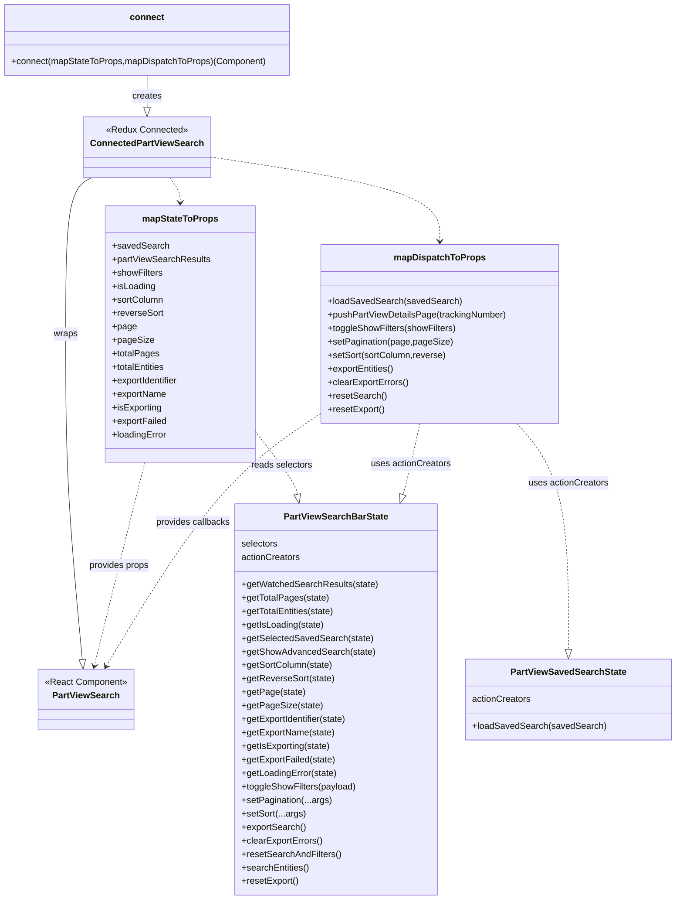

# Diagram: web/portal/src/pages/partview/search/PartView.Search.page.container.js

> Auto-generated by Obscura crawlers

## Mermaid

### SVG

<svg id="container" width="1187.78125" xmlns="http://www.w3.org/2000/svg" class="classDiagram" height="1600" viewBox="0 0 1187.78125 1600" role="graphics-document document" aria-roledescription="class"><g><defs><marker id="container_class-aggregationStart" class="marker aggregation class" refX="18" refY="7" markerWidth="190" markerHeight="240" orient="auto"><path d="M 18,7 L9,13 L1,7 L9,1 Z"></path></marker></defs><defs><marker id="container_class-aggregationEnd" class="marker aggregation class" refX="1" refY="7" markerWidth="20" markerHeight="28" orient="auto"><path d="M 18,7 L9,13 L1,7 L9,1 Z"></path></marker></defs><defs><marker id="container_class-extensionStart" class="marker extension class" refX="18" refY="7" markerWidth="190" markerHeight="240" orient="auto"><path d="M 1,7 L18,13 V 1 Z"></path></marker></defs><defs><marker id="container_class-extensionEnd" class="marker extension class" refX="1" refY="7" markerWidth="20" markerHeight="28" orient="auto"><path d="M 1,1 V 13 L18,7 Z"></path></marker></defs><defs><marker id="container_class-compositionStart" class="marker composition class" refX="18" refY="7" markerWidth="190" markerHeight="240" orient="auto"><path d="M 18,7 L9,13 L1,7 L9,1 Z"></path></marker></defs><defs><marker id="container_class-compositionEnd" class="marker composition class" refX="1" refY="7" markerWidth="20" markerHeight="28" orient="auto"><path d="M 18,7 L9,13 L1,7 L9,1 Z"></path></marker></defs><defs><marker id="container_class-dependencyStart" class="marker dependency class" refX="6" refY="7" markerWidth="190" markerHeight="240" orient="auto"><path d="M 5,7 L9,13 L1,7 L9,1 Z"></path></marker></defs><defs><marker id="container_class-dependencyEnd" class="marker dependency class" refX="13" refY="7" markerWidth="20" markerHeight="28" orient="auto"><path d="M 18,7 L9,13 L14,7 L9,1 Z"></path></marker></defs><defs><marker id="container_class-lollipopStart" class="marker lollipop class" refX="13" refY="7" markerWidth="190" markerHeight="240" orient="auto"><circle stroke="black" fill="transparent" cx="7" cy="7" r="6"></circle></marker></defs><defs><marker id="container_class-lollipopEnd" class="marker lollipop class" refX="1" refY="7" markerWidth="190" markerHeight="240" orient="auto"><circle stroke="black" fill="transparent" cx="7" cy="7" r="6"></circle></marker></defs><g class="root"><g class="clusters"></g><g class="edgePaths"><path d="M158.584,316L150.666,320.167C142.749,324.333,126.915,332.667,118.997,379C111.08,425.333,111.08,509.667,111.08,596C111.08,682.333,111.08,770.667,116.12,867.138C121.16,963.61,131.24,1068.22,136.28,1120.525L141.32,1172.83" id="id_ConnectedPartViewSearch_PartViewSearch_1" class="edge-thickness-normal edge-pattern-solid relation" style=";;;" data-edge="true" data-et="edge" data-id="id_ConnectedPartViewSearch_PartViewSearch_1" data-points="W3sieCI6MTU4LjU4MzY2Mjk3NDY4MzUzLCJ5IjozMTZ9LHsieCI6MTExLjA4MDA3ODEyNSwieSI6MzQxfSx7IngiOjExMS4wODAwNzgxMjUsInkiOjU5NH0seyJ4IjoxMTEuMDgwMDc4MTI1LCJ5Ijo4NTl9LHsieCI6MTQyLjk3NDQyNjc0NTEyOTg4LCJ5IjoxMTkwfV0=" marker-end="url(#container_class-extensionEnd)"></path><path d="M252.045,822L250.345,828.167C248.645,834.333,245.244,846.667,230.359,907.028C215.474,967.39,189.104,1075.78,175.919,1129.975L162.734,1184.17" id="id_mapStateToProps_PartViewSearch_2" class="edge-thickness-normal edge-pattern-dashed relation" style=";;;" data-edge="true" data-et="edge" data-id="id_mapStateToProps_PartViewSearch_2" data-points="W3sieCI6MjUyLjA0NDkyOTI0NTI4MzAyLCJ5Ijo4MjJ9LHsieCI6MjQxLjg0Mzc1LCJ5Ijo4NTl9LHsieCI6MTYxLjMxNTMwNTM5NzcyNzMsInkiOjExOTB9XQ==" marker-end="url(#container_class-dependencyEnd)"></path><path d="M563.143,736.291L533.089,756.742C503.035,777.194,442.928,818.097,379.773,892.861C316.617,967.626,250.414,1076.251,217.313,1130.564L184.211,1184.877" id="id_mapDispatchToProps_PartViewSearch_3" class="edge-thickness-normal edge-pattern-dashed relation" style=";;;" data-edge="true" data-et="edge" data-id="id_mapDispatchToProps_PartViewSearch_3" data-points="W3sieCI6NTYzLjE0MjU3ODEyNSwieSI6NzM2LjI5MDgxNzE3MDk3MjR9LHsieCI6MzgyLjgyMDMxMjUsInkiOjg1OX0seyJ4IjoxODEuMDg4NjQxNDM2Njg4MywieSI6MTE5MH1d" marker-end="url(#container_class-dependencyEnd)"></path><path d="M445.848,759.593L458.949,776.161C472.049,792.729,498.251,825.864,511.986,845.774C525.722,865.684,526.99,872.368,527.624,875.71L528.259,879.052" id="id_mapStateToProps_PartViewSearchBarState_4" class="edge-thickness-normal edge-pattern-dashed relation" style=";;;" data-edge="true" data-et="edge" data-id="id_mapStateToProps_PartViewSearchBarState_4" data-points="W3sieCI6NDQ1Ljg0NzY1NjI1LCJ5Ijo3NTkuNTkyODkwMTY0NzkwMX0seyJ4Ijo1MjQuNDUzMTI1LCJ5Ijo4NTl9LHsieCI6NTMxLjQ3NDcxNTkwOTA5MSwieSI6ODk2fV0=" marker-end="url(#container_class-extensionEnd)"></path><path d="M740.011,753L736.43,770.667C732.849,788.333,725.687,823.667,721.03,844.757C716.373,865.848,714.221,872.696,713.144,876.12L712.068,879.544" id="id_mapDispatchToProps_PartViewSearchBarState_5" class="edge-thickness-normal edge-pattern-dashed relation" style=";;;" data-edge="true" data-et="edge" data-id="id_mapDispatchToProps_PartViewSearchBarState_5" data-points="W3sieCI6NzQwLjAxMTMyODEyNSwieSI6NzUzfSx7IngiOjcxOC41MjUzOTA2MjUsInkiOjg1OX0seyJ4Ijo3MDYuODk1ODgwNjgxODE4MiwieSI6ODk2fV0=" marker-end="url(#container_class-extensionEnd)"></path><path d="M910.145,753L925.468,770.667C940.791,788.333,971.436,823.667,986.759,890.625C1002.082,957.583,1002.082,1056.167,1002.082,1105.458L1002.082,1154.75" id="id_mapDispatchToProps_PartViewSavedSearchState_6" class="edge-thickness-normal edge-pattern-dashed relation" style=";;;" data-edge="true" data-et="edge" data-id="id_mapDispatchToProps_PartViewSavedSearchState_6" data-points="W3sieCI6OTEwLjE0NTMxMjUsInkiOjc1M30seyJ4IjoxMDAyLjA4MjAzMTI1LCJ5Ijo4NTl9LHsieCI6MTAwMi4wODIwMzEyNSwieSI6MTE3Mn1d" marker-end="url(#container_class-extensionEnd)"></path><path d="M297.908,316L300.741,320.167C303.574,324.333,309.24,332.667,312.073,340C314.906,347.333,314.906,353.667,314.906,356.833L314.906,360" id="id_ConnectedPartViewSearch_mapStateToProps_7" class="edge-thickness-normal edge-pattern-dashed relation" style=";;;" data-edge="true" data-et="edge" data-id="id_ConnectedPartViewSearch_mapStateToProps_7" data-points="W3sieCI6Mjk3LjkwNzg4MTcyNDY4MzUzLCJ5IjozMTZ9LHsieCI6MzE0LjkwNjI1LCJ5IjozNDF9LHsieCI6MzE0LjkwNjI1LCJ5IjozNjZ9XQ==" marker-end="url(#container_class-dependencyEnd)"></path><path d="M368.949,278.658L436.164,289.048C503.38,299.438,637.81,320.219,705.025,345.276C772.24,370.333,772.24,399.667,772.24,414.333L772.24,429" id="id_ConnectedPartViewSearch_mapDispatchToProps_8" class="edge-thickness-normal edge-pattern-dashed relation" style=";;;" data-edge="true" data-et="edge" data-id="id_ConnectedPartViewSearch_mapDispatchToProps_8" data-points="W3sieCI6MzY4Ljk0OTIxODc1LCJ5IjoyNzguNjU3NjM5NTgxNTg5NjV9LHsieCI6NzcyLjI0MDIzNDM3NSwieSI6MzQxfSx7IngiOjc3Mi4yNDAyMzQzNzUsInkiOjQzNX1d" marker-end="url(#container_class-dependencyEnd)"></path><path d="M261.191,134L261.191,140.167C261.191,146.333,261.191,158.667,261.191,168.125C261.191,177.583,261.191,184.167,261.191,187.458L261.191,190.75" id="id_connect_ConnectedPartViewSearch_9" class="edge-thickness-normal edge-pattern-solid relation" style=";;;" data-edge="true" data-et="edge" data-id="id_connect_ConnectedPartViewSearch_9" data-points="W3sieCI6MjYxLjE5MTQwNjI1LCJ5IjoxMzR9LHsieCI6MjYxLjE5MTQwNjI1LCJ5IjoxNzF9LHsieCI6MjYxLjE5MTQwNjI1LCJ5IjoyMDh9XQ==" marker-end="url(#container_class-extensionEnd)"></path></g><g class="edgeLabels"><g class="edgeLabel" transform="translate(111.080078125, 594)"><g class="label" data-id="id_ConnectedPartViewSearch_PartViewSearch_1" transform="translate(-21.390625, -12)"><foreignObject width="42.78125" height="24">

wraps

</foreignObject></g></g><g class="edgeLabel" transform="translate(206.11597, 1005.85364)"><g class="label" data-id="id_mapStateToProps_PartViewSearch_2" transform="translate(-54.1953125, -12)"><foreignObject width="108.390625" height="24">

provides props

</foreignObject></g></g><g class="edgeLabel" transform="translate(338.71031, 931.3754)"><g class="label" data-id="id_mapDispatchToProps_PartViewSearch_3" transform="translate(-66.78125, -12)"><foreignObject width="133.5625" height="24">

provides callbacks

</foreignObject></g></g><g class="edgeLabel" transform="translate(496.82995, 824.06681)"><g class="label" data-id="id_mapStateToProps_PartViewSearchBarState_4" transform="translate(-54.8515625, -12)"><foreignObject width="109.703125" height="24">

reads selectors

</foreignObject></g></g><g class="edgeLabel" transform="translate(725.41593, 825.00579)"><g class="label" data-id="id_mapDispatchToProps_PartViewSearchBarState_5" transform="translate(-71.2734375, -12)"><foreignObject width="142.546875" height="24">

uses actionCreators

</foreignObject></g></g><g class="edgeLabel" transform="translate(1002.08203125, 859)"><g class="label" data-id="id_mapDispatchToProps_PartViewSavedSearchState_6" transform="translate(-71.2734375, -12)"><foreignObject width="142.546875" height="24">

uses actionCreators

</foreignObject></g></g><g class="edgeLabel"><g class="label" data-id="id_ConnectedPartViewSearch_mapStateToProps_7" transform="translate(0, 0)"><foreignObject width="0" height="0">

</foreignObject></g></g><g class="edgeLabel"><g class="label" data-id="id_ConnectedPartViewSearch_mapDispatchToProps_8" transform="translate(0, 0)"><foreignObject width="0" height="0">

</foreignObject></g></g><g class="edgeLabel" transform="translate(261.19140625, 171)"><g class="label" data-id="id_connect_ConnectedPartViewSearch_9" transform="translate(-26.171875, -12)"><foreignObject width="52.34375" height="24">

creates

</foreignObject></g></g></g><g class="nodes"><g class="node default" id="classId-PartViewSearch-0" transform="translate(148.177734375, 1244)"><g class="basic label-container"><path d="M-85.2109375 -54 L85.2109375 -54 L85.2109375 54 L-85.2109375 54" stroke="none" stroke-width="0" fill="#ECECFF" style=""></path><path d="M-85.2109375 -54 C-23.84213823308047 -54, 37.52666103383906 -54, 85.2109375 -54 M-85.2109375 -54 C-25.30635148077028 -54, 34.59823453845944 -54, 85.2109375 -54 M85.2109375 -54 C85.2109375 -18.292552203568235, 85.2109375 17.41489559286353, 85.2109375 54 M85.2109375 -54 C85.2109375 -17.220698112745254, 85.2109375 19.558603774509493, 85.2109375 54 M85.2109375 54 C50.91285581363643 54, 16.614774127272867 54, -85.2109375 54 M85.2109375 54 C41.966542694351055 54, -1.2778521112978893 54, -85.2109375 54 M-85.2109375 54 C-85.2109375 12.207052926107302, -85.2109375 -29.585894147785396, -85.2109375 -54 M-85.2109375 54 C-85.2109375 12.458197797754899, -85.2109375 -29.083604404490202, -85.2109375 -54" stroke="#9370DB" stroke-width="1.3" fill="none" stroke-dasharray="0 0" style=""></path></g><g class="annotation-group text" transform="translate(-73.2109375, -30)"><g class="label" style="" transform="translate(0,-12)"><foreignObject width="146.421875" height="24">

«React Component»

</foreignObject></g></g><g class="label-group text" transform="translate(-57.0078125, -6)"><g class="label" style="font-weight: bolder" transform="translate(0,-12)"><foreignObject width="114.015625" height="24">

PartViewSearch

</foreignObject></g></g><g class="members-group text" transform="translate(-73.2109375, 42)"></g><g class="methods-group text" transform="translate(-73.2109375, 72)"></g><g class="divider" style=""><path d="M-85.2109375 18 C-19.099165624550764 18, 47.01260625089847 18, 85.2109375 18 M-85.2109375 18 C-43.30015900694393 18, -1.3893805138878577 18, 85.2109375 18" stroke="#9370DB" stroke-width="1.3" fill="none" stroke-dasharray="0 0" style=""></path></g><g class="divider" style=""><path d="M-85.2109375 36 C-42.37696407917759 36, 0.4570093416448202 36, 85.2109375 36 M-85.2109375 36 C-39.30436627187735 36, 6.602204956245302 36, 85.2109375 36" stroke="#9370DB" stroke-width="1.3" fill="none" stroke-dasharray="0 0" style=""></path></g></g><g class="node default" id="classId-ConnectedPartViewSearch-1" transform="translate(261.19140625, 262)"><g class="basic label-container"><path d="M-107.7578125 -54 L107.7578125 -54 L107.7578125 54 L-107.7578125 54" stroke="none" stroke-width="0" fill="#ECECFF" style=""></path><path d="M-107.7578125 -54 C-36.561560058052805 -54, 34.63469238389439 -54, 107.7578125 -54 M-107.7578125 -54 C-35.06733223575564 -54, 37.623148028488714 -54, 107.7578125 -54 M107.7578125 -54 C107.7578125 -20.508647984843748, 107.7578125 12.982704030312505, 107.7578125 54 M107.7578125 -54 C107.7578125 -15.783559780098841, 107.7578125 22.432880439802318, 107.7578125 54 M107.7578125 54 C37.35334123793173 54, -33.05113002413654 54, -107.7578125 54 M107.7578125 54 C27.66133049042294 54, -52.43515151915412 54, -107.7578125 54 M-107.7578125 54 C-107.7578125 17.05230777844232, -107.7578125 -19.89538444311536, -107.7578125 -54 M-107.7578125 54 C-107.7578125 16.255976271940902, -107.7578125 -21.488047456118196, -107.7578125 -54" stroke="#9370DB" stroke-width="1.3" fill="none" stroke-dasharray="0 0" style=""></path></g><g class="annotation-group text" transform="translate(-72.1171875, -30)"><g class="label" style="" transform="translate(0,-12)"><foreignObject width="144.234375" height="24">

«Redux Connected»

</foreignObject></g></g><g class="label-group text" transform="translate(-95.7578125, -6)"><g class="label" style="font-weight: bolder" transform="translate(0,-12)"><foreignObject width="191.515625" height="24">

ConnectedPartViewSearch

</foreignObject></g></g><g class="members-group text" transform="translate(-95.7578125, 42)"></g><g class="methods-group text" transform="translate(-95.7578125, 72)"></g><g class="divider" style=""><path d="M-107.7578125 18 C-25.5320893671729 18, 56.6936337656542 18, 107.7578125 18 M-107.7578125 18 C-43.48668686558713 18, 20.784438768825737 18, 107.7578125 18" stroke="#9370DB" stroke-width="1.3" fill="none" stroke-dasharray="0 0" style=""></path></g><g class="divider" style=""><path d="M-107.7578125 36 C-59.75205766232879 36, -11.746302824657576 36, 107.7578125 36 M-107.7578125 36 C-54.16031760129332 36, -0.5628227025866437 36, 107.7578125 36" stroke="#9370DB" stroke-width="1.3" fill="none" stroke-dasharray="0 0" style=""></path></g></g><g class="node default" id="classId-PartViewSearchBarState-2" transform="translate(597.515625, 1244)"><g class="basic label-container"><path d="M-176.8671875 -348 L176.8671875 -348 L176.8671875 348 L-176.8671875 348" stroke="none" stroke-width="0" fill="#ECECFF" style=""></path><path d="M-176.8671875 -348 C-89.95124052104566 -348, -3.035293542091324 -348, 176.8671875 -348 M-176.8671875 -348 C-51.50150424171511 -348, 73.86417901656978 -348, 176.8671875 -348 M176.8671875 -348 C176.8671875 -118.1022622602419, 176.8671875 111.7954754795162, 176.8671875 348 M176.8671875 -348 C176.8671875 -156.37390105896026, 176.8671875 35.252197882079486, 176.8671875 348 M176.8671875 348 C69.65401045302775 348, -37.5591665939445 348, -176.8671875 348 M176.8671875 348 C64.26836986129679 348, -48.33044777740642 348, -176.8671875 348 M-176.8671875 348 C-176.8671875 200.2474366689086, -176.8671875 52.49487333781718, -176.8671875 -348 M-176.8671875 348 C-176.8671875 116.71664597062937, -176.8671875 -114.56670805874126, -176.8671875 -348" stroke="#9370DB" stroke-width="1.3" fill="none" stroke-dasharray="0 0" style=""></path></g><g class="annotation-group text" transform="translate(0, -324)"></g><g class="label-group text" transform="translate(-88.84375, -324)"><g class="label" style="font-weight: bolder" transform="translate(0,-12)"><foreignObject width="177.6875" height="24">

PartViewSearchBarState

</foreignObject></g></g><g class="members-group text" transform="translate(-164.8671875, -276)"><g class="label" style="" transform="translate(0,-12)"><foreignObject width="65.46875" height="24">

selectors

</foreignObject></g><g class="label" style="" transform="translate(0,12)"><foreignObject width="105.34375" height="24">

actionCreators

</foreignObject></g></g><g class="methods-group text" transform="translate(-164.8671875, -204)"><g class="label" style="" transform="translate(0,-12)"><foreignObject width="240.890625" height="24">

+getWatchedSearchResults(state)

</foreignObject></g><g class="label" style="" transform="translate(0,12)"><foreignObject width="153.859375" height="24">

+getTotalPages(state)

</foreignObject></g><g class="label" style="" transform="translate(0,36)"><foreignObject width="167.1875" height="24">

+getTotalEntities(state)

</foreignObject></g><g class="label" style="" transform="translate(0,60)"><foreignObject width="146.4375" height="24">

+getIsLoading(state)

</foreignObject></g><g class="label" style="" transform="translate(0,84)"><foreignObject width="231.234375" height="24">

+getSelectedSavedSearch(state)

</foreignObject></g><g class="label" style="" transform="translate(0,108)"><foreignObject width="234.6875" height="24">

+getShowAdvancedSearch(state)

</foreignObject></g><g class="label" style="" transform="translate(0,132)"><foreignObject width="162.109375" height="24">

+getSortColumn(state)

</foreignObject></g><g class="label" style="" transform="translate(0,156)"><foreignObject width="163.78125" height="24">

+getReverseSort(state)

</foreignObject></g><g class="label" style="" transform="translate(0,180)"><foreignObject width="110.765625" height="24">

+getPage(state)

</foreignObject></g><g class="label" style="" transform="translate(0,204)"><foreignObject width="139.59375" height="24">

+getPageSize(state)

</foreignObject></g><g class="label" style="" transform="translate(0,228)"><foreignObject width="190.90625" height="24">

+getExportIdentifier(state)

</foreignObject></g><g class="label" style="" transform="translate(0,252)"><foreignObject width="166.203125" height="24">

+getExportName(state)

</foreignObject></g><g class="label" style="" transform="translate(0,276)"><foreignObject width="158.53125" height="24">

+getIsExporting(state)

</foreignObject></g><g class="label" style="" transform="translate(0,300)"><foreignObject width="167.140625" height="24">

+getExportFailed(state)

</foreignObject></g><g class="label" style="" transform="translate(0,324)"><foreignObject width="170.046875" height="24">

+getLoadingError(state)

</foreignObject></g><g class="label" style="" transform="translate(0,348)"><foreignObject width="203.9375" height="24">

+toggleShowFilters(payload)

</foreignObject></g><g class="label" style="" transform="translate(0,372)"><foreignObject width="159.046875" height="24">

+setPagination(...args)

</foreignObject></g><g class="label" style="" transform="translate(0,396)"><foreignObject width="112.1875" height="24">

+setSort(...args)

</foreignObject></g><g class="label" style="" transform="translate(0,420)"><foreignObject width="114.203125" height="24">

+exportSearch()

</foreignObject></g><g class="label" style="" transform="translate(0,444)"><foreignObject width="144.203125" height="24">

+clearExportErrors()

</foreignObject></g><g class="label" style="" transform="translate(0,468)"><foreignObject width="175.71875" height="24">

+resetSearchAndFilters()

</foreignObject></g><g class="label" style="" transform="translate(0,492)"><foreignObject width="120.359375" height="24">

+searchEntities()

</foreignObject></g><g class="label" style="" transform="translate(0,516)"><foreignObject width="101.859375" height="24">

+resetExport()

</foreignObject></g></g><g class="divider" style=""><path d="M-176.8671875 -300 C-104.24004425881826 -300, -31.612901017636517 -300, 176.8671875 -300 M-176.8671875 -300 C-98.0394914522796 -300, -19.21179540455921 -300, 176.8671875 -300" stroke="#9370DB" stroke-width="1.3" fill="none" stroke-dasharray="0 0" style=""></path></g><g class="divider" style=""><path d="M-176.8671875 -228 C-71.14250032162768 -228, 34.58218685674464 -228, 176.8671875 -228 M-176.8671875 -228 C-95.4351067652752 -228, -14.003026030550387 -228, 176.8671875 -228" stroke="#9370DB" stroke-width="1.3" fill="none" stroke-dasharray="0 0" style=""></path></g></g><g class="node default" id="classId-PartViewSavedSearchState-3" transform="translate(1002.08203125, 1244)"><g class="basic label-container"><path d="M-177.69921875 -72 L177.69921875 -72 L177.69921875 72 L-177.69921875 72" stroke="none" stroke-width="0" fill="#ECECFF" style=""></path><path d="M-177.69921875 -72 C-84.52213668583423 -72, 8.654945378331547 -72, 177.69921875 -72 M-177.69921875 -72 C-71.98885561557576 -72, 33.72150751884848 -72, 177.69921875 -72 M177.69921875 -72 C177.69921875 -18.936916479984838, 177.69921875 34.126167040030325, 177.69921875 72 M177.69921875 -72 C177.69921875 -30.019122495484645, 177.69921875 11.96175500903071, 177.69921875 72 M177.69921875 72 C88.1813055332897 72, -1.3366076834205955 72, -177.69921875 72 M177.69921875 72 C81.56690420944962 72, -14.565410331100765 72, -177.69921875 72 M-177.69921875 72 C-177.69921875 33.189520720955436, -177.69921875 -5.620958558089129, -177.69921875 -72 M-177.69921875 72 C-177.69921875 32.936077941416265, -177.69921875 -6.12784411716747, -177.69921875 -72" stroke="#9370DB" stroke-width="1.3" fill="none" stroke-dasharray="0 0" style=""></path></g><g class="annotation-group text" transform="translate(0, -48)"></g><g class="label-group text" transform="translate(-98.4140625, -48)"><g class="label" style="font-weight: bolder" transform="translate(0,-12)"><foreignObject width="196.828125" height="24">

PartViewSavedSearchState

</foreignObject></g></g><g class="members-group text" transform="translate(-165.69921875, 0)"><g class="label" style="" transform="translate(0,-12)"><foreignObject width="105.34375" height="24">

actionCreators

</foreignObject></g></g><g class="methods-group text" transform="translate(-165.69921875, 48)"><g class="label" style="" transform="translate(0,-12)"><foreignObject width="232.984375" height="24">

+loadSavedSearch(savedSearch)

</foreignObject></g></g><g class="divider" style=""><path d="M-177.69921875 -24 C-88.22702447149706 -24, 1.2451698070058796 -24, 177.69921875 -24 M-177.69921875 -24 C-76.17944218502667 -24, 25.340334379946654 -24, 177.69921875 -24" stroke="#9370DB" stroke-width="1.3" fill="none" stroke-dasharray="0 0" style=""></path></g><g class="divider" style=""><path d="M-177.69921875 24 C-99.8252878942546 24, -21.9513570385092 24, 177.69921875 24 M-177.69921875 24 C-45.22843403583241 24, 87.24235067833519 24, 177.69921875 24" stroke="#9370DB" stroke-width="1.3" fill="none" stroke-dasharray="0 0" style=""></path></g></g><g class="node default" id="classId-mapStateToProps-4" transform="translate(314.90625, 594)"><g class="basic label-container"><path d="M-130.94140625 -228 L130.94140625 -228 L130.94140625 228 L-130.94140625 228" stroke="none" stroke-width="0" fill="#ECECFF" style=""></path><path d="M-130.94140625 -228 C-51.85936562227411 -228, 27.222675005451777 -228, 130.94140625 -228 M-130.94140625 -228 C-42.522418195072916 -228, 45.89656985985417 -228, 130.94140625 -228 M130.94140625 -228 C130.94140625 -72.7628381361803, 130.94140625 82.47432372763939, 130.94140625 228 M130.94140625 -228 C130.94140625 -78.65476338424168, 130.94140625 70.69047323151665, 130.94140625 228 M130.94140625 228 C71.90222479553543 228, 12.863043341070863 228, -130.94140625 228 M130.94140625 228 C43.84000952246306 228, -43.26138720507387 228, -130.94140625 228 M-130.94140625 228 C-130.94140625 106.6079377892061, -130.94140625 -14.78412442158779, -130.94140625 -228 M-130.94140625 228 C-130.94140625 125.282589257143, -130.94140625 22.565178514286004, -130.94140625 -228" stroke="#9370DB" stroke-width="1.3" fill="none" stroke-dasharray="0 0" style=""></path></g><g class="annotation-group text" transform="translate(0, -204)"></g><g class="label-group text" transform="translate(-64.7109375, -204)"><g class="label" style="font-weight: bolder" transform="translate(0,-12)"><foreignObject width="129.421875" height="24">

mapStateToProps

</foreignObject></g></g><g class="members-group text" transform="translate(-118.94140625, -156)"><g class="label" style="" transform="translate(0,-12)"><foreignObject width="98.5625" height="24">

+savedSearch

</foreignObject></g><g class="label" style="" transform="translate(0,12)"><foreignObject width="173.171875" height="24">

+partViewSearchResults

</foreignObject></g><g class="label" style="" transform="translate(0,36)"><foreignObject width="89.8125" height="24">

+showFilters

</foreignObject></g><g class="label" style="" transform="translate(0,60)"><foreignObject width="77.203125" height="24">

+isLoading

</foreignObject></g><g class="label" style="" transform="translate(0,84)"><foreignObject width="91.828125" height="24">

+sortColumn

</foreignObject></g><g class="label" style="" transform="translate(0,108)"><foreignObject width="91.015625" height="24">

+reverseSort

</foreignObject></g><g class="label" style="" transform="translate(0,132)"><foreignObject width="42.65625" height="24">

+page

</foreignObject></g><g class="label" style="" transform="translate(0,156)"><foreignObject width="71.5" height="24">

+pageSize

</foreignObject></g><g class="label" style="" transform="translate(0,180)"><foreignObject width="82.90625" height="24">

+totalPages

</foreignObject></g><g class="label" style="" transform="translate(0,204)"><foreignObject width="96.234375" height="24">

+totalEntities

</foreignObject></g><g class="label" style="" transform="translate(0,228)"><foreignObject width="121.890625" height="24">

+exportIdentifier

</foreignObject></g><g class="label" style="" transform="translate(0,252)"><foreignObject width="97.1875" height="24">

+exportName

</foreignObject></g><g class="label" style="" transform="translate(0,276)"><foreignObject width="89.296875" height="24">

+isExporting

</foreignObject></g><g class="label" style="" transform="translate(0,300)"><foreignObject width="98.140625" height="24">

+exportFailed

</foreignObject></g><g class="label" style="" transform="translate(0,324)"><foreignObject width="98.0625" height="24">

+loadingError

</foreignObject></g></g><g class="methods-group text" transform="translate(-118.94140625, 228)"></g><g class="divider" style=""><path d="M-130.94140625 -180 C-27.79151381052469 -180, 75.35837862895062 -180, 130.94140625 -180 M-130.94140625 -180 C-72.72350615736772 -180, -14.505606064735431 -180, 130.94140625 -180" stroke="#9370DB" stroke-width="1.3" fill="none" stroke-dasharray="0 0" style=""></path></g><g class="divider" style=""><path d="M-130.94140625 204 C-57.80681886450226 204, 15.327768520995477 204, 130.94140625 204 M-130.94140625 204 C-31.793503617578764 204, 67.35439901484247 204, 130.94140625 204" stroke="#9370DB" stroke-width="1.3" fill="none" stroke-dasharray="0 0" style=""></path></g></g><g class="node default" id="classId-mapDispatchToProps-5" transform="translate(772.240234375, 594)"><g class="basic label-container"><path d="M-209.09765625 -159 L209.09765625 -159 L209.09765625 159 L-209.09765625 159" stroke="none" stroke-width="0" fill="#ECECFF" style=""></path><path d="M-209.09765625 -159 C-53.46685467009698 -159, 102.16394690980604 -159, 209.09765625 -159 M-209.09765625 -159 C-78.18217028366479 -159, 52.73331568267042 -159, 209.09765625 -159 M209.09765625 -159 C209.09765625 -60.98136920030669, 209.09765625 37.037261599386625, 209.09765625 159 M209.09765625 -159 C209.09765625 -68.39863716466951, 209.09765625 22.202725670660982, 209.09765625 159 M209.09765625 159 C44.57515759481154 159, -119.94734106037691 159, -209.09765625 159 M209.09765625 159 C62.0793284283146 159, -84.9389993933708 159, -209.09765625 159 M-209.09765625 159 C-209.09765625 66.91910311075756, -209.09765625 -25.161793778484878, -209.09765625 -159 M-209.09765625 159 C-209.09765625 87.6166175250809, -209.09765625 16.233235050161795, -209.09765625 -159" stroke="#9370DB" stroke-width="1.3" fill="none" stroke-dasharray="0 0" style=""></path></g><g class="annotation-group text" transform="translate(0, -135)"></g><g class="label-group text" transform="translate(-77.1953125, -135)"><g class="label" style="font-weight: bolder" transform="translate(0,-12)"><foreignObject width="154.390625" height="24">

mapDispatchToProps

</foreignObject></g></g><g class="members-group text" transform="translate(-197.09765625, -87)"></g><g class="methods-group text" transform="translate(-197.09765625, -57)"><g class="label" style="" transform="translate(0,-12)"><foreignObject width="232.984375" height="24">

+loadSavedSearch(savedSearch)

</foreignObject></g><g class="label" style="" transform="translate(0,12)"><foreignObject width="317" height="24">

+pushPartViewDetailsPage(trackingNumber)

</foreignObject></g><g class="label" style="" transform="translate(0,36)"><foreignObject width="228.03125" height="24">

+toggleShowFilters(showFilters)

</foreignObject></g><g class="label" style="" transform="translate(0,60)"><foreignObject width="219.0625" height="24">

+setPagination(page,pageSize)

</foreignObject></g><g class="label" style="" transform="translate(0,84)"><foreignObject width="211.03125" height="24">

+setSort(sortColumn,reverse)

</foreignObject></g><g class="label" style="" transform="translate(0,108)"><foreignObject width="120.046875" height="24">

+exportEntities()

</foreignObject></g><g class="label" style="" transform="translate(0,132)"><foreignObject width="144.203125" height="24">

+clearExportErrors()

</foreignObject></g><g class="label" style="" transform="translate(0,156)"><foreignObject width="103.453125" height="24">

+resetSearch()

</foreignObject></g><g class="label" style="" transform="translate(0,180)"><foreignObject width="101.859375" height="24">

+resetExport()

</foreignObject></g></g><g class="divider" style=""><path d="M-209.09765625 -111 C-112.08409918199946 -111, -15.070542113998926 -111, 209.09765625 -111 M-209.09765625 -111 C-121.85152296485548 -111, -34.60538967971095 -111, 209.09765625 -111" stroke="#9370DB" stroke-width="1.3" fill="none" stroke-dasharray="0 0" style=""></path></g><g class="divider" style=""><path d="M-209.09765625 -87 C-46.77336980673505 -87, 115.5509166365299 -87, 209.09765625 -87 M-209.09765625 -87 C-87.67270334464142 -87, 33.75224956071716 -87, 209.09765625 -87" stroke="#9370DB" stroke-width="1.3" fill="none" stroke-dasharray="0 0" style=""></path></g></g><g class="node default" id="classId-connect-6" transform="translate(261.19140625, 71)"><g class="basic label-container"><path d="M-253.19140625 -63 L253.19140625 -63 L253.19140625 63 L-253.19140625 63" stroke="none" stroke-width="0" fill="#ECECFF" style=""></path><path d="M-253.19140625 -63 C-95.76259277161577 -63, 61.666220706768456 -63, 253.19140625 -63 M-253.19140625 -63 C-136.1056138963214 -63, -19.019821542642774 -63, 253.19140625 -63 M253.19140625 -63 C253.19140625 -16.618457378342228, 253.19140625 29.763085243315544, 253.19140625 63 M253.19140625 -63 C253.19140625 -24.741390696081766, 253.19140625 13.517218607836469, 253.19140625 63 M253.19140625 63 C122.68633000491488 63, -7.818746240170242 63, -253.19140625 63 M253.19140625 63 C106.63400404226292 63, -39.92339816547417 63, -253.19140625 63 M-253.19140625 63 C-253.19140625 15.617296569448015, -253.19140625 -31.76540686110397, -253.19140625 -63 M-253.19140625 63 C-253.19140625 12.855299099221561, -253.19140625 -37.28940180155688, -253.19140625 -63" stroke="#9370DB" stroke-width="1.3" fill="none" stroke-dasharray="0 0" style=""></path></g><g class="annotation-group text" transform="translate(0, -39)"></g><g class="label-group text" transform="translate(-28.9140625, -39)"><g class="label" style="font-weight: bolder" transform="translate(0,-12)"><foreignObject width="57.828125" height="24">

connect

</foreignObject></g></g><g class="members-group text" transform="translate(-241.19140625, 9)"></g><g class="methods-group text" transform="translate(-241.19140625, 39)"><g class="label" style="" transform="translate(0,-12)"><foreignObject width="453.46875" height="24">

+connect(mapStateToProps,mapDispatchToProps)(Component)

</foreignObject></g></g><g class="divider" style=""><path d="M-253.19140625 -15 C-123.90347189063414 -15, 5.384462468731726 -15, 253.19140625 -15 M-253.19140625 -15 C-84.43122621066985 -15, 84.3289538286603 -15, 253.19140625 -15" stroke="#9370DB" stroke-width="1.3" fill="none" stroke-dasharray="0 0" style=""></path></g><g class="divider" style=""><path d="M-253.19140625 9 C-94.24788141223453 9, 64.69564342553093 9, 253.19140625 9 M-253.19140625 9 C-82.86610347137687 9, 87.45919930724625 9, 253.19140625 9" stroke="#9370DB" stroke-width="1.3" fill="none" stroke-dasharray="0 0" style=""></path></g></g></g></g></g></svg>
