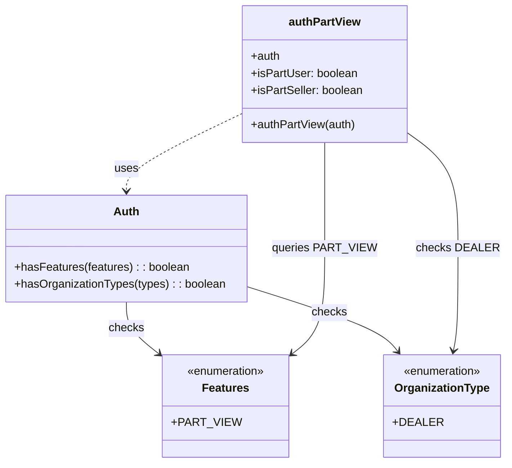

# Diagram: web/portal/src/pages/partview/utils/auth.util.js


> Auto-generated by Obscura crawlers

## Diagram 1



### SVG

<svg id="container" width="684.990234375" xmlns="http://www.w3.org/2000/svg" class="classDiagram" height="650" viewBox="0 0 684.990234375 650" role="graphics-document document" aria-roledescription="class"><style>#container{font-family:"trebuchet ms",verdana,arial,sans-serif;font-size:16px;fill:#333;}@keyframes edge-animation-frame{from{stroke-dashoffset:0;}}@keyframes dash{to{stroke-dashoffset:0;}}#container .edge-animation-slow{stroke-dasharray:9,5!important;stroke-dashoffset:900;animation:dash 50s linear infinite;stroke-linecap:round;}#container .edge-animation-fast{stroke-dasharray:9,5!important;stroke-dashoffset:900;animation:dash 20s linear infinite;stroke-linecap:round;}#container .error-icon{fill:#552222;}#container .error-text{fill:#552222;stroke:#552222;}#container .edge-thickness-normal{stroke-width:1px;}#container .edge-thickness-thick{stroke-width:3.5px;}#container .edge-pattern-solid{stroke-dasharray:0;}#container .edge-thickness-invisible{stroke-width:0;fill:none;}#container .edge-pattern-dashed{stroke-dasharray:3;}#container .edge-pattern-dotted{stroke-dasharray:2;}#container .marker{fill:#333333;stroke:#333333;}#container .marker.cross{stroke:#333333;}#container svg{font-family:"trebuchet ms",verdana,arial,sans-serif;font-size:16px;}#container p{margin:0;}#container g.classGroup text{fill:#9370DB;stroke:none;font-family:"trebuchet ms",verdana,arial,sans-serif;font-size:10px;}#container g.classGroup text .title{font-weight:bolder;}#container .nodeLabel,#container .edgeLabel{color:#131300;}#container .edgeLabel .label rect{fill:#ECECFF;}#container .label text{fill:#131300;}#container .labelBkg{background:#ECECFF;}#container .edgeLabel .label span{background:#ECECFF;}#container .classTitle{font-weight:bolder;}#container .node rect,#container .node circle,#container .node ellipse,#container .node polygon,#container .node path{fill:#ECECFF;stroke:#9370DB;stroke-width:1px;}#container .divider{stroke:#9370DB;stroke-width:1;}#container g.clickable{cursor:pointer;}#container g.classGroup rect{fill:#ECECFF;stroke:#9370DB;}#container g.classGroup line{stroke:#9370DB;stroke-width:1;}#container .classLabel .box{stroke:none;stroke-width:0;fill:#ECECFF;opacity:0.5;}#container .classLabel .label{fill:#9370DB;font-size:10px;}#container .relation{stroke:#333333;stroke-width:1;fill:none;}#container .dashed-line{stroke-dasharray:3;}#container .dotted-line{stroke-dasharray:1 2;}#container #compositionStart,#container .composition{fill:#333333!important;stroke:#333333!important;stroke-width:1;}#container #compositionEnd,#container .composition{fill:#333333!important;stroke:#333333!important;stroke-width:1;}#container #dependencyStart,#container .dependency{fill:#333333!important;stroke:#333333!important;stroke-width:1;}#container #dependencyStart,#container .dependency{fill:#333333!important;stroke:#333333!important;stroke-width:1;}#container #extensionStart,#container .extension{fill:transparent!important;stroke:#333333!important;stroke-width:1;}#container #extensionEnd,#container .extension{fill:transparent!important;stroke:#333333!important;stroke-width:1;}#container #aggregationStart,#container .aggregation{fill:transparent!important;stroke:#333333!important;stroke-width:1;}#container #aggregationEnd,#container .aggregation{fill:transparent!important;stroke:#333333!important;stroke-width:1;}#container #lollipopStart,#container .lollipop{fill:#ECECFF!important;stroke:#333333!important;stroke-width:1;}#container #lollipopEnd,#container .lollipop{fill:#ECECFF!important;stroke:#333333!important;stroke-width:1;}#container .edgeTerminals{font-size:11px;line-height:initial;}#container .classTitleText{text-anchor:middle;font-size:18px;fill:#333;}#container .label-icon{display:inline-block;height:1em;overflow:visible;vertical-align:-0.125em;}#container .node .label-icon path{fill:currentColor;stroke:revert;stroke-width:revert;}#container :root{--mermaid-font-family:"trebuchet ms",verdana,arial,sans-serif;}</style><g><defs><marker id="container_class-aggregationStart" class="marker aggregation class" refX="18" refY="7" markerWidth="190" markerHeight="240" orient="auto"><path d="M 18,7 L9,13 L1,7 L9,1 Z"></path></marker></defs><defs><marker id="container_class-aggregationEnd" class="marker aggregation class" refX="1" refY="7" markerWidth="20" markerHeight="28" orient="auto"><path d="M 18,7 L9,13 L1,7 L9,1 Z"></path></marker></defs><defs><marker id="container_class-extensionStart" class="marker extension class" refX="18" refY="7" markerWidth="190" markerHeight="240" orient="auto"><path d="M 1,7 L18,13 V 1 Z"></path></marker></defs><defs><marker id="container_class-extensionEnd" class="marker extension class" refX="1" refY="7" markerWidth="20" markerHeight="28" orient="auto"><path d="M 1,1 V 13 L18,7 Z"></path></marker></defs><defs><marker id="container_class-compositionStart" class="marker composition class" refX="18" refY="7" markerWidth="190" markerHeight="240" orient="auto"><path d="M 18,7 L9,13 L1,7 L9,1 Z"></path></marker></defs><defs><marker id="container_class-compositionEnd" class="marker composition class" refX="1" refY="7" markerWidth="20" markerHeight="28" orient="auto"><path d="M 18,7 L9,13 L1,7 L9,1 Z"></path></marker></defs><defs><marker id="container_class-dependencyStart" class="marker dependency class" refX="6" refY="7" markerWidth="190" markerHeight="240" orient="auto"><path d="M 5,7 L9,13 L1,7 L9,1 Z"></path></marker></defs><defs><marker id="container_class-dependencyEnd" class="marker dependency class" refX="13" refY="7" markerWidth="20" markerHeight="28" orient="auto"><path d="M 18,7 L9,13 L14,7 L9,1 Z"></path></marker></defs><defs><marker id="container_class-lollipopStart" class="marker lollipop class" refX="13" refY="7" markerWidth="190" markerHeight="240" orient="auto"><circle stroke="black" fill="transparent" cx="7" cy="7" r="6"></circle></marker></defs><defs><marker id="container_class-lollipopEnd" class="marker lollipop class" refX="1" refY="7" markerWidth="190" markerHeight="240" orient="auto"><circle stroke="black" fill="transparent" cx="7" cy="7" r="6"></circle></marker></defs><g class="root"><g class="clusters"></g><g class="edgePaths"><path d="M176.574,424L176.574,430.167C176.574,436.333,176.574,448.667,184.692,461.35C192.81,474.033,209.045,487.067,217.162,493.583L225.28,500.1" id="id_Auth_Features_1" class="edge-thickness-normal edge-pattern-solid relation" style=";;;" data-edge="true" data-et="edge" data-id="id_Auth_Features_1" data-points="W3sieCI6MTc2LjU3NDIxODc1LCJ5Ijo0MjR9LHsieCI6MTc2LjU3NDIxODc1LCJ5Ijo0NjF9LHsieCI6MjI5Ljk1ODk4NDM3NSwieSI6NTAzLjg1NTg2Njc0MTQ2NjM0fV0=" marker-end="url(#container_class-dependencyEnd)"></path><path d="M345.148,404.138L374.122,413.615C403.096,423.092,461.044,442.046,494.054,456.89C527.065,471.735,535.137,482.47,539.173,487.837L543.21,493.205" id="id_Auth_OrganizationType_2" class="edge-thickness-normal edge-pattern-solid relation" style=";;;" data-edge="true" data-et="edge" data-id="id_Auth_OrganizationType_2" data-points="W3sieCI6MzQ1LjE0ODQzNzUsInkiOjQwNC4xMzgyMDYwMDI4MDYzfSx7IngiOjUxOC45OTIxODc1LCJ5Ijo0NjF9LHsieCI6NTQ2LjgxNTc3OTA5OTc3MDcsInkiOjQ5OH1d" marker-end="url(#container_class-dependencyEnd)"></path><path d="M332.477,160.644L306.493,173.37C280.509,186.096,228.542,211.548,202.558,229.441C176.574,247.333,176.574,257.667,176.574,262.833L176.574,268" id="id_authPartView_Auth_3" class="edge-thickness-normal edge-pattern-dashed relation" style=";;;" data-edge="true" data-et="edge" data-id="id_authPartView_Auth_3" data-points="W3sieCI6MzMyLjQ3NjU2MjUsInkiOjE2MC42NDQ0MjgxNDE5NDY4fSx7IngiOjE3Ni41NzQyMTg3NSwieSI6MjM3fSx7IngiOjE3Ni41NzQyMTg3NSwieSI6Mjc0fV0=" marker-end="url(#container_class-dependencyEnd)"></path><path d="M448.133,200L448.133,206.167C448.133,212.333,448.133,224.667,448.133,249.5C448.133,274.333,448.133,311.667,448.133,349C448.133,386.333,448.133,423.667,440.015,448.85C431.898,474.033,415.662,487.067,407.545,493.583L399.427,500.1" id="id_authPartView_Features_4" class="edge-thickness-normal edge-pattern-solid relation" style=";;;" data-edge="true" data-et="edge" data-id="id_authPartView_Features_4" data-points="W3sieCI6NDQ4LjEzMjgxMjUsInkiOjIwMH0seyJ4Ijo0NDguMTMyODEyNSwieSI6MjM3fSx7IngiOjQ0OC4xMzI4MTI1LCJ5IjozNDl9LHsieCI6NDQ4LjEzMjgxMjUsInkiOjQ2MX0seyJ4IjozOTQuNzQ4MDQ2ODc1LCJ5Ijo1MDMuODU1ODY2NzQxNDY2MzR9XQ==" marker-end="url(#container_class-dependencyEnd)"></path><path d="M563.789,191.862L573.692,199.385C583.594,206.908,603.4,221.954,613.302,248.144C623.205,274.333,623.205,311.667,623.205,349C623.205,386.333,623.205,423.667,622.146,447.52C621.088,471.374,618.971,481.747,617.912,486.934L616.853,492.121" id="id_authPartView_OrganizationType_5" class="edge-thickness-normal edge-pattern-solid relation" style=";;;" data-edge="true" data-et="edge" data-id="id_authPartView_OrganizationType_5" data-points="W3sieCI6NTYzLjc4OTA2MjUsInkiOjE5MS44NjI0Njc1MDc4MzcxNX0seyJ4Ijo2MjMuMjA1MDc4MTI1LCJ5IjoyMzd9LHsieCI6NjIzLjIwNTA3ODEyNSwieSI6MzQ5fSx7IngiOjYyMy4yMDUwNzgxMjUsInkiOjQ2MX0seyJ4Ijo2MTUuNjUzNjUxODA2MTkyNywieSI6NDk4fV0=" marker-end="url(#container_class-dependencyEnd)"></path></g><g class="edgeLabels"><g class="edgeLabel" transform="translate(176.57421875, 461)"><g class="label" data-id="id_Auth_Features_1" transform="translate(-24.4921875, -12)"><foreignObject width="48.984375" height="24"><div xmlns="http://www.w3.org/1999/xhtml" class="labelBkg" style="display: table-cell; white-space: nowrap; line-height: 1.5; max-width: 200px; text-align: center;"><span class="edgeLabel"><p>checks</p></span></div></foreignObject></g></g><g class="edgeLabel" transform="translate(518.9921875, 461)"><g class="label" data-id="id_Auth_OrganizationType_2" transform="translate(-24.4921875, -12)"><foreignObject width="48.984375" height="24"><div xmlns="http://www.w3.org/1999/xhtml" class="labelBkg" style="display: table-cell; white-space: nowrap; line-height: 1.5; max-width: 200px; text-align: center;"><span class="edgeLabel"><p>checks</p></span></div></foreignObject></g></g><g class="edgeLabel" transform="translate(176.57421875, 237)"><g class="label" data-id="id_authPartView_Auth_3" transform="translate(-16.4921875, -12)"><foreignObject width="32.984375" height="24"><div xmlns="http://www.w3.org/1999/xhtml" class="labelBkg" style="display: table-cell; white-space: nowrap; line-height: 1.5; max-width: 200px; text-align: center;"><span class="edgeLabel"><p>uses</p></span></div></foreignObject></g></g><g class="edgeLabel" transform="translate(448.1328125, 349)"><g class="label" data-id="id_authPartView_Features_4" transform="translate(-67.984375, -12)"><foreignObject width="135.96875" height="24"><div xmlns="http://www.w3.org/1999/xhtml" class="labelBkg" style="display: table-cell; white-space: nowrap; line-height: 1.5; max-width: 200px; text-align: center;"><span class="edgeLabel"><p>queries PART_VIEW</p></span></div></foreignObject></g></g><g class="edgeLabel" transform="translate(623.205078125, 349)"><g class="label" data-id="id_authPartView_OrganizationType_5" transform="translate(-53.734375, -12)"><foreignObject width="107.46875" height="24"><div xmlns="http://www.w3.org/1999/xhtml" class="labelBkg" style="display: table-cell; white-space: nowrap; line-height: 1.5; max-width: 200px; text-align: center;"><span class="edgeLabel"><p>checks DEALER</p></span></div></foreignObject></g></g></g><g class="nodes"><g class="node default" id="classId-Features-0" transform="translate(312.353515625, 570)"><g class="basic label-container"><path d="M-82.39453125 -72 L82.39453125 -72 L82.39453125 72 L-82.39453125 72" stroke="none" stroke-width="0" fill="#ECECFF" style=""></path><path d="M-82.39453125 -72 C-36.937530296080354 -72, 8.519470657839292 -72, 82.39453125 -72 M-82.39453125 -72 C-26.93715772271579 -72, 28.520215804568423 -72, 82.39453125 -72 M82.39453125 -72 C82.39453125 -28.133872189395518, 82.39453125 15.732255621208964, 82.39453125 72 M82.39453125 -72 C82.39453125 -22.92212379012244, 82.39453125 26.155752419755117, 82.39453125 72 M82.39453125 72 C38.739583703203905 72, -4.915363843592189 72, -82.39453125 72 M82.39453125 72 C29.938939401907277 72, -22.516652446185446 72, -82.39453125 72 M-82.39453125 72 C-82.39453125 23.05251222566811, -82.39453125 -25.89497554866378, -82.39453125 -72 M-82.39453125 72 C-82.39453125 19.687883039702015, -82.39453125 -32.62423392059597, -82.39453125 -72" stroke="#9370DB" stroke-width="1.3" fill="none" stroke-dasharray="0 0" style=""></path></g><g class="annotation-group text" transform="translate(-55.5546875, -48)"><g class="label" style="" transform="translate(0,-12)"><foreignObject width="111.109375" height="24"><div xmlns="http://www.w3.org/1999/xhtml" style="display: table-cell; white-space: nowrap; line-height: 1.5; max-width: 161px; text-align: center;"><span class="nodeLabel markdown-node-label" style=""><p>«enumeration»</p></span></div></foreignObject></g></g><g class="label-group text" transform="translate(-31.25, -24)"><g class="label" style="font-weight: bolder" transform="translate(0,-12)"><foreignObject width="62.5" height="24"><div xmlns="http://www.w3.org/1999/xhtml" style="display: table-cell; white-space: nowrap; line-height: 1.5; max-width: 112px; text-align: center;"><span class="nodeLabel markdown-node-label" style=""><p>Features</p></span></div></foreignObject></g></g><g class="members-group text" transform="translate(-70.39453125, 24)"><g class="label" style="" transform="translate(0,-12)"><foreignObject width="85.234375" height="24"><div xmlns="http://www.w3.org/1999/xhtml" style="display: table-cell; white-space: nowrap; line-height: 1.5; max-width: 143px; text-align: center;"><span class="nodeLabel markdown-node-label" style=""><p>+PART_VIEW</p></span></div></foreignObject></g></g><g class="methods-group text" transform="translate(-70.39453125, 72)"></g><g class="divider" style=""><path d="M-82.39453125 0 C-41.94672046264841 0, -1.4989096752968152 0, 82.39453125 0 M-82.39453125 0 C-41.19240306391756 0, 0.009725122164880418 0, 82.39453125 0" stroke="#9370DB" stroke-width="1.3" fill="none" stroke-dasharray="0 0" style=""></path></g><g class="divider" style=""><path d="M-82.39453125 48 C-25.999739450352394 48, 30.395052349295213 48, 82.39453125 48 M-82.39453125 48 C-18.5344964493112 48, 45.3255383513776 48, 82.39453125 48" stroke="#9370DB" stroke-width="1.3" fill="none" stroke-dasharray="0 0" style=""></path></g></g><g class="node default" id="classId-OrganizationType-1" transform="translate(600.958984375, 570)"><g class="basic label-container"><path d="M-76.03125 -72 L76.03125 -72 L76.03125 72 L-76.03125 72" stroke="none" stroke-width="0" fill="#ECECFF" style=""></path><path d="M-76.03125 -72 C-37.42996540483064 -72, 1.1713191903387212 -72, 76.03125 -72 M-76.03125 -72 C-31.260423484801464 -72, 13.510403030397072 -72, 76.03125 -72 M76.03125 -72 C76.03125 -15.838203281524038, 76.03125 40.323593436951924, 76.03125 72 M76.03125 -72 C76.03125 -36.18814267121738, 76.03125 -0.3762853424347554, 76.03125 72 M76.03125 72 C28.01682307524291 72, -19.997603849514178 72, -76.03125 72 M76.03125 72 C29.340555777501336 72, -17.350138444997327 72, -76.03125 72 M-76.03125 72 C-76.03125 34.44678539120957, -76.03125 -3.106429217580853, -76.03125 -72 M-76.03125 72 C-76.03125 27.509433173521913, -76.03125 -16.981133652956174, -76.03125 -72" stroke="#9370DB" stroke-width="1.3" fill="none" stroke-dasharray="0 0" style=""></path></g><g class="annotation-group text" transform="translate(-55.5546875, -48)"><g class="label" style="" transform="translate(0,-12)"><foreignObject width="111.109375" height="24"><div xmlns="http://www.w3.org/1999/xhtml" style="display: table-cell; white-space: nowrap; line-height: 1.5; max-width: 161px; text-align: center;"><span class="nodeLabel markdown-node-label" style=""><p>«enumeration»</p></span></div></foreignObject></g></g><g class="label-group text" transform="translate(-64.03125, -24)"><g class="label" style="font-weight: bolder" transform="translate(0,-12)"><foreignObject width="128.0625" height="24"><div xmlns="http://www.w3.org/1999/xhtml" style="display: table-cell; white-space: nowrap; line-height: 1.5; max-width: 176px; text-align: center;"><span class="nodeLabel markdown-node-label" style=""><p>OrganizationType</p></span></div></foreignObject></g></g><g class="members-group text" transform="translate(-64.03125, 24)"><g class="label" style="" transform="translate(0,-12)"><foreignObject width="62.234375" height="24"><div xmlns="http://www.w3.org/1999/xhtml" style="display: table-cell; white-space: nowrap; line-height: 1.5; max-width: 120px; text-align: center;"><span class="nodeLabel markdown-node-label" style=""><p>+DEALER</p></span></div></foreignObject></g></g><g class="methods-group text" transform="translate(-64.03125, 72)"></g><g class="divider" style=""><path d="M-76.03125 0 C-32.61932189046712 0, 10.79260621906576 0, 76.03125 0 M-76.03125 0 C-18.282190671533108 0, 39.466868656933784 0, 76.03125 0" stroke="#9370DB" stroke-width="1.3" fill="none" stroke-dasharray="0 0" style=""></path></g><g class="divider" style=""><path d="M-76.03125 48 C-33.04024269073612 48, 9.950764618527757 48, 76.03125 48 M-76.03125 48 C-22.465429961672648 48, 31.100390076654705 48, 76.03125 48" stroke="#9370DB" stroke-width="1.3" fill="none" stroke-dasharray="0 0" style=""></path></g></g><g class="node default" id="classId-Auth-2" transform="translate(176.57421875, 349)"><g class="basic label-container"><path d="M-168.57421875 -75 L168.57421875 -75 L168.57421875 75 L-168.57421875 75" stroke="none" stroke-width="0" fill="#ECECFF" style=""></path><path d="M-168.57421875 -75 C-70.65789814067872 -75, 27.25842246864255 -75, 168.57421875 -75 M-168.57421875 -75 C-52.18404759927044 -75, 64.20612355145911 -75, 168.57421875 -75 M168.57421875 -75 C168.57421875 -35.697221739817586, 168.57421875 3.6055565203648285, 168.57421875 75 M168.57421875 -75 C168.57421875 -39.76480817633559, 168.57421875 -4.529616352671184, 168.57421875 75 M168.57421875 75 C93.25464861784435 75, 17.935078485688706 75, -168.57421875 75 M168.57421875 75 C48.571402931094525 75, -71.43141288781095 75, -168.57421875 75 M-168.57421875 75 C-168.57421875 32.20935625127966, -168.57421875 -10.581287497440684, -168.57421875 -75 M-168.57421875 75 C-168.57421875 22.376184469707567, -168.57421875 -30.247631060584865, -168.57421875 -75" stroke="#9370DB" stroke-width="1.3" fill="none" stroke-dasharray="0 0" style=""></path></g><g class="annotation-group text" transform="translate(0, -51)"></g><g class="label-group text" transform="translate(-17.0078125, -51)"><g class="label" style="font-weight: bolder" transform="translate(0,-12)"><foreignObject width="34.015625" height="24"><div xmlns="http://www.w3.org/1999/xhtml" style="display: table-cell; white-space: nowrap; line-height: 1.5; max-width: 84px; text-align: center;"><span class="nodeLabel markdown-node-label" style=""><p>Auth</p></span></div></foreignObject></g></g><g class="members-group text" transform="translate(-156.57421875, -3)"></g><g class="methods-group text" transform="translate(-156.57421875, 27)"><g class="label" style="" transform="translate(0,-12)"><foreignObject width="244.5625" height="24"><div xmlns="http://www.w3.org/1999/xhtml" style="display: table-cell; white-space: nowrap; line-height: 1.5; max-width: 302px; text-align: center;"><span class="nodeLabel markdown-node-label" style=""><p>+hasFeatures(features) : : boolean</p></span></div></foreignObject></g><g class="label" style="" transform="translate(0,12)"><foreignObject width="296.140625" height="24"><div xmlns="http://www.w3.org/1999/xhtml" style="display: table-cell; white-space: nowrap; line-height: 1.5; max-width: 354px; text-align: center;"><span class="nodeLabel markdown-node-label" style=""><p>+hasOrganizationTypes(types) : : boolean</p></span></div></foreignObject></g></g><g class="divider" style=""><path d="M-168.57421875 -27 C-80.97360833357854 -27, 6.627002082842921 -27, 168.57421875 -27 M-168.57421875 -27 C-99.79573239647998 -27, -31.017246042959954 -27, 168.57421875 -27" stroke="#9370DB" stroke-width="1.3" fill="none" stroke-dasharray="0 0" style=""></path></g><g class="divider" style=""><path d="M-168.57421875 -3 C-93.72571980704161 -3, -18.877220864083228 -3, 168.57421875 -3 M-168.57421875 -3 C-65.30029942871106 -3, 37.97361989257789 -3, 168.57421875 -3" stroke="#9370DB" stroke-width="1.3" fill="none" stroke-dasharray="0 0" style=""></path></g></g><g class="node default" id="classId-authPartView-3" transform="translate(448.1328125, 104)"><g class="basic label-container"><path d="M-115.65625 -96 L115.65625 -96 L115.65625 96 L-115.65625 96" stroke="none" stroke-width="0" fill="#ECECFF" style=""></path><path d="M-115.65625 -96 C-51.747396044841615 -96, 12.16145791031677 -96, 115.65625 -96 M-115.65625 -96 C-57.2237405477375 -96, 1.2087689045250016 -96, 115.65625 -96 M115.65625 -96 C115.65625 -23.817338117794094, 115.65625 48.36532376441181, 115.65625 96 M115.65625 -96 C115.65625 -20.615097856429543, 115.65625 54.769804287140914, 115.65625 96 M115.65625 96 C27.582574821282407 96, -60.49110035743519 96, -115.65625 96 M115.65625 96 C40.26856835550261 96, -35.11911328899478 96, -115.65625 96 M-115.65625 96 C-115.65625 20.77843472944886, -115.65625 -54.44313054110228, -115.65625 -96 M-115.65625 96 C-115.65625 43.19300236438413, -115.65625 -9.613995271231744, -115.65625 -96" stroke="#9370DB" stroke-width="1.3" fill="none" stroke-dasharray="0 0" style=""></path></g><g class="annotation-group text" transform="translate(0, -72)"></g><g class="label-group text" transform="translate(-48.953125, -72)"><g class="label" style="font-weight: bolder" transform="translate(0,-12)"><foreignObject width="97.90625" height="24"><div xmlns="http://www.w3.org/1999/xhtml" style="display: table-cell; white-space: nowrap; line-height: 1.5; max-width: 146px; text-align: center;"><span class="nodeLabel markdown-node-label" style=""><p>authPartView</p></span></div></foreignObject></g></g><g class="members-group text" transform="translate(-103.65625, -24)"><g class="label" style="" transform="translate(0,-12)"><foreignObject width="40.921875" height="24"><div xmlns="http://www.w3.org/1999/xhtml" style="display: table-cell; white-space: nowrap; line-height: 1.5; max-width: 98px; text-align: center;"><span class="nodeLabel markdown-node-label" style=""><p>+auth</p></span></div></foreignObject></g><g class="label" style="" transform="translate(0,12)"><foreignObject width="149.609375" height="24"><div xmlns="http://www.w3.org/1999/xhtml" style="display: table-cell; white-space: nowrap; line-height: 1.5; max-width: 207px; text-align: center;"><span class="nodeLabel markdown-node-label" style=""><p>+isPartUser: boolean</p></span></div></foreignObject></g><g class="label" style="" transform="translate(0,36)"><foreignObject width="158.359375" height="24"><div xmlns="http://www.w3.org/1999/xhtml" style="display: table-cell; white-space: nowrap; line-height: 1.5; max-width: 216px; text-align: center;"><span class="nodeLabel markdown-node-label" style=""><p>+isPartSeller: boolean</p></span></div></foreignObject></g></g><g class="methods-group text" transform="translate(-103.65625, 72)"><g class="label" style="" transform="translate(0,-12)"><foreignObject width="147.125" height="24"><div xmlns="http://www.w3.org/1999/xhtml" style="display: table-cell; white-space: nowrap; line-height: 1.5; max-width: 204px; text-align: center;"><span class="nodeLabel markdown-node-label" style=""><p>+authPartView(auth)</p></span></div></foreignObject></g></g><g class="divider" style=""><path d="M-115.65625 -48 C-66.10706787286134 -48, -16.557885745722686 -48, 115.65625 -48 M-115.65625 -48 C-46.00193982504122 -48, 23.65237034991756 -48, 115.65625 -48" stroke="#9370DB" stroke-width="1.3" fill="none" stroke-dasharray="0 0" style=""></path></g><g class="divider" style=""><path d="M-115.65625 48 C-67.0301310442384 48, -18.40401208847679 48, 115.65625 48 M-115.65625 48 C-38.21635567579527 48, 39.22353864840946 48, 115.65625 48" stroke="#9370DB" stroke-width="1.3" fill="none" stroke-dasharray="0 0" style=""></path></g></g></g></g></g></svg>

## Diagram 2

```mermaid
flowchart TD
    A[Start: authPartView(auth)] --> B{auth.hasFeatures(Features.PART_VIEW)?}
    B -->|no| C[isPartSeller = false]
    B -->|yes| D[isPartSeller = true]
    D --> E{auth.hasOrganizationTypes(OrganizationType.DEALER)?}
    E -->|yes| F[isPartUser = false]
    E -->|no| G[isPartUser = true]
    C --> H[Return {isPartUser: false, isPartSeller: false}]
    F --> I[Return {isPartUser: false, isPartSeller: true}]
    G --> J[Return {isPartUser: true, isPartSeller: true}]
```

> SVG rendering failed for this diagram.
