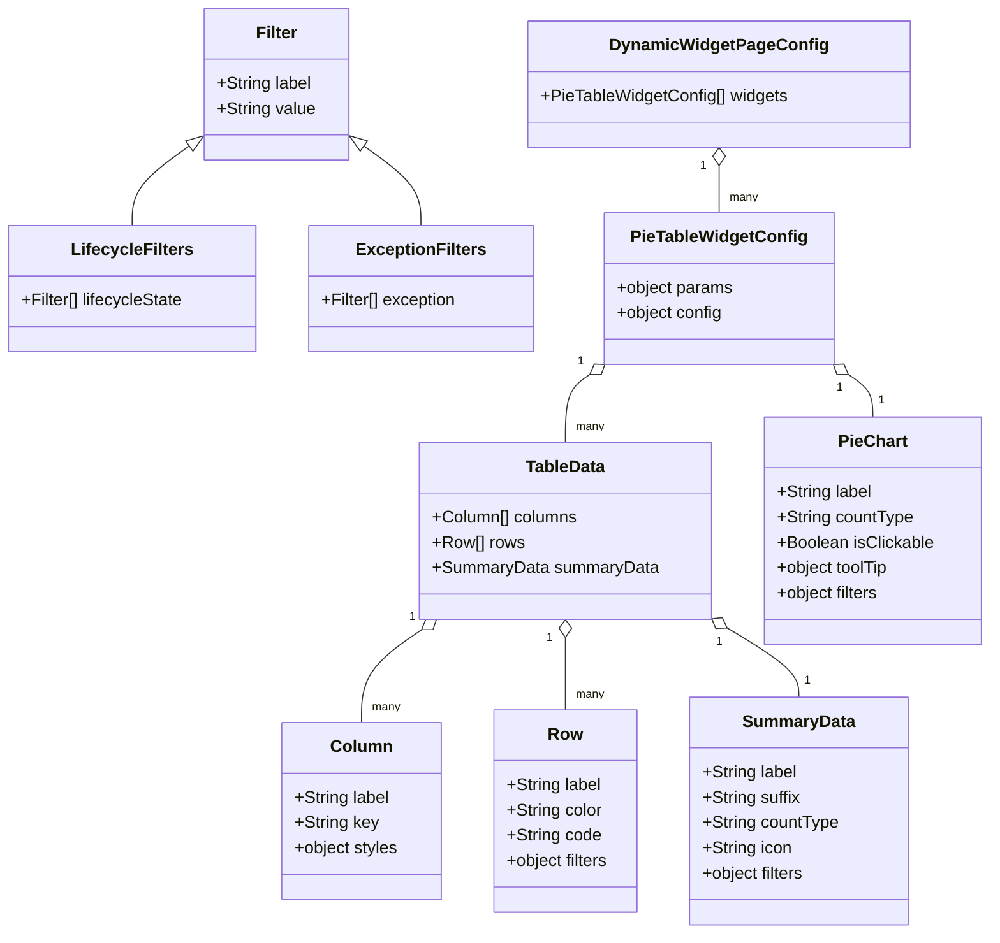

# Diagram: web/portal/src/pages/partview/utils/configurationFile.ts


> Auto-generated by Obscura crawlers

## Diagram 1



### SVG

<svg id="container" width="933.833984375" xmlns="http://www.w3.org/2000/svg" class="classDiagram" height="886" viewBox="0 0 933.833984375 886" role="graphics-document document" aria-roledescription="class"><style>#container{font-family:"trebuchet ms",verdana,arial,sans-serif;font-size:16px;fill:#333;}@keyframes edge-animation-frame{from{stroke-dashoffset:0;}}@keyframes dash{to{stroke-dashoffset:0;}}#container .edge-animation-slow{stroke-dasharray:9,5!important;stroke-dashoffset:900;animation:dash 50s linear infinite;stroke-linecap:round;}#container .edge-animation-fast{stroke-dasharray:9,5!important;stroke-dashoffset:900;animation:dash 20s linear infinite;stroke-linecap:round;}#container .error-icon{fill:#552222;}#container .error-text{fill:#552222;stroke:#552222;}#container .edge-thickness-normal{stroke-width:1px;}#container .edge-thickness-thick{stroke-width:3.5px;}#container .edge-pattern-solid{stroke-dasharray:0;}#container .edge-thickness-invisible{stroke-width:0;fill:none;}#container .edge-pattern-dashed{stroke-dasharray:3;}#container .edge-pattern-dotted{stroke-dasharray:2;}#container .marker{fill:#333333;stroke:#333333;}#container .marker.cross{stroke:#333333;}#container svg{font-family:"trebuchet ms",verdana,arial,sans-serif;font-size:16px;}#container p{margin:0;}#container g.classGroup text{fill:#9370DB;stroke:none;font-family:"trebuchet ms",verdana,arial,sans-serif;font-size:10px;}#container g.classGroup text .title{font-weight:bolder;}#container .nodeLabel,#container .edgeLabel{color:#131300;}#container .edgeLabel .label rect{fill:#ECECFF;}#container .label text{fill:#131300;}#container .labelBkg{background:#ECECFF;}#container .edgeLabel .label span{background:#ECECFF;}#container .classTitle{font-weight:bolder;}#container .node rect,#container .node circle,#container .node ellipse,#container .node polygon,#container .node path{fill:#ECECFF;stroke:#9370DB;stroke-width:1px;}#container .divider{stroke:#9370DB;stroke-width:1;}#container g.clickable{cursor:pointer;}#container g.classGroup rect{fill:#ECECFF;stroke:#9370DB;}#container g.classGroup line{stroke:#9370DB;stroke-width:1;}#container .classLabel .box{stroke:none;stroke-width:0;fill:#ECECFF;opacity:0.5;}#container .classLabel .label{fill:#9370DB;font-size:10px;}#container .relation{stroke:#333333;stroke-width:1;fill:none;}#container .dashed-line{stroke-dasharray:3;}#container .dotted-line{stroke-dasharray:1 2;}#container #compositionStart,#container .composition{fill:#333333!important;stroke:#333333!important;stroke-width:1;}#container #compositionEnd,#container .composition{fill:#333333!important;stroke:#333333!important;stroke-width:1;}#container #dependencyStart,#container .dependency{fill:#333333!important;stroke:#333333!important;stroke-width:1;}#container #dependencyStart,#container .dependency{fill:#333333!important;stroke:#333333!important;stroke-width:1;}#container #extensionStart,#container .extension{fill:transparent!important;stroke:#333333!important;stroke-width:1;}#container #extensionEnd,#container .extension{fill:transparent!important;stroke:#333333!important;stroke-width:1;}#container #aggregationStart,#container .aggregation{fill:transparent!important;stroke:#333333!important;stroke-width:1;}#container #aggregationEnd,#container .aggregation{fill:transparent!important;stroke:#333333!important;stroke-width:1;}#container #lollipopStart,#container .lollipop{fill:#ECECFF!important;stroke:#333333!important;stroke-width:1;}#container #lollipopEnd,#container .lollipop{fill:#ECECFF!important;stroke:#333333!important;stroke-width:1;}#container .edgeTerminals{font-size:11px;line-height:initial;}#container .classTitleText{text-anchor:middle;font-size:18px;fill:#333;}#container .label-icon{display:inline-block;height:1em;overflow:visible;vertical-align:-0.125em;}#container .node .label-icon path{fill:currentColor;stroke:revert;stroke-width:revert;}#container :root{--mermaid-font-family:"trebuchet ms",verdana,arial,sans-serif;}</style><g><defs><marker id="container_class-aggregationStart" class="marker aggregation class" refX="18" refY="7" markerWidth="190" markerHeight="240" orient="auto"><path d="M 18,7 L9,13 L1,7 L9,1 Z"></path></marker></defs><defs><marker id="container_class-aggregationEnd" class="marker aggregation class" refX="1" refY="7" markerWidth="20" markerHeight="28" orient="auto"><path d="M 18,7 L9,13 L1,7 L9,1 Z"></path></marker></defs><defs><marker id="container_class-extensionStart" class="marker extension class" refX="18" refY="7" markerWidth="190" markerHeight="240" orient="auto"><path d="M 1,7 L18,13 V 1 Z"></path></marker></defs><defs><marker id="container_class-extensionEnd" class="marker extension class" refX="1" refY="7" markerWidth="20" markerHeight="28" orient="auto"><path d="M 1,1 V 13 L18,7 Z"></path></marker></defs><defs><marker id="container_class-compositionStart" class="marker composition class" refX="18" refY="7" markerWidth="190" markerHeight="240" orient="auto"><path d="M 18,7 L9,13 L1,7 L9,1 Z"></path></marker></defs><defs><marker id="container_class-compositionEnd" class="marker composition class" refX="1" refY="7" markerWidth="20" markerHeight="28" orient="auto"><path d="M 18,7 L9,13 L1,7 L9,1 Z"></path></marker></defs><defs><marker id="container_class-dependencyStart" class="marker dependency class" refX="6" refY="7" markerWidth="190" markerHeight="240" orient="auto"><path d="M 5,7 L9,13 L1,7 L9,1 Z"></path></marker></defs><defs><marker id="container_class-dependencyEnd" class="marker dependency class" refX="13" refY="7" markerWidth="20" markerHeight="28" orient="auto"><path d="M 18,7 L9,13 L14,7 L9,1 Z"></path></marker></defs><defs><marker id="container_class-lollipopStart" class="marker lollipop class" refX="13" refY="7" markerWidth="190" markerHeight="240" orient="auto"><circle stroke="black" fill="transparent" cx="7" cy="7" r="6"></circle></marker></defs><defs><marker id="container_class-lollipopEnd" class="marker lollipop class" refX="1" refY="7" markerWidth="190" markerHeight="240" orient="auto"><circle stroke="black" fill="transparent" cx="7" cy="7" r="6"></circle></marker></defs><g class="root"><g class="clusters"></g><g class="edgePaths"><path d="M180.228,138.236L171.11,144.696C161.992,151.157,143.756,164.079,134.638,176.706C125.52,189.333,125.52,201.667,125.52,207.833L125.52,214" id="id_Filter_LifecycleFilters_1" class="edge-thickness-normal edge-pattern-solid relation" style=";;;" data-edge="true" data-et="edge" data-id="id_Filter_LifecycleFilters_1" data-points="W3sieCI6MTk0LjMwMjczNDM3NSwieSI6MTI4LjI2MjY1ODU0Mzg5Mjk0fSx7IngiOjEyNS41MTk1MzEyNSwieSI6MTc3fSx7IngiOjEyNS41MTk1MzEyNSwieSI6MjE0fV0=" marker-start="url(#container_class-extensionStart)"></path><path d="M344.604,138.236L353.722,144.696C362.84,151.157,381.076,164.079,390.194,176.706C399.313,189.333,399.313,201.667,399.313,207.833L399.313,214" id="id_Filter_ExceptionFilters_2" class="edge-thickness-normal edge-pattern-solid relation" style=";;;" data-edge="true" data-et="edge" data-id="id_Filter_ExceptionFilters_2" data-points="W3sieCI6MzMwLjUyOTI5Njg3NSwieSI6MTI4LjI2MjY1ODU0Mzg5Mjk0fSx7IngiOjM5OS4zMTI1LCJ5IjoxNzd9LHsieCI6Mzk5LjMxMjUsInkiOjIxNH1d" marker-start="url(#container_class-extensionStart)"></path><path d="M397.253,597.724L387.662,604.27C378.072,610.816,358.89,623.908,349.3,638.621C339.709,653.333,339.709,669.667,339.709,677.833L339.709,686" id="id_TableData_Column_3" class="edge-thickness-normal edge-pattern-solid relation" style=";;;" data-edge="true" data-et="edge" data-id="id_TableData_Column_3" data-points="W3sieCI6NDExLjUwMDcxOTU3MjM2ODQ0LCJ5Ijo1ODh9LHsieCI6MzM5LjcwODk4NDM3NSwieSI6NjM3fSx7IngiOjMzOS43MDg5ODQzNzUsInkiOjY4Nn1d" marker-start="url(#container_class-aggregationStart)"></path><path d="M534.572,605.25L534.572,610.542C534.572,615.833,534.572,626.417,534.572,637.875C534.572,649.333,534.572,661.667,534.572,667.833L534.572,674" id="id_TableData_Row_4" class="edge-thickness-normal edge-pattern-solid relation" style=";;;" data-edge="true" data-et="edge" data-id="id_TableData_Row_4" data-points="W3sieCI6NTM0LjU3MjI2NTYyNSwieSI6NTg4fSx7IngiOjUzNC41NzIyNjU2MjUsInkiOjYzN30seyJ4Ijo1MzQuNTcyMjY1NjI1LCJ5Ijo2NzR9XQ==" marker-start="url(#container_class-aggregationStart)"></path><path d="M686.321,595.041L697.978,602.034C709.634,609.027,732.947,623.014,744.603,634.173C756.26,645.333,756.26,653.667,756.26,657.833L756.26,662" id="id_TableData_SummaryData_5" class="edge-thickness-normal edge-pattern-solid relation" style=";;;" data-edge="true" data-et="edge" data-id="id_TableData_SummaryData_5" data-points="W3sieCI6NjcxLjUyOTI5Njg3NSwieSI6NTg2LjE2NjQ5NjMzNDkzMDl9LHsieCI6NzU2LjI1OTc2NTYyNSwieSI6NjM3fSx7IngiOjc1Ni4yNTk3NjU2MjUsInkiOjY2Mn1d" marker-start="url(#container_class-aggregationStart)"></path><path d="M557.505,355.612L553.683,358.176C549.861,360.741,542.216,365.871,538.394,376.602C534.572,387.333,534.572,403.667,534.572,411.833L534.572,420" id="id_PieTableWidgetConfig_TableData_6" class="edge-thickness-normal edge-pattern-solid relation" style=";;;" data-edge="true" data-et="edge" data-id="id_PieTableWidgetConfig_TableData_6" data-points="W3sieCI6NTcxLjgyODYyODM4MjczMiwieSI6MzQ2fSx7IngiOjUzNC41NzIyNjU2MjUsInkiOjM3MX0seyJ4Ijo1MzQuNTcyMjY1NjI1LCJ5Ijo0MjB9XQ==" marker-start="url(#container_class-aggregationStart)"></path><path d="M800.749,355.612L804.571,358.176C808.393,360.741,816.038,365.871,819.86,372.602C823.682,379.333,823.682,387.667,823.682,391.833L823.682,396" id="id_PieTableWidgetConfig_PieChart_7" class="edge-thickness-normal edge-pattern-solid relation" style=";;;" data-edge="true" data-et="edge" data-id="id_PieTableWidgetConfig_PieChart_7" data-points="W3sieCI6Nzg2LjQyNTI3Nzg2NzI2OCwieSI6MzQ2fSx7IngiOjgyMy42ODE2NDA2MjUsInkiOjM3MX0seyJ4Ijo4MjMuNjgxNjQwNjI1LCJ5IjozOTZ9XQ==" marker-start="url(#container_class-aggregationStart)"></path><path d="M679.127,157.25L679.127,160.542C679.127,163.833,679.127,170.417,679.127,177.875C679.127,185.333,679.127,193.667,679.127,197.833L679.127,202" id="id_DynamicWidgetPageConfig_PieTableWidgetConfig_8" class="edge-thickness-normal edge-pattern-solid relation" style=";;;" data-edge="true" data-et="edge" data-id="id_DynamicWidgetPageConfig_PieTableWidgetConfig_8" data-points="W3sieCI6Njc5LjEyNjk1MzEyNSwieSI6MTQwfSx7IngiOjY3OS4xMjY5NTMxMjUsInkiOjE3N30seyJ4Ijo2NzkuMTI2OTUzMTI1LCJ5IjoyMDJ9XQ==" marker-start="url(#container_class-aggregationStart)"></path></g><g class="edgeLabels"><g class="edgeLabel"><g class="label" data-id="id_Filter_LifecycleFilters_1" transform="translate(0, 0)"><foreignObject width="0" height="0"><div xmlns="http://www.w3.org/1999/xhtml" class="labelBkg" style="display: table-cell; white-space: nowrap; line-height: 1.5; max-width: 200px; text-align: center;"><span class="edgeLabel"></span></div></foreignObject></g></g><g class="edgeLabel"><g class="label" data-id="id_Filter_ExceptionFilters_2" transform="translate(0, 0)"><foreignObject width="0" height="0"><div xmlns="http://www.w3.org/1999/xhtml" class="labelBkg" style="display: table-cell; white-space: nowrap; line-height: 1.5; max-width: 200px; text-align: center;"><span class="edgeLabel"></span></div></foreignObject></g></g><g class="edgeLabel"><g class="label" data-id="id_TableData_Column_3" transform="translate(0, 0)"><foreignObject width="0" height="0"><div xmlns="http://www.w3.org/1999/xhtml" class="labelBkg" style="display: table-cell; white-space: nowrap; line-height: 1.5; max-width: 200px; text-align: center;"><span class="edgeLabel"></span></div></foreignObject></g></g><g class="edgeLabel"><g class="label" data-id="id_TableData_Row_4" transform="translate(0, 0)"><foreignObject width="0" height="0"><div xmlns="http://www.w3.org/1999/xhtml" class="labelBkg" style="display: table-cell; white-space: nowrap; line-height: 1.5; max-width: 200px; text-align: center;"><span class="edgeLabel"></span></div></foreignObject></g></g><g class="edgeLabel"><g class="label" data-id="id_TableData_SummaryData_5" transform="translate(0, 0)"><foreignObject width="0" height="0"><div xmlns="http://www.w3.org/1999/xhtml" class="labelBkg" style="display: table-cell; white-space: nowrap; line-height: 1.5; max-width: 200px; text-align: center;"><span class="edgeLabel"></span></div></foreignObject></g></g><g class="edgeLabel"><g class="label" data-id="id_PieTableWidgetConfig_TableData_6" transform="translate(0, 0)"><foreignObject width="0" height="0"><div xmlns="http://www.w3.org/1999/xhtml" class="labelBkg" style="display: table-cell; white-space: nowrap; line-height: 1.5; max-width: 200px; text-align: center;"><span class="edgeLabel"></span></div></foreignObject></g></g><g class="edgeLabel"><g class="label" data-id="id_PieTableWidgetConfig_PieChart_7" transform="translate(0, 0)"><foreignObject width="0" height="0"><div xmlns="http://www.w3.org/1999/xhtml" class="labelBkg" style="display: table-cell; white-space: nowrap; line-height: 1.5; max-width: 200px; text-align: center;"><span class="edgeLabel"></span></div></foreignObject></g></g><g class="edgeLabel"><g class="label" data-id="id_DynamicWidgetPageConfig_PieTableWidgetConfig_8" transform="translate(0, 0)"><foreignObject width="0" height="0"><div xmlns="http://www.w3.org/1999/xhtml" class="labelBkg" style="display: table-cell; white-space: nowrap; line-height: 1.5; max-width: 200px; text-align: center;"><span class="edgeLabel"></span></div></foreignObject></g></g><g class="edgeTerminals" transform="translate(388.5904600001367, 585.4761097824547)"><g class="inner" transform="translate(0, 0)"><foreignObject style="width: 9px; height: 12px;"><div xmlns="http://www.w3.org/1999/xhtml" style="display: inline-block; padding-right: 1px; white-space: nowrap;"><span class="edgeLabel">1</span></div></foreignObject></g></g><g class="edgeTerminals" transform="translate(519.5722678125002, 605.500001875)"><g class="inner" transform="translate(0, 0)"><foreignObject style="width: 9px; height: 12px;"><div xmlns="http://www.w3.org/1999/xhtml" style="display: inline-block; padding-right: 1px; white-space: nowrap;"><span class="edgeLabel">1</span></div></foreignObject></g></g><g class="edgeTerminals" transform="translate(678.8188972629275, 608.0322631321175)"><g class="inner" transform="translate(0, 0)"><foreignObject style="width: 9px; height: 12px;"><div xmlns="http://www.w3.org/1999/xhtml" style="display: inline-block; padding-right: 1px; white-space: nowrap;"><span class="edgeLabel">1</span></div></foreignObject></g></g><g class="edgeTerminals" transform="translate(548.9389943909233, 343.2954352762204)"><g class="inner" transform="translate(0, 0)"><foreignObject style="width: 9px; height: 12px;"><div xmlns="http://www.w3.org/1999/xhtml" style="display: inline-block; padding-right: 1px; white-space: nowrap;"><span class="edgeLabel">1</span></div></foreignObject></g></g><g class="edgeTerminals" transform="translate(792.5987948767979, 368.2067052227593)"><g class="inner" transform="translate(0, 0)"><foreignObject style="width: 9px; height: 12px;"><div xmlns="http://www.w3.org/1999/xhtml" style="display: inline-block; padding-right: 1px; white-space: nowrap;"><span class="edgeLabel">1</span></div></foreignObject></g></g><g class="edgeTerminals" transform="translate(664.1269515625, 157.49999866071428)"><g class="inner" transform="translate(0, 0)"><foreignObject style="width: 9px; height: 12px;"><div xmlns="http://www.w3.org/1999/xhtml" style="display: inline-block; padding-right: 1px; white-space: nowrap;"><span class="edgeLabel">1</span></div></foreignObject></g></g><g class="edgeTerminals" transform="translate(349.7089821874999, 663.499998125)"><g class="inner" transform="translate(0, 0)"></g><foreignObject style="width: 36px; height: 12px;"><div xmlns="http://www.w3.org/1999/xhtml" style="display: inline-block; padding-right: 1px; white-space: nowrap;"><span class="edgeLabel">many</span></div></foreignObject></g><g class="edgeTerminals" transform="translate(544.5722678125, 651.500001875)"><g class="inner" transform="translate(0, 0)"></g><foreignObject style="width: 36px; height: 12px;"><div xmlns="http://www.w3.org/1999/xhtml" style="display: inline-block; padding-right: 1px; white-space: nowrap;"><span class="edgeLabel">many</span></div></foreignObject></g><g class="edgeTerminals" transform="translate(761.3997957045212, 637.8235222760045)"><g class="inner" transform="translate(0, 0)"></g><foreignObject style="width: 9px; height: 12px;"><div xmlns="http://www.w3.org/1999/xhtml" style="display: inline-block; padding-right: 1px; white-space: nowrap;"><span class="edgeLabel">1</span></div></foreignObject></g><g class="edgeTerminals" transform="translate(544.5722678125, 397.500001875)"><g class="inner" transform="translate(0, 0)"></g><foreignObject style="width: 36px; height: 12px;"><div xmlns="http://www.w3.org/1999/xhtml" style="display: inline-block; padding-right: 1px; white-space: nowrap;"><span class="edgeLabel">many</span></div></foreignObject></g><g class="edgeTerminals" transform="translate(829.0053046513218, 371.7822353370285)"><g class="inner" transform="translate(0, 0)"></g><foreignObject style="width: 9px; height: 12px;"><div xmlns="http://www.w3.org/1999/xhtml" style="display: inline-block; padding-right: 1px; white-space: nowrap;"><span class="edgeLabel">1</span></div></foreignObject></g><g class="edgeTerminals" transform="translate(689.1269515624998, 179.49999866071428)"><g class="inner" transform="translate(0, 0)"></g><foreignObject style="width: 36px; height: 12px;"><div xmlns="http://www.w3.org/1999/xhtml" style="display: inline-block; padding-right: 1px; white-space: nowrap;"><span class="edgeLabel">many</span></div></foreignObject></g></g><g class="nodes"><g class="node default" id="classId-Filter-0" transform="translate(262.416015625, 80)"><g class="basic label-container"><path d="M-68.11328125 -72 L68.11328125 -72 L68.11328125 72 L-68.11328125 72" stroke="none" stroke-width="0" fill="#ECECFF" style=""></path><path d="M-68.11328125 -72 C-25.02085574690546 -72, 18.071569756189078 -72, 68.11328125 -72 M-68.11328125 -72 C-25.84024578550764 -72, 16.43278967898472 -72, 68.11328125 -72 M68.11328125 -72 C68.11328125 -22.400529568409894, 68.11328125 27.198940863180212, 68.11328125 72 M68.11328125 -72 C68.11328125 -25.23495081803142, 68.11328125 21.530098363937157, 68.11328125 72 M68.11328125 72 C22.76932308732612 72, -22.574635075347757 72, -68.11328125 72 M68.11328125 72 C34.5760365997434 72, 1.038791949486793 72, -68.11328125 72 M-68.11328125 72 C-68.11328125 15.62794286039707, -68.11328125 -40.74411427920586, -68.11328125 -72 M-68.11328125 72 C-68.11328125 29.30301998996704, -68.11328125 -13.393960020065919, -68.11328125 -72" stroke="#9370DB" stroke-width="1.3" fill="none" stroke-dasharray="0 0" style=""></path></g><g class="annotation-group text" transform="translate(0, -48)"></g><g class="label-group text" transform="translate(-18.8671875, -48)"><g class="label" style="font-weight: bolder" transform="translate(0,-12)"><foreignObject width="37.734375" height="24"><div xmlns="http://www.w3.org/1999/xhtml" style="display: table-cell; white-space: nowrap; line-height: 1.5; max-width: 88px; text-align: center;"><span class="nodeLabel markdown-node-label" style=""><p>Filter</p></span></div></foreignObject></g></g><g class="members-group text" transform="translate(-56.11328125, 0)"><g class="label" style="" transform="translate(0,-12)"><foreignObject width="90.703125" height="24"><div xmlns="http://www.w3.org/1999/xhtml" style="display: table-cell; white-space: nowrap; line-height: 1.5; max-width: 148px; text-align: center;"><span class="nodeLabel markdown-node-label" style=""><p>+String label</p></span></div></foreignObject></g><g class="label" style="" transform="translate(0,12)"><foreignObject width="93.359375" height="24"><div xmlns="http://www.w3.org/1999/xhtml" style="display: table-cell; white-space: nowrap; line-height: 1.5; max-width: 151px; text-align: center;"><span class="nodeLabel markdown-node-label" style=""><p>+String value</p></span></div></foreignObject></g></g><g class="methods-group text" transform="translate(-56.11328125, 72)"></g><g class="divider" style=""><path d="M-68.11328125 -24 C-32.6165697347988 -24, 2.880141780402397 -24, 68.11328125 -24 M-68.11328125 -24 C-29.293137860600737 -24, 9.527005528798526 -24, 68.11328125 -24" stroke="#9370DB" stroke-width="1.3" fill="none" stroke-dasharray="0 0" style=""></path></g><g class="divider" style=""><path d="M-68.11328125 48 C-32.820754618129314 48, 2.471772013741372 48, 68.11328125 48 M-68.11328125 48 C-16.260293615958325 48, 35.59269401808335 48, 68.11328125 48" stroke="#9370DB" stroke-width="1.3" fill="none" stroke-dasharray="0 0" style=""></path></g></g><g class="node default" id="classId-LifecycleFilters-1" transform="translate(125.51953125, 274)"><g class="basic label-container"><path d="M-117.51953125 -60 L117.51953125 -60 L117.51953125 60 L-117.51953125 60" stroke="none" stroke-width="0" fill="#ECECFF" style=""></path><path d="M-117.51953125 -60 C-41.02518664836825 -60, 35.469157953263505 -60, 117.51953125 -60 M-117.51953125 -60 C-69.6354578526219 -60, -21.75138445524381 -60, 117.51953125 -60 M117.51953125 -60 C117.51953125 -16.283944781902406, 117.51953125 27.432110436195188, 117.51953125 60 M117.51953125 -60 C117.51953125 -15.48974113230576, 117.51953125 29.02051773538848, 117.51953125 60 M117.51953125 60 C68.13890186820313 60, 18.758272486406256 60, -117.51953125 60 M117.51953125 60 C41.93232840655749 60, -33.654874436885024 60, -117.51953125 60 M-117.51953125 60 C-117.51953125 24.48983717934818, -117.51953125 -11.020325641303643, -117.51953125 -60 M-117.51953125 60 C-117.51953125 30.594842655552355, -117.51953125 1.1896853111047108, -117.51953125 -60" stroke="#9370DB" stroke-width="1.3" fill="none" stroke-dasharray="0 0" style=""></path></g><g class="annotation-group text" transform="translate(0, -36)"></g><g class="label-group text" transform="translate(-54.6796875, -36)"><g class="label" style="font-weight: bolder" transform="translate(0,-12)"><foreignObject width="109.359375" height="24"><div xmlns="http://www.w3.org/1999/xhtml" style="display: table-cell; white-space: nowrap; line-height: 1.5; max-width: 157px; text-align: center;"><span class="nodeLabel markdown-node-label" style=""><p>LifecycleFilters</p></span></div></foreignObject></g></g><g class="members-group text" transform="translate(-105.51953125, 12)"><g class="label" style="" transform="translate(0,-12)"><foreignObject width="156.359375" height="24"><div xmlns="http://www.w3.org/1999/xhtml" style="display: table-cell; white-space: nowrap; line-height: 1.5; max-width: 214px; text-align: center;"><span class="nodeLabel markdown-node-label" style=""><p>+Filter[] lifecycleState</p></span></div></foreignObject></g></g><g class="methods-group text" transform="translate(-105.51953125, 60)"></g><g class="divider" style=""><path d="M-117.51953125 -12 C-35.10176705918053 -12, 47.31599713163894 -12, 117.51953125 -12 M-117.51953125 -12 C-28.713177897659023 -12, 60.093175454681955 -12, 117.51953125 -12" stroke="#9370DB" stroke-width="1.3" fill="none" stroke-dasharray="0 0" style=""></path></g><g class="divider" style=""><path d="M-117.51953125 36 C-42.716313407234395 36, 32.08690443553121 36, 117.51953125 36 M-117.51953125 36 C-32.31334944069995 36, 52.8928323686001 36, 117.51953125 36" stroke="#9370DB" stroke-width="1.3" fill="none" stroke-dasharray="0 0" style=""></path></g></g><g class="node default" id="classId-ExceptionFilters-2" transform="translate(399.3125, 274)"><g class="basic label-container"><path d="M-106.2734375 -60 L106.2734375 -60 L106.2734375 60 L-106.2734375 60" stroke="none" stroke-width="0" fill="#ECECFF" style=""></path><path d="M-106.2734375 -60 C-33.70513407786862 -60, 38.86316934426276 -60, 106.2734375 -60 M-106.2734375 -60 C-45.95595353056598 -60, 14.361530438868044 -60, 106.2734375 -60 M106.2734375 -60 C106.2734375 -18.86846673685953, 106.2734375 22.263066526280937, 106.2734375 60 M106.2734375 -60 C106.2734375 -23.147568559705412, 106.2734375 13.704862880589175, 106.2734375 60 M106.2734375 60 C49.216542584078205 60, -7.84035233184359 60, -106.2734375 60 M106.2734375 60 C36.81477779947362 60, -32.643881901052765 60, -106.2734375 60 M-106.2734375 60 C-106.2734375 12.043370719392591, -106.2734375 -35.91325856121482, -106.2734375 -60 M-106.2734375 60 C-106.2734375 32.5677883732115, -106.2734375 5.135576746422991, -106.2734375 -60" stroke="#9370DB" stroke-width="1.3" fill="none" stroke-dasharray="0 0" style=""></path></g><g class="annotation-group text" transform="translate(0, -36)"></g><g class="label-group text" transform="translate(-58.328125, -36)"><g class="label" style="font-weight: bolder" transform="translate(0,-12)"><foreignObject width="116.65625" height="24"><div xmlns="http://www.w3.org/1999/xhtml" style="display: table-cell; white-space: nowrap; line-height: 1.5; max-width: 165px; text-align: center;"><span class="nodeLabel markdown-node-label" style=""><p>ExceptionFilters</p></span></div></foreignObject></g></g><g class="members-group text" transform="translate(-94.2734375, 12)"><g class="label" style="" transform="translate(0,-12)"><foreignObject width="130.21875" height="24"><div xmlns="http://www.w3.org/1999/xhtml" style="display: table-cell; white-space: nowrap; line-height: 1.5; max-width: 188px; text-align: center;"><span class="nodeLabel markdown-node-label" style=""><p>+Filter[] exception</p></span></div></foreignObject></g></g><g class="methods-group text" transform="translate(-94.2734375, 60)"></g><g class="divider" style=""><path d="M-106.2734375 -12 C-54.752990972205794 -12, -3.2325444444115874 -12, 106.2734375 -12 M-106.2734375 -12 C-45.89580191994791 -12, 14.481833660104186 -12, 106.2734375 -12" stroke="#9370DB" stroke-width="1.3" fill="none" stroke-dasharray="0 0" style=""></path></g><g class="divider" style=""><path d="M-106.2734375 36 C-52.51740489116852 36, 1.2386277176629648 36, 106.2734375 36 M-106.2734375 36 C-22.95521661929233 36, 60.36300426141534 36, 106.2734375 36" stroke="#9370DB" stroke-width="1.3" fill="none" stroke-dasharray="0 0" style=""></path></g></g><g class="node default" id="classId-Row-3" transform="translate(534.572265625, 770)"><g class="basic label-container"><path d="M-69.3671875 -96 L69.3671875 -96 L69.3671875 96 L-69.3671875 96" stroke="none" stroke-width="0" fill="#ECECFF" style=""></path><path d="M-69.3671875 -96 C-33.37823819664995 -96, 2.6107111067000943 -96, 69.3671875 -96 M-69.3671875 -96 C-19.405635350847426 -96, 30.555916798305148 -96, 69.3671875 -96 M69.3671875 -96 C69.3671875 -35.821849525814045, 69.3671875 24.35630094837191, 69.3671875 96 M69.3671875 -96 C69.3671875 -53.37994461985519, 69.3671875 -10.759889239710375, 69.3671875 96 M69.3671875 96 C15.656804092658184 96, -38.05357931468363 96, -69.3671875 96 M69.3671875 96 C20.622931297173494 96, -28.12132490565301 96, -69.3671875 96 M-69.3671875 96 C-69.3671875 22.518446517090723, -69.3671875 -50.963106965818554, -69.3671875 -96 M-69.3671875 96 C-69.3671875 57.271881143762705, -69.3671875 18.54376228752541, -69.3671875 -96" stroke="#9370DB" stroke-width="1.3" fill="none" stroke-dasharray="0 0" style=""></path></g><g class="annotation-group text" transform="translate(0, -72)"></g><g class="label-group text" transform="translate(-15.484375, -72)"><g class="label" style="font-weight: bolder" transform="translate(0,-12)"><foreignObject width="30.96875" height="24"><div xmlns="http://www.w3.org/1999/xhtml" style="display: table-cell; white-space: nowrap; line-height: 1.5; max-width: 81px; text-align: center;"><span class="nodeLabel markdown-node-label" style=""><p>Row</p></span></div></foreignObject></g></g><g class="members-group text" transform="translate(-57.3671875, -24)"><g class="label" style="" transform="translate(0,-12)"><foreignObject width="90.703125" height="24"><div xmlns="http://www.w3.org/1999/xhtml" style="display: table-cell; white-space: nowrap; line-height: 1.5; max-width: 148px; text-align: center;"><span class="nodeLabel markdown-node-label" style=""><p>+String label</p></span></div></foreignObject></g><g class="label" style="" transform="translate(0,12)"><foreignObject width="91.265625" height="24"><div xmlns="http://www.w3.org/1999/xhtml" style="display: table-cell; white-space: nowrap; line-height: 1.5; max-width: 149px; text-align: center;"><span class="nodeLabel markdown-node-label" style=""><p>+String color</p></span></div></foreignObject></g><g class="label" style="" transform="translate(0,36)"><foreignObject width="89.4375" height="24"><div xmlns="http://www.w3.org/1999/xhtml" style="display: table-cell; white-space: nowrap; line-height: 1.5; max-width: 147px; text-align: center;"><span class="nodeLabel markdown-node-label" style=""><p>+String code</p></span></div></foreignObject></g><g class="label" style="" transform="translate(0,60)"><foreignObject width="99.25" height="24"><div xmlns="http://www.w3.org/1999/xhtml" style="display: table-cell; white-space: nowrap; line-height: 1.5; max-width: 157px; text-align: center;"><span class="nodeLabel markdown-node-label" style=""><p>+object filters</p></span></div></foreignObject></g></g><g class="methods-group text" transform="translate(-57.3671875, 96)"></g><g class="divider" style=""><path d="M-69.3671875 -48 C-37.907530186140484 -48, -6.447872872280968 -48, 69.3671875 -48 M-69.3671875 -48 C-14.549407681842979 -48, 40.26837213631404 -48, 69.3671875 -48" stroke="#9370DB" stroke-width="1.3" fill="none" stroke-dasharray="0 0" style=""></path></g><g class="divider" style=""><path d="M-69.3671875 72 C-25.00673812818839 72, 19.353711243623223 72, 69.3671875 72 M-69.3671875 72 C-33.5507069640275 72, 2.2657735719450045 72, 69.3671875 72" stroke="#9370DB" stroke-width="1.3" fill="none" stroke-dasharray="0 0" style=""></path></g></g><g class="node default" id="classId-Column-4" transform="translate(339.708984375, 770)"><g class="basic label-container"><path d="M-75.49609375 -84 L75.49609375 -84 L75.49609375 84 L-75.49609375 84" stroke="none" stroke-width="0" fill="#ECECFF" style=""></path><path d="M-75.49609375 -84 C-40.13389487516201 -84, -4.771696000324013 -84, 75.49609375 -84 M-75.49609375 -84 C-42.560871659420116 -84, -9.625649568840231 -84, 75.49609375 -84 M75.49609375 -84 C75.49609375 -33.458506787689274, 75.49609375 17.082986424621453, 75.49609375 84 M75.49609375 -84 C75.49609375 -20.98413476660035, 75.49609375 42.0317304667993, 75.49609375 84 M75.49609375 84 C44.27941242381027 84, 13.062731097620542 84, -75.49609375 84 M75.49609375 84 C20.674616420525822 84, -34.146860908948355 84, -75.49609375 84 M-75.49609375 84 C-75.49609375 43.92663561908375, -75.49609375 3.853271238167494, -75.49609375 -84 M-75.49609375 84 C-75.49609375 43.03838205959874, -75.49609375 2.0767641191974775, -75.49609375 -84" stroke="#9370DB" stroke-width="1.3" fill="none" stroke-dasharray="0 0" style=""></path></g><g class="annotation-group text" transform="translate(0, -60)"></g><g class="label-group text" transform="translate(-27.4453125, -60)"><g class="label" style="font-weight: bolder" transform="translate(0,-12)"><foreignObject width="54.890625" height="24"><div xmlns="http://www.w3.org/1999/xhtml" style="display: table-cell; white-space: nowrap; line-height: 1.5; max-width: 105px; text-align: center;"><span class="nodeLabel markdown-node-label" style=""><p>Column</p></span></div></foreignObject></g></g><g class="members-group text" transform="translate(-63.49609375, -12)"><g class="label" style="" transform="translate(0,-12)"><foreignObject width="90.703125" height="24"><div xmlns="http://www.w3.org/1999/xhtml" style="display: table-cell; white-space: nowrap; line-height: 1.5; max-width: 148px; text-align: center;"><span class="nodeLabel markdown-node-label" style=""><p>+String label</p></span></div></foreignObject></g><g class="label" style="" transform="translate(0,12)"><foreignObject width="79.046875" height="24"><div xmlns="http://www.w3.org/1999/xhtml" style="display: table-cell; white-space: nowrap; line-height: 1.5; max-width: 137px; text-align: center;"><span class="nodeLabel markdown-node-label" style=""><p>+String key</p></span></div></foreignObject></g><g class="label" style="" transform="translate(0,36)"><foreignObject width="99.546875" height="24"><div xmlns="http://www.w3.org/1999/xhtml" style="display: table-cell; white-space: nowrap; line-height: 1.5; max-width: 157px; text-align: center;"><span class="nodeLabel markdown-node-label" style=""><p>+object styles</p></span></div></foreignObject></g></g><g class="methods-group text" transform="translate(-63.49609375, 84)"></g><g class="divider" style=""><path d="M-75.49609375 -36 C-23.33590819300155 -36, 28.8242773639969 -36, 75.49609375 -36 M-75.49609375 -36 C-32.47284326149306 -36, 10.550407227013878 -36, 75.49609375 -36" stroke="#9370DB" stroke-width="1.3" fill="none" stroke-dasharray="0 0" style=""></path></g><g class="divider" style=""><path d="M-75.49609375 60 C-34.09517886170578 60, 7.305736026588434 60, 75.49609375 60 M-75.49609375 60 C-29.49552737308214 60, 16.50503900383572 60, 75.49609375 60" stroke="#9370DB" stroke-width="1.3" fill="none" stroke-dasharray="0 0" style=""></path></g></g><g class="node default" id="classId-SummaryData-5" transform="translate(756.259765625, 770)"><g class="basic label-container"><path d="M-102.3203125 -108 L102.3203125 -108 L102.3203125 108 L-102.3203125 108" stroke="none" stroke-width="0" fill="#ECECFF" style=""></path><path d="M-102.3203125 -108 C-43.67270216545715 -108, 14.974908169085694 -108, 102.3203125 -108 M-102.3203125 -108 C-21.88055989201341 -108, 58.55919271597318 -108, 102.3203125 -108 M102.3203125 -108 C102.3203125 -53.857427783732575, 102.3203125 0.28514443253484956, 102.3203125 108 M102.3203125 -108 C102.3203125 -33.050674119078764, 102.3203125 41.89865176184247, 102.3203125 108 M102.3203125 108 C28.619966661576342 108, -45.080379176847316 108, -102.3203125 108 M102.3203125 108 C42.78396220836156 108, -16.752388083276884 108, -102.3203125 108 M-102.3203125 108 C-102.3203125 24.413303290221577, -102.3203125 -59.173393419556845, -102.3203125 -108 M-102.3203125 108 C-102.3203125 28.980026559259485, -102.3203125 -50.03994688148103, -102.3203125 -108" stroke="#9370DB" stroke-width="1.3" fill="none" stroke-dasharray="0 0" style=""></path></g><g class="annotation-group text" transform="translate(0, -84)"></g><g class="label-group text" transform="translate(-51.296875, -84)"><g class="label" style="font-weight: bolder" transform="translate(0,-12)"><foreignObject width="102.59375" height="24"><div xmlns="http://www.w3.org/1999/xhtml" style="display: table-cell; white-space: nowrap; line-height: 1.5; max-width: 151px; text-align: center;"><span class="nodeLabel markdown-node-label" style=""><p>SummaryData</p></span></div></foreignObject></g></g><g class="members-group text" transform="translate(-90.3203125, -36)"><g class="label" style="" transform="translate(0,-12)"><foreignObject width="90.703125" height="24"><div xmlns="http://www.w3.org/1999/xhtml" style="display: table-cell; white-space: nowrap; line-height: 1.5; max-width: 148px; text-align: center;"><span class="nodeLabel markdown-node-label" style=""><p>+String label</p></span></div></foreignObject></g><g class="label" style="" transform="translate(0,12)"><foreignObject width="93.578125" height="24"><div xmlns="http://www.w3.org/1999/xhtml" style="display: table-cell; white-space: nowrap; line-height: 1.5; max-width: 151px; text-align: center;"><span class="nodeLabel markdown-node-label" style=""><p>+String suffix</p></span></div></foreignObject></g><g class="label" style="" transform="translate(0,36)"><foreignObject width="129.34375" height="24"><div xmlns="http://www.w3.org/1999/xhtml" style="display: table-cell; white-space: nowrap; line-height: 1.5; max-width: 187px; text-align: center;"><span class="nodeLabel markdown-node-label" style=""><p>+String countType</p></span></div></foreignObject></g><g class="label" style="" transform="translate(0,60)"><foreignObject width="85.03125" height="24"><div xmlns="http://www.w3.org/1999/xhtml" style="display: table-cell; white-space: nowrap; line-height: 1.5; max-width: 142px; text-align: center;"><span class="nodeLabel markdown-node-label" style=""><p>+String icon</p></span></div></foreignObject></g><g class="label" style="" transform="translate(0,84)"><foreignObject width="99.25" height="24"><div xmlns="http://www.w3.org/1999/xhtml" style="display: table-cell; white-space: nowrap; line-height: 1.5; max-width: 157px; text-align: center;"><span class="nodeLabel markdown-node-label" style=""><p>+object filters</p></span></div></foreignObject></g></g><g class="methods-group text" transform="translate(-90.3203125, 108)"></g><g class="divider" style=""><path d="M-102.3203125 -60 C-59.322850328734795 -60, -16.32538815746959 -60, 102.3203125 -60 M-102.3203125 -60 C-36.65343776213133 -60, 29.013436975737335 -60, 102.3203125 -60" stroke="#9370DB" stroke-width="1.3" fill="none" stroke-dasharray="0 0" style=""></path></g><g class="divider" style=""><path d="M-102.3203125 84 C-33.109962620285856 84, 36.10038725942829 84, 102.3203125 84 M-102.3203125 84 C-23.891140681893418 84, 54.538031136213164 84, 102.3203125 84" stroke="#9370DB" stroke-width="1.3" fill="none" stroke-dasharray="0 0" style=""></path></g></g><g class="node default" id="classId-TableData-6" transform="translate(534.572265625, 504)"><g class="basic label-container"><path d="M-136.95703125 -84 L136.95703125 -84 L136.95703125 84 L-136.95703125 84" stroke="none" stroke-width="0" fill="#ECECFF" style=""></path><path d="M-136.95703125 -84 C-38.52373174353524 -84, 59.90956776292953 -84, 136.95703125 -84 M-136.95703125 -84 C-50.623333285454635 -84, 35.71036467909073 -84, 136.95703125 -84 M136.95703125 -84 C136.95703125 -36.12217855933217, 136.95703125 11.75564288133566, 136.95703125 84 M136.95703125 -84 C136.95703125 -49.54966865500353, 136.95703125 -15.099337310007058, 136.95703125 84 M136.95703125 84 C68.38508734829408 84, -0.18685655341184315 84, -136.95703125 84 M136.95703125 84 C71.20092206313628 84, 5.44481287627255 84, -136.95703125 84 M-136.95703125 84 C-136.95703125 38.89394120265144, -136.95703125 -6.212117594697119, -136.95703125 -84 M-136.95703125 84 C-136.95703125 40.38883509529024, -136.95703125 -3.22232980941952, -136.95703125 -84" stroke="#9370DB" stroke-width="1.3" fill="none" stroke-dasharray="0 0" style=""></path></g><g class="annotation-group text" transform="translate(0, -60)"></g><g class="label-group text" transform="translate(-36.7265625, -60)"><g class="label" style="font-weight: bolder" transform="translate(0,-12)"><foreignObject width="73.453125" height="24"><div xmlns="http://www.w3.org/1999/xhtml" style="display: table-cell; white-space: nowrap; line-height: 1.5; max-width: 122px; text-align: center;"><span class="nodeLabel markdown-node-label" style=""><p>TableData</p></span></div></foreignObject></g></g><g class="members-group text" transform="translate(-124.95703125, -12)"><g class="label" style="" transform="translate(0,-12)"><foreignObject width="138.84375" height="24"><div xmlns="http://www.w3.org/1999/xhtml" style="display: table-cell; white-space: nowrap; line-height: 1.5; max-width: 196px; text-align: center;"><span class="nodeLabel markdown-node-label" style=""><p>+Column[] columns</p></span></div></foreignObject></g><g class="label" style="" transform="translate(0,12)"><foreignObject width="86.78125" height="24"><div xmlns="http://www.w3.org/1999/xhtml" style="display: table-cell; white-space: nowrap; line-height: 1.5; max-width: 144px; text-align: center;"><span class="nodeLabel markdown-node-label" style=""><p>+Row[] rows</p></span></div></foreignObject></g><g class="label" style="" transform="translate(0,36)"><foreignObject width="213.1875" height="24"><div xmlns="http://www.w3.org/1999/xhtml" style="display: table-cell; white-space: nowrap; line-height: 1.5; max-width: 271px; text-align: center;"><span class="nodeLabel markdown-node-label" style=""><p>+SummaryData summaryData</p></span></div></foreignObject></g></g><g class="methods-group text" transform="translate(-124.95703125, 84)"></g><g class="divider" style=""><path d="M-136.95703125 -36 C-47.5752584062693 -36, 41.8065144374614 -36, 136.95703125 -36 M-136.95703125 -36 C-76.5196619885138 -36, -16.082292727027593 -36, 136.95703125 -36" stroke="#9370DB" stroke-width="1.3" fill="none" stroke-dasharray="0 0" style=""></path></g><g class="divider" style=""><path d="M-136.95703125 60 C-47.87751523230925 60, 41.2020007853815 60, 136.95703125 60 M-136.95703125 60 C-58.45304090489758 60, 20.050949440204846 60, 136.95703125 60" stroke="#9370DB" stroke-width="1.3" fill="none" stroke-dasharray="0 0" style=""></path></g></g><g class="node default" id="classId-PieChart-7" transform="translate(823.681640625, 504)"><g class="basic label-container"><path d="M-102.15234375 -108 L102.15234375 -108 L102.15234375 108 L-102.15234375 108" stroke="none" stroke-width="0" fill="#ECECFF" style=""></path><path d="M-102.15234375 -108 C-30.334158124289985 -108, 41.48402750142003 -108, 102.15234375 -108 M-102.15234375 -108 C-35.7855925065582 -108, 30.581158736883594 -108, 102.15234375 -108 M102.15234375 -108 C102.15234375 -64.25625694559079, 102.15234375 -20.512513891181598, 102.15234375 108 M102.15234375 -108 C102.15234375 -59.0918445455381, 102.15234375 -10.183689091076204, 102.15234375 108 M102.15234375 108 C49.018658412661345 108, -4.115026924677309 108, -102.15234375 108 M102.15234375 108 C28.507065587368814 108, -45.13821257526237 108, -102.15234375 108 M-102.15234375 108 C-102.15234375 22.961997744764062, -102.15234375 -62.076004510471876, -102.15234375 -108 M-102.15234375 108 C-102.15234375 23.393087686226366, -102.15234375 -61.21382462754727, -102.15234375 -108" stroke="#9370DB" stroke-width="1.3" fill="none" stroke-dasharray="0 0" style=""></path></g><g class="annotation-group text" transform="translate(0, -84)"></g><g class="label-group text" transform="translate(-31.2890625, -84)"><g class="label" style="font-weight: bolder" transform="translate(0,-12)"><foreignObject width="62.578125" height="24"><div xmlns="http://www.w3.org/1999/xhtml" style="display: table-cell; white-space: nowrap; line-height: 1.5; max-width: 112px; text-align: center;"><span class="nodeLabel markdown-node-label" style=""><p>PieChart</p></span></div></foreignObject></g></g><g class="members-group text" transform="translate(-90.15234375, -36)"><g class="label" style="" transform="translate(0,-12)"><foreignObject width="90.703125" height="24"><div xmlns="http://www.w3.org/1999/xhtml" style="display: table-cell; white-space: nowrap; line-height: 1.5; max-width: 148px; text-align: center;"><span class="nodeLabel markdown-node-label" style=""><p>+String label</p></span></div></foreignObject></g><g class="label" style="" transform="translate(0,12)"><foreignObject width="129.34375" height="24"><div xmlns="http://www.w3.org/1999/xhtml" style="display: table-cell; white-space: nowrap; line-height: 1.5; max-width: 187px; text-align: center;"><span class="nodeLabel markdown-node-label" style=""><p>+String countType</p></span></div></foreignObject></g><g class="label" style="" transform="translate(0,36)"><foreignObject width="149.015625" height="24"><div xmlns="http://www.w3.org/1999/xhtml" style="display: table-cell; white-space: nowrap; line-height: 1.5; max-width: 206px; text-align: center;"><span class="nodeLabel markdown-node-label" style=""><p>+Boolean isClickable</p></span></div></foreignObject></g><g class="label" style="" transform="translate(0,60)"><foreignObject width="108.90625" height="24"><div xmlns="http://www.w3.org/1999/xhtml" style="display: table-cell; white-space: nowrap; line-height: 1.5; max-width: 166px; text-align: center;"><span class="nodeLabel markdown-node-label" style=""><p>+object toolTip</p></span></div></foreignObject></g><g class="label" style="" transform="translate(0,84)"><foreignObject width="99.25" height="24"><div xmlns="http://www.w3.org/1999/xhtml" style="display: table-cell; white-space: nowrap; line-height: 1.5; max-width: 157px; text-align: center;"><span class="nodeLabel markdown-node-label" style=""><p>+object filters</p></span></div></foreignObject></g></g><g class="methods-group text" transform="translate(-90.15234375, 108)"></g><g class="divider" style=""><path d="M-102.15234375 -60 C-31.782694705390867 -60, 38.586954339218266 -60, 102.15234375 -60 M-102.15234375 -60 C-60.27683355303953 -60, -18.40132335607906 -60, 102.15234375 -60" stroke="#9370DB" stroke-width="1.3" fill="none" stroke-dasharray="0 0" style=""></path></g><g class="divider" style=""><path d="M-102.15234375 84 C-48.18139902918881 84, 5.789545691622379 84, 102.15234375 84 M-102.15234375 84 C-56.143148065613545 84, -10.13395238122709 84, 102.15234375 84" stroke="#9370DB" stroke-width="1.3" fill="none" stroke-dasharray="0 0" style=""></path></g></g><g class="node default" id="classId-PieTableWidgetConfig-8" transform="translate(679.126953125, 274)"><g class="basic label-container"><path d="M-107.52734375 -72 L107.52734375 -72 L107.52734375 72 L-107.52734375 72" stroke="none" stroke-width="0" fill="#ECECFF" style=""></path><path d="M-107.52734375 -72 C-33.17392471147781 -72, 41.17949432704438 -72, 107.52734375 -72 M-107.52734375 -72 C-31.692917066905665 -72, 44.14150961618867 -72, 107.52734375 -72 M107.52734375 -72 C107.52734375 -18.822870346239498, 107.52734375 34.354259307521005, 107.52734375 72 M107.52734375 -72 C107.52734375 -17.06931220579898, 107.52734375 37.86137558840204, 107.52734375 72 M107.52734375 72 C64.30668827759658 72, 21.086032805193142 72, -107.52734375 72 M107.52734375 72 C46.24380415291986 72, -15.039735444160286 72, -107.52734375 72 M-107.52734375 72 C-107.52734375 30.540485029889176, -107.52734375 -10.919029940221648, -107.52734375 -72 M-107.52734375 72 C-107.52734375 19.02460907865739, -107.52734375 -33.95078184268522, -107.52734375 -72" stroke="#9370DB" stroke-width="1.3" fill="none" stroke-dasharray="0 0" style=""></path></g><g class="annotation-group text" transform="translate(0, -48)"></g><g class="label-group text" transform="translate(-79.8046875, -48)"><g class="label" style="font-weight: bolder" transform="translate(0,-12)"><foreignObject width="159.609375" height="24"><div xmlns="http://www.w3.org/1999/xhtml" style="display: table-cell; white-space: nowrap; line-height: 1.5; max-width: 207px; text-align: center;"><span class="nodeLabel markdown-node-label" style=""><p>PieTableWidgetConfig</p></span></div></foreignObject></g></g><g class="members-group text" transform="translate(-95.52734375, 0)"><g class="label" style="" transform="translate(0,-12)"><foreignObject width="111.25" height="24"><div xmlns="http://www.w3.org/1999/xhtml" style="display: table-cell; white-space: nowrap; line-height: 1.5; max-width: 169px; text-align: center;"><span class="nodeLabel markdown-node-label" style=""><p>+object params</p></span></div></foreignObject></g><g class="label" style="" transform="translate(0,12)"><foreignObject width="101.265625" height="24"><div xmlns="http://www.w3.org/1999/xhtml" style="display: table-cell; white-space: nowrap; line-height: 1.5; max-width: 159px; text-align: center;"><span class="nodeLabel markdown-node-label" style=""><p>+object config</p></span></div></foreignObject></g></g><g class="methods-group text" transform="translate(-95.52734375, 72)"></g><g class="divider" style=""><path d="M-107.52734375 -24 C-38.064792481839746 -24, 31.39775878632051 -24, 107.52734375 -24 M-107.52734375 -24 C-62.68443857177326 -24, -17.841533393546527 -24, 107.52734375 -24" stroke="#9370DB" stroke-width="1.3" fill="none" stroke-dasharray="0 0" style=""></path></g><g class="divider" style=""><path d="M-107.52734375 48 C-50.7740393280408 48, 5.9792650939184 48, 107.52734375 48 M-107.52734375 48 C-22.71305707360453 48, 62.10122960279094 48, 107.52734375 48" stroke="#9370DB" stroke-width="1.3" fill="none" stroke-dasharray="0 0" style=""></path></g></g><g class="node default" id="classId-DynamicWidgetPageConfig-9" transform="translate(679.126953125, 80)"><g class="basic label-container"><path d="M-177.71484375 -60 L177.71484375 -60 L177.71484375 60 L-177.71484375 60" stroke="none" stroke-width="0" fill="#ECECFF" style=""></path><path d="M-177.71484375 -60 C-54.11090664662477 -60, 69.49303045675046 -60, 177.71484375 -60 M-177.71484375 -60 C-76.933377189963 -60, 23.848089370074007 -60, 177.71484375 -60 M177.71484375 -60 C177.71484375 -26.05544486067354, 177.71484375 7.889110278652922, 177.71484375 60 M177.71484375 -60 C177.71484375 -24.992554375336617, 177.71484375 10.014891249326766, 177.71484375 60 M177.71484375 60 C70.99606951597272 60, -35.72270471805456 60, -177.71484375 60 M177.71484375 60 C77.0469745469156 60, -23.620894656168787 60, -177.71484375 60 M-177.71484375 60 C-177.71484375 29.708409325812696, -177.71484375 -0.5831813483746089, -177.71484375 -60 M-177.71484375 60 C-177.71484375 18.888994874383172, -177.71484375 -22.222010251233655, -177.71484375 -60" stroke="#9370DB" stroke-width="1.3" fill="none" stroke-dasharray="0 0" style=""></path></g><g class="annotation-group text" transform="translate(0, -36)"></g><g class="label-group text" transform="translate(-97.0390625, -36)"><g class="label" style="font-weight: bolder" transform="translate(0,-12)"><foreignObject width="194.078125" height="24"><div xmlns="http://www.w3.org/1999/xhtml" style="display: table-cell; white-space: nowrap; line-height: 1.5; max-width: 241px; text-align: center;"><span class="nodeLabel markdown-node-label" style=""><p>DynamicWidgetPageConfig</p></span></div></foreignObject></g></g><g class="members-group text" transform="translate(-165.71484375, 12)"><g class="label" style="" transform="translate(0,-12)"><foreignObject width="234.390625" height="24"><div xmlns="http://www.w3.org/1999/xhtml" style="display: table-cell; white-space: nowrap; line-height: 1.5; max-width: 292px; text-align: center;"><span class="nodeLabel markdown-node-label" style=""><p>+PieTableWidgetConfig[] widgets</p></span></div></foreignObject></g></g><g class="methods-group text" transform="translate(-165.71484375, 60)"></g><g class="divider" style=""><path d="M-177.71484375 -12 C-77.11980819416515 -12, 23.47522736166971 -12, 177.71484375 -12 M-177.71484375 -12 C-76.42353794787086 -12, 24.86776785425829 -12, 177.71484375 -12" stroke="#9370DB" stroke-width="1.3" fill="none" stroke-dasharray="0 0" style=""></path></g><g class="divider" style=""><path d="M-177.71484375 36 C-48.26156658782 36, 81.19171057436 36, 177.71484375 36 M-177.71484375 36 C-97.59919062119563 36, -17.483537492391264 36, 177.71484375 36" stroke="#9370DB" stroke-width="1.3" fill="none" stroke-dasharray="0 0" style=""></path></g></g></g></g></g></svg>

## Diagram 2

```mermaid
flowchart LR
    subgraph Filters
        CF[Created/Packaged]
        IR[In Route]
        DL[Delayed]
        SH[Short (SH)]
        HE[Held (HE)]
        MR[Misrouted (MR)]
        RE[Recycled (RE)]
        MS[Missing (MS)]
        LS[Missing Scan Event (LS)]
        DM[Damaged (DM)]
        BO[Backorder (BO)]
    end

    subgraph Widgets
        PS[Package Status PieTableWidget]
        EX[Exceptions PieTableWidget]
        DE[Dealer Exceptions PieTableWidget]
    end

    subgraph PageConfigs
        PNonDealer[pageConfigNonDealer]
        PDealer[pageConfigDealer]
    end

    CF & IR & DL -->|lifecycleState| PS
    CF & IR & DL -->|defaultActiveLifecycleStateFilters| EX
    SH & HE & MR & RE & MS & LS -->|exception filters| EX
    DM & BO -->|info exceptions| EX
    EX -->|base copy| DE
    BO -->|reduced rows| DE
    PS --> PNonDealer
    EX --> PNonDealer
    PS --> PDealer
    DE --> PDealer
```

> SVG rendering failed for this diagram.
