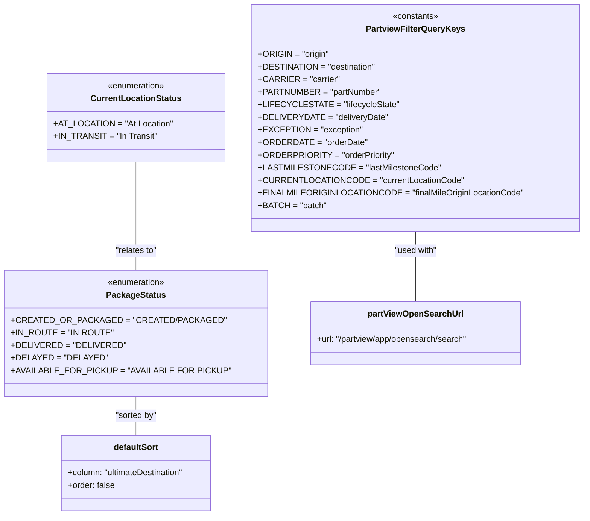
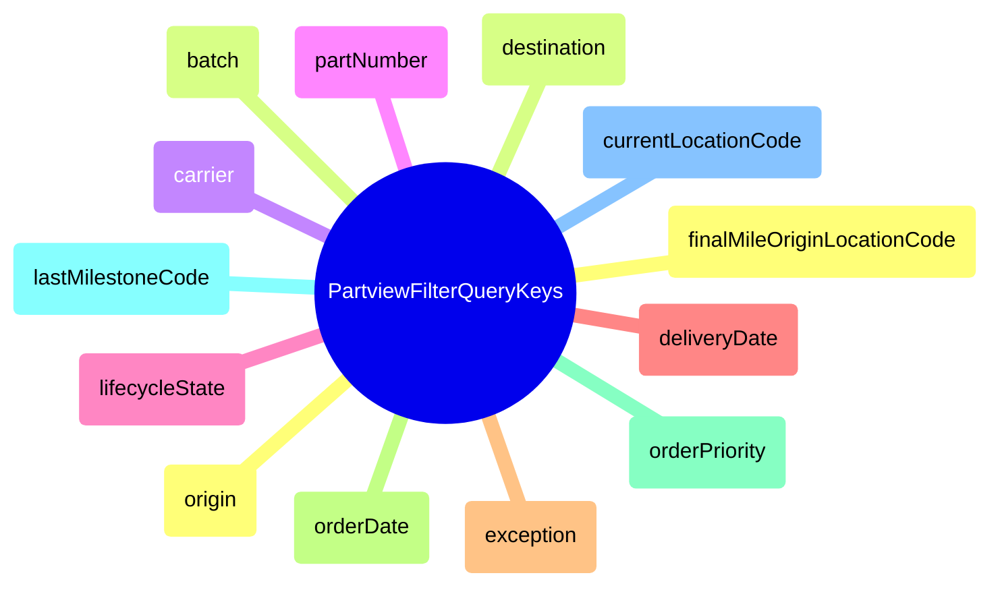

# Diagram: web/portal/src/pages/partview/utils/const.ts


> Auto-generated by Obscura crawlers

## Diagram 1



### SVG

<svg id="container" width="1041.06640625" xmlns="http://www.w3.org/2000/svg" class="classDiagram" height="980" viewBox="0 0 1041.06640625 980" role="graphics-document document" aria-roledescription="class"><style>#container{font-family:"trebuchet ms",verdana,arial,sans-serif;font-size:16px;fill:#333;}@keyframes edge-animation-frame{from{stroke-dashoffset:0;}}@keyframes dash{to{stroke-dashoffset:0;}}#container .edge-animation-slow{stroke-dasharray:9,5!important;stroke-dashoffset:900;animation:dash 50s linear infinite;stroke-linecap:round;}#container .edge-animation-fast{stroke-dasharray:9,5!important;stroke-dashoffset:900;animation:dash 20s linear infinite;stroke-linecap:round;}#container .error-icon{fill:#552222;}#container .error-text{fill:#552222;stroke:#552222;}#container .edge-thickness-normal{stroke-width:1px;}#container .edge-thickness-thick{stroke-width:3.5px;}#container .edge-pattern-solid{stroke-dasharray:0;}#container .edge-thickness-invisible{stroke-width:0;fill:none;}#container .edge-pattern-dashed{stroke-dasharray:3;}#container .edge-pattern-dotted{stroke-dasharray:2;}#container .marker{fill:#333333;stroke:#333333;}#container .marker.cross{stroke:#333333;}#container svg{font-family:"trebuchet ms",verdana,arial,sans-serif;font-size:16px;}#container p{margin:0;}#container g.classGroup text{fill:#9370DB;stroke:none;font-family:"trebuchet ms",verdana,arial,sans-serif;font-size:10px;}#container g.classGroup text .title{font-weight:bolder;}#container .nodeLabel,#container .edgeLabel{color:#131300;}#container .edgeLabel .label rect{fill:#ECECFF;}#container .label text{fill:#131300;}#container .labelBkg{background:#ECECFF;}#container .edgeLabel .label span{background:#ECECFF;}#container .classTitle{font-weight:bolder;}#container .node rect,#container .node circle,#container .node ellipse,#container .node polygon,#container .node path{fill:#ECECFF;stroke:#9370DB;stroke-width:1px;}#container .divider{stroke:#9370DB;stroke-width:1;}#container g.clickable{cursor:pointer;}#container g.classGroup rect{fill:#ECECFF;stroke:#9370DB;}#container g.classGroup line{stroke:#9370DB;stroke-width:1;}#container .classLabel .box{stroke:none;stroke-width:0;fill:#ECECFF;opacity:0.5;}#container .classLabel .label{fill:#9370DB;font-size:10px;}#container .relation{stroke:#333333;stroke-width:1;fill:none;}#container .dashed-line{stroke-dasharray:3;}#container .dotted-line{stroke-dasharray:1 2;}#container #compositionStart,#container .composition{fill:#333333!important;stroke:#333333!important;stroke-width:1;}#container #compositionEnd,#container .composition{fill:#333333!important;stroke:#333333!important;stroke-width:1;}#container #dependencyStart,#container .dependency{fill:#333333!important;stroke:#333333!important;stroke-width:1;}#container #dependencyStart,#container .dependency{fill:#333333!important;stroke:#333333!important;stroke-width:1;}#container #extensionStart,#container .extension{fill:transparent!important;stroke:#333333!important;stroke-width:1;}#container #extensionEnd,#container .extension{fill:transparent!important;stroke:#333333!important;stroke-width:1;}#container #aggregationStart,#container .aggregation{fill:transparent!important;stroke:#333333!important;stroke-width:1;}#container #aggregationEnd,#container .aggregation{fill:transparent!important;stroke:#333333!important;stroke-width:1;}#container #lollipopStart,#container .lollipop{fill:#ECECFF!important;stroke:#333333!important;stroke-width:1;}#container #lollipopEnd,#container .lollipop{fill:#ECECFF!important;stroke:#333333!important;stroke-width:1;}#container .edgeTerminals{font-size:11px;line-height:initial;}#container .classTitleText{text-anchor:middle;font-size:18px;fill:#333;}#container .label-icon{display:inline-block;height:1em;overflow:visible;vertical-align:-0.125em;}#container .node .label-icon path{fill:currentColor;stroke:revert;stroke-width:revert;}#container :root{--mermaid-font-family:"trebuchet ms",verdana,arial,sans-serif;}</style><g><defs><marker id="container_class-aggregationStart" class="marker aggregation class" refX="18" refY="7" markerWidth="190" markerHeight="240" orient="auto"><path d="M 18,7 L9,13 L1,7 L9,1 Z"></path></marker></defs><defs><marker id="container_class-aggregationEnd" class="marker aggregation class" refX="1" refY="7" markerWidth="20" markerHeight="28" orient="auto"><path d="M 18,7 L9,13 L1,7 L9,1 Z"></path></marker></defs><defs><marker id="container_class-extensionStart" class="marker extension class" refX="18" refY="7" markerWidth="190" markerHeight="240" orient="auto"><path d="M 1,7 L18,13 V 1 Z"></path></marker></defs><defs><marker id="container_class-extensionEnd" class="marker extension class" refX="1" refY="7" markerWidth="20" markerHeight="28" orient="auto"><path d="M 1,1 V 13 L18,7 Z"></path></marker></defs><defs><marker id="container_class-compositionStart" class="marker composition class" refX="18" refY="7" markerWidth="190" markerHeight="240" orient="auto"><path d="M 18,7 L9,13 L1,7 L9,1 Z"></path></marker></defs><defs><marker id="container_class-compositionEnd" class="marker composition class" refX="1" refY="7" markerWidth="20" markerHeight="28" orient="auto"><path d="M 18,7 L9,13 L1,7 L9,1 Z"></path></marker></defs><defs><marker id="container_class-dependencyStart" class="marker dependency class" refX="6" refY="7" markerWidth="190" markerHeight="240" orient="auto"><path d="M 5,7 L9,13 L1,7 L9,1 Z"></path></marker></defs><defs><marker id="container_class-dependencyEnd" class="marker dependency class" refX="13" refY="7" markerWidth="20" markerHeight="28" orient="auto"><path d="M 18,7 L9,13 L14,7 L9,1 Z"></path></marker></defs><defs><marker id="container_class-lollipopStart" class="marker lollipop class" refX="13" refY="7" markerWidth="190" markerHeight="240" orient="auto"><circle stroke="black" fill="transparent" cx="7" cy="7" r="6"></circle></marker></defs><defs><marker id="container_class-lollipopEnd" class="marker lollipop class" refX="1" refY="7" markerWidth="190" markerHeight="240" orient="auto"><circle stroke="black" fill="transparent" cx="7" cy="7" r="6"></circle></marker></defs><g class="root"><g class="clusters"></g><g class="edgePaths"><path d="M234.043,754L234.043,760.167C234.043,766.333,234.043,778.667,234.043,791C234.043,803.333,234.043,815.667,234.043,821.833L234.043,828" id="id_PackageStatus_defaultSort_1" class="edge-thickness-normal edge-pattern-solid relation" style=";;;" data-edge="true" data-et="edge" data-id="id_PackageStatus_defaultSort_1" data-points="W3sieCI6MjM0LjA0Mjk2ODc1LCJ5Ijo3NTR9LHsieCI6MjM0LjA0Mjk2ODc1LCJ5Ijo3OTF9LHsieCI6MjM0LjA0Mjk2ODc1LCJ5Ijo4Mjh9XQ=="></path><path d="M738.23,440L738.23,446.167C738.23,452.333,738.23,464.667,738.23,487C738.23,509.333,738.23,541.667,738.23,557.833L738.23,574" id="id_PartviewFilterQueryKeys_partViewOpenSearchUrl_2" class="edge-thickness-normal edge-pattern-solid relation" style=";;;" data-edge="true" data-et="edge" data-id="id_PartviewFilterQueryKeys_partViewOpenSearchUrl_2" data-points="W3sieCI6NzM4LjIzMDQ2ODc1LCJ5Ijo0NDB9LHsieCI6NzM4LjIzMDQ2ODc1LCJ5Ijo0Nzd9LHsieCI6NzM4LjIzMDQ2ODc1LCJ5Ijo1NzR9XQ=="></path><path d="M234.043,308L234.043,336.167C234.043,364.333,234.043,420.667,234.043,455C234.043,489.333,234.043,501.667,234.043,507.833L234.043,514" id="id_CurrentLocationStatus_PackageStatus_3" class="edge-thickness-normal edge-pattern-solid relation" style=";;;" data-edge="true" data-et="edge" data-id="id_CurrentLocationStatus_PackageStatus_3" data-points="W3sieCI6MjM0LjA0Mjk2ODc1LCJ5IjozMDh9LHsieCI6MjM0LjA0Mjk2ODc1LCJ5Ijo0Nzd9LHsieCI6MjM0LjA0Mjk2ODc1LCJ5Ijo1MTR9XQ=="></path></g><g class="edgeLabels"><g class="edgeLabel" transform="translate(234.04296875, 791)"><g class="label" data-id="id_PackageStatus_defaultSort_1" transform="translate(-40.4921875, -12)"><foreignObject width="80.984375" height="24"><div xmlns="http://www.w3.org/1999/xhtml" class="labelBkg" style="display: table-cell; white-space: nowrap; line-height: 1.5; max-width: 200px; text-align: center;"><span class="edgeLabel"><p>"sorted by"</p></span></div></foreignObject></g></g><g class="edgeLabel" transform="translate(738.23046875, 477)"><g class="label" data-id="id_PartviewFilterQueryKeys_partViewOpenSearchUrl_2" transform="translate(-41.53125, -12)"><foreignObject width="83.0625" height="24"><div xmlns="http://www.w3.org/1999/xhtml" class="labelBkg" style="display: table-cell; white-space: nowrap; line-height: 1.5; max-width: 200px; text-align: center;"><span class="edgeLabel"><p>"used with"</p></span></div></foreignObject></g></g><g class="edgeLabel" transform="translate(234.04296875, 477)"><g class="label" data-id="id_CurrentLocationStatus_PackageStatus_3" transform="translate(-40.59375, -12)"><foreignObject width="81.1875" height="24"><div xmlns="http://www.w3.org/1999/xhtml" class="labelBkg" style="display: table-cell; white-space: nowrap; line-height: 1.5; max-width: 200px; text-align: center;"><span class="edgeLabel"><p>"relates to"</p></span></div></foreignObject></g></g></g><g class="nodes"><g class="node default" id="classId-PackageStatus-0" transform="translate(234.04296875, 634)"><g class="basic label-container"><path d="M-226.04296875 -120 L226.04296875 -120 L226.04296875 120 L-226.04296875 120" stroke="none" stroke-width="0" fill="#ECECFF" style=""></path><path d="M-226.04296875 -120 C-121.98266631185078 -120, -17.922363873701556 -120, 226.04296875 -120 M-226.04296875 -120 C-102.77129716693105 -120, 20.500374416137902 -120, 226.04296875 -120 M226.04296875 -120 C226.04296875 -28.235754681176786, 226.04296875 63.52849063764643, 226.04296875 120 M226.04296875 -120 C226.04296875 -55.18527395500578, 226.04296875 9.629452089988433, 226.04296875 120 M226.04296875 120 C91.2419112594082 120, -43.559146231183604 120, -226.04296875 120 M226.04296875 120 C132.18497273838165 120, 38.32697672676329 120, -226.04296875 120 M-226.04296875 120 C-226.04296875 71.39671816519896, -226.04296875 22.793436330397924, -226.04296875 -120 M-226.04296875 120 C-226.04296875 30.200927339620534, -226.04296875 -59.59814532075893, -226.04296875 -120" stroke="#9370DB" stroke-width="1.3" fill="none" stroke-dasharray="0 0" style=""></path></g><g class="annotation-group text" transform="translate(-55.5546875, -96)"><g class="label" style="" transform="translate(0,-12)"><foreignObject width="111.109375" height="24"><div xmlns="http://www.w3.org/1999/xhtml" style="display: table-cell; white-space: nowrap; line-height: 1.5; max-width: 161px; text-align: center;"><span class="nodeLabel markdown-node-label" style=""><p>«enumeration»</p></span></div></foreignObject></g></g><g class="label-group text" transform="translate(-53.328125, -72)"><g class="label" style="font-weight: bolder" transform="translate(0,-12)"><foreignObject width="106.65625" height="24"><div xmlns="http://www.w3.org/1999/xhtml" style="display: table-cell; white-space: nowrap; line-height: 1.5; max-width: 154px; text-align: center;"><span class="nodeLabel markdown-node-label" style=""><p>PackageStatus</p></span></div></foreignObject></g></g><g class="members-group text" transform="translate(-214.04296875, -24)"><g class="label" style="" transform="translate(0,-12)"><foreignObject width="354.46875" height="24"><div xmlns="http://www.w3.org/1999/xhtml" style="display: table-cell; white-space: nowrap; line-height: 1.5; max-width: 412px; text-align: center;"><span class="nodeLabel markdown-node-label" style=""><p>+CREATED_OR_PACKAGED = "CREATED/PACKAGED"</p></span></div></foreignObject></g><g class="label" style="" transform="translate(0,12)"><foreignObject width="177.15625" height="24"><div xmlns="http://www.w3.org/1999/xhtml" style="display: table-cell; white-space: nowrap; line-height: 1.5; max-width: 235px; text-align: center;"><span class="nodeLabel markdown-node-label" style=""><p>+IN_ROUTE = "IN ROUTE"</p></span></div></foreignObject></g><g class="label" style="" transform="translate(0,36)"><foreignObject width="192.34375" height="24"><div xmlns="http://www.w3.org/1999/xhtml" style="display: table-cell; white-space: nowrap; line-height: 1.5; max-width: 250px; text-align: center;"><span class="nodeLabel markdown-node-label" style=""><p>+DELIVERED = "DELIVERED"</p></span></div></foreignObject></g><g class="label" style="" transform="translate(0,60)"><foreignObject width="163" height="24"><div xmlns="http://www.w3.org/1999/xhtml" style="display: table-cell; white-space: nowrap; line-height: 1.5; max-width: 220px; text-align: center;"><span class="nodeLabel markdown-node-label" style=""><p>+DELAYED = "DELAYED"</p></span></div></foreignObject></g><g class="label" style="" transform="translate(0,84)"><foreignObject width="372.53125" height="24"><div xmlns="http://www.w3.org/1999/xhtml" style="display: table-cell; white-space: nowrap; line-height: 1.5; max-width: 430px; text-align: center;"><span class="nodeLabel markdown-node-label" style=""><p>+AVAILABLE_FOR_PICKUP = "AVAILABLE FOR PICKUP"</p></span></div></foreignObject></g></g><g class="methods-group text" transform="translate(-214.04296875, 120)"></g><g class="divider" style=""><path d="M-226.04296875 -48 C-69.71073874173919 -48, 86.62149126652162 -48, 226.04296875 -48 M-226.04296875 -48 C-64.94962068994877 -48, 96.14372737010245 -48, 226.04296875 -48" stroke="#9370DB" stroke-width="1.3" fill="none" stroke-dasharray="0 0" style=""></path></g><g class="divider" style=""><path d="M-226.04296875 96 C-83.39766055651688 96, 59.247647636966235 96, 226.04296875 96 M-226.04296875 96 C-51.104822634053505 96, 123.83332348189299 96, 226.04296875 96" stroke="#9370DB" stroke-width="1.3" fill="none" stroke-dasharray="0 0" style=""></path></g></g><g class="node default" id="classId-CurrentLocationStatus-1" transform="translate(234.04296875, 224)"><g class="basic label-container"><path d="M-159.3515625 -84 L159.3515625 -84 L159.3515625 84 L-159.3515625 84" stroke="none" stroke-width="0" fill="#ECECFF" style=""></path><path d="M-159.3515625 -84 C-35.42663173775124 -84, 88.49829902449753 -84, 159.3515625 -84 M-159.3515625 -84 C-88.46191804116187 -84, -17.57227358232373 -84, 159.3515625 -84 M159.3515625 -84 C159.3515625 -37.960768324193964, 159.3515625 8.078463351612072, 159.3515625 84 M159.3515625 -84 C159.3515625 -32.91707949518985, 159.3515625 18.165841009620294, 159.3515625 84 M159.3515625 84 C82.58647137612144 84, 5.821380252242875 84, -159.3515625 84 M159.3515625 84 C57.04252993525532 84, -45.266502629489366 84, -159.3515625 84 M-159.3515625 84 C-159.3515625 48.446089635172946, -159.3515625 12.892179270345892, -159.3515625 -84 M-159.3515625 84 C-159.3515625 49.24144550342882, -159.3515625 14.482891006857642, -159.3515625 -84" stroke="#9370DB" stroke-width="1.3" fill="none" stroke-dasharray="0 0" style=""></path></g><g class="annotation-group text" transform="translate(-55.5546875, -60)"><g class="label" style="" transform="translate(0,-12)"><foreignObject width="111.109375" height="24"><div xmlns="http://www.w3.org/1999/xhtml" style="display: table-cell; white-space: nowrap; line-height: 1.5; max-width: 161px; text-align: center;"><span class="nodeLabel markdown-node-label" style=""><p>«enumeration»</p></span></div></foreignObject></g></g><g class="label-group text" transform="translate(-82.171875, -36)"><g class="label" style="font-weight: bolder" transform="translate(0,-12)"><foreignObject width="164.34375" height="24"><div xmlns="http://www.w3.org/1999/xhtml" style="display: table-cell; white-space: nowrap; line-height: 1.5; max-width: 212px; text-align: center;"><span class="nodeLabel markdown-node-label" style=""><p>CurrentLocationStatus</p></span></div></foreignObject></g></g><g class="members-group text" transform="translate(-147.3515625, 12)"><g class="label" style="" transform="translate(0,-12)"><foreignObject width="212.53125" height="24"><div xmlns="http://www.w3.org/1999/xhtml" style="display: table-cell; white-space: nowrap; line-height: 1.5; max-width: 270px; text-align: center;"><span class="nodeLabel markdown-node-label" style=""><p>+AT_LOCATION = "At Location"</p></span></div></foreignObject></g><g class="label" style="" transform="translate(0,12)"><foreignObject width="187.515625" height="24"><div xmlns="http://www.w3.org/1999/xhtml" style="display: table-cell; white-space: nowrap; line-height: 1.5; max-width: 245px; text-align: center;"><span class="nodeLabel markdown-node-label" style=""><p>+IN_TRANSIT = "In Transit"</p></span></div></foreignObject></g></g><g class="methods-group text" transform="translate(-147.3515625, 84)"></g><g class="divider" style=""><path d="M-159.3515625 -12 C-67.94527337238448 -12, 23.461015755231045 -12, 159.3515625 -12 M-159.3515625 -12 C-71.78617461998151 -12, 15.779213260036983 -12, 159.3515625 -12" stroke="#9370DB" stroke-width="1.3" fill="none" stroke-dasharray="0 0" style=""></path></g><g class="divider" style=""><path d="M-159.3515625 60 C-64.54873968511524 60, 30.254083129769526 60, 159.3515625 60 M-159.3515625 60 C-41.45717677511807 60, 76.43720894976386 60, 159.3515625 60" stroke="#9370DB" stroke-width="1.3" fill="none" stroke-dasharray="0 0" style=""></path></g></g><g class="node default" id="classId-defaultSort-2" transform="translate(234.04296875, 900)"><g class="basic label-container"><path d="M-146.5546875 -72 L146.5546875 -72 L146.5546875 72 L-146.5546875 72" stroke="none" stroke-width="0" fill="#ECECFF" style=""></path><path d="M-146.5546875 -72 C-66.0594604350357 -72, 14.435766629928594 -72, 146.5546875 -72 M-146.5546875 -72 C-77.45287161348264 -72, -8.351055726965285 -72, 146.5546875 -72 M146.5546875 -72 C146.5546875 -18.121745333504904, 146.5546875 35.75650933299019, 146.5546875 72 M146.5546875 -72 C146.5546875 -41.94380591874477, 146.5546875 -11.887611837489544, 146.5546875 72 M146.5546875 72 C61.68458551752579 72, -23.18551646494842 72, -146.5546875 72 M146.5546875 72 C42.10787031487547 72, -62.33894687024906 72, -146.5546875 72 M-146.5546875 72 C-146.5546875 24.932182192946684, -146.5546875 -22.135635614106633, -146.5546875 -72 M-146.5546875 72 C-146.5546875 33.90622967520321, -146.5546875 -4.187540649593586, -146.5546875 -72" stroke="#9370DB" stroke-width="1.3" fill="none" stroke-dasharray="0 0" style=""></path></g><g class="annotation-group text" transform="translate(0, -48)"></g><g class="label-group text" transform="translate(-41.84375, -48)"><g class="label" style="font-weight: bolder" transform="translate(0,-12)"><foreignObject width="83.6875" height="24"><div xmlns="http://www.w3.org/1999/xhtml" style="display: table-cell; white-space: nowrap; line-height: 1.5; max-width: 132px; text-align: center;"><span class="nodeLabel markdown-node-label" style=""><p>defaultSort</p></span></div></foreignObject></g></g><g class="members-group text" transform="translate(-134.5546875, 0)"><g class="label" style="" transform="translate(0,-12)"><foreignObject width="227.265625" height="24"><div xmlns="http://www.w3.org/1999/xhtml" style="display: table-cell; white-space: nowrap; line-height: 1.5; max-width: 285px; text-align: center;"><span class="nodeLabel markdown-node-label" style=""><p>+column: "ultimateDestination"</p></span></div></foreignObject></g><g class="label" style="" transform="translate(0,12)"><foreignObject width="90.171875" height="24"><div xmlns="http://www.w3.org/1999/xhtml" style="display: table-cell; white-space: nowrap; line-height: 1.5; max-width: 148px; text-align: center;"><span class="nodeLabel markdown-node-label" style=""><p>+order: false</p></span></div></foreignObject></g></g><g class="methods-group text" transform="translate(-134.5546875, 72)"></g><g class="divider" style=""><path d="M-146.5546875 -24 C-56.44229998614199 -24, 33.67008752771602 -24, 146.5546875 -24 M-146.5546875 -24 C-46.499274434577316 -24, 53.55613863084537 -24, 146.5546875 -24" stroke="#9370DB" stroke-width="1.3" fill="none" stroke-dasharray="0 0" style=""></path></g><g class="divider" style=""><path d="M-146.5546875 48 C-48.422004033213526 48, 49.71067943357295 48, 146.5546875 48 M-146.5546875 48 C-38.31568223486735 48, 69.9233230302653 48, 146.5546875 48" stroke="#9370DB" stroke-width="1.3" fill="none" stroke-dasharray="0 0" style=""></path></g></g><g class="node default" id="classId-PartviewFilterQueryKeys-3" transform="translate(738.23046875, 224)"><g class="basic label-container"><path d="M-294.8359375 -216 L294.8359375 -216 L294.8359375 216 L-294.8359375 216" stroke="none" stroke-width="0" fill="#ECECFF" style=""></path><path d="M-294.8359375 -216 C-99.62955827812144 -216, 95.57682094375713 -216, 294.8359375 -216 M-294.8359375 -216 C-161.558318487594 -216, -28.280699475187987 -216, 294.8359375 -216 M294.8359375 -216 C294.8359375 -120.40923574258619, 294.8359375 -24.81847148517238, 294.8359375 216 M294.8359375 -216 C294.8359375 -44.643261845549034, 294.8359375 126.71347630890193, 294.8359375 216 M294.8359375 216 C68.80282207761937 216, -157.23029334476126 216, -294.8359375 216 M294.8359375 216 C106.860702155047 216, -81.11453318990601 216, -294.8359375 216 M-294.8359375 216 C-294.8359375 118.53274288985806, -294.8359375 21.065485779716113, -294.8359375 -216 M-294.8359375 216 C-294.8359375 115.05542144097723, -294.8359375 14.110842881954454, -294.8359375 -216" stroke="#9370DB" stroke-width="1.3" fill="none" stroke-dasharray="0 0" style=""></path></g><g class="annotation-group text" transform="translate(-44.2265625, -192)"><g class="label" style="" transform="translate(0,-12)"><foreignObject width="88.453125" height="24"><div xmlns="http://www.w3.org/1999/xhtml" style="display: table-cell; white-space: nowrap; line-height: 1.5; max-width: 138px; text-align: center;"><span class="nodeLabel markdown-node-label" style=""><p>«constants»</p></span></div></foreignObject></g></g><g class="label-group text" transform="translate(-89.734375, -168)"><g class="label" style="font-weight: bolder" transform="translate(0,-12)"><foreignObject width="179.46875" height="24"><div xmlns="http://www.w3.org/1999/xhtml" style="display: table-cell; white-space: nowrap; line-height: 1.5; max-width: 225px; text-align: center;"><span class="nodeLabel markdown-node-label" style=""><p>PartviewFilterQueryKeys</p></span></div></foreignObject></g></g><g class="members-group text" transform="translate(-282.8359375, -120)"><g class="label" style="" transform="translate(0,-12)"><foreignObject width="130.375" height="24"><div xmlns="http://www.w3.org/1999/xhtml" style="display: table-cell; white-space: nowrap; line-height: 1.5; max-width: 188px; text-align: center;"><span class="nodeLabel markdown-node-label" style=""><p>+ORIGIN = "origin"</p></span></div></foreignObject></g><g class="label" style="" transform="translate(0,12)"><foreignObject width="214.40625" height="24"><div xmlns="http://www.w3.org/1999/xhtml" style="display: table-cell; white-space: nowrap; line-height: 1.5; max-width: 272px; text-align: center;"><span class="nodeLabel markdown-node-label" style=""><p>+DESTINATION = "destination"</p></span></div></foreignObject></g><g class="label" style="" transform="translate(0,36)"><foreignObject width="145.546875" height="24"><div xmlns="http://www.w3.org/1999/xhtml" style="display: table-cell; white-space: nowrap; line-height: 1.5; max-width: 203px; text-align: center;"><span class="nodeLabel markdown-node-label" style=""><p>+CARRIER = "carrier"</p></span></div></foreignObject></g><g class="label" style="" transform="translate(0,60)"><foreignObject width="222.734375" height="24"><div xmlns="http://www.w3.org/1999/xhtml" style="display: table-cell; white-space: nowrap; line-height: 1.5; max-width: 280px; text-align: center;"><span class="nodeLabel markdown-node-label" style=""><p>+PARTNUMBER = "partNumber"</p></span></div></foreignObject></g><g class="label" style="" transform="translate(0,84)"><foreignObject width="246.25" height="24"><div xmlns="http://www.w3.org/1999/xhtml" style="display: table-cell; white-space: nowrap; line-height: 1.5; max-width: 304px; text-align: center;"><span class="nodeLabel markdown-node-label" style=""><p>+LIFECYCLESTATE = "lifecycleState"</p></span></div></foreignObject></g><g class="label" style="" transform="translate(0,108)"><foreignObject width="230.5" height="24"><div xmlns="http://www.w3.org/1999/xhtml" style="display: table-cell; white-space: nowrap; line-height: 1.5; max-width: 288px; text-align: center;"><span class="nodeLabel markdown-node-label" style=""><p>+DELIVERYDATE = "deliveryDate"</p></span></div></foreignObject></g><g class="label" style="" transform="translate(0,132)"><foreignObject width="186.0625" height="24"><div xmlns="http://www.w3.org/1999/xhtml" style="display: table-cell; white-space: nowrap; line-height: 1.5; max-width: 243px; text-align: center;"><span class="nodeLabel markdown-node-label" style=""><p>+EXCEPTION = "exception"</p></span></div></foreignObject></g><g class="label" style="" transform="translate(0,156)"><foreignObject width="194.171875" height="24"><div xmlns="http://www.w3.org/1999/xhtml" style="display: table-cell; white-space: nowrap; line-height: 1.5; max-width: 252px; text-align: center;"><span class="nodeLabel markdown-node-label" style=""><p>+ORDERDATE = "orderDate"</p></span></div></foreignObject></g><g class="label" style="" transform="translate(0,180)"><foreignObject width="245.390625" height="24"><div xmlns="http://www.w3.org/1999/xhtml" style="display: table-cell; white-space: nowrap; line-height: 1.5; max-width: 303px; text-align: center;"><span class="nodeLabel markdown-node-label" style=""><p>+ORDERPRIORITY = "orderPriority"</p></span></div></foreignObject></g><g class="label" style="" transform="translate(0,204)"><foreignObject width="322.5" height="24"><div xmlns="http://www.w3.org/1999/xhtml" style="display: table-cell; white-space: nowrap; line-height: 1.5; max-width: 380px; text-align: center;"><span class="nodeLabel markdown-node-label" style=""><p>+LASTMILESTONECODE = "lastMilestoneCode"</p></span></div></foreignObject></g><g class="label" style="" transform="translate(0,228)"><foreignObject width="363.578125" height="24"><div xmlns="http://www.w3.org/1999/xhtml" style="display: table-cell; white-space: nowrap; line-height: 1.5; max-width: 421px; text-align: center;"><span class="nodeLabel markdown-node-label" style=""><p>+CURRENTLOCATIONCODE = "currentLocationCode"</p></span></div></foreignObject></g><g class="label" style="" transform="translate(0,252)"><foreignObject width="475.9375" height="24"><div xmlns="http://www.w3.org/1999/xhtml" style="display: table-cell; white-space: nowrap; line-height: 1.5; max-width: 533px; text-align: center;"><span class="nodeLabel markdown-node-label" style=""><p>+FINALMILEORIGINLOCATIONCODE = "finalMileOriginLocationCode"</p></span></div></foreignObject></g><g class="label" style="" transform="translate(0,276)"><foreignObject width="123.25" height="24"><div xmlns="http://www.w3.org/1999/xhtml" style="display: table-cell; white-space: nowrap; line-height: 1.5; max-width: 181px; text-align: center;"><span class="nodeLabel markdown-node-label" style=""><p>+BATCH = "batch"</p></span></div></foreignObject></g></g><g class="methods-group text" transform="translate(-282.8359375, 216)"></g><g class="divider" style=""><path d="M-294.8359375 -144 C-120.93916870678905 -144, 52.957600086421905 -144, 294.8359375 -144 M-294.8359375 -144 C-65.42758448990222 -144, 163.98076852019557 -144, 294.8359375 -144" stroke="#9370DB" stroke-width="1.3" fill="none" stroke-dasharray="0 0" style=""></path></g><g class="divider" style=""><path d="M-294.8359375 192 C-109.10995231535176 192, 76.61603286929648 192, 294.8359375 192 M-294.8359375 192 C-117.85816402045984 192, 59.11960945908032 192, 294.8359375 192" stroke="#9370DB" stroke-width="1.3" fill="none" stroke-dasharray="0 0" style=""></path></g></g><g class="node default" id="classId-partViewOpenSearchUrl-4" transform="translate(738.23046875, 634)"><g class="basic label-container"><path d="M-205.82421875 -60 L205.82421875 -60 L205.82421875 60 L-205.82421875 60" stroke="none" stroke-width="0" fill="#ECECFF" style=""></path><path d="M-205.82421875 -60 C-98.51806349134588 -60, 8.78809176730823 -60, 205.82421875 -60 M-205.82421875 -60 C-57.678845377355714 -60, 90.46652799528857 -60, 205.82421875 -60 M205.82421875 -60 C205.82421875 -14.988119826712648, 205.82421875 30.023760346574704, 205.82421875 60 M205.82421875 -60 C205.82421875 -15.806848212926667, 205.82421875 28.386303574146666, 205.82421875 60 M205.82421875 60 C97.33376304408183 60, -11.156692661836331 60, -205.82421875 60 M205.82421875 60 C104.98882330416266 60, 4.15342785832533 60, -205.82421875 60 M-205.82421875 60 C-205.82421875 20.808720564568986, -205.82421875 -18.382558870862027, -205.82421875 -60 M-205.82421875 60 C-205.82421875 19.437241408001917, -205.82421875 -21.125517183996166, -205.82421875 -60" stroke="#9370DB" stroke-width="1.3" fill="none" stroke-dasharray="0 0" style=""></path></g><g class="annotation-group text" transform="translate(0, -36)"></g><g class="label-group text" transform="translate(-87.4453125, -36)"><g class="label" style="font-weight: bolder" transform="translate(0,-12)"><foreignObject width="174.890625" height="24"><div xmlns="http://www.w3.org/1999/xhtml" style="display: table-cell; white-space: nowrap; line-height: 1.5; max-width: 223px; text-align: center;"><span class="nodeLabel markdown-node-label" style=""><p>partViewOpenSearchUrl</p></span></div></foreignObject></g></g><g class="members-group text" transform="translate(-193.82421875, 12)"><g class="label" style="" transform="translate(0,-12)"><foreignObject width="300.203125" height="24"><div xmlns="http://www.w3.org/1999/xhtml" style="display: table-cell; white-space: nowrap; line-height: 1.5; max-width: 358px; text-align: center;"><span class="nodeLabel markdown-node-label" style=""><p>+url: "/partview/app/opensearch/search"</p></span></div></foreignObject></g></g><g class="methods-group text" transform="translate(-193.82421875, 60)"></g><g class="divider" style=""><path d="M-205.82421875 -12 C-98.18010789113505 -12, 9.464002967729897 -12, 205.82421875 -12 M-205.82421875 -12 C-96.1727429938916 -12, 13.478732762216794 -12, 205.82421875 -12" stroke="#9370DB" stroke-width="1.3" fill="none" stroke-dasharray="0 0" style=""></path></g><g class="divider" style=""><path d="M-205.82421875 36 C-41.54365478230278 36, 122.73690918539444 36, 205.82421875 36 M-205.82421875 36 C-50.223904374673054 36, 105.37641000065389 36, 205.82421875 36" stroke="#9370DB" stroke-width="1.3" fill="none" stroke-dasharray="0 0" style=""></path></g></g></g></g></g></svg>

## Diagram 2

```mermaid
flowchart LR
    PS[PackageStatus\n(CREATED / IN_ROUTE / DELIVERED / DELAYED / AVAILABLE_FOR_PICKUP)]
    CLS[CurrentLocationStatus\n(At Location / In Transit)]
    SORT[defaultSort\ncolumn: ultimateDestination\norder: false]
    URL[/partview/app/opensearch/search]
    FILTERS[(PartviewFilterQueryKeys)]
    PS -->|affects view| FILTERS
    CLS -->|provides location| FILTERS
    FILTERS -->|search endpoint| URL
    SORT -->|applies to| FILTERS
```

> SVG rendering failed for this diagram.

## Diagram 3



### SVG

<svg id="container" width="100%" xmlns="http://www.w3.org/2000/svg" class="mindmapDiagram" style="max-width: 727.2574462890625px;" viewBox="5 5 727.2574462890625 440.21612548828125" role="graphics-document document" aria-roledescription="mindmap"><style>#container{font-family:"trebuchet ms",verdana,arial,sans-serif;font-size:16px;fill:#333;}@keyframes edge-animation-frame{from{stroke-dashoffset:0;}}@keyframes dash{to{stroke-dashoffset:0;}}#container .edge-animation-slow{stroke-dasharray:9,5!important;stroke-dashoffset:900;animation:dash 50s linear infinite;stroke-linecap:round;}#container .edge-animation-fast{stroke-dasharray:9,5!important;stroke-dashoffset:900;animation:dash 20s linear infinite;stroke-linecap:round;}#container .error-icon{fill:#552222;}#container .error-text{fill:#552222;stroke:#552222;}#container .edge-thickness-normal{stroke-width:1px;}#container .edge-thickness-thick{stroke-width:3.5px;}#container .edge-pattern-solid{stroke-dasharray:0;}#container .edge-thickness-invisible{stroke-width:0;fill:none;}#container .edge-pattern-dashed{stroke-dasharray:3;}#container .edge-pattern-dotted{stroke-dasharray:2;}#container .marker{fill:#333333;stroke:#333333;}#container .marker.cross{stroke:#333333;}#container svg{font-family:"trebuchet ms",verdana,arial,sans-serif;font-size:16px;}#container p{margin:0;}#container .edge{stroke-width:3;}#container .section--1 rect,#container .section--1 path,#container .section--1 circle,#container .section--1 polygon,#container .section--1 path{fill:hsl(240, 100%, 76.2745098039%);}#container .section--1 text{fill:#ffffff;}#container .node-icon--1{font-size:40px;color:#ffffff;}#container .section-edge--1{stroke:hsl(240, 100%, 76.2745098039%);}#container .edge-depth--1{stroke-width:17;}#container .section--1 line{stroke:hsl(60, 100%, 86.2745098039%);stroke-width:3;}#container .disabled,#container .disabled circle,#container .disabled text{fill:lightgray;}#container .disabled text{fill:#efefef;}#container .section-0 rect,#container .section-0 path,#container .section-0 circle,#container .section-0 polygon,#container .section-0 path{fill:hsl(60, 100%, 73.5294117647%);}#container .section-0 text{fill:black;}#container .node-icon-0{font-size:40px;color:black;}#container .section-edge-0{stroke:hsl(60, 100%, 73.5294117647%);}#container .edge-depth-0{stroke-width:14;}#container .section-0 line{stroke:hsl(240, 100%, 83.5294117647%);stroke-width:3;}#container .disabled,#container .disabled circle,#container .disabled text{fill:lightgray;}#container .disabled text{fill:#efefef;}#container .section-1 rect,#container .section-1 path,#container .section-1 circle,#container .section-1 polygon,#container .section-1 path{fill:hsl(80, 100%, 76.2745098039%);}#container .section-1 text{fill:black;}#container .node-icon-1{font-size:40px;color:black;}#container .section-edge-1{stroke:hsl(80, 100%, 76.2745098039%);}#container .edge-depth-1{stroke-width:11;}#container .section-1 line{stroke:hsl(260, 100%, 86.2745098039%);stroke-width:3;}#container .disabled,#container .disabled circle,#container .disabled text{fill:lightgray;}#container .disabled text{fill:#efefef;}#container .section-2 rect,#container .section-2 path,#container .section-2 circle,#container .section-2 polygon,#container .section-2 path{fill:hsl(270, 100%, 76.2745098039%);}#container .section-2 text{fill:#ffffff;}#container .node-icon-2{font-size:40px;color:#ffffff;}#container .section-edge-2{stroke:hsl(270, 100%, 76.2745098039%);}#container .edge-depth-2{stroke-width:8;}#container .section-2 line{stroke:hsl(90, 100%, 86.2745098039%);stroke-width:3;}#container .disabled,#container .disabled circle,#container .disabled text{fill:lightgray;}#container .disabled text{fill:#efefef;}#container .section-3 rect,#container .section-3 path,#container .section-3 circle,#container .section-3 polygon,#container .section-3 path{fill:hsl(300, 100%, 76.2745098039%);}#container .section-3 text{fill:black;}#container .node-icon-3{font-size:40px;color:black;}#container .section-edge-3{stroke:hsl(300, 100%, 76.2745098039%);}#container .edge-depth-3{stroke-width:5;}#container .section-3 line{stroke:hsl(120, 100%, 86.2745098039%);stroke-width:3;}#container .disabled,#container .disabled circle,#container .disabled text{fill:lightgray;}#container .disabled text{fill:#efefef;}#container .section-4 rect,#container .section-4 path,#container .section-4 circle,#container .section-4 polygon,#container .section-4 path{fill:hsl(330, 100%, 76.2745098039%);}#container .section-4 text{fill:black;}#container .node-icon-4{font-size:40px;color:black;}#container .section-edge-4{stroke:hsl(330, 100%, 76.2745098039%);}#container .edge-depth-4{stroke-width:2;}#container .section-4 line{stroke:hsl(150, 100%, 86.2745098039%);stroke-width:3;}#container .disabled,#container .disabled circle,#container .disabled text{fill:lightgray;}#container .disabled text{fill:#efefef;}#container .section-5 rect,#container .section-5 path,#container .section-5 circle,#container .section-5 polygon,#container .section-5 path{fill:hsl(0, 100%, 76.2745098039%);}#container .section-5 text{fill:black;}#container .node-icon-5{font-size:40px;color:black;}#container .section-edge-5{stroke:hsl(0, 100%, 76.2745098039%);}#container .edge-depth-5{stroke-width:-1;}#container .section-5 line{stroke:hsl(180, 100%, 86.2745098039%);stroke-width:3;}#container .disabled,#container .disabled circle,#container .disabled text{fill:lightgray;}#container .disabled text{fill:#efefef;}#container .section-6 rect,#container .section-6 path,#container .section-6 circle,#container .section-6 polygon,#container .section-6 path{fill:hsl(30, 100%, 76.2745098039%);}#container .section-6 text{fill:black;}#container .node-icon-6{font-size:40px;color:black;}#container .section-edge-6{stroke:hsl(30, 100%, 76.2745098039%);}#container .edge-depth-6{stroke-width:-4;}#container .section-6 line{stroke:hsl(210, 100%, 86.2745098039%);stroke-width:3;}#container .disabled,#container .disabled circle,#container .disabled text{fill:lightgray;}#container .disabled text{fill:#efefef;}#container .section-7 rect,#container .section-7 path,#container .section-7 circle,#container .section-7 polygon,#container .section-7 path{fill:hsl(90, 100%, 76.2745098039%);}#container .section-7 text{fill:black;}#container .node-icon-7{font-size:40px;color:black;}#container .section-edge-7{stroke:hsl(90, 100%, 76.2745098039%);}#container .edge-depth-7{stroke-width:-7;}#container .section-7 line{stroke:hsl(270, 100%, 86.2745098039%);stroke-width:3;}#container .disabled,#container .disabled circle,#container .disabled text{fill:lightgray;}#container .disabled text{fill:#efefef;}#container .section-8 rect,#container .section-8 path,#container .section-8 circle,#container .section-8 polygon,#container .section-8 path{fill:hsl(150, 100%, 76.2745098039%);}#container .section-8 text{fill:black;}#container .node-icon-8{font-size:40px;color:black;}#container .section-edge-8{stroke:hsl(150, 100%, 76.2745098039%);}#container .edge-depth-8{stroke-width:-10;}#container .section-8 line{stroke:hsl(330, 100%, 86.2745098039%);stroke-width:3;}#container .disabled,#container .disabled circle,#container .disabled text{fill:lightgray;}#container .disabled text{fill:#efefef;}#container .section-9 rect,#container .section-9 path,#container .section-9 circle,#container .section-9 polygon,#container .section-9 path{fill:hsl(180, 100%, 76.2745098039%);}#container .section-9 text{fill:black;}#container .node-icon-9{font-size:40px;color:black;}#container .section-edge-9{stroke:hsl(180, 100%, 76.2745098039%);}#container .edge-depth-9{stroke-width:-13;}#container .section-9 line{stroke:hsl(0, 100%, 86.2745098039%);stroke-width:3;}#container .disabled,#container .disabled circle,#container .disabled text{fill:lightgray;}#container .disabled text{fill:#efefef;}#container .section-10 rect,#container .section-10 path,#container .section-10 circle,#container .section-10 polygon,#container .section-10 path{fill:hsl(210, 100%, 76.2745098039%);}#container .section-10 text{fill:black;}#container .node-icon-10{font-size:40px;color:black;}#container .section-edge-10{stroke:hsl(210, 100%, 76.2745098039%);}#container .edge-depth-10{stroke-width:-16;}#container .section-10 line{stroke:hsl(30, 100%, 86.2745098039%);stroke-width:3;}#container .disabled,#container .disabled circle,#container .disabled text{fill:lightgray;}#container .disabled text{fill:#efefef;}#container .section-root rect,#container .section-root path,#container .section-root circle,#container .section-root polygon{fill:hsl(240, 100%, 46.2745098039%);}#container .section-root text{fill:#ffffff;}#container .section-root span{color:#ffffff;}#container .section-2 span{color:#ffffff;}#container .icon-container{height:100%;display:flex;justify-content:center;align-items:center;}#container .edge{fill:none;}#container .mindmap-node-label{dy:1em;alignment-baseline:middle;text-anchor:middle;dominant-baseline:middle;text-align:center;}#container :root{--mermaid-font-family:"trebuchet ms",verdana,arial,sans-serif;}</style><g><marker id="container_mindmap-pointEnd" class="marker mindmap" viewBox="0 0 10 10" refX="5" refY="5" markerUnits="userSpaceOnUse" markerWidth="8" markerHeight="8" orient="auto"><path d="M 0 0 L 10 5 L 0 10 z" class="arrowMarkerPath" style="stroke-width: 1; stroke-dasharray: 1, 0;"></path></marker><marker id="container_mindmap-pointStart" class="marker mindmap" viewBox="0 0 10 10" refX="4.5" refY="5" markerUnits="userSpaceOnUse" markerWidth="8" markerHeight="8" orient="auto"><path d="M 0 5 L 10 10 L 10 0 z" class="arrowMarkerPath" style="stroke-width: 1; stroke-dasharray: 1, 0;"></path></marker><g class="subgraphs"></g><g class="edgePaths"><path d="M407.294,211.118L401.024,198.687C394.754,186.256,382.215,161.395,369.675,136.533C357.136,111.672,344.596,86.81,338.327,74.379L332.057,61.948" id="edge_0_1" class="edge-thickness-normal edge-pattern-solid edge section-edge-0 edge-depth-1" style="undefined;;;undefined" data-edge="true" data-et="edge" data-id="edge_0_1" data-points="W3sieCI6NDA3LjI5Mzc3MDc1MTU5NDcsInkiOjIxMS4xMTgxMTYyNjA1NDgyMn0seyJ4IjozNjkuNjc1MzA3ODI3NTczOCwieSI6MTM2LjUzMzI0NTE5OTAxMDAzfSx7IngiOjMzMi4wNTY4NDQ5MDM1NTI5LCJ5Ijo2MS45NDgzNzQxMzc0NzE4M31d"></path><path d="M409.243,238.72L404.867,251.661C400.49,264.601,391.737,290.483,382.984,316.364C374.231,342.245,365.478,368.126,361.102,381.066L356.725,394.007" id="edge_0_2" class="edge-thickness-normal edge-pattern-solid edge section-edge-1 edge-depth-1" style="undefined;;;undefined" data-edge="true" data-et="edge" data-id="edge_0_2" data-points="W3sieCI6NDA5LjI0MzE1ODY2MDE3NDM0LCJ5IjoyMzguNzIwMzkyMTAzNzA4M30seyJ4IjozODIuOTg0MjI2MzA2NTgwODcsInkiOjMxNi4zNjM1NjY4MzcxOTA1NX0seyJ4IjozNTYuNzI1MjkzOTUyOTg3NCwieSI6Mzk0LjAwNjc0MTU3MDY3MjgzfV0="></path><path d="M418.752,238.755L422.816,251.065C426.881,263.376,435.01,287.998,443.139,312.619C451.268,337.24,459.397,361.862,463.462,374.173L467.527,386.483" id="edge_0_3" class="edge-thickness-normal edge-pattern-solid edge section-edge-2 edge-depth-1" style="undefined;;;undefined" data-edge="true" data-et="edge" data-id="edge_0_3" data-points="W3sieCI6NDE4Ljc1MTU3NjYyODQ3LCJ5IjoyMzguNzU0NzQ2Mjk2MDQwNDh9LHsieCI6NDQzLjEzOTExODgxMTgzNzcsInkiOjMxMi42MTg5ODg1MTMzNDExNX0seyJ4Ijo0NjcuNTI2NjYwOTk1MjA1NCwieSI6Mzg2LjQ4MzIzMDczMDY0MTh9XQ=="></path><path d="M425.824,233.803L438.999,244.199C452.174,254.595,478.523,275.387,504.873,296.18C531.222,316.972,557.572,337.764,570.746,348.16L583.921,358.556" id="edge_0_4" class="edge-thickness-normal edge-pattern-solid edge section-edge-3 edge-depth-1" style="undefined;;;undefined" data-edge="true" data-et="edge" data-id="edge_0_4" data-points="W3sieCI6NDI1LjgyNDE4NjUxMzA5NzUsInkiOjIzMy44MDI5MzE4MTAyNTc2fSx7IngiOjUwNC44NzI2NTkxMzMwMjQyLCJ5IjoyOTYuMTc5NTc0NzYwOTM1ODV9LHsieCI6NTgzLjkyMTEzMTc1Mjk1MDgsInkiOjM1OC41NTYyMTc3MTE2MTQwN31d"></path><path d="M428.467,228.649L444.381,233.216C460.295,237.783,492.122,246.917,523.95,256.051C555.778,265.184,587.606,274.318,603.52,278.885L619.434,283.452" id="edge_0_5" class="edge-thickness-normal edge-pattern-solid edge section-edge-4 edge-depth-1" style="undefined;;;undefined" data-edge="true" data-et="edge" data-id="edge_0_5" data-points="W3sieCI6NDI4LjQ2Njc5Nzg1ODM2MjI3LCJ5IjoyMjguNjQ4NzA5MjkyMTg1MjN9LHsieCI6NTIzLjk1MDE2NTEyNTU0NDYsInkiOjI1Ni4wNTA1MTQ0MDEzNzE4Nn0seyJ4Ijo2MTkuNDMzNTMyMzkyNzI2OSwieSI6MjgzLjQ1MjMxOTUxMDU1ODV9XQ=="></path><path d="M428.996,223.252L443.726,222.01C458.457,220.769,487.918,218.287,517.38,215.805C546.841,213.322,576.302,210.84,591.033,209.599L605.764,208.358" id="edge_0_6" class="edge-thickness-normal edge-pattern-solid edge section-edge-5 edge-depth-1" style="undefined;;;undefined" data-edge="true" data-et="edge" data-id="edge_0_6" data-points="W3sieCI6NDI4Ljk5NTgwNTk2MTg0MDYzLCJ5IjoyMjMuMjUxNjMxMDc5NTQ3Mn0seyJ4Ijo1MTcuMzc5ODA4MDcwMTAxLCJ5IjoyMTUuODA0NjUxOTgyNzc3Nzh9LHsieCI6NjA1Ljc2MzgxMDE3ODM2MTQsInkiOjIwOC4zNTc2NzI4ODYwMDgzN31d"></path><path d="M415.954,209.633L417.584,196.903C419.214,184.174,422.474,158.715,425.735,133.256C428.995,107.797,432.255,82.338,433.885,69.608L435.515,56.879" id="edge_0_7" class="edge-thickness-normal edge-pattern-solid edge section-edge-6 edge-depth-1" style="undefined;;;undefined" data-edge="true" data-et="edge" data-id="edge_0_7" data-points="W3sieCI6NDE1Ljk1NDA2NDAzNTg1MTUsInkiOjIwOS42MzI1MjIwODA1OTU2fSx7IngiOjQyNS43MzQ2Njk3MzM5MDYwNiwieSI6MTMzLjI1NTUxMjUwMDc1ODkzfSx7IngiOjQzNS41MTUyNzU0MzE5NjA2LCJ5Ijo1Ni44Nzg1MDI5MjA5MjIyNDR9XQ=="></path><path d="M401.105,216.931L386.937,208.633C372.768,200.335,344.431,183.74,316.094,167.145C287.758,150.55,259.421,133.955,245.252,125.657L231.084,117.359" id="edge_0_8" class="edge-thickness-normal edge-pattern-solid edge section-edge-7 edge-depth-1" style="undefined;;;undefined" data-edge="true" data-et="edge" data-id="edge_0_8" data-points="W3sieCI6NDAxLjEwNTA5NjIwNDI0NjE0LCJ5IjoyMTYuOTMwNjk4NzY2ODk1NTV9LHsieCI6MzE2LjA5NDQyNTMyODM2OTY1LCJ5IjoxNjcuMTQ1MDg5MTg3NjI0Njh9LHsieCI6MjMxLjA4Mzc1NDQ1MjQ5MzIsInkiOjExNy4zNTk0Nzk2MDgzNTM4NX1d"></path><path d="M401.299,232.413L387.691,240.847C374.083,249.28,346.868,266.147,319.652,283.015C292.437,299.882,265.222,316.749,251.614,325.183L238.006,333.616" id="edge_0_9" class="edge-thickness-normal edge-pattern-solid edge section-edge-8 edge-depth-1" style="undefined;;;undefined" data-edge="true" data-et="edge" data-id="edge_0_9" data-points="W3sieCI6NDAxLjI5ODg4NzY0NjUwOTIsInkiOjIzMi40MTI5NTc0NTk0NzE1Nn0seyJ4IjozMTkuNjUyNDg3MjA0OTI4OSwieSI6MjgzLjAxNDU1NDkwNjU2Mzl9LHsieCI6MjM4LjAwNjA4Njc2MzM0ODYsInkiOjMzMy42MTYxNTIzNTM2NTYyfV0="></path><path d="M399.206,222.346L382.41,219.897C365.614,217.448,332.022,212.549,298.43,207.65C264.838,202.751,231.246,197.852,214.451,195.403L197.655,192.954" id="edge_0_10" class="edge-thickness-normal edge-pattern-solid edge section-edge-9 edge-depth-1" style="undefined;;;undefined" data-edge="true" data-et="edge" data-id="edge_0_10" data-points="W3sieCI6Mzk5LjIwNTc3MzkyNTYzMzc2LCJ5IjoyMjIuMzQ2NDIxMDc4NzUyODN9LHsieCI6Mjk4LjQzMDIwMTM0NTAwNTIzLCJ5IjoyMDcuNjQ5OTc5NzU4NzcxODV9LHsieCI6MTk3LjY1NDYyODc2NDM3NjcsInkiOjE5Mi45NTM1Mzg0Mzg3OTA4N31d"></path><path d="M427.739,218.381L443.602,211.278C459.466,204.175,491.192,189.97,522.919,175.764C554.645,161.558,586.372,147.352,602.235,140.25L618.098,133.147" id="edge_0_11" class="edge-thickness-normal edge-pattern-solid edge section-edge-10 edge-depth-1" style="undefined;;;undefined" data-edge="true" data-et="edge" data-id="edge_0_11" data-points="W3sieCI6NDI3LjczOTA2NDk1Mjg0NTQsInkiOjIxOC4zODExMTU5NjQxMjA4fSx7IngiOjUyMi45MTg3MjEwNTMxMTcyLCJ5IjoxNzUuNzYzODc2ODk0NDI2OTF9LHsieCI6NjE4LjA5ODM3NzE1MzM4OSwieSI6MTMzLjE0NjYzNzgyNDczMzAzfV0="></path><path d="M399.236,226.871L378.219,230.22C357.203,233.569,315.17,240.267,273.138,246.965C231.105,253.662,189.072,260.36,168.056,263.709L147.04,267.058" id="edge_0_12" class="edge-thickness-normal edge-pattern-solid edge section-edge-11 edge-depth-1" style="undefined;;;undefined" data-edge="true" data-et="edge" data-id="edge_0_12" data-points="W3sieCI6Mzk5LjIzNTY1MDQxNzIyMTgsInkiOjIyNi44NzE0MzQwMjI1NjgxfSx7IngiOjI3My4xMzc2NjU1MzIzODcxLCJ5IjoyNDYuOTY0NjI1NjE3NTg3MzN9LHsieCI6MTQ3LjAzOTY4MDY0NzU1MjM2LCJ5IjoyNjcuMDU3ODE3MjEyNjA2NTV9XQ=="></path><path d="M423.396,212.779L433.2,200.473C443.004,188.166,462.613,163.553,482.222,138.941C501.831,114.328,521.44,89.715,531.244,77.408L541.049,65.102" id="edge_0_13" class="edge-thickness-normal edge-pattern-solid edge section-edge-12 edge-depth-1" style="undefined;;;undefined" data-edge="true" data-et="edge" data-id="edge_0_13" data-points="W3sieCI6NDIzLjM5NTUwODYyNDUwNzQsInkiOjIxMi43NzkwODM1NDg1NTM3M30seyJ4Ijo0ODIuMjIyMDUwMDkxMDAwMTQsInkiOjEzOC45NDA1NTQxODM4MDc4Mn0seyJ4Ijo1NDEuMDQ4NTkxNTU3NDkzLCJ5Ijo2NS4xMDIwMjQ4MTkwNjE5MX1d"></path></g><g class="edgeLabels"><g class="edgeLabel"><g class="label" data-id="edge_0_1" transform="translate(0, 0)"><foreignObject width="0" height="0"><div xmlns="http://www.w3.org/1999/xhtml" class="labelBkg" style="display: table-cell; white-space: nowrap; line-height: 1.5; max-width: 200px; text-align: center;"><span class="edgeLabel"></span></div></foreignObject></g></g><g class="edgeLabel"><g class="label" data-id="edge_0_2" transform="translate(0, 0)"><foreignObject width="0" height="0"><div xmlns="http://www.w3.org/1999/xhtml" class="labelBkg" style="display: table-cell; white-space: nowrap; line-height: 1.5; max-width: 200px; text-align: center;"><span class="edgeLabel"></span></div></foreignObject></g></g><g class="edgeLabel"><g class="label" data-id="edge_0_3" transform="translate(0, 0)"><foreignObject width="0" height="0"><div xmlns="http://www.w3.org/1999/xhtml" class="labelBkg" style="display: table-cell; white-space: nowrap; line-height: 1.5; max-width: 200px; text-align: center;"><span class="edgeLabel"></span></div></foreignObject></g></g><g class="edgeLabel"><g class="label" data-id="edge_0_4" transform="translate(0, 0)"><foreignObject width="0" height="0"><div xmlns="http://www.w3.org/1999/xhtml" class="labelBkg" style="display: table-cell; white-space: nowrap; line-height: 1.5; max-width: 200px; text-align: center;"><span class="edgeLabel"></span></div></foreignObject></g></g><g class="edgeLabel"><g class="label" data-id="edge_0_5" transform="translate(0, 0)"><foreignObject width="0" height="0"><div xmlns="http://www.w3.org/1999/xhtml" class="labelBkg" style="display: table-cell; white-space: nowrap; line-height: 1.5; max-width: 200px; text-align: center;"><span class="edgeLabel"></span></div></foreignObject></g></g><g class="edgeLabel"><g class="label" data-id="edge_0_6" transform="translate(0, 0)"><foreignObject width="0" height="0"><div xmlns="http://www.w3.org/1999/xhtml" class="labelBkg" style="display: table-cell; white-space: nowrap; line-height: 1.5; max-width: 200px; text-align: center;"><span class="edgeLabel"></span></div></foreignObject></g></g><g class="edgeLabel"><g class="label" data-id="edge_0_7" transform="translate(0, 0)"><foreignObject width="0" height="0"><div xmlns="http://www.w3.org/1999/xhtml" class="labelBkg" style="display: table-cell; white-space: nowrap; line-height: 1.5; max-width: 200px; text-align: center;"><span class="edgeLabel"></span></div></foreignObject></g></g><g class="edgeLabel"><g class="label" data-id="edge_0_8" transform="translate(0, 0)"><foreignObject width="0" height="0"><div xmlns="http://www.w3.org/1999/xhtml" class="labelBkg" style="display: table-cell; white-space: nowrap; line-height: 1.5; max-width: 200px; text-align: center;"><span class="edgeLabel"></span></div></foreignObject></g></g><g class="edgeLabel"><g class="label" data-id="edge_0_9" transform="translate(0, 0)"><foreignObject width="0" height="0"><div xmlns="http://www.w3.org/1999/xhtml" class="labelBkg" style="display: table-cell; white-space: nowrap; line-height: 1.5; max-width: 200px; text-align: center;"><span class="edgeLabel"></span></div></foreignObject></g></g><g class="edgeLabel"><g class="label" data-id="edge_0_10" transform="translate(0, 0)"><foreignObject width="0" height="0"><div xmlns="http://www.w3.org/1999/xhtml" class="labelBkg" style="display: table-cell; white-space: nowrap; line-height: 1.5; max-width: 200px; text-align: center;"><span class="edgeLabel"></span></div></foreignObject></g></g><g class="edgeLabel"><g class="label" data-id="edge_0_11" transform="translate(0, 0)"><foreignObject width="0" height="0"><div xmlns="http://www.w3.org/1999/xhtml" class="labelBkg" style="display: table-cell; white-space: nowrap; line-height: 1.5; max-width: 200px; text-align: center;"><span class="edgeLabel"></span></div></foreignObject></g></g><g class="edgeLabel"><g class="label" data-id="edge_0_12" transform="translate(0, 0)"><foreignObject width="0" height="0"><div xmlns="http://www.w3.org/1999/xhtml" class="labelBkg" style="display: table-cell; white-space: nowrap; line-height: 1.5; max-width: 200px; text-align: center;"><span class="edgeLabel"></span></div></foreignObject></g></g><g class="edgeLabel"><g class="label" data-id="edge_0_13" transform="translate(0, 0)"><foreignObject width="0" height="0"><div xmlns="http://www.w3.org/1999/xhtml" class="labelBkg" style="display: table-cell; white-space: nowrap; line-height: 1.5; max-width: 200px; text-align: center;"><span class="edgeLabel"></span></div></foreignObject></g></g></g><g class="nodes"><g class="node mindmap-node section-root section--1" id="node_0" transform="translate(414.04876856477415, 224.51102500151785)"><circle class="basic label-container" style="" r="97.3671875" cx="0" cy="0"></circle><g class="label" style="" transform="translate(-87.3671875, -12)"><rect></rect><foreignObject width="174.734375" height="24"><div xmlns="http://www.w3.org/1999/xhtml" style="display: table-cell; white-space: nowrap; line-height: 1.5; max-width: 200px; text-align: center;"><span class="nodeLabel"><p>PartviewFilterQueryKeys</p></span></div></foreignObject></g></g><g class="node mindmap-node section-0" id="node_1" transform="translate(325.3018470903735, 48.5554653965022)"><g class="basic label-container outer-path"><path d="M-21.125 -27 C-6.967271072251949 -27, 7.190457855496103 -27, 21.125 -27 C21.125 -27, 21.125 -27, 21.125 -27 C21.43229588417381 -26.987290148215465, 21.73959176834762 -26.974580296430933, 22.363690182084987 -26.94876739510005 C22.794970931369257 -26.895008305765305, 23.22625168065353 -26.841249216430565, 23.59391885421101 -26.795419551040837 C23.877431293577757 -26.73597324382835, 24.160943732944503 -26.67652693661586, 24.80728230711199 -26.541003989089955 C25.058641067623473 -26.466171243818167, 25.309999828134952 -26.391338498546375, 25.995492038070253 -26.18725862550952 C26.29413419987244 -26.070728092366924, 26.592776361674623 -25.954197559224326, 27.150431369794543 -25.736599899825862 C27.465385987695164 -25.582627969328108, 27.780340605595782 -25.428656038830354, 28.264210895556104 -25.192106268097334 C28.66158827766188 -24.955320744078048, 29.05896565976766 -24.71853522005876, 29.3292223718364 -24.55749717393793 C29.645931354315312 -24.331371306755493, 29.962640336794227 -24.10524543957306, 30.338190690345016 -23.837107640945902 C30.650598764497104 -23.572511499262035, 30.963006838649193 -23.307915357578167, 31.284223574386118 -23.035858660096974 C31.626599441888736 -22.69348279259436, 31.968975309391354 -22.35110692509174, 32.16085866009698 -22.159223574386118 C32.41843036985713 -21.85510923133432, 32.676002079617284 -21.55099488828252, 32.9621076409459 -21.213190690345016 C33.15889303392181 -20.937575598835693, 33.35567842689772 -20.661960507326366, 33.68249717393793 -20.2042223718364 C33.84073990034144 -19.93865681154317, 33.998982626744954 -19.673091251249936, 34.317106268097334 -19.139210895556104 C34.461227404853666 -18.8444063983224, 34.60534854160999 -18.549601901088696, 34.86159989982586 -18.025431369794543 C34.96996396964568 -17.747718059815327, 35.0783280394655 -17.470004749836107, 35.31225862550952 -16.870492038070253 C35.411624190071244 -16.53672899015527, 35.510989754632966 -16.202965942240294, 35.66600398908996 -15.682282307111988 C35.766021010570654 -15.205279259019687, 35.86603803205134 -14.728276210927383, 35.92041955104084 -14.468918854211008 C35.95740248340323 -14.172224342132003, 35.99438541576563 -13.875529830052997, 36.07376739510005 -13.238690182084985 C36.0848638424463 -12.970402820732366, 36.09596028979256 -12.702115459379748, 36.125 -12 C36.125 -12, 36.125 -12, 36.125 -12 C36.125 -6.389866139458215, 36.125 -0.7797322789164305, 36.125 12 C36.125 12, 36.125 12, 36.125 12 C36.10474943390676 12.489613546887716, 36.084498867813515 12.979227093775432, 36.07376739510005 13.238690182084985 C36.04095617658056 13.501917239744072, 36.00814495806107 13.765144297403157, 35.92041955104084 14.468918854211008 C35.82939215504468 14.903048412432804, 35.738364759048515 15.3371779706546, 35.66600398908996 15.682282307111988 C35.561194769501334 16.034330269942817, 35.45638554991271 16.386378232773644, 35.31225862550952 16.870492038070253 C35.151788872043824 17.28174077079696, 34.99131911857812 17.692989503523666, 34.86159989982586 18.025431369794543 C34.66089754277179 18.435974603053808, 34.46019518571772 18.846517836313073, 34.317106268097334 19.139210895556104 C34.17709902440858 19.374173367199237, 34.03709178071981 19.609135838842366, 33.68249717393793 20.2042223718364 C33.51334927484621 20.44112874472193, 33.34420137575449 20.678035117607454, 32.9621076409459 21.21319069034502 C32.65577419819132 21.574877902752224, 32.349440755436724 21.93656511515943, 32.16085866009698 22.159223574386118 C31.812413908508066 22.50766832597503, 31.463969156919156 22.85611307756394, 31.284223574386118 23.035858660096977 C30.9211315559861 23.34338191283494, 30.55803953758608 23.6509051655729, 30.338190690345016 23.837107640945906 C30.05547714916896 24.038961229569363, 29.772763607992907 24.24081481819282, 29.3292223718364 24.557497173937932 C29.014389668554955 24.745096745483405, 28.69955696527351 24.932696317028878, 28.264210895556104 25.192106268097334 C27.96357298605753 25.339079186338243, 27.66293507655896 25.486052104579148, 27.150431369794543 25.736599899825862 C26.87602983386755 25.84367171140048, 26.601628297940554 25.9507435229751, 25.995492038070253 26.18725862550952 C25.558688603085947 26.31730064241599, 25.12188516810164 26.447342659322462, 24.80728230711199 26.54100398908996 C24.36766134795317 26.633182810779672, 23.92804038879435 26.725361632469387, 23.59391885421101 26.795419551040837 C23.32589121444356 26.828829161496092, 23.05786357467611 26.86223877195135, 22.363690182084987 26.94876739510005 C22.091512586884196 26.960024743708455, 21.81933499168341 26.971282092316862, 21.125 27 C21.125 27, 21.125 27, 21.125 27 C5.657084798089382 27, -9.810830403821235 27, -21.125 27 C-21.125 27, -21.125 27, -21.125 27 C-21.594503958127415 26.980581172650275, -22.06400791625483 26.961162345300554, -22.363690182084984 26.94876739510005 C-22.725092050465122 26.903718699186232, -23.086493918845257 26.85867000327241, -23.593918854211008 26.795419551040837 C-23.871352926223906 26.737247743437166, -24.1487869982368 26.679075935833495, -24.807282307111986 26.54100398908996 C-25.162066301198674 26.4353802177045, -25.51685029528536 26.32975644631904, -25.995492038070253 26.18725862550952 C-26.424156682611972 26.01999316216575, -26.85282132715369 25.852727698821976, -27.15043136979454 25.736599899825862 C-27.513047349046165 25.559327749549524, -27.87566332829779 25.382055599273183, -28.264210895556104 25.192106268097337 C-28.487003916242323 25.059350443215028, -28.70979693692854 24.926594618332715, -29.3292223718364 24.557497173937932 C-29.648592852311978 24.32947103371054, -29.96796333278756 24.101444893483148, -30.338190690345016 23.837107640945906 C-30.624739784637274 23.59441293800482, -30.91128887892953 23.35171823506373, -31.28422357438611 23.035858660096977 C-31.489764379084487 22.830317855398604, -31.695305183782864 22.624777050700228, -32.16085866009698 22.159223574386118 C-32.431943536056046 21.83915426615216, -32.703028412015115 21.5190849579182, -32.9621076409459 21.213190690345023 C-33.12005077887978 20.991977561887644, -33.27799391681366 20.770764433430262, -33.68249717393793 20.2042223718364 C-33.92356384587199 19.799660296503177, -34.16463051780604 19.395098221169956, -34.317106268097334 19.139210895556108 C-34.45266428869746 18.86192253238851, -34.58822230929759 18.58463416922091, -34.86159989982586 18.02543136979455 C-35.03612444967588 17.578163280915355, -35.2106489995259 17.130895192036164, -35.31225862550952 16.870492038070257 C-35.39127228459136 16.60508983562328, -35.47028594367319 16.3396876331763, -35.66600398908996 15.682282307111988 C-35.746859000685205 15.296667074689609, -35.82771401228045 14.911051842267229, -35.92041955104084 14.468918854211012 C-35.967648496001324 14.090026000508942, -36.01487744096181 13.711133146806873, -36.07376739510005 13.238690182084992 C-36.09401870116999 12.749058744210155, -36.11427000723994 12.259427306335319, -36.125 12.000000000000004 C-36.125 12.000000000000004, -36.125 12.000000000000002, -36.125 12 C-36.125 6.67074016968645, -36.125 1.3414803393729002, -36.125 -12 C-36.125 -12, -36.125 -11.999999999999998, -36.125 -11.999999999999998 C-36.11295357129173 -12.291255793049313, -36.100907142583466 -12.582511586098628, -36.07376739510005 -13.23869018208498 C-36.042047563702866 -13.493161617919112, -36.01032773230568 -13.747633053753242, -35.92041955104084 -14.468918854211006 C-35.8399277653231 -14.852801782989948, -35.75943597960536 -15.236684711768891, -35.66600398908996 -15.682282307111983 C-35.55325260164214 -16.061007541525054, -35.44050121419433 -16.439732775938126, -35.31225862550952 -16.870492038070253 C-35.20618558158369 -17.142333951881664, -35.100112537657864 -17.414175865693075, -34.86159989982586 -18.02543136979454 C-34.72875433143958 -18.29717132327588, -34.5959087630533 -18.568911276757216, -34.317106268097334 -19.139210895556104 C-34.074278040069565 -19.54672924345646, -33.8314498120418 -19.95424759135682, -33.68249717393793 -20.2042223718364 C-33.493934675539535 -20.468320582914824, -33.30537217714113 -20.73241879399325, -32.9621076409459 -21.213190690345016 C-32.72226305127766 -21.49637466225485, -32.482418461609406 -21.779558634164687, -32.16085866009698 -22.15922357438611 C-31.81755266155424 -22.50252957292885, -31.474246663011503 -22.845835571471586, -31.284223574386118 -23.035858660096974 C-30.9339858810839 -23.332494854828965, -30.583748187781683 -23.629131049560954, -30.338190690345023 -23.837107640945902 C-30.10011057862628 -24.007093573456913, -29.862030466907534 -24.177079505967928, -29.3292223718364 -24.55749717393793 C-28.94291233414841 -24.78768799210461, -28.556602296460415 -25.017878810271284, -28.2642108955561 -25.192106268097337 C-27.87003903270914 -25.384805149844144, -27.475867169862177 -25.57750403159095, -27.150431369794546 -25.736599899825862 C-26.835446064356564 -25.859507547404053, -26.52046075891858 -25.98241519498224, -25.995492038070253 -26.18725862550952 C-25.578352069782856 -26.31144657474198, -25.161212101495458 -26.435634523974436, -24.807282307111986 -26.541003989089955 C-24.435240797980462 -26.61901289020565, -24.06319928884894 -26.697021791321347, -23.59391885421102 -26.795419551040837 C-23.339831194409754 -26.82709154480541, -23.08574353460849 -26.85876353856998, -22.36369018208499 -26.94876739510005 C-21.8990029585847 -26.967987000831947, -21.434315735084404 -26.987206606563845, -21.125000000000004 -27 C-21.125000000000004 -27, -21.125 -27, -21.125 -27" stroke="none" stroke-width="0" fill="#ECECFF" style=""></path></g><g class="label" style="" transform="translate(-21.125, -12)"><rect></rect><foreignObject width="42.25" height="24"><div xmlns="http://www.w3.org/1999/xhtml" style="display: table-cell; white-space: nowrap; line-height: 1.5; max-width: 200px; text-align: center;"><span class="nodeLabel"><p>origin</p></span></div></foreignObject></g></g><g class="node mindmap-node section-1" id="node_2" transform="translate(351.9196840483876, 408.21610867286324)"><g class="basic label-container outer-path"><path d="M-41.5703125 -27 C-18.414663364582797 -27, 4.740985770834406 -27, 41.5703125 -27 C41.5703125 -27, 41.5703125 -27, 41.5703125 -27 C42.030861301173715 -26.980951560681653, 42.49141010234743 -26.961903121363303, 42.80900268208499 -26.94876739510005 C43.19475177010113 -26.900683821423574, 43.580500858117276 -26.8526002477471, 44.03923135421101 -26.795419551040837 C44.40834514174461 -26.71802452858927, 44.777458929278204 -26.64062950613771, 45.25259480711199 -26.541003989089955 C45.548949364717544 -26.452775414624107, 45.8453039223231 -26.364546840158262, 46.44080453807025 -26.18725862550952 C46.78466498294395 -26.05308386356039, 47.12852542781764 -25.91890910161126, 47.595743869794546 -25.736599899825862 C48.02349892333425 -25.527483196560183, 48.451253976873964 -25.318366493294505, 48.709523395556104 -25.192106268097334 C48.973517905171285 -25.034799684702495, 49.237512414786465 -24.877493101307657, 49.7745348718364 -24.55749717393793 C49.98571360148229 -24.406718459049912, 50.19689233112818 -24.255939744161893, 50.783503190345016 -23.837107640945902 C50.97549515823182 -23.6744987388712, 51.16748712611864 -23.511889836796502, 51.72953607438612 -23.035858660096974 C52.07504190359955 -22.69035283088354, 52.420547732812985 -22.34484700167011, 52.60617116009698 -22.159223574386118 C52.800713326816556 -21.929528072178638, 52.99525549353613 -21.699832569971157, 53.4074201409459 -21.213190690345016 C53.6460397842685 -20.878983085625432, 53.884659427591096 -20.544775480905848, 54.12780967393793 -20.2042223718364 C54.33527123788944 -19.856056944443527, 54.54273280184095 -19.50789151705065, 54.762418768097334 -19.139210895556104 C54.950498108998026 -18.75448845454442, 55.13857744989871 -18.369766013532733, 55.30691239982586 -18.025431369794543 C55.40613682344447 -17.771140965606865, 55.50536124706308 -17.516850561419183, 55.75757112550952 -16.870492038070253 C55.88209845375513 -16.45221211577236, 56.00662578200073 -16.03393219347447, 56.11131648908996 -15.682282307111988 C56.16954899990758 -15.404558728196594, 56.22778151072521 -15.126835149281199, 56.36573205104084 -14.468918854211008 C56.401650484307126 -14.180764255539433, 56.437568917573415 -13.89260965686786, 56.51907989510005 -13.238690182084985 C56.52951975890655 -12.986277547110122, 56.53995962271306 -12.733864912135257, 56.5703125 -12 C56.5703125 -12, 56.5703125 -12, 56.5703125 -12 C56.5703125 -2.4057571205968475, 56.5703125 7.188485758806305, 56.5703125 12 C56.5703125 12, 56.5703125 12, 56.5703125 12 C56.55252008880401 12.430180841031433, 56.53472767760802 12.860361682062866, 56.51907989510005 13.238690182084985 C56.48792772524367 13.488607569521182, 56.4567755553873 13.73852495695738, 56.36573205104084 14.468918854211008 C56.29726846117723 14.79543668652404, 56.22880487131362 15.121954518837072, 56.11131648908996 15.682282307111988 C56.032037576106205 15.948575481709797, 55.952758663122445 16.21486865630761, 55.75757112550952 16.870492038070253 C55.59369898594686 17.290460339067014, 55.429826846384195 17.71042864006377, 55.30691239982586 18.025431369794543 C55.17383143901078 18.29765282618508, 55.040750478195704 18.56987428257562, 54.762418768097334 19.139210895556104 C54.61642481482209 19.38422036222884, 54.470430861546845 19.629229828901583, 54.12780967393793 20.2042223718364 C53.929619285588416 20.48180528180324, 53.73142889723891 20.759388191770075, 53.4074201409459 21.21319069034502 C53.163538989934814 21.50114062122647, 52.91965783892373 21.78909055210792, 52.60617116009698 22.159223574386118 C52.428457899473536 22.336936835009556, 52.2507446388501 22.514650095632994, 51.72953607438612 23.035858660096977 C51.517462000016735 23.215476238745087, 51.305387925647345 23.395093817393196, 50.783503190345016 23.837107640945906 C50.41870772674952 24.09756659573808, 50.05391226315402 24.358025550530254, 49.7745348718364 24.557497173937932 C49.398542912441805 24.78153975195408, 49.02255095304721 25.005582329970235, 48.709523395556104 25.192106268097334 C48.298486773183996 25.39304982839109, 47.88745015081188 25.593993388684844, 47.595743869794546 25.736599899825862 C47.299874419238535 25.852048517682896, 47.00400496868252 25.96749713553993, 46.44080453807025 26.18725862550952 C46.194876121383736 26.26047468737881, 45.948947704697225 26.333690749248102, 45.25259480711199 26.54100398908996 C44.86146123244968 26.623016075375936, 44.47032765778736 26.705028161661918, 44.03923135421101 26.795419551040837 C43.571963481649014 26.853664430614067, 43.104695609087024 26.911909310187298, 42.80900268208499 26.94876739510005 C42.394614090096056 26.96590663404411, 41.98022549810713 26.983045872988168, 41.5703125 27 C41.5703125 27, 41.5703125 27, 41.5703125 27 C18.079207818657196 27, -5.411896862685609 27, -41.5703125 27 C-41.5703125 27, -41.5703125 27, -41.5703125 27 C-42.019744714188036 26.981411346120424, -42.46917692837608 26.96282269224085, -42.80900268208499 26.94876739510005 C-43.15385964177835 26.905781019903312, -43.4987166014717 26.86279464470658, -44.039231354211005 26.795419551040837 C-44.522407332531294 26.69410820220169, -45.00558331085159 26.592796853362543, -45.25259480711199 26.54100398908996 C-45.66643036761624 26.41779980467798, -46.0802659281205 26.294595620265998, -46.44080453807025 26.18725862550952 C-46.77259255702512 26.05779453877167, -47.104380575979995 25.928330452033823, -47.59574386979454 25.736599899825862 C-47.874812907797086 25.600171360343516, -48.15388194579963 25.463742820861167, -48.709523395556104 25.192106268097337 C-49.03956973257327 24.99544133853561, -49.36961606959044 24.798776408973886, -49.7745348718364 24.557497173937932 C-49.98664638258451 24.40605246614381, -50.198757893332626 24.254607758349685, -50.783503190345016 23.837107640945906 C-51.01723335220396 23.639148291812965, -51.2509635140629 23.441188942680025, -51.72953607438611 23.035858660096977 C-51.97946066280576 22.78593407167733, -52.2293852512254 22.53600948325769, -52.60617116009698 22.159223574386118 C-52.825024808767616 21.90082355967978, -53.043878457438254 21.64242354497344, -53.4074201409459 21.213190690345023 C-53.59989851273851 20.943607957333523, -53.79237688453113 20.674025224322023, -54.12780967393793 20.2042223718364 C-54.345285378156085 19.83925104864529, -54.56276108237423 19.47427972545418, -54.762418768097334 19.139210895556108 C-54.95325526143342 18.748848609093532, -55.1440917547695 18.358486322630952, -55.30691239982586 18.02543136979455 C-55.482810928112336 17.57464207596188, -55.65870945639881 17.12385278212921, -55.75757112550952 16.870492038070257 C-55.84745065490116 16.568592020622233, -55.93733018429279 16.26669200317421, -56.11131648908996 15.682282307111988 C-56.207234575584515 15.224827976361741, -56.303152662079064 14.767373645611494, -56.36573205104084 14.468918854211012 C-56.417317613945514 14.055075158250132, -56.4689031768502 13.641231462289253, -56.51907989510005 13.238690182084992 C-56.53846273046387 12.770056429945729, -56.557845565827684 12.301422677806467, -56.5703125 12.000000000000004 C-56.5703125 12.000000000000002, -56.5703125 12, -56.5703125 12 C-56.5703125 5.0632230542933, -56.5703125 -1.8735538914133993, -56.5703125 -12 C-56.5703125 -12, -56.5703125 -11.999999999999998, -56.5703125 -11.999999999999998 C-56.55705101399184 -12.320633170033942, -56.54378952798368 -12.641266340067885, -56.51907989510005 -13.23869018208498 C-56.4782728960695 -13.566063159114993, -56.437465897038955 -13.893436136145008, -56.36573205104084 -14.468918854211006 C-56.2816083790635 -14.870123042816559, -56.19748470708617 -15.271327231422113, -56.11131648908996 -15.682282307111983 C-56.0091058086073 -16.025601930945697, -55.90689512812465 -16.368921554779412, -55.75757112550952 -16.870492038070253 C-55.659085995500114 -17.122887795115215, -55.560600865490706 -17.375283552160173, -55.30691239982586 -18.02543136979454 C-55.09422029908512 -18.460500015766065, -54.88152819834439 -18.895568661737588, -54.762418768097334 -19.139210895556104 C-54.51295156586199 -19.557870879759612, -54.26348436362665 -19.97653086396312, -54.12780967393793 -20.2042223718364 C-53.96600981153397 -20.430837179004147, -53.80420994913001 -20.65745198617189, -53.4074201409459 -21.213190690345016 C-53.09269780794933 -21.58478264674468, -52.777975474952754 -21.956374603144347, -52.60617116009698 -22.15922357438611 C-52.27839693311577 -22.48699780136732, -51.95062270613457 -22.81477202834853, -51.72953607438612 -23.035858660096974 C-51.37704487335642 -23.334403478514716, -51.02455367232672 -23.63294829693246, -50.78350319034502 -23.837107640945902 C-50.49891529953591 -24.04029948948501, -50.214327408726795 -24.243491338024118, -49.7745348718364 -24.55749717393793 C-49.435556294769476 -24.75948456329754, -49.09657771770255 -24.961471952657156, -48.7095233955561 -25.192106268097337 C-48.4270188759228 -25.330214312209282, -48.1445143562895 -25.468322356321227, -47.595743869794546 -25.736599899825862 C-47.159312762048664 -25.90689584651583, -46.72288165430278 -26.0771917932058, -46.44080453807025 -26.18725862550952 C-46.03729197436556 -26.30738952061831, -45.633779410660864 -26.4275204157271, -45.25259480711199 -26.541003989089955 C-44.78927133553409 -26.638152705004135, -44.325947863956195 -26.735301420918315, -44.03923135421102 -26.795419551040837 C-43.773379994652785 -26.828557888450916, -43.50752863509455 -26.861696225860996, -42.809002682084994 -26.94876739510005 C-42.36115870581983 -26.967290358973223, -41.91331472955467 -26.985813322846397, -41.5703125 -27 C-41.5703125 -27, -41.5703125 -27, -41.5703125 -27" stroke="none" stroke-width="0" fill="#ECECFF" style=""></path></g><g class="label" style="" transform="translate(-41.5703125, -12)"><rect></rect><foreignObject width="83.140625" height="24"><div xmlns="http://www.w3.org/1999/xhtml" style="display: table-cell; white-space: nowrap; line-height: 1.5; max-width: 200px; text-align: center;"><span class="nodeLabel"><p>destination</p></span></div></foreignObject></g></g><g class="node mindmap-node section-2" id="node_3" transform="translate(472.22946905890126, 400.72695202516445)"><g class="basic label-container outer-path"><path d="M-23.9765625 -27 C-8.915676758775648 -27, 6.145208982448704 -27, 23.9765625 -27 C23.9765625 -27, 23.9765625 -27, 23.9765625 -27 C24.364245826215274 -26.983965299018635, 24.75192915243055 -26.96793059803727, 25.215252682084987 -26.94876739510005 C25.626106571581204 -26.897554511182534, 26.03696046107742 -26.846341627265023, 26.44548135421101 -26.795419551040837 C26.855467142764244 -26.709454571184832, 27.265452931317476 -26.623489591328827, 27.65884480711199 -26.541003989089955 C27.922143756474874 -26.46261649558104, 28.18544270583776 -26.384229002072125, 28.847054538070253 -26.18725862550952 C29.14383764894798 -26.071453496288658, 29.440620759825702 -25.955648367067795, 30.001993869794543 -25.736599899825862 C30.258433831200133 -25.61123404179343, 30.514873792605727 -25.485868183760996, 31.115773395556104 -25.192106268097334 C31.51025879180587 -24.9570439936066, 31.90474418805564 -24.72198171911587, 32.1807848718364 -24.55749717393793 C32.409026673361716 -24.394535659890472, 32.63726847488704 -24.231574145843013, 33.189753190345016 -23.837107640945902 C33.54366055934184 -23.537363389443428, 33.89756792833865 -23.237619137940953, 34.13578607438612 -23.035858660096974 C34.39564653993347 -22.77599819454962, 34.65550700548083 -22.516137729002264, 35.01242116009698 -22.159223574386118 C35.28596844136304 -21.836246909700005, 35.559515722629094 -21.513270245013892, 35.8136701409459 -21.213190690345016 C36.01634085937473 -20.929332687668666, 36.219011577803556 -20.645474684992312, 36.53405967393793 -20.2042223718364 C36.6628127902905 -19.988146762797157, 36.791565906643065 -19.77207115375791, 37.168668768097334 -19.139210895556104 C37.28708230171945 -18.896992141036037, 37.40549583534157 -18.65477338651597, 37.71316239982586 -18.025431369794543 C37.87511244447318 -17.61038897589893, 38.0370624891205 -17.195346582003317, 38.16382112550952 -16.870492038070253 C38.2738388116438 -16.50094914450654, 38.38385649777808 -16.13140625094282, 38.51756648908996 -15.682282307111988 C38.57834751729022 -15.392404291465368, 38.63912854549048 -15.102526275818747, 38.77198205104084 -14.468918854211008 C38.80514043441763 -14.20290667646089, 38.838298817794424 -13.936894498710773, 38.92532989510005 -13.238690182084985 C38.93874039941715 -12.914454081522797, 38.95215090373426 -12.59021798096061, 38.9765625 -12 C38.9765625 -12, 38.9765625 -12, 38.9765625 -12 C38.9765625 -5.52038179466707, 38.9765625 0.9592364106658593, 38.9765625 12 C38.9765625 12, 38.9765625 12, 38.9765625 12 C38.961219019662124 12.370971151879795, 38.945875539324255 12.74194230375959, 38.92532989510005 13.238690182084985 C38.88995042838659 13.522520937075045, 38.85457096167313 13.806351692065105, 38.77198205104084 14.468918854211008 C38.698538371794086 14.819187821884428, 38.625094692547336 15.169456789557849, 38.51756648908996 15.682282307111988 C38.42118845180942 16.006010427781344, 38.32481041452888 16.3297385484507, 38.16382112550952 16.870492038070253 C38.03304473723566 17.205643197629406, 37.9022683489618 17.54079435718856, 37.71316239982586 18.025431369794543 C37.54491887509839 18.369579000297673, 37.37667535037092 18.713726630800803, 37.168668768097334 19.139210895556104 C36.95610646611873 19.495936465856406, 36.743544164140125 19.85266203615671, 36.53405967393793 20.2042223718364 C36.286571475824374 20.55085116038118, 36.039083277710816 20.897479948925955, 35.8136701409459 21.21319069034502 C35.58094514551493 21.48796857322326, 35.348220150083954 21.7627464561015, 35.01242116009698 22.159223574386118 C34.70568987243678 22.465954862046317, 34.39895858477658 22.772686149706516, 34.13578607438612 23.035858660096977 C33.927281852789854 23.212452727676396, 33.71877763119359 23.389046795255815, 33.189753190345016 23.837107640945906 C32.974171238819025 23.99103019582937, 32.758589287293034 24.144952750712832, 32.1807848718364 24.557497173937932 C31.7687934260719 24.80299078975435, 31.356801980307395 25.048484405570772, 31.115773395556104 25.192106268097334 C30.805630146843995 25.343726063524866, 30.495486898131887 25.495345858952394, 30.001993869794543 25.736599899825862 C29.66594334875581 25.867727220038034, 29.329892827717078 25.99885454025021, 28.847054538070253 26.18725862550952 C28.474494721164856 26.298174488637805, 28.101934904259455 26.40909035176609, 27.65884480711199 26.54100398908996 C27.36879883339192 26.601820234394822, 27.07875285967185 26.66263647969968, 26.44548135421101 26.795419551040837 C25.975122726473476 26.85404969284492, 25.504764098735944 26.91267983464901, 25.215252682084987 26.94876739510005 C24.838293664613047 26.96435853539076, 24.461334647141108 26.97994967568147, 23.9765625 27 C23.9765625 27, 23.9765625 27, 23.9765625 27 C14.234005535401288 27, 4.491448570802575 27, -23.9765625 27 C-23.9765625 27, -23.9765625 27, -23.9765625 27 C-24.39624937153682 26.982641622592865, -24.815936243073637 26.965283245185734, -25.215252682084984 26.94876739510005 C-25.48813508447723 26.9147526391147, -25.76101748686947 26.880737883129346, -26.445481354211008 26.795419551040837 C-26.747311554874585 26.732132413182864, -27.04914175553816 26.66884527532489, -27.658844807111986 26.54100398908996 C-28.044729646680157 26.426121094835985, -28.430614486248327 26.31123820058201, -28.847054538070253 26.18725862550952 C-29.28880667026601 26.01488640863631, -29.730558802461765 25.8425141917631, -30.00199386979454 25.736599899825862 C-30.36875408477271 25.557301756155596, -30.735514299750882 25.37800361248533, -31.115773395556104 25.192106268097337 C-31.377395979834798 25.03621304542464, -31.639018564113496 24.880319822751936, -32.1807848718364 24.557497173937932 C-32.46161310285176 24.356989670896446, -32.742441333867106 24.156482167854964, -33.189753190345016 23.837107640945906 C-33.43977670327702 23.625348527383917, -33.68980021620902 23.413589413821924, -34.13578607438611 23.035858660096977 C-34.48204552212307 22.68959921236002, -34.828304969860035 22.34333976462306, -35.01242116009698 22.159223574386118 C-35.178243818808554 21.963437131208284, -35.34406647752013 21.76765068803045, -35.8136701409459 21.213190690345023 C-36.01482171632746 20.93146037989042, -36.21597329170902 20.64973006943582, -36.53405967393793 20.2042223718364 C-36.77937392258253 19.792531943025832, -37.02468817122712 19.380841514215263, -37.168668768097334 19.139210895556108 C-37.31972946361269 18.83021130399397, -37.470790159128036 18.52121171243183, -37.71316239982586 18.02543136979455 C-37.882805692328596 17.59067287138227, -38.05244898483134 17.155914372969992, -38.16382112550952 16.870492038070257 C-38.23910620713315 16.617613906535848, -38.314391288756774 16.36473577500144, -38.51756648908996 15.682282307111988 C-38.60301812111335 15.274744786636143, -38.68846975313675 14.8672072661603, -38.77198205104084 14.468918854211012 C-38.82901595736553 14.01136597973504, -38.88604986369022 13.553813105259067, -38.92532989510005 13.238690182084992 C-38.945540276491066 12.750048211720003, -38.965750657882076 12.261406241355012, -38.9765625 12.000000000000004 C-38.9765625 12.000000000000004, -38.9765625 12.000000000000002, -38.9765625 12 C-38.9765625 4.282881855057175, -38.9765625 -3.43423628988565, -38.9765625 -12 C-38.9765625 -12, -38.9765625 -12, -38.9765625 -11.999999999999998 C-38.96388924937558 -12.306410949711019, -38.951215998751174 -12.612821899422038, -38.92532989510005 -13.23869018208498 C-38.88581020858443 -13.555735731458162, -38.84629052206881 -13.872781280831344, -38.77198205104084 -14.468918854211006 C-38.71672761571749 -14.732439339821001, -38.66147318039413 -14.995959825430997, -38.51756648908996 -15.682282307111983 C-38.398281642688474 -16.082953043303498, -38.27899679628698 -16.483623779495012, -38.16382112550952 -16.870492038070253 C-38.0553177308698 -17.148562406961727, -37.94681433623008 -17.426632775853196, -37.71316239982586 -18.02543136979454 C-37.54835276140837 -18.362554873580706, -37.383543122990865 -18.69967837736687, -37.168668768097334 -19.139210895556104 C-36.918985522367976 -19.558233447523953, -36.66930227663862 -19.977255999491806, -36.53405967393793 -20.2042223718364 C-36.310371832016635 -20.517516687478064, -36.08668399009533 -20.830811003119727, -35.8136701409459 -21.213190690345016 C-35.564086913374425 -21.50787305029956, -35.31450368580294 -21.8025554102541, -35.01242116009698 -22.15922357438611 C-34.71871689836179 -22.452927836121297, -34.425012636626604 -22.746632097856487, -34.13578607438612 -23.035858660096974 C-33.76597317243137 -23.349074210840083, -33.39616027047663 -23.66228976158319, -33.18975319034502 -23.837107640945902 C-32.85381866553387 -24.07696028151475, -32.51788414072272 -24.316812922083596, -32.1807848718364 -24.55749717393793 C-31.88151227572495 -24.73582493411226, -31.582239679613505 -24.914152694286585, -31.1157733955561 -25.192106268097337 C-30.824630408027325 -25.334437401831764, -30.53348742049855 -25.476768535566194, -30.001993869794546 -25.736599899825862 C-29.769791436842354 -25.827205570323418, -29.53758900389016 -25.917811240820978, -28.847054538070253 -26.18725862550952 C-28.420475764699198 -26.314256628766188, -27.993896991328143 -26.44125463202285, -27.658844807111986 -26.541003989089955 C-27.283900089771155 -26.619621628952697, -26.908955372430327 -26.69823926881544, -26.44548135421102 -26.795419551040837 C-26.001406739549495 -26.850773394031737, -25.557332124887974 -26.90612723702264, -25.21525268208499 -26.94876739510005 C-24.942131170846437 -26.96006378436456, -24.669009659607884 -26.971360173629076, -23.976562500000004 -27 C-23.976562500000004 -27, -23.9765625 -27, -23.9765625 -27" stroke="none" stroke-width="0" fill="#ECECFF" style=""></path></g><g class="label" style="" transform="translate(-23.9765625, -12)"><rect></rect><foreignObject width="47.953125" height="24"><div xmlns="http://www.w3.org/1999/xhtml" style="display: table-cell; white-space: nowrap; line-height: 1.5; max-width: 200px; text-align: center;"><span class="nodeLabel"><p>carrier</p></span></div></foreignObject></g></g><g class="node mindmap-node section-3" id="node_4" transform="translate(595.6965497012742, 367.84812452035385)"><g class="basic label-container outer-path"><path d="M-44.1796875 -27 C-12.015619877581976 -27, 20.148447744836048 -27, 44.1796875 -27 C44.1796875 -27, 44.1796875 -27, 44.1796875 -27 C44.50492652898699 -26.986548014256407, 44.83016555797398 -26.973096028512817, 45.41837768208499 -26.94876739510005 C45.81663121781526 -26.899125143641502, 46.214884753545526 -26.849482892182955, 46.64860635421101 -26.795419551040837 C46.97009574829082 -26.728010313799917, 47.29158514237062 -26.660601076559, 47.86196980711199 -26.541003989089955 C48.111519420601475 -26.466709850222735, 48.36106903409096 -26.392415711355515, 49.05017953807025 -26.18725862550952 C49.461090193405354 -26.026920790251385, 49.87200084874045 -25.866582954993248, 50.205118869794546 -25.736599899825862 C50.542355493948214 -25.571734960230437, 50.87959211810189 -25.40687002063501, 51.318898395556104 -25.192106268097334 C51.62820040028456 -25.007802277563847, 51.93750240501303 -24.823498287030365, 52.3839098718364 -24.55749717393793 C52.67987287342569 -24.346183652406378, 52.97583587501497 -24.134870130874823, 53.392878190345016 -23.837107640945902 C53.63270867976926 -23.63398157792067, 53.8725391691935 -23.43085551489544, 54.33891107438612 -23.035858660096974 C54.59065873854717 -22.78411099593592, 54.84240640270823 -22.532363331774867, 55.21554616009698 -22.159223574386118 C55.526878117425994 -21.791634626972954, 55.838210074755004 -21.424045679559786, 56.0167951409459 -21.213190690345016 C56.28969452278401 -20.830971324564363, 56.56259390462211 -20.44875195878371, 56.73718467393793 -20.2042223718364 C56.868280150706916 -19.984215774810966, 56.9993756274759 -19.764209177785528, 57.371793768097334 -19.139210895556104 C57.567006190981985 -18.739897502132187, 57.76221861386663 -18.340584108708274, 57.91628739982586 -18.025431369794543 C58.087717345376475 -17.586094072039128, 58.25914729092709 -17.146756774283713, 58.36694612550952 -16.870492038070253 C58.486799726916054 -16.467910887492845, 58.60665332832259 -16.065329736915437, 58.72069148908996 -15.682282307111988 C58.78442640481631 -15.378316555869892, 58.84816132054266 -15.074350804627795, 58.97510705104084 -14.468918854211008 C59.026083453624764 -14.059962129417597, 59.07705985620869 -13.651005404624186, 59.12845489510005 -13.238690182084985 C59.14043164244763 -12.949119129007887, 59.15240838979521 -12.659548075930788, 59.1796875 -12 C59.1796875 -12, 59.1796875 -12, 59.1796875 -12 C59.1796875 -3.9642007970367157, 59.1796875 4.071598405926569, 59.1796875 12 C59.1796875 12, 59.1796875 12, 59.1796875 12 C59.167969256017535 12.283321017947438, 59.15625101203508 12.566642035894876, 59.12845489510005 13.238690182084985 C59.09425488206155 13.513058803862293, 59.06005486902305 13.7874274256396, 58.97510705104084 14.468918854211008 C58.91846490319566 14.73905764431542, 58.861822755350495 15.009196434419833, 58.72069148908996 15.682282307111988 C58.59138434720388 16.116617340414848, 58.4620772053178 16.55095237371771, 58.36694612550952 16.870492038070253 C58.19371393340978 17.314448097887563, 58.02048174131004 17.758404157704874, 57.91628739982586 18.025431369794543 C57.72415154562825 18.418451541381597, 57.532015691430644 18.811471712968654, 57.371793768097334 19.139210895556104 C57.22285630375198 19.389160211183224, 57.07391883940662 19.639109526810344, 56.73718467393793 20.2042223718364 C56.59262731143765 20.406687555310352, 56.44806994893738 20.609152738784303, 56.0167951409459 21.21319069034502 C55.85440513102176 21.40492421275803, 55.69201512109762 21.59665773517104, 55.21554616009698 22.159223574386118 C54.88047995519613 22.49428977928697, 54.545413750295275 22.829355984187817, 54.33891107438612 23.035858660096977 C54.05182324881678 23.279009645154673, 53.764735423247444 23.52216063021237, 53.392878190345016 23.837107640945906 C53.017274512325805 24.105283512511722, 52.6416708343066 24.373459384077538, 52.3839098718364 24.557497173937932 C52.06257527799854 24.74897103131809, 51.74124068416069 24.940444888698245, 51.318898395556104 25.192106268097334 C51.00213088490228 25.346964467857806, 50.68536337424845 25.501822667618274, 50.205118869794546 25.736599899825862 C49.832254270689546 25.88209211787539, 49.45938967158455 26.027584335924917, 49.05017953807025 26.18725862550952 C48.605514493929824 26.31964114486838, 48.160849449789396 26.452023664227237, 47.86196980711199 26.54100398908996 C47.50168696307875 26.61654735740786, 47.141404119045504 26.69209072572576, 46.64860635421101 26.795419551040837 C46.21289668222373 26.84973070501478, 45.77718701023644 26.904041858988723, 45.41837768208499 26.94876739510005 C45.15921784703423 26.959486325165955, 44.90005801198347 26.970205255231857, 44.1796875 27 C44.1796875 27, 44.1796875 27, 44.1796875 27 C17.999983799493275 27, -8.17971990101345 27, -44.1796875 27 C-44.1796875 27, -44.1796875 27, -44.1796875 27 C-44.55182157473007 26.984608420817253, -44.92395564946014 26.969216841634502, -45.41837768208499 26.94876739510005 C-45.75804263119138 26.906428203348053, -46.09770758029777 26.864089011596057, -46.648606354211005 26.795419551040837 C-47.06992386175973 26.707078559570824, -47.491241369308455 26.61873756810081, -47.86196980711199 26.54100398908996 C-48.22264550085159 26.433626182721007, -48.58332119459119 26.326248376352055, -49.05017953807025 26.18725862550952 C-49.50824576767471 26.0085206280737, -49.96631199727916 25.829782630637883, -50.20511886979454 25.736599899825862 C-50.45130664605787 25.616246029706787, -50.697494422321206 25.49589215958771, -51.318898395556104 25.192106268097337 C-51.664397891565585 24.98623325444598, -52.00989738757506 24.78036024079462, -52.3839098718364 24.557497173937932 C-52.605683079514996 24.39915414712627, -52.827456287193584 24.240811120314614, -53.392878190345016 23.837107640945906 C-53.601539629065115 23.660380417254927, -53.810201067785215 23.48365319356395, -54.33891107438611 23.035858660096977 C-54.59786596431546 22.776903770167632, -54.8568208542448 22.517948880238286, -55.21554616009698 22.159223574386118 C-55.46041785633007 21.870104108971024, -55.705289552563166 21.580984643555933, -56.0167951409459 21.213190690345023 C-56.21617613087463 20.933940239112836, -56.41555712080335 20.654689787880645, -56.73718467393793 20.2042223718364 C-56.93877135541824 19.865916269358983, -57.140358036898554 19.52761016688157, -57.371793768097334 19.139210895556108 C-57.48195407535185 18.9138743854078, -57.59211438260637 18.688537875259495, -57.91628739982586 18.02543136979455 C-58.05054034649256 17.681370554662134, -58.18479329315926 17.33730973952972, -58.36694612550952 16.870492038070257 C-58.444888926526176 16.608686784458577, -58.52283172754283 16.346881530846897, -58.72069148908996 15.682282307111988 C-58.79975064989172 15.305231879857057, -58.87880981069349 14.928181452602129, -58.97510705104084 14.468918854211012 C-59.01973222535166 14.110914675719926, -59.064357399662484 13.75291049722884, -59.12845489510005 13.238690182084992 C-59.14833424694675 12.758051768191905, -59.16821359879346 12.277413354298817, -59.1796875 12.000000000000004 C-59.1796875 12.000000000000002, -59.1796875 12.000000000000002, -59.1796875 12 C-59.1796875 3.4366344803107207, -59.1796875 -5.126731039378559, -59.1796875 -12 C-59.1796875 -12, -59.1796875 -12, -59.1796875 -11.999999999999998 C-59.1651620296068 -12.351193494872293, -59.150636559213595 -12.70238698974459, -59.12845489510005 -13.23869018208498 C-59.09751618776862 -13.48689507254922, -59.06657748043718 -13.735099963013461, -58.97510705104084 -14.468918854211006 C-58.92386615648669 -14.713297886174313, -58.87262526193254 -14.95767691813762, -58.72069148908996 -15.682282307111983 C-58.59672021018371 -16.098694492602725, -58.47274893127746 -16.51510667809347, -58.36694612550952 -16.870492038070253 C-58.26198127293636 -17.139493900846748, -58.1570164203632 -17.408495763623247, -57.91628739982586 -18.02543136979454 C-57.70597440560645 -18.455633475592506, -57.49566141138703 -18.885835581390474, -57.371793768097334 -19.139210895556104 C-57.23992099887564 -19.360521957629683, -57.108048229653946 -19.58183301970326, -56.73718467393793 -20.2042223718364 C-56.49973234066058 -20.536795057113668, -56.26228000738323 -20.869367742390935, -56.0167951409459 -21.213190690345016 C-55.7521658977991 -21.52563784732054, -55.487536654652295 -21.83808500429606, -55.21554616009698 -22.15922357438611 C-55.01356490068715 -22.361204833795938, -54.81158364127732 -22.563186093205765, -54.33891107438612 -23.035858660096974 C-54.138163568106734 -23.205883124920263, -53.937416061827356 -23.37590758974355, -53.39287819034502 -23.837107640945902 C-53.110619271728496 -24.038636635300797, -52.828360353111975 -24.240165629655692, -52.3839098718364 -24.55749717393793 C-52.09404531586955 -24.73021895899654, -51.8041807599027 -24.902940744055154, -51.3188983955561 -25.192106268097337 C-51.0499115698072 -25.323605914348242, -50.780924744058304 -25.455105560599147, -50.205118869794546 -25.736599899825862 C-49.810802994097465 -25.89046243197565, -49.416487118400376 -26.04432496412544, -49.05017953807025 -26.18725862550952 C-48.7471914650381 -26.277462083083343, -48.444203392005946 -26.36766554065716, -47.86196980711199 -26.541003989089955 C-47.54751923570845 -26.606937340418558, -47.233068664304916 -26.67287069174716, -46.64860635421102 -26.795419551040837 C-46.355749429799005 -26.8319241285994, -46.06289250538699 -26.868428706157964, -45.418377682084994 -26.94876739510005 C-44.94573700994881 -26.96831595790083, -44.47309633781261 -26.987864520701613, -44.1796875 -27 C-44.1796875 -27, -44.1796875 -27, -44.1796875 -27" stroke="none" stroke-width="0" fill="#ECECFF" style=""></path></g><g class="label" style="" transform="translate(-44.1796875, -12)"><rect></rect><foreignObject width="88.359375" height="24"><div xmlns="http://www.w3.org/1999/xhtml" style="display: table-cell; white-space: nowrap; line-height: 1.5; max-width: 200px; text-align: center;"><span class="nodeLabel"><p>partNumber</p></span></div></foreignObject></g></g><g class="node mindmap-node section-4" id="node_5" transform="translate(633.851561686315, 287.59000380122586)"><g class="basic label-container outer-path"><path d="M-48.453125 -27 C-13.524215181607069 -27, 21.404694636785862 -27, 48.453125 -27 C48.453125 -27, 48.453125 -27, 48.453125 -27 C48.840684517712944 -26.98397041977617, 49.22824403542588 -26.967940839552337, 49.69181518208499 -26.94876739510005 C50.07110411208514 -26.90148907928049, 50.450393042085295 -26.854210763460934, 50.92204385421101 -26.795419551040837 C51.335866420337204 -26.708650083527015, 51.74968898646339 -26.621880616013193, 52.13540730711199 -26.541003989089955 C52.40427468836313 -26.460958701580907, 52.67314206961427 -26.38091341407186, 53.32361703807025 -26.18725862550952 C53.619508847978125 -26.071801283006316, 53.915400657886 -25.956343940503114, 54.478556369794546 -25.736599899825862 C54.718476350564146 -25.6193101682121, 54.95839633133374 -25.50202043659834, 55.592335895556104 -25.192106268097334 C55.852414124782456 -25.037133281293126, 56.11249235400881 -24.882160294488916, 56.6573473718364 -24.55749717393793 C56.87840300128096 -24.399666488137793, 57.099458630725515 -24.24183580233766, 57.666315690345016 -23.837107640945902 C57.921297604168764 -23.62114897604889, 58.17627951799251 -23.405190311151877, 58.61234857438612 -23.035858660096974 C58.79350386590507 -22.85470336857802, 58.97465915742403 -22.67354807705906, 59.48898366009698 -22.159223574386118 C59.713567595070586 -21.894057823426564, 59.938151530044195 -21.62889207246701, 60.2902326409459 -21.213190690345016 C60.484526784154255 -20.94106481123237, 60.67882092736261 -20.668938932119723, 61.01062217393793 -20.2042223718364 C61.18709961895466 -19.9080550052209, 61.36357706397139 -19.611887638605396, 61.645231268097334 -19.139210895556104 C61.783566392505605 -18.856241875752346, 61.92190151691388 -18.573272855948584, 62.18972489982586 -18.025431369794543 C62.29493222291366 -17.755808108344997, 62.40013954600146 -17.486184846895448, 62.64038362550952 -16.870492038070253 C62.721570111188 -16.597791439738483, 62.80275659686649 -16.32509084140671, 62.99412898908996 -15.682282307111988 C63.079583470560436 -15.274731196999852, 63.165037952030914 -14.867180086887714, 63.24854455104084 -14.468918854211008 C63.29379810739135 -14.105873498864666, 63.33905166374186 -13.742828143518324, 63.40189239510005 -13.238690182084985 C63.41706614731347 -12.871822677907552, 63.43223989952689 -12.504955173730119, 63.453125 -12 C63.453125 -12, 63.453125 -12, 63.453125 -12 C63.453125 -5.415265662993306, 63.453125 1.1694686740133875, 63.453125 12 C63.453125 12, 63.453125 12, 63.453125 12 C63.43707863080113 12.387965437704482, 63.421032261602264 12.775930875408962, 63.40189239510005 13.238690182084985 C63.34941423392067 13.659694722053592, 63.29693607274128 14.080699262022197, 63.24854455104084 14.468918854211008 C63.16174224915379 14.882898014643631, 63.07493994726675 15.296877175076254, 62.99412898908996 15.682282307111988 C62.88582846640599 16.046057350319582, 62.77752794372202 16.40983239352718, 62.64038362550952 16.870492038070253 C62.519260574265914 17.18090381506954, 62.39813752302231 17.49131559206883, 62.18972489982586 18.025431369794543 C62.04519406609131 18.321073915592116, 61.90066323235676 18.616716461389693, 61.645231268097334 19.139210895556104 C61.480638477257024 19.4154332389975, 61.316045686416714 19.691655582438898, 61.01062217393793 20.2042223718364 C60.86315125688038 20.410768242366327, 60.715680339822825 20.617314112896253, 60.2902326409459 21.21319069034502 C59.98576151046226 21.572679074808875, 59.68129037997863 21.93216745927273, 59.48898366009698 22.159223574386118 C59.237049156197216 22.41115807828588, 58.985114652297455 22.66309258218564, 58.61234857438612 23.035858660096977 C58.38409465927254 23.22917986482963, 58.155840744158965 23.42250106956228, 57.666315690345016 23.837107640945906 C57.392157800970594 24.03285261159518, 57.11799991159618 24.228597582244458, 56.6573473718364 24.557497173937932 C56.30396453865859 24.768067636932106, 55.950581705480786 24.978638099926282, 55.592335895556104 25.192106268097334 C55.21784430464942 25.375184051148832, 54.84335271374274 25.55826183420033, 54.478556369794546 25.736599899825862 C54.142870064100634 25.86758510276948, 53.80718375840673 25.9985703057131, 53.32361703807025 26.18725862550952 C53.03684182509176 26.272635305516275, 52.750066612113265 26.358011985523028, 52.13540730711199 26.54100398908996 C51.8441572414514 26.60207270592506, 51.5529071757908 26.66314142276016, 50.92204385421101 26.795419551040837 C50.49336301020421 26.848854562520714, 50.064682166197414 26.902289574000587, 49.69181518208499 26.94876739510005 C49.435724396715194 26.959359388332192, 49.17963361134541 26.96995138156434, 48.453125 27 C48.453125 27, 48.453125 27, 48.453125 27 C27.798158130322584 27, 7.1431912606451675 27, -48.453125 27 C-48.453125 27, -48.453125 27, -48.453125 27 C-48.86242787485489 26.983071107872544, -49.271730749709775 26.96614221574509, -49.69181518208499 26.94876739510005 C-50.14627959522727 26.892118465079122, -50.60074400836956 26.835469535058195, -50.922043854211005 26.795419551040837 C-51.306773687257305 26.714750188172093, -51.6915035203036 26.63408082530335, -52.13540730711199 26.54100398908996 C-52.47176390597021 26.440866290958315, -52.80812050482842 26.34072859282667, -53.32361703807025 26.18725862550952 C-53.78010888394288 26.009134954512188, -54.2366007298155 25.83101128351485, -54.47855636979454 25.736599899825862 C-54.80394549319248 25.577526850424313, -55.12933461659041 25.41845380102276, -55.592335895556104 25.192106268097337 C-55.92083244336679 24.996364812457127, -56.24932899117748 24.80062335681692, -56.6573473718364 24.557497173937932 C-56.894829460916235 24.38793822138423, -57.132311549996075 24.21837926883052, -57.666315690345016 23.837107640945906 C-57.92547339227541 23.617612263931232, -58.184631094205805 23.398116886916558, -58.61234857438611 23.035858660096977 C-58.94090779820401 22.707299436279083, -59.26946702202191 22.37874021246119, -59.48898366009698 22.159223574386118 C-59.783809428228835 21.811123447731475, -60.07863519636069 21.463023321076836, -60.2902326409459 21.213190690345023 C-60.5088680284449 20.90697277741237, -60.7275034159439 20.60075486447972, -61.01062217393793 20.2042223718364 C-61.22356135030001 19.846864324713426, -61.43650052666208 19.48950627759045, -61.645231268097334 19.139210895556108 C-61.76853714381671 18.886984695322397, -61.89184301953609 18.634758495088683, -62.18972489982586 18.02543136979455 C-62.30297776050016 17.73518916262411, -62.41623062117446 17.44494695545367, -62.64038362550952 16.870492038070257 C-62.71688948990133 16.613513369500254, -62.793395354293125 16.356534700930247, -62.99412898908996 15.682282307111988 C-63.0472742535877 15.428820918422385, -63.10041951808544 15.175359529732782, -63.24854455104084 14.468918854211012 C-63.29409247086637 14.103511976345619, -63.3396403906919 13.738105098480226, -63.40189239510005 13.238690182084992 C-63.41689913264408 12.875860720315073, -63.43190587018812 12.513031258545153, -63.453125 12.000000000000004 C-63.453125 12.000000000000004, -63.453125 12.000000000000002, -63.453125 12 C-63.453125 5.4308081569072115, -63.453125 -1.138383686185577, -63.453125 -12 C-63.453125 -12, -63.453125 -11.999999999999998, -63.453125 -11.999999999999998 C-63.43752659661527 -12.377134622894925, -63.421928193230535 -12.754269245789853, -63.40189239510005 -13.23869018208498 C-63.345975173364366 -13.687284486536383, -63.29005795162868 -14.135878790987787, -63.24854455104084 -14.468918854211006 C-63.18843822338596 -14.755579075406915, -63.12833189573108 -15.042239296602823, -62.99412898908996 -15.682282307111983 C-62.89997272473787 -15.998547624066143, -62.80581646038578 -16.314812941020303, -62.64038362550952 -16.870492038070253 C-62.464721391521536 -17.32067576151532, -62.28905915753355 -17.77085948496039, -62.18972489982586 -18.02543136979454 C-62.03891616490324 -18.333915567726468, -61.88810742998062 -18.642399765658393, -61.645231268097334 -19.139210895556104 C-61.46034506922939 -19.449489971939368, -61.27545887036145 -19.75976904832263, -61.01062217393793 -20.2042223718364 C-60.862939546486345 -20.41106476122244, -60.71525691903475 -20.617907150608477, -60.2902326409459 -21.213190690345016 C-60.07097325733371 -21.472069755391615, -59.85171387372153 -21.730948820438215, -59.48898366009698 -22.15922357438611 C-59.22874700994962 -22.41946022453347, -58.968510359802266 -22.679696874680825, -58.61234857438612 -23.035858660096974 C-58.329625716573624 -23.275312706046517, -58.04690285876113 -23.514766751996063, -57.66631569034502 -23.837107640945902 C-57.27374073477871 -24.117400771777607, -56.881165779212395 -24.397693902609312, -56.6573473718364 -24.55749717393793 C-56.346652543450546 -24.742631107227176, -56.03595771506469 -24.927765040516427, -55.5923358955561 -25.192106268097337 C-55.27435581057124 -25.347557259326834, -54.956375725586376 -25.503008250556327, -54.478556369794546 -25.736599899825862 C-54.16998091002048 -25.857006417864707, -53.86140545024641 -25.97741293590355, -53.32361703807025 -26.18725862550952 C-53.08500587617121 -26.258296246243578, -52.84639471427216 -26.329333866977635, -52.13540730711199 -26.541003989089955 C-51.71395092251452 -26.629374100014918, -51.292494537917044 -26.717744210939877, -50.92204385421102 -26.795419551040837 C-50.5819928922647 -26.837806859243152, -50.24194193031839 -26.880194167445463, -49.691815182084994 -26.94876739510005 C-49.218683884245195 -26.968336250330037, -48.74555258640539 -26.987905105560024, -48.453125 -27 C-48.453125 -27, -48.453125 -27, -48.453125 -27" stroke="none" stroke-width="0" fill="#ECECFF" style=""></path></g><g class="label" style="" transform="translate(-48.453125, -12)"><rect></rect><foreignObject width="96.90625" height="24"><div xmlns="http://www.w3.org/1999/xhtml" style="display: table-cell; white-space: nowrap; line-height: 1.5; max-width: 200px; text-align: center;"><span class="nodeLabel"><p>lifecycleState</p></span></div></foreignObject></g></g><g class="node mindmap-node section-5" id="node_6" transform="translate(620.7108475754279, 207.09827896403772)"><g class="basic label-container outer-path"><path d="M-45.5859375 -27 C-24.032581640032767 -27, -2.4792257800655335 -27, 45.5859375 -27 C45.5859375 -27, 45.5859375 -27, 45.5859375 -27 C45.861621061707844 -26.988597643544235, 46.13730462341569 -26.97719528708847, 46.82462768208499 -26.94876739510005 C47.184856856768754 -26.903864875303043, 47.54508603145252 -26.858962355506034, 48.05485635421101 -26.795419551040837 C48.44171806556308 -26.714303180298337, 48.82857977691515 -26.633186809555834, 49.26821980711199 -26.541003989089955 C49.59297429754751 -26.444320388290926, 49.91772878798303 -26.347636787491894, 50.45642953807025 -26.18725862550952 C50.871211956682124 -26.02541002353271, 51.28599437529399 -25.863561421555897, 51.611368869794546 -25.736599899825862 C51.93241517894001 -25.579649922944103, 52.25346148808547 -25.422699946062345, 52.725148395556104 -25.192106268097334 C53.034513911055356 -25.00776443335877, 53.34387942655461 -24.8234225986202, 53.7901598718364 -24.55749717393793 C54.16724271484836 -24.28826519886638, 54.544325557860326 -24.019033223794835, 54.799128190345016 -23.837107640945902 C55.154116251628494 -23.536448089766317, 55.50910431291198 -23.235788538586732, 55.74516107438612 -23.035858660096974 C56.008647354940045 -22.772372379543047, 56.27213363549397 -22.508886098989123, 56.62179616009698 -22.159223574386118 C56.80444388729054 -21.943571810389603, 56.98709161448411 -21.727920046393088, 57.4230451409459 -21.213190690345016 C57.68193325898657 -20.850595320508848, 57.94082137702723 -20.487999950672684, 58.14343467393793 -20.2042223718364 C58.39070806429357 -19.78924407900824, 58.637981454649214 -19.374265786180075, 58.778043768097334 -19.139210895556104 C58.89504789877786 -18.89987512083308, 59.01205202945838 -18.66053934611006, 59.32253739982586 -18.025431369794543 C59.417652469141956 -17.78167233811001, 59.51276753845804 -17.537913306425473, 59.77319612550952 -16.870492038070253 C59.89237702666503 -16.47017044780537, 60.01155792782054 -16.069848857540485, 60.12694148908996 -15.682282307111988 C60.182673490713746 -15.416484203376582, 60.238405492337534 -15.150686099641174, 60.38135705104084 -14.468918854211008 C60.437797192102295 -14.016129444495972, 60.49423733316375 -13.563340034780934, 60.53470489510005 -13.238690182084985 C60.54969727362583 -12.87620788936816, 60.564689652151614 -12.513725596651337, 60.5859375 -12 C60.5859375 -12, 60.5859375 -12, 60.5859375 -12 C60.5859375 -6.819995788437405, 60.5859375 -1.6399915768748095, 60.5859375 12 C60.5859375 12, 60.5859375 12, 60.5859375 12 C60.57129274921585 12.35407742883337, 60.55664799843169 12.708154857666742, 60.53470489510005 13.238690182084985 C60.48546579547581 13.633709443810094, 60.43622669585157 14.028728705535205, 60.38135705104084 14.468918854211008 C60.31315968906807 14.794166987491439, 60.2449623270953 15.119415120771867, 60.12694148908996 15.682282307111988 C60.03562153576092 15.989020623278062, 59.94430158243188 16.295758939444138, 59.77319612550952 16.870492038070253 C59.60228046556643 17.308511334770724, 59.431364805623346 17.746530631471195, 59.32253739982586 18.025431369794543 C59.14960875347697 18.379162569752978, 58.976680107128075 18.732893769711414, 58.778043768097334 19.139210895556104 C58.61275958958128 19.416593537228337, 58.44747541106523 19.693976178900567, 58.14343467393793 20.2042223718364 C57.92314162226911 20.512761987894216, 57.702848570600274 20.82130160395203, 57.4230451409459 21.21319069034502 C57.187054250868755 21.49182460774554, 56.95106336079161 21.770458525146054, 56.62179616009698 22.159223574386118 C56.42970312324627 22.351316611236825, 56.23761008639556 22.543409648087533, 55.74516107438612 23.035858660096977 C55.548717113581375 23.20223820783148, 55.35227315277663 23.36861775556599, 54.799128190345016 23.837107640945906 C54.50144855233367 24.049646817324813, 54.20376891432232 24.262185993703717, 53.7901598718364 24.557497173937932 C53.482172533669555 24.74101779323611, 53.174185195502716 24.924538412534286, 52.725148395556104 25.192106268097334 C52.45546139265019 25.3239482101027, 52.18577438974429 25.455790152108065, 51.611368869794546 25.736599899825862 C51.21825504381824 25.889993390719116, 50.82514121784193 26.043386881612367, 50.45642953807025 26.18725862550952 C50.19604609615524 26.264778134844182, 49.935662654240225 26.34229764417884, 49.26821980711199 26.54100398908996 C48.97970318757229 26.601499562544774, 48.69118656803259 26.66199513599959, 48.05485635421101 26.795419551040837 C47.60553618371355 26.851427251884804, 47.156216013216074 26.90743495272877, 46.82462768208499 26.94876739510005 C46.55749577365022 26.959816052560118, 46.290363865215454 26.970864710020187, 45.5859375 27 C45.5859375 27, 45.5859375 27, 45.5859375 27 C15.326806659527751 27, -14.932324180944498 27, -45.5859375 27 C-45.5859375 27, -45.5859375 27, -45.5859375 27 C-45.94545019795352 26.985130444822154, -46.30496289590703 26.970260889644308, -46.82462768208499 26.94876739510005 C-47.28431053446352 26.891467987306687, -47.74399338684205 26.83416857951332, -48.054856354211005 26.795419551040837 C-48.33032904928948 26.73765900093283, -48.60580174436795 26.67989845082482, -49.26821980711199 26.54100398908996 C-49.61481881640296 26.437816993256003, -49.96141782569393 26.334629997422052, -50.45642953807025 26.18725862550952 C-50.85292640830543 26.032545066650137, -51.24942327854061 25.877831507790752, -51.61136886979454 25.736599899825862 C-51.9593305426909 25.56649180338898, -52.30729221558726 25.3963837069521, -52.725148395556104 25.192106268097337 C-52.973687545466234 25.044009080132287, -53.22222669537637 24.895911892167238, -53.7901598718364 24.557497173937932 C-54.00900088788419 24.40124769171118, -54.22784190393198 24.24499820948443, -54.799128190345016 23.837107640945906 C-55.14040580873414 23.548060242558687, -55.48168342712326 23.259012844171473, -55.74516107438611 23.035858660096977 C-55.977014242391704 22.804005492091385, -56.208867410397296 22.572152324085796, -56.62179616009698 22.159223574386118 C-56.79937585896369 21.94955562012796, -56.97695555783041 21.739887665869805, -57.4230451409459 21.213190690345023 C-57.692122510105705 20.836324386385424, -57.9611998792655 20.459458082425826, -58.14343467393793 20.2042223718364 C-58.32222111143061 19.904180015864203, -58.50100754892329 19.604137659892, -58.778043768097334 19.139210895556108 C-58.96068019075894 18.765622121757094, -59.14331661342055 18.392033347958076, -59.32253739982586 18.02543136979455 C-59.49956453058616 17.571749715706503, -59.67659166134647 17.118068061618455, -59.77319612550952 16.870492038070257 C-59.845935155677495 16.626165942623363, -59.91867418584546 16.38183984717647, -60.12694148908996 15.682282307111988 C-60.21206787202475 15.276295970668212, -60.29719425495953 14.870309634224437, -60.38135705104084 14.468918854211012 C-60.44110236358571 13.98961380125275, -60.50084767613059 13.510308748294488, -60.53470489510005 13.238690182084992 C-60.55332260518332 12.7885554536619, -60.57194031526658 12.338420725238807, -60.5859375 12.000000000000004 C-60.5859375 12.000000000000002, -60.5859375 12.000000000000002, -60.5859375 12 C-60.5859375 6.730575152869839, -60.5859375 1.4611503057396789, -60.5859375 -12 C-60.5859375 -12, -60.5859375 -11.999999999999998, -60.5859375 -11.999999999999998 C-60.570778356012276 -12.366514309843772, -60.55561921202455 -12.733028619687545, -60.53470489510005 -13.23869018208498 C-60.48861963120042 -13.608407887342889, -60.44253436730079 -13.978125592600797, -60.38135705104084 -14.468918854211006 C-60.31461033280879 -14.787248550251684, -60.24786361457675 -15.105578246292362, -60.12694148908996 -15.682282307111983 C-60.020085863757494 -16.041204025668442, -59.91323023842502 -16.400125744224898, -59.77319612550952 -16.870492038070253 C-59.65252926069619 -17.179734709445032, -59.53186239588287 -17.48897738081981, -59.32253739982586 -18.02543136979454 C-59.12521047499651 -18.42907004607938, -58.927883550167145 -18.832708722364224, -58.778043768097334 -19.139210895556104 C-58.52769478518418 -19.559350698675022, -58.27734580227103 -19.97949050179394, -58.14343467393793 -20.2042223718364 C-57.884028717678945 -20.567543019223777, -57.62462276141995 -20.930863666611152, -57.4230451409459 -21.213190690345016 C-57.19214138404862 -21.48581824094985, -56.961237627151334 -21.758445791554685, -56.62179616009698 -22.15922357438611 C-56.37177653404816 -22.409243200434933, -56.121756907999334 -22.659262826483758, -55.74516107438612 -23.035858660096974 C-55.4173582989329 -23.31349344867788, -55.08955552347969 -23.591128237258793, -54.79912819034502 -23.837107640945902 C-54.473763910173886 -24.069413271900924, -54.14839963000275 -24.301718902855946, -53.7901598718364 -24.55749717393793 C-53.46910990078335 -24.74880143295068, -53.1480599297303 -24.94010569196343, -52.7251483955561 -25.192106268097337 C-52.45720677069794 -25.323094946768286, -52.18926514583978 -25.454083625439235, -51.611368869794546 -25.736599899825862 C-51.17258081016232 -25.90781553199577, -50.7337927505301 -26.079031164165674, -50.45642953807025 -26.18725862550952 C-50.207421493908186 -26.261391532202286, -49.95841344974612 -26.33552443889505, -49.26821980711199 -26.541003989089955 C-48.8873520826295 -26.62086355295064, -48.506484358147006 -26.700723116811325, -48.05485635421102 -26.795419551040837 C-47.61724554185102 -26.849967681915103, -47.17963472949101 -26.904515812789374, -46.824627682084994 -26.94876739510005 C-46.39284104089129 -26.966626222682034, -45.96105439969759 -26.98448505026402, -45.5859375 -27 C-45.5859375 -27, -45.5859375 -27, -45.5859375 -27" stroke="none" stroke-width="0" fill="#ECECFF" style=""></path></g><g class="label" style="" transform="translate(-45.5859375, -12)"><rect></rect><foreignObject width="91.171875" height="24"><div xmlns="http://www.w3.org/1999/xhtml" style="display: table-cell; white-space: nowrap; line-height: 1.5; max-width: 200px; text-align: center;"><span class="nodeLabel"><p>deliveryDate</p></span></div></foreignObject></g></g><g class="node mindmap-node section-6" id="node_7" transform="translate(437.42057090303797, 42)"><g class="basic label-container outer-path"><path d="M-35.3828125 -27 C-13.0392911279165 -27, 9.304230244167002 -27, 35.3828125 -27 C35.3828125 -27, 35.3828125 -27, 35.3828125 -27 C35.737290811811036 -26.985338668573245, 36.09176912362208 -26.970677337146487, 36.62150268208499 -26.94876739510005 C37.0567820007103 -26.89450988461673, 37.49206131933561 -26.840252374133417, 37.85173135421101 -26.795419551040837 C38.25872984765362 -26.710080941101005, 38.66572834109623 -26.624742331161173, 39.06509480711199 -26.541003989089955 C39.51105550264976 -26.408235737597547, 39.95701619818754 -26.27546748610514, 40.25330453807025 -26.18725862550952 C40.62934117496746 -26.04052867447265, 41.00537781186466 -25.893798723435776, 41.408243869794546 -25.736599899825862 C41.637368706926516 -25.624587592359635, 41.86649354405848 -25.51257528489341, 42.522023395556104 -25.192106268097334 C42.887731769175275 -24.974191377152167, 43.253440142794446 -24.756276486207, 43.5870348718364 -24.55749717393793 C43.81003639699325 -24.39827714530342, 44.0330379221501 -24.239057116668917, 44.596003190345016 -23.837107640945902 C44.84647884718848 -23.624965581025105, 45.09695450403195 -23.412823521104308, 45.54203607438612 -23.035858660096974 C45.80383793054421 -22.774056803938883, 46.065639786702306 -22.51225494778079, 46.41867116009698 -22.159223574386118 C46.594885200249685 -21.951168050324704, 46.771099240402386 -21.743112526263285, 47.2199201409459 -21.213190690345016 C47.46446730478735 -20.870681076591534, 47.70901446862879 -20.528171462838053, 47.94030967393793 -20.2042223718364 C48.0733842996161 -19.980894334382594, 48.20645892529428 -19.757566296928783, 48.574918768097334 -19.139210895556104 C48.744657754434456 -18.792004249436747, 48.91439674077158 -18.444797603317394, 49.11941239982586 -18.025431369794543 C49.21875761064028 -17.77083141455356, 49.31810282145471 -17.516231459312575, 49.57007112550952 -16.870492038070253 C49.653644854714734 -16.589772830081188, 49.73721858391995 -16.30905362209212, 49.92381648908996 -15.682282307111988 C50.02053160547864 -15.221026766494743, 50.117246721867325 -14.759771225877499, 50.17823205104084 -14.468918854211008 C50.238181664442216 -13.98797480350257, 50.29813127784359 -13.507030752794135, 50.33157989510005 -13.238690182084985 C50.34245904003236 -12.975656708705076, 50.35333818496467 -12.712623235325166, 50.3828125 -12 C50.3828125 -12, 50.3828125 -12, 50.3828125 -12 C50.3828125 -6.408241800869371, 50.3828125 -0.8164836017387422, 50.3828125 12 C50.3828125 12, 50.3828125 12, 50.3828125 12 C50.36441290559441 12.444861177546084, 50.34601331118883 12.889722355092166, 50.33157989510005 13.238690182084985 C50.28605780712846 13.603889824644458, 50.240535719156874 13.969089467203931, 50.17823205104084 14.468918854211008 C50.08016506457524 14.936621758864543, 49.98209807810965 15.404324663518077, 49.92381648908996 15.682282307111988 C49.78595498243021 16.145350945184564, 49.64809347577046 16.60841958325714, 49.57007112550952 16.870492038070253 C49.44290481730055 17.19639135533723, 49.31573850909159 17.522290672604207, 49.11941239982586 18.025431369794543 C49.00658454122883 18.25622444342878, 48.893756682631796 18.487017517063016, 48.574918768097334 19.139210895556104 C48.39309683562196 19.444347469405912, 48.211274903146595 19.74948404325572, 47.94030967393793 20.2042223718364 C47.779259184618795 20.429787616695553, 47.618208695299664 20.655352861554704, 47.2199201409459 21.21319069034502 C46.96687336317856 21.511962456288376, 46.71382658541121 21.810734222231737, 46.41867116009698 22.159223574386118 C46.166957410346804 22.410937324136288, 45.91524366059664 22.66265107388646, 45.54203607438612 23.035858660096977 C45.16610889691418 23.354252738045027, 44.790181719442245 23.67264681599308, 44.596003190345016 23.837107640945906 C44.20211079847624 24.118341403217936, 43.80821840660746 24.399575165489964, 43.5870348718364 24.557497173937932 C43.36370315343921 24.69057399298228, 43.14037143504201 24.823650812026624, 42.522023395556104 25.192106268097334 C42.08026232150979 25.408070097562867, 41.63850124746348 25.6240339270284, 41.408243869794546 25.736599899825862 C40.95404041785721 25.91383063673877, 40.499836965919876 26.09106137365168, 40.25330453807025 26.18725862550952 C39.83538536988712 26.311678552601812, 39.41746620170399 26.4360984796941, 39.06509480711199 26.54100398908996 C38.70308963040553 26.616908492592767, 38.341084453699075 26.692812996095572, 37.85173135421101 26.795419551040837 C37.4852029401219 26.841107270210863, 37.1186745260328 26.88679498938089, 36.62150268208499 26.94876739510005 C36.20181087821831 26.966125976509854, 35.78211907435164 26.98348455791966, 35.3828125 27 C35.3828125 27, 35.3828125 27, 35.3828125 27 C19.45993702860601 27, 3.53706155721202 27, -35.3828125 27 C-35.3828125 27, -35.3828125 27, -35.3828125 27 C-35.750155508993025 26.98480658076193, -36.11749851798604 26.96961316152386, -36.62150268208499 26.94876739510005 C-36.9246848440991 26.910975778016592, -37.22786700611321 26.873184160933135, -37.851731354211005 26.795419551040837 C-38.19534260609858 26.72337184799472, -38.53895385798615 26.651324144948603, -39.06509480711199 26.54100398908996 C-39.307224998708534 26.46891870782312, -39.54935519030508 26.39683342655628, -40.25330453807025 26.18725862550952 C-40.5148683698486 26.08519610163809, -40.776432201626946 25.98313357776666, -41.40824386979454 25.736599899825862 C-41.756233808051135 25.56647798529636, -42.10422374630773 25.396356070766856, -42.522023395556104 25.192106268097337 C-42.79083834535662 25.03192732581474, -43.059653295157126 24.871748383532136, -43.5870348718364 24.557497173937932 C-43.949508816110104 24.2986957520825, -44.311982760383806 24.039894330227074, -44.596003190345016 23.837107640945906 C-44.911040327917085 23.570284796130057, -45.22607746548916 23.30346195131421, -45.54203607438611 23.035858660096977 C-45.83161242457452 22.746282309908565, -46.12118877476294 22.456705959720153, -46.41867116009698 22.159223574386118 C-46.674482479201195 21.857187720654217, -46.930293798305414 21.555151866922316, -47.2199201409459 21.213190690345023 C-47.389772798349384 20.975297242028493, -47.55962545575286 20.737403793711962, -47.94030967393793 20.2042223718364 C-48.192675629075694 19.780697652575693, -48.445041584213456 19.357172933314985, -48.574918768097334 19.139210895556108 C-48.702394622729464 18.878454867120116, -48.82987047736159 18.617698838684124, -49.11941239982586 18.02543136979455 C-49.24904673334853 17.693207045723014, -49.378681066871195 17.360982721651474, -49.57007112550952 16.870492038070257 C-49.66728786242545 16.543946774985134, -49.76450459934138 16.21740151190001, -49.92381648908996 15.682282307111988 C-50.00264794145492 15.306317871189565, -50.08147939381988 14.93035343526714, -50.17823205104084 14.468918854211012 C-50.233269356866444 14.027383649861571, -50.28830666269205 13.585848445512132, -50.33157989510005 13.238690182084992 C-50.34906109290449 12.816033787124443, -50.366542290708935 12.393377392163893, -50.3828125 12.000000000000004 C-50.3828125 12.000000000000002, -50.3828125 12.000000000000002, -50.3828125 12 C-50.3828125 6.825943729048518, -50.3828125 1.6518874580970362, -50.3828125 -12 C-50.3828125 -12, -50.3828125 -11.999999999999998, -50.3828125 -11.999999999999998 C-50.36939659180756 -12.324366754221996, -50.35598068361511 -12.648733508443994, -50.33157989510005 -13.23869018208498 C-50.286844088824104 -13.597581902336977, -50.24210828254815 -13.956473622588971, -50.17823205104084 -14.468918854211006 C-50.09558980107022 -14.863057817295413, -50.0129475510996 -15.25719678037982, -49.92381648908996 -15.682282307111983 C-49.84601609370219 -15.943609228648091, -49.76821569831442 -16.2049361501842, -49.57007112550952 -16.870492038070253 C-49.43616370152821 -17.213667354450248, -49.3022562775469 -17.556842670830243, -49.11941239982586 -18.02543136979454 C-48.9055277170146 -18.462939481382445, -48.69164303420334 -18.90044759297035, -48.574918768097334 -19.139210895556104 C-48.36424886971531 -19.492760602846143, -48.153578971333296 -19.846310310136186, -47.94030967393793 -20.2042223718364 C-47.78227983745252 -20.42555692917046, -47.6242500009671 -20.64689148650452, -47.2199201409459 -21.213190690345016 C-46.9272209709441 -21.558779947332102, -46.634521800942295 -21.90436920431919, -46.41867116009698 -22.15922357438611 C-46.11820330122617 -22.459691433256918, -45.817735442355364 -22.760159292127728, -45.54203607438612 -23.035858660096974 C-45.28860491284547 -23.250503904808134, -45.035173751304825 -23.46514914951929, -44.59600319034502 -23.837107640945902 C-44.28462080037066 -24.059430394178765, -43.973238410396306 -24.28175314741163, -43.5870348718364 -24.55749717393793 C-43.24407107256678 -24.761859240292488, -42.901107273297164 -24.966221306647046, -42.5220233955561 -25.192106268097337 C-42.197863760402676 -25.350578257321413, -41.873704125249255 -25.50905024654549, -41.408243869794546 -25.736599899825862 C-41.0307486658575 -25.883898985487768, -40.65325346192046 -26.031198071149674, -40.25330453807025 -26.18725862550952 C-40.01104090154354 -26.25938363505337, -39.768777265016816 -26.331508644597225, -39.06509480711199 -26.541003989089955 C-38.627944594770995 -26.632664749650836, -38.190794382430006 -26.72432551021172, -37.85173135421102 -26.795419551040837 C-37.505434237631114 -26.83858544160627, -37.15913712105121 -26.881751332171703, -36.621502682084994 -26.94876739510005 C-36.188884392670644 -26.96666061990688, -35.7562661032563 -26.984553844713705, -35.3828125 -27 C-35.3828125 -27, -35.3828125 -27, -35.3828125 -27" stroke="none" stroke-width="0" fill="#ECECFF" style=""></path></g><g class="label" style="" transform="translate(-35.3828125, -12)"><rect></rect><foreignObject width="70.765625" height="24"><div xmlns="http://www.w3.org/1999/xhtml" style="display: table-cell; white-space: nowrap; line-height: 1.5; max-width: 200px; text-align: center;"><span class="nodeLabel"><p>exception</p></span></div></foreignObject></g></g><g class="node mindmap-node section-7" id="node_8" transform="translate(218.14008209196516, 109.77915337373156)"><g class="basic label-container outer-path"><path d="M-36.3046875 -27 C-20.883069924511705 -27, -5.461452349023411 -27, 36.3046875 -27 C36.3046875 -27, 36.3046875 -27, 36.3046875 -27 C36.69830489336978 -26.983719864185638, 37.09192228673957 -26.96743972837127, 37.54337768208499 -26.94876739510005 C38.00117374151799 -26.891703175802075, 38.45896980095098 -26.834638956504104, 38.77360635421101 -26.795419551040837 C39.137062044882285 -26.71921090674279, 39.50051773555356 -26.643002262444746, 39.98696980711199 -26.541003989089955 C40.4326999683583 -26.408304370629768, 40.87843012960461 -26.275604752169585, 41.17517953807025 -26.18725862550952 C41.56727620134507 -26.03426203273401, 41.95937286461988 -25.8812654399585, 42.330118869794546 -25.736599899825862 C42.75154026415591 -25.530579533858887, 43.17296165851728 -25.32455916789191, 43.443898395556104 -25.192106268097334 C43.730051474493344 -25.02159604331597, 44.01620455343058 -24.851085818534603, 44.5089098718364 -24.55749717393793 C44.80050767407364 -24.34930034483859, 45.092105476310884 -24.141103515739246, 45.517878190345016 -23.837107640945902 C45.8894594666854 -23.52239435349812, 46.26104074302579 -23.20768106605034, 46.46391107438612 -23.035858660096974 C46.81085851798912 -22.68891121649397, 47.157805961592125 -22.34196377289097, 47.34054616009698 -22.159223574386118 C47.52433110532092 -21.94222909959836, 47.70811605054486 -21.7252346248106, 48.1417951409459 -21.213190690345016 C48.42044475569638 -20.822917622272872, 48.69909437044685 -20.432644554200724, 48.86218467393793 -20.2042223718364 C49.05851443445775 -19.874738521048016, 49.254844194977565 -19.54525467025963, 49.496793768097334 -19.139210895556104 C49.695828337796854 -18.732079175858395, 49.894862907496375 -18.324947456160686, 50.04128739982586 -18.025431369794543 C50.182437911889714 -17.663693609523158, 50.32358842395356 -17.301955849251776, 50.49194612550952 -16.870492038070253 C50.62464076979414 -16.424778584785145, 50.75733541407877 -15.979065131500038, 50.84569148908996 -15.682282307111988 C50.90113176512698 -15.417875506497108, 50.95657204116401 -15.15346870588223, 51.10010705104084 -14.468918854211008 C51.15805138449693 -14.004062104236818, 51.21599571795302 -13.539205354262627, 51.25345489510005 -13.238690182084985 C51.27134116135717 -12.80624013489108, 51.289227427614286 -12.373790087697177, 51.3046875 -12 C51.3046875 -12, 51.3046875 -12, 51.3046875 -12 C51.3046875 -4.497087512587948, 51.3046875 3.0058249748241046, 51.3046875 12 C51.3046875 12, 51.3046875 12, 51.3046875 12 C51.29109760962179 12.328573255644018, 51.27750771924358 12.657146511288037, 51.25345489510005 13.238690182084985 C51.19638893049813 13.696500243168723, 51.13932296589621 14.154310304252459, 51.10010705104084 14.468918854211008 C51.01880945721236 14.856644858091629, 50.93751186338389 15.244370861972248, 50.84569148908996 15.682282307111988 C50.741335037442205 16.032809449237885, 50.63697858579445 16.38333659136378, 50.49194612550952 16.870492038070253 C50.3806658072934 17.155679052167507, 50.26938548907727 17.440866066264764, 50.04128739982586 18.025431369794543 C49.88589334587442 18.3432949877156, 49.730499291922975 18.661158605636654, 49.496793768097334 19.139210895556104 C49.32386213931798 19.42942761472527, 49.15093051053862 19.719644333894436, 48.86218467393793 20.2042223718364 C48.592405208685236 20.582072022557494, 48.32262574343253 20.959921673278586, 48.1417951409459 21.21319069034502 C47.83221888428168 21.578706685900368, 47.52264262761745 21.944222681455717, 47.34054616009698 22.159223574386118 C47.001231112026666 22.498538622456433, 46.66191606395635 22.837853670526748, 46.46391107438612 23.035858660096977 C46.18928301477934 23.268456761689908, 45.91465495517257 23.50105486328284, 45.517878190345016 23.837107640945906 C45.207308411888924 24.05885020070648, 44.89673863343283 24.28059276046705, 44.5089098718364 24.557497173937932 C44.29537223363953 24.684737987922727, 44.081834595442665 24.81197880190752, 43.443898395556104 25.192106268097334 C43.21430817625023 25.304346087045097, 42.98471795694436 25.416585905992864, 42.330118869794546 25.736599899825862 C42.066439372498344 25.839487958944087, 41.80275987520214 25.942376018062316, 41.17517953807025 26.18725862550952 C40.734397845851234 26.31848502091016, 40.293616153632215 26.4497114163108, 39.98696980711199 26.54100398908996 C39.67552323785993 26.606307467404303, 39.36407666860787 26.671610945718644, 38.77360635421101 26.795419551040837 C38.304399143255104 26.853906168892767, 37.8351919322992 26.9123927867447, 37.54337768208499 26.94876739510005 C37.14879667984602 26.965087386072053, 36.754215677607064 26.981407377044054, 36.3046875 27 C36.3046875 27, 36.3046875 27, 36.3046875 27 C19.79961164630738 27, 3.2945357926147594 27, -36.3046875 27 C-36.3046875 27, -36.3046875 27, -36.3046875 27 C-36.64836856169714 26.9857852461413, -36.99204962339429 26.971570492282602, -37.54337768208499 26.94876739510005 C-37.85939426379113 26.909375969270368, -38.17541084549727 26.869984543440687, -38.773606354211005 26.795419551040837 C-39.018658545872505 26.74403750974085, -39.263710737534 26.69265546844086, -39.98696980711199 26.54100398908996 C-40.23099484019806 26.4683545890702, -40.475019873284126 26.395705189050435, -41.17517953807025 26.18725862550952 C-41.55502788789622 26.039041339472476, -41.934876237722186 25.890824053435434, -42.33011886979454 25.736599899825862 C-42.58932925884977 25.609879662243884, -42.84853964790501 25.483159424661906, -43.443898395556104 25.192106268097337 C-43.83720753042167 24.95774489325712, -44.23051666528725 24.723383518416902, -44.5089098718364 24.557497173937932 C-44.80008283881126 24.349603671385772, -45.09125580578612 24.141710168833608, -45.517878190345016 23.837107640945906 C-45.71192810189274 23.672755749500787, -45.90597801344045 23.508403858055665, -46.46391107438611 23.035858660096977 C-46.71899129155091 22.780778442932185, -46.9740715087157 22.525698225767393, -47.34054616009698 22.159223574386118 C-47.53830224706952 21.925733403706463, -47.73605833404206 21.692243233026808, -48.1417951409459 21.213190690345023 C-48.422632302761045 20.819853771977428, -48.70346946457618 20.426516853609836, -48.86218467393793 20.2042223718364 C-49.06765328174375 19.85940155640452, -49.27312188954957 19.51458074097264, -49.496793768097334 19.139210895556108 C-49.71080392868957 18.701446115064755, -49.92481408928181 18.263681334573402, -50.04128739982586 18.02543136979455 C-50.15778281996834 17.726879194899485, -50.27427824011082 17.42832702000442, -50.49194612550952 16.870492038070257 C-50.57595897765688 16.58829784211904, -50.65997182980424 16.306103646167827, -50.84569148908996 15.682282307111988 C-50.9014449548059 15.416381836427107, -50.95719842052185 15.150481365742227, -51.10010705104084 14.468918854211012 C-51.13240965685358 14.20977212737554, -51.16471226266632 13.950625400540067, -51.25345489510005 13.238690182084992 C-51.26518535356217 12.955073845247215, -51.276915812024285 12.67145750840944, -51.3046875 12.000000000000004 C-51.3046875 12.000000000000002, -51.3046875 12.000000000000002, -51.3046875 12 C-51.3046875 5.038650014915856, -51.3046875 -1.9226999701682885, -51.3046875 -12 C-51.3046875 -12, -51.3046875 -11.999999999999998, -51.3046875 -11.999999999999998 C-51.28512740584175 -12.472919474654859, -51.2655673116835 -12.94583894930972, -51.25345489510005 -13.23869018208498 C-51.216185440710554 -13.53768330889248, -51.17891598632105 -13.836676435699982, -51.10010705104084 -14.468918854211006 C-51.015064673996775 -14.87450454819073, -50.930022296952714 -15.280090242170452, -50.84569148908996 -15.682282307111983 C-50.76040924406489 -15.968740318578504, -50.67512699903982 -16.255198330045026, -50.49194612550952 -16.870492038070253 C-50.321769257173024 -17.306617974150438, -50.15159238883652 -17.742743910230622, -50.04128739982586 -18.02543136979454 C-49.90109999415887 -18.31218929147281, -49.76091258849188 -18.598947213151078, -49.496793768097334 -19.139210895556104 C-49.32907821893366 -19.420673903656485, -49.16136266976999 -19.702136911756867, -48.86218467393793 -20.2042223718364 C-48.66090415726807 -20.486133275801716, -48.45962364059821 -20.768044179767035, -48.1417951409459 -21.213190690345016 C-47.95131475278405 -21.43809045967152, -47.760834364622205 -21.66299022899803, -47.34054616009698 -22.15922357438611 C-47.144556831193626 -22.355212903289466, -46.94856750229027 -22.55120223219282, -46.46391107438612 -23.035858660096974 C-46.26347239194069 -23.205621564475173, -46.063033709495265 -23.375384468853373, -45.51787819034502 -23.837107640945902 C-45.17332099204268 -24.08311675205551, -44.82876379374035 -24.329125863165117, -44.5089098718364 -24.55749717393793 C-44.16483629399729 -24.762520524784147, -43.820762716158185 -24.967543875630362, -43.4438983955561 -25.192106268097337 C-43.051908613171506 -25.38373839570816, -42.65991883078692 -25.57537052331898, -42.330118869794546 -25.736599899825862 C-42.093120402327905 -25.82907698879818, -41.85612193486126 -25.921554077770498, -41.17517953807025 -26.18725862550952 C-40.923222316610314 -26.262269540325192, -40.671265095150375 -26.337280455140863, -39.98696980711199 -26.541003989089955 C-39.65597938231334 -26.610405382979128, -39.3249889575147 -26.679806776868304, -38.77360635421102 -26.795419551040837 C-38.50678497186325 -26.828678801665536, -38.23996358951548 -26.861938052290235, -37.543377682084994 -26.94876739510005 C-37.11523092397885 -26.966475676003935, -36.687084165872704 -26.98418395690782, -36.3046875 -27 C-36.3046875 -27, -36.3046875 -27, -36.3046875 -27" stroke="none" stroke-width="0" fill="#ECECFF" style=""></path></g><g class="label" style="" transform="translate(-36.3046875, -12)"><rect></rect><foreignObject width="72.609375" height="24"><div xmlns="http://www.w3.org/1999/xhtml" style="display: table-cell; white-space: nowrap; line-height: 1.5; max-width: 200px; text-align: center;"><span class="nodeLabel"><p>orderDate</p></span></div></foreignObject></g></g><g class="node mindmap-node section-8" id="node_9" transform="translate(225.25620584508363, 341.5180848116099)"><g class="basic label-container outer-path"><path d="M-46.390625 -27 C-13.2768155249003 -27, 19.8369939501994 -27, 46.390625 -27 C46.390625 -27, 46.390625 -27, 46.390625 -27 C46.74964295703076 -26.98515090745808, 47.108660914061524 -26.970301814916166, 47.62931518208499 -26.94876739510005 C48.01454922211368 -26.90074802208826, 48.399783262142364 -26.852728649076468, 48.85954385421101 -26.795419551040837 C49.33335624265137 -26.696071540536533, 49.80716863109173 -26.596723530032232, 50.07290730711199 -26.541003989089955 C50.483957250155164 -26.41862911892772, 50.89500719319834 -26.29625424876548, 51.26111703807025 -26.18725862550952 C51.56229974491212 -26.069736768616252, 51.86348245175398 -25.952214911722987, 52.416056369794546 -25.736599899825862 C52.80945546252425 -25.544278802369305, 53.20285455525395 -25.351957704912753, 53.529835895556104 -25.192106268097334 C53.85693775771921 -24.997195864718215, 54.18403961988231 -24.802285461339096, 54.5948473718364 -24.55749717393793 C54.967618701185884 -24.29134356045299, 55.34039003053537 -24.025189946968048, 55.603815690345016 -23.837107640945902 C55.872769689100004 -23.609315223755132, 56.14172368785499 -23.38152280656436, 56.54984857438612 -23.035858660096974 C56.85088141165628 -22.73482582282681, 57.151914248926445 -22.433792985556646, 57.42648366009698 -22.159223574386118 C57.67154970060964 -21.869874647113733, 57.91661574112231 -21.580525719841347, 58.2277326409459 -21.213190690345016 C58.513923363237936 -20.8123556439994, 58.80011408552996 -20.411520597653784, 58.94812217393793 -20.2042223718364 C59.19140998566482 -19.795932742972102, 59.4346977973917 -19.3876431141078, 59.582731268097334 -19.139210895556104 C59.75624322509738 -18.784286514589564, 59.92975518209742 -18.429362133623023, 60.12722489982586 -18.025431369794543 C60.240602205181006 -17.734870238240003, 60.35397951053615 -17.44430910668546, 60.57788362550952 -16.870492038070253 C60.657583904274844 -16.602783520761278, 60.73728418304017 -16.3350750034523, 60.93162898908996 -15.682282307111988 C61.010030415808735 -15.30836875753822, 61.08843184252751 -14.934455207964454, 61.18604455104084 -14.468918854211008 C61.23773785766392 -14.054210787365514, 61.289431164287 -13.639502720520023, 61.33939239510005 -13.238690182084985 C61.35783608614842 -12.792762846013733, 61.37627977719679 -12.346835509942482, 61.390625 -12 C61.390625 -12, 61.390625 -12, 61.390625 -12 C61.390625 -2.6909036235916943, 61.390625 6.618192752816611, 61.390625 12 C61.390625 12, 61.390625 12, 61.390625 12 C61.37476066924181 12.383564153997154, 61.35889633848362 12.767128307994309, 61.33939239510005 13.238690182084985 C61.30319430574095 13.529088313724468, 61.26699621638186 13.819486445363951, 61.18604455104084 14.468918854211008 C61.104546665540184 14.857600092877908, 61.02304878003953 15.246281331544806, 60.93162898908996 15.682282307111988 C60.85193332225088 15.949975333233773, 60.77223765541181 16.21766835935556, 60.57788362550952 16.870492038070253 C60.45560112415457 17.183875231044524, 60.333318622799624 17.497258424018792, 60.12722489982586 18.025431369794543 C59.99259211282471 18.3008271373852, 59.85795932582356 18.576222904975854, 59.582731268097334 19.139210895556104 C59.40028008568159 19.445403487061693, 59.21782890326584 19.75159607856728, 58.94812217393793 20.2042223718364 C58.677981649277356 20.582577717722348, 58.40784112461679 20.96093306360829, 58.2277326409459 21.21319069034502 C58.06104989075097 21.409992641618324, 57.894367140556035 21.606794592891628, 57.42648366009698 22.159223574386118 C57.114875474254944 22.47083176022815, 56.80326728841291 22.782439946070188, 56.54984857438612 23.035858660096977 C56.260533174523246 23.28089630434229, 55.97121777466037 23.5259339485876, 55.603815690345016 23.837107640945906 C55.38662770353336 23.992176882983156, 55.1694397167217 24.147246125020406, 54.5948473718364 24.557497173937932 C54.196194753315396 24.795042573925066, 53.79754213479439 25.032587973912197, 53.529835895556104 25.192106268097334 C53.29762967478275 25.305624972234394, 53.06542345400939 25.419143676371455, 52.416056369794546 25.736599899825862 C51.95620900924797 25.916032896711958, 51.49636164870139 26.095465893598053, 51.26111703807025 26.18725862550952 C50.94107085107992 26.282540503640686, 50.62102466408958 26.37782238177185, 50.07290730711199 26.54100398908996 C49.77193703302494 26.60411081930583, 49.4709667589379 26.667217649521703, 48.85954385421101 26.795419551040837 C48.47940234381162 26.84280414089633, 48.099260833412224 26.890188730751824, 47.62931518208499 26.94876739510005 C47.335455154644855 26.96092153573947, 47.04159512720472 26.973075676378887, 46.390625 27 C46.390625 27, 46.390625 27, 46.390625 27 C20.841743611213634 27, -4.707137777572733 27, -46.390625 27 C-46.390625 27, -46.390625 27, -46.390625 27 C-46.69740393710911 26.98731152930422, -47.004182874218216 26.974623058608437, -47.62931518208499 26.94876739510005 C-48.051721640120235 26.8961144850159, -48.47412809815549 26.84346157493175, -48.859543854211005 26.795419551040837 C-49.18865444324471 26.72641231726203, -49.51776503227842 26.65740508348323, -50.07290730711199 26.54100398908996 C-50.436087408577556 26.43288058823672, -50.79926751004312 26.324757187383486, -51.26111703807025 26.18725862550952 C-51.72158581996094 26.007583149262512, -52.182054601851625 25.827907673015503, -52.41605636979454 25.736599899825862 C-52.73814662103076 25.57913957075396, -53.060236872266984 25.421679241682057, -53.529835895556104 25.192106268097337 C-53.9471315413424 24.94345203509881, -54.3644271871287 24.694797802100286, -54.5948473718364 24.557497173937932 C-54.90117548249984 24.338783106771434, -55.207503593163274 24.120069039604935, -55.603815690345016 23.837107640945906 C-55.89011592729025 23.594623709426234, -56.17641616423549 23.35213977790656, -56.54984857438611 23.035858660096977 C-56.730901536058695 22.854805698424393, -56.91195449773128 22.67375273675181, -57.42648366009698 22.159223574386118 C-57.74128947870132 21.787533046715623, -58.05609529730566 21.415842519045132, -58.2277326409459 21.213190690345023 C-58.48962417906 20.84638876896627, -58.751515717174094 20.47958684758752, -58.94812217393793 20.2042223718364 C-59.08682569679747 19.97144782604836, -59.225529219657005 19.738673280260322, -59.582731268097334 19.139210895556108 C-59.783153349885204 18.729240974517378, -59.98357543167307 18.319271053478648, -60.12722489982586 18.02543136979455 C-60.221276345716696 17.784398171335834, -60.31532779160753 17.543364972877118, -60.57788362550952 16.870492038070257 C-60.653581470612494 16.616227458448495, -60.72927931571547 16.361962878826734, -60.93162898908996 15.682282307111988 C-60.99674329948857 15.371737921019031, -61.06185760988719 15.061193534926076, -61.18604455104084 14.468918854211012 C-61.232412363597895 14.09693441046864, -61.27878017615495 13.724949966726268, -61.33939239510005 13.238690182084992 C-61.35457236830859 12.87167226811295, -61.369752341517135 12.504654354140909, -61.390625 12.000000000000004 C-61.390625 12.000000000000002, -61.390625 12.000000000000002, -61.390625 12 C-61.390625 5.646494756025941, -61.390625 -0.7070104879481178, -61.390625 -12 C-61.390625 -12, -61.390625 -11.999999999999998, -61.390625 -11.999999999999998 C-61.375840255076106 -12.357462175066484, -61.36105551015221 -12.714924350132971, -61.33939239510005 -13.23869018208498 C-61.28774583525273 -13.65302322426527, -61.236099275405415 -14.06735626644556, -61.18604455104084 -14.468918854211006 C-61.134663086269605 -14.713968296280775, -61.08328162149838 -14.959017738350543, -60.93162898908996 -15.682282307111983 C-60.80063296389097 -16.1222901994639, -60.66963693869199 -16.56229809181582, -60.57788362550952 -16.870492038070253 C-60.472776274089654 -17.139859094092564, -60.36766892266978 -17.40922615011488, -60.12722489982586 -18.02543136979454 C-59.98674895749949 -18.312779502643192, -59.84627301517312 -18.600127635491848, -59.582731268097334 -19.139210895556104 C-59.330622758890236 -19.562303564798626, -59.07851424968313 -19.985396234041144, -58.94812217393793 -20.2042223718364 C-58.674394819925176 -20.587601384800376, -58.40066746591242 -20.97098039776435, -58.2277326409459 -21.213190690345016 C-57.99212884316398 -21.491367568736187, -57.75652504538207 -21.769544447127362, -57.42648366009698 -22.15922357438611 C-57.23858971968799 -22.3471175147951, -57.050695779279 -22.53501145520409, -56.54984857438612 -23.035858660096974 C-56.328030772661364 -23.223728754851933, -56.10621297093661 -23.411598849606893, -55.60381569034502 -23.837107640945902 C-55.2183706093569 -24.11231013917452, -54.83292552836879 -24.387512637403145, -54.5948473718364 -24.55749717393793 C-54.225932206778054 -24.77732289782311, -53.857017041719715 -24.997148621708295, -53.5298358955561 -25.192106268097337 C-53.0857132988288 -25.409224575654125, -52.6415907021015 -25.626342883210913, -52.416056369794546 -25.736599899825862 C-52.15284682852039 -25.839304581535245, -51.889637287246224 -25.942009263244632, -51.26111703807025 -26.18725862550952 C-50.88114369787806 -26.30038159014705, -50.50117035768587 -26.413504554784577, -50.07290730711199 -26.541003989089955 C-49.733722342033765 -26.612123597389804, -49.39453737695553 -26.68324320568965, -48.85954385421102 -26.795419551040837 C-48.51586383606613 -26.83825922062655, -48.17218381792125 -26.88109889021226, -47.629315182084994 -26.94876739510005 C-47.27906674877957 -26.96325377745771, -46.928818315474146 -26.97774015981537, -46.390625 -27 C-46.390625 -27, -46.390625 -27, -46.390625 -27" stroke="none" stroke-width="0" fill="#ECECFF" style=""></path></g><g class="label" style="" transform="translate(-46.390625, -12)"><rect></rect><foreignObject width="92.78125" height="24"><div xmlns="http://www.w3.org/1999/xhtml" style="display: table-cell; white-space: nowrap; line-height: 1.5; max-width: 200px; text-align: center;"><span class="nodeLabel"><p>orderPriority</p></span></div></foreignObject></g></g><g class="node mindmap-node section-9" id="node_10" transform="translate(182.8116341252363, 190.78893451602585)"><g class="basic label-container outer-path"><path d="M-66.7109375 -27 C-33.08602823138231 -27, 0.5388810372353845 -27, 66.7109375 -27 C66.7109375 -27, 66.7109375 -27, 66.7109375 -27 C67.06905348745292 -26.985188213195773, 67.42716947490585 -26.970376426391546, 67.94962768208498 -26.94876739510005 C68.38677451281549 -26.894277099475584, 68.82392134354599 -26.83978680385112, 69.17985635421101 -26.795419551040837 C69.57283559697747 -26.713020468849574, 69.96581483974391 -26.630621386658316, 70.39321980711199 -26.541003989089955 C70.77823453066318 -26.426380139597832, 71.16324925421436 -26.31175629010571, 71.58142953807025 -26.18725862550952 C71.8968731830094 -26.064172133303003, 72.21231682794854 -25.941085641096485, 72.73636886979455 -25.736599899825862 C73.0170782864659 -25.599369428077626, 73.29778770313726 -25.46213895632939, 73.8501483955561 -25.192106268097334 C74.1431125832261 -25.01753750344163, 74.43607677089608 -24.84296873878593, 74.91515987183641 -24.55749717393793 C75.27875305885908 -24.29789662811949, 75.64234624588177 -24.038296082301045, 75.92412819034502 -23.837107640945902 C76.23537361811833 -23.57349621051446, 76.54661904589165 -23.309884780083017, 76.87016107438612 -23.035858660096974 C77.12277910834716 -22.78324062613593, 77.3753971423082 -22.530622592174886, 77.74679616009698 -22.159223574386118 C77.95111251309744 -21.917987712243743, 78.1554288660979 -21.67675185010137, 78.5480451409459 -21.213190690345016 C78.72344095210777 -20.967533572137835, 78.89883676326963 -20.72187645393066, 79.26843467393793 -20.2042223718364 C79.44708707171343 -19.904404963534184, 79.6257394694889 -19.604587555231966, 79.90304376809733 -19.139210895556104 C80.06727378736028 -18.803273021701045, 80.23150380662324 -18.467335147845986, 80.44753739982586 -18.025431369794543 C80.56897947375155 -17.71420200773087, 80.69042154767725 -17.402972645667194, 80.89819612550951 -16.870492038070253 C81.02240249137598 -16.45329020939965, 81.14660885724247 -16.036088380729048, 81.25194148908996 -15.682282307111988 C81.33386486486043 -15.29157181229817, 81.4157882406309 -14.900861317484352, 81.50635705104084 -14.468918854211008 C81.55589941040796 -14.071466699913538, 81.60544176977508 -13.67401454561607, 81.65970489510005 -13.238690182084985 C81.67595191022568 -12.845873573138359, 81.6921989253513 -12.453056964191735, 81.7109375 -12 C81.7109375 -12, 81.7109375 -12, 81.7109375 -12 C81.7109375 -4.469361951250472, 81.7109375 3.0612760974990554, 81.7109375 12 C81.7109375 12, 81.7109375 12, 81.7109375 12 C81.69805199356223 12.311542822131052, 81.68516648712446 12.623085644262103, 81.65970489510005 13.238690182084985 C81.60744484568411 13.657944926699356, 81.55518479626818 14.077199671313728, 81.50635705104084 14.468918854211008 C81.42030302892111 14.879329304792547, 81.33424900680137 15.289739755374086, 81.25194148908996 15.682282307111988 C81.11280128999913 16.149645997349044, 80.97366109090828 16.617009687586098, 80.89819612550951 16.870492038070253 C80.74325108200158 17.267582152616647, 80.58830603849363 17.66467226716304, 80.44753739982586 18.025431369794543 C80.23561063305597 18.45893450010634, 80.02368386628606 18.89243763041814, 79.90304376809733 19.139210895556104 C79.73673327326735 19.41831591823847, 79.57042277843735 19.697420940920836, 79.26843467393793 20.2042223718364 C79.08727260255235 20.457955639981318, 78.90611053116675 20.711688908126234, 78.5480451409459 21.21319069034502 C78.2983553035188 21.507998924318233, 78.0486654660917 21.802807158291444, 77.74679616009698 22.159223574386118 C77.40209749129058 22.503922243192527, 77.05739882248416 22.848620911998932, 76.87016107438612 23.035858660096977 C76.62910522873331 23.240022546908126, 76.3880493830805 23.444186433719274, 75.92412819034502 23.837107640945906 C75.65012216494695 24.03274418280015, 75.37611613954887 24.228380724654397, 74.91515987183641 24.557497173937932 C74.5985545055613 24.746153023356193, 74.28194913928618 24.934808872774454, 73.8501483955561 25.192106268097334 C73.46802162601594 25.378916662538145, 73.08589485647576 25.56572705697896, 72.73636886979455 25.736599899825862 C72.4688113574021 25.841001165130294, 72.20125384500966 25.945402430434722, 71.58142953807025 26.18725862550952 C71.3342356167853 26.260851444421462, 71.08704169550035 26.334444263333406, 70.39321980711199 26.54100398908996 C70.07676919941383 26.607356703929636, 69.76031859171566 26.673709418769313, 69.17985635421101 26.795419551040837 C68.88221101329061 26.83252100409471, 68.58456567237023 26.86962245714858, 67.94962768208498 26.94876739510005 C67.51294293251189 26.96682880994315, 67.07625818293882 26.98489022478625, 66.7109375 27 C66.7109375 27, 66.7109375 27, 66.7109375 27 C33.29385261254821 27, -0.1232322749035859 27, -66.7109375 27 C-66.7109375 27, -66.7109375 27, -66.7109375 27 C-67.15104772757579 26.981796906338708, -67.59115795515156 26.963593812677413, -67.94962768208498 26.94876739510005 C-68.25631584087773 26.910538755973892, -68.56300399967049 26.872310116847736, -69.17985635421101 26.795419551040837 C-69.60009752272971 26.707304244132626, -70.0203386912484 26.61918893722441, -70.39321980711199 26.54100398908996 C-70.70194480815174 26.449092574047853, -71.01066980919147 26.357181159005748, -71.58142953807025 26.18725862550952 C-71.88022151638822 26.070669633781065, -72.17901349470617 25.95408064205261, -72.73636886979455 25.736599899825862 C-73.16068734052122 25.529163239524994, -73.5850058112479 25.321726579224126, -73.8501483955561 25.192106268097337 C-74.17809698693804 24.996691323617462, -74.50604557831998 24.801276379137583, -74.91515987183641 24.557497173937932 C-75.25323353911214 24.316117215005562, -75.59130720638788 24.074737256073192, -75.92412819034502 23.837107640945906 C-76.28508152581963 23.531395760247168, -76.64603486129425 23.225683879548427, -76.87016107438612 23.035858660096977 C-77.10671937797899 22.7993003565041, -77.34327768157188 22.562742052911222, -77.74679616009698 22.159223574386118 C-78.05921003867634 21.790357204966522, -78.37162391725569 21.421490835546926, -78.5480451409459 21.213190690345023 C-78.74356634655386 20.93934620341073, -78.93908755216181 20.665501716476438, -79.26843467393793 20.2042223718364 C-79.44341010666014 19.910575707092175, -79.61838553938234 19.616929042347948, -79.90304376809733 19.139210895556108 C-80.04094800556355 18.857123269080038, -80.17885224302978 18.575035642603964, -80.44753739982586 18.02543136979455 C-80.55160305198982 17.75873396016742, -80.65566870415378 17.49203655054029, -80.89819612550951 16.870492038070257 C-81.0349222839054 16.4112369675919, -81.17164844230128 15.951981897113544, -81.25194148908996 15.682282307111988 C-81.31865217165198 15.364124473062287, -81.385362854214 15.045966639012587, -81.50635705104084 14.468918854211012 C-81.56598894675629 13.990523684507473, -81.62562084247175 13.512128514803933, -81.65970489510005 13.238690182084992 C-81.67237719144936 12.932302304618986, -81.68504948779865 12.62591442715298, -81.7109375 12.000000000000004 C-81.7109375 12.000000000000002, -81.7109375 12, -81.7109375 12 C-81.7109375 2.587748311024967, -81.7109375 -6.824503377950066, -81.7109375 -12 C-81.7109375 -12, -81.7109375 -11.999999999999998, -81.7109375 -11.999999999999998 C-81.69153694251317 -12.469062233568636, -81.67213638502635 -12.938124467137271, -81.65970489510005 -13.23869018208498 C-81.62358108736719 -13.528492391512673, -81.58745727963432 -13.818294600940364, -81.50635705104084 -14.468918854211006 C-81.43440760979948 -14.81206147406287, -81.36245816855812 -15.155204093914737, -81.25194148908996 -15.682282307111983 C-81.14262871062917 -16.049457457538132, -81.03331593216836 -16.41663260796428, -80.89819612550951 -16.870492038070253 C-80.7888449576993 -17.150735063393704, -80.6794937898891 -17.430978088717154, -80.44753739982586 -18.02543136979454 C-80.30130134993468 -18.32456199099205, -80.1550653000435 -18.623692612189558, -79.90304376809733 -19.139210895556104 C-79.71543467574749 -19.454059576808895, -79.52782558339764 -19.76890825806169, -79.26843467393793 -20.2042223718364 C-79.0233145915366 -20.54753440795937, -78.77819450913526 -20.89084644408233, -78.5480451409459 -21.213190690345016 C-78.31328008449103 -21.490377268722646, -78.07851502803615 -21.767563847100273, -77.74679616009698 -22.15922357438611 C-77.41944071833568 -22.486579016147413, -77.09208527657438 -22.813934457908715, -76.87016107438612 -23.035858660096974 C-76.54433943634305 -23.311815510883555, -76.2185177983 -23.58777236167014, -75.92412819034502 -23.837107640945902 C-75.61787253578954 -24.05576997544566, -75.31161688123406 -24.274432309945418, -74.91515987183641 -24.55749717393793 C-74.55833396776228 -24.77011926186884, -74.20150806368814 -24.982741349799745, -73.8501483955561 -25.192106268097337 C-73.59586244558254 -25.316419094106568, -73.34157649560899 -25.440731920115798, -72.73636886979455 -25.736599899825862 C-72.43424015716971 -25.85449088932111, -72.13211144454486 -25.972381878816357, -71.58142953807025 -26.18725862550952 C-71.24534866574085 -26.287314236296947, -70.90926779341144 -26.387369847084376, -70.39321980711199 -26.541003989089955 C-70.1182367671708 -26.598661869312355, -69.8432537272296 -26.656319749534752, -69.17985635421101 -26.795419551040837 C-68.70561301239128 -26.85453392195028, -68.23136967057157 -26.913648292859726, -67.949627682085 -26.94876739510005 C-67.67322728469391 -26.960199400098983, -67.39682688730282 -26.97163140509792, -66.7109375 -27 C-66.7109375 -27, -66.7109375 -27, -66.7109375 -27" stroke="none" stroke-width="0" fill="#ECECFF" style=""></path></g><g class="label" style="" transform="translate(-66.7109375, -12)"><rect></rect><foreignObject width="133.421875" height="24"><div xmlns="http://www.w3.org/1999/xhtml" style="display: table-cell; white-space: nowrap; line-height: 1.5; max-width: 200px; text-align: center;"><span class="nodeLabel"><p>lastMilestoneCode</p></span></div></foreignObject></g></g><g class="node mindmap-node section-10" id="node_11" transform="translate(631.7886735414603, 127.01672878733598)"><g class="basic label-container outer-path"><path d="M-75.46875 -27 C-18.54804840492094 -27, 38.37265319015812 -27, 75.46875 -27 C75.46875 -27, 75.46875 -27, 75.46875 -27 C75.86537809872333 -26.983595340491107, 76.26200619744667 -26.967190680982217, 76.70744018208498 -26.94876739510005 C77.1627816370438 -26.8920091419307, 77.61812309200263 -26.83525088876135, 77.93766885421101 -26.795419551040837 C78.19330049642515 -26.74181923223212, 78.4489321386393 -26.688218913423405, 79.15103230711199 -26.541003989089955 C79.41824558803258 -26.46145114858549, 79.68545886895318 -26.381898308081027, 80.33924203807025 -26.18725862550952 C80.65805159853034 -26.062858748991154, 80.97686115899042 -25.93845887247279, 81.49418136979455 -25.736599899825862 C81.76311206455415 -25.605127694343533, 82.03204275931375 -25.473655488861205, 82.6079608955561 -25.192106268097334 C82.90224944712793 -25.01674835384578, 83.19653799869975 -24.84139043959423, 83.67297237183641 -24.55749717393793 C83.97533468047385 -24.341614634993906, 84.27769698911129 -24.125732096049884, 84.68194069034502 -23.837107640945902 C84.98666959984517 -23.579015419955415, 85.29139850934533 -23.320923198964927, 85.62797357438612 -23.035858660096974 C85.83313604303856 -22.830696191444527, 86.03829851169101 -22.625533722792085, 86.50460866009698 -22.159223574386118 C86.80620325271012 -21.803131511768175, 87.10779784532328 -21.447039449150232, 87.3058576409459 -21.213190690345016 C87.50192517176342 -20.938581027345837, 87.69799270258092 -20.663971364346658, 88.02624717393793 -20.2042223718364 C88.19951338504538 -19.913444151071293, 88.37277959615281 -19.622665930306184, 88.66085626809733 -19.139210895556104 C88.85092125896526 -18.750426742616202, 89.04098624983317 -18.361642589676297, 89.20534989982586 -18.025431369794543 C89.36627888628408 -17.613005723773455, 89.5272078727423 -17.200580077752367, 89.65600862550951 -16.870492038070253 C89.78089145859809 -16.451017996054343, 89.90577429168665 -16.031543954038437, 90.00975398908996 -15.682282307111988 C90.08564431284826 -15.320344756708042, 90.16153463660656 -14.958407206304097, 90.26416955104084 -14.468918854211008 C90.29727317034724 -14.203346019641794, 90.33037678965364 -13.93777318507258, 90.41751739510005 -13.238690182084985 C90.4298482248469 -12.940558205890952, 90.44217905459377 -12.642426229696916, 90.46875 -12 C90.46875 -12, 90.46875 -12, 90.46875 -12 C90.46875 -3.989250133345706, 90.46875 4.021499733308588, 90.46875 12 C90.46875 12, 90.46875 12, 90.46875 12 C90.45707931486227 12.282171151096986, 90.44540862972453 12.564342302193971, 90.41751739510005 13.238690182084985 C90.37702277184243 13.563557133453596, 90.3365281485848 13.888424084822207, 90.26416955104084 14.468918854211008 C90.17656812791915 14.886709198570886, 90.08896670479746 15.304499542930763, 90.00975398908996 15.682282307111988 C89.87890222149893 16.121805646700242, 89.74805045390792 16.561328986288494, 89.65600862550951 16.870492038070253 C89.5355040100746 17.179318899924453, 89.41499939463968 17.488145761778654, 89.20534989982586 18.025431369794543 C89.08869768844782 18.264047282078423, 88.9720454770698 18.502663194362302, 88.66085626809733 19.139210895556104 C88.45899101388778 19.477984503394453, 88.25712575967825 19.8167581112328, 88.02624717393793 20.2042223718364 C87.74219331062746 20.60206456096412, 87.45813944731698 20.99990675009184, 87.3058576409459 21.21319069034502 C87.07354410232875 21.48748276708116, 86.84123056371162 21.761774843817307, 86.50460866009698 22.159223574386118 C86.2690943137532 22.39473792072989, 86.03357996740942 22.630252267073665, 85.62797357438612 23.035858660096977 C85.41330185854115 23.217676328847695, 85.19863014269617 23.399493997598416, 84.68194069034502 23.837107640945906 C84.46047740549345 23.995229387112246, 84.23901412064188 24.15335113327859, 83.67297237183641 24.557497173937932 C83.35235297268484 24.748544867786404, 83.03173357353327 24.939592561634875, 82.6079608955561 25.192106268097334 C82.19530972348119 25.393839133644917, 81.78265855140627 25.595571999192497, 81.49418136979455 25.736599899825862 C81.15317987292869 25.86965909680061, 80.81217837606283 26.00271829377536, 80.33924203807025 26.18725862550952 C80.03023140112263 26.27925507804581, 79.72122076417502 26.3712515305821, 79.15103230711199 26.54100398908996 C78.88626808919254 26.59651920765486, 78.62150387127308 26.652034426219764, 77.93766885421101 26.795419551040837 C77.67148735621694 26.828599040164026, 77.40530585822286 26.861778529287218, 76.70744018208498 26.94876739510005 C76.38120941941132 26.962260399252337, 76.05497865673766 26.97575340340462, 75.46875 27 C75.46875 27, 75.46875 27, 75.46875 27 C19.26845407407159 27, -36.93184185185682 27, -75.46875 27 C-75.46875 27, -75.46875 27, -75.46875 27 C-75.92760663450574 26.98102154921275, -76.38646326901146 26.962043098425493, -76.70744018208498 26.94876739510005 C-77.12710762258504 26.89645590319561, -77.54677506308511 26.844144411291165, -77.93766885421101 26.795419551040837 C-78.25772578226557 26.72831067034018, -78.57778271032012 26.661201789639517, -79.15103230711199 26.54100398908996 C-79.5642521495306 26.4179831118942, -79.97747199194922 26.29496223469844, -80.33924203807025 26.18725862550952 C-80.7445853688025 26.029093167052544, -81.14992869953475 25.87092770859557, -81.49418136979455 25.736599899825862 C-81.85240085194042 25.561477066017126, -82.21062033408629 25.386354232208387, -82.6079608955561 25.192106268097337 C-83.02935591481807 24.941009338709193, -83.45075093408003 24.68991240932105, -83.67297237183641 24.557497173937932 C-84.06429374062141 24.278099086864675, -84.45561510940641 23.998700999791417, -84.68194069034502 23.837107640945906 C-84.9892257410756 23.5768504787675, -85.29651079180617 23.3165933165891, -85.62797357438612 23.035858660096977 C-85.89768247693948 22.766149757543623, -86.16739137949283 22.49644085499027, -86.50460866009698 22.159223574386118 C-86.7494639399222 21.870123491787172, -86.99431921974742 21.581023409188226, -87.3058576409459 21.213190690345023 C-87.54206886743715 20.882356283276582, -87.77828009392839 20.551521876208138, -88.02624717393793 20.2042223718364 C-88.25607707542687 19.818518030485432, -88.48590697691581 19.43281368913446, -88.66085626809733 19.139210895556108 C-88.77548288123813 18.904738410692836, -88.89010949437893 18.67026592582957, -89.20534989982586 18.02543136979455 C-89.37226463685134 17.597665559773464, -89.5391793738768 17.169899749752375, -89.65600862550951 16.870492038070257 C-89.76230382595473 16.513452753527233, -89.86859902639996 16.156413468984212, -90.00975398908996 15.682282307111988 C-90.08337664147338 15.331159777410246, -90.15699929385681 14.980037247708504, -90.26416955104084 14.468918854211012 C-90.32084752748666 14.01422141695965, -90.3775255039325 13.559523979708288, -90.41751739510005 13.238690182084992 C-90.42787863436175 12.988178513338733, -90.43823987362346 12.737666844592473, -90.46875 12.000000000000004 C-90.46875 12.000000000000002, -90.46875 12.000000000000002, -90.46875 12 C-90.46875 3.8117012642357295, -90.46875 -4.376597471528541, -90.46875 -12 C-90.46875 -12, -90.46875 -11.999999999999998, -90.46875 -11.999999999999998 C-90.45611481909359 -12.305490508792406, -90.44347963818717 -12.610981017584814, -90.41751739510005 -13.23869018208498 C-90.35990987860241 -13.700844827689318, -90.30230236210477 -14.162999473293656, -90.26416955104084 -14.468918854211006 C-90.1831036531587 -14.855539849454152, -90.10203775527656 -15.242160844697299, -90.00975398908996 -15.682282307111983 C-89.92501236243696 -15.966924413476818, -89.84027073578395 -16.251566519841653, -89.65600862550951 -16.870492038070253 C-89.55400629481726 -17.13190160795114, -89.45200396412501 -17.393311177832025, -89.20534989982586 -18.02543136979454 C-89.01592602140292 -18.412904106267273, -88.82650214297996 -18.800376842740004, -88.66085626809733 -19.139210895556104 C-88.50988638786204 -19.392571045139555, -88.35891650762676 -19.645931194723005, -88.02624717393793 -20.2042223718364 C-87.83084375487891 -20.477901888444528, -87.6354403358199 -20.751581405052654, -87.3058576409459 -21.213190690345016 C-86.99187826036218 -21.5839054444884, -86.67789887977848 -21.954620198631787, -86.50460866009698 -22.15922357438611 C-86.25755549883127 -22.406276735651826, -86.01050233756555 -22.653329896917537, -85.62797357438612 -23.035858660096974 C-85.33302137202519 -23.285670432528523, -85.03806916966427 -23.535482204960076, -84.68194069034502 -23.837107640945902 C-84.28735030300085 -24.118839762408527, -83.89275991565668 -24.40057188387115, -83.67297237183641 -24.55749717393793 C-83.34636710920725 -24.75211166822365, -83.0197618465781 -24.946726162509375, -82.6079608955561 -25.192106268097337 C-82.26251667210552 -25.360983658492565, -81.91707244865495 -25.529861048887792, -81.49418136979455 -25.736599899825862 C-81.08568255950678 -25.895996630226175, -80.67718374921901 -26.055393360626493, -80.33924203807025 -26.18725862550952 C-79.90410757928124 -26.31680376667459, -79.46897312049224 -26.446348907839653, -79.15103230711199 -26.541003989089955 C-78.80768933168333 -26.612995440478016, -78.46434635625468 -26.684986891866075, -77.93766885421101 -26.795419551040837 C-77.54426289781543 -26.84445755236547, -77.15085694141985 -26.893495553690098, -76.707440182085 -26.94876739510005 C-76.2315755783694 -26.968449300697294, -75.75571097465382 -26.98813120629454, -75.46875 -27 C-75.46875 -27, -75.46875 -27, -75.46875 -27" stroke="none" stroke-width="0" fill="#ECECFF" style=""></path></g><g class="label" style="" transform="translate(-75.46875, -12)"><rect></rect><foreignObject width="150.9375" height="24"><div xmlns="http://www.w3.org/1999/xhtml" style="display: table-cell; white-space: nowrap; line-height: 1.5; max-width: 200px; text-align: center;"><span class="nodeLabel"><p>currentLocationCode</p></span></div></foreignObject></g></g><g class="node mindmap-node section-11" id="node_12" transform="translate(132.2265625, 269.4182262336568)"><g class="basic label-container outer-path"><path d="M-102.2265625 -27 C-48.32416890741883 -27, 5.57822468516234 -27, 102.2265625 -27 C102.2265625 -27, 102.2265625 -27, 102.2265625 -27 C102.6158160532884 -26.98390035394649, 103.00506960657681 -26.96780070789298, 103.46525268208498 -26.94876739510005 C103.80782645063773 -26.90606561938219, 104.1504002191905 -26.86336384366433, 104.69548135421101 -26.795419551040837 C105.06588152332937 -26.71775480273509, 105.43628169244772 -26.64009005442934, 105.90884480711199 -26.541003989089955 C106.33531146976947 -26.41403936263883, 106.76177813242694 -26.287074736187712, 107.09705453807025 -26.18725862550952 C107.3506418579866 -26.088308546224912, 107.60422917790294 -25.989358466940303, 108.25199386979455 -25.736599899825862 C108.63043628736779 -25.551590675308397, 109.00887870494103 -25.366581450790928, 109.3657733955561 -25.192106268097334 C109.74203600675322 -24.967902416612255, 110.11829861795033 -24.743698565127175, 110.43078487183641 -24.55749717393793 C110.63677827244784 -24.41042071282044, 110.84277167305927 -24.263344251702947, 111.43975319034502 -23.837107640945902 C111.68503471807604 -23.62936478397877, 111.93031624580708 -23.421621927011635, 112.38578607438612 -23.035858660096974 C112.62203433687014 -22.799610397612945, 112.85828259935417 -22.56336213512892, 113.26242116009698 -22.159223574386118 C113.46712657211823 -21.917528351125917, 113.67183198413949 -21.67583312786572, 114.0636701409459 -21.213190690345016 C114.22468160447596 -20.987680104504328, 114.38569306800602 -20.76216951866364, 114.78405967393793 -20.2042223718364 C114.95663780792162 -19.91459889347903, 115.1292159419053 -19.62497541512166, 115.41866876809733 -19.139210895556104 C115.54399561529527 -18.882850732087913, 115.66932246249321 -18.626490568619722, 115.96316239982586 -18.025431369794543 C116.10316004589237 -17.66664815186007, 116.24315769195888 -17.307864933925597, 116.41382112550951 -16.870492038070253 C116.51456217263122 -16.532108825678822, 116.6153032197529 -16.193725613287388, 116.76756648908996 -15.682282307111988 C116.82174564439072 -15.423890067081976, 116.87592479969146 -15.165497827051963, 117.02198205104084 -14.468918854211008 C117.0664263377451 -14.112365841345305, 117.11087062444936 -13.755812828479602, 117.17532989510005 -13.238690182084985 C117.18717892799648 -12.95220697974368, 117.19902796089293 -12.665723777402373, 117.2265625 -12 C117.2265625 -12, 117.2265625 -12, 117.2265625 -12 C117.2265625 -6.306745120449497, 117.2265625 -0.6134902408989937, 117.2265625 12 C117.2265625 12, 117.2265625 12, 117.2265625 12 C117.21426533925296 12.297317934831161, 117.20196817850592 12.594635869662325, 117.17532989510005 13.238690182084985 C117.12612503887519 13.633434727122651, 117.07692018265033 14.028179272160315, 117.02198205104084 14.468918854211008 C116.96596296913643 14.736086106586086, 116.90994388723202 15.003253358961164, 116.76756648908996 15.682282307111988 C116.69460489239893 15.927355990331623, 116.62164329570791 16.172429673551257, 116.41382112550951 16.870492038070253 C116.27417934746586 17.228363244424617, 116.1345375694222 17.58623445077898, 115.96316239982586 18.025431369794543 C115.76836242179616 18.423901093782902, 115.57356244376645 18.822370817771258, 115.41866876809733 19.139210895556104 C115.21188045938976 19.48624645486506, 115.00509215068219 19.833282014174017, 114.78405967393793 20.2042223718364 C114.58520588843015 20.482734427334414, 114.38635210292236 20.761246482832426, 114.0636701409459 21.21319069034502 C113.75488004772573 21.577778464475962, 113.44608995450557 21.942366238606905, 113.26242116009698 22.159223574386118 C113.02938796848055 22.392256766002554, 112.7963547768641 22.62528995761899, 112.38578607438612 23.035858660096977 C112.16615718389954 23.22187484160183, 111.94652829341297 23.407891023106686, 111.43975319034502 23.837107640945906 C111.10856871051625 24.073568814583854, 110.77738423068747 24.310029988221803, 110.43078487183641 24.557497173937932 C110.21002731288866 24.689040126885235, 109.98926975394089 24.820583079832538, 109.3657733955561 25.192106268097334 C109.09060147949923 25.32662962075194, 108.81542956344236 25.46115297340655, 108.25199386979455 25.736599899825862 C107.88569859614975 25.879528759126426, 107.51940332250496 26.02245761842699, 107.09705453807025 26.18725862550952 C106.81200243618032 26.272122313118864, 106.52695033429039 26.356986000728202, 105.90884480711199 26.54100398908996 C105.55265337542563 26.61568947845253, 105.1964619437393 26.690374967815103, 104.69548135421101 26.795419551040837 C104.43521376785847 26.82786187184668, 104.17494618150593 26.860304192652517, 103.46525268208498 26.94876739510005 C103.03266027731485 26.966659549310073, 102.60006787254473 26.984551703520097, 102.2265625 27 C102.2265625 27, 102.2265625 27, 102.2265625 27 C33.090994327022074 27, -36.04457384595585 27, -102.2265625 27 C-102.2265625 27, -102.2265625 27, -102.2265625 27 C-102.61842765307455 26.983792337380333, -103.0102928061491 26.967584674760666, -103.46525268208498 26.94876739510005 C-103.8404640150162 26.901997351225077, -104.2156753479474 26.855227307350102, -104.69548135421101 26.795419551040837 C-105.14186557407501 26.701822622708125, -105.58824979393901 26.608225694375413, -105.90884480711199 26.54100398908996 C-106.37862555139269 26.40114420183284, -106.84840629567339 26.261284414575716, -107.09705453807025 26.18725862550952 C-107.55482132386423 26.00863747141113, -108.0125881096582 25.83001631731274, -108.25199386979455 25.736599899825862 C-108.52778219178605 25.601775204671956, -108.80357051377754 25.466950509518046, -109.3657733955561 25.192106268097337 C-109.68649598106092 25.00099708852818, -110.00721856656571 24.80988790895902, -110.43078487183641 24.557497173937932 C-110.75828577274419 24.323666025098532, -111.08578667365197 24.089834876259136, -111.43975319034502 23.837107640945906 C-111.64766493191277 23.661015378353426, -111.85557667348051 23.484923115760946, -112.38578607438612 23.035858660096977 C-112.7167448008278 22.7048999336553, -113.04770352726946 22.373941207213626, -113.26242116009698 22.159223574386118 C-113.4476693349259 21.94050146766832, -113.63291750975485 21.72177936095052, -114.0636701409459 21.213190690345023 C-114.26553001457533 20.93046834647041, -114.46738988820475 20.647746002595795, -114.78405967393793 20.2042223718364 C-114.96018781483502 19.90864121317087, -115.13631595573212 19.613060054505343, -115.41866876809733 19.139210895556108 C-115.59006514218801 18.788614008599037, -115.7614615162787 18.43801712164197, -115.96316239982586 18.02543136979455 C-116.12983398417524 17.59828870667652, -116.29650556852461 17.17114604355849, -116.41382112550951 16.870492038070257 C-116.51480245746662 16.531301723143986, -116.61578378942372 16.192111408217716, -116.76756648908996 15.682282307111988 C-116.86611948929975 15.212261496626375, -116.96467248950954 14.742240686140763, -117.02198205104084 14.468918854211012 C-117.07073235622414 14.0778209318416, -117.11948266140743 13.686723009472187, -117.17532989510005 13.238690182084992 C-117.19098811019505 12.860109445364058, -117.20664632529005 12.481528708643125, -117.2265625 12.000000000000004 C-117.2265625 12.000000000000002, -117.2265625 12.000000000000002, -117.2265625 12 C-117.2265625 7.1831137300053935, -117.2265625 2.366227460010787, -117.2265625 -12 C-117.2265625 -12, -117.2265625 -11.999999999999998, -117.2265625 -11.999999999999998 C-117.20783472200203 -12.452795925244365, -117.18910694400407 -12.905591850488731, -117.17532989510005 -13.23869018208498 C-117.1265285685115 -13.630197422211724, -117.07772724192297 -14.021704662338468, -117.02198205104084 -14.468918854211006 C-116.94131160052999 -14.853653874460342, -116.86064115001915 -15.23838889470968, -116.76756648908996 -15.682282307111983 C-116.6817704961222 -15.970465967498914, -116.59597450315444 -16.258649627885845, -116.41382112550951 -16.870492038070253 C-116.32225333548703 -17.105160172045927, -116.23068554546454 -17.339828306021605, -115.96316239982586 -18.02543136979454 C-115.82462274446327 -18.308818764352445, -115.68608308910068 -18.592206158910347, -115.41866876809733 -19.139210895556104 C-115.25807625536956 -19.408719906116886, -115.09748374264177 -19.678228916677668, -114.78405967393793 -20.2042223718364 C-114.58041433555148 -20.489445414695577, -114.37676899716504 -20.774668457554757, -114.0636701409459 -21.213190690345016 C-113.8599981663167 -21.45366573638209, -113.65632619168751 -21.694140782419165, -113.26242116009698 -22.15922357438611 C-113.05332874632593 -22.368315988157164, -112.84423633255487 -22.577408401928214, -112.38578607438612 -23.035858660096974 C-112.15738165236154 -23.229307337680826, -111.92897723033694 -23.42275601526468, -111.43975319034502 -23.837107640945902 C-111.05736346714365 -24.11012865564453, -110.67497374394227 -24.38314967034316, -110.43078487183641 -24.55749717393793 C-110.17950567667357 -24.707227074483544, -109.92822648151075 -24.85695697502916, -109.3657733955561 -25.192106268097337 C-109.13499271579454 -25.30492806769922, -108.90421203603297 -25.417749867301104, -108.25199386979455 -25.736599899825862 C-107.86183079314891 -25.888842004757407, -107.47166771650328 -26.041084109688953, -107.09705453807025 -26.18725862550952 C-106.78369272082729 -26.28055048054545, -106.47033090358433 -26.37384233558138, -105.90884480711199 -26.541003989089955 C-105.48874306975885 -26.629090060357147, -105.0686413324057 -26.71717613162434, -104.69548135421101 -26.795419551040837 C-104.23339204271676 -26.85301892365015, -103.7713027312225 -26.910618296259468, -103.465252682085 -26.94876739510005 C-103.18549771344793 -26.960338146192026, -102.90574274481087 -26.971908897284003, -102.2265625 -27 C-102.2265625 -27, -102.2265625 -27, -102.2265625 -27" stroke="none" stroke-width="0" fill="#ECECFF" style=""></path></g><g class="label" style="" transform="translate(-102.2265625, -12)"><rect></rect><foreignObject width="204.453125" height="24"><div xmlns="http://www.w3.org/1999/xhtml" style="display: table; white-space: break-spaces; line-height: 1.5; max-width: 200px; text-align: center; width: 200px;"><span class="nodeLabel"><p>finalMileOriginLocationCode</p></span></div></foreignObject></g></g><g class="node mindmap-node section-12" id="node_13" transform="translate(550.3953316172262, 53.37008336609779)"><g class="basic label-container outer-path"><path d="M-20.3046875 -27 C-10.061710346497799 -27, 0.1812668070044019 -27, 20.3046875 -27 C20.3046875 -27, 20.3046875 -27, 20.3046875 -27 C20.723612500781528 -26.982673133800393, 21.142537501563055 -26.96534626760079, 21.543377682084987 -26.94876739510005 C21.97487084483595 -26.894981828454295, 22.40636400758692 -26.84119626180854, 22.77360635421101 -26.795419551040837 C23.082747241852523 -26.730599523320976, 23.391888129494035 -26.66577949560111, 23.98696980711199 -26.541003989089955 C24.385697030918394 -26.42229775139481, 24.784424254724797 -26.30359151369967, 25.175179538070253 -26.18725862550952 C25.61986571134081 -26.013741542256273, 26.06455188461137 -25.84022445900303, 26.330118869794543 -25.736599899825862 C26.610005160192376 -25.599771829992616, 26.889891450590206 -25.462943760159373, 27.443898395556104 -25.192106268097334 C27.695825824742233 -25.041990103914667, 27.94775325392836 -24.891873939732, 28.5089098718364 -24.55749717393793 C28.904383779191065 -24.275134231312663, 29.299857686545728 -23.9927712886874, 29.517878190345016 -23.837107640945902 C29.715036754506006 -23.670122855042028, 29.912195318666992 -23.50313806913815, 30.463911074386118 -23.035858660096974 C30.68999767692059 -22.8097720575625, 30.916084279455067 -22.58368545502803, 31.340546160096977 -22.159223574386118 C31.605145303354018 -21.84681195628328, 31.869744446611058 -21.534400338180443, 32.1417951409459 -21.213190690345016 C32.31236895647454 -20.97428719722966, 32.48294277200319 -20.73538370411431, 32.86218467393793 -20.2042223718364 C33.07297775142167 -19.85046594334086, 33.2837708289054 -19.496709514845325, 33.496793768097334 -19.139210895556104 C33.62217808857877 -18.88273316860745, 33.74756240906021 -18.6262554416588, 34.04128739982586 -18.025431369794543 C34.17557742057569 -17.68127554192998, 34.30986744132552 -17.33711971406542, 34.49194612550952 -16.870492038070253 C34.60952568060757 -16.475549274396467, 34.72710523570562 -16.080606510722678, 34.84569148908996 -15.682282307111988 C34.94399339560234 -15.213459017380817, 35.042295302114724 -14.744635727649646, 35.10010705104084 -14.468918854211008 C35.15990990097969 -13.98915220916305, 35.21971275091854 -13.509385564115092, 35.25345489510005 -13.238690182084985 C35.26838549270249 -12.877701614376521, 35.283316090304936 -12.516713046668057, 35.3046875 -12 C35.3046875 -12, 35.3046875 -12, 35.3046875 -12 C35.3046875 -4.691782636466249, 35.3046875 2.6164347270675012, 35.3046875 12 C35.3046875 12, 35.3046875 12, 35.3046875 12 C35.28948164843463 12.36764359495382, 35.274275796869254 12.73528718990764, 35.25345489510005 13.238690182084985 C35.19596011527575 13.699940400967169, 35.13846533545146 14.161190619849352, 35.10010705104084 14.468918854211008 C35.01710304252933 14.86478312288962, 34.93409903401783 15.26064739156823, 34.84569148908996 15.682282307111988 C34.752469907910225 15.995408078632922, 34.659248326730484 16.308533850153854, 34.49194612550952 16.870492038070253 C34.37540499910429 17.169161348077875, 34.25886387269906 17.4678306580855, 34.04128739982586 18.025431369794543 C33.839331735773435 18.43853828349546, 33.637376071721 18.85164519719638, 33.496793768097334 19.139210895556104 C33.353901335492985 19.379015338949436, 33.211008902888636 19.61881978234277, 32.86218467393793 20.2042223718364 C32.703457426731966 20.426533713659687, 32.54473017952599 20.648845055482976, 32.1417951409459 21.21319069034502 C31.91212540371607 21.484361236681682, 31.68245566648624 21.75553178301835, 31.340546160096977 22.159223574386118 C31.115828750863383 22.383940983619713, 30.891111341629788 22.608658392853307, 30.463911074386118 23.035858660096977 C30.143561544602637 23.307180871601936, 29.823212014819156 23.5785030831069, 29.517878190345016 23.837107640945906 C29.187157732029053 24.07323750959164, 28.85643727371309 24.309367378237372, 28.5089098718364 24.557497173937932 C28.145107515790798 24.774276324928408, 27.781305159745195 24.991055475918884, 27.443898395556104 25.192106268097334 C27.023148294821723 25.397798458607266, 26.60239819408734 25.603490649117195, 26.330118869794543 25.736599899825862 C25.87074054566912 25.915849878132498, 25.41136222154369 26.095099856439134, 25.175179538070253 26.18725862550952 C24.828009308758613 26.290615680911774, 24.480839079446977 26.393972736314026, 23.98696980711199 26.54100398908996 C23.562267399673555 26.630054719431314, 23.137564992235117 26.71910544977267, 22.77360635421101 26.795419551040837 C22.42500906184657 26.838872158218805, 22.076411769482128 26.882324765396774, 21.543377682084987 26.94876739510005 C21.085701649831872 26.967697015816935, 20.628025617578757 26.986626636533824, 20.3046875 27 C20.3046875 27, 20.3046875 27, 20.3046875 27 C11.172840654135173 27, 2.040993808270347 27, -20.3046875 27 C-20.3046875 27, -20.3046875 27, -20.3046875 27 C-20.71488588364292 26.983034069355096, -21.125084267285843 26.966068138710195, -21.543377682084984 26.94876739510005 C-21.851626597054224 26.91034420791938, -22.159875512023465 26.87192102073871, -22.773606354211008 26.795419551040837 C-23.140687823612307 26.718450660889907, -23.50776929301361 26.64148177073898, -23.986969807111986 26.54100398908996 C-24.240619372749073 26.465489241583263, -24.494268938386163 26.38997449407657, -25.175179538070253 26.18725862550952 C-25.541404861012943 26.044357061057614, -25.907630183955636 25.90145549660571, -26.33011886979454 25.736599899825862 C-26.56119310832675 25.623634588085842, -26.792267346858964 25.51066927634582, -27.443898395556104 25.192106268097337 C-27.731242563065233 25.0208863085793, -28.01858673057436 24.849666349061266, -28.5089098718364 24.557497173937932 C-28.900556406760362 24.277866922703826, -29.292202941684323 23.99823667146972, -29.517878190345016 23.837107640945906 C-29.871853398003783 23.53730593302763, -30.22582860566255 23.23750422510935, -30.46391107438611 23.035858660096977 C-30.80774954179634 22.692020192686748, -31.15158800920657 22.348181725276522, -31.340546160096974 22.159223574386118 C-31.511554709409598 21.957314161745742, -31.682563258722222 21.75540474910537, -32.1417951409459 21.213190690345023 C-32.40537742953726 20.844020725584276, -32.668959718128626 20.474850760823525, -32.86218467393793 20.2042223718364 C-33.04639229714874 19.895082092342474, -33.230599920359545 19.585941812848542, -33.496793768097334 19.139210895556108 C-33.64013470922384 18.846002313991484, -33.78347565035034 18.552793732426856, -34.04128739982586 18.02543136979455 C-34.16665335385068 17.70414596487367, -34.2920193078755 17.382860559952793, -34.49194612550952 16.870492038070257 C-34.57390420806988 16.59519969149862, -34.65586229063023 16.31990734492699, -34.84569148908996 15.682282307111988 C-34.94630076831556 15.20245465231381, -35.046910047541154 14.722626997515631, -35.10010705104084 14.468918854211012 C-35.154430682133544 14.033109084896992, -35.20875431322626 13.597299315582973, -35.25345489510005 13.238690182084992 C-35.267603967004725 12.896597163622275, -35.28175303890939 12.554504145159555, -35.3046875 12.000000000000004 C-35.3046875 12.000000000000002, -35.3046875 12, -35.3046875 12 C-35.3046875 6.173419249706981, -35.3046875 0.3468384994139626, -35.3046875 -12 C-35.3046875 -12, -35.3046875 -11.999999999999998, -35.3046875 -11.999999999999998 C-35.28754980988164 -12.414351144836047, -35.27041211976328 -12.828702289672096, -35.25345489510005 -13.23869018208498 C-35.19569214515339 -13.702090183573059, -35.13792939520672 -14.165490185061138, -35.10010705104084 -14.468918854211006 C-35.00785752803728 -14.908877003397187, -34.91560800503371 -15.348835152583368, -34.84569148908996 -15.682282307111983 C-34.756050895993354 -15.983379751692445, -34.66641030289675 -16.284477196272906, -34.49194612550952 -16.870492038070253 C-34.354723121343994 -17.222164458231887, -34.217500117178474 -17.57383687839352, -34.04128739982586 -18.02543136979454 C-33.83997408897971 -18.437224329010473, -33.63866077813355 -18.849017288226406, -33.496793768097334 -19.139210895556104 C-33.246008109033056 -19.560083535813103, -32.995222449968786 -19.9809561760701, -32.86218467393793 -20.2042223718364 C-32.590128743874565 -20.585260409904855, -32.3180728138112 -20.966298447973305, -32.1417951409459 -21.213190690345016 C-31.890673943181348 -21.509688928275192, -31.639552745416793 -21.80618716620537, -31.340546160096977 -22.15922357438611 C-31.12524616547662 -22.374523569006467, -30.909946170856266 -22.589823563626826, -30.463911074386118 -23.035858660096974 C-30.266117098515302 -23.203381612267066, -30.068323122644486 -23.370904564437154, -29.517878190345023 -23.837107640945902 C-29.198449342104247 -24.06517545495664, -28.87902049386347 -24.29324326896738, -28.5089098718364 -24.55749717393793 C-28.21052823196098 -24.735294039429455, -27.912146592085552 -24.913090904920985, -27.4438983955561 -25.192106268097337 C-27.046717584552916 -25.386276134964064, -26.649536773549727 -25.58044600183079, -26.330118869794546 -25.736599899825862 C-26.054485547142704 -25.84415235607201, -25.77885222449086 -25.95170481231816, -25.175179538070253 -26.18725862550952 C-24.77721119572438 -26.30573893440508, -24.379242853378503 -26.424219243300637, -23.986969807111986 -26.541003989089955 C-23.58532500247675 -26.62522004853333, -23.183680197841518 -26.709436107976703, -22.77360635421102 -26.795419551040837 C-22.320344424678193 -26.85191859163616, -21.86708249514537 -26.90841763223148, -21.54337768208499 -26.94876739510005 C-21.102851374875428 -26.966987697942294, -20.662325067665865 -26.985208000784535, -20.304687500000004 -27 C-20.304687500000004 -27, -20.304687500000004 -27, -20.3046875 -27" stroke="none" stroke-width="0" fill="#ECECFF" style=""></path></g><g class="label" style="" transform="translate(-20.3046875, -12)"><rect></rect><foreignObject width="40.609375" height="24"><div xmlns="http://www.w3.org/1999/xhtml" style="display: table-cell; white-space: nowrap; line-height: 1.5; max-width: 200px; text-align: center;"><span class="nodeLabel"><p>batch</p></span></div></foreignObject></g></g></g></g></svg>
