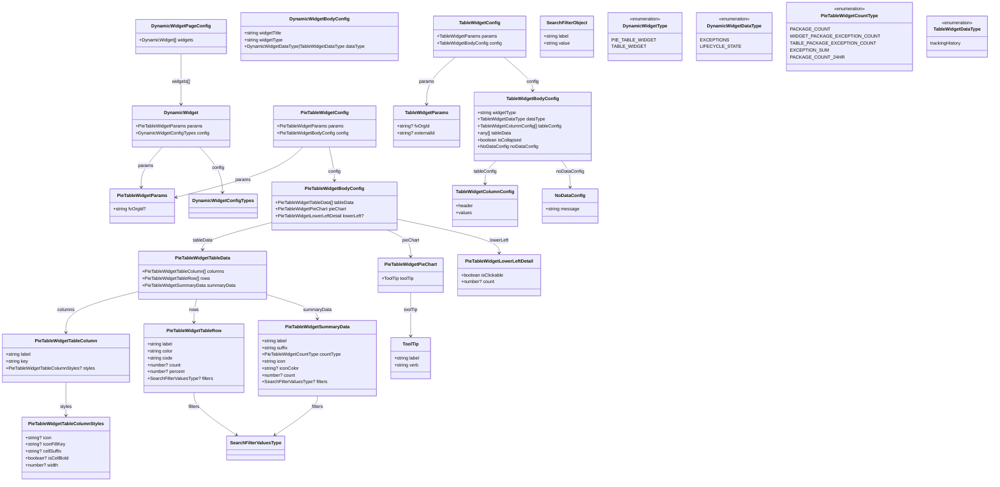

# Diagram: web/portal/src/pages/partview/utils/dynamicWidgetDataTypes.ts

> Auto-generated by Obscura crawlers

## Mermaid

```mermaid
classDiagram
class DynamicWidgetPageConfig {
  +DynamicWidget[] widgets
}
class DynamicWidget {
  +PieTableWidgetParams params
  +DynamicWidgetConfigTypes config
}
class PieTableWidgetParams {
  +string fvOrgId?
}
class DynamicWidgetBodyConfig {
  +string widgetTitle
  +string widgetType
  +DynamicWidgetDataType|TableWidgetDataType dataType
}
class PieTableWidgetConfig {
  +PieTableWidgetParams params
  +PieTableWidgetBodyConfig config
}
class PieTableWidgetBodyConfig {
  +PieTableWidgetTableData[] tableData
  +PieTableWidgetPieChart pieChart
  +PieTableWidgetLowerLeftDetail lowerLeft?
}
class PieTableWidgetTableData {
  +PieTableWidgetTableColumn[] columns
  +PieTableWidgetTableRow[] rows
  +PieTableWidgetSummaryData summaryData
}
class PieTableWidgetTableColumn {
  +string label
  +string key
  +PieTableWidgetTableColumnStyles? styles
}
class PieTableWidgetTableColumnStyles {
  +string? icon
  +string? iconFillKey
  +string? cellSuffix
  +boolean? isCellBold
  +number? width
}
class PieTableWidgetTableRow {
  +string label
  +string color
  +string code
  +number? count
  +number? percent
  +SearchFilterValuesType? filters
}
class PieTableWidgetSummaryData {
  +string label
  +string suffix
  +PieTableWidgetCountType countType
  +string icon
  +string? iconColor
  +number? count
  +SearchFilterValuesType? filters
}
class PieTableWidgetLowerLeftDetail {
  +boolean isClickable
  +number? count
}
class PieTableWidgetPieChart {
  +ToolTip toolTip
}
class ToolTip {
  +string label
  +string verb
}
class TableWidgetConfig {
  +TableWidgetParams params
  +TableWidgetBodyConfig config
}
class TableWidgetParams {
  +string? fvOrgId
  +string? externalId
}
class TableWidgetBodyConfig {
  +string widgetType
  +TableWidgetDataType dataType
  +TableWidgetColumnConfig[] tableConfig
  +any[] tableData
  +boolean isCollapsed
  +NoDataConfig noDataConfig
}
class TableWidgetColumnConfig {
  +header
  +values
}
class NoDataConfig {
  +string message
}
class SearchFilterObject {
  +string label
  +string value
}
class SearchFilterValuesType
class DynamicWidgetConfigTypes
class DynamicWidgetType <<enumeration>> {
  PIE_TABLE_WIDGET
  TABLE_WIDGET
}
class DynamicWidgetDataType <<enumeration>> {
  EXCEPTIONS
  LIFECYCLE_STATE
}
class PieTableWidgetCountType <<enumeration>> {
  PACKAGE_COUNT
  WIDGET_PACKAGE_EXCEPTION_COUNT
  TABLE_PACKAGE_EXCEPTION_COUNT
  EXCEPTION_SUM
  PACKAGE_COUNT_24HR
}
class TableWidgetDataType <<enumeration>> {
  trackingHistory
}
DynamicWidgetPageConfig --> DynamicWidget : widgets[]
DynamicWidget --> PieTableWidgetParams : params
DynamicWidget --> DynamicWidgetConfigTypes : config
PieTableWidgetConfig --> PieTableWidgetParams : params
PieTableWidgetConfig --> PieTableWidgetBodyConfig : config
PieTableWidgetBodyConfig --> PieTableWidgetTableData : tableData
PieTableWidgetBodyConfig --> PieTableWidgetPieChart : pieChart
PieTableWidgetBodyConfig --> PieTableWidgetLowerLeftDetail : lowerLeft
PieTableWidgetTableData --> PieTableWidgetTableColumn : columns
PieTableWidgetTableData --> PieTableWidgetTableRow : rows
PieTableWidgetTableData --> PieTableWidgetSummaryData : summaryData
PieTableWidgetTableColumn --> PieTableWidgetTableColumnStyles : styles
PieTableWidgetTableRow --> SearchFilterValuesType : filters
PieTableWidgetSummaryData --> SearchFilterValuesType : filters
PieTableWidgetPieChart --> ToolTip : toolTip
TableWidgetConfig --> TableWidgetParams : params
TableWidgetConfig --> TableWidgetBodyConfig : config
TableWidgetBodyConfig --> TableWidgetColumnConfig : tableConfig
TableWidgetBodyConfig --> NoDataConfig : noDataConfig
```

> SVG rendering failed for this diagram.
