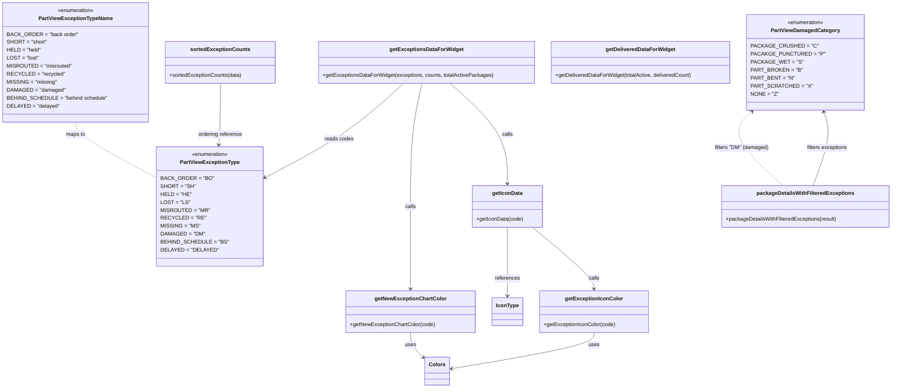

# Diagram: web/portal/src/pages/partview/utils/exceptions.utils.js

> Auto-generated by Obscura crawlers

## Mermaid

```mermaid
classDiagram
class PartViewExceptionType <<enumeration>> {
  BACK_ORDER = "BO"
  SHORT = "SH"
  HELD = "HE"
  LOST = "LS"
  MISROUTED = "MR"
  RECYCLED = "RE"
  MISSING = "MS"
  DAMAGED = "DM"
  BEHIND_SCHEDULE = "BS"
  DELAYED = "DELAYED"
}
class PartViewExceptionTypeName <<enumeration>> {
  BACK_ORDER = "back order"
  SHORT = "short"
  HELD = "held"
  LOST = "lost"
  MISROUTED = "misrouted"
  RECYCLED = "recycled"
  MISSING = "missing"
  DAMAGED = "damaged"
  BEHIND_SCHEDULE = "behind schedule"
  DELAYED = "delayed"
}
class PartViewDamagedCategory <<enumeration>> {
  PACKAGE_CRUSHED = "C"
  PACAKGE_PUNCTURED = "P"
  PACKAGE_WET = "S"
  PART_BROKEN = "B"
  PART_BENT = "N"
  PART_SCRATCHED = "X"
  NONE = "Z"
}
class Colors
class IconType
class getExceptionIconColor {
  +getExceptionIconColor(code)
}
class getNewExceptionChartColor {
  +getNewExceptionChartColor(code)
}
class getIconData {
  +getIconData(code)
}
class getExceptionsDataForWidget {
  +getExceptionsDataForWidget(exceptions, counts, totalActivePackages)
}
class getDeliveredDataForWidget {
  +getDeliveredDataForWidget(totalActive, deliveredCount)
}
class packageDetailsWithFilteredExceptions {
  +packageDetailsWithFilteredExceptions(result)
}
class sortedExceptionCounts {
  +sortedExceptionCounts(data)
}

getExceptionIconColor --> Colors : uses
getNewExceptionChartColor --> Colors : uses
getIconData --> getExceptionIconColor : calls
getIconData --> IconType : references
getExceptionsDataForWidget --> getIconData : calls
getExceptionsDataForWidget --> getNewExceptionChartColor : calls
getExceptionsDataForWidget --> PartViewExceptionType : reads codes
packageDetailsWithFilteredExceptions ..> PartViewDamagedCategory : filters "DM" (damaged)
sortedExceptionCounts --> PartViewExceptionType : ordering reference
PartViewExceptionTypeName .. PartViewExceptionType : maps to
PartViewDamagedCategory <-- packageDetailsWithFilteredExceptions : filters exceptions
```

> SVG rendering failed for this diagram.
